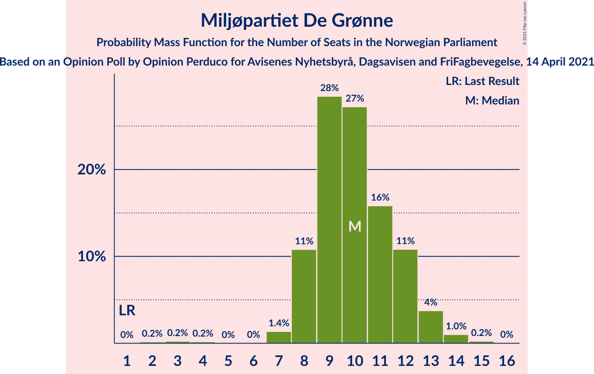
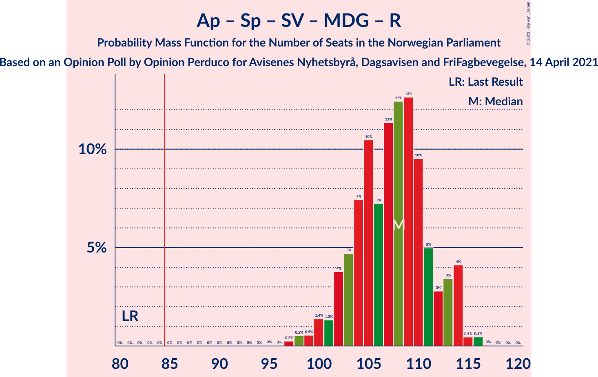
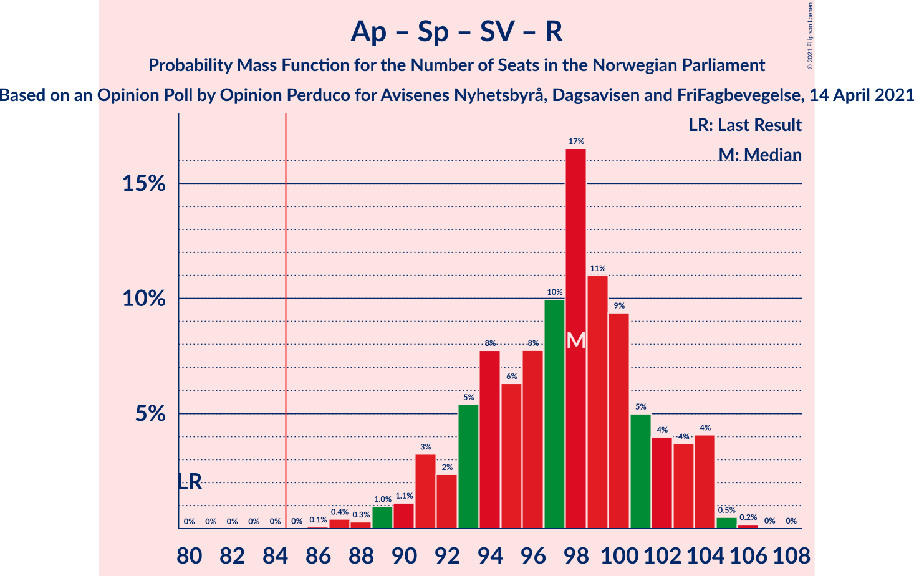
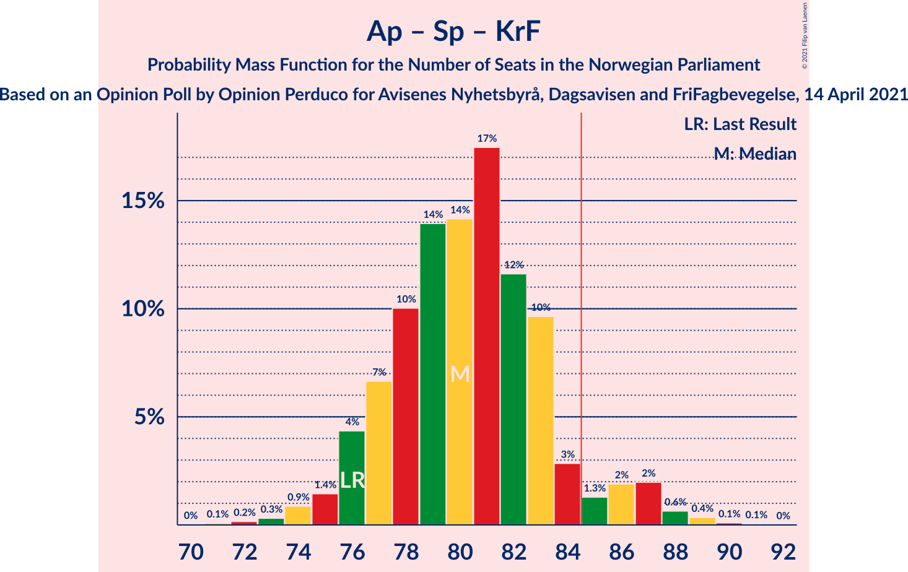
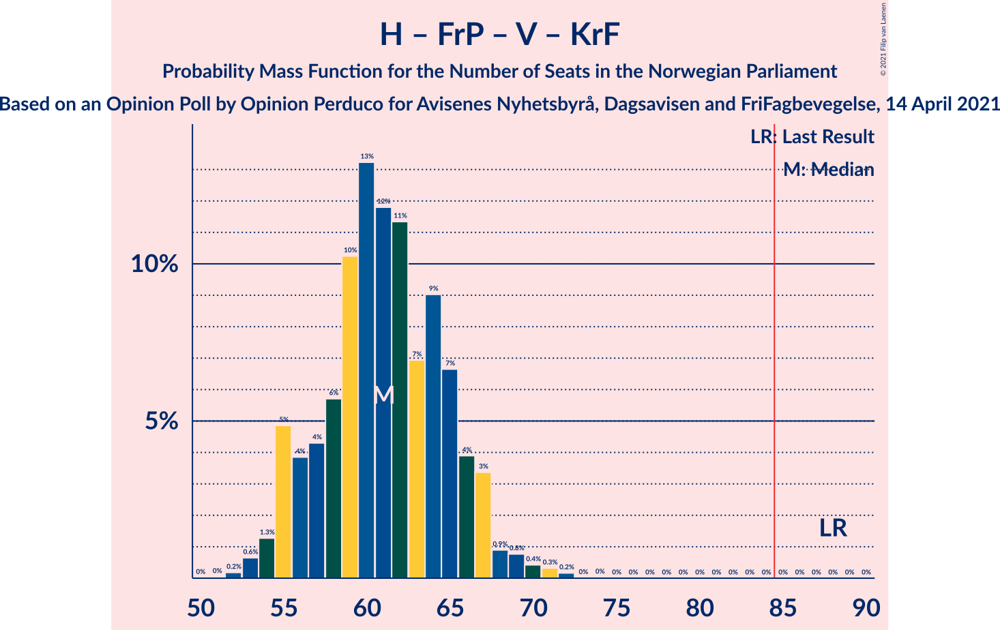

# Opinion Poll by Opinion Perduco for Avisenes Nyhetsbyrå, Dagsavisen and FriFagbevegelse, 14 April 2021

<a href="#voting-intentions">Voting Intentions</a> | <a href="#seats">Seats</a> | <a href="#coalitions">Coalitions</a> | <a href="#technical-information">Technical Information</a>

## Voting Intentions

### Confidence Intervals

| Party | Last Result | Poll Result | 80% Confidence Interval | 90% Confidence Interval | 95% Confidence Interval | 99% Confidence Interval |
|:-----:|:-----------:|:-----------:|:-----------------------:|:-----------------------:|:-----------------------:|:-----------------------:|
| Arbeiderpartiet | 27.4% | 23.0% | 21.3–24.9% |20.9–25.4% |20.5–25.8% |19.7–26.7% |
| Høyre | 25.0% | 21.7% | 20.0–23.5% |19.5–24.0% |19.1–24.4% |18.4–25.3% |
| Senterpartiet | 10.3% | 19.0% | 17.4–20.7% |17.0–21.2% |16.6–21.6% |15.9–22.5% |
| Fremskrittspartiet | 15.2% | 9.4% | 8.3–10.8% |8.0–11.2% |7.7–11.5% |7.2–12.2% |
| Sosialistisk Venstreparti | 6.0% | 7.6% | 6.6–8.9% |6.4–9.2% |6.1–9.5% |5.7–10.2% |
| Miljøpartiet De Grønne | 3.2% | 5.7% | 4.9–6.8% |4.6–7.1% |4.4–7.4% |4.0–8.0% |
| Rødt | 2.4% | 4.0% | 3.3–5.0% |3.1–5.3% |3.0–5.5% |2.6–6.0% |
| Venstre | 4.4% | 3.3% | 2.7–4.2% |2.5–4.4% |2.3–4.6% |2.1–5.1% |
| Kristelig Folkeparti | 4.2% | 3.1% | 2.5–3.9% |2.3–4.2% |2.1–4.4% |1.9–4.8% |

*Note:* The poll result column reflects the actual value used in the calculations. Published results may vary slightly, and in addition be rounded to fewer digits.

## Seats

### Confidence Intervals

| Party | Last Result | Median | 80% Confidence Interval | 90% Confidence Interval | 95% Confidence Interval | 99% Confidence Interval |
|:-----:|:-----------:|:------:|:-----------------------:|:-----------------------:|:-----------------------:|:-----------------------:|
| <a href="#arbeiderpartiet">Arbeiderpartiet</a> | 49 | 42 | 40–45 |38–47 |38–48 |36–50 |
| <a href="#høyre">Høyre</a> | 45 | 39 | 35–42 |34–42 |34–44 |33–45 |
| <a href="#senterpartiet">Senterpartiet</a> | 19 | 36 | 34–38 |33–39 |32–40 |30–41 |
| <a href="#fremskrittspartiet">Fremskrittspartiet</a> | 27 | 17 | 15–19 |14–19 |13–20 |12–22 |
| <a href="#sosialistisk-venstreparti">Sosialistisk Venstreparti</a> | 11 | 13 | 11–16 |11–17 |10–17 |9–18 |
| <a href="#miljøpartiet-de-grønne">Miljøpartiet De Grønne</a> | 1 | 10 | 8–13 |8–13 |8–13 |3–15 |
| <a href="#rødt">Rødt</a> | 1 | 7 | 1–10 |1–10 |1–10 |1–11 |
| <a href="#venstre">Venstre</a> | 8 | 2 | 2–7 |1–8 |1–8 |1–9 |
| <a href="#kristelig-folkeparti">Kristelig Folkeparti</a> | 8 | 1 | 1–3 |0–7 |0–7 |0–8 |

### Arbeiderpartiet

*For a full overview of the results for this party, see the [Arbeiderpartiet](party-arbeiderpartiet.html) page.*

| Number of Seats | Probability | Accumulated | Special Marks |
|:---------------:|:-----------:|:-----------:|:-------------:|
| 33 | 0% | 100% |  |
| 34 | 0.1% | 99.9% |  |
| 35 | 0.2% | 99.8% |  |
| 36 | 0.4% | 99.6% |  |
| 37 | 2% | 99.1% |  |
| 38 | 3% | 98% |  |
| 39 | 5% | 95% |  |
| 40 | 15% | 90% |  |
| 41 | 20% | 75% |  |
| 42 | 6% | 55% | Median |
| 43 | 5% | 48% |  |
| 44 | 23% | 43% |  |
| 45 | 12% | 20% |  |
| 46 | 1.0% | 8% |  |
| 47 | 4% | 7% |  |
| 48 | 2% | 3% |  |
| 49 | 0.6% | 1.2% | Last Result |
| 50 | 0.5% | 0.6% |  |
| 51 | 0.1% | 0.1% |  |
| 52 | 0% | 0% |  |

### Høyre

*For a full overview of the results for this party, see the [Høyre](party-høyre.html) page.*

| Number of Seats | Probability | Accumulated | Special Marks |
|:---------------:|:-----------:|:-----------:|:-------------:|
| 31 | 0.1% | 100% |  |
| 32 | 0.2% | 99.9% |  |
| 33 | 0.7% | 99.8% |  |
| 34 | 5% | 99.1% |  |
| 35 | 10% | 94% |  |
| 36 | 5% | 84% |  |
| 37 | 15% | 79% |  |
| 38 | 10% | 64% |  |
| 39 | 8% | 54% | Median |
| 40 | 9% | 46% |  |
| 41 | 24% | 37% |  |
| 42 | 9% | 13% |  |
| 43 | 1.0% | 4% |  |
| 44 | 2% | 3% |  |
| 45 | 0.6% | 0.9% | Last Result |
| 46 | 0.2% | 0.3% |  |
| 47 | 0.1% | 0.1% |  |
| 48 | 0% | 0% |  |

### Senterpartiet

*For a full overview of the results for this party, see the [Senterpartiet](party-senterpartiet.html) page.*

| Number of Seats | Probability | Accumulated | Special Marks |
|:---------------:|:-----------:|:-----------:|:-------------:|
| 19 | 0% | 100% | Last Result |
| 20 | 0% | 100% |  |
| 21 | 0% | 100% |  |
| 22 | 0% | 100% |  |
| 23 | 0% | 100% |  |
| 24 | 0% | 100% |  |
| 25 | 0% | 100% |  |
| 26 | 0% | 100% |  |
| 27 | 0% | 100% |  |
| 28 | 0.2% | 100% |  |
| 29 | 0.2% | 99.8% |  |
| 30 | 0.3% | 99.6% |  |
| 31 | 2% | 99.2% |  |
| 32 | 1.3% | 98% |  |
| 33 | 4% | 96% |  |
| 34 | 9% | 92% |  |
| 35 | 19% | 83% |  |
| 36 | 32% | 64% | Median |
| 37 | 17% | 32% |  |
| 38 | 7% | 15% |  |
| 39 | 5% | 8% |  |
| 40 | 1.5% | 3% |  |
| 41 | 1.2% | 2% |  |
| 42 | 0.2% | 0.5% |  |
| 43 | 0.1% | 0.2% |  |
| 44 | 0.1% | 0.1% |  |
| 45 | 0% | 0% |  |

### Fremskrittspartiet

*For a full overview of the results for this party, see the [Fremskrittspartiet](party-fremskrittspartiet.html) page.*

| Number of Seats | Probability | Accumulated | Special Marks |
|:---------------:|:-----------:|:-----------:|:-------------:|
| 11 | 0.1% | 100% |  |
| 12 | 0.6% | 99.9% |  |
| 13 | 4% | 99.3% |  |
| 14 | 5% | 96% |  |
| 15 | 12% | 90% |  |
| 16 | 18% | 78% |  |
| 17 | 31% | 60% | Median |
| 18 | 15% | 29% |  |
| 19 | 9% | 13% |  |
| 20 | 2% | 4% |  |
| 21 | 1.3% | 2% |  |
| 22 | 0.6% | 0.9% |  |
| 23 | 0.2% | 0.3% |  |
| 24 | 0.1% | 0.1% |  |
| 25 | 0% | 0% |  |
| 26 | 0% | 0% |  |
| 27 | 0% | 0% | Last Result |

### Sosialistisk Venstreparti

*For a full overview of the results for this party, see the [Sosialistisk Venstreparti](party-sosialistiskvenstreparti.html) page.*

| Number of Seats | Probability | Accumulated | Special Marks |
|:---------------:|:-----------:|:-----------:|:-------------:|
| 9 | 0.5% | 100% |  |
| 10 | 3% | 99.5% |  |
| 11 | 10% | 97% | Last Result |
| 12 | 22% | 87% |  |
| 13 | 14% | 64% | Median |
| 14 | 7% | 50% |  |
| 15 | 17% | 43% |  |
| 16 | 21% | 27% |  |
| 17 | 4% | 5% |  |
| 18 | 1.4% | 2% |  |
| 19 | 0.3% | 0.3% |  |
| 20 | 0% | 0% |  |

### Miljøpartiet De Grønne

*For a full overview of the results for this party, see the [Miljøpartiet De Grønne](party-miljøpartietdegrønne.html) page.*

| Number of Seats | Probability | Accumulated | Special Marks |
|:---------------:|:-----------:|:-----------:|:-------------:|
| 1 | 0% | 100% | Last Result |
| 2 | 0.3% | 100% |  |
| 3 | 0.4% | 99.7% |  |
| 4 | 0.1% | 99.4% |  |
| 5 | 0% | 99.3% |  |
| 6 | 0% | 99.3% |  |
| 7 | 2% | 99.2% |  |
| 8 | 13% | 98% |  |
| 9 | 26% | 85% |  |
| 10 | 15% | 59% | Median |
| 11 | 20% | 44% |  |
| 12 | 13% | 24% |  |
| 13 | 9% | 11% |  |
| 14 | 1.2% | 2% |  |
| 15 | 0.8% | 1.0% |  |
| 16 | 0.1% | 0.1% |  |
| 17 | 0% | 0% |  |

### Rødt

*For a full overview of the results for this party, see the [Rødt](party-rødt.html) page.*

| Number of Seats | Probability | Accumulated | Special Marks |
|:---------------:|:-----------:|:-----------:|:-------------:|
| 1 | 15% | 100% | Last Result |
| 2 | 27% | 85% |  |
| 3 | 0% | 58% |  |
| 4 | 0% | 58% |  |
| 5 | 0% | 58% |  |
| 6 | 0.5% | 58% |  |
| 7 | 22% | 57% | Median |
| 8 | 16% | 35% |  |
| 9 | 6% | 19% |  |
| 10 | 11% | 13% |  |
| 11 | 2% | 2% |  |
| 12 | 0.2% | 0.2% |  |
| 13 | 0% | 0% |  |

### Venstre

*For a full overview of the results for this party, see the [Venstre](party-venstre.html) page.*

| Number of Seats | Probability | Accumulated | Special Marks |
|:---------------:|:-----------:|:-----------:|:-------------:|
| 0 | 0.2% | 100% |  |
| 1 | 5% | 99.8% |  |
| 2 | 68% | 94% | Median |
| 3 | 2% | 26% |  |
| 4 | 0% | 24% |  |
| 5 | 0% | 24% |  |
| 6 | 2% | 24% |  |
| 7 | 16% | 22% |  |
| 8 | 5% | 6% | Last Result |
| 9 | 1.4% | 2% |  |
| 10 | 0.3% | 0.3% |  |
| 11 | 0% | 0% |  |

### Kristelig Folkeparti

*For a full overview of the results for this party, see the [Kristelig Folkeparti](party-kristeligfolkeparti.html) page.*

| Number of Seats | Probability | Accumulated | Special Marks |
|:---------------:|:-----------:|:-----------:|:-------------:|
| 0 | 6% | 100% |  |
| 1 | 47% | 94% | Median |
| 2 | 13% | 47% |  |
| 3 | 26% | 34% |  |
| 4 | 0% | 8% |  |
| 5 | 0% | 8% |  |
| 6 | 2% | 8% |  |
| 7 | 4% | 5% |  |
| 8 | 1.5% | 2% | Last Result |
| 9 | 0.2% | 0.2% |  |
| 10 | 0% | 0% |  |

## Coalitions

### Confidence Intervals

| Coalition | Last Result | Median | Majority? | 80% Confidence Interval | 90% Confidence Interval | 95% Confidence Interval | 99% Confidence Interval |
|:---------:|:-----------:|:------:|:---------:|:-----------------------:|:-----------------------:|:-----------------------:|:-----------------------:|
| Arbeiderpartiet – Senterpartiet – Sosialistisk Venstreparti – Miljøpartiet De Grønne – Rødt | 81 | 108 | 100% | 104–112 | 102–114 | 101–114 | 98–116 |
| Arbeiderpartiet – Senterpartiet – Sosialistisk Venstreparti – Miljøpartiet De Grønne – Kristelig Folkeparti | 88 | 104 | 100% | 99–110 | 97–112 | 96–113 | 95–114 |
| Arbeiderpartiet – Senterpartiet – Sosialistisk Venstreparti – Miljøpartiet De Grønne | 80 | 102 | 100% | 97–108 | 96–109 | 95–110 | 93–112 |
| Arbeiderpartiet – Senterpartiet – Sosialistisk Venstreparti – Rødt | 80 | 97 | 100% | 93–102 | 92–103 | 91–104 | 88–105 |
| Høyre – Senterpartiet – Fremskrittspartiet – Venstre – Kristelig Folkeparti | 107 | 97 | 100% | 91–101 | 90–103 | 89–103 | 87–108 |
| Arbeiderpartiet – Senterpartiet – Sosialistisk Venstreparti | 79 | 92 | 98% | 88–97 | 87–98 | 85–99 | 84–101 |
| Arbeiderpartiet – Senterpartiet – Miljøpartiet De Grønne – Kristelig Folkeparti | 77 | 91 | 97% | 86–94 | 85–96 | 84–97 | 81–100 |
| Arbeiderpartiet – Senterpartiet – Kristelig Folkeparti | 76 | 81 | 8% | 77–84 | 76–86 | 74–87 | 72–89 |
| Arbeiderpartiet – Senterpartiet | 68 | 78 | 1.3% | 76–81 | 74–82 | 73–83 | 70–86 |
| Høyre – Fremskrittspartiet – Miljøpartiet De Grønne – Venstre – Kristelig Folkeparti | 89 | 71 | 0% | 67–75 | 65–76 | 64–78 | 61–80 |
| Høyre – Fremskrittspartiet – Venstre – Kristelig Folkeparti | 88 | 61 | 0% | 56–65 | 55–66 | 53–68 | 52–71 |
| Høyre – Fremskrittspartiet – Venstre | 80 | 59 | 0% | 54–63 | 52–64 | 51–66 | 49–68 |
| Arbeiderpartiet – Sosialistisk Venstreparti | 60 | 56 | 0% | 51–60 | 50–62 | 49–64 | 48–65 |
| Høyre – Fremskrittspartiet | 72 | 56 | 0% | 51–60 | 50–60 | 49–61 | 47–64 |
| Høyre – Venstre – Kristelig Folkeparti | 61 | 44 | 0% | 40–48 | 38–50 | 38–51 | 36–53 |
| Senterpartiet – Venstre – Kristelig Folkeparti | 35 | 40 | 0% | 37–47 | 36–48 | 35–49 | 33–51 |

### Arbeiderpartiet – Senterpartiet – Sosialistisk Venstreparti – Miljøpartiet De Grønne – Rødt

| Number of Seats | Probability | Accumulated | Special Marks |
|:---------------:|:-----------:|:-----------:|:-------------:|
| 81 | 0% | 100% | Last Result |
| 82 | 0% | 100% |  |
| 83 | 0% | 100% |  |
| 84 | 0% | 100% |  |
| 85 | 0% | 100% | Majority |
| 86 | 0% | 100% |  |
| 87 | 0% | 100% |  |
| 88 | 0% | 100% |  |
| 89 | 0% | 100% |  |
| 90 | 0% | 100% |  |
| 91 | 0% | 100% |  |
| 92 | 0% | 100% |  |
| 93 | 0% | 100% |  |
| 94 | 0% | 100% |  |
| 95 | 0.1% | 100% |  |
| 96 | 0.1% | 99.8% |  |
| 97 | 0.1% | 99.8% |  |
| 98 | 0.4% | 99.7% |  |
| 99 | 0.4% | 99.3% |  |
| 100 | 0.8% | 98.9% |  |
| 101 | 2% | 98% |  |
| 102 | 2% | 97% |  |
| 103 | 4% | 95% |  |
| 104 | 5% | 91% |  |
| 105 | 10% | 85% |  |
| 106 | 12% | 76% |  |
| 107 | 8% | 64% |  |
| 108 | 18% | 55% | Median |
| 109 | 9% | 37% |  |
| 110 | 10% | 28% |  |
| 111 | 7% | 18% |  |
| 112 | 3% | 11% |  |
| 113 | 1.4% | 8% |  |
| 114 | 4% | 7% |  |
| 115 | 0.8% | 2% |  |
| 116 | 2% | 2% |  |
| 117 | 0.1% | 0.1% |  |
| 118 | 0% | 0% |  |

### Arbeiderpartiet – Senterpartiet – Sosialistisk Venstreparti – Miljøpartiet De Grønne – Kristelig Folkeparti

| Number of Seats | Probability | Accumulated | Special Marks |
|:---------------:|:-----------:|:-----------:|:-------------:|
| 88 | 0% | 100% | Last Result |
| 89 | 0% | 100% |  |
| 90 | 0% | 100% |  |
| 91 | 0% | 100% |  |
| 92 | 0% | 100% |  |
| 93 | 0.2% | 100% |  |
| 94 | 0.2% | 99.8% |  |
| 95 | 0.4% | 99.6% |  |
| 96 | 2% | 99.2% |  |
| 97 | 3% | 97% |  |
| 98 | 4% | 94% |  |
| 99 | 4% | 90% |  |
| 100 | 13% | 86% |  |
| 101 | 7% | 73% |  |
| 102 | 8% | 67% | Median |
| 103 | 7% | 58% |  |
| 104 | 3% | 51% |  |
| 105 | 3% | 49% |  |
| 106 | 4% | 46% |  |
| 107 | 7% | 42% |  |
| 108 | 16% | 35% |  |
| 109 | 8% | 20% |  |
| 110 | 5% | 12% |  |
| 111 | 1.4% | 7% |  |
| 112 | 2% | 5% |  |
| 113 | 3% | 3% |  |
| 114 | 0.2% | 0.6% |  |
| 115 | 0.3% | 0.4% |  |
| 116 | 0.1% | 0.1% |  |
| 117 | 0% | 0% |  |

### Arbeiderpartiet – Senterpartiet – Sosialistisk Venstreparti – Miljøpartiet De Grønne

| Number of Seats | Probability | Accumulated | Special Marks |
|:---------------:|:-----------:|:-----------:|:-------------:|
| 80 | 0% | 100% | Last Result |
| 81 | 0% | 100% |  |
| 82 | 0% | 100% |  |
| 83 | 0% | 100% |  |
| 84 | 0% | 100% |  |
| 85 | 0% | 100% | Majority |
| 86 | 0% | 100% |  |
| 87 | 0% | 100% |  |
| 88 | 0% | 100% |  |
| 89 | 0% | 100% |  |
| 90 | 0% | 100% |  |
| 91 | 0.1% | 100% |  |
| 92 | 0.3% | 99.9% |  |
| 93 | 0.5% | 99.6% |  |
| 94 | 0.7% | 99.0% |  |
| 95 | 2% | 98% |  |
| 96 | 5% | 96% |  |
| 97 | 9% | 91% |  |
| 98 | 10% | 81% |  |
| 99 | 7% | 72% |  |
| 100 | 7% | 65% |  |
| 101 | 3% | 58% | Median |
| 102 | 8% | 55% |  |
| 103 | 3% | 47% |  |
| 104 | 6% | 44% |  |
| 105 | 4% | 38% |  |
| 106 | 6% | 34% |  |
| 107 | 17% | 28% |  |
| 108 | 4% | 11% |  |
| 109 | 4% | 7% |  |
| 110 | 0.9% | 3% |  |
| 111 | 0.3% | 2% |  |
| 112 | 1.5% | 2% |  |
| 113 | 0.1% | 0.1% |  |
| 114 | 0% | 0% |  |

### Arbeiderpartiet – Senterpartiet – Sosialistisk Venstreparti – Rødt

| Number of Seats | Probability | Accumulated | Special Marks |
|:---------------:|:-----------:|:-----------:|:-------------:|
| 80 | 0% | 100% | Last Result |
| 81 | 0% | 100% |  |
| 82 | 0% | 100% |  |
| 83 | 0% | 100% |  |
| 84 | 0% | 100% |  |
| 85 | 0% | 100% | Majority |
| 86 | 0.1% | 100% |  |
| 87 | 0.2% | 99.9% |  |
| 88 | 0.2% | 99.6% |  |
| 89 | 0.6% | 99.5% |  |
| 90 | 0.6% | 98.9% |  |
| 91 | 2% | 98% |  |
| 92 | 2% | 96% |  |
| 93 | 5% | 95% |  |
| 94 | 6% | 90% |  |
| 95 | 3% | 84% |  |
| 96 | 17% | 81% |  |
| 97 | 16% | 64% |  |
| 98 | 13% | 48% | Median |
| 99 | 10% | 34% |  |
| 100 | 9% | 25% |  |
| 101 | 6% | 16% |  |
| 102 | 4% | 10% |  |
| 103 | 3% | 6% |  |
| 104 | 3% | 4% |  |
| 105 | 0.5% | 0.8% |  |
| 106 | 0.3% | 0.4% |  |
| 107 | 0% | 0.1% |  |
| 108 | 0% | 0% |  |

### Høyre – Senterpartiet – Fremskrittspartiet – Venstre – Kristelig Folkeparti

| Number of Seats | Probability | Accumulated | Special Marks |
|:---------------:|:-----------:|:-----------:|:-------------:|
| 85 | 0% | 100% | Majority |
| 86 | 0.1% | 99.9% |  |
| 87 | 0.5% | 99.8% |  |
| 88 | 1.5% | 99.3% |  |
| 89 | 2% | 98% |  |
| 90 | 3% | 96% |  |
| 91 | 3% | 93% |  |
| 92 | 4% | 90% |  |
| 93 | 6% | 86% |  |
| 94 | 6% | 80% |  |
| 95 | 6% | 75% | Median |
| 96 | 13% | 68% |  |
| 97 | 12% | 55% |  |
| 98 | 8% | 42% |  |
| 99 | 11% | 35% |  |
| 100 | 13% | 24% |  |
| 101 | 5% | 11% |  |
| 102 | 2% | 7% |  |
| 103 | 3% | 5% |  |
| 104 | 0.4% | 2% |  |
| 105 | 0.4% | 2% |  |
| 106 | 0.6% | 2% |  |
| 107 | 0.4% | 0.9% | Last Result |
| 108 | 0.4% | 0.5% |  |
| 109 | 0.1% | 0.2% |  |
| 110 | 0.1% | 0.1% |  |
| 111 | 0% | 0% |  |

### Arbeiderpartiet – Senterpartiet – Sosialistisk Venstreparti

| Number of Seats | Probability | Accumulated | Special Marks |
|:---------------:|:-----------:|:-----------:|:-------------:|
| 79 | 0% | 100% | Last Result |
| 80 | 0% | 100% |  |
| 81 | 0.1% | 100% |  |
| 82 | 0.1% | 99.9% |  |
| 83 | 0.2% | 99.8% |  |
| 84 | 1.3% | 99.5% |  |
| 85 | 2% | 98% | Majority |
| 86 | 1.2% | 97% |  |
| 87 | 4% | 95% |  |
| 88 | 11% | 91% |  |
| 89 | 11% | 80% |  |
| 90 | 8% | 70% |  |
| 91 | 10% | 62% | Median |
| 92 | 6% | 52% |  |
| 93 | 6% | 46% |  |
| 94 | 8% | 40% |  |
| 95 | 9% | 31% |  |
| 96 | 12% | 23% |  |
| 97 | 4% | 10% |  |
| 98 | 3% | 6% |  |
| 99 | 2% | 3% |  |
| 100 | 0.7% | 2% |  |
| 101 | 0.6% | 1.0% |  |
| 102 | 0.3% | 0.4% |  |
| 103 | 0% | 0.1% |  |
| 104 | 0% | 0% |  |

### Arbeiderpartiet – Senterpartiet – Miljøpartiet De Grønne – Kristelig Folkeparti

| Number of Seats | Probability | Accumulated | Special Marks |
|:---------------:|:-----------:|:-----------:|:-------------:|
| 77 | 0% | 100% | Last Result |
| 78 | 0% | 100% |  |
| 79 | 0.1% | 99.9% |  |
| 80 | 0.2% | 99.9% |  |
| 81 | 0.3% | 99.7% |  |
| 82 | 0.5% | 99.4% |  |
| 83 | 0.3% | 98.9% |  |
| 84 | 1.2% | 98.6% |  |
| 85 | 3% | 97% | Majority |
| 86 | 5% | 95% |  |
| 87 | 4% | 89% |  |
| 88 | 14% | 85% |  |
| 89 | 11% | 71% | Median |
| 90 | 9% | 60% |  |
| 91 | 6% | 51% |  |
| 92 | 19% | 46% |  |
| 93 | 10% | 27% |  |
| 94 | 8% | 17% |  |
| 95 | 1.4% | 9% |  |
| 96 | 3% | 7% |  |
| 97 | 2% | 4% |  |
| 98 | 1.2% | 2% |  |
| 99 | 0.4% | 1.2% |  |
| 100 | 0.3% | 0.8% |  |
| 101 | 0.4% | 0.5% |  |
| 102 | 0.1% | 0.1% |  |
| 103 | 0% | 0.1% |  |
| 104 | 0% | 0% |  |

### Arbeiderpartiet – Senterpartiet – Kristelig Folkeparti

| Number of Seats | Probability | Accumulated | Special Marks |
|:---------------:|:-----------:|:-----------:|:-------------:|
| 69 | 0% | 100% |  |
| 70 | 0% | 99.9% |  |
| 71 | 0.2% | 99.9% |  |
| 72 | 0.3% | 99.7% |  |
| 73 | 0.5% | 99.4% |  |
| 74 | 2% | 98.9% |  |
| 75 | 2% | 97% |  |
| 76 | 3% | 95% | Last Result |
| 77 | 5% | 93% |  |
| 78 | 7% | 88% |  |
| 79 | 21% | 80% | Median |
| 80 | 7% | 59% |  |
| 81 | 26% | 53% |  |
| 82 | 9% | 27% |  |
| 83 | 4% | 17% |  |
| 84 | 5% | 13% |  |
| 85 | 3% | 8% | Majority |
| 86 | 2% | 5% |  |
| 87 | 2% | 3% |  |
| 88 | 0.5% | 1.1% |  |
| 89 | 0.3% | 0.6% |  |
| 90 | 0.1% | 0.3% |  |
| 91 | 0.1% | 0.2% |  |
| 92 | 0% | 0% |  |

### Arbeiderpartiet – Senterpartiet

| Number of Seats | Probability | Accumulated | Special Marks |
|:---------------:|:-----------:|:-----------:|:-------------:|
| 67 | 0% | 100% |  |
| 68 | 0.1% | 99.9% | Last Result |
| 69 | 0.1% | 99.8% |  |
| 70 | 0.3% | 99.7% |  |
| 71 | 0.4% | 99.4% |  |
| 72 | 0.9% | 99.1% |  |
| 73 | 2% | 98% |  |
| 74 | 2% | 96% |  |
| 75 | 3% | 94% |  |
| 76 | 15% | 91% |  |
| 77 | 14% | 77% |  |
| 78 | 18% | 63% | Median |
| 79 | 8% | 45% |  |
| 80 | 21% | 37% |  |
| 81 | 7% | 15% |  |
| 82 | 4% | 8% |  |
| 83 | 2% | 4% |  |
| 84 | 1.1% | 2% |  |
| 85 | 0.6% | 1.3% | Majority |
| 86 | 0.4% | 0.7% |  |
| 87 | 0.1% | 0.3% |  |
| 88 | 0.1% | 0.2% |  |
| 89 | 0% | 0% |  |

### Høyre – Fremskrittspartiet – Miljøpartiet De Grønne – Venstre – Kristelig Folkeparti

| Number of Seats | Probability | Accumulated | Special Marks |
|:---------------:|:-----------:|:-----------:|:-------------:|
| 59 | 0.1% | 100% |  |
| 60 | 0% | 99.9% |  |
| 61 | 0.5% | 99.9% |  |
| 62 | 0.3% | 99.4% |  |
| 63 | 0.7% | 99.1% |  |
| 64 | 1.0% | 98% |  |
| 65 | 4% | 97% |  |
| 66 | 4% | 94% |  |
| 67 | 5% | 90% |  |
| 68 | 7% | 85% |  |
| 69 | 9% | 78% | Median |
| 70 | 10% | 70% |  |
| 71 | 13% | 60% |  |
| 72 | 15% | 47% |  |
| 73 | 16% | 32% |  |
| 74 | 2% | 16% |  |
| 75 | 5% | 14% |  |
| 76 | 5% | 9% |  |
| 77 | 1.5% | 5% |  |
| 78 | 2% | 3% |  |
| 79 | 0.5% | 1.4% |  |
| 80 | 0.5% | 0.9% |  |
| 81 | 0.1% | 0.4% |  |
| 82 | 0.2% | 0.3% |  |
| 83 | 0.1% | 0.1% |  |
| 84 | 0% | 0% |  |
| 85 | 0% | 0% | Majority |
| 86 | 0% | 0% |  |
| 87 | 0% | 0% |  |
| 88 | 0% | 0% |  |
| 89 | 0% | 0% | Last Result |

### Høyre – Fremskrittspartiet – Venstre – Kristelig Folkeparti

| Number of Seats | Probability | Accumulated | Special Marks |
|:---------------:|:-----------:|:-----------:|:-------------:|
| 51 | 0.1% | 100% |  |
| 52 | 0.5% | 99.9% |  |
| 53 | 2% | 99.4% |  |
| 54 | 1.4% | 97% |  |
| 55 | 5% | 96% |  |
| 56 | 2% | 90% |  |
| 57 | 4% | 89% |  |
| 58 | 8% | 85% |  |
| 59 | 10% | 77% | Median |
| 60 | 10% | 67% |  |
| 61 | 18% | 57% |  |
| 62 | 7% | 40% |  |
| 63 | 12% | 33% |  |
| 64 | 9% | 21% |  |
| 65 | 4% | 11% |  |
| 66 | 3% | 7% |  |
| 67 | 1.4% | 4% |  |
| 68 | 1.3% | 3% |  |
| 69 | 0.7% | 1.5% |  |
| 70 | 0.3% | 0.8% |  |
| 71 | 0.3% | 0.5% |  |
| 72 | 0.1% | 0.2% |  |
| 73 | 0% | 0.1% |  |
| 74 | 0.1% | 0.1% |  |
| 75 | 0% | 0% |  |
| 76 | 0% | 0% |  |
| 77 | 0% | 0% |  |
| 78 | 0% | 0% |  |
| 79 | 0% | 0% |  |
| 80 | 0% | 0% |  |
| 81 | 0% | 0% |  |
| 82 | 0% | 0% |  |
| 83 | 0% | 0% |  |
| 84 | 0% | 0% |  |
| 85 | 0% | 0% | Majority |
| 86 | 0% | 0% |  |
| 87 | 0% | 0% |  |
| 88 | 0% | 0% | Last Result |

### Høyre – Fremskrittspartiet – Venstre

| Number of Seats | Probability | Accumulated | Special Marks |
|:---------------:|:-----------:|:-----------:|:-------------:|
| 48 | 0% | 100% |  |
| 49 | 1.1% | 99.9% |  |
| 50 | 0.8% | 98.9% |  |
| 51 | 0.6% | 98% |  |
| 52 | 3% | 97% |  |
| 53 | 3% | 94% |  |
| 54 | 6% | 91% |  |
| 55 | 3% | 86% |  |
| 56 | 3% | 83% |  |
| 57 | 8% | 80% |  |
| 58 | 13% | 72% | Median |
| 59 | 14% | 59% |  |
| 60 | 23% | 46% |  |
| 61 | 4% | 23% |  |
| 62 | 8% | 19% |  |
| 63 | 4% | 10% |  |
| 64 | 2% | 7% |  |
| 65 | 0.9% | 4% |  |
| 66 | 2% | 3% |  |
| 67 | 0.8% | 2% |  |
| 68 | 0.3% | 0.7% |  |
| 69 | 0.1% | 0.4% |  |
| 70 | 0.2% | 0.3% |  |
| 71 | 0.1% | 0.1% |  |
| 72 | 0% | 0.1% |  |
| 73 | 0% | 0% |  |
| 74 | 0% | 0% |  |
| 75 | 0% | 0% |  |
| 76 | 0% | 0% |  |
| 77 | 0% | 0% |  |
| 78 | 0% | 0% |  |
| 79 | 0% | 0% |  |
| 80 | 0% | 0% | Last Result |

### Arbeiderpartiet – Sosialistisk Venstreparti

| Number of Seats | Probability | Accumulated | Special Marks |
|:---------------:|:-----------:|:-----------:|:-------------:|
| 45 | 0% | 100% |  |
| 46 | 0.1% | 99.9% |  |
| 47 | 0.3% | 99.8% |  |
| 48 | 0.3% | 99.5% |  |
| 49 | 2% | 99.2% |  |
| 50 | 5% | 97% |  |
| 51 | 4% | 93% |  |
| 52 | 10% | 89% |  |
| 53 | 13% | 79% |  |
| 54 | 10% | 67% |  |
| 55 | 6% | 57% | Median |
| 56 | 4% | 51% |  |
| 57 | 5% | 47% |  |
| 58 | 6% | 42% |  |
| 59 | 6% | 37% |  |
| 60 | 21% | 31% | Last Result |
| 61 | 2% | 10% |  |
| 62 | 3% | 8% |  |
| 63 | 2% | 5% |  |
| 64 | 1.3% | 3% |  |
| 65 | 0.8% | 1.3% |  |
| 66 | 0.4% | 0.5% |  |
| 67 | 0% | 0.1% |  |
| 68 | 0% | 0% |  |

### Høyre – Fremskrittspartiet

| Number of Seats | Probability | Accumulated | Special Marks |
|:---------------:|:-----------:|:-----------:|:-------------:|
| 46 | 0% | 100% |  |
| 47 | 1.1% | 99.9% |  |
| 48 | 1.1% | 98.8% |  |
| 49 | 2% | 98% |  |
| 50 | 2% | 96% |  |
| 51 | 6% | 94% |  |
| 52 | 11% | 88% |  |
| 53 | 8% | 78% |  |
| 54 | 5% | 70% |  |
| 55 | 9% | 65% |  |
| 56 | 13% | 56% | Median |
| 57 | 11% | 43% |  |
| 58 | 17% | 32% |  |
| 59 | 4% | 15% |  |
| 60 | 6% | 10% |  |
| 61 | 2% | 5% |  |
| 62 | 1.4% | 2% |  |
| 63 | 0.4% | 0.9% |  |
| 64 | 0.2% | 0.5% |  |
| 65 | 0.2% | 0.3% |  |
| 66 | 0% | 0.1% |  |
| 67 | 0% | 0.1% |  |
| 68 | 0% | 0% |  |
| 69 | 0% | 0% |  |
| 70 | 0% | 0% |  |
| 71 | 0% | 0% |  |
| 72 | 0% | 0% | Last Result |

### Høyre – Venstre – Kristelig Folkeparti

| Number of Seats | Probability | Accumulated | Special Marks |
|:---------------:|:-----------:|:-----------:|:-------------:|
| 36 | 1.4% | 100% |  |
| 37 | 0.7% | 98.5% |  |
| 38 | 3% | 98% |  |
| 39 | 4% | 95% |  |
| 40 | 10% | 91% |  |
| 41 | 4% | 81% |  |
| 42 | 4% | 77% | Median |
| 43 | 11% | 73% |  |
| 44 | 18% | 62% |  |
| 45 | 10% | 44% |  |
| 46 | 12% | 33% |  |
| 47 | 10% | 22% |  |
| 48 | 4% | 12% |  |
| 49 | 3% | 8% |  |
| 50 | 2% | 6% |  |
| 51 | 3% | 4% |  |
| 52 | 0.4% | 1.2% |  |
| 53 | 0.4% | 0.8% |  |
| 54 | 0.1% | 0.3% |  |
| 55 | 0.2% | 0.2% |  |
| 56 | 0% | 0.1% |  |
| 57 | 0% | 0% |  |
| 58 | 0% | 0% |  |
| 59 | 0% | 0% |  |
| 60 | 0% | 0% |  |
| 61 | 0% | 0% | Last Result |

### Senterpartiet – Venstre – Kristelig Folkeparti

| Number of Seats | Probability | Accumulated | Special Marks |
|:---------------:|:-----------:|:-----------:|:-------------:|
| 31 | 0.1% | 100% |  |
| 32 | 0.1% | 99.9% |  |
| 33 | 0.5% | 99.8% |  |
| 34 | 0.9% | 99.3% |  |
| 35 | 1.3% | 98% | Last Result |
| 36 | 4% | 97% |  |
| 37 | 4% | 93% |  |
| 38 | 11% | 89% |  |
| 39 | 16% | 79% | Median |
| 40 | 15% | 63% |  |
| 41 | 10% | 48% |  |
| 42 | 8% | 37% |  |
| 43 | 2% | 29% |  |
| 44 | 7% | 27% |  |
| 45 | 4% | 20% |  |
| 46 | 3% | 16% |  |
| 47 | 8% | 13% |  |
| 48 | 2% | 5% |  |
| 49 | 2% | 3% |  |
| 50 | 0.3% | 1.1% |  |
| 51 | 0.3% | 0.7% |  |
| 52 | 0.2% | 0.4% |  |
| 53 | 0.2% | 0.2% |  |
| 54 | 0% | 0.1% |  |
| 55 | 0% | 0% |  |

## Technical Information

### Opinion Poll

+ **Polling firm:** Opinion Perduco
+ **Commissioner(s):** Avisenes Nyhetsbyrå, Dagsavisen and FriFagbevegelse
+ **Fieldwork period:** 14 April 2021

### Calculations

+ **Sample size:** 942
+ **Simulations done:** 524,288
+ **Error estimate:** 2.32%

