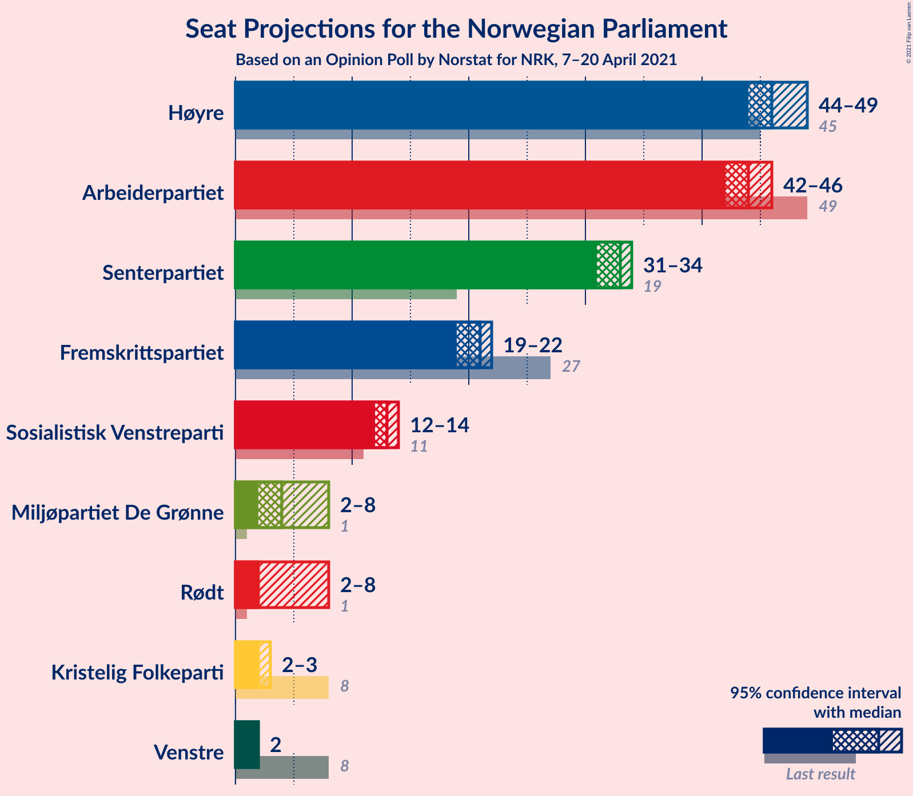
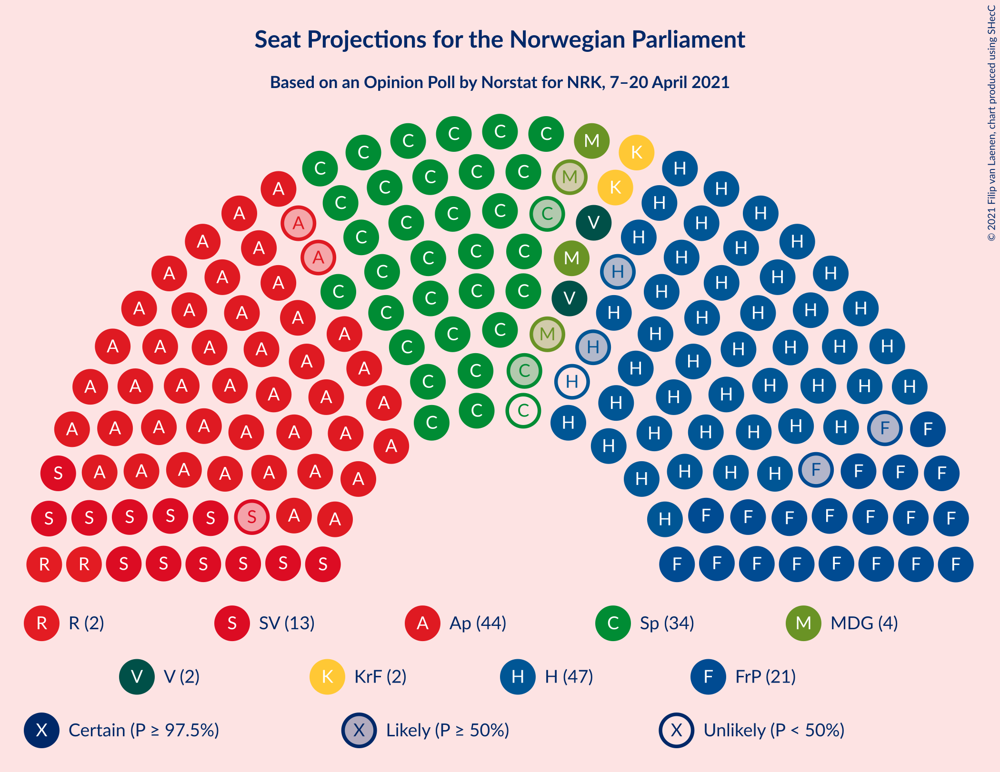
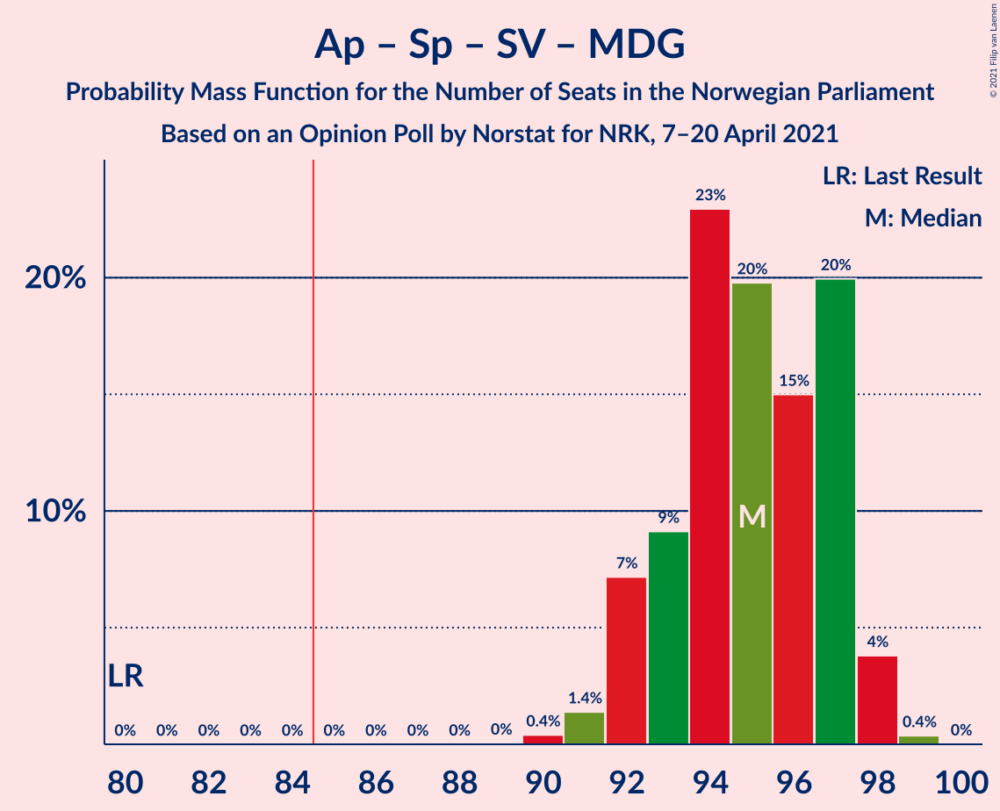
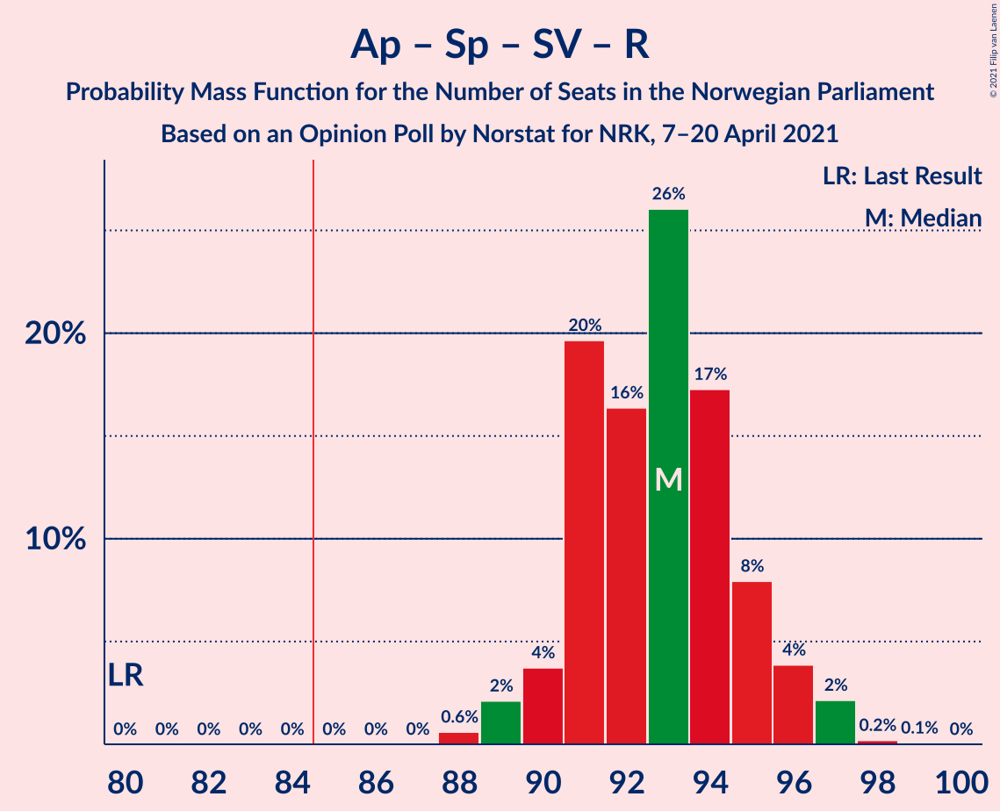
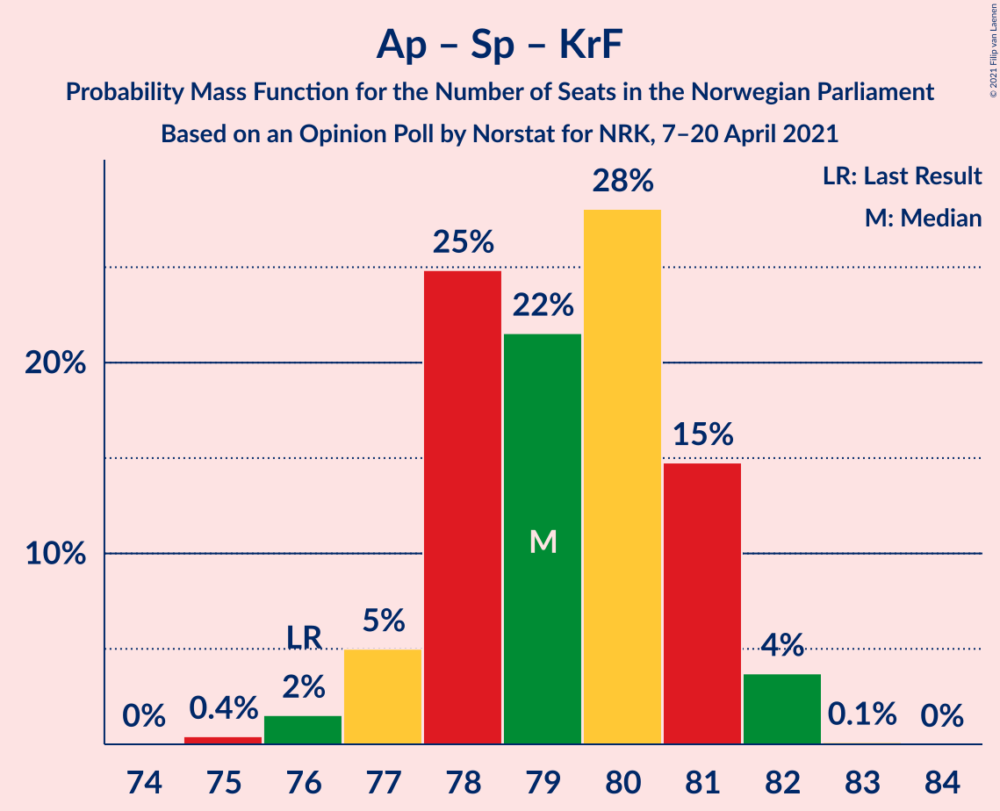
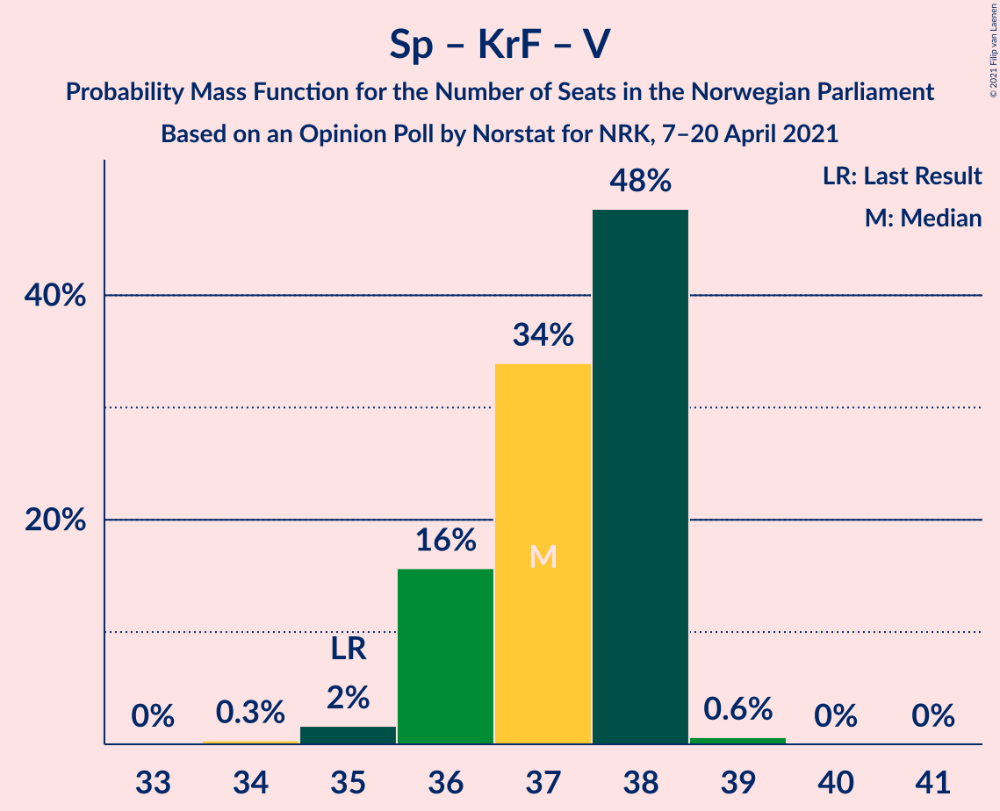

# Opinion Poll by Norstat for NRK, 7–20 April 2021

<a href="#voting-intentions">Voting Intentions</a> | <a href="#seats">Seats</a> | <a href="#coalitions">Coalitions</a> | <a href="#technical-information">Technical Information</a>

## Voting Intentions

### Confidence Intervals

| Party | Last Result | Poll Result | 80% Confidence Interval | 90% Confidence Interval | 95% Confidence Interval | 99% Confidence Interval |
|:-----:|:-----------:|:-----------:|:-----------------------:|:-----------------------:|:-----------------------:|:-----------------------:|
| Høyre | 25.0% | 25.2% | 24.6–25.7% |24.5–25.8% |24.4–26.0% |24.1–26.2% |
| Arbeiderpartiet | 27.4% | 23.7% | 23.2–24.2% |23.1–24.4% |23.0–24.5% |22.7–24.8% |
| Senterpartiet | 10.3% | 17.4% | 16.9–17.9% |16.8–18.0% |16.7–18.1% |16.5–18.4% |
| Fremskrittspartiet | 15.2% | 11.3% | 10.9–11.7% |10.8–11.8% |10.7–11.9% |10.5–12.1% |
| Sosialistisk Venstreparti | 6.0% | 7.1% | 6.8–7.5% |6.7–7.5% |6.7–7.6% |6.5–7.8% |
| Miljøpartiet De Grønne | 3.2% | 4.0% | 3.7–4.2% |3.7–4.3% |3.6–4.3% |3.5–4.5% |
| Rødt | 2.4% | 3.8% | 3.5–4.0% |3.5–4.1% |3.4–4.1% |3.3–4.3% |
| Kristelig Folkeparti | 4.2% | 3.5% | 3.2–3.7% |3.2–3.8% |3.1–3.8% |3.0–3.9% |
| Venstre | 4.4% | 3.0% | 2.8–3.2% |2.7–3.2% |2.7–3.3% |2.6–3.4% |

*Note:* The poll result column reflects the actual value used in the calculations. Published results may vary slightly, and in addition be rounded to fewer digits.

## Seats

### Confidence Intervals

| Party | Last Result | Median | 80% Confidence Interval | 90% Confidence Interval | 95% Confidence Interval | 99% Confidence Interval |
|:-----:|:-----------:|:------:|:-----------------------:|:-----------------------:|:-----------------------:|:-----------------------:|
| <a href="#høyre">Høyre</a> | 45 | 46 | 45–48 |45–48 |44–48 |43–49 |
| <a href="#arbeiderpartiet">Arbeiderpartiet</a> | 49 | 43 | 42–45 |42–45 |42–46 |42–46 |
| <a href="#senterpartiet">Senterpartiet</a> | 19 | 33 | 32–34 |31–34 |31–34 |30–34 |
| <a href="#fremskrittspartiet">Fremskrittspartiet</a> | 27 | 21 | 20–22 |20–22 |20–22 |19–22 |
| <a href="#sosialistisk-venstreparti">Sosialistisk Venstreparti</a> | 11 | 13 | 12–14 |12–14 |12–14 |12–15 |
| <a href="#miljøpartiet-de-grønne">Miljøpartiet De Grønne</a> | 1 | 7 | 3–8 |2–8 |2–8 |2–8 |
| <a href="#rødt">Rødt</a> | 1 | 2 | 2 |2–7 |2–7 |2–8 |
| <a href="#kristelig-folkeparti">Kristelig Folkeparti</a> | 8 | 2 | 2–3 |2–3 |2–3 |1–3 |
| <a href="#venstre">Venstre</a> | 8 | 2 | 2 |2 |2 |2 |

### Høyre

*For a full overview of the results for this party, see the [Høyre](party-høyre.html) page.*

| Number of Seats | Probability | Accumulated | Special Marks |
|:---------------:|:-----------:|:-----------:|:-------------:|
| 42 | 0.2% | 100% |  |
| 43 | 2% | 99.8% |  |
| 44 | 3% | 98% |  |
| 45 | 25% | 95% | Last Result |
| 46 | 31% | 71% | Median |
| 47 | 29% | 40% |  |
| 48 | 9% | 11% |  |
| 49 | 2% | 2% |  |
| 50 | 0.3% | 0.3% |  |
| 51 | 0% | 0% |  |

### Arbeiderpartiet

*For a full overview of the results for this party, see the [Arbeiderpartiet](party-arbeiderpartiet.html) page.*

| Number of Seats | Probability | Accumulated | Special Marks |
|:---------------:|:-----------:|:-----------:|:-------------:|
| 41 | 0.3% | 100% |  |
| 42 | 11% | 99.7% |  |
| 43 | 53% | 89% | Median |
| 44 | 22% | 36% |  |
| 45 | 10% | 14% |  |
| 46 | 4% | 4% |  |
| 47 | 0.2% | 0.2% |  |
| 48 | 0% | 0% |  |
| 49 | 0% | 0% | Last Result |

### Senterpartiet

*For a full overview of the results for this party, see the [Senterpartiet](party-senterpartiet.html) page.*

| Number of Seats | Probability | Accumulated | Special Marks |
|:---------------:|:-----------:|:-----------:|:-------------:|
| 19 | 0% | 100% | Last Result |
| 20 | 0% | 100% |  |
| 21 | 0% | 100% |  |
| 22 | 0% | 100% |  |
| 23 | 0% | 100% |  |
| 24 | 0% | 100% |  |
| 25 | 0% | 100% |  |
| 26 | 0% | 100% |  |
| 27 | 0% | 100% |  |
| 28 | 0% | 100% |  |
| 29 | 0% | 100% |  |
| 30 | 1.1% | 100% |  |
| 31 | 5% | 98.8% |  |
| 32 | 17% | 94% |  |
| 33 | 36% | 77% | Median |
| 34 | 41% | 41% |  |
| 35 | 0.3% | 0.3% |  |
| 36 | 0% | 0% |  |

### Fremskrittspartiet

*For a full overview of the results for this party, see the [Fremskrittspartiet](party-fremskrittspartiet.html) page.*

| Number of Seats | Probability | Accumulated | Special Marks |
|:---------------:|:-----------:|:-----------:|:-------------:|
| 19 | 2% | 100% |  |
| 20 | 30% | 98% |  |
| 21 | 57% | 68% | Median |
| 22 | 10% | 11% |  |
| 23 | 0.4% | 0.4% |  |
| 24 | 0% | 0% |  |
| 25 | 0% | 0% |  |
| 26 | 0% | 0% |  |
| 27 | 0% | 0% | Last Result |

### Sosialistisk Venstreparti

*For a full overview of the results for this party, see the [Sosialistisk Venstreparti](party-sosialistiskvenstreparti.html) page.*

| Number of Seats | Probability | Accumulated | Special Marks |
|:---------------:|:-----------:|:-----------:|:-------------:|
| 11 | 0.1% | 100% | Last Result |
| 12 | 38% | 99.9% |  |
| 13 | 44% | 62% | Median |
| 14 | 16% | 18% |  |
| 15 | 2% | 2% |  |
| 16 | 0% | 0% |  |

### Miljøpartiet De Grønne

*For a full overview of the results for this party, see the [Miljøpartiet De Grønne](party-miljøpartietdegrønne.html) page.*

| Number of Seats | Probability | Accumulated | Special Marks |
|:---------------:|:-----------:|:-----------:|:-------------:|
| 1 | 0% | 100% | Last Result |
| 2 | 7% | 100% |  |
| 3 | 13% | 93% |  |
| 4 | 3% | 80% |  |
| 5 | 0% | 77% |  |
| 6 | 0% | 77% |  |
| 7 | 50% | 77% | Median |
| 8 | 27% | 27% |  |
| 9 | 0.1% | 0.1% |  |
| 10 | 0% | 0% |  |

### Rødt

*For a full overview of the results for this party, see the [Rødt](party-rødt.html) page.*

| Number of Seats | Probability | Accumulated | Special Marks |
|:---------------:|:-----------:|:-----------:|:-------------:|
| 1 | 0% | 100% | Last Result |
| 2 | 95% | 100% | Median |
| 3 | 0% | 5% |  |
| 4 | 0% | 5% |  |
| 5 | 0% | 5% |  |
| 6 | 0% | 5% |  |
| 7 | 4% | 5% |  |
| 8 | 0.8% | 0.8% |  |
| 9 | 0% | 0% |  |

### Kristelig Folkeparti

*For a full overview of the results for this party, see the [Kristelig Folkeparti](party-kristeligfolkeparti.html) page.*

| Number of Seats | Probability | Accumulated | Special Marks |
|:---------------:|:-----------:|:-----------:|:-------------:|
| 1 | 0.9% | 100% |  |
| 2 | 86% | 99.1% | Median |
| 3 | 13% | 14% |  |
| 4 | 0% | 0.1% |  |
| 5 | 0% | 0.1% |  |
| 6 | 0% | 0.1% |  |
| 7 | 0.1% | 0.1% |  |
| 8 | 0% | 0% | Last Result |

### Venstre

*For a full overview of the results for this party, see the [Venstre](party-venstre.html) page.*

| Number of Seats | Probability | Accumulated | Special Marks |
|:---------------:|:-----------:|:-----------:|:-------------:|
| 2 | 100% | 100% | Median |
| 3 | 0% | 0% |  |
| 4 | 0% | 0% |  |
| 5 | 0% | 0% |  |
| 6 | 0% | 0% |  |
| 7 | 0% | 0% |  |
| 8 | 0% | 0% | Last Result |

## Coalitions

### Confidence Intervals

| Coalition | Last Result | Median | Majority? | 80% Confidence Interval | 90% Confidence Interval | 95% Confidence Interval | 99% Confidence Interval |
|:---------:|:-----------:|:------:|:---------:|:-----------------------:|:-----------------------:|:-----------------------:|:-----------------------:|
| Høyre – Senterpartiet – Fremskrittspartiet – Kristelig Folkeparti – Venstre | 107 | 104 | 100% | 103–106 | 102–107 | 101–107 | 100–108 |
| Arbeiderpartiet – Senterpartiet – Sosialistisk Venstreparti – Miljøpartiet De Grønne – Rødt | 81 | 98 | 100% | 96–100 | 95–100 | 95–101 | 94–102 |
| Arbeiderpartiet – Senterpartiet – Sosialistisk Venstreparti – Miljøpartiet De Grønne – Kristelig Folkeparti | 88 | 98 | 100% | 96–99 | 95–100 | 94–100 | 93–100 |
| Arbeiderpartiet – Senterpartiet – Sosialistisk Venstreparti – Miljøpartiet De Grønne | 80 | 96 | 100% | 94–97 | 93–98 | 92–98 | 91–98 |
| Arbeiderpartiet – Senterpartiet – Sosialistisk Venstreparti – Rødt | 80 | 91 | 100% | 90–94 | 89–95 | 89–95 | 88–96 |
| Arbeiderpartiet – Senterpartiet – Sosialistisk Venstreparti | 79 | 89 | 99.8% | 88–91 | 87–92 | 87–93 | 86–93 |
| Arbeiderpartiet – Senterpartiet – Miljøpartiet De Grønne – Kristelig Folkeparti | 77 | 85 | 72% | 83–87 | 82–87 | 81–88 | 80–88 |
| Arbeiderpartiet – Senterpartiet – Kristelig Folkeparti | 76 | 79 | 0% | 77–80 | 77–81 | 76–81 | 75–82 |
| Høyre – Fremskrittspartiet – Miljøpartiet De Grønne – Kristelig Folkeparti – Venstre | 89 | 78 | 0% | 75–79 | 74–80 | 74–80 | 73–81 |
| Arbeiderpartiet – Senterpartiet | 68 | 77 | 0% | 75–78 | 74–79 | 74–79 | 73–80 |
| Høyre – Fremskrittspartiet – Kristelig Folkeparti – Venstre | 88 | 71 | 0% | 69–73 | 69–74 | 68–74 | 67–75 |
| Høyre – Fremskrittspartiet – Venstre | 80 | 69 | 0% | 67–71 | 67–71 | 66–72 | 65–73 |
| Høyre – Fremskrittspartiet | 72 | 67 | 0% | 65–69 | 65–69 | 64–70 | 63–71 |
| Arbeiderpartiet – Sosialistisk Venstreparti | 60 | 56 | 0% | 55–58 | 55–59 | 54–60 | 54–60 |
| Høyre – Kristelig Folkeparti – Venstre | 61 | 50 | 0% | 49–52 | 49–52 | 48–53 | 47–54 |
| Senterpartiet – Kristelig Folkeparti – Venstre | 35 | 37 | 0% | 36–38 | 36–38 | 35–38 | 35–39 |

### Høyre – Senterpartiet – Fremskrittspartiet – Kristelig Folkeparti – Venstre

| Number of Seats | Probability | Accumulated | Special Marks |
|:---------------:|:-----------:|:-----------:|:-------------:|
| 98 | 0.1% | 100% |  |
| 99 | 0.2% | 99.9% |  |
| 100 | 1.4% | 99.7% |  |
| 101 | 3% | 98% |  |
| 102 | 5% | 96% |  |
| 103 | 20% | 91% |  |
| 104 | 27% | 70% | Median |
| 105 | 29% | 43% |  |
| 106 | 7% | 14% |  |
| 107 | 5% | 7% | Last Result |
| 108 | 1.2% | 1.3% |  |
| 109 | 0.1% | 0.1% |  |
| 110 | 0% | 0% |  |

### Arbeiderpartiet – Senterpartiet – Sosialistisk Venstreparti – Miljøpartiet De Grønne – Rødt

| Number of Seats | Probability | Accumulated | Special Marks |
|:---------------:|:-----------:|:-----------:|:-------------:|
| 81 | 0% | 100% | Last Result |
| 82 | 0% | 100% |  |
| 83 | 0% | 100% |  |
| 84 | 0% | 100% |  |
| 85 | 0% | 100% | Majority |
| 86 | 0% | 100% |  |
| 87 | 0% | 100% |  |
| 88 | 0% | 100% |  |
| 89 | 0% | 100% |  |
| 90 | 0% | 100% |  |
| 91 | 0% | 100% |  |
| 92 | 0% | 100% |  |
| 93 | 0.1% | 100% |  |
| 94 | 2% | 99.9% |  |
| 95 | 5% | 98% |  |
| 96 | 8% | 94% |  |
| 97 | 25% | 86% |  |
| 98 | 22% | 61% | Median |
| 99 | 29% | 39% |  |
| 100 | 7% | 10% |  |
| 101 | 1.3% | 3% |  |
| 102 | 1.5% | 2% |  |
| 103 | 0.4% | 0.4% |  |
| 104 | 0% | 0% |  |

### Arbeiderpartiet – Senterpartiet – Sosialistisk Venstreparti – Miljøpartiet De Grønne – Kristelig Folkeparti

| Number of Seats | Probability | Accumulated | Special Marks |
|:---------------:|:-----------:|:-----------:|:-------------:|
| 88 | 0% | 100% | Last Result |
| 89 | 0% | 100% |  |
| 90 | 0% | 100% |  |
| 91 | 0% | 100% |  |
| 92 | 0.1% | 100% |  |
| 93 | 0.9% | 99.9% |  |
| 94 | 2% | 99.0% |  |
| 95 | 4% | 97% |  |
| 96 | 9% | 94% |  |
| 97 | 25% | 85% |  |
| 98 | 24% | 60% | Median |
| 99 | 28% | 36% |  |
| 100 | 8% | 8% |  |
| 101 | 0.5% | 0.5% |  |
| 102 | 0% | 0% |  |

### Arbeiderpartiet – Senterpartiet – Sosialistisk Venstreparti – Miljøpartiet De Grønne

| Number of Seats | Probability | Accumulated | Special Marks |
|:---------------:|:-----------:|:-----------:|:-------------:|
| 80 | 0% | 100% | Last Result |
| 81 | 0% | 100% |  |
| 82 | 0% | 100% |  |
| 83 | 0% | 100% |  |
| 84 | 0% | 100% |  |
| 85 | 0% | 100% | Majority |
| 86 | 0% | 100% |  |
| 87 | 0% | 100% |  |
| 88 | 0% | 100% |  |
| 89 | 0.1% | 100% |  |
| 90 | 0.3% | 99.9% |  |
| 91 | 1.1% | 99.6% |  |
| 92 | 2% | 98.5% |  |
| 93 | 5% | 96% |  |
| 94 | 9% | 91% |  |
| 95 | 26% | 82% |  |
| 96 | 21% | 56% | Median |
| 97 | 28% | 35% |  |
| 98 | 7% | 7% |  |
| 99 | 0.4% | 0.4% |  |
| 100 | 0% | 0% |  |

### Arbeiderpartiet – Senterpartiet – Sosialistisk Venstreparti – Rødt

| Number of Seats | Probability | Accumulated | Special Marks |
|:---------------:|:-----------:|:-----------:|:-------------:|
| 80 | 0% | 100% | Last Result |
| 81 | 0% | 100% |  |
| 82 | 0% | 100% |  |
| 83 | 0% | 100% |  |
| 84 | 0% | 100% |  |
| 85 | 0% | 100% | Majority |
| 86 | 0% | 100% |  |
| 87 | 0.1% | 100% |  |
| 88 | 1.1% | 99.9% |  |
| 89 | 4% | 98.8% |  |
| 90 | 19% | 94% |  |
| 91 | 29% | 76% | Median |
| 92 | 25% | 47% |  |
| 93 | 8% | 22% |  |
| 94 | 8% | 14% |  |
| 95 | 5% | 7% |  |
| 96 | 1.2% | 2% |  |
| 97 | 0.3% | 0.4% |  |
| 98 | 0% | 0.1% |  |
| 99 | 0% | 0% |  |

### Arbeiderpartiet – Senterpartiet – Sosialistisk Venstreparti

| Number of Seats | Probability | Accumulated | Special Marks |
|:---------------:|:-----------:|:-----------:|:-------------:|
| 79 | 0% | 100% | Last Result |
| 80 | 0% | 100% |  |
| 81 | 0% | 100% |  |
| 82 | 0% | 100% |  |
| 83 | 0% | 100% |  |
| 84 | 0.2% | 100% |  |
| 85 | 0.1% | 99.8% | Majority |
| 86 | 2% | 99.7% |  |
| 87 | 6% | 98% |  |
| 88 | 21% | 92% |  |
| 89 | 29% | 72% | Median |
| 90 | 25% | 42% |  |
| 91 | 8% | 18% |  |
| 92 | 7% | 10% |  |
| 93 | 3% | 3% |  |
| 94 | 0.2% | 0.2% |  |
| 95 | 0% | 0% |  |

### Arbeiderpartiet – Senterpartiet – Miljøpartiet De Grønne – Kristelig Folkeparti

| Number of Seats | Probability | Accumulated | Special Marks |
|:---------------:|:-----------:|:-----------:|:-------------:|
| 77 | 0% | 100% | Last Result |
| 78 | 0% | 100% |  |
| 79 | 0.3% | 100% |  |
| 80 | 0.7% | 99.6% |  |
| 81 | 3% | 98.9% |  |
| 82 | 4% | 96% |  |
| 83 | 13% | 91% |  |
| 84 | 7% | 79% |  |
| 85 | 31% | 72% | Median, Majority |
| 86 | 22% | 40% |  |
| 87 | 16% | 19% |  |
| 88 | 2% | 3% |  |
| 89 | 0.2% | 0.2% |  |
| 90 | 0% | 0% |  |

### Arbeiderpartiet – Senterpartiet – Kristelig Folkeparti

| Number of Seats | Probability | Accumulated | Special Marks |
|:---------------:|:-----------:|:-----------:|:-------------:|
| 74 | 0.1% | 100% |  |
| 75 | 0.4% | 99.9% |  |
| 76 | 3% | 99.5% | Last Result |
| 77 | 8% | 97% |  |
| 78 | 34% | 88% | Median |
| 79 | 34% | 55% |  |
| 80 | 14% | 20% |  |
| 81 | 6% | 6% |  |
| 82 | 0.6% | 0.8% |  |
| 83 | 0.2% | 0.2% |  |
| 84 | 0% | 0% |  |

### Høyre – Fremskrittspartiet – Miljøpartiet De Grønne – Kristelig Folkeparti – Venstre

| Number of Seats | Probability | Accumulated | Special Marks |
|:---------------:|:-----------:|:-----------:|:-------------:|
| 71 | 0% | 100% |  |
| 72 | 0.3% | 99.9% |  |
| 73 | 1.2% | 99.6% |  |
| 74 | 5% | 98% |  |
| 75 | 8% | 93% |  |
| 76 | 8% | 86% |  |
| 77 | 25% | 78% |  |
| 78 | 29% | 53% | Median |
| 79 | 19% | 24% |  |
| 80 | 4% | 6% |  |
| 81 | 1.1% | 1.2% |  |
| 82 | 0.1% | 0.1% |  |
| 83 | 0% | 0% |  |
| 84 | 0% | 0% |  |
| 85 | 0% | 0% | Majority |
| 86 | 0% | 0% |  |
| 87 | 0% | 0% |  |
| 88 | 0% | 0% |  |
| 89 | 0% | 0% | Last Result |

### Arbeiderpartiet – Senterpartiet

| Number of Seats | Probability | Accumulated | Special Marks |
|:---------------:|:-----------:|:-----------:|:-------------:|
| 68 | 0% | 100% | Last Result |
| 69 | 0% | 100% |  |
| 70 | 0% | 100% |  |
| 71 | 0.1% | 100% |  |
| 72 | 0.2% | 99.9% |  |
| 73 | 0.9% | 99.7% |  |
| 74 | 5% | 98.8% |  |
| 75 | 9% | 94% |  |
| 76 | 32% | 85% | Median |
| 77 | 35% | 53% |  |
| 78 | 12% | 17% |  |
| 79 | 5% | 6% |  |
| 80 | 0.5% | 0.6% |  |
| 81 | 0.1% | 0.1% |  |
| 82 | 0% | 0% |  |

### Høyre – Fremskrittspartiet – Kristelig Folkeparti – Venstre

| Number of Seats | Probability | Accumulated | Special Marks |
|:---------------:|:-----------:|:-----------:|:-------------:|
| 66 | 0.4% | 100% |  |
| 67 | 1.5% | 99.6% |  |
| 68 | 1.3% | 98% |  |
| 69 | 7% | 97% |  |
| 70 | 29% | 90% |  |
| 71 | 22% | 61% | Median |
| 72 | 25% | 39% |  |
| 73 | 8% | 14% |  |
| 74 | 5% | 6% |  |
| 75 | 2% | 2% |  |
| 76 | 0.1% | 0.1% |  |
| 77 | 0% | 0% |  |
| 78 | 0% | 0% |  |
| 79 | 0% | 0% |  |
| 80 | 0% | 0% |  |
| 81 | 0% | 0% |  |
| 82 | 0% | 0% |  |
| 83 | 0% | 0% |  |
| 84 | 0% | 0% |  |
| 85 | 0% | 0% | Majority |
| 86 | 0% | 0% |  |
| 87 | 0% | 0% |  |
| 88 | 0% | 0% | Last Result |

### Høyre – Fremskrittspartiet – Venstre

| Number of Seats | Probability | Accumulated | Special Marks |
|:---------------:|:-----------:|:-----------:|:-------------:|
| 64 | 0.4% | 100% |  |
| 65 | 2% | 99.5% |  |
| 66 | 1.1% | 98% |  |
| 67 | 9% | 97% |  |
| 68 | 28% | 88% |  |
| 69 | 24% | 60% | Median |
| 70 | 23% | 35% |  |
| 71 | 8% | 12% |  |
| 72 | 3% | 4% |  |
| 73 | 1.0% | 1.1% |  |
| 74 | 0% | 0% |  |
| 75 | 0% | 0% |  |
| 76 | 0% | 0% |  |
| 77 | 0% | 0% |  |
| 78 | 0% | 0% |  |
| 79 | 0% | 0% |  |
| 80 | 0% | 0% | Last Result |

### Høyre – Fremskrittspartiet

| Number of Seats | Probability | Accumulated | Special Marks |
|:---------------:|:-----------:|:-----------:|:-------------:|
| 62 | 0.4% | 100% |  |
| 63 | 2% | 99.5% |  |
| 64 | 1.1% | 98% |  |
| 65 | 9% | 97% |  |
| 66 | 28% | 88% |  |
| 67 | 24% | 60% | Median |
| 68 | 23% | 35% |  |
| 69 | 8% | 12% |  |
| 70 | 3% | 4% |  |
| 71 | 1.0% | 1.1% |  |
| 72 | 0% | 0% | Last Result |

### Arbeiderpartiet – Sosialistisk Venstreparti

| Number of Seats | Probability | Accumulated | Special Marks |
|:---------------:|:-----------:|:-----------:|:-------------:|
| 53 | 0.2% | 100% |  |
| 54 | 3% | 99.8% |  |
| 55 | 34% | 97% |  |
| 56 | 30% | 62% | Median |
| 57 | 12% | 32% |  |
| 58 | 11% | 20% |  |
| 59 | 6% | 9% |  |
| 60 | 3% | 3% | Last Result |
| 61 | 0.1% | 0.1% |  |
| 62 | 0% | 0% |  |

### Høyre – Kristelig Folkeparti – Venstre

| Number of Seats | Probability | Accumulated | Special Marks |
|:---------------:|:-----------:|:-----------:|:-------------:|
| 46 | 0.1% | 100% |  |
| 47 | 1.3% | 99.9% |  |
| 48 | 3% | 98.6% |  |
| 49 | 22% | 96% |  |
| 50 | 30% | 74% | Median |
| 51 | 29% | 44% |  |
| 52 | 11% | 15% |  |
| 53 | 3% | 3% |  |
| 54 | 0.5% | 0.6% |  |
| 55 | 0% | 0.1% |  |
| 56 | 0% | 0% |  |
| 57 | 0% | 0% |  |
| 58 | 0% | 0% |  |
| 59 | 0% | 0% |  |
| 60 | 0% | 0% |  |
| 61 | 0% | 0% | Last Result |

### Senterpartiet – Kristelig Folkeparti – Venstre

| Number of Seats | Probability | Accumulated | Special Marks |
|:---------------:|:-----------:|:-----------:|:-------------:|
| 34 | 0.2% | 100% |  |
| 35 | 3% | 99.8% | Last Result |
| 36 | 15% | 97% |  |
| 37 | 36% | 82% | Median |
| 38 | 45% | 46% |  |
| 39 | 0.6% | 0.7% |  |
| 40 | 0% | 0.1% |  |
| 41 | 0% | 0.1% |  |
| 42 | 0% | 0% |  |

## Technical Information

### Opinion Poll

+ **Polling firm:** Norstat
+ **Commissioner(s):** NRK
+ **Fieldwork period:** 7–20 April 2021

### Calculations

+ **Sample size:** 11413
+ **Simulations done:** 1,048,576
+ **Error estimate:** 0.32%

