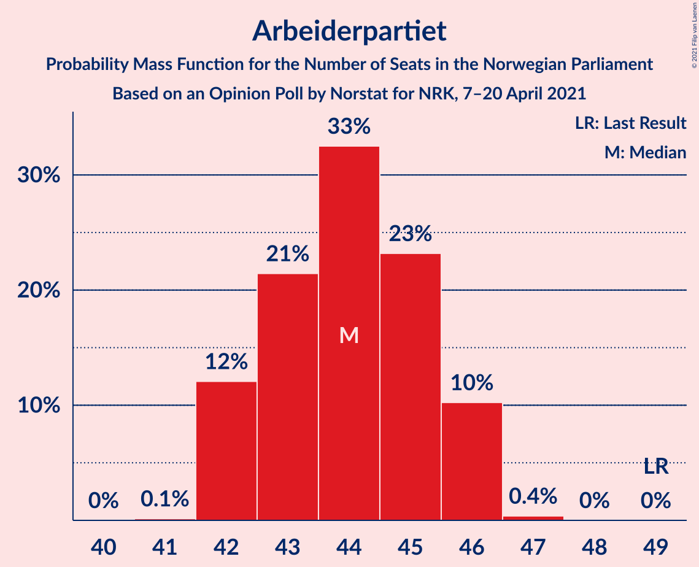
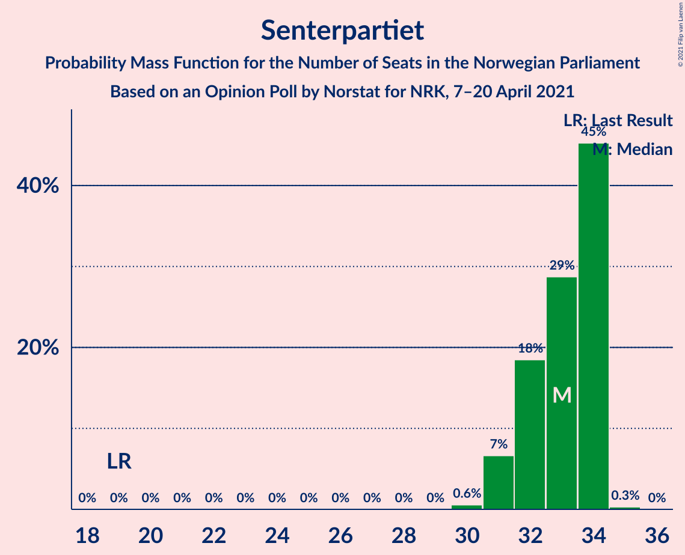
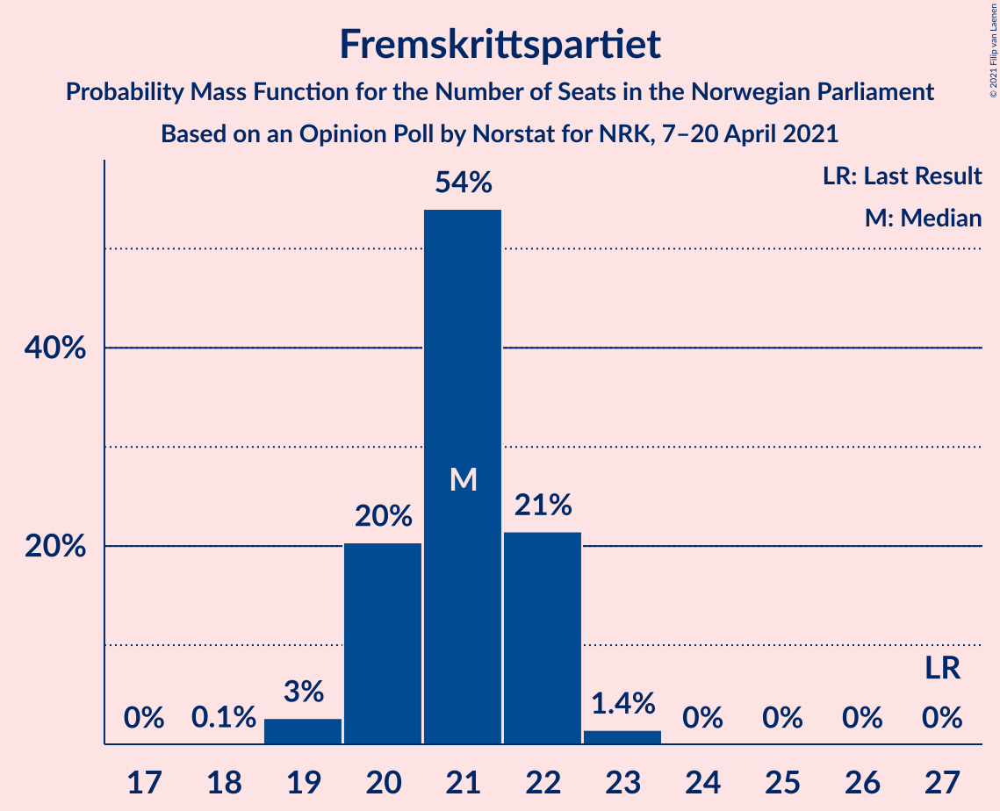
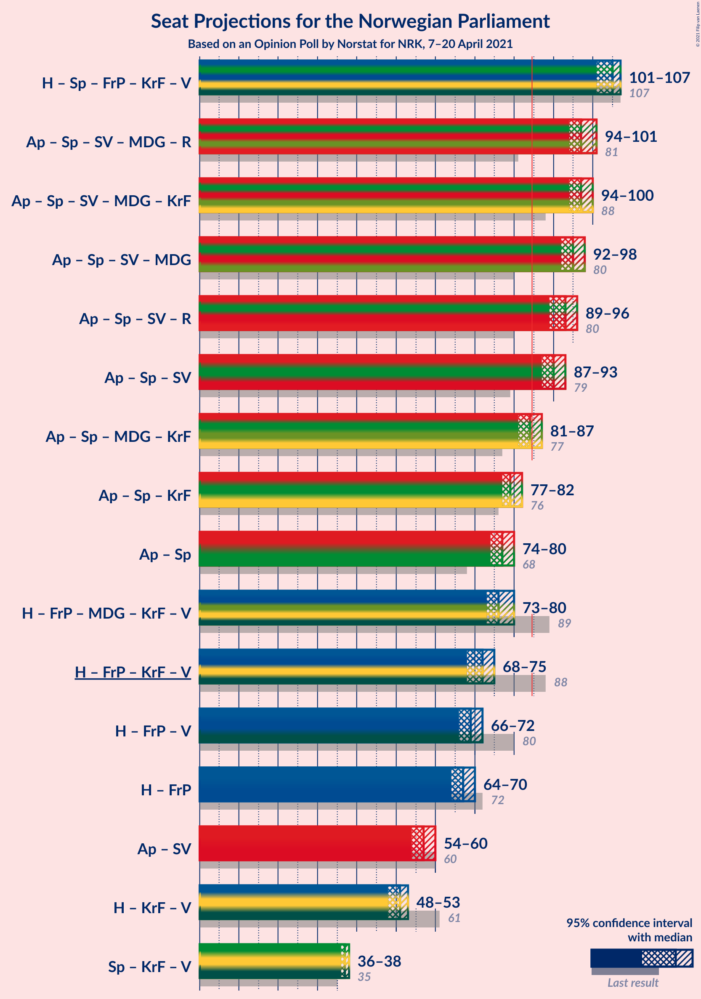
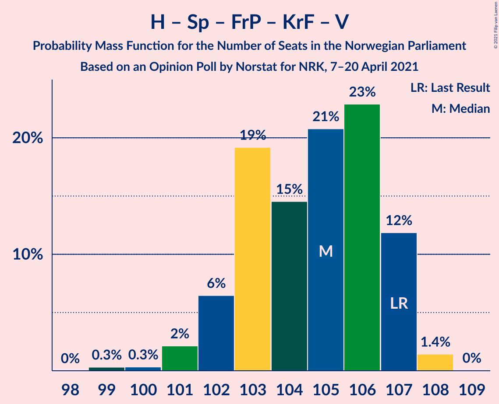
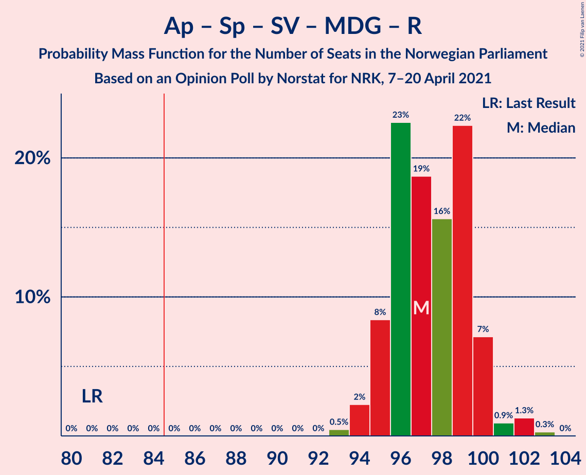
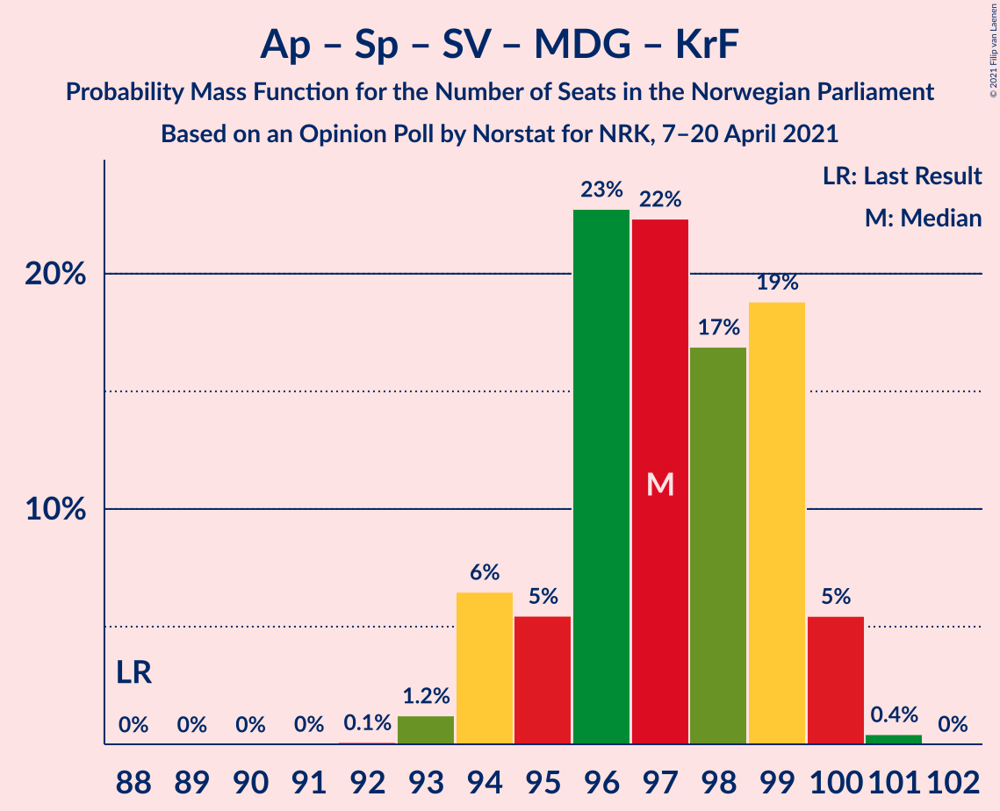
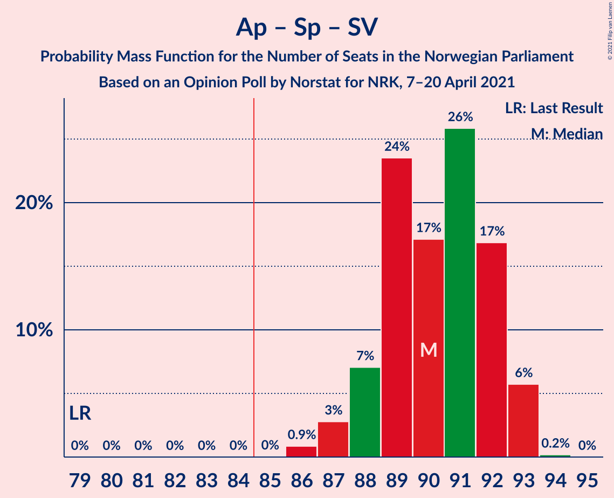
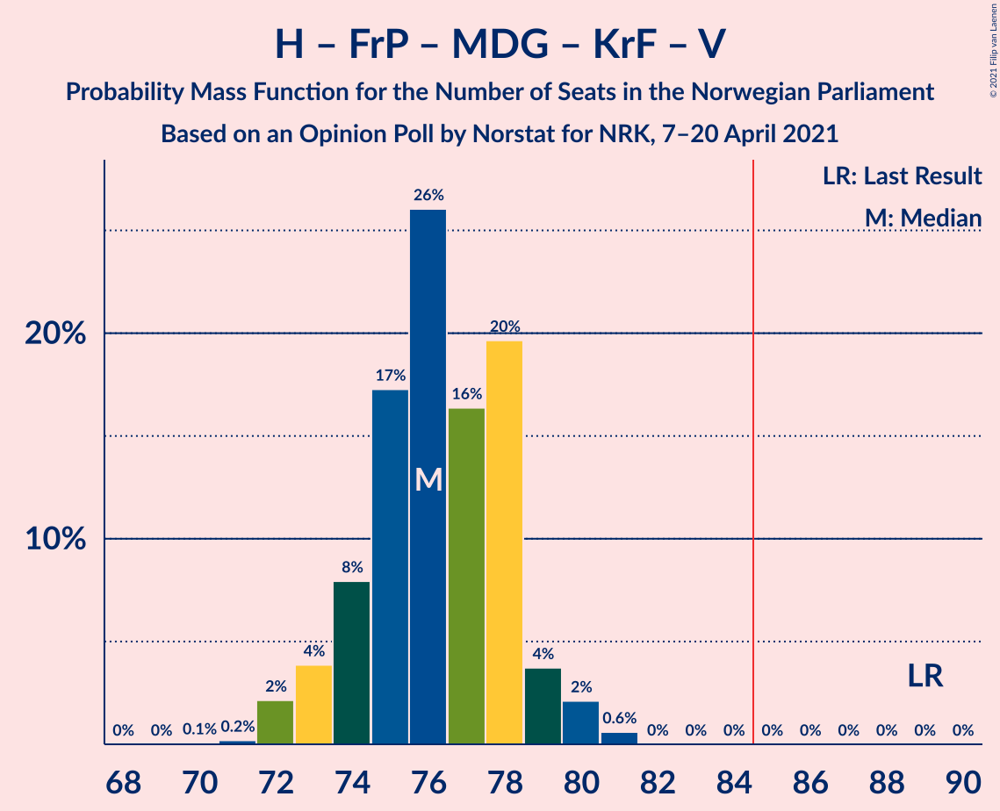
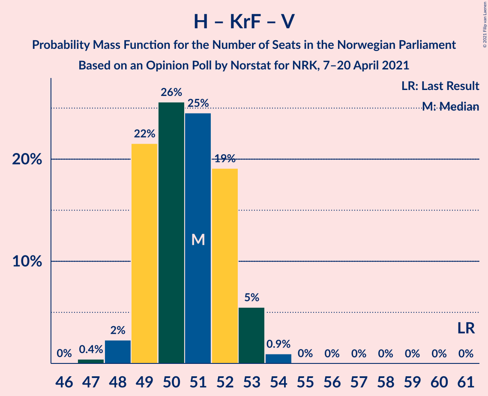

# Opinion Poll by Norstat for NRK, 7–20 April 2021

<a href="#voting-intentions">Voting Intentions</a> | <a href="#seats">Seats</a> | <a href="#coalitions">Coalitions</a> | <a href="#technical-information">Technical Information</a>

## Voting Intentions

### Confidence Intervals

| Party | Last Result | Poll Result | 80% Confidence Interval | 90% Confidence Interval | 95% Confidence Interval | 99% Confidence Interval |
|:-----:|:-----------:|:-----------:|:-----------------------:|:-----------------------:|:-----------------------:|:-----------------------:|
| Høyre | 25.0% | 24.7% | 24.2–25.2% |24.0–25.3% |23.9–25.5% |23.6–25.7% |
| Arbeiderpartiet | 27.4% | 23.3% | 22.8–23.8% |22.6–23.9% |22.5–24.1% |22.3–24.3% |
| Senterpartiet | 10.3% | 17.1% | 16.6–17.6% |16.5–17.7% |16.4–17.8% |16.2–18.0% |
| Fremskrittspartiet | 15.2% | 11.1% | 10.7–11.5% |10.6–11.6% |10.5–11.7% |10.3–11.9% |
| Sosialistisk Venstreparti | 6.0% | 7.0% | 6.7–7.3% |6.6–7.4% |6.5–7.5% |6.4–7.6% |
| Miljøpartiet De Grønne | 3.2% | 3.9% | 3.7–4.1% |3.6–4.2% |3.6–4.3% |3.4–4.4% |
| Rødt | 2.4% | 3.7% | 3.5–3.9% |3.4–4.0% |3.4–4.1% |3.3–4.2% |
| Kristelig Folkeparti | 4.2% | 3.4% | 3.2–3.6% |3.1–3.7% |3.1–3.7% |3.0–3.9% |
| Venstre | 4.4% | 2.9% | 2.7–3.1% |2.7–3.2% |2.6–3.2% |2.5–3.3% |

*Note:* The poll result column reflects the actual value used in the calculations. Published results may vary slightly, and in addition be rounded to fewer digits.

## Seats

### Confidence Intervals

| Party | Last Result | Median | 80% Confidence Interval | 90% Confidence Interval | 95% Confidence Interval | 99% Confidence Interval |
|:-----:|:-----------:|:------:|:-----------------------:|:-----------------------:|:-----------------------:|:-----------------------:|
| <a href="#høyre">Høyre</a> | 45 | 46 | 45–48 |45–48 |44–49 |43–49 |
| <a href="#arbeiderpartiet">Arbeiderpartiet</a> | 49 | 44 | 42–46 |42–46 |42–46 |42–46 |
| <a href="#senterpartiet">Senterpartiet</a> | 19 | 33 | 32–34 |31–34 |31–34 |30–34 |
| <a href="#fremskrittspartiet">Fremskrittspartiet</a> | 27 | 21 | 20–22 |20–22 |19–22 |19–23 |
| <a href="#sosialistisk-venstreparti">Sosialistisk Venstreparti</a> | 11 | 13 | 12–14 |12–14 |12–14 |12–14 |
| <a href="#miljøpartiet-de-grønne">Miljøpartiet De Grønne</a> | 1 | 4 | 3–8 |2–8 |2–8 |2–8 |
| <a href="#rødt">Rødt</a> | 1 | 2 | 2 |2–7 |2–8 |2–8 |
| <a href="#kristelig-folkeparti">Kristelig Folkeparti</a> | 8 | 2 | 2–3 |2–3 |2–3 |1–3 |
| <a href="#venstre">Venstre</a> | 8 | 2 | 2 |2 |2 |2 |

### Høyre

*For a full overview of the results for this party, see the [Høyre](party-høyre.html) page.*

| Number of Seats | Probability | Accumulated | Special Marks |
|:---------------:|:-----------:|:-----------:|:-------------:|
| 43 | 0.5% | 100% |  |
| 44 | 3% | 99.5% |  |
| 45 | 23% | 97% | Last Result |
| 46 | 27% | 74% | Median |
| 47 | 29% | 47% |  |
| 48 | 15% | 18% |  |
| 49 | 3% | 3% |  |
| 50 | 0.3% | 0.3% |  |
| 51 | 0% | 0% |  |

### Arbeiderpartiet

*For a full overview of the results for this party, see the [Arbeiderpartiet](party-arbeiderpartiet.html) page.*

| Number of Seats | Probability | Accumulated | Special Marks |
|:---------------:|:-----------:|:-----------:|:-------------:|
| 41 | 0.1% | 100% |  |
| 42 | 12% | 99.8% |  |
| 43 | 21% | 88% |  |
| 44 | 33% | 66% | Median |
| 45 | 23% | 34% |  |
| 46 | 10% | 11% |  |
| 47 | 0.4% | 0.4% |  |
| 48 | 0% | 0% |  |
| 49 | 0% | 0% | Last Result |

### Senterpartiet

*For a full overview of the results for this party, see the [Senterpartiet](party-senterpartiet.html) page.*

| Number of Seats | Probability | Accumulated | Special Marks |
|:---------------:|:-----------:|:-----------:|:-------------:|
| 19 | 0% | 100% | Last Result |
| 20 | 0% | 100% |  |
| 21 | 0% | 100% |  |
| 22 | 0% | 100% |  |
| 23 | 0% | 100% |  |
| 24 | 0% | 100% |  |
| 25 | 0% | 100% |  |
| 26 | 0% | 100% |  |
| 27 | 0% | 100% |  |
| 28 | 0% | 100% |  |
| 29 | 0% | 100% |  |
| 30 | 0.6% | 100% |  |
| 31 | 7% | 99.4% |  |
| 32 | 18% | 93% |  |
| 33 | 29% | 74% | Median |
| 34 | 45% | 46% |  |
| 35 | 0.3% | 0.3% |  |
| 36 | 0% | 0% |  |

### Fremskrittspartiet

*For a full overview of the results for this party, see the [Fremskrittspartiet](party-fremskrittspartiet.html) page.*

| Number of Seats | Probability | Accumulated | Special Marks |
|:---------------:|:-----------:|:-----------:|:-------------:|
| 18 | 0.1% | 100% |  |
| 19 | 3% | 99.9% |  |
| 20 | 20% | 97% |  |
| 21 | 54% | 77% | Median |
| 22 | 21% | 23% |  |
| 23 | 1.4% | 1.4% |  |
| 24 | 0% | 0% |  |
| 25 | 0% | 0% |  |
| 26 | 0% | 0% |  |
| 27 | 0% | 0% | Last Result |

### Sosialistisk Venstreparti

*For a full overview of the results for this party, see the [Sosialistisk Venstreparti](party-sosialistiskvenstreparti.html) page.*

| Number of Seats | Probability | Accumulated | Special Marks |
|:---------------:|:-----------:|:-----------:|:-------------:|
| 11 | 0% | 100% | Last Result |
| 12 | 10% | 100% |  |
| 13 | 63% | 90% | Median |
| 14 | 27% | 27% |  |
| 15 | 0.2% | 0.2% |  |
| 16 | 0% | 0% |  |

### Miljøpartiet De Grønne

*For a full overview of the results for this party, see the [Miljøpartiet De Grønne](party-miljøpartietdegrønne.html) page.*

| Number of Seats | Probability | Accumulated | Special Marks |
|:---------------:|:-----------:|:-----------:|:-------------:|
| 1 | 0% | 100% | Last Result |
| 2 | 7% | 100% |  |
| 3 | 37% | 93% |  |
| 4 | 24% | 57% | Median |
| 5 | 0% | 32% |  |
| 6 | 0% | 32% |  |
| 7 | 9% | 32% |  |
| 8 | 24% | 24% |  |
| 9 | 0% | 0% |  |

### Rødt

*For a full overview of the results for this party, see the [Rødt](party-rødt.html) page.*

| Number of Seats | Probability | Accumulated | Special Marks |
|:---------------:|:-----------:|:-----------:|:-------------:|
| 1 | 0% | 100% | Last Result |
| 2 | 91% | 100% | Median |
| 3 | 0% | 9% |  |
| 4 | 0% | 9% |  |
| 5 | 0% | 9% |  |
| 6 | 0% | 9% |  |
| 7 | 6% | 9% |  |
| 8 | 3% | 3% |  |
| 9 | 0% | 0% |  |

### Kristelig Folkeparti

*For a full overview of the results for this party, see the [Kristelig Folkeparti](party-kristeligfolkeparti.html) page.*

| Number of Seats | Probability | Accumulated | Special Marks |
|:---------------:|:-----------:|:-----------:|:-------------:|
| 1 | 1.0% | 100% |  |
| 2 | 81% | 99.0% | Median |
| 3 | 18% | 18% |  |
| 4 | 0% | 0% |  |
| 5 | 0% | 0% |  |
| 6 | 0% | 0% |  |
| 7 | 0% | 0% |  |
| 8 | 0% | 0% | Last Result |

### Venstre

*For a full overview of the results for this party, see the [Venstre](party-venstre.html) page.*

| Number of Seats | Probability | Accumulated | Special Marks |
|:---------------:|:-----------:|:-----------:|:-------------:|
| 2 | 100% | 100% | Median |
| 3 | 0% | 0% |  |
| 4 | 0% | 0% |  |
| 5 | 0% | 0% |  |
| 6 | 0% | 0% |  |
| 7 | 0% | 0% |  |
| 8 | 0% | 0% | Last Result |

## Coalitions

### Confidence Intervals

| Coalition | Last Result | Median | Majority? | 80% Confidence Interval | 90% Confidence Interval | 95% Confidence Interval | 99% Confidence Interval |
|:---------:|:-----------:|:------:|:---------:|:-----------------------:|:-----------------------:|:-----------------------:|:-----------------------:|
| Høyre – Senterpartiet – Fremskrittspartiet – Kristelig Folkeparti – Venstre | 107 | 105 | 100% | 103–107 | 102–107 | 101–107 | 100–108 |
| Arbeiderpartiet – Senterpartiet – Sosialistisk Venstreparti – Miljøpartiet De Grønne – Rødt | 81 | 97 | 100% | 95–99 | 95–100 | 94–101 | 94–102 |
| Arbeiderpartiet – Senterpartiet – Sosialistisk Venstreparti – Miljøpartiet De Grønne – Kristelig Folkeparti | 88 | 97 | 100% | 95–99 | 94–100 | 94–100 | 93–100 |
| Arbeiderpartiet – Senterpartiet – Sosialistisk Venstreparti – Miljøpartiet De Grønne | 80 | 95 | 100% | 93–97 | 92–97 | 92–98 | 91–98 |
| Arbeiderpartiet – Senterpartiet – Sosialistisk Venstreparti – Rødt | 80 | 93 | 100% | 91–95 | 90–96 | 89–96 | 88–97 |
| Arbeiderpartiet – Senterpartiet – Sosialistisk Venstreparti | 79 | 90 | 100% | 88–92 | 88–93 | 87–93 | 86–93 |
| Arbeiderpartiet – Senterpartiet – Miljøpartiet De Grønne – Kristelig Folkeparti | 77 | 84 | 40% | 82–86 | 81–87 | 81–87 | 80–88 |
| Arbeiderpartiet – Senterpartiet – Kristelig Folkeparti | 76 | 79 | 0% | 78–81 | 77–81 | 77–82 | 76–82 |
| Arbeiderpartiet – Senterpartiet | 68 | 77 | 0% | 76–79 | 75–79 | 74–80 | 73–80 |
| Høyre – Fremskrittspartiet – Miljøpartiet De Grønne – Kristelig Folkeparti – Venstre | 89 | 76 | 0% | 74–78 | 73–79 | 73–80 | 72–81 |
| Høyre – Fremskrittspartiet – Kristelig Folkeparti – Venstre | 88 | 72 | 0% | 70–74 | 69–74 | 68–75 | 67–75 |
| Høyre – Fremskrittspartiet – Venstre | 80 | 69 | 0% | 67–71 | 67–72 | 66–72 | 65–73 |
| Høyre – Fremskrittspartiet | 72 | 67 | 0% | 65–69 | 65–70 | 64–70 | 63–71 |
| Arbeiderpartiet – Sosialistisk Venstreparti | 60 | 57 | 0% | 55–59 | 55–60 | 54–60 | 54–60 |
| Høyre – Kristelig Folkeparti – Venstre | 61 | 51 | 0% | 49–52 | 49–53 | 48–53 | 48–54 |
| Senterpartiet – Kristelig Folkeparti – Venstre | 35 | 37 | 0% | 36–38 | 36–38 | 36–38 | 35–39 |

### Høyre – Senterpartiet – Fremskrittspartiet – Kristelig Folkeparti – Venstre

| Number of Seats | Probability | Accumulated | Special Marks |
|:---------------:|:-----------:|:-----------:|:-------------:|
| 99 | 0.3% | 100% |  |
| 100 | 0.3% | 99.7% |  |
| 101 | 2% | 99.3% |  |
| 102 | 6% | 97% |  |
| 103 | 19% | 91% |  |
| 104 | 15% | 72% | Median |
| 105 | 21% | 57% |  |
| 106 | 23% | 36% |  |
| 107 | 12% | 13% | Last Result |
| 108 | 1.4% | 1.5% |  |
| 109 | 0% | 0% |  |

### Arbeiderpartiet – Senterpartiet – Sosialistisk Venstreparti – Miljøpartiet De Grønne – Rødt

| Number of Seats | Probability | Accumulated | Special Marks |
|:---------------:|:-----------:|:-----------:|:-------------:|
| 81 | 0% | 100% | Last Result |
| 82 | 0% | 100% |  |
| 83 | 0% | 100% |  |
| 84 | 0% | 100% |  |
| 85 | 0% | 100% | Majority |
| 86 | 0% | 100% |  |
| 87 | 0% | 100% |  |
| 88 | 0% | 100% |  |
| 89 | 0% | 100% |  |
| 90 | 0% | 100% |  |
| 91 | 0% | 100% |  |
| 92 | 0% | 100% |  |
| 93 | 0.5% | 100% |  |
| 94 | 2% | 99.5% |  |
| 95 | 8% | 97% |  |
| 96 | 23% | 89% | Median |
| 97 | 19% | 66% |  |
| 98 | 16% | 48% |  |
| 99 | 22% | 32% |  |
| 100 | 7% | 10% |  |
| 101 | 0.9% | 3% |  |
| 102 | 1.3% | 2% |  |
| 103 | 0.3% | 0.3% |  |
| 104 | 0% | 0% |  |

### Arbeiderpartiet – Senterpartiet – Sosialistisk Venstreparti – Miljøpartiet De Grønne – Kristelig Folkeparti

| Number of Seats | Probability | Accumulated | Special Marks |
|:---------------:|:-----------:|:-----------:|:-------------:|
| 88 | 0% | 100% | Last Result |
| 89 | 0% | 100% |  |
| 90 | 0% | 100% |  |
| 91 | 0% | 100% |  |
| 92 | 0.1% | 100% |  |
| 93 | 1.2% | 99.9% |  |
| 94 | 6% | 98.7% |  |
| 95 | 5% | 92% |  |
| 96 | 23% | 87% | Median |
| 97 | 22% | 64% |  |
| 98 | 17% | 42% |  |
| 99 | 19% | 25% |  |
| 100 | 5% | 6% |  |
| 101 | 0.4% | 0.5% |  |
| 102 | 0% | 0% |  |

### Arbeiderpartiet – Senterpartiet – Sosialistisk Venstreparti – Miljøpartiet De Grønne

| Number of Seats | Probability | Accumulated | Special Marks |
|:---------------:|:-----------:|:-----------:|:-------------:|
| 80 | 0% | 100% | Last Result |
| 81 | 0% | 100% |  |
| 82 | 0% | 100% |  |
| 83 | 0% | 100% |  |
| 84 | 0% | 100% |  |
| 85 | 0% | 100% | Majority |
| 86 | 0% | 100% |  |
| 87 | 0% | 100% |  |
| 88 | 0% | 100% |  |
| 89 | 0% | 100% |  |
| 90 | 0.4% | 99.9% |  |
| 91 | 1.4% | 99.5% |  |
| 92 | 7% | 98% |  |
| 93 | 9% | 91% |  |
| 94 | 23% | 82% | Median |
| 95 | 20% | 59% |  |
| 96 | 15% | 39% |  |
| 97 | 20% | 24% |  |
| 98 | 4% | 4% |  |
| 99 | 0.4% | 0.4% |  |
| 100 | 0% | 0% |  |

### Arbeiderpartiet – Senterpartiet – Sosialistisk Venstreparti – Rødt

| Number of Seats | Probability | Accumulated | Special Marks |
|:---------------:|:-----------:|:-----------:|:-------------:|
| 80 | 0% | 100% | Last Result |
| 81 | 0% | 100% |  |
| 82 | 0% | 100% |  |
| 83 | 0% | 100% |  |
| 84 | 0% | 100% |  |
| 85 | 0% | 100% | Majority |
| 86 | 0% | 100% |  |
| 87 | 0% | 100% |  |
| 88 | 0.6% | 100% |  |
| 89 | 2% | 99.4% |  |
| 90 | 4% | 97% |  |
| 91 | 20% | 94% |  |
| 92 | 16% | 74% | Median |
| 93 | 26% | 58% |  |
| 94 | 17% | 31% |  |
| 95 | 8% | 14% |  |
| 96 | 4% | 6% |  |
| 97 | 2% | 2% |  |
| 98 | 0.2% | 0.3% |  |
| 99 | 0.1% | 0.1% |  |
| 100 | 0% | 0% |  |

### Arbeiderpartiet – Senterpartiet – Sosialistisk Venstreparti

| Number of Seats | Probability | Accumulated | Special Marks |
|:---------------:|:-----------:|:-----------:|:-------------:|
| 79 | 0% | 100% | Last Result |
| 80 | 0% | 100% |  |
| 81 | 0% | 100% |  |
| 82 | 0% | 100% |  |
| 83 | 0% | 100% |  |
| 84 | 0% | 100% |  |
| 85 | 0% | 100% | Majority |
| 86 | 0.9% | 100% |  |
| 87 | 3% | 99.1% |  |
| 88 | 7% | 96% |  |
| 89 | 24% | 89% |  |
| 90 | 17% | 66% | Median |
| 91 | 26% | 49% |  |
| 92 | 17% | 23% |  |
| 93 | 6% | 6% |  |
| 94 | 0.2% | 0.2% |  |
| 95 | 0% | 0% |  |

### Arbeiderpartiet – Senterpartiet – Miljøpartiet De Grønne – Kristelig Folkeparti

| Number of Seats | Probability | Accumulated | Special Marks |
|:---------------:|:-----------:|:-----------:|:-------------:|
| 77 | 0% | 100% | Last Result |
| 78 | 0% | 100% |  |
| 79 | 0.2% | 100% |  |
| 80 | 1.3% | 99.8% |  |
| 81 | 7% | 98.5% |  |
| 82 | 15% | 91% |  |
| 83 | 19% | 77% | Median |
| 84 | 18% | 58% |  |
| 85 | 15% | 40% | Majority |
| 86 | 17% | 25% |  |
| 87 | 7% | 8% |  |
| 88 | 1.1% | 1.1% |  |
| 89 | 0% | 0% |  |

### Arbeiderpartiet – Senterpartiet – Kristelig Folkeparti

| Number of Seats | Probability | Accumulated | Special Marks |
|:---------------:|:-----------:|:-----------:|:-------------:|
| 75 | 0.4% | 100% |  |
| 76 | 2% | 99.6% | Last Result |
| 77 | 5% | 98% |  |
| 78 | 25% | 93% |  |
| 79 | 22% | 68% | Median |
| 80 | 28% | 47% |  |
| 81 | 15% | 19% |  |
| 82 | 4% | 4% |  |
| 83 | 0.1% | 0.1% |  |
| 84 | 0% | 0% |  |

### Arbeiderpartiet – Senterpartiet

| Number of Seats | Probability | Accumulated | Special Marks |
|:---------------:|:-----------:|:-----------:|:-------------:|
| 68 | 0% | 100% | Last Result |
| 69 | 0% | 100% |  |
| 70 | 0% | 100% |  |
| 71 | 0% | 100% |  |
| 72 | 0% | 100% |  |
| 73 | 0.9% | 100% |  |
| 74 | 3% | 99.1% |  |
| 75 | 5% | 96% |  |
| 76 | 30% | 91% |  |
| 77 | 18% | 61% | Median |
| 78 | 27% | 43% |  |
| 79 | 13% | 17% |  |
| 80 | 3% | 4% |  |
| 81 | 0.1% | 0.1% |  |
| 82 | 0% | 0% |  |

### Høyre – Fremskrittspartiet – Miljøpartiet De Grønne – Kristelig Folkeparti – Venstre

| Number of Seats | Probability | Accumulated | Special Marks |
|:---------------:|:-----------:|:-----------:|:-------------:|
| 70 | 0.1% | 100% |  |
| 71 | 0.2% | 99.9% |  |
| 72 | 2% | 99.7% |  |
| 73 | 4% | 98% |  |
| 74 | 8% | 94% |  |
| 75 | 17% | 86% | Median |
| 76 | 26% | 69% |  |
| 77 | 16% | 42% |  |
| 78 | 20% | 26% |  |
| 79 | 4% | 6% |  |
| 80 | 2% | 3% |  |
| 81 | 0.6% | 0.6% |  |
| 82 | 0% | 0% |  |
| 83 | 0% | 0% |  |
| 84 | 0% | 0% |  |
| 85 | 0% | 0% | Majority |
| 86 | 0% | 0% |  |
| 87 | 0% | 0% |  |
| 88 | 0% | 0% |  |
| 89 | 0% | 0% | Last Result |

### Høyre – Fremskrittspartiet – Kristelig Folkeparti – Venstre

| Number of Seats | Probability | Accumulated | Special Marks |
|:---------------:|:-----------:|:-----------:|:-------------:|
| 66 | 0.3% | 100% |  |
| 67 | 1.3% | 99.7% |  |
| 68 | 0.9% | 98% |  |
| 69 | 7% | 97% |  |
| 70 | 22% | 90% |  |
| 71 | 16% | 68% | Median |
| 72 | 19% | 52% |  |
| 73 | 23% | 34% |  |
| 74 | 8% | 11% |  |
| 75 | 2% | 3% |  |
| 76 | 0.5% | 0.5% |  |
| 77 | 0% | 0% |  |
| 78 | 0% | 0% |  |
| 79 | 0% | 0% |  |
| 80 | 0% | 0% |  |
| 81 | 0% | 0% |  |
| 82 | 0% | 0% |  |
| 83 | 0% | 0% |  |
| 84 | 0% | 0% |  |
| 85 | 0% | 0% | Majority |
| 86 | 0% | 0% |  |
| 87 | 0% | 0% |  |
| 88 | 0% | 0% | Last Result |

### Høyre – Fremskrittspartiet – Venstre

| Number of Seats | Probability | Accumulated | Special Marks |
|:---------------:|:-----------:|:-----------:|:-------------:|
| 64 | 0.3% | 100% |  |
| 65 | 1.5% | 99.7% |  |
| 66 | 1.0% | 98% |  |
| 67 | 9% | 97% |  |
| 68 | 21% | 88% |  |
| 69 | 17% | 67% | Median |
| 70 | 21% | 50% |  |
| 71 | 22% | 29% |  |
| 72 | 5% | 6% |  |
| 73 | 1.5% | 2% |  |
| 74 | 0.1% | 0.1% |  |
| 75 | 0% | 0% |  |
| 76 | 0% | 0% |  |
| 77 | 0% | 0% |  |
| 78 | 0% | 0% |  |
| 79 | 0% | 0% |  |
| 80 | 0% | 0% | Last Result |

### Høyre – Fremskrittspartiet

| Number of Seats | Probability | Accumulated | Special Marks |
|:---------------:|:-----------:|:-----------:|:-------------:|
| 62 | 0.3% | 100% |  |
| 63 | 1.5% | 99.7% |  |
| 64 | 1.0% | 98% |  |
| 65 | 9% | 97% |  |
| 66 | 21% | 88% |  |
| 67 | 17% | 67% | Median |
| 68 | 21% | 50% |  |
| 69 | 22% | 29% |  |
| 70 | 5% | 6% |  |
| 71 | 1.5% | 2% |  |
| 72 | 0.1% | 0.1% | Last Result |
| 73 | 0% | 0% |  |

### Arbeiderpartiet – Sosialistisk Venstreparti

| Number of Seats | Probability | Accumulated | Special Marks |
|:---------------:|:-----------:|:-----------:|:-------------:|
| 53 | 0.1% | 100% |  |
| 54 | 3% | 99.9% |  |
| 55 | 12% | 97% |  |
| 56 | 19% | 85% |  |
| 57 | 23% | 66% | Median |
| 58 | 26% | 43% |  |
| 59 | 11% | 17% |  |
| 60 | 6% | 6% | Last Result |
| 61 | 0.3% | 0.3% |  |
| 62 | 0% | 0% |  |

### Høyre – Kristelig Folkeparti – Venstre

| Number of Seats | Probability | Accumulated | Special Marks |
|:---------------:|:-----------:|:-----------:|:-------------:|
| 47 | 0.4% | 100% |  |
| 48 | 2% | 99.5% |  |
| 49 | 22% | 97% |  |
| 50 | 26% | 76% | Median |
| 51 | 25% | 50% |  |
| 52 | 19% | 26% |  |
| 53 | 5% | 6% |  |
| 54 | 0.9% | 1.0% |  |
| 55 | 0% | 0% |  |
| 56 | 0% | 0% |  |
| 57 | 0% | 0% |  |
| 58 | 0% | 0% |  |
| 59 | 0% | 0% |  |
| 60 | 0% | 0% |  |
| 61 | 0% | 0% | Last Result |

### Senterpartiet – Kristelig Folkeparti – Venstre

| Number of Seats | Probability | Accumulated | Special Marks |
|:---------------:|:-----------:|:-----------:|:-------------:|
| 34 | 0.3% | 100% |  |
| 35 | 2% | 99.7% | Last Result |
| 36 | 16% | 98% |  |
| 37 | 34% | 82% | Median |
| 38 | 48% | 48% |  |
| 39 | 0.6% | 0.7% |  |
| 40 | 0% | 0.1% |  |
| 41 | 0% | 0% |  |

## Technical Information

### Opinion Poll

+ **Polling firm:** Norstat
+ **Commissioner(s):** NRK
+ **Fieldwork period:** 7–20 April 2021

### Calculations

+ **Sample size:** 11413
+ **Simulations done:** 1,048,576
+ **Error estimate:** 0.72%

