# Opinion Poll by Norstat for Vårt Land, 20–24 April 2021

<a href="#voting-intentions">Voting Intentions</a> | <a href="#seats">Seats</a> | <a href="#coalitions">Coalitions</a> | <a href="#technical-information">Technical Information</a>

## Voting Intentions

### Confidence Intervals

| Party | Last Result | Poll Result | 80% Confidence Interval | 90% Confidence Interval | 95% Confidence Interval | 99% Confidence Interval |
|:-----:|:-----------:|:-----------:|:-----------------------:|:-----------------------:|:-----------------------:|:-----------------------:|
| Arbeiderpartiet | 27.4% | 25.6% | 23.9–27.5% |23.4–28.0% |23.0–28.5% |22.2–29.4% |
| Høyre | 25.0% | 21.8% | 20.2–23.6% |19.7–24.1% |19.3–24.5% |18.5–25.4% |
| Senterpartiet | 10.3% | 17.8% | 16.2–19.4% |15.8–19.9% |15.5–20.3% |14.8–21.1% |
| Fremskrittspartiet | 15.2% | 10.0% | 8.8–11.3% |8.5–11.7% |8.2–12.0% |7.7–12.7% |
| Sosialistisk Venstreparti | 6.0% | 7.4% | 6.4–8.6% |6.1–8.9% |5.9–9.2% |5.4–9.8% |
| Kristelig Folkeparti | 4.2% | 3.8% | 3.2–4.8% |3.0–5.0% |2.8–5.3% |2.5–5.7% |
| Rødt | 2.4% | 3.7% | 3.1–4.6% |2.9–4.9% |2.7–5.1% |2.4–5.6% |
| Miljøpartiet De Grønne | 3.2% | 3.6% | 3.0–4.5% |2.8–4.8% |2.6–5.0% |2.3–5.5% |
| Venstre | 4.4% | 3.1% | 2.5–4.0% |2.3–4.2% |2.2–4.4% |1.9–4.9% |

*Note:* The poll result column reflects the actual value used in the calculations. Published results may vary slightly, and in addition be rounded to fewer digits.

## Seats

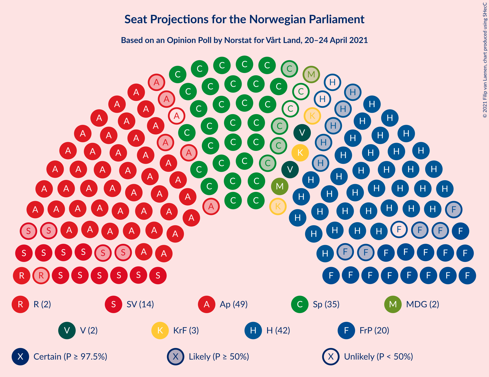

### Confidence Intervals

| Party | Last Result | Median | 80% Confidence Interval | 90% Confidence Interval | 95% Confidence Interval | 99% Confidence Interval |
|:-----:|:-----------:|:------:|:-----------------------:|:-----------------------:|:-----------------------:|:-----------------------:|
| <a href="#arbeiderpartiet">Arbeiderpartiet</a> | 49 | 48 | 44–52 |44–52 |43–54 |41–56 |
| <a href="#høyre">Høyre</a> | 45 | 40 | 36–42 |35–43 |34–45 |33–49 |
| <a href="#senterpartiet">Senterpartiet</a> | 19 | 33 | 31–37 |30–38 |29–39 |27–39 |
| <a href="#fremskrittspartiet">Fremskrittspartiet</a> | 27 | 19 | 16–21 |15–22 |14–22 |13–23 |
| <a href="#sosialistisk-venstreparti">Sosialistisk Venstreparti</a> | 11 | 14 | 12–16 |11–16 |11–17 |10–18 |
| <a href="#kristelig-folkeparti">Kristelig Folkeparti</a> | 8 | 3 | 2–8 |1–9 |1–9 |1–10 |
| <a href="#rødt">Rødt</a> | 1 | 2 | 2–8 |2–9 |2–9 |1–10 |
| <a href="#miljøpartiet-de-grønne">Miljøpartiet De Grønne</a> | 1 | 2 | 1–8 |1–9 |1–9 |1–10 |
| <a href="#venstre">Venstre</a> | 8 | 2 | 2–3 |2–7 |1–8 |1–9 |

### Arbeiderpartiet

*For a full overview of the results for this party, see the [Arbeiderpartiet](party-arbeiderpartiet.html) page.*

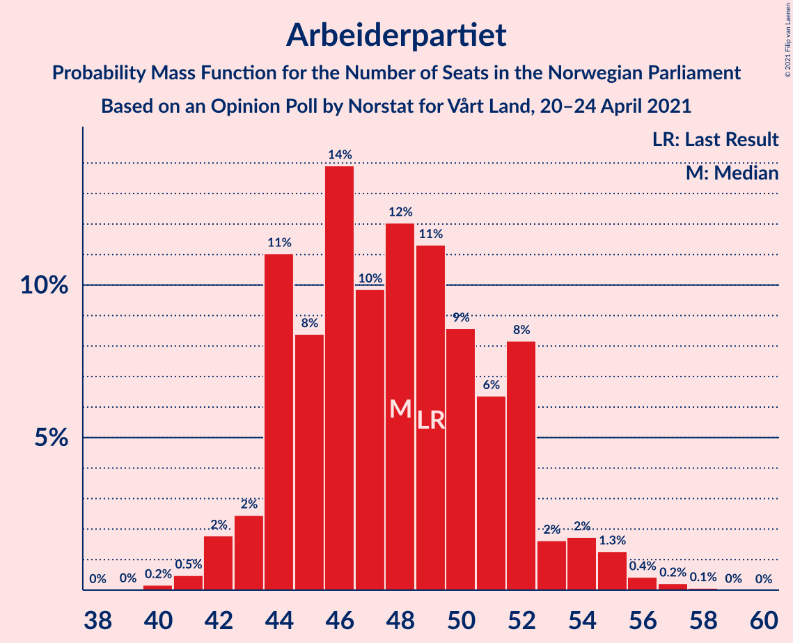

| Number of Seats | Probability | Accumulated | Special Marks |
|:---------------:|:-----------:|:-----------:|:-------------:|
| 40 | 0.2% | 100% |  |
| 41 | 0.4% | 99.8% |  |
| 42 | 1.3% | 99.4% |  |
| 43 | 2% | 98% |  |
| 44 | 10% | 96% |  |
| 45 | 7% | 86% |  |
| 46 | 11% | 79% |  |
| 47 | 13% | 68% |  |
| 48 | 15% | 56% | Median |
| 49 | 11% | 40% | Last Result |
| 50 | 9% | 30% |  |
| 51 | 5% | 20% |  |
| 52 | 11% | 16% |  |
| 53 | 1.5% | 4% |  |
| 54 | 2% | 3% |  |
| 55 | 0.2% | 0.7% |  |
| 56 | 0.3% | 0.5% |  |
| 57 | 0.1% | 0.2% |  |
| 58 | 0.1% | 0.1% |  |
| 59 | 0% | 0% |  |

### Høyre

*For a full overview of the results for this party, see the [Høyre](party-høyre.html) page.*

| Number of Seats | Probability | Accumulated | Special Marks |
|:---------------:|:-----------:|:-----------:|:-------------:|
| 32 | 0.1% | 100% |  |
| 33 | 0.9% | 99.9% |  |
| 34 | 2% | 99.0% |  |
| 35 | 3% | 97% |  |
| 36 | 4% | 94% |  |
| 37 | 7% | 90% |  |
| 38 | 12% | 83% |  |
| 39 | 15% | 71% |  |
| 40 | 26% | 57% | Median |
| 41 | 6% | 31% |  |
| 42 | 17% | 25% |  |
| 43 | 4% | 8% |  |
| 44 | 1.1% | 4% |  |
| 45 | 1.0% | 3% | Last Result |
| 46 | 0.6% | 2% |  |
| 47 | 0.6% | 2% |  |
| 48 | 0.6% | 1.1% |  |
| 49 | 0.5% | 0.5% |  |
| 50 | 0% | 0% |  |

### Senterpartiet

*For a full overview of the results for this party, see the [Senterpartiet](party-senterpartiet.html) page.*

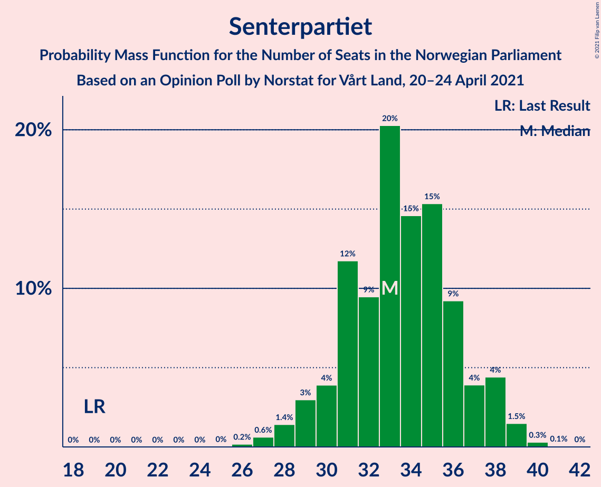

| Number of Seats | Probability | Accumulated | Special Marks |
|:---------------:|:-----------:|:-----------:|:-------------:|
| 19 | 0% | 100% | Last Result |
| 20 | 0% | 100% |  |
| 21 | 0% | 100% |  |
| 22 | 0% | 100% |  |
| 23 | 0% | 100% |  |
| 24 | 0% | 100% |  |
| 25 | 0% | 100% |  |
| 26 | 0.2% | 100% |  |
| 27 | 0.5% | 99.8% |  |
| 28 | 1.3% | 99.3% |  |
| 29 | 2% | 98% |  |
| 30 | 4% | 96% |  |
| 31 | 15% | 93% |  |
| 32 | 8% | 78% |  |
| 33 | 22% | 70% | Median |
| 34 | 12% | 48% |  |
| 35 | 14% | 35% |  |
| 36 | 9% | 21% |  |
| 37 | 4% | 13% |  |
| 38 | 6% | 9% |  |
| 39 | 2% | 3% |  |
| 40 | 0.4% | 0.4% |  |
| 41 | 0.1% | 0.1% |  |
| 42 | 0% | 0% |  |

### Fremskrittspartiet

*For a full overview of the results for this party, see the [Fremskrittspartiet](party-fremskrittspartiet.html) page.*

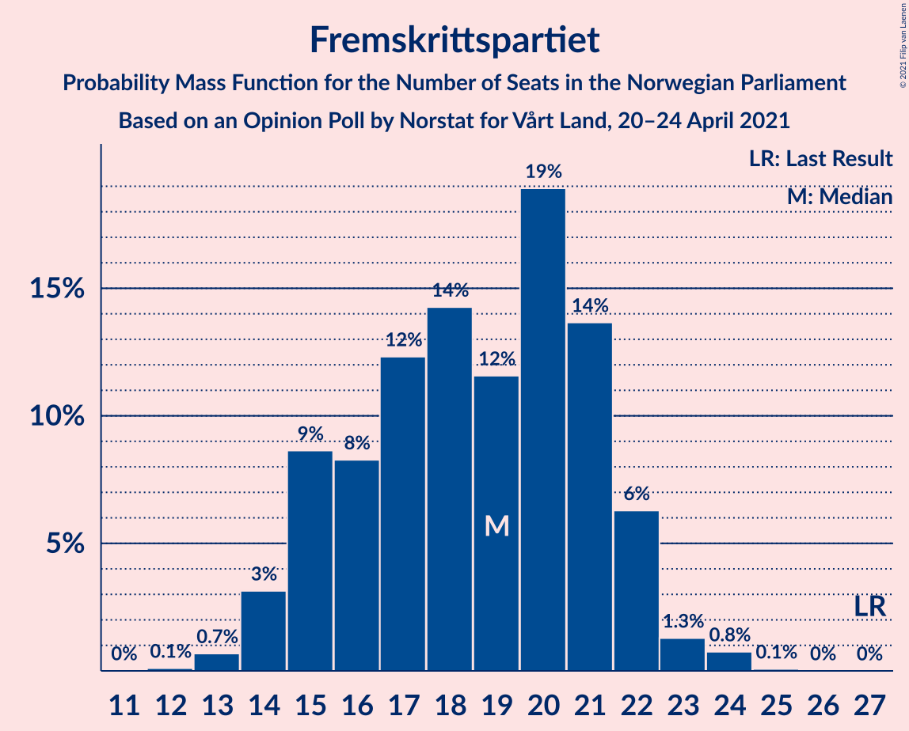

| Number of Seats | Probability | Accumulated | Special Marks |
|:---------------:|:-----------:|:-----------:|:-------------:|
| 12 | 0.1% | 100% |  |
| 13 | 0.8% | 99.9% |  |
| 14 | 2% | 99.1% |  |
| 15 | 5% | 97% |  |
| 16 | 6% | 93% |  |
| 17 | 9% | 86% |  |
| 18 | 13% | 77% |  |
| 19 | 15% | 63% | Median |
| 20 | 26% | 49% |  |
| 21 | 16% | 23% |  |
| 22 | 5% | 7% |  |
| 23 | 1.4% | 2% |  |
| 24 | 0.4% | 0.5% |  |
| 25 | 0.1% | 0.1% |  |
| 26 | 0% | 0% |  |
| 27 | 0% | 0% | Last Result |

### Sosialistisk Venstreparti

*For a full overview of the results for this party, see the [Sosialistisk Venstreparti](party-sosialistiskvenstreparti.html) page.*

| Number of Seats | Probability | Accumulated | Special Marks |
|:---------------:|:-----------:|:-----------:|:-------------:|
| 9 | 0.3% | 100% |  |
| 10 | 2% | 99.7% |  |
| 11 | 7% | 98% | Last Result |
| 12 | 11% | 91% |  |
| 13 | 16% | 80% |  |
| 14 | 31% | 64% | Median |
| 15 | 20% | 33% |  |
| 16 | 10% | 13% |  |
| 17 | 2% | 3% |  |
| 18 | 0.5% | 0.7% |  |
| 19 | 0.1% | 0.2% |  |
| 20 | 0% | 0% |  |

### Kristelig Folkeparti

*For a full overview of the results for this party, see the [Kristelig Folkeparti](party-kristeligfolkeparti.html) page.*

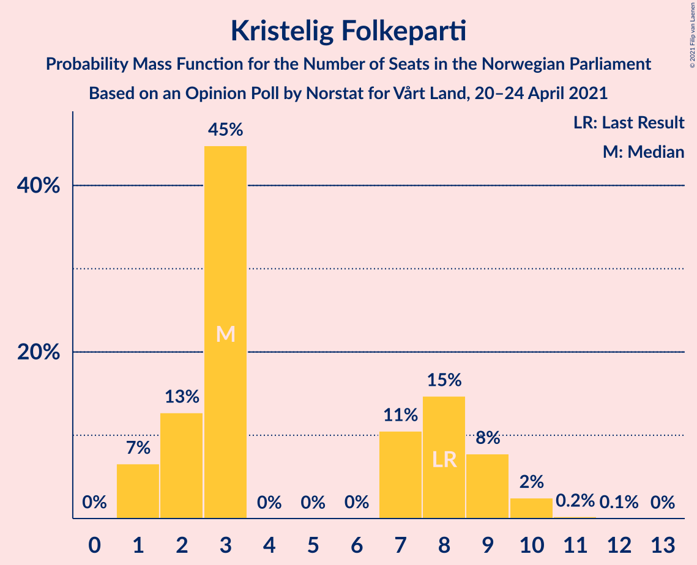

| Number of Seats | Probability | Accumulated | Special Marks |
|:---------------:|:-----------:|:-----------:|:-------------:|
| 1 | 8% | 100% |  |
| 2 | 8% | 92% |  |
| 3 | 53% | 84% | Median |
| 4 | 0% | 31% |  |
| 5 | 0% | 31% |  |
| 6 | 0% | 31% |  |
| 7 | 7% | 31% |  |
| 8 | 16% | 24% | Last Result |
| 9 | 6% | 8% |  |
| 10 | 1.5% | 2% |  |
| 11 | 0.3% | 0.3% |  |
| 12 | 0% | 0% |  |

### Rødt

*For a full overview of the results for this party, see the [Rødt](party-rødt.html) page.*

| Number of Seats | Probability | Accumulated | Special Marks |
|:---------------:|:-----------:|:-----------:|:-------------:|
| 1 | 2% | 100% | Last Result |
| 2 | 54% | 98% | Median |
| 3 | 0% | 43% |  |
| 4 | 0% | 43% |  |
| 5 | 0% | 43% |  |
| 6 | 0.6% | 43% |  |
| 7 | 15% | 43% |  |
| 8 | 22% | 28% |  |
| 9 | 5% | 6% |  |
| 10 | 0.5% | 0.6% |  |
| 11 | 0.1% | 0.1% |  |
| 12 | 0% | 0% |  |

### Miljøpartiet De Grønne

*For a full overview of the results for this party, see the [Miljøpartiet De Grønne](party-miljøpartietdegrønne.html) page.*

| Number of Seats | Probability | Accumulated | Special Marks |
|:---------------:|:-----------:|:-----------:|:-------------:|
| 1 | 12% | 100% | Last Result |
| 2 | 51% | 88% | Median |
| 3 | 17% | 37% |  |
| 4 | 0.9% | 20% |  |
| 5 | 0% | 19% |  |
| 6 | 0.1% | 19% |  |
| 7 | 4% | 19% |  |
| 8 | 9% | 15% |  |
| 9 | 5% | 6% |  |
| 10 | 0.7% | 1.0% |  |
| 11 | 0.2% | 0.2% |  |
| 12 | 0% | 0% |  |

### Venstre

*For a full overview of the results for this party, see the [Venstre](party-venstre.html) page.*

| Number of Seats | Probability | Accumulated | Special Marks |
|:---------------:|:-----------:|:-----------:|:-------------:|
| 0 | 0.1% | 100% |  |
| 1 | 3% | 99.9% |  |
| 2 | 84% | 97% | Median |
| 3 | 7% | 13% |  |
| 4 | 0% | 6% |  |
| 5 | 0% | 6% |  |
| 6 | 0.1% | 6% |  |
| 7 | 1.5% | 6% |  |
| 8 | 4% | 5% | Last Result |
| 9 | 0.5% | 0.6% |  |
| 10 | 0.1% | 0.1% |  |
| 11 | 0% | 0% |  |

## Coalitions

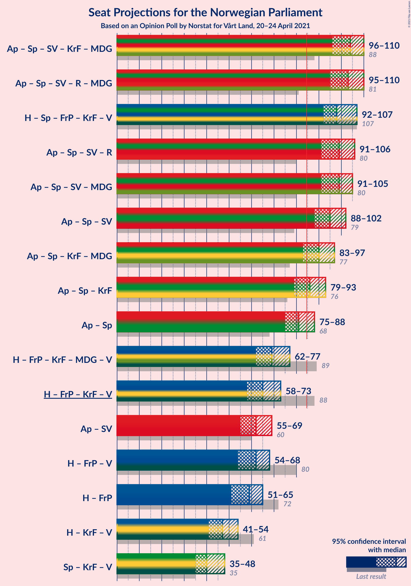

### Confidence Intervals

| Coalition | Last Result | Median | Majority? | 80% Confidence Interval | 90% Confidence Interval | 95% Confidence Interval | 99% Confidence Interval |
|:---------:|:-----------:|:------:|:---------:|:-----------------------:|:-----------------------:|:-----------------------:|:-----------------------:|
| Arbeiderpartiet – Senterpartiet – Sosialistisk Venstreparti – Kristelig Folkeparti – Miljøpartiet De Grønne | 88 | 104 | 100% | 99–107 | 98–109 | 97–110 | 94–112 |
| Arbeiderpartiet – Senterpartiet – Sosialistisk Venstreparti – Rødt – Miljøpartiet De Grønne | 81 | 104 | 100% | 99–107 | 97–109 | 95–110 | 93–112 |
| Arbeiderpartiet – Senterpartiet – Sosialistisk Venstreparti – Rødt | 80 | 101 | 100% | 95–104 | 93–105 | 92–107 | 89–108 |
| Høyre – Senterpartiet – Fremskrittspartiet – Kristelig Folkeparti – Venstre | 107 | 98 | 100% | 95–103 | 94–106 | 92–107 | 89–108 |
| Arbeiderpartiet – Senterpartiet – Sosialistisk Venstreparti – Miljøpartiet De Grønne | 80 | 98 | 100% | 95–103 | 93–104 | 92–105 | 89–106 |
| Arbeiderpartiet – Senterpartiet – Sosialistisk Venstreparti | 79 | 95 | 99.8% | 90–100 | 90–101 | 88–102 | 86–104 |
| Arbeiderpartiet – Senterpartiet – Kristelig Folkeparti – Miljøpartiet De Grønne | 77 | 90 | 86% | 84–94 | 83–95 | 83–97 | 81–99 |
| Arbeiderpartiet – Senterpartiet – Kristelig Folkeparti | 76 | 86 | 66% | 82–90 | 80–91 | 79–93 | 77–95 |
| Arbeiderpartiet – Senterpartiet | 68 | 81 | 28% | 78–86 | 76–87 | 75–88 | 72–90 |
| Høyre – Fremskrittspartiet – Kristelig Folkeparti – Miljøpartiet De Grønne – Venstre | 89 | 68 | 0% | 64–74 | 63–75 | 62–77 | 60–79 |
| Høyre – Fremskrittspartiet – Kristelig Folkeparti – Venstre | 88 | 65 | 0% | 61–70 | 59–72 | 59–73 | 56–76 |
| Høyre – Fremskrittspartiet – Venstre | 80 | 62 | 0% | 56–65 | 55–67 | 54–68 | 52–70 |
| Arbeiderpartiet – Sosialistisk Venstreparti | 60 | 62 | 0% | 57–66 | 56–66 | 55–67 | 53–71 |
| Høyre – Fremskrittspartiet | 72 | 59 | 0% | 54–62 | 53–64 | 51–65 | 49–67 |
| Høyre – Kristelig Folkeparti – Venstre | 61 | 46 | 0% | 42–51 | 41–52 | 41–54 | 39–56 |
| Senterpartiet – Kristelig Folkeparti – Venstre | 35 | 40 | 0% | 36–45 | 36–46 | 35–48 | 32–51 |

### Arbeiderpartiet – Senterpartiet – Sosialistisk Venstreparti – Kristelig Folkeparti – Miljøpartiet De Grønne

| Number of Seats | Probability | Accumulated | Special Marks |
|:---------------:|:-----------:|:-----------:|:-------------:|
| 88 | 0% | 100% | Last Result |
| 89 | 0% | 100% |  |
| 90 | 0% | 100% |  |
| 91 | 0.1% | 100% |  |
| 92 | 0.1% | 99.9% |  |
| 93 | 0.2% | 99.8% |  |
| 94 | 0.2% | 99.6% |  |
| 95 | 0.4% | 99.3% |  |
| 96 | 1.0% | 99.0% |  |
| 97 | 1.4% | 98% |  |
| 98 | 3% | 97% |  |
| 99 | 19% | 93% |  |
| 100 | 5% | 74% | Median |
| 101 | 5% | 70% |  |
| 102 | 8% | 65% |  |
| 103 | 6% | 57% |  |
| 104 | 4% | 51% |  |
| 105 | 26% | 47% |  |
| 106 | 9% | 21% |  |
| 107 | 4% | 12% |  |
| 108 | 3% | 8% |  |
| 109 | 2% | 5% |  |
| 110 | 2% | 3% |  |
| 111 | 0.5% | 1.1% |  |
| 112 | 0.4% | 0.6% |  |
| 113 | 0.1% | 0.2% |  |
| 114 | 0.1% | 0.1% |  |
| 115 | 0% | 0% |  |

### Arbeiderpartiet – Senterpartiet – Sosialistisk Venstreparti – Rødt – Miljøpartiet De Grønne

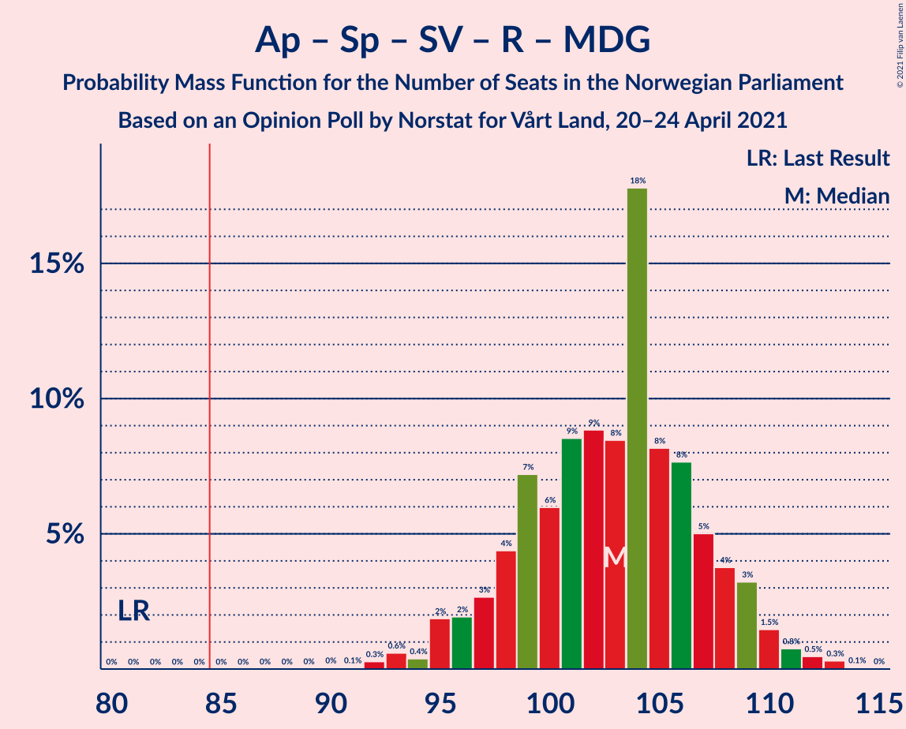

| Number of Seats | Probability | Accumulated | Special Marks |
|:---------------:|:-----------:|:-----------:|:-------------:|
| 81 | 0% | 100% | Last Result |
| 82 | 0% | 100% |  |
| 83 | 0% | 100% |  |
| 84 | 0% | 100% |  |
| 85 | 0% | 100% | Majority |
| 86 | 0% | 100% |  |
| 87 | 0% | 100% |  |
| 88 | 0% | 100% |  |
| 89 | 0% | 100% |  |
| 90 | 0.1% | 100% |  |
| 91 | 0.1% | 99.9% |  |
| 92 | 0.2% | 99.8% |  |
| 93 | 0.5% | 99.6% |  |
| 94 | 0.3% | 99.2% |  |
| 95 | 2% | 98.8% |  |
| 96 | 2% | 97% |  |
| 97 | 2% | 95% |  |
| 98 | 2% | 93% |  |
| 99 | 10% | 91% | Median |
| 100 | 4% | 81% |  |
| 101 | 4% | 77% |  |
| 102 | 7% | 74% |  |
| 103 | 9% | 67% |  |
| 104 | 29% | 57% |  |
| 105 | 7% | 29% |  |
| 106 | 8% | 22% |  |
| 107 | 5% | 14% |  |
| 108 | 3% | 9% |  |
| 109 | 2% | 6% |  |
| 110 | 2% | 4% |  |
| 111 | 0.5% | 2% |  |
| 112 | 0.7% | 1.1% |  |
| 113 | 0.4% | 0.5% |  |
| 114 | 0.1% | 0.1% |  |
| 115 | 0% | 0% |  |

### Arbeiderpartiet – Senterpartiet – Sosialistisk Venstreparti – Rødt

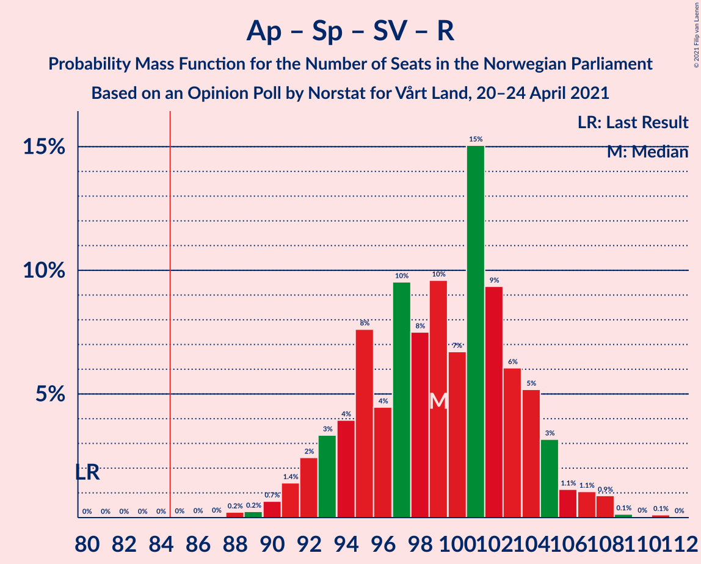

| Number of Seats | Probability | Accumulated | Special Marks |
|:---------------:|:-----------:|:-----------:|:-------------:|
| 80 | 0% | 100% | Last Result |
| 81 | 0% | 100% |  |
| 82 | 0% | 100% |  |
| 83 | 0% | 100% |  |
| 84 | 0% | 100% |  |
| 85 | 0% | 100% | Majority |
| 86 | 0% | 100% |  |
| 87 | 0% | 99.9% |  |
| 88 | 0.3% | 99.9% |  |
| 89 | 0.2% | 99.6% |  |
| 90 | 0.4% | 99.4% |  |
| 91 | 0.9% | 99.0% |  |
| 92 | 2% | 98% |  |
| 93 | 2% | 97% |  |
| 94 | 3% | 94% |  |
| 95 | 5% | 91% |  |
| 96 | 3% | 87% |  |
| 97 | 11% | 84% | Median |
| 98 | 7% | 73% |  |
| 99 | 5% | 66% |  |
| 100 | 5% | 61% |  |
| 101 | 20% | 55% |  |
| 102 | 14% | 35% |  |
| 103 | 9% | 21% |  |
| 104 | 4% | 12% |  |
| 105 | 5% | 8% |  |
| 106 | 0.8% | 4% |  |
| 107 | 0.9% | 3% |  |
| 108 | 2% | 2% |  |
| 109 | 0.2% | 0.4% |  |
| 110 | 0% | 0.2% |  |
| 111 | 0.2% | 0.2% |  |
| 112 | 0% | 0% |  |

### Høyre – Senterpartiet – Fremskrittspartiet – Kristelig Folkeparti – Venstre

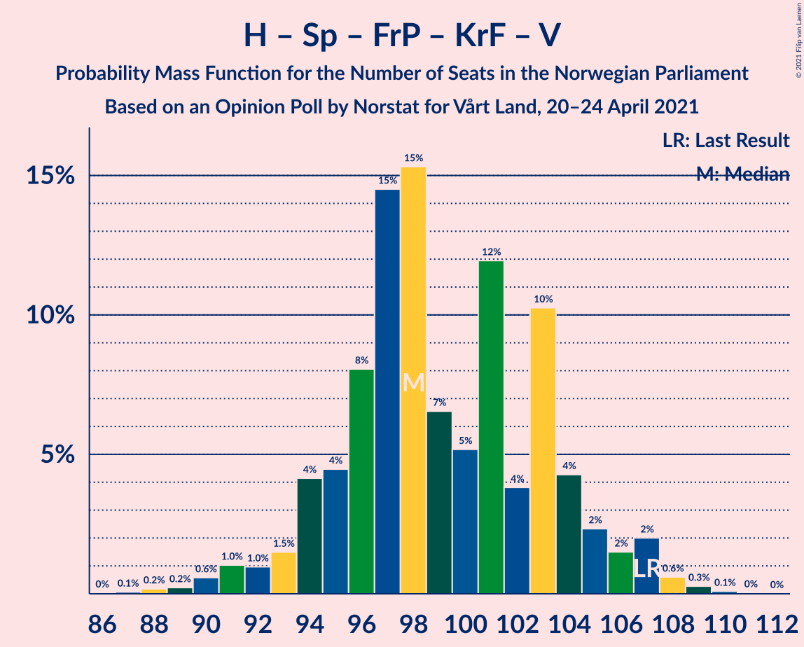

| Number of Seats | Probability | Accumulated | Special Marks |
|:---------------:|:-----------:|:-----------:|:-------------:|
| 86 | 0% | 100% |  |
| 87 | 0.1% | 99.9% |  |
| 88 | 0.2% | 99.8% |  |
| 89 | 0.1% | 99.6% |  |
| 90 | 0.4% | 99.5% |  |
| 91 | 0.9% | 99.0% |  |
| 92 | 1.2% | 98% |  |
| 93 | 1.3% | 97% |  |
| 94 | 3% | 96% |  |
| 95 | 5% | 92% |  |
| 96 | 5% | 88% |  |
| 97 | 17% | 82% | Median |
| 98 | 22% | 65% |  |
| 99 | 6% | 43% |  |
| 100 | 3% | 37% |  |
| 101 | 8% | 34% |  |
| 102 | 3% | 25% |  |
| 103 | 13% | 22% |  |
| 104 | 3% | 9% |  |
| 105 | 1.0% | 6% |  |
| 106 | 2% | 5% |  |
| 107 | 3% | 4% | Last Result |
| 108 | 0.7% | 1.1% |  |
| 109 | 0.3% | 0.4% |  |
| 110 | 0.1% | 0.2% |  |
| 111 | 0% | 0.1% |  |
| 112 | 0% | 0% |  |

### Arbeiderpartiet – Senterpartiet – Sosialistisk Venstreparti – Miljøpartiet De Grønne

| Number of Seats | Probability | Accumulated | Special Marks |
|:---------------:|:-----------:|:-----------:|:-------------:|
| 80 | 0% | 100% | Last Result |
| 81 | 0% | 100% |  |
| 82 | 0% | 100% |  |
| 83 | 0% | 100% |  |
| 84 | 0% | 100% |  |
| 85 | 0% | 100% | Majority |
| 86 | 0% | 100% |  |
| 87 | 0% | 99.9% |  |
| 88 | 0.1% | 99.9% |  |
| 89 | 0.4% | 99.8% |  |
| 90 | 1.0% | 99.4% |  |
| 91 | 0.7% | 98% |  |
| 92 | 1.2% | 98% |  |
| 93 | 3% | 96% |  |
| 94 | 3% | 94% |  |
| 95 | 3% | 91% |  |
| 96 | 20% | 88% |  |
| 97 | 11% | 68% | Median |
| 98 | 8% | 56% |  |
| 99 | 6% | 49% |  |
| 100 | 9% | 43% |  |
| 101 | 3% | 35% |  |
| 102 | 20% | 32% |  |
| 103 | 6% | 12% |  |
| 104 | 3% | 6% |  |
| 105 | 2% | 3% |  |
| 106 | 0.4% | 0.8% |  |
| 107 | 0.2% | 0.4% |  |
| 108 | 0.1% | 0.2% |  |
| 109 | 0% | 0.1% |  |
| 110 | 0% | 0.1% |  |
| 111 | 0% | 0% |  |

### Arbeiderpartiet – Senterpartiet – Sosialistisk Venstreparti

| Number of Seats | Probability | Accumulated | Special Marks |
|:---------------:|:-----------:|:-----------:|:-------------:|
| 79 | 0% | 100% | Last Result |
| 80 | 0% | 100% |  |
| 81 | 0% | 100% |  |
| 82 | 0% | 100% |  |
| 83 | 0.1% | 100% |  |
| 84 | 0.1% | 99.9% |  |
| 85 | 0.2% | 99.8% | Majority |
| 86 | 0.6% | 99.7% |  |
| 87 | 1.3% | 99.1% |  |
| 88 | 1.1% | 98% |  |
| 89 | 2% | 97% |  |
| 90 | 5% | 95% |  |
| 91 | 5% | 90% |  |
| 92 | 5% | 85% |  |
| 93 | 5% | 80% |  |
| 94 | 17% | 76% |  |
| 95 | 15% | 58% | Median |
| 96 | 5% | 43% |  |
| 97 | 7% | 38% |  |
| 98 | 5% | 31% |  |
| 99 | 11% | 26% |  |
| 100 | 10% | 15% |  |
| 101 | 2% | 5% |  |
| 102 | 0.9% | 3% |  |
| 103 | 1.4% | 2% |  |
| 104 | 0.4% | 0.6% |  |
| 105 | 0.2% | 0.2% |  |
| 106 | 0% | 0.1% |  |
| 107 | 0% | 0% |  |

### Arbeiderpartiet – Senterpartiet – Kristelig Folkeparti – Miljøpartiet De Grønne

| Number of Seats | Probability | Accumulated | Special Marks |
|:---------------:|:-----------:|:-----------:|:-------------:|
| 77 | 0% | 100% | Last Result |
| 78 | 0.1% | 99.9% |  |
| 79 | 0.1% | 99.9% |  |
| 80 | 0.2% | 99.8% |  |
| 81 | 0.7% | 99.6% |  |
| 82 | 1.1% | 98.9% |  |
| 83 | 3% | 98% |  |
| 84 | 9% | 95% |  |
| 85 | 6% | 86% | Majority |
| 86 | 10% | 80% | Median |
| 87 | 5% | 70% |  |
| 88 | 3% | 64% |  |
| 89 | 7% | 61% |  |
| 90 | 10% | 54% |  |
| 91 | 22% | 44% |  |
| 92 | 4% | 22% |  |
| 93 | 3% | 17% |  |
| 94 | 8% | 14% |  |
| 95 | 2% | 7% |  |
| 96 | 2% | 5% |  |
| 97 | 2% | 3% |  |
| 98 | 0.4% | 1.2% |  |
| 99 | 0.6% | 0.8% |  |
| 100 | 0.1% | 0.2% |  |
| 101 | 0.1% | 0.1% |  |
| 102 | 0% | 0% |  |

### Arbeiderpartiet – Senterpartiet – Kristelig Folkeparti

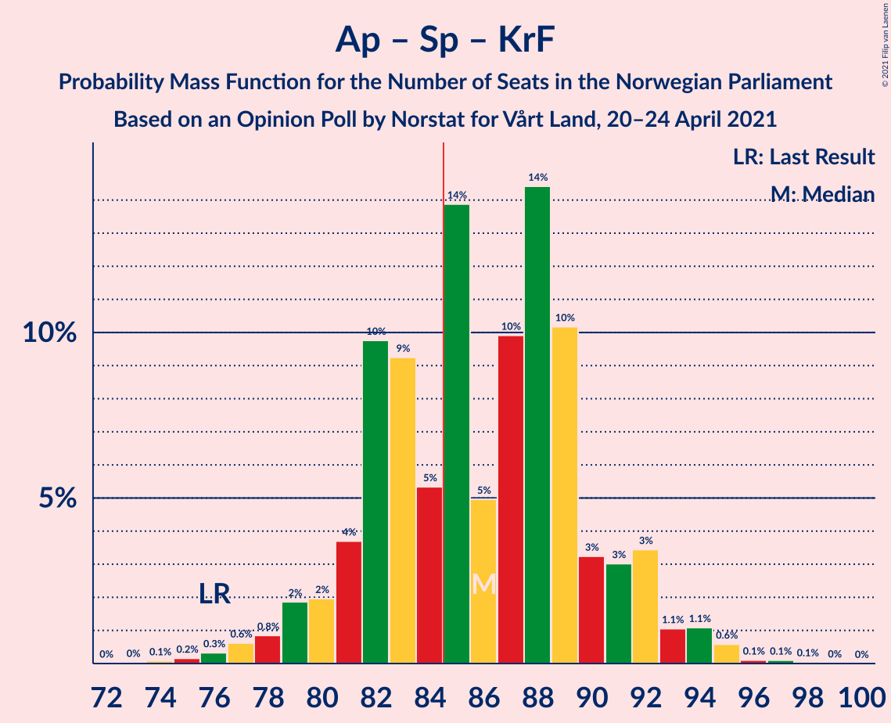

| Number of Seats | Probability | Accumulated | Special Marks |
|:---------------:|:-----------:|:-----------:|:-------------:|
| 74 | 0% | 100% |  |
| 75 | 0.2% | 99.9% |  |
| 76 | 0.1% | 99.8% | Last Result |
| 77 | 0.9% | 99.6% |  |
| 78 | 0.3% | 98.8% |  |
| 79 | 1.4% | 98% |  |
| 80 | 2% | 97% |  |
| 81 | 4% | 95% |  |
| 82 | 11% | 91% |  |
| 83 | 9% | 80% |  |
| 84 | 5% | 71% | Median |
| 85 | 11% | 66% | Majority |
| 86 | 5% | 55% |  |
| 87 | 7% | 49% |  |
| 88 | 20% | 42% |  |
| 89 | 11% | 22% |  |
| 90 | 4% | 11% |  |
| 91 | 3% | 8% |  |
| 92 | 2% | 5% |  |
| 93 | 0.6% | 3% |  |
| 94 | 1.4% | 2% |  |
| 95 | 0.4% | 0.5% |  |
| 96 | 0.1% | 0.2% |  |
| 97 | 0% | 0.1% |  |
| 98 | 0% | 0% |  |

### Arbeiderpartiet – Senterpartiet

| Number of Seats | Probability | Accumulated | Special Marks |
|:---------------:|:-----------:|:-----------:|:-------------:|
| 68 | 0% | 100% | Last Result |
| 69 | 0% | 100% |  |
| 70 | 0% | 100% |  |
| 71 | 0.1% | 99.9% |  |
| 72 | 0.5% | 99.8% |  |
| 73 | 0.3% | 99.4% |  |
| 74 | 1.3% | 99.1% |  |
| 75 | 1.1% | 98% |  |
| 76 | 3% | 97% |  |
| 77 | 3% | 94% |  |
| 78 | 5% | 91% |  |
| 79 | 14% | 86% |  |
| 80 | 18% | 71% |  |
| 81 | 5% | 53% | Median |
| 82 | 13% | 48% |  |
| 83 | 2% | 35% |  |
| 84 | 5% | 33% |  |
| 85 | 12% | 28% | Majority |
| 86 | 9% | 15% |  |
| 87 | 2% | 7% |  |
| 88 | 3% | 5% |  |
| 89 | 2% | 2% |  |
| 90 | 0.4% | 0.5% |  |
| 91 | 0.1% | 0.2% |  |
| 92 | 0% | 0.1% |  |
| 93 | 0% | 0.1% |  |
| 94 | 0% | 0% |  |

### Høyre – Fremskrittspartiet – Kristelig Folkeparti – Miljøpartiet De Grønne – Venstre

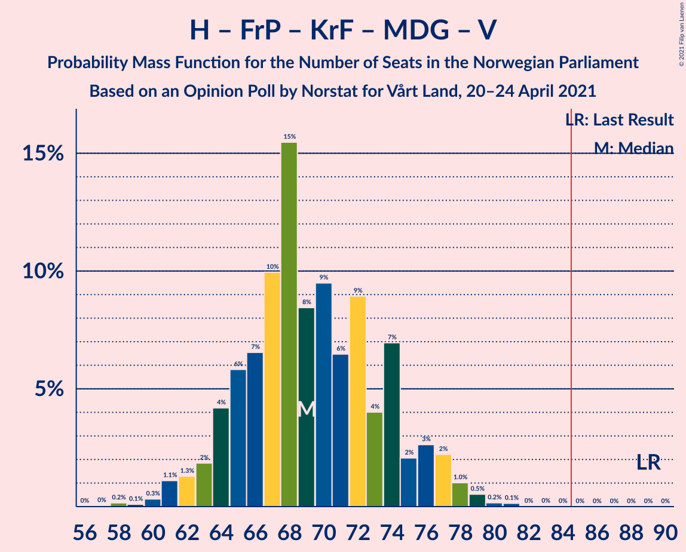

| Number of Seats | Probability | Accumulated | Special Marks |
|:---------------:|:-----------:|:-----------:|:-------------:|
| 57 | 0% | 100% |  |
| 58 | 0.3% | 99.9% |  |
| 59 | 0.1% | 99.7% |  |
| 60 | 0.3% | 99.6% |  |
| 61 | 2% | 99.3% |  |
| 62 | 1.2% | 98% |  |
| 63 | 1.5% | 96% |  |
| 64 | 6% | 95% |  |
| 65 | 4% | 89% |  |
| 66 | 9% | 85% | Median |
| 67 | 15% | 76% |  |
| 68 | 20% | 61% |  |
| 69 | 6% | 40% |  |
| 70 | 5% | 34% |  |
| 71 | 7% | 29% |  |
| 72 | 10% | 23% |  |
| 73 | 2% | 13% |  |
| 74 | 4% | 11% |  |
| 75 | 3% | 7% |  |
| 76 | 2% | 4% |  |
| 77 | 1.4% | 3% |  |
| 78 | 0.7% | 1.3% |  |
| 79 | 0.2% | 0.6% |  |
| 80 | 0.1% | 0.4% |  |
| 81 | 0.2% | 0.2% |  |
| 82 | 0% | 0% |  |
| 83 | 0% | 0% |  |
| 84 | 0% | 0% |  |
| 85 | 0% | 0% | Majority |
| 86 | 0% | 0% |  |
| 87 | 0% | 0% |  |
| 88 | 0% | 0% |  |
| 89 | 0% | 0% | Last Result |

### Høyre – Fremskrittspartiet – Kristelig Folkeparti – Venstre

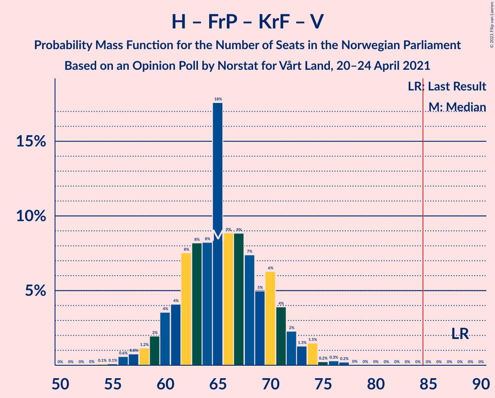

| Number of Seats | Probability | Accumulated | Special Marks |
|:---------------:|:-----------:|:-----------:|:-------------:|
| 54 | 0.1% | 100% |  |
| 55 | 0.1% | 99.9% |  |
| 56 | 0.5% | 99.7% |  |
| 57 | 0.8% | 99.3% |  |
| 58 | 0.7% | 98% |  |
| 59 | 3% | 98% |  |
| 60 | 2% | 95% |  |
| 61 | 3% | 92% |  |
| 62 | 7% | 89% |  |
| 63 | 8% | 83% |  |
| 64 | 7% | 74% | Median |
| 65 | 28% | 67% |  |
| 66 | 9% | 39% |  |
| 67 | 7% | 29% |  |
| 68 | 3% | 22% |  |
| 69 | 4% | 19% |  |
| 70 | 9% | 15% |  |
| 71 | 1.2% | 7% |  |
| 72 | 2% | 6% |  |
| 73 | 2% | 4% |  |
| 74 | 1.3% | 2% |  |
| 75 | 0.3% | 0.8% |  |
| 76 | 0.4% | 0.6% |  |
| 77 | 0.1% | 0.2% |  |
| 78 | 0% | 0.1% |  |
| 79 | 0% | 0% |  |
| 80 | 0% | 0% |  |
| 81 | 0% | 0% |  |
| 82 | 0% | 0% |  |
| 83 | 0% | 0% |  |
| 84 | 0% | 0% |  |
| 85 | 0% | 0% | Majority |
| 86 | 0% | 0% |  |
| 87 | 0% | 0% |  |
| 88 | 0% | 0% | Last Result |

### Høyre – Fremskrittspartiet – Venstre

| Number of Seats | Probability | Accumulated | Special Marks |
|:---------------:|:-----------:|:-----------:|:-------------:|
| 50 | 0.1% | 100% |  |
| 51 | 0.3% | 99.9% |  |
| 52 | 0.6% | 99.6% |  |
| 53 | 0.9% | 99.0% |  |
| 54 | 2% | 98% |  |
| 55 | 3% | 97% |  |
| 56 | 6% | 94% |  |
| 57 | 4% | 88% |  |
| 58 | 4% | 84% |  |
| 59 | 8% | 80% |  |
| 60 | 4% | 71% |  |
| 61 | 10% | 67% | Median |
| 62 | 32% | 57% |  |
| 63 | 10% | 25% |  |
| 64 | 4% | 15% |  |
| 65 | 2% | 11% |  |
| 66 | 3% | 8% |  |
| 67 | 2% | 5% |  |
| 68 | 0.9% | 3% |  |
| 69 | 0.9% | 2% |  |
| 70 | 0.8% | 1.0% |  |
| 71 | 0.1% | 0.2% |  |
| 72 | 0% | 0.1% |  |
| 73 | 0% | 0% |  |
| 74 | 0% | 0% |  |
| 75 | 0% | 0% |  |
| 76 | 0% | 0% |  |
| 77 | 0% | 0% |  |
| 78 | 0% | 0% |  |
| 79 | 0% | 0% |  |
| 80 | 0% | 0% | Last Result |

### Arbeiderpartiet – Sosialistisk Venstreparti

| Number of Seats | Probability | Accumulated | Special Marks |
|:---------------:|:-----------:|:-----------:|:-------------:|
| 51 | 0.1% | 100% |  |
| 52 | 0.1% | 99.9% |  |
| 53 | 0.4% | 99.8% |  |
| 54 | 0.6% | 99.4% |  |
| 55 | 3% | 98.7% |  |
| 56 | 5% | 96% |  |
| 57 | 4% | 91% |  |
| 58 | 5% | 87% |  |
| 59 | 6% | 82% |  |
| 60 | 6% | 76% | Last Result |
| 61 | 9% | 70% |  |
| 62 | 17% | 61% | Median |
| 63 | 17% | 44% |  |
| 64 | 7% | 27% |  |
| 65 | 4% | 21% |  |
| 66 | 13% | 17% |  |
| 67 | 2% | 4% |  |
| 68 | 0.7% | 2% |  |
| 69 | 0.4% | 1.0% |  |
| 70 | 0% | 0.6% |  |
| 71 | 0.2% | 0.6% |  |
| 72 | 0.3% | 0.3% |  |
| 73 | 0% | 0% |  |

### Høyre – Fremskrittspartiet

| Number of Seats | Probability | Accumulated | Special Marks |
|:---------------:|:-----------:|:-----------:|:-------------:|
| 48 | 0.2% | 100% |  |
| 49 | 0.5% | 99.8% |  |
| 50 | 0.8% | 99.3% |  |
| 51 | 1.3% | 98.5% |  |
| 52 | 2% | 97% |  |
| 53 | 3% | 95% |  |
| 54 | 6% | 92% |  |
| 55 | 4% | 87% |  |
| 56 | 4% | 82% |  |
| 57 | 8% | 78% |  |
| 58 | 6% | 70% |  |
| 59 | 14% | 64% | Median |
| 60 | 29% | 50% |  |
| 61 | 9% | 21% |  |
| 62 | 5% | 12% |  |
| 63 | 2% | 7% |  |
| 64 | 3% | 6% |  |
| 65 | 1.3% | 3% |  |
| 66 | 0.7% | 2% |  |
| 67 | 0.8% | 1.0% |  |
| 68 | 0.1% | 0.2% |  |
| 69 | 0.1% | 0.1% |  |
| 70 | 0% | 0% |  |
| 71 | 0% | 0% |  |
| 72 | 0% | 0% | Last Result |

### Høyre – Kristelig Folkeparti – Venstre

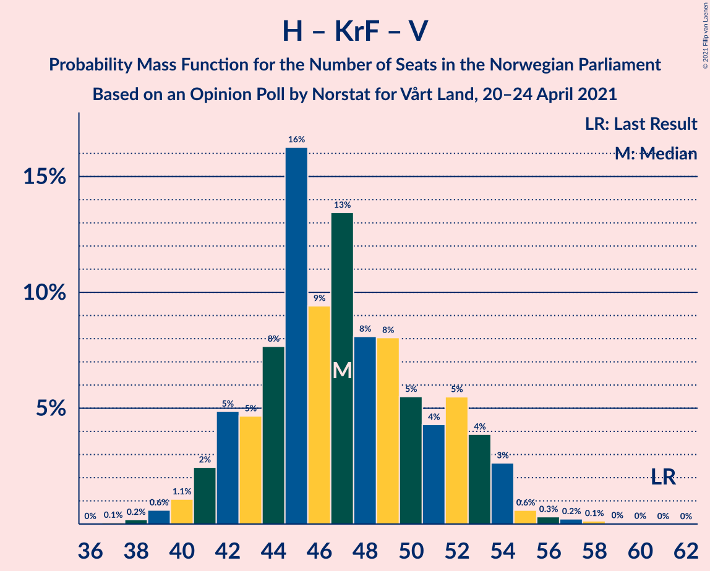

| Number of Seats | Probability | Accumulated | Special Marks |
|:---------------:|:-----------:|:-----------:|:-------------:|
| 37 | 0.1% | 100% |  |
| 38 | 0.2% | 99.9% |  |
| 39 | 0.6% | 99.7% |  |
| 40 | 1.1% | 99.1% |  |
| 41 | 4% | 98% |  |
| 42 | 6% | 94% |  |
| 43 | 3% | 89% |  |
| 44 | 11% | 85% |  |
| 45 | 23% | 75% | Median |
| 46 | 5% | 52% |  |
| 47 | 16% | 47% |  |
| 48 | 5% | 32% |  |
| 49 | 10% | 27% |  |
| 50 | 5% | 16% |  |
| 51 | 4% | 11% |  |
| 52 | 3% | 8% |  |
| 53 | 2% | 5% |  |
| 54 | 1.4% | 3% |  |
| 55 | 0.6% | 1.2% |  |
| 56 | 0.3% | 0.6% |  |
| 57 | 0.2% | 0.3% |  |
| 58 | 0.1% | 0.1% |  |
| 59 | 0% | 0% |  |
| 60 | 0% | 0% |  |
| 61 | 0% | 0% | Last Result |

### Senterpartiet – Kristelig Folkeparti – Venstre

| Number of Seats | Probability | Accumulated | Special Marks |
|:---------------:|:-----------:|:-----------:|:-------------:|
| 31 | 0.2% | 100% |  |
| 32 | 0.4% | 99.8% |  |
| 33 | 0.4% | 99.4% |  |
| 34 | 1.1% | 98.9% |  |
| 35 | 2% | 98% | Last Result |
| 36 | 9% | 96% |  |
| 37 | 7% | 87% |  |
| 38 | 15% | 80% | Median |
| 39 | 10% | 64% |  |
| 40 | 9% | 55% |  |
| 41 | 12% | 45% |  |
| 42 | 4% | 34% |  |
| 43 | 9% | 29% |  |
| 44 | 8% | 21% |  |
| 45 | 5% | 13% |  |
| 46 | 3% | 8% |  |
| 47 | 2% | 4% |  |
| 48 | 0.9% | 3% |  |
| 49 | 0.6% | 2% |  |
| 50 | 0.6% | 1.2% |  |
| 51 | 0.3% | 0.5% |  |
| 52 | 0.2% | 0.3% |  |
| 53 | 0.1% | 0.1% |  |
| 54 | 0% | 0% |  |

## Technical Information

### Opinion Poll

+ **Polling firm:** Norstat
+ **Commissioner(s):** Vårt Land
+ **Fieldwork period:** 20–24 April 2021

### Calculations

+ **Sample size:** 963
+ **Simulations done:** 524,288
+ **Error estimate:** 2.47%

