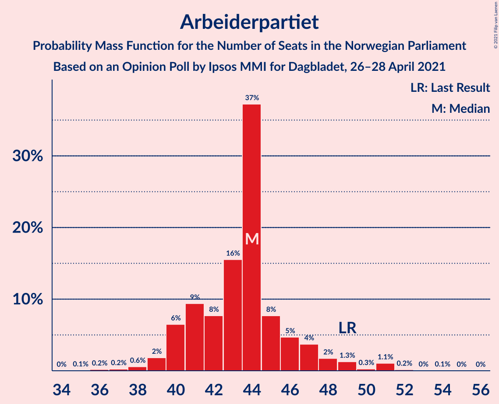
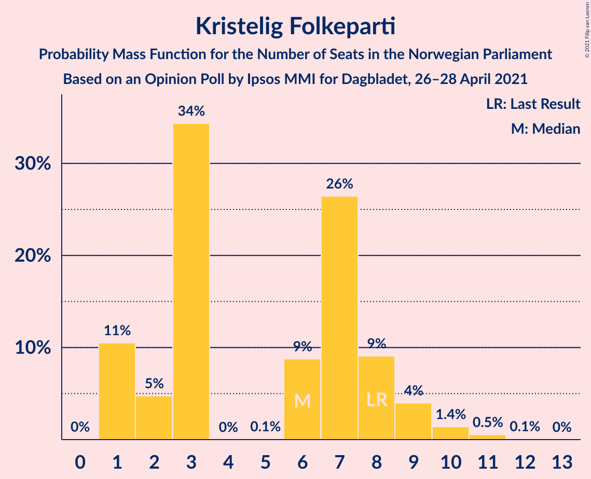
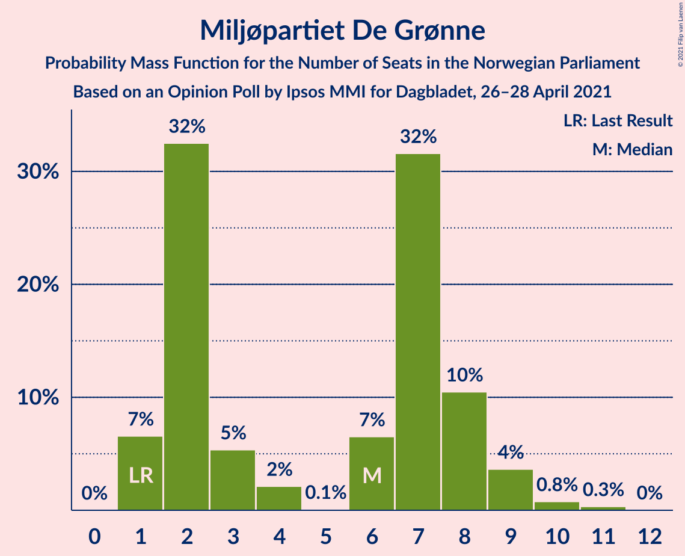
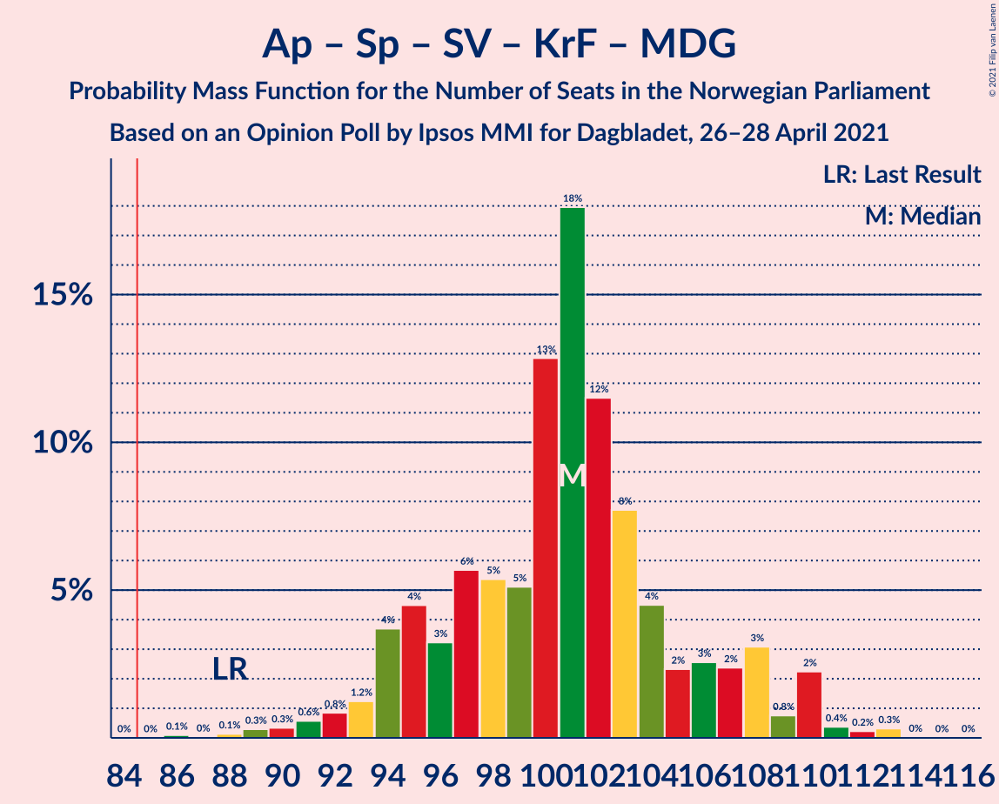
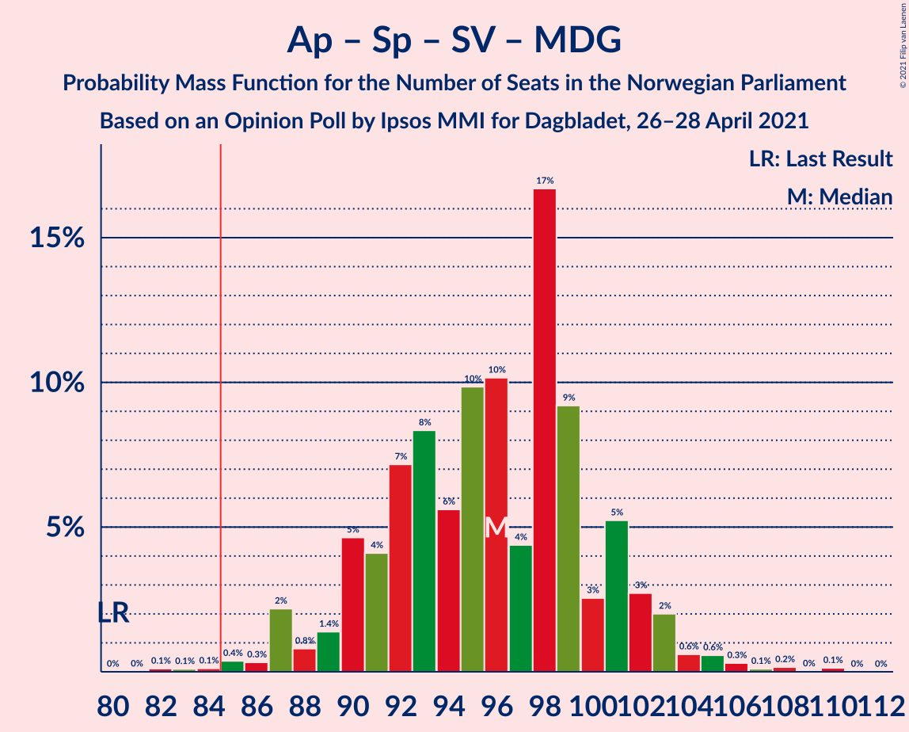
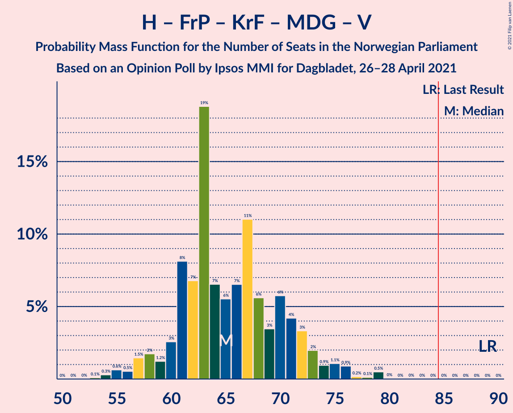
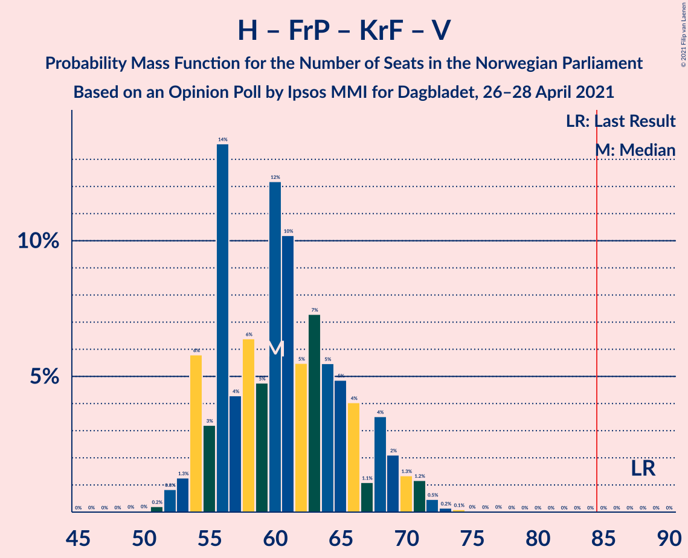
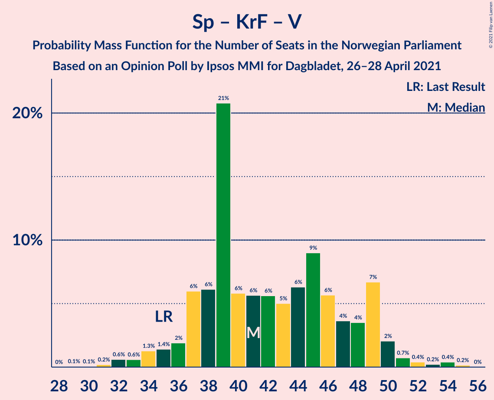

# Opinion Poll by Ipsos MMI for Dagbladet, 26–28 April 2021

<a href="#voting-intentions">Voting Intentions</a> | <a href="#seats">Seats</a> | <a href="#coalitions">Coalitions</a> | <a href="#technical-information">Technical Information</a>

## Voting Intentions

### Confidence Intervals

| Party | Last Result | Poll Result | 80% Confidence Interval | 90% Confidence Interval | 95% Confidence Interval | 99% Confidence Interval |
|:-----:|:-----------:|:-----------:|:-----------------------:|:-----------------------:|:-----------------------:|:-----------------------:|
| Arbeiderpartiet | 27.4% | 23.6% | 21.6–25.7% |21.1–26.3% |20.6–26.8% |19.7–27.8% |
| Høyre | 25.0% | 20.4% | 18.6–22.4% |18.1–23.0% |17.6–23.5% |16.8–24.5% |
| Senterpartiet | 10.3% | 17.5% | 15.8–19.4% |15.3–20.0% |14.9–20.5% |14.2–21.4% |
| Fremskrittspartiet | 15.2% | 9.5% | 8.2–11.0% |7.8–11.4% |7.5–11.8% |7.0–12.6% |
| Sosialistisk Venstreparti | 6.0% | 8.5% | 7.3–10.0% |7.0–10.4% |6.7–10.7% |6.1–11.5% |
| Rødt | 2.4% | 4.5% | 3.7–5.7% |3.4–6.0% |3.2–6.3% |2.9–6.9% |
| Kristelig Folkeparti | 4.2% | 4.0% | 3.2–5.1% |3.0–5.4% |2.8–5.7% |2.4–6.2% |
| Miljøpartiet De Grønne | 3.2% | 3.8% | 3.1–4.9% |2.9–5.2% |2.7–5.5% |2.3–6.1% |
| Venstre | 4.4% | 3.7% | 2.9–4.8% |2.7–5.1% |2.5–5.3% |2.2–5.9% |

*Note:* The poll result column reflects the actual value used in the calculations. Published results may vary slightly, and in addition be rounded to fewer digits.

## Seats

### Confidence Intervals

| Party | Last Result | Median | 80% Confidence Interval | 90% Confidence Interval | 95% Confidence Interval | 99% Confidence Interval |
|:-----:|:-----------:|:------:|:-----------------------:|:-----------------------:|:-----------------------:|:-----------------------:|
| <a href="#arbeiderpartiet">Arbeiderpartiet</a> | 49 | 43 | 40–45 |40–46 |39–48 |38–51 |
| <a href="#høyre">Høyre</a> | 45 | 35 | 33–39 |32–40 |32–41 |29–45 |
| <a href="#senterpartiet">Senterpartiet</a> | 19 | 35 | 30–37 |30–37 |28–37 |27–40 |
| <a href="#fremskrittspartiet">Fremskrittspartiet</a> | 27 | 16 | 13–18 |12–20 |12–21 |11–23 |
| <a href="#sosialistisk-venstreparti">Sosialistisk Venstreparti</a> | 11 | 14 | 12–16 |11–17 |10–18 |9–21 |
| <a href="#rødt">Rødt</a> | 1 | 7 | 2–9 |2–10 |2–10 |2–11 |
| <a href="#kristelig-folkeparti">Kristelig Folkeparti</a> | 8 | 3 | 3–8 |1–8 |1–9 |1–10 |
| <a href="#miljøpartiet-de-grønne">Miljøpartiet De Grønne</a> | 1 | 4 | 1–9 |1–9 |1–9 |1–11 |
| <a href="#venstre">Venstre</a> | 8 | 3 | 2–7 |2–8 |2–8 |1–10 |

### Arbeiderpartiet

*For a full overview of the results for this party, see the [Arbeiderpartiet](party-arbeiderpartiet.html) page.*

| Number of Seats | Probability | Accumulated | Special Marks |
|:---------------:|:-----------:|:-----------:|:-------------:|
| 33 | 0% | 100% |  |
| 34 | 0% | 99.9% |  |
| 35 | 0% | 99.9% |  |
| 36 | 0.1% | 99.9% |  |
| 37 | 0.2% | 99.8% |  |
| 38 | 1.2% | 99.5% |  |
| 39 | 3% | 98% |  |
| 40 | 10% | 96% |  |
| 41 | 11% | 85% |  |
| 42 | 12% | 74% |  |
| 43 | 24% | 62% | Median |
| 44 | 20% | 38% |  |
| 45 | 12% | 18% |  |
| 46 | 2% | 6% |  |
| 47 | 1.4% | 4% |  |
| 48 | 1.2% | 3% |  |
| 49 | 0.7% | 2% | Last Result |
| 50 | 0.6% | 1.2% |  |
| 51 | 0.5% | 0.6% |  |
| 52 | 0% | 0.2% |  |
| 53 | 0.1% | 0.1% |  |
| 54 | 0% | 0% |  |

### Høyre

*For a full overview of the results for this party, see the [Høyre](party-høyre.html) page.*

| Number of Seats | Probability | Accumulated | Special Marks |
|:---------------:|:-----------:|:-----------:|:-------------:|
| 27 | 0% | 100% |  |
| 28 | 0.1% | 99.9% |  |
| 29 | 0.6% | 99.8% |  |
| 30 | 0.2% | 99.3% |  |
| 31 | 1.4% | 99.1% |  |
| 32 | 3% | 98% |  |
| 33 | 7% | 95% |  |
| 34 | 20% | 88% |  |
| 35 | 34% | 68% | Median |
| 36 | 12% | 34% |  |
| 37 | 6% | 22% |  |
| 38 | 1.3% | 16% |  |
| 39 | 8% | 15% |  |
| 40 | 3% | 6% |  |
| 41 | 0.8% | 3% |  |
| 42 | 0.8% | 2% |  |
| 43 | 0.9% | 2% |  |
| 44 | 0.1% | 0.6% |  |
| 45 | 0.5% | 0.5% | Last Result |
| 46 | 0% | 0.1% |  |
| 47 | 0% | 0% |  |

### Senterpartiet

*For a full overview of the results for this party, see the [Senterpartiet](party-senterpartiet.html) page.*

| Number of Seats | Probability | Accumulated | Special Marks |
|:---------------:|:-----------:|:-----------:|:-------------:|
| 19 | 0% | 100% | Last Result |
| 20 | 0% | 100% |  |
| 21 | 0% | 100% |  |
| 22 | 0% | 100% |  |
| 23 | 0% | 100% |  |
| 24 | 0% | 100% |  |
| 25 | 0.1% | 99.9% |  |
| 26 | 0.3% | 99.8% |  |
| 27 | 1.4% | 99.6% |  |
| 28 | 1.4% | 98% |  |
| 29 | 1.2% | 97% |  |
| 30 | 7% | 95% |  |
| 31 | 11% | 88% |  |
| 32 | 13% | 78% |  |
| 33 | 6% | 65% |  |
| 34 | 8% | 58% |  |
| 35 | 26% | 51% | Median |
| 36 | 7% | 25% |  |
| 37 | 15% | 18% |  |
| 38 | 0.7% | 2% |  |
| 39 | 0.7% | 2% |  |
| 40 | 0.9% | 1.1% |  |
| 41 | 0.1% | 0.2% |  |
| 42 | 0.1% | 0.1% |  |
| 43 | 0% | 0% |  |

### Fremskrittspartiet

*For a full overview of the results for this party, see the [Fremskrittspartiet](party-fremskrittspartiet.html) page.*

| Number of Seats | Probability | Accumulated | Special Marks |
|:---------------:|:-----------:|:-----------:|:-------------:|
| 9 | 0% | 100% |  |
| 10 | 0.3% | 99.9% |  |
| 11 | 1.1% | 99.7% |  |
| 12 | 8% | 98.6% |  |
| 13 | 17% | 90% |  |
| 14 | 6% | 73% |  |
| 15 | 10% | 67% |  |
| 16 | 30% | 57% | Median |
| 17 | 14% | 27% |  |
| 18 | 4% | 13% |  |
| 19 | 4% | 9% |  |
| 20 | 2% | 5% |  |
| 21 | 3% | 3% |  |
| 22 | 0.1% | 0.8% |  |
| 23 | 0.5% | 0.6% |  |
| 24 | 0.1% | 0.1% |  |
| 25 | 0% | 0% |  |
| 26 | 0% | 0% |  |
| 27 | 0% | 0% | Last Result |

### Sosialistisk Venstreparti

*For a full overview of the results for this party, see the [Sosialistisk Venstreparti](party-sosialistiskvenstreparti.html) page.*

| Number of Seats | Probability | Accumulated | Special Marks |
|:---------------:|:-----------:|:-----------:|:-------------:|
| 9 | 0.7% | 100% |  |
| 10 | 3% | 99.2% |  |
| 11 | 4% | 96% | Last Result |
| 12 | 7% | 92% |  |
| 13 | 24% | 85% |  |
| 14 | 12% | 60% | Median |
| 15 | 27% | 49% |  |
| 16 | 15% | 22% |  |
| 17 | 3% | 7% |  |
| 18 | 2% | 3% |  |
| 19 | 0.6% | 1.4% |  |
| 20 | 0.2% | 0.7% |  |
| 21 | 0.5% | 0.6% |  |
| 22 | 0% | 0.1% |  |
| 23 | 0% | 0% |  |

### Rødt

*For a full overview of the results for this party, see the [Rødt](party-rødt.html) page.*

| Number of Seats | Probability | Accumulated | Special Marks |
|:---------------:|:-----------:|:-----------:|:-------------:|
| 1 | 0.2% | 100% | Last Result |
| 2 | 14% | 99.8% |  |
| 3 | 0% | 86% |  |
| 4 | 0% | 86% |  |
| 5 | 0% | 86% |  |
| 6 | 20% | 86% |  |
| 7 | 25% | 65% | Median |
| 8 | 28% | 40% |  |
| 9 | 6% | 11% |  |
| 10 | 4% | 5% |  |
| 11 | 0.7% | 1.2% |  |
| 12 | 0.4% | 0.5% |  |
| 13 | 0% | 0% |  |

### Kristelig Folkeparti

*For a full overview of the results for this party, see the [Kristelig Folkeparti](party-kristeligfolkeparti.html) page.*

| Number of Seats | Probability | Accumulated | Special Marks |
|:---------------:|:-----------:|:-----------:|:-------------:|
| 1 | 7% | 100% |  |
| 2 | 2% | 93% |  |
| 3 | 47% | 90% | Median |
| 4 | 0% | 43% |  |
| 5 | 0.6% | 43% |  |
| 6 | 15% | 42% |  |
| 7 | 7% | 27% |  |
| 8 | 16% | 21% | Last Result |
| 9 | 3% | 5% |  |
| 10 | 1.5% | 2% |  |
| 11 | 0.1% | 0.3% |  |
| 12 | 0.2% | 0.2% |  |
| 13 | 0% | 0% |  |

### Miljøpartiet De Grønne

*For a full overview of the results for this party, see the [Miljøpartiet De Grønne](party-miljøpartietdegrønne.html) page.*

| Number of Seats | Probability | Accumulated | Special Marks |
|:---------------:|:-----------:|:-----------:|:-------------:|
| 1 | 13% | 100% | Last Result |
| 2 | 35% | 87% |  |
| 3 | 1.4% | 52% |  |
| 4 | 1.4% | 50% | Median |
| 5 | 0% | 49% |  |
| 6 | 2% | 49% |  |
| 7 | 18% | 47% |  |
| 8 | 12% | 29% |  |
| 9 | 15% | 17% |  |
| 10 | 0.8% | 2% |  |
| 11 | 0.7% | 0.7% |  |
| 12 | 0% | 0% |  |

### Venstre

*For a full overview of the results for this party, see the [Venstre](party-venstre.html) page.*

| Number of Seats | Probability | Accumulated | Special Marks |
|:---------------:|:-----------:|:-----------:|:-------------:|
| 1 | 0.8% | 100% |  |
| 2 | 47% | 99.2% |  |
| 3 | 4% | 52% | Median |
| 4 | 0% | 48% |  |
| 5 | 0% | 48% |  |
| 6 | 18% | 48% |  |
| 7 | 20% | 29% |  |
| 8 | 8% | 10% | Last Result |
| 9 | 0.7% | 1.3% |  |
| 10 | 0.5% | 0.6% |  |
| 11 | 0.1% | 0.1% |  |
| 12 | 0% | 0% |  |

## Coalitions

### Confidence Intervals

| Coalition | Last Result | Median | Majority? | 80% Confidence Interval | 90% Confidence Interval | 95% Confidence Interval | 99% Confidence Interval |
|:---------:|:-----------:|:------:|:---------:|:-----------------------:|:-----------------------:|:-----------------------:|:-----------------------:|
| Arbeiderpartiet – Senterpartiet – Sosialistisk Venstreparti – Rødt – Miljøpartiet De Grønne | 81 | 102 | 100% | 98–109 | 97–109 | 95–109 | 92–110 |
| Arbeiderpartiet – Senterpartiet – Sosialistisk Venstreparti – Kristelig Folkeparti – Miljøpartiet De Grønne | 88 | 101 | 100% | 95–104 | 95–106 | 94–108 | 91–111 |
| Arbeiderpartiet – Senterpartiet – Sosialistisk Venstreparti – Rødt | 80 | 98 | 100% | 92–102 | 92–102 | 90–102 | 87–106 |
| Arbeiderpartiet – Senterpartiet – Sosialistisk Venstreparti – Miljøpartiet De Grønne | 80 | 95 | 99.9% | 91–101 | 90–101 | 89–102 | 85–106 |
| Høyre – Senterpartiet – Fremskrittspartiet – Kristelig Folkeparti – Venstre | 107 | 95 | 98.7% | 89–99 | 87–101 | 87–102 | 84–104 |
| Arbeiderpartiet – Senterpartiet – Sosialistisk Venstreparti | 79 | 92 | 96% | 85–95 | 85–95 | 84–95 | 82–98 |
| Arbeiderpartiet – Senterpartiet – Kristelig Folkeparti – Miljøpartiet De Grønne | 77 | 87 | 63% | 82–90 | 81–92 | 79–93 | 75–96 |
| Arbeiderpartiet – Senterpartiet – Kristelig Folkeparti | 76 | 81 | 25% | 75–86 | 75–88 | 74–89 | 71–90 |
| Arbeiderpartiet – Senterpartiet | 68 | 77 | 0.4% | 72–80 | 72–80 | 71–81 | 68–83 |
| Høyre – Fremskrittspartiet – Kristelig Folkeparti – Miljøpartiet De Grønne – Venstre | 89 | 64 | 0% | 58–70 | 57–72 | 57–73 | 56–75 |
| Høyre – Fremskrittspartiet – Kristelig Folkeparti – Venstre | 88 | 60 | 0% | 55–65 | 54–67 | 53–70 | 52–71 |
| Arbeiderpartiet – Sosialistisk Venstreparti | 60 | 57 | 0% | 53–60 | 53–61 | 51–64 | 49–67 |
| Høyre – Fremskrittspartiet – Venstre | 80 | 54 | 0% | 51–59 | 50–62 | 49–64 | 48–66 |
| Høyre – Fremskrittspartiet | 72 | 50 | 0% | 47–56 | 47–57 | 46–58 | 44–63 |
| Høyre – Kristelig Folkeparti – Venstre | 61 | 44 | 0% | 40–49 | 38–51 | 38–52 | 36–54 |
| Senterpartiet – Kristelig Folkeparti – Venstre | 35 | 42 | 0% | 37–49 | 35–49 | 35–50 | 32–53 |

### Arbeiderpartiet – Senterpartiet – Sosialistisk Venstreparti – Rødt – Miljøpartiet De Grønne

| Number of Seats | Probability | Accumulated | Special Marks |
|:---------------:|:-----------:|:-----------:|:-------------:|
| 81 | 0% | 100% | Last Result |
| 82 | 0% | 100% |  |
| 83 | 0% | 100% |  |
| 84 | 0% | 100% |  |
| 85 | 0% | 100% | Majority |
| 86 | 0% | 100% |  |
| 87 | 0% | 100% |  |
| 88 | 0% | 100% |  |
| 89 | 0% | 99.9% |  |
| 90 | 0% | 99.9% |  |
| 91 | 0% | 99.9% |  |
| 92 | 0.9% | 99.9% |  |
| 93 | 0.5% | 99.0% |  |
| 94 | 0.7% | 98.5% |  |
| 95 | 1.3% | 98% |  |
| 96 | 0.9% | 96% |  |
| 97 | 5% | 96% |  |
| 98 | 8% | 90% |  |
| 99 | 2% | 82% |  |
| 100 | 16% | 80% |  |
| 101 | 12% | 64% |  |
| 102 | 10% | 52% |  |
| 103 | 12% | 41% | Median |
| 104 | 2% | 30% |  |
| 105 | 2% | 28% |  |
| 106 | 6% | 26% |  |
| 107 | 6% | 20% |  |
| 108 | 2% | 14% |  |
| 109 | 11% | 13% |  |
| 110 | 1.3% | 2% |  |
| 111 | 0.2% | 0.3% |  |
| 112 | 0.1% | 0.2% |  |
| 113 | 0% | 0.1% |  |
| 114 | 0% | 0.1% |  |
| 115 | 0% | 0.1% |  |
| 116 | 0% | 0% |  |

### Arbeiderpartiet – Senterpartiet – Sosialistisk Venstreparti – Kristelig Folkeparti – Miljøpartiet De Grønne

| Number of Seats | Probability | Accumulated | Special Marks |
|:---------------:|:-----------:|:-----------:|:-------------:|
| 88 | 0.1% | 100% | Last Result |
| 89 | 0.1% | 99.9% |  |
| 90 | 0.1% | 99.8% |  |
| 91 | 0.8% | 99.7% |  |
| 92 | 0.5% | 98.9% |  |
| 93 | 0.6% | 98% |  |
| 94 | 2% | 98% |  |
| 95 | 6% | 96% |  |
| 96 | 8% | 89% |  |
| 97 | 6% | 81% |  |
| 98 | 4% | 75% |  |
| 99 | 10% | 72% | Median |
| 100 | 10% | 62% |  |
| 101 | 15% | 52% |  |
| 102 | 9% | 37% |  |
| 103 | 10% | 28% |  |
| 104 | 10% | 18% |  |
| 105 | 1.4% | 8% |  |
| 106 | 2% | 7% |  |
| 107 | 1.5% | 4% |  |
| 108 | 1.3% | 3% |  |
| 109 | 0.5% | 2% |  |
| 110 | 0.2% | 1.0% |  |
| 111 | 0.7% | 0.8% |  |
| 112 | 0.1% | 0.2% |  |
| 113 | 0% | 0.1% |  |
| 114 | 0% | 0.1% |  |
| 115 | 0% | 0% |  |

### Arbeiderpartiet – Senterpartiet – Sosialistisk Venstreparti – Rødt

| Number of Seats | Probability | Accumulated | Special Marks |
|:---------------:|:-----------:|:-----------:|:-------------:|
| 80 | 0% | 100% | Last Result |
| 81 | 0% | 100% |  |
| 82 | 0% | 100% |  |
| 83 | 0% | 100% |  |
| 84 | 0% | 100% |  |
| 85 | 0.1% | 100% | Majority |
| 86 | 0.2% | 99.9% |  |
| 87 | 0.3% | 99.7% |  |
| 88 | 0.2% | 99.4% |  |
| 89 | 0.5% | 99.2% |  |
| 90 | 3% | 98.7% |  |
| 91 | 0.7% | 96% |  |
| 92 | 6% | 95% |  |
| 93 | 6% | 89% |  |
| 94 | 2% | 83% |  |
| 95 | 10% | 81% |  |
| 96 | 9% | 71% |  |
| 97 | 4% | 63% |  |
| 98 | 12% | 59% |  |
| 99 | 16% | 47% | Median |
| 100 | 13% | 31% |  |
| 101 | 4% | 18% |  |
| 102 | 12% | 14% |  |
| 103 | 0.6% | 2% |  |
| 104 | 0.4% | 1.0% |  |
| 105 | 0.1% | 0.6% |  |
| 106 | 0.2% | 0.5% |  |
| 107 | 0.1% | 0.3% |  |
| 108 | 0.1% | 0.1% |  |
| 109 | 0% | 0.1% |  |
| 110 | 0% | 0% |  |

### Arbeiderpartiet – Senterpartiet – Sosialistisk Venstreparti – Miljøpartiet De Grønne

| Number of Seats | Probability | Accumulated | Special Marks |
|:---------------:|:-----------:|:-----------:|:-------------:|
| 80 | 0% | 100% | Last Result |
| 81 | 0% | 100% |  |
| 82 | 0% | 100% |  |
| 83 | 0% | 100% |  |
| 84 | 0% | 99.9% |  |
| 85 | 0.9% | 99.9% | Majority |
| 86 | 0.1% | 99.0% |  |
| 87 | 0.4% | 98.8% |  |
| 88 | 1.0% | 98% |  |
| 89 | 2% | 98% |  |
| 90 | 2% | 95% |  |
| 91 | 4% | 93% |  |
| 92 | 10% | 90% |  |
| 93 | 8% | 80% |  |
| 94 | 10% | 72% |  |
| 95 | 18% | 62% |  |
| 96 | 10% | 44% | Median |
| 97 | 2% | 34% |  |
| 98 | 5% | 32% |  |
| 99 | 8% | 27% |  |
| 100 | 5% | 19% |  |
| 101 | 9% | 13% |  |
| 102 | 2% | 4% |  |
| 103 | 0.8% | 2% |  |
| 104 | 0.4% | 1.5% |  |
| 105 | 0.1% | 1.1% |  |
| 106 | 0.8% | 1.0% |  |
| 107 | 0% | 0.1% |  |
| 108 | 0% | 0.1% |  |
| 109 | 0.1% | 0.1% |  |
| 110 | 0% | 0% |  |

### Høyre – Senterpartiet – Fremskrittspartiet – Kristelig Folkeparti – Venstre

| Number of Seats | Probability | Accumulated | Special Marks |
|:---------------:|:-----------:|:-----------:|:-------------:|
| 81 | 0% | 100% |  |
| 82 | 0.1% | 99.9% |  |
| 83 | 0% | 99.9% |  |
| 84 | 1.1% | 99.8% |  |
| 85 | 0.8% | 98.7% | Majority |
| 86 | 0.4% | 98% |  |
| 87 | 5% | 98% |  |
| 88 | 3% | 93% |  |
| 89 | 5% | 90% |  |
| 90 | 1.5% | 85% |  |
| 91 | 14% | 84% |  |
| 92 | 15% | 70% | Median |
| 93 | 3% | 55% |  |
| 94 | 1.0% | 52% |  |
| 95 | 19% | 51% |  |
| 96 | 3% | 32% |  |
| 97 | 16% | 28% |  |
| 98 | 2% | 12% |  |
| 99 | 3% | 11% |  |
| 100 | 2% | 7% |  |
| 101 | 2% | 5% |  |
| 102 | 2% | 3% |  |
| 103 | 0.3% | 1.0% |  |
| 104 | 0.2% | 0.7% |  |
| 105 | 0.1% | 0.5% |  |
| 106 | 0.4% | 0.4% |  |
| 107 | 0% | 0.1% | Last Result |
| 108 | 0% | 0.1% |  |
| 109 | 0% | 0% |  |

### Arbeiderpartiet – Senterpartiet – Sosialistisk Venstreparti

| Number of Seats | Probability | Accumulated | Special Marks |
|:---------------:|:-----------:|:-----------:|:-------------:|
| 79 | 0% | 100% | Last Result |
| 80 | 0.2% | 100% |  |
| 81 | 0.2% | 99.8% |  |
| 82 | 0.2% | 99.6% |  |
| 83 | 2% | 99.4% |  |
| 84 | 1.3% | 98% |  |
| 85 | 10% | 96% | Majority |
| 86 | 2% | 87% |  |
| 87 | 3% | 85% |  |
| 88 | 6% | 82% |  |
| 89 | 2% | 76% |  |
| 90 | 10% | 74% |  |
| 91 | 10% | 63% |  |
| 92 | 18% | 53% | Median |
| 93 | 18% | 35% |  |
| 94 | 3% | 17% |  |
| 95 | 11% | 14% |  |
| 96 | 0.5% | 2% |  |
| 97 | 0.8% | 2% |  |
| 98 | 0.5% | 0.8% |  |
| 99 | 0.1% | 0.3% |  |
| 100 | 0.1% | 0.2% |  |
| 101 | 0% | 0.1% |  |
| 102 | 0% | 0% |  |

### Arbeiderpartiet – Senterpartiet – Kristelig Folkeparti – Miljøpartiet De Grønne

| Number of Seats | Probability | Accumulated | Special Marks |
|:---------------:|:-----------:|:-----------:|:-------------:|
| 72 | 0.1% | 100% |  |
| 73 | 0% | 99.9% |  |
| 74 | 0.1% | 99.9% |  |
| 75 | 0.6% | 99.8% |  |
| 76 | 0.2% | 99.2% |  |
| 77 | 0.2% | 99.0% | Last Result |
| 78 | 0.6% | 98.8% |  |
| 79 | 0.9% | 98% |  |
| 80 | 1.1% | 97% |  |
| 81 | 2% | 96% |  |
| 82 | 13% | 94% |  |
| 83 | 5% | 81% |  |
| 84 | 13% | 76% |  |
| 85 | 6% | 63% | Median, Majority |
| 86 | 6% | 56% |  |
| 87 | 6% | 50% |  |
| 88 | 17% | 44% |  |
| 89 | 14% | 27% |  |
| 90 | 5% | 13% |  |
| 91 | 2% | 8% |  |
| 92 | 3% | 6% |  |
| 93 | 0.9% | 3% |  |
| 94 | 0.3% | 2% |  |
| 95 | 0.8% | 2% |  |
| 96 | 0.6% | 0.9% |  |
| 97 | 0.1% | 0.3% |  |
| 98 | 0% | 0.2% |  |
| 99 | 0.1% | 0.1% |  |
| 100 | 0% | 0% |  |

### Arbeiderpartiet – Senterpartiet – Kristelig Folkeparti

| Number of Seats | Probability | Accumulated | Special Marks |
|:---------------:|:-----------:|:-----------:|:-------------:|
| 68 | 0.1% | 100% |  |
| 69 | 0.1% | 99.9% |  |
| 70 | 0.1% | 99.9% |  |
| 71 | 0.5% | 99.8% |  |
| 72 | 0.7% | 99.3% |  |
| 73 | 0.1% | 98.6% |  |
| 74 | 2% | 98% |  |
| 75 | 10% | 97% |  |
| 76 | 4% | 87% | Last Result |
| 77 | 0.9% | 83% |  |
| 78 | 3% | 82% |  |
| 79 | 4% | 79% |  |
| 80 | 22% | 75% |  |
| 81 | 4% | 53% | Median |
| 82 | 11% | 49% |  |
| 83 | 10% | 38% |  |
| 84 | 3% | 28% |  |
| 85 | 3% | 25% | Majority |
| 86 | 16% | 22% |  |
| 87 | 0.8% | 6% |  |
| 88 | 2% | 6% |  |
| 89 | 3% | 3% |  |
| 90 | 0.4% | 0.9% |  |
| 91 | 0.4% | 0.5% |  |
| 92 | 0% | 0.1% |  |
| 93 | 0% | 0.1% |  |
| 94 | 0% | 0% |  |

### Arbeiderpartiet – Senterpartiet

| Number of Seats | Probability | Accumulated | Special Marks |
|:---------------:|:-----------:|:-----------:|:-------------:|
| 65 | 0.1% | 100% |  |
| 66 | 0.3% | 99.9% |  |
| 67 | 0.1% | 99.6% |  |
| 68 | 0.4% | 99.5% | Last Result |
| 69 | 0.3% | 99.1% |  |
| 70 | 1.1% | 98.8% |  |
| 71 | 2% | 98% |  |
| 72 | 13% | 95% |  |
| 73 | 3% | 83% |  |
| 74 | 5% | 80% |  |
| 75 | 10% | 75% |  |
| 76 | 5% | 65% |  |
| 77 | 17% | 60% |  |
| 78 | 7% | 43% | Median |
| 79 | 10% | 36% |  |
| 80 | 21% | 25% |  |
| 81 | 2% | 4% |  |
| 82 | 1.2% | 2% |  |
| 83 | 0.3% | 0.8% |  |
| 84 | 0.1% | 0.5% |  |
| 85 | 0.1% | 0.4% | Majority |
| 86 | 0.2% | 0.3% |  |
| 87 | 0.1% | 0.1% |  |
| 88 | 0% | 0% |  |

### Høyre – Fremskrittspartiet – Kristelig Folkeparti – Miljøpartiet De Grønne – Venstre

| Number of Seats | Probability | Accumulated | Special Marks |
|:---------------:|:-----------:|:-----------:|:-------------:|
| 53 | 0.2% | 100% |  |
| 54 | 0.1% | 99.8% |  |
| 55 | 0.1% | 99.7% |  |
| 56 | 0.3% | 99.6% |  |
| 57 | 8% | 99.3% |  |
| 58 | 2% | 91% |  |
| 59 | 0.8% | 90% |  |
| 60 | 3% | 89% |  |
| 61 | 5% | 86% | Median |
| 62 | 16% | 81% |  |
| 63 | 7% | 65% |  |
| 64 | 11% | 59% |  |
| 65 | 5% | 47% |  |
| 66 | 2% | 43% |  |
| 67 | 7% | 41% |  |
| 68 | 12% | 34% |  |
| 69 | 11% | 22% |  |
| 70 | 3% | 11% |  |
| 71 | 1.0% | 8% |  |
| 72 | 3% | 7% |  |
| 73 | 2% | 4% |  |
| 74 | 0.7% | 1.3% |  |
| 75 | 0.2% | 0.7% |  |
| 76 | 0.1% | 0.4% |  |
| 77 | 0.1% | 0.3% |  |
| 78 | 0.1% | 0.3% |  |
| 79 | 0% | 0.2% |  |
| 80 | 0.1% | 0.2% |  |
| 81 | 0% | 0% |  |
| 82 | 0% | 0% |  |
| 83 | 0% | 0% |  |
| 84 | 0% | 0% |  |
| 85 | 0% | 0% | Majority |
| 86 | 0% | 0% |  |
| 87 | 0% | 0% |  |
| 88 | 0% | 0% |  |
| 89 | 0% | 0% | Last Result |

### Høyre – Fremskrittspartiet – Kristelig Folkeparti – Venstre

| Number of Seats | Probability | Accumulated | Special Marks |
|:---------------:|:-----------:|:-----------:|:-------------:|
| 49 | 0% | 100% |  |
| 50 | 0.1% | 99.9% |  |
| 51 | 0.2% | 99.9% |  |
| 52 | 1.4% | 99.7% |  |
| 53 | 2% | 98% |  |
| 54 | 4% | 97% |  |
| 55 | 6% | 92% |  |
| 56 | 9% | 86% |  |
| 57 | 3% | 77% | Median |
| 58 | 2% | 74% |  |
| 59 | 2% | 72% |  |
| 60 | 34% | 70% |  |
| 61 | 11% | 36% |  |
| 62 | 8% | 25% |  |
| 63 | 3% | 17% |  |
| 64 | 3% | 14% |  |
| 65 | 3% | 11% |  |
| 66 | 3% | 9% |  |
| 67 | 1.2% | 6% |  |
| 68 | 1.4% | 4% |  |
| 69 | 0.4% | 3% |  |
| 70 | 0.8% | 3% |  |
| 71 | 1.4% | 2% |  |
| 72 | 0.2% | 0.3% |  |
| 73 | 0% | 0.1% |  |
| 74 | 0% | 0.1% |  |
| 75 | 0% | 0.1% |  |
| 76 | 0% | 0.1% |  |
| 77 | 0% | 0% |  |
| 78 | 0% | 0% |  |
| 79 | 0% | 0% |  |
| 80 | 0% | 0% |  |
| 81 | 0% | 0% |  |
| 82 | 0% | 0% |  |
| 83 | 0% | 0% |  |
| 84 | 0% | 0% |  |
| 85 | 0% | 0% | Majority |
| 86 | 0% | 0% |  |
| 87 | 0% | 0% |  |
| 88 | 0% | 0% | Last Result |

### Arbeiderpartiet – Sosialistisk Venstreparti

| Number of Seats | Probability | Accumulated | Special Marks |
|:---------------:|:-----------:|:-----------:|:-------------:|
| 47 | 0.1% | 100% |  |
| 48 | 0.1% | 99.8% |  |
| 49 | 0.5% | 99.7% |  |
| 50 | 0.8% | 99.2% |  |
| 51 | 1.4% | 98% |  |
| 52 | 1.0% | 97% |  |
| 53 | 7% | 96% |  |
| 54 | 7% | 89% |  |
| 55 | 6% | 82% |  |
| 56 | 20% | 77% |  |
| 57 | 18% | 56% | Median |
| 58 | 11% | 38% |  |
| 59 | 2% | 27% |  |
| 60 | 19% | 25% | Last Result |
| 61 | 2% | 6% |  |
| 62 | 0.6% | 4% |  |
| 63 | 0.8% | 3% |  |
| 64 | 1.0% | 3% |  |
| 65 | 0.7% | 2% |  |
| 66 | 0.5% | 1.0% |  |
| 67 | 0.5% | 0.5% |  |
| 68 | 0% | 0.1% |  |
| 69 | 0% | 0% |  |

### Høyre – Fremskrittspartiet – Venstre

| Number of Seats | Probability | Accumulated | Special Marks |
|:---------------:|:-----------:|:-----------:|:-------------:|
| 46 | 0.1% | 100% |  |
| 47 | 0.3% | 99.9% |  |
| 48 | 2% | 99.6% |  |
| 49 | 2% | 98% |  |
| 50 | 2% | 96% |  |
| 51 | 6% | 94% |  |
| 52 | 6% | 88% |  |
| 53 | 13% | 81% |  |
| 54 | 20% | 68% | Median |
| 55 | 4% | 49% |  |
| 56 | 2% | 44% |  |
| 57 | 20% | 42% |  |
| 58 | 7% | 22% |  |
| 59 | 6% | 15% |  |
| 60 | 1.4% | 9% |  |
| 61 | 0.7% | 7% |  |
| 62 | 3% | 7% |  |
| 63 | 0.8% | 4% |  |
| 64 | 2% | 3% |  |
| 65 | 0.6% | 1.2% |  |
| 66 | 0.4% | 0.6% |  |
| 67 | 0.1% | 0.2% |  |
| 68 | 0.1% | 0.2% |  |
| 69 | 0% | 0.1% |  |
| 70 | 0% | 0% |  |
| 71 | 0% | 0% |  |
| 72 | 0% | 0% |  |
| 73 | 0% | 0% |  |
| 74 | 0% | 0% |  |
| 75 | 0% | 0% |  |
| 76 | 0% | 0% |  |
| 77 | 0% | 0% |  |
| 78 | 0% | 0% |  |
| 79 | 0% | 0% |  |
| 80 | 0% | 0% | Last Result |

### Høyre – Fremskrittspartiet

| Number of Seats | Probability | Accumulated | Special Marks |
|:---------------:|:-----------:|:-----------:|:-------------:|
| 41 | 0.1% | 100% |  |
| 42 | 0% | 99.9% |  |
| 43 | 0.3% | 99.9% |  |
| 44 | 0.2% | 99.6% |  |
| 45 | 0.6% | 99.3% |  |
| 46 | 3% | 98.7% |  |
| 47 | 9% | 96% |  |
| 48 | 13% | 87% |  |
| 49 | 10% | 74% |  |
| 50 | 15% | 65% |  |
| 51 | 15% | 50% | Median |
| 52 | 12% | 35% |  |
| 53 | 2% | 22% |  |
| 54 | 4% | 20% |  |
| 55 | 6% | 16% |  |
| 56 | 3% | 11% |  |
| 57 | 5% | 8% |  |
| 58 | 1.1% | 3% |  |
| 59 | 0.2% | 2% |  |
| 60 | 0.4% | 2% |  |
| 61 | 0.1% | 1.5% |  |
| 62 | 0.8% | 1.4% |  |
| 63 | 0.6% | 0.6% |  |
| 64 | 0% | 0.1% |  |
| 65 | 0% | 0% |  |
| 66 | 0% | 0% |  |
| 67 | 0% | 0% |  |
| 68 | 0% | 0% |  |
| 69 | 0% | 0% |  |
| 70 | 0% | 0% |  |
| 71 | 0% | 0% |  |
| 72 | 0% | 0% | Last Result |

### Høyre – Kristelig Folkeparti – Venstre

| Number of Seats | Probability | Accumulated | Special Marks |
|:---------------:|:-----------:|:-----------:|:-------------:|
| 34 | 0% | 100% |  |
| 35 | 0.1% | 99.9% |  |
| 36 | 1.0% | 99.8% |  |
| 37 | 0.2% | 98.9% |  |
| 38 | 5% | 98.6% |  |
| 39 | 0.6% | 94% |  |
| 40 | 12% | 93% |  |
| 41 | 3% | 81% | Median |
| 42 | 7% | 77% |  |
| 43 | 7% | 71% |  |
| 44 | 16% | 63% |  |
| 45 | 2% | 48% |  |
| 46 | 15% | 46% |  |
| 47 | 15% | 31% |  |
| 48 | 5% | 16% |  |
| 49 | 2% | 11% |  |
| 50 | 2% | 9% |  |
| 51 | 2% | 7% |  |
| 52 | 2% | 4% |  |
| 53 | 1.2% | 2% |  |
| 54 | 0.6% | 1.0% |  |
| 55 | 0.3% | 0.4% |  |
| 56 | 0.1% | 0.2% |  |
| 57 | 0% | 0.1% |  |
| 58 | 0% | 0.1% |  |
| 59 | 0% | 0% |  |
| 60 | 0% | 0% |  |
| 61 | 0% | 0% | Last Result |

### Senterpartiet – Kristelig Folkeparti – Venstre

| Number of Seats | Probability | Accumulated | Special Marks |
|:---------------:|:-----------:|:-----------:|:-------------:|
| 31 | 0% | 100% |  |
| 32 | 0.5% | 99.9% |  |
| 33 | 0.2% | 99.4% |  |
| 34 | 0.3% | 99.3% |  |
| 35 | 5% | 99.0% | Last Result |
| 36 | 1.3% | 94% |  |
| 37 | 6% | 92% |  |
| 38 | 3% | 86% |  |
| 39 | 3% | 82% |  |
| 40 | 16% | 79% |  |
| 41 | 11% | 63% | Median |
| 42 | 3% | 52% |  |
| 43 | 5% | 49% |  |
| 44 | 4% | 44% |  |
| 45 | 13% | 41% |  |
| 46 | 2% | 27% |  |
| 47 | 2% | 26% |  |
| 48 | 8% | 23% |  |
| 49 | 12% | 15% |  |
| 50 | 1.2% | 3% |  |
| 51 | 0.8% | 2% |  |
| 52 | 0.6% | 1.4% |  |
| 53 | 0.6% | 0.8% |  |
| 54 | 0.1% | 0.1% |  |
| 55 | 0% | 0.1% |  |
| 56 | 0% | 0% |  |

## Technical Information

### Opinion Poll

+ **Polling firm:** Ipsos MMI
+ **Commissioner(s):** Dagbladet
+ **Fieldwork period:** 26–28 April 2021

### Calculations

+ **Sample size:** 730
+ **Simulations done:** 131,072
+ **Error estimate:** 1.36%

