# Opinion Poll by Kantar TNS for TV2, 26–30 April 2021

<a href="#voting-intentions">Voting Intentions</a> | <a href="#seats">Seats</a> | <a href="#coalitions">Coalitions</a> | <a href="#technical-information">Technical Information</a>

## Voting Intentions

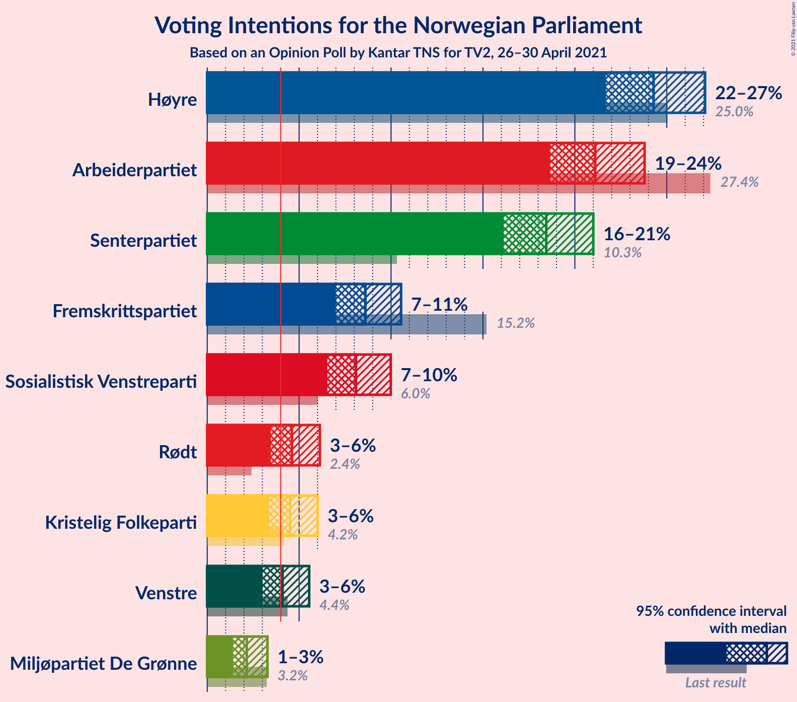

### Confidence Intervals

| Party | Last Result | Poll Result | 80% Confidence Interval | 90% Confidence Interval | 95% Confidence Interval | 99% Confidence Interval |
|:-----:|:-----------:|:-----------:|:-----------------------:|:-----------------------:|:-----------------------:|:-----------------------:|
| Høyre | 25.0% | 24.3% | 22.6–26.1% |22.1–26.6% |21.7–27.1% |20.9–28.0% |
| Arbeiderpartiet | 27.4% | 21.1% | 19.5–22.9% |19.1–23.4% |18.7–23.8% |17.9–24.6% |
| Senterpartiet | 10.3% | 18.4% | 16.9–20.1% |16.5–20.6% |16.1–21.0% |15.4–21.8% |
| Fremskrittspartiet | 15.2% | 8.6% | 7.5–9.9% |7.3–10.2% |7.0–10.5% |6.5–11.2% |
| Sosialistisk Venstreparti | 6.0% | 8.1% | 7.1–9.3% |6.8–9.7% |6.5–10.0% |6.1–10.6% |
| Rødt | 2.4% | 4.6% | 3.9–5.6% |3.6–5.9% |3.5–6.1% |3.1–6.6% |
| Kristelig Folkeparti | 4.2% | 4.5% | 3.8–5.5% |3.6–5.8% |3.4–6.0% |3.0–6.5% |
| Venstre | 4.4% | 4.1% | 3.4–5.0% |3.2–5.3% |3.0–5.5% |2.7–6.0% |
| Miljøpartiet De Grønne | 3.2% | 2.2% | 1.7–2.9% |1.5–3.1% |1.4–3.3% |1.2–3.7% |

*Note:* The poll result column reflects the actual value used in the calculations. Published results may vary slightly, and in addition be rounded to fewer digits.

## Seats

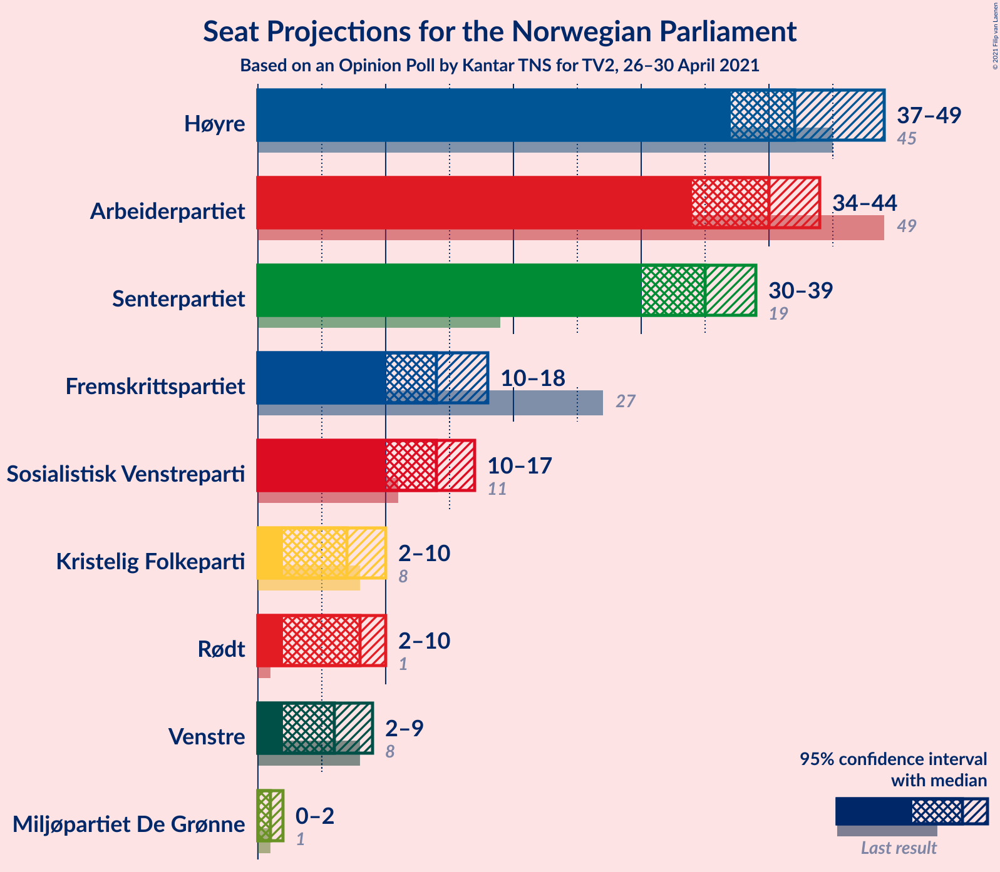

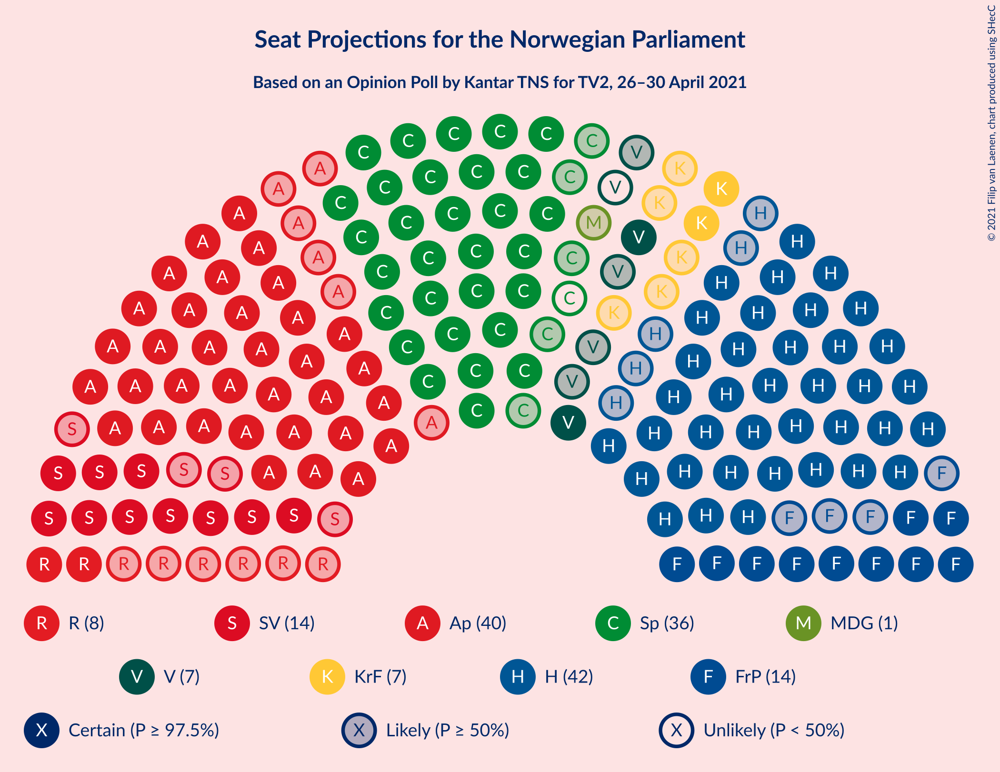

### Confidence Intervals

| Party | Last Result | Median | 80% Confidence Interval | 90% Confidence Interval | 95% Confidence Interval | 99% Confidence Interval |
|:-----:|:-----------:|:------:|:-----------------------:|:-----------------------:|:-----------------------:|:-----------------------:|
| <a href="#høyre">Høyre</a> | 45 | 42 | 39–46 |39–48 |37–49 |35–51 |
| <a href="#arbeiderpartiet">Arbeiderpartiet</a> | 49 | 40 | 36–43 |35–43 |34–44 |32–45 |
| <a href="#senterpartiet">Senterpartiet</a> | 19 | 35 | 32–38 |31–38 |30–39 |28–41 |
| <a href="#fremskrittspartiet">Fremskrittspartiet</a> | 27 | 14 | 12–17 |11–18 |10–18 |9–20 |
| <a href="#sosialistisk-venstreparti">Sosialistisk Venstreparti</a> | 11 | 14 | 11–16 |10–16 |10–17 |9–18 |
| <a href="#rødt">Rødt</a> | 1 | 8 | 2–9 |2–10 |2–10 |2–11 |
| <a href="#kristelig-folkeparti">Kristelig Folkeparti</a> | 8 | 7 | 3–9 |3–9 |2–10 |1–12 |
| <a href="#venstre">Venstre</a> | 8 | 6 | 2–8 |2–9 |2–9 |2–10 |
| <a href="#miljøpartiet-de-grønne">Miljøpartiet De Grønne</a> | 1 | 1 | 0–1 |0–2 |0–2 |0–2 |

### Høyre

*For a full overview of the results for this party, see the [Høyre](party-høyre.html) page.*

| Number of Seats | Probability | Accumulated | Special Marks |
|:---------------:|:-----------:|:-----------:|:-------------:|
| 34 | 0.1% | 100% |  |
| 35 | 0.4% | 99.9% |  |
| 36 | 0.8% | 99.5% |  |
| 37 | 1.4% | 98.7% |  |
| 38 | 2% | 97% |  |
| 39 | 9% | 95% |  |
| 40 | 11% | 87% |  |
| 41 | 20% | 76% |  |
| 42 | 13% | 55% | Median |
| 43 | 9% | 43% |  |
| 44 | 9% | 34% |  |
| 45 | 8% | 25% | Last Result |
| 46 | 7% | 16% |  |
| 47 | 3% | 10% |  |
| 48 | 3% | 6% |  |
| 49 | 1.3% | 3% |  |
| 50 | 1.1% | 2% |  |
| 51 | 0.5% | 0.8% |  |
| 52 | 0.1% | 0.3% |  |
| 53 | 0.2% | 0.2% |  |
| 54 | 0% | 0% |  |

### Arbeiderpartiet

*For a full overview of the results for this party, see the [Arbeiderpartiet](party-arbeiderpartiet.html) page.*

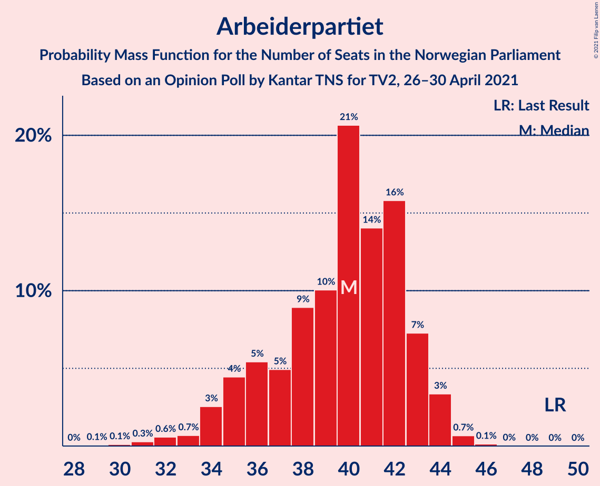

| Number of Seats | Probability | Accumulated | Special Marks |
|:---------------:|:-----------:|:-----------:|:-------------:|
| 29 | 0.1% | 100% |  |
| 30 | 0.1% | 99.9% |  |
| 31 | 0.3% | 99.8% |  |
| 32 | 0.6% | 99.5% |  |
| 33 | 0.7% | 99.0% |  |
| 34 | 3% | 98% |  |
| 35 | 4% | 96% |  |
| 36 | 5% | 91% |  |
| 37 | 5% | 86% |  |
| 38 | 9% | 81% |  |
| 39 | 10% | 72% |  |
| 40 | 21% | 62% | Median |
| 41 | 14% | 41% |  |
| 42 | 16% | 27% |  |
| 43 | 7% | 11% |  |
| 44 | 3% | 4% |  |
| 45 | 0.7% | 0.8% |  |
| 46 | 0.1% | 0.2% |  |
| 47 | 0% | 0% |  |
| 48 | 0% | 0% |  |
| 49 | 0% | 0% | Last Result |

### Senterpartiet

*For a full overview of the results for this party, see the [Senterpartiet](party-senterpartiet.html) page.*

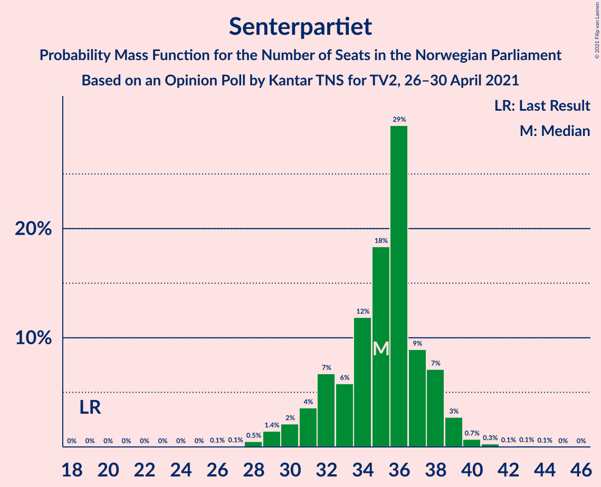

| Number of Seats | Probability | Accumulated | Special Marks |
|:---------------:|:-----------:|:-----------:|:-------------:|
| 19 | 0% | 100% | Last Result |
| 20 | 0% | 100% |  |
| 21 | 0% | 100% |  |
| 22 | 0% | 100% |  |
| 23 | 0% | 100% |  |
| 24 | 0% | 100% |  |
| 25 | 0% | 100% |  |
| 26 | 0.1% | 100% |  |
| 27 | 0.1% | 99.9% |  |
| 28 | 0.5% | 99.8% |  |
| 29 | 1.4% | 99.3% |  |
| 30 | 2% | 98% |  |
| 31 | 4% | 96% |  |
| 32 | 7% | 92% |  |
| 33 | 6% | 85% |  |
| 34 | 12% | 80% |  |
| 35 | 18% | 68% | Median |
| 36 | 29% | 49% |  |
| 37 | 9% | 20% |  |
| 38 | 7% | 11% |  |
| 39 | 3% | 4% |  |
| 40 | 0.7% | 1.2% |  |
| 41 | 0.3% | 0.5% |  |
| 42 | 0.1% | 0.3% |  |
| 43 | 0.1% | 0.2% |  |
| 44 | 0.1% | 0.1% |  |
| 45 | 0% | 0% |  |

### Fremskrittspartiet

*For a full overview of the results for this party, see the [Fremskrittspartiet](party-fremskrittspartiet.html) page.*

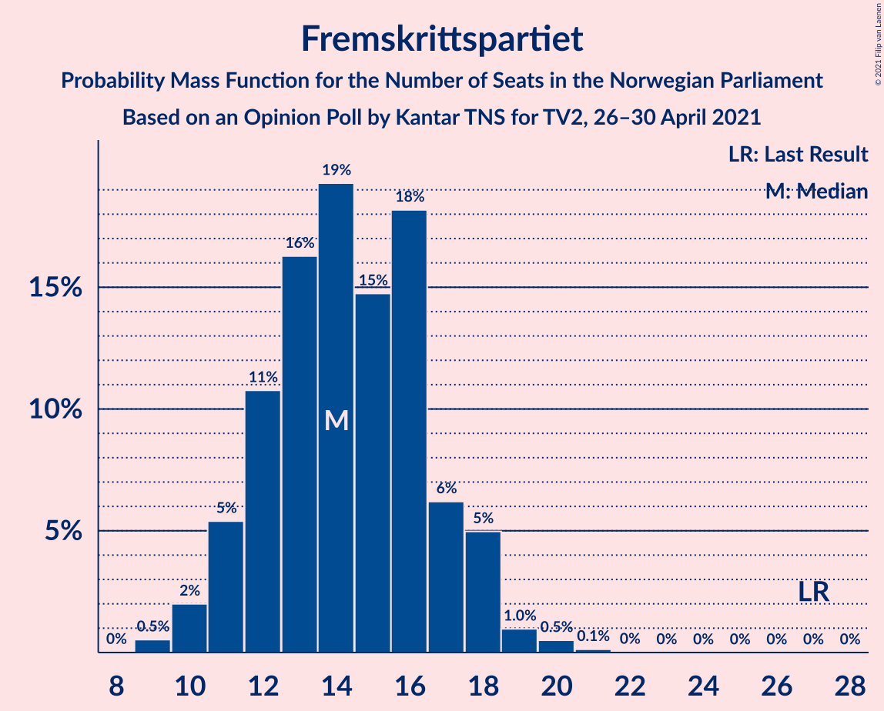

| Number of Seats | Probability | Accumulated | Special Marks |
|:---------------:|:-----------:|:-----------:|:-------------:|
| 9 | 0.5% | 100% |  |
| 10 | 2% | 99.5% |  |
| 11 | 5% | 97% |  |
| 12 | 11% | 92% |  |
| 13 | 16% | 81% |  |
| 14 | 19% | 65% | Median |
| 15 | 15% | 46% |  |
| 16 | 18% | 31% |  |
| 17 | 6% | 13% |  |
| 18 | 5% | 7% |  |
| 19 | 1.0% | 2% |  |
| 20 | 0.5% | 0.7% |  |
| 21 | 0.1% | 0.2% |  |
| 22 | 0% | 0% |  |
| 23 | 0% | 0% |  |
| 24 | 0% | 0% |  |
| 25 | 0% | 0% |  |
| 26 | 0% | 0% |  |
| 27 | 0% | 0% | Last Result |

### Sosialistisk Venstreparti

*For a full overview of the results for this party, see the [Sosialistisk Venstreparti](party-sosialistiskvenstreparti.html) page.*

| Number of Seats | Probability | Accumulated | Special Marks |
|:---------------:|:-----------:|:-----------:|:-------------:|
| 8 | 0.1% | 100% |  |
| 9 | 1.2% | 99.9% |  |
| 10 | 4% | 98.8% |  |
| 11 | 11% | 94% | Last Result |
| 12 | 11% | 84% |  |
| 13 | 22% | 73% |  |
| 14 | 18% | 51% | Median |
| 15 | 21% | 33% |  |
| 16 | 8% | 11% |  |
| 17 | 3% | 4% |  |
| 18 | 0.6% | 1.0% |  |
| 19 | 0.3% | 0.4% |  |
| 20 | 0.1% | 0.1% |  |
| 21 | 0% | 0% |  |

### Rødt

*For a full overview of the results for this party, see the [Rødt](party-rødt.html) page.*

| Number of Seats | Probability | Accumulated | Special Marks |
|:---------------:|:-----------:|:-----------:|:-------------:|
| 1 | 0% | 100% | Last Result |
| 2 | 17% | 100% |  |
| 3 | 0.1% | 83% |  |
| 4 | 0% | 83% |  |
| 5 | 0% | 83% |  |
| 6 | 6% | 83% |  |
| 7 | 26% | 77% |  |
| 8 | 24% | 51% | Median |
| 9 | 18% | 27% |  |
| 10 | 6% | 9% |  |
| 11 | 2% | 2% |  |
| 12 | 0.1% | 0.2% |  |
| 13 | 0% | 0% |  |

### Kristelig Folkeparti

*For a full overview of the results for this party, see the [Kristelig Folkeparti](party-kristeligfolkeparti.html) page.*

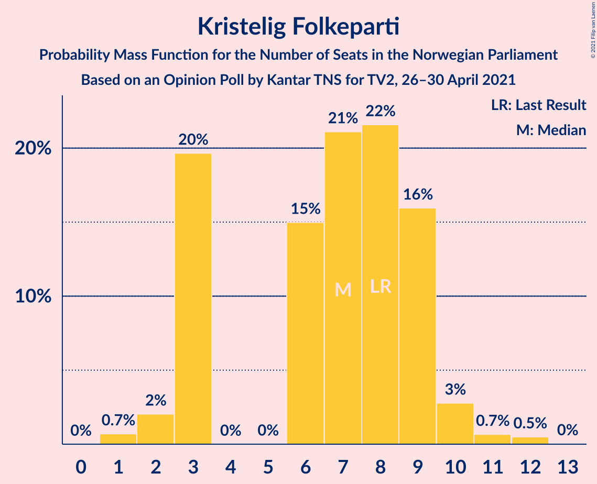

| Number of Seats | Probability | Accumulated | Special Marks |
|:---------------:|:-----------:|:-----------:|:-------------:|
| 1 | 0.7% | 100% |  |
| 2 | 2% | 99.3% |  |
| 3 | 20% | 97% |  |
| 4 | 0% | 78% |  |
| 5 | 0% | 78% |  |
| 6 | 15% | 78% |  |
| 7 | 21% | 63% | Median |
| 8 | 22% | 42% | Last Result |
| 9 | 16% | 20% |  |
| 10 | 3% | 4% |  |
| 11 | 0.7% | 1.2% |  |
| 12 | 0.5% | 0.5% |  |
| 13 | 0% | 0% |  |

### Venstre

*For a full overview of the results for this party, see the [Venstre](party-venstre.html) page.*

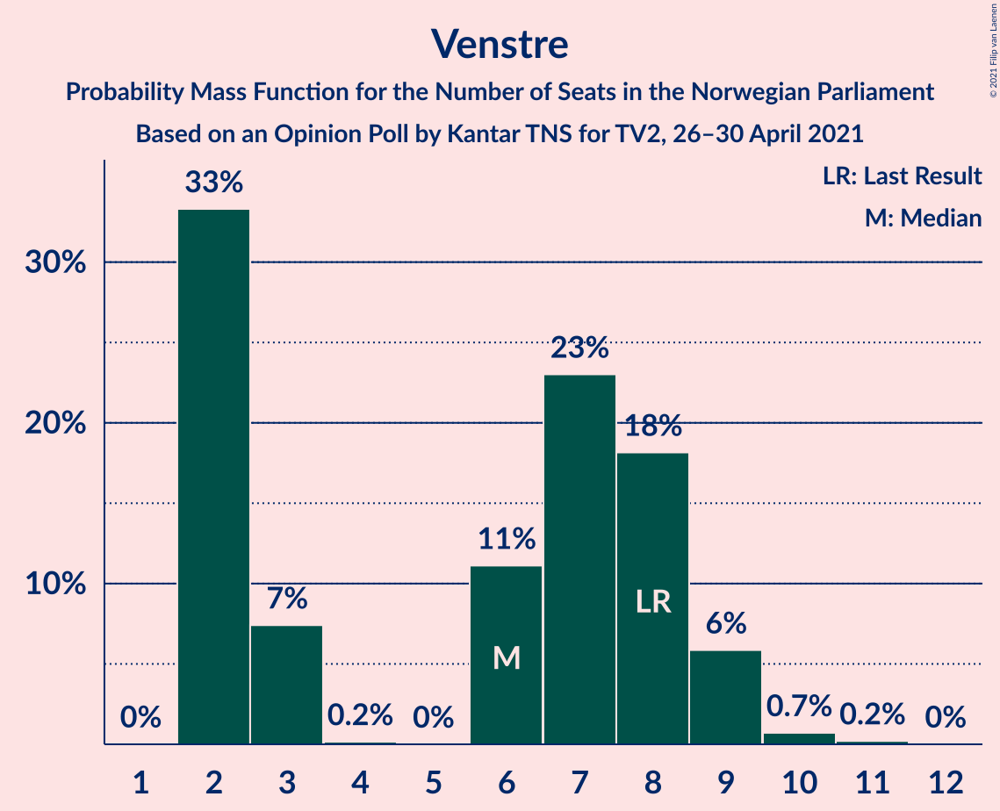

| Number of Seats | Probability | Accumulated | Special Marks |
|:---------------:|:-----------:|:-----------:|:-------------:|
| 2 | 33% | 100% |  |
| 3 | 7% | 67% |  |
| 4 | 0.2% | 59% |  |
| 5 | 0% | 59% |  |
| 6 | 11% | 59% | Median |
| 7 | 23% | 48% |  |
| 8 | 18% | 25% | Last Result |
| 9 | 6% | 7% |  |
| 10 | 0.7% | 0.9% |  |
| 11 | 0.2% | 0.2% |  |
| 12 | 0% | 0% |  |

### Miljøpartiet De Grønne

*For a full overview of the results for this party, see the [Miljøpartiet De Grønne](party-miljøpartietdegrønne.html) page.*

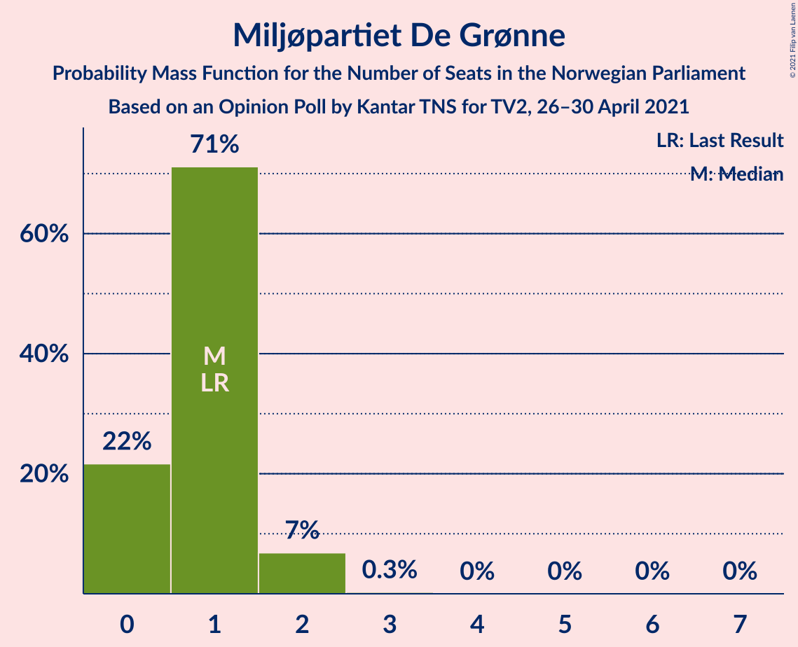

| Number of Seats | Probability | Accumulated | Special Marks |
|:---------------:|:-----------:|:-----------:|:-------------:|
| 0 | 22% | 100% |  |
| 1 | 71% | 78% | Last Result, Median |
| 2 | 7% | 7% |  |
| 3 | 0.3% | 0.3% |  |
| 4 | 0% | 0.1% |  |
| 5 | 0% | 0.1% |  |
| 6 | 0% | 0.1% |  |
| 7 | 0% | 0% |  |

## Coalitions

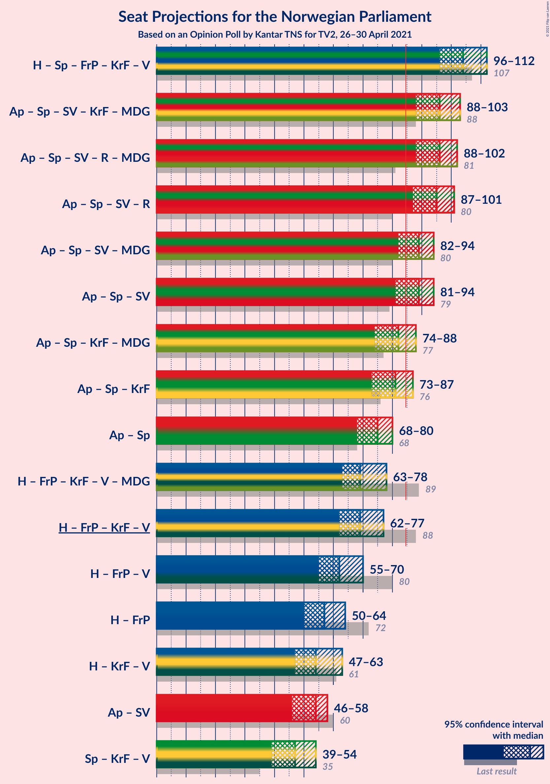

### Confidence Intervals

| Coalition | Last Result | Median | Majority? | 80% Confidence Interval | 90% Confidence Interval | 95% Confidence Interval | 99% Confidence Interval |
|:---------:|:-----------:|:------:|:---------:|:-----------------------:|:-----------------------:|:-----------------------:|:-----------------------:|
| Høyre – Senterpartiet – Fremskrittspartiet – Kristelig Folkeparti – Venstre | 107 | 104 | 100% | 98–109 | 98–111 | 96–112 | 94–114 |
| Arbeiderpartiet – Senterpartiet – Sosialistisk Venstreparti – Kristelig Folkeparti – Miljøpartiet De Grønne | 88 | 96 | 99.8% | 91–100 | 89–101 | 88–103 | 85–104 |
| Arbeiderpartiet – Senterpartiet – Sosialistisk Venstreparti – Rødt – Miljøpartiet De Grønne | 81 | 96 | 99.7% | 91–100 | 90–101 | 88–102 | 86–104 |
| Arbeiderpartiet – Senterpartiet – Sosialistisk Venstreparti – Rødt | 80 | 95 | 99.6% | 90–99 | 89–100 | 87–101 | 85–104 |
| Arbeiderpartiet – Senterpartiet – Sosialistisk Venstreparti – Miljøpartiet De Grønne | 80 | 89 | 92% | 85–93 | 83–94 | 82–94 | 79–98 |
| Arbeiderpartiet – Senterpartiet – Sosialistisk Venstreparti | 79 | 89 | 88% | 84–92 | 82–93 | 81–94 | 78–97 |
| Arbeiderpartiet – Senterpartiet – Kristelig Folkeparti – Miljøpartiet De Grønne | 77 | 82 | 31% | 77–87 | 76–87 | 74–88 | 71–90 |
| Arbeiderpartiet – Senterpartiet – Kristelig Folkeparti | 76 | 81 | 22% | 76–86 | 75–87 | 73–87 | 70–89 |
| Arbeiderpartiet – Senterpartiet | 68 | 75 | 0% | 70–78 | 69–79 | 68–80 | 65–82 |
| Høyre – Fremskrittspartiet – Kristelig Folkeparti – Venstre – Miljøpartiet De Grønne | 89 | 69 | 0.1% | 64–75 | 63–77 | 63–78 | 60–81 |
| Høyre – Fremskrittspartiet – Kristelig Folkeparti – Venstre | 88 | 69 | 0% | 63–74 | 62–76 | 62–77 | 59–80 |
| Høyre – Fremskrittspartiet – Venstre | 80 | 62 | 0% | 56–68 | 56–69 | 55–70 | 54–73 |
| Høyre – Fremskrittspartiet | 72 | 57 | 0% | 52–61 | 52–64 | 50–64 | 49–67 |
| Høyre – Kristelig Folkeparti – Venstre | 61 | 54 | 0% | 48–60 | 47–61 | 47–63 | 45–65 |
| Arbeiderpartiet – Sosialistisk Venstreparti | 60 | 54 | 0% | 49–57 | 47–58 | 46–58 | 45–60 |
| Senterpartiet – Kristelig Folkeparti – Venstre | 35 | 47 | 0% | 41–52 | 40–53 | 39–54 | 36–56 |

### Høyre – Senterpartiet – Fremskrittspartiet – Kristelig Folkeparti – Venstre

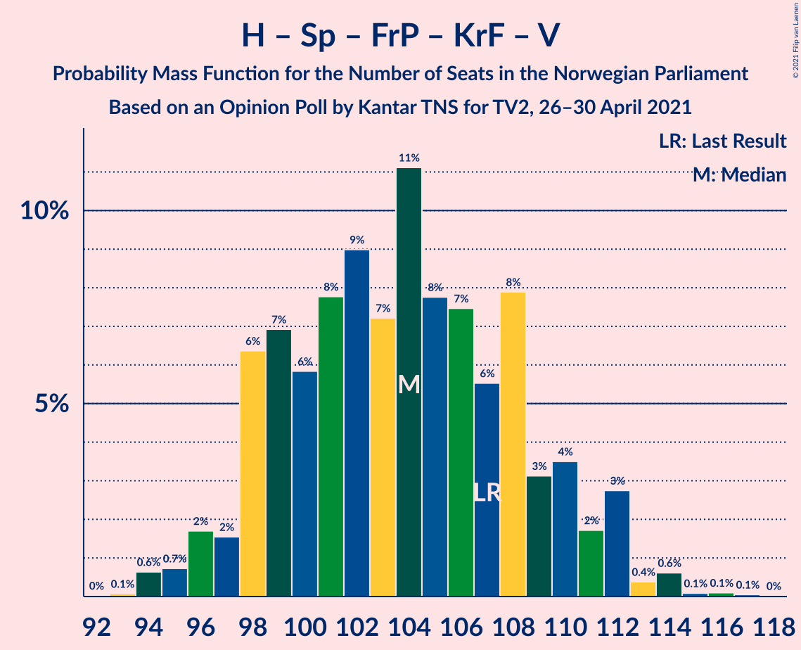

| Number of Seats | Probability | Accumulated | Special Marks |
|:---------------:|:-----------:|:-----------:|:-------------:|
| 92 | 0% | 100% |  |
| 93 | 0.1% | 99.9% |  |
| 94 | 0.6% | 99.9% |  |
| 95 | 0.7% | 99.2% |  |
| 96 | 2% | 98% |  |
| 97 | 2% | 97% |  |
| 98 | 6% | 95% |  |
| 99 | 7% | 89% |  |
| 100 | 6% | 82% |  |
| 101 | 8% | 76% |  |
| 102 | 9% | 68% |  |
| 103 | 7% | 59% |  |
| 104 | 11% | 52% | Median |
| 105 | 8% | 41% |  |
| 106 | 7% | 33% |  |
| 107 | 6% | 26% | Last Result |
| 108 | 8% | 20% |  |
| 109 | 3% | 12% |  |
| 110 | 4% | 9% |  |
| 111 | 2% | 6% |  |
| 112 | 3% | 4% |  |
| 113 | 0.4% | 1.3% |  |
| 114 | 0.6% | 0.9% |  |
| 115 | 0.1% | 0.3% |  |
| 116 | 0.1% | 0.2% |  |
| 117 | 0.1% | 0.1% |  |
| 118 | 0% | 0% |  |

### Arbeiderpartiet – Senterpartiet – Sosialistisk Venstreparti – Kristelig Folkeparti – Miljøpartiet De Grønne

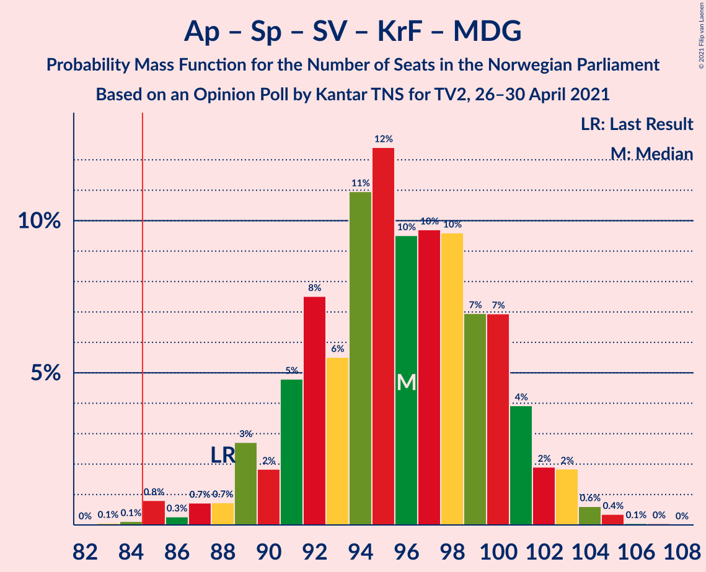

| Number of Seats | Probability | Accumulated | Special Marks |
|:---------------:|:-----------:|:-----------:|:-------------:|
| 83 | 0.1% | 100% |  |
| 84 | 0.1% | 99.9% |  |
| 85 | 0.8% | 99.8% | Majority |
| 86 | 0.3% | 99.0% |  |
| 87 | 0.7% | 98.7% |  |
| 88 | 0.7% | 98% | Last Result |
| 89 | 3% | 97% |  |
| 90 | 2% | 95% |  |
| 91 | 5% | 93% |  |
| 92 | 8% | 88% |  |
| 93 | 6% | 80% |  |
| 94 | 11% | 75% |  |
| 95 | 12% | 64% |  |
| 96 | 10% | 51% |  |
| 97 | 10% | 42% | Median |
| 98 | 10% | 32% |  |
| 99 | 7% | 23% |  |
| 100 | 7% | 16% |  |
| 101 | 4% | 9% |  |
| 102 | 2% | 5% |  |
| 103 | 2% | 3% |  |
| 104 | 0.6% | 1.1% |  |
| 105 | 0.4% | 0.5% |  |
| 106 | 0.1% | 0.1% |  |
| 107 | 0% | 0.1% |  |
| 108 | 0% | 0% |  |

### Arbeiderpartiet – Senterpartiet – Sosialistisk Venstreparti – Rødt – Miljøpartiet De Grønne

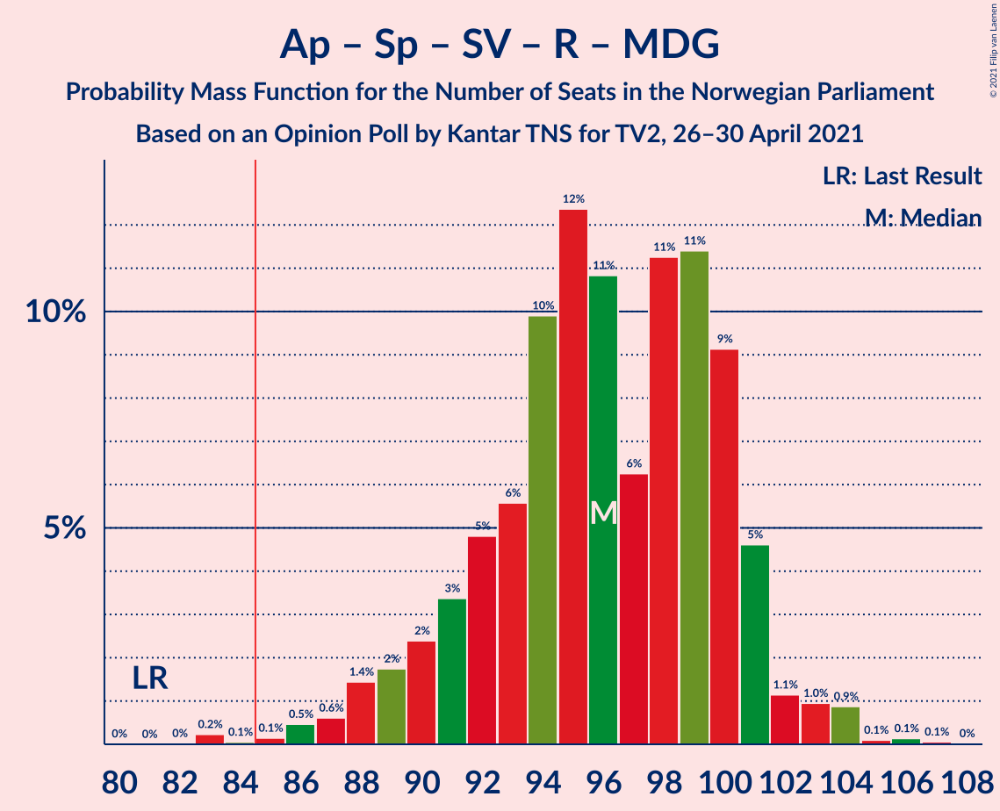

| Number of Seats | Probability | Accumulated | Special Marks |
|:---------------:|:-----------:|:-----------:|:-------------:|
| 81 | 0% | 100% | Last Result |
| 82 | 0% | 100% |  |
| 83 | 0.2% | 99.9% |  |
| 84 | 0.1% | 99.7% |  |
| 85 | 0.1% | 99.7% | Majority |
| 86 | 0.5% | 99.5% |  |
| 87 | 0.6% | 99.0% |  |
| 88 | 1.4% | 98% |  |
| 89 | 2% | 97% |  |
| 90 | 2% | 95% |  |
| 91 | 3% | 93% |  |
| 92 | 5% | 89% |  |
| 93 | 6% | 85% |  |
| 94 | 10% | 79% |  |
| 95 | 12% | 69% |  |
| 96 | 11% | 57% |  |
| 97 | 6% | 46% |  |
| 98 | 11% | 40% | Median |
| 99 | 11% | 28% |  |
| 100 | 9% | 17% |  |
| 101 | 5% | 8% |  |
| 102 | 1.1% | 3% |  |
| 103 | 1.0% | 2% |  |
| 104 | 0.9% | 1.2% |  |
| 105 | 0.1% | 0.3% |  |
| 106 | 0.1% | 0.2% |  |
| 107 | 0.1% | 0.1% |  |
| 108 | 0% | 0% |  |

### Arbeiderpartiet – Senterpartiet – Sosialistisk Venstreparti – Rødt

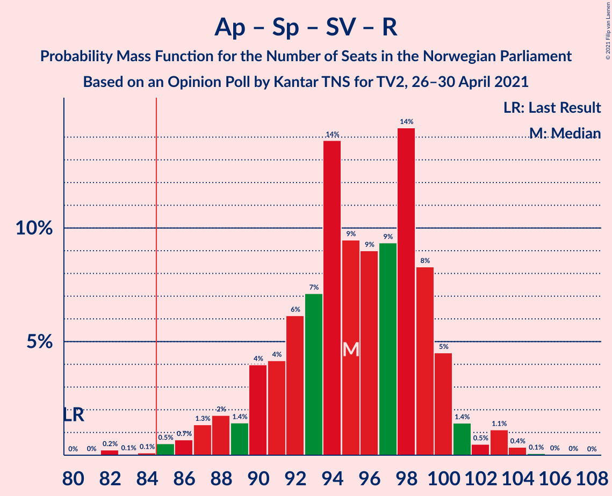

| Number of Seats | Probability | Accumulated | Special Marks |
|:---------------:|:-----------:|:-----------:|:-------------:|
| 80 | 0% | 100% | Last Result |
| 81 | 0% | 100% |  |
| 82 | 0.2% | 100% |  |
| 83 | 0.1% | 99.7% |  |
| 84 | 0.1% | 99.7% |  |
| 85 | 0.5% | 99.6% | Majority |
| 86 | 0.7% | 99.0% |  |
| 87 | 1.3% | 98% |  |
| 88 | 2% | 97% |  |
| 89 | 1.4% | 95% |  |
| 90 | 4% | 94% |  |
| 91 | 4% | 90% |  |
| 92 | 6% | 86% |  |
| 93 | 7% | 80% |  |
| 94 | 14% | 72% |  |
| 95 | 9% | 59% |  |
| 96 | 9% | 49% |  |
| 97 | 9% | 40% | Median |
| 98 | 14% | 31% |  |
| 99 | 8% | 16% |  |
| 100 | 5% | 8% |  |
| 101 | 1.4% | 4% |  |
| 102 | 0.5% | 2% |  |
| 103 | 1.1% | 2% |  |
| 104 | 0.4% | 0.5% |  |
| 105 | 0.1% | 0.1% |  |
| 106 | 0% | 0.1% |  |
| 107 | 0% | 0% |  |

### Arbeiderpartiet – Senterpartiet – Sosialistisk Venstreparti – Miljøpartiet De Grønne

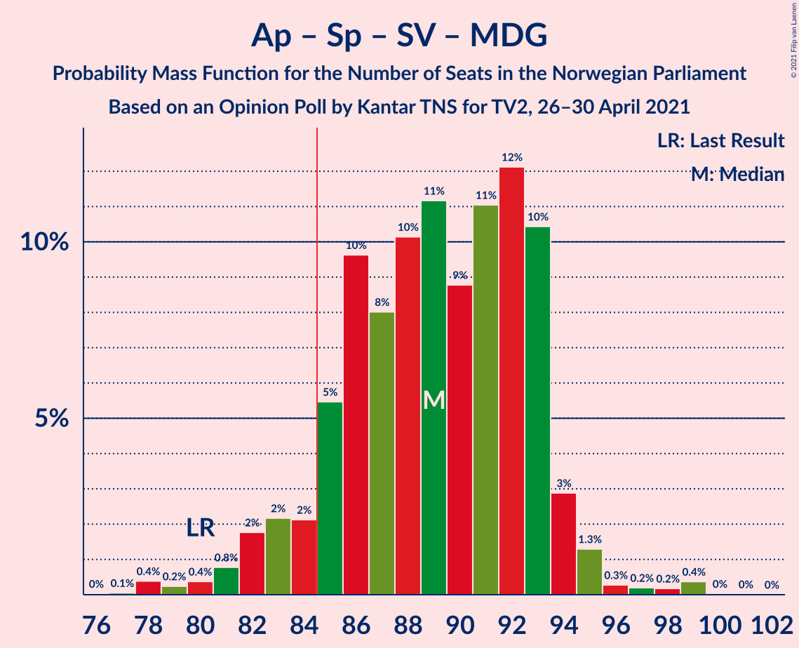

| Number of Seats | Probability | Accumulated | Special Marks |
|:---------------:|:-----------:|:-----------:|:-------------:|
| 77 | 0.1% | 100% |  |
| 78 | 0.4% | 99.9% |  |
| 79 | 0.2% | 99.5% |  |
| 80 | 0.4% | 99.3% | Last Result |
| 81 | 0.8% | 98.9% |  |
| 82 | 2% | 98% |  |
| 83 | 2% | 96% |  |
| 84 | 2% | 94% |  |
| 85 | 5% | 92% | Majority |
| 86 | 10% | 87% |  |
| 87 | 8% | 77% |  |
| 88 | 10% | 69% |  |
| 89 | 11% | 59% |  |
| 90 | 9% | 48% | Median |
| 91 | 11% | 39% |  |
| 92 | 12% | 28% |  |
| 93 | 10% | 16% |  |
| 94 | 3% | 5% |  |
| 95 | 1.3% | 2% |  |
| 96 | 0.3% | 1.1% |  |
| 97 | 0.2% | 0.8% |  |
| 98 | 0.2% | 0.6% |  |
| 99 | 0.4% | 0.4% |  |
| 100 | 0% | 0.1% |  |
| 101 | 0% | 0% |  |

### Arbeiderpartiet – Senterpartiet – Sosialistisk Venstreparti

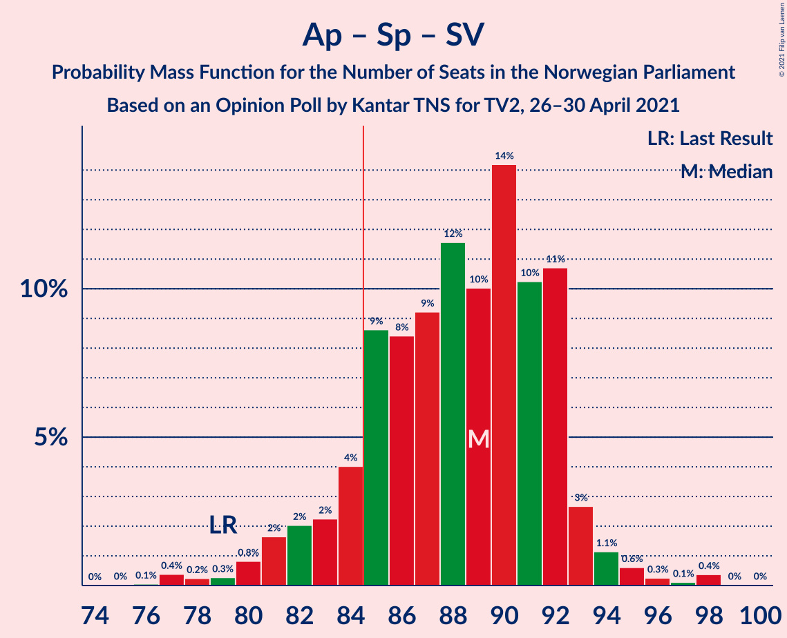

| Number of Seats | Probability | Accumulated | Special Marks |
|:---------------:|:-----------:|:-----------:|:-------------:|
| 76 | 0.1% | 100% |  |
| 77 | 0.4% | 99.9% |  |
| 78 | 0.2% | 99.5% |  |
| 79 | 0.3% | 99.3% | Last Result |
| 80 | 0.8% | 99.0% |  |
| 81 | 2% | 98% |  |
| 82 | 2% | 97% |  |
| 83 | 2% | 95% |  |
| 84 | 4% | 92% |  |
| 85 | 9% | 88% | Majority |
| 86 | 8% | 80% |  |
| 87 | 9% | 71% |  |
| 88 | 12% | 62% |  |
| 89 | 10% | 50% | Median |
| 90 | 14% | 40% |  |
| 91 | 10% | 26% |  |
| 92 | 11% | 16% |  |
| 93 | 3% | 5% |  |
| 94 | 1.1% | 3% |  |
| 95 | 0.6% | 1.4% |  |
| 96 | 0.3% | 0.8% |  |
| 97 | 0.1% | 0.5% |  |
| 98 | 0.4% | 0.4% |  |
| 99 | 0% | 0% |  |

### Arbeiderpartiet – Senterpartiet – Kristelig Folkeparti – Miljøpartiet De Grønne

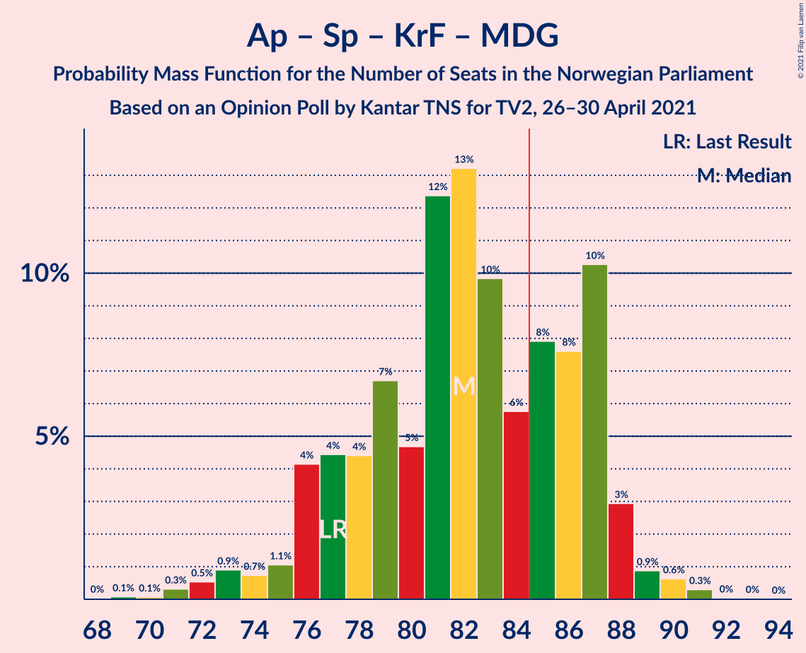

| Number of Seats | Probability | Accumulated | Special Marks |
|:---------------:|:-----------:|:-----------:|:-------------:|
| 68 | 0% | 100% |  |
| 69 | 0.1% | 99.9% |  |
| 70 | 0.1% | 99.9% |  |
| 71 | 0.3% | 99.8% |  |
| 72 | 0.5% | 99.5% |  |
| 73 | 0.9% | 98.9% |  |
| 74 | 0.7% | 98% |  |
| 75 | 1.1% | 97% |  |
| 76 | 4% | 96% |  |
| 77 | 4% | 92% | Last Result |
| 78 | 4% | 88% |  |
| 79 | 7% | 83% |  |
| 80 | 5% | 77% |  |
| 81 | 12% | 72% |  |
| 82 | 13% | 59% |  |
| 83 | 10% | 46% | Median |
| 84 | 6% | 36% |  |
| 85 | 8% | 31% | Majority |
| 86 | 8% | 23% |  |
| 87 | 10% | 15% |  |
| 88 | 3% | 5% |  |
| 89 | 0.9% | 2% |  |
| 90 | 0.6% | 1.0% |  |
| 91 | 0.3% | 0.4% |  |
| 92 | 0% | 0.1% |  |
| 93 | 0% | 0% |  |

### Arbeiderpartiet – Senterpartiet – Kristelig Folkeparti

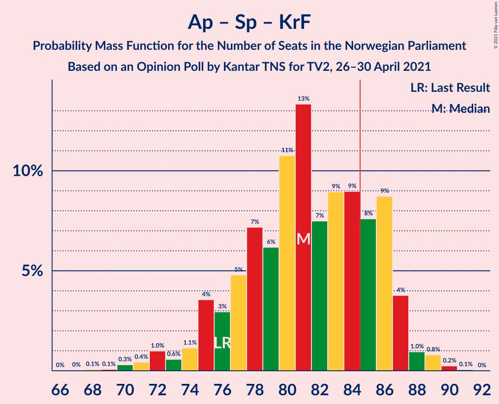

| Number of Seats | Probability | Accumulated | Special Marks |
|:---------------:|:-----------:|:-----------:|:-------------:|
| 67 | 0% | 100% |  |
| 68 | 0.1% | 99.9% |  |
| 69 | 0.1% | 99.9% |  |
| 70 | 0.3% | 99.8% |  |
| 71 | 0.4% | 99.5% |  |
| 72 | 1.0% | 99.1% |  |
| 73 | 0.6% | 98% |  |
| 74 | 1.1% | 97% |  |
| 75 | 4% | 96% |  |
| 76 | 3% | 93% | Last Result |
| 77 | 5% | 90% |  |
| 78 | 7% | 85% |  |
| 79 | 6% | 78% |  |
| 80 | 11% | 72% |  |
| 81 | 13% | 61% |  |
| 82 | 7% | 48% | Median |
| 83 | 9% | 40% |  |
| 84 | 9% | 31% |  |
| 85 | 8% | 22% | Majority |
| 86 | 9% | 15% |  |
| 87 | 4% | 6% |  |
| 88 | 1.0% | 2% |  |
| 89 | 0.8% | 1.1% |  |
| 90 | 0.2% | 0.3% |  |
| 91 | 0.1% | 0.1% |  |
| 92 | 0% | 0% |  |

### Arbeiderpartiet – Senterpartiet

| Number of Seats | Probability | Accumulated | Special Marks |
|:---------------:|:-----------:|:-----------:|:-------------:|
| 63 | 0.1% | 100% |  |
| 64 | 0.2% | 99.9% |  |
| 65 | 0.8% | 99.7% |  |
| 66 | 0.4% | 98.9% |  |
| 67 | 0.7% | 98.5% |  |
| 68 | 1.1% | 98% | Last Result |
| 69 | 3% | 97% |  |
| 70 | 4% | 94% |  |
| 71 | 5% | 90% |  |
| 72 | 13% | 85% |  |
| 73 | 6% | 72% |  |
| 74 | 12% | 66% |  |
| 75 | 9% | 55% | Median |
| 76 | 8% | 46% |  |
| 77 | 14% | 38% |  |
| 78 | 15% | 24% |  |
| 79 | 7% | 9% |  |
| 80 | 1.3% | 3% |  |
| 81 | 0.4% | 1.2% |  |
| 82 | 0.3% | 0.8% |  |
| 83 | 0.4% | 0.5% |  |
| 84 | 0% | 0.1% |  |
| 85 | 0% | 0% | Majority |

### Høyre – Fremskrittspartiet – Kristelig Folkeparti – Venstre – Miljøpartiet De Grønne

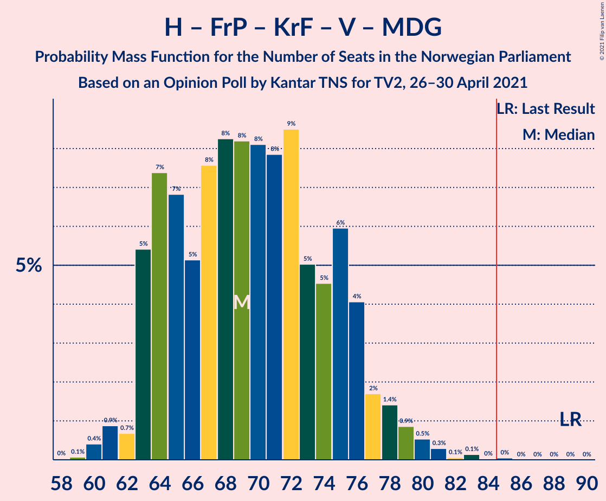

| Number of Seats | Probability | Accumulated | Special Marks |
|:---------------:|:-----------:|:-----------:|:-------------:|
| 58 | 0% | 100% |  |
| 59 | 0.1% | 99.9% |  |
| 60 | 0.4% | 99.9% |  |
| 61 | 0.9% | 99.5% |  |
| 62 | 0.7% | 98.6% |  |
| 63 | 5% | 98% |  |
| 64 | 7% | 92% |  |
| 65 | 7% | 85% |  |
| 66 | 5% | 78% |  |
| 67 | 8% | 73% |  |
| 68 | 8% | 66% |  |
| 69 | 8% | 57% |  |
| 70 | 8% | 49% | Median |
| 71 | 8% | 41% |  |
| 72 | 9% | 33% |  |
| 73 | 5% | 25% |  |
| 74 | 5% | 20% |  |
| 75 | 6% | 15% |  |
| 76 | 4% | 9% |  |
| 77 | 2% | 5% |  |
| 78 | 1.4% | 3% |  |
| 79 | 0.9% | 2% |  |
| 80 | 0.5% | 1.1% |  |
| 81 | 0.3% | 0.6% |  |
| 82 | 0.1% | 0.3% |  |
| 83 | 0.1% | 0.2% |  |
| 84 | 0% | 0.1% |  |
| 85 | 0% | 0.1% | Majority |
| 86 | 0% | 0% |  |
| 87 | 0% | 0% |  |
| 88 | 0% | 0% |  |
| 89 | 0% | 0% | Last Result |

### Høyre – Fremskrittspartiet – Kristelig Folkeparti – Venstre

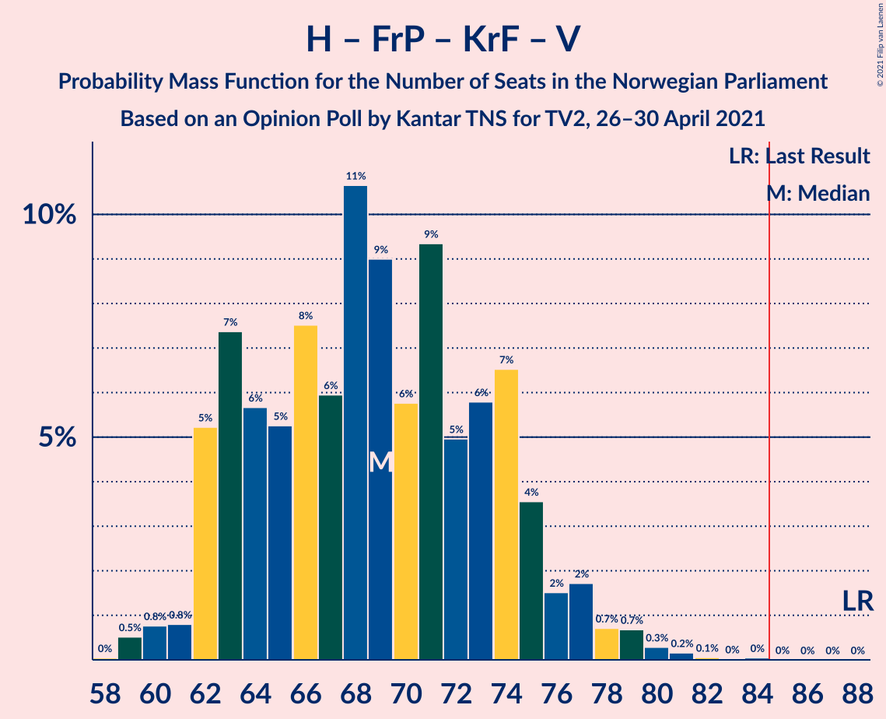

| Number of Seats | Probability | Accumulated | Special Marks |
|:---------------:|:-----------:|:-----------:|:-------------:|
| 58 | 0% | 100% |  |
| 59 | 0.5% | 99.9% |  |
| 60 | 0.8% | 99.4% |  |
| 61 | 0.8% | 98.6% |  |
| 62 | 5% | 98% |  |
| 63 | 7% | 93% |  |
| 64 | 6% | 85% |  |
| 65 | 5% | 80% |  |
| 66 | 8% | 74% |  |
| 67 | 6% | 67% |  |
| 68 | 11% | 61% |  |
| 69 | 9% | 50% | Median |
| 70 | 6% | 41% |  |
| 71 | 9% | 35% |  |
| 72 | 5% | 26% |  |
| 73 | 6% | 21% |  |
| 74 | 7% | 15% |  |
| 75 | 4% | 9% |  |
| 76 | 2% | 5% |  |
| 77 | 2% | 4% |  |
| 78 | 0.7% | 2% |  |
| 79 | 0.7% | 1.3% |  |
| 80 | 0.3% | 0.6% |  |
| 81 | 0.2% | 0.3% |  |
| 82 | 0.1% | 0.1% |  |
| 83 | 0% | 0.1% |  |
| 84 | 0% | 0.1% |  |
| 85 | 0% | 0% | Majority |
| 86 | 0% | 0% |  |
| 87 | 0% | 0% |  |
| 88 | 0% | 0% | Last Result |

### Høyre – Fremskrittspartiet – Venstre

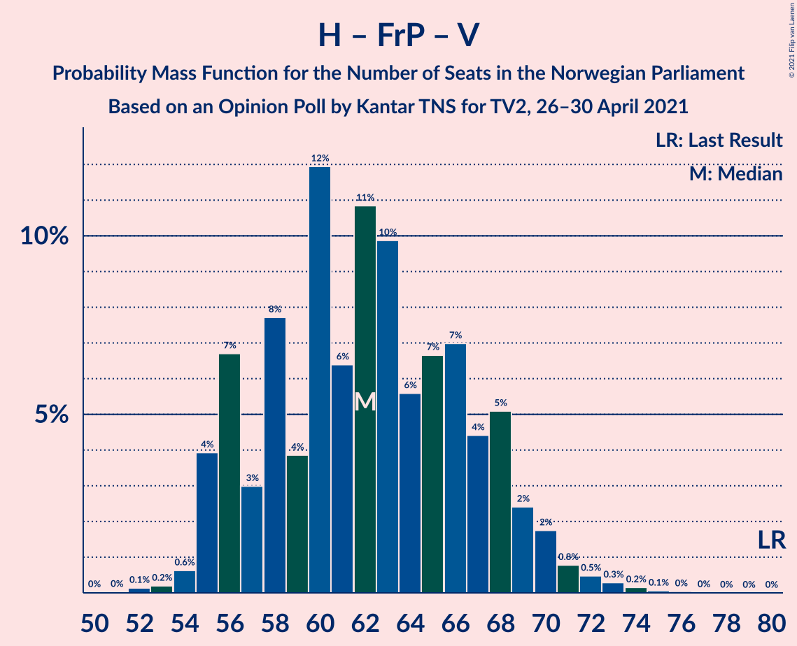

| Number of Seats | Probability | Accumulated | Special Marks |
|:---------------:|:-----------:|:-----------:|:-------------:|
| 52 | 0.1% | 100% |  |
| 53 | 0.2% | 99.8% |  |
| 54 | 0.6% | 99.6% |  |
| 55 | 4% | 99.0% |  |
| 56 | 7% | 95% |  |
| 57 | 3% | 88% |  |
| 58 | 8% | 85% |  |
| 59 | 4% | 78% |  |
| 60 | 12% | 74% |  |
| 61 | 6% | 62% |  |
| 62 | 11% | 55% | Median |
| 63 | 10% | 45% |  |
| 64 | 6% | 35% |  |
| 65 | 7% | 29% |  |
| 66 | 7% | 22% |  |
| 67 | 4% | 15% |  |
| 68 | 5% | 11% |  |
| 69 | 2% | 6% |  |
| 70 | 2% | 4% |  |
| 71 | 0.8% | 2% |  |
| 72 | 0.5% | 1.0% |  |
| 73 | 0.3% | 0.6% |  |
| 74 | 0.2% | 0.3% |  |
| 75 | 0.1% | 0.1% |  |
| 76 | 0% | 0.1% |  |
| 77 | 0% | 0% |  |
| 78 | 0% | 0% |  |
| 79 | 0% | 0% |  |
| 80 | 0% | 0% | Last Result |

### Høyre – Fremskrittspartiet

| Number of Seats | Probability | Accumulated | Special Marks |
|:---------------:|:-----------:|:-----------:|:-------------:|
| 47 | 0.1% | 100% |  |
| 48 | 0.2% | 99.9% |  |
| 49 | 0.5% | 99.7% |  |
| 50 | 2% | 99.2% |  |
| 51 | 2% | 97% |  |
| 52 | 6% | 95% |  |
| 53 | 8% | 89% |  |
| 54 | 12% | 81% |  |
| 55 | 11% | 69% |  |
| 56 | 6% | 58% | Median |
| 57 | 7% | 52% |  |
| 58 | 14% | 44% |  |
| 59 | 7% | 30% |  |
| 60 | 7% | 24% |  |
| 61 | 6% | 16% |  |
| 62 | 3% | 10% |  |
| 63 | 2% | 7% |  |
| 64 | 3% | 5% |  |
| 65 | 0.7% | 2% |  |
| 66 | 0.7% | 1.2% |  |
| 67 | 0.2% | 0.5% |  |
| 68 | 0.1% | 0.3% |  |
| 69 | 0.2% | 0.2% |  |
| 70 | 0% | 0.1% |  |
| 71 | 0% | 0% |  |
| 72 | 0% | 0% | Last Result |

### Høyre – Kristelig Folkeparti – Venstre

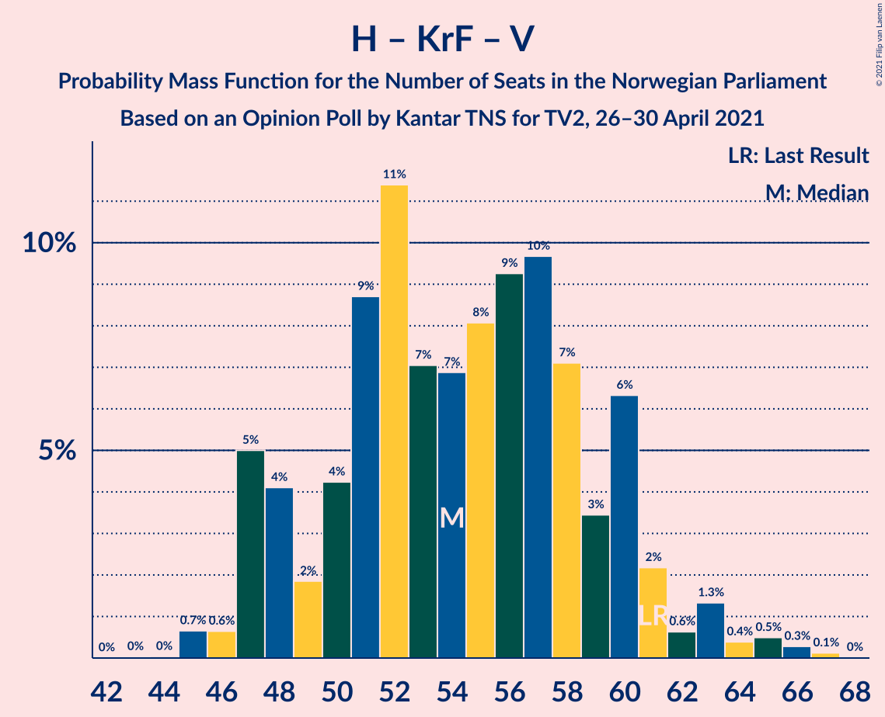

| Number of Seats | Probability | Accumulated | Special Marks |
|:---------------:|:-----------:|:-----------:|:-------------:|
| 43 | 0% | 100% |  |
| 44 | 0% | 99.9% |  |
| 45 | 0.7% | 99.9% |  |
| 46 | 0.6% | 99.2% |  |
| 47 | 5% | 98.6% |  |
| 48 | 4% | 94% |  |
| 49 | 2% | 89% |  |
| 50 | 4% | 88% |  |
| 51 | 9% | 83% |  |
| 52 | 11% | 75% |  |
| 53 | 7% | 63% |  |
| 54 | 7% | 56% |  |
| 55 | 8% | 49% | Median |
| 56 | 9% | 41% |  |
| 57 | 10% | 32% |  |
| 58 | 7% | 22% |  |
| 59 | 3% | 15% |  |
| 60 | 6% | 12% |  |
| 61 | 2% | 5% | Last Result |
| 62 | 0.6% | 3% |  |
| 63 | 1.3% | 3% |  |
| 64 | 0.4% | 1.3% |  |
| 65 | 0.5% | 0.9% |  |
| 66 | 0.3% | 0.4% |  |
| 67 | 0.1% | 0.2% |  |
| 68 | 0% | 0% |  |

### Arbeiderpartiet – Sosialistisk Venstreparti

| Number of Seats | Probability | Accumulated | Special Marks |
|:---------------:|:-----------:|:-----------:|:-------------:|
| 41 | 0.1% | 100% |  |
| 42 | 0% | 99.9% |  |
| 43 | 0.1% | 99.9% |  |
| 44 | 0.3% | 99.8% |  |
| 45 | 1.1% | 99.5% |  |
| 46 | 1.4% | 98% |  |
| 47 | 2% | 97% |  |
| 48 | 3% | 95% |  |
| 49 | 3% | 92% |  |
| 50 | 6% | 89% |  |
| 51 | 10% | 83% |  |
| 52 | 8% | 73% |  |
| 53 | 9% | 65% |  |
| 54 | 18% | 56% | Median |
| 55 | 23% | 38% |  |
| 56 | 5% | 15% |  |
| 57 | 3% | 10% |  |
| 58 | 5% | 7% |  |
| 59 | 1.1% | 2% |  |
| 60 | 0.4% | 0.7% | Last Result |
| 61 | 0.2% | 0.3% |  |
| 62 | 0.1% | 0.1% |  |
| 63 | 0% | 0% |  |

### Senterpartiet – Kristelig Folkeparti – Venstre

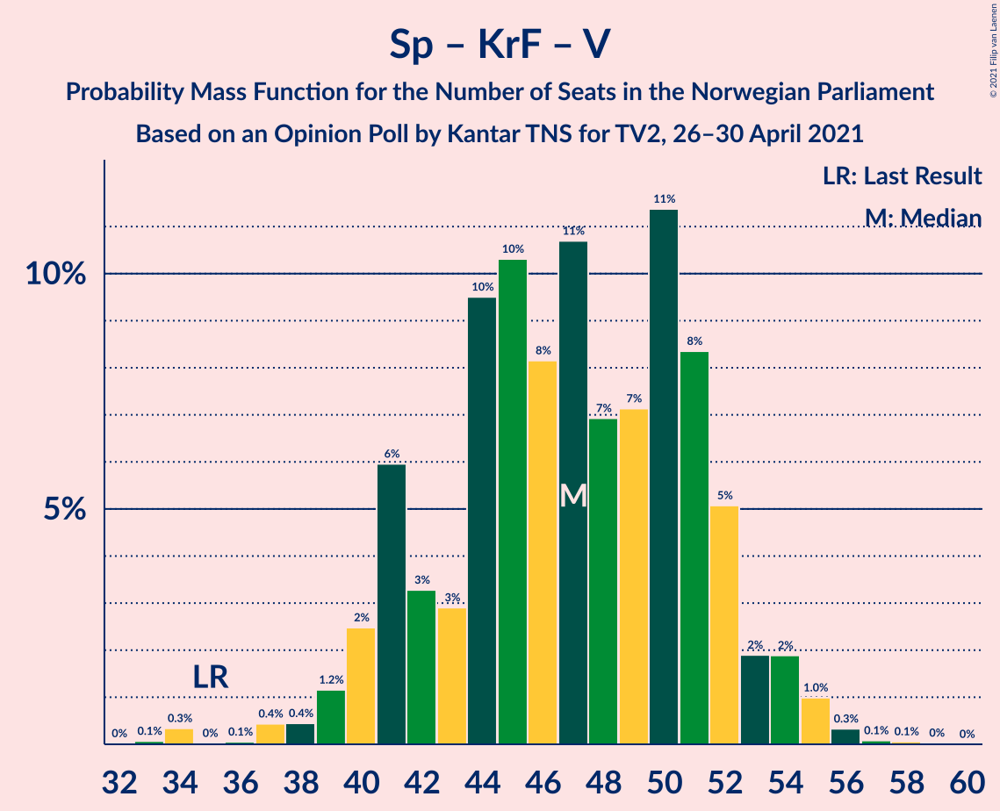

| Number of Seats | Probability | Accumulated | Special Marks |
|:---------------:|:-----------:|:-----------:|:-------------:|
| 33 | 0.1% | 100% |  |
| 34 | 0.3% | 99.9% |  |
| 35 | 0% | 99.6% | Last Result |
| 36 | 0.1% | 99.5% |  |
| 37 | 0.4% | 99.5% |  |
| 38 | 0.4% | 99.1% |  |
| 39 | 1.2% | 98.6% |  |
| 40 | 2% | 97% |  |
| 41 | 6% | 95% |  |
| 42 | 3% | 89% |  |
| 43 | 3% | 86% |  |
| 44 | 10% | 83% |  |
| 45 | 10% | 73% |  |
| 46 | 8% | 63% |  |
| 47 | 11% | 55% |  |
| 48 | 7% | 44% | Median |
| 49 | 7% | 37% |  |
| 50 | 11% | 30% |  |
| 51 | 8% | 19% |  |
| 52 | 5% | 10% |  |
| 53 | 2% | 5% |  |
| 54 | 2% | 3% |  |
| 55 | 1.0% | 2% |  |
| 56 | 0.3% | 0.5% |  |
| 57 | 0.1% | 0.2% |  |
| 58 | 0.1% | 0.1% |  |
| 59 | 0% | 0% |  |

## Technical Information

### Opinion Poll

+ **Polling firm:** Kantar TNS
+ **Commissioner(s):** TV2
+ **Fieldwork period:** 26–30 April 2021

### Calculations

+ **Sample size:** 976
+ **Simulations done:** 1,048,576
+ **Error estimate:** 1.46%

