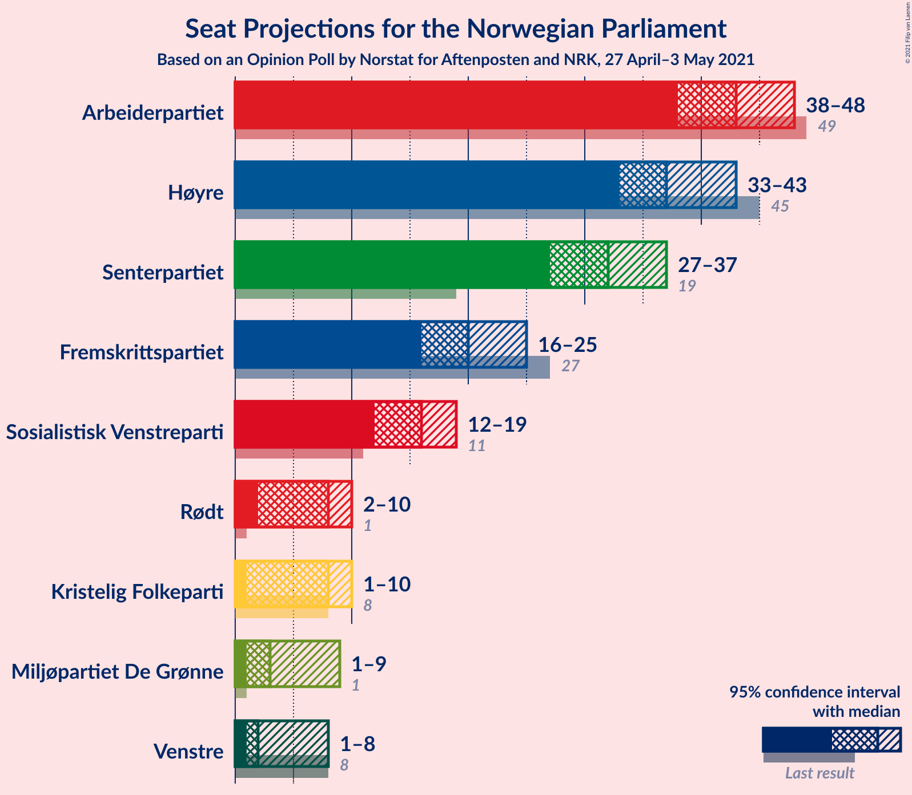
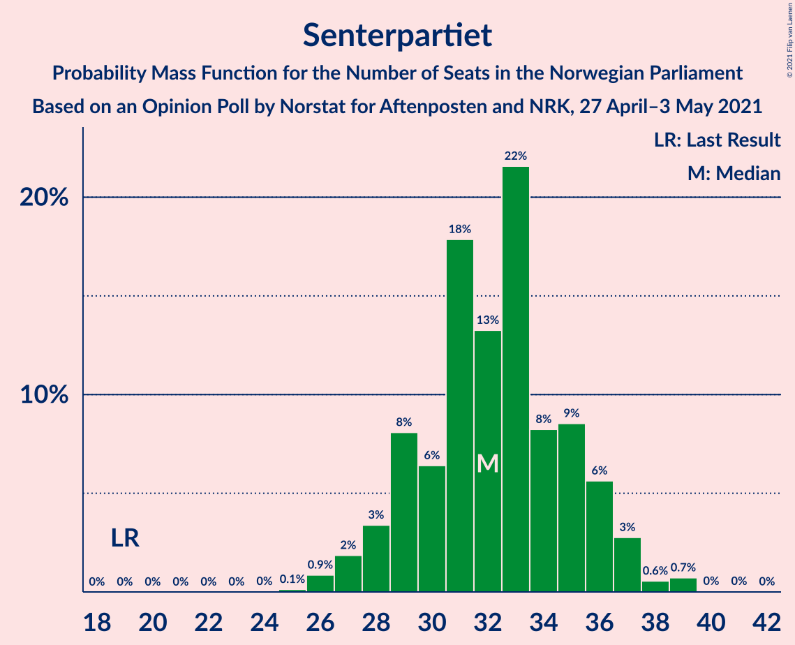
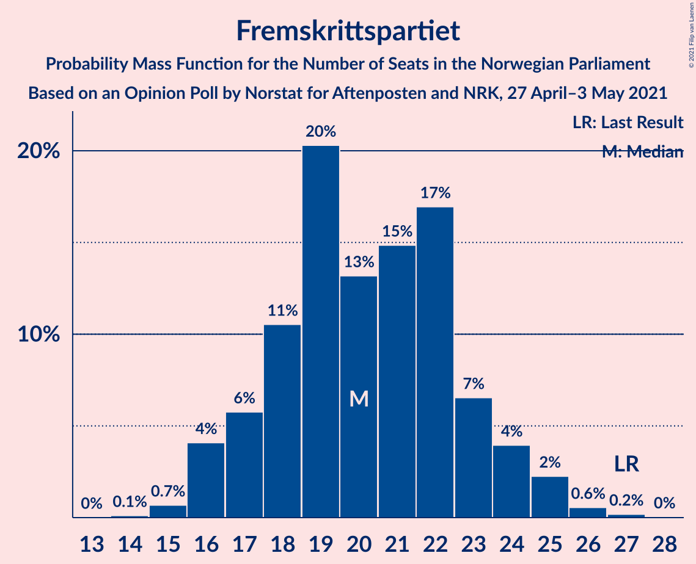
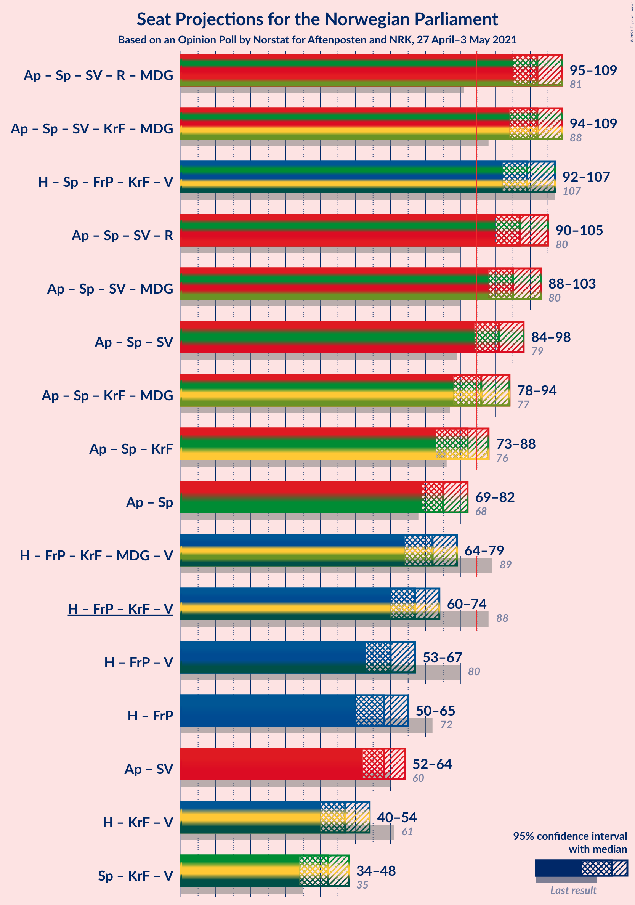
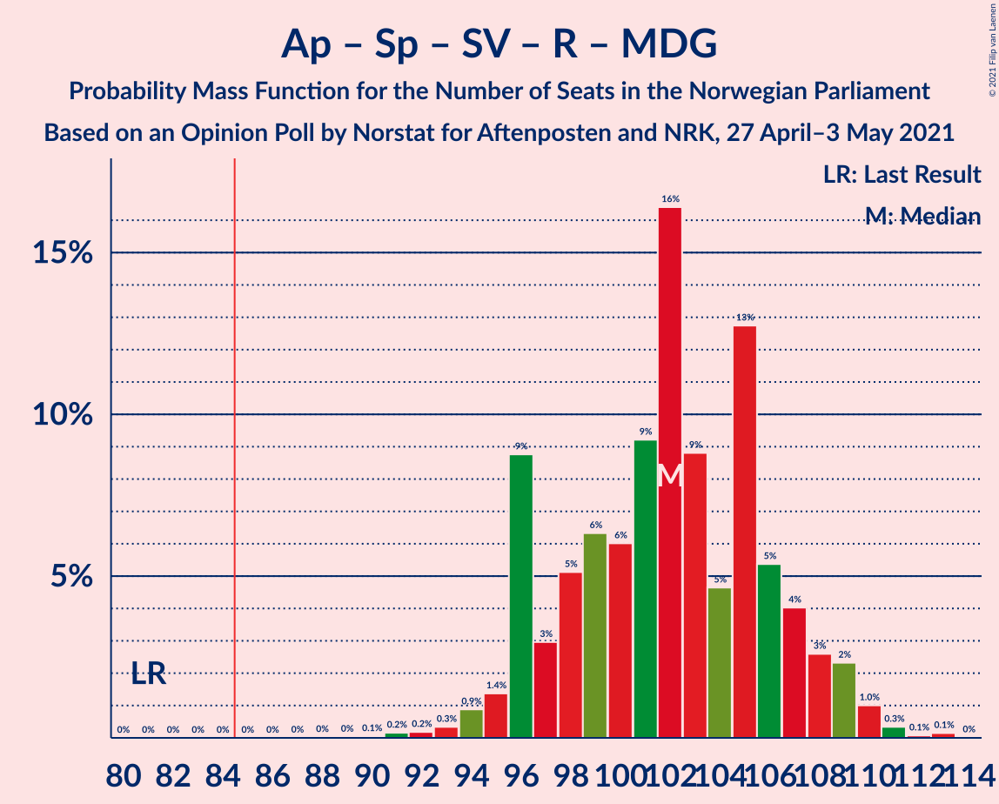
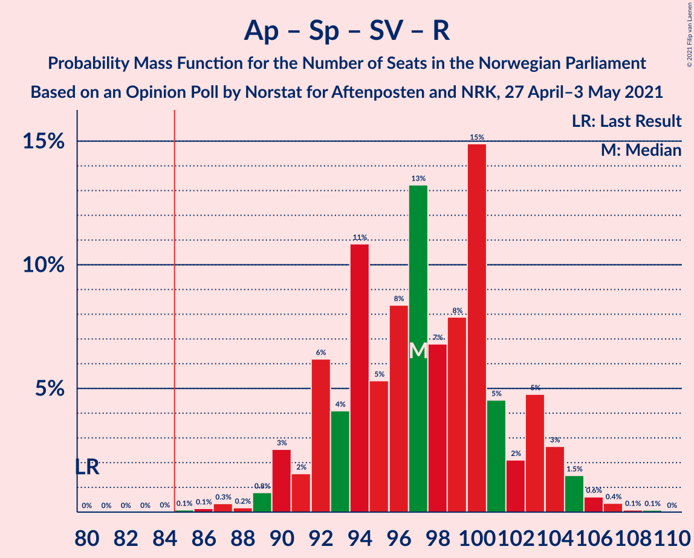
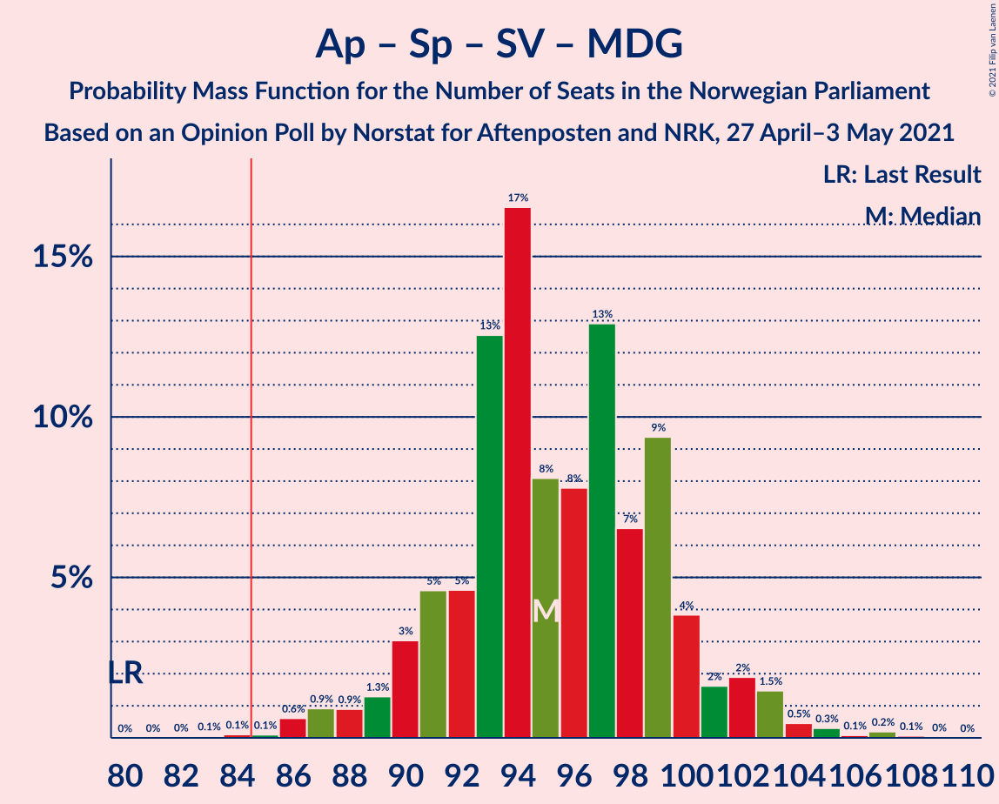
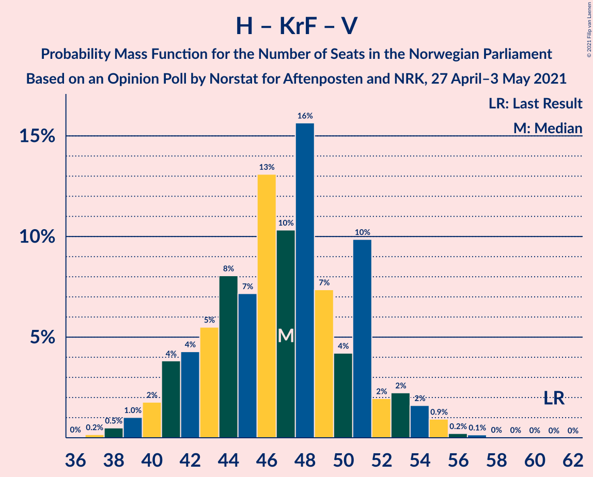

# Opinion Poll by Norstat for Aftenposten and NRK, 27 April–3 May 2021

<a href="#voting-intentions">Voting Intentions</a> | <a href="#seats">Seats</a> | <a href="#coalitions">Coalitions</a> | <a href="#technical-information">Technical Information</a>

## Voting Intentions

### Confidence Intervals

| Party | Last Result | Poll Result | 80% Confidence Interval | 90% Confidence Interval | 95% Confidence Interval | 99% Confidence Interval |
|:-----:|:-----------:|:-----------:|:-----------------------:|:-----------------------:|:-----------------------:|:-----------------------:|
| Arbeiderpartiet | 27.4% | 23.2% | 21.5–25.0% |21.0–25.5% |20.6–26.0% |19.8–26.8% |
| Høyre | 25.0% | 21.1% | 19.5–22.8% |19.0–23.4% |18.6–23.8% |17.9–24.7% |
| Senterpartiet | 10.3% | 17.5% | 16.0–19.2% |15.6–19.7% |15.3–20.1% |14.6–20.9% |
| Fremskrittspartiet | 15.2% | 11.3% | 10.1–12.7% |9.7–13.1% |9.4–13.4% |8.9–14.1% |
| Sosialistisk Venstreparti | 6.0% | 8.8% | 7.7–10.1% |7.4–10.4% |7.1–10.7% |6.6–11.4% |
| Rødt | 2.4% | 4.4% | 3.6–5.4% |3.4–5.6% |3.3–5.9% |2.9–6.4% |
| Kristelig Folkeparti | 4.2% | 4.2% | 3.4–5.1% |3.2–5.4% |3.1–5.6% |2.8–6.1% |
| Miljøpartiet De Grønne | 3.2% | 4.0% | 3.3–4.9% |3.1–5.2% |2.9–5.4% |2.6–5.9% |
| Venstre | 4.4% | 3.1% | 2.5–4.0% |2.3–4.2% |2.2–4.5% |1.9–4.9% |

*Note:* The poll result column reflects the actual value used in the calculations. Published results may vary slightly, and in addition be rounded to fewer digits.

## Seats

### Confidence Intervals

| Party | Last Result | Median | 80% Confidence Interval | 90% Confidence Interval | 95% Confidence Interval | 99% Confidence Interval |
|:-----:|:-----------:|:------:|:-----------------------:|:-----------------------:|:-----------------------:|:-----------------------:|
| <a href="#arbeiderpartiet">Arbeiderpartiet</a> | 49 | 43 | 39–46 |38–47 |38–47 |37–50 |
| <a href="#høyre">Høyre</a> | 45 | 36 | 34–41 |34–42 |33–43 |33–44 |
| <a href="#senterpartiet">Senterpartiet</a> | 19 | 32 | 29–36 |29–37 |28–37 |26–38 |
| <a href="#fremskrittspartiet">Fremskrittspartiet</a> | 27 | 20 | 18–23 |17–23 |16–24 |15–26 |
| <a href="#sosialistisk-venstreparti">Sosialistisk Venstreparti</a> | 11 | 15 | 14–18 |13–19 |12–19 |12–21 |
| <a href="#rødt">Rødt</a> | 1 | 9 | 2–10 |2–10 |2–11 |2–12 |
| <a href="#kristelig-folkeparti">Kristelig Folkeparti</a> | 8 | 8 | 2–9 |2–9 |2–10 |1–11 |
| <a href="#miljøpartiet-de-grønne">Miljøpartiet De Grønne</a> | 1 | 7 | 1–9 |1–9 |1–9 |1–11 |
| <a href="#venstre">Venstre</a> | 8 | 2 | 2–7 |2–7 |2–8 |1–8 |

### Arbeiderpartiet

*For a full overview of the results for this party, see the [Arbeiderpartiet](party-arbeiderpartiet.html) page.*

| Number of Seats | Probability | Accumulated | Special Marks |
|:---------------:|:-----------:|:-----------:|:-------------:|
| 34 | 0% | 100% |  |
| 35 | 0.1% | 99.9% |  |
| 36 | 0.2% | 99.8% |  |
| 37 | 0.7% | 99.6% |  |
| 38 | 5% | 98.9% |  |
| 39 | 11% | 93% |  |
| 40 | 5% | 82% |  |
| 41 | 8% | 77% |  |
| 42 | 11% | 68% |  |
| 43 | 25% | 57% | Median |
| 44 | 19% | 33% |  |
| 45 | 2% | 14% |  |
| 46 | 5% | 12% |  |
| 47 | 5% | 7% |  |
| 48 | 0.6% | 2% |  |
| 49 | 0.1% | 1.3% | Last Result |
| 50 | 1.1% | 1.2% |  |
| 51 | 0% | 0.1% |  |
| 52 | 0% | 0% |  |

### Høyre

*For a full overview of the results for this party, see the [Høyre](party-høyre.html) page.*

| Number of Seats | Probability | Accumulated | Special Marks |
|:---------------:|:-----------:|:-----------:|:-------------:|
| 30 | 0% | 100% |  |
| 31 | 0.1% | 99.9% |  |
| 32 | 0.3% | 99.9% |  |
| 33 | 3% | 99.6% |  |
| 34 | 8% | 97% |  |
| 35 | 10% | 89% |  |
| 36 | 32% | 79% | Median |
| 37 | 9% | 47% |  |
| 38 | 3% | 38% |  |
| 39 | 9% | 34% |  |
| 40 | 13% | 25% |  |
| 41 | 6% | 12% |  |
| 42 | 3% | 6% |  |
| 43 | 2% | 3% |  |
| 44 | 1.2% | 2% |  |
| 45 | 0.3% | 0.5% | Last Result |
| 46 | 0.1% | 0.2% |  |
| 47 | 0.1% | 0.1% |  |
| 48 | 0% | 0% |  |

### Senterpartiet

*For a full overview of the results for this party, see the [Senterpartiet](party-senterpartiet.html) page.*

| Number of Seats | Probability | Accumulated | Special Marks |
|:---------------:|:-----------:|:-----------:|:-------------:|
| 19 | 0% | 100% | Last Result |
| 20 | 0% | 100% |  |
| 21 | 0% | 100% |  |
| 22 | 0% | 100% |  |
| 23 | 0% | 100% |  |
| 24 | 0% | 100% |  |
| 25 | 0.1% | 99.9% |  |
| 26 | 0.4% | 99.8% |  |
| 27 | 0.9% | 99.4% |  |
| 28 | 2% | 98.5% |  |
| 29 | 28% | 97% |  |
| 30 | 7% | 68% |  |
| 31 | 9% | 61% |  |
| 32 | 12% | 51% | Median |
| 33 | 13% | 39% |  |
| 34 | 5% | 26% |  |
| 35 | 8% | 21% |  |
| 36 | 6% | 13% |  |
| 37 | 7% | 8% |  |
| 38 | 0.3% | 0.6% |  |
| 39 | 0.2% | 0.3% |  |
| 40 | 0% | 0.1% |  |
| 41 | 0% | 0% |  |

### Fremskrittspartiet

*For a full overview of the results for this party, see the [Fremskrittspartiet](party-fremskrittspartiet.html) page.*

| Number of Seats | Probability | Accumulated | Special Marks |
|:---------------:|:-----------:|:-----------:|:-------------:|
| 14 | 0.3% | 100% |  |
| 15 | 1.2% | 99.7% |  |
| 16 | 3% | 98% |  |
| 17 | 4% | 95% |  |
| 18 | 4% | 91% |  |
| 19 | 23% | 87% |  |
| 20 | 27% | 65% | Median |
| 21 | 14% | 38% |  |
| 22 | 11% | 23% |  |
| 23 | 7% | 12% |  |
| 24 | 2% | 5% |  |
| 25 | 1.0% | 2% |  |
| 26 | 1.1% | 1.3% |  |
| 27 | 0.1% | 0.2% | Last Result |
| 28 | 0.1% | 0.1% |  |
| 29 | 0% | 0% |  |

### Sosialistisk Venstreparti

*For a full overview of the results for this party, see the [Sosialistisk Venstreparti](party-sosialistiskvenstreparti.html) page.*

| Number of Seats | Probability | Accumulated | Special Marks |
|:---------------:|:-----------:|:-----------:|:-------------:|
| 10 | 0.2% | 100% |  |
| 11 | 0.2% | 99.8% | Last Result |
| 12 | 3% | 99.6% |  |
| 13 | 3% | 97% |  |
| 14 | 14% | 94% |  |
| 15 | 36% | 80% | Median |
| 16 | 20% | 43% |  |
| 17 | 13% | 24% |  |
| 18 | 3% | 11% |  |
| 19 | 6% | 8% |  |
| 20 | 1.1% | 2% |  |
| 21 | 0.5% | 0.6% |  |
| 22 | 0.1% | 0.1% |  |
| 23 | 0% | 0% |  |

### Rødt

*For a full overview of the results for this party, see the [Rødt](party-rødt.html) page.*

| Number of Seats | Probability | Accumulated | Special Marks |
|:---------------:|:-----------:|:-----------:|:-------------:|
| 1 | 0.2% | 100% | Last Result |
| 2 | 12% | 99.8% |  |
| 3 | 0% | 88% |  |
| 4 | 0% | 88% |  |
| 5 | 0% | 88% |  |
| 6 | 0% | 88% |  |
| 7 | 7% | 88% |  |
| 8 | 23% | 81% |  |
| 9 | 46% | 58% | Median |
| 10 | 8% | 12% |  |
| 11 | 3% | 4% |  |
| 12 | 0.6% | 0.6% |  |
| 13 | 0% | 0% |  |

### Kristelig Folkeparti

*For a full overview of the results for this party, see the [Kristelig Folkeparti](party-kristeligfolkeparti.html) page.*

| Number of Seats | Probability | Accumulated | Special Marks |
|:---------------:|:-----------:|:-----------:|:-------------:|
| 1 | 2% | 100% |  |
| 2 | 9% | 98% |  |
| 3 | 24% | 89% |  |
| 4 | 0% | 66% |  |
| 5 | 0% | 66% |  |
| 6 | 0% | 66% |  |
| 7 | 13% | 66% |  |
| 8 | 37% | 53% | Last Result, Median |
| 9 | 12% | 16% |  |
| 10 | 2% | 4% |  |
| 11 | 1.5% | 2% |  |
| 12 | 0.1% | 0.1% |  |
| 13 | 0% | 0% |  |

### Miljøpartiet De Grønne

*For a full overview of the results for this party, see the [Miljøpartiet De Grønne](party-miljøpartietdegrønne.html) page.*

| Number of Seats | Probability | Accumulated | Special Marks |
|:---------------:|:-----------:|:-----------:|:-------------:|
| 1 | 12% | 100% | Last Result |
| 2 | 34% | 88% |  |
| 3 | 3% | 54% |  |
| 4 | 0.2% | 51% |  |
| 5 | 0% | 51% |  |
| 6 | 0.2% | 51% |  |
| 7 | 30% | 51% | Median |
| 8 | 7% | 21% |  |
| 9 | 12% | 14% |  |
| 10 | 1.5% | 2% |  |
| 11 | 0.6% | 0.6% |  |
| 12 | 0% | 0% |  |

### Venstre

*For a full overview of the results for this party, see the [Venstre](party-venstre.html) page.*

| Number of Seats | Probability | Accumulated | Special Marks |
|:---------------:|:-----------:|:-----------:|:-------------:|
| 0 | 0.1% | 100% |  |
| 1 | 2% | 99.9% |  |
| 2 | 86% | 98% | Median |
| 3 | 1.2% | 12% |  |
| 4 | 0% | 11% |  |
| 5 | 0% | 11% |  |
| 6 | 0.2% | 11% |  |
| 7 | 8% | 11% |  |
| 8 | 2% | 3% | Last Result |
| 9 | 0.3% | 0.3% |  |
| 10 | 0% | 0% |  |

## Coalitions

### Confidence Intervals

| Coalition | Last Result | Median | Majority? | 80% Confidence Interval | 90% Confidence Interval | 95% Confidence Interval | 99% Confidence Interval |
|:---------:|:-----------:|:------:|:---------:|:-----------------------:|:-----------------------:|:-----------------------:|:-----------------------:|
| Arbeiderpartiet – Senterpartiet – Sosialistisk Venstreparti – Rødt – Miljøpartiet De Grønne | 81 | 103 | 100% | 97–108 | 95–109 | 95–110 | 92–112 |
| Arbeiderpartiet – Senterpartiet – Sosialistisk Venstreparti – Kristelig Folkeparti – Miljøpartiet De Grønne | 88 | 102 | 100% | 97–106 | 93–108 | 93–110 | 90–112 |
| Høyre – Senterpartiet – Fremskrittspartiet – Kristelig Folkeparti – Venstre | 107 | 97 | 100% | 94–103 | 93–104 | 93–106 | 88–109 |
| Arbeiderpartiet – Senterpartiet – Sosialistisk Venstreparti – Rødt | 80 | 98 | 100% | 93–102 | 92–103 | 91–105 | 88–106 |
| Arbeiderpartiet – Senterpartiet – Sosialistisk Venstreparti – Miljøpartiet De Grønne | 80 | 94 | 99.4% | 90–100 | 89–102 | 87–103 | 84–105 |
| Arbeiderpartiet – Senterpartiet – Sosialistisk Venstreparti | 79 | 90 | 98% | 87–95 | 85–97 | 85–98 | 82–101 |
| Arbeiderpartiet – Senterpartiet – Kristelig Folkeparti – Miljøpartiet De Grønne | 77 | 87 | 62% | 79–90 | 78–93 | 77–95 | 74–96 |
| Arbeiderpartiet – Senterpartiet – Kristelig Folkeparti | 76 | 80 | 14% | 76–87 | 74–87 | 74–88 | 72–91 |
| Arbeiderpartiet – Senterpartiet | 68 | 74 | 1.2% | 71–80 | 68–81 | 68–82 | 66–85 |
| Høyre – Fremskrittspartiet – Kristelig Folkeparti – Miljøpartiet De Grønne – Venstre | 89 | 71 | 0% | 67–76 | 66–77 | 64–78 | 63–81 |
| Høyre – Fremskrittspartiet – Kristelig Folkeparti – Venstre | 88 | 66 | 0% | 61–72 | 60–74 | 59–74 | 56–77 |
| Høyre – Fremskrittspartiet – Venstre | 80 | 59 | 0% | 57–66 | 54–66 | 52–67 | 52–71 |
| Arbeiderpartiet – Sosialistisk Venstreparti | 60 | 58 | 0% | 55–62 | 55–63 | 54–64 | 52–66 |
| Høyre – Fremskrittspartiet | 72 | 56 | 0% | 53–63 | 52–64 | 50–64 | 50–66 |
| Høyre – Kristelig Folkeparti – Venstre | 61 | 46 | 0% | 42–50 | 42–52 | 40–54 | 39–56 |
| Senterpartiet – Kristelig Folkeparti – Venstre | 35 | 40 | 0% | 37–45 | 36–47 | 35–50 | 33–50 |

### Arbeiderpartiet – Senterpartiet – Sosialistisk Venstreparti – Rødt – Miljøpartiet De Grønne

| Number of Seats | Probability | Accumulated | Special Marks |
|:---------------:|:-----------:|:-----------:|:-------------:|
| 81 | 0% | 100% | Last Result |
| 82 | 0% | 100% |  |
| 83 | 0% | 100% |  |
| 84 | 0% | 100% |  |
| 85 | 0% | 100% | Majority |
| 86 | 0% | 100% |  |
| 87 | 0% | 100% |  |
| 88 | 0.1% | 100% |  |
| 89 | 0% | 99.9% |  |
| 90 | 0.3% | 99.9% |  |
| 91 | 0.1% | 99.6% |  |
| 92 | 0.1% | 99.5% |  |
| 93 | 1.3% | 99.5% |  |
| 94 | 0.4% | 98% |  |
| 95 | 3% | 98% |  |
| 96 | 2% | 95% |  |
| 97 | 5% | 93% |  |
| 98 | 0.6% | 88% |  |
| 99 | 3% | 88% |  |
| 100 | 10% | 85% |  |
| 101 | 8% | 75% |  |
| 102 | 2% | 67% |  |
| 103 | 35% | 65% |  |
| 104 | 5% | 30% |  |
| 105 | 6% | 25% |  |
| 106 | 4% | 19% | Median |
| 107 | 1.3% | 15% |  |
| 108 | 8% | 14% |  |
| 109 | 2% | 5% |  |
| 110 | 2% | 3% |  |
| 111 | 0.4% | 1.1% |  |
| 112 | 0.2% | 0.6% |  |
| 113 | 0.4% | 0.4% |  |
| 114 | 0% | 0% |  |

### Arbeiderpartiet – Senterpartiet – Sosialistisk Venstreparti – Kristelig Folkeparti – Miljøpartiet De Grønne

| Number of Seats | Probability | Accumulated | Special Marks |
|:---------------:|:-----------:|:-----------:|:-------------:|
| 88 | 0% | 100% | Last Result |
| 89 | 0.4% | 100% |  |
| 90 | 0.5% | 99.6% |  |
| 91 | 0.1% | 99.1% |  |
| 92 | 0.7% | 98.9% |  |
| 93 | 4% | 98% |  |
| 94 | 0.5% | 94% |  |
| 95 | 0.8% | 93% |  |
| 96 | 0.5% | 93% |  |
| 97 | 8% | 92% |  |
| 98 | 8% | 84% |  |
| 99 | 13% | 77% |  |
| 100 | 2% | 64% |  |
| 101 | 7% | 62% |  |
| 102 | 34% | 55% |  |
| 103 | 2% | 21% |  |
| 104 | 8% | 19% |  |
| 105 | 0.8% | 11% | Median |
| 106 | 2% | 10% |  |
| 107 | 2% | 8% |  |
| 108 | 1.4% | 6% |  |
| 109 | 2% | 5% |  |
| 110 | 2% | 3% |  |
| 111 | 0.6% | 1.3% |  |
| 112 | 0.7% | 0.7% |  |
| 113 | 0% | 0% |  |

### Høyre – Senterpartiet – Fremskrittspartiet – Kristelig Folkeparti – Venstre

| Number of Seats | Probability | Accumulated | Special Marks |
|:---------------:|:-----------:|:-----------:|:-------------:|
| 87 | 0.3% | 100% |  |
| 88 | 0.4% | 99.7% |  |
| 89 | 0.1% | 99.3% |  |
| 90 | 0.1% | 99.2% |  |
| 91 | 0.8% | 99.1% |  |
| 92 | 0.5% | 98% |  |
| 93 | 7% | 98% |  |
| 94 | 4% | 90% |  |
| 95 | 25% | 87% |  |
| 96 | 6% | 62% |  |
| 97 | 7% | 55% |  |
| 98 | 3% | 48% | Median |
| 99 | 5% | 45% |  |
| 100 | 9% | 40% |  |
| 101 | 8% | 31% |  |
| 102 | 5% | 24% |  |
| 103 | 11% | 19% |  |
| 104 | 3% | 8% |  |
| 105 | 0.7% | 5% |  |
| 106 | 2% | 4% |  |
| 107 | 0.4% | 2% | Last Result |
| 108 | 1.0% | 2% |  |
| 109 | 0.1% | 0.5% |  |
| 110 | 0.3% | 0.4% |  |
| 111 | 0.1% | 0.2% |  |
| 112 | 0% | 0.1% |  |
| 113 | 0.1% | 0.1% |  |
| 114 | 0% | 0% |  |

### Arbeiderpartiet – Senterpartiet – Sosialistisk Venstreparti – Rødt

| Number of Seats | Probability | Accumulated | Special Marks |
|:---------------:|:-----------:|:-----------:|:-------------:|
| 80 | 0% | 100% | Last Result |
| 81 | 0% | 100% |  |
| 82 | 0% | 100% |  |
| 83 | 0% | 100% |  |
| 84 | 0% | 100% |  |
| 85 | 0% | 100% | Majority |
| 86 | 0.2% | 99.9% |  |
| 87 | 0.1% | 99.7% |  |
| 88 | 0.2% | 99.6% |  |
| 89 | 0.4% | 99.4% |  |
| 90 | 0.4% | 99.0% |  |
| 91 | 2% | 98.6% |  |
| 92 | 4% | 97% |  |
| 93 | 5% | 93% |  |
| 94 | 3% | 89% |  |
| 95 | 5% | 86% |  |
| 96 | 26% | 81% |  |
| 97 | 3% | 55% |  |
| 98 | 5% | 53% |  |
| 99 | 19% | 48% | Median |
| 100 | 4% | 29% |  |
| 101 | 11% | 24% |  |
| 102 | 3% | 13% |  |
| 103 | 6% | 9% |  |
| 104 | 0.6% | 3% |  |
| 105 | 2% | 3% |  |
| 106 | 0.5% | 0.9% |  |
| 107 | 0.3% | 0.3% |  |
| 108 | 0% | 0.1% |  |
| 109 | 0.1% | 0.1% |  |
| 110 | 0% | 0% |  |

### Arbeiderpartiet – Senterpartiet – Sosialistisk Venstreparti – Miljøpartiet De Grønne

| Number of Seats | Probability | Accumulated | Special Marks |
|:---------------:|:-----------:|:-----------:|:-------------:|
| 80 | 0% | 100% | Last Result |
| 81 | 0% | 100% |  |
| 82 | 0.1% | 100% |  |
| 83 | 0% | 99.9% |  |
| 84 | 0.5% | 99.9% |  |
| 85 | 0.2% | 99.4% | Majority |
| 86 | 0.4% | 99.2% |  |
| 87 | 1.5% | 98.8% |  |
| 88 | 2% | 97% |  |
| 89 | 4% | 96% |  |
| 90 | 2% | 91% |  |
| 91 | 10% | 89% |  |
| 92 | 8% | 79% |  |
| 93 | 2% | 71% |  |
| 94 | 32% | 69% |  |
| 95 | 1.2% | 37% |  |
| 96 | 6% | 36% |  |
| 97 | 5% | 30% | Median |
| 98 | 3% | 25% |  |
| 99 | 11% | 22% |  |
| 100 | 4% | 11% |  |
| 101 | 1.1% | 7% |  |
| 102 | 3% | 6% |  |
| 103 | 2% | 3% |  |
| 104 | 0.3% | 0.9% |  |
| 105 | 0.3% | 0.6% |  |
| 106 | 0% | 0.3% |  |
| 107 | 0% | 0.3% |  |
| 108 | 0.3% | 0.3% |  |
| 109 | 0% | 0% |  |

### Arbeiderpartiet – Senterpartiet – Sosialistisk Venstreparti

| Number of Seats | Probability | Accumulated | Special Marks |
|:---------------:|:-----------:|:-----------:|:-------------:|
| 79 | 0.1% | 100% | Last Result |
| 80 | 0% | 99.8% |  |
| 81 | 0.1% | 99.8% |  |
| 82 | 0.6% | 99.7% |  |
| 83 | 0.3% | 99.1% |  |
| 84 | 0.9% | 98.9% |  |
| 85 | 3% | 98% | Majority |
| 86 | 3% | 95% |  |
| 87 | 27% | 92% |  |
| 88 | 3% | 65% |  |
| 89 | 9% | 62% |  |
| 90 | 20% | 53% | Median |
| 91 | 8% | 33% |  |
| 92 | 8% | 25% |  |
| 93 | 2% | 17% |  |
| 94 | 3% | 15% |  |
| 95 | 5% | 12% |  |
| 96 | 0.2% | 7% |  |
| 97 | 1.4% | 6% |  |
| 98 | 3% | 5% |  |
| 99 | 0% | 2% |  |
| 100 | 0.3% | 2% |  |
| 101 | 1.2% | 1.2% |  |
| 102 | 0% | 0.1% |  |
| 103 | 0% | 0% |  |

### Arbeiderpartiet – Senterpartiet – Kristelig Folkeparti – Miljøpartiet De Grønne

| Number of Seats | Probability | Accumulated | Special Marks |
|:---------------:|:-----------:|:-----------:|:-------------:|
| 73 | 0% | 100% |  |
| 74 | 0.5% | 99.9% |  |
| 75 | 0.6% | 99.4% |  |
| 76 | 1.0% | 98.8% |  |
| 77 | 0.8% | 98% | Last Result |
| 78 | 4% | 97% |  |
| 79 | 5% | 93% |  |
| 80 | 1.4% | 89% |  |
| 81 | 11% | 87% |  |
| 82 | 6% | 77% |  |
| 83 | 7% | 71% |  |
| 84 | 2% | 64% |  |
| 85 | 7% | 62% | Majority |
| 86 | 2% | 55% |  |
| 87 | 23% | 53% |  |
| 88 | 9% | 30% |  |
| 89 | 9% | 21% |  |
| 90 | 4% | 12% | Median |
| 91 | 2% | 9% |  |
| 92 | 0.8% | 7% |  |
| 93 | 2% | 6% |  |
| 94 | 0.3% | 4% |  |
| 95 | 2% | 4% |  |
| 96 | 2% | 2% |  |
| 97 | 0.1% | 0.1% |  |
| 98 | 0% | 0% |  |

### Arbeiderpartiet – Senterpartiet – Kristelig Folkeparti

| Number of Seats | Probability | Accumulated | Special Marks |
|:---------------:|:-----------:|:-----------:|:-------------:|
| 68 | 0.1% | 100% |  |
| 69 | 0.1% | 99.9% |  |
| 70 | 0.2% | 99.9% |  |
| 71 | 0.2% | 99.7% |  |
| 72 | 0.3% | 99.5% |  |
| 73 | 1.2% | 99.3% |  |
| 74 | 3% | 98% |  |
| 75 | 2% | 95% |  |
| 76 | 5% | 93% | Last Result |
| 77 | 5% | 88% |  |
| 78 | 3% | 83% |  |
| 79 | 15% | 80% |  |
| 80 | 25% | 65% |  |
| 81 | 15% | 40% |  |
| 82 | 2% | 24% |  |
| 83 | 2% | 22% | Median |
| 84 | 6% | 21% |  |
| 85 | 0.5% | 14% | Majority |
| 86 | 1.2% | 14% |  |
| 87 | 8% | 12% |  |
| 88 | 3% | 4% |  |
| 89 | 0.3% | 1.4% |  |
| 90 | 0.1% | 1.1% |  |
| 91 | 0.9% | 1.0% |  |
| 92 | 0% | 0.1% |  |
| 93 | 0% | 0.1% |  |
| 94 | 0% | 0% |  |

### Arbeiderpartiet – Senterpartiet

| Number of Seats | Probability | Accumulated | Special Marks |
|:---------------:|:-----------:|:-----------:|:-------------:|
| 63 | 0.1% | 100% |  |
| 64 | 0% | 99.9% |  |
| 65 | 0.3% | 99.8% |  |
| 66 | 0.3% | 99.5% |  |
| 67 | 0.5% | 99.2% |  |
| 68 | 5% | 98.7% | Last Result |
| 69 | 0.8% | 94% |  |
| 70 | 3% | 93% |  |
| 71 | 4% | 91% |  |
| 72 | 27% | 87% |  |
| 73 | 9% | 60% |  |
| 74 | 10% | 51% |  |
| 75 | 3% | 41% | Median |
| 76 | 17% | 38% |  |
| 77 | 3% | 20% |  |
| 78 | 5% | 18% |  |
| 79 | 1.1% | 13% |  |
| 80 | 7% | 12% |  |
| 81 | 0.8% | 5% |  |
| 82 | 3% | 4% |  |
| 83 | 0.5% | 2% |  |
| 84 | 0% | 1.2% |  |
| 85 | 1.1% | 1.2% | Majority |
| 86 | 0% | 0% |  |

### Høyre – Fremskrittspartiet – Kristelig Folkeparti – Miljøpartiet De Grønne – Venstre

| Number of Seats | Probability | Accumulated | Special Marks |
|:---------------:|:-----------:|:-----------:|:-------------:|
| 60 | 0.1% | 100% |  |
| 61 | 0% | 99.9% |  |
| 62 | 0.3% | 99.9% |  |
| 63 | 0.6% | 99.6% |  |
| 64 | 2% | 99.1% |  |
| 65 | 0.6% | 97% |  |
| 66 | 6% | 96% |  |
| 67 | 3% | 90% |  |
| 68 | 11% | 87% |  |
| 69 | 4% | 75% |  |
| 70 | 20% | 71% |  |
| 71 | 5% | 51% |  |
| 72 | 3% | 47% |  |
| 73 | 25% | 44% | Median |
| 74 | 5% | 19% |  |
| 75 | 3% | 14% |  |
| 76 | 5% | 11% |  |
| 77 | 4% | 6% |  |
| 78 | 2% | 3% |  |
| 79 | 0.4% | 1.3% |  |
| 80 | 0.4% | 0.9% |  |
| 81 | 0.2% | 0.6% |  |
| 82 | 0.1% | 0.4% |  |
| 83 | 0.2% | 0.2% |  |
| 84 | 0% | 0.1% |  |
| 85 | 0% | 0% | Majority |
| 86 | 0% | 0% |  |
| 87 | 0% | 0% |  |
| 88 | 0% | 0% |  |
| 89 | 0% | 0% | Last Result |

### Høyre – Fremskrittspartiet – Kristelig Folkeparti – Venstre

| Number of Seats | Probability | Accumulated | Special Marks |
|:---------------:|:-----------:|:-----------:|:-------------:|
| 56 | 0.5% | 100% |  |
| 57 | 0.2% | 99.5% |  |
| 58 | 0.4% | 99.3% |  |
| 59 | 2% | 98.9% |  |
| 60 | 3% | 97% |  |
| 61 | 8% | 94% |  |
| 62 | 1.3% | 86% |  |
| 63 | 4% | 85% |  |
| 64 | 6% | 80% |  |
| 65 | 5% | 74% |  |
| 66 | 35% | 69% | Median |
| 67 | 2% | 34% |  |
| 68 | 7% | 32% |  |
| 69 | 10% | 25% |  |
| 70 | 3% | 15% |  |
| 71 | 0.6% | 12% |  |
| 72 | 5% | 12% |  |
| 73 | 2% | 7% |  |
| 74 | 3% | 5% |  |
| 75 | 0.4% | 2% |  |
| 76 | 1.3% | 2% |  |
| 77 | 0.1% | 0.5% |  |
| 78 | 0.1% | 0.5% |  |
| 79 | 0.3% | 0.4% |  |
| 80 | 0% | 0.1% |  |
| 81 | 0.1% | 0.1% |  |
| 82 | 0% | 0% |  |
| 83 | 0% | 0% |  |
| 84 | 0% | 0% |  |
| 85 | 0% | 0% | Majority |
| 86 | 0% | 0% |  |
| 87 | 0% | 0% |  |
| 88 | 0% | 0% | Last Result |

### Høyre – Fremskrittspartiet – Venstre

| Number of Seats | Probability | Accumulated | Special Marks |
|:---------------:|:-----------:|:-----------:|:-------------:|
| 50 | 0.2% | 100% |  |
| 51 | 0.1% | 99.8% |  |
| 52 | 2% | 99.7% |  |
| 53 | 2% | 97% |  |
| 54 | 2% | 96% |  |
| 55 | 1.4% | 94% |  |
| 56 | 0.9% | 92% |  |
| 57 | 7% | 91% |  |
| 58 | 34% | 84% | Median |
| 59 | 5% | 50% |  |
| 60 | 4% | 45% |  |
| 61 | 7% | 41% |  |
| 62 | 3% | 34% |  |
| 63 | 15% | 31% |  |
| 64 | 1.1% | 15% |  |
| 65 | 3% | 14% |  |
| 66 | 7% | 11% |  |
| 67 | 2% | 4% |  |
| 68 | 0.7% | 2% |  |
| 69 | 0.3% | 2% |  |
| 70 | 0.3% | 1.4% |  |
| 71 | 0.9% | 1.1% |  |
| 72 | 0.1% | 0.2% |  |
| 73 | 0.1% | 0.1% |  |
| 74 | 0% | 0% |  |
| 75 | 0% | 0% |  |
| 76 | 0% | 0% |  |
| 77 | 0% | 0% |  |
| 78 | 0% | 0% |  |
| 79 | 0% | 0% |  |
| 80 | 0% | 0% | Last Result |

### Arbeiderpartiet – Sosialistisk Venstreparti

| Number of Seats | Probability | Accumulated | Special Marks |
|:---------------:|:-----------:|:-----------:|:-------------:|
| 49 | 0% | 100% |  |
| 50 | 0.1% | 99.9% |  |
| 51 | 0.2% | 99.8% |  |
| 52 | 0.9% | 99.6% |  |
| 53 | 1.2% | 98.7% |  |
| 54 | 2% | 98% |  |
| 55 | 10% | 96% |  |
| 56 | 9% | 85% |  |
| 57 | 14% | 77% |  |
| 58 | 37% | 63% | Median |
| 59 | 9% | 26% |  |
| 60 | 0.8% | 17% | Last Result |
| 61 | 3% | 16% |  |
| 62 | 8% | 14% |  |
| 63 | 2% | 6% |  |
| 64 | 2% | 4% |  |
| 65 | 0.1% | 2% |  |
| 66 | 2% | 2% |  |
| 67 | 0.2% | 0.3% |  |
| 68 | 0% | 0% |  |

### Høyre – Fremskrittspartiet

| Number of Seats | Probability | Accumulated | Special Marks |
|:---------------:|:-----------:|:-----------:|:-------------:|
| 49 | 0.3% | 100% |  |
| 50 | 2% | 99.6% |  |
| 51 | 2% | 97% |  |
| 52 | 2% | 96% |  |
| 53 | 3% | 93% |  |
| 54 | 0.8% | 90% |  |
| 55 | 9% | 89% |  |
| 56 | 37% | 80% | Median |
| 57 | 6% | 42% |  |
| 58 | 2% | 37% |  |
| 59 | 8% | 34% |  |
| 60 | 1.2% | 27% |  |
| 61 | 12% | 26% |  |
| 62 | 1.3% | 14% |  |
| 63 | 3% | 12% |  |
| 64 | 7% | 9% |  |
| 65 | 0.7% | 2% |  |
| 66 | 0.7% | 1.1% |  |
| 67 | 0.1% | 0.4% |  |
| 68 | 0.2% | 0.3% |  |
| 69 | 0% | 0.1% |  |
| 70 | 0.1% | 0.1% |  |
| 71 | 0% | 0% |  |
| 72 | 0% | 0% | Last Result |

### Høyre – Kristelig Folkeparti – Venstre

| Number of Seats | Probability | Accumulated | Special Marks |
|:---------------:|:-----------:|:-----------:|:-------------:|
| 36 | 0% | 100% |  |
| 37 | 0% | 99.9% |  |
| 38 | 0.1% | 99.9% |  |
| 39 | 0.7% | 99.8% |  |
| 40 | 2% | 99.0% |  |
| 41 | 2% | 97% |  |
| 42 | 7% | 95% |  |
| 43 | 1.4% | 88% |  |
| 44 | 13% | 87% |  |
| 45 | 21% | 74% |  |
| 46 | 25% | 53% | Median |
| 47 | 3% | 28% |  |
| 48 | 3% | 25% |  |
| 49 | 3% | 22% |  |
| 50 | 9% | 19% |  |
| 51 | 4% | 10% |  |
| 52 | 1.0% | 5% |  |
| 53 | 0.9% | 4% |  |
| 54 | 1.0% | 3% |  |
| 55 | 1.5% | 2% |  |
| 56 | 0.7% | 1.0% |  |
| 57 | 0.2% | 0.4% |  |
| 58 | 0% | 0.1% |  |
| 59 | 0% | 0.1% |  |
| 60 | 0.1% | 0.1% |  |
| 61 | 0% | 0% | Last Result |

### Senterpartiet – Kristelig Folkeparti – Venstre

| Number of Seats | Probability | Accumulated | Special Marks |
|:---------------:|:-----------:|:-----------:|:-------------:|
| 30 | 0.1% | 100% |  |
| 31 | 0.1% | 99.9% |  |
| 32 | 0.2% | 99.8% |  |
| 33 | 0.8% | 99.6% |  |
| 34 | 0.4% | 98.8% |  |
| 35 | 1.3% | 98% | Last Result |
| 36 | 3% | 97% |  |
| 37 | 11% | 94% |  |
| 38 | 1.2% | 83% |  |
| 39 | 28% | 82% |  |
| 40 | 5% | 54% |  |
| 41 | 13% | 48% |  |
| 42 | 14% | 35% | Median |
| 43 | 4% | 21% |  |
| 44 | 6% | 18% |  |
| 45 | 3% | 11% |  |
| 46 | 2% | 8% |  |
| 47 | 1.3% | 6% |  |
| 48 | 0.2% | 4% |  |
| 49 | 2% | 4% |  |
| 50 | 2% | 3% |  |
| 51 | 0.2% | 0.3% |  |
| 52 | 0.1% | 0.1% |  |
| 53 | 0% | 0% |  |

## Technical Information

### Opinion Poll

+ **Polling firm:** Norstat
+ **Commissioner(s):** Aftenposten and NRK
+ **Fieldwork period:** 27 April–3 May 2021

### Calculations

+ **Sample size:** 958
+ **Simulations done:** 131,072
+ **Error estimate:** 1.34%

