# Opinion Poll by Norstat for Aftenposten and NRK, 27 April–3 May 2021

<a href="#voting-intentions">Voting Intentions</a> | <a href="#seats">Seats</a> | <a href="#coalitions">Coalitions</a> | <a href="#technical-information">Technical Information</a>

## Voting Intentions

### Confidence Intervals

| Party | Last Result | Poll Result | 80% Confidence Interval | 90% Confidence Interval | 95% Confidence Interval | 99% Confidence Interval |
|:-----:|:-----------:|:-----------:|:-----------------------:|:-----------------------:|:-----------------------:|:-----------------------:|
| Arbeiderpartiet | 27.4% | 23.2% | 21.5–25.0% |21.0–25.5% |20.6–26.0% |19.8–26.8% |
| Høyre | 25.0% | 21.1% | 19.5–22.8% |19.0–23.4% |18.6–23.8% |17.9–24.7% |
| Senterpartiet | 10.3% | 17.5% | 16.0–19.2% |15.6–19.7% |15.3–20.1% |14.6–20.9% |
| Fremskrittspartiet | 15.2% | 11.3% | 10.1–12.7% |9.7–13.1% |9.4–13.4% |8.9–14.1% |
| Sosialistisk Venstreparti | 6.0% | 8.8% | 7.7–10.1% |7.4–10.4% |7.1–10.7% |6.6–11.4% |
| Rødt | 2.4% | 4.4% | 3.6–5.4% |3.4–5.6% |3.3–5.9% |2.9–6.4% |
| Kristelig Folkeparti | 4.2% | 4.2% | 3.4–5.1% |3.2–5.4% |3.1–5.6% |2.8–6.1% |
| Miljøpartiet De Grønne | 3.2% | 4.0% | 3.3–4.9% |3.1–5.2% |2.9–5.4% |2.6–5.9% |
| Venstre | 4.4% | 3.1% | 2.5–4.0% |2.3–4.2% |2.2–4.5% |1.9–4.9% |

*Note:* The poll result column reflects the actual value used in the calculations. Published results may vary slightly, and in addition be rounded to fewer digits.

## Seats

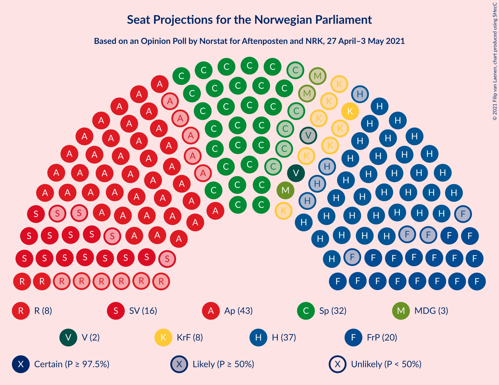

### Confidence Intervals

| Party | Last Result | Median | 80% Confidence Interval | 90% Confidence Interval | 95% Confidence Interval | 99% Confidence Interval |
|:-----:|:-----------:|:------:|:-----------------------:|:-----------------------:|:-----------------------:|:-----------------------:|
| <a href="#arbeiderpartiet">Arbeiderpartiet</a> | 49 | 43 | 40–45 |39–47 |38–48 |37–50 |
| <a href="#høyre">Høyre</a> | 45 | 37 | 34–41 |34–42 |33–43 |32–45 |
| <a href="#senterpartiet">Senterpartiet</a> | 19 | 32 | 29–35 |28–36 |27–37 |26–39 |
| <a href="#fremskrittspartiet">Fremskrittspartiet</a> | 27 | 20 | 17–23 |17–24 |16–25 |15–26 |
| <a href="#sosialistisk-venstreparti">Sosialistisk Venstreparti</a> | 11 | 16 | 13–18 |13–19 |12–19 |11–20 |
| <a href="#rødt">Rødt</a> | 1 | 8 | 2–9 |2–10 |2–10 |2–11 |
| <a href="#kristelig-folkeparti">Kristelig Folkeparti</a> | 8 | 8 | 2–9 |2–9 |1–10 |1–11 |
| <a href="#miljøpartiet-de-grønne">Miljøpartiet De Grønne</a> | 1 | 3 | 2–9 |1–9 |1–9 |1–10 |
| <a href="#venstre">Venstre</a> | 8 | 2 | 2–3 |2–7 |1–8 |1–8 |

### Arbeiderpartiet

*For a full overview of the results for this party, see the [Arbeiderpartiet](party-arbeiderpartiet.html) page.*

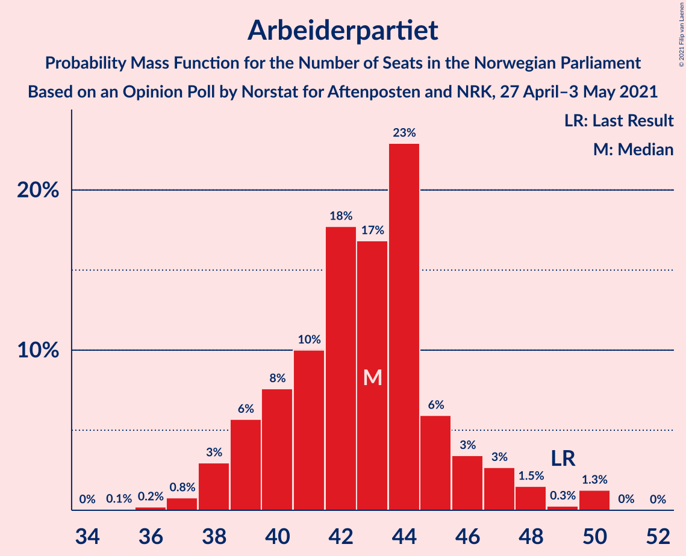

| Number of Seats | Probability | Accumulated | Special Marks |
|:---------------:|:-----------:|:-----------:|:-------------:|
| 34 | 0% | 100% |  |
| 35 | 0.1% | 99.9% |  |
| 36 | 0.2% | 99.9% |  |
| 37 | 0.8% | 99.6% |  |
| 38 | 3% | 98.9% |  |
| 39 | 6% | 96% |  |
| 40 | 8% | 90% |  |
| 41 | 10% | 83% |  |
| 42 | 18% | 73% |  |
| 43 | 17% | 55% | Median |
| 44 | 23% | 38% |  |
| 45 | 6% | 15% |  |
| 46 | 3% | 9% |  |
| 47 | 3% | 6% |  |
| 48 | 1.5% | 3% |  |
| 49 | 0.3% | 2% | Last Result |
| 50 | 1.3% | 1.3% |  |
| 51 | 0% | 0.1% |  |
| 52 | 0% | 0% |  |

### Høyre

*For a full overview of the results for this party, see the [Høyre](party-høyre.html) page.*

| Number of Seats | Probability | Accumulated | Special Marks |
|:---------------:|:-----------:|:-----------:|:-------------:|
| 30 | 0.1% | 100% |  |
| 31 | 0.3% | 99.9% |  |
| 32 | 0.8% | 99.7% |  |
| 33 | 3% | 98.8% |  |
| 34 | 8% | 96% |  |
| 35 | 8% | 88% |  |
| 36 | 15% | 80% |  |
| 37 | 16% | 65% | Median |
| 38 | 11% | 49% |  |
| 39 | 9% | 37% |  |
| 40 | 12% | 28% |  |
| 41 | 7% | 16% |  |
| 42 | 4% | 9% |  |
| 43 | 3% | 5% |  |
| 44 | 0.9% | 2% |  |
| 45 | 0.8% | 1.1% | Last Result |
| 46 | 0.1% | 0.2% |  |
| 47 | 0.1% | 0.1% |  |
| 48 | 0% | 0.1% |  |
| 49 | 0% | 0% |  |

### Senterpartiet

*For a full overview of the results for this party, see the [Senterpartiet](party-senterpartiet.html) page.*

| Number of Seats | Probability | Accumulated | Special Marks |
|:---------------:|:-----------:|:-----------:|:-------------:|
| 19 | 0% | 100% | Last Result |
| 20 | 0% | 100% |  |
| 21 | 0% | 100% |  |
| 22 | 0% | 100% |  |
| 23 | 0% | 100% |  |
| 24 | 0% | 100% |  |
| 25 | 0.1% | 100% |  |
| 26 | 0.9% | 99.8% |  |
| 27 | 2% | 99.0% |  |
| 28 | 3% | 97% |  |
| 29 | 8% | 94% |  |
| 30 | 6% | 86% |  |
| 31 | 18% | 79% |  |
| 32 | 13% | 61% | Median |
| 33 | 22% | 48% |  |
| 34 | 8% | 27% |  |
| 35 | 9% | 18% |  |
| 36 | 6% | 10% |  |
| 37 | 3% | 4% |  |
| 38 | 0.6% | 1.4% |  |
| 39 | 0.7% | 0.8% |  |
| 40 | 0% | 0.1% |  |
| 41 | 0% | 0% |  |

### Fremskrittspartiet

*For a full overview of the results for this party, see the [Fremskrittspartiet](party-fremskrittspartiet.html) page.*

| Number of Seats | Probability | Accumulated | Special Marks |
|:---------------:|:-----------:|:-----------:|:-------------:|
| 14 | 0.1% | 100% |  |
| 15 | 0.7% | 99.9% |  |
| 16 | 4% | 99.2% |  |
| 17 | 6% | 95% |  |
| 18 | 11% | 89% |  |
| 19 | 20% | 79% |  |
| 20 | 13% | 59% | Median |
| 21 | 15% | 45% |  |
| 22 | 17% | 30% |  |
| 23 | 7% | 14% |  |
| 24 | 4% | 7% |  |
| 25 | 2% | 3% |  |
| 26 | 0.6% | 0.8% |  |
| 27 | 0.2% | 0.2% | Last Result |
| 28 | 0% | 0% |  |

### Sosialistisk Venstreparti

*For a full overview of the results for this party, see the [Sosialistisk Venstreparti](party-sosialistiskvenstreparti.html) page.*

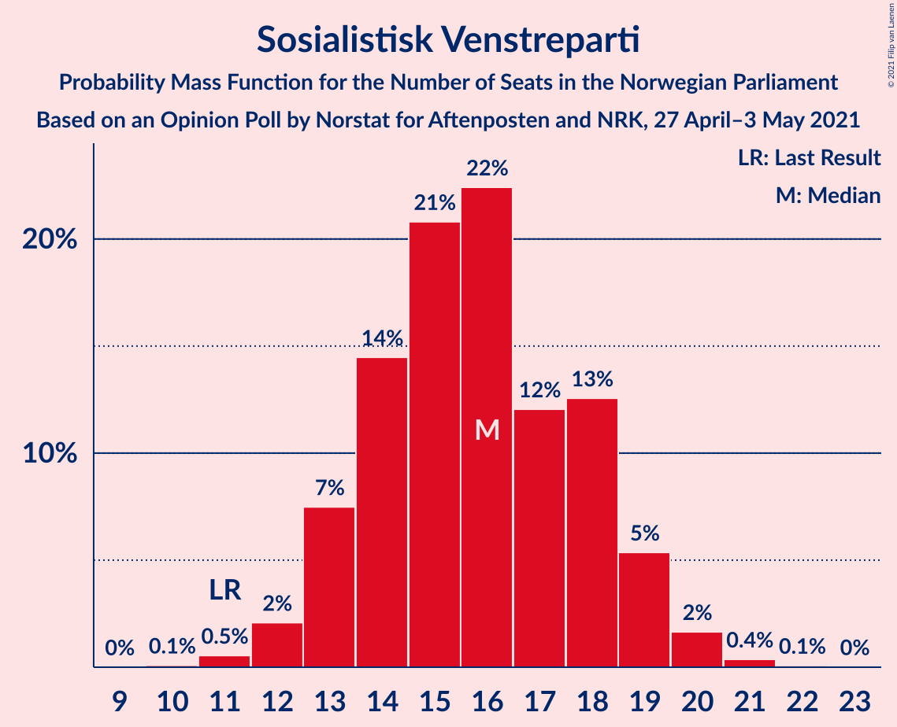

| Number of Seats | Probability | Accumulated | Special Marks |
|:---------------:|:-----------:|:-----------:|:-------------:|
| 10 | 0.1% | 100% |  |
| 11 | 0.5% | 99.9% | Last Result |
| 12 | 2% | 99.4% |  |
| 13 | 7% | 97% |  |
| 14 | 14% | 90% |  |
| 15 | 21% | 75% |  |
| 16 | 22% | 55% | Median |
| 17 | 12% | 32% |  |
| 18 | 13% | 20% |  |
| 19 | 5% | 7% |  |
| 20 | 2% | 2% |  |
| 21 | 0.4% | 0.5% |  |
| 22 | 0.1% | 0.1% |  |
| 23 | 0% | 0% |  |

### Rødt

*For a full overview of the results for this party, see the [Rødt](party-rødt.html) page.*

| Number of Seats | Probability | Accumulated | Special Marks |
|:---------------:|:-----------:|:-----------:|:-------------:|
| 1 | 0.4% | 100% | Last Result |
| 2 | 30% | 99.6% |  |
| 3 | 0.1% | 69% |  |
| 4 | 0% | 69% |  |
| 5 | 0% | 69% |  |
| 6 | 0.1% | 69% |  |
| 7 | 8% | 69% |  |
| 8 | 27% | 61% | Median |
| 9 | 24% | 34% |  |
| 10 | 7% | 9% |  |
| 11 | 2% | 2% |  |
| 12 | 0.3% | 0.4% |  |
| 13 | 0% | 0% |  |

### Kristelig Folkeparti

*For a full overview of the results for this party, see the [Kristelig Folkeparti](party-kristeligfolkeparti.html) page.*

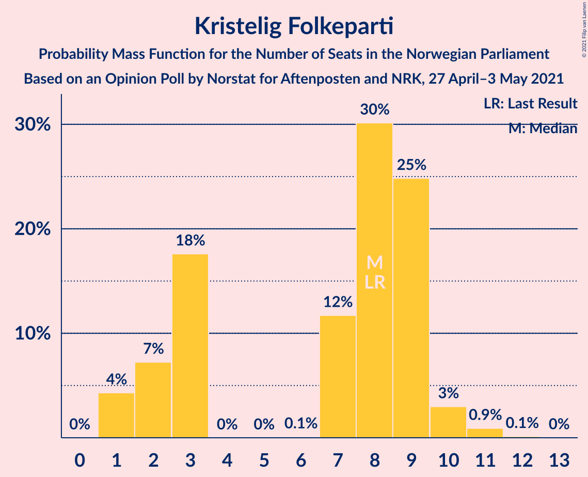

| Number of Seats | Probability | Accumulated | Special Marks |
|:---------------:|:-----------:|:-----------:|:-------------:|
| 1 | 4% | 100% |  |
| 2 | 7% | 96% |  |
| 3 | 18% | 88% |  |
| 4 | 0% | 71% |  |
| 5 | 0% | 71% |  |
| 6 | 0.1% | 71% |  |
| 7 | 12% | 71% |  |
| 8 | 30% | 59% | Last Result, Median |
| 9 | 25% | 29% |  |
| 10 | 3% | 4% |  |
| 11 | 0.9% | 1.1% |  |
| 12 | 0.1% | 0.2% |  |
| 13 | 0% | 0% |  |

### Miljøpartiet De Grønne

*For a full overview of the results for this party, see the [Miljøpartiet De Grønne](party-miljøpartietdegrønne.html) page.*

| Number of Seats | Probability | Accumulated | Special Marks |
|:---------------:|:-----------:|:-----------:|:-------------:|
| 1 | 5% | 100% | Last Result |
| 2 | 41% | 95% |  |
| 3 | 9% | 53% | Median |
| 4 | 0.7% | 44% |  |
| 5 | 0% | 44% |  |
| 6 | 0.2% | 44% |  |
| 7 | 15% | 43% |  |
| 8 | 17% | 29% |  |
| 9 | 10% | 11% |  |
| 10 | 1.2% | 2% |  |
| 11 | 0.3% | 0.4% |  |
| 12 | 0% | 0% |  |

### Venstre

*For a full overview of the results for this party, see the [Venstre](party-venstre.html) page.*

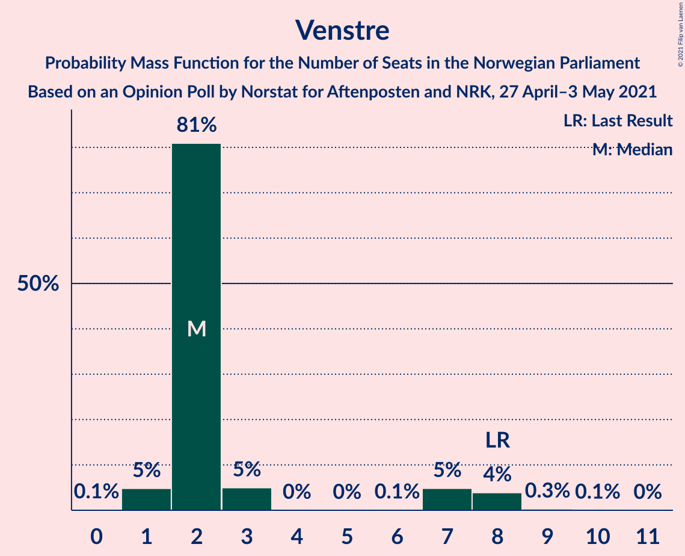

| Number of Seats | Probability | Accumulated | Special Marks |
|:---------------:|:-----------:|:-----------:|:-------------:|
| 0 | 0.1% | 100% |  |
| 1 | 5% | 99.9% |  |
| 2 | 81% | 95% | Median |
| 3 | 5% | 14% |  |
| 4 | 0% | 9% |  |
| 5 | 0% | 9% |  |
| 6 | 0.1% | 9% |  |
| 7 | 5% | 9% |  |
| 8 | 4% | 4% | Last Result |
| 9 | 0.3% | 0.4% |  |
| 10 | 0.1% | 0.1% |  |
| 11 | 0% | 0% |  |

## Coalitions

### Confidence Intervals

| Coalition | Last Result | Median | Majority? | 80% Confidence Interval | 90% Confidence Interval | 95% Confidence Interval | 99% Confidence Interval |
|:---------:|:-----------:|:------:|:---------:|:-----------------------:|:-----------------------:|:-----------------------:|:-----------------------:|
| Arbeiderpartiet – Senterpartiet – Sosialistisk Venstreparti – Rødt – Miljøpartiet De Grønne | 81 | 102 | 100% | 96–107 | 96–108 | 95–109 | 93–111 |
| Arbeiderpartiet – Senterpartiet – Sosialistisk Venstreparti – Kristelig Folkeparti – Miljøpartiet De Grønne | 88 | 102 | 100% | 98–106 | 95–108 | 94–109 | 92–111 |
| Høyre – Senterpartiet – Fremskrittspartiet – Kristelig Folkeparti – Venstre | 107 | 99 | 100% | 95–104 | 93–106 | 92–107 | 90–108 |
| Arbeiderpartiet – Senterpartiet – Sosialistisk Venstreparti – Rødt | 80 | 97 | 100% | 92–103 | 91–104 | 90–105 | 87–107 |
| Arbeiderpartiet – Senterpartiet – Sosialistisk Venstreparti – Miljøpartiet De Grønne | 80 | 95 | 99.8% | 91–99 | 90–101 | 88–103 | 86–105 |
| Arbeiderpartiet – Senterpartiet – Sosialistisk Venstreparti | 79 | 91 | 97% | 87–95 | 85–97 | 84–98 | 82–100 |
| Arbeiderpartiet – Senterpartiet – Kristelig Folkeparti – Miljøpartiet De Grønne | 77 | 86 | 71% | 81–92 | 79–92 | 78–94 | 76–96 |
| Arbeiderpartiet – Senterpartiet – Kristelig Folkeparti | 76 | 82 | 17% | 76–85 | 74–87 | 73–88 | 72–90 |
| Arbeiderpartiet – Senterpartiet | 68 | 75 | 0.2% | 71–79 | 70–80 | 69–82 | 66–83 |
| Høyre – Fremskrittspartiet – Kristelig Folkeparti – Miljøpartiet De Grønne – Venstre | 89 | 72 | 0% | 66–77 | 65–78 | 64–79 | 62–82 |
| Høyre – Fremskrittspartiet – Kristelig Folkeparti – Venstre | 88 | 67 | 0% | 62–73 | 61–73 | 60–74 | 58–76 |
| Høyre – Fremskrittspartiet – Venstre | 80 | 60 | 0% | 56–65 | 55–66 | 53–67 | 51–71 |
| Høyre – Fremskrittspartiet | 72 | 58 | 0% | 53–63 | 51–64 | 50–65 | 49–67 |
| Arbeiderpartiet – Sosialistisk Venstreparti | 60 | 58 | 0% | 55–62 | 54–63 | 52–64 | 51–66 |
| Høyre – Kristelig Folkeparti – Venstre | 61 | 47 | 0% | 42–51 | 41–53 | 40–54 | 38–55 |
| Senterpartiet – Kristelig Folkeparti – Venstre | 35 | 42 | 0% | 36–46 | 35–47 | 34–48 | 32–50 |

### Arbeiderpartiet – Senterpartiet – Sosialistisk Venstreparti – Rødt – Miljøpartiet De Grønne

| Number of Seats | Probability | Accumulated | Special Marks |
|:---------------:|:-----------:|:-----------:|:-------------:|
| 81 | 0% | 100% | Last Result |
| 82 | 0% | 100% |  |
| 83 | 0% | 100% |  |
| 84 | 0% | 100% |  |
| 85 | 0% | 100% | Majority |
| 86 | 0% | 100% |  |
| 87 | 0% | 100% |  |
| 88 | 0% | 100% |  |
| 89 | 0% | 100% |  |
| 90 | 0.1% | 99.9% |  |
| 91 | 0.2% | 99.9% |  |
| 92 | 0.2% | 99.7% |  |
| 93 | 0.3% | 99.5% |  |
| 94 | 0.9% | 99.2% |  |
| 95 | 1.4% | 98% |  |
| 96 | 9% | 97% |  |
| 97 | 3% | 88% |  |
| 98 | 5% | 85% |  |
| 99 | 6% | 80% |  |
| 100 | 6% | 74% |  |
| 101 | 9% | 68% |  |
| 102 | 16% | 59% | Median |
| 103 | 9% | 42% |  |
| 104 | 5% | 33% |  |
| 105 | 13% | 29% |  |
| 106 | 5% | 16% |  |
| 107 | 4% | 11% |  |
| 108 | 3% | 7% |  |
| 109 | 2% | 4% |  |
| 110 | 1.0% | 2% |  |
| 111 | 0.3% | 0.6% |  |
| 112 | 0.1% | 0.3% |  |
| 113 | 0.1% | 0.2% |  |
| 114 | 0% | 0% |  |

### Arbeiderpartiet – Senterpartiet – Sosialistisk Venstreparti – Kristelig Folkeparti – Miljøpartiet De Grønne

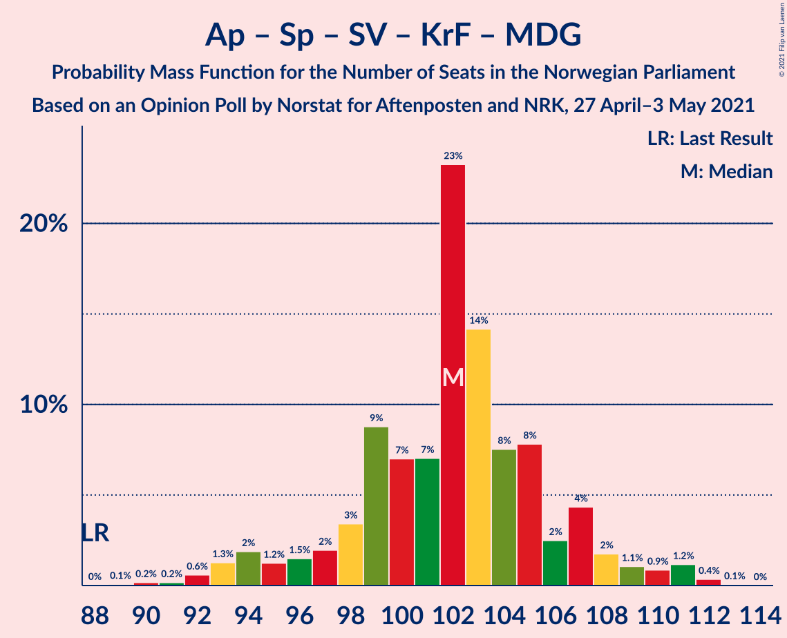

| Number of Seats | Probability | Accumulated | Special Marks |
|:---------------:|:-----------:|:-----------:|:-------------:|
| 88 | 0% | 100% | Last Result |
| 89 | 0.1% | 100% |  |
| 90 | 0.2% | 99.9% |  |
| 91 | 0.2% | 99.7% |  |
| 92 | 0.6% | 99.6% |  |
| 93 | 1.3% | 99.0% |  |
| 94 | 2% | 98% |  |
| 95 | 1.2% | 96% |  |
| 96 | 1.5% | 95% |  |
| 97 | 2% | 93% |  |
| 98 | 3% | 91% |  |
| 99 | 9% | 88% |  |
| 100 | 7% | 79% |  |
| 101 | 7% | 72% |  |
| 102 | 23% | 65% | Median |
| 103 | 14% | 42% |  |
| 104 | 8% | 27% |  |
| 105 | 8% | 20% |  |
| 106 | 2% | 12% |  |
| 107 | 4% | 10% |  |
| 108 | 2% | 5% |  |
| 109 | 1.1% | 4% |  |
| 110 | 0.9% | 2% |  |
| 111 | 1.2% | 2% |  |
| 112 | 0.4% | 0.4% |  |
| 113 | 0.1% | 0.1% |  |
| 114 | 0% | 0% |  |

### Høyre – Senterpartiet – Fremskrittspartiet – Kristelig Folkeparti – Venstre

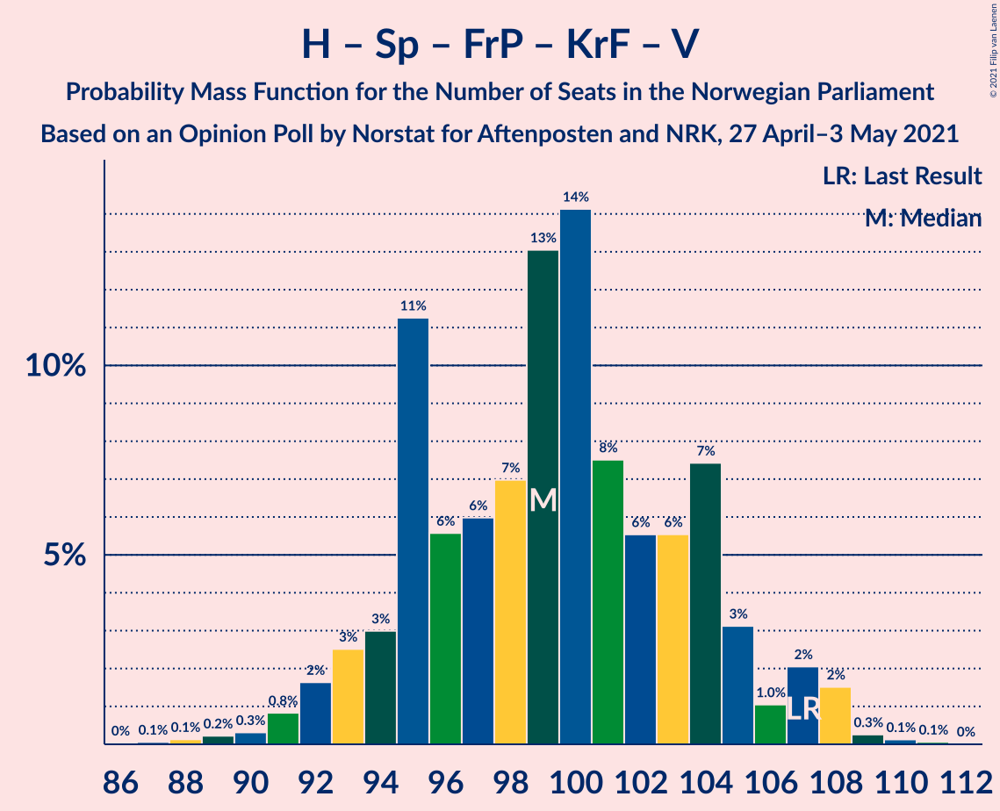

| Number of Seats | Probability | Accumulated | Special Marks |
|:---------------:|:-----------:|:-----------:|:-------------:|
| 87 | 0.1% | 100% |  |
| 88 | 0.1% | 99.9% |  |
| 89 | 0.2% | 99.8% |  |
| 90 | 0.3% | 99.5% |  |
| 91 | 0.8% | 99.2% |  |
| 92 | 2% | 98% |  |
| 93 | 3% | 97% |  |
| 94 | 3% | 94% |  |
| 95 | 11% | 91% |  |
| 96 | 6% | 80% |  |
| 97 | 6% | 74% |  |
| 98 | 7% | 68% |  |
| 99 | 13% | 61% | Median |
| 100 | 14% | 48% |  |
| 101 | 8% | 34% |  |
| 102 | 6% | 27% |  |
| 103 | 6% | 21% |  |
| 104 | 7% | 16% |  |
| 105 | 3% | 8% |  |
| 106 | 1.0% | 5% |  |
| 107 | 2% | 4% | Last Result |
| 108 | 2% | 2% |  |
| 109 | 0.3% | 0.5% |  |
| 110 | 0.1% | 0.2% |  |
| 111 | 0.1% | 0.1% |  |
| 112 | 0% | 0% |  |

### Arbeiderpartiet – Senterpartiet – Sosialistisk Venstreparti – Rødt

| Number of Seats | Probability | Accumulated | Special Marks |
|:---------------:|:-----------:|:-----------:|:-------------:|
| 80 | 0% | 100% | Last Result |
| 81 | 0% | 100% |  |
| 82 | 0% | 100% |  |
| 83 | 0% | 100% |  |
| 84 | 0% | 100% |  |
| 85 | 0.1% | 100% | Majority |
| 86 | 0.1% | 99.9% |  |
| 87 | 0.3% | 99.7% |  |
| 88 | 0.2% | 99.4% |  |
| 89 | 0.8% | 99.2% |  |
| 90 | 3% | 98% |  |
| 91 | 2% | 96% |  |
| 92 | 6% | 94% |  |
| 93 | 4% | 88% |  |
| 94 | 11% | 84% |  |
| 95 | 5% | 73% |  |
| 96 | 8% | 68% |  |
| 97 | 13% | 60% |  |
| 98 | 7% | 46% |  |
| 99 | 8% | 39% | Median |
| 100 | 15% | 32% |  |
| 101 | 5% | 17% |  |
| 102 | 2% | 12% |  |
| 103 | 5% | 10% |  |
| 104 | 3% | 5% |  |
| 105 | 1.5% | 3% |  |
| 106 | 0.6% | 1.2% |  |
| 107 | 0.4% | 0.5% |  |
| 108 | 0.1% | 0.2% |  |
| 109 | 0.1% | 0.1% |  |
| 110 | 0% | 0% |  |

### Arbeiderpartiet – Senterpartiet – Sosialistisk Venstreparti – Miljøpartiet De Grønne

| Number of Seats | Probability | Accumulated | Special Marks |
|:---------------:|:-----------:|:-----------:|:-------------:|
| 80 | 0% | 100% | Last Result |
| 81 | 0% | 100% |  |
| 82 | 0% | 100% |  |
| 83 | 0.1% | 100% |  |
| 84 | 0.1% | 99.9% |  |
| 85 | 0.1% | 99.8% | Majority |
| 86 | 0.6% | 99.7% |  |
| 87 | 0.9% | 99.1% |  |
| 88 | 0.9% | 98% |  |
| 89 | 1.3% | 97% |  |
| 90 | 3% | 96% |  |
| 91 | 5% | 93% |  |
| 92 | 5% | 88% |  |
| 93 | 13% | 84% |  |
| 94 | 17% | 71% | Median |
| 95 | 8% | 55% |  |
| 96 | 8% | 47% |  |
| 97 | 13% | 39% |  |
| 98 | 7% | 26% |  |
| 99 | 9% | 19% |  |
| 100 | 4% | 10% |  |
| 101 | 2% | 6% |  |
| 102 | 2% | 5% |  |
| 103 | 1.5% | 3% |  |
| 104 | 0.5% | 1.1% |  |
| 105 | 0.3% | 0.7% |  |
| 106 | 0.1% | 0.4% |  |
| 107 | 0.2% | 0.3% |  |
| 108 | 0.1% | 0.1% |  |
| 109 | 0% | 0% |  |

### Arbeiderpartiet – Senterpartiet – Sosialistisk Venstreparti

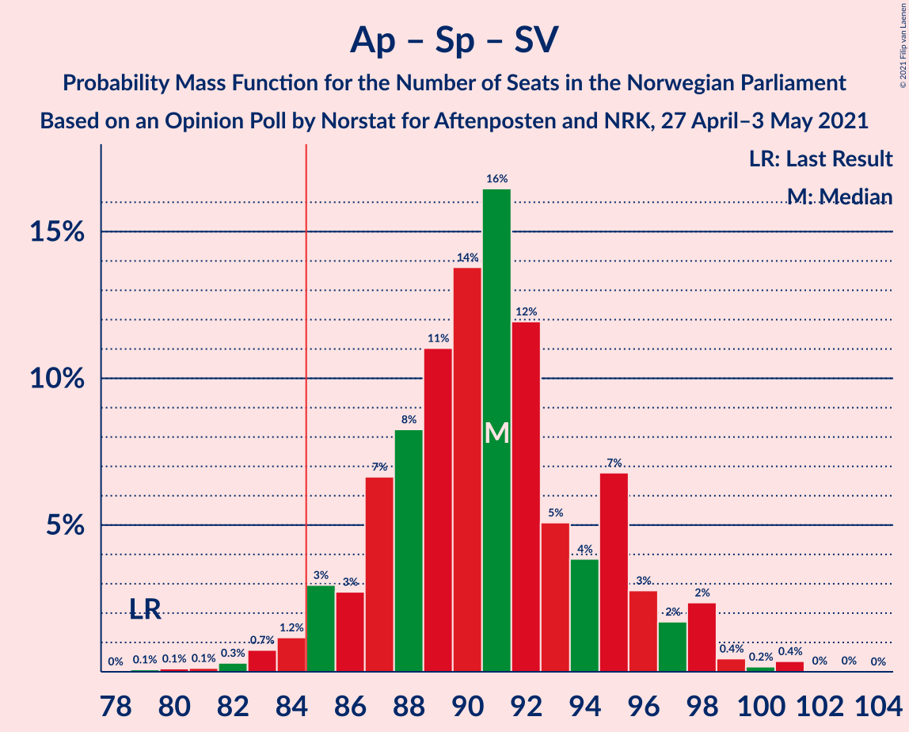

| Number of Seats | Probability | Accumulated | Special Marks |
|:---------------:|:-----------:|:-----------:|:-------------:|
| 79 | 0.1% | 100% | Last Result |
| 80 | 0.1% | 99.9% |  |
| 81 | 0.1% | 99.8% |  |
| 82 | 0.3% | 99.7% |  |
| 83 | 0.7% | 99.4% |  |
| 84 | 1.2% | 98.6% |  |
| 85 | 3% | 97% | Majority |
| 86 | 3% | 94% |  |
| 87 | 7% | 92% |  |
| 88 | 8% | 85% |  |
| 89 | 11% | 77% |  |
| 90 | 14% | 66% |  |
| 91 | 16% | 52% | Median |
| 92 | 12% | 36% |  |
| 93 | 5% | 24% |  |
| 94 | 4% | 19% |  |
| 95 | 7% | 15% |  |
| 96 | 3% | 8% |  |
| 97 | 2% | 5% |  |
| 98 | 2% | 3% |  |
| 99 | 0.4% | 1.1% |  |
| 100 | 0.2% | 0.6% |  |
| 101 | 0.4% | 0.5% |  |
| 102 | 0% | 0.1% |  |
| 103 | 0% | 0.1% |  |
| 104 | 0% | 0% |  |

### Arbeiderpartiet – Senterpartiet – Kristelig Folkeparti – Miljøpartiet De Grønne

| Number of Seats | Probability | Accumulated | Special Marks |
|:---------------:|:-----------:|:-----------:|:-------------:|
| 73 | 0% | 100% |  |
| 74 | 0.2% | 99.9% |  |
| 75 | 0.2% | 99.7% |  |
| 76 | 0.7% | 99.5% |  |
| 77 | 0.9% | 98.8% | Last Result |
| 78 | 2% | 98% |  |
| 79 | 2% | 96% |  |
| 80 | 2% | 94% |  |
| 81 | 6% | 92% |  |
| 82 | 4% | 86% |  |
| 83 | 4% | 82% |  |
| 84 | 7% | 78% |  |
| 85 | 13% | 71% | Majority |
| 86 | 12% | 58% | Median |
| 87 | 10% | 45% |  |
| 88 | 9% | 36% |  |
| 89 | 6% | 27% |  |
| 90 | 3% | 21% |  |
| 91 | 8% | 18% |  |
| 92 | 6% | 10% |  |
| 93 | 1.4% | 4% |  |
| 94 | 0.8% | 3% |  |
| 95 | 0.5% | 2% |  |
| 96 | 1.1% | 1.4% |  |
| 97 | 0.2% | 0.3% |  |
| 98 | 0.1% | 0.1% |  |
| 99 | 0% | 0% |  |

### Arbeiderpartiet – Senterpartiet – Kristelig Folkeparti

| Number of Seats | Probability | Accumulated | Special Marks |
|:---------------:|:-----------:|:-----------:|:-------------:|
| 69 | 0.1% | 100% |  |
| 70 | 0.2% | 99.9% |  |
| 71 | 0.2% | 99.7% |  |
| 72 | 0.3% | 99.5% |  |
| 73 | 3% | 99.3% |  |
| 74 | 3% | 97% |  |
| 75 | 3% | 94% |  |
| 76 | 3% | 92% | Last Result |
| 77 | 3% | 89% |  |
| 78 | 4% | 86% |  |
| 79 | 6% | 81% |  |
| 80 | 9% | 75% |  |
| 81 | 10% | 66% |  |
| 82 | 7% | 57% |  |
| 83 | 18% | 49% | Median |
| 84 | 15% | 31% |  |
| 85 | 7% | 17% | Majority |
| 86 | 3% | 9% |  |
| 87 | 3% | 7% |  |
| 88 | 2% | 3% |  |
| 89 | 1.0% | 2% |  |
| 90 | 0.3% | 0.5% |  |
| 91 | 0.2% | 0.2% |  |
| 92 | 0% | 0.1% |  |
| 93 | 0% | 0% |  |

### Arbeiderpartiet – Senterpartiet

| Number of Seats | Probability | Accumulated | Special Marks |
|:---------------:|:-----------:|:-----------:|:-------------:|
| 65 | 0.1% | 100% |  |
| 66 | 0.4% | 99.8% |  |
| 67 | 0.4% | 99.5% |  |
| 68 | 1.1% | 99.1% | Last Result |
| 69 | 2% | 98% |  |
| 70 | 3% | 96% |  |
| 71 | 6% | 93% |  |
| 72 | 8% | 87% |  |
| 73 | 7% | 79% |  |
| 74 | 15% | 72% |  |
| 75 | 21% | 56% | Median |
| 76 | 7% | 35% |  |
| 77 | 9% | 29% |  |
| 78 | 6% | 20% |  |
| 79 | 5% | 14% |  |
| 80 | 4% | 9% |  |
| 81 | 0.8% | 5% |  |
| 82 | 3% | 4% |  |
| 83 | 0.3% | 0.7% |  |
| 84 | 0.2% | 0.4% |  |
| 85 | 0.1% | 0.2% | Majority |
| 86 | 0% | 0.1% |  |
| 87 | 0% | 0% |  |

### Høyre – Fremskrittspartiet – Kristelig Folkeparti – Miljøpartiet De Grønne – Venstre

| Number of Seats | Probability | Accumulated | Special Marks |
|:---------------:|:-----------:|:-----------:|:-------------:|
| 60 | 0.1% | 100% |  |
| 61 | 0.1% | 99.9% |  |
| 62 | 0.4% | 99.8% |  |
| 63 | 0.6% | 99.4% |  |
| 64 | 2% | 98.7% |  |
| 65 | 3% | 97% |  |
| 66 | 5% | 94% |  |
| 67 | 2% | 90% |  |
| 68 | 5% | 87% |  |
| 69 | 15% | 83% |  |
| 70 | 8% | 68% | Median |
| 71 | 7% | 60% |  |
| 72 | 13% | 53% |  |
| 73 | 8% | 40% |  |
| 74 | 5% | 32% |  |
| 75 | 11% | 27% |  |
| 76 | 4% | 16% |  |
| 77 | 6% | 12% |  |
| 78 | 2% | 6% |  |
| 79 | 3% | 4% |  |
| 80 | 0.8% | 2% |  |
| 81 | 0.2% | 0.8% |  |
| 82 | 0.3% | 0.6% |  |
| 83 | 0.1% | 0.3% |  |
| 84 | 0.1% | 0.1% |  |
| 85 | 0% | 0% | Majority |
| 86 | 0% | 0% |  |
| 87 | 0% | 0% |  |
| 88 | 0% | 0% |  |
| 89 | 0% | 0% | Last Result |

### Høyre – Fremskrittspartiet – Kristelig Folkeparti – Venstre

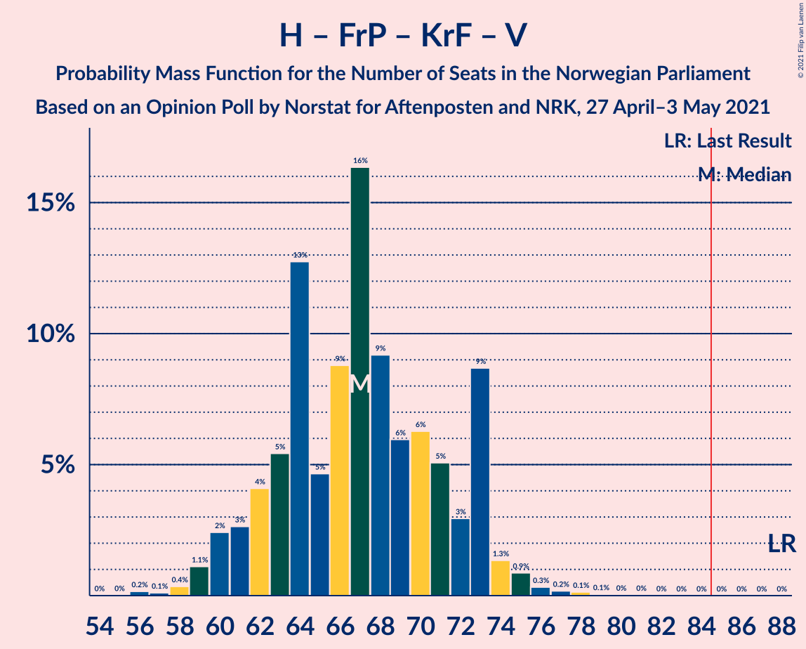

| Number of Seats | Probability | Accumulated | Special Marks |
|:---------------:|:-----------:|:-----------:|:-------------:|
| 56 | 0.2% | 100% |  |
| 57 | 0.1% | 99.8% |  |
| 58 | 0.4% | 99.7% |  |
| 59 | 1.1% | 99.3% |  |
| 60 | 2% | 98% |  |
| 61 | 3% | 96% |  |
| 62 | 4% | 93% |  |
| 63 | 5% | 89% |  |
| 64 | 13% | 84% |  |
| 65 | 5% | 71% |  |
| 66 | 9% | 66% |  |
| 67 | 16% | 57% | Median |
| 68 | 9% | 41% |  |
| 69 | 6% | 32% |  |
| 70 | 6% | 26% |  |
| 71 | 5% | 20% |  |
| 72 | 3% | 15% |  |
| 73 | 9% | 12% |  |
| 74 | 1.3% | 3% |  |
| 75 | 0.9% | 2% |  |
| 76 | 0.3% | 0.8% |  |
| 77 | 0.2% | 0.4% |  |
| 78 | 0.1% | 0.3% |  |
| 79 | 0.1% | 0.1% |  |
| 80 | 0% | 0.1% |  |
| 81 | 0% | 0% |  |
| 82 | 0% | 0% |  |
| 83 | 0% | 0% |  |
| 84 | 0% | 0% |  |
| 85 | 0% | 0% | Majority |
| 86 | 0% | 0% |  |
| 87 | 0% | 0% |  |
| 88 | 0% | 0% | Last Result |

### Høyre – Fremskrittspartiet – Venstre

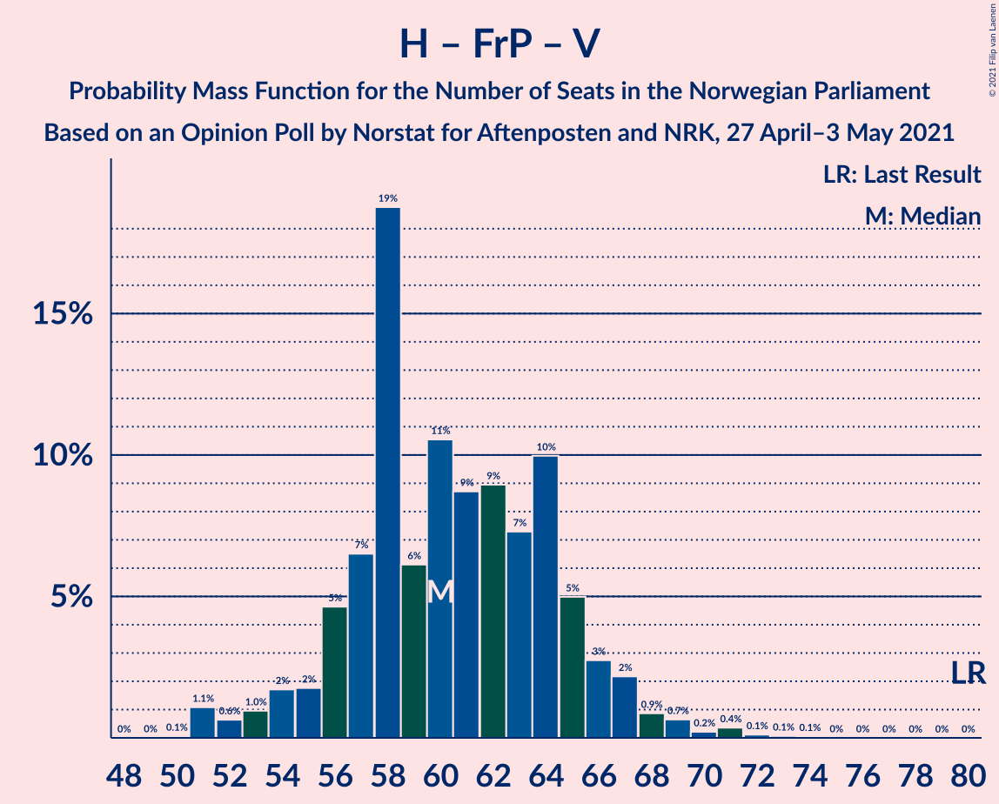

| Number of Seats | Probability | Accumulated | Special Marks |
|:---------------:|:-----------:|:-----------:|:-------------:|
| 50 | 0.1% | 100% |  |
| 51 | 1.1% | 99.9% |  |
| 52 | 0.6% | 98.8% |  |
| 53 | 1.0% | 98% |  |
| 54 | 2% | 97% |  |
| 55 | 2% | 96% |  |
| 56 | 5% | 94% |  |
| 57 | 7% | 89% |  |
| 58 | 19% | 83% |  |
| 59 | 6% | 64% | Median |
| 60 | 11% | 58% |  |
| 61 | 9% | 47% |  |
| 62 | 9% | 38% |  |
| 63 | 7% | 30% |  |
| 64 | 10% | 22% |  |
| 65 | 5% | 12% |  |
| 66 | 3% | 7% |  |
| 67 | 2% | 5% |  |
| 68 | 0.9% | 2% |  |
| 69 | 0.7% | 1.5% |  |
| 70 | 0.2% | 0.8% |  |
| 71 | 0.4% | 0.6% |  |
| 72 | 0.1% | 0.2% |  |
| 73 | 0.1% | 0.1% |  |
| 74 | 0.1% | 0.1% |  |
| 75 | 0% | 0% |  |
| 76 | 0% | 0% |  |
| 77 | 0% | 0% |  |
| 78 | 0% | 0% |  |
| 79 | 0% | 0% |  |
| 80 | 0% | 0% | Last Result |

### Høyre – Fremskrittspartiet

| Number of Seats | Probability | Accumulated | Special Marks |
|:---------------:|:-----------:|:-----------:|:-------------:|
| 48 | 0.1% | 100% |  |
| 49 | 1.2% | 99.9% |  |
| 50 | 2% | 98.8% |  |
| 51 | 1.4% | 96% |  |
| 52 | 2% | 95% |  |
| 53 | 3% | 93% |  |
| 54 | 6% | 90% |  |
| 55 | 6% | 84% |  |
| 56 | 19% | 78% |  |
| 57 | 8% | 59% | Median |
| 58 | 9% | 51% |  |
| 59 | 7% | 43% |  |
| 60 | 8% | 36% |  |
| 61 | 9% | 28% |  |
| 62 | 8% | 19% |  |
| 63 | 5% | 11% |  |
| 64 | 3% | 6% |  |
| 65 | 1.4% | 3% |  |
| 66 | 0.4% | 1.4% |  |
| 67 | 0.6% | 1.0% |  |
| 68 | 0.1% | 0.4% |  |
| 69 | 0.2% | 0.3% |  |
| 70 | 0.1% | 0.1% |  |
| 71 | 0% | 0% |  |
| 72 | 0% | 0% | Last Result |

### Arbeiderpartiet – Sosialistisk Venstreparti

| Number of Seats | Probability | Accumulated | Special Marks |
|:---------------:|:-----------:|:-----------:|:-------------:|
| 48 | 0% | 100% |  |
| 49 | 0.1% | 99.9% |  |
| 50 | 0.1% | 99.9% |  |
| 51 | 0.4% | 99.8% |  |
| 52 | 2% | 99.3% |  |
| 53 | 1.2% | 97% |  |
| 54 | 4% | 96% |  |
| 55 | 6% | 92% |  |
| 56 | 6% | 86% |  |
| 57 | 9% | 80% |  |
| 58 | 29% | 71% |  |
| 59 | 14% | 42% | Median |
| 60 | 6% | 28% | Last Result |
| 61 | 9% | 23% |  |
| 62 | 5% | 14% |  |
| 63 | 5% | 9% |  |
| 64 | 2% | 4% |  |
| 65 | 0.6% | 2% |  |
| 66 | 1.4% | 2% |  |
| 67 | 0.2% | 0.3% |  |
| 68 | 0.1% | 0.1% |  |
| 69 | 0% | 0% |  |

### Høyre – Kristelig Folkeparti – Venstre

| Number of Seats | Probability | Accumulated | Special Marks |
|:---------------:|:-----------:|:-----------:|:-------------:|
| 36 | 0% | 100% |  |
| 37 | 0.2% | 99.9% |  |
| 38 | 0.5% | 99.8% |  |
| 39 | 1.0% | 99.3% |  |
| 40 | 2% | 98% |  |
| 41 | 4% | 96% |  |
| 42 | 4% | 93% |  |
| 43 | 5% | 88% |  |
| 44 | 8% | 83% |  |
| 45 | 7% | 75% |  |
| 46 | 13% | 68% |  |
| 47 | 10% | 55% | Median |
| 48 | 16% | 44% |  |
| 49 | 7% | 29% |  |
| 50 | 4% | 21% |  |
| 51 | 10% | 17% |  |
| 52 | 2% | 7% |  |
| 53 | 2% | 5% |  |
| 54 | 2% | 3% |  |
| 55 | 0.9% | 1.4% |  |
| 56 | 0.2% | 0.4% |  |
| 57 | 0.1% | 0.2% |  |
| 58 | 0% | 0.1% |  |
| 59 | 0% | 0% |  |
| 60 | 0% | 0% |  |
| 61 | 0% | 0% | Last Result |

### Senterpartiet – Kristelig Folkeparti – Venstre

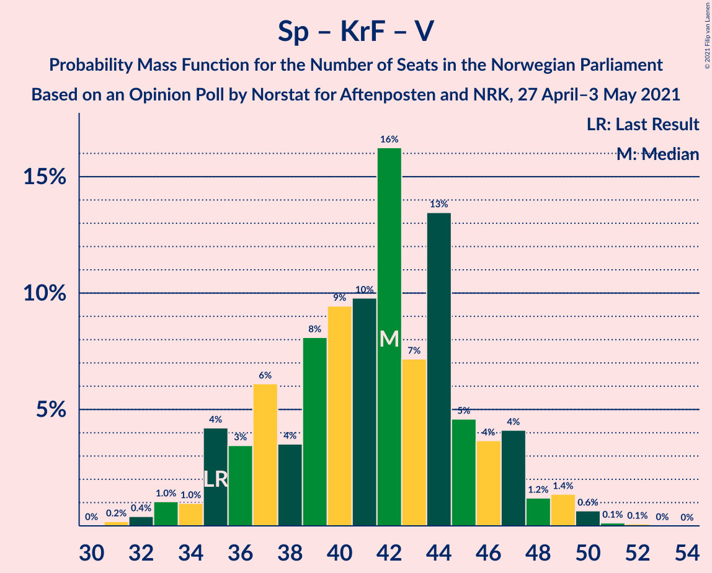

| Number of Seats | Probability | Accumulated | Special Marks |
|:---------------:|:-----------:|:-----------:|:-------------:|
| 31 | 0.2% | 100% |  |
| 32 | 0.4% | 99.8% |  |
| 33 | 1.0% | 99.4% |  |
| 34 | 1.0% | 98% |  |
| 35 | 4% | 97% | Last Result |
| 36 | 3% | 93% |  |
| 37 | 6% | 90% |  |
| 38 | 4% | 84% |  |
| 39 | 8% | 80% |  |
| 40 | 9% | 72% |  |
| 41 | 10% | 63% |  |
| 42 | 16% | 53% | Median |
| 43 | 7% | 36% |  |
| 44 | 13% | 29% |  |
| 45 | 5% | 16% |  |
| 46 | 4% | 11% |  |
| 47 | 4% | 8% |  |
| 48 | 1.2% | 3% |  |
| 49 | 1.4% | 2% |  |
| 50 | 0.6% | 0.9% |  |
| 51 | 0.1% | 0.3% |  |
| 52 | 0.1% | 0.1% |  |
| 53 | 0% | 0% |  |

## Technical Information

### Opinion Poll

+ **Polling firm:** Norstat
+ **Commissioner(s):** Aftenposten and NRK
+ **Fieldwork period:** 27 April–3 May 2021

### Calculations

+ **Sample size:** 958
+ **Simulations done:** 1,048,576
+ **Error estimate:** 1.14%

