# Opinion Poll by Respons Analyse for VG, 5–10 May 2021

<a href="#voting-intentions">Voting Intentions</a> | <a href="#seats">Seats</a> | <a href="#coalitions">Coalitions</a> | <a href="#technical-information">Technical Information</a>

## Voting Intentions

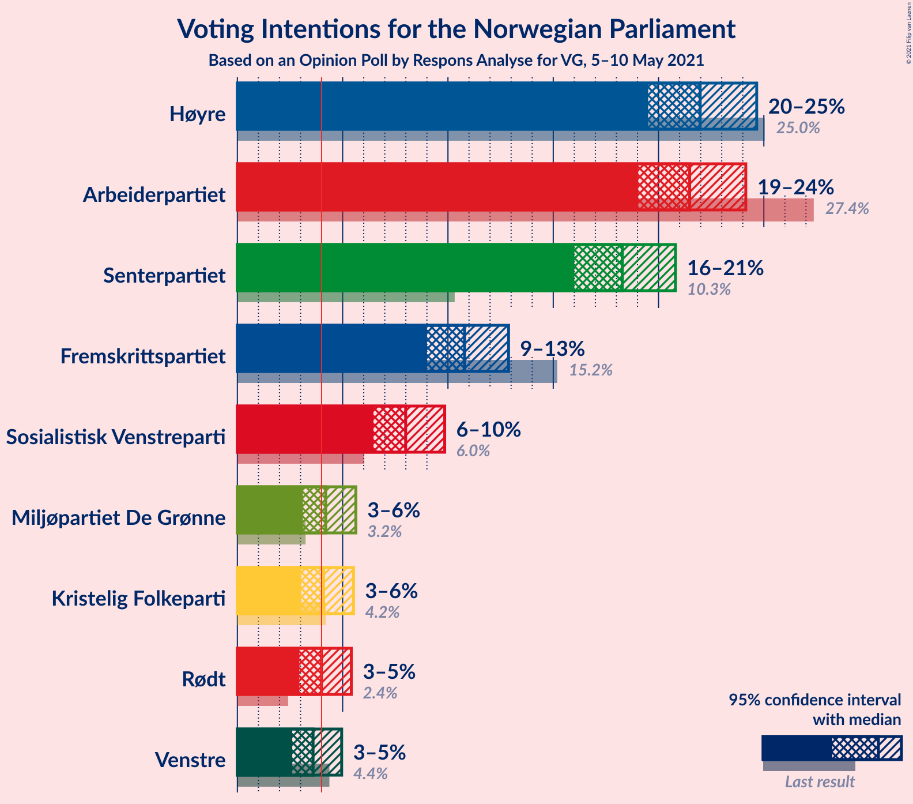

### Confidence Intervals

| Party | Last Result | Poll Result | 80% Confidence Interval | 90% Confidence Interval | 95% Confidence Interval | 99% Confidence Interval |
|:-----:|:-----------:|:-----------:|:-----------------------:|:-----------------------:|:-----------------------:|:-----------------------:|
| Høyre | 25.0% | 22.0% | 20.4–23.7% |19.9–24.2% |19.5–24.7% |18.8–25.5% |
| Arbeiderpartiet | 27.4% | 21.5% | 19.9–23.2% |19.4–23.7% |19.0–24.1% |18.3–25.0% |
| Senterpartiet | 10.3% | 18.3% | 16.8–19.9% |16.4–20.4% |16.0–20.8% |15.3–21.6% |
| Fremskrittspartiet | 15.2% | 10.8% | 9.6–12.1% |9.3–12.5% |9.0–12.9% |8.5–13.5% |
| Sosialistisk Venstreparti | 6.0% | 8.0% | 7.0–9.2% |6.7–9.5% |6.5–9.8% |6.0–10.5% |
| Miljøpartiet De Grønne | 3.2% | 4.2% | 3.5–5.1% |3.3–5.4% |3.1–5.6% |2.8–6.1% |
| Kristelig Folkeparti | 4.2% | 4.1% | 3.4–5.0% |3.2–5.3% |3.0–5.5% |2.7–6.0% |
| Rødt | 2.4% | 4.0% | 3.3–4.9% |3.1–5.2% |2.9–5.4% |2.6–5.9% |
| Venstre | 4.4% | 3.6% | 2.9–4.5% |2.8–4.7% |2.6–5.0% |2.3–5.4% |

*Note:* The poll result column reflects the actual value used in the calculations. Published results may vary slightly, and in addition be rounded to fewer digits.

## Seats

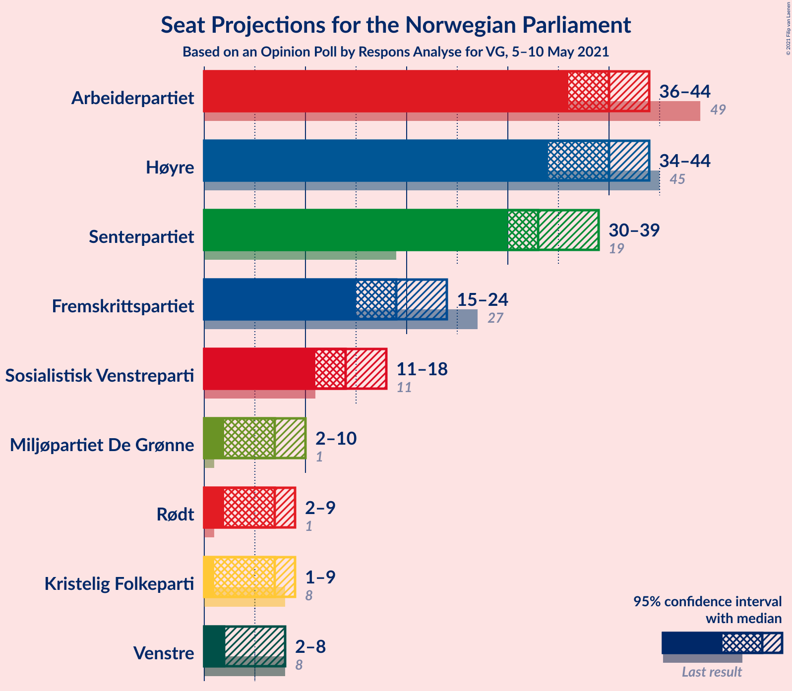

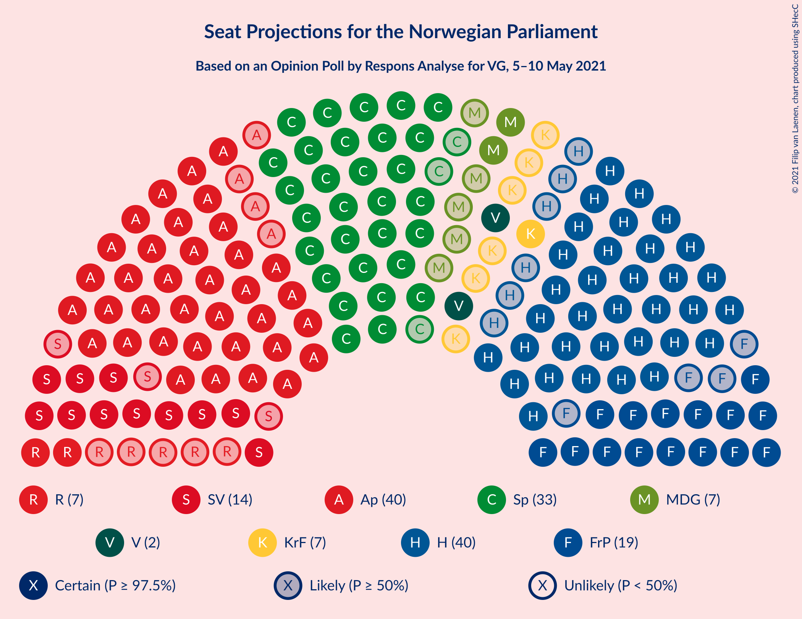

### Confidence Intervals

| Party | Last Result | Median | 80% Confidence Interval | 90% Confidence Interval | 95% Confidence Interval | 99% Confidence Interval |
|:-----:|:-----------:|:------:|:-----------------------:|:-----------------------:|:-----------------------:|:-----------------------:|
| <a href="#høyre">Høyre</a> | 45 | 40 | 35–42 |34–43 |34–44 |33–47 |
| <a href="#arbeiderpartiet">Arbeiderpartiet</a> | 49 | 40 | 38–44 |37–44 |36–44 |34–45 |
| <a href="#senterpartiet">Senterpartiet</a> | 19 | 33 | 31–37 |30–38 |30–39 |28–40 |
| <a href="#fremskrittspartiet">Fremskrittspartiet</a> | 27 | 19 | 16–23 |15–23 |15–24 |13–26 |
| <a href="#sosialistisk-venstreparti">Sosialistisk Venstreparti</a> | 11 | 14 | 11–16 |11–17 |11–18 |10–19 |
| <a href="#miljøpartiet-de-grønne">Miljøpartiet De Grønne</a> | 1 | 7 | 2–9 |2–9 |2–10 |1–11 |
| <a href="#kristelig-folkeparti">Kristelig Folkeparti</a> | 8 | 7 | 2–9 |2–9 |1–9 |1–10 |
| <a href="#rødt">Rødt</a> | 1 | 7 | 2–8 |2–9 |2–9 |1–10 |
| <a href="#venstre">Venstre</a> | 8 | 2 | 2–8 |2–8 |2–8 |2–9 |

### Høyre

*For a full overview of the results for this party, see the [Høyre](party-høyre.html) page.*

| Number of Seats | Probability | Accumulated | Special Marks |
|:---------------:|:-----------:|:-----------:|:-------------:|
| 32 | 0.1% | 100% |  |
| 33 | 1.2% | 99.9% |  |
| 34 | 6% | 98.7% |  |
| 35 | 3% | 93% |  |
| 36 | 12% | 89% |  |
| 37 | 8% | 77% |  |
| 38 | 9% | 70% |  |
| 39 | 10% | 61% |  |
| 40 | 18% | 51% | Median |
| 41 | 12% | 33% |  |
| 42 | 11% | 21% |  |
| 43 | 5% | 9% |  |
| 44 | 3% | 4% |  |
| 45 | 0.6% | 2% | Last Result |
| 46 | 0.2% | 1.1% |  |
| 47 | 0.5% | 0.8% |  |
| 48 | 0.2% | 0.3% |  |
| 49 | 0.1% | 0.2% |  |
| 50 | 0.1% | 0.1% |  |
| 51 | 0% | 0% |  |

### Arbeiderpartiet

*For a full overview of the results for this party, see the [Arbeiderpartiet](party-arbeiderpartiet.html) page.*

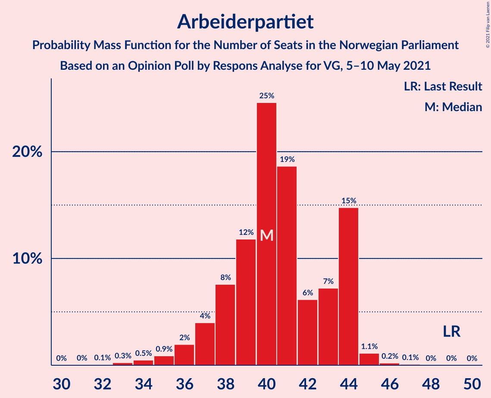

| Number of Seats | Probability | Accumulated | Special Marks |
|:---------------:|:-----------:|:-----------:|:-------------:|
| 31 | 0% | 100% |  |
| 32 | 0.1% | 99.9% |  |
| 33 | 0.3% | 99.9% |  |
| 34 | 0.5% | 99.6% |  |
| 35 | 0.9% | 99.1% |  |
| 36 | 2% | 98% |  |
| 37 | 4% | 96% |  |
| 38 | 8% | 92% |  |
| 39 | 12% | 85% |  |
| 40 | 25% | 73% | Median |
| 41 | 19% | 48% |  |
| 42 | 6% | 30% |  |
| 43 | 7% | 23% |  |
| 44 | 15% | 16% |  |
| 45 | 1.1% | 1.5% |  |
| 46 | 0.2% | 0.4% |  |
| 47 | 0.1% | 0.1% |  |
| 48 | 0% | 0% |  |
| 49 | 0% | 0% | Last Result |

### Senterpartiet

*For a full overview of the results for this party, see the [Senterpartiet](party-senterpartiet.html) page.*

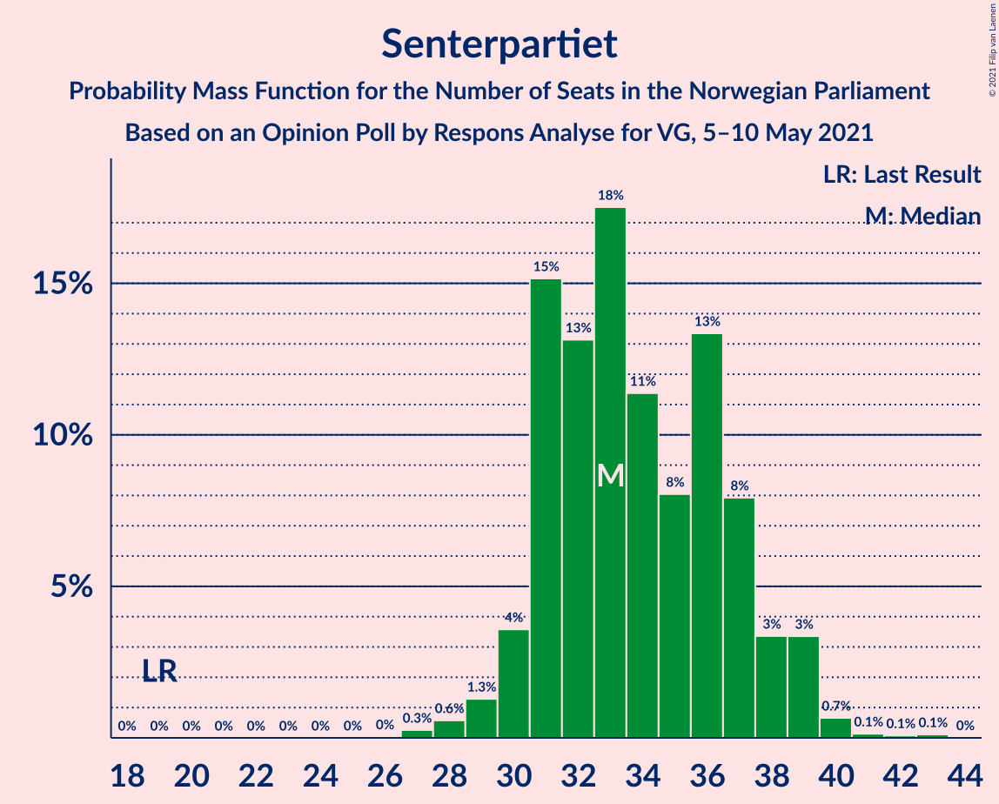

| Number of Seats | Probability | Accumulated | Special Marks |
|:---------------:|:-----------:|:-----------:|:-------------:|
| 19 | 0% | 100% | Last Result |
| 20 | 0% | 100% |  |
| 21 | 0% | 100% |  |
| 22 | 0% | 100% |  |
| 23 | 0% | 100% |  |
| 24 | 0% | 100% |  |
| 25 | 0% | 100% |  |
| 26 | 0% | 100% |  |
| 27 | 0.3% | 100% |  |
| 28 | 0.6% | 99.7% |  |
| 29 | 1.3% | 99.1% |  |
| 30 | 4% | 98% |  |
| 31 | 15% | 94% |  |
| 32 | 13% | 79% |  |
| 33 | 18% | 66% | Median |
| 34 | 11% | 48% |  |
| 35 | 8% | 37% |  |
| 36 | 13% | 29% |  |
| 37 | 8% | 16% |  |
| 38 | 3% | 8% |  |
| 39 | 3% | 4% |  |
| 40 | 0.7% | 1.0% |  |
| 41 | 0.1% | 0.3% |  |
| 42 | 0.1% | 0.2% |  |
| 43 | 0.1% | 0.1% |  |
| 44 | 0% | 0% |  |

### Fremskrittspartiet

*For a full overview of the results for this party, see the [Fremskrittspartiet](party-fremskrittspartiet.html) page.*

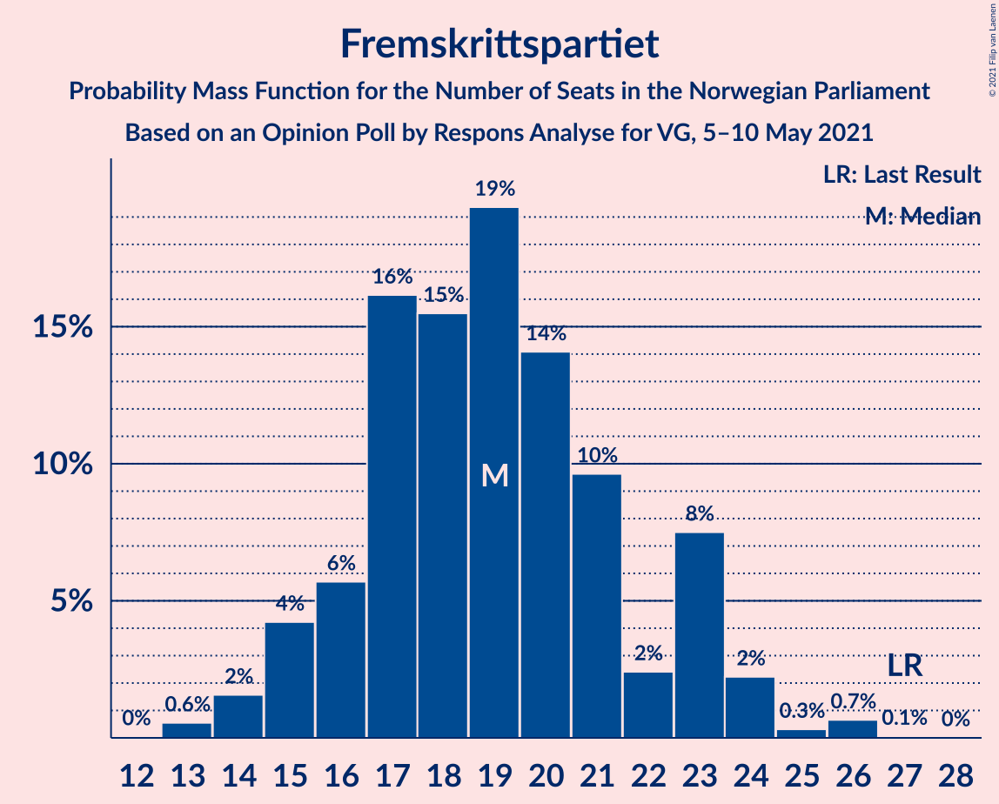

| Number of Seats | Probability | Accumulated | Special Marks |
|:---------------:|:-----------:|:-----------:|:-------------:|
| 13 | 0.6% | 100% |  |
| 14 | 2% | 99.4% |  |
| 15 | 4% | 98% |  |
| 16 | 6% | 94% |  |
| 17 | 16% | 88% |  |
| 18 | 15% | 72% |  |
| 19 | 19% | 56% | Median |
| 20 | 14% | 37% |  |
| 21 | 10% | 23% |  |
| 22 | 2% | 13% |  |
| 23 | 8% | 11% |  |
| 24 | 2% | 3% |  |
| 25 | 0.3% | 1.0% |  |
| 26 | 0.7% | 0.7% |  |
| 27 | 0.1% | 0.1% | Last Result |
| 28 | 0% | 0% |  |

### Sosialistisk Venstreparti

*For a full overview of the results for this party, see the [Sosialistisk Venstreparti](party-sosialistiskvenstreparti.html) page.*

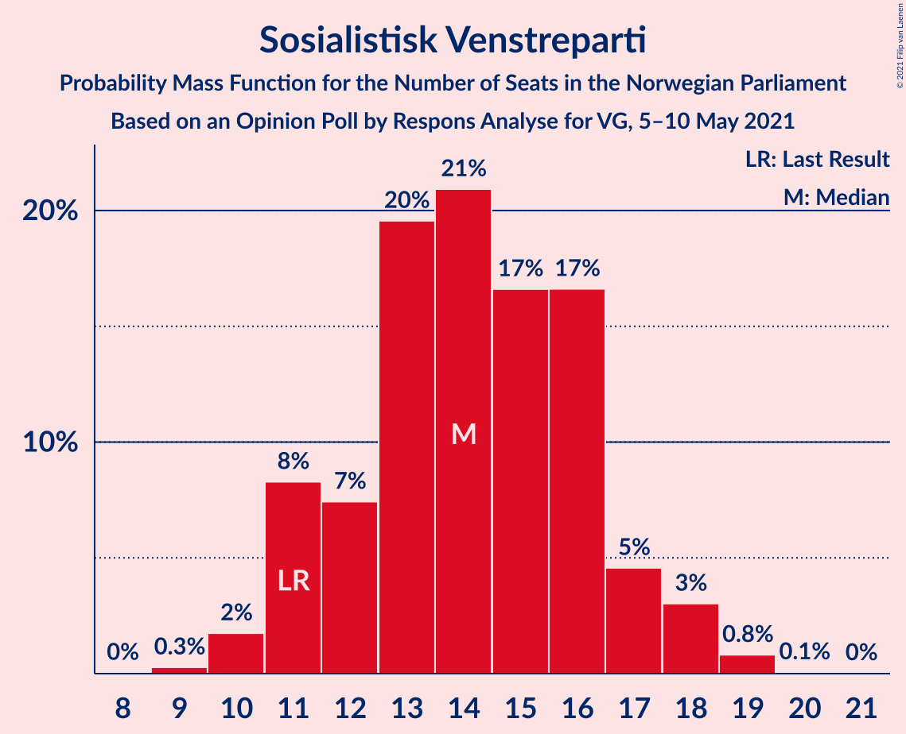

| Number of Seats | Probability | Accumulated | Special Marks |
|:---------------:|:-----------:|:-----------:|:-------------:|
| 9 | 0.3% | 100% |  |
| 10 | 2% | 99.7% |  |
| 11 | 8% | 98% | Last Result |
| 12 | 7% | 90% |  |
| 13 | 20% | 82% |  |
| 14 | 21% | 63% | Median |
| 15 | 17% | 42% |  |
| 16 | 17% | 25% |  |
| 17 | 5% | 9% |  |
| 18 | 3% | 4% |  |
| 19 | 0.8% | 0.9% |  |
| 20 | 0.1% | 0.1% |  |
| 21 | 0% | 0% |  |

### Miljøpartiet De Grønne

*For a full overview of the results for this party, see the [Miljøpartiet De Grønne](party-miljøpartietdegrønne.html) page.*

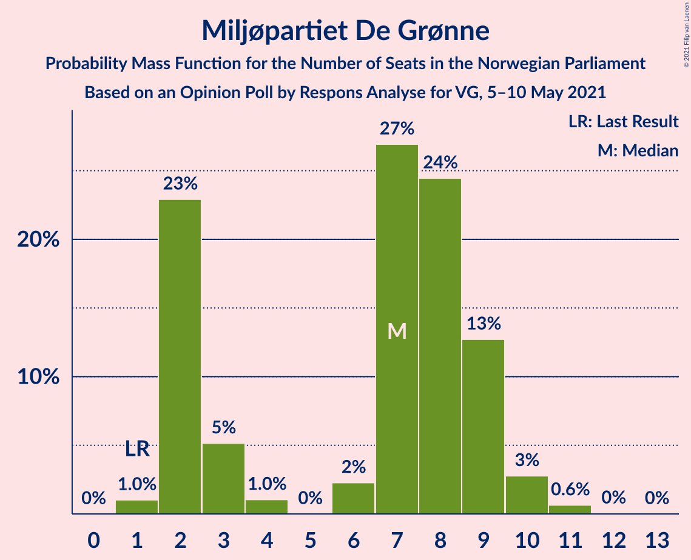

| Number of Seats | Probability | Accumulated | Special Marks |
|:---------------:|:-----------:|:-----------:|:-------------:|
| 1 | 1.0% | 100% | Last Result |
| 2 | 23% | 99.0% |  |
| 3 | 5% | 76% |  |
| 4 | 1.0% | 71% |  |
| 5 | 0% | 70% |  |
| 6 | 2% | 70% |  |
| 7 | 27% | 68% | Median |
| 8 | 24% | 41% |  |
| 9 | 13% | 16% |  |
| 10 | 3% | 3% |  |
| 11 | 0.6% | 0.7% |  |
| 12 | 0% | 0.1% |  |
| 13 | 0% | 0% |  |

### Kristelig Folkeparti

*For a full overview of the results for this party, see the [Kristelig Folkeparti](party-kristeligfolkeparti.html) page.*

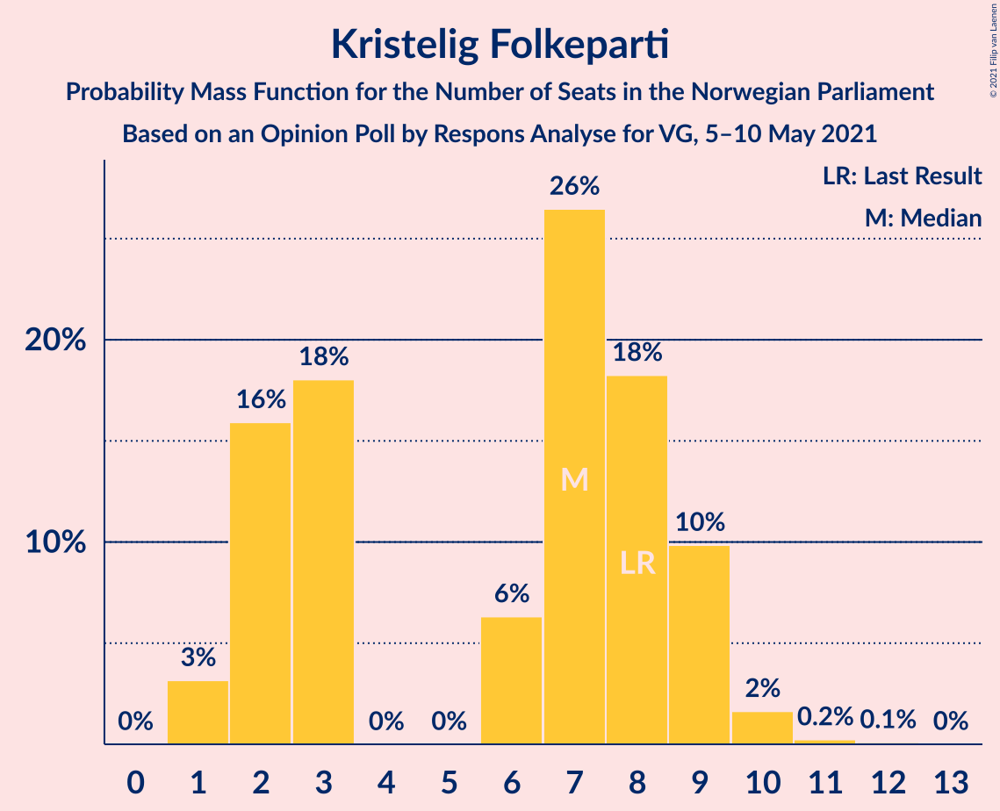

| Number of Seats | Probability | Accumulated | Special Marks |
|:---------------:|:-----------:|:-----------:|:-------------:|
| 1 | 3% | 100% |  |
| 2 | 16% | 97% |  |
| 3 | 18% | 81% |  |
| 4 | 0% | 63% |  |
| 5 | 0% | 63% |  |
| 6 | 6% | 63% |  |
| 7 | 26% | 57% | Median |
| 8 | 18% | 30% | Last Result |
| 9 | 10% | 12% |  |
| 10 | 2% | 2% |  |
| 11 | 0.2% | 0.3% |  |
| 12 | 0.1% | 0.1% |  |
| 13 | 0% | 0% |  |

### Rødt

*For a full overview of the results for this party, see the [Rødt](party-rødt.html) page.*

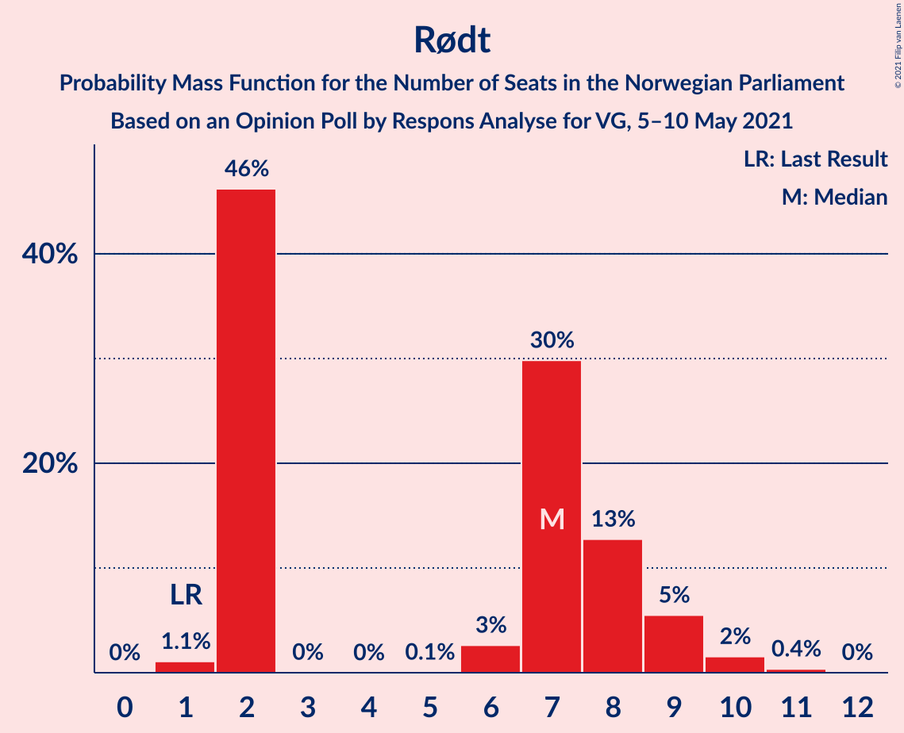

| Number of Seats | Probability | Accumulated | Special Marks |
|:---------------:|:-----------:|:-----------:|:-------------:|
| 1 | 1.1% | 100% | Last Result |
| 2 | 46% | 98.9% |  |
| 3 | 0% | 53% |  |
| 4 | 0% | 53% |  |
| 5 | 0.1% | 53% |  |
| 6 | 3% | 53% |  |
| 7 | 30% | 50% | Median |
| 8 | 13% | 20% |  |
| 9 | 5% | 7% |  |
| 10 | 2% | 2% |  |
| 11 | 0.4% | 0.4% |  |
| 12 | 0% | 0% |  |

### Venstre

*For a full overview of the results for this party, see the [Venstre](party-venstre.html) page.*

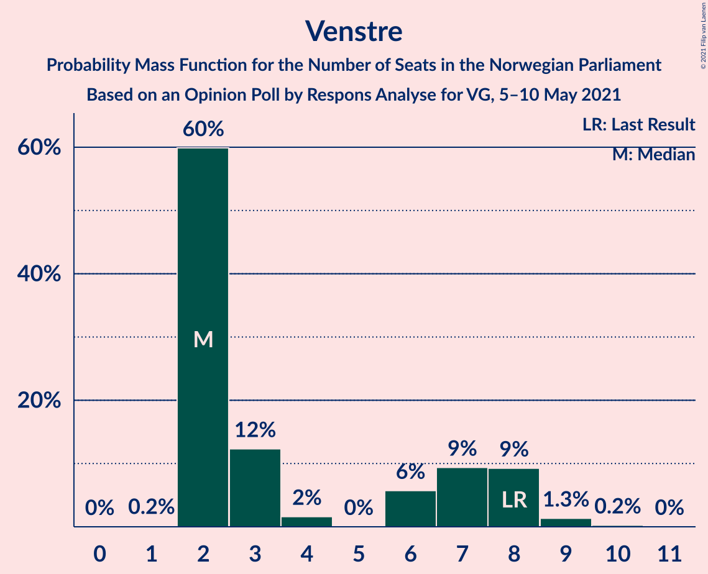

| Number of Seats | Probability | Accumulated | Special Marks |
|:---------------:|:-----------:|:-----------:|:-------------:|
| 1 | 0.2% | 100% |  |
| 2 | 60% | 99.8% | Median |
| 3 | 12% | 40% |  |
| 4 | 2% | 28% |  |
| 5 | 0% | 26% |  |
| 6 | 6% | 26% |  |
| 7 | 9% | 20% |  |
| 8 | 9% | 11% | Last Result |
| 9 | 1.3% | 2% |  |
| 10 | 0.2% | 0.3% |  |
| 11 | 0% | 0% |  |

## Coalitions

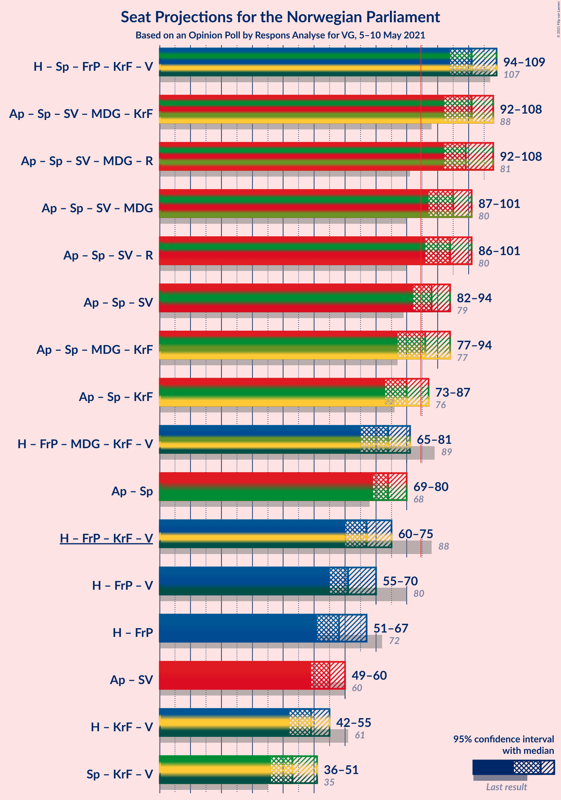

### Confidence Intervals

| Coalition | Last Result | Median | Majority? | 80% Confidence Interval | 90% Confidence Interval | 95% Confidence Interval | 99% Confidence Interval |
|:---------:|:-----------:|:------:|:---------:|:-----------------------:|:-----------------------:|:-----------------------:|:-----------------------:|
| Høyre – Senterpartiet – Fremskrittspartiet – Kristelig Folkeparti – Venstre | 107 | 101 | 100% | 96–106 | 95–109 | 94–109 | 92–112 |
| Arbeiderpartiet – Senterpartiet – Sosialistisk Venstreparti – Miljøpartiet De Grønne – Kristelig Folkeparti | 88 | 101 | 100% | 94–106 | 92–107 | 92–108 | 89–110 |
| Arbeiderpartiet – Senterpartiet – Sosialistisk Venstreparti – Miljøpartiet De Grønne – Rødt | 81 | 99 | 100% | 95–104 | 93–106 | 92–108 | 88–109 |
| Arbeiderpartiet – Senterpartiet – Sosialistisk Venstreparti – Miljøpartiet De Grønne | 80 | 95 | 99.3% | 90–99 | 89–100 | 87–101 | 84–104 |
| Arbeiderpartiet – Senterpartiet – Sosialistisk Venstreparti – Rødt | 80 | 94 | 99.2% | 89–98 | 88–100 | 86–101 | 84–103 |
| Arbeiderpartiet – Senterpartiet – Sosialistisk Venstreparti | 79 | 88 | 91% | 85–93 | 84–93 | 82–94 | 79–96 |
| Arbeiderpartiet – Senterpartiet – Miljøpartiet De Grønne – Kristelig Folkeparti | 77 | 86 | 68% | 80–92 | 78–93 | 77–94 | 75–98 |
| Arbeiderpartiet – Senterpartiet – Kristelig Folkeparti | 76 | 80 | 14% | 75–85 | 73–86 | 73–87 | 70–89 |
| Høyre – Fremskrittspartiet – Miljøpartiet De Grønne – Kristelig Folkeparti – Venstre | 89 | 74 | 0.3% | 68–79 | 67–81 | 65–81 | 62–84 |
| Arbeiderpartiet – Senterpartiet | 68 | 74 | 0% | 71–78 | 70–80 | 69–80 | 66–81 |
| Høyre – Fremskrittspartiet – Kristelig Folkeparti – Venstre | 88 | 67 | 0% | 62–72 | 61–74 | 60–75 | 57–78 |
| Høyre – Fremskrittspartiet – Venstre | 80 | 61 | 0% | 56–67 | 55–69 | 55–70 | 51–72 |
| Høyre – Fremskrittspartiet | 72 | 58 | 0% | 53–63 | 52–65 | 51–67 | 49–70 |
| Arbeiderpartiet – Sosialistisk Venstreparti | 60 | 55 | 0% | 52–58 | 50–59 | 49–60 | 47–61 |
| Høyre – Kristelig Folkeparti – Venstre | 61 | 49 | 0% | 44–52 | 43–53 | 42–55 | 41–58 |
| Senterpartiet – Kristelig Folkeparti – Venstre | 35 | 43 | 0% | 38–48 | 36–50 | 36–51 | 35–53 |

### Høyre – Senterpartiet – Fremskrittspartiet – Kristelig Folkeparti – Venstre

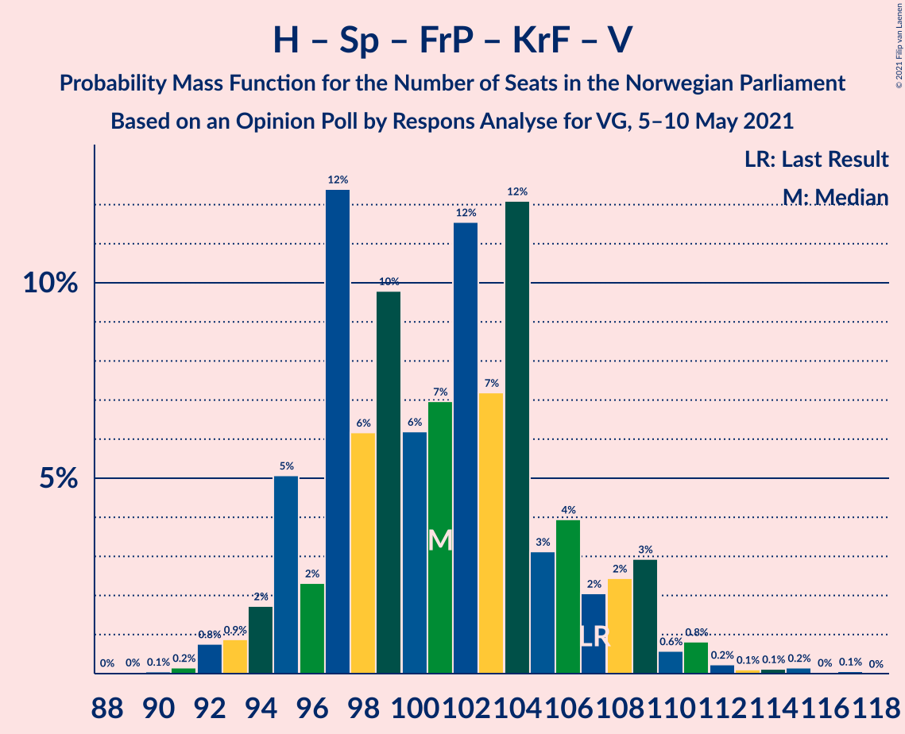

| Number of Seats | Probability | Accumulated | Special Marks |
|:---------------:|:-----------:|:-----------:|:-------------:|
| 89 | 0% | 100% |  |
| 90 | 0.1% | 99.9% |  |
| 91 | 0.2% | 99.9% |  |
| 92 | 0.8% | 99.7% |  |
| 93 | 0.9% | 99.0% |  |
| 94 | 2% | 98% |  |
| 95 | 5% | 96% |  |
| 96 | 2% | 91% |  |
| 97 | 12% | 89% |  |
| 98 | 6% | 77% |  |
| 99 | 10% | 70% |  |
| 100 | 6% | 61% |  |
| 101 | 7% | 54% | Median |
| 102 | 12% | 47% |  |
| 103 | 7% | 36% |  |
| 104 | 12% | 29% |  |
| 105 | 3% | 17% |  |
| 106 | 4% | 13% |  |
| 107 | 2% | 10% | Last Result |
| 108 | 2% | 7% |  |
| 109 | 3% | 5% |  |
| 110 | 0.6% | 2% |  |
| 111 | 0.8% | 2% |  |
| 112 | 0.2% | 0.7% |  |
| 113 | 0.1% | 0.5% |  |
| 114 | 0.1% | 0.4% |  |
| 115 | 0.2% | 0.3% |  |
| 116 | 0% | 0.1% |  |
| 117 | 0.1% | 0.1% |  |
| 118 | 0% | 0% |  |

### Arbeiderpartiet – Senterpartiet – Sosialistisk Venstreparti – Miljøpartiet De Grønne – Kristelig Folkeparti

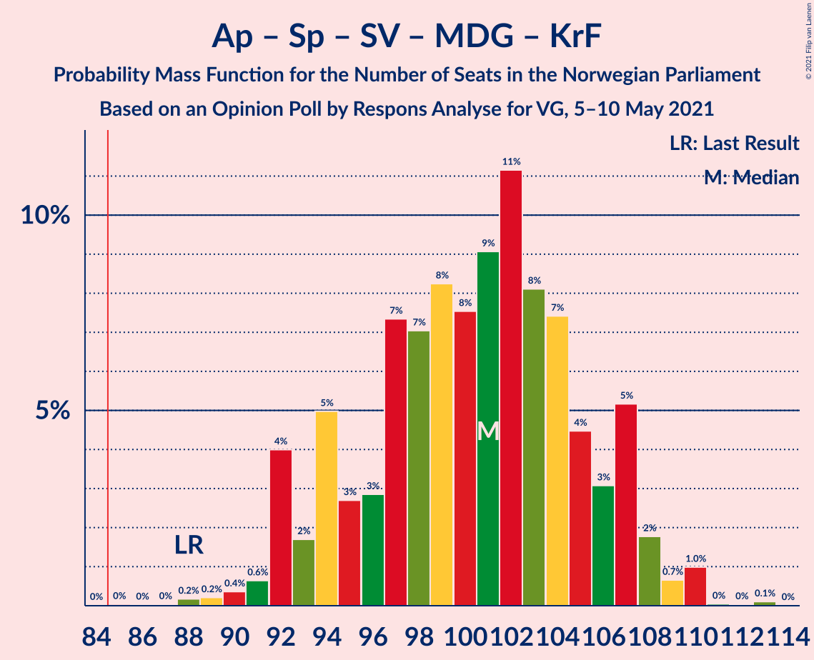

| Number of Seats | Probability | Accumulated | Special Marks |
|:---------------:|:-----------:|:-----------:|:-------------:|
| 85 | 0% | 100% | Majority |
| 86 | 0% | 99.9% |  |
| 87 | 0% | 99.9% |  |
| 88 | 0.2% | 99.9% | Last Result |
| 89 | 0.2% | 99.7% |  |
| 90 | 0.4% | 99.5% |  |
| 91 | 0.6% | 99.1% |  |
| 92 | 4% | 98% |  |
| 93 | 2% | 94% |  |
| 94 | 5% | 93% |  |
| 95 | 3% | 88% |  |
| 96 | 3% | 85% |  |
| 97 | 7% | 82% |  |
| 98 | 7% | 75% |  |
| 99 | 8% | 68% |  |
| 100 | 8% | 60% |  |
| 101 | 9% | 52% | Median |
| 102 | 11% | 43% |  |
| 103 | 8% | 32% |  |
| 104 | 7% | 24% |  |
| 105 | 4% | 16% |  |
| 106 | 3% | 12% |  |
| 107 | 5% | 9% |  |
| 108 | 2% | 4% |  |
| 109 | 0.7% | 2% |  |
| 110 | 1.0% | 1.2% |  |
| 111 | 0% | 0.2% |  |
| 112 | 0% | 0.2% |  |
| 113 | 0.1% | 0.1% |  |
| 114 | 0% | 0% |  |

### Arbeiderpartiet – Senterpartiet – Sosialistisk Venstreparti – Miljøpartiet De Grønne – Rødt

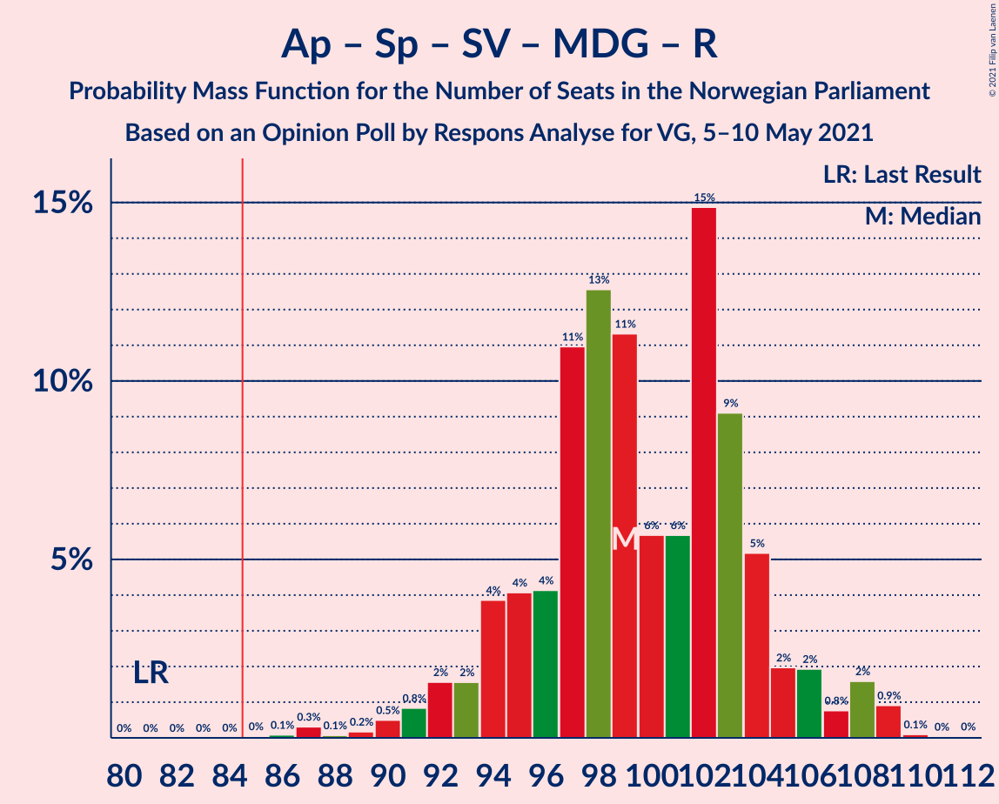

| Number of Seats | Probability | Accumulated | Special Marks |
|:---------------:|:-----------:|:-----------:|:-------------:|
| 81 | 0% | 100% | Last Result |
| 82 | 0% | 100% |  |
| 83 | 0% | 100% |  |
| 84 | 0% | 100% |  |
| 85 | 0% | 100% | Majority |
| 86 | 0.1% | 99.9% |  |
| 87 | 0.3% | 99.8% |  |
| 88 | 0.1% | 99.5% |  |
| 89 | 0.2% | 99.5% |  |
| 90 | 0.5% | 99.3% |  |
| 91 | 0.8% | 98.8% |  |
| 92 | 2% | 98% |  |
| 93 | 2% | 96% |  |
| 94 | 4% | 95% |  |
| 95 | 4% | 91% |  |
| 96 | 4% | 87% |  |
| 97 | 11% | 83% |  |
| 98 | 13% | 72% |  |
| 99 | 11% | 59% |  |
| 100 | 6% | 48% |  |
| 101 | 6% | 42% | Median |
| 102 | 15% | 37% |  |
| 103 | 9% | 22% |  |
| 104 | 5% | 13% |  |
| 105 | 2% | 7% |  |
| 106 | 2% | 5% |  |
| 107 | 0.8% | 3% |  |
| 108 | 2% | 3% |  |
| 109 | 0.9% | 1.1% |  |
| 110 | 0.1% | 0.2% |  |
| 111 | 0% | 0.1% |  |
| 112 | 0% | 0% |  |

### Arbeiderpartiet – Senterpartiet – Sosialistisk Venstreparti – Miljøpartiet De Grønne

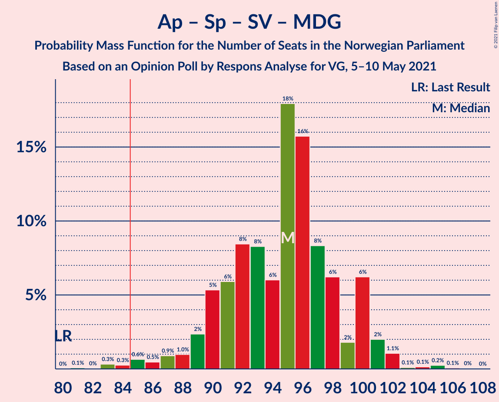

| Number of Seats | Probability | Accumulated | Special Marks |
|:---------------:|:-----------:|:-----------:|:-------------:|
| 80 | 0% | 100% | Last Result |
| 81 | 0.1% | 100% |  |
| 82 | 0% | 99.9% |  |
| 83 | 0.3% | 99.9% |  |
| 84 | 0.3% | 99.5% |  |
| 85 | 0.6% | 99.3% | Majority |
| 86 | 0.5% | 98.6% |  |
| 87 | 0.9% | 98% |  |
| 88 | 1.0% | 97% |  |
| 89 | 2% | 96% |  |
| 90 | 5% | 94% |  |
| 91 | 6% | 89% |  |
| 92 | 8% | 83% |  |
| 93 | 8% | 74% |  |
| 94 | 6% | 66% | Median |
| 95 | 18% | 60% |  |
| 96 | 16% | 42% |  |
| 97 | 8% | 26% |  |
| 98 | 6% | 18% |  |
| 99 | 2% | 12% |  |
| 100 | 6% | 10% |  |
| 101 | 2% | 4% |  |
| 102 | 1.1% | 2% |  |
| 103 | 0.1% | 0.6% |  |
| 104 | 0.1% | 0.5% |  |
| 105 | 0.2% | 0.4% |  |
| 106 | 0.1% | 0.1% |  |
| 107 | 0% | 0.1% |  |
| 108 | 0% | 0% |  |

### Arbeiderpartiet – Senterpartiet – Sosialistisk Venstreparti – Rødt

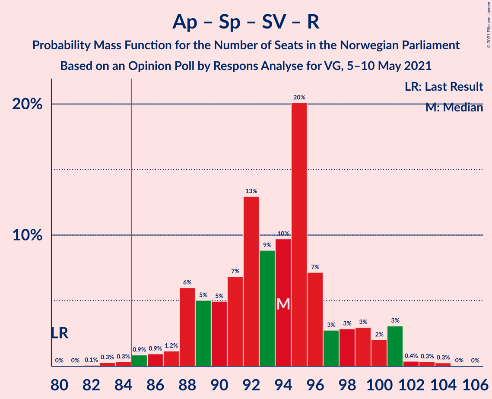

| Number of Seats | Probability | Accumulated | Special Marks |
|:---------------:|:-----------:|:-----------:|:-------------:|
| 80 | 0% | 100% | Last Result |
| 81 | 0% | 100% |  |
| 82 | 0.1% | 99.9% |  |
| 83 | 0.3% | 99.9% |  |
| 84 | 0.3% | 99.6% |  |
| 85 | 0.9% | 99.2% | Majority |
| 86 | 0.9% | 98% |  |
| 87 | 1.2% | 97% |  |
| 88 | 6% | 96% |  |
| 89 | 5% | 90% |  |
| 90 | 5% | 85% |  |
| 91 | 7% | 80% |  |
| 92 | 13% | 73% |  |
| 93 | 9% | 61% |  |
| 94 | 10% | 52% | Median |
| 95 | 20% | 42% |  |
| 96 | 7% | 22% |  |
| 97 | 3% | 15% |  |
| 98 | 3% | 12% |  |
| 99 | 3% | 9% |  |
| 100 | 2% | 6% |  |
| 101 | 3% | 4% |  |
| 102 | 0.4% | 1.1% |  |
| 103 | 0.3% | 0.7% |  |
| 104 | 0.3% | 0.3% |  |
| 105 | 0% | 0.1% |  |
| 106 | 0% | 0% |  |

### Arbeiderpartiet – Senterpartiet – Sosialistisk Venstreparti

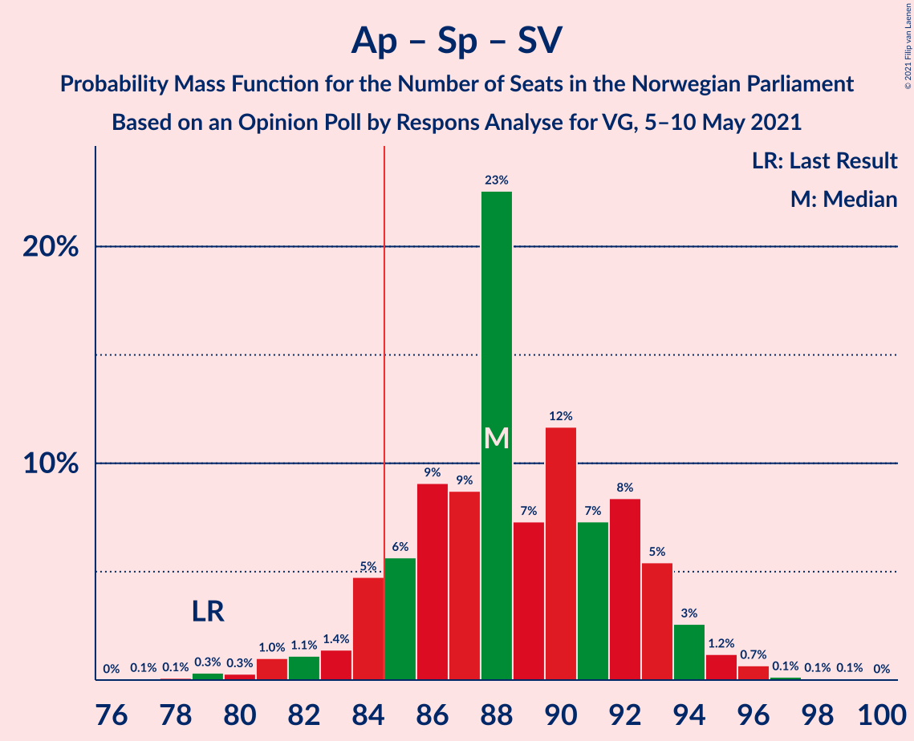

| Number of Seats | Probability | Accumulated | Special Marks |
|:---------------:|:-----------:|:-----------:|:-------------:|
| 77 | 0.1% | 100% |  |
| 78 | 0.1% | 99.9% |  |
| 79 | 0.3% | 99.8% | Last Result |
| 80 | 0.3% | 99.5% |  |
| 81 | 1.0% | 99.2% |  |
| 82 | 1.1% | 98% |  |
| 83 | 1.4% | 97% |  |
| 84 | 5% | 96% |  |
| 85 | 6% | 91% | Majority |
| 86 | 9% | 85% |  |
| 87 | 9% | 76% | Median |
| 88 | 23% | 67% |  |
| 89 | 7% | 45% |  |
| 90 | 12% | 38% |  |
| 91 | 7% | 26% |  |
| 92 | 8% | 19% |  |
| 93 | 5% | 10% |  |
| 94 | 3% | 5% |  |
| 95 | 1.2% | 2% |  |
| 96 | 0.7% | 1.0% |  |
| 97 | 0.1% | 0.3% |  |
| 98 | 0.1% | 0.2% |  |
| 99 | 0.1% | 0.1% |  |
| 100 | 0% | 0% |  |

### Arbeiderpartiet – Senterpartiet – Miljøpartiet De Grønne – Kristelig Folkeparti

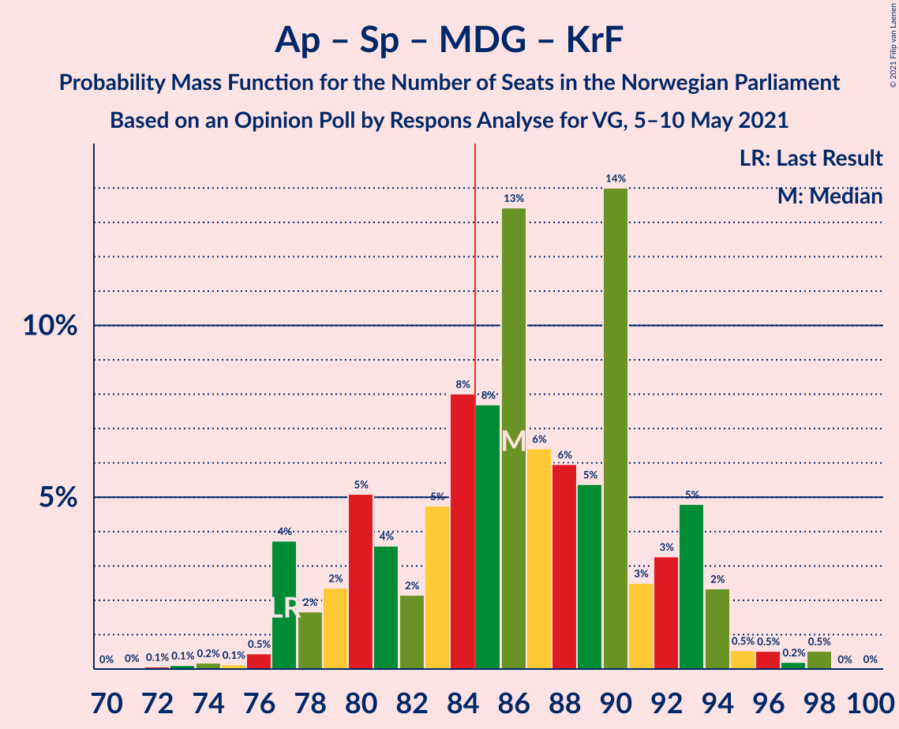

| Number of Seats | Probability | Accumulated | Special Marks |
|:---------------:|:-----------:|:-----------:|:-------------:|
| 71 | 0% | 100% |  |
| 72 | 0.1% | 99.9% |  |
| 73 | 0.1% | 99.9% |  |
| 74 | 0.2% | 99.8% |  |
| 75 | 0.1% | 99.6% |  |
| 76 | 0.5% | 99.5% |  |
| 77 | 4% | 99.0% | Last Result |
| 78 | 2% | 95% |  |
| 79 | 2% | 94% |  |
| 80 | 5% | 91% |  |
| 81 | 4% | 86% |  |
| 82 | 2% | 83% |  |
| 83 | 5% | 80% |  |
| 84 | 8% | 76% |  |
| 85 | 8% | 68% | Majority |
| 86 | 13% | 60% |  |
| 87 | 6% | 47% | Median |
| 88 | 6% | 40% |  |
| 89 | 5% | 34% |  |
| 90 | 14% | 29% |  |
| 91 | 3% | 15% |  |
| 92 | 3% | 12% |  |
| 93 | 5% | 9% |  |
| 94 | 2% | 4% |  |
| 95 | 0.5% | 2% |  |
| 96 | 0.5% | 1.3% |  |
| 97 | 0.2% | 0.7% |  |
| 98 | 0.5% | 0.5% |  |
| 99 | 0% | 0% |  |

### Arbeiderpartiet – Senterpartiet – Kristelig Folkeparti

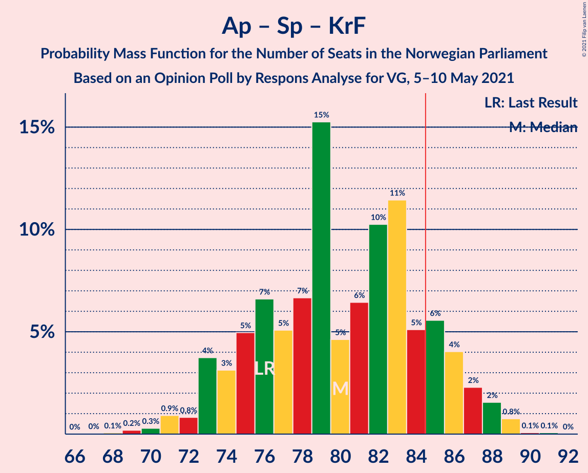

| Number of Seats | Probability | Accumulated | Special Marks |
|:---------------:|:-----------:|:-----------:|:-------------:|
| 67 | 0% | 100% |  |
| 68 | 0.1% | 99.9% |  |
| 69 | 0.2% | 99.9% |  |
| 70 | 0.3% | 99.7% |  |
| 71 | 0.9% | 99.4% |  |
| 72 | 0.8% | 98% |  |
| 73 | 4% | 98% |  |
| 74 | 3% | 94% |  |
| 75 | 5% | 91% |  |
| 76 | 7% | 86% | Last Result |
| 77 | 5% | 79% |  |
| 78 | 7% | 74% |  |
| 79 | 15% | 67% |  |
| 80 | 5% | 52% | Median |
| 81 | 6% | 48% |  |
| 82 | 10% | 41% |  |
| 83 | 11% | 31% |  |
| 84 | 5% | 19% |  |
| 85 | 6% | 14% | Majority |
| 86 | 4% | 9% |  |
| 87 | 2% | 5% |  |
| 88 | 2% | 2% |  |
| 89 | 0.8% | 0.9% |  |
| 90 | 0.1% | 0.2% |  |
| 91 | 0.1% | 0.1% |  |
| 92 | 0% | 0% |  |

### Høyre – Fremskrittspartiet – Miljøpartiet De Grønne – Kristelig Folkeparti – Venstre

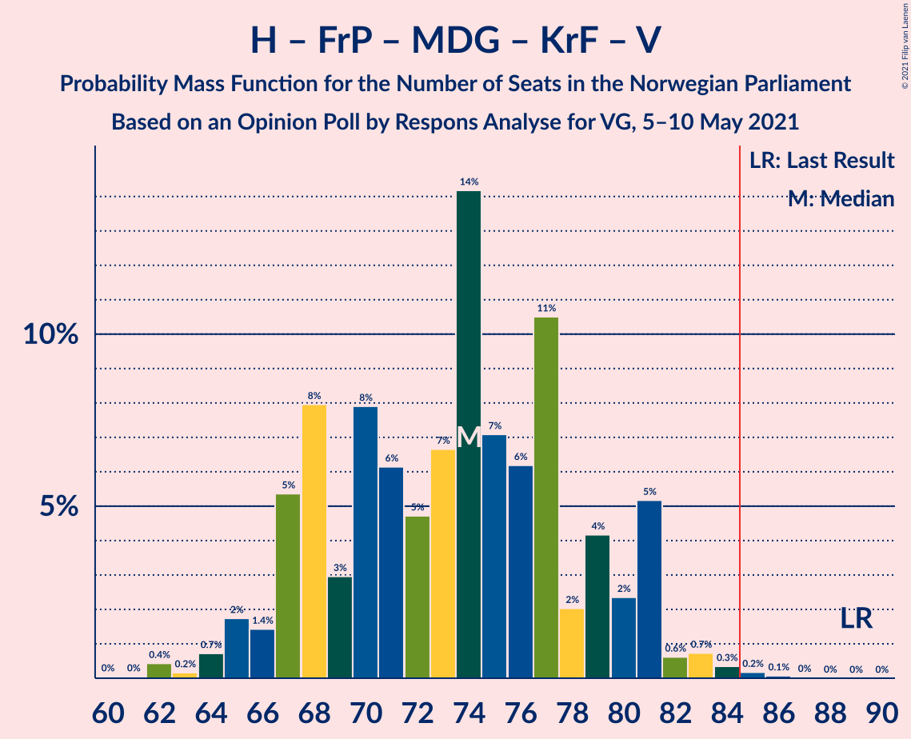

| Number of Seats | Probability | Accumulated | Special Marks |
|:---------------:|:-----------:|:-----------:|:-------------:|
| 60 | 0% | 100% |  |
| 61 | 0% | 99.9% |  |
| 62 | 0.4% | 99.9% |  |
| 63 | 0.2% | 99.5% |  |
| 64 | 0.7% | 99.3% |  |
| 65 | 2% | 98.6% |  |
| 66 | 1.4% | 97% |  |
| 67 | 5% | 95% |  |
| 68 | 8% | 90% |  |
| 69 | 3% | 82% |  |
| 70 | 8% | 79% |  |
| 71 | 6% | 71% |  |
| 72 | 5% | 65% |  |
| 73 | 7% | 60% |  |
| 74 | 14% | 54% |  |
| 75 | 7% | 40% | Median |
| 76 | 6% | 32% |  |
| 77 | 11% | 26% |  |
| 78 | 2% | 16% |  |
| 79 | 4% | 14% |  |
| 80 | 2% | 10% |  |
| 81 | 5% | 7% |  |
| 82 | 0.6% | 2% |  |
| 83 | 0.7% | 1.4% |  |
| 84 | 0.3% | 0.6% |  |
| 85 | 0.2% | 0.3% | Majority |
| 86 | 0.1% | 0.1% |  |
| 87 | 0% | 0% |  |
| 88 | 0% | 0% |  |
| 89 | 0% | 0% | Last Result |

### Arbeiderpartiet – Senterpartiet

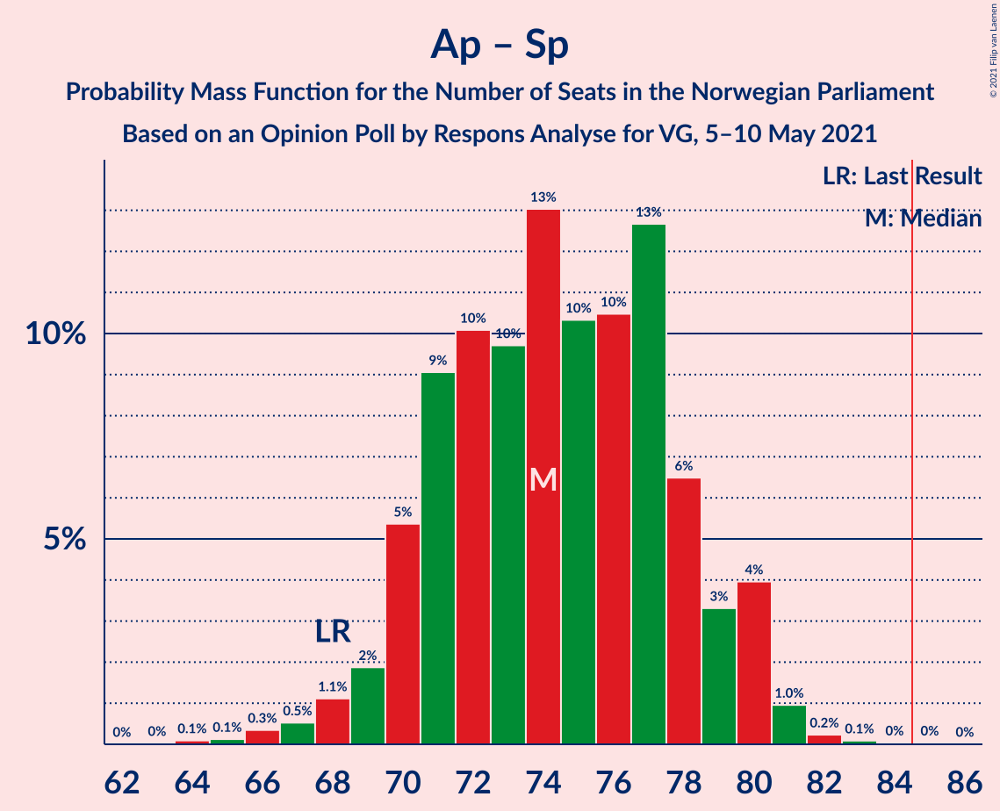

| Number of Seats | Probability | Accumulated | Special Marks |
|:---------------:|:-----------:|:-----------:|:-------------:|
| 64 | 0.1% | 100% |  |
| 65 | 0.1% | 99.9% |  |
| 66 | 0.3% | 99.7% |  |
| 67 | 0.5% | 99.4% |  |
| 68 | 1.1% | 98.9% | Last Result |
| 69 | 2% | 98% |  |
| 70 | 5% | 96% |  |
| 71 | 9% | 91% |  |
| 72 | 10% | 81% |  |
| 73 | 10% | 71% | Median |
| 74 | 13% | 62% |  |
| 75 | 10% | 49% |  |
| 76 | 10% | 38% |  |
| 77 | 13% | 28% |  |
| 78 | 6% | 15% |  |
| 79 | 3% | 9% |  |
| 80 | 4% | 5% |  |
| 81 | 1.0% | 1.4% |  |
| 82 | 0.2% | 0.4% |  |
| 83 | 0.1% | 0.2% |  |
| 84 | 0% | 0.1% |  |
| 85 | 0% | 0% | Majority |

### Høyre – Fremskrittspartiet – Kristelig Folkeparti – Venstre

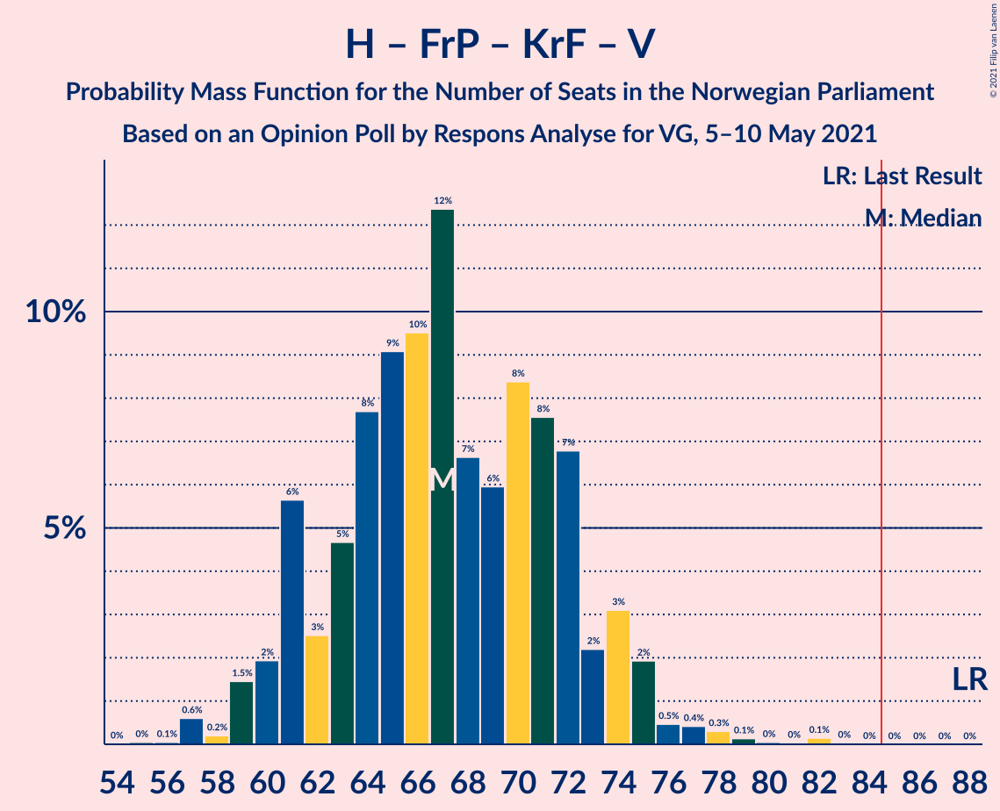

| Number of Seats | Probability | Accumulated | Special Marks |
|:---------------:|:-----------:|:-----------:|:-------------:|
| 55 | 0% | 100% |  |
| 56 | 0.1% | 99.9% |  |
| 57 | 0.6% | 99.9% |  |
| 58 | 0.2% | 99.3% |  |
| 59 | 1.5% | 99.1% |  |
| 60 | 2% | 98% |  |
| 61 | 6% | 96% |  |
| 62 | 3% | 90% |  |
| 63 | 5% | 88% |  |
| 64 | 8% | 83% |  |
| 65 | 9% | 75% |  |
| 66 | 10% | 66% |  |
| 67 | 12% | 57% |  |
| 68 | 7% | 44% | Median |
| 69 | 6% | 38% |  |
| 70 | 8% | 32% |  |
| 71 | 8% | 23% |  |
| 72 | 7% | 16% |  |
| 73 | 2% | 9% |  |
| 74 | 3% | 7% |  |
| 75 | 2% | 4% |  |
| 76 | 0.5% | 2% |  |
| 77 | 0.4% | 1.1% |  |
| 78 | 0.3% | 0.7% |  |
| 79 | 0.1% | 0.4% |  |
| 80 | 0% | 0.3% |  |
| 81 | 0% | 0.2% |  |
| 82 | 0.1% | 0.2% |  |
| 83 | 0% | 0% |  |
| 84 | 0% | 0% |  |
| 85 | 0% | 0% | Majority |
| 86 | 0% | 0% |  |
| 87 | 0% | 0% |  |
| 88 | 0% | 0% | Last Result |

### Høyre – Fremskrittspartiet – Venstre

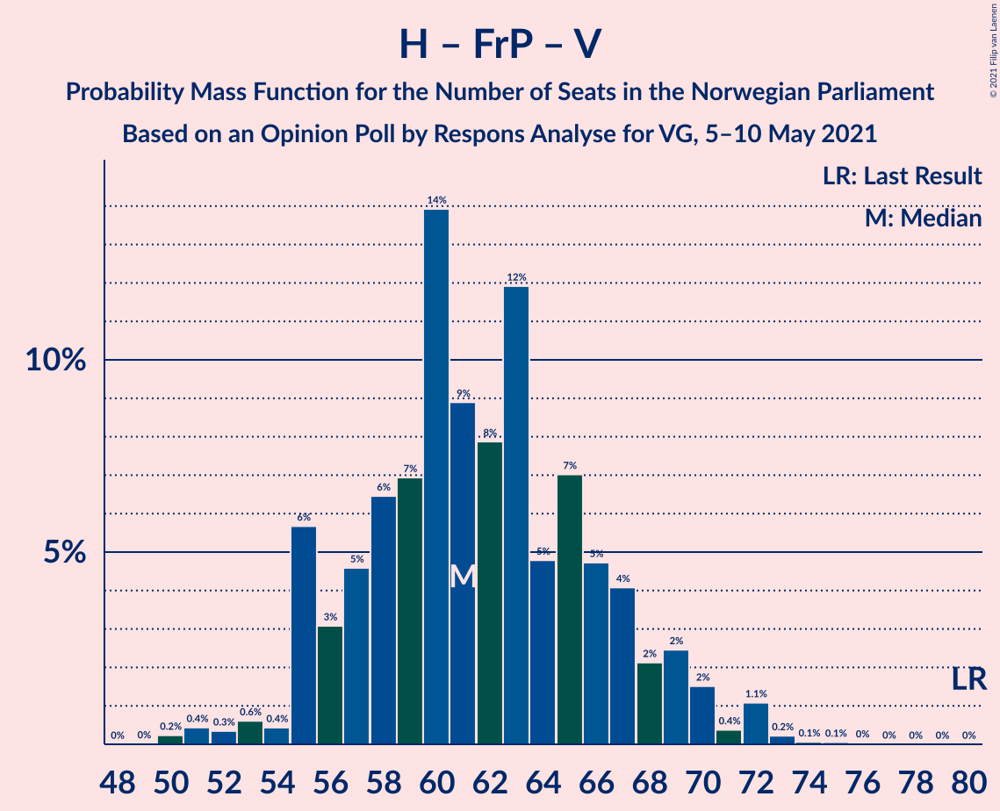

| Number of Seats | Probability | Accumulated | Special Marks |
|:---------------:|:-----------:|:-----------:|:-------------:|
| 50 | 0.2% | 100% |  |
| 51 | 0.4% | 99.8% |  |
| 52 | 0.3% | 99.3% |  |
| 53 | 0.6% | 99.0% |  |
| 54 | 0.4% | 98% |  |
| 55 | 6% | 98% |  |
| 56 | 3% | 92% |  |
| 57 | 5% | 89% |  |
| 58 | 6% | 85% |  |
| 59 | 7% | 78% |  |
| 60 | 14% | 71% |  |
| 61 | 9% | 57% | Median |
| 62 | 8% | 48% |  |
| 63 | 12% | 40% |  |
| 64 | 5% | 29% |  |
| 65 | 7% | 24% |  |
| 66 | 5% | 17% |  |
| 67 | 4% | 12% |  |
| 68 | 2% | 8% |  |
| 69 | 2% | 6% |  |
| 70 | 2% | 3% |  |
| 71 | 0.4% | 2% |  |
| 72 | 1.1% | 1.5% |  |
| 73 | 0.2% | 0.4% |  |
| 74 | 0.1% | 0.2% |  |
| 75 | 0.1% | 0.1% |  |
| 76 | 0% | 0% |  |
| 77 | 0% | 0% |  |
| 78 | 0% | 0% |  |
| 79 | 0% | 0% |  |
| 80 | 0% | 0% | Last Result |

### Høyre – Fremskrittspartiet

| Number of Seats | Probability | Accumulated | Special Marks |
|:---------------:|:-----------:|:-----------:|:-------------:|
| 48 | 0.3% | 100% |  |
| 49 | 0.7% | 99.6% |  |
| 50 | 1.3% | 98.9% |  |
| 51 | 2% | 98% |  |
| 52 | 2% | 96% |  |
| 53 | 12% | 94% |  |
| 54 | 4% | 82% |  |
| 55 | 5% | 78% |  |
| 56 | 10% | 74% |  |
| 57 | 5% | 64% |  |
| 58 | 13% | 58% |  |
| 59 | 11% | 46% | Median |
| 60 | 10% | 35% |  |
| 61 | 5% | 25% |  |
| 62 | 7% | 20% |  |
| 63 | 5% | 13% |  |
| 64 | 3% | 8% |  |
| 65 | 2% | 6% |  |
| 66 | 1.2% | 4% |  |
| 67 | 1.0% | 3% |  |
| 68 | 0.6% | 2% |  |
| 69 | 0.2% | 1.1% |  |
| 70 | 0.9% | 0.9% |  |
| 71 | 0.1% | 0.1% |  |
| 72 | 0% | 0% | Last Result |

### Arbeiderpartiet – Sosialistisk Venstreparti

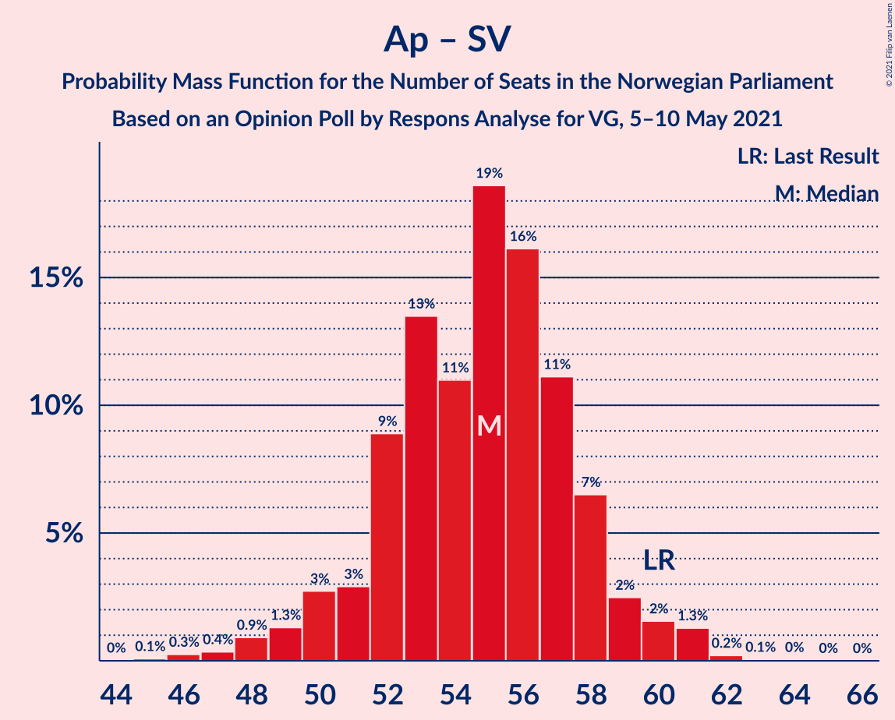

| Number of Seats | Probability | Accumulated | Special Marks |
|:---------------:|:-----------:|:-----------:|:-------------:|
| 44 | 0% | 100% |  |
| 45 | 0.1% | 99.9% |  |
| 46 | 0.3% | 99.9% |  |
| 47 | 0.4% | 99.6% |  |
| 48 | 0.9% | 99.3% |  |
| 49 | 1.3% | 98% |  |
| 50 | 3% | 97% |  |
| 51 | 3% | 94% |  |
| 52 | 9% | 91% |  |
| 53 | 13% | 82% |  |
| 54 | 11% | 69% | Median |
| 55 | 19% | 58% |  |
| 56 | 16% | 39% |  |
| 57 | 11% | 23% |  |
| 58 | 7% | 12% |  |
| 59 | 2% | 6% |  |
| 60 | 2% | 3% | Last Result |
| 61 | 1.3% | 2% |  |
| 62 | 0.2% | 0.3% |  |
| 63 | 0.1% | 0.1% |  |
| 64 | 0% | 0.1% |  |
| 65 | 0% | 0% |  |

### Høyre – Kristelig Folkeparti – Venstre

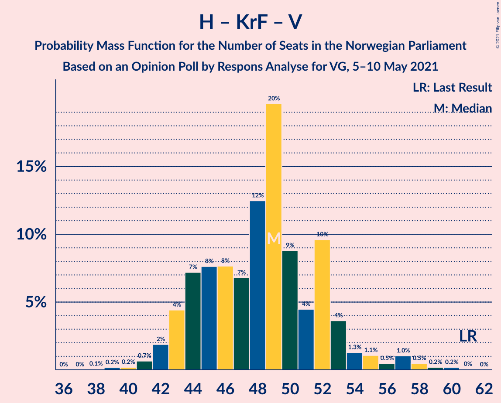

| Number of Seats | Probability | Accumulated | Special Marks |
|:---------------:|:-----------:|:-----------:|:-------------:|
| 38 | 0.1% | 100% |  |
| 39 | 0.2% | 99.9% |  |
| 40 | 0.2% | 99.8% |  |
| 41 | 0.7% | 99.6% |  |
| 42 | 2% | 98.9% |  |
| 43 | 4% | 97% |  |
| 44 | 7% | 93% |  |
| 45 | 8% | 85% |  |
| 46 | 8% | 78% |  |
| 47 | 7% | 70% |  |
| 48 | 12% | 63% |  |
| 49 | 20% | 51% | Median |
| 50 | 9% | 31% |  |
| 51 | 4% | 22% |  |
| 52 | 10% | 18% |  |
| 53 | 4% | 8% |  |
| 54 | 1.3% | 5% |  |
| 55 | 1.1% | 3% |  |
| 56 | 0.5% | 2% |  |
| 57 | 1.0% | 2% |  |
| 58 | 0.5% | 0.9% |  |
| 59 | 0.2% | 0.4% |  |
| 60 | 0.2% | 0.2% |  |
| 61 | 0% | 0.1% | Last Result |
| 62 | 0% | 0% |  |

### Senterpartiet – Kristelig Folkeparti – Venstre

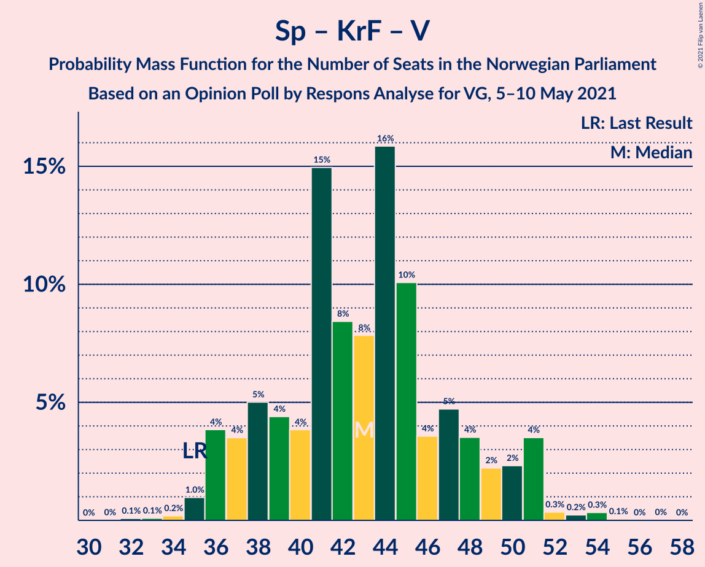

| Number of Seats | Probability | Accumulated | Special Marks |
|:---------------:|:-----------:|:-----------:|:-------------:|
| 32 | 0.1% | 100% |  |
| 33 | 0.1% | 99.9% |  |
| 34 | 0.2% | 99.8% |  |
| 35 | 1.0% | 99.6% | Last Result |
| 36 | 4% | 98.6% |  |
| 37 | 4% | 95% |  |
| 38 | 5% | 91% |  |
| 39 | 4% | 86% |  |
| 40 | 4% | 82% |  |
| 41 | 15% | 78% |  |
| 42 | 8% | 63% | Median |
| 43 | 8% | 55% |  |
| 44 | 16% | 47% |  |
| 45 | 10% | 31% |  |
| 46 | 4% | 21% |  |
| 47 | 5% | 17% |  |
| 48 | 4% | 13% |  |
| 49 | 2% | 9% |  |
| 50 | 2% | 7% |  |
| 51 | 4% | 5% |  |
| 52 | 0.3% | 1.0% |  |
| 53 | 0.2% | 0.7% |  |
| 54 | 0.3% | 0.4% |  |
| 55 | 0.1% | 0.1% |  |
| 56 | 0% | 0.1% |  |
| 57 | 0% | 0% |  |

## Technical Information

### Opinion Poll

+ **Polling firm:** Respons Analyse
+ **Commissioner(s):** VG
+ **Fieldwork period:** 5–10 May 2021

### Calculations

+ **Sample size:** 1001
+ **Simulations done:** 1,048,576
+ **Error estimate:** 2.12%

