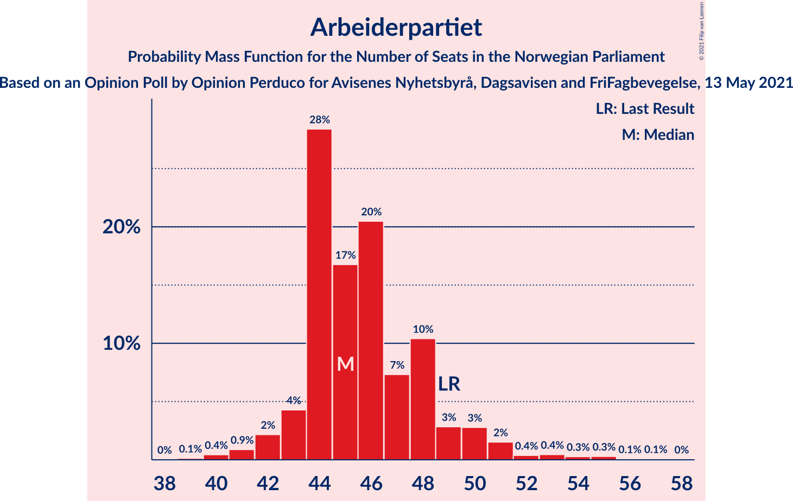
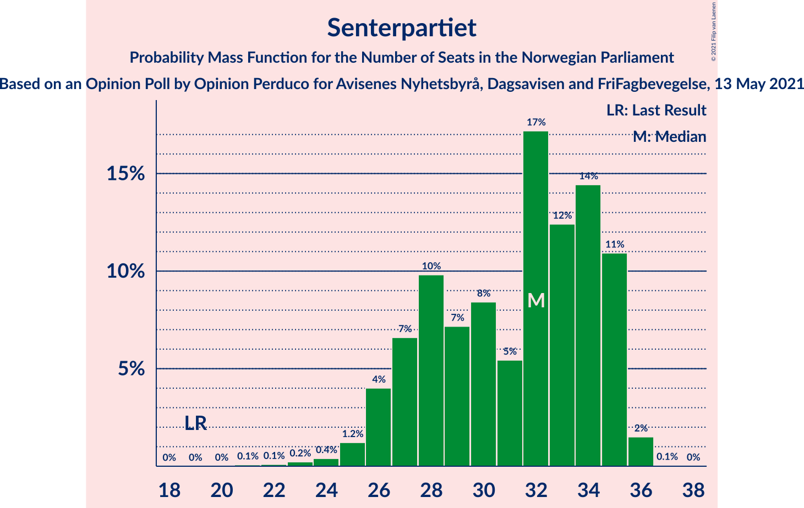
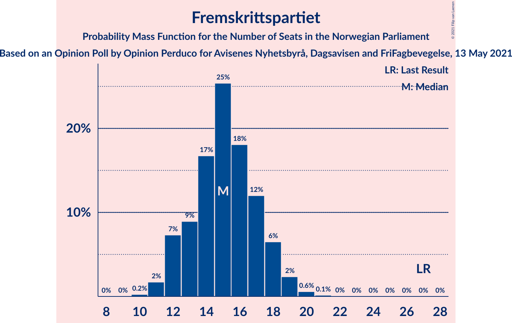
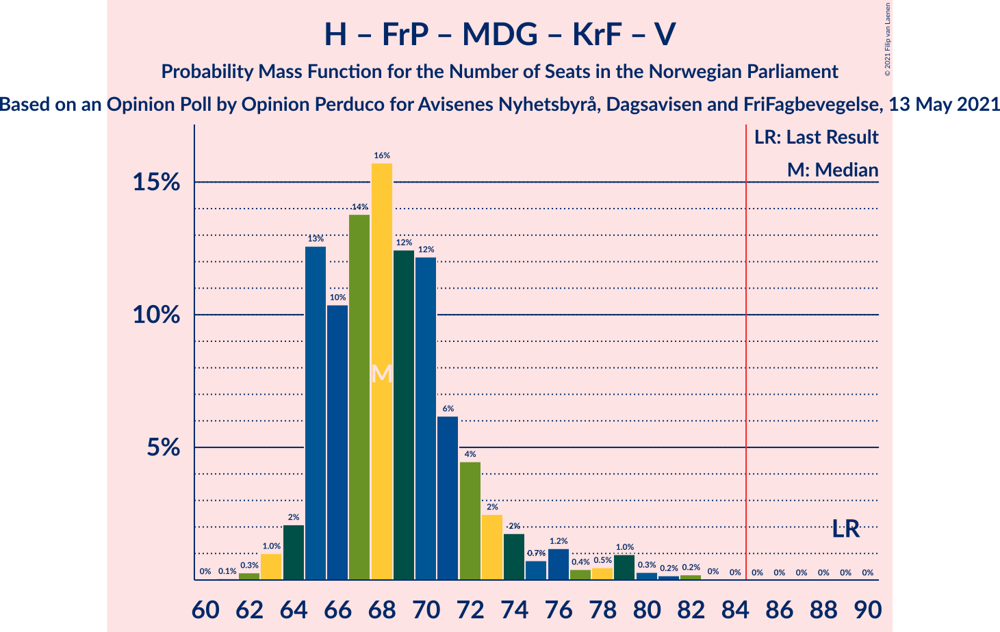
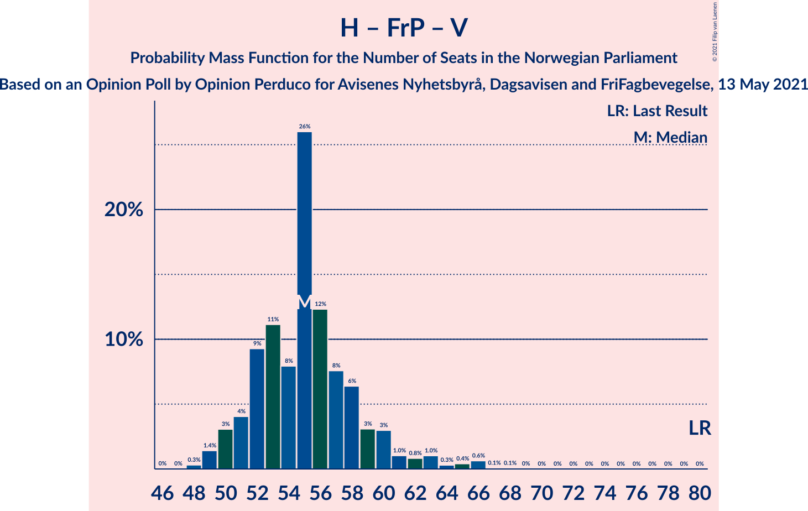

# Opinion Poll by Opinion Perduco for Avisenes Nyhetsbyrå, Dagsavisen and FriFagbevegelse, 13 May 2021

<a href="#voting-intentions">Voting Intentions</a> | <a href="#seats">Seats</a> | <a href="#coalitions">Coalitions</a> | <a href="#technical-information">Technical Information</a>

## Voting Intentions

### Confidence Intervals

| Party | Last Result | Poll Result | 80% Confidence Interval | 90% Confidence Interval | 95% Confidence Interval | 99% Confidence Interval |
|:-----:|:-----------:|:-----------:|:-----------------------:|:-----------------------:|:-----------------------:|:-----------------------:|
| Arbeiderpartiet | 27.4% | 25.6% | 23.8–27.5% |23.3–28.0% |22.9–28.5% |22.1–29.4% |
| Høyre | 25.0% | 22.0% | 20.3–23.8% |19.8–24.3% |19.4–24.7% |18.7–25.6% |
| Senterpartiet | 10.3% | 16.2% | 14.8–17.9% |14.4–18.3% |14.0–18.7% |13.4–19.6% |
| Sosialistisk Venstreparti | 6.0% | 9.3% | 8.2–10.7% |7.9–11.1% |7.6–11.4% |7.1–12.0% |
| Fremskrittspartiet | 15.2% | 8.7% | 7.6–10.0% |7.3–10.4% |7.1–10.7% |6.6–11.3% |
| Miljøpartiet De Grønne | 3.2% | 5.0% | 4.2–6.0% |4.0–6.3% |3.8–6.6% |3.4–7.1% |
| Rødt | 2.4% | 4.4% | 3.6–5.3% |3.4–5.6% |3.2–5.9% |2.9–6.4% |
| Kristelig Folkeparti | 4.2% | 4.1% | 3.4–5.1% |3.2–5.4% |3.0–5.6% |2.7–6.1% |
| Venstre | 4.4% | 3.3% | 2.7–4.2% |2.5–4.4% |2.3–4.6% |2.1–5.1% |

*Note:* The poll result column reflects the actual value used in the calculations. Published results may vary slightly, and in addition be rounded to fewer digits.

## Seats

### Confidence Intervals

| Party | Last Result | Median | 80% Confidence Interval | 90% Confidence Interval | 95% Confidence Interval | 99% Confidence Interval |
|:-----:|:-----------:|:------:|:-----------------------:|:-----------------------:|:-----------------------:|:-----------------------:|
| <a href="#arbeiderpartiet">Arbeiderpartiet</a> | 49 | 46 | 44–50 |43–53 |41–54 |40–56 |
| <a href="#høyre">Høyre</a> | 45 | 37 | 35–39 |35–42 |34–43 |33–46 |
| <a href="#senterpartiet">Senterpartiet</a> | 19 | 28 | 26–34 |26–35 |25–36 |23–36 |
| <a href="#sosialistisk-venstreparti">Sosialistisk Venstreparti</a> | 11 | 16 | 13–18 |13–19 |12–20 |12–21 |
| <a href="#fremskrittspartiet">Fremskrittspartiet</a> | 27 | 15 | 13–17 |12–19 |12–20 |11–21 |
| <a href="#miljøpartiet-de-grønne">Miljøpartiet De Grønne</a> | 1 | 9 | 7–10 |3–11 |2–11 |2–12 |
| <a href="#rødt">Rødt</a> | 1 | 8 | 2–9 |2–10 |2–11 |1–11 |
| <a href="#kristelig-folkeparti">Kristelig Folkeparti</a> | 8 | 7 | 3–9 |2–9 |1–10 |1–11 |
| <a href="#venstre">Venstre</a> | 8 | 2 | 2–8 |2–8 |2–9 |1–9 |

### Arbeiderpartiet

*For a full overview of the results for this party, see the [Arbeiderpartiet](party-arbeiderpartiet.html) page.*

| Number of Seats | Probability | Accumulated | Special Marks |
|:---------------:|:-----------:|:-----------:|:-------------:|
| 38 | 0.1% | 100% |  |
| 39 | 0.2% | 99.9% |  |
| 40 | 1.3% | 99.7% |  |
| 41 | 1.0% | 98% |  |
| 42 | 2% | 97% |  |
| 43 | 2% | 95% |  |
| 44 | 17% | 93% |  |
| 45 | 25% | 75% |  |
| 46 | 10% | 50% | Median |
| 47 | 11% | 40% |  |
| 48 | 6% | 29% |  |
| 49 | 5% | 23% | Last Result |
| 50 | 8% | 17% |  |
| 51 | 2% | 9% |  |
| 52 | 2% | 8% |  |
| 53 | 2% | 6% |  |
| 54 | 1.4% | 4% |  |
| 55 | 2% | 2% |  |
| 56 | 0.3% | 0.8% |  |
| 57 | 0.4% | 0.5% |  |
| 58 | 0.1% | 0.1% |  |
| 59 | 0% | 0% |  |

### Høyre

*For a full overview of the results for this party, see the [Høyre](party-høyre.html) page.*

| Number of Seats | Probability | Accumulated | Special Marks |
|:---------------:|:-----------:|:-----------:|:-------------:|
| 31 | 0% | 100% |  |
| 32 | 0.1% | 99.9% |  |
| 33 | 0.6% | 99.9% |  |
| 34 | 3% | 99.2% |  |
| 35 | 20% | 96% |  |
| 36 | 20% | 77% |  |
| 37 | 37% | 57% | Median |
| 38 | 6% | 19% |  |
| 39 | 4% | 14% |  |
| 40 | 2% | 9% |  |
| 41 | 2% | 7% |  |
| 42 | 2% | 5% |  |
| 43 | 1.1% | 3% |  |
| 44 | 0.3% | 2% |  |
| 45 | 0.7% | 2% | Last Result |
| 46 | 0.7% | 1.1% |  |
| 47 | 0.3% | 0.4% |  |
| 48 | 0.1% | 0.1% |  |
| 49 | 0% | 0% |  |

### Senterpartiet

*For a full overview of the results for this party, see the [Senterpartiet](party-senterpartiet.html) page.*

| Number of Seats | Probability | Accumulated | Special Marks |
|:---------------:|:-----------:|:-----------:|:-------------:|
| 19 | 0% | 100% | Last Result |
| 20 | 0% | 100% |  |
| 21 | 0% | 100% |  |
| 22 | 0.2% | 99.9% |  |
| 23 | 0.7% | 99.7% |  |
| 24 | 0.6% | 99.1% |  |
| 25 | 2% | 98.5% |  |
| 26 | 18% | 97% |  |
| 27 | 26% | 79% |  |
| 28 | 14% | 53% | Median |
| 29 | 9% | 39% |  |
| 30 | 7% | 30% |  |
| 31 | 3% | 24% |  |
| 32 | 3% | 21% |  |
| 33 | 1.4% | 18% |  |
| 34 | 9% | 16% |  |
| 35 | 4% | 7% |  |
| 36 | 3% | 3% |  |
| 37 | 0.1% | 0.1% |  |
| 38 | 0% | 0% |  |

### Sosialistisk Venstreparti

*For a full overview of the results for this party, see the [Sosialistisk Venstreparti](party-sosialistiskvenstreparti.html) page.*

| Number of Seats | Probability | Accumulated | Special Marks |
|:---------------:|:-----------:|:-----------:|:-------------:|
| 10 | 0.1% | 100% |  |
| 11 | 0.3% | 99.9% | Last Result |
| 12 | 2% | 99.7% |  |
| 13 | 8% | 97% |  |
| 14 | 8% | 90% |  |
| 15 | 23% | 82% |  |
| 16 | 16% | 59% | Median |
| 17 | 22% | 43% |  |
| 18 | 12% | 21% |  |
| 19 | 6% | 9% |  |
| 20 | 2% | 4% |  |
| 21 | 1.2% | 2% |  |
| 22 | 0.2% | 0.4% |  |
| 23 | 0.2% | 0.2% |  |
| 24 | 0.1% | 0.1% |  |
| 25 | 0% | 0% |  |

### Fremskrittspartiet

*For a full overview of the results for this party, see the [Fremskrittspartiet](party-fremskrittspartiet.html) page.*

| Number of Seats | Probability | Accumulated | Special Marks |
|:---------------:|:-----------:|:-----------:|:-------------:|
| 10 | 0.4% | 100% |  |
| 11 | 2% | 99.6% |  |
| 12 | 5% | 98% |  |
| 13 | 16% | 93% |  |
| 14 | 7% | 77% |  |
| 15 | 25% | 70% | Median |
| 16 | 28% | 46% |  |
| 17 | 9% | 18% |  |
| 18 | 4% | 9% |  |
| 19 | 2% | 5% |  |
| 20 | 2% | 3% |  |
| 21 | 0.6% | 0.7% |  |
| 22 | 0.1% | 0.1% |  |
| 23 | 0% | 0% |  |
| 24 | 0% | 0% |  |
| 25 | 0% | 0% |  |
| 26 | 0% | 0% |  |
| 27 | 0% | 0% | Last Result |

### Miljøpartiet De Grønne

*For a full overview of the results for this party, see the [Miljøpartiet De Grønne](party-miljøpartietdegrønne.html) page.*

| Number of Seats | Probability | Accumulated | Special Marks |
|:---------------:|:-----------:|:-----------:|:-------------:|
| 1 | 0.3% | 100% | Last Result |
| 2 | 4% | 99.7% |  |
| 3 | 0.9% | 96% |  |
| 4 | 0.1% | 95% |  |
| 5 | 0% | 95% |  |
| 6 | 0% | 95% |  |
| 7 | 12% | 95% |  |
| 8 | 32% | 83% |  |
| 9 | 32% | 51% | Median |
| 10 | 12% | 19% |  |
| 11 | 6% | 7% |  |
| 12 | 1.0% | 1.2% |  |
| 13 | 0.1% | 0.2% |  |
| 14 | 0% | 0% |  |

### Rødt

*For a full overview of the results for this party, see the [Rødt](party-rødt.html) page.*

| Number of Seats | Probability | Accumulated | Special Marks |
|:---------------:|:-----------:|:-----------:|:-------------:|
| 1 | 1.1% | 100% | Last Result |
| 2 | 16% | 98.9% |  |
| 3 | 0% | 83% |  |
| 4 | 0% | 83% |  |
| 5 | 0% | 83% |  |
| 6 | 0.3% | 83% |  |
| 7 | 25% | 82% |  |
| 8 | 45% | 57% | Median |
| 9 | 7% | 12% |  |
| 10 | 2% | 5% |  |
| 11 | 4% | 4% |  |
| 12 | 0.1% | 0.1% |  |
| 13 | 0% | 0% |  |

### Kristelig Folkeparti

*For a full overview of the results for this party, see the [Kristelig Folkeparti](party-kristeligfolkeparti.html) page.*

| Number of Seats | Probability | Accumulated | Special Marks |
|:---------------:|:-----------:|:-----------:|:-------------:|
| 1 | 4% | 100% |  |
| 2 | 2% | 96% |  |
| 3 | 26% | 95% |  |
| 4 | 0% | 69% |  |
| 5 | 0% | 69% |  |
| 6 | 0.3% | 69% |  |
| 7 | 28% | 68% | Median |
| 8 | 28% | 41% | Last Result |
| 9 | 9% | 12% |  |
| 10 | 1.4% | 3% |  |
| 11 | 1.2% | 1.3% |  |
| 12 | 0.1% | 0.1% |  |
| 13 | 0% | 0% |  |

### Venstre

*For a full overview of the results for this party, see the [Venstre](party-venstre.html) page.*

| Number of Seats | Probability | Accumulated | Special Marks |
|:---------------:|:-----------:|:-----------:|:-------------:|
| 0 | 0.1% | 100% |  |
| 1 | 2% | 99.9% |  |
| 2 | 58% | 98% | Median |
| 3 | 4% | 40% |  |
| 4 | 0% | 36% |  |
| 5 | 0% | 36% |  |
| 6 | 0.4% | 36% |  |
| 7 | 21% | 36% |  |
| 8 | 11% | 14% | Last Result |
| 9 | 3% | 3% |  |
| 10 | 0.3% | 0.3% |  |
| 11 | 0% | 0% |  |

## Coalitions

### Confidence Intervals

| Coalition | Last Result | Median | Majority? | 80% Confidence Interval | 90% Confidence Interval | 95% Confidence Interval | 99% Confidence Interval |
|:---------:|:-----------:|:------:|:---------:|:-----------------------:|:-----------------------:|:-----------------------:|:-----------------------:|
| Arbeiderpartiet – Senterpartiet – Sosialistisk Venstreparti – Miljøpartiet De Grønne – Rødt | 81 | 106 | 100% | 103–112 | 102–114 | 100–115 | 98–116 |
| Arbeiderpartiet – Senterpartiet – Sosialistisk Venstreparti – Miljøpartiet De Grønne – Kristelig Folkeparti | 88 | 106 | 100% | 101–111 | 101–112 | 99–115 | 97–116 |
| Arbeiderpartiet – Senterpartiet – Sosialistisk Venstreparti – Miljøpartiet De Grønne | 80 | 98 | 100% | 95–106 | 94–107 | 94–108 | 91–109 |
| Arbeiderpartiet – Senterpartiet – Sosialistisk Venstreparti – Rødt | 80 | 98 | 100% | 95–103 | 94–104 | 93–106 | 89–107 |
| Arbeiderpartiet – Senterpartiet – Sosialistisk Venstreparti | 79 | 90 | 99.6% | 87–97 | 87–99 | 87–100 | 85–101 |
| Høyre – Senterpartiet – Fremskrittspartiet – Kristelig Folkeparti – Venstre | 107 | 90 | 96% | 87–96 | 86–97 | 83–100 | 82–102 |
| Arbeiderpartiet – Senterpartiet – Miljøpartiet De Grønne – Kristelig Folkeparti | 77 | 89 | 88% | 84–97 | 83–97 | 83–99 | 78–101 |
| Arbeiderpartiet – Senterpartiet – Kristelig Folkeparti | 76 | 81 | 19% | 76–88 | 75–90 | 75–92 | 72–93 |
| Arbeiderpartiet – Senterpartiet | 68 | 74 | 2% | 72–82 | 71–84 | 70–84 | 68–86 |
| Høyre – Fremskrittspartiet – Miljøpartiet De Grønne – Kristelig Folkeparti – Venstre | 89 | 71 | 0% | 66–74 | 65–75 | 63–76 | 62–80 |
| Arbeiderpartiet – Sosialistisk Venstreparti | 60 | 62 | 0% | 59–67 | 58–69 | 57–70 | 55–72 |
| Høyre – Fremskrittspartiet – Kristelig Folkeparti – Venstre | 88 | 63 | 0% | 57–66 | 55–67 | 54–69 | 53–71 |
| Høyre – Fremskrittspartiet – Venstre | 80 | 56 | 0% | 51–60 | 51–61 | 51–63 | 49–65 |
| Høyre – Fremskrittspartiet | 72 | 52 | 0% | 49–56 | 49–58 | 48–59 | 47–61 |
| Høyre – Kristelig Folkeparti – Venstre | 61 | 47 | 0% | 42–51 | 42–52 | 41–54 | 39–56 |
| Senterpartiet – Kristelig Folkeparti – Venstre | 35 | 38 | 0% | 34–44 | 32–45 | 31–46 | 30–49 |

### Arbeiderpartiet – Senterpartiet – Sosialistisk Venstreparti – Miljøpartiet De Grønne – Rødt

| Number of Seats | Probability | Accumulated | Special Marks |
|:---------------:|:-----------:|:-----------:|:-------------:|
| 81 | 0% | 100% | Last Result |
| 82 | 0% | 100% |  |
| 83 | 0% | 100% |  |
| 84 | 0% | 100% |  |
| 85 | 0% | 100% | Majority |
| 86 | 0% | 100% |  |
| 87 | 0% | 100% |  |
| 88 | 0% | 100% |  |
| 89 | 0% | 100% |  |
| 90 | 0% | 100% |  |
| 91 | 0% | 100% |  |
| 92 | 0% | 100% |  |
| 93 | 0% | 100% |  |
| 94 | 0% | 100% |  |
| 95 | 0% | 100% |  |
| 96 | 0.1% | 99.9% |  |
| 97 | 0.3% | 99.9% |  |
| 98 | 0.6% | 99.6% |  |
| 99 | 0.4% | 99.0% |  |
| 100 | 2% | 98.6% |  |
| 101 | 1.4% | 97% |  |
| 102 | 4% | 95% |  |
| 103 | 11% | 92% |  |
| 104 | 11% | 81% |  |
| 105 | 3% | 70% |  |
| 106 | 29% | 67% |  |
| 107 | 9% | 38% | Median |
| 108 | 4% | 29% |  |
| 109 | 5% | 26% |  |
| 110 | 3% | 21% |  |
| 111 | 5% | 17% |  |
| 112 | 3% | 12% |  |
| 113 | 2% | 9% |  |
| 114 | 4% | 8% |  |
| 115 | 3% | 4% |  |
| 116 | 0.4% | 0.8% |  |
| 117 | 0.4% | 0.4% |  |
| 118 | 0% | 0% |  |

### Arbeiderpartiet – Senterpartiet – Sosialistisk Venstreparti – Miljøpartiet De Grønne – Kristelig Folkeparti

| Number of Seats | Probability | Accumulated | Special Marks |
|:---------------:|:-----------:|:-----------:|:-------------:|
| 88 | 0% | 100% | Last Result |
| 89 | 0% | 100% |  |
| 90 | 0% | 100% |  |
| 91 | 0% | 100% |  |
| 92 | 0% | 100% |  |
| 93 | 0.1% | 100% |  |
| 94 | 0% | 99.9% |  |
| 95 | 0.1% | 99.9% |  |
| 96 | 0.3% | 99.8% |  |
| 97 | 0.5% | 99.5% |  |
| 98 | 0.8% | 99.0% |  |
| 99 | 1.1% | 98% |  |
| 100 | 1.0% | 97% |  |
| 101 | 11% | 96% |  |
| 102 | 3% | 85% |  |
| 103 | 7% | 82% |  |
| 104 | 13% | 75% |  |
| 105 | 5% | 61% |  |
| 106 | 22% | 57% | Median |
| 107 | 2% | 35% |  |
| 108 | 5% | 32% |  |
| 109 | 7% | 27% |  |
| 110 | 8% | 20% |  |
| 111 | 3% | 13% |  |
| 112 | 5% | 10% |  |
| 113 | 0.8% | 4% |  |
| 114 | 0.5% | 3% |  |
| 115 | 0.9% | 3% |  |
| 116 | 2% | 2% |  |
| 117 | 0.3% | 0.3% |  |
| 118 | 0% | 0% |  |

### Arbeiderpartiet – Senterpartiet – Sosialistisk Venstreparti – Miljøpartiet De Grønne

| Number of Seats | Probability | Accumulated | Special Marks |
|:---------------:|:-----------:|:-----------:|:-------------:|
| 80 | 0% | 100% | Last Result |
| 81 | 0% | 100% |  |
| 82 | 0% | 100% |  |
| 83 | 0% | 100% |  |
| 84 | 0% | 100% |  |
| 85 | 0% | 100% | Majority |
| 86 | 0% | 100% |  |
| 87 | 0% | 100% |  |
| 88 | 0.1% | 100% |  |
| 89 | 0.1% | 99.9% |  |
| 90 | 0.1% | 99.8% |  |
| 91 | 0.6% | 99.7% |  |
| 92 | 0.4% | 99.1% |  |
| 93 | 0.9% | 98.7% |  |
| 94 | 3% | 98% |  |
| 95 | 8% | 95% |  |
| 96 | 6% | 87% |  |
| 97 | 8% | 81% |  |
| 98 | 24% | 73% |  |
| 99 | 8% | 49% | Median |
| 100 | 7% | 41% |  |
| 101 | 4% | 34% |  |
| 102 | 4% | 30% |  |
| 103 | 4% | 26% |  |
| 104 | 4% | 22% |  |
| 105 | 5% | 18% |  |
| 106 | 6% | 13% |  |
| 107 | 3% | 7% |  |
| 108 | 2% | 4% |  |
| 109 | 2% | 2% |  |
| 110 | 0.2% | 0.3% |  |
| 111 | 0% | 0.2% |  |
| 112 | 0.2% | 0.2% |  |
| 113 | 0% | 0% |  |

### Arbeiderpartiet – Senterpartiet – Sosialistisk Venstreparti – Rødt

| Number of Seats | Probability | Accumulated | Special Marks |
|:---------------:|:-----------:|:-----------:|:-------------:|
| 80 | 0% | 100% | Last Result |
| 81 | 0% | 100% |  |
| 82 | 0% | 100% |  |
| 83 | 0% | 100% |  |
| 84 | 0% | 100% |  |
| 85 | 0% | 100% | Majority |
| 86 | 0% | 100% |  |
| 87 | 0% | 99.9% |  |
| 88 | 0% | 99.9% |  |
| 89 | 0.4% | 99.9% |  |
| 90 | 0.5% | 99.5% |  |
| 91 | 0.4% | 99.0% |  |
| 92 | 0.6% | 98.6% |  |
| 93 | 1.1% | 98% |  |
| 94 | 3% | 97% |  |
| 95 | 12% | 94% |  |
| 96 | 13% | 82% |  |
| 97 | 18% | 69% |  |
| 98 | 13% | 51% | Median |
| 99 | 11% | 38% |  |
| 100 | 3% | 28% |  |
| 101 | 4% | 25% |  |
| 102 | 8% | 21% |  |
| 103 | 3% | 13% |  |
| 104 | 5% | 10% |  |
| 105 | 1.0% | 5% |  |
| 106 | 2% | 4% |  |
| 107 | 1.1% | 1.3% |  |
| 108 | 0.1% | 0.2% |  |
| 109 | 0% | 0.1% |  |
| 110 | 0% | 0% |  |

### Arbeiderpartiet – Senterpartiet – Sosialistisk Venstreparti

| Number of Seats | Probability | Accumulated | Special Marks |
|:---------------:|:-----------:|:-----------:|:-------------:|
| 79 | 0% | 100% | Last Result |
| 80 | 0% | 100% |  |
| 81 | 0% | 99.9% |  |
| 82 | 0% | 99.9% |  |
| 83 | 0.1% | 99.9% |  |
| 84 | 0.2% | 99.8% |  |
| 85 | 0.6% | 99.6% | Majority |
| 86 | 1.1% | 99.0% |  |
| 87 | 11% | 98% |  |
| 88 | 6% | 87% |  |
| 89 | 24% | 81% |  |
| 90 | 10% | 56% | Median |
| 91 | 5% | 47% |  |
| 92 | 10% | 42% |  |
| 93 | 3% | 31% |  |
| 94 | 7% | 28% |  |
| 95 | 3% | 22% |  |
| 96 | 8% | 19% |  |
| 97 | 3% | 12% |  |
| 98 | 3% | 9% |  |
| 99 | 1.2% | 5% |  |
| 100 | 2% | 4% |  |
| 101 | 2% | 2% |  |
| 102 | 0.3% | 0.5% |  |
| 103 | 0.1% | 0.2% |  |
| 104 | 0% | 0.1% |  |
| 105 | 0% | 0% |  |

### Høyre – Senterpartiet – Fremskrittspartiet – Kristelig Folkeparti – Venstre

| Number of Seats | Probability | Accumulated | Special Marks |
|:---------------:|:-----------:|:-----------:|:-------------:|
| 80 | 0.1% | 100% |  |
| 81 | 0.1% | 99.8% |  |
| 82 | 2% | 99.7% |  |
| 83 | 0.3% | 98% |  |
| 84 | 1.0% | 97% |  |
| 85 | 1.3% | 96% | Majority |
| 86 | 3% | 95% |  |
| 87 | 5% | 92% |  |
| 88 | 5% | 88% |  |
| 89 | 10% | 83% | Median |
| 90 | 28% | 73% |  |
| 91 | 4% | 45% |  |
| 92 | 8% | 41% |  |
| 93 | 4% | 33% |  |
| 94 | 14% | 29% |  |
| 95 | 3% | 14% |  |
| 96 | 3% | 11% |  |
| 97 | 3% | 8% |  |
| 98 | 1.1% | 5% |  |
| 99 | 1.2% | 4% |  |
| 100 | 0.6% | 3% |  |
| 101 | 1.2% | 2% |  |
| 102 | 0.4% | 0.7% |  |
| 103 | 0.2% | 0.3% |  |
| 104 | 0.1% | 0.1% |  |
| 105 | 0% | 0% |  |
| 106 | 0% | 0% |  |
| 107 | 0% | 0% | Last Result |

### Arbeiderpartiet – Senterpartiet – Miljøpartiet De Grønne – Kristelig Folkeparti

| Number of Seats | Probability | Accumulated | Special Marks |
|:---------------:|:-----------:|:-----------:|:-------------:|
| 75 | 0.1% | 100% |  |
| 76 | 0% | 99.9% |  |
| 77 | 0.1% | 99.8% | Last Result |
| 78 | 0.3% | 99.8% |  |
| 79 | 0.3% | 99.5% |  |
| 80 | 0.3% | 99.2% |  |
| 81 | 0.1% | 98.9% |  |
| 82 | 0.9% | 98.7% |  |
| 83 | 7% | 98% |  |
| 84 | 2% | 90% |  |
| 85 | 3% | 88% | Majority |
| 86 | 7% | 85% |  |
| 87 | 2% | 78% |  |
| 88 | 8% | 76% |  |
| 89 | 26% | 68% |  |
| 90 | 7% | 42% | Median |
| 91 | 4% | 35% |  |
| 92 | 2% | 31% |  |
| 93 | 5% | 29% |  |
| 94 | 8% | 24% |  |
| 95 | 4% | 16% |  |
| 96 | 2% | 12% |  |
| 97 | 5% | 10% |  |
| 98 | 1.3% | 5% |  |
| 99 | 1.1% | 4% |  |
| 100 | 2% | 2% |  |
| 101 | 0.7% | 0.8% |  |
| 102 | 0.1% | 0.1% |  |
| 103 | 0% | 0% |  |

### Arbeiderpartiet – Senterpartiet – Kristelig Folkeparti

| Number of Seats | Probability | Accumulated | Special Marks |
|:---------------:|:-----------:|:-----------:|:-------------:|
| 69 | 0% | 100% |  |
| 70 | 0.1% | 99.9% |  |
| 71 | 0.1% | 99.9% |  |
| 72 | 0.4% | 99.8% |  |
| 73 | 0.3% | 99.4% |  |
| 74 | 1.2% | 99.1% |  |
| 75 | 7% | 98% |  |
| 76 | 3% | 91% | Last Result |
| 77 | 4% | 87% |  |
| 78 | 3% | 84% |  |
| 79 | 6% | 81% |  |
| 80 | 24% | 74% |  |
| 81 | 9% | 50% | Median |
| 82 | 3% | 41% |  |
| 83 | 13% | 38% |  |
| 84 | 6% | 25% |  |
| 85 | 2% | 19% | Majority |
| 86 | 3% | 18% |  |
| 87 | 2% | 15% |  |
| 88 | 4% | 13% |  |
| 89 | 4% | 9% |  |
| 90 | 0.8% | 5% |  |
| 91 | 2% | 5% |  |
| 92 | 2% | 3% |  |
| 93 | 0.3% | 0.7% |  |
| 94 | 0.4% | 0.4% |  |
| 95 | 0% | 0% |  |

### Arbeiderpartiet – Senterpartiet

| Number of Seats | Probability | Accumulated | Special Marks |
|:---------------:|:-----------:|:-----------:|:-------------:|
| 65 | 0.1% | 100% |  |
| 66 | 0.1% | 99.9% |  |
| 67 | 0.3% | 99.8% |  |
| 68 | 0.5% | 99.5% | Last Result |
| 69 | 1.5% | 99.0% |  |
| 70 | 2% | 98% |  |
| 71 | 2% | 96% |  |
| 72 | 33% | 94% |  |
| 73 | 9% | 61% |  |
| 74 | 6% | 51% | Median |
| 75 | 5% | 45% |  |
| 76 | 13% | 40% |  |
| 77 | 3% | 28% |  |
| 78 | 1.3% | 25% |  |
| 79 | 0.9% | 23% |  |
| 80 | 0.9% | 22% |  |
| 81 | 9% | 22% |  |
| 82 | 4% | 13% |  |
| 83 | 3% | 9% |  |
| 84 | 4% | 6% |  |
| 85 | 0.7% | 2% | Majority |
| 86 | 1.2% | 1.3% |  |
| 87 | 0% | 0% |  |

### Høyre – Fremskrittspartiet – Miljøpartiet De Grønne – Kristelig Folkeparti – Venstre

| Number of Seats | Probability | Accumulated | Special Marks |
|:---------------:|:-----------:|:-----------:|:-------------:|
| 60 | 0% | 100% |  |
| 61 | 0.1% | 99.9% |  |
| 62 | 1.1% | 99.8% |  |
| 63 | 2% | 98.7% |  |
| 64 | 1.0% | 96% |  |
| 65 | 5% | 95% |  |
| 66 | 3% | 90% |  |
| 67 | 8% | 87% |  |
| 68 | 4% | 79% |  |
| 69 | 3% | 75% |  |
| 70 | 11% | 72% | Median |
| 71 | 13% | 62% |  |
| 72 | 18% | 49% |  |
| 73 | 13% | 31% |  |
| 74 | 12% | 18% |  |
| 75 | 3% | 6% |  |
| 76 | 1.1% | 3% |  |
| 77 | 0.6% | 2% |  |
| 78 | 0.4% | 1.4% |  |
| 79 | 0.5% | 1.0% |  |
| 80 | 0.4% | 0.5% |  |
| 81 | 0% | 0.1% |  |
| 82 | 0% | 0.1% |  |
| 83 | 0% | 0.1% |  |
| 84 | 0% | 0% |  |
| 85 | 0% | 0% | Majority |
| 86 | 0% | 0% |  |
| 87 | 0% | 0% |  |
| 88 | 0% | 0% |  |
| 89 | 0% | 0% | Last Result |

### Arbeiderpartiet – Sosialistisk Venstreparti

| Number of Seats | Probability | Accumulated | Special Marks |
|:---------------:|:-----------:|:-----------:|:-------------:|
| 53 | 0.1% | 100% |  |
| 54 | 0.1% | 99.9% |  |
| 55 | 0.3% | 99.8% |  |
| 56 | 2% | 99.5% |  |
| 57 | 1.4% | 98% |  |
| 58 | 4% | 96% |  |
| 59 | 8% | 92% |  |
| 60 | 13% | 84% | Last Result |
| 61 | 7% | 71% |  |
| 62 | 24% | 64% | Median |
| 63 | 9% | 40% |  |
| 64 | 3% | 31% |  |
| 65 | 5% | 28% |  |
| 66 | 13% | 24% |  |
| 67 | 3% | 10% |  |
| 68 | 2% | 7% |  |
| 69 | 2% | 5% |  |
| 70 | 2% | 4% |  |
| 71 | 0.7% | 1.4% |  |
| 72 | 0.3% | 0.7% |  |
| 73 | 0.2% | 0.4% |  |
| 74 | 0.2% | 0.2% |  |
| 75 | 0% | 0% |  |

### Høyre – Fremskrittspartiet – Kristelig Folkeparti – Venstre

| Number of Seats | Probability | Accumulated | Special Marks |
|:---------------:|:-----------:|:-----------:|:-------------:|
| 52 | 0.4% | 100% |  |
| 53 | 0.4% | 99.6% |  |
| 54 | 3% | 99.2% |  |
| 55 | 4% | 96% |  |
| 56 | 2% | 92% |  |
| 57 | 3% | 91% |  |
| 58 | 5% | 88% |  |
| 59 | 3% | 83% |  |
| 60 | 5% | 79% |  |
| 61 | 4% | 74% | Median |
| 62 | 9% | 70% |  |
| 63 | 29% | 62% |  |
| 64 | 3% | 33% |  |
| 65 | 11% | 30% |  |
| 66 | 11% | 19% |  |
| 67 | 4% | 8% |  |
| 68 | 1.4% | 5% |  |
| 69 | 2% | 3% |  |
| 70 | 0.4% | 1.4% |  |
| 71 | 0.6% | 1.0% |  |
| 72 | 0.3% | 0.4% |  |
| 73 | 0.1% | 0.1% |  |
| 74 | 0% | 0.1% |  |
| 75 | 0% | 0% |  |
| 76 | 0% | 0% |  |
| 77 | 0% | 0% |  |
| 78 | 0% | 0% |  |
| 79 | 0% | 0% |  |
| 80 | 0% | 0% |  |
| 81 | 0% | 0% |  |
| 82 | 0% | 0% |  |
| 83 | 0% | 0% |  |
| 84 | 0% | 0% |  |
| 85 | 0% | 0% | Majority |
| 86 | 0% | 0% |  |
| 87 | 0% | 0% |  |
| 88 | 0% | 0% | Last Result |

### Høyre – Fremskrittspartiet – Venstre

| Number of Seats | Probability | Accumulated | Special Marks |
|:---------------:|:-----------:|:-----------:|:-------------:|
| 47 | 0.1% | 100% |  |
| 48 | 0.2% | 99.9% |  |
| 49 | 0.4% | 99.8% |  |
| 50 | 2% | 99.3% |  |
| 51 | 8% | 98% |  |
| 52 | 6% | 89% |  |
| 53 | 3% | 83% |  |
| 54 | 6% | 80% | Median |
| 55 | 20% | 74% |  |
| 56 | 9% | 53% |  |
| 57 | 11% | 44% |  |
| 58 | 10% | 34% |  |
| 59 | 6% | 24% |  |
| 60 | 12% | 18% |  |
| 61 | 2% | 6% |  |
| 62 | 2% | 4% |  |
| 63 | 1.3% | 3% |  |
| 64 | 0.5% | 1.2% |  |
| 65 | 0.4% | 0.7% |  |
| 66 | 0.2% | 0.3% |  |
| 67 | 0% | 0.2% |  |
| 68 | 0.1% | 0.1% |  |
| 69 | 0% | 0.1% |  |
| 70 | 0% | 0% |  |
| 71 | 0% | 0% |  |
| 72 | 0% | 0% |  |
| 73 | 0% | 0% |  |
| 74 | 0% | 0% |  |
| 75 | 0% | 0% |  |
| 76 | 0% | 0% |  |
| 77 | 0% | 0% |  |
| 78 | 0% | 0% |  |
| 79 | 0% | 0% |  |
| 80 | 0% | 0% | Last Result |

### Høyre – Fremskrittspartiet

| Number of Seats | Probability | Accumulated | Special Marks |
|:---------------:|:-----------:|:-----------:|:-------------:|
| 45 | 0.1% | 100% |  |
| 46 | 0.3% | 99.9% |  |
| 47 | 0.6% | 99.6% |  |
| 48 | 2% | 99.0% |  |
| 49 | 16% | 97% |  |
| 50 | 13% | 81% |  |
| 51 | 12% | 68% |  |
| 52 | 17% | 56% | Median |
| 53 | 19% | 39% |  |
| 54 | 3% | 20% |  |
| 55 | 4% | 18% |  |
| 56 | 6% | 13% |  |
| 57 | 2% | 8% |  |
| 58 | 3% | 6% |  |
| 59 | 0.9% | 3% |  |
| 60 | 1.1% | 2% |  |
| 61 | 0.6% | 1.1% |  |
| 62 | 0.2% | 0.4% |  |
| 63 | 0.1% | 0.2% |  |
| 64 | 0.1% | 0.1% |  |
| 65 | 0% | 0% |  |
| 66 | 0% | 0% |  |
| 67 | 0% | 0% |  |
| 68 | 0% | 0% |  |
| 69 | 0% | 0% |  |
| 70 | 0% | 0% |  |
| 71 | 0% | 0% |  |
| 72 | 0% | 0% | Last Result |

### Høyre – Kristelig Folkeparti – Venstre

| Number of Seats | Probability | Accumulated | Special Marks |
|:---------------:|:-----------:|:-----------:|:-------------:|
| 38 | 0.3% | 100% |  |
| 39 | 0.6% | 99.7% |  |
| 40 | 0.7% | 99.1% |  |
| 41 | 3% | 98% |  |
| 42 | 7% | 95% |  |
| 43 | 4% | 88% |  |
| 44 | 3% | 85% |  |
| 45 | 11% | 81% |  |
| 46 | 6% | 70% | Median |
| 47 | 23% | 65% |  |
| 48 | 9% | 42% |  |
| 49 | 9% | 33% |  |
| 50 | 10% | 24% |  |
| 51 | 7% | 14% |  |
| 52 | 4% | 8% |  |
| 53 | 0.7% | 4% |  |
| 54 | 0.9% | 3% |  |
| 55 | 1.1% | 2% |  |
| 56 | 0.6% | 1.0% |  |
| 57 | 0.1% | 0.4% |  |
| 58 | 0.3% | 0.3% |  |
| 59 | 0% | 0.1% |  |
| 60 | 0% | 0% |  |
| 61 | 0% | 0% | Last Result |

### Senterpartiet – Kristelig Folkeparti – Venstre

| Number of Seats | Probability | Accumulated | Special Marks |
|:---------------:|:-----------:|:-----------:|:-------------:|
| 27 | 0.1% | 100% |  |
| 28 | 0.1% | 99.9% |  |
| 29 | 0.2% | 99.8% |  |
| 30 | 1.1% | 99.6% |  |
| 31 | 2% | 98% |  |
| 32 | 2% | 97% |  |
| 33 | 2% | 95% |  |
| 34 | 3% | 92% |  |
| 35 | 4% | 89% | Last Result |
| 36 | 8% | 86% |  |
| 37 | 17% | 77% | Median |
| 38 | 12% | 60% |  |
| 39 | 7% | 49% |  |
| 40 | 7% | 41% |  |
| 41 | 5% | 34% |  |
| 42 | 2% | 29% |  |
| 43 | 14% | 27% |  |
| 44 | 6% | 14% |  |
| 45 | 4% | 8% |  |
| 46 | 2% | 4% |  |
| 47 | 0.6% | 2% |  |
| 48 | 1.1% | 2% |  |
| 49 | 0.1% | 0.6% |  |
| 50 | 0.3% | 0.5% |  |
| 51 | 0.1% | 0.2% |  |
| 52 | 0.1% | 0.1% |  |
| 53 | 0% | 0% |  |

## Technical Information

### Opinion Poll

+ **Polling firm:** Opinion Perduco
+ **Commissioner(s):** Avisenes Nyhetsbyrå, Dagsavisen and FriFagbevegelse
+ **Fieldwork period:** 13 May 2021

### Calculations

+ **Sample size:** 942
+ **Simulations done:** 262,144
+ **Error estimate:** 1.87%

