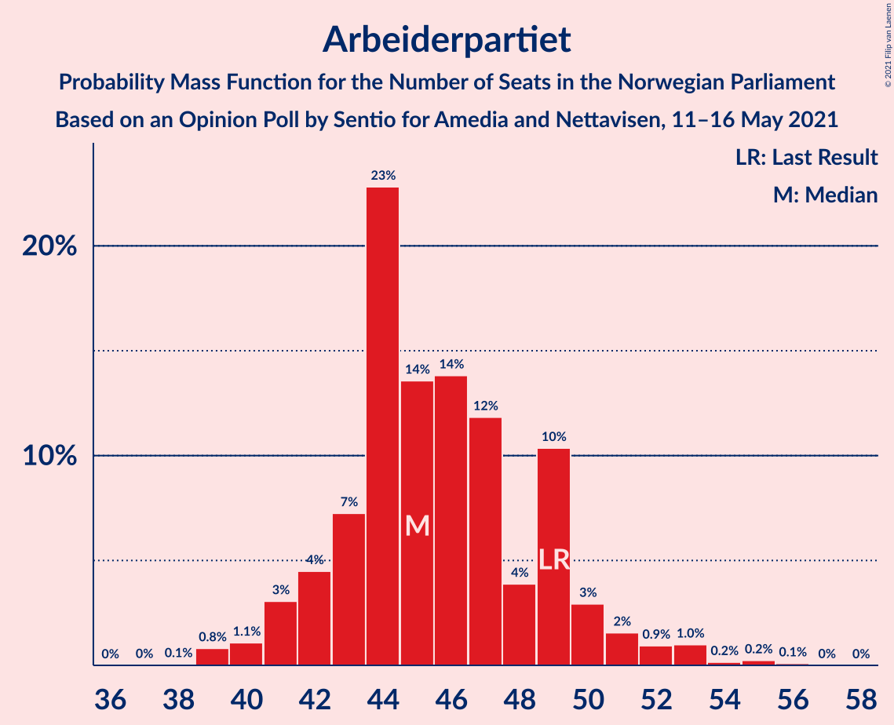
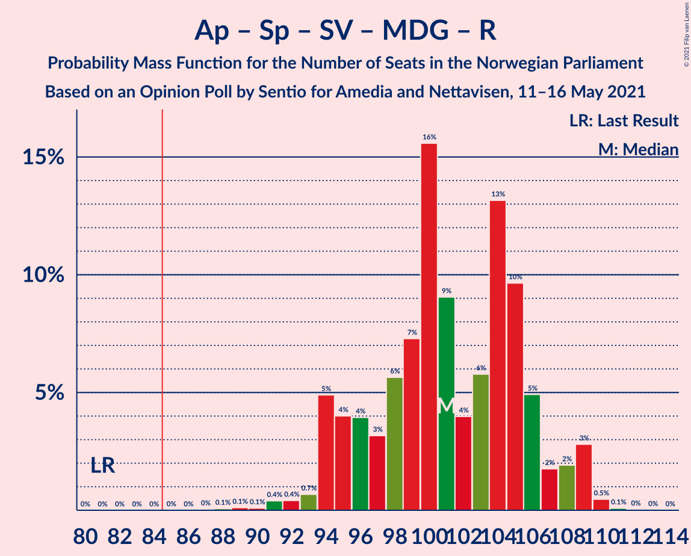
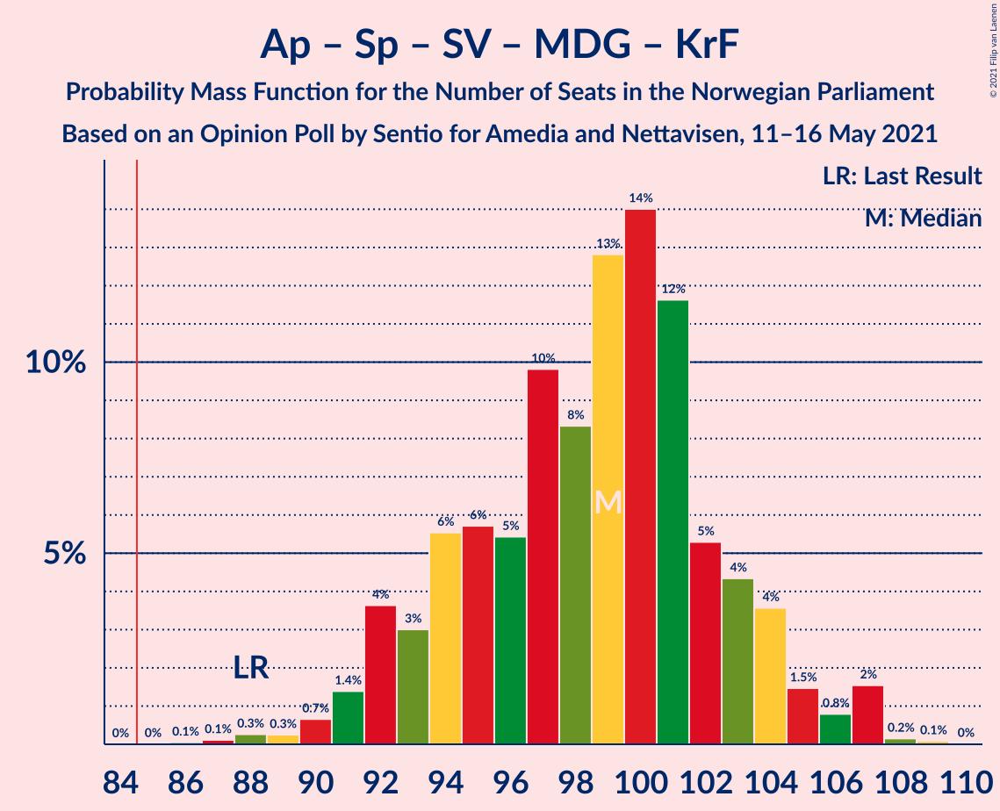
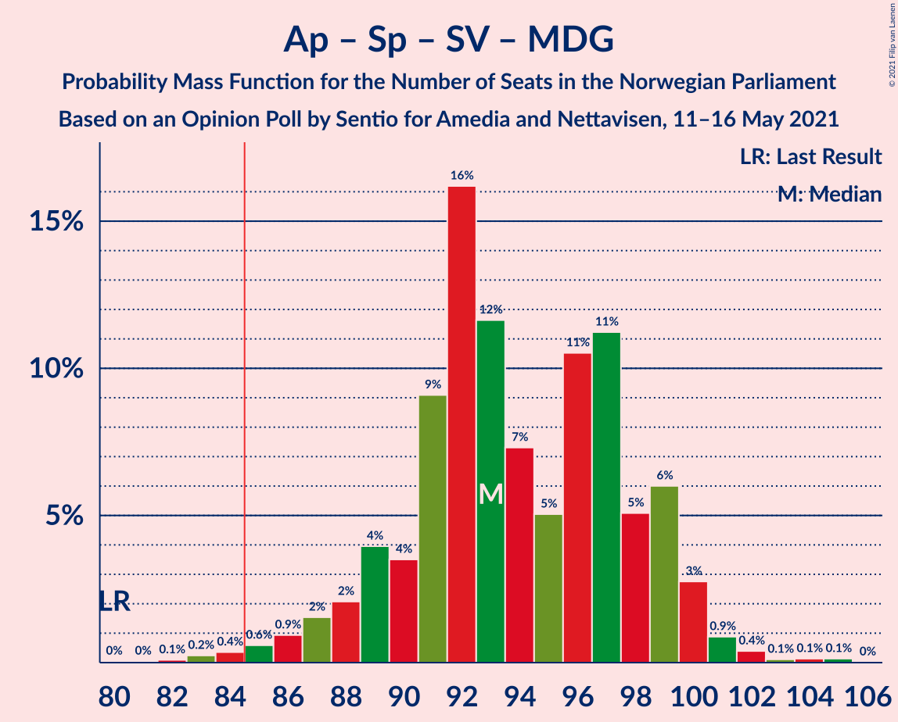
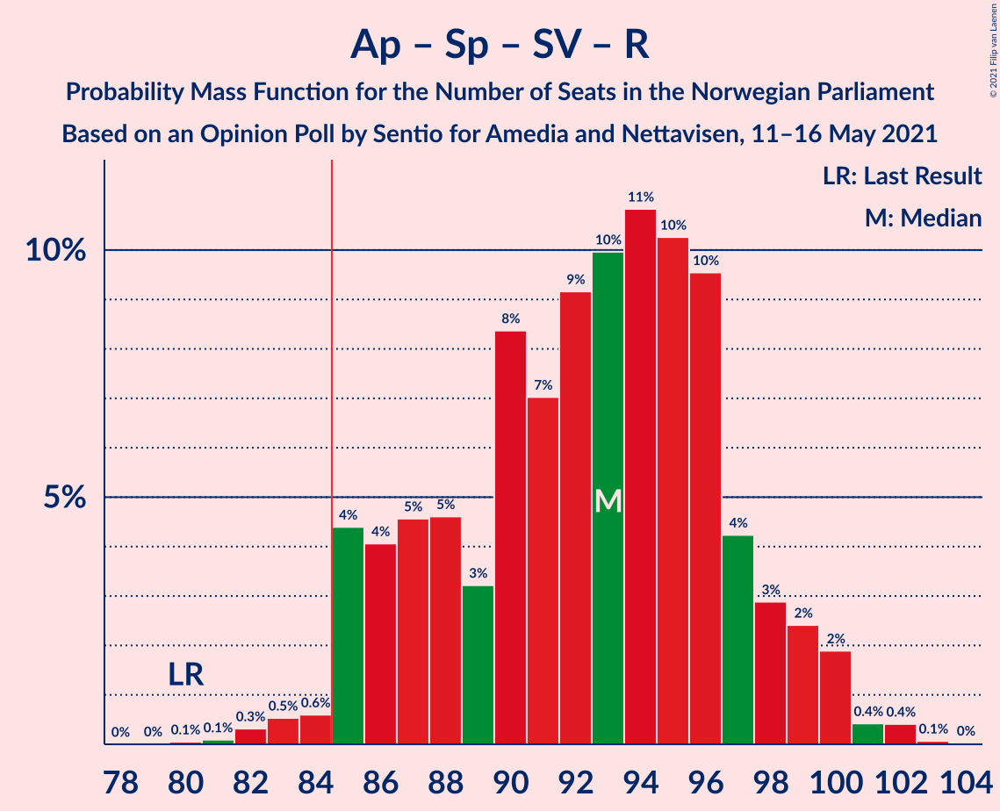
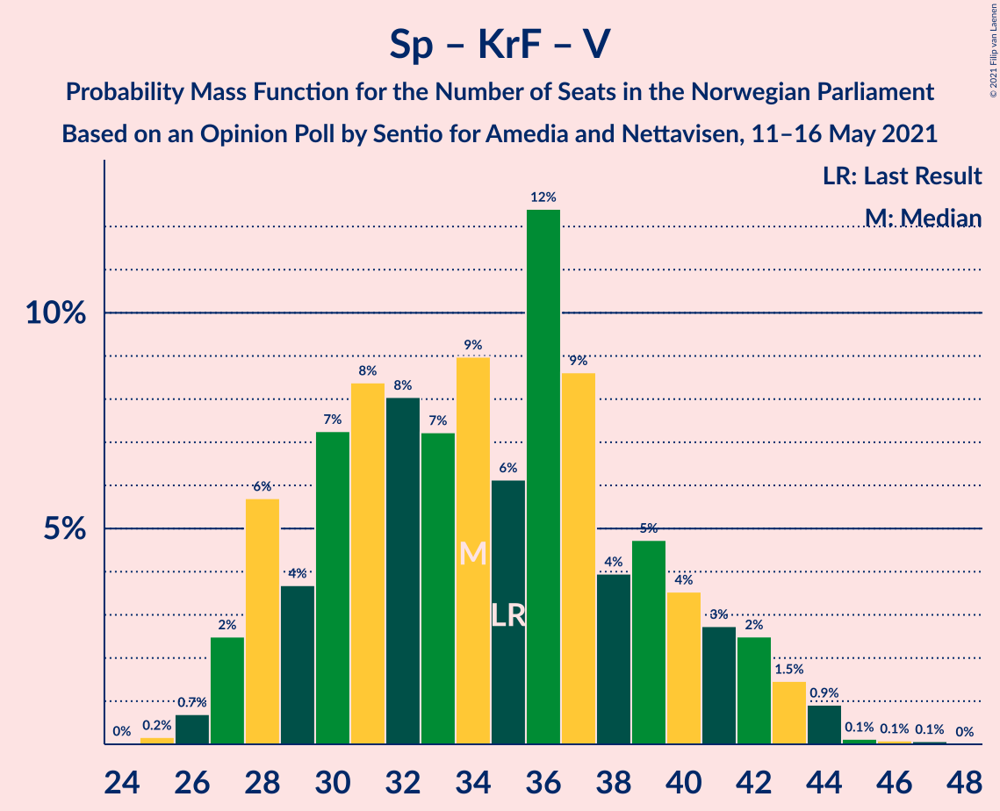

# Opinion Poll by Sentio for Amedia and Nettavisen, 11–16 May 2021

<a href="#voting-intentions">Voting Intentions</a> | <a href="#seats">Seats</a> | <a href="#coalitions">Coalitions</a> | <a href="#technical-information">Technical Information</a>

## Voting Intentions

### Confidence Intervals

| Party | Last Result | Poll Result | 80% Confidence Interval | 90% Confidence Interval | 95% Confidence Interval | 99% Confidence Interval |
|:-----:|:-----------:|:-----------:|:-----------------------:|:-----------------------:|:-----------------------:|:-----------------------:|
| Arbeiderpartiet | 27.4% | 25.3% | 23.6–27.1% |23.1–27.6% |22.7–28.1% |21.9–29.0% |
| Høyre | 25.0% | 22.1% | 20.5–23.9% |20.0–24.4% |19.6–24.8% |18.9–25.6% |
| Senterpartiet | 10.3% | 14.6% | 13.2–16.1% |12.9–16.6% |12.5–16.9% |11.9–17.7% |
| Fremskrittspartiet | 15.2% | 12.0% | 10.8–13.4% |10.4–13.8% |10.1–14.2% |9.6–14.9% |
| Sosialistisk Venstreparti | 6.0% | 7.3% | 6.3–8.5% |6.1–8.8% |5.8–9.1% |5.4–9.7% |
| Miljøpartiet De Grønne | 3.2% | 5.1% | 4.3–6.1% |4.1–6.4% |3.9–6.6% |3.6–7.2% |
| Rødt | 2.4% | 4.6% | 3.9–5.6% |3.6–5.9% |3.5–6.1% |3.1–6.6% |
| Kristelig Folkeparti | 4.2% | 3.8% | 3.1–4.7% |2.9–5.0% |2.8–5.2% |2.5–5.6% |
| Venstre | 4.4% | 3.4% | 2.8–4.3% |2.6–4.5% |2.4–4.7% |2.2–5.2% |

*Note:* The poll result column reflects the actual value used in the calculations. Published results may vary slightly, and in addition be rounded to fewer digits.

## Seats

### Confidence Intervals

| Party | Last Result | Median | 80% Confidence Interval | 90% Confidence Interval | 95% Confidence Interval | 99% Confidence Interval |
|:-----:|:-----------:|:------:|:-----------------------:|:-----------------------:|:-----------------------:|:-----------------------:|
| <a href="#arbeiderpartiet">Arbeiderpartiet</a> | 49 | 44 | 42–49 |41–53 |40–53 |39–53 |
| <a href="#høyre">Høyre</a> | 45 | 39 | 35–42 |35–43 |34–44 |33–46 |
| <a href="#senterpartiet">Senterpartiet</a> | 19 | 27 | 22–31 |22–31 |21–31 |20–34 |
| <a href="#fremskrittspartiet">Fremskrittspartiet</a> | 27 | 21 | 18–24 |17–25 |17–25 |16–27 |
| <a href="#sosialistisk-venstreparti">Sosialistisk Venstreparti</a> | 11 | 13 | 10–16 |10–17 |10–17 |9–18 |
| <a href="#miljøpartiet-de-grønne">Miljøpartiet De Grønne</a> | 1 | 9 | 7–11 |7–12 |3–12 |2–13 |
| <a href="#rødt">Rødt</a> | 1 | 8 | 2–10 |2–10 |2–11 |2–12 |
| <a href="#kristelig-folkeparti">Kristelig Folkeparti</a> | 8 | 3 | 1–8 |1–9 |1–9 |1–9 |
| <a href="#venstre">Venstre</a> | 8 | 2 | 2–7 |2–8 |1–8 |1–9 |

### Arbeiderpartiet

*For a full overview of the results for this party, see the [Arbeiderpartiet](party-arbeiderpartiet.html) page.*

| Number of Seats | Probability | Accumulated | Special Marks |
|:---------------:|:-----------:|:-----------:|:-------------:|
| 38 | 0.1% | 100% |  |
| 39 | 2% | 99.9% |  |
| 40 | 1.1% | 98% |  |
| 41 | 3% | 97% |  |
| 42 | 4% | 94% |  |
| 43 | 19% | 90% |  |
| 44 | 21% | 70% | Median |
| 45 | 23% | 49% |  |
| 46 | 8% | 26% |  |
| 47 | 5% | 18% |  |
| 48 | 1.4% | 13% |  |
| 49 | 2% | 11% | Last Result |
| 50 | 3% | 10% |  |
| 51 | 0.9% | 7% |  |
| 52 | 0.6% | 6% |  |
| 53 | 5% | 5% |  |
| 54 | 0.2% | 0.4% |  |
| 55 | 0.1% | 0.2% |  |
| 56 | 0% | 0.1% |  |
| 57 | 0% | 0.1% |  |
| 58 | 0% | 0% |  |

### Høyre

*For a full overview of the results for this party, see the [Høyre](party-høyre.html) page.*

| Number of Seats | Probability | Accumulated | Special Marks |
|:---------------:|:-----------:|:-----------:|:-------------:|
| 32 | 0.3% | 100% |  |
| 33 | 0.6% | 99.7% |  |
| 34 | 4% | 99.1% |  |
| 35 | 11% | 96% |  |
| 36 | 10% | 85% |  |
| 37 | 17% | 74% |  |
| 38 | 4% | 57% |  |
| 39 | 15% | 52% | Median |
| 40 | 9% | 38% |  |
| 41 | 9% | 29% |  |
| 42 | 13% | 20% |  |
| 43 | 3% | 7% |  |
| 44 | 2% | 4% |  |
| 45 | 1.1% | 2% | Last Result |
| 46 | 0.2% | 0.5% |  |
| 47 | 0.2% | 0.3% |  |
| 48 | 0.1% | 0.1% |  |
| 49 | 0% | 0% |  |

### Senterpartiet

*For a full overview of the results for this party, see the [Senterpartiet](party-senterpartiet.html) page.*

| Number of Seats | Probability | Accumulated | Special Marks |
|:---------------:|:-----------:|:-----------:|:-------------:|
| 19 | 0.2% | 100% | Last Result |
| 20 | 1.1% | 99.8% |  |
| 21 | 2% | 98.7% |  |
| 22 | 7% | 96% |  |
| 23 | 1.5% | 90% |  |
| 24 | 3% | 89% |  |
| 25 | 3% | 86% |  |
| 26 | 14% | 82% |  |
| 27 | 18% | 68% | Median |
| 28 | 17% | 50% |  |
| 29 | 7% | 33% |  |
| 30 | 4% | 25% |  |
| 31 | 19% | 21% |  |
| 32 | 0.8% | 2% |  |
| 33 | 0.4% | 2% |  |
| 34 | 1.1% | 1.3% |  |
| 35 | 0.1% | 0.1% |  |
| 36 | 0% | 0% |  |

### Fremskrittspartiet

*For a full overview of the results for this party, see the [Fremskrittspartiet](party-fremskrittspartiet.html) page.*

| Number of Seats | Probability | Accumulated | Special Marks |
|:---------------:|:-----------:|:-----------:|:-------------:|
| 15 | 0.2% | 100% |  |
| 16 | 0.6% | 99.8% |  |
| 17 | 4% | 99.2% |  |
| 18 | 10% | 95% |  |
| 19 | 9% | 85% |  |
| 20 | 22% | 76% |  |
| 21 | 21% | 54% | Median |
| 22 | 6% | 33% |  |
| 23 | 14% | 27% |  |
| 24 | 5% | 13% |  |
| 25 | 6% | 8% |  |
| 26 | 0.6% | 1.2% |  |
| 27 | 0.4% | 0.6% | Last Result |
| 28 | 0.2% | 0.2% |  |
| 29 | 0% | 0% |  |

### Sosialistisk Venstreparti

*For a full overview of the results for this party, see the [Sosialistisk Venstreparti](party-sosialistiskvenstreparti.html) page.*

| Number of Seats | Probability | Accumulated | Special Marks |
|:---------------:|:-----------:|:-----------:|:-------------:|
| 8 | 0.1% | 100% |  |
| 9 | 1.2% | 99.9% |  |
| 10 | 9% | 98.7% |  |
| 11 | 8% | 90% | Last Result |
| 12 | 19% | 82% |  |
| 13 | 20% | 62% | Median |
| 14 | 12% | 42% |  |
| 15 | 18% | 30% |  |
| 16 | 6% | 12% |  |
| 17 | 5% | 6% |  |
| 18 | 0.6% | 0.6% |  |
| 19 | 0.1% | 0.1% |  |
| 20 | 0% | 0% |  |

### Miljøpartiet De Grønne

*For a full overview of the results for this party, see the [Miljøpartiet De Grønne](party-miljøpartietdegrønne.html) page.*

| Number of Seats | Probability | Accumulated | Special Marks |
|:---------------:|:-----------:|:-----------:|:-------------:|
| 1 | 0% | 100% | Last Result |
| 2 | 2% | 100% |  |
| 3 | 1.2% | 98% |  |
| 4 | 0% | 97% |  |
| 5 | 0% | 97% |  |
| 6 | 0% | 97% |  |
| 7 | 9% | 97% |  |
| 8 | 33% | 88% |  |
| 9 | 27% | 55% | Median |
| 10 | 17% | 28% |  |
| 11 | 6% | 11% |  |
| 12 | 4% | 5% |  |
| 13 | 0.8% | 1.0% |  |
| 14 | 0.1% | 0.1% |  |
| 15 | 0% | 0% |  |

### Rødt

*For a full overview of the results for this party, see the [Rødt](party-rødt.html) page.*

| Number of Seats | Probability | Accumulated | Special Marks |
|:---------------:|:-----------:|:-----------:|:-------------:|
| 1 | 0.2% | 100% | Last Result |
| 2 | 14% | 99.8% |  |
| 3 | 0% | 86% |  |
| 4 | 0% | 86% |  |
| 5 | 0% | 86% |  |
| 6 | 0% | 86% |  |
| 7 | 18% | 86% |  |
| 8 | 36% | 68% | Median |
| 9 | 21% | 32% |  |
| 10 | 8% | 12% |  |
| 11 | 3% | 4% |  |
| 12 | 0.9% | 0.9% |  |
| 13 | 0% | 0.1% |  |
| 14 | 0% | 0% |  |

### Kristelig Folkeparti

*For a full overview of the results for this party, see the [Kristelig Folkeparti](party-kristeligfolkeparti.html) page.*

| Number of Seats | Probability | Accumulated | Special Marks |
|:---------------:|:-----------:|:-----------:|:-------------:|
| 0 | 0.1% | 100% |  |
| 1 | 26% | 99.9% |  |
| 2 | 2% | 74% |  |
| 3 | 30% | 73% | Median |
| 4 | 0% | 42% |  |
| 5 | 0% | 42% |  |
| 6 | 0.2% | 42% |  |
| 7 | 23% | 42% |  |
| 8 | 10% | 19% | Last Result |
| 9 | 9% | 10% |  |
| 10 | 0.3% | 0.4% |  |
| 11 | 0.1% | 0.1% |  |
| 12 | 0% | 0% |  |

### Venstre

*For a full overview of the results for this party, see the [Venstre](party-venstre.html) page.*

| Number of Seats | Probability | Accumulated | Special Marks |
|:---------------:|:-----------:|:-----------:|:-------------:|
| 1 | 3% | 100% |  |
| 2 | 73% | 97% | Median |
| 3 | 0.7% | 25% |  |
| 4 | 0% | 24% |  |
| 5 | 0% | 24% |  |
| 6 | 4% | 24% |  |
| 7 | 13% | 20% |  |
| 8 | 6% | 7% | Last Result |
| 9 | 0.8% | 1.3% |  |
| 10 | 0.4% | 0.4% |  |
| 11 | 0% | 0% |  |

## Coalitions

### Confidence Intervals

| Coalition | Last Result | Median | Majority? | 80% Confidence Interval | 90% Confidence Interval | 95% Confidence Interval | 99% Confidence Interval |
|:---------:|:-----------:|:------:|:---------:|:-----------------------:|:-----------------------:|:-----------------------:|:-----------------------:|
| Arbeiderpartiet – Senterpartiet – Sosialistisk Venstreparti – Miljøpartiet De Grønne – Rødt | 81 | 100 | 100% | 96–109 | 95–109 | 94–109 | 92–109 |
| Arbeiderpartiet – Senterpartiet – Sosialistisk Venstreparti – Miljøpartiet De Grønne – Kristelig Folkeparti | 88 | 99 | 100% | 94–104 | 93–104 | 92–106 | 90–108 |
| Høyre – Senterpartiet – Fremskrittspartiet – Kristelig Folkeparti – Venstre | 107 | 95 | 99.8% | 91–100 | 88–101 | 87–102 | 86–104 |
| Arbeiderpartiet – Senterpartiet – Sosialistisk Venstreparti – Miljøpartiet De Grønne | 80 | 94 | 99.6% | 90–100 | 88–100 | 86–100 | 85–103 |
| Arbeiderpartiet – Senterpartiet – Sosialistisk Venstreparti – Rødt | 80 | 92 | 98% | 86–100 | 85–100 | 85–100 | 82–101 |
| Arbeiderpartiet – Senterpartiet – Miljøpartiet De Grønne – Kristelig Folkeparti | 77 | 86 | 66% | 81–91 | 80–92 | 78–93 | 77–95 |
| Arbeiderpartiet – Senterpartiet – Sosialistisk Venstreparti | 79 | 85 | 51% | 82–91 | 80–91 | 78–91 | 77–94 |
| Arbeiderpartiet – Senterpartiet – Kristelig Folkeparti | 76 | 77 | 5% | 72–82 | 72–84 | 70–85 | 68–87 |
| Høyre – Fremskrittspartiet – Miljøpartiet De Grønne – Kristelig Folkeparti – Venstre | 89 | 77 | 2% | 69–83 | 69–84 | 69–84 | 68–87 |
| Arbeiderpartiet – Senterpartiet | 68 | 72 | 0.3% | 68–76 | 67–76 | 66–78 | 64–80 |
| Høyre – Fremskrittspartiet – Kristelig Folkeparti – Venstre | 88 | 69 | 0% | 60–73 | 60–74 | 60–75 | 60–77 |
| Høyre – Fremskrittspartiet – Venstre | 80 | 62 | 0% | 58–67 | 57–68 | 56–70 | 55–73 |
| Høyre – Fremskrittspartiet | 72 | 59 | 0% | 55–65 | 54–65 | 54–66 | 52–69 |
| Arbeiderpartiet – Sosialistisk Venstreparti | 60 | 58 | 0% | 55–62 | 53–63 | 52–65 | 49–66 |
| Høyre – Kristelig Folkeparti – Venstre | 61 | 46 | 0% | 40–51 | 40–53 | 40–53 | 38–57 |
| Senterpartiet – Kristelig Folkeparti – Venstre | 35 | 34 | 0% | 31–42 | 28–42 | 27–44 | 26–44 |

### Arbeiderpartiet – Senterpartiet – Sosialistisk Venstreparti – Miljøpartiet De Grønne – Rødt

| Number of Seats | Probability | Accumulated | Special Marks |
|:---------------:|:-----------:|:-----------:|:-------------:|
| 81 | 0% | 100% | Last Result |
| 82 | 0% | 100% |  |
| 83 | 0% | 100% |  |
| 84 | 0% | 100% |  |
| 85 | 0% | 100% | Majority |
| 86 | 0% | 100% |  |
| 87 | 0% | 100% |  |
| 88 | 0% | 100% |  |
| 89 | 0.1% | 100% |  |
| 90 | 0.1% | 99.9% |  |
| 91 | 0.2% | 99.8% |  |
| 92 | 0.3% | 99.6% |  |
| 93 | 2% | 99.3% |  |
| 94 | 2% | 98% |  |
| 95 | 3% | 95% |  |
| 96 | 5% | 92% |  |
| 97 | 2% | 87% |  |
| 98 | 4% | 85% |  |
| 99 | 16% | 81% |  |
| 100 | 16% | 66% |  |
| 101 | 1.1% | 49% | Median |
| 102 | 2% | 48% |  |
| 103 | 9% | 47% |  |
| 104 | 14% | 37% |  |
| 105 | 3% | 24% |  |
| 106 | 3% | 21% |  |
| 107 | 0.6% | 18% |  |
| 108 | 6% | 18% |  |
| 109 | 11% | 11% |  |
| 110 | 0.3% | 0.5% |  |
| 111 | 0% | 0.2% |  |
| 112 | 0.1% | 0.2% |  |
| 113 | 0.1% | 0.1% |  |
| 114 | 0% | 0% |  |

### Arbeiderpartiet – Senterpartiet – Sosialistisk Venstreparti – Miljøpartiet De Grønne – Kristelig Folkeparti

| Number of Seats | Probability | Accumulated | Special Marks |
|:---------------:|:-----------:|:-----------:|:-------------:|
| 87 | 0% | 100% |  |
| 88 | 0.1% | 99.9% | Last Result |
| 89 | 0.4% | 99.9% |  |
| 90 | 0.3% | 99.5% |  |
| 91 | 1.4% | 99.2% |  |
| 92 | 0.5% | 98% |  |
| 93 | 3% | 97% |  |
| 94 | 10% | 94% |  |
| 95 | 8% | 84% |  |
| 96 | 6% | 76% | Median |
| 97 | 5% | 70% |  |
| 98 | 3% | 65% |  |
| 99 | 18% | 62% |  |
| 100 | 12% | 44% |  |
| 101 | 15% | 32% |  |
| 102 | 2% | 17% |  |
| 103 | 3% | 15% |  |
| 104 | 7% | 12% |  |
| 105 | 0.6% | 5% |  |
| 106 | 3% | 4% |  |
| 107 | 0.5% | 1.1% |  |
| 108 | 0.4% | 0.6% |  |
| 109 | 0.2% | 0.2% |  |
| 110 | 0% | 0% |  |

### Høyre – Senterpartiet – Fremskrittspartiet – Kristelig Folkeparti – Venstre

| Number of Seats | Probability | Accumulated | Special Marks |
|:---------------:|:-----------:|:-----------:|:-------------:|
| 82 | 0.1% | 100% |  |
| 83 | 0% | 99.9% |  |
| 84 | 0% | 99.9% |  |
| 85 | 0.3% | 99.8% | Majority |
| 86 | 0.9% | 99.6% |  |
| 87 | 3% | 98.7% |  |
| 88 | 1.4% | 96% |  |
| 89 | 0.6% | 95% |  |
| 90 | 4% | 94% |  |
| 91 | 18% | 90% |  |
| 92 | 11% | 72% | Median |
| 93 | 5% | 61% |  |
| 94 | 4% | 57% |  |
| 95 | 6% | 53% |  |
| 96 | 10% | 47% |  |
| 97 | 16% | 37% |  |
| 98 | 4% | 21% |  |
| 99 | 5% | 17% |  |
| 100 | 3% | 12% |  |
| 101 | 6% | 9% |  |
| 102 | 2% | 3% |  |
| 103 | 0.7% | 1.4% |  |
| 104 | 0.3% | 0.7% |  |
| 105 | 0.1% | 0.4% |  |
| 106 | 0.2% | 0.3% |  |
| 107 | 0% | 0.1% | Last Result |
| 108 | 0% | 0% |  |

### Arbeiderpartiet – Senterpartiet – Sosialistisk Venstreparti – Miljøpartiet De Grønne

| Number of Seats | Probability | Accumulated | Special Marks |
|:---------------:|:-----------:|:-----------:|:-------------:|
| 80 | 0% | 100% | Last Result |
| 81 | 0% | 100% |  |
| 82 | 0.1% | 100% |  |
| 83 | 0.1% | 99.9% |  |
| 84 | 0.2% | 99.8% |  |
| 85 | 0.6% | 99.6% | Majority |
| 86 | 2% | 99.0% |  |
| 87 | 1.4% | 97% |  |
| 88 | 5% | 96% |  |
| 89 | 0.5% | 91% |  |
| 90 | 3% | 91% |  |
| 91 | 10% | 88% |  |
| 92 | 22% | 78% |  |
| 93 | 3% | 56% | Median |
| 94 | 8% | 53% |  |
| 95 | 7% | 46% |  |
| 96 | 3% | 38% |  |
| 97 | 11% | 35% |  |
| 98 | 4% | 24% |  |
| 99 | 6% | 20% |  |
| 100 | 11% | 14% |  |
| 101 | 1.4% | 2% |  |
| 102 | 0.4% | 1.1% |  |
| 103 | 0.3% | 0.7% |  |
| 104 | 0.2% | 0.5% |  |
| 105 | 0.2% | 0.3% |  |
| 106 | 0% | 0% |  |

### Arbeiderpartiet – Senterpartiet – Sosialistisk Venstreparti – Rødt

| Number of Seats | Probability | Accumulated | Special Marks |
|:---------------:|:-----------:|:-----------:|:-------------:|
| 80 | 0% | 100% | Last Result |
| 81 | 0% | 100% |  |
| 82 | 1.1% | 99.9% |  |
| 83 | 0.1% | 98.9% |  |
| 84 | 1.1% | 98.8% |  |
| 85 | 3% | 98% | Majority |
| 86 | 5% | 95% |  |
| 87 | 3% | 90% |  |
| 88 | 1.2% | 87% |  |
| 89 | 1.5% | 85% |  |
| 90 | 2% | 84% |  |
| 91 | 13% | 82% |  |
| 92 | 24% | 69% | Median |
| 93 | 4% | 45% |  |
| 94 | 7% | 41% |  |
| 95 | 6% | 34% |  |
| 96 | 9% | 29% |  |
| 97 | 1.3% | 20% |  |
| 98 | 0.9% | 18% |  |
| 99 | 5% | 18% |  |
| 100 | 11% | 12% |  |
| 101 | 0.5% | 0.8% |  |
| 102 | 0.1% | 0.3% |  |
| 103 | 0.2% | 0.2% |  |
| 104 | 0% | 0% |  |

### Arbeiderpartiet – Senterpartiet – Miljøpartiet De Grønne – Kristelig Folkeparti

| Number of Seats | Probability | Accumulated | Special Marks |
|:---------------:|:-----------:|:-----------:|:-------------:|
| 74 | 0.1% | 100% |  |
| 75 | 0.2% | 99.9% |  |
| 76 | 0.2% | 99.8% |  |
| 77 | 0.9% | 99.6% | Last Result |
| 78 | 1.4% | 98.7% |  |
| 79 | 0.5% | 97% |  |
| 80 | 2% | 97% |  |
| 81 | 15% | 95% |  |
| 82 | 3% | 80% |  |
| 83 | 5% | 77% | Median |
| 84 | 6% | 72% |  |
| 85 | 10% | 66% | Majority |
| 86 | 20% | 56% |  |
| 87 | 14% | 36% |  |
| 88 | 4% | 22% |  |
| 89 | 6% | 18% |  |
| 90 | 2% | 13% |  |
| 91 | 4% | 10% |  |
| 92 | 2% | 7% |  |
| 93 | 3% | 5% |  |
| 94 | 0.4% | 2% |  |
| 95 | 0.8% | 1.2% |  |
| 96 | 0.2% | 0.4% |  |
| 97 | 0.2% | 0.2% |  |
| 98 | 0% | 0% |  |

### Arbeiderpartiet – Senterpartiet – Sosialistisk Venstreparti

| Number of Seats | Probability | Accumulated | Special Marks |
|:---------------:|:-----------:|:-----------:|:-------------:|
| 74 | 0% | 100% |  |
| 75 | 0.1% | 99.9% |  |
| 76 | 0.2% | 99.8% |  |
| 77 | 1.3% | 99.6% |  |
| 78 | 2% | 98% |  |
| 79 | 0.8% | 96% | Last Result |
| 80 | 2% | 95% |  |
| 81 | 3% | 94% |  |
| 82 | 4% | 90% |  |
| 83 | 12% | 87% |  |
| 84 | 23% | 74% | Median |
| 85 | 9% | 51% | Majority |
| 86 | 5% | 42% |  |
| 87 | 7% | 37% |  |
| 88 | 6% | 30% |  |
| 89 | 4% | 24% |  |
| 90 | 6% | 20% |  |
| 91 | 12% | 14% |  |
| 92 | 2% | 2% |  |
| 93 | 0.1% | 0.8% |  |
| 94 | 0.2% | 0.6% |  |
| 95 | 0.1% | 0.5% |  |
| 96 | 0.1% | 0.4% |  |
| 97 | 0% | 0.3% |  |
| 98 | 0% | 0.3% |  |
| 99 | 0.2% | 0.2% |  |
| 100 | 0% | 0% |  |

### Arbeiderpartiet – Senterpartiet – Kristelig Folkeparti

| Number of Seats | Probability | Accumulated | Special Marks |
|:---------------:|:-----------:|:-----------:|:-------------:|
| 66 | 0.1% | 100% |  |
| 67 | 0.2% | 99.8% |  |
| 68 | 0.9% | 99.6% |  |
| 69 | 0.3% | 98.7% |  |
| 70 | 2% | 98% |  |
| 71 | 0.7% | 97% |  |
| 72 | 7% | 96% |  |
| 73 | 16% | 89% |  |
| 74 | 2% | 73% | Median |
| 75 | 6% | 71% |  |
| 76 | 6% | 65% | Last Result |
| 77 | 24% | 59% |  |
| 78 | 5% | 35% |  |
| 79 | 10% | 30% |  |
| 80 | 3% | 20% |  |
| 81 | 5% | 17% |  |
| 82 | 5% | 11% |  |
| 83 | 0.3% | 7% |  |
| 84 | 2% | 6% |  |
| 85 | 3% | 5% | Majority |
| 86 | 1.1% | 2% |  |
| 87 | 0.5% | 1.0% |  |
| 88 | 0.2% | 0.5% |  |
| 89 | 0.2% | 0.2% |  |
| 90 | 0% | 0% |  |

### Høyre – Fremskrittspartiet – Miljøpartiet De Grønne – Kristelig Folkeparti – Venstre

| Number of Seats | Probability | Accumulated | Special Marks |
|:---------------:|:-----------:|:-----------:|:-------------:|
| 66 | 0.2% | 100% |  |
| 67 | 0.1% | 99.8% |  |
| 68 | 0.5% | 99.7% |  |
| 69 | 11% | 99.2% |  |
| 70 | 5% | 88% |  |
| 71 | 0.9% | 82% |  |
| 72 | 1.3% | 82% |  |
| 73 | 9% | 80% |  |
| 74 | 6% | 71% | Median |
| 75 | 7% | 66% |  |
| 76 | 4% | 59% |  |
| 77 | 24% | 55% |  |
| 78 | 13% | 31% |  |
| 79 | 2% | 18% |  |
| 80 | 1.5% | 16% |  |
| 81 | 1.2% | 15% |  |
| 82 | 3% | 13% |  |
| 83 | 5% | 10% |  |
| 84 | 3% | 5% |  |
| 85 | 1.1% | 2% | Majority |
| 86 | 0.1% | 1.2% |  |
| 87 | 1.1% | 1.1% |  |
| 88 | 0% | 0.1% |  |
| 89 | 0% | 0% | Last Result |

### Arbeiderpartiet – Senterpartiet

| Number of Seats | Probability | Accumulated | Special Marks |
|:---------------:|:-----------:|:-----------:|:-------------:|
| 61 | 0.1% | 100% |  |
| 62 | 0% | 99.9% |  |
| 63 | 0.1% | 99.9% |  |
| 64 | 0.4% | 99.8% |  |
| 65 | 0.5% | 99.5% |  |
| 66 | 2% | 98.9% |  |
| 67 | 4% | 97% |  |
| 68 | 4% | 93% | Last Result |
| 69 | 3% | 89% |  |
| 70 | 20% | 86% |  |
| 71 | 8% | 66% | Median |
| 72 | 14% | 58% |  |
| 73 | 8% | 44% |  |
| 74 | 2% | 36% |  |
| 75 | 11% | 34% |  |
| 76 | 19% | 23% |  |
| 77 | 0.7% | 4% |  |
| 78 | 2% | 3% |  |
| 79 | 0.7% | 2% |  |
| 80 | 0.5% | 0.9% |  |
| 81 | 0% | 0.4% |  |
| 82 | 0% | 0.4% |  |
| 83 | 0.1% | 0.3% |  |
| 84 | 0% | 0.3% |  |
| 85 | 0.1% | 0.3% | Majority |
| 86 | 0% | 0.2% |  |
| 87 | 0.2% | 0.2% |  |
| 88 | 0% | 0% |  |

### Høyre – Fremskrittspartiet – Kristelig Folkeparti – Venstre

| Number of Seats | Probability | Accumulated | Special Marks |
|:---------------:|:-----------:|:-----------:|:-------------:|
| 56 | 0.1% | 100% |  |
| 57 | 0.1% | 99.9% |  |
| 58 | 0% | 99.8% |  |
| 59 | 0.3% | 99.8% |  |
| 60 | 11% | 99.5% |  |
| 61 | 6% | 89% |  |
| 62 | 0.6% | 82% |  |
| 63 | 3% | 82% |  |
| 64 | 3% | 79% |  |
| 65 | 14% | 76% | Median |
| 66 | 9% | 63% |  |
| 67 | 2% | 53% |  |
| 68 | 1.1% | 52% |  |
| 69 | 16% | 51% |  |
| 70 | 16% | 34% |  |
| 71 | 4% | 19% |  |
| 72 | 2% | 15% |  |
| 73 | 5% | 13% |  |
| 74 | 3% | 8% |  |
| 75 | 2% | 5% |  |
| 76 | 2% | 2% |  |
| 77 | 0.3% | 0.7% |  |
| 78 | 0.2% | 0.4% |  |
| 79 | 0.1% | 0.2% |  |
| 80 | 0.1% | 0.1% |  |
| 81 | 0% | 0% |  |
| 82 | 0% | 0% |  |
| 83 | 0% | 0% |  |
| 84 | 0% | 0% |  |
| 85 | 0% | 0% | Majority |
| 86 | 0% | 0% |  |
| 87 | 0% | 0% |  |
| 88 | 0% | 0% | Last Result |

### Høyre – Fremskrittspartiet – Venstre

| Number of Seats | Probability | Accumulated | Special Marks |
|:---------------:|:-----------:|:-----------:|:-------------:|
| 53 | 0.3% | 100% |  |
| 54 | 0% | 99.7% |  |
| 55 | 0.3% | 99.6% |  |
| 56 | 2% | 99.3% |  |
| 57 | 2% | 97% |  |
| 58 | 4% | 94% |  |
| 59 | 12% | 90% |  |
| 60 | 9% | 78% |  |
| 61 | 4% | 69% |  |
| 62 | 16% | 65% | Median |
| 63 | 11% | 49% |  |
| 64 | 5% | 38% |  |
| 65 | 5% | 33% |  |
| 66 | 7% | 28% |  |
| 67 | 14% | 21% |  |
| 68 | 3% | 7% |  |
| 69 | 1.1% | 4% |  |
| 70 | 1.2% | 3% |  |
| 71 | 0.4% | 1.3% |  |
| 72 | 0.4% | 0.9% |  |
| 73 | 0.1% | 0.5% |  |
| 74 | 0% | 0.4% |  |
| 75 | 0.1% | 0.4% |  |
| 76 | 0.2% | 0.2% |  |
| 77 | 0% | 0% |  |
| 78 | 0% | 0% |  |
| 79 | 0% | 0% |  |
| 80 | 0% | 0% | Last Result |

### Høyre – Fremskrittspartiet

| Number of Seats | Probability | Accumulated | Special Marks |
|:---------------:|:-----------:|:-----------:|:-------------:|
| 50 | 0% | 100% |  |
| 51 | 0.3% | 99.9% |  |
| 52 | 0.8% | 99.6% |  |
| 53 | 0.5% | 98.9% |  |
| 54 | 5% | 98% |  |
| 55 | 11% | 93% |  |
| 56 | 5% | 82% |  |
| 57 | 15% | 78% |  |
| 58 | 10% | 62% |  |
| 59 | 4% | 53% |  |
| 60 | 9% | 48% | Median |
| 61 | 7% | 40% |  |
| 62 | 6% | 33% |  |
| 63 | 6% | 27% |  |
| 64 | 6% | 21% |  |
| 65 | 12% | 15% |  |
| 66 | 2% | 3% |  |
| 67 | 0.6% | 2% |  |
| 68 | 0.4% | 1.0% |  |
| 69 | 0.3% | 0.6% |  |
| 70 | 0.2% | 0.3% |  |
| 71 | 0% | 0.1% |  |
| 72 | 0% | 0% | Last Result |

### Arbeiderpartiet – Sosialistisk Venstreparti

| Number of Seats | Probability | Accumulated | Special Marks |
|:---------------:|:-----------:|:-----------:|:-------------:|
| 49 | 0.6% | 100% |  |
| 50 | 0.8% | 99.3% |  |
| 51 | 0.4% | 98.6% |  |
| 52 | 2% | 98% |  |
| 53 | 4% | 96% |  |
| 54 | 2% | 93% |  |
| 55 | 8% | 91% |  |
| 56 | 23% | 83% |  |
| 57 | 5% | 59% | Median |
| 58 | 5% | 54% |  |
| 59 | 12% | 49% |  |
| 60 | 13% | 37% | Last Result |
| 61 | 9% | 24% |  |
| 62 | 5% | 15% |  |
| 63 | 5% | 10% |  |
| 64 | 2% | 4% |  |
| 65 | 1.4% | 3% |  |
| 66 | 1.0% | 1.3% |  |
| 67 | 0.1% | 0.3% |  |
| 68 | 0.1% | 0.2% |  |
| 69 | 0% | 0.1% |  |
| 70 | 0% | 0% |  |

### Høyre – Kristelig Folkeparti – Venstre

| Number of Seats | Probability | Accumulated | Special Marks |
|:---------------:|:-----------:|:-----------:|:-------------:|
| 37 | 0.1% | 100% |  |
| 38 | 0.7% | 99.9% |  |
| 39 | 0.3% | 99.2% |  |
| 40 | 12% | 98.9% |  |
| 41 | 1.4% | 87% |  |
| 42 | 3% | 86% |  |
| 43 | 6% | 83% |  |
| 44 | 10% | 77% | Median |
| 45 | 8% | 67% |  |
| 46 | 10% | 59% |  |
| 47 | 11% | 49% |  |
| 48 | 3% | 38% |  |
| 49 | 17% | 35% |  |
| 50 | 4% | 18% |  |
| 51 | 4% | 14% |  |
| 52 | 4% | 9% |  |
| 53 | 4% | 6% |  |
| 54 | 0.8% | 2% |  |
| 55 | 0.5% | 1.4% |  |
| 56 | 0.2% | 0.9% |  |
| 57 | 0.6% | 0.7% |  |
| 58 | 0% | 0.1% |  |
| 59 | 0% | 0% |  |
| 60 | 0% | 0% |  |
| 61 | 0% | 0% | Last Result |

### Senterpartiet – Kristelig Folkeparti – Venstre

| Number of Seats | Probability | Accumulated | Special Marks |
|:---------------:|:-----------:|:-----------:|:-------------:|
| 25 | 0.3% | 100% |  |
| 26 | 2% | 99.7% |  |
| 27 | 1.1% | 98% |  |
| 28 | 3% | 97% |  |
| 29 | 0.6% | 94% |  |
| 30 | 2% | 94% |  |
| 31 | 11% | 92% |  |
| 32 | 16% | 81% | Median |
| 33 | 1.0% | 65% |  |
| 34 | 17% | 64% |  |
| 35 | 12% | 47% | Last Result |
| 36 | 2% | 34% |  |
| 37 | 2% | 33% |  |
| 38 | 6% | 31% |  |
| 39 | 4% | 25% |  |
| 40 | 4% | 21% |  |
| 41 | 7% | 17% |  |
| 42 | 6% | 10% |  |
| 43 | 0.6% | 4% |  |
| 44 | 3% | 3% |  |
| 45 | 0.2% | 0.2% |  |
| 46 | 0% | 0.1% |  |
| 47 | 0% | 0% |  |

## Technical Information

### Opinion Poll

+ **Polling firm:** Sentio
+ **Commissioner(s):** Amedia and Nettavisen
+ **Fieldwork period:** 11–16 May 2021

### Calculations

+ **Sample size:** 1000
+ **Simulations done:** 131,072
+ **Error estimate:** 2.01%

