# Opinion Poll by Norstat for Dagens Næringsliv, 20–24 May 2021

<a href="#voting-intentions">Voting Intentions</a> | <a href="#seats">Seats</a> | <a href="#coalitions">Coalitions</a> | <a href="#technical-information">Technical Information</a>

## Voting Intentions

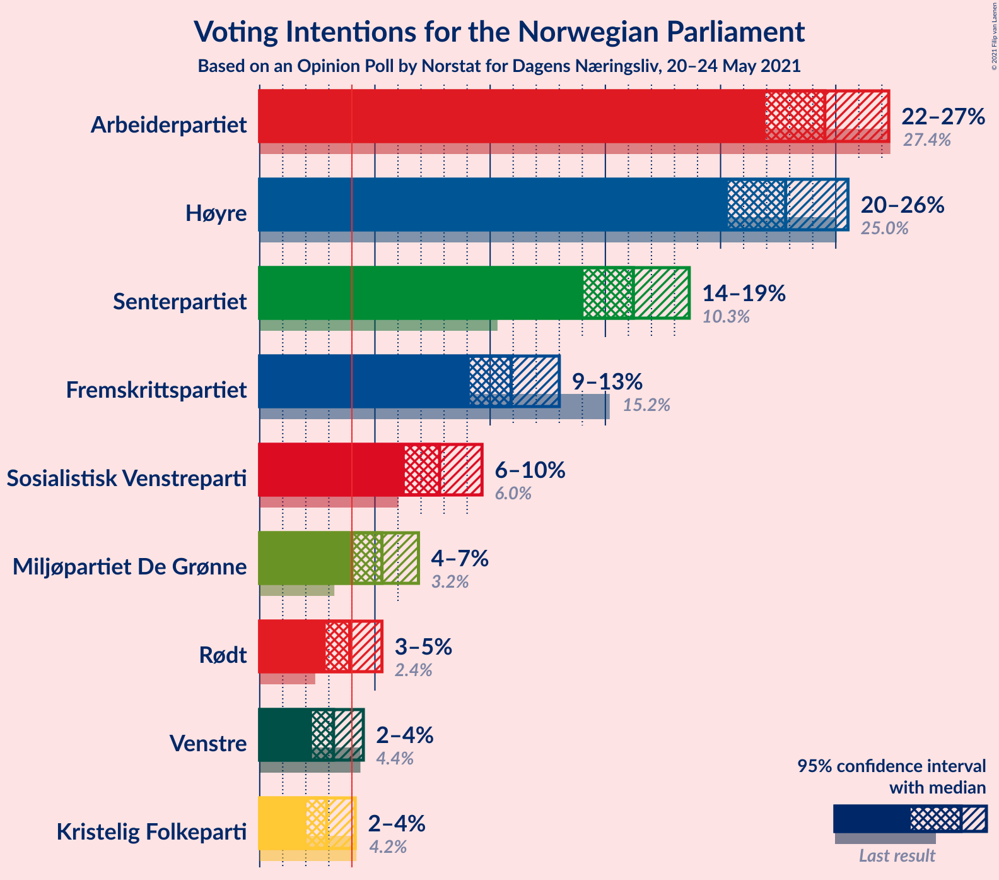

### Confidence Intervals

| Party | Last Result | Poll Result | 80% Confidence Interval | 90% Confidence Interval | 95% Confidence Interval | 99% Confidence Interval |
|:-----:|:-----------:|:-----------:|:-----------------------:|:-----------------------:|:-----------------------:|:-----------------------:|
| Arbeiderpartiet | 27.4% | 24.5% | 22.8–26.3% |22.4–26.9% |21.9–27.3% |21.2–28.2% |
| Høyre | 25.0% | 22.8% | 21.2–24.6% |20.7–25.1% |20.3–25.5% |19.6–26.4% |
| Senterpartiet | 10.3% | 16.2% | 14.8–17.8% |14.4–18.2% |14.1–18.6% |13.4–19.4% |
| Fremskrittspartiet | 15.2% | 10.9% | 9.7–12.3% |9.4–12.7% |9.1–13.0% |8.6–13.7% |
| Sosialistisk Venstreparti | 6.0% | 7.8% | 6.8–9.0% |6.5–9.3% |6.3–9.6% |5.9–10.2% |
| Miljøpartiet De Grønne | 3.2% | 5.3% | 4.5–6.3% |4.3–6.6% |4.1–6.9% |3.7–7.4% |
| Rødt | 2.4% | 3.9% | 3.2–4.8% |3.0–5.1% |2.9–5.3% |2.6–5.8% |
| Venstre | 4.4% | 3.2% | 2.6–4.0% |2.4–4.3% |2.3–4.5% |2.0–4.9% |
| Kristelig Folkeparti | 4.2% | 2.9% | 2.3–3.7% |2.2–3.9% |2.0–4.1% |1.8–4.6% |

*Note:* The poll result column reflects the actual value used in the calculations. Published results may vary slightly, and in addition be rounded to fewer digits.

## Seats

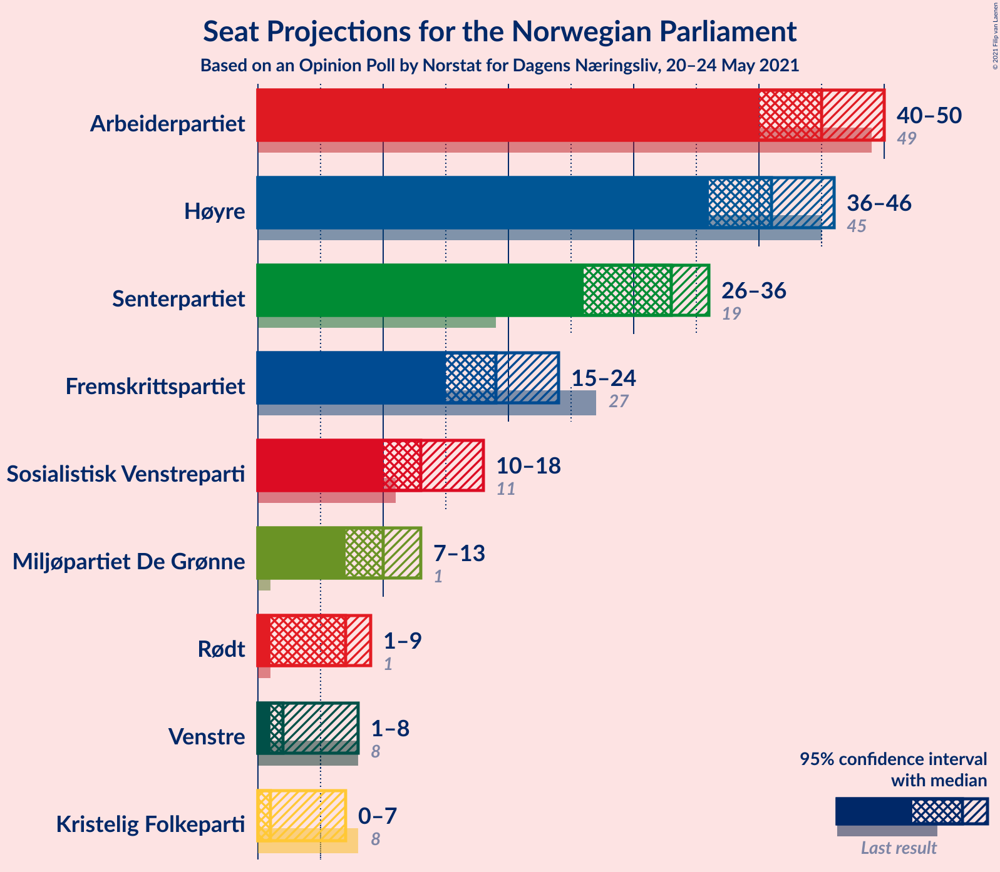

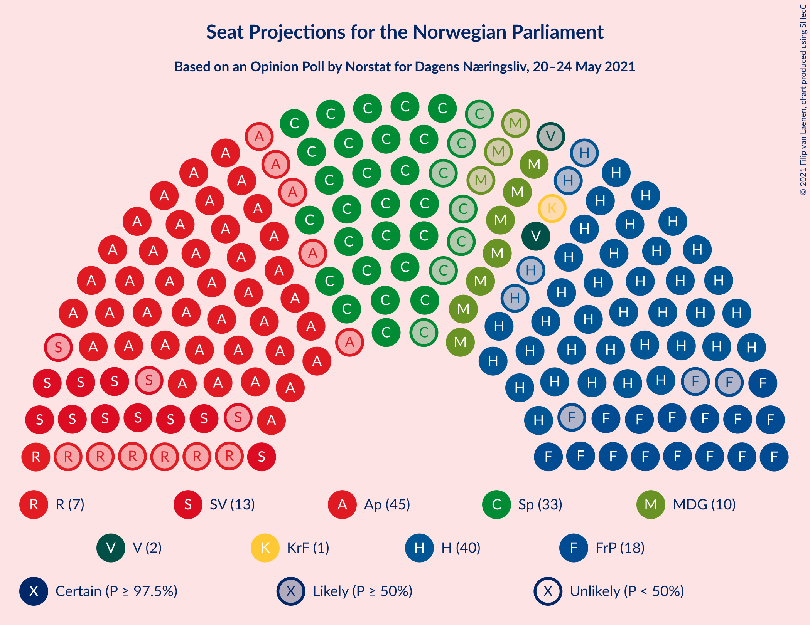

### Confidence Intervals

| Party | Last Result | Median | 80% Confidence Interval | 90% Confidence Interval | 95% Confidence Interval | 99% Confidence Interval |
|:-----:|:-----------:|:------:|:-----------------------:|:-----------------------:|:-----------------------:|:-----------------------:|
| <a href="#arbeiderpartiet">Arbeiderpartiet</a> | 49 | 45 | 42–47 |41–49 |40–50 |39–52 |
| <a href="#høyre">Høyre</a> | 45 | 41 | 37–44 |36–45 |36–46 |35–48 |
| <a href="#senterpartiet">Senterpartiet</a> | 19 | 33 | 28–35 |26–35 |26–36 |24–37 |
| <a href="#fremskrittspartiet">Fremskrittspartiet</a> | 27 | 19 | 16–22 |16–23 |15–24 |14–26 |
| <a href="#sosialistisk-venstreparti">Sosialistisk Venstreparti</a> | 11 | 13 | 11–16 |11–17 |10–18 |10–19 |
| <a href="#miljøpartiet-de-grønne">Miljøpartiet De Grønne</a> | 1 | 10 | 8–12 |8–13 |7–13 |2–14 |
| <a href="#rødt">Rødt</a> | 1 | 7 | 2–8 |2–9 |1–9 |1–10 |
| <a href="#venstre">Venstre</a> | 8 | 2 | 2–7 |2–8 |1–8 |1–9 |
| <a href="#kristelig-folkeparti">Kristelig Folkeparti</a> | 8 | 1 | 0–3 |0–3 |0–7 |0–8 |

### Arbeiderpartiet

*For a full overview of the results for this party, see the [Arbeiderpartiet](party-arbeiderpartiet.html) page.*

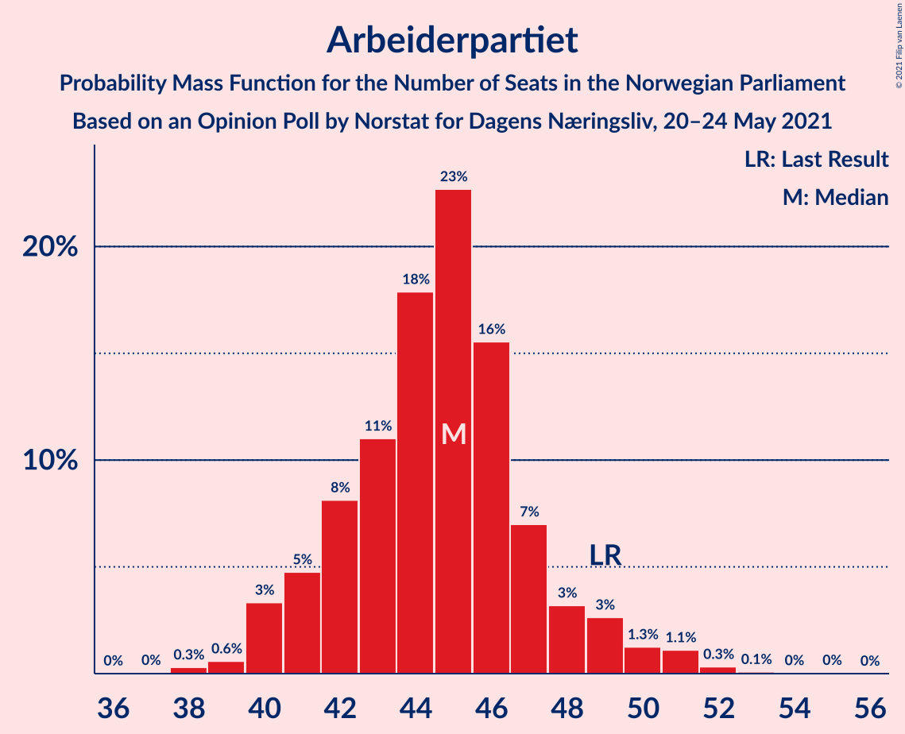

| Number of Seats | Probability | Accumulated | Special Marks |
|:---------------:|:-----------:|:-----------:|:-------------:|
| 37 | 0% | 100% |  |
| 38 | 0.3% | 99.9% |  |
| 39 | 0.6% | 99.6% |  |
| 40 | 3% | 99.0% |  |
| 41 | 5% | 96% |  |
| 42 | 8% | 91% |  |
| 43 | 11% | 83% |  |
| 44 | 18% | 72% |  |
| 45 | 23% | 54% | Median |
| 46 | 16% | 31% |  |
| 47 | 7% | 16% |  |
| 48 | 3% | 9% |  |
| 49 | 3% | 5% | Last Result |
| 50 | 1.3% | 3% |  |
| 51 | 1.1% | 2% |  |
| 52 | 0.3% | 0.5% |  |
| 53 | 0.1% | 0.2% |  |
| 54 | 0% | 0.1% |  |
| 55 | 0% | 0.1% |  |
| 56 | 0% | 0% |  |

### Høyre

*For a full overview of the results for this party, see the [Høyre](party-høyre.html) page.*

| Number of Seats | Probability | Accumulated | Special Marks |
|:---------------:|:-----------:|:-----------:|:-------------:|
| 33 | 0% | 100% |  |
| 34 | 0.3% | 99.9% |  |
| 35 | 1.0% | 99.7% |  |
| 36 | 4% | 98.7% |  |
| 37 | 5% | 95% |  |
| 38 | 14% | 89% |  |
| 39 | 7% | 76% |  |
| 40 | 19% | 69% |  |
| 41 | 9% | 50% | Median |
| 42 | 15% | 41% |  |
| 43 | 10% | 26% |  |
| 44 | 8% | 16% |  |
| 45 | 4% | 8% | Last Result |
| 46 | 2% | 4% |  |
| 47 | 1.2% | 2% |  |
| 48 | 0.7% | 1.0% |  |
| 49 | 0.2% | 0.3% |  |
| 50 | 0.1% | 0.1% |  |
| 51 | 0% | 0% |  |

### Senterpartiet

*For a full overview of the results for this party, see the [Senterpartiet](party-senterpartiet.html) page.*

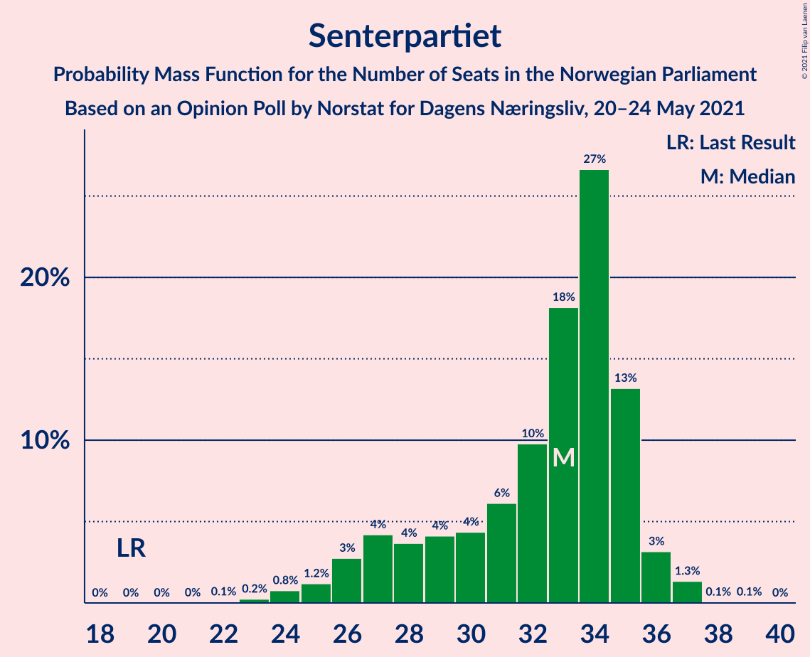

| Number of Seats | Probability | Accumulated | Special Marks |
|:---------------:|:-----------:|:-----------:|:-------------:|
| 19 | 0% | 100% | Last Result |
| 20 | 0% | 100% |  |
| 21 | 0% | 100% |  |
| 22 | 0.1% | 100% |  |
| 23 | 0.2% | 99.9% |  |
| 24 | 0.8% | 99.7% |  |
| 25 | 1.2% | 98.9% |  |
| 26 | 3% | 98% |  |
| 27 | 4% | 95% |  |
| 28 | 4% | 91% |  |
| 29 | 4% | 87% |  |
| 30 | 4% | 83% |  |
| 31 | 6% | 79% |  |
| 32 | 10% | 72% |  |
| 33 | 18% | 63% | Median |
| 34 | 27% | 44% |  |
| 35 | 13% | 18% |  |
| 36 | 3% | 5% |  |
| 37 | 1.3% | 1.5% |  |
| 38 | 0.1% | 0.1% |  |
| 39 | 0.1% | 0.1% |  |
| 40 | 0% | 0% |  |

### Fremskrittspartiet

*For a full overview of the results for this party, see the [Fremskrittspartiet](party-fremskrittspartiet.html) page.*

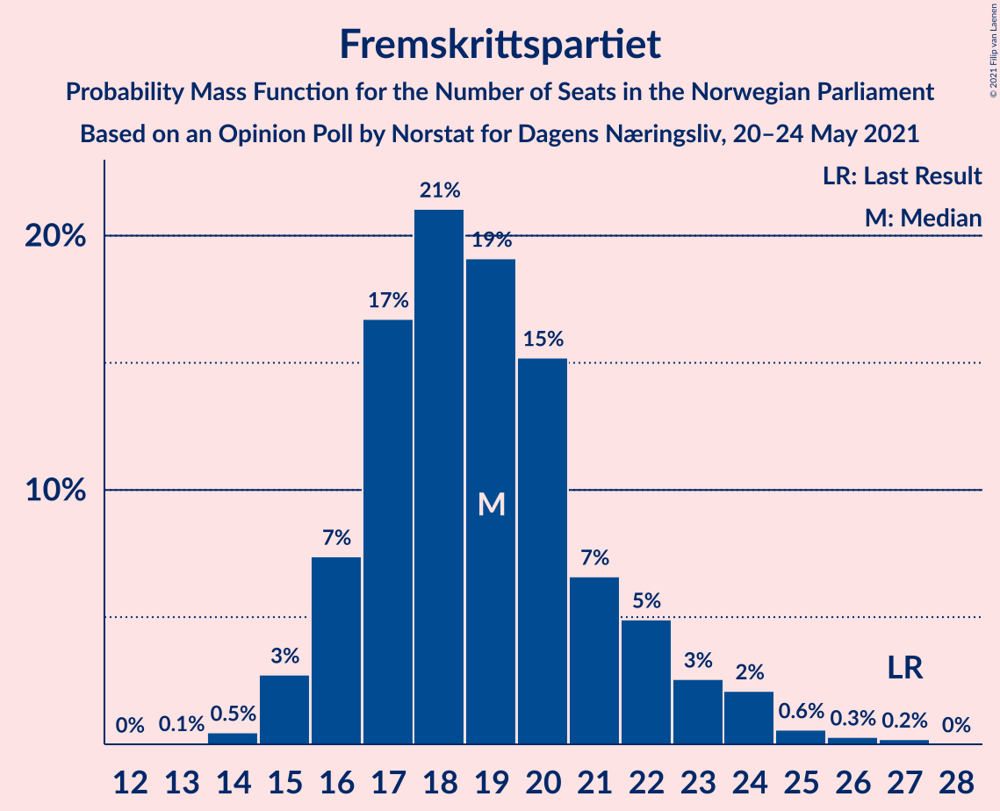

| Number of Seats | Probability | Accumulated | Special Marks |
|:---------------:|:-----------:|:-----------:|:-------------:|
| 13 | 0.1% | 100% |  |
| 14 | 0.5% | 99.9% |  |
| 15 | 3% | 99.5% |  |
| 16 | 7% | 97% |  |
| 17 | 17% | 89% |  |
| 18 | 21% | 73% |  |
| 19 | 19% | 52% | Median |
| 20 | 15% | 32% |  |
| 21 | 7% | 17% |  |
| 22 | 5% | 11% |  |
| 23 | 3% | 6% |  |
| 24 | 2% | 3% |  |
| 25 | 0.6% | 1.1% |  |
| 26 | 0.3% | 0.5% |  |
| 27 | 0.2% | 0.2% | Last Result |
| 28 | 0% | 0% |  |

### Sosialistisk Venstreparti

*For a full overview of the results for this party, see the [Sosialistisk Venstreparti](party-sosialistiskvenstreparti.html) page.*

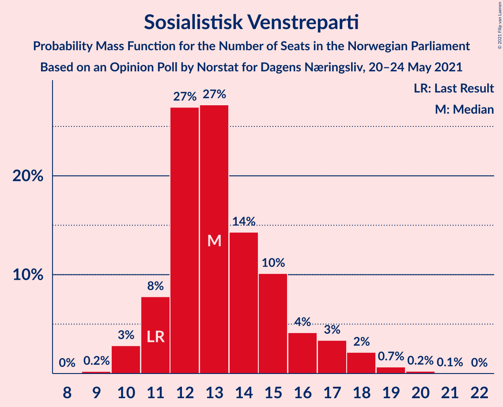

| Number of Seats | Probability | Accumulated | Special Marks |
|:---------------:|:-----------:|:-----------:|:-------------:|
| 9 | 0.2% | 100% |  |
| 10 | 3% | 99.8% |  |
| 11 | 8% | 97% | Last Result |
| 12 | 27% | 89% |  |
| 13 | 27% | 62% | Median |
| 14 | 14% | 35% |  |
| 15 | 10% | 21% |  |
| 16 | 4% | 11% |  |
| 17 | 3% | 6% |  |
| 18 | 2% | 3% |  |
| 19 | 0.7% | 1.0% |  |
| 20 | 0.2% | 0.3% |  |
| 21 | 0.1% | 0.1% |  |
| 22 | 0% | 0% |  |

### Miljøpartiet De Grønne

*For a full overview of the results for this party, see the [Miljøpartiet De Grønne](party-miljøpartietdegrønne.html) page.*

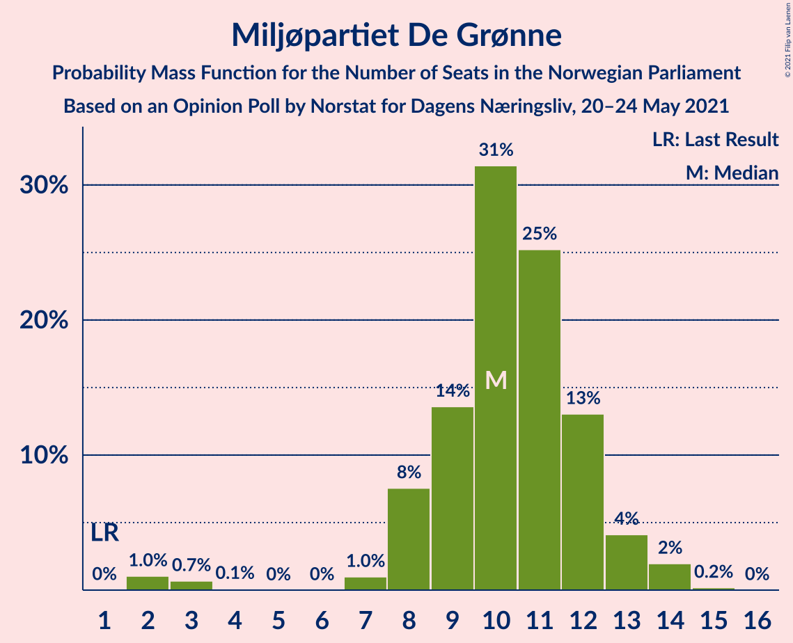

| Number of Seats | Probability | Accumulated | Special Marks |
|:---------------:|:-----------:|:-----------:|:-------------:|
| 1 | 0% | 100% | Last Result |
| 2 | 1.0% | 100% |  |
| 3 | 0.7% | 98.9% |  |
| 4 | 0.1% | 98% |  |
| 5 | 0% | 98% |  |
| 6 | 0% | 98% |  |
| 7 | 1.0% | 98% |  |
| 8 | 8% | 97% |  |
| 9 | 14% | 90% |  |
| 10 | 31% | 76% | Median |
| 11 | 25% | 45% |  |
| 12 | 13% | 19% |  |
| 13 | 4% | 6% |  |
| 14 | 2% | 2% |  |
| 15 | 0.2% | 0.2% |  |
| 16 | 0% | 0% |  |

### Rødt

*For a full overview of the results for this party, see the [Rødt](party-rødt.html) page.*

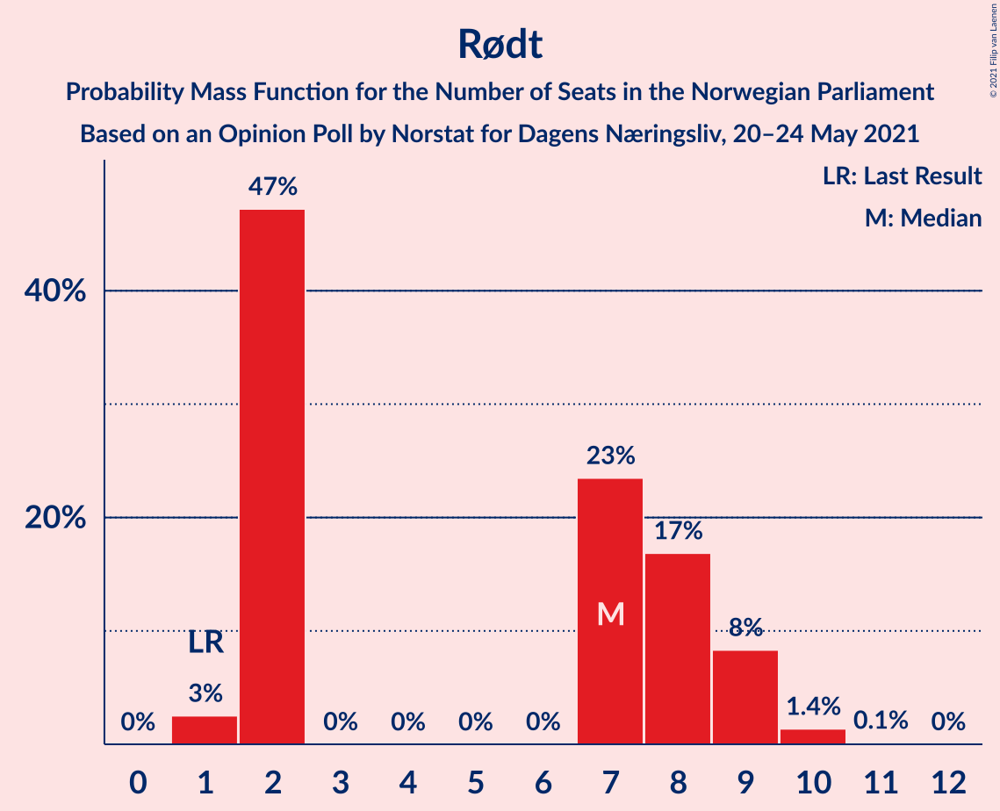

| Number of Seats | Probability | Accumulated | Special Marks |
|:---------------:|:-----------:|:-----------:|:-------------:|
| 1 | 3% | 100% | Last Result |
| 2 | 47% | 97% |  |
| 3 | 0% | 50% |  |
| 4 | 0% | 50% |  |
| 5 | 0% | 50% |  |
| 6 | 0% | 50% |  |
| 7 | 23% | 50% | Median |
| 8 | 17% | 27% |  |
| 9 | 8% | 10% |  |
| 10 | 1.4% | 2% |  |
| 11 | 0.1% | 0.2% |  |
| 12 | 0% | 0% |  |

### Venstre

*For a full overview of the results for this party, see the [Venstre](party-venstre.html) page.*

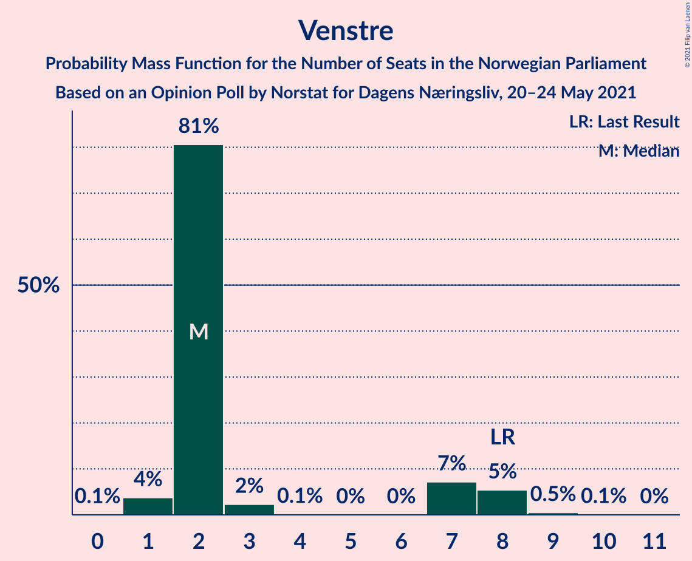

| Number of Seats | Probability | Accumulated | Special Marks |
|:---------------:|:-----------:|:-----------:|:-------------:|
| 0 | 0.1% | 100% |  |
| 1 | 4% | 99.9% |  |
| 2 | 81% | 96% | Median |
| 3 | 2% | 16% |  |
| 4 | 0.1% | 13% |  |
| 5 | 0% | 13% |  |
| 6 | 0% | 13% |  |
| 7 | 7% | 13% |  |
| 8 | 5% | 6% | Last Result |
| 9 | 0.5% | 0.6% |  |
| 10 | 0.1% | 0.1% |  |
| 11 | 0% | 0% |  |

### Kristelig Folkeparti

*For a full overview of the results for this party, see the [Kristelig Folkeparti](party-kristeligfolkeparti.html) page.*

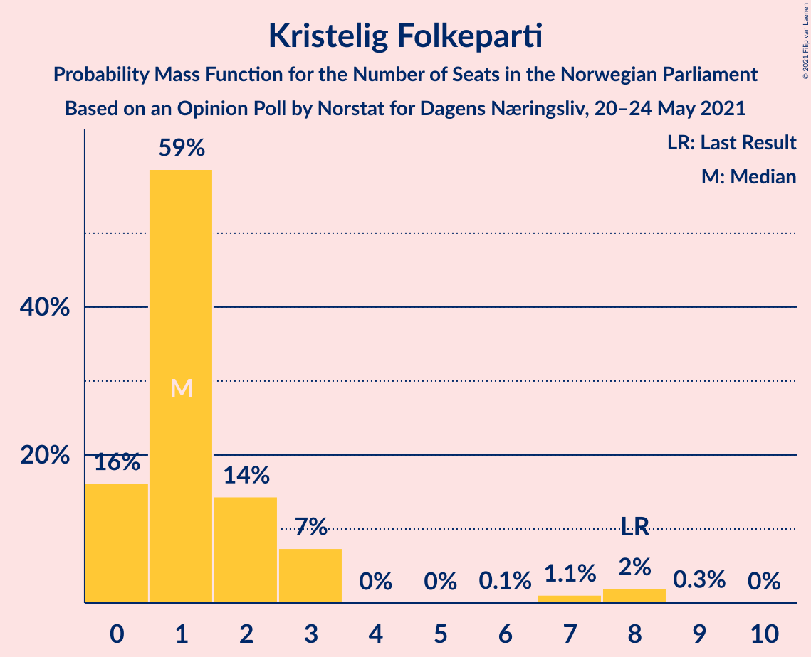

| Number of Seats | Probability | Accumulated | Special Marks |
|:---------------:|:-----------:|:-----------:|:-------------:|
| 0 | 16% | 100% |  |
| 1 | 59% | 84% | Median |
| 2 | 14% | 25% |  |
| 3 | 7% | 11% |  |
| 4 | 0% | 3% |  |
| 5 | 0% | 3% |  |
| 6 | 0.1% | 3% |  |
| 7 | 1.1% | 3% |  |
| 8 | 2% | 2% | Last Result |
| 9 | 0.3% | 0.3% |  |
| 10 | 0% | 0% |  |

## Coalitions

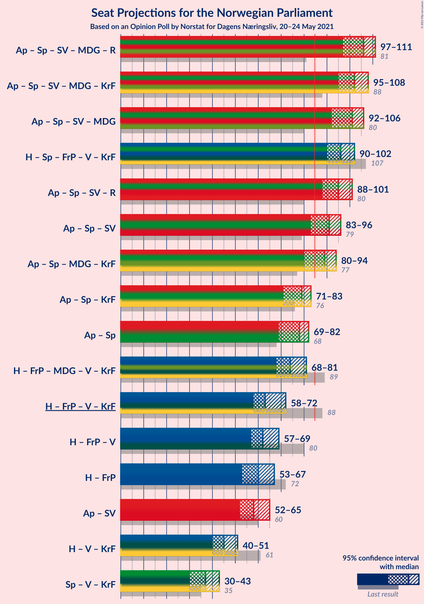

### Confidence Intervals

| Coalition | Last Result | Median | Majority? | 80% Confidence Interval | 90% Confidence Interval | 95% Confidence Interval | 99% Confidence Interval |
|:---------:|:-----------:|:------:|:---------:|:-----------------------:|:-----------------------:|:-----------------------:|:-----------------------:|
| Arbeiderpartiet – Senterpartiet – Sosialistisk Venstreparti – Miljøpartiet De Grønne – Rødt | 81 | 106 | 100% | 101–110 | 98–110 | 97–111 | 94–113 |
| Arbeiderpartiet – Senterpartiet – Sosialistisk Venstreparti – Miljøpartiet De Grønne – Kristelig Folkeparti | 88 | 102 | 100% | 98–105 | 96–107 | 95–108 | 92–110 |
| Arbeiderpartiet – Senterpartiet – Sosialistisk Venstreparti – Miljøpartiet De Grønne | 80 | 101 | 100% | 96–104 | 94–106 | 92–106 | 89–108 |
| Høyre – Senterpartiet – Fremskrittspartiet – Venstre – Kristelig Folkeparti | 107 | 96 | 100% | 92–100 | 91–101 | 90–102 | 88–104 |
| Arbeiderpartiet – Senterpartiet – Sosialistisk Venstreparti – Rødt | 80 | 95 | 99.7% | 90–100 | 89–100 | 88–101 | 85–104 |
| Arbeiderpartiet – Senterpartiet – Sosialistisk Venstreparti | 79 | 91 | 95% | 86–94 | 85–95 | 83–96 | 81–98 |
| Arbeiderpartiet – Senterpartiet – Miljøpartiet De Grønne – Kristelig Folkeparti | 77 | 89 | 88% | 84–92 | 82–93 | 80–94 | 77–96 |
| Arbeiderpartiet – Senterpartiet – Kristelig Folkeparti | 76 | 79 | 1.0% | 74–82 | 72–83 | 71–83 | 69–85 |
| Arbeiderpartiet – Senterpartiet | 68 | 78 | 0.3% | 72–80 | 70–81 | 69–82 | 67–84 |
| Høyre – Fremskrittspartiet – Miljøpartiet De Grønne – Venstre – Kristelig Folkeparti | 89 | 74 | 0.3% | 69–79 | 69–80 | 68–81 | 65–83 |
| Høyre – Fremskrittspartiet – Venstre – Kristelig Folkeparti | 88 | 63 | 0% | 59–68 | 59–71 | 58–72 | 56–75 |
| Høyre – Fremskrittspartiet – Venstre | 80 | 62 | 0% | 58–67 | 57–68 | 57–69 | 54–72 |
| Høyre – Fremskrittspartiet | 72 | 60 | 0% | 55–64 | 54–65 | 53–67 | 51–69 |
| Arbeiderpartiet – Sosialistisk Venstreparti | 60 | 58 | 0% | 55–61 | 54–63 | 52–65 | 51–66 |
| Høyre – Venstre – Kristelig Folkeparti | 61 | 45 | 0% | 41–49 | 40–50 | 40–51 | 38–54 |
| Senterpartiet – Venstre – Kristelig Folkeparti | 35 | 37 | 0% | 32–40 | 31–42 | 30–43 | 28–45 |

### Arbeiderpartiet – Senterpartiet – Sosialistisk Venstreparti – Miljøpartiet De Grønne – Rødt

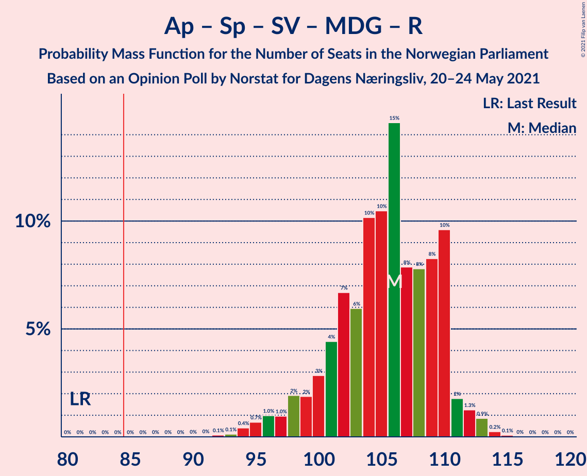

| Number of Seats | Probability | Accumulated | Special Marks |
|:---------------:|:-----------:|:-----------:|:-------------:|
| 81 | 0% | 100% | Last Result |
| 82 | 0% | 100% |  |
| 83 | 0% | 100% |  |
| 84 | 0% | 100% |  |
| 85 | 0% | 100% | Majority |
| 86 | 0% | 100% |  |
| 87 | 0% | 100% |  |
| 88 | 0% | 100% |  |
| 89 | 0% | 100% |  |
| 90 | 0% | 100% |  |
| 91 | 0% | 100% |  |
| 92 | 0.1% | 99.9% |  |
| 93 | 0.1% | 99.8% |  |
| 94 | 0.4% | 99.7% |  |
| 95 | 0.7% | 99.3% |  |
| 96 | 1.0% | 98.6% |  |
| 97 | 1.0% | 98% |  |
| 98 | 2% | 97% |  |
| 99 | 2% | 95% |  |
| 100 | 3% | 93% |  |
| 101 | 4% | 90% |  |
| 102 | 7% | 86% |  |
| 103 | 6% | 79% |  |
| 104 | 10% | 73% |  |
| 105 | 10% | 63% |  |
| 106 | 15% | 52% |  |
| 107 | 8% | 38% |  |
| 108 | 8% | 30% | Median |
| 109 | 8% | 22% |  |
| 110 | 10% | 14% |  |
| 111 | 2% | 4% |  |
| 112 | 1.3% | 2% |  |
| 113 | 0.9% | 1.2% |  |
| 114 | 0.2% | 0.3% |  |
| 115 | 0.1% | 0.1% |  |
| 116 | 0% | 0% |  |

### Arbeiderpartiet – Senterpartiet – Sosialistisk Venstreparti – Miljøpartiet De Grønne – Kristelig Folkeparti

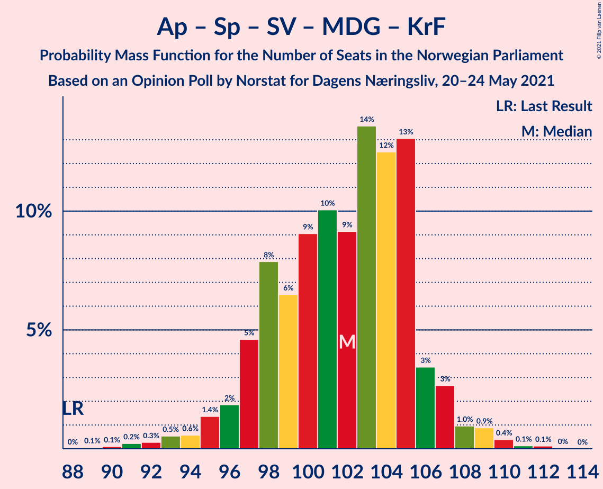

| Number of Seats | Probability | Accumulated | Special Marks |
|:---------------:|:-----------:|:-----------:|:-------------:|
| 88 | 0% | 100% | Last Result |
| 89 | 0.1% | 100% |  |
| 90 | 0.1% | 99.9% |  |
| 91 | 0.2% | 99.8% |  |
| 92 | 0.3% | 99.6% |  |
| 93 | 0.5% | 99.3% |  |
| 94 | 0.6% | 98.8% |  |
| 95 | 1.4% | 98% |  |
| 96 | 2% | 97% |  |
| 97 | 5% | 95% |  |
| 98 | 8% | 90% |  |
| 99 | 6% | 83% |  |
| 100 | 9% | 76% |  |
| 101 | 10% | 67% |  |
| 102 | 9% | 57% | Median |
| 103 | 14% | 48% |  |
| 104 | 12% | 34% |  |
| 105 | 13% | 22% |  |
| 106 | 3% | 9% |  |
| 107 | 3% | 5% |  |
| 108 | 1.0% | 3% |  |
| 109 | 0.9% | 2% |  |
| 110 | 0.4% | 0.7% |  |
| 111 | 0.1% | 0.3% |  |
| 112 | 0.1% | 0.2% |  |
| 113 | 0% | 0% |  |

### Arbeiderpartiet – Senterpartiet – Sosialistisk Venstreparti – Miljøpartiet De Grønne

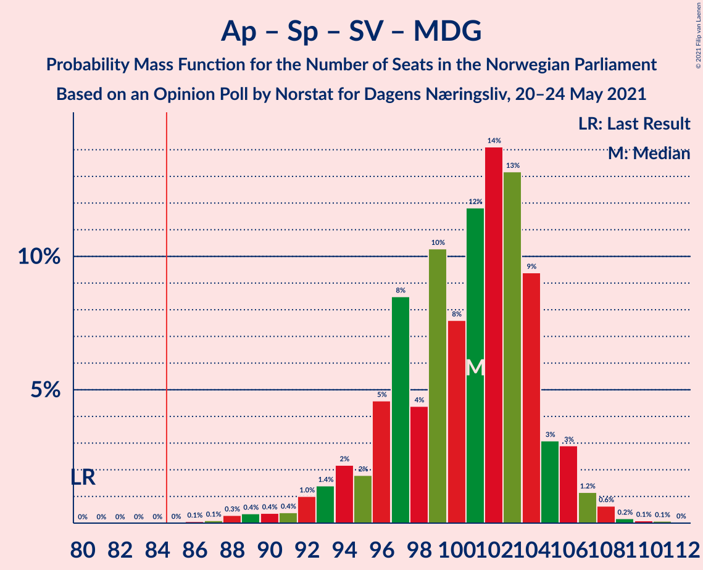

| Number of Seats | Probability | Accumulated | Special Marks |
|:---------------:|:-----------:|:-----------:|:-------------:|
| 80 | 0% | 100% | Last Result |
| 81 | 0% | 100% |  |
| 82 | 0% | 100% |  |
| 83 | 0% | 100% |  |
| 84 | 0% | 100% |  |
| 85 | 0% | 100% | Majority |
| 86 | 0.1% | 100% |  |
| 87 | 0.1% | 99.9% |  |
| 88 | 0.3% | 99.8% |  |
| 89 | 0.4% | 99.5% |  |
| 90 | 0.4% | 99.2% |  |
| 91 | 0.4% | 98.8% |  |
| 92 | 1.0% | 98% |  |
| 93 | 1.4% | 97% |  |
| 94 | 2% | 96% |  |
| 95 | 2% | 94% |  |
| 96 | 5% | 92% |  |
| 97 | 8% | 87% |  |
| 98 | 4% | 79% |  |
| 99 | 10% | 75% |  |
| 100 | 8% | 64% |  |
| 101 | 12% | 57% | Median |
| 102 | 14% | 45% |  |
| 103 | 13% | 31% |  |
| 104 | 9% | 18% |  |
| 105 | 3% | 8% |  |
| 106 | 3% | 5% |  |
| 107 | 1.2% | 2% |  |
| 108 | 0.6% | 1.0% |  |
| 109 | 0.2% | 0.4% |  |
| 110 | 0.1% | 0.2% |  |
| 111 | 0.1% | 0.1% |  |
| 112 | 0% | 0% |  |

### Høyre – Senterpartiet – Fremskrittspartiet – Venstre – Kristelig Folkeparti

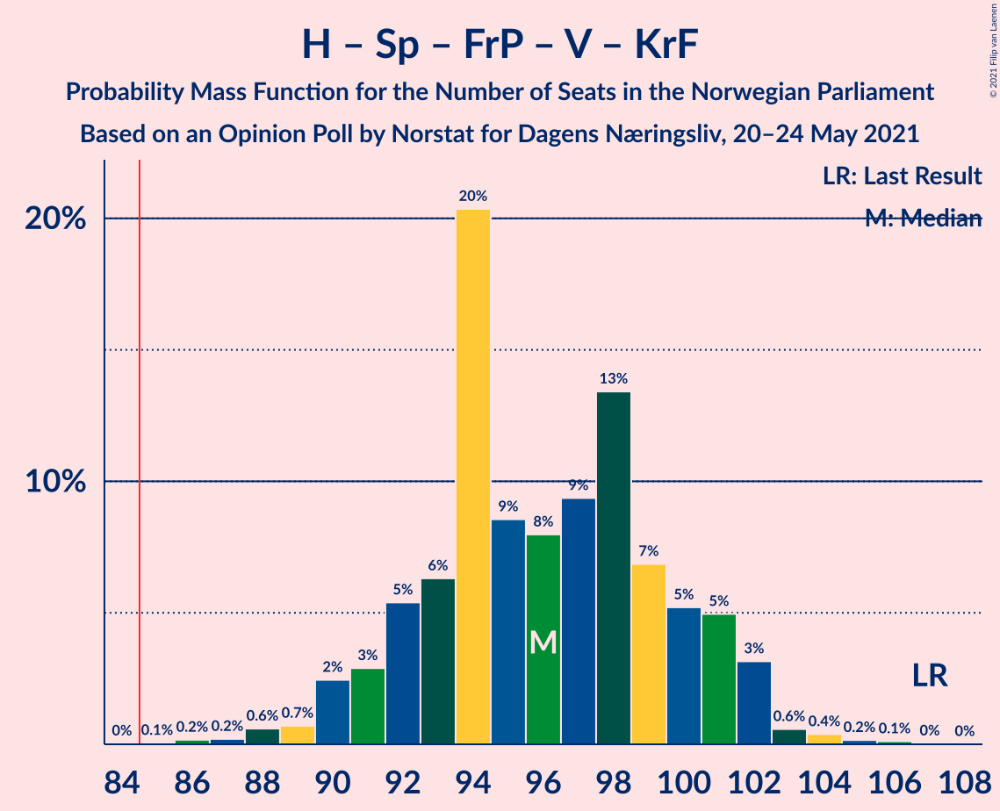

| Number of Seats | Probability | Accumulated | Special Marks |
|:---------------:|:-----------:|:-----------:|:-------------:|
| 85 | 0.1% | 100% | Majority |
| 86 | 0.2% | 99.9% |  |
| 87 | 0.2% | 99.7% |  |
| 88 | 0.6% | 99.5% |  |
| 89 | 0.7% | 98.9% |  |
| 90 | 2% | 98% |  |
| 91 | 3% | 96% |  |
| 92 | 5% | 93% |  |
| 93 | 6% | 87% |  |
| 94 | 20% | 81% |  |
| 95 | 9% | 61% |  |
| 96 | 8% | 52% | Median |
| 97 | 9% | 44% |  |
| 98 | 13% | 35% |  |
| 99 | 7% | 21% |  |
| 100 | 5% | 15% |  |
| 101 | 5% | 9% |  |
| 102 | 3% | 4% |  |
| 103 | 0.6% | 1.3% |  |
| 104 | 0.4% | 0.7% |  |
| 105 | 0.2% | 0.3% |  |
| 106 | 0.1% | 0.2% |  |
| 107 | 0% | 0.1% | Last Result |
| 108 | 0% | 0% |  |

### Arbeiderpartiet – Senterpartiet – Sosialistisk Venstreparti – Rødt

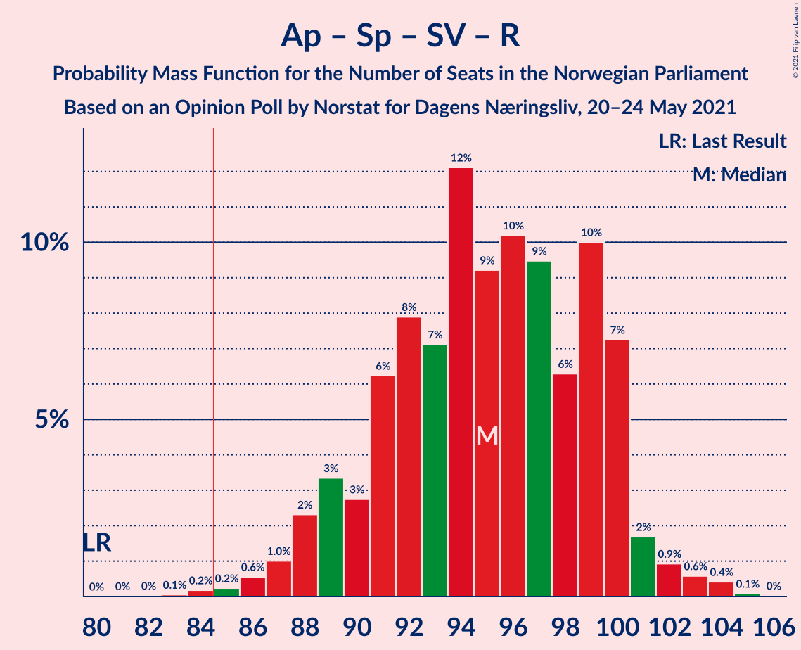

| Number of Seats | Probability | Accumulated | Special Marks |
|:---------------:|:-----------:|:-----------:|:-------------:|
| 80 | 0% | 100% | Last Result |
| 81 | 0% | 100% |  |
| 82 | 0% | 100% |  |
| 83 | 0.1% | 100% |  |
| 84 | 0.2% | 99.9% |  |
| 85 | 0.2% | 99.7% | Majority |
| 86 | 0.6% | 99.5% |  |
| 87 | 1.0% | 98.9% |  |
| 88 | 2% | 98% |  |
| 89 | 3% | 96% |  |
| 90 | 3% | 92% |  |
| 91 | 6% | 90% |  |
| 92 | 8% | 83% |  |
| 93 | 7% | 75% |  |
| 94 | 12% | 68% |  |
| 95 | 9% | 56% |  |
| 96 | 10% | 47% |  |
| 97 | 9% | 37% |  |
| 98 | 6% | 27% | Median |
| 99 | 10% | 21% |  |
| 100 | 7% | 11% |  |
| 101 | 2% | 4% |  |
| 102 | 0.9% | 2% |  |
| 103 | 0.6% | 1.1% |  |
| 104 | 0.4% | 0.5% |  |
| 105 | 0.1% | 0.1% |  |
| 106 | 0% | 0% |  |

### Arbeiderpartiet – Senterpartiet – Sosialistisk Venstreparti

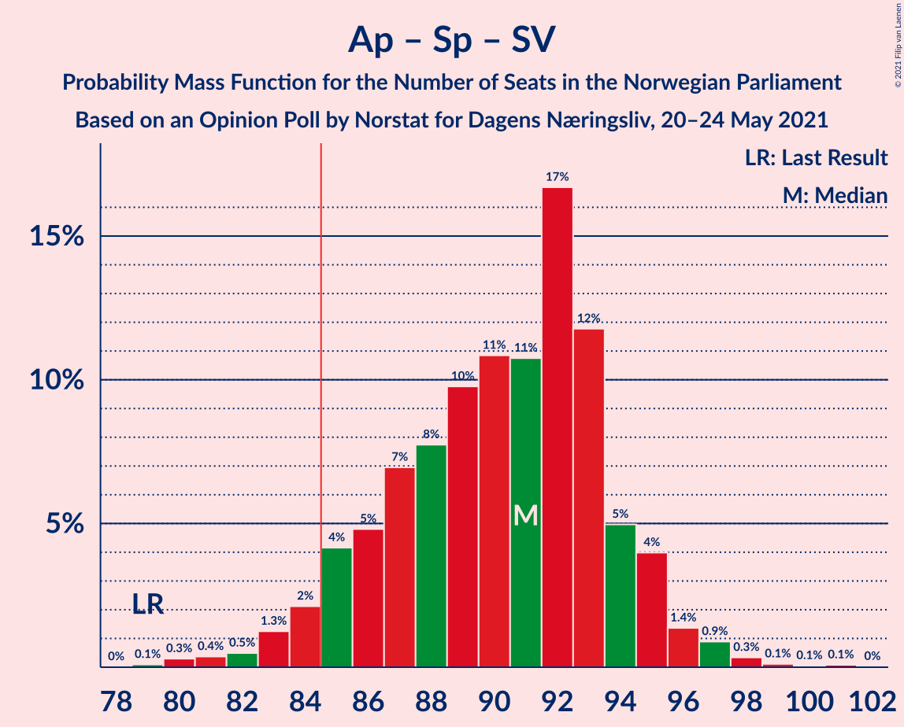

| Number of Seats | Probability | Accumulated | Special Marks |
|:---------------:|:-----------:|:-----------:|:-------------:|
| 79 | 0.1% | 100% | Last Result |
| 80 | 0.3% | 99.9% |  |
| 81 | 0.4% | 99.6% |  |
| 82 | 0.5% | 99.2% |  |
| 83 | 1.3% | 98.7% |  |
| 84 | 2% | 97% |  |
| 85 | 4% | 95% | Majority |
| 86 | 5% | 91% |  |
| 87 | 7% | 86% |  |
| 88 | 8% | 79% |  |
| 89 | 10% | 72% |  |
| 90 | 11% | 62% |  |
| 91 | 11% | 51% | Median |
| 92 | 17% | 40% |  |
| 93 | 12% | 24% |  |
| 94 | 5% | 12% |  |
| 95 | 4% | 7% |  |
| 96 | 1.4% | 3% |  |
| 97 | 0.9% | 2% |  |
| 98 | 0.3% | 0.6% |  |
| 99 | 0.1% | 0.3% |  |
| 100 | 0.1% | 0.2% |  |
| 101 | 0.1% | 0.1% |  |
| 102 | 0% | 0% |  |

### Arbeiderpartiet – Senterpartiet – Miljøpartiet De Grønne – Kristelig Folkeparti

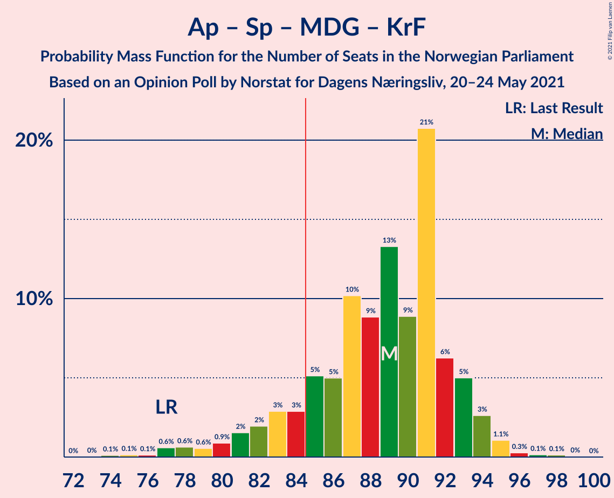

| Number of Seats | Probability | Accumulated | Special Marks |
|:---------------:|:-----------:|:-----------:|:-------------:|
| 74 | 0.1% | 100% |  |
| 75 | 0.1% | 99.8% |  |
| 76 | 0.1% | 99.7% |  |
| 77 | 0.6% | 99.6% | Last Result |
| 78 | 0.6% | 99.0% |  |
| 79 | 0.6% | 98% |  |
| 80 | 0.9% | 98% |  |
| 81 | 2% | 97% |  |
| 82 | 2% | 95% |  |
| 83 | 3% | 93% |  |
| 84 | 3% | 91% |  |
| 85 | 5% | 88% | Majority |
| 86 | 5% | 82% |  |
| 87 | 10% | 78% |  |
| 88 | 9% | 67% |  |
| 89 | 13% | 58% | Median |
| 90 | 9% | 45% |  |
| 91 | 21% | 36% |  |
| 92 | 6% | 16% |  |
| 93 | 5% | 9% |  |
| 94 | 3% | 4% |  |
| 95 | 1.1% | 2% |  |
| 96 | 0.3% | 0.6% |  |
| 97 | 0.1% | 0.3% |  |
| 98 | 0.1% | 0.2% |  |
| 99 | 0% | 0.1% |  |
| 100 | 0% | 0% |  |

### Arbeiderpartiet – Senterpartiet – Kristelig Folkeparti

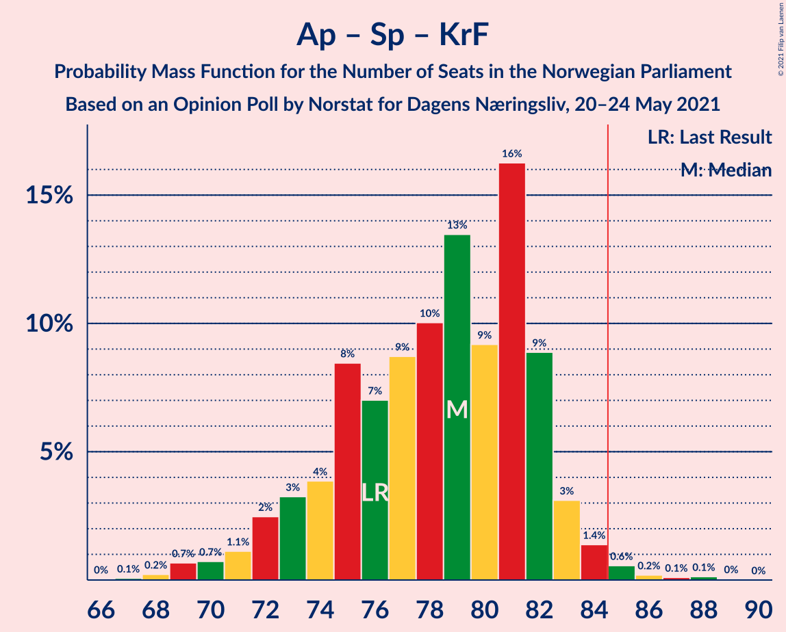

| Number of Seats | Probability | Accumulated | Special Marks |
|:---------------:|:-----------:|:-----------:|:-------------:|
| 67 | 0.1% | 100% |  |
| 68 | 0.2% | 99.9% |  |
| 69 | 0.7% | 99.7% |  |
| 70 | 0.7% | 99.0% |  |
| 71 | 1.1% | 98% |  |
| 72 | 2% | 97% |  |
| 73 | 3% | 95% |  |
| 74 | 4% | 91% |  |
| 75 | 8% | 88% |  |
| 76 | 7% | 79% | Last Result |
| 77 | 9% | 72% |  |
| 78 | 10% | 63% |  |
| 79 | 13% | 53% | Median |
| 80 | 9% | 40% |  |
| 81 | 16% | 31% |  |
| 82 | 9% | 14% |  |
| 83 | 3% | 6% |  |
| 84 | 1.4% | 2% |  |
| 85 | 0.6% | 1.0% | Majority |
| 86 | 0.2% | 0.5% |  |
| 87 | 0.1% | 0.3% |  |
| 88 | 0.1% | 0.2% |  |
| 89 | 0% | 0% |  |

### Arbeiderpartiet – Senterpartiet

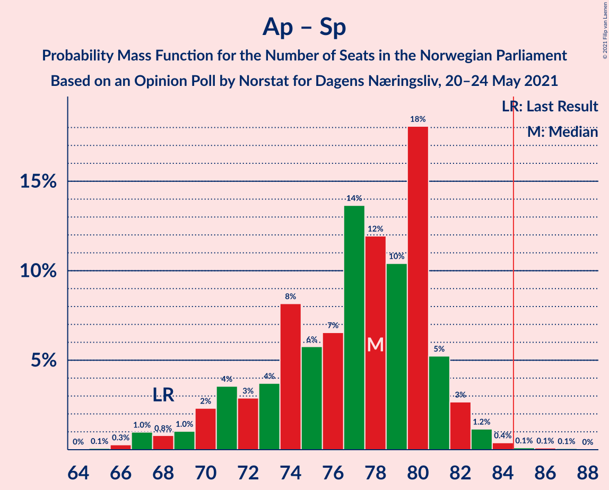

| Number of Seats | Probability | Accumulated | Special Marks |
|:---------------:|:-----------:|:-----------:|:-------------:|
| 64 | 0% | 100% |  |
| 65 | 0.1% | 99.9% |  |
| 66 | 0.3% | 99.9% |  |
| 67 | 1.0% | 99.6% |  |
| 68 | 0.8% | 98.6% | Last Result |
| 69 | 1.0% | 98% |  |
| 70 | 2% | 97% |  |
| 71 | 4% | 94% |  |
| 72 | 3% | 91% |  |
| 73 | 4% | 88% |  |
| 74 | 8% | 84% |  |
| 75 | 6% | 76% |  |
| 76 | 7% | 70% |  |
| 77 | 14% | 64% |  |
| 78 | 12% | 50% | Median |
| 79 | 10% | 38% |  |
| 80 | 18% | 28% |  |
| 81 | 5% | 10% |  |
| 82 | 3% | 5% |  |
| 83 | 1.2% | 2% |  |
| 84 | 0.4% | 0.7% |  |
| 85 | 0.1% | 0.3% | Majority |
| 86 | 0.1% | 0.2% |  |
| 87 | 0.1% | 0.1% |  |
| 88 | 0% | 0% |  |

### Høyre – Fremskrittspartiet – Miljøpartiet De Grønne – Venstre – Kristelig Folkeparti

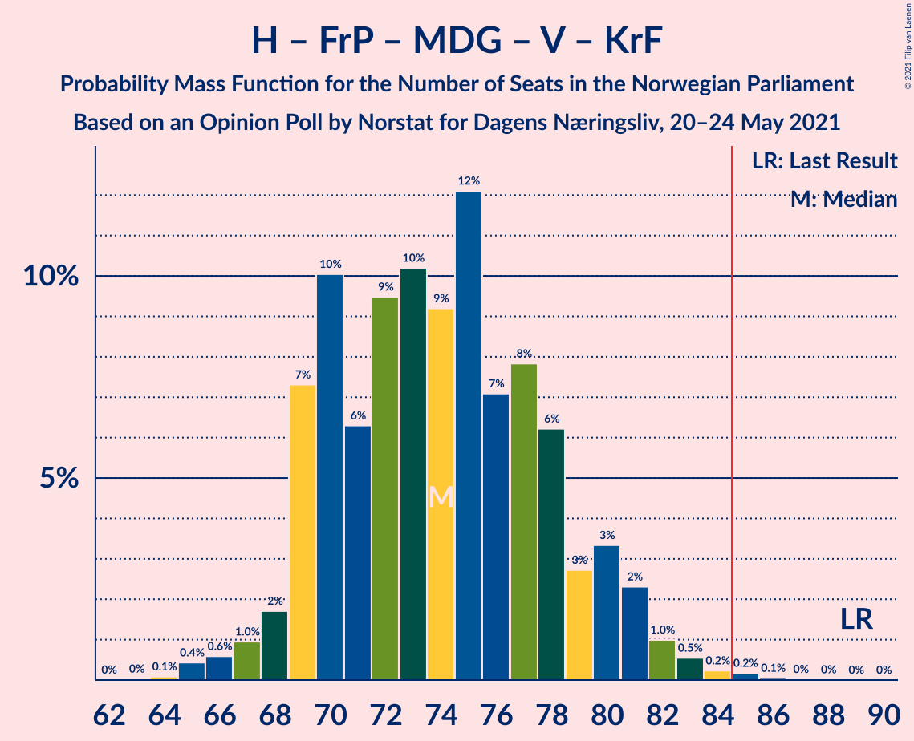

| Number of Seats | Probability | Accumulated | Special Marks |
|:---------------:|:-----------:|:-----------:|:-------------:|
| 64 | 0.1% | 100% |  |
| 65 | 0.4% | 99.9% |  |
| 66 | 0.6% | 99.4% |  |
| 67 | 1.0% | 98.9% |  |
| 68 | 2% | 98% |  |
| 69 | 7% | 96% |  |
| 70 | 10% | 89% |  |
| 71 | 6% | 79% |  |
| 72 | 9% | 73% |  |
| 73 | 10% | 63% | Median |
| 74 | 9% | 53% |  |
| 75 | 12% | 44% |  |
| 76 | 7% | 32% |  |
| 77 | 8% | 24% |  |
| 78 | 6% | 17% |  |
| 79 | 3% | 10% |  |
| 80 | 3% | 8% |  |
| 81 | 2% | 4% |  |
| 82 | 1.0% | 2% |  |
| 83 | 0.5% | 1.0% |  |
| 84 | 0.2% | 0.5% |  |
| 85 | 0.2% | 0.3% | Majority |
| 86 | 0.1% | 0.1% |  |
| 87 | 0% | 0% |  |
| 88 | 0% | 0% |  |
| 89 | 0% | 0% | Last Result |

### Høyre – Fremskrittspartiet – Venstre – Kristelig Folkeparti

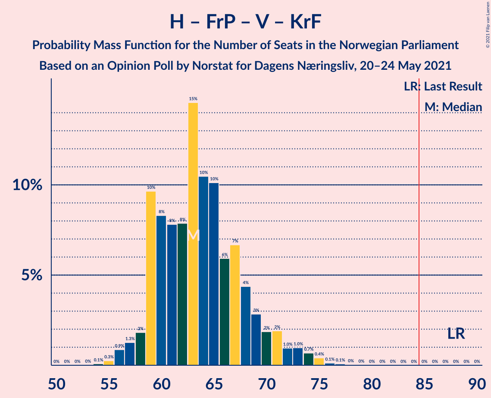

| Number of Seats | Probability | Accumulated | Special Marks |
|:---------------:|:-----------:|:-----------:|:-------------:|
| 54 | 0.1% | 100% |  |
| 55 | 0.3% | 99.9% |  |
| 56 | 0.9% | 99.6% |  |
| 57 | 1.3% | 98.8% |  |
| 58 | 2% | 98% |  |
| 59 | 10% | 96% |  |
| 60 | 8% | 86% |  |
| 61 | 8% | 78% |  |
| 62 | 8% | 70% |  |
| 63 | 15% | 62% | Median |
| 64 | 10% | 47% |  |
| 65 | 10% | 37% |  |
| 66 | 6% | 27% |  |
| 67 | 7% | 21% |  |
| 68 | 4% | 14% |  |
| 69 | 3% | 10% |  |
| 70 | 2% | 7% |  |
| 71 | 2% | 5% |  |
| 72 | 1.0% | 3% |  |
| 73 | 1.0% | 2% |  |
| 74 | 0.7% | 1.4% |  |
| 75 | 0.4% | 0.7% |  |
| 76 | 0.1% | 0.3% |  |
| 77 | 0.1% | 0.1% |  |
| 78 | 0% | 0.1% |  |
| 79 | 0% | 0% |  |
| 80 | 0% | 0% |  |
| 81 | 0% | 0% |  |
| 82 | 0% | 0% |  |
| 83 | 0% | 0% |  |
| 84 | 0% | 0% |  |
| 85 | 0% | 0% | Majority |
| 86 | 0% | 0% |  |
| 87 | 0% | 0% |  |
| 88 | 0% | 0% | Last Result |

### Høyre – Fremskrittspartiet – Venstre

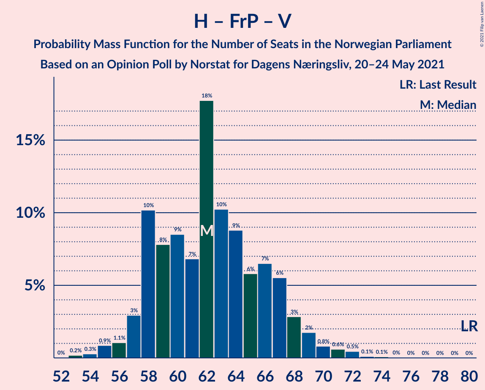

| Number of Seats | Probability | Accumulated | Special Marks |
|:---------------:|:-----------:|:-----------:|:-------------:|
| 53 | 0.2% | 100% |  |
| 54 | 0.3% | 99.8% |  |
| 55 | 0.9% | 99.5% |  |
| 56 | 1.1% | 98.6% |  |
| 57 | 3% | 98% |  |
| 58 | 10% | 95% |  |
| 59 | 8% | 84% |  |
| 60 | 9% | 77% |  |
| 61 | 7% | 68% |  |
| 62 | 18% | 61% | Median |
| 63 | 10% | 44% |  |
| 64 | 9% | 33% |  |
| 65 | 6% | 25% |  |
| 66 | 7% | 19% |  |
| 67 | 6% | 12% |  |
| 68 | 3% | 7% |  |
| 69 | 2% | 4% |  |
| 70 | 0.8% | 2% |  |
| 71 | 0.6% | 1.3% |  |
| 72 | 0.5% | 0.7% |  |
| 73 | 0.1% | 0.2% |  |
| 74 | 0.1% | 0.1% |  |
| 75 | 0% | 0.1% |  |
| 76 | 0% | 0% |  |
| 77 | 0% | 0% |  |
| 78 | 0% | 0% |  |
| 79 | 0% | 0% |  |
| 80 | 0% | 0% | Last Result |

### Høyre – Fremskrittspartiet

| Number of Seats | Probability | Accumulated | Special Marks |
|:---------------:|:-----------:|:-----------:|:-------------:|
| 50 | 0.1% | 100% |  |
| 51 | 0.4% | 99.9% |  |
| 52 | 0.4% | 99.4% |  |
| 53 | 3% | 99.0% |  |
| 54 | 2% | 96% |  |
| 55 | 6% | 94% |  |
| 56 | 10% | 88% |  |
| 57 | 9% | 78% |  |
| 58 | 8% | 69% |  |
| 59 | 7% | 62% |  |
| 60 | 18% | 54% | Median |
| 61 | 9% | 36% |  |
| 62 | 8% | 27% |  |
| 63 | 5% | 19% |  |
| 64 | 5% | 14% |  |
| 65 | 4% | 9% |  |
| 66 | 2% | 5% |  |
| 67 | 1.3% | 3% |  |
| 68 | 0.7% | 2% |  |
| 69 | 0.5% | 0.9% |  |
| 70 | 0.3% | 0.4% |  |
| 71 | 0% | 0.1% |  |
| 72 | 0% | 0.1% | Last Result |
| 73 | 0% | 0% |  |

### Arbeiderpartiet – Sosialistisk Venstreparti

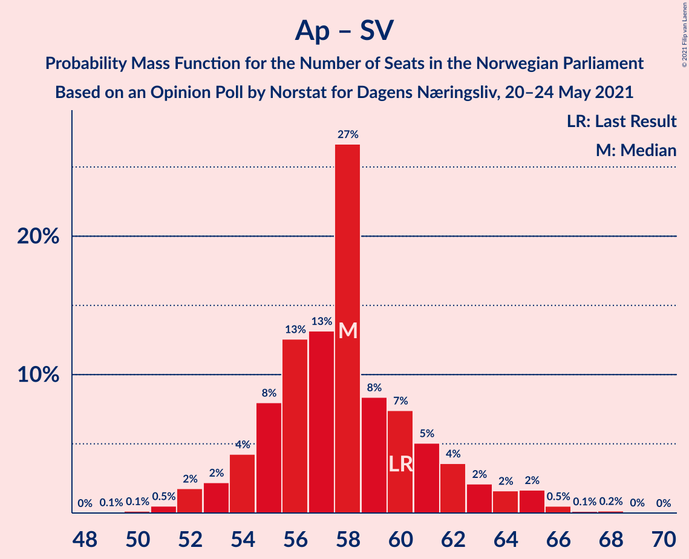

| Number of Seats | Probability | Accumulated | Special Marks |
|:---------------:|:-----------:|:-----------:|:-------------:|
| 49 | 0.1% | 100% |  |
| 50 | 0.1% | 99.9% |  |
| 51 | 0.5% | 99.8% |  |
| 52 | 2% | 99.3% |  |
| 53 | 2% | 97% |  |
| 54 | 4% | 95% |  |
| 55 | 8% | 91% |  |
| 56 | 13% | 83% |  |
| 57 | 13% | 70% |  |
| 58 | 27% | 57% | Median |
| 59 | 8% | 31% |  |
| 60 | 7% | 22% | Last Result |
| 61 | 5% | 15% |  |
| 62 | 4% | 10% |  |
| 63 | 2% | 6% |  |
| 64 | 2% | 4% |  |
| 65 | 2% | 3% |  |
| 66 | 0.5% | 0.9% |  |
| 67 | 0.1% | 0.4% |  |
| 68 | 0.2% | 0.2% |  |
| 69 | 0% | 0.1% |  |
| 70 | 0% | 0% |  |

### Høyre – Venstre – Kristelig Folkeparti

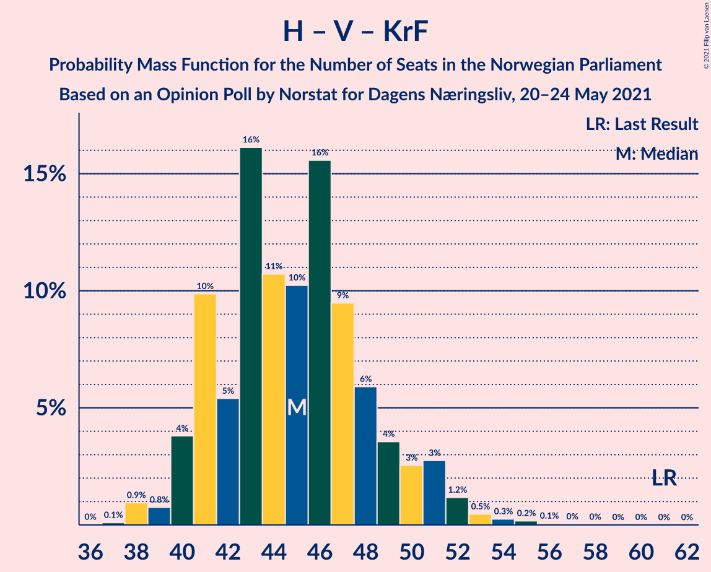

| Number of Seats | Probability | Accumulated | Special Marks |
|:---------------:|:-----------:|:-----------:|:-------------:|
| 37 | 0.1% | 100% |  |
| 38 | 0.9% | 99.9% |  |
| 39 | 0.8% | 98.9% |  |
| 40 | 4% | 98% |  |
| 41 | 10% | 94% |  |
| 42 | 5% | 84% |  |
| 43 | 16% | 79% |  |
| 44 | 11% | 63% | Median |
| 45 | 10% | 52% |  |
| 46 | 16% | 42% |  |
| 47 | 9% | 26% |  |
| 48 | 6% | 17% |  |
| 49 | 4% | 11% |  |
| 50 | 3% | 7% |  |
| 51 | 3% | 5% |  |
| 52 | 1.2% | 2% |  |
| 53 | 0.5% | 1.0% |  |
| 54 | 0.3% | 0.6% |  |
| 55 | 0.2% | 0.3% |  |
| 56 | 0.1% | 0.1% |  |
| 57 | 0% | 0.1% |  |
| 58 | 0% | 0% |  |
| 59 | 0% | 0% |  |
| 60 | 0% | 0% |  |
| 61 | 0% | 0% | Last Result |

### Senterpartiet – Venstre – Kristelig Folkeparti

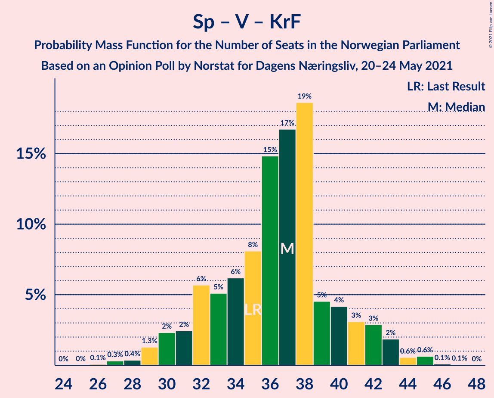

| Number of Seats | Probability | Accumulated | Special Marks |
|:---------------:|:-----------:|:-----------:|:-------------:|
| 26 | 0.1% | 100% |  |
| 27 | 0.3% | 99.9% |  |
| 28 | 0.4% | 99.6% |  |
| 29 | 1.3% | 99.2% |  |
| 30 | 2% | 98% |  |
| 31 | 2% | 96% |  |
| 32 | 6% | 93% |  |
| 33 | 5% | 87% |  |
| 34 | 6% | 82% |  |
| 35 | 8% | 76% | Last Result |
| 36 | 15% | 68% | Median |
| 37 | 17% | 53% |  |
| 38 | 19% | 37% |  |
| 39 | 5% | 18% |  |
| 40 | 4% | 13% |  |
| 41 | 3% | 9% |  |
| 42 | 3% | 6% |  |
| 43 | 2% | 3% |  |
| 44 | 0.6% | 1.4% |  |
| 45 | 0.6% | 0.8% |  |
| 46 | 0.1% | 0.2% |  |
| 47 | 0.1% | 0.1% |  |
| 48 | 0% | 0% |  |

## Technical Information

### Opinion Poll

+ **Polling firm:** Norstat
+ **Commissioner(s):** Dagens Næringsliv
+ **Fieldwork period:** 20–24 May 2021

### Calculations

+ **Sample size:** 999
+ **Simulations done:** 1,048,576
+ **Error estimate:** 1.34%

