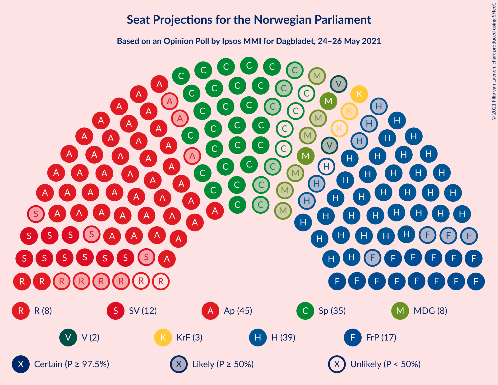
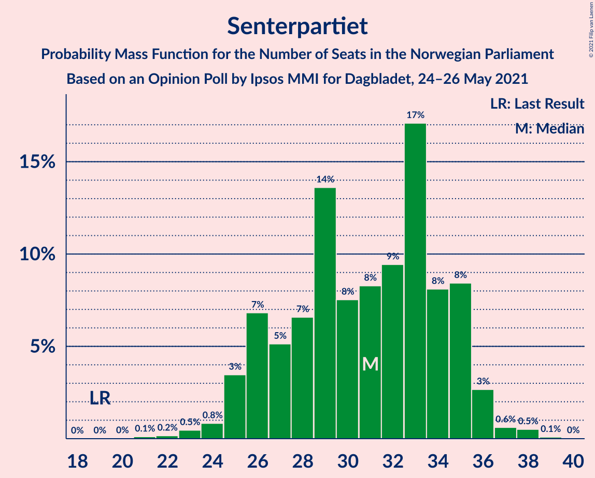
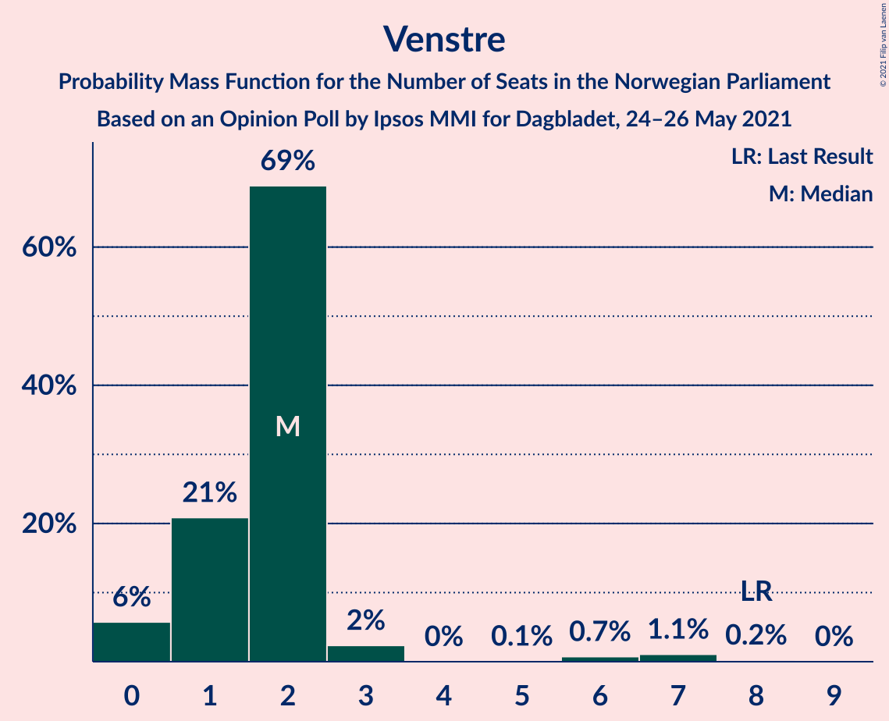
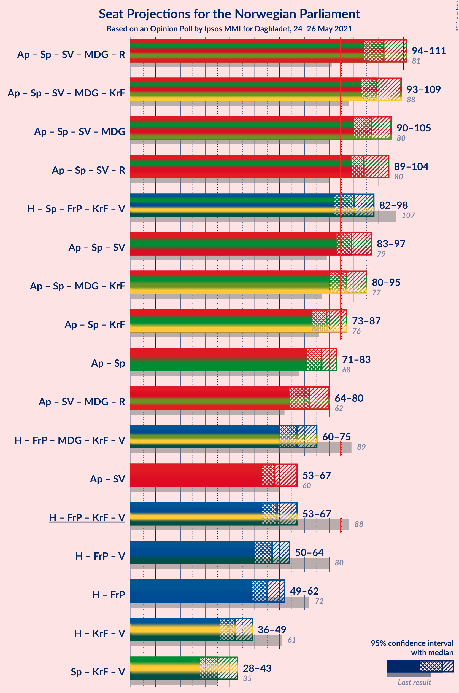
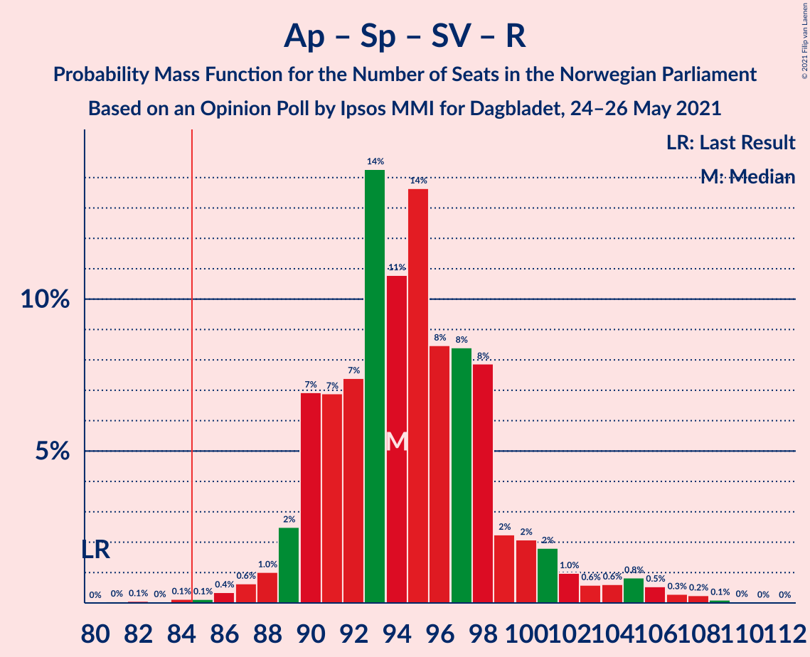
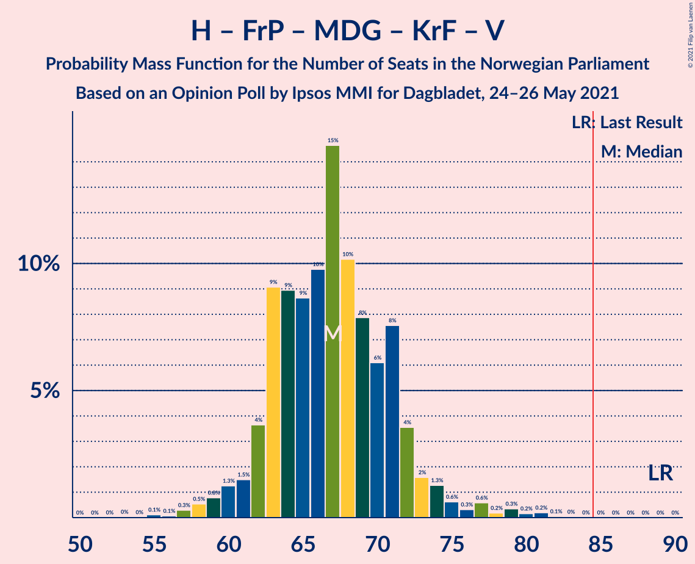
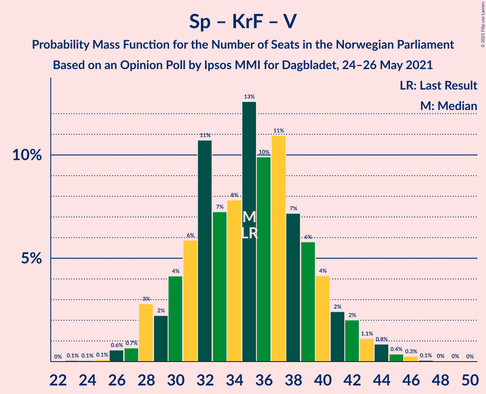

# Opinion Poll by Ipsos MMI for Dagbladet, 24–26 May 2021

<a href="#voting-intentions">Voting Intentions</a> | <a href="#seats">Seats</a> | <a href="#coalitions">Coalitions</a> | <a href="#technical-information">Technical Information</a>

## Voting Intentions

### Confidence Intervals

| Party | Last Result | Poll Result | 80% Confidence Interval | 90% Confidence Interval | 95% Confidence Interval | 99% Confidence Interval |
|:-----:|:-----------:|:-----------:|:-----------------------:|:-----------------------:|:-----------------------:|:-----------------------:|
| Arbeiderpartiet | 27.4% | 25.7% | 23.7–27.8% |23.1–28.4% |22.6–29.0% |21.7–30.0% |
| Høyre | 25.0% | 21.1% | 19.3–23.1% |18.7–23.7% |18.3–24.2% |17.4–25.2% |
| Senterpartiet | 10.3% | 16.4% | 14.7–18.2% |14.3–18.7% |13.9–19.2% |13.1–20.1% |
| Fremskrittspartiet | 15.2% | 10.1% | 8.8–11.7% |8.5–12.1% |8.2–12.5% |7.6–13.3% |
| Sosialistisk Venstreparti | 6.0% | 7.6% | 6.4–9.0% |6.1–9.4% |5.9–9.7% |5.4–10.4% |
| Miljøpartiet De Grønne | 3.2% | 4.7% | 3.9–5.9% |3.6–6.2% |3.4–6.5% |3.0–7.1% |
| Rødt | 2.4% | 4.1% | 3.3–5.2% |3.0–5.5% |2.9–5.7% |2.5–6.3% |
| Kristelig Folkeparti | 4.2% | 3.2% | 2.5–4.3% |2.3–4.5% |2.2–4.8% |1.9–5.3% |
| Venstre | 4.4% | 2.6% | 2.0–3.5% |1.8–3.7% |1.6–4.0% |1.4–4.5% |

*Note:* The poll result column reflects the actual value used in the calculations. Published results may vary slightly, and in addition be rounded to fewer digits.

## Seats

### Confidence Intervals

| Party | Last Result | Median | 80% Confidence Interval | 90% Confidence Interval | 95% Confidence Interval | 99% Confidence Interval |
|:-----:|:-----------:|:------:|:-----------------------:|:-----------------------:|:-----------------------:|:-----------------------:|
| <a href="#arbeiderpartiet">Arbeiderpartiet</a> | 49 | 45 | 43–51 |42–53 |42–53 |40–57 |
| <a href="#høyre">Høyre</a> | 45 | 38 | 34–41 |34–42 |33–43 |31–46 |
| <a href="#senterpartiet">Senterpartiet</a> | 19 | 31 | 26–35 |25–35 |25–36 |23–38 |
| <a href="#fremskrittspartiet">Fremskrittspartiet</a> | 27 | 17 | 15–21 |14–22 |13–22 |12–24 |
| <a href="#sosialistisk-venstreparti">Sosialistisk Venstreparti</a> | 11 | 12 | 10–15 |10–16 |9–17 |8–18 |
| <a href="#miljøpartiet-de-grønne">Miljøpartiet De Grønne</a> | 1 | 8 | 4–10 |2–11 |2–11 |2–12 |
| <a href="#rødt">Rødt</a> | 1 | 6 | 2–8 |2–9 |2–10 |1–10 |
| <a href="#kristelig-folkeparti">Kristelig Folkeparti</a> | 8 | 2 | 1–6 |1–7 |1–8 |0–9 |
| <a href="#venstre">Venstre</a> | 8 | 2 | 1–2 |0–2 |0–3 |0–7 |

### Arbeiderpartiet

*For a full overview of the results for this party, see the [Arbeiderpartiet](party-arbeiderpartiet.html) page.*

| Number of Seats | Probability | Accumulated | Special Marks |
|:---------------:|:-----------:|:-----------:|:-------------:|
| 38 | 0% | 100% |  |
| 39 | 0.2% | 99.9% |  |
| 40 | 0.7% | 99.7% |  |
| 41 | 1.5% | 99.0% |  |
| 42 | 5% | 98% |  |
| 43 | 4% | 93% |  |
| 44 | 25% | 89% |  |
| 45 | 18% | 64% | Median |
| 46 | 11% | 46% |  |
| 47 | 11% | 36% |  |
| 48 | 4% | 25% |  |
| 49 | 3% | 21% | Last Result |
| 50 | 5% | 18% |  |
| 51 | 5% | 13% |  |
| 52 | 3% | 8% |  |
| 53 | 3% | 5% |  |
| 54 | 0.8% | 2% |  |
| 55 | 0.4% | 1.4% |  |
| 56 | 0.4% | 1.0% |  |
| 57 | 0.5% | 0.6% |  |
| 58 | 0.1% | 0.1% |  |
| 59 | 0% | 0% |  |

### Høyre

*For a full overview of the results for this party, see the [Høyre](party-høyre.html) page.*

| Number of Seats | Probability | Accumulated | Special Marks |
|:---------------:|:-----------:|:-----------:|:-------------:|
| 29 | 0.1% | 100% |  |
| 30 | 0.1% | 99.9% |  |
| 31 | 0.3% | 99.8% |  |
| 32 | 1.0% | 99.5% |  |
| 33 | 3% | 98% |  |
| 34 | 8% | 95% |  |
| 35 | 12% | 87% |  |
| 36 | 11% | 75% |  |
| 37 | 12% | 64% |  |
| 38 | 12% | 53% | Median |
| 39 | 14% | 40% |  |
| 40 | 11% | 26% |  |
| 41 | 10% | 15% |  |
| 42 | 3% | 5% |  |
| 43 | 1.1% | 3% |  |
| 44 | 0.6% | 2% |  |
| 45 | 0.5% | 1.0% | Last Result |
| 46 | 0.3% | 0.5% |  |
| 47 | 0.1% | 0.2% |  |
| 48 | 0.1% | 0.1% |  |
| 49 | 0% | 0% |  |

### Senterpartiet

*For a full overview of the results for this party, see the [Senterpartiet](party-senterpartiet.html) page.*

| Number of Seats | Probability | Accumulated | Special Marks |
|:---------------:|:-----------:|:-----------:|:-------------:|
| 19 | 0% | 100% | Last Result |
| 20 | 0% | 100% |  |
| 21 | 0.1% | 100% |  |
| 22 | 0.2% | 99.8% |  |
| 23 | 0.5% | 99.7% |  |
| 24 | 0.8% | 99.2% |  |
| 25 | 3% | 98% |  |
| 26 | 7% | 95% |  |
| 27 | 5% | 88% |  |
| 28 | 7% | 83% |  |
| 29 | 14% | 76% |  |
| 30 | 8% | 63% |  |
| 31 | 8% | 55% | Median |
| 32 | 9% | 47% |  |
| 33 | 17% | 38% |  |
| 34 | 8% | 20% |  |
| 35 | 8% | 12% |  |
| 36 | 3% | 4% |  |
| 37 | 0.6% | 1.2% |  |
| 38 | 0.5% | 0.6% |  |
| 39 | 0.1% | 0.1% |  |
| 40 | 0% | 0% |  |

### Fremskrittspartiet

*For a full overview of the results for this party, see the [Fremskrittspartiet](party-fremskrittspartiet.html) page.*

| Number of Seats | Probability | Accumulated | Special Marks |
|:---------------:|:-----------:|:-----------:|:-------------:|
| 11 | 0.2% | 100% |  |
| 12 | 2% | 99.7% |  |
| 13 | 2% | 98% |  |
| 14 | 5% | 96% |  |
| 15 | 6% | 91% |  |
| 16 | 22% | 84% |  |
| 17 | 19% | 62% | Median |
| 18 | 16% | 43% |  |
| 19 | 11% | 27% |  |
| 20 | 6% | 17% |  |
| 21 | 5% | 10% |  |
| 22 | 4% | 6% |  |
| 23 | 1.1% | 2% |  |
| 24 | 0.8% | 1.0% |  |
| 25 | 0.2% | 0.3% |  |
| 26 | 0% | 0% |  |
| 27 | 0% | 0% | Last Result |

### Sosialistisk Venstreparti

*For a full overview of the results for this party, see the [Sosialistisk Venstreparti](party-sosialistiskvenstreparti.html) page.*

| Number of Seats | Probability | Accumulated | Special Marks |
|:---------------:|:-----------:|:-----------:|:-------------:|
| 7 | 0.1% | 100% |  |
| 8 | 1.1% | 99.9% |  |
| 9 | 3% | 98.8% |  |
| 10 | 9% | 96% |  |
| 11 | 19% | 86% | Last Result |
| 12 | 26% | 67% | Median |
| 13 | 13% | 41% |  |
| 14 | 13% | 28% |  |
| 15 | 6% | 15% |  |
| 16 | 4% | 8% |  |
| 17 | 3% | 4% |  |
| 18 | 0.7% | 1.0% |  |
| 19 | 0.3% | 0.4% |  |
| 20 | 0.1% | 0.1% |  |
| 21 | 0% | 0% |  |

### Miljøpartiet De Grønne

*For a full overview of the results for this party, see the [Miljøpartiet De Grønne](party-miljøpartietdegrønne.html) page.*

| Number of Seats | Probability | Accumulated | Special Marks |
|:---------------:|:-----------:|:-----------:|:-------------:|
| 1 | 0.2% | 100% | Last Result |
| 2 | 7% | 99.8% |  |
| 3 | 2% | 93% |  |
| 4 | 1.0% | 91% |  |
| 5 | 0% | 90% |  |
| 6 | 2% | 90% |  |
| 7 | 24% | 88% |  |
| 8 | 30% | 64% | Median |
| 9 | 23% | 34% |  |
| 10 | 6% | 11% |  |
| 11 | 5% | 6% |  |
| 12 | 0.5% | 0.9% |  |
| 13 | 0.3% | 0.4% |  |
| 14 | 0.1% | 0.1% |  |
| 15 | 0% | 0% |  |

### Rødt

*For a full overview of the results for this party, see the [Rødt](party-rødt.html) page.*

| Number of Seats | Probability | Accumulated | Special Marks |
|:---------------:|:-----------:|:-----------:|:-------------:|
| 1 | 2% | 100% | Last Result |
| 2 | 40% | 98% |  |
| 3 | 0.1% | 58% |  |
| 4 | 0% | 58% |  |
| 5 | 0% | 58% |  |
| 6 | 8% | 58% | Median |
| 7 | 25% | 50% |  |
| 8 | 19% | 25% |  |
| 9 | 4% | 7% |  |
| 10 | 2% | 3% |  |
| 11 | 0.4% | 0.5% |  |
| 12 | 0% | 0.1% |  |
| 13 | 0% | 0% |  |

### Kristelig Folkeparti

*For a full overview of the results for this party, see the [Kristelig Folkeparti](party-kristeligfolkeparti.html) page.*

| Number of Seats | Probability | Accumulated | Special Marks |
|:---------------:|:-----------:|:-----------:|:-------------:|
| 0 | 2% | 100% |  |
| 1 | 40% | 98% |  |
| 2 | 16% | 57% | Median |
| 3 | 28% | 41% |  |
| 4 | 0% | 13% |  |
| 5 | 0.1% | 13% |  |
| 6 | 5% | 13% |  |
| 7 | 6% | 8% |  |
| 8 | 2% | 3% | Last Result |
| 9 | 0.4% | 0.6% |  |
| 10 | 0.1% | 0.1% |  |
| 11 | 0% | 0% |  |

### Venstre

*For a full overview of the results for this party, see the [Venstre](party-venstre.html) page.*

| Number of Seats | Probability | Accumulated | Special Marks |
|:---------------:|:-----------:|:-----------:|:-------------:|
| 0 | 6% | 100% |  |
| 1 | 21% | 94% |  |
| 2 | 69% | 73% | Median |
| 3 | 2% | 5% |  |
| 4 | 0% | 2% |  |
| 5 | 0.1% | 2% |  |
| 6 | 0.7% | 2% |  |
| 7 | 1.1% | 1.3% |  |
| 8 | 0.2% | 0.2% | Last Result |
| 9 | 0% | 0% |  |

## Coalitions

### Confidence Intervals

| Coalition | Last Result | Median | Majority? | 80% Confidence Interval | 90% Confidence Interval | 95% Confidence Interval | 99% Confidence Interval |
|:---------:|:-----------:|:------:|:---------:|:-----------------------:|:-----------------------:|:-----------------------:|:-----------------------:|
| Arbeiderpartiet – Senterpartiet – Sosialistisk Venstreparti – Miljøpartiet De Grønne – Rødt | 81 | 102 | 100% | 97–107 | 96–109 | 94–111 | 92–115 |
| Arbeiderpartiet – Senterpartiet – Sosialistisk Venstreparti – Miljøpartiet De Grønne – Kristelig Folkeparti | 88 | 99 | 100% | 95–104 | 94–106 | 93–109 | 90–112 |
| Arbeiderpartiet – Senterpartiet – Sosialistisk Venstreparti – Miljøpartiet De Grønne | 80 | 97 | 99.9% | 92–101 | 91–103 | 90–105 | 87–108 |
| Arbeiderpartiet – Senterpartiet – Sosialistisk Venstreparti – Rødt | 80 | 94 | 99.7% | 90–99 | 90–101 | 89–104 | 86–107 |
| Høyre – Senterpartiet – Fremskrittspartiet – Kristelig Folkeparti – Venstre | 107 | 90 | 93% | 85–95 | 84–97 | 82–98 | 79–100 |
| Arbeiderpartiet – Senterpartiet – Sosialistisk Venstreparti | 79 | 89 | 93% | 85–93 | 84–95 | 83–97 | 81–100 |
| Arbeiderpartiet – Senterpartiet – Miljøpartiet De Grønne – Kristelig Folkeparti | 77 | 87 | 77% | 83–92 | 81–94 | 80–95 | 76–98 |
| Arbeiderpartiet – Senterpartiet – Kristelig Folkeparti | 76 | 79 | 8% | 75–84 | 74–86 | 73–87 | 71–91 |
| Arbeiderpartiet – Senterpartiet | 68 | 77 | 1.3% | 73–81 | 72–82 | 71–83 | 68–86 |
| Høyre – Fremskrittspartiet – Miljøpartiet De Grønne – Kristelig Folkeparti – Venstre | 89 | 67 | 0% | 63–71 | 62–73 | 60–75 | 57–79 |
| Arbeiderpartiet – Sosialistisk Venstreparti | 60 | 58 | 0% | 55–64 | 54–66 | 53–67 | 52–69 |
| Høyre – Fremskrittspartiet – Kristelig Folkeparti – Venstre | 88 | 59 | 0% | 55–64 | 54–66 | 53–67 | 51–71 |
| Høyre – Fremskrittspartiet – Venstre | 80 | 57 | 0% | 53–61 | 52–62 | 50–64 | 49–67 |
| Høyre – Fremskrittspartiet | 72 | 55 | 0% | 51–59 | 50–60 | 49–62 | 47–65 |
| Høyre – Kristelig Folkeparti – Venstre | 61 | 42 | 0% | 38–46 | 37–48 | 36–49 | 35–51 |
| Senterpartiet – Kristelig Folkeparti – Venstre | 35 | 35 | 0% | 30–40 | 29–41 | 28–43 | 26–45 |

### Arbeiderpartiet – Senterpartiet – Sosialistisk Venstreparti – Miljøpartiet De Grønne – Rødt

| Number of Seats | Probability | Accumulated | Special Marks |
|:---------------:|:-----------:|:-----------:|:-------------:|
| 81 | 0% | 100% | Last Result |
| 82 | 0% | 100% |  |
| 83 | 0% | 100% |  |
| 84 | 0% | 100% |  |
| 85 | 0% | 100% | Majority |
| 86 | 0% | 100% |  |
| 87 | 0% | 100% |  |
| 88 | 0% | 100% |  |
| 89 | 0.1% | 100% |  |
| 90 | 0.1% | 99.9% |  |
| 91 | 0.1% | 99.8% |  |
| 92 | 0.3% | 99.7% |  |
| 93 | 1.3% | 99.4% |  |
| 94 | 0.9% | 98% |  |
| 95 | 2% | 97% |  |
| 96 | 2% | 96% |  |
| 97 | 5% | 94% |  |
| 98 | 4% | 89% |  |
| 99 | 6% | 85% |  |
| 100 | 8% | 79% |  |
| 101 | 8% | 71% |  |
| 102 | 17% | 63% | Median |
| 103 | 15% | 46% |  |
| 104 | 6% | 31% |  |
| 105 | 8% | 26% |  |
| 106 | 6% | 18% |  |
| 107 | 5% | 12% |  |
| 108 | 2% | 7% |  |
| 109 | 1.5% | 5% |  |
| 110 | 1.2% | 4% |  |
| 111 | 0.6% | 3% |  |
| 112 | 0.4% | 2% |  |
| 113 | 0.8% | 2% |  |
| 114 | 0.3% | 0.9% |  |
| 115 | 0.3% | 0.6% |  |
| 116 | 0.2% | 0.3% |  |
| 117 | 0% | 0.1% |  |
| 118 | 0% | 0% |  |

### Arbeiderpartiet – Senterpartiet – Sosialistisk Venstreparti – Miljøpartiet De Grønne – Kristelig Folkeparti

| Number of Seats | Probability | Accumulated | Special Marks |
|:---------------:|:-----------:|:-----------:|:-------------:|
| 87 | 0.2% | 100% |  |
| 88 | 0.1% | 99.8% | Last Result |
| 89 | 0.1% | 99.7% |  |
| 90 | 0.2% | 99.5% |  |
| 91 | 0.6% | 99.4% |  |
| 92 | 0.9% | 98.7% |  |
| 93 | 2% | 98% |  |
| 94 | 3% | 96% |  |
| 95 | 4% | 93% |  |
| 96 | 7% | 89% |  |
| 97 | 9% | 82% |  |
| 98 | 14% | 73% | Median |
| 99 | 15% | 59% |  |
| 100 | 8% | 44% |  |
| 101 | 7% | 36% |  |
| 102 | 9% | 29% |  |
| 103 | 7% | 20% |  |
| 104 | 5% | 13% |  |
| 105 | 2% | 8% |  |
| 106 | 2% | 6% |  |
| 107 | 0.8% | 4% |  |
| 108 | 0.9% | 4% |  |
| 109 | 0.9% | 3% |  |
| 110 | 0.9% | 2% |  |
| 111 | 0.3% | 0.9% |  |
| 112 | 0.1% | 0.5% |  |
| 113 | 0.1% | 0.4% |  |
| 114 | 0.1% | 0.3% |  |
| 115 | 0.2% | 0.2% |  |
| 116 | 0% | 0% |  |

### Arbeiderpartiet – Senterpartiet – Sosialistisk Venstreparti – Miljøpartiet De Grønne

| Number of Seats | Probability | Accumulated | Special Marks |
|:---------------:|:-----------:|:-----------:|:-------------:|
| 80 | 0% | 100% | Last Result |
| 81 | 0% | 100% |  |
| 82 | 0% | 100% |  |
| 83 | 0% | 100% |  |
| 84 | 0.1% | 100% |  |
| 85 | 0% | 99.9% | Majority |
| 86 | 0.2% | 99.8% |  |
| 87 | 0.2% | 99.6% |  |
| 88 | 0.7% | 99.4% |  |
| 89 | 0.6% | 98.7% |  |
| 90 | 2% | 98% |  |
| 91 | 4% | 96% |  |
| 92 | 3% | 92% |  |
| 93 | 4% | 89% |  |
| 94 | 5% | 84% |  |
| 95 | 11% | 79% |  |
| 96 | 9% | 68% | Median |
| 97 | 12% | 58% |  |
| 98 | 12% | 47% |  |
| 99 | 8% | 34% |  |
| 100 | 12% | 26% |  |
| 101 | 5% | 15% |  |
| 102 | 3% | 9% |  |
| 103 | 2% | 6% |  |
| 104 | 1.3% | 4% |  |
| 105 | 1.1% | 3% |  |
| 106 | 0.5% | 2% |  |
| 107 | 0.7% | 1.4% |  |
| 108 | 0.3% | 0.8% |  |
| 109 | 0.2% | 0.5% |  |
| 110 | 0.1% | 0.3% |  |
| 111 | 0.1% | 0.2% |  |
| 112 | 0.1% | 0.2% |  |
| 113 | 0% | 0.1% |  |
| 114 | 0% | 0% |  |

### Arbeiderpartiet – Senterpartiet – Sosialistisk Venstreparti – Rødt

| Number of Seats | Probability | Accumulated | Special Marks |
|:---------------:|:-----------:|:-----------:|:-------------:|
| 80 | 0% | 100% | Last Result |
| 81 | 0% | 100% |  |
| 82 | 0.1% | 99.9% |  |
| 83 | 0% | 99.9% |  |
| 84 | 0.1% | 99.8% |  |
| 85 | 0.1% | 99.7% | Majority |
| 86 | 0.4% | 99.6% |  |
| 87 | 0.6% | 99.2% |  |
| 88 | 1.0% | 98.6% |  |
| 89 | 2% | 98% |  |
| 90 | 7% | 95% |  |
| 91 | 7% | 88% |  |
| 92 | 7% | 81% |  |
| 93 | 14% | 74% |  |
| 94 | 11% | 60% | Median |
| 95 | 14% | 49% |  |
| 96 | 8% | 35% |  |
| 97 | 8% | 27% |  |
| 98 | 8% | 18% |  |
| 99 | 2% | 10% |  |
| 100 | 2% | 8% |  |
| 101 | 2% | 6% |  |
| 102 | 1.0% | 4% |  |
| 103 | 0.6% | 3% |  |
| 104 | 0.6% | 3% |  |
| 105 | 0.8% | 2% |  |
| 106 | 0.5% | 1.3% |  |
| 107 | 0.3% | 0.7% |  |
| 108 | 0.2% | 0.4% |  |
| 109 | 0.1% | 0.2% |  |
| 110 | 0% | 0.1% |  |
| 111 | 0% | 0% |  |

### Høyre – Senterpartiet – Fremskrittspartiet – Kristelig Folkeparti – Venstre

| Number of Seats | Probability | Accumulated | Special Marks |
|:---------------:|:-----------:|:-----------:|:-------------:|
| 77 | 0% | 100% |  |
| 78 | 0.1% | 99.9% |  |
| 79 | 0.4% | 99.8% |  |
| 80 | 0.4% | 99.4% |  |
| 81 | 0.4% | 99.0% |  |
| 82 | 1.3% | 98.6% |  |
| 83 | 2% | 97% |  |
| 84 | 3% | 95% |  |
| 85 | 5% | 93% | Majority |
| 86 | 5% | 88% |  |
| 87 | 8% | 83% |  |
| 88 | 7% | 75% |  |
| 89 | 10% | 68% |  |
| 90 | 14% | 58% | Median |
| 91 | 8% | 44% |  |
| 92 | 12% | 35% |  |
| 93 | 6% | 24% |  |
| 94 | 5% | 18% |  |
| 95 | 6% | 13% |  |
| 96 | 2% | 7% |  |
| 97 | 2% | 5% |  |
| 98 | 2% | 4% |  |
| 99 | 0.7% | 2% |  |
| 100 | 0.6% | 1.1% |  |
| 101 | 0.2% | 0.5% |  |
| 102 | 0.1% | 0.3% |  |
| 103 | 0% | 0.1% |  |
| 104 | 0.1% | 0.1% |  |
| 105 | 0% | 0% |  |
| 106 | 0% | 0% |  |
| 107 | 0% | 0% | Last Result |

### Arbeiderpartiet – Senterpartiet – Sosialistisk Venstreparti

| Number of Seats | Probability | Accumulated | Special Marks |
|:---------------:|:-----------:|:-----------:|:-------------:|
| 78 | 0% | 100% |  |
| 79 | 0.1% | 99.9% | Last Result |
| 80 | 0.2% | 99.8% |  |
| 81 | 0.3% | 99.6% |  |
| 82 | 0.7% | 99.3% |  |
| 83 | 2% | 98.6% |  |
| 84 | 3% | 96% |  |
| 85 | 5% | 93% | Majority |
| 86 | 4% | 88% |  |
| 87 | 12% | 84% |  |
| 88 | 9% | 72% | Median |
| 89 | 13% | 63% |  |
| 90 | 13% | 50% |  |
| 91 | 15% | 37% |  |
| 92 | 8% | 22% |  |
| 93 | 5% | 14% |  |
| 94 | 2% | 9% |  |
| 95 | 2% | 7% |  |
| 96 | 1.0% | 4% |  |
| 97 | 1.2% | 3% |  |
| 98 | 0.9% | 2% |  |
| 99 | 0.5% | 1.4% |  |
| 100 | 0.4% | 0.9% |  |
| 101 | 0.1% | 0.5% |  |
| 102 | 0.2% | 0.3% |  |
| 103 | 0.1% | 0.2% |  |
| 104 | 0.1% | 0.1% |  |
| 105 | 0% | 0.1% |  |
| 106 | 0% | 0% |  |

### Arbeiderpartiet – Senterpartiet – Miljøpartiet De Grønne – Kristelig Folkeparti

| Number of Seats | Probability | Accumulated | Special Marks |
|:---------------:|:-----------:|:-----------:|:-------------:|
| 73 | 0.2% | 100% |  |
| 74 | 0.1% | 99.8% |  |
| 75 | 0.1% | 99.7% |  |
| 76 | 0.5% | 99.6% |  |
| 77 | 0.3% | 99.2% | Last Result |
| 78 | 0.6% | 98.8% |  |
| 79 | 0.6% | 98% |  |
| 80 | 1.1% | 98% |  |
| 81 | 4% | 97% |  |
| 82 | 1.5% | 93% |  |
| 83 | 7% | 91% |  |
| 84 | 8% | 85% |  |
| 85 | 11% | 77% | Majority |
| 86 | 10% | 66% | Median |
| 87 | 13% | 56% |  |
| 88 | 11% | 44% |  |
| 89 | 7% | 33% |  |
| 90 | 8% | 26% |  |
| 91 | 6% | 19% |  |
| 92 | 4% | 13% |  |
| 93 | 3% | 8% |  |
| 94 | 2% | 5% |  |
| 95 | 1.3% | 3% |  |
| 96 | 0.9% | 2% |  |
| 97 | 0.5% | 1.3% |  |
| 98 | 0.3% | 0.7% |  |
| 99 | 0.2% | 0.4% |  |
| 100 | 0.1% | 0.3% |  |
| 101 | 0% | 0.1% |  |
| 102 | 0.1% | 0.1% |  |
| 103 | 0% | 0% |  |

### Arbeiderpartiet – Senterpartiet – Kristelig Folkeparti

| Number of Seats | Probability | Accumulated | Special Marks |
|:---------------:|:-----------:|:-----------:|:-------------:|
| 68 | 0.1% | 100% |  |
| 69 | 0.1% | 99.9% |  |
| 70 | 0.2% | 99.7% |  |
| 71 | 0.6% | 99.5% |  |
| 72 | 1.0% | 98.9% |  |
| 73 | 0.9% | 98% |  |
| 74 | 3% | 97% |  |
| 75 | 5% | 94% |  |
| 76 | 7% | 89% | Last Result |
| 77 | 15% | 82% |  |
| 78 | 7% | 67% | Median |
| 79 | 15% | 61% |  |
| 80 | 11% | 46% |  |
| 81 | 9% | 35% |  |
| 82 | 7% | 26% |  |
| 83 | 7% | 19% |  |
| 84 | 4% | 12% |  |
| 85 | 2% | 8% | Majority |
| 86 | 1.5% | 6% |  |
| 87 | 2% | 4% |  |
| 88 | 0.9% | 2% |  |
| 89 | 0.5% | 2% |  |
| 90 | 0.5% | 1.1% |  |
| 91 | 0.2% | 0.6% |  |
| 92 | 0.1% | 0.4% |  |
| 93 | 0.1% | 0.2% |  |
| 94 | 0.1% | 0.1% |  |
| 95 | 0% | 0% |  |

### Arbeiderpartiet – Senterpartiet

| Number of Seats | Probability | Accumulated | Special Marks |
|:---------------:|:-----------:|:-----------:|:-------------:|
| 66 | 0.1% | 100% |  |
| 67 | 0.2% | 99.8% |  |
| 68 | 0.3% | 99.6% | Last Result |
| 69 | 0.5% | 99.3% |  |
| 70 | 1.2% | 98.8% |  |
| 71 | 1.4% | 98% |  |
| 72 | 3% | 96% |  |
| 73 | 8% | 93% |  |
| 74 | 8% | 85% |  |
| 75 | 11% | 78% |  |
| 76 | 10% | 67% | Median |
| 77 | 10% | 57% |  |
| 78 | 16% | 46% |  |
| 79 | 9% | 31% |  |
| 80 | 9% | 22% |  |
| 81 | 6% | 13% |  |
| 82 | 3% | 7% |  |
| 83 | 2% | 4% |  |
| 84 | 1.1% | 2% |  |
| 85 | 0.4% | 1.3% | Majority |
| 86 | 0.4% | 0.9% |  |
| 87 | 0.2% | 0.5% |  |
| 88 | 0.1% | 0.2% |  |
| 89 | 0% | 0.1% |  |
| 90 | 0.1% | 0.1% |  |
| 91 | 0% | 0% |  |

### Høyre – Fremskrittspartiet – Miljøpartiet De Grønne – Kristelig Folkeparti – Venstre

| Number of Seats | Probability | Accumulated | Special Marks |
|:---------------:|:-----------:|:-----------:|:-------------:|
| 54 | 0% | 100% |  |
| 55 | 0.1% | 99.9% |  |
| 56 | 0.1% | 99.8% |  |
| 57 | 0.3% | 99.8% |  |
| 58 | 0.5% | 99.5% |  |
| 59 | 0.8% | 98.9% |  |
| 60 | 1.3% | 98% |  |
| 61 | 1.5% | 97% |  |
| 62 | 4% | 95% |  |
| 63 | 9% | 92% |  |
| 64 | 9% | 83% |  |
| 65 | 9% | 74% |  |
| 66 | 10% | 65% |  |
| 67 | 15% | 55% | Median |
| 68 | 10% | 41% |  |
| 69 | 8% | 30% |  |
| 70 | 6% | 23% |  |
| 71 | 8% | 16% |  |
| 72 | 4% | 9% |  |
| 73 | 2% | 5% |  |
| 74 | 1.3% | 4% |  |
| 75 | 0.6% | 3% |  |
| 76 | 0.3% | 2% |  |
| 77 | 0.6% | 2% |  |
| 78 | 0.2% | 1.0% |  |
| 79 | 0.3% | 0.8% |  |
| 80 | 0.2% | 0.5% |  |
| 81 | 0.2% | 0.3% |  |
| 82 | 0.1% | 0.1% |  |
| 83 | 0% | 0% |  |
| 84 | 0% | 0% |  |
| 85 | 0% | 0% | Majority |
| 86 | 0% | 0% |  |
| 87 | 0% | 0% |  |
| 88 | 0% | 0% |  |
| 89 | 0% | 0% | Last Result |

### Arbeiderpartiet – Sosialistisk Venstreparti

| Number of Seats | Probability | Accumulated | Special Marks |
|:---------------:|:-----------:|:-----------:|:-------------:|
| 50 | 0.1% | 100% |  |
| 51 | 0.3% | 99.8% |  |
| 52 | 0.6% | 99.5% |  |
| 53 | 2% | 98.9% |  |
| 54 | 5% | 97% |  |
| 55 | 6% | 91% |  |
| 56 | 18% | 85% |  |
| 57 | 13% | 67% | Median |
| 58 | 13% | 55% |  |
| 59 | 9% | 42% |  |
| 60 | 6% | 33% | Last Result |
| 61 | 5% | 27% |  |
| 62 | 6% | 22% |  |
| 63 | 5% | 16% |  |
| 64 | 3% | 11% |  |
| 65 | 3% | 8% |  |
| 66 | 2% | 5% |  |
| 67 | 1.0% | 3% |  |
| 68 | 0.7% | 2% |  |
| 69 | 0.5% | 1.0% |  |
| 70 | 0.2% | 0.5% |  |
| 71 | 0.2% | 0.3% |  |
| 72 | 0.1% | 0.1% |  |
| 73 | 0% | 0.1% |  |
| 74 | 0% | 0% |  |

### Høyre – Fremskrittspartiet – Kristelig Folkeparti – Venstre

| Number of Seats | Probability | Accumulated | Special Marks |
|:---------------:|:-----------:|:-----------:|:-------------:|
| 49 | 0.1% | 100% |  |
| 50 | 0.3% | 99.9% |  |
| 51 | 0.6% | 99.6% |  |
| 52 | 0.9% | 99.0% |  |
| 53 | 2% | 98% |  |
| 54 | 5% | 96% |  |
| 55 | 6% | 91% |  |
| 56 | 8% | 85% |  |
| 57 | 6% | 77% |  |
| 58 | 13% | 71% |  |
| 59 | 17% | 58% | Median |
| 60 | 9% | 41% |  |
| 61 | 5% | 32% |  |
| 62 | 9% | 27% |  |
| 63 | 5% | 18% |  |
| 64 | 4% | 12% |  |
| 65 | 3% | 8% |  |
| 66 | 2% | 5% |  |
| 67 | 2% | 4% |  |
| 68 | 0.5% | 2% |  |
| 69 | 0.4% | 1.3% |  |
| 70 | 0.3% | 0.9% |  |
| 71 | 0.2% | 0.5% |  |
| 72 | 0.1% | 0.3% |  |
| 73 | 0.1% | 0.1% |  |
| 74 | 0% | 0.1% |  |
| 75 | 0% | 0% |  |
| 76 | 0% | 0% |  |
| 77 | 0% | 0% |  |
| 78 | 0% | 0% |  |
| 79 | 0% | 0% |  |
| 80 | 0% | 0% |  |
| 81 | 0% | 0% |  |
| 82 | 0% | 0% |  |
| 83 | 0% | 0% |  |
| 84 | 0% | 0% |  |
| 85 | 0% | 0% | Majority |
| 86 | 0% | 0% |  |
| 87 | 0% | 0% |  |
| 88 | 0% | 0% | Last Result |

### Høyre – Fremskrittspartiet – Venstre

| Number of Seats | Probability | Accumulated | Special Marks |
|:---------------:|:-----------:|:-----------:|:-------------:|
| 46 | 0.1% | 100% |  |
| 47 | 0% | 99.9% |  |
| 48 | 0.2% | 99.9% |  |
| 49 | 0.5% | 99.6% |  |
| 50 | 2% | 99.1% |  |
| 51 | 2% | 97% |  |
| 52 | 5% | 95% |  |
| 53 | 4% | 90% |  |
| 54 | 9% | 86% |  |
| 55 | 11% | 76% |  |
| 56 | 9% | 66% |  |
| 57 | 19% | 56% | Median |
| 58 | 9% | 37% |  |
| 59 | 10% | 29% |  |
| 60 | 6% | 19% |  |
| 61 | 7% | 13% |  |
| 62 | 1.3% | 5% |  |
| 63 | 1.3% | 4% |  |
| 64 | 0.7% | 3% |  |
| 65 | 1.0% | 2% |  |
| 66 | 0.5% | 1.1% |  |
| 67 | 0.2% | 0.7% |  |
| 68 | 0.1% | 0.4% |  |
| 69 | 0.1% | 0.3% |  |
| 70 | 0.1% | 0.2% |  |
| 71 | 0% | 0% |  |
| 72 | 0% | 0% |  |
| 73 | 0% | 0% |  |
| 74 | 0% | 0% |  |
| 75 | 0% | 0% |  |
| 76 | 0% | 0% |  |
| 77 | 0% | 0% |  |
| 78 | 0% | 0% |  |
| 79 | 0% | 0% |  |
| 80 | 0% | 0% | Last Result |

### Høyre – Fremskrittspartiet

| Number of Seats | Probability | Accumulated | Special Marks |
|:---------------:|:-----------:|:-----------:|:-------------:|
| 44 | 0% | 100% |  |
| 45 | 0% | 99.9% |  |
| 46 | 0.2% | 99.9% |  |
| 47 | 0.4% | 99.7% |  |
| 48 | 1.4% | 99.3% |  |
| 49 | 2% | 98% |  |
| 50 | 4% | 96% |  |
| 51 | 4% | 91% |  |
| 52 | 11% | 88% |  |
| 53 | 9% | 77% |  |
| 54 | 7% | 68% |  |
| 55 | 16% | 60% | Median |
| 56 | 13% | 44% |  |
| 57 | 12% | 31% |  |
| 58 | 6% | 19% |  |
| 59 | 6% | 13% |  |
| 60 | 3% | 7% |  |
| 61 | 1.4% | 4% |  |
| 62 | 1.0% | 3% |  |
| 63 | 0.7% | 2% |  |
| 64 | 0.6% | 1.2% |  |
| 65 | 0.3% | 0.7% |  |
| 66 | 0.2% | 0.4% |  |
| 67 | 0.1% | 0.2% |  |
| 68 | 0.1% | 0.2% |  |
| 69 | 0.1% | 0.1% |  |
| 70 | 0% | 0% |  |
| 71 | 0% | 0% |  |
| 72 | 0% | 0% | Last Result |

### Høyre – Kristelig Folkeparti – Venstre

| Number of Seats | Probability | Accumulated | Special Marks |
|:---------------:|:-----------:|:-----------:|:-------------:|
| 33 | 0.1% | 100% |  |
| 34 | 0.1% | 99.9% |  |
| 35 | 0.7% | 99.8% |  |
| 36 | 3% | 99.1% |  |
| 37 | 4% | 96% |  |
| 38 | 10% | 92% |  |
| 39 | 7% | 82% |  |
| 40 | 10% | 75% |  |
| 41 | 8% | 65% |  |
| 42 | 17% | 58% | Median |
| 43 | 11% | 41% |  |
| 44 | 13% | 31% |  |
| 45 | 6% | 18% |  |
| 46 | 5% | 12% |  |
| 47 | 2% | 8% |  |
| 48 | 1.4% | 6% |  |
| 49 | 2% | 4% |  |
| 50 | 0.9% | 2% |  |
| 51 | 0.5% | 0.9% |  |
| 52 | 0.2% | 0.3% |  |
| 53 | 0.1% | 0.2% |  |
| 54 | 0% | 0.1% |  |
| 55 | 0% | 0% |  |
| 56 | 0% | 0% |  |
| 57 | 0% | 0% |  |
| 58 | 0% | 0% |  |
| 59 | 0% | 0% |  |
| 60 | 0% | 0% |  |
| 61 | 0% | 0% | Last Result |

### Senterpartiet – Kristelig Folkeparti – Venstre

| Number of Seats | Probability | Accumulated | Special Marks |
|:---------------:|:-----------:|:-----------:|:-------------:|
| 23 | 0.1% | 100% |  |
| 24 | 0.1% | 99.9% |  |
| 25 | 0.1% | 99.9% |  |
| 26 | 0.6% | 99.8% |  |
| 27 | 0.7% | 99.2% |  |
| 28 | 3% | 98.6% |  |
| 29 | 2% | 96% |  |
| 30 | 4% | 94% |  |
| 31 | 6% | 89% |  |
| 32 | 11% | 84% |  |
| 33 | 7% | 73% |  |
| 34 | 8% | 66% |  |
| 35 | 13% | 58% | Last Result, Median |
| 36 | 10% | 45% |  |
| 37 | 11% | 35% |  |
| 38 | 7% | 24% |  |
| 39 | 6% | 17% |  |
| 40 | 4% | 11% |  |
| 41 | 2% | 7% |  |
| 42 | 2% | 5% |  |
| 43 | 1.1% | 3% |  |
| 44 | 0.8% | 2% |  |
| 45 | 0.4% | 0.8% |  |
| 46 | 0.3% | 0.4% |  |
| 47 | 0.1% | 0.1% |  |
| 48 | 0% | 0.1% |  |
| 49 | 0% | 0% |  |

## Technical Information

### Opinion Poll

+ **Polling firm:** Ipsos MMI
+ **Commissioner(s):** Dagbladet
+ **Fieldwork period:** 24–26 May 2021

### Calculations

+ **Sample size:** 740
+ **Simulations done:** 1,048,576
+ **Error estimate:** 1.84%

