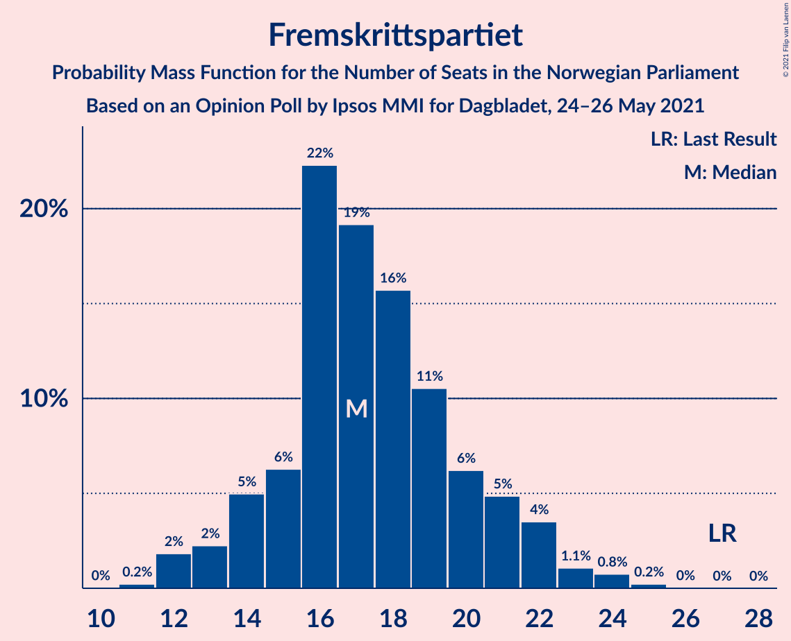
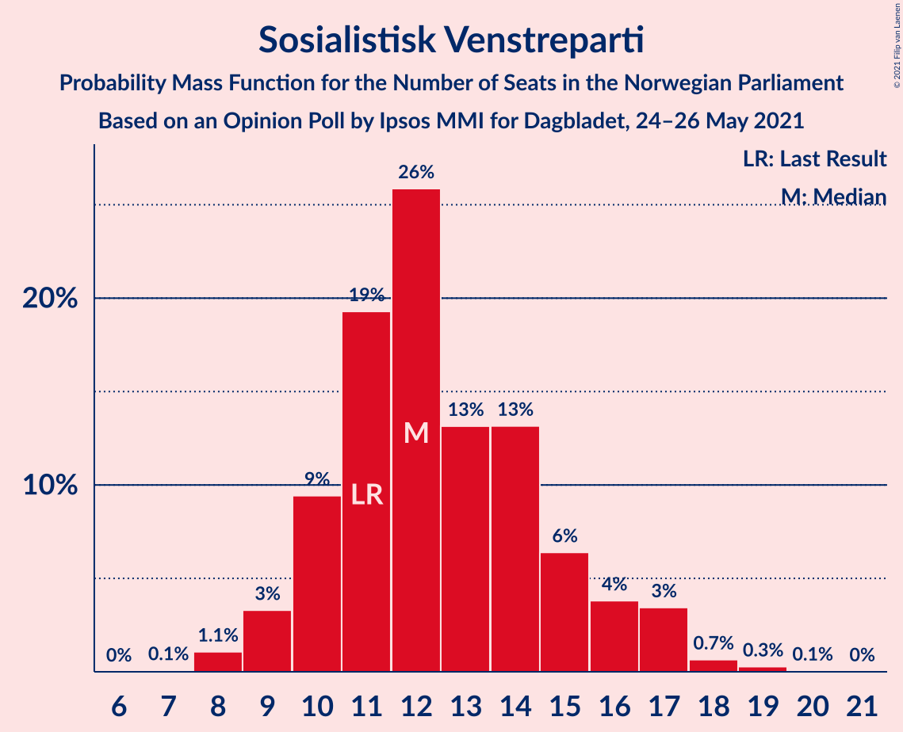
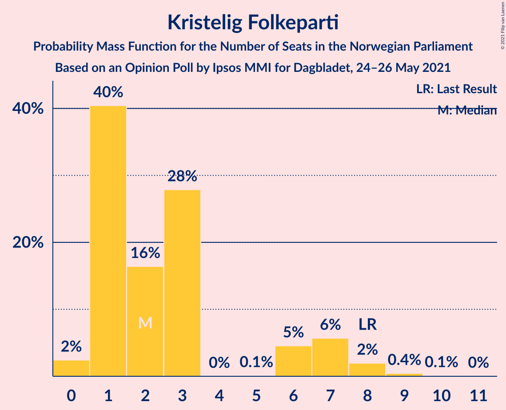
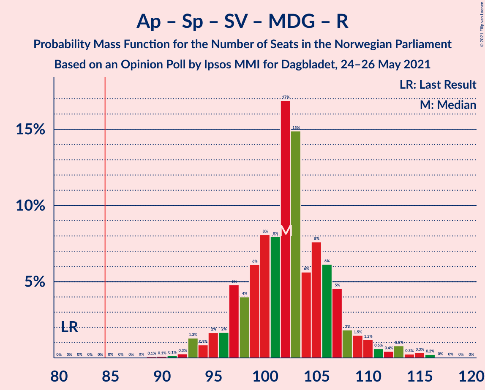
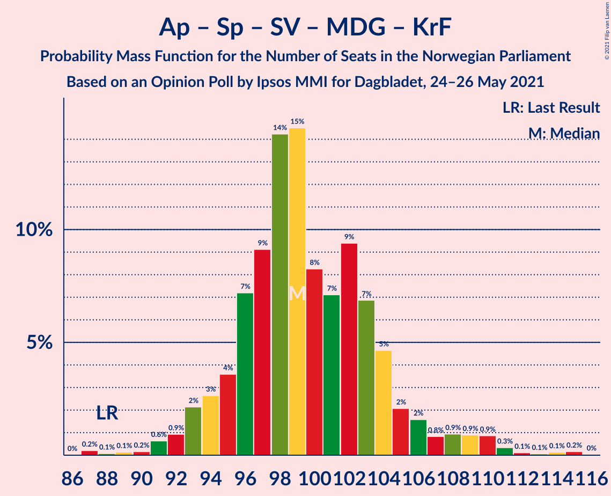
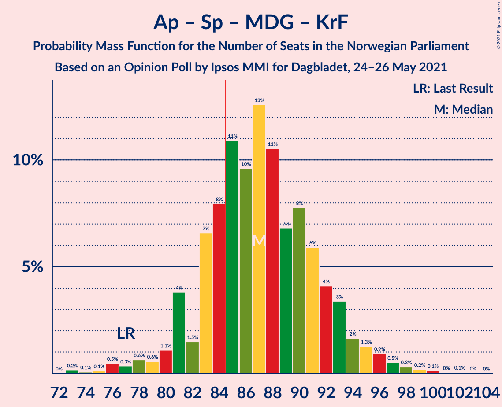
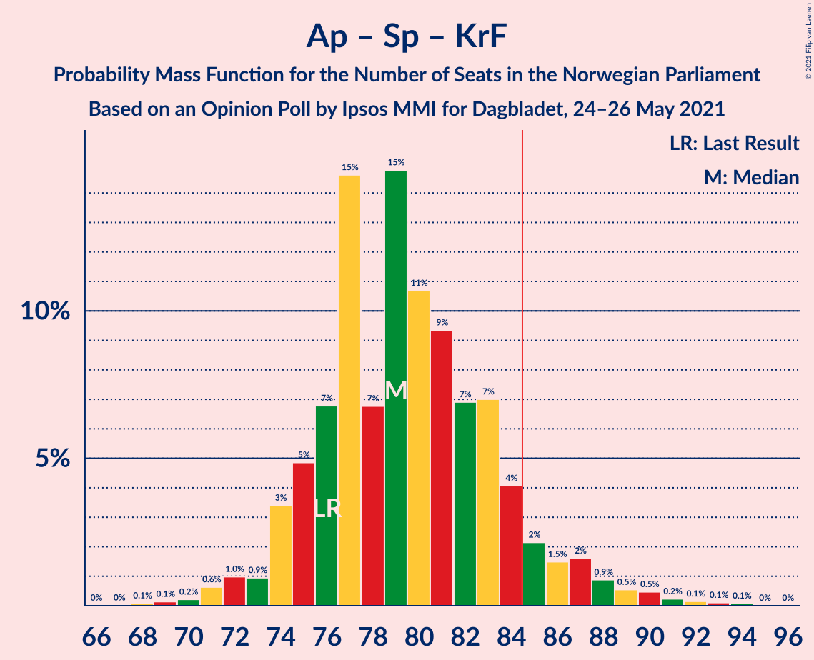
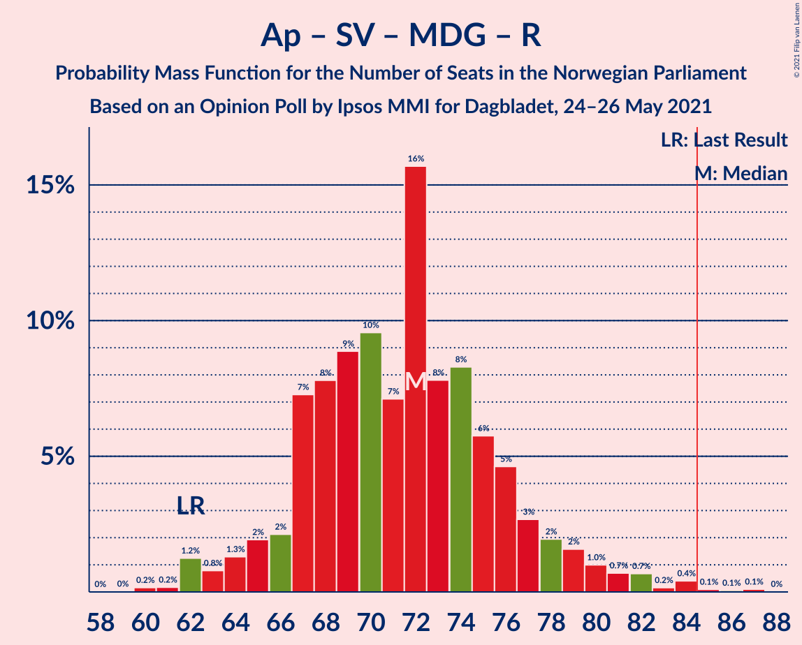
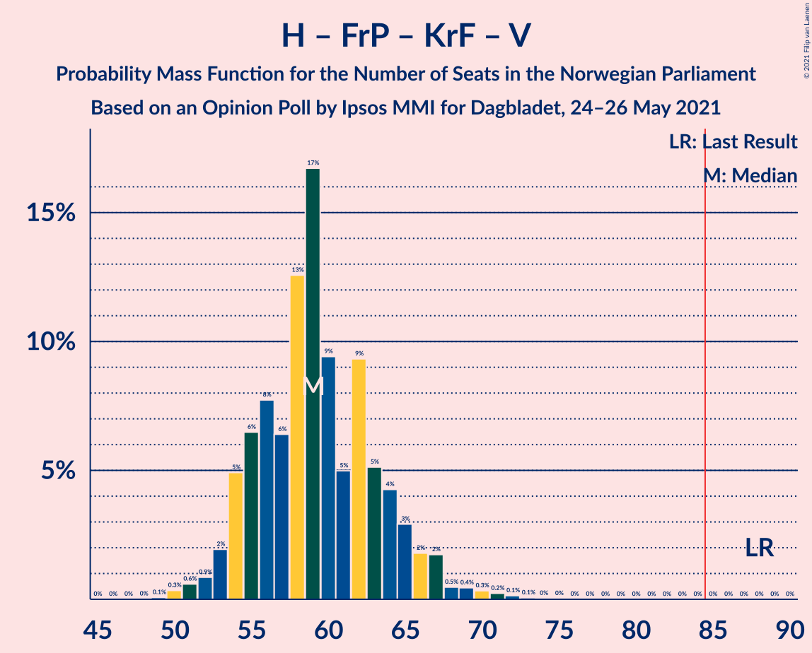
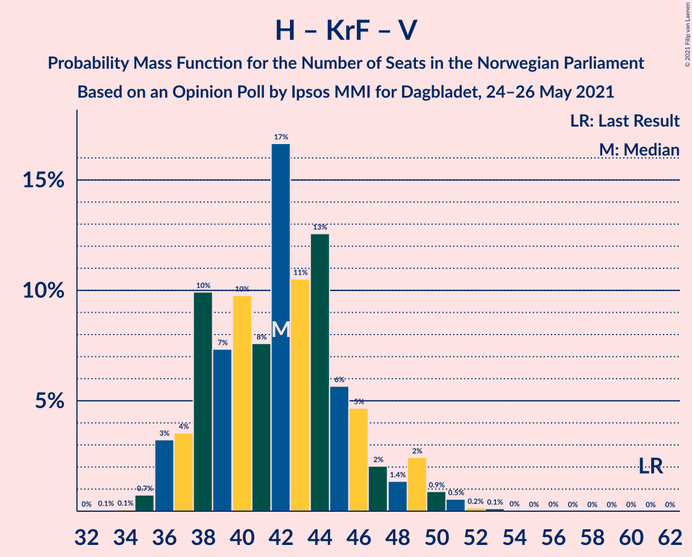

# Opinion Poll by Ipsos MMI for Dagbladet, 24–26 May 2021

<a href="#voting-intentions">Voting Intentions</a> | <a href="#seats">Seats</a> | <a href="#coalitions">Coalitions</a> | <a href="#technical-information">Technical Information</a>

## Voting Intentions

### Confidence Intervals

| Party | Last Result | Poll Result | 80% Confidence Interval | 90% Confidence Interval | 95% Confidence Interval | 99% Confidence Interval |
|:-----:|:-----------:|:-----------:|:-----------------------:|:-----------------------:|:-----------------------:|:-----------------------:|
| Arbeiderpartiet | 27.4% | 25.7% | 23.7–27.8% |23.1–28.4% |22.6–29.0% |21.7–30.0% |
| Høyre | 25.0% | 21.1% | 19.3–23.1% |18.7–23.7% |18.3–24.2% |17.4–25.2% |
| Senterpartiet | 10.3% | 16.4% | 14.7–18.2% |14.3–18.7% |13.9–19.2% |13.1–20.1% |
| Fremskrittspartiet | 15.2% | 10.1% | 8.8–11.7% |8.5–12.1% |8.2–12.5% |7.6–13.3% |
| Sosialistisk Venstreparti | 6.0% | 7.6% | 6.4–9.0% |6.1–9.4% |5.9–9.7% |5.4–10.4% |
| Miljøpartiet De Grønne | 3.2% | 4.7% | 3.9–5.9% |3.6–6.2% |3.4–6.5% |3.0–7.1% |
| Rødt | 2.4% | 4.1% | 3.3–5.2% |3.0–5.5% |2.9–5.7% |2.5–6.3% |
| Kristelig Folkeparti | 4.2% | 3.2% | 2.5–4.3% |2.3–4.5% |2.2–4.8% |1.9–5.3% |
| Venstre | 4.4% | 2.6% | 2.0–3.5% |1.8–3.7% |1.6–4.0% |1.4–4.5% |

*Note:* The poll result column reflects the actual value used in the calculations. Published results may vary slightly, and in addition be rounded to fewer digits.

## Seats

### Confidence Intervals

| Party | Last Result | Median | 80% Confidence Interval | 90% Confidence Interval | 95% Confidence Interval | 99% Confidence Interval |
|:-----:|:-----------:|:------:|:-----------------------:|:-----------------------:|:-----------------------:|:-----------------------:|
| <a href="#arbeiderpartiet">Arbeiderpartiet</a> | 49 | 46 | 44–53 |42–53 |41–54 |40–57 |
| <a href="#høyre">Høyre</a> | 45 | 38 | 34–42 |33–43 |32–44 |31–45 |
| <a href="#senterpartiet">Senterpartiet</a> | 19 | 31 | 25–34 |25–35 |25–36 |23–37 |
| <a href="#fremskrittspartiet">Fremskrittspartiet</a> | 27 | 17 | 15–21 |14–22 |13–23 |12–24 |
| <a href="#sosialistisk-venstreparti">Sosialistisk Venstreparti</a> | 11 | 13 | 10–16 |10–17 |9–17 |8–18 |
| <a href="#miljøpartiet-de-grønne">Miljøpartiet De Grønne</a> | 1 | 8 | 3–10 |2–11 |2–11 |2–11 |
| <a href="#rødt">Rødt</a> | 1 | 2 | 2–8 |2–9 |2–9 |1–11 |
| <a href="#kristelig-folkeparti">Kristelig Folkeparti</a> | 8 | 1 | 1–7 |0–7 |0–8 |0–9 |
| <a href="#venstre">Venstre</a> | 8 | 2 | 1–2 |0–3 |0–6 |0–8 |

### Arbeiderpartiet

*For a full overview of the results for this party, see the [Arbeiderpartiet](party-arbeiderpartiet.html) page.*

| Number of Seats | Probability | Accumulated | Special Marks |
|:---------------:|:-----------:|:-----------:|:-------------:|
| 38 | 0.1% | 100% |  |
| 39 | 0.2% | 99.9% |  |
| 40 | 0.4% | 99.8% |  |
| 41 | 4% | 99.4% |  |
| 42 | 2% | 95% |  |
| 43 | 2% | 93% |  |
| 44 | 13% | 91% |  |
| 45 | 23% | 78% |  |
| 46 | 13% | 55% | Median |
| 47 | 10% | 42% |  |
| 48 | 6% | 33% |  |
| 49 | 1.5% | 26% | Last Result |
| 50 | 1.5% | 25% |  |
| 51 | 3% | 23% |  |
| 52 | 2% | 20% |  |
| 53 | 15% | 18% |  |
| 54 | 0.8% | 3% |  |
| 55 | 0.3% | 2% |  |
| 56 | 0.4% | 2% |  |
| 57 | 2% | 2% |  |
| 58 | 0% | 0.1% |  |
| 59 | 0% | 0.1% |  |
| 60 | 0% | 0% |  |

### Høyre

*For a full overview of the results for this party, see the [Høyre](party-høyre.html) page.*

| Number of Seats | Probability | Accumulated | Special Marks |
|:---------------:|:-----------:|:-----------:|:-------------:|
| 29 | 0.1% | 100% |  |
| 30 | 0.1% | 99.9% |  |
| 31 | 0.7% | 99.8% |  |
| 32 | 3% | 99.1% |  |
| 33 | 3% | 96% |  |
| 34 | 11% | 94% |  |
| 35 | 12% | 83% |  |
| 36 | 9% | 71% |  |
| 37 | 6% | 62% |  |
| 38 | 30% | 55% | Median |
| 39 | 3% | 25% |  |
| 40 | 6% | 22% |  |
| 41 | 4% | 16% |  |
| 42 | 4% | 12% |  |
| 43 | 4% | 8% |  |
| 44 | 3% | 4% |  |
| 45 | 0.7% | 1.2% | Last Result |
| 46 | 0.3% | 0.4% |  |
| 47 | 0% | 0.1% |  |
| 48 | 0% | 0.1% |  |
| 49 | 0% | 0.1% |  |
| 50 | 0% | 0.1% |  |
| 51 | 0% | 0% |  |

### Senterpartiet

*For a full overview of the results for this party, see the [Senterpartiet](party-senterpartiet.html) page.*

| Number of Seats | Probability | Accumulated | Special Marks |
|:---------------:|:-----------:|:-----------:|:-------------:|
| 19 | 0% | 100% | Last Result |
| 20 | 0% | 100% |  |
| 21 | 0.1% | 100% |  |
| 22 | 0.4% | 99.9% |  |
| 23 | 0.3% | 99.6% |  |
| 24 | 2% | 99.3% |  |
| 25 | 16% | 98% |  |
| 26 | 3% | 82% |  |
| 27 | 3% | 79% |  |
| 28 | 8% | 76% |  |
| 29 | 9% | 69% |  |
| 30 | 4% | 59% |  |
| 31 | 10% | 56% | Median |
| 32 | 7% | 46% |  |
| 33 | 23% | 39% |  |
| 34 | 9% | 16% |  |
| 35 | 4% | 8% |  |
| 36 | 3% | 4% |  |
| 37 | 0.3% | 0.5% |  |
| 38 | 0% | 0.2% |  |
| 39 | 0.2% | 0.2% |  |
| 40 | 0% | 0% |  |

### Fremskrittspartiet

*For a full overview of the results for this party, see the [Fremskrittspartiet](party-fremskrittspartiet.html) page.*

| Number of Seats | Probability | Accumulated | Special Marks |
|:---------------:|:-----------:|:-----------:|:-------------:|
| 11 | 0.1% | 100% |  |
| 12 | 1.0% | 99.8% |  |
| 13 | 3% | 98.8% |  |
| 14 | 5% | 96% |  |
| 15 | 11% | 91% |  |
| 16 | 14% | 80% |  |
| 17 | 18% | 66% | Median |
| 18 | 4% | 48% |  |
| 19 | 18% | 44% |  |
| 20 | 16% | 27% |  |
| 21 | 3% | 11% |  |
| 22 | 5% | 8% |  |
| 23 | 1.4% | 3% |  |
| 24 | 1.0% | 1.3% |  |
| 25 | 0.3% | 0.4% |  |
| 26 | 0% | 0% |  |
| 27 | 0% | 0% | Last Result |

### Sosialistisk Venstreparti

*For a full overview of the results for this party, see the [Sosialistisk Venstreparti](party-sosialistiskvenstreparti.html) page.*

| Number of Seats | Probability | Accumulated | Special Marks |
|:---------------:|:-----------:|:-----------:|:-------------:|
| 7 | 0.3% | 100% |  |
| 8 | 1.1% | 99.7% |  |
| 9 | 3% | 98.6% |  |
| 10 | 7% | 96% |  |
| 11 | 14% | 89% | Last Result |
| 12 | 13% | 75% |  |
| 13 | 28% | 63% | Median |
| 14 | 15% | 35% |  |
| 15 | 2% | 20% |  |
| 16 | 11% | 18% |  |
| 17 | 5% | 6% |  |
| 18 | 0.6% | 0.9% |  |
| 19 | 0.3% | 0.3% |  |
| 20 | 0% | 0% |  |

### Miljøpartiet De Grønne

*For a full overview of the results for this party, see the [Miljøpartiet De Grønne](party-miljøpartietdegrønne.html) page.*

| Number of Seats | Probability | Accumulated | Special Marks |
|:---------------:|:-----------:|:-----------:|:-------------:|
| 1 | 0.4% | 100% | Last Result |
| 2 | 9% | 99.6% |  |
| 3 | 2% | 91% |  |
| 4 | 0.3% | 89% |  |
| 5 | 0% | 88% |  |
| 6 | 0.9% | 88% |  |
| 7 | 16% | 87% |  |
| 8 | 44% | 72% | Median |
| 9 | 12% | 28% |  |
| 10 | 8% | 16% |  |
| 11 | 8% | 8% |  |
| 12 | 0.2% | 0.4% |  |
| 13 | 0.1% | 0.2% |  |
| 14 | 0.1% | 0.1% |  |
| 15 | 0% | 0% |  |

### Rødt

*For a full overview of the results for this party, see the [Rødt](party-rødt.html) page.*

| Number of Seats | Probability | Accumulated | Special Marks |
|:---------------:|:-----------:|:-----------:|:-------------:|
| 1 | 2% | 100% | Last Result |
| 2 | 57% | 98% | Median |
| 3 | 0% | 41% |  |
| 4 | 0% | 41% |  |
| 5 | 0% | 41% |  |
| 6 | 3% | 41% |  |
| 7 | 17% | 38% |  |
| 8 | 16% | 21% |  |
| 9 | 4% | 6% |  |
| 10 | 1.4% | 2% |  |
| 11 | 0.5% | 0.6% |  |
| 12 | 0% | 0% |  |

### Kristelig Folkeparti

*For a full overview of the results for this party, see the [Kristelig Folkeparti](party-kristeligfolkeparti.html) page.*

| Number of Seats | Probability | Accumulated | Special Marks |
|:---------------:|:-----------:|:-----------:|:-------------:|
| 0 | 5% | 100% |  |
| 1 | 55% | 95% | Median |
| 2 | 8% | 40% |  |
| 3 | 20% | 32% |  |
| 4 | 0% | 13% |  |
| 5 | 0% | 13% |  |
| 6 | 2% | 13% |  |
| 7 | 6% | 11% |  |
| 8 | 4% | 5% | Last Result |
| 9 | 0.9% | 1.0% |  |
| 10 | 0.1% | 0.1% |  |
| 11 | 0% | 0% |  |

### Venstre

*For a full overview of the results for this party, see the [Venstre](party-venstre.html) page.*

| Number of Seats | Probability | Accumulated | Special Marks |
|:---------------:|:-----------:|:-----------:|:-------------:|
| 0 | 9% | 100% |  |
| 1 | 16% | 91% |  |
| 2 | 69% | 75% | Median |
| 3 | 3% | 6% |  |
| 4 | 0% | 3% |  |
| 5 | 0% | 3% |  |
| 6 | 2% | 3% |  |
| 7 | 0.6% | 1.2% |  |
| 8 | 0.5% | 0.6% | Last Result |
| 9 | 0% | 0% |  |

## Coalitions

### Confidence Intervals

| Coalition | Last Result | Median | Majority? | 80% Confidence Interval | 90% Confidence Interval | 95% Confidence Interval | 99% Confidence Interval |
|:---------:|:-----------:|:------:|:---------:|:-----------------------:|:-----------------------:|:-----------------------:|:-----------------------:|
| Arbeiderpartiet – Senterpartiet – Sosialistisk Venstreparti – Miljøpartiet De Grønne – Rødt | 81 | 102 | 100% | 98–108 | 96–109 | 94–109 | 92–115 |
| Arbeiderpartiet – Senterpartiet – Sosialistisk Venstreparti – Miljøpartiet De Grønne – Kristelig Folkeparti | 88 | 100 | 100% | 94–105 | 93–106 | 93–108 | 89–111 |
| Arbeiderpartiet – Senterpartiet – Sosialistisk Venstreparti – Miljøpartiet De Grønne | 80 | 99 | 100% | 92–102 | 91–104 | 89–106 | 88–107 |
| Arbeiderpartiet – Senterpartiet – Sosialistisk Venstreparti – Rødt | 80 | 94 | 99.5% | 91–100 | 90–100 | 88–102 | 85–108 |
| Høyre – Senterpartiet – Fremskrittspartiet – Kristelig Folkeparti – Venstre | 107 | 89 | 93% | 85–95 | 83–98 | 81–100 | 79–102 |
| Arbeiderpartiet – Senterpartiet – Sosialistisk Venstreparti | 79 | 91 | 95% | 86–93 | 84–95 | 83–96 | 81–100 |
| Arbeiderpartiet – Senterpartiet – Miljøpartiet De Grønne – Kristelig Folkeparti | 77 | 87 | 80% | 81–93 | 79–94 | 78–95 | 73–98 |
| Arbeiderpartiet – Senterpartiet – Kristelig Folkeparti | 76 | 79 | 8% | 75–84 | 72–86 | 71–87 | 71–90 |
| Arbeiderpartiet – Senterpartiet | 68 | 78 | 0.9% | 73–81 | 71–82 | 70–83 | 68–87 |
| Arbeiderpartiet – Sosialistisk Venstreparti – Miljøpartiet De Grønne – Rødt | 62 | 73 | 0.1% | 68–76 | 65–78 | 64–80 | 61–83 |
| Høyre – Fremskrittspartiet – Miljøpartiet De Grønne – Kristelig Folkeparti – Venstre | 89 | 67 | 0% | 61–72 | 60–76 | 60–77 | 58–82 |
| Høyre – Fremskrittspartiet – Kristelig Folkeparti – Venstre | 88 | 60 | 0% | 53–64 | 52–66 | 51–68 | 50–74 |
| Arbeiderpartiet – Sosialistisk Venstreparti | 60 | 59 | 0% | 56–66 | 55–66 | 54–67 | 52–70 |
| Høyre – Fremskrittspartiet – Venstre | 80 | 58 | 0% | 52–61 | 51–63 | 50–63 | 49–68 |
| Høyre – Fremskrittspartiet | 72 | 56 | 0% | 51–59 | 49–61 | 49–62 | 47–66 |
| Høyre – Kristelig Folkeparti – Venstre | 61 | 41 | 0% | 37–48 | 36–49 | 36–50 | 36–51 |
| Senterpartiet – Kristelig Folkeparti – Venstre | 35 | 35 | 0% | 28–39 | 28–41 | 28–43 | 26–45 |

### Arbeiderpartiet – Senterpartiet – Sosialistisk Venstreparti – Miljøpartiet De Grønne – Rødt

| Number of Seats | Probability | Accumulated | Special Marks |
|:---------------:|:-----------:|:-----------:|:-------------:|
| 81 | 0% | 100% | Last Result |
| 82 | 0% | 100% |  |
| 83 | 0% | 100% |  |
| 84 | 0% | 100% |  |
| 85 | 0% | 100% | Majority |
| 86 | 0% | 100% |  |
| 87 | 0% | 100% |  |
| 88 | 0% | 100% |  |
| 89 | 0.1% | 100% |  |
| 90 | 0.3% | 99.9% |  |
| 91 | 0.1% | 99.6% |  |
| 92 | 0.2% | 99.5% |  |
| 93 | 0.9% | 99.4% |  |
| 94 | 1.4% | 98% |  |
| 95 | 0.7% | 97% |  |
| 96 | 1.3% | 96% |  |
| 97 | 2% | 95% |  |
| 98 | 4% | 93% |  |
| 99 | 8% | 88% |  |
| 100 | 9% | 81% | Median |
| 101 | 19% | 71% |  |
| 102 | 11% | 53% |  |
| 103 | 10% | 42% |  |
| 104 | 3% | 32% |  |
| 105 | 9% | 30% |  |
| 106 | 3% | 21% |  |
| 107 | 4% | 18% |  |
| 108 | 7% | 14% |  |
| 109 | 4% | 7% |  |
| 110 | 0.5% | 2% |  |
| 111 | 1.1% | 2% |  |
| 112 | 0.1% | 0.8% |  |
| 113 | 0% | 0.7% |  |
| 114 | 0.1% | 0.7% |  |
| 115 | 0.4% | 0.6% |  |
| 116 | 0% | 0.2% |  |
| 117 | 0.1% | 0.2% |  |
| 118 | 0% | 0% |  |

### Arbeiderpartiet – Senterpartiet – Sosialistisk Venstreparti – Miljøpartiet De Grønne – Kristelig Folkeparti

| Number of Seats | Probability | Accumulated | Special Marks |
|:---------------:|:-----------:|:-----------:|:-------------:|
| 88 | 0% | 100% | Last Result |
| 89 | 0.6% | 99.9% |  |
| 90 | 0.6% | 99.4% |  |
| 91 | 0.4% | 98.8% |  |
| 92 | 0.7% | 98% |  |
| 93 | 4% | 98% |  |
| 94 | 5% | 94% |  |
| 95 | 1.0% | 89% |  |
| 96 | 2% | 88% |  |
| 97 | 2% | 86% |  |
| 98 | 3% | 83% |  |
| 99 | 10% | 81% | Median |
| 100 | 27% | 70% |  |
| 101 | 10% | 43% |  |
| 102 | 7% | 33% |  |
| 103 | 7% | 26% |  |
| 104 | 9% | 19% |  |
| 105 | 5% | 10% |  |
| 106 | 2% | 5% |  |
| 107 | 1.2% | 4% |  |
| 108 | 1.4% | 3% |  |
| 109 | 0.2% | 1.2% |  |
| 110 | 0.3% | 0.9% |  |
| 111 | 0.2% | 0.6% |  |
| 112 | 0.1% | 0.4% |  |
| 113 | 0% | 0.3% |  |
| 114 | 0% | 0.3% |  |
| 115 | 0.2% | 0.3% |  |
| 116 | 0.1% | 0.1% |  |
| 117 | 0% | 0% |  |

### Arbeiderpartiet – Senterpartiet – Sosialistisk Venstreparti – Miljøpartiet De Grønne

| Number of Seats | Probability | Accumulated | Special Marks |
|:---------------:|:-----------:|:-----------:|:-------------:|
| 80 | 0% | 100% | Last Result |
| 81 | 0% | 100% |  |
| 82 | 0% | 100% |  |
| 83 | 0% | 100% |  |
| 84 | 0% | 100% |  |
| 85 | 0% | 100% | Majority |
| 86 | 0.2% | 100% |  |
| 87 | 0.2% | 99.8% |  |
| 88 | 1.0% | 99.6% |  |
| 89 | 1.2% | 98.6% |  |
| 90 | 0.7% | 97% |  |
| 91 | 3% | 97% |  |
| 92 | 7% | 94% |  |
| 93 | 4% | 87% |  |
| 94 | 1.4% | 83% |  |
| 95 | 3% | 82% |  |
| 96 | 5% | 79% |  |
| 97 | 11% | 74% |  |
| 98 | 5% | 63% | Median |
| 99 | 22% | 58% |  |
| 100 | 10% | 36% |  |
| 101 | 14% | 26% |  |
| 102 | 3% | 12% |  |
| 103 | 4% | 9% |  |
| 104 | 2% | 5% |  |
| 105 | 0.2% | 3% |  |
| 106 | 0.8% | 3% |  |
| 107 | 2% | 2% |  |
| 108 | 0% | 0.4% |  |
| 109 | 0.2% | 0.4% |  |
| 110 | 0% | 0.2% |  |
| 111 | 0% | 0.2% |  |
| 112 | 0% | 0.2% |  |
| 113 | 0.2% | 0.2% |  |
| 114 | 0% | 0% |  |

### Arbeiderpartiet – Senterpartiet – Sosialistisk Venstreparti – Rødt

| Number of Seats | Probability | Accumulated | Special Marks |
|:---------------:|:-----------:|:-----------:|:-------------:|
| 80 | 0% | 100% | Last Result |
| 81 | 0% | 100% |  |
| 82 | 0% | 100% |  |
| 83 | 0% | 100% |  |
| 84 | 0.4% | 99.9% |  |
| 85 | 0.2% | 99.5% | Majority |
| 86 | 0.8% | 99.3% |  |
| 87 | 1.0% | 98.5% |  |
| 88 | 1.0% | 98% |  |
| 89 | 1.5% | 96% |  |
| 90 | 2% | 95% |  |
| 91 | 9% | 93% |  |
| 92 | 6% | 83% | Median |
| 93 | 22% | 77% |  |
| 94 | 11% | 55% |  |
| 95 | 10% | 44% |  |
| 96 | 2% | 33% |  |
| 97 | 7% | 31% |  |
| 98 | 7% | 24% |  |
| 99 | 5% | 17% |  |
| 100 | 7% | 12% |  |
| 101 | 2% | 5% |  |
| 102 | 0.8% | 3% |  |
| 103 | 0.1% | 2% |  |
| 104 | 0.3% | 2% |  |
| 105 | 0.2% | 2% |  |
| 106 | 0.3% | 2% |  |
| 107 | 0.3% | 1.4% |  |
| 108 | 0.7% | 1.0% |  |
| 109 | 0.3% | 0.4% |  |
| 110 | 0.1% | 0.1% |  |
| 111 | 0% | 0% |  |

### Høyre – Senterpartiet – Fremskrittspartiet – Kristelig Folkeparti – Venstre

| Number of Seats | Probability | Accumulated | Special Marks |
|:---------------:|:-----------:|:-----------:|:-------------:|
| 77 | 0.1% | 100% |  |
| 78 | 0.1% | 99.9% |  |
| 79 | 0.9% | 99.8% |  |
| 80 | 0.6% | 98.9% |  |
| 81 | 1.2% | 98% |  |
| 82 | 1.3% | 97% |  |
| 83 | 2% | 96% |  |
| 84 | 1.1% | 94% |  |
| 85 | 18% | 93% | Majority |
| 86 | 5% | 75% |  |
| 87 | 13% | 70% |  |
| 88 | 2% | 57% |  |
| 89 | 5% | 55% | Median |
| 90 | 5% | 50% |  |
| 91 | 8% | 44% |  |
| 92 | 7% | 36% |  |
| 93 | 8% | 29% |  |
| 94 | 10% | 21% |  |
| 95 | 2% | 11% |  |
| 96 | 1.5% | 9% |  |
| 97 | 1.0% | 7% |  |
| 98 | 2% | 6% |  |
| 99 | 0.5% | 4% |  |
| 100 | 3% | 4% |  |
| 101 | 0.4% | 1.0% |  |
| 102 | 0.3% | 0.6% |  |
| 103 | 0% | 0.3% |  |
| 104 | 0.2% | 0.3% |  |
| 105 | 0% | 0% |  |
| 106 | 0% | 0% |  |
| 107 | 0% | 0% | Last Result |

### Arbeiderpartiet – Senterpartiet – Sosialistisk Venstreparti

| Number of Seats | Probability | Accumulated | Special Marks |
|:---------------:|:-----------:|:-----------:|:-------------:|
| 79 | 0.1% | 100% | Last Result |
| 80 | 0.2% | 99.9% |  |
| 81 | 0.2% | 99.7% |  |
| 82 | 0.5% | 99.5% |  |
| 83 | 2% | 98.9% |  |
| 84 | 2% | 97% |  |
| 85 | 3% | 95% | Majority |
| 86 | 6% | 92% |  |
| 87 | 4% | 87% |  |
| 88 | 4% | 83% |  |
| 89 | 10% | 79% |  |
| 90 | 12% | 68% | Median |
| 91 | 18% | 56% |  |
| 92 | 19% | 38% |  |
| 93 | 9% | 19% |  |
| 94 | 3% | 10% |  |
| 95 | 2% | 7% |  |
| 96 | 3% | 5% |  |
| 97 | 0.4% | 2% |  |
| 98 | 0.4% | 2% |  |
| 99 | 0.9% | 2% |  |
| 100 | 0.3% | 0.7% |  |
| 101 | 0.1% | 0.4% |  |
| 102 | 0% | 0.3% |  |
| 103 | 0% | 0.3% |  |
| 104 | 0.2% | 0.2% |  |
| 105 | 0% | 0% |  |

### Arbeiderpartiet – Senterpartiet – Miljøpartiet De Grønne – Kristelig Folkeparti

| Number of Seats | Probability | Accumulated | Special Marks |
|:---------------:|:-----------:|:-----------:|:-------------:|
| 73 | 0.6% | 100% |  |
| 74 | 0% | 99.4% |  |
| 75 | 0.3% | 99.4% |  |
| 76 | 0.3% | 99.1% |  |
| 77 | 0.3% | 98.8% | Last Result |
| 78 | 3% | 98% |  |
| 79 | 1.2% | 95% |  |
| 80 | 4% | 94% |  |
| 81 | 0.6% | 91% |  |
| 82 | 1.2% | 90% |  |
| 83 | 6% | 89% |  |
| 84 | 3% | 83% |  |
| 85 | 2% | 80% | Majority |
| 86 | 4% | 78% | Median |
| 87 | 27% | 74% |  |
| 88 | 16% | 47% |  |
| 89 | 5% | 31% |  |
| 90 | 8% | 26% |  |
| 91 | 4% | 18% |  |
| 92 | 2% | 14% |  |
| 93 | 6% | 12% |  |
| 94 | 2% | 6% |  |
| 95 | 3% | 4% |  |
| 96 | 0.4% | 1.2% |  |
| 97 | 0.3% | 0.8% |  |
| 98 | 0% | 0.5% |  |
| 99 | 0.1% | 0.5% |  |
| 100 | 0.1% | 0.4% |  |
| 101 | 0.3% | 0.3% |  |
| 102 | 0% | 0% |  |

### Arbeiderpartiet – Senterpartiet – Kristelig Folkeparti

| Number of Seats | Probability | Accumulated | Special Marks |
|:---------------:|:-----------:|:-----------:|:-------------:|
| 67 | 0% | 100% |  |
| 68 | 0% | 99.9% |  |
| 69 | 0% | 99.9% |  |
| 70 | 0.1% | 99.9% |  |
| 71 | 3% | 99.8% |  |
| 72 | 2% | 96% |  |
| 73 | 0.9% | 95% |  |
| 74 | 0.4% | 94% |  |
| 75 | 6% | 93% |  |
| 76 | 2% | 88% | Last Result |
| 77 | 3% | 85% |  |
| 78 | 9% | 83% | Median |
| 79 | 28% | 74% |  |
| 80 | 16% | 46% |  |
| 81 | 4% | 30% |  |
| 82 | 9% | 27% |  |
| 83 | 5% | 17% |  |
| 84 | 4% | 12% |  |
| 85 | 2% | 8% | Majority |
| 86 | 3% | 6% |  |
| 87 | 2% | 3% |  |
| 88 | 0.4% | 1.5% |  |
| 89 | 0.3% | 1.1% |  |
| 90 | 0.3% | 0.7% |  |
| 91 | 0.1% | 0.5% |  |
| 92 | 0.3% | 0.4% |  |
| 93 | 0% | 0.1% |  |
| 94 | 0% | 0% |  |

### Arbeiderpartiet – Senterpartiet

| Number of Seats | Probability | Accumulated | Special Marks |
|:---------------:|:-----------:|:-----------:|:-------------:|
| 64 | 0% | 100% |  |
| 65 | 0% | 99.9% |  |
| 66 | 0% | 99.9% |  |
| 67 | 0.3% | 99.9% |  |
| 68 | 0.1% | 99.6% | Last Result |
| 69 | 0.2% | 99.5% |  |
| 70 | 4% | 99.3% |  |
| 71 | 2% | 95% |  |
| 72 | 2% | 93% |  |
| 73 | 2% | 91% |  |
| 74 | 6% | 89% |  |
| 75 | 3% | 83% |  |
| 76 | 6% | 80% |  |
| 77 | 19% | 74% | Median |
| 78 | 25% | 54% |  |
| 79 | 8% | 30% |  |
| 80 | 7% | 22% |  |
| 81 | 7% | 15% |  |
| 82 | 3% | 8% |  |
| 83 | 3% | 5% |  |
| 84 | 1.0% | 2% |  |
| 85 | 0.2% | 0.9% | Majority |
| 86 | 0.1% | 0.7% |  |
| 87 | 0.3% | 0.7% |  |
| 88 | 0.1% | 0.4% |  |
| 89 | 0.1% | 0.3% |  |
| 90 | 0.2% | 0.2% |  |
| 91 | 0% | 0% |  |

### Arbeiderpartiet – Sosialistisk Venstreparti – Miljøpartiet De Grønne – Rødt

| Number of Seats | Probability | Accumulated | Special Marks |
|:---------------:|:-----------:|:-----------:|:-------------:|
| 59 | 0.1% | 100% |  |
| 60 | 0.1% | 99.9% |  |
| 61 | 0.6% | 99.8% |  |
| 62 | 0.3% | 99.1% | Last Result |
| 63 | 0.2% | 98.8% |  |
| 64 | 3% | 98.6% |  |
| 65 | 0.9% | 96% |  |
| 66 | 0.8% | 95% |  |
| 67 | 3% | 94% |  |
| 68 | 11% | 91% |  |
| 69 | 15% | 80% | Median |
| 70 | 5% | 64% |  |
| 71 | 4% | 60% |  |
| 72 | 5% | 55% |  |
| 73 | 10% | 51% |  |
| 74 | 8% | 41% |  |
| 75 | 7% | 33% |  |
| 76 | 18% | 26% |  |
| 77 | 2% | 8% |  |
| 78 | 1.2% | 6% |  |
| 79 | 2% | 5% |  |
| 80 | 1.1% | 3% |  |
| 81 | 1.3% | 2% |  |
| 82 | 0.4% | 1.1% |  |
| 83 | 0.5% | 0.7% |  |
| 84 | 0.1% | 0.3% |  |
| 85 | 0% | 0.1% | Majority |
| 86 | 0% | 0.1% |  |
| 87 | 0% | 0.1% |  |
| 88 | 0% | 0% |  |

### Høyre – Fremskrittspartiet – Miljøpartiet De Grønne – Kristelig Folkeparti – Venstre

| Number of Seats | Probability | Accumulated | Special Marks |
|:---------------:|:-----------:|:-----------:|:-------------:|
| 54 | 0% | 100% |  |
| 55 | 0% | 99.9% |  |
| 56 | 0.1% | 99.9% |  |
| 57 | 0.1% | 99.8% |  |
| 58 | 1.0% | 99.7% |  |
| 59 | 0.9% | 98.7% |  |
| 60 | 4% | 98% |  |
| 61 | 5% | 94% |  |
| 62 | 6% | 89% |  |
| 63 | 10% | 83% |  |
| 64 | 3% | 73% |  |
| 65 | 5% | 70% |  |
| 66 | 8% | 64% | Median |
| 67 | 12% | 56% |  |
| 68 | 15% | 44% |  |
| 69 | 6% | 30% |  |
| 70 | 2% | 23% |  |
| 71 | 10% | 21% |  |
| 72 | 2% | 11% |  |
| 73 | 0.7% | 9% |  |
| 74 | 3% | 8% |  |
| 75 | 0.1% | 5% |  |
| 76 | 0.6% | 5% |  |
| 77 | 3% | 5% |  |
| 78 | 0.5% | 2% |  |
| 79 | 0.1% | 1.4% |  |
| 80 | 0.1% | 1.3% |  |
| 81 | 0.6% | 1.2% |  |
| 82 | 0.4% | 0.7% |  |
| 83 | 0.2% | 0.2% |  |
| 84 | 0% | 0% |  |
| 85 | 0% | 0% | Majority |
| 86 | 0% | 0% |  |
| 87 | 0% | 0% |  |
| 88 | 0% | 0% |  |
| 89 | 0% | 0% | Last Result |

### Høyre – Fremskrittspartiet – Kristelig Folkeparti – Venstre

| Number of Seats | Probability | Accumulated | Special Marks |
|:---------------:|:-----------:|:-----------:|:-------------:|
| 50 | 0.7% | 100% |  |
| 51 | 2% | 99.3% |  |
| 52 | 3% | 97% |  |
| 53 | 5% | 94% |  |
| 54 | 6% | 88% |  |
| 55 | 4% | 83% |  |
| 56 | 5% | 79% |  |
| 57 | 6% | 74% |  |
| 58 | 8% | 68% | Median |
| 59 | 10% | 60% |  |
| 60 | 15% | 50% |  |
| 61 | 6% | 35% |  |
| 62 | 5% | 29% |  |
| 63 | 7% | 24% |  |
| 64 | 9% | 17% |  |
| 65 | 0.4% | 8% |  |
| 66 | 4% | 8% |  |
| 67 | 1.2% | 4% |  |
| 68 | 0.4% | 3% |  |
| 69 | 0.6% | 2% |  |
| 70 | 0.7% | 2% |  |
| 71 | 0.5% | 1.1% |  |
| 72 | 0.1% | 0.6% |  |
| 73 | 0% | 0.5% |  |
| 74 | 0.3% | 0.5% |  |
| 75 | 0.2% | 0.2% |  |
| 76 | 0% | 0% |  |
| 77 | 0% | 0% |  |
| 78 | 0% | 0% |  |
| 79 | 0% | 0% |  |
| 80 | 0% | 0% |  |
| 81 | 0% | 0% |  |
| 82 | 0% | 0% |  |
| 83 | 0% | 0% |  |
| 84 | 0% | 0% |  |
| 85 | 0% | 0% | Majority |
| 86 | 0% | 0% |  |
| 87 | 0% | 0% |  |
| 88 | 0% | 0% | Last Result |

### Arbeiderpartiet – Sosialistisk Venstreparti

| Number of Seats | Probability | Accumulated | Special Marks |
|:---------------:|:-----------:|:-----------:|:-------------:|
| 49 | 0.1% | 100% |  |
| 50 | 0% | 99.9% |  |
| 51 | 0.1% | 99.8% |  |
| 52 | 0.5% | 99.7% |  |
| 53 | 1.3% | 99.2% |  |
| 54 | 2% | 98% |  |
| 55 | 6% | 96% |  |
| 56 | 9% | 90% |  |
| 57 | 5% | 82% |  |
| 58 | 16% | 77% |  |
| 59 | 18% | 61% | Median |
| 60 | 7% | 43% | Last Result |
| 61 | 5% | 36% |  |
| 62 | 2% | 31% |  |
| 63 | 6% | 29% |  |
| 64 | 3% | 23% |  |
| 65 | 2% | 20% |  |
| 66 | 15% | 18% |  |
| 67 | 2% | 3% |  |
| 68 | 0.3% | 2% |  |
| 69 | 0.2% | 1.2% |  |
| 70 | 0.9% | 1.0% |  |
| 71 | 0% | 0.1% |  |
| 72 | 0.1% | 0.1% |  |
| 73 | 0% | 0% |  |

### Høyre – Fremskrittspartiet – Venstre

| Number of Seats | Probability | Accumulated | Special Marks |
|:---------------:|:-----------:|:-----------:|:-------------:|
| 47 | 0.2% | 100% |  |
| 48 | 0.2% | 99.8% |  |
| 49 | 1.3% | 99.6% |  |
| 50 | 3% | 98% |  |
| 51 | 3% | 96% |  |
| 52 | 7% | 93% |  |
| 53 | 4% | 86% |  |
| 54 | 10% | 83% |  |
| 55 | 8% | 72% |  |
| 56 | 6% | 64% |  |
| 57 | 8% | 58% | Median |
| 58 | 11% | 51% |  |
| 59 | 14% | 40% |  |
| 60 | 10% | 25% |  |
| 61 | 7% | 15% |  |
| 62 | 1.4% | 8% |  |
| 63 | 5% | 7% |  |
| 64 | 0.4% | 2% |  |
| 65 | 0.4% | 2% |  |
| 66 | 0.2% | 1.2% |  |
| 67 | 0.1% | 1.0% |  |
| 68 | 0.6% | 0.9% |  |
| 69 | 0% | 0.3% |  |
| 70 | 0% | 0.3% |  |
| 71 | 0.3% | 0.3% |  |
| 72 | 0% | 0% |  |
| 73 | 0% | 0% |  |
| 74 | 0% | 0% |  |
| 75 | 0% | 0% |  |
| 76 | 0% | 0% |  |
| 77 | 0% | 0% |  |
| 78 | 0% | 0% |  |
| 79 | 0% | 0% |  |
| 80 | 0% | 0% | Last Result |

### Høyre – Fremskrittspartiet

| Number of Seats | Probability | Accumulated | Special Marks |
|:---------------:|:-----------:|:-----------:|:-------------:|
| 45 | 0% | 100% |  |
| 46 | 0.2% | 99.9% |  |
| 47 | 0.9% | 99.8% |  |
| 48 | 0.5% | 98.8% |  |
| 49 | 3% | 98% |  |
| 50 | 4% | 95% |  |
| 51 | 6% | 91% |  |
| 52 | 11% | 85% |  |
| 53 | 8% | 74% |  |
| 54 | 6% | 66% |  |
| 55 | 10% | 61% | Median |
| 56 | 12% | 51% |  |
| 57 | 15% | 38% |  |
| 58 | 10% | 24% |  |
| 59 | 4% | 14% |  |
| 60 | 3% | 10% |  |
| 61 | 4% | 7% |  |
| 62 | 1.4% | 3% |  |
| 63 | 0.2% | 2% |  |
| 64 | 0.3% | 1.4% |  |
| 65 | 0.2% | 1.1% |  |
| 66 | 0.6% | 0.9% |  |
| 67 | 0% | 0.3% |  |
| 68 | 0% | 0.3% |  |
| 69 | 0.2% | 0.3% |  |
| 70 | 0% | 0% |  |
| 71 | 0% | 0% |  |
| 72 | 0% | 0% | Last Result |

### Høyre – Kristelig Folkeparti – Venstre

| Number of Seats | Probability | Accumulated | Special Marks |
|:---------------:|:-----------:|:-----------:|:-------------:|
| 33 | 0% | 100% |  |
| 34 | 0% | 99.9% |  |
| 35 | 0.2% | 99.9% |  |
| 36 | 5% | 99.7% |  |
| 37 | 17% | 94% |  |
| 38 | 9% | 77% |  |
| 39 | 6% | 69% |  |
| 40 | 1.1% | 63% |  |
| 41 | 19% | 62% | Median |
| 42 | 5% | 42% |  |
| 43 | 12% | 37% |  |
| 44 | 2% | 25% |  |
| 45 | 5% | 23% |  |
| 46 | 4% | 19% |  |
| 47 | 4% | 15% |  |
| 48 | 2% | 11% |  |
| 49 | 5% | 9% |  |
| 50 | 2% | 4% |  |
| 51 | 2% | 2% |  |
| 52 | 0% | 0.4% |  |
| 53 | 0.3% | 0.3% |  |
| 54 | 0% | 0% |  |
| 55 | 0% | 0% |  |
| 56 | 0% | 0% |  |
| 57 | 0% | 0% |  |
| 58 | 0% | 0% |  |
| 59 | 0% | 0% |  |
| 60 | 0% | 0% |  |
| 61 | 0% | 0% | Last Result |

### Senterpartiet – Kristelig Folkeparti – Venstre

| Number of Seats | Probability | Accumulated | Special Marks |
|:---------------:|:-----------:|:-----------:|:-------------:|
| 25 | 0.4% | 100% |  |
| 26 | 1.0% | 99.6% |  |
| 27 | 0.3% | 98.6% |  |
| 28 | 15% | 98% |  |
| 29 | 2% | 83% |  |
| 30 | 2% | 81% |  |
| 31 | 6% | 80% |  |
| 32 | 5% | 73% |  |
| 33 | 5% | 69% |  |
| 34 | 8% | 64% | Median |
| 35 | 10% | 56% | Last Result |
| 36 | 18% | 46% |  |
| 37 | 9% | 28% |  |
| 38 | 4% | 18% |  |
| 39 | 5% | 15% |  |
| 40 | 3% | 10% |  |
| 41 | 2% | 7% |  |
| 42 | 1.2% | 5% |  |
| 43 | 2% | 3% |  |
| 44 | 0.4% | 1.2% |  |
| 45 | 0.3% | 0.8% |  |
| 46 | 0.3% | 0.5% |  |
| 47 | 0.1% | 0.2% |  |
| 48 | 0% | 0.1% |  |
| 49 | 0% | 0.1% |  |
| 50 | 0% | 0% |  |

## Technical Information

### Opinion Poll

+ **Polling firm:** Ipsos MMI
+ **Commissioner(s):** Dagbladet
+ **Fieldwork period:** 24–26 May 2021

### Calculations

+ **Sample size:** 740
+ **Simulations done:** 131,072
+ **Error estimate:** 3.29%

