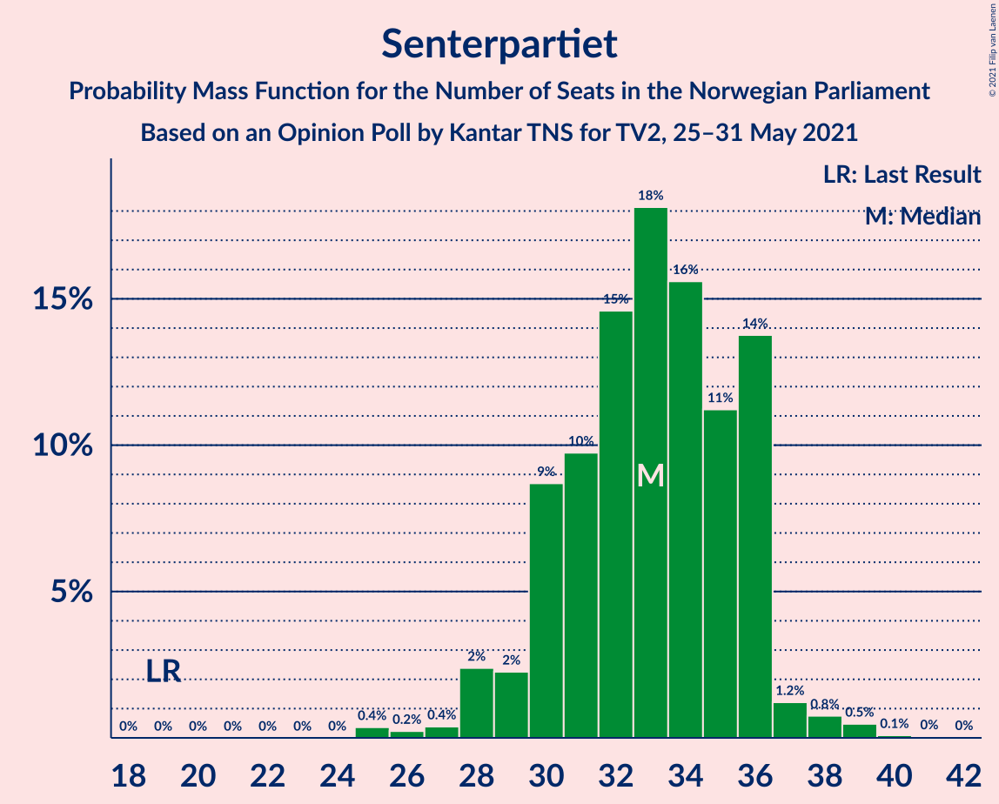
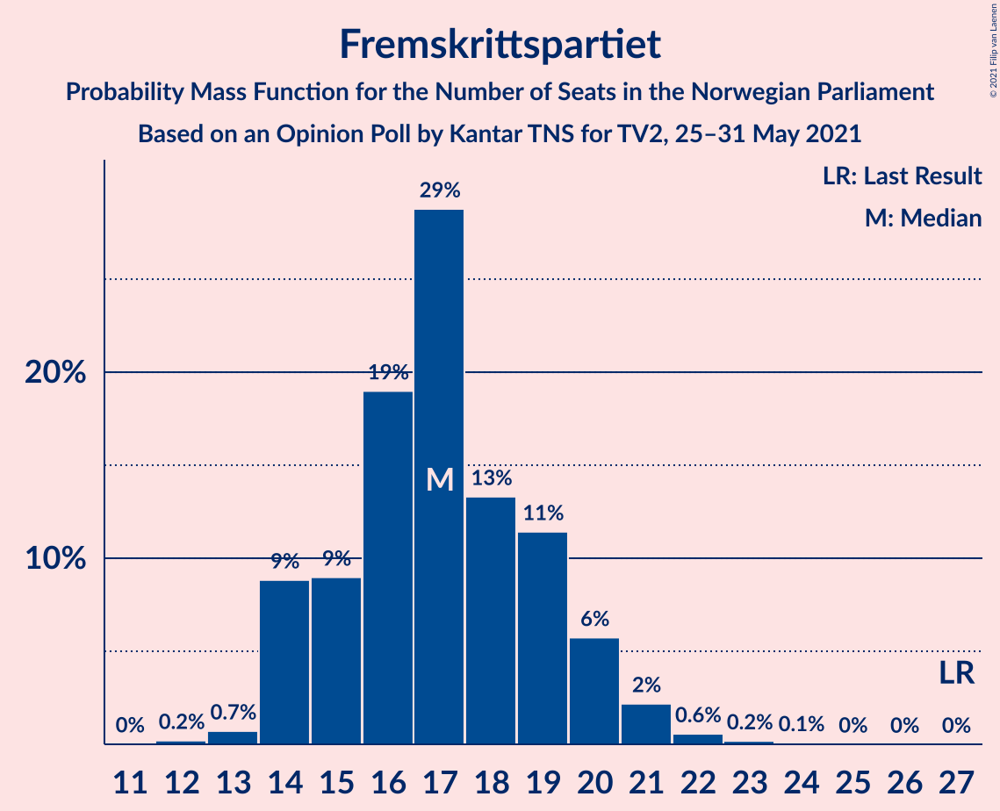
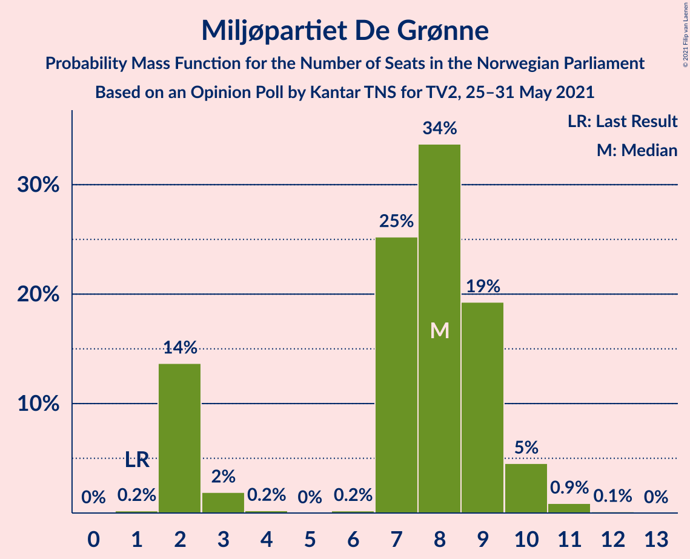
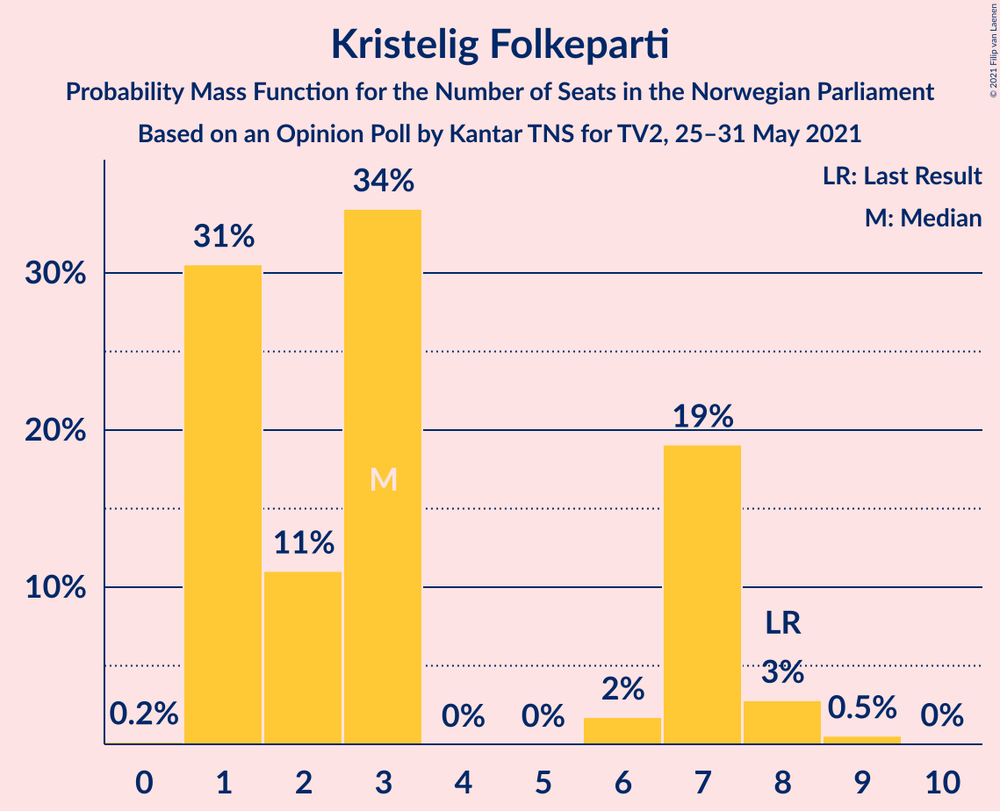
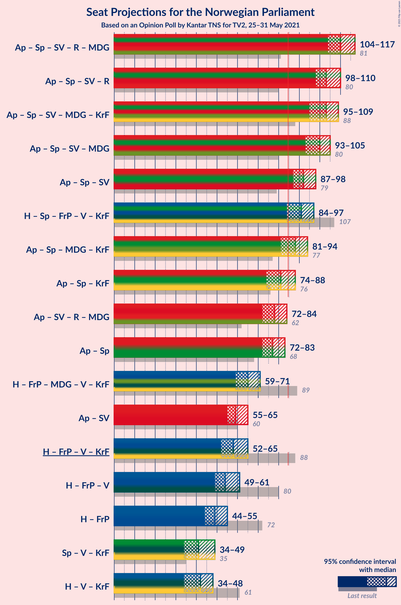
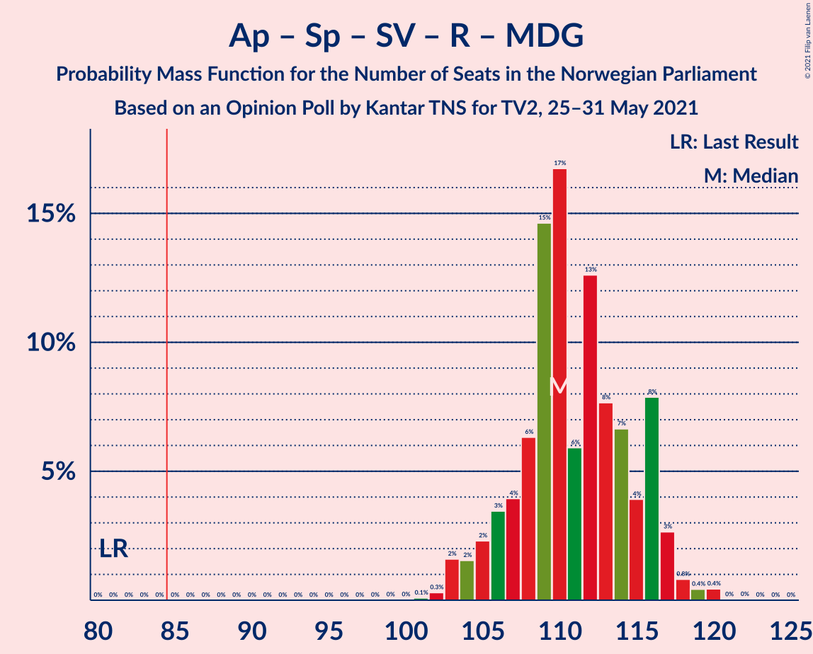
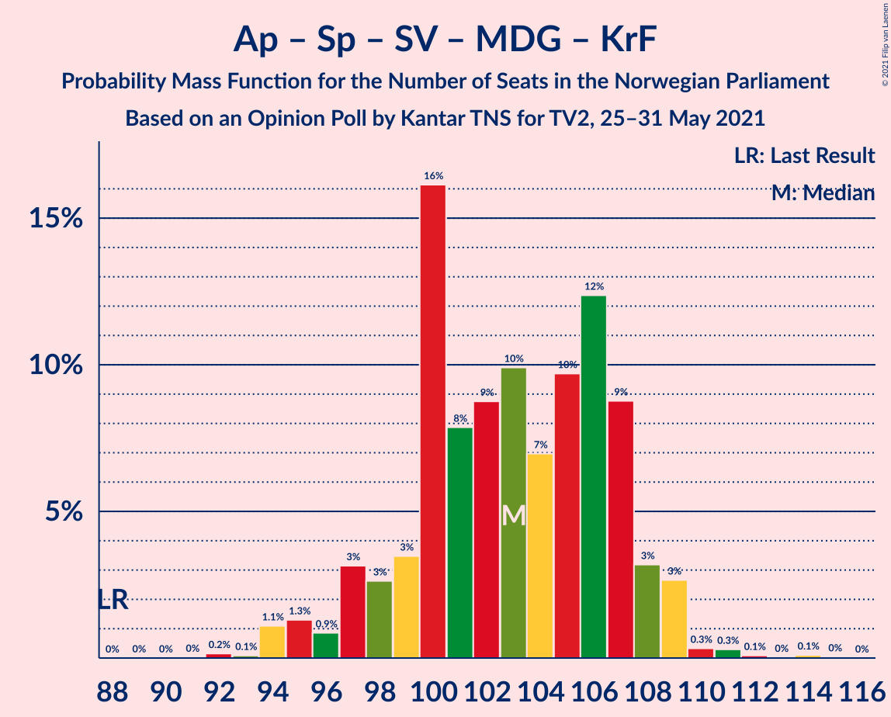
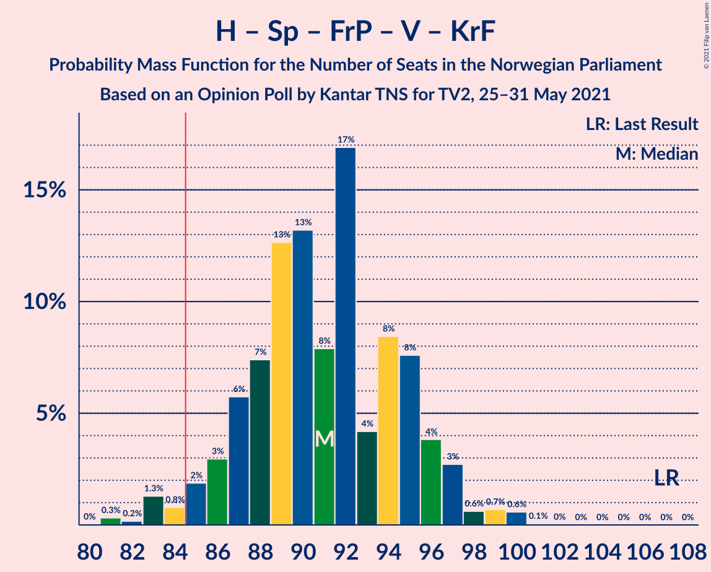
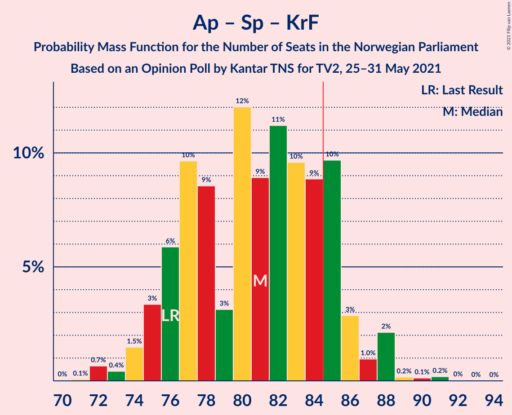
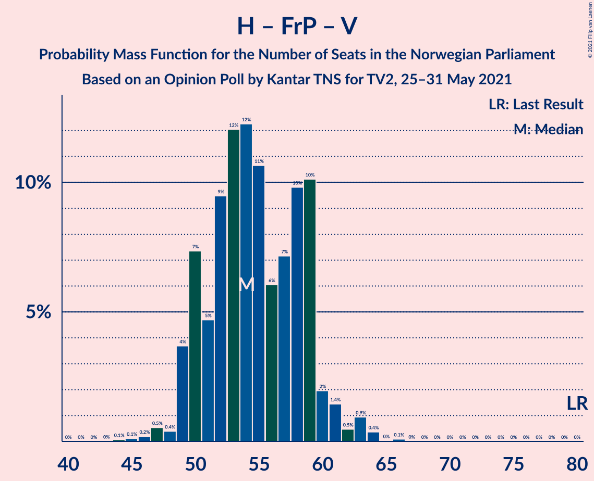

# Opinion Poll by Kantar TNS for TV2, 25–31 May 2021

<a href="#voting-intentions">Voting Intentions</a> | <a href="#seats">Seats</a> | <a href="#coalitions">Coalitions</a> | <a href="#technical-information">Technical Information</a>

## Voting Intentions

### Confidence Intervals

| Party | Last Result | Poll Result | 80% Confidence Interval | 90% Confidence Interval | 95% Confidence Interval | 99% Confidence Interval |
|:-----:|:-----------:|:-----------:|:-----------------------:|:-----------------------:|:-----------------------:|:-----------------------:|
| Arbeiderpartiet | 27.4% | 24.6% | 23.0–26.3% |22.6–26.7% |22.2–27.1% |21.5–28.0% |
| Høyre | 25.0% | 18.2% | 16.9–19.8% |16.5–20.2% |16.1–20.5% |15.5–21.3% |
| Senterpartiet | 10.3% | 17.6% | 16.2–19.1% |15.8–19.5% |15.5–19.8% |14.9–20.6% |
| Fremskrittspartiet | 15.2% | 9.8% | 8.8–11.0% |8.5–11.4% |8.3–11.7% |7.8–12.3% |
| Sosialistisk Venstreparti | 6.0% | 8.6% | 7.6–9.7% |7.3–10.0% |7.1–10.3% |6.7–10.9% |
| Rødt | 2.4% | 6.5% | 5.7–7.6% |5.5–7.8% |5.3–8.1% |4.9–8.6% |
| Miljøpartiet De Grønne | 3.2% | 4.5% | 3.8–5.4% |3.6–5.6% |3.4–5.8% |3.1–6.3% |
| Venstre | 4.4% | 4.1% | 3.4–4.9% |3.2–5.2% |3.1–5.4% |2.8–5.8% |
| Kristelig Folkeparti | 4.2% | 3.4% | 2.8–4.2% |2.6–4.4% |2.5–4.6% |2.2–5.0% |

*Note:* The poll result column reflects the actual value used in the calculations. Published results may vary slightly, and in addition be rounded to fewer digits.

## Seats

### Confidence Intervals

| Party | Last Result | Median | 80% Confidence Interval | 90% Confidence Interval | 95% Confidence Interval | 99% Confidence Interval |
|:-----:|:-----------:|:------:|:-----------------------:|:-----------------------:|:-----------------------:|:-----------------------:|
| <a href="#arbeiderpartiet">Arbeiderpartiet</a> | 49 | 44 | 42–47 |42–48 |41–49 |39–51 |
| <a href="#høyre">Høyre</a> | 45 | 33 | 29–35 |29–36 |28–36 |27–38 |
| <a href="#senterpartiet">Senterpartiet</a> | 19 | 33 | 30–36 |29–36 |28–37 |26–39 |
| <a href="#fremskrittspartiet">Fremskrittspartiet</a> | 27 | 17 | 15–19 |14–20 |14–21 |13–22 |
| <a href="#sosialistisk-venstreparti">Sosialistisk Venstreparti</a> | 11 | 15 | 13–17 |12–18 |12–18 |11–19 |
| <a href="#rødt">Rødt</a> | 1 | 11 | 10–13 |9–14 |9–14 |8–15 |
| <a href="#miljøpartiet-de-grønne">Miljøpartiet De Grønne</a> | 1 | 8 | 2–9 |2–10 |2–10 |2–11 |
| <a href="#venstre">Venstre</a> | 8 | 7 | 2–8 |2–9 |2–9 |2–10 |
| <a href="#kristelig-folkeparti">Kristelig Folkeparti</a> | 8 | 3 | 1–7 |1–7 |1–8 |1–9 |

### Arbeiderpartiet

*For a full overview of the results for this party, see the [Arbeiderpartiet](party-arbeiderpartiet.html) page.*

| Number of Seats | Probability | Accumulated | Special Marks |
|:---------------:|:-----------:|:-----------:|:-------------:|
| 38 | 0% | 100% |  |
| 39 | 0.4% | 99.9% |  |
| 40 | 1.2% | 99.5% |  |
| 41 | 2% | 98% |  |
| 42 | 9% | 96% |  |
| 43 | 9% | 87% |  |
| 44 | 35% | 78% | Median |
| 45 | 22% | 44% |  |
| 46 | 8% | 21% |  |
| 47 | 6% | 14% |  |
| 48 | 3% | 7% |  |
| 49 | 2% | 4% | Last Result |
| 50 | 1.2% | 2% |  |
| 51 | 0.7% | 1.0% |  |
| 52 | 0.2% | 0.3% |  |
| 53 | 0.1% | 0.1% |  |
| 54 | 0% | 0% |  |

### Høyre

*For a full overview of the results for this party, see the [Høyre](party-høyre.html) page.*

| Number of Seats | Probability | Accumulated | Special Marks |
|:---------------:|:-----------:|:-----------:|:-------------:|
| 25 | 0.1% | 100% |  |
| 26 | 0.1% | 99.9% |  |
| 27 | 0.4% | 99.8% |  |
| 28 | 2% | 99.4% |  |
| 29 | 17% | 97% |  |
| 30 | 9% | 81% |  |
| 31 | 11% | 71% |  |
| 32 | 10% | 61% |  |
| 33 | 18% | 51% | Median |
| 34 | 13% | 33% |  |
| 35 | 14% | 21% |  |
| 36 | 4% | 6% |  |
| 37 | 1.3% | 2% |  |
| 38 | 0.6% | 0.9% |  |
| 39 | 0.2% | 0.3% |  |
| 40 | 0.1% | 0.1% |  |
| 41 | 0% | 0% |  |
| 42 | 0% | 0% |  |
| 43 | 0% | 0% |  |
| 44 | 0% | 0% |  |
| 45 | 0% | 0% | Last Result |

### Senterpartiet

*For a full overview of the results for this party, see the [Senterpartiet](party-senterpartiet.html) page.*

| Number of Seats | Probability | Accumulated | Special Marks |
|:---------------:|:-----------:|:-----------:|:-------------:|
| 19 | 0% | 100% | Last Result |
| 20 | 0% | 100% |  |
| 21 | 0% | 100% |  |
| 22 | 0% | 100% |  |
| 23 | 0% | 100% |  |
| 24 | 0% | 100% |  |
| 25 | 0.4% | 100% |  |
| 26 | 0.2% | 99.6% |  |
| 27 | 0.4% | 99.4% |  |
| 28 | 2% | 99.0% |  |
| 29 | 2% | 97% |  |
| 30 | 9% | 94% |  |
| 31 | 10% | 86% |  |
| 32 | 15% | 76% |  |
| 33 | 18% | 61% | Median |
| 34 | 16% | 43% |  |
| 35 | 11% | 28% |  |
| 36 | 14% | 16% |  |
| 37 | 1.2% | 3% |  |
| 38 | 0.8% | 1.4% |  |
| 39 | 0.5% | 0.6% |  |
| 40 | 0.1% | 0.2% |  |
| 41 | 0% | 0.1% |  |
| 42 | 0% | 0% |  |

### Fremskrittspartiet

*For a full overview of the results for this party, see the [Fremskrittspartiet](party-fremskrittspartiet.html) page.*

| Number of Seats | Probability | Accumulated | Special Marks |
|:---------------:|:-----------:|:-----------:|:-------------:|
| 12 | 0.2% | 100% |  |
| 13 | 0.7% | 99.8% |  |
| 14 | 9% | 99.1% |  |
| 15 | 9% | 90% |  |
| 16 | 19% | 81% |  |
| 17 | 29% | 62% | Median |
| 18 | 13% | 33% |  |
| 19 | 11% | 20% |  |
| 20 | 6% | 9% |  |
| 21 | 2% | 3% |  |
| 22 | 0.6% | 0.8% |  |
| 23 | 0.2% | 0.3% |  |
| 24 | 0.1% | 0.1% |  |
| 25 | 0% | 0% |  |
| 26 | 0% | 0% |  |
| 27 | 0% | 0% | Last Result |

### Sosialistisk Venstreparti

*For a full overview of the results for this party, see the [Sosialistisk Venstreparti](party-sosialistiskvenstreparti.html) page.*

| Number of Seats | Probability | Accumulated | Special Marks |
|:---------------:|:-----------:|:-----------:|:-------------:|
| 10 | 0.1% | 100% |  |
| 11 | 0.8% | 99.9% | Last Result |
| 12 | 5% | 99.0% |  |
| 13 | 9% | 94% |  |
| 14 | 23% | 85% |  |
| 15 | 29% | 61% | Median |
| 16 | 16% | 32% |  |
| 17 | 10% | 16% |  |
| 18 | 4% | 6% |  |
| 19 | 2% | 2% |  |
| 20 | 0.1% | 0.2% |  |
| 21 | 0% | 0.1% |  |
| 22 | 0% | 0% |  |

### Rødt

*For a full overview of the results for this party, see the [Rødt](party-rødt.html) page.*

| Number of Seats | Probability | Accumulated | Special Marks |
|:---------------:|:-----------:|:-----------:|:-------------:|
| 1 | 0% | 100% | Last Result |
| 2 | 0% | 100% |  |
| 3 | 0% | 100% |  |
| 4 | 0% | 100% |  |
| 5 | 0% | 100% |  |
| 6 | 0% | 100% |  |
| 7 | 0% | 100% |  |
| 8 | 0.9% | 100% |  |
| 9 | 6% | 99.1% |  |
| 10 | 28% | 93% |  |
| 11 | 22% | 65% | Median |
| 12 | 22% | 43% |  |
| 13 | 13% | 20% |  |
| 14 | 6% | 8% |  |
| 15 | 1.4% | 2% |  |
| 16 | 0.2% | 0.3% |  |
| 17 | 0.1% | 0.1% |  |
| 18 | 0% | 0% |  |

### Miljøpartiet De Grønne

*For a full overview of the results for this party, see the [Miljøpartiet De Grønne](party-miljøpartietdegrønne.html) page.*

| Number of Seats | Probability | Accumulated | Special Marks |
|:---------------:|:-----------:|:-----------:|:-------------:|
| 1 | 0.2% | 100% | Last Result |
| 2 | 14% | 99.8% |  |
| 3 | 2% | 86% |  |
| 4 | 0.2% | 84% |  |
| 5 | 0% | 84% |  |
| 6 | 0.2% | 84% |  |
| 7 | 25% | 84% |  |
| 8 | 34% | 59% | Median |
| 9 | 19% | 25% |  |
| 10 | 5% | 6% |  |
| 11 | 0.9% | 1.0% |  |
| 12 | 0.1% | 0.1% |  |
| 13 | 0% | 0% |  |

### Venstre

*For a full overview of the results for this party, see the [Venstre](party-venstre.html) page.*

| Number of Seats | Probability | Accumulated | Special Marks |
|:---------------:|:-----------:|:-----------:|:-------------:|
| 2 | 39% | 100% |  |
| 3 | 0.5% | 61% |  |
| 4 | 0% | 61% |  |
| 5 | 0% | 61% |  |
| 6 | 0.3% | 61% |  |
| 7 | 26% | 61% | Median |
| 8 | 27% | 35% | Last Result |
| 9 | 6% | 7% |  |
| 10 | 1.2% | 1.3% |  |
| 11 | 0.1% | 0.1% |  |
| 12 | 0% | 0% |  |

### Kristelig Folkeparti

*For a full overview of the results for this party, see the [Kristelig Folkeparti](party-kristeligfolkeparti.html) page.*

| Number of Seats | Probability | Accumulated | Special Marks |
|:---------------:|:-----------:|:-----------:|:-------------:|
| 0 | 0.2% | 100% |  |
| 1 | 31% | 99.8% |  |
| 2 | 11% | 69% |  |
| 3 | 34% | 58% | Median |
| 4 | 0% | 24% |  |
| 5 | 0% | 24% |  |
| 6 | 2% | 24% |  |
| 7 | 19% | 22% |  |
| 8 | 3% | 3% | Last Result |
| 9 | 0.5% | 0.6% |  |
| 10 | 0% | 0% |  |

## Coalitions

### Confidence Intervals

| Coalition | Last Result | Median | Majority? | 80% Confidence Interval | 90% Confidence Interval | 95% Confidence Interval | 99% Confidence Interval |
|:---------:|:-----------:|:------:|:---------:|:-----------------------:|:-----------------------:|:-----------------------:|:-----------------------:|
| Arbeiderpartiet – Senterpartiet – Sosialistisk Venstreparti – Rødt – Miljøpartiet De Grønne | 81 | 110 | 100% | 107–116 | 105–116 | 104–117 | 103–120 |
| Arbeiderpartiet – Senterpartiet – Sosialistisk Venstreparti – Rødt | 80 | 103 | 100% | 100–108 | 99–109 | 98–110 | 97–112 |
| Arbeiderpartiet – Senterpartiet – Sosialistisk Venstreparti – Miljøpartiet De Grønne – Kristelig Folkeparti | 88 | 103 | 100% | 99–107 | 97–108 | 95–109 | 94–111 |
| Arbeiderpartiet – Senterpartiet – Sosialistisk Venstreparti – Miljøpartiet De Grønne | 80 | 100 | 100% | 96–104 | 94–105 | 93–105 | 91–108 |
| Arbeiderpartiet – Senterpartiet – Sosialistisk Venstreparti | 79 | 92 | 99.8% | 89–96 | 88–97 | 87–98 | 85–100 |
| Høyre – Senterpartiet – Fremskrittspartiet – Venstre – Kristelig Folkeparti | 107 | 91 | 97% | 87–95 | 86–96 | 84–97 | 82–100 |
| Arbeiderpartiet – Senterpartiet – Miljøpartiet De Grønne – Kristelig Folkeparti | 77 | 88 | 81% | 83–92 | 82–93 | 81–94 | 78–96 |
| Arbeiderpartiet – Senterpartiet – Kristelig Folkeparti | 76 | 81 | 16% | 76–85 | 75–86 | 74–88 | 72–89 |
| Arbeiderpartiet – Senterpartiet | 68 | 77 | 0.6% | 74–81 | 74–83 | 72–83 | 71–85 |
| Høyre – Fremskrittspartiet – Miljøpartiet De Grønne – Venstre – Kristelig Folkeparti | 89 | 65 | 0% | 61–69 | 60–70 | 59–71 | 57–72 |
| Arbeiderpartiet – Sosialistisk Venstreparti | 60 | 59 | 0% | 56–62 | 56–64 | 55–65 | 54–67 |
| Høyre – Fremskrittspartiet – Venstre – Kristelig Folkeparti | 88 | 58 | 0% | 53–62 | 53–64 | 52–65 | 49–66 |
| Høyre – Fremskrittspartiet – Venstre | 80 | 54 | 0% | 50–59 | 49–60 | 49–61 | 47–63 |
| Høyre – Fremskrittspartiet | 72 | 49 | 0% | 45–53 | 45–54 | 44–55 | 42–57 |
| Senterpartiet – Venstre – Kristelig Folkeparti | 35 | 41 | 0% | 36–47 | 35–48 | 34–49 | 32–50 |
| Høyre – Venstre – Kristelig Folkeparti | 61 | 42 | 0% | 36–46 | 35–47 | 34–48 | 33–49 |

### Arbeiderpartiet – Senterpartiet – Sosialistisk Venstreparti – Rødt – Miljøpartiet De Grønne

| Number of Seats | Probability | Accumulated | Special Marks |
|:---------------:|:-----------:|:-----------:|:-------------:|
| 81 | 0% | 100% | Last Result |
| 82 | 0% | 100% |  |
| 83 | 0% | 100% |  |
| 84 | 0% | 100% |  |
| 85 | 0% | 100% | Majority |
| 86 | 0% | 100% |  |
| 87 | 0% | 100% |  |
| 88 | 0% | 100% |  |
| 89 | 0% | 100% |  |
| 90 | 0% | 100% |  |
| 91 | 0% | 100% |  |
| 92 | 0% | 100% |  |
| 93 | 0% | 100% |  |
| 94 | 0% | 100% |  |
| 95 | 0% | 100% |  |
| 96 | 0% | 100% |  |
| 97 | 0% | 100% |  |
| 98 | 0% | 100% |  |
| 99 | 0% | 100% |  |
| 100 | 0% | 100% |  |
| 101 | 0.1% | 100% |  |
| 102 | 0.3% | 99.9% |  |
| 103 | 2% | 99.6% |  |
| 104 | 2% | 98% |  |
| 105 | 2% | 96% |  |
| 106 | 3% | 94% |  |
| 107 | 4% | 91% |  |
| 108 | 6% | 87% |  |
| 109 | 15% | 80% |  |
| 110 | 17% | 66% |  |
| 111 | 6% | 49% | Median |
| 112 | 13% | 43% |  |
| 113 | 8% | 30% |  |
| 114 | 7% | 23% |  |
| 115 | 4% | 16% |  |
| 116 | 8% | 12% |  |
| 117 | 3% | 4% |  |
| 118 | 0.8% | 2% |  |
| 119 | 0.4% | 0.9% |  |
| 120 | 0.4% | 0.5% |  |
| 121 | 0% | 0.1% |  |
| 122 | 0% | 0% |  |

### Arbeiderpartiet – Senterpartiet – Sosialistisk Venstreparti – Rødt

| Number of Seats | Probability | Accumulated | Special Marks |
|:---------------:|:-----------:|:-----------:|:-------------:|
| 80 | 0% | 100% | Last Result |
| 81 | 0% | 100% |  |
| 82 | 0% | 100% |  |
| 83 | 0% | 100% |  |
| 84 | 0% | 100% |  |
| 85 | 0% | 100% | Majority |
| 86 | 0% | 100% |  |
| 87 | 0% | 100% |  |
| 88 | 0% | 100% |  |
| 89 | 0% | 100% |  |
| 90 | 0% | 100% |  |
| 91 | 0% | 100% |  |
| 92 | 0% | 100% |  |
| 93 | 0% | 100% |  |
| 94 | 0% | 100% |  |
| 95 | 0.1% | 100% |  |
| 96 | 0.2% | 99.9% |  |
| 97 | 0.7% | 99.6% |  |
| 98 | 3% | 99.0% |  |
| 99 | 4% | 96% |  |
| 100 | 6% | 93% |  |
| 101 | 14% | 87% |  |
| 102 | 7% | 73% |  |
| 103 | 17% | 66% | Median |
| 104 | 10% | 49% |  |
| 105 | 9% | 39% |  |
| 106 | 9% | 30% |  |
| 107 | 7% | 22% |  |
| 108 | 9% | 15% |  |
| 109 | 2% | 6% |  |
| 110 | 3% | 4% |  |
| 111 | 0.8% | 2% |  |
| 112 | 0.4% | 0.7% |  |
| 113 | 0.2% | 0.4% |  |
| 114 | 0.2% | 0.2% |  |
| 115 | 0% | 0% |  |

### Arbeiderpartiet – Senterpartiet – Sosialistisk Venstreparti – Miljøpartiet De Grønne – Kristelig Folkeparti

| Number of Seats | Probability | Accumulated | Special Marks |
|:---------------:|:-----------:|:-----------:|:-------------:|
| 88 | 0% | 100% | Last Result |
| 89 | 0% | 100% |  |
| 90 | 0% | 100% |  |
| 91 | 0% | 100% |  |
| 92 | 0.2% | 100% |  |
| 93 | 0.1% | 99.8% |  |
| 94 | 1.1% | 99.7% |  |
| 95 | 1.3% | 98.6% |  |
| 96 | 0.9% | 97% |  |
| 97 | 3% | 96% |  |
| 98 | 3% | 93% |  |
| 99 | 3% | 91% |  |
| 100 | 16% | 87% |  |
| 101 | 8% | 71% |  |
| 102 | 9% | 63% |  |
| 103 | 10% | 54% | Median |
| 104 | 7% | 45% |  |
| 105 | 10% | 38% |  |
| 106 | 12% | 28% |  |
| 107 | 9% | 15% |  |
| 108 | 3% | 7% |  |
| 109 | 3% | 4% |  |
| 110 | 0.3% | 0.9% |  |
| 111 | 0.3% | 0.6% |  |
| 112 | 0.1% | 0.3% |  |
| 113 | 0% | 0.2% |  |
| 114 | 0.1% | 0.1% |  |
| 115 | 0% | 0% |  |

### Arbeiderpartiet – Senterpartiet – Sosialistisk Venstreparti – Miljøpartiet De Grønne

| Number of Seats | Probability | Accumulated | Special Marks |
|:---------------:|:-----------:|:-----------:|:-------------:|
| 80 | 0% | 100% | Last Result |
| 81 | 0% | 100% |  |
| 82 | 0% | 100% |  |
| 83 | 0% | 100% |  |
| 84 | 0% | 100% |  |
| 85 | 0% | 100% | Majority |
| 86 | 0% | 100% |  |
| 87 | 0% | 100% |  |
| 88 | 0% | 100% |  |
| 89 | 0% | 100% |  |
| 90 | 0.1% | 99.9% |  |
| 91 | 0.9% | 99.8% |  |
| 92 | 1.1% | 98.9% |  |
| 93 | 3% | 98% |  |
| 94 | 2% | 95% |  |
| 95 | 3% | 94% |  |
| 96 | 6% | 91% |  |
| 97 | 5% | 84% |  |
| 98 | 11% | 80% |  |
| 99 | 18% | 68% |  |
| 100 | 15% | 50% | Median |
| 101 | 7% | 35% |  |
| 102 | 6% | 28% |  |
| 103 | 10% | 21% |  |
| 104 | 5% | 11% |  |
| 105 | 3% | 6% |  |
| 106 | 1.2% | 2% |  |
| 107 | 0.7% | 1.2% |  |
| 108 | 0.4% | 0.5% |  |
| 109 | 0.1% | 0.1% |  |
| 110 | 0% | 0% |  |

### Arbeiderpartiet – Senterpartiet – Sosialistisk Venstreparti

| Number of Seats | Probability | Accumulated | Special Marks |
|:---------------:|:-----------:|:-----------:|:-------------:|
| 79 | 0% | 100% | Last Result |
| 80 | 0% | 100% |  |
| 81 | 0% | 100% |  |
| 82 | 0% | 100% |  |
| 83 | 0% | 100% |  |
| 84 | 0.1% | 100% |  |
| 85 | 0.5% | 99.8% | Majority |
| 86 | 0.6% | 99.4% |  |
| 87 | 1.5% | 98.8% |  |
| 88 | 5% | 97% |  |
| 89 | 9% | 93% |  |
| 90 | 7% | 84% |  |
| 91 | 16% | 77% |  |
| 92 | 12% | 61% | Median |
| 93 | 15% | 49% |  |
| 94 | 7% | 35% |  |
| 95 | 13% | 27% |  |
| 96 | 7% | 15% |  |
| 97 | 4% | 8% |  |
| 98 | 2% | 4% |  |
| 99 | 1.3% | 2% |  |
| 100 | 0.6% | 1.0% |  |
| 101 | 0.2% | 0.4% |  |
| 102 | 0.1% | 0.2% |  |
| 103 | 0% | 0% |  |

### Høyre – Senterpartiet – Fremskrittspartiet – Venstre – Kristelig Folkeparti

| Number of Seats | Probability | Accumulated | Special Marks |
|:---------------:|:-----------:|:-----------:|:-------------:|
| 80 | 0% | 100% |  |
| 81 | 0.3% | 99.9% |  |
| 82 | 0.2% | 99.6% |  |
| 83 | 1.3% | 99.5% |  |
| 84 | 0.8% | 98% |  |
| 85 | 2% | 97% | Majority |
| 86 | 3% | 95% |  |
| 87 | 6% | 93% |  |
| 88 | 7% | 87% |  |
| 89 | 13% | 79% |  |
| 90 | 13% | 67% |  |
| 91 | 8% | 54% |  |
| 92 | 17% | 46% |  |
| 93 | 4% | 29% | Median |
| 94 | 8% | 25% |  |
| 95 | 8% | 16% |  |
| 96 | 4% | 9% |  |
| 97 | 3% | 5% |  |
| 98 | 0.6% | 2% |  |
| 99 | 0.7% | 1.4% |  |
| 100 | 0.6% | 0.7% |  |
| 101 | 0.1% | 0.1% |  |
| 102 | 0% | 0% |  |
| 103 | 0% | 0% |  |
| 104 | 0% | 0% |  |
| 105 | 0% | 0% |  |
| 106 | 0% | 0% |  |
| 107 | 0% | 0% | Last Result |

### Arbeiderpartiet – Senterpartiet – Miljøpartiet De Grønne – Kristelig Folkeparti

| Number of Seats | Probability | Accumulated | Special Marks |
|:---------------:|:-----------:|:-----------:|:-------------:|
| 76 | 0% | 100% |  |
| 77 | 0.1% | 99.9% | Last Result |
| 78 | 0.5% | 99.8% |  |
| 79 | 1.1% | 99.3% |  |
| 80 | 0.6% | 98% |  |
| 81 | 2% | 98% |  |
| 82 | 1.5% | 95% |  |
| 83 | 8% | 94% |  |
| 84 | 5% | 86% |  |
| 85 | 8% | 81% | Majority |
| 86 | 8% | 73% |  |
| 87 | 6% | 65% |  |
| 88 | 12% | 59% | Median |
| 89 | 10% | 47% |  |
| 90 | 8% | 37% |  |
| 91 | 9% | 29% |  |
| 92 | 11% | 20% |  |
| 93 | 5% | 9% |  |
| 94 | 1.2% | 3% |  |
| 95 | 1.3% | 2% |  |
| 96 | 0.4% | 0.8% |  |
| 97 | 0.2% | 0.4% |  |
| 98 | 0.1% | 0.1% |  |
| 99 | 0% | 0.1% |  |
| 100 | 0% | 0% |  |

### Arbeiderpartiet – Senterpartiet – Kristelig Folkeparti

| Number of Seats | Probability | Accumulated | Special Marks |
|:---------------:|:-----------:|:-----------:|:-------------:|
| 71 | 0.1% | 100% |  |
| 72 | 0.7% | 99.9% |  |
| 73 | 0.4% | 99.2% |  |
| 74 | 1.5% | 98.8% |  |
| 75 | 3% | 97% |  |
| 76 | 6% | 94% | Last Result |
| 77 | 10% | 88% |  |
| 78 | 9% | 78% |  |
| 79 | 3% | 70% |  |
| 80 | 12% | 67% | Median |
| 81 | 9% | 55% |  |
| 82 | 11% | 46% |  |
| 83 | 10% | 35% |  |
| 84 | 9% | 25% |  |
| 85 | 10% | 16% | Majority |
| 86 | 3% | 6% |  |
| 87 | 1.0% | 4% |  |
| 88 | 2% | 3% |  |
| 89 | 0.2% | 0.5% |  |
| 90 | 0.1% | 0.4% |  |
| 91 | 0.2% | 0.2% |  |
| 92 | 0% | 0.1% |  |
| 93 | 0% | 0% |  |

### Arbeiderpartiet – Senterpartiet

| Number of Seats | Probability | Accumulated | Special Marks |
|:---------------:|:-----------:|:-----------:|:-------------:|
| 68 | 0% | 100% | Last Result |
| 69 | 0.1% | 99.9% |  |
| 70 | 0.3% | 99.8% |  |
| 71 | 2% | 99.5% |  |
| 72 | 1.0% | 98% |  |
| 73 | 2% | 97% |  |
| 74 | 8% | 95% |  |
| 75 | 11% | 87% |  |
| 76 | 11% | 77% |  |
| 77 | 18% | 66% | Median |
| 78 | 15% | 48% |  |
| 79 | 8% | 33% |  |
| 80 | 10% | 25% |  |
| 81 | 8% | 15% |  |
| 82 | 2% | 7% |  |
| 83 | 3% | 5% |  |
| 84 | 1.0% | 2% |  |
| 85 | 0.4% | 0.6% | Majority |
| 86 | 0.2% | 0.2% |  |
| 87 | 0% | 0.1% |  |
| 88 | 0% | 0% |  |

### Høyre – Fremskrittspartiet – Miljøpartiet De Grønne – Venstre – Kristelig Folkeparti

| Number of Seats | Probability | Accumulated | Special Marks |
|:---------------:|:-----------:|:-----------:|:-------------:|
| 53 | 0.1% | 100% |  |
| 54 | 0% | 99.9% |  |
| 55 | 0.2% | 99.9% |  |
| 56 | 0.2% | 99.7% |  |
| 57 | 0.4% | 99.5% |  |
| 58 | 0.9% | 99.1% |  |
| 59 | 3% | 98% |  |
| 60 | 2% | 96% |  |
| 61 | 9% | 94% |  |
| 62 | 7% | 85% |  |
| 63 | 9% | 78% |  |
| 64 | 9% | 69% |  |
| 65 | 10% | 60% |  |
| 66 | 17% | 50% |  |
| 67 | 7% | 33% |  |
| 68 | 13% | 26% | Median |
| 69 | 6% | 13% |  |
| 70 | 3% | 7% |  |
| 71 | 3% | 4% |  |
| 72 | 0.5% | 0.8% |  |
| 73 | 0.2% | 0.3% |  |
| 74 | 0.1% | 0.1% |  |
| 75 | 0% | 0% |  |
| 76 | 0% | 0% |  |
| 77 | 0% | 0% |  |
| 78 | 0% | 0% |  |
| 79 | 0% | 0% |  |
| 80 | 0% | 0% |  |
| 81 | 0% | 0% |  |
| 82 | 0% | 0% |  |
| 83 | 0% | 0% |  |
| 84 | 0% | 0% |  |
| 85 | 0% | 0% | Majority |
| 86 | 0% | 0% |  |
| 87 | 0% | 0% |  |
| 88 | 0% | 0% |  |
| 89 | 0% | 0% | Last Result |

### Arbeiderpartiet – Sosialistisk Venstreparti

| Number of Seats | Probability | Accumulated | Special Marks |
|:---------------:|:-----------:|:-----------:|:-------------:|
| 52 | 0.2% | 100% |  |
| 53 | 0.2% | 99.8% |  |
| 54 | 1.0% | 99.6% |  |
| 55 | 2% | 98.6% |  |
| 56 | 8% | 97% |  |
| 57 | 9% | 89% |  |
| 58 | 13% | 80% |  |
| 59 | 20% | 67% | Median |
| 60 | 19% | 47% | Last Result |
| 61 | 9% | 28% |  |
| 62 | 10% | 19% |  |
| 63 | 3% | 9% |  |
| 64 | 2% | 6% |  |
| 65 | 2% | 4% |  |
| 66 | 2% | 2% |  |
| 67 | 0.3% | 0.7% |  |
| 68 | 0.3% | 0.4% |  |
| 69 | 0.1% | 0.1% |  |
| 70 | 0% | 0% |  |

### Høyre – Fremskrittspartiet – Venstre – Kristelig Folkeparti

| Number of Seats | Probability | Accumulated | Special Marks |
|:---------------:|:-----------:|:-----------:|:-------------:|
| 47 | 0% | 100% |  |
| 48 | 0% | 99.9% |  |
| 49 | 0.4% | 99.9% |  |
| 50 | 0.5% | 99.5% |  |
| 51 | 0.8% | 98.9% |  |
| 52 | 3% | 98% |  |
| 53 | 8% | 95% |  |
| 54 | 4% | 87% |  |
| 55 | 7% | 83% |  |
| 56 | 8% | 76% |  |
| 57 | 13% | 68% |  |
| 58 | 6% | 56% |  |
| 59 | 17% | 50% |  |
| 60 | 15% | 33% | Median |
| 61 | 6% | 19% |  |
| 62 | 4% | 13% |  |
| 63 | 3% | 9% |  |
| 64 | 2% | 6% |  |
| 65 | 1.4% | 3% |  |
| 66 | 2% | 2% |  |
| 67 | 0.3% | 0.4% |  |
| 68 | 0.1% | 0.1% |  |
| 69 | 0% | 0% |  |
| 70 | 0% | 0% |  |
| 71 | 0% | 0% |  |
| 72 | 0% | 0% |  |
| 73 | 0% | 0% |  |
| 74 | 0% | 0% |  |
| 75 | 0% | 0% |  |
| 76 | 0% | 0% |  |
| 77 | 0% | 0% |  |
| 78 | 0% | 0% |  |
| 79 | 0% | 0% |  |
| 80 | 0% | 0% |  |
| 81 | 0% | 0% |  |
| 82 | 0% | 0% |  |
| 83 | 0% | 0% |  |
| 84 | 0% | 0% |  |
| 85 | 0% | 0% | Majority |
| 86 | 0% | 0% |  |
| 87 | 0% | 0% |  |
| 88 | 0% | 0% | Last Result |

### Høyre – Fremskrittspartiet – Venstre

| Number of Seats | Probability | Accumulated | Special Marks |
|:---------------:|:-----------:|:-----------:|:-------------:|
| 44 | 0.1% | 100% |  |
| 45 | 0.1% | 99.9% |  |
| 46 | 0.2% | 99.8% |  |
| 47 | 0.5% | 99.6% |  |
| 48 | 0.4% | 99.1% |  |
| 49 | 4% | 98.7% |  |
| 50 | 7% | 95% |  |
| 51 | 5% | 88% |  |
| 52 | 9% | 83% |  |
| 53 | 12% | 73% |  |
| 54 | 12% | 61% |  |
| 55 | 11% | 49% |  |
| 56 | 6% | 38% |  |
| 57 | 7% | 32% | Median |
| 58 | 10% | 25% |  |
| 59 | 10% | 15% |  |
| 60 | 2% | 5% |  |
| 61 | 1.4% | 3% |  |
| 62 | 0.5% | 2% |  |
| 63 | 0.9% | 1.4% |  |
| 64 | 0.4% | 0.5% |  |
| 65 | 0% | 0.1% |  |
| 66 | 0.1% | 0.1% |  |
| 67 | 0% | 0% |  |
| 68 | 0% | 0% |  |
| 69 | 0% | 0% |  |
| 70 | 0% | 0% |  |
| 71 | 0% | 0% |  |
| 72 | 0% | 0% |  |
| 73 | 0% | 0% |  |
| 74 | 0% | 0% |  |
| 75 | 0% | 0% |  |
| 76 | 0% | 0% |  |
| 77 | 0% | 0% |  |
| 78 | 0% | 0% |  |
| 79 | 0% | 0% |  |
| 80 | 0% | 0% | Last Result |

### Høyre – Fremskrittspartiet

| Number of Seats | Probability | Accumulated | Special Marks |
|:---------------:|:-----------:|:-----------:|:-------------:|
| 41 | 0.1% | 100% |  |
| 42 | 0.4% | 99.9% |  |
| 43 | 0.5% | 99.5% |  |
| 44 | 2% | 98.9% |  |
| 45 | 11% | 97% |  |
| 46 | 7% | 86% |  |
| 47 | 11% | 79% |  |
| 48 | 10% | 69% |  |
| 49 | 11% | 58% |  |
| 50 | 11% | 47% | Median |
| 51 | 12% | 36% |  |
| 52 | 10% | 24% |  |
| 53 | 7% | 14% |  |
| 54 | 3% | 7% |  |
| 55 | 2% | 4% |  |
| 56 | 1.3% | 2% |  |
| 57 | 0.5% | 0.9% |  |
| 58 | 0.3% | 0.4% |  |
| 59 | 0.1% | 0.1% |  |
| 60 | 0% | 0% |  |
| 61 | 0% | 0% |  |
| 62 | 0% | 0% |  |
| 63 | 0% | 0% |  |
| 64 | 0% | 0% |  |
| 65 | 0% | 0% |  |
| 66 | 0% | 0% |  |
| 67 | 0% | 0% |  |
| 68 | 0% | 0% |  |
| 69 | 0% | 0% |  |
| 70 | 0% | 0% |  |
| 71 | 0% | 0% |  |
| 72 | 0% | 0% | Last Result |

### Senterpartiet – Venstre – Kristelig Folkeparti

| Number of Seats | Probability | Accumulated | Special Marks |
|:---------------:|:-----------:|:-----------:|:-------------:|
| 30 | 0.1% | 100% |  |
| 31 | 0.1% | 99.9% |  |
| 32 | 0.4% | 99.8% |  |
| 33 | 1.2% | 99.4% |  |
| 34 | 1.5% | 98% |  |
| 35 | 3% | 97% | Last Result |
| 36 | 6% | 94% |  |
| 37 | 5% | 88% |  |
| 38 | 9% | 83% |  |
| 39 | 4% | 74% |  |
| 40 | 10% | 70% |  |
| 41 | 11% | 60% |  |
| 42 | 4% | 49% |  |
| 43 | 7% | 45% | Median |
| 44 | 6% | 38% |  |
| 45 | 8% | 32% |  |
| 46 | 10% | 24% |  |
| 47 | 7% | 14% |  |
| 48 | 4% | 7% |  |
| 49 | 1.0% | 3% |  |
| 50 | 1.5% | 2% |  |
| 51 | 0.2% | 0.4% |  |
| 52 | 0.1% | 0.2% |  |
| 53 | 0% | 0% |  |

### Høyre – Venstre – Kristelig Folkeparti

| Number of Seats | Probability | Accumulated | Special Marks |
|:---------------:|:-----------:|:-----------:|:-------------:|
| 31 | 0.1% | 100% |  |
| 32 | 0.2% | 99.9% |  |
| 33 | 0.6% | 99.7% |  |
| 34 | 2% | 99.1% |  |
| 35 | 4% | 97% |  |
| 36 | 6% | 92% |  |
| 37 | 5% | 86% |  |
| 38 | 10% | 81% |  |
| 39 | 8% | 72% |  |
| 40 | 7% | 64% |  |
| 41 | 6% | 57% |  |
| 42 | 11% | 51% |  |
| 43 | 18% | 40% | Median |
| 44 | 9% | 22% |  |
| 45 | 3% | 14% |  |
| 46 | 3% | 10% |  |
| 47 | 4% | 7% |  |
| 48 | 2% | 4% |  |
| 49 | 1.1% | 1.4% |  |
| 50 | 0.2% | 0.3% |  |
| 51 | 0.1% | 0.1% |  |
| 52 | 0% | 0% |  |
| 53 | 0% | 0% |  |
| 54 | 0% | 0% |  |
| 55 | 0% | 0% |  |
| 56 | 0% | 0% |  |
| 57 | 0% | 0% |  |
| 58 | 0% | 0% |  |
| 59 | 0% | 0% |  |
| 60 | 0% | 0% |  |
| 61 | 0% | 0% | Last Result |

## Technical Information

### Opinion Poll

+ **Polling firm:** Kantar TNS
+ **Commissioner(s):** TV2
+ **Fieldwork period:** 25–31 May 2021

### Calculations

+ **Sample size:** 1179
+ **Simulations done:** 1,048,576
+ **Error estimate:** 0.75%

