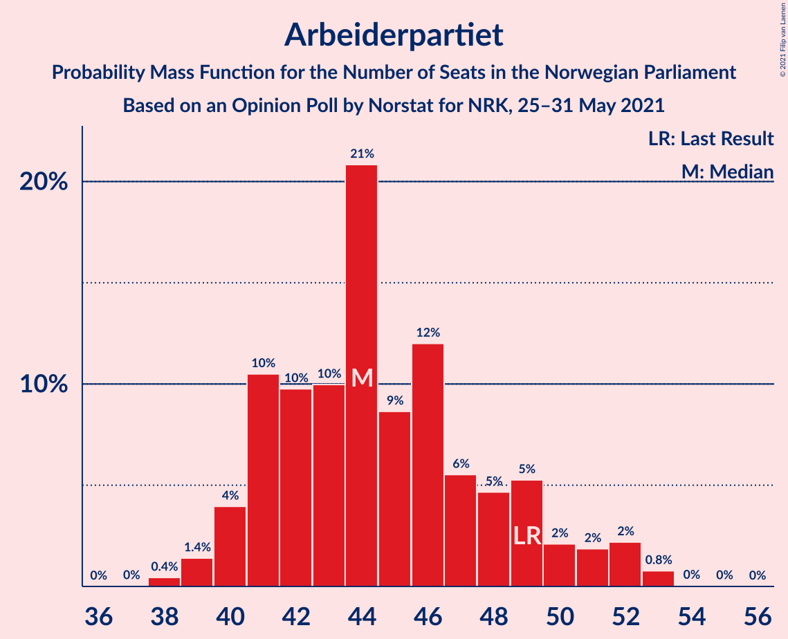
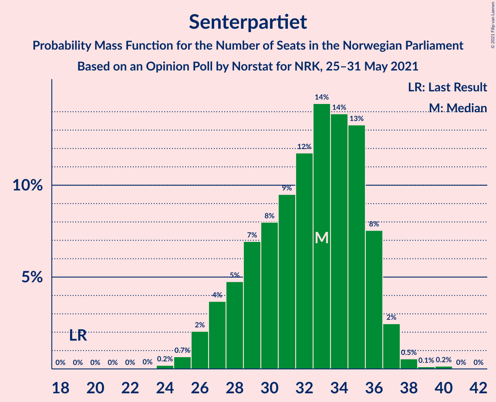
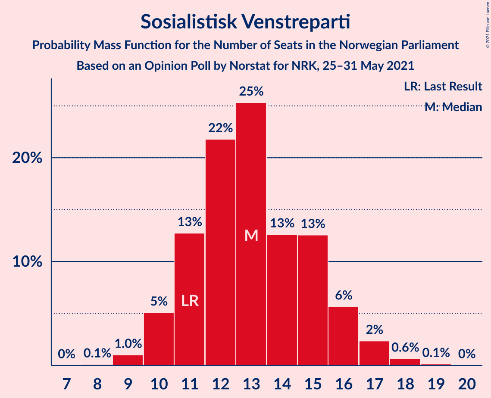
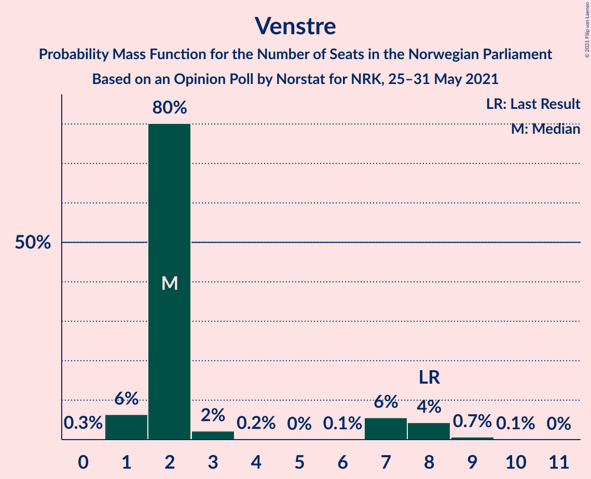
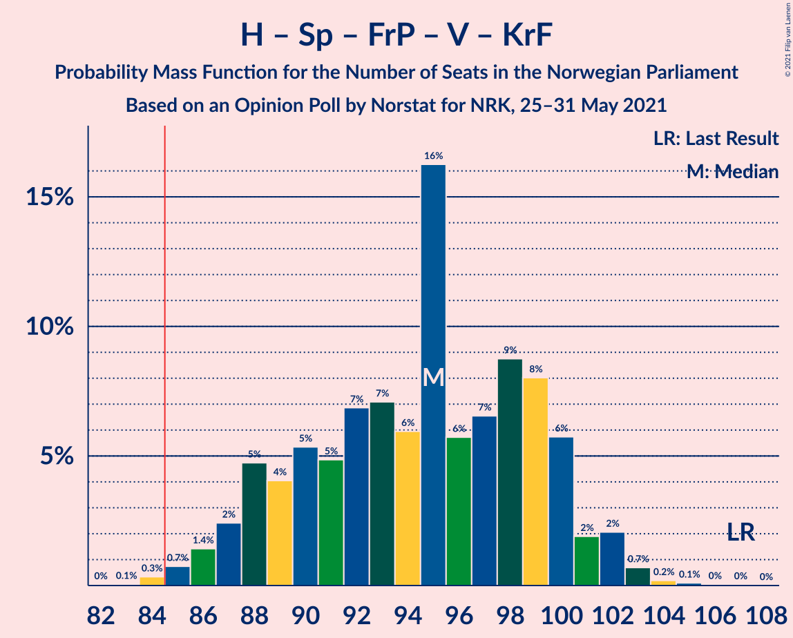
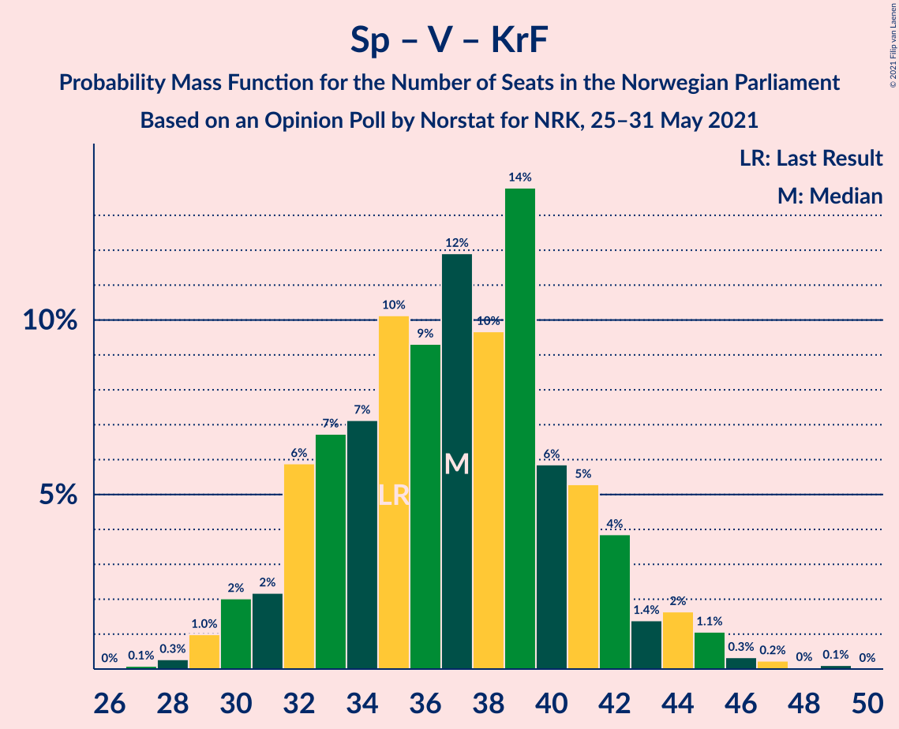

# Opinion Poll by Norstat for NRK, 25–31 May 2021

<a href="#voting-intentions">Voting Intentions</a> | <a href="#seats">Seats</a> | <a href="#coalitions">Coalitions</a> | <a href="#technical-information">Technical Information</a>

## Voting Intentions

### Confidence Intervals

| Party | Last Result | Poll Result | 80% Confidence Interval | 90% Confidence Interval | 95% Confidence Interval | 99% Confidence Interval |
|:-----:|:-----------:|:-----------:|:-----------------------:|:-----------------------:|:-----------------------:|:-----------------------:|
| Arbeiderpartiet | 27.4% | 24.7% | 22.9–26.5% |22.4–27.0% |22.0–27.5% |21.2–28.4% |
| Høyre | 25.0% | 21.2% | 19.6–23.0% |19.1–23.5% |18.7–23.9% |18.0–24.8% |
| Senterpartiet | 10.3% | 17.0% | 15.5–18.7% |15.1–19.1% |14.7–19.5% |14.1–20.3% |
| Fremskrittspartiet | 15.2% | 10.7% | 9.5–12.1% |9.2–12.5% |8.9–12.8% |8.4–13.5% |
| Sosialistisk Venstreparti | 6.0% | 7.2% | 6.3–8.4% |6.0–8.8% |5.8–9.1% |5.3–9.7% |
| Rødt | 2.4% | 5.9% | 5.0–7.0% |4.8–7.3% |4.5–7.6% |4.2–8.1% |
| Miljøpartiet De Grønne | 3.2% | 4.2% | 3.5–5.2% |3.3–5.4% |3.1–5.7% |2.8–6.2% |
| Venstre | 4.4% | 3.1% | 2.5–4.0% |2.3–4.3% |2.2–4.5% |2.0–4.9% |
| Kristelig Folkeparti | 4.2% | 3.0% | 2.4–3.9% |2.3–4.1% |2.1–4.3% |1.9–4.8% |

*Note:* The poll result column reflects the actual value used in the calculations. Published results may vary slightly, and in addition be rounded to fewer digits.

## Seats

### Confidence Intervals

| Party | Last Result | Median | 80% Confidence Interval | 90% Confidence Interval | 95% Confidence Interval | 99% Confidence Interval |
|:-----:|:-----------:|:------:|:-----------------------:|:-----------------------:|:-----------------------:|:-----------------------:|
| <a href="#arbeiderpartiet">Arbeiderpartiet</a> | 49 | 44 | 41–48 |41–51 |40–52 |38–53 |
| <a href="#høyre">Høyre</a> | 45 | 38 | 35–41 |35–42 |34–42 |33–43 |
| <a href="#senterpartiet">Senterpartiet</a> | 19 | 34 | 30–36 |29–37 |27–37 |26–37 |
| <a href="#fremskrittspartiet">Fremskrittspartiet</a> | 27 | 18 | 17–22 |16–24 |16–24 |15–24 |
| <a href="#sosialistisk-venstreparti">Sosialistisk Venstreparti</a> | 11 | 13 | 12–15 |11–15 |11–15 |10–16 |
| <a href="#rødt">Rødt</a> | 1 | 10 | 9–12 |8–14 |8–14 |2–14 |
| <a href="#miljøpartiet-de-grønne">Miljøpartiet De Grønne</a> | 1 | 7 | 2–9 |2–10 |2–10 |1–11 |
| <a href="#venstre">Venstre</a> | 8 | 2 | 2–7 |2–8 |1–8 |1–9 |
| <a href="#kristelig-folkeparti">Kristelig Folkeparti</a> | 8 | 2 | 1–3 |1–3 |0–7 |0–8 |

### Arbeiderpartiet

*For a full overview of the results for this party, see the [Arbeiderpartiet](party-arbeiderpartiet.html) page.*

| Number of Seats | Probability | Accumulated | Special Marks |
|:---------------:|:-----------:|:-----------:|:-------------:|
| 38 | 0.5% | 100% |  |
| 39 | 1.0% | 99.4% |  |
| 40 | 3% | 98% |  |
| 41 | 20% | 96% |  |
| 42 | 9% | 76% |  |
| 43 | 4% | 68% |  |
| 44 | 34% | 64% | Median |
| 45 | 7% | 29% |  |
| 46 | 9% | 23% |  |
| 47 | 3% | 14% |  |
| 48 | 2% | 10% |  |
| 49 | 1.0% | 8% | Last Result |
| 50 | 0.3% | 7% |  |
| 51 | 3% | 7% |  |
| 52 | 2% | 4% |  |
| 53 | 2% | 2% |  |
| 54 | 0% | 0.1% |  |
| 55 | 0% | 0% |  |

### Høyre

*For a full overview of the results for this party, see the [Høyre](party-høyre.html) page.*

| Number of Seats | Probability | Accumulated | Special Marks |
|:---------------:|:-----------:|:-----------:|:-------------:|
| 31 | 0% | 100% |  |
| 32 | 0.1% | 99.9% |  |
| 33 | 1.3% | 99.8% |  |
| 34 | 3% | 98% |  |
| 35 | 7% | 96% |  |
| 36 | 8% | 88% |  |
| 37 | 14% | 80% |  |
| 38 | 31% | 66% | Median |
| 39 | 11% | 35% |  |
| 40 | 10% | 23% |  |
| 41 | 8% | 13% |  |
| 42 | 4% | 5% |  |
| 43 | 1.4% | 2% |  |
| 44 | 0% | 0.2% |  |
| 45 | 0.1% | 0.1% | Last Result |
| 46 | 0% | 0% |  |

### Senterpartiet

*For a full overview of the results for this party, see the [Senterpartiet](party-senterpartiet.html) page.*

| Number of Seats | Probability | Accumulated | Special Marks |
|:---------------:|:-----------:|:-----------:|:-------------:|
| 19 | 0% | 100% | Last Result |
| 20 | 0% | 100% |  |
| 21 | 0% | 100% |  |
| 22 | 0% | 100% |  |
| 23 | 0% | 100% |  |
| 24 | 0.1% | 100% |  |
| 25 | 0.3% | 99.9% |  |
| 26 | 0.8% | 99.6% |  |
| 27 | 2% | 98.8% |  |
| 28 | 2% | 97% |  |
| 29 | 5% | 96% |  |
| 30 | 7% | 91% |  |
| 31 | 5% | 84% |  |
| 32 | 11% | 79% |  |
| 33 | 12% | 68% |  |
| 34 | 11% | 56% | Median |
| 35 | 26% | 45% |  |
| 36 | 13% | 19% |  |
| 37 | 6% | 6% |  |
| 38 | 0.2% | 0.2% |  |
| 39 | 0% | 0% |  |

### Fremskrittspartiet

*For a full overview of the results for this party, see the [Fremskrittspartiet](party-fremskrittspartiet.html) page.*

| Number of Seats | Probability | Accumulated | Special Marks |
|:---------------:|:-----------:|:-----------:|:-------------:|
| 14 | 0.4% | 100% |  |
| 15 | 2% | 99.6% |  |
| 16 | 7% | 98% |  |
| 17 | 13% | 91% |  |
| 18 | 32% | 78% | Median |
| 19 | 10% | 47% |  |
| 20 | 15% | 37% |  |
| 21 | 3% | 22% |  |
| 22 | 10% | 20% |  |
| 23 | 4% | 10% |  |
| 24 | 5% | 5% |  |
| 25 | 0.3% | 0.4% |  |
| 26 | 0% | 0% |  |
| 27 | 0% | 0% | Last Result |

### Sosialistisk Venstreparti

*For a full overview of the results for this party, see the [Sosialistisk Venstreparti](party-sosialistiskvenstreparti.html) page.*

| Number of Seats | Probability | Accumulated | Special Marks |
|:---------------:|:-----------:|:-----------:|:-------------:|
| 9 | 0.1% | 100% |  |
| 10 | 2% | 99.9% |  |
| 11 | 5% | 98% | Last Result |
| 12 | 20% | 93% |  |
| 13 | 45% | 73% | Median |
| 14 | 16% | 28% |  |
| 15 | 11% | 12% |  |
| 16 | 0.9% | 1.0% |  |
| 17 | 0% | 0.1% |  |
| 18 | 0% | 0.1% |  |
| 19 | 0% | 0% |  |

### Rødt

*For a full overview of the results for this party, see the [Rødt](party-rødt.html) page.*

| Number of Seats | Probability | Accumulated | Special Marks |
|:---------------:|:-----------:|:-----------:|:-------------:|
| 1 | 0% | 100% | Last Result |
| 2 | 0.9% | 100% |  |
| 3 | 0.1% | 99.1% |  |
| 4 | 0% | 99.0% |  |
| 5 | 0% | 99.0% |  |
| 6 | 0% | 99.0% |  |
| 7 | 0.2% | 99.0% |  |
| 8 | 5% | 98.7% |  |
| 9 | 15% | 94% |  |
| 10 | 32% | 79% | Median |
| 11 | 13% | 46% |  |
| 12 | 27% | 33% |  |
| 13 | 1.4% | 7% |  |
| 14 | 5% | 5% |  |
| 15 | 0.1% | 0.4% |  |
| 16 | 0.3% | 0.3% |  |
| 17 | 0% | 0% |  |

### Miljøpartiet De Grønne

*For a full overview of the results for this party, see the [Miljøpartiet De Grønne](party-miljøpartietdegrønne.html) page.*

| Number of Seats | Probability | Accumulated | Special Marks |
|:---------------:|:-----------:|:-----------:|:-------------:|
| 1 | 1.5% | 100% | Last Result |
| 2 | 26% | 98.5% |  |
| 3 | 12% | 72% |  |
| 4 | 0.1% | 61% |  |
| 5 | 0% | 61% |  |
| 6 | 0% | 61% |  |
| 7 | 12% | 61% | Median |
| 8 | 27% | 49% |  |
| 9 | 15% | 22% |  |
| 10 | 6% | 7% |  |
| 11 | 0.6% | 0.8% |  |
| 12 | 0.1% | 0.1% |  |
| 13 | 0% | 0% |  |

### Venstre

*For a full overview of the results for this party, see the [Venstre](party-venstre.html) page.*

| Number of Seats | Probability | Accumulated | Special Marks |
|:---------------:|:-----------:|:-----------:|:-------------:|
| 0 | 0.1% | 100% |  |
| 1 | 4% | 99.9% |  |
| 2 | 80% | 96% | Median |
| 3 | 4% | 15% |  |
| 4 | 0% | 12% |  |
| 5 | 0% | 12% |  |
| 6 | 0% | 12% |  |
| 7 | 7% | 12% |  |
| 8 | 4% | 5% | Last Result |
| 9 | 0.8% | 0.9% |  |
| 10 | 0% | 0% |  |

### Kristelig Folkeparti

*For a full overview of the results for this party, see the [Kristelig Folkeparti](party-kristeligfolkeparti.html) page.*

| Number of Seats | Probability | Accumulated | Special Marks |
|:---------------:|:-----------:|:-----------:|:-------------:|
| 0 | 3% | 100% |  |
| 1 | 45% | 97% |  |
| 2 | 36% | 53% | Median |
| 3 | 13% | 17% |  |
| 4 | 0% | 4% |  |
| 5 | 0% | 4% |  |
| 6 | 0.4% | 4% |  |
| 7 | 2% | 4% |  |
| 8 | 1.1% | 1.2% | Last Result |
| 9 | 0.1% | 0.1% |  |
| 10 | 0% | 0% |  |

## Coalitions

### Confidence Intervals

| Coalition | Last Result | Median | Majority? | 80% Confidence Interval | 90% Confidence Interval | 95% Confidence Interval | 99% Confidence Interval |
|:---------:|:-----------:|:------:|:---------:|:-----------------------:|:-----------------------:|:-----------------------:|:-----------------------:|
| Arbeiderpartiet – Senterpartiet – Sosialistisk Venstreparti – Rødt – Miljøpartiet De Grønne | 81 | 107 | 100% | 103–111 | 102–112 | 100–113 | 99–114 |
| Arbeiderpartiet – Senterpartiet – Sosialistisk Venstreparti – Rødt | 80 | 101 | 100% | 97–104 | 96–106 | 94–107 | 92–109 |
| Arbeiderpartiet – Senterpartiet – Sosialistisk Venstreparti – Miljøpartiet De Grønne – Kristelig Folkeparti | 88 | 99 | 100% | 94–103 | 93–103 | 91–104 | 89–106 |
| Arbeiderpartiet – Senterpartiet – Sosialistisk Venstreparti – Miljøpartiet De Grønne | 80 | 96 | 100% | 93–101 | 91–102 | 89–102 | 88–103 |
| Høyre – Senterpartiet – Fremskrittspartiet – Venstre – Kristelig Folkeparti | 107 | 95 | 99.4% | 91–99 | 89–100 | 86–100 | 84–101 |
| Arbeiderpartiet – Senterpartiet – Sosialistisk Venstreparti | 79 | 90 | 98% | 87–94 | 85–94 | 85–96 | 82–97 |
| Arbeiderpartiet – Senterpartiet – Miljøpartiet De Grønne – Kristelig Folkeparti | 77 | 86 | 61% | 81–91 | 79–91 | 77–92 | 74–95 |
| Arbeiderpartiet – Senterpartiet – Kristelig Folkeparti | 76 | 79 | 5% | 75–83 | 74–85 | 73–87 | 69–88 |
| Arbeiderpartiet – Senterpartiet | 68 | 77 | 2% | 74–81 | 73–82 | 71–84 | 68–85 |
| Høyre – Fremskrittspartiet – Miljøpartiet De Grønne – Venstre – Kristelig Folkeparti | 89 | 68 | 0% | 64–72 | 63–72 | 62–74 | 60–77 |
| Høyre – Fremskrittspartiet – Venstre – Kristelig Folkeparti | 88 | 61 | 0% | 57–65 | 57–66 | 56–68 | 55–69 |
| Høyre – Fremskrittspartiet – Venstre | 80 | 59 | 0% | 56–64 | 55–64 | 55–66 | 53–68 |
| Arbeiderpartiet – Sosialistisk Venstreparti | 60 | 57 | 0% | 54–61 | 53–64 | 53–65 | 51–66 |
| Høyre – Fremskrittspartiet | 72 | 56 | 0% | 54–61 | 52–62 | 52–62 | 51–65 |
| Høyre – Venstre – Kristelig Folkeparti | 61 | 42 | 0% | 40–46 | 38–47 | 38–49 | 36–50 |
| Senterpartiet – Venstre – Kristelig Folkeparti | 35 | 39 | 0% | 34–41 | 33–42 | 31–44 | 29–47 |

### Arbeiderpartiet – Senterpartiet – Sosialistisk Venstreparti – Rødt – Miljøpartiet De Grønne

| Number of Seats | Probability | Accumulated | Special Marks |
|:---------------:|:-----------:|:-----------:|:-------------:|
| 81 | 0% | 100% | Last Result |
| 82 | 0% | 100% |  |
| 83 | 0% | 100% |  |
| 84 | 0% | 100% |  |
| 85 | 0% | 100% | Majority |
| 86 | 0% | 100% |  |
| 87 | 0% | 100% |  |
| 88 | 0% | 100% |  |
| 89 | 0% | 100% |  |
| 90 | 0% | 100% |  |
| 91 | 0% | 100% |  |
| 92 | 0% | 100% |  |
| 93 | 0% | 100% |  |
| 94 | 0% | 100% |  |
| 95 | 0% | 100% |  |
| 96 | 0% | 100% |  |
| 97 | 0.1% | 99.9% |  |
| 98 | 0.1% | 99.8% |  |
| 99 | 0.7% | 99.7% |  |
| 100 | 2% | 99.1% |  |
| 101 | 2% | 97% |  |
| 102 | 3% | 95% |  |
| 103 | 2% | 92% |  |
| 104 | 13% | 90% |  |
| 105 | 14% | 77% |  |
| 106 | 13% | 64% |  |
| 107 | 4% | 51% |  |
| 108 | 5% | 47% | Median |
| 109 | 22% | 42% |  |
| 110 | 6% | 20% |  |
| 111 | 4% | 14% |  |
| 112 | 7% | 10% |  |
| 113 | 2% | 3% |  |
| 114 | 0.5% | 0.9% |  |
| 115 | 0.4% | 0.4% |  |
| 116 | 0% | 0% |  |

### Arbeiderpartiet – Senterpartiet – Sosialistisk Venstreparti – Rødt

| Number of Seats | Probability | Accumulated | Special Marks |
|:---------------:|:-----------:|:-----------:|:-------------:|
| 80 | 0% | 100% | Last Result |
| 81 | 0% | 100% |  |
| 82 | 0% | 100% |  |
| 83 | 0% | 100% |  |
| 84 | 0% | 100% |  |
| 85 | 0% | 100% | Majority |
| 86 | 0% | 100% |  |
| 87 | 0% | 100% |  |
| 88 | 0% | 100% |  |
| 89 | 0% | 100% |  |
| 90 | 0% | 100% |  |
| 91 | 0.1% | 100% |  |
| 92 | 0.5% | 99.9% |  |
| 93 | 0.3% | 99.4% |  |
| 94 | 2% | 99.1% |  |
| 95 | 1.5% | 97% |  |
| 96 | 2% | 95% |  |
| 97 | 8% | 93% |  |
| 98 | 2% | 86% |  |
| 99 | 7% | 84% |  |
| 100 | 11% | 77% |  |
| 101 | 19% | 66% | Median |
| 102 | 15% | 46% |  |
| 103 | 13% | 31% |  |
| 104 | 10% | 18% |  |
| 105 | 3% | 8% |  |
| 106 | 2% | 5% |  |
| 107 | 2% | 3% |  |
| 108 | 0.8% | 1.4% |  |
| 109 | 0.6% | 0.7% |  |
| 110 | 0.1% | 0.1% |  |
| 111 | 0% | 0% |  |

### Arbeiderpartiet – Senterpartiet – Sosialistisk Venstreparti – Miljøpartiet De Grønne – Kristelig Folkeparti

| Number of Seats | Probability | Accumulated | Special Marks |
|:---------------:|:-----------:|:-----------:|:-------------:|
| 86 | 0.1% | 100% |  |
| 87 | 0% | 99.9% |  |
| 88 | 0% | 99.9% | Last Result |
| 89 | 0.6% | 99.9% |  |
| 90 | 2% | 99.3% |  |
| 91 | 1.1% | 98% |  |
| 92 | 0.5% | 96% |  |
| 93 | 1.3% | 96% |  |
| 94 | 8% | 95% |  |
| 95 | 7% | 87% |  |
| 96 | 12% | 80% |  |
| 97 | 7% | 68% |  |
| 98 | 10% | 61% |  |
| 99 | 15% | 51% |  |
| 100 | 3% | 35% | Median |
| 101 | 18% | 32% |  |
| 102 | 3% | 15% |  |
| 103 | 8% | 11% |  |
| 104 | 2% | 3% |  |
| 105 | 0.8% | 2% |  |
| 106 | 0.6% | 0.8% |  |
| 107 | 0.2% | 0.2% |  |
| 108 | 0% | 0% |  |

### Arbeiderpartiet – Senterpartiet – Sosialistisk Venstreparti – Miljøpartiet De Grønne

| Number of Seats | Probability | Accumulated | Special Marks |
|:---------------:|:-----------:|:-----------:|:-------------:|
| 80 | 0% | 100% | Last Result |
| 81 | 0% | 100% |  |
| 82 | 0% | 100% |  |
| 83 | 0% | 100% |  |
| 84 | 0% | 100% |  |
| 85 | 0.1% | 100% | Majority |
| 86 | 0.1% | 99.9% |  |
| 87 | 0.1% | 99.8% |  |
| 88 | 0.6% | 99.7% |  |
| 89 | 2% | 99.1% |  |
| 90 | 1.2% | 97% |  |
| 91 | 3% | 96% |  |
| 92 | 2% | 93% |  |
| 93 | 14% | 91% |  |
| 94 | 1.4% | 77% |  |
| 95 | 12% | 76% |  |
| 96 | 14% | 64% |  |
| 97 | 15% | 49% |  |
| 98 | 4% | 34% | Median |
| 99 | 12% | 30% |  |
| 100 | 8% | 19% |  |
| 101 | 3% | 10% |  |
| 102 | 6% | 8% |  |
| 103 | 1.0% | 1.4% |  |
| 104 | 0.4% | 0.4% |  |
| 105 | 0% | 0% |  |

### Høyre – Senterpartiet – Fremskrittspartiet – Venstre – Kristelig Folkeparti

| Number of Seats | Probability | Accumulated | Special Marks |
|:---------------:|:-----------:|:-----------:|:-------------:|
| 82 | 0% | 100% |  |
| 83 | 0.1% | 99.9% |  |
| 84 | 0.4% | 99.9% |  |
| 85 | 1.1% | 99.4% | Majority |
| 86 | 0.9% | 98% |  |
| 87 | 1.2% | 97% |  |
| 88 | 0.7% | 96% |  |
| 89 | 2% | 95% |  |
| 90 | 3% | 94% |  |
| 91 | 1.2% | 91% |  |
| 92 | 6% | 89% |  |
| 93 | 11% | 83% |  |
| 94 | 7% | 72% | Median |
| 95 | 27% | 65% |  |
| 96 | 6% | 38% |  |
| 97 | 5% | 32% |  |
| 98 | 12% | 27% |  |
| 99 | 6% | 15% |  |
| 100 | 7% | 9% |  |
| 101 | 1.1% | 1.5% |  |
| 102 | 0.1% | 0.3% |  |
| 103 | 0.2% | 0.2% |  |
| 104 | 0% | 0% |  |
| 105 | 0% | 0% |  |
| 106 | 0% | 0% |  |
| 107 | 0% | 0% | Last Result |

### Arbeiderpartiet – Senterpartiet – Sosialistisk Venstreparti

| Number of Seats | Probability | Accumulated | Special Marks |
|:---------------:|:-----------:|:-----------:|:-------------:|
| 79 | 0% | 100% | Last Result |
| 80 | 0% | 100% |  |
| 81 | 0% | 99.9% |  |
| 82 | 0.6% | 99.9% |  |
| 83 | 0.2% | 99.3% |  |
| 84 | 1.2% | 99.1% |  |
| 85 | 3% | 98% | Majority |
| 86 | 3% | 95% |  |
| 87 | 3% | 91% |  |
| 88 | 4% | 88% |  |
| 89 | 21% | 84% |  |
| 90 | 19% | 63% |  |
| 91 | 5% | 44% | Median |
| 92 | 10% | 39% |  |
| 93 | 15% | 29% |  |
| 94 | 9% | 14% |  |
| 95 | 0.8% | 4% |  |
| 96 | 2% | 4% |  |
| 97 | 2% | 2% |  |
| 98 | 0.1% | 0.2% |  |
| 99 | 0% | 0.1% |  |
| 100 | 0% | 0% |  |

### Arbeiderpartiet – Senterpartiet – Miljøpartiet De Grønne – Kristelig Folkeparti

| Number of Seats | Probability | Accumulated | Special Marks |
|:---------------:|:-----------:|:-----------:|:-------------:|
| 71 | 0.1% | 100% |  |
| 72 | 0% | 99.9% |  |
| 73 | 0% | 99.9% |  |
| 74 | 0.7% | 99.9% |  |
| 75 | 0.5% | 99.2% |  |
| 76 | 0.2% | 98.7% |  |
| 77 | 2% | 98.5% | Last Result |
| 78 | 0.3% | 97% |  |
| 79 | 4% | 96% |  |
| 80 | 0.8% | 92% |  |
| 81 | 14% | 91% |  |
| 82 | 7% | 77% |  |
| 83 | 3% | 70% |  |
| 84 | 6% | 67% |  |
| 85 | 10% | 61% | Majority |
| 86 | 14% | 51% |  |
| 87 | 2% | 37% | Median |
| 88 | 16% | 36% |  |
| 89 | 6% | 19% |  |
| 90 | 3% | 13% |  |
| 91 | 6% | 10% |  |
| 92 | 3% | 4% |  |
| 93 | 0.6% | 2% |  |
| 94 | 0.4% | 1.0% |  |
| 95 | 0.4% | 0.6% |  |
| 96 | 0.2% | 0.2% |  |
| 97 | 0% | 0% |  |

### Arbeiderpartiet – Senterpartiet – Kristelig Folkeparti

| Number of Seats | Probability | Accumulated | Special Marks |
|:---------------:|:-----------:|:-----------:|:-------------:|
| 68 | 0% | 100% |  |
| 69 | 0.5% | 99.9% |  |
| 70 | 0.1% | 99.5% |  |
| 71 | 0.3% | 99.4% |  |
| 72 | 1.5% | 99.1% |  |
| 73 | 1.2% | 98% |  |
| 74 | 4% | 96% |  |
| 75 | 5% | 93% |  |
| 76 | 5% | 88% | Last Result |
| 77 | 3% | 83% |  |
| 78 | 20% | 80% |  |
| 79 | 18% | 60% |  |
| 80 | 9% | 42% | Median |
| 81 | 11% | 33% |  |
| 82 | 5% | 22% |  |
| 83 | 9% | 17% |  |
| 84 | 2% | 7% |  |
| 85 | 1.0% | 5% | Majority |
| 86 | 0.9% | 4% |  |
| 87 | 2% | 3% |  |
| 88 | 1.2% | 1.4% |  |
| 89 | 0.1% | 0.2% |  |
| 90 | 0% | 0.1% |  |
| 91 | 0% | 0% |  |

### Arbeiderpartiet – Senterpartiet

| Number of Seats | Probability | Accumulated | Special Marks |
|:---------------:|:-----------:|:-----------:|:-------------:|
| 67 | 0.1% | 100% |  |
| 68 | 0.5% | 99.9% | Last Result |
| 69 | 0.2% | 99.4% |  |
| 70 | 0.5% | 99.2% |  |
| 71 | 2% | 98.7% |  |
| 72 | 2% | 97% |  |
| 73 | 4% | 95% |  |
| 74 | 5% | 92% |  |
| 75 | 5% | 86% |  |
| 76 | 25% | 81% |  |
| 77 | 11% | 57% |  |
| 78 | 9% | 46% | Median |
| 79 | 7% | 36% |  |
| 80 | 15% | 30% |  |
| 81 | 9% | 14% |  |
| 82 | 1.4% | 6% |  |
| 83 | 1.0% | 4% |  |
| 84 | 1.2% | 3% |  |
| 85 | 2% | 2% | Majority |
| 86 | 0.1% | 0.1% |  |
| 87 | 0% | 0% |  |

### Høyre – Fremskrittspartiet – Miljøpartiet De Grønne – Venstre – Kristelig Folkeparti

| Number of Seats | Probability | Accumulated | Special Marks |
|:---------------:|:-----------:|:-----------:|:-------------:|
| 58 | 0% | 100% |  |
| 59 | 0.4% | 99.9% |  |
| 60 | 0.9% | 99.5% |  |
| 61 | 0.9% | 98.7% |  |
| 62 | 2% | 98% |  |
| 63 | 2% | 96% |  |
| 64 | 4% | 94% |  |
| 65 | 10% | 89% |  |
| 66 | 13% | 79% |  |
| 67 | 15% | 67% | Median |
| 68 | 21% | 51% |  |
| 69 | 11% | 31% |  |
| 70 | 7% | 19% |  |
| 71 | 2% | 13% |  |
| 72 | 6% | 11% |  |
| 73 | 1.4% | 4% |  |
| 74 | 1.4% | 3% |  |
| 75 | 0.9% | 2% |  |
| 76 | 0.2% | 0.7% |  |
| 77 | 0.5% | 0.5% |  |
| 78 | 0% | 0.1% |  |
| 79 | 0% | 0% |  |
| 80 | 0% | 0% |  |
| 81 | 0% | 0% |  |
| 82 | 0% | 0% |  |
| 83 | 0% | 0% |  |
| 84 | 0% | 0% |  |
| 85 | 0% | 0% | Majority |
| 86 | 0% | 0% |  |
| 87 | 0% | 0% |  |
| 88 | 0% | 0% |  |
| 89 | 0% | 0% | Last Result |

### Høyre – Fremskrittspartiet – Venstre – Kristelig Folkeparti

| Number of Seats | Probability | Accumulated | Special Marks |
|:---------------:|:-----------:|:-----------:|:-------------:|
| 54 | 0.4% | 100% |  |
| 55 | 0.7% | 99.5% |  |
| 56 | 2% | 98.9% |  |
| 57 | 7% | 97% |  |
| 58 | 5% | 89% |  |
| 59 | 6% | 85% |  |
| 60 | 24% | 78% | Median |
| 61 | 5% | 54% |  |
| 62 | 4% | 49% |  |
| 63 | 13% | 45% |  |
| 64 | 13% | 32% |  |
| 65 | 12% | 19% |  |
| 66 | 2% | 6% |  |
| 67 | 2% | 5% |  |
| 68 | 2% | 3% |  |
| 69 | 1.0% | 1.4% |  |
| 70 | 0.3% | 0.5% |  |
| 71 | 0.1% | 0.2% |  |
| 72 | 0.1% | 0.1% |  |
| 73 | 0% | 0.1% |  |
| 74 | 0% | 0% |  |
| 75 | 0% | 0% |  |
| 76 | 0% | 0% |  |
| 77 | 0% | 0% |  |
| 78 | 0% | 0% |  |
| 79 | 0% | 0% |  |
| 80 | 0% | 0% |  |
| 81 | 0% | 0% |  |
| 82 | 0% | 0% |  |
| 83 | 0% | 0% |  |
| 84 | 0% | 0% |  |
| 85 | 0% | 0% | Majority |
| 86 | 0% | 0% |  |
| 87 | 0% | 0% |  |
| 88 | 0% | 0% | Last Result |

### Høyre – Fremskrittspartiet – Venstre

| Number of Seats | Probability | Accumulated | Special Marks |
|:---------------:|:-----------:|:-----------:|:-------------:|
| 51 | 0.1% | 100% |  |
| 52 | 0.3% | 99.9% |  |
| 53 | 0.9% | 99.7% |  |
| 54 | 1.2% | 98.8% |  |
| 55 | 3% | 98% |  |
| 56 | 9% | 94% |  |
| 57 | 6% | 86% |  |
| 58 | 25% | 80% | Median |
| 59 | 7% | 55% |  |
| 60 | 3% | 47% |  |
| 61 | 11% | 44% |  |
| 62 | 14% | 33% |  |
| 63 | 5% | 19% |  |
| 64 | 10% | 14% |  |
| 65 | 2% | 4% |  |
| 66 | 0.5% | 3% |  |
| 67 | 1.2% | 2% |  |
| 68 | 0.9% | 1.0% |  |
| 69 | 0% | 0.1% |  |
| 70 | 0% | 0.1% |  |
| 71 | 0.1% | 0.1% |  |
| 72 | 0% | 0% |  |
| 73 | 0% | 0% |  |
| 74 | 0% | 0% |  |
| 75 | 0% | 0% |  |
| 76 | 0% | 0% |  |
| 77 | 0% | 0% |  |
| 78 | 0% | 0% |  |
| 79 | 0% | 0% |  |
| 80 | 0% | 0% | Last Result |

### Arbeiderpartiet – Sosialistisk Venstreparti

| Number of Seats | Probability | Accumulated | Special Marks |
|:---------------:|:-----------:|:-----------:|:-------------:|
| 50 | 0.1% | 100% |  |
| 51 | 0.4% | 99.9% |  |
| 52 | 0.6% | 99.5% |  |
| 53 | 4% | 98.9% |  |
| 54 | 14% | 95% |  |
| 55 | 15% | 81% |  |
| 56 | 12% | 66% |  |
| 57 | 19% | 54% | Median |
| 58 | 7% | 35% |  |
| 59 | 9% | 28% |  |
| 60 | 8% | 19% | Last Result |
| 61 | 4% | 12% |  |
| 62 | 0.8% | 8% |  |
| 63 | 1.1% | 7% |  |
| 64 | 3% | 6% |  |
| 65 | 2% | 3% |  |
| 66 | 0.8% | 1.1% |  |
| 67 | 0.2% | 0.2% |  |
| 68 | 0% | 0% |  |

### Høyre – Fremskrittspartiet

| Number of Seats | Probability | Accumulated | Special Marks |
|:---------------:|:-----------:|:-----------:|:-------------:|
| 49 | 0.1% | 100% |  |
| 50 | 0.3% | 99.9% |  |
| 51 | 2% | 99.6% |  |
| 52 | 3% | 98% |  |
| 53 | 4% | 95% |  |
| 54 | 11% | 91% |  |
| 55 | 5% | 80% |  |
| 56 | 26% | 75% | Median |
| 57 | 9% | 49% |  |
| 58 | 5% | 40% |  |
| 59 | 10% | 35% |  |
| 60 | 12% | 26% |  |
| 61 | 5% | 14% |  |
| 62 | 8% | 9% |  |
| 63 | 0.3% | 1.5% |  |
| 64 | 0.3% | 1.2% |  |
| 65 | 0.8% | 0.8% |  |
| 66 | 0% | 0% |  |
| 67 | 0% | 0% |  |
| 68 | 0% | 0% |  |
| 69 | 0% | 0% |  |
| 70 | 0% | 0% |  |
| 71 | 0% | 0% |  |
| 72 | 0% | 0% | Last Result |

### Høyre – Venstre – Kristelig Folkeparti

| Number of Seats | Probability | Accumulated | Special Marks |
|:---------------:|:-----------:|:-----------:|:-------------:|
| 36 | 0.7% | 100% |  |
| 37 | 1.5% | 99.3% |  |
| 38 | 3% | 98% |  |
| 39 | 3% | 95% |  |
| 40 | 14% | 91% |  |
| 41 | 8% | 78% |  |
| 42 | 32% | 70% | Median |
| 43 | 4% | 38% |  |
| 44 | 11% | 34% |  |
| 45 | 12% | 23% |  |
| 46 | 2% | 11% |  |
| 47 | 4% | 9% |  |
| 48 | 1.3% | 5% |  |
| 49 | 2% | 3% |  |
| 50 | 1.1% | 2% |  |
| 51 | 0.4% | 0.5% |  |
| 52 | 0% | 0.1% |  |
| 53 | 0% | 0% |  |
| 54 | 0% | 0% |  |
| 55 | 0% | 0% |  |
| 56 | 0% | 0% |  |
| 57 | 0% | 0% |  |
| 58 | 0% | 0% |  |
| 59 | 0% | 0% |  |
| 60 | 0% | 0% |  |
| 61 | 0% | 0% | Last Result |

### Senterpartiet – Venstre – Kristelig Folkeparti

| Number of Seats | Probability | Accumulated | Special Marks |
|:---------------:|:-----------:|:-----------:|:-------------:|
| 27 | 0.1% | 100% |  |
| 28 | 0.3% | 99.9% |  |
| 29 | 0.4% | 99.7% |  |
| 30 | 0.8% | 99.3% |  |
| 31 | 1.4% | 98.5% |  |
| 32 | 2% | 97% |  |
| 33 | 4% | 95% |  |
| 34 | 4% | 91% |  |
| 35 | 8% | 87% | Last Result |
| 36 | 7% | 79% |  |
| 37 | 11% | 72% |  |
| 38 | 4% | 60% | Median |
| 39 | 35% | 56% |  |
| 40 | 5% | 22% |  |
| 41 | 10% | 17% |  |
| 42 | 3% | 6% |  |
| 43 | 0.8% | 3% |  |
| 44 | 0.4% | 3% |  |
| 45 | 0.9% | 2% |  |
| 46 | 0.7% | 1.2% |  |
| 47 | 0.1% | 0.5% |  |
| 48 | 0% | 0.4% |  |
| 49 | 0.3% | 0.3% |  |
| 50 | 0% | 0% |  |

## Technical Information

### Opinion Poll

+ **Polling firm:** Norstat
+ **Commissioner(s):** NRK
+ **Fieldwork period:** 25–31 May 2021

### Calculations

+ **Sample size:** 953
+ **Simulations done:** 131,072
+ **Error estimate:** 0.85%

