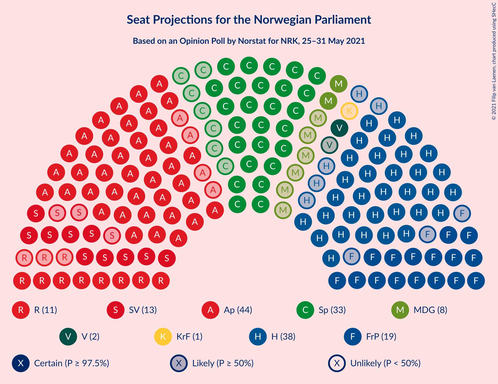
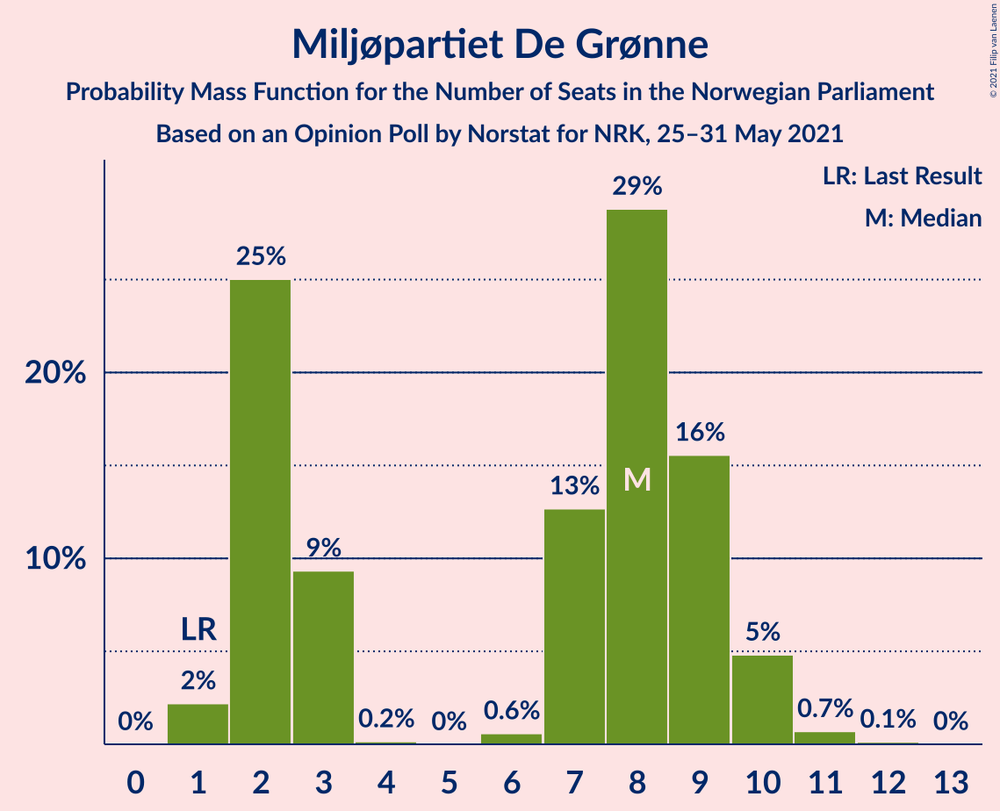
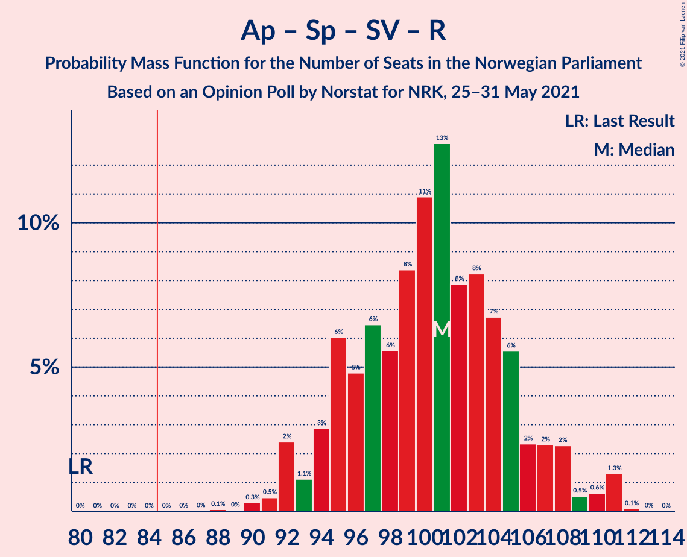
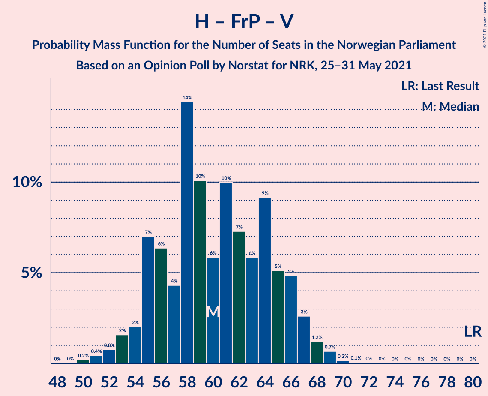
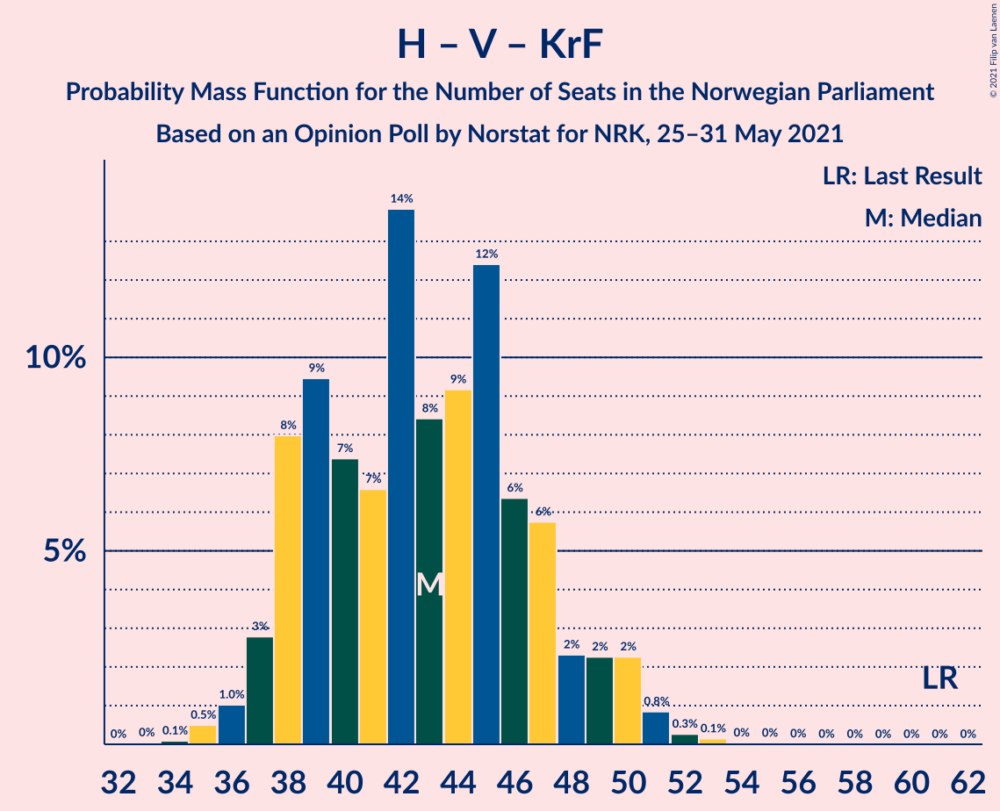

# Opinion Poll by Norstat for NRK, 25–31 May 2021

<a href="#voting-intentions">Voting Intentions</a> | <a href="#seats">Seats</a> | <a href="#coalitions">Coalitions</a> | <a href="#technical-information">Technical Information</a>

## Voting Intentions

### Confidence Intervals

| Party | Last Result | Poll Result | 80% Confidence Interval | 90% Confidence Interval | 95% Confidence Interval | 99% Confidence Interval |
|:-----:|:-----------:|:-----------:|:-----------------------:|:-----------------------:|:-----------------------:|:-----------------------:|
| Arbeiderpartiet | 27.4% | 24.7% | 22.9–26.5% |22.4–27.0% |22.0–27.5% |21.2–28.4% |
| Høyre | 25.0% | 21.2% | 19.6–23.0% |19.1–23.5% |18.7–23.9% |18.0–24.8% |
| Senterpartiet | 10.3% | 17.0% | 15.5–18.7% |15.1–19.1% |14.7–19.5% |14.1–20.3% |
| Fremskrittspartiet | 15.2% | 10.7% | 9.5–12.1% |9.2–12.5% |8.9–12.8% |8.4–13.5% |
| Sosialistisk Venstreparti | 6.0% | 7.2% | 6.3–8.4% |6.0–8.8% |5.8–9.1% |5.3–9.7% |
| Rødt | 2.4% | 5.9% | 5.0–7.0% |4.8–7.3% |4.5–7.6% |4.2–8.1% |
| Miljøpartiet De Grønne | 3.2% | 4.2% | 3.5–5.2% |3.3–5.4% |3.1–5.7% |2.8–6.2% |
| Venstre | 4.4% | 3.1% | 2.5–4.0% |2.3–4.3% |2.2–4.5% |2.0–4.9% |
| Kristelig Folkeparti | 4.2% | 3.0% | 2.4–3.9% |2.3–4.1% |2.1–4.3% |1.9–4.8% |

*Note:* The poll result column reflects the actual value used in the calculations. Published results may vary slightly, and in addition be rounded to fewer digits.

## Seats

### Confidence Intervals

| Party | Last Result | Median | 80% Confidence Interval | 90% Confidence Interval | 95% Confidence Interval | 99% Confidence Interval |
|:-----:|:-----------:|:------:|:-----------------------:|:-----------------------:|:-----------------------:|:-----------------------:|
| <a href="#arbeiderpartiet">Arbeiderpartiet</a> | 49 | 44 | 41–49 |40–51 |40–52 |38–53 |
| <a href="#høyre">Høyre</a> | 45 | 38 | 35–42 |34–44 |34–45 |32–46 |
| <a href="#senterpartiet">Senterpartiet</a> | 19 | 33 | 29–36 |28–36 |27–37 |25–38 |
| <a href="#fremskrittspartiet">Fremskrittspartiet</a> | 27 | 19 | 17–23 |16–24 |16–24 |15–25 |
| <a href="#sosialistisk-venstreparti">Sosialistisk Venstreparti</a> | 11 | 13 | 11–14 |11–15 |10–17 |10–18 |
| <a href="#rødt">Rødt</a> | 1 | 10 | 9–12 |8–13 |8–14 |2–14 |
| <a href="#miljøpartiet-de-grønne">Miljøpartiet De Grønne</a> | 1 | 7 | 2–9 |2–10 |2–10 |1–11 |
| <a href="#venstre">Venstre</a> | 8 | 2 | 2–7 |2–8 |1–8 |1–9 |
| <a href="#kristelig-folkeparti">Kristelig Folkeparti</a> | 8 | 1 | 1–3 |1–7 |0–7 |0–8 |

### Arbeiderpartiet

*For a full overview of the results for this party, see the [Arbeiderpartiet](party-arbeiderpartiet.html) page.*

| Number of Seats | Probability | Accumulated | Special Marks |
|:---------------:|:-----------:|:-----------:|:-------------:|
| 38 | 0.5% | 100% |  |
| 39 | 1.0% | 99.5% |  |
| 40 | 4% | 98% |  |
| 41 | 14% | 95% |  |
| 42 | 9% | 81% |  |
| 43 | 12% | 72% |  |
| 44 | 24% | 60% | Median |
| 45 | 8% | 36% |  |
| 46 | 9% | 28% |  |
| 47 | 3% | 19% |  |
| 48 | 4% | 16% |  |
| 49 | 4% | 12% | Last Result |
| 50 | 2% | 8% |  |
| 51 | 2% | 6% |  |
| 52 | 3% | 4% |  |
| 53 | 1.2% | 1.3% |  |
| 54 | 0.1% | 0.1% |  |
| 55 | 0% | 0% |  |

### Høyre

*For a full overview of the results for this party, see the [Høyre](party-høyre.html) page.*

| Number of Seats | Probability | Accumulated | Special Marks |
|:---------------:|:-----------:|:-----------:|:-------------:|
| 31 | 0.2% | 100% |  |
| 32 | 0.3% | 99.8% |  |
| 33 | 2% | 99.4% |  |
| 34 | 5% | 98% |  |
| 35 | 15% | 93% |  |
| 36 | 12% | 77% |  |
| 37 | 12% | 65% |  |
| 38 | 18% | 54% | Median |
| 39 | 10% | 36% |  |
| 40 | 8% | 26% |  |
| 41 | 6% | 18% |  |
| 42 | 4% | 13% |  |
| 43 | 3% | 9% |  |
| 44 | 2% | 6% |  |
| 45 | 2% | 3% | Last Result |
| 46 | 1.2% | 1.3% |  |
| 47 | 0.1% | 0.1% |  |
| 48 | 0% | 0% |  |

### Senterpartiet

*For a full overview of the results for this party, see the [Senterpartiet](party-senterpartiet.html) page.*

| Number of Seats | Probability | Accumulated | Special Marks |
|:---------------:|:-----------:|:-----------:|:-------------:|
| 19 | 0% | 100% | Last Result |
| 20 | 0% | 100% |  |
| 21 | 0% | 100% |  |
| 22 | 0% | 100% |  |
| 23 | 0% | 100% |  |
| 24 | 0.2% | 100% |  |
| 25 | 0.4% | 99.7% |  |
| 26 | 1.2% | 99.3% |  |
| 27 | 3% | 98% |  |
| 28 | 3% | 95% |  |
| 29 | 6% | 92% |  |
| 30 | 7% | 86% |  |
| 31 | 9% | 79% |  |
| 32 | 10% | 70% |  |
| 33 | 13% | 60% | Median |
| 34 | 16% | 47% |  |
| 35 | 17% | 30% |  |
| 36 | 9% | 13% |  |
| 37 | 4% | 5% |  |
| 38 | 0.7% | 1.0% |  |
| 39 | 0.1% | 0.3% |  |
| 40 | 0.2% | 0.2% |  |
| 41 | 0% | 0% |  |

### Fremskrittspartiet

*For a full overview of the results for this party, see the [Fremskrittspartiet](party-fremskrittspartiet.html) page.*

| Number of Seats | Probability | Accumulated | Special Marks |
|:---------------:|:-----------:|:-----------:|:-------------:|
| 13 | 0.1% | 100% |  |
| 14 | 0.4% | 99.9% |  |
| 15 | 1.2% | 99.5% |  |
| 16 | 5% | 98% |  |
| 17 | 10% | 94% |  |
| 18 | 21% | 83% |  |
| 19 | 14% | 62% | Median |
| 20 | 13% | 48% |  |
| 21 | 9% | 35% |  |
| 22 | 14% | 26% |  |
| 23 | 6% | 12% |  |
| 24 | 5% | 6% |  |
| 25 | 0.8% | 1.0% |  |
| 26 | 0.1% | 0.2% |  |
| 27 | 0% | 0% | Last Result |

### Sosialistisk Venstreparti

*For a full overview of the results for this party, see the [Sosialistisk Venstreparti](party-sosialistiskvenstreparti.html) page.*

| Number of Seats | Probability | Accumulated | Special Marks |
|:---------------:|:-----------:|:-----------:|:-------------:|
| 9 | 0.3% | 100% |  |
| 10 | 4% | 99.7% |  |
| 11 | 12% | 96% | Last Result |
| 12 | 26% | 84% |  |
| 13 | 35% | 58% | Median |
| 14 | 13% | 22% |  |
| 15 | 6% | 10% |  |
| 16 | 2% | 4% |  |
| 17 | 2% | 3% |  |
| 18 | 0.8% | 1.0% |  |
| 19 | 0.2% | 0.2% |  |
| 20 | 0% | 0% |  |

### Rødt

*For a full overview of the results for this party, see the [Rødt](party-rødt.html) page.*

| Number of Seats | Probability | Accumulated | Special Marks |
|:---------------:|:-----------:|:-----------:|:-------------:|
| 1 | 0% | 100% | Last Result |
| 2 | 0.8% | 100% |  |
| 3 | 0.1% | 99.2% |  |
| 4 | 0% | 99.2% |  |
| 5 | 0% | 99.2% |  |
| 6 | 0% | 99.2% |  |
| 7 | 0.6% | 99.1% |  |
| 8 | 5% | 98.6% |  |
| 9 | 20% | 93% |  |
| 10 | 26% | 74% | Median |
| 11 | 21% | 47% |  |
| 12 | 17% | 26% |  |
| 13 | 5% | 9% |  |
| 14 | 4% | 4% |  |
| 15 | 0.2% | 0.4% |  |
| 16 | 0.2% | 0.2% |  |
| 17 | 0% | 0% |  |

### Miljøpartiet De Grønne

*For a full overview of the results for this party, see the [Miljøpartiet De Grønne](party-miljøpartietdegrønne.html) page.*

| Number of Seats | Probability | Accumulated | Special Marks |
|:---------------:|:-----------:|:-----------:|:-------------:|
| 1 | 2% | 100% | Last Result |
| 2 | 25% | 98% |  |
| 3 | 9% | 73% |  |
| 4 | 0.2% | 64% |  |
| 5 | 0% | 64% |  |
| 6 | 0.9% | 64% |  |
| 7 | 16% | 63% | Median |
| 8 | 26% | 47% |  |
| 9 | 14% | 21% |  |
| 10 | 6% | 7% |  |
| 11 | 0.7% | 0.9% |  |
| 12 | 0.1% | 0.1% |  |
| 13 | 0% | 0% |  |

### Venstre

*For a full overview of the results for this party, see the [Venstre](party-venstre.html) page.*

| Number of Seats | Probability | Accumulated | Special Marks |
|:---------------:|:-----------:|:-----------:|:-------------:|
| 0 | 0.2% | 100% |  |
| 1 | 4% | 99.8% |  |
| 2 | 79% | 95% | Median |
| 3 | 3% | 16% |  |
| 4 | 0.3% | 13% |  |
| 5 | 0% | 13% |  |
| 6 | 0.1% | 13% |  |
| 7 | 7% | 12% |  |
| 8 | 5% | 5% | Last Result |
| 9 | 0.7% | 0.9% |  |
| 10 | 0.2% | 0.2% |  |
| 11 | 0% | 0% |  |

### Kristelig Folkeparti

*For a full overview of the results for this party, see the [Kristelig Folkeparti](party-kristeligfolkeparti.html) page.*

| Number of Seats | Probability | Accumulated | Special Marks |
|:---------------:|:-----------:|:-----------:|:-------------:|
| 0 | 5% | 100% |  |
| 1 | 48% | 95% | Median |
| 2 | 26% | 47% |  |
| 3 | 15% | 21% |  |
| 4 | 0% | 6% |  |
| 5 | 0% | 6% |  |
| 6 | 0.2% | 6% |  |
| 7 | 4% | 6% |  |
| 8 | 2% | 2% | Last Result |
| 9 | 0.3% | 0.3% |  |
| 10 | 0% | 0% |  |

## Coalitions

### Confidence Intervals

| Coalition | Last Result | Median | Majority? | 80% Confidence Interval | 90% Confidence Interval | 95% Confidence Interval | 99% Confidence Interval |
|:---------:|:-----------:|:------:|:---------:|:-----------------------:|:-----------------------:|:-----------------------:|:-----------------------:|
| Arbeiderpartiet – Senterpartiet – Sosialistisk Venstreparti – Rødt – Miljøpartiet De Grønne | 81 | 106 | 100% | 102–111 | 100–112 | 99–113 | 97–114 |
| Arbeiderpartiet – Senterpartiet – Sosialistisk Venstreparti – Rødt | 80 | 101 | 100% | 95–104 | 94–106 | 93–107 | 91–109 |
| Arbeiderpartiet – Senterpartiet – Sosialistisk Venstreparti – Miljøpartiet De Grønne – Kristelig Folkeparti | 88 | 98 | 100% | 93–102 | 92–103 | 90–104 | 88–106 |
| Arbeiderpartiet – Senterpartiet – Sosialistisk Venstreparti – Miljøpartiet De Grønne | 80 | 96 | 99.9% | 91–100 | 90–102 | 88–102 | 86–104 |
| Høyre – Senterpartiet – Fremskrittspartiet – Venstre – Kristelig Folkeparti | 107 | 95 | 99.6% | 90–100 | 88–100 | 86–102 | 85–103 |
| Arbeiderpartiet – Senterpartiet – Sosialistisk Venstreparti | 79 | 90 | 94% | 85–94 | 84–95 | 83–96 | 81–98 |
| Arbeiderpartiet – Senterpartiet – Miljøpartiet De Grønne – Kristelig Folkeparti | 77 | 85 | 58% | 80–90 | 78–91 | 77–92 | 74–94 |
| Arbeiderpartiet – Senterpartiet – Kristelig Folkeparti | 76 | 79 | 5% | 74–83 | 73–85 | 72–86 | 70–88 |
| Arbeiderpartiet – Senterpartiet | 68 | 77 | 1.5% | 72–81 | 71–82 | 70–84 | 68–86 |
| Høyre – Fremskrittspartiet – Miljøpartiet De Grønne – Venstre – Kristelig Folkeparti | 89 | 68 | 0% | 64–73 | 63–74 | 61–76 | 60–77 |
| Høyre – Fremskrittspartiet – Venstre – Kristelig Folkeparti | 88 | 62 | 0% | 57–67 | 57–68 | 56–69 | 54–71 |
| Høyre – Fremskrittspartiet – Venstre | 80 | 60 | 0% | 56–65 | 55–66 | 55–67 | 52–69 |
| Arbeiderpartiet – Sosialistisk Venstreparti | 60 | 57 | 0% | 54–62 | 53–64 | 52–65 | 50–67 |
| Høyre – Fremskrittspartiet | 72 | 57 | 0% | 54–62 | 53–63 | 52–64 | 50–66 |
| Høyre – Venstre – Kristelig Folkeparti | 61 | 42 | 0% | 38–48 | 38–50 | 37–50 | 36–51 |
| Senterpartiet – Venstre – Kristelig Folkeparti | 35 | 38 | 0% | 33–41 | 32–42 | 30–44 | 29–47 |

### Arbeiderpartiet – Senterpartiet – Sosialistisk Venstreparti – Rødt – Miljøpartiet De Grønne

| Number of Seats | Probability | Accumulated | Special Marks |
|:---------------:|:-----------:|:-----------:|:-------------:|
| 81 | 0% | 100% | Last Result |
| 82 | 0% | 100% |  |
| 83 | 0% | 100% |  |
| 84 | 0% | 100% |  |
| 85 | 0% | 100% | Majority |
| 86 | 0% | 100% |  |
| 87 | 0% | 100% |  |
| 88 | 0% | 100% |  |
| 89 | 0% | 100% |  |
| 90 | 0% | 100% |  |
| 91 | 0% | 100% |  |
| 92 | 0% | 100% |  |
| 93 | 0% | 100% |  |
| 94 | 0% | 99.9% |  |
| 95 | 0% | 99.9% |  |
| 96 | 0.1% | 99.9% |  |
| 97 | 0.4% | 99.8% |  |
| 98 | 0.9% | 99.3% |  |
| 99 | 1.4% | 98% |  |
| 100 | 2% | 97% |  |
| 101 | 4% | 95% |  |
| 102 | 4% | 91% |  |
| 103 | 7% | 86% |  |
| 104 | 8% | 79% |  |
| 105 | 13% | 71% |  |
| 106 | 10% | 58% |  |
| 107 | 7% | 48% | Median |
| 108 | 10% | 41% |  |
| 109 | 11% | 31% |  |
| 110 | 8% | 20% |  |
| 111 | 3% | 12% |  |
| 112 | 6% | 9% |  |
| 113 | 3% | 3% |  |
| 114 | 0.5% | 0.9% |  |
| 115 | 0.3% | 0.4% |  |
| 116 | 0% | 0.1% |  |
| 117 | 0% | 0% |  |

### Arbeiderpartiet – Senterpartiet – Sosialistisk Venstreparti – Rødt

| Number of Seats | Probability | Accumulated | Special Marks |
|:---------------:|:-----------:|:-----------:|:-------------:|
| 80 | 0% | 100% | Last Result |
| 81 | 0% | 100% |  |
| 82 | 0% | 100% |  |
| 83 | 0% | 100% |  |
| 84 | 0% | 100% |  |
| 85 | 0% | 100% | Majority |
| 86 | 0% | 100% |  |
| 87 | 0% | 100% |  |
| 88 | 0% | 100% |  |
| 89 | 0% | 99.9% |  |
| 90 | 0.1% | 99.9% |  |
| 91 | 0.4% | 99.8% |  |
| 92 | 0.9% | 99.4% |  |
| 93 | 1.3% | 98% |  |
| 94 | 3% | 97% |  |
| 95 | 5% | 94% |  |
| 96 | 5% | 89% |  |
| 97 | 7% | 85% |  |
| 98 | 5% | 78% |  |
| 99 | 8% | 73% |  |
| 100 | 11% | 65% | Median |
| 101 | 15% | 54% |  |
| 102 | 11% | 38% |  |
| 103 | 9% | 27% |  |
| 104 | 8% | 18% |  |
| 105 | 4% | 10% |  |
| 106 | 2% | 6% |  |
| 107 | 1.3% | 4% |  |
| 108 | 1.4% | 2% |  |
| 109 | 0.6% | 0.8% |  |
| 110 | 0.2% | 0.2% |  |
| 111 | 0% | 0.1% |  |
| 112 | 0% | 0% |  |

### Arbeiderpartiet – Senterpartiet – Sosialistisk Venstreparti – Miljøpartiet De Grønne – Kristelig Folkeparti

| Number of Seats | Probability | Accumulated | Special Marks |
|:---------------:|:-----------:|:-----------:|:-------------:|
| 86 | 0% | 100% |  |
| 87 | 0.1% | 99.9% |  |
| 88 | 0.4% | 99.8% | Last Result |
| 89 | 0.8% | 99.4% |  |
| 90 | 1.3% | 98.7% |  |
| 91 | 2% | 97% |  |
| 92 | 2% | 95% |  |
| 93 | 5% | 93% |  |
| 94 | 8% | 89% |  |
| 95 | 8% | 81% |  |
| 96 | 9% | 73% |  |
| 97 | 8% | 64% |  |
| 98 | 10% | 56% | Median |
| 99 | 11% | 47% |  |
| 100 | 11% | 35% |  |
| 101 | 11% | 24% |  |
| 102 | 5% | 13% |  |
| 103 | 5% | 8% |  |
| 104 | 2% | 3% |  |
| 105 | 0.8% | 2% |  |
| 106 | 0.5% | 0.9% |  |
| 107 | 0.3% | 0.4% |  |
| 108 | 0.1% | 0.1% |  |
| 109 | 0% | 0% |  |

### Arbeiderpartiet – Senterpartiet – Sosialistisk Venstreparti – Miljøpartiet De Grønne

| Number of Seats | Probability | Accumulated | Special Marks |
|:---------------:|:-----------:|:-----------:|:-------------:|
| 80 | 0% | 100% | Last Result |
| 81 | 0% | 100% |  |
| 82 | 0% | 100% |  |
| 83 | 0% | 100% |  |
| 84 | 0% | 99.9% |  |
| 85 | 0.1% | 99.9% | Majority |
| 86 | 0.7% | 99.8% |  |
| 87 | 0.4% | 99.0% |  |
| 88 | 1.3% | 98.6% |  |
| 89 | 2% | 97% |  |
| 90 | 2% | 95% |  |
| 91 | 5% | 93% |  |
| 92 | 8% | 89% |  |
| 93 | 9% | 80% |  |
| 94 | 5% | 72% |  |
| 95 | 10% | 67% |  |
| 96 | 12% | 57% |  |
| 97 | 10% | 46% | Median |
| 98 | 8% | 36% |  |
| 99 | 12% | 28% |  |
| 100 | 6% | 16% |  |
| 101 | 4% | 10% |  |
| 102 | 4% | 5% |  |
| 103 | 1.2% | 2% |  |
| 104 | 0.5% | 0.7% |  |
| 105 | 0.1% | 0.2% |  |
| 106 | 0.1% | 0.1% |  |
| 107 | 0% | 0% |  |

### Høyre – Senterpartiet – Fremskrittspartiet – Venstre – Kristelig Folkeparti

| Number of Seats | Probability | Accumulated | Special Marks |
|:---------------:|:-----------:|:-----------:|:-------------:|
| 82 | 0.1% | 100% |  |
| 83 | 0.1% | 99.9% |  |
| 84 | 0.3% | 99.9% |  |
| 85 | 0.7% | 99.6% | Majority |
| 86 | 2% | 98.9% |  |
| 87 | 2% | 97% |  |
| 88 | 2% | 95% |  |
| 89 | 2% | 93% |  |
| 90 | 5% | 91% |  |
| 91 | 3% | 86% |  |
| 92 | 5% | 83% |  |
| 93 | 8% | 78% | Median |
| 94 | 6% | 71% |  |
| 95 | 22% | 64% |  |
| 96 | 7% | 42% |  |
| 97 | 7% | 36% |  |
| 98 | 10% | 29% |  |
| 99 | 7% | 18% |  |
| 100 | 7% | 11% |  |
| 101 | 1.4% | 4% |  |
| 102 | 2% | 3% |  |
| 103 | 0.6% | 0.8% |  |
| 104 | 0.1% | 0.2% |  |
| 105 | 0.1% | 0.1% |  |
| 106 | 0% | 0% |  |
| 107 | 0% | 0% | Last Result |

### Arbeiderpartiet – Senterpartiet – Sosialistisk Venstreparti

| Number of Seats | Probability | Accumulated | Special Marks |
|:---------------:|:-----------:|:-----------:|:-------------:|
| 78 | 0.1% | 100% |  |
| 79 | 0.1% | 99.9% | Last Result |
| 80 | 0.1% | 99.8% |  |
| 81 | 0.2% | 99.7% |  |
| 82 | 1.1% | 99.4% |  |
| 83 | 1.2% | 98% |  |
| 84 | 4% | 97% |  |
| 85 | 6% | 94% | Majority |
| 86 | 4% | 87% |  |
| 87 | 5% | 83% |  |
| 88 | 5% | 78% |  |
| 89 | 15% | 73% |  |
| 90 | 15% | 58% | Median |
| 91 | 12% | 43% |  |
| 92 | 9% | 30% |  |
| 93 | 9% | 22% |  |
| 94 | 6% | 13% |  |
| 95 | 2% | 6% |  |
| 96 | 2% | 4% |  |
| 97 | 2% | 2% |  |
| 98 | 0.5% | 0.6% |  |
| 99 | 0.1% | 0.2% |  |
| 100 | 0% | 0.1% |  |
| 101 | 0% | 0% |  |

### Arbeiderpartiet – Senterpartiet – Miljøpartiet De Grønne – Kristelig Folkeparti

| Number of Seats | Probability | Accumulated | Special Marks |
|:---------------:|:-----------:|:-----------:|:-------------:|
| 72 | 0% | 100% |  |
| 73 | 0.1% | 99.9% |  |
| 74 | 0.5% | 99.8% |  |
| 75 | 0.5% | 99.4% |  |
| 76 | 0.6% | 98.9% |  |
| 77 | 2% | 98% | Last Result |
| 78 | 3% | 97% |  |
| 79 | 3% | 94% |  |
| 80 | 3% | 91% |  |
| 81 | 9% | 88% |  |
| 82 | 8% | 79% |  |
| 83 | 6% | 71% |  |
| 84 | 7% | 65% |  |
| 85 | 9% | 58% | Median, Majority |
| 86 | 10% | 49% |  |
| 87 | 8% | 39% |  |
| 88 | 12% | 31% |  |
| 89 | 6% | 19% |  |
| 90 | 5% | 13% |  |
| 91 | 3% | 7% |  |
| 92 | 2% | 4% |  |
| 93 | 0.9% | 2% |  |
| 94 | 0.3% | 0.8% |  |
| 95 | 0.2% | 0.4% |  |
| 96 | 0.1% | 0.2% |  |
| 97 | 0% | 0% |  |

### Arbeiderpartiet – Senterpartiet – Kristelig Folkeparti

| Number of Seats | Probability | Accumulated | Special Marks |
|:---------------:|:-----------:|:-----------:|:-------------:|
| 68 | 0.1% | 100% |  |
| 69 | 0.3% | 99.9% |  |
| 70 | 0.2% | 99.6% |  |
| 71 | 0.8% | 99.4% |  |
| 72 | 2% | 98.6% |  |
| 73 | 2% | 96% |  |
| 74 | 5% | 94% |  |
| 75 | 6% | 89% |  |
| 76 | 6% | 83% | Last Result |
| 77 | 5% | 77% |  |
| 78 | 12% | 72% | Median |
| 79 | 13% | 60% |  |
| 80 | 15% | 47% |  |
| 81 | 10% | 32% |  |
| 82 | 6% | 21% |  |
| 83 | 8% | 15% |  |
| 84 | 2% | 7% |  |
| 85 | 2% | 5% | Majority |
| 86 | 0.9% | 3% |  |
| 87 | 1.4% | 2% |  |
| 88 | 0.7% | 0.9% |  |
| 89 | 0.2% | 0.3% |  |
| 90 | 0.1% | 0.1% |  |
| 91 | 0% | 0% |  |

### Arbeiderpartiet – Senterpartiet

| Number of Seats | Probability | Accumulated | Special Marks |
|:---------------:|:-----------:|:-----------:|:-------------:|
| 66 | 0.1% | 100% |  |
| 67 | 0.2% | 99.9% |  |
| 68 | 0.7% | 99.7% | Last Result |
| 69 | 0.4% | 99.0% |  |
| 70 | 1.4% | 98.6% |  |
| 71 | 3% | 97% |  |
| 72 | 5% | 95% |  |
| 73 | 6% | 90% |  |
| 74 | 4% | 84% |  |
| 75 | 7% | 80% |  |
| 76 | 16% | 73% |  |
| 77 | 9% | 57% | Median |
| 78 | 12% | 48% |  |
| 79 | 12% | 36% |  |
| 80 | 9% | 24% |  |
| 81 | 7% | 15% |  |
| 82 | 4% | 8% |  |
| 83 | 1.4% | 4% |  |
| 84 | 1.1% | 3% |  |
| 85 | 0.9% | 1.5% | Majority |
| 86 | 0.4% | 0.6% |  |
| 87 | 0% | 0.1% |  |
| 88 | 0.1% | 0.1% |  |
| 89 | 0% | 0% |  |

### Høyre – Fremskrittspartiet – Miljøpartiet De Grønne – Venstre – Kristelig Folkeparti

| Number of Seats | Probability | Accumulated | Special Marks |
|:---------------:|:-----------:|:-----------:|:-------------:|
| 58 | 0.1% | 100% |  |
| 59 | 0.3% | 99.9% |  |
| 60 | 0.9% | 99.5% |  |
| 61 | 2% | 98.7% |  |
| 62 | 2% | 97% |  |
| 63 | 3% | 95% |  |
| 64 | 5% | 92% |  |
| 65 | 9% | 87% |  |
| 66 | 9% | 79% |  |
| 67 | 11% | 70% | Median |
| 68 | 16% | 58% |  |
| 69 | 11% | 43% |  |
| 70 | 7% | 31% |  |
| 71 | 4% | 24% |  |
| 72 | 6% | 19% |  |
| 73 | 4% | 13% |  |
| 74 | 5% | 9% |  |
| 75 | 2% | 5% |  |
| 76 | 1.2% | 3% |  |
| 77 | 0.8% | 1.3% |  |
| 78 | 0.3% | 0.5% |  |
| 79 | 0.1% | 0.2% |  |
| 80 | 0% | 0.1% |  |
| 81 | 0% | 0% |  |
| 82 | 0% | 0% |  |
| 83 | 0% | 0% |  |
| 84 | 0% | 0% |  |
| 85 | 0% | 0% | Majority |
| 86 | 0% | 0% |  |
| 87 | 0% | 0% |  |
| 88 | 0% | 0% |  |
| 89 | 0% | 0% | Last Result |

### Høyre – Fremskrittspartiet – Venstre – Kristelig Folkeparti

| Number of Seats | Probability | Accumulated | Special Marks |
|:---------------:|:-----------:|:-----------:|:-------------:|
| 52 | 0% | 100% |  |
| 53 | 0.1% | 99.9% |  |
| 54 | 0.5% | 99.9% |  |
| 55 | 0.7% | 99.4% |  |
| 56 | 3% | 98.7% |  |
| 57 | 7% | 96% |  |
| 58 | 3% | 89% |  |
| 59 | 8% | 85% |  |
| 60 | 12% | 77% | Median |
| 61 | 11% | 65% |  |
| 62 | 6% | 55% |  |
| 63 | 10% | 48% |  |
| 64 | 12% | 38% |  |
| 65 | 8% | 26% |  |
| 66 | 7% | 19% |  |
| 67 | 4% | 12% |  |
| 68 | 4% | 8% |  |
| 69 | 2% | 4% |  |
| 70 | 1.2% | 2% |  |
| 71 | 0.7% | 1.1% |  |
| 72 | 0.3% | 0.5% |  |
| 73 | 0.1% | 0.1% |  |
| 74 | 0% | 0.1% |  |
| 75 | 0% | 0% |  |
| 76 | 0% | 0% |  |
| 77 | 0% | 0% |  |
| 78 | 0% | 0% |  |
| 79 | 0% | 0% |  |
| 80 | 0% | 0% |  |
| 81 | 0% | 0% |  |
| 82 | 0% | 0% |  |
| 83 | 0% | 0% |  |
| 84 | 0% | 0% |  |
| 85 | 0% | 0% | Majority |
| 86 | 0% | 0% |  |
| 87 | 0% | 0% |  |
| 88 | 0% | 0% | Last Result |

### Høyre – Fremskrittspartiet – Venstre

| Number of Seats | Probability | Accumulated | Special Marks |
|:---------------:|:-----------:|:-----------:|:-------------:|
| 50 | 0.1% | 100% |  |
| 51 | 0.2% | 99.9% |  |
| 52 | 0.4% | 99.7% |  |
| 53 | 0.7% | 99.3% |  |
| 54 | 0.9% | 98.6% |  |
| 55 | 4% | 98% |  |
| 56 | 7% | 94% |  |
| 57 | 4% | 86% |  |
| 58 | 18% | 82% |  |
| 59 | 10% | 65% | Median |
| 60 | 7% | 55% |  |
| 61 | 10% | 48% |  |
| 62 | 11% | 38% |  |
| 63 | 7% | 27% |  |
| 64 | 7% | 20% |  |
| 65 | 6% | 13% |  |
| 66 | 4% | 7% |  |
| 67 | 1.5% | 3% |  |
| 68 | 1.0% | 2% |  |
| 69 | 0.5% | 0.7% |  |
| 70 | 0.1% | 0.2% |  |
| 71 | 0% | 0.1% |  |
| 72 | 0% | 0% |  |
| 73 | 0% | 0% |  |
| 74 | 0% | 0% |  |
| 75 | 0% | 0% |  |
| 76 | 0% | 0% |  |
| 77 | 0% | 0% |  |
| 78 | 0% | 0% |  |
| 79 | 0% | 0% |  |
| 80 | 0% | 0% | Last Result |

### Arbeiderpartiet – Sosialistisk Venstreparti

| Number of Seats | Probability | Accumulated | Special Marks |
|:---------------:|:-----------:|:-----------:|:-------------:|
| 49 | 0% | 100% |  |
| 50 | 0.7% | 99.9% |  |
| 51 | 1.0% | 99.2% |  |
| 52 | 2% | 98% |  |
| 53 | 6% | 96% |  |
| 54 | 11% | 91% |  |
| 55 | 15% | 80% |  |
| 56 | 12% | 65% |  |
| 57 | 19% | 54% | Median |
| 58 | 7% | 35% |  |
| 59 | 8% | 28% |  |
| 60 | 6% | 20% | Last Result |
| 61 | 3% | 15% |  |
| 62 | 2% | 11% |  |
| 63 | 3% | 9% |  |
| 64 | 3% | 6% |  |
| 65 | 2% | 3% |  |
| 66 | 1.1% | 2% |  |
| 67 | 0.3% | 0.6% |  |
| 68 | 0.3% | 0.3% |  |
| 69 | 0% | 0% |  |

### Høyre – Fremskrittspartiet

| Number of Seats | Probability | Accumulated | Special Marks |
|:---------------:|:-----------:|:-----------:|:-------------:|
| 48 | 0.1% | 100% |  |
| 49 | 0.3% | 99.9% |  |
| 50 | 0.4% | 99.6% |  |
| 51 | 1.4% | 99.2% |  |
| 52 | 2% | 98% |  |
| 53 | 5% | 96% |  |
| 54 | 10% | 91% |  |
| 55 | 5% | 81% |  |
| 56 | 18% | 76% |  |
| 57 | 11% | 58% | Median |
| 58 | 8% | 47% |  |
| 59 | 8% | 39% |  |
| 60 | 9% | 30% |  |
| 61 | 7% | 21% |  |
| 62 | 5% | 14% |  |
| 63 | 4% | 9% |  |
| 64 | 3% | 5% |  |
| 65 | 1.1% | 2% |  |
| 66 | 0.7% | 0.9% |  |
| 67 | 0.2% | 0.3% |  |
| 68 | 0% | 0% |  |
| 69 | 0% | 0% |  |
| 70 | 0% | 0% |  |
| 71 | 0% | 0% |  |
| 72 | 0% | 0% | Last Result |

### Høyre – Venstre – Kristelig Folkeparti

| Number of Seats | Probability | Accumulated | Special Marks |
|:---------------:|:-----------:|:-----------:|:-------------:|
| 36 | 0.5% | 100% |  |
| 37 | 3% | 99.5% |  |
| 38 | 7% | 96% |  |
| 39 | 11% | 89% |  |
| 40 | 11% | 78% |  |
| 41 | 9% | 67% | Median |
| 42 | 18% | 58% |  |
| 43 | 4% | 40% |  |
| 44 | 6% | 36% |  |
| 45 | 9% | 30% |  |
| 46 | 3% | 21% |  |
| 47 | 6% | 17% |  |
| 48 | 3% | 11% |  |
| 49 | 3% | 8% |  |
| 50 | 3% | 5% |  |
| 51 | 1.2% | 2% |  |
| 52 | 0.3% | 0.5% |  |
| 53 | 0.1% | 0.2% |  |
| 54 | 0% | 0.1% |  |
| 55 | 0% | 0% |  |
| 56 | 0% | 0% |  |
| 57 | 0% | 0% |  |
| 58 | 0% | 0% |  |
| 59 | 0% | 0% |  |
| 60 | 0% | 0% |  |
| 61 | 0% | 0% | Last Result |

### Senterpartiet – Venstre – Kristelig Folkeparti

| Number of Seats | Probability | Accumulated | Special Marks |
|:---------------:|:-----------:|:-----------:|:-------------:|
| 27 | 0.1% | 100% |  |
| 28 | 0.2% | 99.9% |  |
| 29 | 0.7% | 99.6% |  |
| 30 | 2% | 98.9% |  |
| 31 | 2% | 97% |  |
| 32 | 4% | 95% |  |
| 33 | 6% | 92% |  |
| 34 | 6% | 86% |  |
| 35 | 7% | 79% | Last Result |
| 36 | 9% | 72% | Median |
| 37 | 12% | 64% |  |
| 38 | 11% | 52% |  |
| 39 | 19% | 41% |  |
| 40 | 6% | 22% |  |
| 41 | 7% | 16% |  |
| 42 | 4% | 9% |  |
| 43 | 1.4% | 5% |  |
| 44 | 2% | 4% |  |
| 45 | 1.2% | 2% |  |
| 46 | 0.4% | 0.9% |  |
| 47 | 0.3% | 0.5% |  |
| 48 | 0% | 0.2% |  |
| 49 | 0.2% | 0.2% |  |
| 50 | 0% | 0% |  |

## Technical Information

### Opinion Poll

+ **Polling firm:** Norstat
+ **Commissioner(s):** NRK
+ **Fieldwork period:** 25–31 May 2021

### Calculations

+ **Sample size:** 953
+ **Simulations done:** 524,288
+ **Error estimate:** 1.86%

