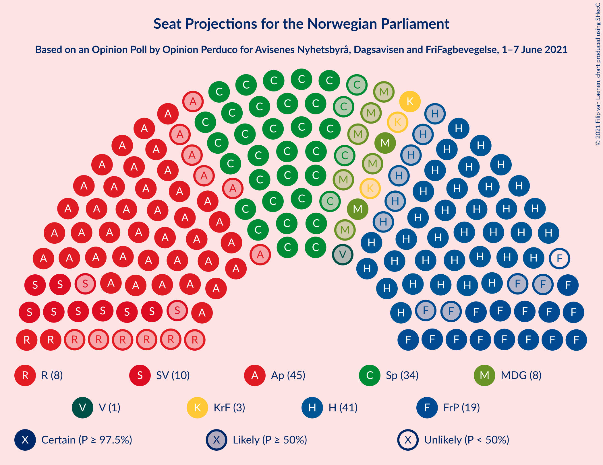
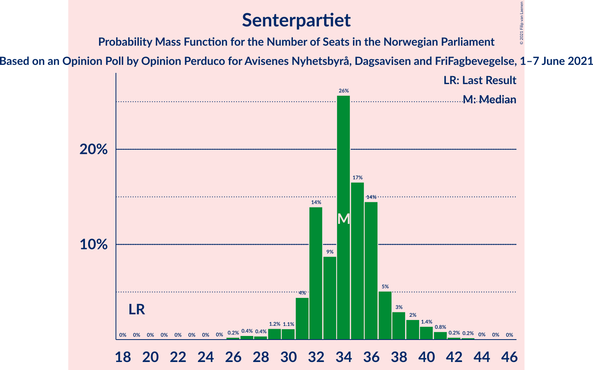
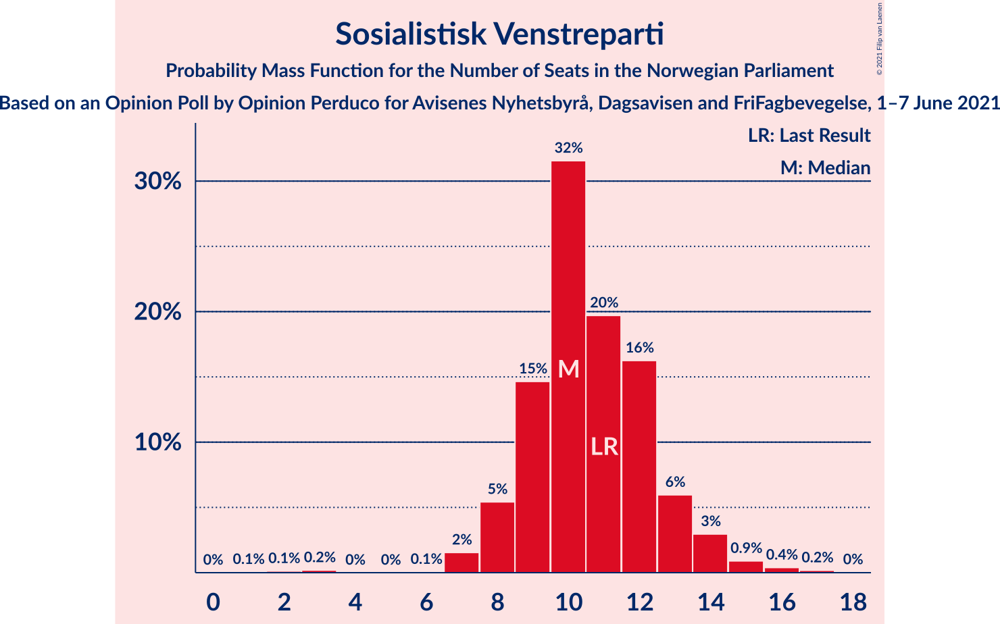
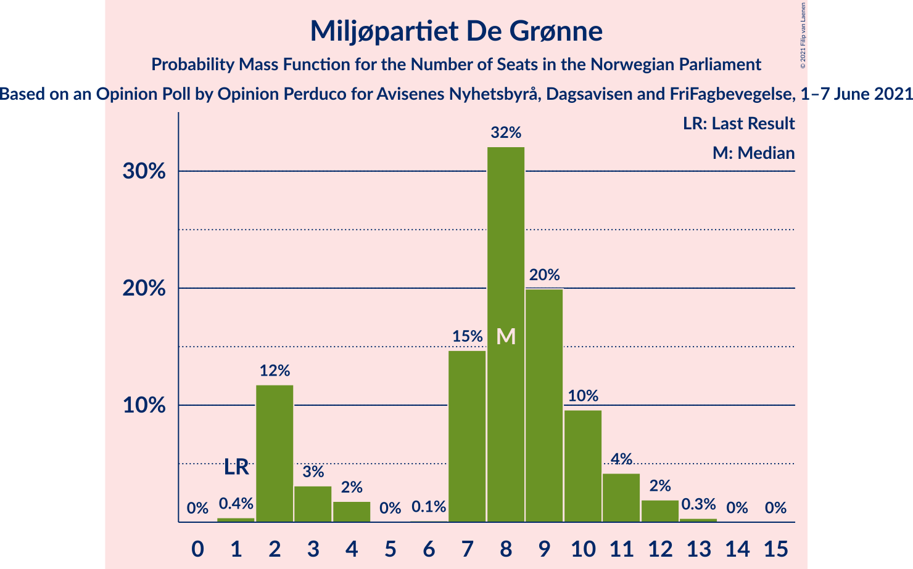
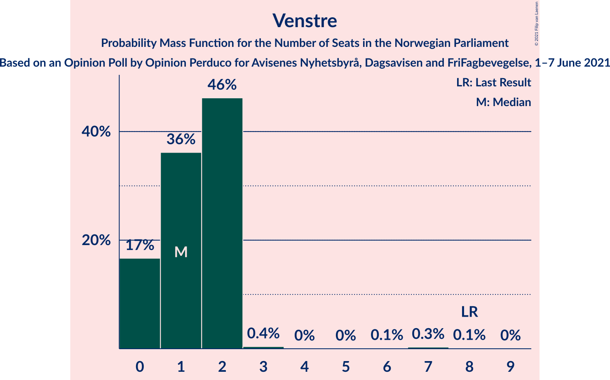
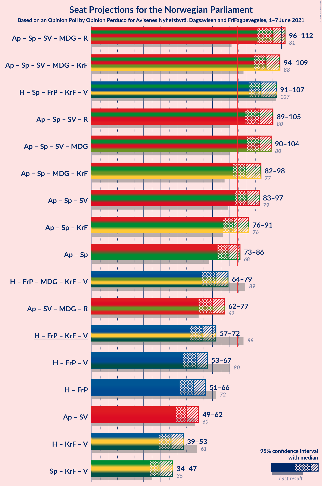
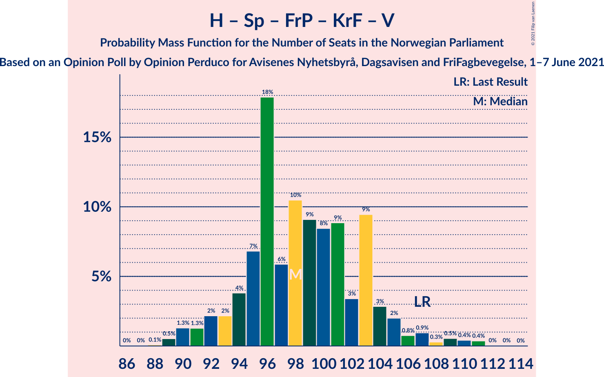
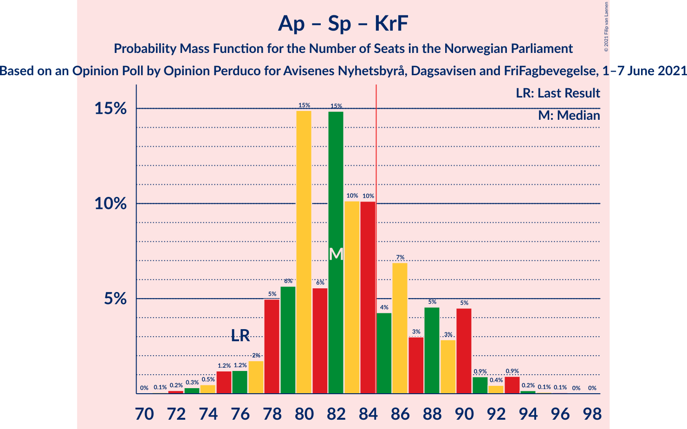
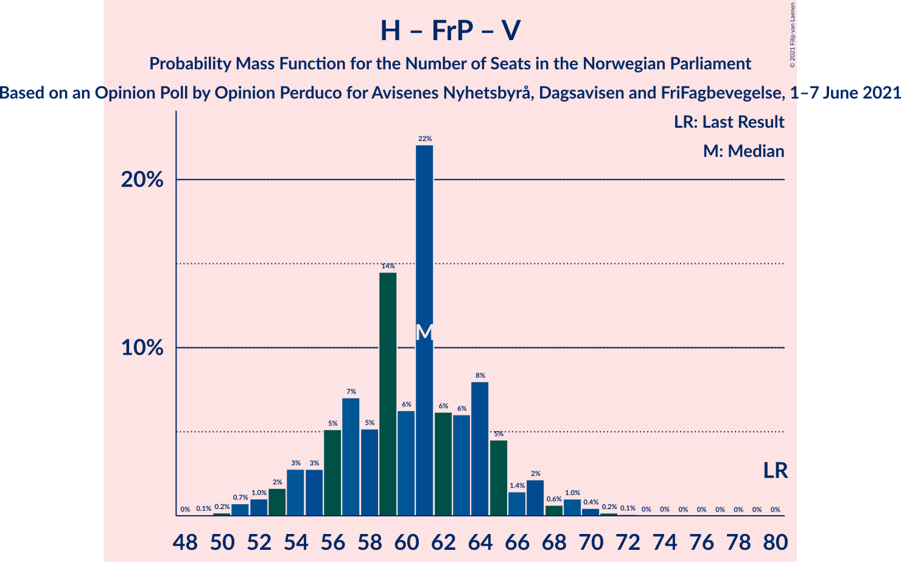
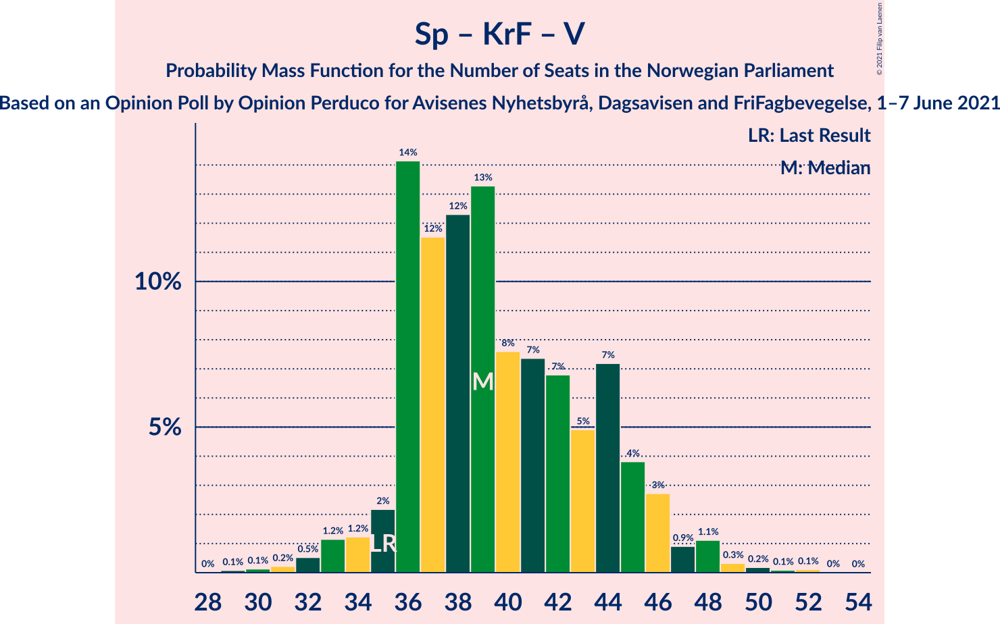

# Opinion Poll by Opinion Perduco for Avisenes Nyhetsbyrå, Dagsavisen and FriFagbevegelse, 1–7 June 2021

<a href="#voting-intentions">Voting Intentions</a> | <a href="#seats">Seats</a> | <a href="#coalitions">Coalitions</a> | <a href="#technical-information">Technical Information</a>

## Voting Intentions

### Confidence Intervals

| Party | Last Result | Poll Result | 80% Confidence Interval | 90% Confidence Interval | 95% Confidence Interval | 99% Confidence Interval |
|:-----:|:-----------:|:-----------:|:-----------------------:|:-----------------------:|:-----------------------:|:-----------------------:|
| Arbeiderpartiet | 27.4% | 24.3% | 22.3–26.4% |21.7–27.0% |21.3–27.6% |20.3–28.6% |
| Høyre | 25.0% | 22.7% | 20.8–24.8% |20.3–25.4% |19.8–25.9% |18.9–27.0% |
| Senterpartiet | 10.3% | 18.7% | 16.9–20.6% |16.4–21.2% |16.0–21.7% |15.2–22.7% |
| Fremskrittspartiet | 15.2% | 10.2% | 8.9–11.8% |8.5–12.3% |8.2–12.7% |7.6–13.5% |
| Sosialistisk Venstreparti | 6.0% | 6.0% | 5.0–7.3% |4.7–7.7% |4.5–8.0% |4.1–8.7% |
| Rødt | 2.4% | 4.6% | 3.8–5.8% |3.5–6.1% |3.3–6.4% |2.9–7.0% |
| Miljøpartiet De Grønne | 3.2% | 4.6% | 3.8–5.8% |3.5–6.1% |3.3–6.4% |2.9–7.0% |
| Kristelig Folkeparti | 4.2% | 3.6% | 2.9–4.7% |2.7–5.0% |2.5–5.3% |2.2–5.9% |
| Venstre | 4.4% | 2.2% | 1.7–3.1% |1.5–3.4% |1.4–3.6% |1.2–4.1% |

*Note:* The poll result column reflects the actual value used in the calculations. Published results may vary slightly, and in addition be rounded to fewer digits.

## Seats

### Confidence Intervals

| Party | Last Result | Median | 80% Confidence Interval | 90% Confidence Interval | 95% Confidence Interval | 99% Confidence Interval |
|:-----:|:-----------:|:------:|:-----------------------:|:-----------------------:|:-----------------------:|:-----------------------:|
| <a href="#arbeiderpartiet">Arbeiderpartiet</a> | 49 | 45 | 43–47 |43–48 |42–48 |41–50 |
| <a href="#høyre">Høyre</a> | 45 | 43 | 38–45 |37–48 |36–48 |34–49 |
| <a href="#senterpartiet">Senterpartiet</a> | 19 | 35 | 34–36 |32–37 |31–37 |29–39 |
| <a href="#fremskrittspartiet">Fremskrittspartiet</a> | 27 | 19 | 17–21 |17–22 |16–22 |14–23 |
| <a href="#sosialistisk-venstreparti">Sosialistisk Venstreparti</a> | 11 | 11 | 9–12 |9–12 |8–14 |3–14 |
| <a href="#rødt">Rødt</a> | 1 | 7 | 2–10 |2–10 |2–10 |2–11 |
| <a href="#miljøpartiet-de-grønne">Miljøpartiet De Grønne</a> | 1 | 9 | 2–10 |2–10 |2–10 |2–11 |
| <a href="#kristelig-folkeparti">Kristelig Folkeparti</a> | 8 | 2 | 1–7 |1–8 |1–8 |1–9 |
| <a href="#venstre">Venstre</a> | 8 | 1 | 0–2 |0–2 |0–2 |0–2 |

### Arbeiderpartiet

*For a full overview of the results for this party, see the [Arbeiderpartiet](party-arbeiderpartiet.html) page.*

| Number of Seats | Probability | Accumulated | Special Marks |
|:---------------:|:-----------:|:-----------:|:-------------:|
| 36 | 0% | 100% |  |
| 37 | 0% | 99.9% |  |
| 38 | 0.1% | 99.9% |  |
| 39 | 0.1% | 99.8% |  |
| 40 | 0.1% | 99.7% |  |
| 41 | 0.4% | 99.6% |  |
| 42 | 3% | 99.2% |  |
| 43 | 17% | 96% |  |
| 44 | 19% | 80% |  |
| 45 | 22% | 61% | Median |
| 46 | 24% | 38% |  |
| 47 | 5% | 15% |  |
| 48 | 8% | 9% |  |
| 49 | 0.1% | 1.5% | Last Result |
| 50 | 1.2% | 1.4% |  |
| 51 | 0.1% | 0.1% |  |
| 52 | 0% | 0.1% |  |
| 53 | 0% | 0% |  |

### Høyre

*For a full overview of the results for this party, see the [Høyre](party-høyre.html) page.*

| Number of Seats | Probability | Accumulated | Special Marks |
|:---------------:|:-----------:|:-----------:|:-------------:|
| 33 | 0.2% | 100% |  |
| 34 | 0.8% | 99.7% |  |
| 35 | 1.2% | 98.9% |  |
| 36 | 0.4% | 98% |  |
| 37 | 4% | 97% |  |
| 38 | 8% | 93% |  |
| 39 | 6% | 86% |  |
| 40 | 4% | 80% |  |
| 41 | 19% | 76% |  |
| 42 | 2% | 57% |  |
| 43 | 18% | 54% | Median |
| 44 | 17% | 36% |  |
| 45 | 13% | 20% | Last Result |
| 46 | 0.1% | 6% |  |
| 47 | 0.1% | 6% |  |
| 48 | 4% | 6% |  |
| 49 | 1.3% | 2% |  |
| 50 | 0% | 0.4% |  |
| 51 | 0% | 0.4% |  |
| 52 | 0.4% | 0.4% |  |
| 53 | 0% | 0% |  |

### Senterpartiet

*For a full overview of the results for this party, see the [Senterpartiet](party-senterpartiet.html) page.*

| Number of Seats | Probability | Accumulated | Special Marks |
|:---------------:|:-----------:|:-----------:|:-------------:|
| 19 | 0% | 100% | Last Result |
| 20 | 0% | 100% |  |
| 21 | 0% | 100% |  |
| 22 | 0% | 100% |  |
| 23 | 0% | 100% |  |
| 24 | 0% | 100% |  |
| 25 | 0% | 100% |  |
| 26 | 0% | 100% |  |
| 27 | 0.1% | 99.9% |  |
| 28 | 0.1% | 99.9% |  |
| 29 | 0.3% | 99.8% |  |
| 30 | 0.4% | 99.5% |  |
| 31 | 4% | 99.1% |  |
| 32 | 1.0% | 95% |  |
| 33 | 2% | 94% |  |
| 34 | 34% | 93% |  |
| 35 | 14% | 59% | Median |
| 36 | 36% | 45% |  |
| 37 | 7% | 9% |  |
| 38 | 1.3% | 2% |  |
| 39 | 0.1% | 0.5% |  |
| 40 | 0.1% | 0.4% |  |
| 41 | 0.2% | 0.3% |  |
| 42 | 0% | 0% |  |

### Fremskrittspartiet

*For a full overview of the results for this party, see the [Fremskrittspartiet](party-fremskrittspartiet.html) page.*

| Number of Seats | Probability | Accumulated | Special Marks |
|:---------------:|:-----------:|:-----------:|:-------------:|
| 12 | 0.1% | 100% |  |
| 13 | 0.1% | 99.9% |  |
| 14 | 0.3% | 99.8% |  |
| 15 | 0.8% | 99.5% |  |
| 16 | 2% | 98.6% |  |
| 17 | 9% | 96% |  |
| 18 | 22% | 87% |  |
| 19 | 37% | 65% | Median |
| 20 | 5% | 28% |  |
| 21 | 14% | 23% |  |
| 22 | 8% | 9% |  |
| 23 | 1.1% | 1.4% |  |
| 24 | 0.2% | 0.3% |  |
| 25 | 0% | 0.1% |  |
| 26 | 0% | 0% |  |
| 27 | 0% | 0% | Last Result |

### Sosialistisk Venstreparti

*For a full overview of the results for this party, see the [Sosialistisk Venstreparti](party-sosialistiskvenstreparti.html) page.*

| Number of Seats | Probability | Accumulated | Special Marks |
|:---------------:|:-----------:|:-----------:|:-------------:|
| 2 | 0.1% | 100% |  |
| 3 | 0.4% | 99.9% |  |
| 4 | 0% | 99.4% |  |
| 5 | 0% | 99.4% |  |
| 6 | 0% | 99.4% |  |
| 7 | 0.3% | 99.4% |  |
| 8 | 3% | 99.1% |  |
| 9 | 31% | 96% |  |
| 10 | 11% | 66% |  |
| 11 | 41% | 55% | Last Result, Median |
| 12 | 10% | 13% |  |
| 13 | 0.7% | 3% |  |
| 14 | 2% | 3% |  |
| 15 | 0.1% | 0.2% |  |
| 16 | 0% | 0% |  |

### Rødt

*For a full overview of the results for this party, see the [Rødt](party-rødt.html) page.*

| Number of Seats | Probability | Accumulated | Special Marks |
|:---------------:|:-----------:|:-----------:|:-------------:|
| 1 | 0.1% | 100% | Last Result |
| 2 | 20% | 99.9% |  |
| 3 | 0% | 80% |  |
| 4 | 0% | 80% |  |
| 5 | 0% | 80% |  |
| 6 | 0% | 80% |  |
| 7 | 31% | 79% | Median |
| 8 | 9% | 48% |  |
| 9 | 25% | 39% |  |
| 10 | 13% | 14% |  |
| 11 | 1.0% | 1.5% |  |
| 12 | 0.4% | 0.5% |  |
| 13 | 0.1% | 0.1% |  |
| 14 | 0% | 0% |  |

### Miljøpartiet De Grønne

*For a full overview of the results for this party, see the [Miljøpartiet De Grønne](party-miljøpartietdegrønne.html) page.*

| Number of Seats | Probability | Accumulated | Special Marks |
|:---------------:|:-----------:|:-----------:|:-------------:|
| 1 | 0.4% | 100% | Last Result |
| 2 | 36% | 99.6% |  |
| 3 | 0.6% | 64% |  |
| 4 | 0.5% | 63% |  |
| 5 | 0% | 63% |  |
| 6 | 0.1% | 63% |  |
| 7 | 7% | 63% |  |
| 8 | 3% | 56% |  |
| 9 | 38% | 52% | Median |
| 10 | 14% | 14% |  |
| 11 | 0.2% | 0.6% |  |
| 12 | 0.2% | 0.4% |  |
| 13 | 0.2% | 0.2% |  |
| 14 | 0% | 0% |  |

### Kristelig Folkeparti

*For a full overview of the results for this party, see the [Kristelig Folkeparti](party-kristeligfolkeparti.html) page.*

| Number of Seats | Probability | Accumulated | Special Marks |
|:---------------:|:-----------:|:-----------:|:-------------:|
| 0 | 0.3% | 100% |  |
| 1 | 24% | 99.7% |  |
| 2 | 40% | 76% | Median |
| 3 | 25% | 36% |  |
| 4 | 0% | 11% |  |
| 5 | 0% | 11% |  |
| 6 | 0.1% | 11% |  |
| 7 | 1.4% | 10% |  |
| 8 | 8% | 9% | Last Result |
| 9 | 0.7% | 0.9% |  |
| 10 | 0.2% | 0.2% |  |
| 11 | 0% | 0% |  |

### Venstre

*For a full overview of the results for this party, see the [Venstre](party-venstre.html) page.*

| Number of Seats | Probability | Accumulated | Special Marks |
|:---------------:|:-----------:|:-----------:|:-------------:|
| 0 | 21% | 100% |  |
| 1 | 47% | 79% | Median |
| 2 | 33% | 33% |  |
| 3 | 0% | 0.1% |  |
| 4 | 0% | 0.1% |  |
| 5 | 0% | 0.1% |  |
| 6 | 0% | 0.1% |  |
| 7 | 0.1% | 0.1% |  |
| 8 | 0% | 0% | Last Result |

## Coalitions

### Confidence Intervals

| Coalition | Last Result | Median | Majority? | 80% Confidence Interval | 90% Confidence Interval | 95% Confidence Interval | 99% Confidence Interval |
|:---------:|:-----------:|:------:|:---------:|:-----------------------:|:-----------------------:|:-----------------------:|:-----------------------:|
| Arbeiderpartiet – Senterpartiet – Sosialistisk Venstreparti – Miljøpartiet De Grønne – Rødt | 81 | 104 | 100% | 100–107 | 98–108 | 97–110 | 95–111 |
| Arbeiderpartiet – Senterpartiet – Sosialistisk Venstreparti – Miljøpartiet De Grønne – Kristelig Folkeparti | 88 | 99 | 100% | 95–104 | 95–105 | 94–105 | 93–107 |
| Høyre – Senterpartiet – Fremskrittspartiet – Kristelig Folkeparti – Venstre | 107 | 99 | 100% | 96–103 | 95–105 | 94–105 | 89–108 |
| Arbeiderpartiet – Senterpartiet – Sosialistisk Venstreparti – Rødt | 80 | 97 | 99.9% | 92–103 | 91–105 | 90–105 | 87–106 |
| Arbeiderpartiet – Senterpartiet – Sosialistisk Venstreparti – Miljøpartiet De Grønne | 80 | 97 | 99.9% | 93–100 | 91–102 | 89–102 | 88–104 |
| Arbeiderpartiet – Senterpartiet – Sosialistisk Venstreparti | 79 | 90 | 97% | 88–95 | 86–95 | 84–97 | 83–99 |
| Arbeiderpartiet – Senterpartiet – Miljøpartiet De Grønne – Kristelig Folkeparti | 77 | 88 | 99.1% | 86–93 | 86–96 | 85–96 | 82–97 |
| Arbeiderpartiet – Senterpartiet – Kristelig Folkeparti | 76 | 83 | 22% | 79–86 | 79–88 | 78–88 | 76–90 |
| Arbeiderpartiet – Senterpartiet | 68 | 80 | 1.1% | 77–84 | 76–84 | 75–84 | 73–87 |
| Høyre – Fremskrittspartiet – Miljøpartiet De Grønne – Kristelig Folkeparti – Venstre | 89 | 72 | 0% | 66–77 | 64–77 | 63–79 | 61–82 |
| Arbeiderpartiet – Sosialistisk Venstreparti – Miljøpartiet De Grønne – Rødt | 62 | 70 | 0% | 66–72 | 64–73 | 64–74 | 60–76 |
| Høyre – Fremskrittspartiet – Kristelig Folkeparti – Venstre | 88 | 65 | 0% | 62–69 | 60–70 | 59–72 | 55–74 |
| Høyre – Fremskrittspartiet – Venstre | 80 | 63 | 0% | 58–65 | 56–67 | 54–69 | 53–71 |
| Høyre – Fremskrittspartiet | 72 | 62 | 0% | 56–64 | 56–66 | 53–68 | 52–71 |
| Arbeiderpartiet – Sosialistisk Venstreparti | 60 | 55 | 0% | 53–59 | 53–59 | 50–62 | 49–63 |
| Høyre – Kristelig Folkeparti – Venstre | 61 | 46 | 0% | 43–50 | 41–50 | 40–52 | 38–54 |
| Senterpartiet – Kristelig Folkeparti – Venstre | 35 | 39 | 0% | 37–41 | 37–44 | 36–44 | 34–47 |

### Arbeiderpartiet – Senterpartiet – Sosialistisk Venstreparti – Miljøpartiet De Grønne – Rødt

| Number of Seats | Probability | Accumulated | Special Marks |
|:---------------:|:-----------:|:-----------:|:-------------:|
| 81 | 0% | 100% | Last Result |
| 82 | 0% | 100% |  |
| 83 | 0% | 100% |  |
| 84 | 0% | 100% |  |
| 85 | 0% | 100% | Majority |
| 86 | 0% | 100% |  |
| 87 | 0% | 100% |  |
| 88 | 0.2% | 100% |  |
| 89 | 0% | 99.8% |  |
| 90 | 0% | 99.8% |  |
| 91 | 0.1% | 99.7% |  |
| 92 | 0% | 99.7% |  |
| 93 | 0.1% | 99.6% |  |
| 94 | 0% | 99.6% |  |
| 95 | 0.2% | 99.5% |  |
| 96 | 1.0% | 99.3% |  |
| 97 | 3% | 98% |  |
| 98 | 0.2% | 95% |  |
| 99 | 5% | 95% |  |
| 100 | 4% | 90% |  |
| 101 | 1.4% | 87% |  |
| 102 | 23% | 85% |  |
| 103 | 0.7% | 62% |  |
| 104 | 22% | 62% |  |
| 105 | 11% | 40% |  |
| 106 | 16% | 29% |  |
| 107 | 6% | 13% | Median |
| 108 | 3% | 7% |  |
| 109 | 1.0% | 4% |  |
| 110 | 2% | 3% |  |
| 111 | 0.3% | 0.7% |  |
| 112 | 0.1% | 0.4% |  |
| 113 | 0.2% | 0.3% |  |
| 114 | 0% | 0.1% |  |
| 115 | 0% | 0.1% |  |
| 116 | 0% | 0% |  |

### Arbeiderpartiet – Senterpartiet – Sosialistisk Venstreparti – Miljøpartiet De Grønne – Kristelig Folkeparti

| Number of Seats | Probability | Accumulated | Special Marks |
|:---------------:|:-----------:|:-----------:|:-------------:|
| 88 | 0% | 100% | Last Result |
| 89 | 0% | 100% |  |
| 90 | 0% | 100% |  |
| 91 | 0.1% | 99.9% |  |
| 92 | 0.1% | 99.9% |  |
| 93 | 0.4% | 99.7% |  |
| 94 | 3% | 99.3% |  |
| 95 | 13% | 96% |  |
| 96 | 1.4% | 83% |  |
| 97 | 6% | 81% |  |
| 98 | 10% | 75% |  |
| 99 | 22% | 65% |  |
| 100 | 19% | 43% |  |
| 101 | 1.4% | 24% |  |
| 102 | 1.1% | 22% | Median |
| 103 | 10% | 21% |  |
| 104 | 4% | 11% |  |
| 105 | 6% | 8% |  |
| 106 | 1.1% | 2% |  |
| 107 | 0.4% | 0.7% |  |
| 108 | 0.1% | 0.3% |  |
| 109 | 0.1% | 0.2% |  |
| 110 | 0% | 0.1% |  |
| 111 | 0% | 0.1% |  |
| 112 | 0% | 0% |  |

### Høyre – Senterpartiet – Fremskrittspartiet – Kristelig Folkeparti – Venstre

| Number of Seats | Probability | Accumulated | Special Marks |
|:---------------:|:-----------:|:-----------:|:-------------:|
| 89 | 0.5% | 100% |  |
| 90 | 1.0% | 99.5% |  |
| 91 | 0.1% | 98% |  |
| 92 | 0.2% | 98% |  |
| 93 | 0.4% | 98% |  |
| 94 | 1.0% | 98% |  |
| 95 | 5% | 97% |  |
| 96 | 3% | 92% |  |
| 97 | 15% | 90% |  |
| 98 | 6% | 75% |  |
| 99 | 23% | 69% |  |
| 100 | 4% | 46% | Median |
| 101 | 0.5% | 42% |  |
| 102 | 7% | 41% |  |
| 103 | 26% | 34% |  |
| 104 | 3% | 8% |  |
| 105 | 4% | 5% |  |
| 106 | 0.1% | 1.5% |  |
| 107 | 0.5% | 1.4% | Last Result |
| 108 | 0.4% | 0.8% |  |
| 109 | 0.1% | 0.4% |  |
| 110 | 0% | 0.3% |  |
| 111 | 0.3% | 0.3% |  |
| 112 | 0% | 0% |  |

### Arbeiderpartiet – Senterpartiet – Sosialistisk Venstreparti – Rødt

| Number of Seats | Probability | Accumulated | Special Marks |
|:---------------:|:-----------:|:-----------:|:-------------:|
| 80 | 0% | 100% | Last Result |
| 81 | 0% | 100% |  |
| 82 | 0% | 100% |  |
| 83 | 0% | 100% |  |
| 84 | 0% | 99.9% |  |
| 85 | 0% | 99.9% | Majority |
| 86 | 0.4% | 99.9% |  |
| 87 | 0.4% | 99.5% |  |
| 88 | 0.1% | 99.1% |  |
| 89 | 0.1% | 99.0% |  |
| 90 | 4% | 98.8% |  |
| 91 | 0.1% | 95% |  |
| 92 | 13% | 95% |  |
| 93 | 1.0% | 82% |  |
| 94 | 4% | 81% |  |
| 95 | 19% | 77% |  |
| 96 | 1.4% | 58% |  |
| 97 | 15% | 57% |  |
| 98 | 6% | 42% | Median |
| 99 | 0.6% | 36% |  |
| 100 | 14% | 35% |  |
| 101 | 1.3% | 21% |  |
| 102 | 3% | 20% |  |
| 103 | 9% | 17% |  |
| 104 | 0.3% | 8% |  |
| 105 | 6% | 8% |  |
| 106 | 2% | 2% |  |
| 107 | 0% | 0.4% |  |
| 108 | 0.4% | 0.4% |  |
| 109 | 0% | 0% |  |

### Arbeiderpartiet – Senterpartiet – Sosialistisk Venstreparti – Miljøpartiet De Grønne

| Number of Seats | Probability | Accumulated | Special Marks |
|:---------------:|:-----------:|:-----------:|:-------------:|
| 80 | 0% | 100% | Last Result |
| 81 | 0% | 100% |  |
| 82 | 0% | 100% |  |
| 83 | 0% | 100% |  |
| 84 | 0% | 100% |  |
| 85 | 0% | 99.9% | Majority |
| 86 | 0.2% | 99.9% |  |
| 87 | 0.1% | 99.6% |  |
| 88 | 0.6% | 99.6% |  |
| 89 | 3% | 99.0% |  |
| 90 | 0.2% | 96% |  |
| 91 | 3% | 96% |  |
| 92 | 2% | 93% |  |
| 93 | 14% | 91% |  |
| 94 | 0.8% | 78% |  |
| 95 | 10% | 77% |  |
| 96 | 4% | 67% |  |
| 97 | 25% | 63% |  |
| 98 | 3% | 38% |  |
| 99 | 18% | 36% |  |
| 100 | 10% | 18% | Median |
| 101 | 0.5% | 7% |  |
| 102 | 6% | 7% |  |
| 103 | 0.3% | 1.2% |  |
| 104 | 0.7% | 0.9% |  |
| 105 | 0.1% | 0.2% |  |
| 106 | 0.1% | 0.2% |  |
| 107 | 0% | 0.1% |  |
| 108 | 0% | 0.1% |  |
| 109 | 0% | 0% |  |

### Arbeiderpartiet – Senterpartiet – Sosialistisk Venstreparti

| Number of Seats | Probability | Accumulated | Special Marks |
|:---------------:|:-----------:|:-----------:|:-------------:|
| 79 | 0% | 100% | Last Result |
| 80 | 0% | 99.9% |  |
| 81 | 0.2% | 99.9% |  |
| 82 | 0.1% | 99.6% |  |
| 83 | 1.1% | 99.6% |  |
| 84 | 2% | 98% |  |
| 85 | 1.4% | 97% | Majority |
| 86 | 0.7% | 95% |  |
| 87 | 4% | 95% |  |
| 88 | 19% | 91% |  |
| 89 | 7% | 72% |  |
| 90 | 26% | 65% |  |
| 91 | 14% | 39% | Median |
| 92 | 4% | 26% |  |
| 93 | 10% | 21% |  |
| 94 | 0.7% | 12% |  |
| 95 | 8% | 11% |  |
| 96 | 0.4% | 3% |  |
| 97 | 2% | 3% |  |
| 98 | 0.1% | 0.8% |  |
| 99 | 0.4% | 0.7% |  |
| 100 | 0.3% | 0.3% |  |
| 101 | 0% | 0% |  |

### Arbeiderpartiet – Senterpartiet – Miljøpartiet De Grønne – Kristelig Folkeparti

| Number of Seats | Probability | Accumulated | Special Marks |
|:---------------:|:-----------:|:-----------:|:-------------:|
| 77 | 0% | 100% | Last Result |
| 78 | 0% | 100% |  |
| 79 | 0% | 100% |  |
| 80 | 0% | 99.9% |  |
| 81 | 0.1% | 99.9% |  |
| 82 | 0.4% | 99.8% |  |
| 83 | 0.1% | 99.5% |  |
| 84 | 0.3% | 99.4% |  |
| 85 | 2% | 99.1% | Majority |
| 86 | 27% | 97% |  |
| 87 | 1.2% | 70% |  |
| 88 | 24% | 69% |  |
| 89 | 19% | 45% |  |
| 90 | 1.1% | 25% |  |
| 91 | 2% | 24% | Median |
| 92 | 0.2% | 22% |  |
| 93 | 12% | 22% |  |
| 94 | 0.2% | 9% |  |
| 95 | 4% | 9% |  |
| 96 | 4% | 5% |  |
| 97 | 0.8% | 1.2% |  |
| 98 | 0.1% | 0.5% |  |
| 99 | 0.2% | 0.3% |  |
| 100 | 0.1% | 0.1% |  |
| 101 | 0% | 0.1% |  |
| 102 | 0% | 0% |  |

### Arbeiderpartiet – Senterpartiet – Kristelig Folkeparti

| Number of Seats | Probability | Accumulated | Special Marks |
|:---------------:|:-----------:|:-----------:|:-------------:|
| 72 | 0.1% | 100% |  |
| 73 | 0% | 99.9% |  |
| 74 | 0.1% | 99.9% |  |
| 75 | 0.1% | 99.8% |  |
| 76 | 0.2% | 99.6% | Last Result |
| 77 | 0.2% | 99.4% |  |
| 78 | 3% | 99.2% |  |
| 79 | 16% | 97% |  |
| 80 | 19% | 81% |  |
| 81 | 0.7% | 61% |  |
| 82 | 3% | 61% | Median |
| 83 | 11% | 58% |  |
| 84 | 25% | 46% |  |
| 85 | 0.8% | 22% | Majority |
| 86 | 14% | 21% |  |
| 87 | 0.5% | 7% |  |
| 88 | 4% | 6% |  |
| 89 | 0.2% | 2% |  |
| 90 | 0.9% | 1.4% |  |
| 91 | 0% | 0.5% |  |
| 92 | 0.4% | 0.5% |  |
| 93 | 0% | 0.1% |  |
| 94 | 0% | 0% |  |

### Arbeiderpartiet – Senterpartiet

| Number of Seats | Probability | Accumulated | Special Marks |
|:---------------:|:-----------:|:-----------:|:-------------:|
| 68 | 0% | 100% | Last Result |
| 69 | 0.1% | 99.9% |  |
| 70 | 0.1% | 99.8% |  |
| 71 | 0.1% | 99.8% |  |
| 72 | 0.2% | 99.7% |  |
| 73 | 0.3% | 99.5% |  |
| 74 | 0.8% | 99.2% |  |
| 75 | 1.3% | 98% |  |
| 76 | 5% | 97% |  |
| 77 | 16% | 92% |  |
| 78 | 1.5% | 76% |  |
| 79 | 20% | 75% |  |
| 80 | 15% | 55% | Median |
| 81 | 8% | 40% |  |
| 82 | 14% | 33% |  |
| 83 | 8% | 18% |  |
| 84 | 9% | 10% |  |
| 85 | 0.3% | 1.1% | Majority |
| 86 | 0.3% | 0.9% |  |
| 87 | 0.5% | 0.5% |  |
| 88 | 0% | 0% |  |

### Høyre – Fremskrittspartiet – Miljøpartiet De Grønne – Kristelig Folkeparti – Venstre

| Number of Seats | Probability | Accumulated | Special Marks |
|:---------------:|:-----------:|:-----------:|:-------------:|
| 60 | 0% | 100% |  |
| 61 | 0.4% | 99.9% |  |
| 62 | 0% | 99.5% |  |
| 63 | 2% | 99.5% |  |
| 64 | 6% | 97% |  |
| 65 | 1.1% | 91% |  |
| 66 | 9% | 90% |  |
| 67 | 3% | 82% |  |
| 68 | 1.4% | 79% |  |
| 69 | 15% | 77% |  |
| 70 | 2% | 62% |  |
| 71 | 5% | 60% |  |
| 72 | 15% | 55% |  |
| 73 | 0.5% | 40% |  |
| 74 | 19% | 39% | Median |
| 75 | 4% | 20% |  |
| 76 | 0.9% | 17% |  |
| 77 | 11% | 16% |  |
| 78 | 0.1% | 5% |  |
| 79 | 4% | 5% |  |
| 80 | 0.1% | 1.0% |  |
| 81 | 0.1% | 0.9% |  |
| 82 | 0.4% | 0.8% |  |
| 83 | 0.4% | 0.4% |  |
| 84 | 0% | 0% |  |
| 85 | 0% | 0% | Majority |
| 86 | 0% | 0% |  |
| 87 | 0% | 0% |  |
| 88 | 0% | 0% |  |
| 89 | 0% | 0% | Last Result |

### Arbeiderpartiet – Sosialistisk Venstreparti – Miljøpartiet De Grønne – Rødt

| Number of Seats | Probability | Accumulated | Special Marks |
|:---------------:|:-----------:|:-----------:|:-------------:|
| 58 | 0.3% | 100% |  |
| 59 | 0.1% | 99.7% |  |
| 60 | 0.1% | 99.6% |  |
| 61 | 0.4% | 99.5% |  |
| 62 | 0.6% | 99.1% | Last Result |
| 63 | 0.1% | 98.5% |  |
| 64 | 4% | 98% |  |
| 65 | 3% | 94% |  |
| 66 | 28% | 92% |  |
| 67 | 8% | 64% |  |
| 68 | 0.8% | 56% |  |
| 69 | 4% | 56% |  |
| 70 | 23% | 52% |  |
| 71 | 7% | 29% |  |
| 72 | 15% | 22% | Median |
| 73 | 3% | 7% |  |
| 74 | 3% | 4% |  |
| 75 | 0.9% | 1.4% |  |
| 76 | 0.2% | 0.6% |  |
| 77 | 0.2% | 0.4% |  |
| 78 | 0% | 0.2% |  |
| 79 | 0.1% | 0.2% |  |
| 80 | 0% | 0.1% |  |
| 81 | 0% | 0% |  |

### Høyre – Fremskrittspartiet – Kristelig Folkeparti – Venstre

| Number of Seats | Probability | Accumulated | Special Marks |
|:---------------:|:-----------:|:-----------:|:-------------:|
| 53 | 0.1% | 100% |  |
| 54 | 0.1% | 99.9% |  |
| 55 | 0.5% | 99.9% |  |
| 56 | 1.1% | 99.3% |  |
| 57 | 0.1% | 98% |  |
| 58 | 0.3% | 98% |  |
| 59 | 3% | 98% |  |
| 60 | 1.0% | 95% |  |
| 61 | 4% | 94% |  |
| 62 | 7% | 90% |  |
| 63 | 15% | 83% |  |
| 64 | 10% | 68% |  |
| 65 | 22% | 58% | Median |
| 66 | 0.7% | 36% |  |
| 67 | 23% | 35% |  |
| 68 | 1.4% | 12% |  |
| 69 | 2% | 11% |  |
| 70 | 5% | 10% |  |
| 71 | 0.2% | 5% |  |
| 72 | 3% | 5% |  |
| 73 | 1.0% | 2% |  |
| 74 | 0.2% | 0.5% |  |
| 75 | 0% | 0.3% |  |
| 76 | 0% | 0.3% |  |
| 77 | 0% | 0.3% |  |
| 78 | 0% | 0.3% |  |
| 79 | 0% | 0.2% |  |
| 80 | 0% | 0.2% |  |
| 81 | 0.2% | 0.2% |  |
| 82 | 0% | 0% |  |
| 83 | 0% | 0% |  |
| 84 | 0% | 0% |  |
| 85 | 0% | 0% | Majority |
| 86 | 0% | 0% |  |
| 87 | 0% | 0% |  |
| 88 | 0% | 0% | Last Result |

### Høyre – Fremskrittspartiet – Venstre

| Number of Seats | Probability | Accumulated | Special Marks |
|:---------------:|:-----------:|:-----------:|:-------------:|
| 50 | 0% | 100% |  |
| 51 | 0.1% | 99.9% |  |
| 52 | 0.2% | 99.9% |  |
| 53 | 0.9% | 99.7% |  |
| 54 | 1.5% | 98.8% |  |
| 55 | 0.7% | 97% |  |
| 56 | 6% | 97% |  |
| 57 | 0.4% | 91% |  |
| 58 | 1.4% | 91% |  |
| 59 | 2% | 89% |  |
| 60 | 8% | 87% |  |
| 61 | 7% | 79% |  |
| 62 | 19% | 72% |  |
| 63 | 18% | 53% | Median |
| 64 | 13% | 35% |  |
| 65 | 14% | 22% |  |
| 66 | 1.3% | 8% |  |
| 67 | 2% | 6% |  |
| 68 | 0% | 5% |  |
| 69 | 4% | 5% |  |
| 70 | 0.1% | 0.9% |  |
| 71 | 0.5% | 0.8% |  |
| 72 | 0.2% | 0.3% |  |
| 73 | 0% | 0% |  |
| 74 | 0% | 0% |  |
| 75 | 0% | 0% |  |
| 76 | 0% | 0% |  |
| 77 | 0% | 0% |  |
| 78 | 0% | 0% |  |
| 79 | 0% | 0% |  |
| 80 | 0% | 0% | Last Result |

### Høyre – Fremskrittspartiet

| Number of Seats | Probability | Accumulated | Special Marks |
|:---------------:|:-----------:|:-----------:|:-------------:|
| 49 | 0.1% | 100% |  |
| 50 | 0.1% | 99.9% |  |
| 51 | 0.1% | 99.8% |  |
| 52 | 1.2% | 99.7% |  |
| 53 | 1.5% | 98% |  |
| 54 | 0.3% | 97% |  |
| 55 | 0.4% | 97% |  |
| 56 | 7% | 96% |  |
| 57 | 2% | 90% |  |
| 58 | 6% | 88% |  |
| 59 | 1.3% | 82% |  |
| 60 | 27% | 81% |  |
| 61 | 4% | 54% |  |
| 62 | 16% | 51% | Median |
| 63 | 3% | 35% |  |
| 64 | 24% | 31% |  |
| 65 | 2% | 8% |  |
| 66 | 1.2% | 6% |  |
| 67 | 0.3% | 5% |  |
| 68 | 4% | 5% |  |
| 69 | 0.2% | 0.8% |  |
| 70 | 0% | 0.6% |  |
| 71 | 0.6% | 0.6% |  |
| 72 | 0% | 0% | Last Result |

### Arbeiderpartiet – Sosialistisk Venstreparti

| Number of Seats | Probability | Accumulated | Special Marks |
|:---------------:|:-----------:|:-----------:|:-------------:|
| 45 | 0.1% | 100% |  |
| 46 | 0% | 99.9% |  |
| 47 | 0% | 99.9% |  |
| 48 | 0.3% | 99.9% |  |
| 49 | 0.5% | 99.6% |  |
| 50 | 2% | 99.1% |  |
| 51 | 0.6% | 97% |  |
| 52 | 0.6% | 96% |  |
| 53 | 8% | 96% |  |
| 54 | 29% | 88% |  |
| 55 | 18% | 59% |  |
| 56 | 22% | 41% | Median |
| 57 | 0.3% | 19% |  |
| 58 | 7% | 18% |  |
| 59 | 8% | 11% |  |
| 60 | 0.3% | 4% | Last Result |
| 61 | 0.2% | 3% |  |
| 62 | 2% | 3% |  |
| 63 | 0.4% | 0.8% |  |
| 64 | 0.3% | 0.4% |  |
| 65 | 0% | 0% |  |

### Høyre – Kristelig Folkeparti – Venstre

| Number of Seats | Probability | Accumulated | Special Marks |
|:---------------:|:-----------:|:-----------:|:-------------:|
| 37 | 0.2% | 100% |  |
| 38 | 0.3% | 99.8% |  |
| 39 | 1.3% | 99.4% |  |
| 40 | 3% | 98% |  |
| 41 | 1.1% | 95% |  |
| 42 | 1.2% | 94% |  |
| 43 | 11% | 93% |  |
| 44 | 18% | 82% |  |
| 45 | 1.4% | 64% |  |
| 46 | 16% | 63% | Median |
| 47 | 23% | 47% |  |
| 48 | 13% | 24% |  |
| 49 | 0.8% | 11% |  |
| 50 | 7% | 10% |  |
| 51 | 0.4% | 3% |  |
| 52 | 1.4% | 3% |  |
| 53 | 0.7% | 2% |  |
| 54 | 0.4% | 0.8% |  |
| 55 | 0.1% | 0.4% |  |
| 56 | 0% | 0.3% |  |
| 57 | 0% | 0.3% |  |
| 58 | 0.2% | 0.2% |  |
| 59 | 0% | 0% |  |
| 60 | 0% | 0% |  |
| 61 | 0% | 0% | Last Result |

### Senterpartiet – Kristelig Folkeparti – Venstre

| Number of Seats | Probability | Accumulated | Special Marks |
|:---------------:|:-----------:|:-----------:|:-------------:|
| 31 | 0% | 100% |  |
| 32 | 0% | 99.9% |  |
| 33 | 0.2% | 99.9% |  |
| 34 | 0.2% | 99.7% |  |
| 35 | 0.2% | 99.5% | Last Result |
| 36 | 4% | 99.2% |  |
| 37 | 35% | 96% |  |
| 38 | 5% | 61% | Median |
| 39 | 32% | 55% |  |
| 40 | 10% | 23% |  |
| 41 | 4% | 13% |  |
| 42 | 4% | 10% |  |
| 43 | 0.4% | 6% |  |
| 44 | 4% | 5% |  |
| 45 | 0.1% | 2% |  |
| 46 | 0.8% | 1.5% |  |
| 47 | 0.4% | 0.6% |  |
| 48 | 0.1% | 0.2% |  |
| 49 | 0% | 0.1% |  |
| 50 | 0% | 0.1% |  |
| 51 | 0% | 0.1% |  |
| 52 | 0% | 0% |  |

## Technical Information

### Opinion Poll

+ **Polling firm:** Opinion Perduco
+ **Commissioner(s):** Avisenes Nyhetsbyrå, Dagsavisen and FriFagbevegelse
+ **Fieldwork period:** 1–7 June 2021

### Calculations

+ **Sample size:** 713
+ **Simulations done:** 65,536
+ **Error estimate:** 2.19%

