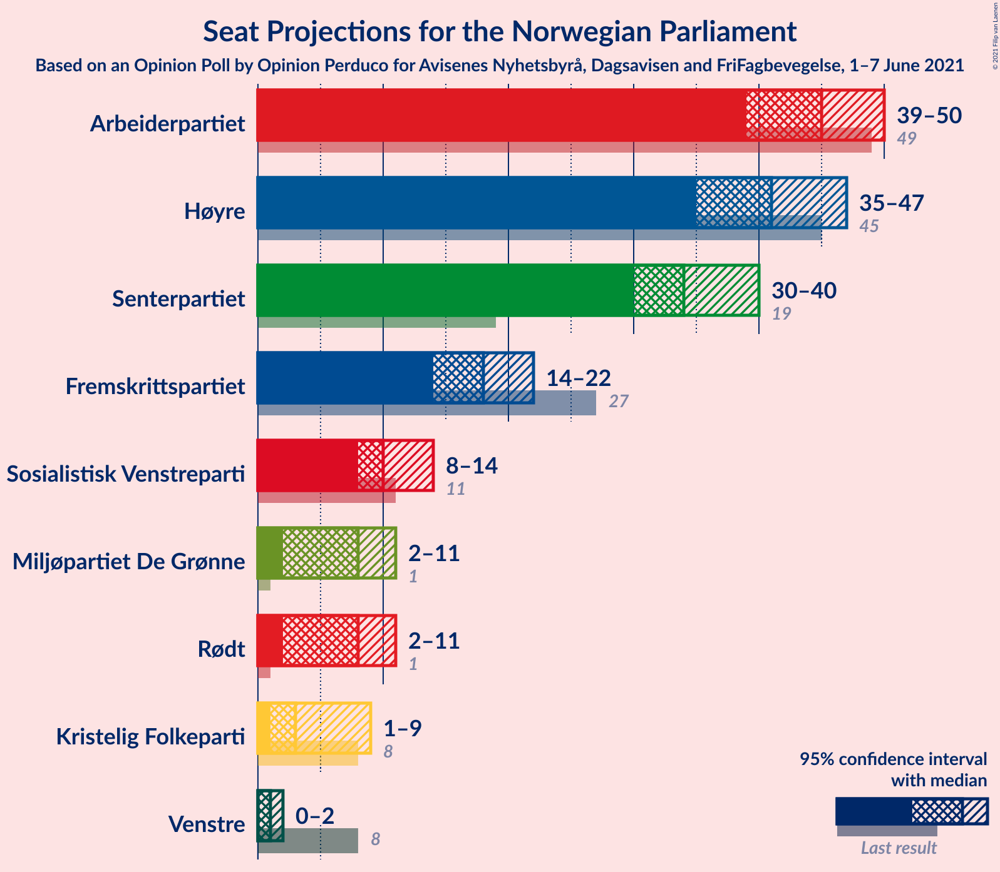
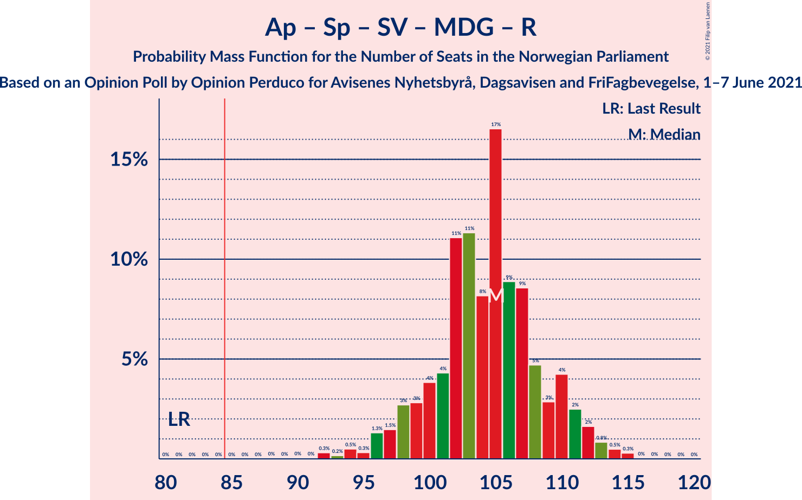
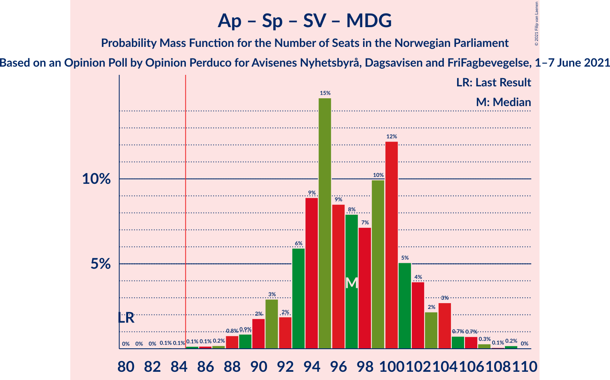
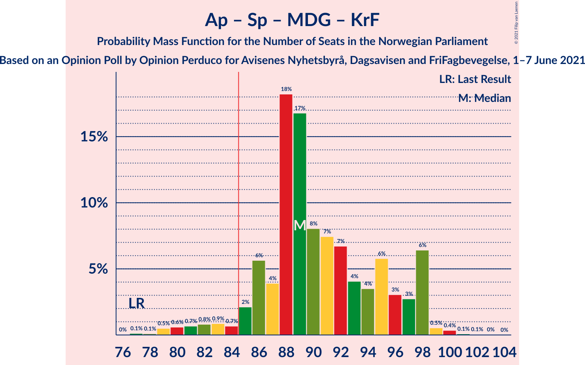
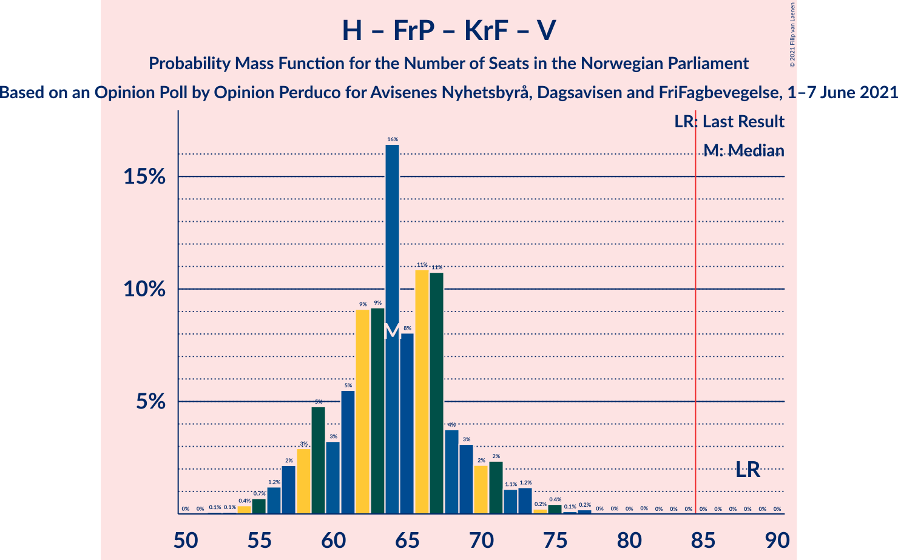
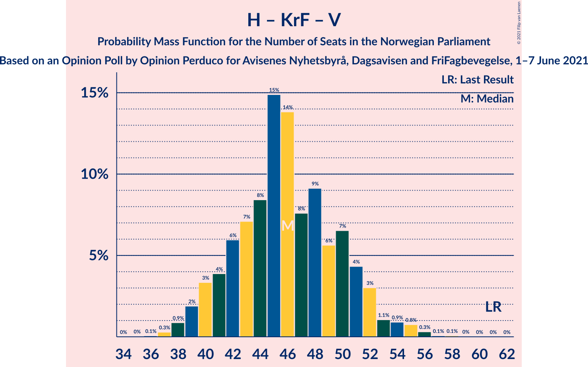

# Opinion Poll by Opinion Perduco for Avisenes Nyhetsbyrå, Dagsavisen and FriFagbevegelse, 1–7 June 2021

<a href="#voting-intentions">Voting Intentions</a> | <a href="#seats">Seats</a> | <a href="#coalitions">Coalitions</a> | <a href="#technical-information">Technical Information</a>

## Voting Intentions

### Confidence Intervals

| Party | Last Result | Poll Result | 80% Confidence Interval | 90% Confidence Interval | 95% Confidence Interval | 99% Confidence Interval |
|:-----:|:-----------:|:-----------:|:-----------------------:|:-----------------------:|:-----------------------:|:-----------------------:|
| Arbeiderpartiet | 27.4% | 24.3% | 22.3–26.4% |21.7–27.0% |21.3–27.6% |20.3–28.6% |
| Høyre | 25.0% | 22.7% | 20.8–24.8% |20.3–25.4% |19.8–25.9% |18.9–27.0% |
| Senterpartiet | 10.3% | 18.7% | 16.9–20.6% |16.4–21.2% |16.0–21.7% |15.2–22.7% |
| Fremskrittspartiet | 15.2% | 10.2% | 8.9–11.8% |8.5–12.3% |8.2–12.7% |7.6–13.5% |
| Sosialistisk Venstreparti | 6.0% | 6.0% | 5.0–7.3% |4.7–7.7% |4.5–8.0% |4.1–8.7% |
| Rødt | 2.4% | 4.6% | 3.8–5.8% |3.5–6.1% |3.3–6.4% |2.9–7.0% |
| Miljøpartiet De Grønne | 3.2% | 4.6% | 3.8–5.8% |3.5–6.1% |3.3–6.4% |2.9–7.0% |
| Kristelig Folkeparti | 4.2% | 3.6% | 2.9–4.7% |2.7–5.0% |2.5–5.3% |2.2–5.9% |
| Venstre | 4.4% | 2.2% | 1.7–3.1% |1.5–3.4% |1.4–3.6% |1.2–4.1% |

*Note:* The poll result column reflects the actual value used in the calculations. Published results may vary slightly, and in addition be rounded to fewer digits.

## Seats

### Confidence Intervals

| Party | Last Result | Median | 80% Confidence Interval | 90% Confidence Interval | 95% Confidence Interval | 99% Confidence Interval |
|:-----:|:-----------:|:------:|:-----------------------:|:-----------------------:|:-----------------------:|:-----------------------:|
| <a href="#arbeiderpartiet">Arbeiderpartiet</a> | 49 | 45 | 41–48 |40–49 |39–50 |37–52 |
| <a href="#høyre">Høyre</a> | 45 | 41 | 37–44 |36–45 |35–47 |33–49 |
| <a href="#senterpartiet">Senterpartiet</a> | 19 | 34 | 32–37 |31–38 |30–40 |27–41 |
| <a href="#fremskrittspartiet">Fremskrittspartiet</a> | 27 | 18 | 15–21 |15–22 |14–22 |13–25 |
| <a href="#sosialistisk-venstreparti">Sosialistisk Venstreparti</a> | 11 | 10 | 9–13 |8–13 |8–14 |7–16 |
| <a href="#rødt">Rødt</a> | 1 | 8 | 2–10 |2–11 |2–11 |2–12 |
| <a href="#miljøpartiet-de-grønne">Miljøpartiet De Grønne</a> | 1 | 8 | 2–10 |2–11 |2–11 |2–12 |
| <a href="#kristelig-folkeparti">Kristelig Folkeparti</a> | 8 | 3 | 1–8 |1–8 |1–9 |1–10 |
| <a href="#venstre">Venstre</a> | 8 | 1 | 0–2 |0–2 |0–2 |0–6 |

### Arbeiderpartiet

*For a full overview of the results for this party, see the [Arbeiderpartiet](party-arbeiderpartiet.html) page.*

| Number of Seats | Probability | Accumulated | Special Marks |
|:---------------:|:-----------:|:-----------:|:-------------:|
| 34 | 0% | 100% |  |
| 35 | 0.1% | 99.9% |  |
| 36 | 0.3% | 99.8% |  |
| 37 | 0.5% | 99.6% |  |
| 38 | 0.8% | 99.1% |  |
| 39 | 2% | 98% |  |
| 40 | 3% | 97% |  |
| 41 | 5% | 94% |  |
| 42 | 7% | 88% |  |
| 43 | 10% | 81% |  |
| 44 | 13% | 71% |  |
| 45 | 25% | 58% | Median |
| 46 | 11% | 33% |  |
| 47 | 8% | 21% |  |
| 48 | 8% | 13% |  |
| 49 | 3% | 6% | Last Result |
| 50 | 2% | 3% |  |
| 51 | 0.8% | 1.4% |  |
| 52 | 0.2% | 0.5% |  |
| 53 | 0.1% | 0.3% |  |
| 54 | 0.1% | 0.2% |  |
| 55 | 0% | 0.1% |  |
| 56 | 0% | 0% |  |

### Høyre

*For a full overview of the results for this party, see the [Høyre](party-høyre.html) page.*

| Number of Seats | Probability | Accumulated | Special Marks |
|:---------------:|:-----------:|:-----------:|:-------------:|
| 32 | 0.1% | 100% |  |
| 33 | 0.4% | 99.8% |  |
| 34 | 1.3% | 99.5% |  |
| 35 | 2% | 98% |  |
| 36 | 4% | 96% |  |
| 37 | 6% | 92% |  |
| 38 | 8% | 86% |  |
| 39 | 9% | 79% |  |
| 40 | 14% | 70% |  |
| 41 | 22% | 56% | Median |
| 42 | 8% | 34% |  |
| 43 | 11% | 26% |  |
| 44 | 7% | 15% |  |
| 45 | 4% | 8% | Last Result |
| 46 | 2% | 4% |  |
| 47 | 1.0% | 3% |  |
| 48 | 1.0% | 2% |  |
| 49 | 0.4% | 0.8% |  |
| 50 | 0.2% | 0.4% |  |
| 51 | 0.1% | 0.2% |  |
| 52 | 0.1% | 0.1% |  |
| 53 | 0% | 0% |  |

### Senterpartiet

*For a full overview of the results for this party, see the [Senterpartiet](party-senterpartiet.html) page.*

| Number of Seats | Probability | Accumulated | Special Marks |
|:---------------:|:-----------:|:-----------:|:-------------:|
| 19 | 0% | 100% | Last Result |
| 20 | 0% | 100% |  |
| 21 | 0% | 100% |  |
| 22 | 0% | 100% |  |
| 23 | 0% | 100% |  |
| 24 | 0% | 100% |  |
| 25 | 0% | 100% |  |
| 26 | 0.2% | 100% |  |
| 27 | 0.4% | 99.7% |  |
| 28 | 0.4% | 99.3% |  |
| 29 | 1.2% | 98.9% |  |
| 30 | 1.1% | 98% |  |
| 31 | 4% | 97% |  |
| 32 | 14% | 92% |  |
| 33 | 9% | 78% |  |
| 34 | 26% | 70% | Median |
| 35 | 17% | 44% |  |
| 36 | 14% | 27% |  |
| 37 | 5% | 13% |  |
| 38 | 3% | 8% |  |
| 39 | 2% | 5% |  |
| 40 | 1.4% | 3% |  |
| 41 | 0.8% | 1.3% |  |
| 42 | 0.2% | 0.5% |  |
| 43 | 0.2% | 0.3% |  |
| 44 | 0% | 0.1% |  |
| 45 | 0% | 0% |  |

### Fremskrittspartiet

*For a full overview of the results for this party, see the [Fremskrittspartiet](party-fremskrittspartiet.html) page.*

| Number of Seats | Probability | Accumulated | Special Marks |
|:---------------:|:-----------:|:-----------:|:-------------:|
| 12 | 0.3% | 100% |  |
| 13 | 1.1% | 99.7% |  |
| 14 | 3% | 98.6% |  |
| 15 | 7% | 96% |  |
| 16 | 10% | 89% |  |
| 17 | 15% | 80% |  |
| 18 | 16% | 65% | Median |
| 19 | 26% | 49% |  |
| 20 | 9% | 23% |  |
| 21 | 7% | 13% |  |
| 22 | 4% | 7% |  |
| 23 | 1.2% | 2% |  |
| 24 | 0.5% | 1.2% |  |
| 25 | 0.5% | 0.7% |  |
| 26 | 0.1% | 0.1% |  |
| 27 | 0% | 0% | Last Result |

### Sosialistisk Venstreparti

*For a full overview of the results for this party, see the [Sosialistisk Venstreparti](party-sosialistiskvenstreparti.html) page.*

| Number of Seats | Probability | Accumulated | Special Marks |
|:---------------:|:-----------:|:-----------:|:-------------:|
| 1 | 0.1% | 100% |  |
| 2 | 0.1% | 99.9% |  |
| 3 | 0.2% | 99.8% |  |
| 4 | 0% | 99.6% |  |
| 5 | 0% | 99.6% |  |
| 6 | 0.1% | 99.6% |  |
| 7 | 2% | 99.6% |  |
| 8 | 5% | 98% |  |
| 9 | 15% | 93% |  |
| 10 | 32% | 78% | Median |
| 11 | 20% | 46% | Last Result |
| 12 | 16% | 27% |  |
| 13 | 6% | 10% |  |
| 14 | 3% | 4% |  |
| 15 | 0.9% | 2% |  |
| 16 | 0.4% | 0.6% |  |
| 17 | 0.2% | 0.2% |  |
| 18 | 0% | 0% |  |

### Rødt

*For a full overview of the results for this party, see the [Rødt](party-rødt.html) page.*

| Number of Seats | Probability | Accumulated | Special Marks |
|:---------------:|:-----------:|:-----------:|:-------------:|
| 1 | 0.3% | 100% | Last Result |
| 2 | 21% | 99.7% |  |
| 3 | 0.3% | 79% |  |
| 4 | 0% | 79% |  |
| 5 | 0% | 79% |  |
| 6 | 0.5% | 79% |  |
| 7 | 17% | 78% |  |
| 8 | 14% | 61% | Median |
| 9 | 23% | 47% |  |
| 10 | 18% | 24% |  |
| 11 | 4% | 5% |  |
| 12 | 1.0% | 1.4% |  |
| 13 | 0.3% | 0.4% |  |
| 14 | 0.1% | 0.1% |  |
| 15 | 0% | 0% |  |

### Miljøpartiet De Grønne

*For a full overview of the results for this party, see the [Miljøpartiet De Grønne](party-miljøpartietdegrønne.html) page.*

| Number of Seats | Probability | Accumulated | Special Marks |
|:---------------:|:-----------:|:-----------:|:-------------:|
| 1 | 0.4% | 100% | Last Result |
| 2 | 12% | 99.6% |  |
| 3 | 3% | 88% |  |
| 4 | 2% | 85% |  |
| 5 | 0% | 83% |  |
| 6 | 0.1% | 83% |  |
| 7 | 15% | 83% |  |
| 8 | 32% | 68% | Median |
| 9 | 20% | 36% |  |
| 10 | 10% | 16% |  |
| 11 | 4% | 6% |  |
| 12 | 2% | 2% |  |
| 13 | 0.3% | 0.4% |  |
| 14 | 0% | 0.1% |  |
| 15 | 0% | 0% |  |

### Kristelig Folkeparti

*For a full overview of the results for this party, see the [Kristelig Folkeparti](party-kristeligfolkeparti.html) page.*

| Number of Seats | Probability | Accumulated | Special Marks |
|:---------------:|:-----------:|:-----------:|:-------------:|
| 0 | 0.3% | 100% |  |
| 1 | 18% | 99.7% |  |
| 2 | 20% | 81% |  |
| 3 | 29% | 61% | Median |
| 4 | 0% | 32% |  |
| 5 | 0% | 32% |  |
| 6 | 0.9% | 32% |  |
| 7 | 13% | 31% |  |
| 8 | 14% | 18% | Last Result |
| 9 | 4% | 4% |  |
| 10 | 0.7% | 0.9% |  |
| 11 | 0.1% | 0.2% |  |
| 12 | 0% | 0% |  |

### Venstre

*For a full overview of the results for this party, see the [Venstre](party-venstre.html) page.*

| Number of Seats | Probability | Accumulated | Special Marks |
|:---------------:|:-----------:|:-----------:|:-------------:|
| 0 | 17% | 100% |  |
| 1 | 36% | 83% | Median |
| 2 | 46% | 47% |  |
| 3 | 0.4% | 1.0% |  |
| 4 | 0% | 0.6% |  |
| 5 | 0% | 0.6% |  |
| 6 | 0.1% | 0.6% |  |
| 7 | 0.3% | 0.5% |  |
| 8 | 0.1% | 0.1% | Last Result |
| 9 | 0% | 0% |  |

## Coalitions

### Confidence Intervals

| Coalition | Last Result | Median | Majority? | 80% Confidence Interval | 90% Confidence Interval | 95% Confidence Interval | 99% Confidence Interval |
|:---------:|:-----------:|:------:|:---------:|:-----------------------:|:-----------------------:|:-----------------------:|:-----------------------:|
| Arbeiderpartiet – Senterpartiet – Sosialistisk Venstreparti – Miljøpartiet De Grønne – Rødt | 81 | 105 | 100% | 100–110 | 98–111 | 96–112 | 93–114 |
| Arbeiderpartiet – Senterpartiet – Sosialistisk Venstreparti – Miljøpartiet De Grønne – Kristelig Folkeparti | 88 | 101 | 100% | 97–107 | 95–108 | 94–109 | 90–110 |
| Høyre – Senterpartiet – Fremskrittspartiet – Kristelig Folkeparti – Venstre | 107 | 98 | 100% | 94–103 | 92–105 | 91–107 | 89–110 |
| Arbeiderpartiet – Senterpartiet – Sosialistisk Venstreparti – Rødt | 80 | 97 | 99.9% | 92–102 | 90–103 | 89–105 | 86–106 |
| Arbeiderpartiet – Senterpartiet – Sosialistisk Venstreparti – Miljøpartiet De Grønne | 80 | 97 | 99.9% | 93–102 | 91–103 | 90–104 | 87–107 |
| Arbeiderpartiet – Senterpartiet – Miljøpartiet De Grønne – Kristelig Folkeparti | 77 | 89 | 96% | 86–97 | 85–98 | 82–98 | 79–100 |
| Arbeiderpartiet – Senterpartiet – Sosialistisk Venstreparti | 79 | 90 | 93% | 85–94 | 84–95 | 83–97 | 81–102 |
| Arbeiderpartiet – Senterpartiet – Kristelig Folkeparti | 76 | 82 | 29% | 78–88 | 77–90 | 76–91 | 73–93 |
| Arbeiderpartiet – Senterpartiet | 68 | 79 | 5% | 75–83 | 74–85 | 73–86 | 70–90 |
| Høyre – Fremskrittspartiet – Miljøpartiet De Grønne – Kristelig Folkeparti – Venstre | 89 | 72 | 0.1% | 66–77 | 65–79 | 64–79 | 61–83 |
| Arbeiderpartiet – Sosialistisk Venstreparti – Miljøpartiet De Grønne – Rødt | 62 | 70 | 0% | 65–74 | 64–76 | 62–77 | 58–79 |
| Høyre – Fremskrittspartiet – Kristelig Folkeparti – Venstre | 88 | 64 | 0% | 59–69 | 58–71 | 57–72 | 54–75 |
| Høyre – Fremskrittspartiet – Venstre | 80 | 61 | 0% | 56–65 | 54–66 | 53–67 | 51–70 |
| Høyre – Fremskrittspartiet | 72 | 59 | 0% | 54–64 | 53–65 | 51–66 | 49–68 |
| Arbeiderpartiet – Sosialistisk Venstreparti | 60 | 55 | 0% | 52–59 | 50–60 | 49–62 | 47–63 |
| Høyre – Kristelig Folkeparti – Venstre | 61 | 46 | 0% | 41–51 | 40–52 | 39–53 | 38–55 |
| Senterpartiet – Kristelig Folkeparti – Venstre | 35 | 39 | 0% | 36–44 | 35–46 | 34–47 | 32–49 |

### Arbeiderpartiet – Senterpartiet – Sosialistisk Venstreparti – Miljøpartiet De Grønne – Rødt

| Number of Seats | Probability | Accumulated | Special Marks |
|:---------------:|:-----------:|:-----------:|:-------------:|
| 81 | 0% | 100% | Last Result |
| 82 | 0% | 100% |  |
| 83 | 0% | 100% |  |
| 84 | 0% | 100% |  |
| 85 | 0% | 100% | Majority |
| 86 | 0% | 100% |  |
| 87 | 0% | 100% |  |
| 88 | 0% | 100% |  |
| 89 | 0% | 100% |  |
| 90 | 0% | 99.9% |  |
| 91 | 0% | 99.9% |  |
| 92 | 0.3% | 99.9% |  |
| 93 | 0.2% | 99.5% |  |
| 94 | 0.5% | 99.4% |  |
| 95 | 0.3% | 98.9% |  |
| 96 | 1.3% | 98.6% |  |
| 97 | 1.5% | 97% |  |
| 98 | 3% | 96% |  |
| 99 | 3% | 93% |  |
| 100 | 4% | 90% |  |
| 101 | 4% | 86% |  |
| 102 | 11% | 82% |  |
| 103 | 11% | 71% |  |
| 104 | 8% | 60% |  |
| 105 | 17% | 52% | Median |
| 106 | 9% | 35% |  |
| 107 | 9% | 26% |  |
| 108 | 5% | 18% |  |
| 109 | 3% | 13% |  |
| 110 | 4% | 10% |  |
| 111 | 2% | 6% |  |
| 112 | 2% | 3% |  |
| 113 | 0.8% | 2% |  |
| 114 | 0.5% | 0.8% |  |
| 115 | 0.3% | 0.3% |  |
| 116 | 0% | 0.1% |  |
| 117 | 0% | 0% |  |

### Arbeiderpartiet – Senterpartiet – Sosialistisk Venstreparti – Miljøpartiet De Grønne – Kristelig Folkeparti

| Number of Seats | Probability | Accumulated | Special Marks |
|:---------------:|:-----------:|:-----------:|:-------------:|
| 87 | 0% | 100% |  |
| 88 | 0.1% | 99.9% | Last Result |
| 89 | 0.1% | 99.9% |  |
| 90 | 0.3% | 99.8% |  |
| 91 | 0.3% | 99.5% |  |
| 92 | 0.7% | 99.2% |  |
| 93 | 0.8% | 98% |  |
| 94 | 2% | 98% |  |
| 95 | 3% | 96% |  |
| 96 | 3% | 93% |  |
| 97 | 4% | 90% |  |
| 98 | 15% | 87% |  |
| 99 | 10% | 71% |  |
| 100 | 11% | 62% | Median |
| 101 | 14% | 51% |  |
| 102 | 5% | 37% |  |
| 103 | 8% | 32% |  |
| 104 | 5% | 24% |  |
| 105 | 4% | 19% |  |
| 106 | 3% | 15% |  |
| 107 | 3% | 12% |  |
| 108 | 5% | 9% |  |
| 109 | 2% | 4% |  |
| 110 | 0.8% | 1.3% |  |
| 111 | 0.3% | 0.5% |  |
| 112 | 0.1% | 0.2% |  |
| 113 | 0% | 0.1% |  |
| 114 | 0% | 0% |  |

### Høyre – Senterpartiet – Fremskrittspartiet – Kristelig Folkeparti – Venstre

| Number of Seats | Probability | Accumulated | Special Marks |
|:---------------:|:-----------:|:-----------:|:-------------:|
| 86 | 0% | 100% |  |
| 87 | 0% | 99.9% |  |
| 88 | 0.1% | 99.9% |  |
| 89 | 0.5% | 99.8% |  |
| 90 | 1.3% | 99.3% |  |
| 91 | 1.3% | 98% |  |
| 92 | 2% | 97% |  |
| 93 | 2% | 95% |  |
| 94 | 4% | 92% |  |
| 95 | 7% | 89% |  |
| 96 | 18% | 82% |  |
| 97 | 6% | 64% | Median |
| 98 | 10% | 58% |  |
| 99 | 9% | 48% |  |
| 100 | 8% | 38% |  |
| 101 | 9% | 30% |  |
| 102 | 3% | 21% |  |
| 103 | 9% | 18% |  |
| 104 | 3% | 8% |  |
| 105 | 2% | 5% |  |
| 106 | 0.8% | 3% |  |
| 107 | 0.9% | 3% | Last Result |
| 108 | 0.3% | 2% |  |
| 109 | 0.5% | 1.4% |  |
| 110 | 0.4% | 0.9% |  |
| 111 | 0.4% | 0.5% |  |
| 112 | 0% | 0.1% |  |
| 113 | 0% | 0.1% |  |
| 114 | 0% | 0% |  |

### Arbeiderpartiet – Senterpartiet – Sosialistisk Venstreparti – Rødt

| Number of Seats | Probability | Accumulated | Special Marks |
|:---------------:|:-----------:|:-----------:|:-------------:|
| 80 | 0% | 100% | Last Result |
| 81 | 0% | 100% |  |
| 82 | 0% | 100% |  |
| 83 | 0% | 100% |  |
| 84 | 0.1% | 99.9% |  |
| 85 | 0.1% | 99.9% | Majority |
| 86 | 0.4% | 99.8% |  |
| 87 | 0.3% | 99.3% |  |
| 88 | 0.8% | 99.0% |  |
| 89 | 0.9% | 98% |  |
| 90 | 4% | 97% |  |
| 91 | 2% | 94% |  |
| 92 | 5% | 92% |  |
| 93 | 4% | 87% |  |
| 94 | 10% | 83% |  |
| 95 | 10% | 73% |  |
| 96 | 6% | 63% |  |
| 97 | 15% | 56% | Median |
| 98 | 7% | 41% |  |
| 99 | 7% | 33% |  |
| 100 | 11% | 26% |  |
| 101 | 4% | 16% |  |
| 102 | 3% | 11% |  |
| 103 | 3% | 8% |  |
| 104 | 2% | 5% |  |
| 105 | 2% | 3% |  |
| 106 | 0.9% | 1.3% |  |
| 107 | 0.2% | 0.4% |  |
| 108 | 0.1% | 0.2% |  |
| 109 | 0.1% | 0.1% |  |
| 110 | 0% | 0% |  |

### Arbeiderpartiet – Senterpartiet – Sosialistisk Venstreparti – Miljøpartiet De Grønne

| Number of Seats | Probability | Accumulated | Special Marks |
|:---------------:|:-----------:|:-----------:|:-------------:|
| 80 | 0% | 100% | Last Result |
| 81 | 0% | 100% |  |
| 82 | 0% | 100% |  |
| 83 | 0.1% | 100% |  |
| 84 | 0.1% | 99.9% |  |
| 85 | 0.1% | 99.9% | Majority |
| 86 | 0.1% | 99.7% |  |
| 87 | 0.2% | 99.6% |  |
| 88 | 0.8% | 99.4% |  |
| 89 | 0.9% | 98.6% |  |
| 90 | 2% | 98% |  |
| 91 | 3% | 96% |  |
| 92 | 2% | 93% |  |
| 93 | 6% | 91% |  |
| 94 | 9% | 85% |  |
| 95 | 15% | 76% |  |
| 96 | 9% | 62% |  |
| 97 | 8% | 53% | Median |
| 98 | 7% | 45% |  |
| 99 | 10% | 38% |  |
| 100 | 12% | 28% |  |
| 101 | 5% | 16% |  |
| 102 | 4% | 11% |  |
| 103 | 2% | 7% |  |
| 104 | 3% | 5% |  |
| 105 | 0.7% | 2% |  |
| 106 | 0.7% | 1.3% |  |
| 107 | 0.3% | 0.6% |  |
| 108 | 0.1% | 0.3% |  |
| 109 | 0.2% | 0.2% |  |
| 110 | 0% | 0% |  |

### Arbeiderpartiet – Senterpartiet – Miljøpartiet De Grønne – Kristelig Folkeparti

| Number of Seats | Probability | Accumulated | Special Marks |
|:---------------:|:-----------:|:-----------:|:-------------:|
| 77 | 0.1% | 100% | Last Result |
| 78 | 0.1% | 99.8% |  |
| 79 | 0.5% | 99.7% |  |
| 80 | 0.6% | 99.2% |  |
| 81 | 0.7% | 98.6% |  |
| 82 | 0.8% | 98% |  |
| 83 | 0.9% | 97% |  |
| 84 | 0.7% | 96% |  |
| 85 | 2% | 96% | Majority |
| 86 | 6% | 93% |  |
| 87 | 4% | 88% |  |
| 88 | 18% | 84% |  |
| 89 | 17% | 66% |  |
| 90 | 8% | 49% | Median |
| 91 | 7% | 41% |  |
| 92 | 7% | 33% |  |
| 93 | 4% | 27% |  |
| 94 | 4% | 23% |  |
| 95 | 6% | 19% |  |
| 96 | 3% | 13% |  |
| 97 | 3% | 10% |  |
| 98 | 6% | 8% |  |
| 99 | 0.5% | 1.1% |  |
| 100 | 0.4% | 0.6% |  |
| 101 | 0.1% | 0.2% |  |
| 102 | 0.1% | 0.1% |  |
| 103 | 0% | 0.1% |  |
| 104 | 0% | 0% |  |

### Arbeiderpartiet – Senterpartiet – Sosialistisk Venstreparti

| Number of Seats | Probability | Accumulated | Special Marks |
|:---------------:|:-----------:|:-----------:|:-------------:|
| 77 | 0% | 100% |  |
| 78 | 0% | 99.9% |  |
| 79 | 0.1% | 99.9% | Last Result |
| 80 | 0.2% | 99.8% |  |
| 81 | 0.7% | 99.6% |  |
| 82 | 0.7% | 98.9% |  |
| 83 | 3% | 98% |  |
| 84 | 2% | 96% |  |
| 85 | 4% | 93% | Majority |
| 86 | 8% | 89% |  |
| 87 | 15% | 81% |  |
| 88 | 9% | 66% |  |
| 89 | 8% | 58% | Median |
| 90 | 11% | 50% |  |
| 91 | 8% | 39% |  |
| 92 | 12% | 32% |  |
| 93 | 8% | 20% |  |
| 94 | 3% | 12% |  |
| 95 | 4% | 9% |  |
| 96 | 2% | 5% |  |
| 97 | 1.1% | 3% |  |
| 98 | 0.5% | 2% |  |
| 99 | 0.7% | 2% |  |
| 100 | 0.2% | 1.0% |  |
| 101 | 0.1% | 0.8% |  |
| 102 | 0.7% | 0.7% |  |
| 103 | 0% | 0% |  |

### Arbeiderpartiet – Senterpartiet – Kristelig Folkeparti

| Number of Seats | Probability | Accumulated | Special Marks |
|:---------------:|:-----------:|:-----------:|:-------------:|
| 71 | 0.1% | 100% |  |
| 72 | 0.2% | 99.9% |  |
| 73 | 0.3% | 99.7% |  |
| 74 | 0.5% | 99.4% |  |
| 75 | 1.2% | 98.9% |  |
| 76 | 1.2% | 98% | Last Result |
| 77 | 2% | 97% |  |
| 78 | 5% | 95% |  |
| 79 | 6% | 90% |  |
| 80 | 15% | 84% |  |
| 81 | 6% | 69% |  |
| 82 | 15% | 64% | Median |
| 83 | 10% | 49% |  |
| 84 | 10% | 39% |  |
| 85 | 4% | 29% | Majority |
| 86 | 7% | 24% |  |
| 87 | 3% | 17% |  |
| 88 | 5% | 14% |  |
| 89 | 3% | 10% |  |
| 90 | 5% | 7% |  |
| 91 | 0.9% | 3% |  |
| 92 | 0.4% | 2% |  |
| 93 | 0.9% | 1.2% |  |
| 94 | 0.2% | 0.3% |  |
| 95 | 0.1% | 0.2% |  |
| 96 | 0.1% | 0.1% |  |
| 97 | 0% | 0% |  |

### Arbeiderpartiet – Senterpartiet

| Number of Seats | Probability | Accumulated | Special Marks |
|:---------------:|:-----------:|:-----------:|:-------------:|
| 68 | 0.1% | 100% | Last Result |
| 69 | 0.1% | 99.9% |  |
| 70 | 0.4% | 99.8% |  |
| 71 | 0.3% | 99.3% |  |
| 72 | 1.5% | 99.0% |  |
| 73 | 2% | 98% |  |
| 74 | 3% | 96% |  |
| 75 | 4% | 93% |  |
| 76 | 9% | 89% |  |
| 77 | 18% | 80% |  |
| 78 | 8% | 62% |  |
| 79 | 11% | 55% | Median |
| 80 | 12% | 43% |  |
| 81 | 11% | 31% |  |
| 82 | 8% | 20% |  |
| 83 | 4% | 12% |  |
| 84 | 3% | 8% |  |
| 85 | 2% | 5% | Majority |
| 86 | 0.6% | 3% |  |
| 87 | 1.0% | 2% |  |
| 88 | 0.2% | 1.1% |  |
| 89 | 0.1% | 0.9% |  |
| 90 | 0.7% | 0.8% |  |
| 91 | 0% | 0.1% |  |
| 92 | 0% | 0.1% |  |
| 93 | 0% | 0% |  |

### Høyre – Fremskrittspartiet – Miljøpartiet De Grønne – Kristelig Folkeparti – Venstre

| Number of Seats | Probability | Accumulated | Special Marks |
|:---------------:|:-----------:|:-----------:|:-------------:|
| 58 | 0% | 100% |  |
| 59 | 0% | 99.9% |  |
| 60 | 0.1% | 99.9% |  |
| 61 | 0.3% | 99.8% |  |
| 62 | 0.2% | 99.4% |  |
| 63 | 1.2% | 99.2% |  |
| 64 | 2% | 98% |  |
| 65 | 2% | 96% |  |
| 66 | 4% | 93% |  |
| 67 | 4% | 90% |  |
| 68 | 5% | 86% |  |
| 69 | 11% | 81% |  |
| 70 | 7% | 70% |  |
| 71 | 7% | 62% | Median |
| 72 | 15% | 55% |  |
| 73 | 6% | 40% |  |
| 74 | 10% | 34% |  |
| 75 | 9% | 24% |  |
| 76 | 4% | 15% |  |
| 77 | 4% | 11% |  |
| 78 | 2% | 7% |  |
| 79 | 3% | 5% |  |
| 80 | 0.6% | 2% |  |
| 81 | 0.6% | 1.4% |  |
| 82 | 0.2% | 0.8% |  |
| 83 | 0.4% | 0.6% |  |
| 84 | 0.1% | 0.1% |  |
| 85 | 0% | 0.1% | Majority |
| 86 | 0% | 0% |  |
| 87 | 0% | 0% |  |
| 88 | 0% | 0% |  |
| 89 | 0% | 0% | Last Result |

### Arbeiderpartiet – Sosialistisk Venstreparti – Miljøpartiet De Grønne – Rødt

| Number of Seats | Probability | Accumulated | Special Marks |
|:---------------:|:-----------:|:-----------:|:-------------:|
| 55 | 0% | 100% |  |
| 56 | 0.1% | 99.9% |  |
| 57 | 0.1% | 99.9% |  |
| 58 | 0.4% | 99.8% |  |
| 59 | 0.6% | 99.4% |  |
| 60 | 0.6% | 98.9% |  |
| 61 | 0.6% | 98% |  |
| 62 | 1.1% | 98% | Last Result |
| 63 | 1.3% | 97% |  |
| 64 | 2% | 95% |  |
| 65 | 3% | 93% |  |
| 66 | 10% | 90% |  |
| 67 | 4% | 79% |  |
| 68 | 9% | 76% |  |
| 69 | 9% | 67% |  |
| 70 | 9% | 58% |  |
| 71 | 10% | 48% | Median |
| 72 | 6% | 38% |  |
| 73 | 18% | 33% |  |
| 74 | 6% | 15% |  |
| 75 | 3% | 9% |  |
| 76 | 2% | 6% |  |
| 77 | 2% | 4% |  |
| 78 | 1.1% | 2% |  |
| 79 | 0.8% | 1.0% |  |
| 80 | 0.1% | 0.2% |  |
| 81 | 0% | 0.1% |  |
| 82 | 0% | 0.1% |  |
| 83 | 0% | 0% |  |

### Høyre – Fremskrittspartiet – Kristelig Folkeparti – Venstre

| Number of Seats | Probability | Accumulated | Special Marks |
|:---------------:|:-----------:|:-----------:|:-------------:|
| 52 | 0.1% | 100% |  |
| 53 | 0.1% | 99.9% |  |
| 54 | 0.4% | 99.8% |  |
| 55 | 0.7% | 99.4% |  |
| 56 | 1.2% | 98.8% |  |
| 57 | 2% | 98% |  |
| 58 | 3% | 95% |  |
| 59 | 5% | 92% |  |
| 60 | 3% | 88% |  |
| 61 | 5% | 85% |  |
| 62 | 9% | 79% |  |
| 63 | 9% | 70% | Median |
| 64 | 16% | 61% |  |
| 65 | 8% | 44% |  |
| 66 | 11% | 36% |  |
| 67 | 11% | 25% |  |
| 68 | 4% | 15% |  |
| 69 | 3% | 11% |  |
| 70 | 2% | 8% |  |
| 71 | 2% | 6% |  |
| 72 | 1.1% | 3% |  |
| 73 | 1.2% | 2% |  |
| 74 | 0.2% | 1.0% |  |
| 75 | 0.4% | 0.8% |  |
| 76 | 0.1% | 0.4% |  |
| 77 | 0.2% | 0.3% |  |
| 78 | 0% | 0.1% |  |
| 79 | 0% | 0.1% |  |
| 80 | 0% | 0% |  |
| 81 | 0% | 0% |  |
| 82 | 0% | 0% |  |
| 83 | 0% | 0% |  |
| 84 | 0% | 0% |  |
| 85 | 0% | 0% | Majority |
| 86 | 0% | 0% |  |
| 87 | 0% | 0% |  |
| 88 | 0% | 0% | Last Result |

### Høyre – Fremskrittspartiet – Venstre

| Number of Seats | Probability | Accumulated | Special Marks |
|:---------------:|:-----------:|:-----------:|:-------------:|
| 49 | 0.1% | 100% |  |
| 50 | 0.2% | 99.9% |  |
| 51 | 0.7% | 99.7% |  |
| 52 | 1.0% | 99.0% |  |
| 53 | 2% | 98% |  |
| 54 | 3% | 96% |  |
| 55 | 3% | 94% |  |
| 56 | 5% | 91% |  |
| 57 | 7% | 86% |  |
| 58 | 5% | 79% |  |
| 59 | 14% | 73% |  |
| 60 | 6% | 59% | Median |
| 61 | 22% | 53% |  |
| 62 | 6% | 31% |  |
| 63 | 6% | 24% |  |
| 64 | 8% | 18% |  |
| 65 | 5% | 10% |  |
| 66 | 1.4% | 6% |  |
| 67 | 2% | 5% |  |
| 68 | 0.6% | 2% |  |
| 69 | 1.0% | 2% |  |
| 70 | 0.4% | 0.8% |  |
| 71 | 0.2% | 0.3% |  |
| 72 | 0.1% | 0.1% |  |
| 73 | 0% | 0.1% |  |
| 74 | 0% | 0% |  |
| 75 | 0% | 0% |  |
| 76 | 0% | 0% |  |
| 77 | 0% | 0% |  |
| 78 | 0% | 0% |  |
| 79 | 0% | 0% |  |
| 80 | 0% | 0% | Last Result |

### Høyre – Fremskrittspartiet

| Number of Seats | Probability | Accumulated | Special Marks |
|:---------------:|:-----------:|:-----------:|:-------------:|
| 48 | 0.1% | 100% |  |
| 49 | 0.4% | 99.9% |  |
| 50 | 1.1% | 99.5% |  |
| 51 | 1.0% | 98% |  |
| 52 | 1.5% | 97% |  |
| 53 | 3% | 96% |  |
| 54 | 4% | 93% |  |
| 55 | 5% | 89% |  |
| 56 | 8% | 84% |  |
| 57 | 8% | 76% |  |
| 58 | 7% | 68% |  |
| 59 | 15% | 61% | Median |
| 60 | 19% | 46% |  |
| 61 | 4% | 26% |  |
| 62 | 8% | 22% |  |
| 63 | 4% | 14% |  |
| 64 | 5% | 10% |  |
| 65 | 2% | 5% |  |
| 66 | 1.1% | 3% |  |
| 67 | 0.5% | 2% |  |
| 68 | 1.1% | 2% |  |
| 69 | 0.2% | 0.4% |  |
| 70 | 0.1% | 0.3% |  |
| 71 | 0.1% | 0.2% |  |
| 72 | 0% | 0% | Last Result |

### Arbeiderpartiet – Sosialistisk Venstreparti

| Number of Seats | Probability | Accumulated | Special Marks |
|:---------------:|:-----------:|:-----------:|:-------------:|
| 44 | 0.1% | 100% |  |
| 45 | 0.1% | 99.9% |  |
| 46 | 0.2% | 99.8% |  |
| 47 | 0.4% | 99.6% |  |
| 48 | 0.8% | 99.2% |  |
| 49 | 2% | 98% |  |
| 50 | 2% | 97% |  |
| 51 | 4% | 94% |  |
| 52 | 8% | 90% |  |
| 53 | 9% | 82% |  |
| 54 | 12% | 73% |  |
| 55 | 20% | 61% | Median |
| 56 | 10% | 41% |  |
| 57 | 9% | 31% |  |
| 58 | 7% | 22% |  |
| 59 | 8% | 15% |  |
| 60 | 2% | 7% | Last Result |
| 61 | 1.4% | 4% |  |
| 62 | 2% | 3% |  |
| 63 | 0.8% | 1.2% |  |
| 64 | 0.2% | 0.4% |  |
| 65 | 0.2% | 0.3% |  |
| 66 | 0% | 0.1% |  |
| 67 | 0% | 0% |  |

### Høyre – Kristelig Folkeparti – Venstre

| Number of Seats | Probability | Accumulated | Special Marks |
|:---------------:|:-----------:|:-----------:|:-------------:|
| 36 | 0.1% | 100% |  |
| 37 | 0.3% | 99.9% |  |
| 38 | 0.9% | 99.6% |  |
| 39 | 2% | 98.7% |  |
| 40 | 3% | 97% |  |
| 41 | 4% | 94% |  |
| 42 | 6% | 90% |  |
| 43 | 7% | 84% |  |
| 44 | 8% | 77% |  |
| 45 | 15% | 68% | Median |
| 46 | 14% | 53% |  |
| 47 | 8% | 39% |  |
| 48 | 9% | 32% |  |
| 49 | 6% | 23% |  |
| 50 | 7% | 17% |  |
| 51 | 4% | 11% |  |
| 52 | 3% | 6% |  |
| 53 | 1.1% | 3% |  |
| 54 | 0.9% | 2% |  |
| 55 | 0.8% | 1.2% |  |
| 56 | 0.3% | 0.5% |  |
| 57 | 0.1% | 0.2% |  |
| 58 | 0.1% | 0.1% |  |
| 59 | 0% | 0% |  |
| 60 | 0% | 0% |  |
| 61 | 0% | 0% | Last Result |

### Senterpartiet – Kristelig Folkeparti – Venstre

| Number of Seats | Probability | Accumulated | Special Marks |
|:---------------:|:-----------:|:-----------:|:-------------:|
| 29 | 0.1% | 100% |  |
| 30 | 0.1% | 99.9% |  |
| 31 | 0.2% | 99.8% |  |
| 32 | 0.5% | 99.5% |  |
| 33 | 1.2% | 99.0% |  |
| 34 | 1.2% | 98% |  |
| 35 | 2% | 97% | Last Result |
| 36 | 14% | 94% |  |
| 37 | 12% | 80% |  |
| 38 | 12% | 69% | Median |
| 39 | 13% | 56% |  |
| 40 | 8% | 43% |  |
| 41 | 7% | 36% |  |
| 42 | 7% | 28% |  |
| 43 | 5% | 21% |  |
| 44 | 7% | 17% |  |
| 45 | 4% | 9% |  |
| 46 | 3% | 6% |  |
| 47 | 0.9% | 3% |  |
| 48 | 1.1% | 2% |  |
| 49 | 0.3% | 0.8% |  |
| 50 | 0.2% | 0.4% |  |
| 51 | 0.1% | 0.2% |  |
| 52 | 0.1% | 0.2% |  |
| 53 | 0% | 0% |  |

## Technical Information

### Opinion Poll

+ **Polling firm:** Opinion Perduco
+ **Commissioner(s):** Avisenes Nyhetsbyrå, Dagsavisen and FriFagbevegelse
+ **Fieldwork period:** 1–7 June 2021

### Calculations

+ **Sample size:** 713
+ **Simulations done:** 1,048,576
+ **Error estimate:** 1.37%

