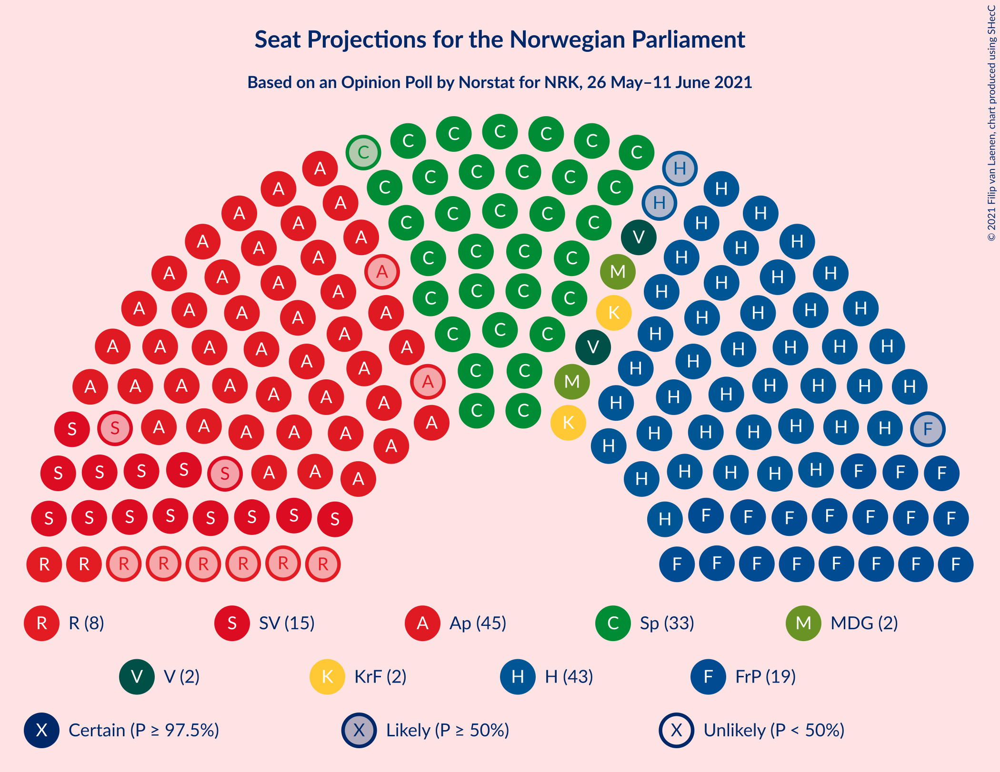
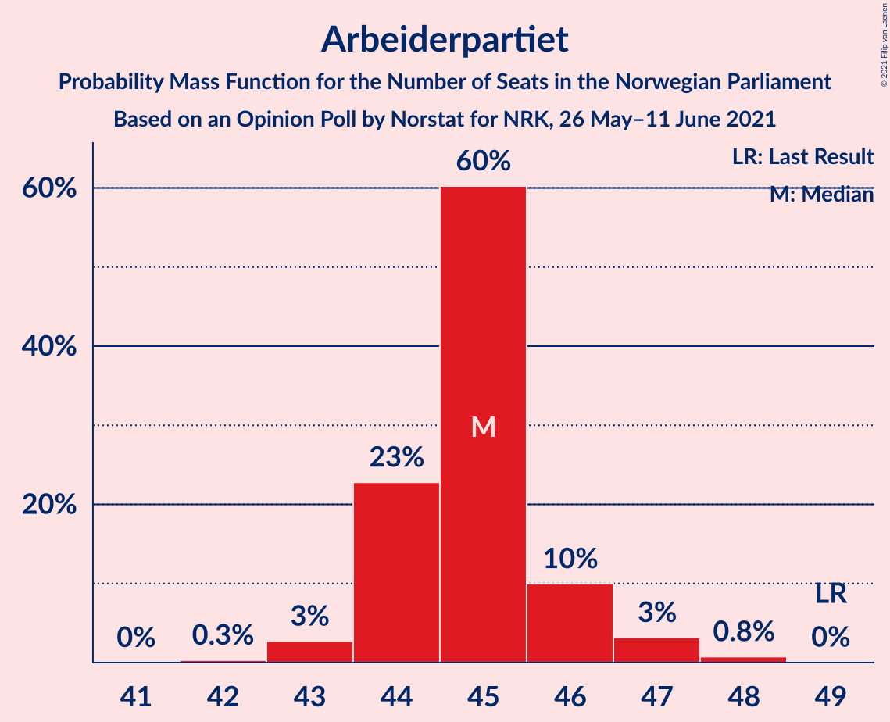
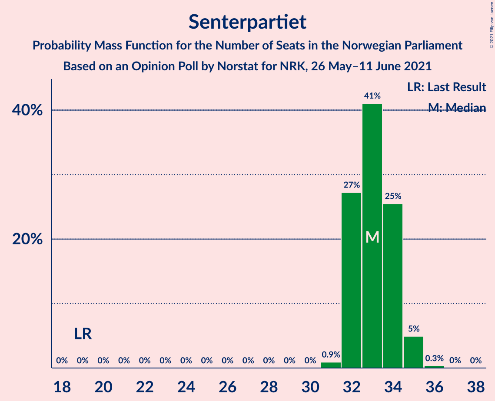
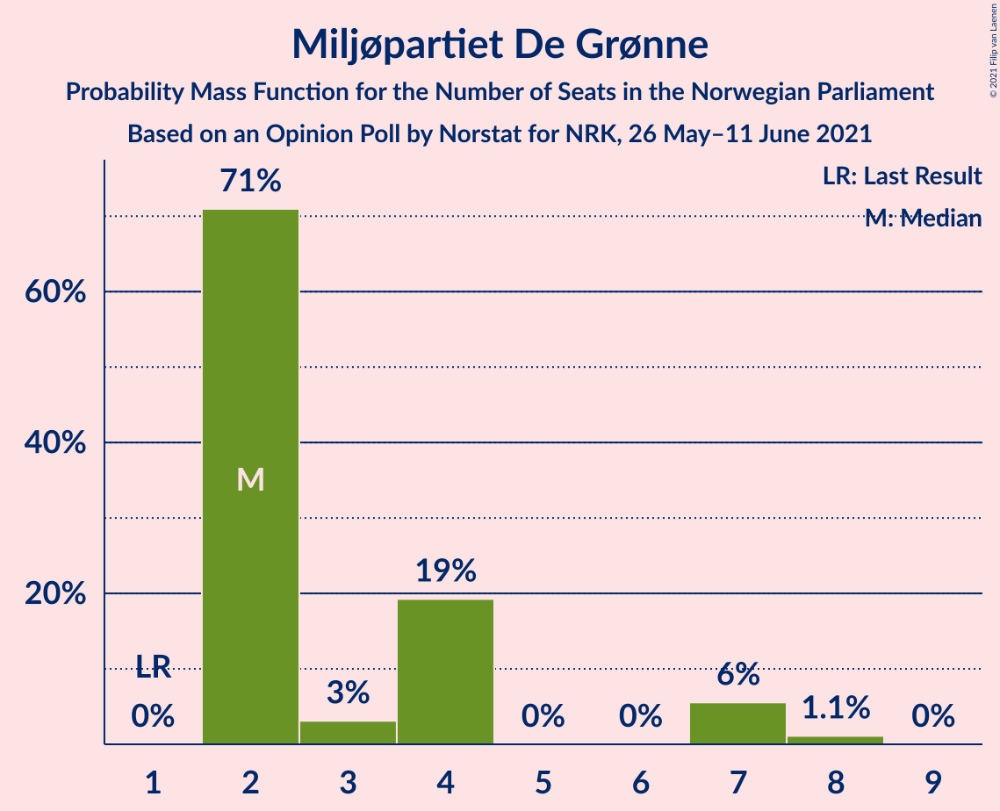
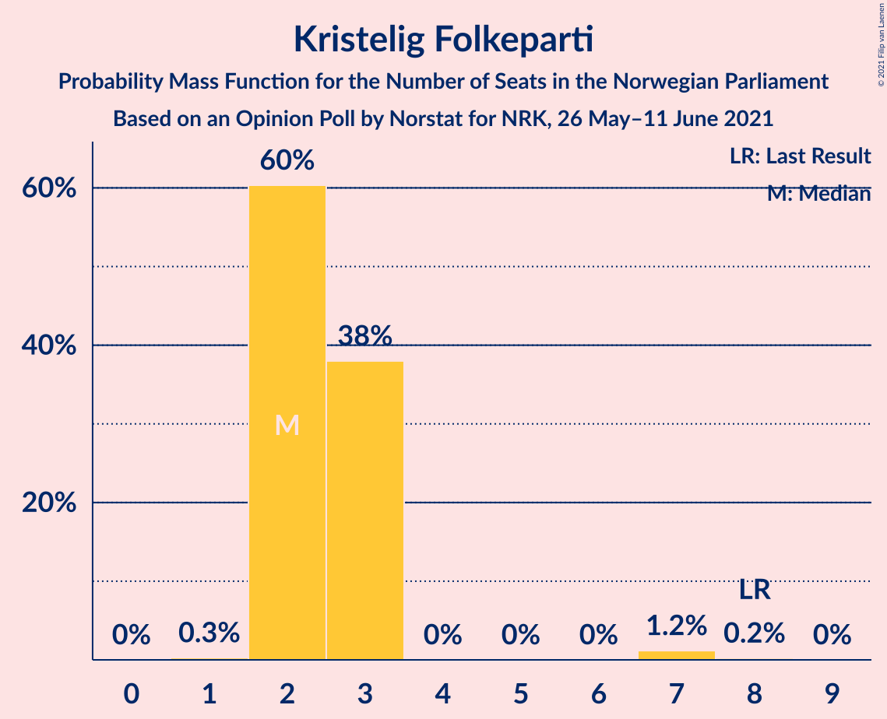
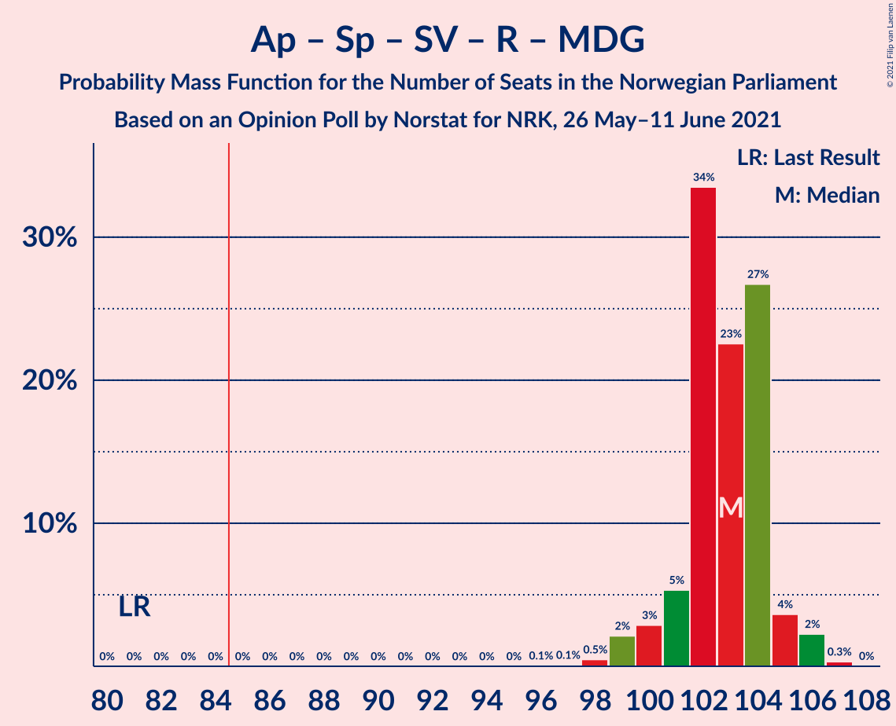
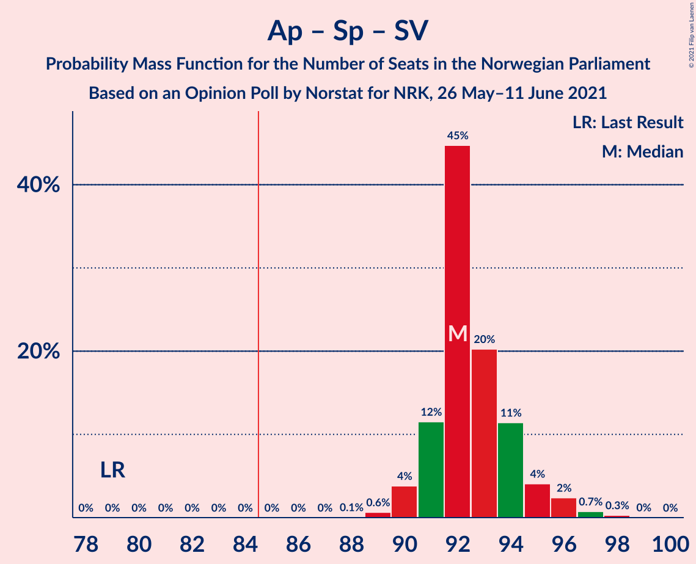
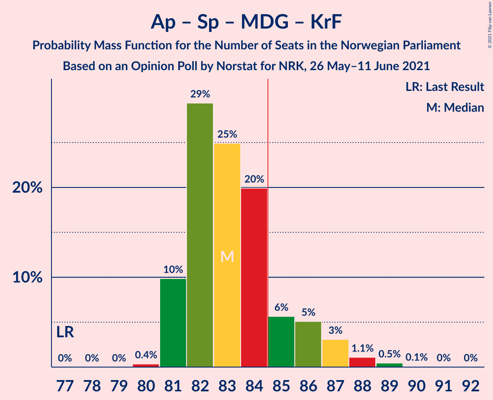
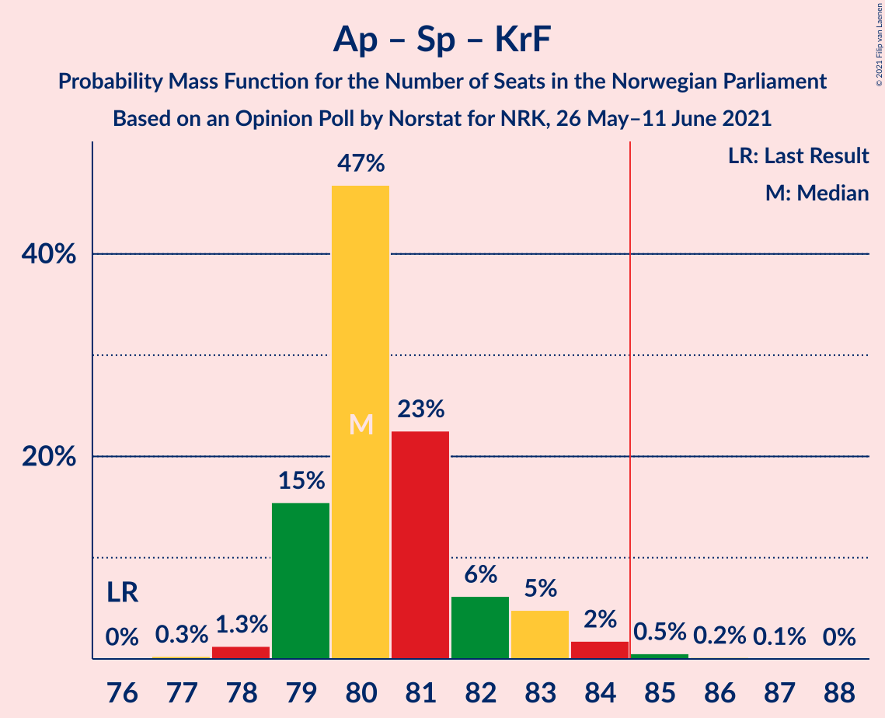
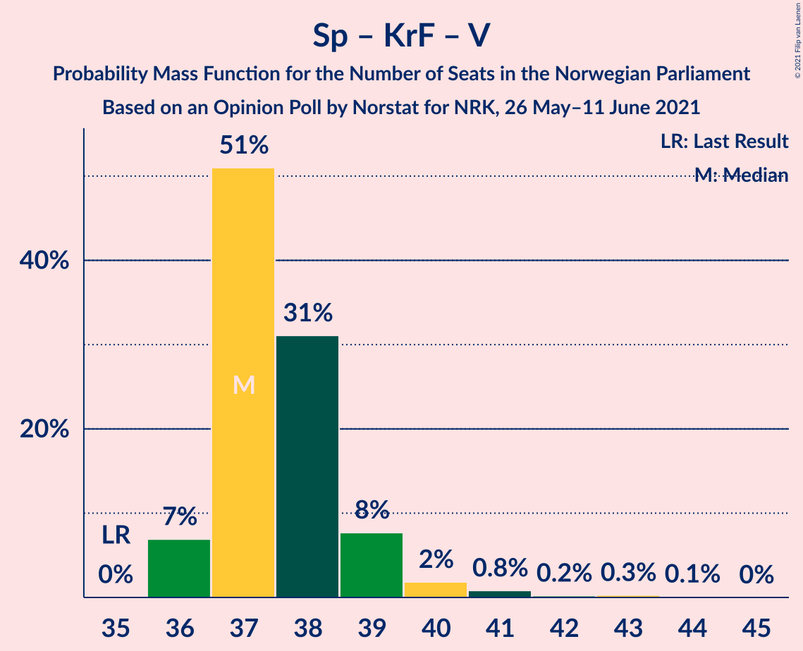

# Opinion Poll by Norstat for NRK, 26 May–11 June 2021

<a href="#voting-intentions">Voting Intentions</a> | <a href="#seats">Seats</a> | <a href="#coalitions">Coalitions</a> | <a href="#technical-information">Technical Information</a>

## Voting Intentions

### Confidence Intervals

| Party | Last Result | Poll Result | 80% Confidence Interval | 90% Confidence Interval | 95% Confidence Interval | 99% Confidence Interval |
|:-----:|:-----------:|:-----------:|:-----------------------:|:-----------------------:|:-----------------------:|:-----------------------:|
| Arbeiderpartiet | 27.4% | 24.1% | 23.5–24.6% |23.4–24.7% |23.3–24.9% |23.0–25.1% |
| Høyre | 25.0% | 23.0% | 22.5–23.5% |22.3–23.6% |22.2–23.7% |21.9–24.0% |
| Senterpartiet | 10.3% | 17.7% | 17.2–18.1% |17.1–18.3% |17.0–18.4% |16.8–18.6% |
| Fremskrittspartiet | 15.2% | 10.2% | 9.8–10.5% |9.7–10.7% |9.6–10.7% |9.5–10.9% |
| Sosialistisk Venstreparti | 6.0% | 7.8% | 7.5–8.1% |7.4–8.2% |7.3–8.3% |7.1–8.5% |
| Rødt | 2.4% | 4.2% | 3.9–4.5% |3.9–4.5% |3.8–4.6% |3.7–4.7% |
| Miljøpartiet De Grønne | 3.2% | 3.7% | 3.5–3.9% |3.4–4.0% |3.4–4.1% |3.3–4.2% |
| Kristelig Folkeparti | 4.2% | 3.6% | 3.4–3.8% |3.3–3.9% |3.3–4.0% |3.2–4.1% |
| Venstre | 4.4% | 2.7% | 2.5–2.9% |2.5–3.0% |2.4–3.0% |2.3–3.1% |

*Note:* The poll result column reflects the actual value used in the calculations. Published results may vary slightly, and in addition be rounded to fewer digits.

## Seats

### Confidence Intervals

| Party | Last Result | Median | 80% Confidence Interval | 90% Confidence Interval | 95% Confidence Interval | 99% Confidence Interval |
|:-----:|:-----------:|:------:|:-----------------------:|:-----------------------:|:-----------------------:|:-----------------------:|
| <a href="#arbeiderpartiet">Arbeiderpartiet</a> | 49 | 45 | 44–46 |44–46 |43–47 |43–48 |
| <a href="#høyre">Høyre</a> | 45 | 43 | 42–44 |41–45 |41–45 |40–46 |
| <a href="#senterpartiet">Senterpartiet</a> | 19 | 33 | 32–34 |32–35 |32–35 |31–35 |
| <a href="#fremskrittspartiet">Fremskrittspartiet</a> | 27 | 19 | 18–20 |18–20 |18–20 |17–21 |
| <a href="#sosialistisk-venstreparti">Sosialistisk Venstreparti</a> | 11 | 15 | 14–15 |14–15 |13–15 |13–16 |
| <a href="#rødt">Rødt</a> | 1 | 8 | 7–8 |2–8 |2–9 |2–9 |
| <a href="#miljøpartiet-de-grønne">Miljøpartiet De Grønne</a> | 1 | 2 | 2–4 |2–7 |2–7 |2–8 |
| <a href="#kristelig-folkeparti">Kristelig Folkeparti</a> | 8 | 2 | 2–3 |2–3 |2–3 |2–7 |
| <a href="#venstre">Venstre</a> | 8 | 2 | 2 |2 |2 |1–2 |

### Arbeiderpartiet

*For a full overview of the results for this party, see the [Arbeiderpartiet](party-arbeiderpartiet.html) page.*

| Number of Seats | Probability | Accumulated | Special Marks |
|:---------------:|:-----------:|:-----------:|:-------------:|
| 42 | 0.3% | 100% |  |
| 43 | 3% | 99.7% |  |
| 44 | 23% | 97% |  |
| 45 | 60% | 74% | Median |
| 46 | 10% | 14% |  |
| 47 | 3% | 4% |  |
| 48 | 0.8% | 0.8% |  |
| 49 | 0% | 0% | Last Result |

### Høyre

*For a full overview of the results for this party, see the [Høyre](party-høyre.html) page.*

| Number of Seats | Probability | Accumulated | Special Marks |
|:---------------:|:-----------:|:-----------:|:-------------:|
| 39 | 0.1% | 100% |  |
| 40 | 2% | 99.9% |  |
| 41 | 6% | 98% |  |
| 42 | 20% | 92% |  |
| 43 | 45% | 72% | Median |
| 44 | 22% | 27% |  |
| 45 | 4% | 5% | Last Result |
| 46 | 0.8% | 0.8% |  |
| 47 | 0% | 0% |  |

### Senterpartiet

*For a full overview of the results for this party, see the [Senterpartiet](party-senterpartiet.html) page.*

| Number of Seats | Probability | Accumulated | Special Marks |
|:---------------:|:-----------:|:-----------:|:-------------:|
| 19 | 0% | 100% | Last Result |
| 20 | 0% | 100% |  |
| 21 | 0% | 100% |  |
| 22 | 0% | 100% |  |
| 23 | 0% | 100% |  |
| 24 | 0% | 100% |  |
| 25 | 0% | 100% |  |
| 26 | 0% | 100% |  |
| 27 | 0% | 100% |  |
| 28 | 0% | 100% |  |
| 29 | 0% | 100% |  |
| 30 | 0% | 100% |  |
| 31 | 0.9% | 100% |  |
| 32 | 27% | 99.1% |  |
| 33 | 41% | 72% | Median |
| 34 | 25% | 31% |  |
| 35 | 5% | 5% |  |
| 36 | 0.3% | 0.4% |  |
| 37 | 0% | 0% |  |

### Fremskrittspartiet

*For a full overview of the results for this party, see the [Fremskrittspartiet](party-fremskrittspartiet.html) page.*

| Number of Seats | Probability | Accumulated | Special Marks |
|:---------------:|:-----------:|:-----------:|:-------------:|
| 17 | 0.9% | 100% |  |
| 18 | 30% | 99.1% |  |
| 19 | 55% | 69% | Median |
| 20 | 12% | 14% |  |
| 21 | 2% | 2% |  |
| 22 | 0% | 0% |  |
| 23 | 0% | 0% |  |
| 24 | 0% | 0% |  |
| 25 | 0% | 0% |  |
| 26 | 0% | 0% |  |
| 27 | 0% | 0% | Last Result |

### Sosialistisk Venstreparti

*For a full overview of the results for this party, see the [Sosialistisk Venstreparti](party-sosialistiskvenstreparti.html) page.*

| Number of Seats | Probability | Accumulated | Special Marks |
|:---------------:|:-----------:|:-----------:|:-------------:|
| 11 | 0% | 100% | Last Result |
| 12 | 0% | 100% |  |
| 13 | 3% | 100% |  |
| 14 | 44% | 97% |  |
| 15 | 51% | 53% | Median |
| 16 | 2% | 2% |  |
| 17 | 0% | 0% |  |

### Rødt

*For a full overview of the results for this party, see the [Rødt](party-rødt.html) page.*

| Number of Seats | Probability | Accumulated | Special Marks |
|:---------------:|:-----------:|:-----------:|:-------------:|
| 1 | 0% | 100% | Last Result |
| 2 | 8% | 100% |  |
| 3 | 0% | 92% |  |
| 4 | 0% | 92% |  |
| 5 | 0% | 92% |  |
| 6 | 0% | 92% |  |
| 7 | 5% | 92% |  |
| 8 | 84% | 87% | Median |
| 9 | 3% | 3% |  |
| 10 | 0% | 0% |  |

### Miljøpartiet De Grønne

*For a full overview of the results for this party, see the [Miljøpartiet De Grønne](party-miljøpartietdegrønne.html) page.*

| Number of Seats | Probability | Accumulated | Special Marks |
|:---------------:|:-----------:|:-----------:|:-------------:|
| 1 | 0% | 100% | Last Result |
| 2 | 71% | 100% | Median |
| 3 | 3% | 29% |  |
| 4 | 19% | 26% |  |
| 5 | 0% | 7% |  |
| 6 | 0% | 7% |  |
| 7 | 6% | 7% |  |
| 8 | 1.1% | 1.1% |  |
| 9 | 0% | 0% |  |

### Kristelig Folkeparti

*For a full overview of the results for this party, see the [Kristelig Folkeparti](party-kristeligfolkeparti.html) page.*

| Number of Seats | Probability | Accumulated | Special Marks |
|:---------------:|:-----------:|:-----------:|:-------------:|
| 1 | 0.3% | 100% |  |
| 2 | 60% | 99.7% | Median |
| 3 | 38% | 39% |  |
| 4 | 0% | 1.4% |  |
| 5 | 0% | 1.4% |  |
| 6 | 0% | 1.4% |  |
| 7 | 1.2% | 1.4% |  |
| 8 | 0.2% | 0.2% | Last Result |
| 9 | 0% | 0% |  |

### Venstre

*For a full overview of the results for this party, see the [Venstre](party-venstre.html) page.*

| Number of Seats | Probability | Accumulated | Special Marks |
|:---------------:|:-----------:|:-----------:|:-------------:|
| 1 | 0.5% | 100% |  |
| 2 | 99.5% | 99.5% | Median |
| 3 | 0% | 0% |  |
| 4 | 0% | 0% |  |
| 5 | 0% | 0% |  |
| 6 | 0% | 0% |  |
| 7 | 0% | 0% |  |
| 8 | 0% | 0% | Last Result |

## Coalitions

### Confidence Intervals

| Coalition | Last Result | Median | Majority? | 80% Confidence Interval | 90% Confidence Interval | 95% Confidence Interval | 99% Confidence Interval |
|:---------:|:-----------:|:------:|:---------:|:-----------------------:|:-----------------------:|:-----------------------:|:-----------------------:|
| Arbeiderpartiet – Senterpartiet – Sosialistisk Venstreparti – Rødt – Miljøpartiet De Grønne | 81 | 103 | 100% | 101–104 | 100–105 | 99–106 | 98–106 |
| Høyre – Senterpartiet – Fremskrittspartiet – Kristelig Folkeparti – Venstre | 107 | 99 | 100% | 98–101 | 97–103 | 97–104 | 96–105 |
| Arbeiderpartiet – Senterpartiet – Sosialistisk Venstreparti – Rødt | 80 | 100 | 100% | 98–102 | 97–102 | 97–102 | 95–103 |
| Arbeiderpartiet – Senterpartiet – Sosialistisk Venstreparti – Miljøpartiet De Grønne – Kristelig Folkeparti | 88 | 97 | 100% | 96–100 | 96–100 | 96–102 | 95–103 |
| Arbeiderpartiet – Senterpartiet – Sosialistisk Venstreparti – Miljøpartiet De Grønne | 80 | 95 | 100% | 94–97 | 93–98 | 93–99 | 92–101 |
| Arbeiderpartiet – Senterpartiet – Sosialistisk Venstreparti | 79 | 92 | 100% | 91–94 | 91–95 | 90–96 | 89–97 |
| Arbeiderpartiet – Senterpartiet – Miljøpartiet De Grønne – Kristelig Folkeparti | 77 | 83 | 16% | 81–85 | 81–86 | 81–87 | 81–89 |
| Arbeiderpartiet – Senterpartiet – Kristelig Folkeparti | 76 | 80 | 0.8% | 79–82 | 79–83 | 79–84 | 78–85 |
| Arbeiderpartiet – Senterpartiet | 68 | 78 | 0% | 77–79 | 76–80 | 76–81 | 75–82 |
| Høyre – Fremskrittspartiet – Miljøpartiet De Grønne – Kristelig Folkeparti – Venstre | 89 | 69 | 0% | 67–71 | 67–72 | 67–72 | 66–74 |
| Arbeiderpartiet – Sosialistisk Venstreparti – Rødt – Miljøpartiet De Grønne | 62 | 70 | 0% | 68–71 | 66–72 | 65–72 | 64–73 |
| Høyre – Fremskrittspartiet – Kristelig Folkeparti – Venstre | 88 | 66 | 0% | 65–68 | 64–69 | 63–70 | 63–71 |
| Høyre – Fremskrittspartiet – Venstre | 80 | 64 | 0% | 62–65 | 62–66 | 61–67 | 60–68 |
| Høyre – Fremskrittspartiet | 72 | 62 | 0% | 60–63 | 60–64 | 59–65 | 58–66 |
| Arbeiderpartiet – Sosialistisk Venstreparti | 60 | 59 | 0% | 58–60 | 58–61 | 57–62 | 57–63 |
| Høyre – Kristelig Folkeparti – Venstre | 61 | 48 | 0% | 46–49 | 45–49 | 45–50 | 44–51 |
| Senterpartiet – Kristelig Folkeparti – Venstre | 35 | 37 | 0% | 37–39 | 36–39 | 36–40 | 36–42 |

### Arbeiderpartiet – Senterpartiet – Sosialistisk Venstreparti – Rødt – Miljøpartiet De Grønne

| Number of Seats | Probability | Accumulated | Special Marks |
|:---------------:|:-----------:|:-----------:|:-------------:|
| 81 | 0% | 100% | Last Result |
| 82 | 0% | 100% |  |
| 83 | 0% | 100% |  |
| 84 | 0% | 100% |  |
| 85 | 0% | 100% | Majority |
| 86 | 0% | 100% |  |
| 87 | 0% | 100% |  |
| 88 | 0% | 100% |  |
| 89 | 0% | 100% |  |
| 90 | 0% | 100% |  |
| 91 | 0% | 100% |  |
| 92 | 0% | 100% |  |
| 93 | 0% | 100% |  |
| 94 | 0% | 100% |  |
| 95 | 0% | 100% |  |
| 96 | 0.1% | 100% |  |
| 97 | 0.1% | 99.9% |  |
| 98 | 0.5% | 99.8% |  |
| 99 | 2% | 99.4% |  |
| 100 | 3% | 97% |  |
| 101 | 5% | 94% |  |
| 102 | 34% | 89% |  |
| 103 | 23% | 56% | Median |
| 104 | 27% | 33% |  |
| 105 | 4% | 6% |  |
| 106 | 2% | 3% |  |
| 107 | 0.3% | 0.3% |  |
| 108 | 0% | 0% |  |

### Høyre – Senterpartiet – Fremskrittspartiet – Kristelig Folkeparti – Venstre

| Number of Seats | Probability | Accumulated | Special Marks |
|:---------------:|:-----------:|:-----------:|:-------------:|
| 95 | 0.1% | 100% |  |
| 96 | 2% | 99.9% |  |
| 97 | 4% | 98% |  |
| 98 | 17% | 94% |  |
| 99 | 44% | 77% | Median |
| 100 | 22% | 33% |  |
| 101 | 4% | 12% |  |
| 102 | 2% | 8% |  |
| 103 | 2% | 5% |  |
| 104 | 1.5% | 3% |  |
| 105 | 1.1% | 1.1% |  |
| 106 | 0% | 0% |  |
| 107 | 0% | 0% | Last Result |

### Arbeiderpartiet – Senterpartiet – Sosialistisk Venstreparti – Rødt

| Number of Seats | Probability | Accumulated | Special Marks |
|:---------------:|:-----------:|:-----------:|:-------------:|
| 80 | 0% | 100% | Last Result |
| 81 | 0% | 100% |  |
| 82 | 0% | 100% |  |
| 83 | 0% | 100% |  |
| 84 | 0% | 100% |  |
| 85 | 0% | 100% | Majority |
| 86 | 0% | 100% |  |
| 87 | 0% | 100% |  |
| 88 | 0% | 100% |  |
| 89 | 0% | 100% |  |
| 90 | 0% | 100% |  |
| 91 | 0% | 100% |  |
| 92 | 0% | 100% |  |
| 93 | 0% | 100% |  |
| 94 | 0.3% | 100% |  |
| 95 | 0.6% | 99.7% |  |
| 96 | 0.8% | 99.1% |  |
| 97 | 4% | 98% |  |
| 98 | 6% | 94% |  |
| 99 | 11% | 88% |  |
| 100 | 47% | 77% |  |
| 101 | 17% | 30% | Median |
| 102 | 12% | 13% |  |
| 103 | 1.2% | 1.4% |  |
| 104 | 0.3% | 0.3% |  |
| 105 | 0% | 0% |  |

### Arbeiderpartiet – Senterpartiet – Sosialistisk Venstreparti – Miljøpartiet De Grønne – Kristelig Folkeparti

| Number of Seats | Probability | Accumulated | Special Marks |
|:---------------:|:-----------:|:-----------:|:-------------:|
| 88 | 0% | 100% | Last Result |
| 89 | 0% | 100% |  |
| 90 | 0% | 100% |  |
| 91 | 0% | 100% |  |
| 92 | 0% | 100% |  |
| 93 | 0% | 100% |  |
| 94 | 0% | 100% |  |
| 95 | 1.0% | 100% |  |
| 96 | 16% | 98.9% |  |
| 97 | 36% | 83% | Median |
| 98 | 28% | 47% |  |
| 99 | 7% | 19% |  |
| 100 | 7% | 12% |  |
| 101 | 2% | 5% |  |
| 102 | 2% | 3% |  |
| 103 | 0.9% | 1.4% |  |
| 104 | 0.3% | 0.4% |  |
| 105 | 0.1% | 0.1% |  |
| 106 | 0% | 0% |  |

### Arbeiderpartiet – Senterpartiet – Sosialistisk Venstreparti – Miljøpartiet De Grønne

| Number of Seats | Probability | Accumulated | Special Marks |
|:---------------:|:-----------:|:-----------:|:-------------:|
| 80 | 0% | 100% | Last Result |
| 81 | 0% | 100% |  |
| 82 | 0% | 100% |  |
| 83 | 0% | 100% |  |
| 84 | 0% | 100% |  |
| 85 | 0% | 100% | Majority |
| 86 | 0% | 100% |  |
| 87 | 0% | 100% |  |
| 88 | 0% | 100% |  |
| 89 | 0% | 100% |  |
| 90 | 0% | 100% |  |
| 91 | 0.1% | 100% |  |
| 92 | 0.8% | 99.9% |  |
| 93 | 5% | 99.2% |  |
| 94 | 31% | 95% |  |
| 95 | 24% | 63% | Median |
| 96 | 24% | 39% |  |
| 97 | 7% | 15% |  |
| 98 | 5% | 8% |  |
| 99 | 2% | 4% |  |
| 100 | 0.8% | 2% |  |
| 101 | 0.6% | 0.7% |  |
| 102 | 0.1% | 0.2% |  |
| 103 | 0.1% | 0.1% |  |
| 104 | 0% | 0% |  |

### Arbeiderpartiet – Senterpartiet – Sosialistisk Venstreparti

| Number of Seats | Probability | Accumulated | Special Marks |
|:---------------:|:-----------:|:-----------:|:-------------:|
| 79 | 0% | 100% | Last Result |
| 80 | 0% | 100% |  |
| 81 | 0% | 100% |  |
| 82 | 0% | 100% |  |
| 83 | 0% | 100% |  |
| 84 | 0% | 100% |  |
| 85 | 0% | 100% | Majority |
| 86 | 0% | 100% |  |
| 87 | 0% | 100% |  |
| 88 | 0.1% | 100% |  |
| 89 | 0.6% | 99.9% |  |
| 90 | 4% | 99.3% |  |
| 91 | 12% | 95% |  |
| 92 | 45% | 84% |  |
| 93 | 20% | 39% | Median |
| 94 | 11% | 19% |  |
| 95 | 4% | 8% |  |
| 96 | 2% | 3% |  |
| 97 | 0.7% | 1.1% |  |
| 98 | 0.3% | 0.3% |  |
| 99 | 0% | 0% |  |

### Arbeiderpartiet – Senterpartiet – Miljøpartiet De Grønne – Kristelig Folkeparti

| Number of Seats | Probability | Accumulated | Special Marks |
|:---------------:|:-----------:|:-----------:|:-------------:|
| 77 | 0% | 100% | Last Result |
| 78 | 0% | 100% |  |
| 79 | 0% | 100% |  |
| 80 | 0.4% | 100% |  |
| 81 | 10% | 99.6% |  |
| 82 | 29% | 90% | Median |
| 83 | 25% | 60% |  |
| 84 | 20% | 35% |  |
| 85 | 6% | 16% | Majority |
| 86 | 5% | 10% |  |
| 87 | 3% | 5% |  |
| 88 | 1.1% | 2% |  |
| 89 | 0.5% | 0.6% |  |
| 90 | 0.1% | 0.1% |  |
| 91 | 0% | 0.1% |  |
| 92 | 0% | 0% |  |

### Arbeiderpartiet – Senterpartiet – Kristelig Folkeparti

| Number of Seats | Probability | Accumulated | Special Marks |
|:---------------:|:-----------:|:-----------:|:-------------:|
| 76 | 0% | 100% | Last Result |
| 77 | 0.3% | 100% |  |
| 78 | 1.3% | 99.7% |  |
| 79 | 15% | 98% |  |
| 80 | 47% | 83% | Median |
| 81 | 23% | 36% |  |
| 82 | 6% | 14% |  |
| 83 | 5% | 7% |  |
| 84 | 2% | 3% |  |
| 85 | 0.5% | 0.8% | Majority |
| 86 | 0.2% | 0.2% |  |
| 87 | 0.1% | 0.1% |  |
| 88 | 0% | 0% |  |

### Arbeiderpartiet – Senterpartiet

| Number of Seats | Probability | Accumulated | Special Marks |
|:---------------:|:-----------:|:-----------:|:-------------:|
| 68 | 0% | 100% | Last Result |
| 69 | 0% | 100% |  |
| 70 | 0% | 100% |  |
| 71 | 0% | 100% |  |
| 72 | 0% | 100% |  |
| 73 | 0% | 100% |  |
| 74 | 0% | 100% |  |
| 75 | 0.6% | 99.9% |  |
| 76 | 5% | 99.3% |  |
| 77 | 35% | 95% |  |
| 78 | 31% | 60% | Median |
| 79 | 19% | 29% |  |
| 80 | 5% | 9% |  |
| 81 | 3% | 4% |  |
| 82 | 1.1% | 1.3% |  |
| 83 | 0.2% | 0.2% |  |
| 84 | 0% | 0% |  |

### Høyre – Fremskrittspartiet – Miljøpartiet De Grønne – Kristelig Folkeparti – Venstre

| Number of Seats | Probability | Accumulated | Special Marks |
|:---------------:|:-----------:|:-----------:|:-------------:|
| 65 | 0.3% | 100% |  |
| 66 | 1.2% | 99.7% |  |
| 67 | 12% | 98.6% |  |
| 68 | 17% | 87% | Median |
| 69 | 47% | 70% |  |
| 70 | 11% | 23% |  |
| 71 | 6% | 12% |  |
| 72 | 4% | 6% |  |
| 73 | 0.8% | 2% |  |
| 74 | 0.6% | 0.9% |  |
| 75 | 0.3% | 0.3% |  |
| 76 | 0% | 0% |  |
| 77 | 0% | 0% |  |
| 78 | 0% | 0% |  |
| 79 | 0% | 0% |  |
| 80 | 0% | 0% |  |
| 81 | 0% | 0% |  |
| 82 | 0% | 0% |  |
| 83 | 0% | 0% |  |
| 84 | 0% | 0% |  |
| 85 | 0% | 0% | Majority |
| 86 | 0% | 0% |  |
| 87 | 0% | 0% |  |
| 88 | 0% | 0% |  |
| 89 | 0% | 0% | Last Result |

### Arbeiderpartiet – Sosialistisk Venstreparti – Rødt – Miljøpartiet De Grønne

| Number of Seats | Probability | Accumulated | Special Marks |
|:---------------:|:-----------:|:-----------:|:-------------:|
| 62 | 0% | 100% | Last Result |
| 63 | 0% | 100% |  |
| 64 | 1.1% | 100% |  |
| 65 | 1.5% | 98.9% |  |
| 66 | 2% | 97% |  |
| 67 | 2% | 95% |  |
| 68 | 4% | 92% |  |
| 69 | 22% | 88% |  |
| 70 | 44% | 67% | Median |
| 71 | 17% | 23% |  |
| 72 | 4% | 6% |  |
| 73 | 2% | 2% |  |
| 74 | 0.1% | 0.1% |  |
| 75 | 0% | 0% |  |

### Høyre – Fremskrittspartiet – Kristelig Folkeparti – Venstre

| Number of Seats | Probability | Accumulated | Special Marks |
|:---------------:|:-----------:|:-----------:|:-------------:|
| 62 | 0.3% | 100% |  |
| 63 | 2% | 99.7% |  |
| 64 | 4% | 97% |  |
| 65 | 27% | 94% |  |
| 66 | 23% | 67% | Median |
| 67 | 34% | 44% |  |
| 68 | 5% | 11% |  |
| 69 | 3% | 6% |  |
| 70 | 2% | 3% |  |
| 71 | 0.5% | 0.6% |  |
| 72 | 0.1% | 0.2% |  |
| 73 | 0.1% | 0.1% |  |
| 74 | 0% | 0% |  |
| 75 | 0% | 0% |  |
| 76 | 0% | 0% |  |
| 77 | 0% | 0% |  |
| 78 | 0% | 0% |  |
| 79 | 0% | 0% |  |
| 80 | 0% | 0% |  |
| 81 | 0% | 0% |  |
| 82 | 0% | 0% |  |
| 83 | 0% | 0% |  |
| 84 | 0% | 0% |  |
| 85 | 0% | 0% | Majority |
| 86 | 0% | 0% |  |
| 87 | 0% | 0% |  |
| 88 | 0% | 0% | Last Result |

### Høyre – Fremskrittspartiet – Venstre

| Number of Seats | Probability | Accumulated | Special Marks |
|:---------------:|:-----------:|:-----------:|:-------------:|
| 59 | 0.3% | 100% |  |
| 60 | 0.6% | 99.7% |  |
| 61 | 4% | 99.0% |  |
| 62 | 6% | 95% |  |
| 63 | 31% | 90% |  |
| 64 | 36% | 59% | Median |
| 65 | 17% | 23% |  |
| 66 | 2% | 6% |  |
| 67 | 2% | 4% |  |
| 68 | 2% | 2% |  |
| 69 | 0% | 0% |  |
| 70 | 0% | 0% |  |
| 71 | 0% | 0% |  |
| 72 | 0% | 0% |  |
| 73 | 0% | 0% |  |
| 74 | 0% | 0% |  |
| 75 | 0% | 0% |  |
| 76 | 0% | 0% |  |
| 77 | 0% | 0% |  |
| 78 | 0% | 0% |  |
| 79 | 0% | 0% |  |
| 80 | 0% | 0% | Last Result |

### Høyre – Fremskrittspartiet

| Number of Seats | Probability | Accumulated | Special Marks |
|:---------------:|:-----------:|:-----------:|:-------------:|
| 57 | 0.3% | 100% |  |
| 58 | 0.6% | 99.7% |  |
| 59 | 4% | 99.1% |  |
| 60 | 5% | 95% |  |
| 61 | 30% | 90% |  |
| 62 | 36% | 59% | Median |
| 63 | 17% | 23% |  |
| 64 | 2% | 6% |  |
| 65 | 2% | 4% |  |
| 66 | 2% | 2% |  |
| 67 | 0% | 0% |  |
| 68 | 0% | 0% |  |
| 69 | 0% | 0% |  |
| 70 | 0% | 0% |  |
| 71 | 0% | 0% |  |
| 72 | 0% | 0% | Last Result |

### Arbeiderpartiet – Sosialistisk Venstreparti

| Number of Seats | Probability | Accumulated | Special Marks |
|:---------------:|:-----------:|:-----------:|:-------------:|
| 56 | 0.4% | 100% |  |
| 57 | 4% | 99.6% |  |
| 58 | 13% | 96% |  |
| 59 | 33% | 83% |  |
| 60 | 41% | 50% | Last Result, Median |
| 61 | 5% | 9% |  |
| 62 | 3% | 4% |  |
| 63 | 0.7% | 0.8% |  |
| 64 | 0.1% | 0.1% |  |
| 65 | 0% | 0% |  |

### Høyre – Kristelig Folkeparti – Venstre

| Number of Seats | Probability | Accumulated | Special Marks |
|:---------------:|:-----------:|:-----------:|:-------------:|
| 44 | 0.5% | 100% |  |
| 45 | 5% | 99.5% |  |
| 46 | 16% | 94% |  |
| 47 | 27% | 78% | Median |
| 48 | 40% | 51% |  |
| 49 | 8% | 12% |  |
| 50 | 2% | 3% |  |
| 51 | 1.0% | 1.2% |  |
| 52 | 0.1% | 0.2% |  |
| 53 | 0.1% | 0.1% |  |
| 54 | 0% | 0% |  |
| 55 | 0% | 0% |  |
| 56 | 0% | 0% |  |
| 57 | 0% | 0% |  |
| 58 | 0% | 0% |  |
| 59 | 0% | 0% |  |
| 60 | 0% | 0% |  |
| 61 | 0% | 0% | Last Result |

### Senterpartiet – Kristelig Folkeparti – Venstre

| Number of Seats | Probability | Accumulated | Special Marks |
|:---------------:|:-----------:|:-----------:|:-------------:|
| 35 | 0% | 100% | Last Result |
| 36 | 7% | 100% |  |
| 37 | 51% | 93% | Median |
| 38 | 31% | 42% |  |
| 39 | 8% | 11% |  |
| 40 | 2% | 3% |  |
| 41 | 0.8% | 1.4% |  |
| 42 | 0.2% | 0.6% |  |
| 43 | 0.3% | 0.4% |  |
| 44 | 0.1% | 0.1% |  |
| 45 | 0% | 0% |  |

## Technical Information

### Opinion Poll

+ **Polling firm:** Norstat
+ **Commissioner(s):** NRK
+ **Fieldwork period:** 26 May–11 June 2021

### Calculations

+ **Sample size:** 11400
+ **Simulations done:** 1,048,576
+ **Error estimate:** 0.34%

