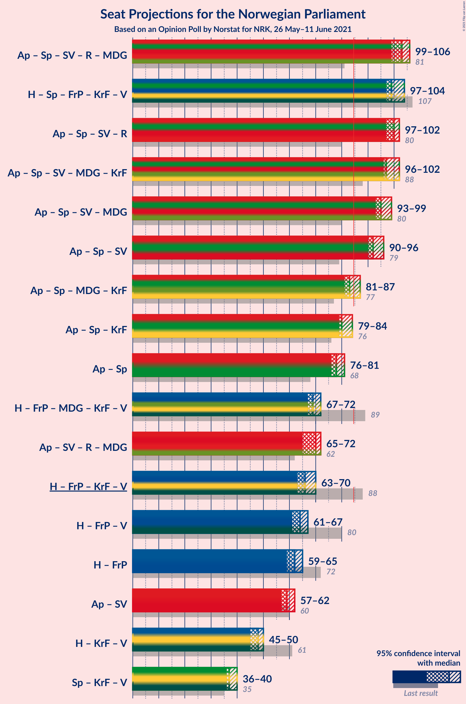
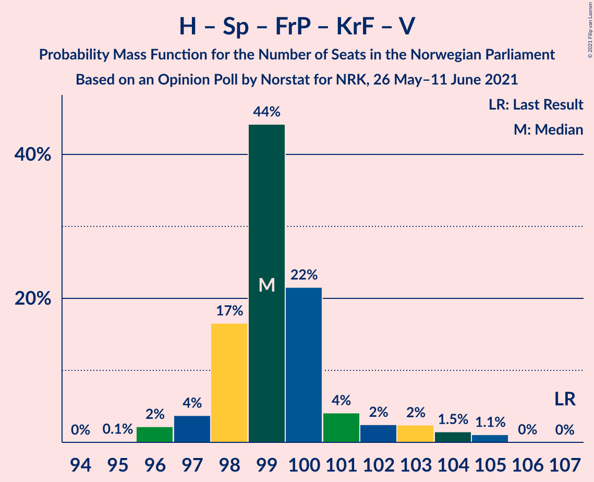
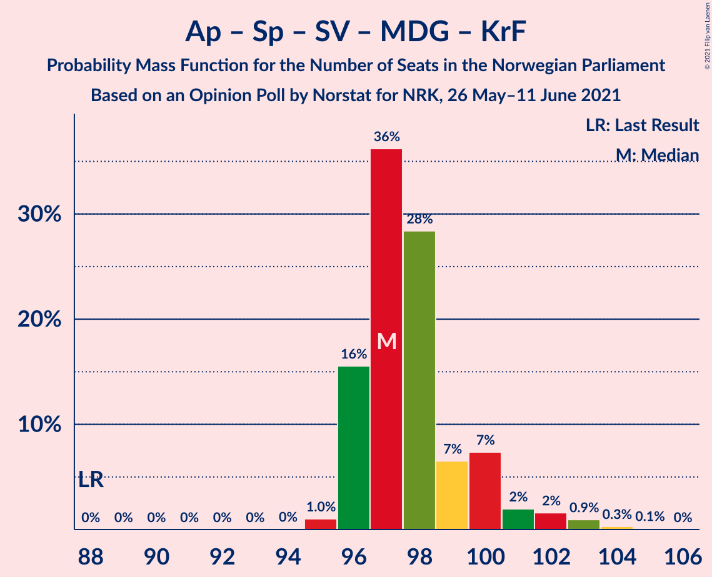
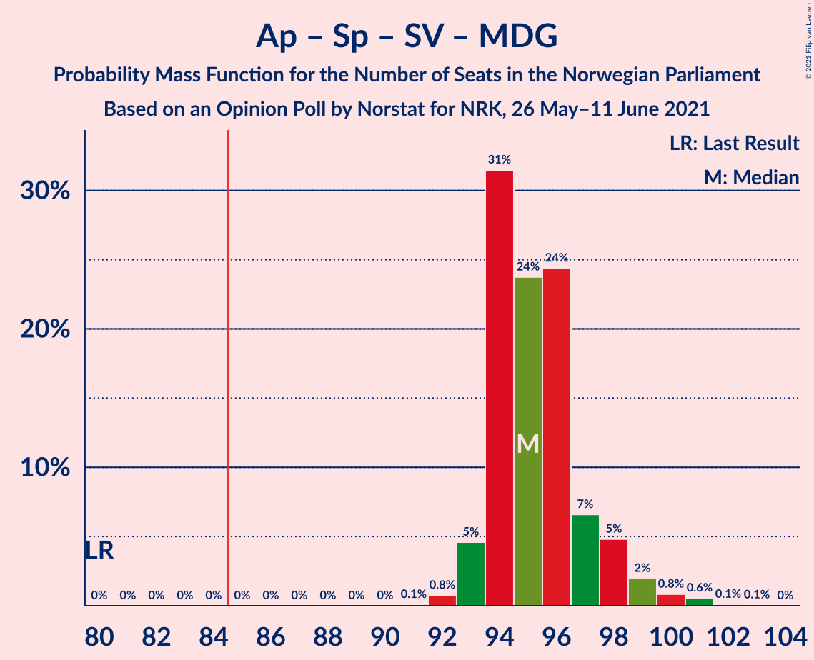
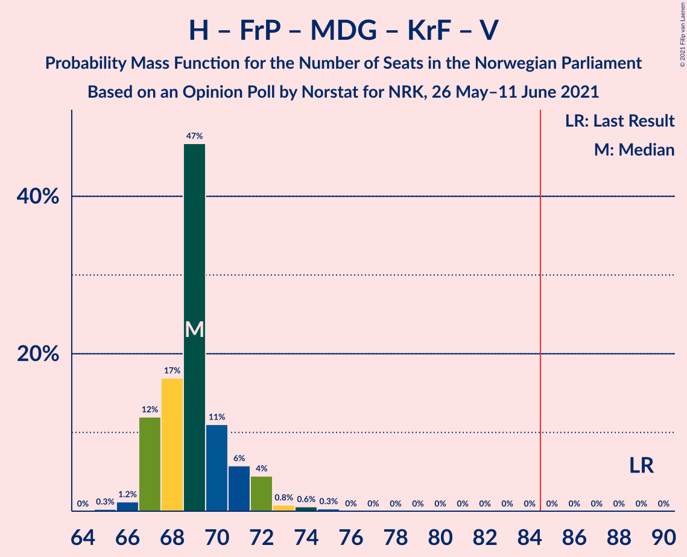
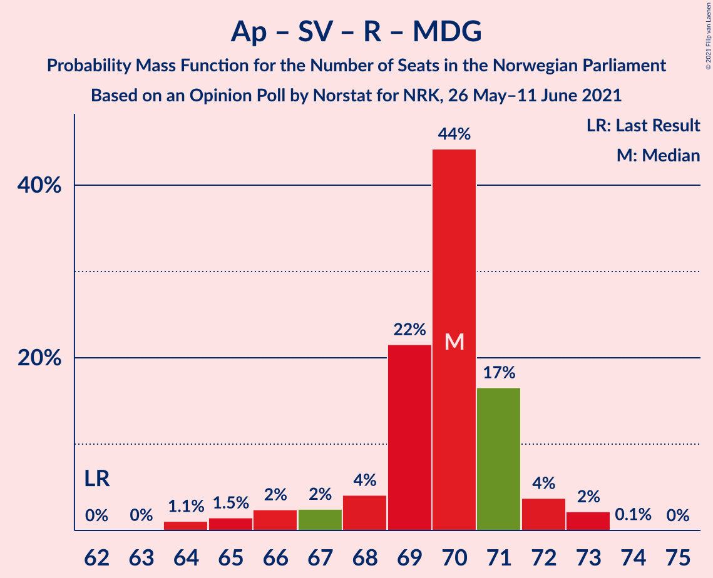
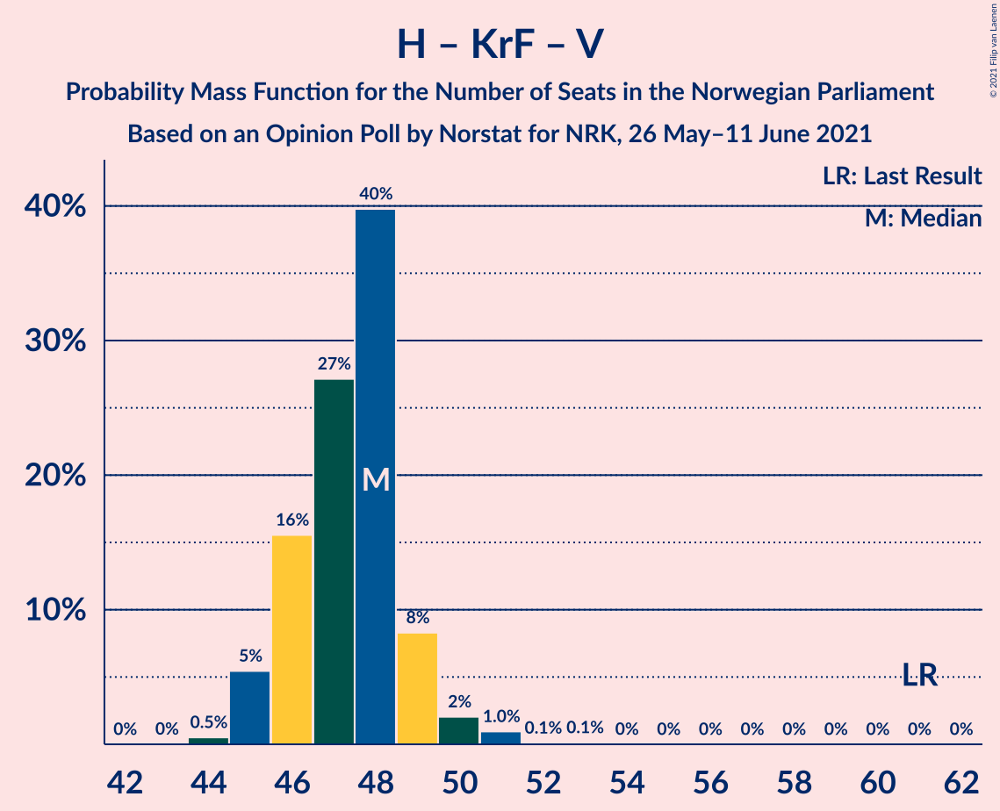

# Opinion Poll by Norstat for NRK, 26 May–11 June 2021

<a href="#voting-intentions">Voting Intentions</a> | <a href="#seats">Seats</a> | <a href="#coalitions">Coalitions</a> | <a href="#technical-information">Technical Information</a>

## Voting Intentions

### Confidence Intervals

| Party | Last Result | Poll Result | 80% Confidence Interval | 90% Confidence Interval | 95% Confidence Interval | 99% Confidence Interval |
|:-----:|:-----------:|:-----------:|:-----------------------:|:-----------------------:|:-----------------------:|:-----------------------:|
| Arbeiderpartiet | 27.4% | 24.1% | 23.5–24.6% |23.4–24.7% |23.3–24.9% |23.0–25.1% |
| Høyre | 25.0% | 23.0% | 22.5–23.5% |22.3–23.6% |22.2–23.7% |21.9–24.0% |
| Senterpartiet | 10.3% | 17.7% | 17.2–18.1% |17.1–18.3% |17.0–18.4% |16.8–18.6% |
| Fremskrittspartiet | 15.2% | 10.2% | 9.8–10.5% |9.7–10.7% |9.6–10.7% |9.5–10.9% |
| Sosialistisk Venstreparti | 6.0% | 7.8% | 7.5–8.1% |7.4–8.2% |7.3–8.3% |7.1–8.5% |
| Rødt | 2.4% | 4.2% | 3.9–4.5% |3.9–4.5% |3.8–4.6% |3.7–4.7% |
| Miljøpartiet De Grønne | 3.2% | 3.7% | 3.5–3.9% |3.4–4.0% |3.4–4.1% |3.3–4.2% |
| Kristelig Folkeparti | 4.2% | 3.6% | 3.4–3.8% |3.3–3.9% |3.3–4.0% |3.2–4.1% |
| Venstre | 4.4% | 2.7% | 2.5–2.9% |2.5–3.0% |2.4–3.0% |2.3–3.1% |

*Note:* The poll result column reflects the actual value used in the calculations. Published results may vary slightly, and in addition be rounded to fewer digits.

## Seats

### Confidence Intervals

| Party | Last Result | Median | 80% Confidence Interval | 90% Confidence Interval | 95% Confidence Interval | 99% Confidence Interval |
|:-----:|:-----------:|:------:|:-----------------------:|:-----------------------:|:-----------------------:|:-----------------------:|
| <a href="#arbeiderpartiet">Arbeiderpartiet</a> | 49 | 45 | 44–46 |44–46 |44–46 |43–48 |
| <a href="#høyre">Høyre</a> | 45 | 43 | 41–44 |41–45 |41–45 |40–46 |
| <a href="#senterpartiet">Senterpartiet</a> | 19 | 33 | 32–35 |32–35 |32–35 |31–35 |
| <a href="#fremskrittspartiet">Fremskrittspartiet</a> | 27 | 19 | 18–20 |18–20 |18–20 |17–21 |
| <a href="#sosialistisk-venstreparti">Sosialistisk Venstreparti</a> | 11 | 15 | 14–15 |14–15 |14–16 |13–16 |
| <a href="#rødt">Rødt</a> | 1 | 8 | 7–8 |2–9 |2–9 |2–9 |
| <a href="#miljøpartiet-de-grønne">Miljøpartiet De Grønne</a> | 1 | 2 | 2–4 |2–4 |2–7 |2–8 |
| <a href="#kristelig-folkeparti">Kristelig Folkeparti</a> | 8 | 3 | 2–3 |2–3 |2–3 |1–7 |
| <a href="#venstre">Venstre</a> | 8 | 2 | 2 |2 |2 |2 |

### Arbeiderpartiet

*For a full overview of the results for this party, see the [Arbeiderpartiet](party-arbeiderpartiet.html) page.*

| Number of Seats | Probability | Accumulated | Special Marks |
|:---------------:|:-----------:|:-----------:|:-------------:|
| 43 | 2% | 100% |  |
| 44 | 23% | 98% |  |
| 45 | 63% | 75% | Median |
| 46 | 9% | 11% |  |
| 47 | 2% | 2% |  |
| 48 | 0.5% | 0.7% |  |
| 49 | 0.2% | 0.2% | Last Result |
| 50 | 0% | 0% |  |

### Høyre

*For a full overview of the results for this party, see the [Høyre](party-høyre.html) page.*

| Number of Seats | Probability | Accumulated | Special Marks |
|:---------------:|:-----------:|:-----------:|:-------------:|
| 39 | 0.1% | 100% |  |
| 40 | 2% | 99.9% |  |
| 41 | 14% | 98% |  |
| 42 | 17% | 84% |  |
| 43 | 51% | 67% | Median |
| 44 | 9% | 16% |  |
| 45 | 7% | 8% | Last Result |
| 46 | 0.5% | 0.6% |  |
| 47 | 0% | 0% |  |

### Senterpartiet

*For a full overview of the results for this party, see the [Senterpartiet](party-senterpartiet.html) page.*

| Number of Seats | Probability | Accumulated | Special Marks |
|:---------------:|:-----------:|:-----------:|:-------------:|
| 19 | 0% | 100% | Last Result |
| 20 | 0% | 100% |  |
| 21 | 0% | 100% |  |
| 22 | 0% | 100% |  |
| 23 | 0% | 100% |  |
| 24 | 0% | 100% |  |
| 25 | 0% | 100% |  |
| 26 | 0% | 100% |  |
| 27 | 0% | 100% |  |
| 28 | 0% | 100% |  |
| 29 | 0% | 100% |  |
| 30 | 0% | 100% |  |
| 31 | 1.2% | 100% |  |
| 32 | 48% | 98.8% |  |
| 33 | 28% | 51% | Median |
| 34 | 13% | 23% |  |
| 35 | 10% | 11% |  |
| 36 | 0.3% | 0.3% |  |
| 37 | 0% | 0% |  |

### Fremskrittspartiet

*For a full overview of the results for this party, see the [Fremskrittspartiet](party-fremskrittspartiet.html) page.*

| Number of Seats | Probability | Accumulated | Special Marks |
|:---------------:|:-----------:|:-----------:|:-------------:|
| 17 | 0.9% | 100% |  |
| 18 | 10% | 99.1% |  |
| 19 | 68% | 89% | Median |
| 20 | 20% | 21% |  |
| 21 | 0.5% | 0.5% |  |
| 22 | 0% | 0% |  |
| 23 | 0% | 0% |  |
| 24 | 0% | 0% |  |
| 25 | 0% | 0% |  |
| 26 | 0% | 0% |  |
| 27 | 0% | 0% | Last Result |

### Sosialistisk Venstreparti

*For a full overview of the results for this party, see the [Sosialistisk Venstreparti](party-sosialistiskvenstreparti.html) page.*

| Number of Seats | Probability | Accumulated | Special Marks |
|:---------------:|:-----------:|:-----------:|:-------------:|
| 11 | 0% | 100% | Last Result |
| 12 | 0% | 100% |  |
| 13 | 2% | 100% |  |
| 14 | 30% | 98% |  |
| 15 | 65% | 68% | Median |
| 16 | 3% | 3% |  |
| 17 | 0% | 0% |  |

### Rødt

*For a full overview of the results for this party, see the [Rødt](party-rødt.html) page.*

| Number of Seats | Probability | Accumulated | Special Marks |
|:---------------:|:-----------:|:-----------:|:-------------:|
| 1 | 0% | 100% | Last Result |
| 2 | 9% | 100% |  |
| 3 | 0% | 91% |  |
| 4 | 0% | 91% |  |
| 5 | 0% | 91% |  |
| 6 | 0% | 91% |  |
| 7 | 3% | 91% |  |
| 8 | 82% | 88% | Median |
| 9 | 5% | 5% |  |
| 10 | 0% | 0% |  |

### Miljøpartiet De Grønne

*For a full overview of the results for this party, see the [Miljøpartiet De Grønne](party-miljøpartietdegrønne.html) page.*

| Number of Seats | Probability | Accumulated | Special Marks |
|:---------------:|:-----------:|:-----------:|:-------------:|
| 1 | 0% | 100% | Last Result |
| 2 | 72% | 100% | Median |
| 3 | 12% | 28% |  |
| 4 | 12% | 16% |  |
| 5 | 0% | 4% |  |
| 6 | 0% | 4% |  |
| 7 | 3% | 4% |  |
| 8 | 2% | 2% |  |
| 9 | 0% | 0% |  |

### Kristelig Folkeparti

*For a full overview of the results for this party, see the [Kristelig Folkeparti](party-kristeligfolkeparti.html) page.*

| Number of Seats | Probability | Accumulated | Special Marks |
|:---------------:|:-----------:|:-----------:|:-------------:|
| 1 | 1.2% | 100% |  |
| 2 | 31% | 98.8% |  |
| 3 | 67% | 68% | Median |
| 4 | 0% | 0.9% |  |
| 5 | 0% | 0.9% |  |
| 6 | 0% | 0.9% |  |
| 7 | 0.6% | 0.9% |  |
| 8 | 0.3% | 0.3% | Last Result |
| 9 | 0% | 0% |  |

### Venstre

*For a full overview of the results for this party, see the [Venstre](party-venstre.html) page.*

| Number of Seats | Probability | Accumulated | Special Marks |
|:---------------:|:-----------:|:-----------:|:-------------:|
| 1 | 0.4% | 100% |  |
| 2 | 99.6% | 99.6% | Median |
| 3 | 0% | 0% |  |
| 4 | 0% | 0% |  |
| 5 | 0% | 0% |  |
| 6 | 0% | 0% |  |
| 7 | 0% | 0% |  |
| 8 | 0% | 0% | Last Result |

## Coalitions

### Confidence Intervals

| Coalition | Last Result | Median | Majority? | 80% Confidence Interval | 90% Confidence Interval | 95% Confidence Interval | 99% Confidence Interval |
|:---------:|:-----------:|:------:|:---------:|:-----------------------:|:-----------------------:|:-----------------------:|:-----------------------:|
| Arbeiderpartiet – Senterpartiet – Sosialistisk Venstreparti – Rødt – Miljøpartiet De Grønne | 81 | 102 | 100% | 101–104 | 100–104 | 100–105 | 99–106 |
| Høyre – Senterpartiet – Fremskrittspartiet – Kristelig Folkeparti – Venstre | 107 | 99 | 100% | 98–101 | 98–104 | 97–104 | 96–104 |
| Arbeiderpartiet – Senterpartiet – Sosialistisk Venstreparti – Rødt | 80 | 100 | 100% | 98–101 | 98–102 | 97–102 | 95–103 |
| Arbeiderpartiet – Senterpartiet – Sosialistisk Venstreparti – Miljøpartiet De Grønne – Kristelig Folkeparti | 88 | 97 | 100% | 96–100 | 96–101 | 96–101 | 95–104 |
| Arbeiderpartiet – Senterpartiet – Sosialistisk Venstreparti – Miljøpartiet De Grønne | 80 | 94 | 100% | 94–98 | 93–98 | 93–99 | 92–101 |
| Arbeiderpartiet – Senterpartiet – Sosialistisk Venstreparti | 79 | 92 | 100% | 91–94 | 91–96 | 91–96 | 90–97 |
| Arbeiderpartiet – Senterpartiet – Miljøpartiet De Grønne – Kristelig Folkeparti | 77 | 82 | 14% | 82–85 | 81–86 | 81–87 | 81–89 |
| Arbeiderpartiet – Senterpartiet – Kristelig Folkeparti | 76 | 80 | 0.3% | 80–82 | 79–83 | 79–83 | 78–84 |
| Arbeiderpartiet – Senterpartiet | 68 | 77 | 0% | 77–79 | 77–81 | 76–81 | 76–82 |
| Høyre – Fremskrittspartiet – Miljøpartiet De Grønne – Kristelig Folkeparti – Venstre | 89 | 69 | 0% | 68–71 | 67–71 | 67–72 | 66–74 |
| Arbeiderpartiet – Sosialistisk Venstreparti – Rødt – Miljøpartiet De Grønne | 62 | 70 | 0% | 68–71 | 65–71 | 65–72 | 65–73 |
| Høyre – Fremskrittspartiet – Kristelig Folkeparti – Venstre | 88 | 67 | 0% | 65–68 | 65–69 | 64–69 | 63–70 |
| Høyre – Fremskrittspartiet – Venstre | 80 | 64 | 0% | 63–65 | 62–67 | 61–67 | 60–67 |
| Høyre – Fremskrittspartiet | 72 | 62 | 0% | 61–63 | 60–65 | 59–65 | 58–65 |
| Arbeiderpartiet – Sosialistisk Venstreparti | 60 | 60 | 0% | 58–61 | 58–61 | 58–61 | 57–63 |
| Høyre – Kristelig Folkeparti – Venstre | 61 | 48 | 0% | 45–49 | 45–49 | 45–50 | 45–51 |
| Senterpartiet – Kristelig Folkeparti – Venstre | 35 | 37 | 0% | 37–39 | 36–40 | 36–40 | 36–41 |

### Arbeiderpartiet – Senterpartiet – Sosialistisk Venstreparti – Rødt – Miljøpartiet De Grønne

| Number of Seats | Probability | Accumulated | Special Marks |
|:---------------:|:-----------:|:-----------:|:-------------:|
| 81 | 0% | 100% | Last Result |
| 82 | 0% | 100% |  |
| 83 | 0% | 100% |  |
| 84 | 0% | 100% |  |
| 85 | 0% | 100% | Majority |
| 86 | 0% | 100% |  |
| 87 | 0% | 100% |  |
| 88 | 0% | 100% |  |
| 89 | 0% | 100% |  |
| 90 | 0% | 100% |  |
| 91 | 0% | 100% |  |
| 92 | 0% | 100% |  |
| 93 | 0% | 100% |  |
| 94 | 0% | 100% |  |
| 95 | 0% | 100% |  |
| 96 | 0% | 100% |  |
| 97 | 0% | 99.9% |  |
| 98 | 0% | 99.9% |  |
| 99 | 1.0% | 99.9% |  |
| 100 | 7% | 98.9% |  |
| 101 | 7% | 92% |  |
| 102 | 44% | 85% |  |
| 103 | 21% | 42% | Median |
| 104 | 16% | 21% |  |
| 105 | 2% | 5% |  |
| 106 | 2% | 2% |  |
| 107 | 0.3% | 0.3% |  |
| 108 | 0% | 0% |  |

### Høyre – Senterpartiet – Fremskrittspartiet – Kristelig Folkeparti – Venstre

| Number of Seats | Probability | Accumulated | Special Marks |
|:---------------:|:-----------:|:-----------:|:-------------:|
| 95 | 0.1% | 100% |  |
| 96 | 1.1% | 99.9% |  |
| 97 | 3% | 98.8% |  |
| 98 | 14% | 96% |  |
| 99 | 57% | 82% |  |
| 100 | 11% | 25% | Median |
| 101 | 6% | 15% |  |
| 102 | 0.9% | 8% |  |
| 103 | 1.2% | 7% |  |
| 104 | 6% | 6% |  |
| 105 | 0.1% | 0.1% |  |
| 106 | 0% | 0% |  |
| 107 | 0% | 0% | Last Result |

### Arbeiderpartiet – Senterpartiet – Sosialistisk Venstreparti – Rødt

| Number of Seats | Probability | Accumulated | Special Marks |
|:---------------:|:-----------:|:-----------:|:-------------:|
| 80 | 0% | 100% | Last Result |
| 81 | 0% | 100% |  |
| 82 | 0% | 100% |  |
| 83 | 0% | 100% |  |
| 84 | 0% | 100% |  |
| 85 | 0% | 100% | Majority |
| 86 | 0% | 100% |  |
| 87 | 0% | 100% |  |
| 88 | 0% | 100% |  |
| 89 | 0% | 100% |  |
| 90 | 0% | 100% |  |
| 91 | 0% | 100% |  |
| 92 | 0.1% | 100% |  |
| 93 | 0.1% | 99.9% |  |
| 94 | 0.1% | 99.8% |  |
| 95 | 0.8% | 99.7% |  |
| 96 | 0.7% | 98.9% |  |
| 97 | 1.2% | 98% |  |
| 98 | 9% | 97% |  |
| 99 | 16% | 88% |  |
| 100 | 44% | 72% |  |
| 101 | 22% | 28% | Median |
| 102 | 5% | 6% |  |
| 103 | 0.6% | 0.7% |  |
| 104 | 0.1% | 0.1% |  |
| 105 | 0% | 0% |  |

### Arbeiderpartiet – Senterpartiet – Sosialistisk Venstreparti – Miljøpartiet De Grønne – Kristelig Folkeparti

| Number of Seats | Probability | Accumulated | Special Marks |
|:---------------:|:-----------:|:-----------:|:-------------:|
| 88 | 0% | 100% | Last Result |
| 89 | 0% | 100% |  |
| 90 | 0% | 100% |  |
| 91 | 0% | 100% |  |
| 92 | 0% | 100% |  |
| 93 | 0% | 100% |  |
| 94 | 0.1% | 100% |  |
| 95 | 0.7% | 99.9% |  |
| 96 | 13% | 99.2% |  |
| 97 | 43% | 86% |  |
| 98 | 25% | 44% | Median |
| 99 | 7% | 19% |  |
| 100 | 6% | 12% |  |
| 101 | 3% | 5% |  |
| 102 | 1.4% | 2% |  |
| 103 | 0.2% | 1.1% |  |
| 104 | 0.8% | 0.9% |  |
| 105 | 0.1% | 0.1% |  |
| 106 | 0% | 0% |  |

### Arbeiderpartiet – Senterpartiet – Sosialistisk Venstreparti – Miljøpartiet De Grønne

| Number of Seats | Probability | Accumulated | Special Marks |
|:---------------:|:-----------:|:-----------:|:-------------:|
| 80 | 0% | 100% | Last Result |
| 81 | 0% | 100% |  |
| 82 | 0% | 100% |  |
| 83 | 0% | 100% |  |
| 84 | 0% | 100% |  |
| 85 | 0% | 100% | Majority |
| 86 | 0% | 100% |  |
| 87 | 0% | 100% |  |
| 88 | 0% | 100% |  |
| 89 | 0% | 100% |  |
| 90 | 0% | 100% |  |
| 91 | 0.2% | 100% |  |
| 92 | 0.4% | 99.8% |  |
| 93 | 8% | 99.4% |  |
| 94 | 43% | 91% |  |
| 95 | 18% | 48% | Median |
| 96 | 17% | 30% |  |
| 97 | 2% | 14% |  |
| 98 | 8% | 11% |  |
| 99 | 2% | 3% |  |
| 100 | 0.4% | 1.3% |  |
| 101 | 0.8% | 0.8% |  |
| 102 | 0% | 0% |  |

### Arbeiderpartiet – Senterpartiet – Sosialistisk Venstreparti

| Number of Seats | Probability | Accumulated | Special Marks |
|:---------------:|:-----------:|:-----------:|:-------------:|
| 79 | 0% | 100% | Last Result |
| 80 | 0% | 100% |  |
| 81 | 0% | 100% |  |
| 82 | 0% | 100% |  |
| 83 | 0% | 100% |  |
| 84 | 0% | 100% |  |
| 85 | 0% | 100% | Majority |
| 86 | 0% | 100% |  |
| 87 | 0% | 100% |  |
| 88 | 0% | 100% |  |
| 89 | 0.4% | 100% |  |
| 90 | 2% | 99.6% |  |
| 91 | 19% | 98% |  |
| 92 | 44% | 78% |  |
| 93 | 21% | 35% | Median |
| 94 | 5% | 14% |  |
| 95 | 1.4% | 8% |  |
| 96 | 6% | 7% |  |
| 97 | 0.5% | 0.8% |  |
| 98 | 0.3% | 0.3% |  |
| 99 | 0% | 0% |  |

### Arbeiderpartiet – Senterpartiet – Miljøpartiet De Grønne – Kristelig Folkeparti

| Number of Seats | Probability | Accumulated | Special Marks |
|:---------------:|:-----------:|:-----------:|:-------------:|
| 77 | 0% | 100% | Last Result |
| 78 | 0% | 100% |  |
| 79 | 0% | 100% |  |
| 80 | 0.1% | 100% |  |
| 81 | 6% | 99.9% |  |
| 82 | 47% | 94% |  |
| 83 | 14% | 47% | Median |
| 84 | 18% | 32% |  |
| 85 | 9% | 14% | Majority |
| 86 | 1.5% | 5% |  |
| 87 | 2% | 4% |  |
| 88 | 1.4% | 2% |  |
| 89 | 0.8% | 1.0% |  |
| 90 | 0.1% | 0.2% |  |
| 91 | 0.1% | 0.1% |  |
| 92 | 0% | 0% |  |

### Arbeiderpartiet – Senterpartiet – Kristelig Folkeparti

| Number of Seats | Probability | Accumulated | Special Marks |
|:---------------:|:-----------:|:-----------:|:-------------:|
| 76 | 0% | 100% | Last Result |
| 77 | 0% | 100% |  |
| 78 | 1.2% | 100% |  |
| 79 | 7% | 98.8% |  |
| 80 | 65% | 91% |  |
| 81 | 11% | 27% | Median |
| 82 | 7% | 15% |  |
| 83 | 7% | 8% |  |
| 84 | 1.5% | 2% |  |
| 85 | 0.2% | 0.3% | Majority |
| 86 | 0% | 0.1% |  |
| 87 | 0% | 0% |  |

### Arbeiderpartiet – Senterpartiet

| Number of Seats | Probability | Accumulated | Special Marks |
|:---------------:|:-----------:|:-----------:|:-------------:|
| 68 | 0% | 100% | Last Result |
| 69 | 0% | 100% |  |
| 70 | 0% | 100% |  |
| 71 | 0% | 100% |  |
| 72 | 0% | 100% |  |
| 73 | 0% | 100% |  |
| 74 | 0% | 100% |  |
| 75 | 0.2% | 100% |  |
| 76 | 3% | 99.8% |  |
| 77 | 57% | 97% |  |
| 78 | 20% | 39% | Median |
| 79 | 9% | 19% |  |
| 80 | 3% | 10% |  |
| 81 | 6% | 7% |  |
| 82 | 0.6% | 0.7% |  |
| 83 | 0.1% | 0.1% |  |
| 84 | 0% | 0% |  |

### Høyre – Fremskrittspartiet – Miljøpartiet De Grønne – Kristelig Folkeparti – Venstre

| Number of Seats | Probability | Accumulated | Special Marks |
|:---------------:|:-----------:|:-----------:|:-------------:|
| 65 | 0.1% | 100% |  |
| 66 | 0.6% | 99.9% |  |
| 67 | 5% | 99.3% |  |
| 68 | 22% | 94% |  |
| 69 | 44% | 72% | Median |
| 70 | 16% | 28% |  |
| 71 | 9% | 12% |  |
| 72 | 1.2% | 3% |  |
| 73 | 0.7% | 2% |  |
| 74 | 0.8% | 1.1% |  |
| 75 | 0.1% | 0.3% |  |
| 76 | 0.1% | 0.2% |  |
| 77 | 0.1% | 0.1% |  |
| 78 | 0% | 0% |  |
| 79 | 0% | 0% |  |
| 80 | 0% | 0% |  |
| 81 | 0% | 0% |  |
| 82 | 0% | 0% |  |
| 83 | 0% | 0% |  |
| 84 | 0% | 0% |  |
| 85 | 0% | 0% | Majority |
| 86 | 0% | 0% |  |
| 87 | 0% | 0% |  |
| 88 | 0% | 0% |  |
| 89 | 0% | 0% | Last Result |

### Arbeiderpartiet – Sosialistisk Venstreparti – Rødt – Miljøpartiet De Grønne

| Number of Seats | Probability | Accumulated | Special Marks |
|:---------------:|:-----------:|:-----------:|:-------------:|
| 62 | 0% | 100% | Last Result |
| 63 | 0% | 100% |  |
| 64 | 0.1% | 100% |  |
| 65 | 6% | 99.9% |  |
| 66 | 1.2% | 94% |  |
| 67 | 0.9% | 93% |  |
| 68 | 6% | 92% |  |
| 69 | 11% | 85% |  |
| 70 | 57% | 75% | Median |
| 71 | 14% | 18% |  |
| 72 | 3% | 4% |  |
| 73 | 1.1% | 1.2% |  |
| 74 | 0.1% | 0.1% |  |
| 75 | 0% | 0% |  |

### Høyre – Fremskrittspartiet – Kristelig Folkeparti – Venstre

| Number of Seats | Probability | Accumulated | Special Marks |
|:---------------:|:-----------:|:-----------:|:-------------:|
| 62 | 0.3% | 100% |  |
| 63 | 2% | 99.7% |  |
| 64 | 2% | 98% |  |
| 65 | 16% | 95% |  |
| 66 | 21% | 79% |  |
| 67 | 44% | 58% | Median |
| 68 | 7% | 15% |  |
| 69 | 7% | 8% |  |
| 70 | 1.0% | 1.1% |  |
| 71 | 0% | 0.1% |  |
| 72 | 0% | 0.1% |  |
| 73 | 0% | 0.1% |  |
| 74 | 0% | 0% |  |
| 75 | 0% | 0% |  |
| 76 | 0% | 0% |  |
| 77 | 0% | 0% |  |
| 78 | 0% | 0% |  |
| 79 | 0% | 0% |  |
| 80 | 0% | 0% |  |
| 81 | 0% | 0% |  |
| 82 | 0% | 0% |  |
| 83 | 0% | 0% |  |
| 84 | 0% | 0% |  |
| 85 | 0% | 0% | Majority |
| 86 | 0% | 0% |  |
| 87 | 0% | 0% |  |
| 88 | 0% | 0% | Last Result |

### Høyre – Fremskrittspartiet – Venstre

| Number of Seats | Probability | Accumulated | Special Marks |
|:---------------:|:-----------:|:-----------:|:-------------:|
| 58 | 0.1% | 100% |  |
| 59 | 0.3% | 99.9% |  |
| 60 | 2% | 99.6% |  |
| 61 | 0.7% | 98% |  |
| 62 | 6% | 97% |  |
| 63 | 26% | 91% |  |
| 64 | 47% | 65% | Median |
| 65 | 9% | 18% |  |
| 66 | 2% | 9% |  |
| 67 | 6% | 6% |  |
| 68 | 0.3% | 0.3% |  |
| 69 | 0% | 0% |  |
| 70 | 0% | 0% |  |
| 71 | 0% | 0% |  |
| 72 | 0% | 0% |  |
| 73 | 0% | 0% |  |
| 74 | 0% | 0% |  |
| 75 | 0% | 0% |  |
| 76 | 0% | 0% |  |
| 77 | 0% | 0% |  |
| 78 | 0% | 0% |  |
| 79 | 0% | 0% |  |
| 80 | 0% | 0% | Last Result |

### Høyre – Fremskrittspartiet

| Number of Seats | Probability | Accumulated | Special Marks |
|:---------------:|:-----------:|:-----------:|:-------------:|
| 56 | 0.1% | 100% |  |
| 57 | 0.3% | 99.9% |  |
| 58 | 2% | 99.6% |  |
| 59 | 0.8% | 98% |  |
| 60 | 6% | 97% |  |
| 61 | 26% | 91% |  |
| 62 | 47% | 65% | Median |
| 63 | 9% | 18% |  |
| 64 | 2% | 9% |  |
| 65 | 6% | 6% |  |
| 66 | 0.3% | 0.3% |  |
| 67 | 0% | 0% |  |
| 68 | 0% | 0% |  |
| 69 | 0% | 0% |  |
| 70 | 0% | 0% |  |
| 71 | 0% | 0% |  |
| 72 | 0% | 0% | Last Result |

### Arbeiderpartiet – Sosialistisk Venstreparti

| Number of Seats | Probability | Accumulated | Special Marks |
|:---------------:|:-----------:|:-----------:|:-------------:|
| 56 | 0.3% | 100% |  |
| 57 | 1.5% | 99.7% |  |
| 58 | 19% | 98% |  |
| 59 | 13% | 79% |  |
| 60 | 56% | 66% | Last Result, Median |
| 61 | 8% | 10% |  |
| 62 | 0.8% | 2% |  |
| 63 | 0.5% | 0.8% |  |
| 64 | 0.1% | 0.2% |  |
| 65 | 0.1% | 0.1% |  |
| 66 | 0% | 0% |  |

### Høyre – Kristelig Folkeparti – Venstre

| Number of Seats | Probability | Accumulated | Special Marks |
|:---------------:|:-----------:|:-----------:|:-------------:|
| 44 | 0.3% | 100% |  |
| 45 | 11% | 99.7% |  |
| 46 | 9% | 89% |  |
| 47 | 21% | 79% |  |
| 48 | 44% | 59% | Median |
| 49 | 12% | 15% |  |
| 50 | 2% | 3% |  |
| 51 | 0.3% | 0.6% |  |
| 52 | 0.3% | 0.3% |  |
| 53 | 0% | 0.1% |  |
| 54 | 0% | 0% |  |
| 55 | 0% | 0% |  |
| 56 | 0% | 0% |  |
| 57 | 0% | 0% |  |
| 58 | 0% | 0% |  |
| 59 | 0% | 0% |  |
| 60 | 0% | 0% |  |
| 61 | 0% | 0% | Last Result |

### Senterpartiet – Kristelig Folkeparti – Venstre

| Number of Seats | Probability | Accumulated | Special Marks |
|:---------------:|:-----------:|:-----------:|:-------------:|
| 35 | 0% | 100% | Last Result |
| 36 | 6% | 100% |  |
| 37 | 55% | 94% |  |
| 38 | 26% | 40% | Median |
| 39 | 9% | 14% |  |
| 40 | 4% | 5% |  |
| 41 | 0.5% | 1.0% |  |
| 42 | 0.4% | 0.5% |  |
| 43 | 0.1% | 0.1% |  |
| 44 | 0% | 0% |  |

## Technical Information

### Opinion Poll

+ **Polling firm:** Norstat
+ **Commissioner(s):** NRK
+ **Fieldwork period:** 26 May–11 June 2021

### Calculations

+ **Sample size:** 11400
+ **Simulations done:** 131,072
+ **Error estimate:** 0.37%

