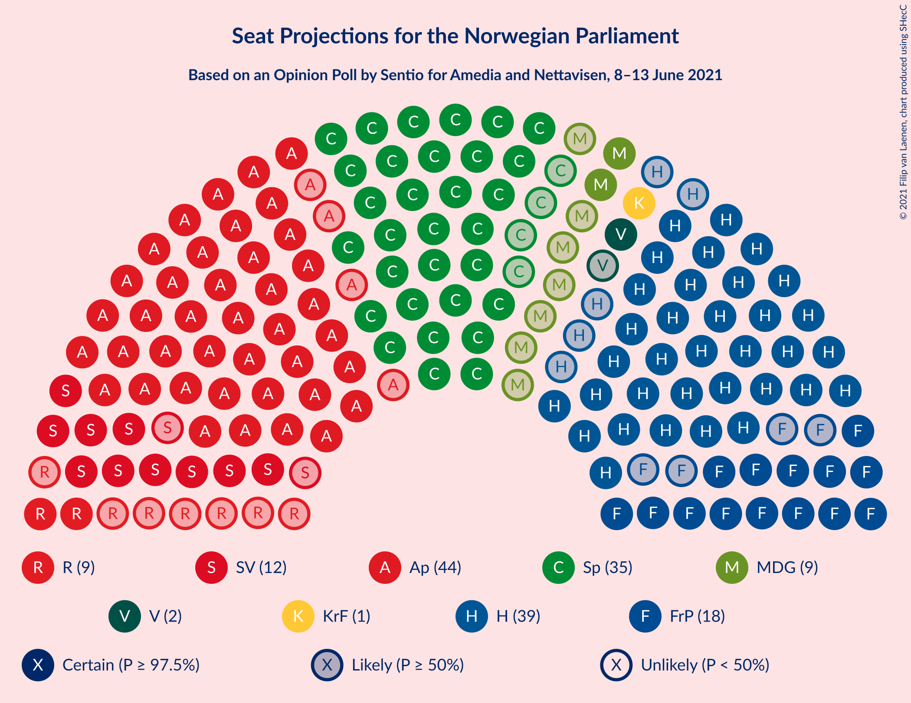
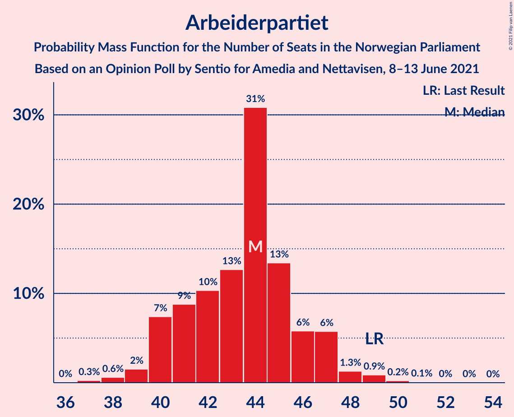
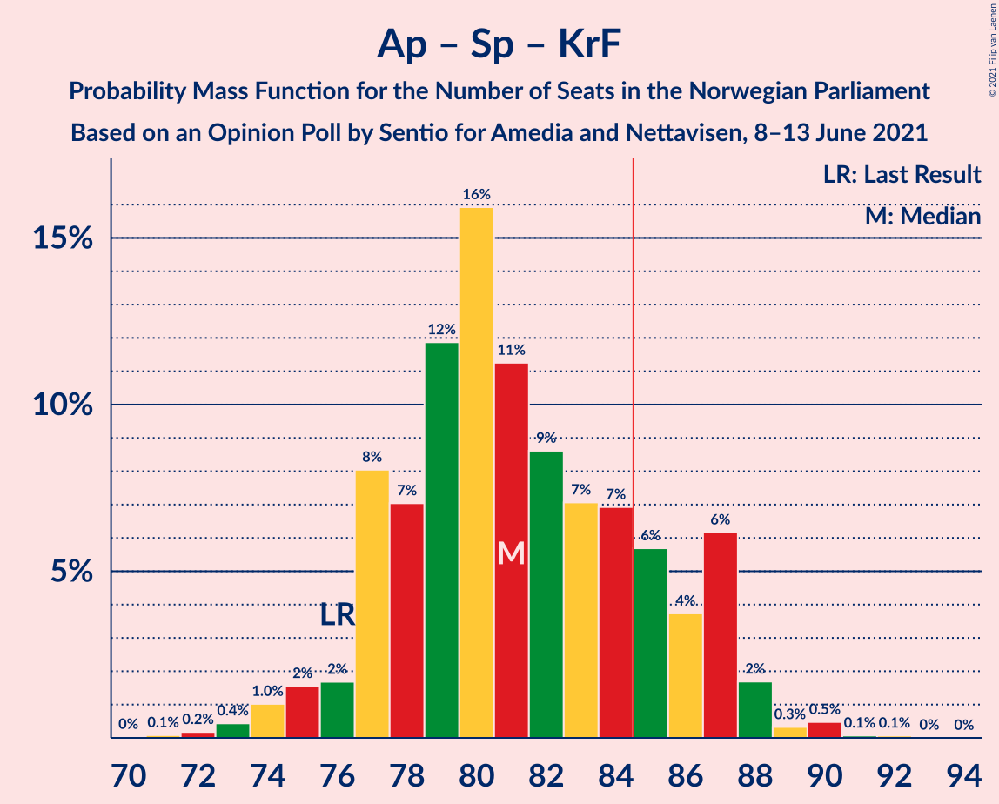
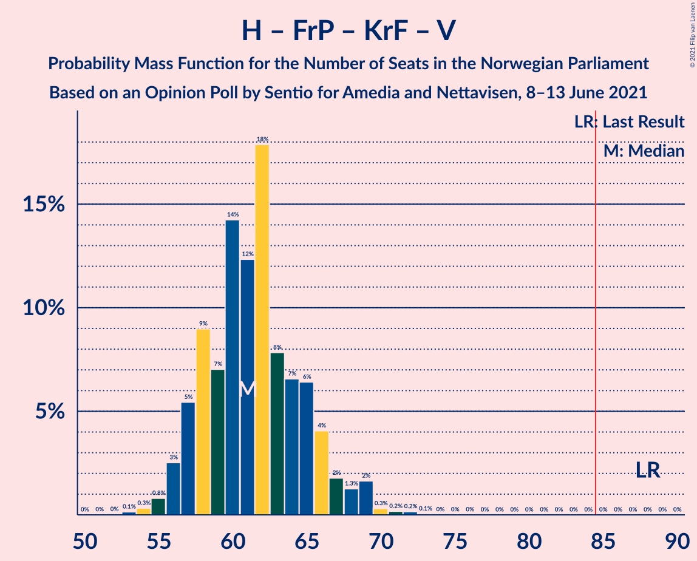

# Opinion Poll by Sentio for Amedia and Nettavisen, 8–13 June 2021

<a href="#voting-intentions">Voting Intentions</a> | <a href="#seats">Seats</a> | <a href="#coalitions">Coalitions</a> | <a href="#technical-information">Technical Information</a>

## Voting Intentions

### Confidence Intervals

| Party | Last Result | Poll Result | 80% Confidence Interval | 90% Confidence Interval | 95% Confidence Interval | 99% Confidence Interval |
|:-----:|:-----------:|:-----------:|:-----------------------:|:-----------------------:|:-----------------------:|:-----------------------:|
| Arbeiderpartiet | 27.4% | 23.9% | 22.2–25.7% |21.8–26.2% |21.4–26.6% |20.6–27.5% |
| Høyre | 25.0% | 21.9% | 20.3–23.7% |19.8–24.1% |19.4–24.6% |18.7–25.4% |
| Senterpartiet | 10.3% | 18.7% | 17.2–20.4% |16.8–20.8% |16.4–21.2% |15.7–22.1% |
| Fremskrittspartiet | 15.2% | 10.1% | 9.0–11.4% |8.6–11.8% |8.4–12.1% |7.9–12.8% |
| Sosialistisk Venstreparti | 6.0% | 7.0% | 6.1–8.2% |5.8–8.5% |5.6–8.8% |5.2–9.3% |
| Miljøpartiet De Grønne | 3.2% | 5.0% | 4.2–6.0% |4.0–6.3% |3.8–6.5% |3.5–7.1% |
| Rødt | 2.4% | 4.8% | 4.0–5.8% |3.8–6.1% |3.6–6.3% |3.3–6.8% |
| Kristelig Folkeparti | 4.2% | 3.3% | 2.7–4.1% |2.5–4.4% |2.4–4.6% |2.1–5.0% |
| Venstre | 4.4% | 2.8% | 2.2–3.6% |2.1–3.8% |1.9–4.0% |1.7–4.4% |

*Note:* The poll result column reflects the actual value used in the calculations. Published results may vary slightly, and in addition be rounded to fewer digits.

## Seats

### Confidence Intervals

| Party | Last Result | Median | 80% Confidence Interval | 90% Confidence Interval | 95% Confidence Interval | 99% Confidence Interval |
|:-----:|:-----------:|:------:|:-----------------------:|:-----------------------:|:-----------------------:|:-----------------------:|
| <a href="#arbeiderpartiet">Arbeiderpartiet</a> | 49 | 44 | 40–46 |40–47 |40–48 |38–50 |
| <a href="#høyre">Høyre</a> | 45 | 38 | 36–44 |35–45 |35–45 |33–46 |
| <a href="#senterpartiet">Senterpartiet</a> | 19 | 35 | 32–37 |32–38 |30–38 |29–41 |
| <a href="#fremskrittspartiet">Fremskrittspartiet</a> | 27 | 18 | 16–20 |15–21 |15–23 |13–23 |
| <a href="#sosialistisk-venstreparti">Sosialistisk Venstreparti</a> | 11 | 12 | 10–14 |10–15 |9–16 |9–17 |
| <a href="#miljøpartiet-de-grønne">Miljøpartiet De Grønne</a> | 1 | 9 | 7–11 |4–11 |2–12 |2–12 |
| <a href="#rødt">Rødt</a> | 1 | 9 | 2–10 |2–11 |2–11 |2–12 |
| <a href="#kristelig-folkeparti">Kristelig Folkeparti</a> | 8 | 3 | 1–7 |1–7 |1–8 |0–8 |
| <a href="#venstre">Venstre</a> | 8 | 2 | 1–2 |1–2 |1–7 |0–7 |

### Arbeiderpartiet

*For a full overview of the results for this party, see the [Arbeiderpartiet](party-arbeiderpartiet.html) page.*

| Number of Seats | Probability | Accumulated | Special Marks |
|:---------------:|:-----------:|:-----------:|:-------------:|
| 36 | 0% | 100% |  |
| 37 | 0.1% | 99.9% |  |
| 38 | 2% | 99.8% |  |
| 39 | 0.7% | 98% |  |
| 40 | 8% | 98% |  |
| 41 | 5% | 89% |  |
| 42 | 10% | 84% |  |
| 43 | 8% | 75% |  |
| 44 | 27% | 66% | Median |
| 45 | 25% | 39% |  |
| 46 | 7% | 14% |  |
| 47 | 4% | 7% |  |
| 48 | 3% | 4% |  |
| 49 | 0.2% | 0.7% | Last Result |
| 50 | 0.1% | 0.5% |  |
| 51 | 0.3% | 0.4% |  |
| 52 | 0% | 0.1% |  |
| 53 | 0% | 0% |  |

### Høyre

*For a full overview of the results for this party, see the [Høyre](party-høyre.html) page.*

| Number of Seats | Probability | Accumulated | Special Marks |
|:---------------:|:-----------:|:-----------:|:-------------:|
| 31 | 0% | 100% |  |
| 32 | 0.2% | 99.9% |  |
| 33 | 0.5% | 99.7% |  |
| 34 | 2% | 99.2% |  |
| 35 | 5% | 98% |  |
| 36 | 11% | 93% |  |
| 37 | 11% | 82% |  |
| 38 | 23% | 71% | Median |
| 39 | 15% | 48% |  |
| 40 | 6% | 33% |  |
| 41 | 9% | 28% |  |
| 42 | 3% | 19% |  |
| 43 | 4% | 16% |  |
| 44 | 2% | 11% |  |
| 45 | 8% | 9% | Last Result |
| 46 | 0.8% | 0.9% |  |
| 47 | 0% | 0.1% |  |
| 48 | 0% | 0% |  |

### Senterpartiet

*For a full overview of the results for this party, see the [Senterpartiet](party-senterpartiet.html) page.*

| Number of Seats | Probability | Accumulated | Special Marks |
|:---------------:|:-----------:|:-----------:|:-------------:|
| 19 | 0% | 100% | Last Result |
| 20 | 0% | 100% |  |
| 21 | 0% | 100% |  |
| 22 | 0% | 100% |  |
| 23 | 0% | 100% |  |
| 24 | 0% | 100% |  |
| 25 | 0% | 100% |  |
| 26 | 0% | 100% |  |
| 27 | 0% | 100% |  |
| 28 | 0.3% | 99.9% |  |
| 29 | 1.0% | 99.7% |  |
| 30 | 1.5% | 98.6% |  |
| 31 | 0.9% | 97% |  |
| 32 | 16% | 96% |  |
| 33 | 5% | 81% |  |
| 34 | 11% | 76% |  |
| 35 | 17% | 64% | Median |
| 36 | 35% | 47% |  |
| 37 | 4% | 12% |  |
| 38 | 7% | 8% |  |
| 39 | 0.7% | 2% |  |
| 40 | 0.1% | 1.1% |  |
| 41 | 0.8% | 1.0% |  |
| 42 | 0% | 0.1% |  |
| 43 | 0.1% | 0.1% |  |
| 44 | 0% | 0% |  |

### Fremskrittspartiet

*For a full overview of the results for this party, see the [Fremskrittspartiet](party-fremskrittspartiet.html) page.*

| Number of Seats | Probability | Accumulated | Special Marks |
|:---------------:|:-----------:|:-----------:|:-------------:|
| 13 | 0.7% | 100% |  |
| 14 | 2% | 99.3% |  |
| 15 | 5% | 98% |  |
| 16 | 25% | 92% |  |
| 17 | 9% | 67% |  |
| 18 | 14% | 59% | Median |
| 19 | 22% | 45% |  |
| 20 | 14% | 23% |  |
| 21 | 5% | 9% |  |
| 22 | 0.5% | 4% |  |
| 23 | 3% | 3% |  |
| 24 | 0% | 0.1% |  |
| 25 | 0% | 0% |  |
| 26 | 0% | 0% |  |
| 27 | 0% | 0% | Last Result |

### Sosialistisk Venstreparti

*For a full overview of the results for this party, see the [Sosialistisk Venstreparti](party-sosialistiskvenstreparti.html) page.*

| Number of Seats | Probability | Accumulated | Special Marks |
|:---------------:|:-----------:|:-----------:|:-------------:|
| 8 | 0.1% | 100% |  |
| 9 | 3% | 99.9% |  |
| 10 | 12% | 97% |  |
| 11 | 18% | 85% | Last Result |
| 12 | 27% | 68% | Median |
| 13 | 20% | 41% |  |
| 14 | 14% | 21% |  |
| 15 | 4% | 7% |  |
| 16 | 3% | 3% |  |
| 17 | 0.4% | 0.5% |  |
| 18 | 0.1% | 0.1% |  |
| 19 | 0% | 0% |  |

### Miljøpartiet De Grønne

*For a full overview of the results for this party, see the [Miljøpartiet De Grønne](party-miljøpartietdegrønne.html) page.*

| Number of Seats | Probability | Accumulated | Special Marks |
|:---------------:|:-----------:|:-----------:|:-------------:|
| 1 | 0% | 100% | Last Result |
| 2 | 4% | 100% |  |
| 3 | 0.9% | 96% |  |
| 4 | 0.8% | 95% |  |
| 5 | 0% | 95% |  |
| 6 | 0% | 95% |  |
| 7 | 6% | 95% |  |
| 8 | 37% | 89% |  |
| 9 | 32% | 52% | Median |
| 10 | 7% | 20% |  |
| 11 | 10% | 14% |  |
| 12 | 4% | 4% |  |
| 13 | 0.3% | 0.3% |  |
| 14 | 0% | 0% |  |

### Rødt

*For a full overview of the results for this party, see the [Rødt](party-rødt.html) page.*

| Number of Seats | Probability | Accumulated | Special Marks |
|:---------------:|:-----------:|:-----------:|:-------------:|
| 1 | 0% | 100% | Last Result |
| 2 | 16% | 100% |  |
| 3 | 0% | 84% |  |
| 4 | 0% | 84% |  |
| 5 | 0% | 84% |  |
| 6 | 0.1% | 84% |  |
| 7 | 11% | 84% |  |
| 8 | 18% | 74% |  |
| 9 | 37% | 56% | Median |
| 10 | 9% | 18% |  |
| 11 | 8% | 10% |  |
| 12 | 2% | 2% |  |
| 13 | 0.1% | 0.1% |  |
| 14 | 0% | 0% |  |

### Kristelig Folkeparti

*For a full overview of the results for this party, see the [Kristelig Folkeparti](party-kristeligfolkeparti.html) page.*

| Number of Seats | Probability | Accumulated | Special Marks |
|:---------------:|:-----------:|:-----------:|:-------------:|
| 0 | 0.5% | 100% |  |
| 1 | 38% | 99.5% |  |
| 2 | 12% | 62% |  |
| 3 | 36% | 50% | Median |
| 4 | 0% | 14% |  |
| 5 | 0% | 14% |  |
| 6 | 4% | 14% |  |
| 7 | 7% | 10% |  |
| 8 | 3% | 3% | Last Result |
| 9 | 0.1% | 0.2% |  |
| 10 | 0.1% | 0.1% |  |
| 11 | 0% | 0% |  |

### Venstre

*For a full overview of the results for this party, see the [Venstre](party-venstre.html) page.*

| Number of Seats | Probability | Accumulated | Special Marks |
|:---------------:|:-----------:|:-----------:|:-------------:|
| 0 | 0.6% | 100% |  |
| 1 | 11% | 99.4% |  |
| 2 | 86% | 89% | Median |
| 3 | 0.5% | 3% |  |
| 4 | 0% | 3% |  |
| 5 | 0% | 3% |  |
| 6 | 0.1% | 3% |  |
| 7 | 2% | 3% |  |
| 8 | 0.2% | 0.3% | Last Result |
| 9 | 0.1% | 0.1% |  |
| 10 | 0% | 0% |  |

## Coalitions

### Confidence Intervals

| Coalition | Last Result | Median | Majority? | 80% Confidence Interval | 90% Confidence Interval | 95% Confidence Interval | 99% Confidence Interval |
|:---------:|:-----------:|:------:|:---------:|:-----------------------:|:-----------------------:|:-----------------------:|:-----------------------:|
| Arbeiderpartiet – Senterpartiet – Sosialistisk Venstreparti – Miljøpartiet De Grønne – Rødt | 81 | 108 | 100% | 101–112 | 100–112 | 100–113 | 99–114 |
| Arbeiderpartiet – Senterpartiet – Sosialistisk Venstreparti – Miljøpartiet De Grønne – Kristelig Folkeparti | 88 | 103 | 100% | 97–106 | 96–107 | 95–108 | 95–110 |
| Arbeiderpartiet – Senterpartiet – Sosialistisk Venstreparti – Rødt | 80 | 99 | 100% | 93–103 | 91–104 | 91–106 | 91–107 |
| Arbeiderpartiet – Senterpartiet – Sosialistisk Venstreparti – Miljøpartiet De Grønne | 80 | 99 | 100% | 96–103 | 94–104 | 92–105 | 91–107 |
| Høyre – Senterpartiet – Fremskrittspartiet – Kristelig Folkeparti – Venstre | 107 | 96 | 100% | 92–101 | 92–103 | 91–104 | 89–105 |
| Arbeiderpartiet – Senterpartiet – Miljøpartiet De Grønne – Kristelig Folkeparti | 77 | 91 | 93% | 85–94 | 84–95 | 82–98 | 82–99 |
| Arbeiderpartiet – Senterpartiet – Sosialistisk Venstreparti | 79 | 91 | 97% | 87–94 | 85–96 | 84–97 | 83–98 |
| Arbeiderpartiet – Senterpartiet – Kristelig Folkeparti | 76 | 81 | 13% | 77–85 | 77–87 | 75–90 | 73–90 |
| Arbeiderpartiet – Senterpartiet | 68 | 79 | 0.8% | 76–82 | 74–83 | 72–83 | 70–86 |
| Arbeiderpartiet – Sosialistisk Venstreparti – Miljøpartiet De Grønne – Rødt | 62 | 73 | 0% | 68–76 | 66–77 | 65–78 | 64–80 |
| Høyre – Fremskrittspartiet – Miljøpartiet De Grønne – Kristelig Folkeparti – Venstre | 89 | 70 | 0% | 66–76 | 65–78 | 62–78 | 62–78 |
| Høyre – Fremskrittspartiet – Kristelig Folkeparti – Venstre | 88 | 61 | 0% | 57–68 | 57–69 | 56–69 | 55–70 |
| Høyre – Fremskrittspartiet – Venstre | 80 | 59 | 0% | 55–65 | 54–66 | 53–66 | 52–66 |
| Høyre – Fremskrittspartiet | 72 | 57 | 0% | 53–63 | 52–64 | 51–64 | 50–64 |
| Arbeiderpartiet – Sosialistisk Venstreparti | 60 | 57 | 0% | 52–59 | 51–60 | 51–61 | 49–64 |
| Høyre – Kristelig Folkeparti – Venstre | 61 | 43 | 0% | 40–50 | 39–50 | 38–50 | 37–52 |
| Senterpartiet – Kristelig Folkeparti – Venstre | 35 | 39 | 0% | 36–44 | 35–45 | 35–46 | 34–47 |

### Arbeiderpartiet – Senterpartiet – Sosialistisk Venstreparti – Miljøpartiet De Grønne – Rødt

| Number of Seats | Probability | Accumulated | Special Marks |
|:---------------:|:-----------:|:-----------:|:-------------:|
| 81 | 0% | 100% | Last Result |
| 82 | 0% | 100% |  |
| 83 | 0% | 100% |  |
| 84 | 0% | 100% |  |
| 85 | 0% | 100% | Majority |
| 86 | 0% | 100% |  |
| 87 | 0% | 100% |  |
| 88 | 0% | 100% |  |
| 89 | 0% | 100% |  |
| 90 | 0% | 100% |  |
| 91 | 0% | 100% |  |
| 92 | 0% | 100% |  |
| 93 | 0% | 100% |  |
| 94 | 0% | 100% |  |
| 95 | 0% | 100% |  |
| 96 | 0% | 99.9% |  |
| 97 | 0% | 99.9% |  |
| 98 | 0.1% | 99.9% |  |
| 99 | 0.3% | 99.8% |  |
| 100 | 9% | 99.4% |  |
| 101 | 0.6% | 90% |  |
| 102 | 2% | 90% |  |
| 103 | 5% | 87% |  |
| 104 | 5% | 82% |  |
| 105 | 10% | 77% |  |
| 106 | 2% | 67% |  |
| 107 | 13% | 65% |  |
| 108 | 10% | 51% |  |
| 109 | 6% | 42% | Median |
| 110 | 19% | 36% |  |
| 111 | 6% | 17% |  |
| 112 | 8% | 11% |  |
| 113 | 2% | 4% |  |
| 114 | 1.2% | 2% |  |
| 115 | 0.3% | 0.4% |  |
| 116 | 0.2% | 0.2% |  |
| 117 | 0% | 0% |  |

### Arbeiderpartiet – Senterpartiet – Sosialistisk Venstreparti – Miljøpartiet De Grønne – Kristelig Folkeparti

| Number of Seats | Probability | Accumulated | Special Marks |
|:---------------:|:-----------:|:-----------:|:-------------:|
| 88 | 0% | 100% | Last Result |
| 89 | 0% | 100% |  |
| 90 | 0% | 100% |  |
| 91 | 0% | 100% |  |
| 92 | 0% | 99.9% |  |
| 93 | 0.1% | 99.9% |  |
| 94 | 0.2% | 99.8% |  |
| 95 | 2% | 99.6% |  |
| 96 | 3% | 97% |  |
| 97 | 6% | 94% |  |
| 98 | 0.6% | 89% |  |
| 99 | 10% | 88% |  |
| 100 | 8% | 77% |  |
| 101 | 15% | 70% |  |
| 102 | 2% | 55% |  |
| 103 | 11% | 52% | Median |
| 104 | 26% | 42% |  |
| 105 | 5% | 15% |  |
| 106 | 2% | 10% |  |
| 107 | 3% | 8% |  |
| 108 | 3% | 5% |  |
| 109 | 1.2% | 2% |  |
| 110 | 0.5% | 0.9% |  |
| 111 | 0.2% | 0.4% |  |
| 112 | 0% | 0.2% |  |
| 113 | 0.2% | 0.2% |  |
| 114 | 0% | 0% |  |

### Arbeiderpartiet – Senterpartiet – Sosialistisk Venstreparti – Rødt

| Number of Seats | Probability | Accumulated | Special Marks |
|:---------------:|:-----------:|:-----------:|:-------------:|
| 80 | 0% | 100% | Last Result |
| 81 | 0% | 100% |  |
| 82 | 0% | 100% |  |
| 83 | 0% | 100% |  |
| 84 | 0% | 100% |  |
| 85 | 0% | 100% | Majority |
| 86 | 0% | 100% |  |
| 87 | 0.1% | 100% |  |
| 88 | 0.1% | 99.9% |  |
| 89 | 0.1% | 99.8% |  |
| 90 | 0.1% | 99.7% |  |
| 91 | 8% | 99.6% |  |
| 92 | 2% | 92% |  |
| 93 | 0.7% | 90% |  |
| 94 | 6% | 89% |  |
| 95 | 6% | 83% |  |
| 96 | 3% | 77% |  |
| 97 | 9% | 75% |  |
| 98 | 11% | 66% |  |
| 99 | 13% | 56% |  |
| 100 | 5% | 43% | Median |
| 101 | 9% | 38% |  |
| 102 | 19% | 29% |  |
| 103 | 3% | 10% |  |
| 104 | 3% | 7% |  |
| 105 | 0.7% | 4% |  |
| 106 | 0.4% | 3% |  |
| 107 | 2% | 2% |  |
| 108 | 0.1% | 0.1% |  |
| 109 | 0% | 0% |  |

### Arbeiderpartiet – Senterpartiet – Sosialistisk Venstreparti – Miljøpartiet De Grønne

| Number of Seats | Probability | Accumulated | Special Marks |
|:---------------:|:-----------:|:-----------:|:-------------:|
| 80 | 0% | 100% | Last Result |
| 81 | 0% | 100% |  |
| 82 | 0% | 100% |  |
| 83 | 0% | 100% |  |
| 84 | 0% | 100% |  |
| 85 | 0% | 100% | Majority |
| 86 | 0% | 100% |  |
| 87 | 0% | 100% |  |
| 88 | 0% | 100% |  |
| 89 | 0.2% | 100% |  |
| 90 | 0.1% | 99.7% |  |
| 91 | 0.1% | 99.6% |  |
| 92 | 3% | 99.5% |  |
| 93 | 1.1% | 97% |  |
| 94 | 2% | 96% |  |
| 95 | 4% | 94% |  |
| 96 | 5% | 91% |  |
| 97 | 9% | 85% |  |
| 98 | 18% | 76% |  |
| 99 | 8% | 58% |  |
| 100 | 7% | 50% | Median |
| 101 | 23% | 43% |  |
| 102 | 5% | 20% |  |
| 103 | 9% | 15% |  |
| 104 | 1.1% | 6% |  |
| 105 | 4% | 5% |  |
| 106 | 0.4% | 1.1% |  |
| 107 | 0.3% | 0.8% |  |
| 108 | 0.1% | 0.5% |  |
| 109 | 0.3% | 0.4% |  |
| 110 | 0% | 0.1% |  |
| 111 | 0% | 0% |  |

### Høyre – Senterpartiet – Fremskrittspartiet – Kristelig Folkeparti – Venstre

| Number of Seats | Probability | Accumulated | Special Marks |
|:---------------:|:-----------:|:-----------:|:-------------:|
| 87 | 0.1% | 100% |  |
| 88 | 0.2% | 99.9% |  |
| 89 | 0.4% | 99.7% |  |
| 90 | 0.9% | 99.4% |  |
| 91 | 1.4% | 98% |  |
| 92 | 7% | 97% |  |
| 93 | 5% | 90% |  |
| 94 | 13% | 85% |  |
| 95 | 19% | 72% |  |
| 96 | 10% | 53% | Median |
| 97 | 5% | 44% |  |
| 98 | 7% | 39% |  |
| 99 | 14% | 32% |  |
| 100 | 2% | 18% |  |
| 101 | 10% | 16% |  |
| 102 | 0.5% | 6% |  |
| 103 | 0.7% | 5% |  |
| 104 | 4% | 5% |  |
| 105 | 0.3% | 0.6% |  |
| 106 | 0.1% | 0.3% |  |
| 107 | 0% | 0.2% | Last Result |
| 108 | 0.2% | 0.2% |  |
| 109 | 0% | 0% |  |

### Arbeiderpartiet – Senterpartiet – Miljøpartiet De Grønne – Kristelig Folkeparti

| Number of Seats | Probability | Accumulated | Special Marks |
|:---------------:|:-----------:|:-----------:|:-------------:|
| 77 | 0% | 100% | Last Result |
| 78 | 0% | 100% |  |
| 79 | 0.1% | 100% |  |
| 80 | 0.1% | 99.9% |  |
| 81 | 0.1% | 99.8% |  |
| 82 | 2% | 99.7% |  |
| 83 | 2% | 97% |  |
| 84 | 3% | 96% |  |
| 85 | 7% | 93% | Majority |
| 86 | 6% | 86% |  |
| 87 | 6% | 80% |  |
| 88 | 14% | 74% |  |
| 89 | 4% | 60% |  |
| 90 | 5% | 56% |  |
| 91 | 8% | 50% | Median |
| 92 | 23% | 42% |  |
| 93 | 8% | 20% |  |
| 94 | 5% | 11% |  |
| 95 | 3% | 6% |  |
| 96 | 0.7% | 4% |  |
| 97 | 0.3% | 3% |  |
| 98 | 2% | 3% |  |
| 99 | 1.0% | 1.1% |  |
| 100 | 0% | 0.2% |  |
| 101 | 0.1% | 0.1% |  |
| 102 | 0% | 0% |  |

### Arbeiderpartiet – Senterpartiet – Sosialistisk Venstreparti

| Number of Seats | Probability | Accumulated | Special Marks |
|:---------------:|:-----------:|:-----------:|:-------------:|
| 79 | 0% | 100% | Last Result |
| 80 | 0% | 100% |  |
| 81 | 0% | 100% |  |
| 82 | 0.1% | 99.9% |  |
| 83 | 2% | 99.9% |  |
| 84 | 1.5% | 98% |  |
| 85 | 2% | 97% | Majority |
| 86 | 0.7% | 95% |  |
| 87 | 6% | 94% |  |
| 88 | 10% | 88% |  |
| 89 | 12% | 78% |  |
| 90 | 11% | 66% |  |
| 91 | 8% | 55% | Median |
| 92 | 13% | 47% |  |
| 93 | 22% | 33% |  |
| 94 | 3% | 12% |  |
| 95 | 2% | 8% |  |
| 96 | 3% | 7% |  |
| 97 | 3% | 3% |  |
| 98 | 0.2% | 0.7% |  |
| 99 | 0% | 0.5% |  |
| 100 | 0.1% | 0.4% |  |
| 101 | 0.3% | 0.4% |  |
| 102 | 0% | 0% |  |

### Arbeiderpartiet – Senterpartiet – Kristelig Folkeparti

| Number of Seats | Probability | Accumulated | Special Marks |
|:---------------:|:-----------:|:-----------:|:-------------:|
| 70 | 0.2% | 100% |  |
| 71 | 0% | 99.8% |  |
| 72 | 0.1% | 99.7% |  |
| 73 | 1.4% | 99.6% |  |
| 74 | 0.2% | 98% |  |
| 75 | 2% | 98% |  |
| 76 | 1.1% | 96% | Last Result |
| 77 | 14% | 95% |  |
| 78 | 3% | 81% |  |
| 79 | 15% | 79% |  |
| 80 | 10% | 63% |  |
| 81 | 6% | 54% |  |
| 82 | 5% | 48% | Median |
| 83 | 7% | 43% |  |
| 84 | 23% | 36% |  |
| 85 | 5% | 13% | Majority |
| 86 | 2% | 8% |  |
| 87 | 2% | 6% |  |
| 88 | 0.6% | 4% |  |
| 89 | 0.5% | 3% |  |
| 90 | 2% | 3% |  |
| 91 | 0% | 0.2% |  |
| 92 | 0.2% | 0.2% |  |
| 93 | 0% | 0% |  |

### Arbeiderpartiet – Senterpartiet

| Number of Seats | Probability | Accumulated | Special Marks |
|:---------------:|:-----------:|:-----------:|:-------------:|
| 68 | 0% | 100% | Last Result |
| 69 | 0.2% | 100% |  |
| 70 | 1.3% | 99.8% |  |
| 71 | 0.8% | 98% |  |
| 72 | 1.0% | 98% |  |
| 73 | 0.4% | 97% |  |
| 74 | 1.4% | 96% |  |
| 75 | 3% | 95% |  |
| 76 | 23% | 92% |  |
| 77 | 6% | 69% |  |
| 78 | 13% | 63% |  |
| 79 | 7% | 50% | Median |
| 80 | 7% | 43% |  |
| 81 | 25% | 36% |  |
| 82 | 3% | 11% |  |
| 83 | 7% | 8% |  |
| 84 | 0.7% | 1.5% |  |
| 85 | 0.3% | 0.8% | Majority |
| 86 | 0% | 0.5% |  |
| 87 | 0.4% | 0.5% |  |
| 88 | 0.1% | 0.1% |  |
| 89 | 0% | 0% |  |

### Arbeiderpartiet – Sosialistisk Venstreparti – Miljøpartiet De Grønne – Rødt

| Number of Seats | Probability | Accumulated | Special Marks |
|:---------------:|:-----------:|:-----------:|:-------------:|
| 61 | 0.2% | 100% |  |
| 62 | 0% | 99.8% | Last Result |
| 63 | 0.1% | 99.8% |  |
| 64 | 0.4% | 99.7% |  |
| 65 | 4% | 99.3% |  |
| 66 | 0.7% | 95% |  |
| 67 | 0.6% | 95% |  |
| 68 | 10% | 94% |  |
| 69 | 2% | 84% |  |
| 70 | 14% | 82% |  |
| 71 | 7% | 68% |  |
| 72 | 5% | 61% |  |
| 73 | 10% | 56% |  |
| 74 | 19% | 46% | Median |
| 75 | 13% | 27% |  |
| 76 | 4% | 14% |  |
| 77 | 7% | 10% |  |
| 78 | 1.0% | 3% |  |
| 79 | 0.9% | 2% |  |
| 80 | 0.3% | 0.6% |  |
| 81 | 0.2% | 0.3% |  |
| 82 | 0.1% | 0.1% |  |
| 83 | 0% | 0% |  |

### Høyre – Fremskrittspartiet – Miljøpartiet De Grønne – Kristelig Folkeparti – Venstre

| Number of Seats | Probability | Accumulated | Special Marks |
|:---------------:|:-----------:|:-----------:|:-------------:|
| 60 | 0% | 100% |  |
| 61 | 0.1% | 99.9% |  |
| 62 | 2% | 99.8% |  |
| 63 | 0.4% | 97% |  |
| 64 | 0.8% | 97% |  |
| 65 | 3% | 96% |  |
| 66 | 3% | 93% |  |
| 67 | 19% | 89% |  |
| 68 | 9% | 71% |  |
| 69 | 5% | 61% |  |
| 70 | 13% | 56% | Median |
| 71 | 11% | 44% |  |
| 72 | 9% | 33% |  |
| 73 | 2% | 24% |  |
| 74 | 6% | 22% |  |
| 75 | 6% | 17% |  |
| 76 | 0.7% | 11% |  |
| 77 | 2% | 10% |  |
| 78 | 8% | 8% |  |
| 79 | 0.1% | 0.4% |  |
| 80 | 0.1% | 0.3% |  |
| 81 | 0.1% | 0.2% |  |
| 82 | 0.1% | 0.1% |  |
| 83 | 0% | 0% |  |
| 84 | 0% | 0% |  |
| 85 | 0% | 0% | Majority |
| 86 | 0% | 0% |  |
| 87 | 0% | 0% |  |
| 88 | 0% | 0% |  |
| 89 | 0% | 0% | Last Result |

### Høyre – Fremskrittspartiet – Kristelig Folkeparti – Venstre

| Number of Seats | Probability | Accumulated | Special Marks |
|:---------------:|:-----------:|:-----------:|:-------------:|
| 53 | 0.2% | 100% |  |
| 54 | 0.3% | 99.8% |  |
| 55 | 1.2% | 99.5% |  |
| 56 | 2% | 98% |  |
| 57 | 8% | 96% |  |
| 58 | 6% | 89% |  |
| 59 | 19% | 83% |  |
| 60 | 6% | 64% |  |
| 61 | 10% | 58% | Median |
| 62 | 13% | 48% |  |
| 63 | 2% | 35% |  |
| 64 | 10% | 32% |  |
| 65 | 5% | 23% |  |
| 66 | 5% | 18% |  |
| 67 | 2% | 13% |  |
| 68 | 0.6% | 10% |  |
| 69 | 9% | 10% |  |
| 70 | 0.3% | 0.5% |  |
| 71 | 0.1% | 0.2% |  |
| 72 | 0% | 0.1% |  |
| 73 | 0% | 0.1% |  |
| 74 | 0% | 0.1% |  |
| 75 | 0% | 0% |  |
| 76 | 0% | 0% |  |
| 77 | 0% | 0% |  |
| 78 | 0% | 0% |  |
| 79 | 0% | 0% |  |
| 80 | 0% | 0% |  |
| 81 | 0% | 0% |  |
| 82 | 0% | 0% |  |
| 83 | 0% | 0% |  |
| 84 | 0% | 0% |  |
| 85 | 0% | 0% | Majority |
| 86 | 0% | 0% |  |
| 87 | 0% | 0% |  |
| 88 | 0% | 0% | Last Result |

### Høyre – Fremskrittspartiet – Venstre

| Number of Seats | Probability | Accumulated | Special Marks |
|:---------------:|:-----------:|:-----------:|:-------------:|
| 49 | 0.1% | 100% |  |
| 50 | 0.1% | 99.9% |  |
| 51 | 0.2% | 99.7% |  |
| 52 | 0.3% | 99.5% |  |
| 53 | 2% | 99.3% |  |
| 54 | 4% | 97% |  |
| 55 | 4% | 93% |  |
| 56 | 24% | 88% |  |
| 57 | 6% | 65% |  |
| 58 | 6% | 59% | Median |
| 59 | 8% | 52% |  |
| 60 | 6% | 44% |  |
| 61 | 15% | 37% |  |
| 62 | 5% | 22% |  |
| 63 | 4% | 18% |  |
| 64 | 3% | 14% |  |
| 65 | 1.4% | 11% |  |
| 66 | 9% | 10% |  |
| 67 | 0.1% | 0.4% |  |
| 68 | 0.2% | 0.3% |  |
| 69 | 0.1% | 0.1% |  |
| 70 | 0% | 0% |  |
| 71 | 0% | 0% |  |
| 72 | 0% | 0% |  |
| 73 | 0% | 0% |  |
| 74 | 0% | 0% |  |
| 75 | 0% | 0% |  |
| 76 | 0% | 0% |  |
| 77 | 0% | 0% |  |
| 78 | 0% | 0% |  |
| 79 | 0% | 0% |  |
| 80 | 0% | 0% | Last Result |

### Høyre – Fremskrittspartiet

| Number of Seats | Probability | Accumulated | Special Marks |
|:---------------:|:-----------:|:-----------:|:-------------:|
| 47 | 0.1% | 100% |  |
| 48 | 0.1% | 99.9% |  |
| 49 | 0.2% | 99.8% |  |
| 50 | 0.4% | 99.6% |  |
| 51 | 2% | 99.2% |  |
| 52 | 3% | 97% |  |
| 53 | 5% | 94% |  |
| 54 | 24% | 89% |  |
| 55 | 8% | 65% |  |
| 56 | 6% | 58% | Median |
| 57 | 8% | 51% |  |
| 58 | 8% | 43% |  |
| 59 | 15% | 36% |  |
| 60 | 4% | 21% |  |
| 61 | 2% | 17% |  |
| 62 | 5% | 15% |  |
| 63 | 0.7% | 10% |  |
| 64 | 9% | 10% |  |
| 65 | 0.2% | 0.4% |  |
| 66 | 0.2% | 0.2% |  |
| 67 | 0.1% | 0.1% |  |
| 68 | 0% | 0% |  |
| 69 | 0% | 0% |  |
| 70 | 0% | 0% |  |
| 71 | 0% | 0% |  |
| 72 | 0% | 0% | Last Result |

### Arbeiderpartiet – Sosialistisk Venstreparti

| Number of Seats | Probability | Accumulated | Special Marks |
|:---------------:|:-----------:|:-----------:|:-------------:|
| 48 | 0.1% | 100% |  |
| 49 | 1.0% | 99.9% |  |
| 50 | 1.3% | 98.8% |  |
| 51 | 5% | 98% |  |
| 52 | 3% | 92% |  |
| 53 | 5% | 89% |  |
| 54 | 13% | 83% |  |
| 55 | 6% | 71% |  |
| 56 | 9% | 65% | Median |
| 57 | 34% | 56% |  |
| 58 | 12% | 22% |  |
| 59 | 3% | 10% |  |
| 60 | 3% | 7% | Last Result |
| 61 | 3% | 4% |  |
| 62 | 0.4% | 1.0% |  |
| 63 | 0.1% | 0.6% |  |
| 64 | 0.2% | 0.5% |  |
| 65 | 0.3% | 0.4% |  |
| 66 | 0% | 0% |  |

### Høyre – Kristelig Folkeparti – Venstre

| Number of Seats | Probability | Accumulated | Special Marks |
|:---------------:|:-----------:|:-----------:|:-------------:|
| 35 | 0% | 100% |  |
| 36 | 0% | 99.9% |  |
| 37 | 1.3% | 99.9% |  |
| 38 | 3% | 98.6% |  |
| 39 | 5% | 96% |  |
| 40 | 6% | 90% |  |
| 41 | 8% | 84% |  |
| 42 | 13% | 76% |  |
| 43 | 20% | 63% | Median |
| 44 | 7% | 43% |  |
| 45 | 7% | 36% |  |
| 46 | 10% | 29% |  |
| 47 | 4% | 19% |  |
| 48 | 2% | 15% |  |
| 49 | 1.2% | 12% |  |
| 50 | 9% | 11% |  |
| 51 | 2% | 2% |  |
| 52 | 0.6% | 0.8% |  |
| 53 | 0% | 0.2% |  |
| 54 | 0.1% | 0.1% |  |
| 55 | 0.1% | 0.1% |  |
| 56 | 0% | 0% |  |
| 57 | 0% | 0% |  |
| 58 | 0% | 0% |  |
| 59 | 0% | 0% |  |
| 60 | 0% | 0% |  |
| 61 | 0% | 0% | Last Result |

### Senterpartiet – Kristelig Folkeparti – Venstre

| Number of Seats | Probability | Accumulated | Special Marks |
|:---------------:|:-----------:|:-----------:|:-------------:|
| 31 | 0.1% | 100% |  |
| 32 | 0.1% | 99.9% |  |
| 33 | 0.2% | 99.8% |  |
| 34 | 0.7% | 99.5% |  |
| 35 | 9% | 98.9% | Last Result |
| 36 | 4% | 90% |  |
| 37 | 16% | 87% |  |
| 38 | 6% | 71% |  |
| 39 | 16% | 65% |  |
| 40 | 9% | 49% | Median |
| 41 | 20% | 40% |  |
| 42 | 8% | 20% |  |
| 43 | 2% | 13% |  |
| 44 | 5% | 10% |  |
| 45 | 2% | 5% |  |
| 46 | 1.0% | 3% |  |
| 47 | 1.4% | 2% |  |
| 48 | 0.1% | 0.4% |  |
| 49 | 0.1% | 0.3% |  |
| 50 | 0.1% | 0.2% |  |
| 51 | 0% | 0% |  |

## Technical Information

### Opinion Poll

+ **Polling firm:** Sentio
+ **Commissioner(s):** Amedia and Nettavisen
+ **Fieldwork period:** 8–13 June 2021

### Calculations

+ **Sample size:** 1000
+ **Simulations done:** 131,072
+ **Error estimate:** 2.13%

