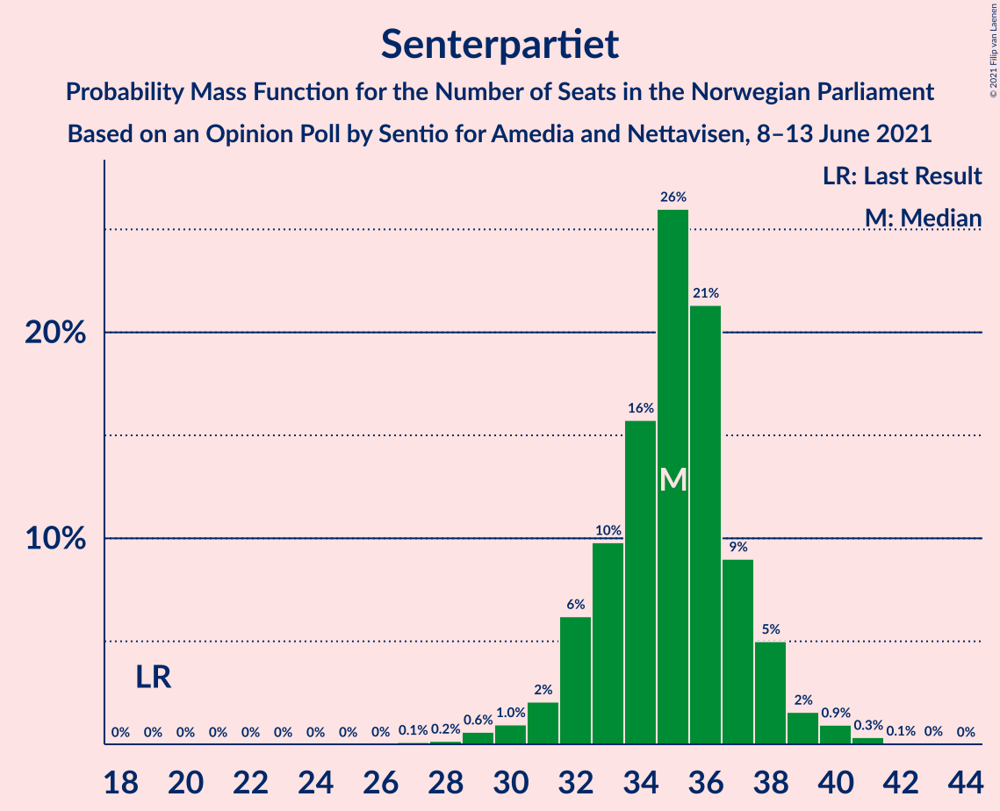
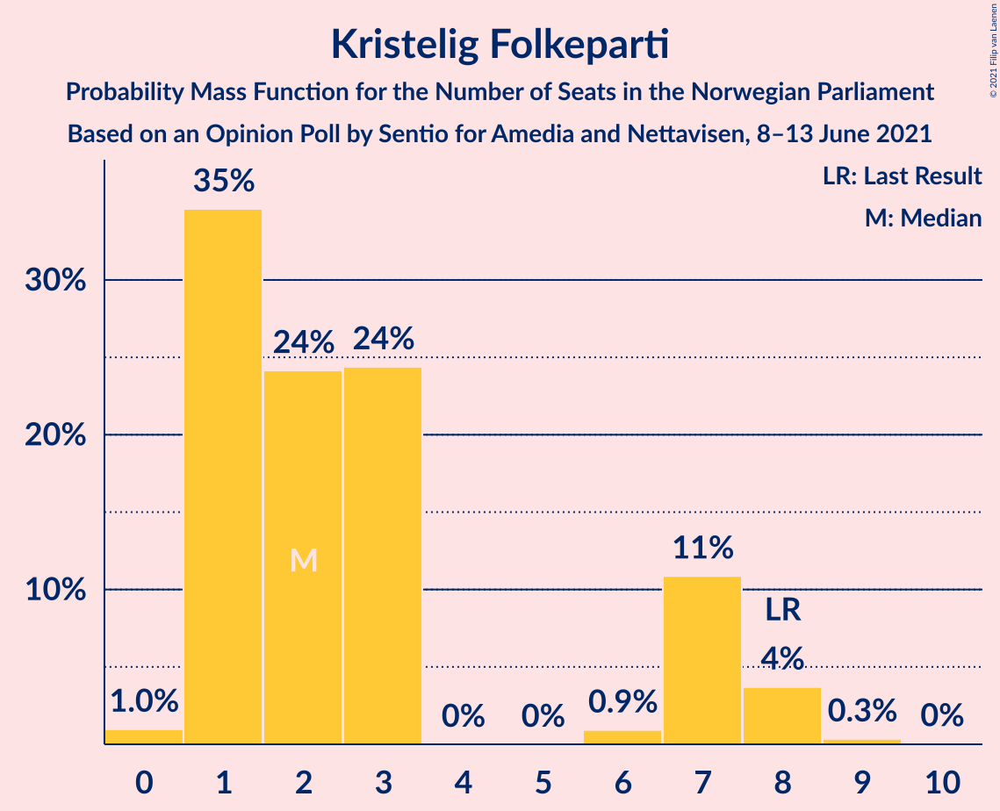
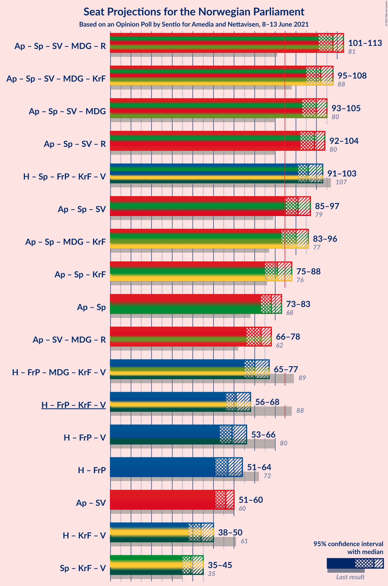
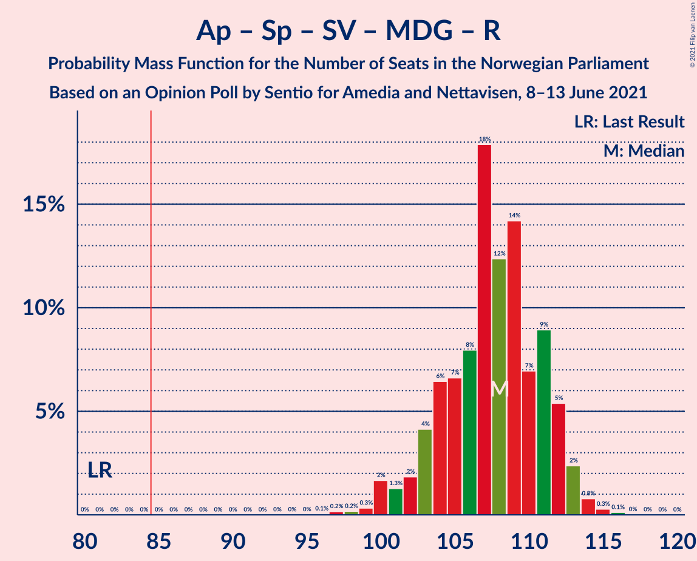
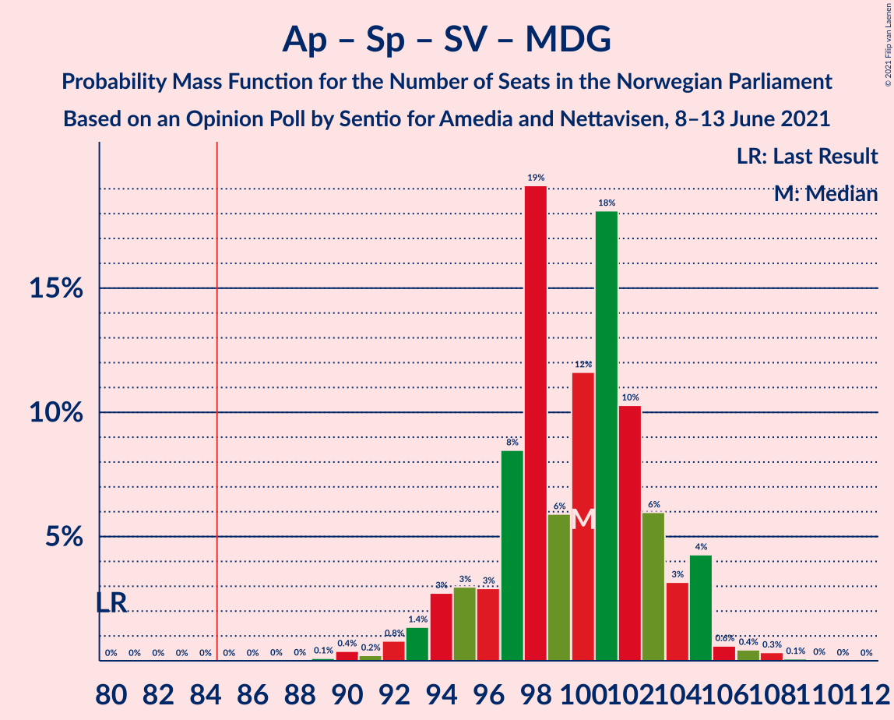
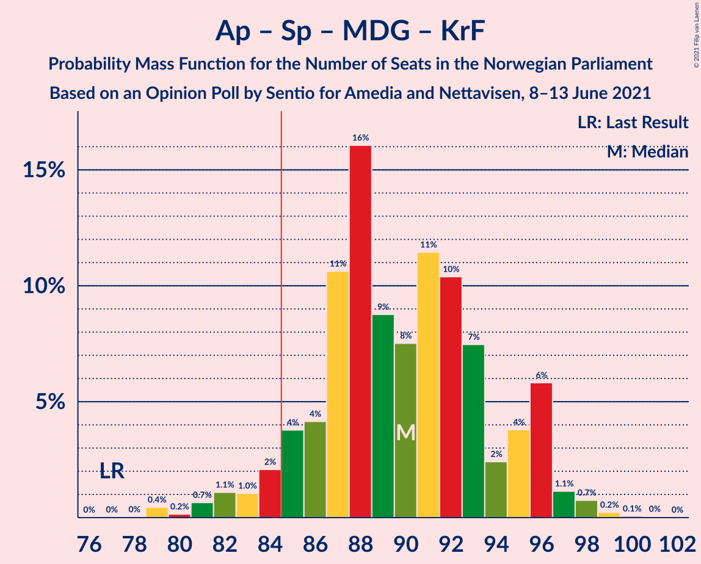
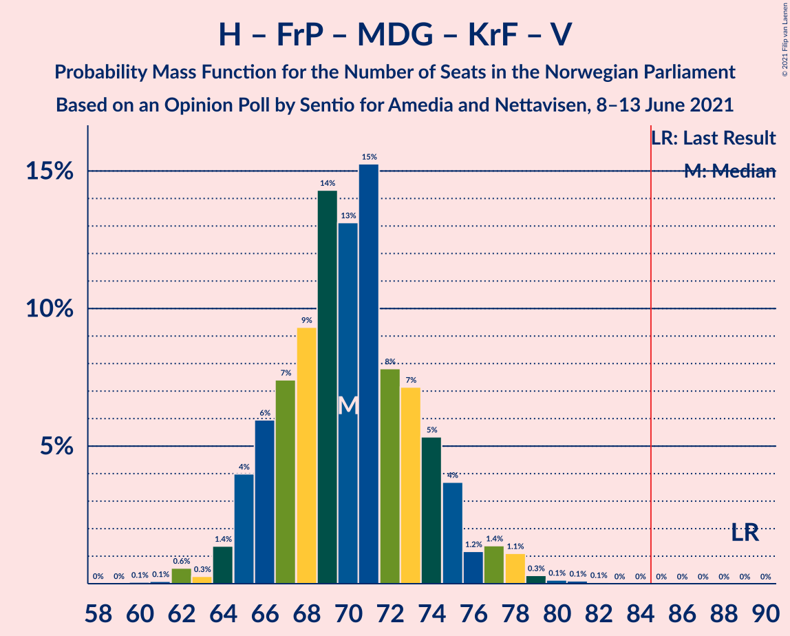

# Opinion Poll by Sentio for Amedia and Nettavisen, 8–13 June 2021

<a href="#voting-intentions">Voting Intentions</a> | <a href="#seats">Seats</a> | <a href="#coalitions">Coalitions</a> | <a href="#technical-information">Technical Information</a>

## Voting Intentions

### Confidence Intervals

| Party | Last Result | Poll Result | 80% Confidence Interval | 90% Confidence Interval | 95% Confidence Interval | 99% Confidence Interval |
|:-----:|:-----------:|:-----------:|:-----------------------:|:-----------------------:|:-----------------------:|:-----------------------:|
| Arbeiderpartiet | 27.4% | 23.9% | 22.2–25.7% |21.8–26.2% |21.4–26.6% |20.6–27.5% |
| Høyre | 25.0% | 21.9% | 20.3–23.7% |19.8–24.1% |19.4–24.6% |18.7–25.4% |
| Senterpartiet | 10.3% | 18.7% | 17.2–20.4% |16.8–20.8% |16.4–21.2% |15.7–22.1% |
| Fremskrittspartiet | 15.2% | 10.1% | 9.0–11.4% |8.6–11.8% |8.4–12.1% |7.9–12.8% |
| Sosialistisk Venstreparti | 6.0% | 7.0% | 6.1–8.2% |5.8–8.5% |5.6–8.8% |5.2–9.3% |
| Miljøpartiet De Grønne | 3.2% | 5.0% | 4.2–6.0% |4.0–6.3% |3.8–6.5% |3.5–7.1% |
| Rødt | 2.4% | 4.8% | 4.0–5.8% |3.8–6.1% |3.6–6.3% |3.3–6.8% |
| Kristelig Folkeparti | 4.2% | 3.3% | 2.7–4.1% |2.5–4.4% |2.4–4.6% |2.1–5.0% |
| Venstre | 4.4% | 2.8% | 2.2–3.6% |2.1–3.8% |1.9–4.0% |1.7–4.4% |

*Note:* The poll result column reflects the actual value used in the calculations. Published results may vary slightly, and in addition be rounded to fewer digits.

## Seats

### Confidence Intervals

| Party | Last Result | Median | 80% Confidence Interval | 90% Confidence Interval | 95% Confidence Interval | 99% Confidence Interval |
|:-----:|:-----------:|:------:|:-----------------------:|:-----------------------:|:-----------------------:|:-----------------------:|
| <a href="#arbeiderpartiet">Arbeiderpartiet</a> | 49 | 44 | 40–45 |40–46 |40–47 |38–49 |
| <a href="#høyre">Høyre</a> | 45 | 39 | 36–43 |35–44 |35–45 |33–46 |
| <a href="#senterpartiet">Senterpartiet</a> | 19 | 35 | 32–37 |32–38 |31–38 |29–41 |
| <a href="#fremskrittspartiet">Fremskrittspartiet</a> | 27 | 18 | 16–20 |15–21 |15–22 |13–23 |
| <a href="#sosialistisk-venstreparti">Sosialistisk Venstreparti</a> | 11 | 13 | 10–15 |10–15 |10–16 |9–17 |
| <a href="#miljøpartiet-de-grønne">Miljøpartiet De Grønne</a> | 1 | 9 | 8–11 |7–11 |3–12 |2–13 |
| <a href="#rødt">Rødt</a> | 1 | 9 | 2–10 |2–11 |2–11 |2–12 |
| <a href="#kristelig-folkeparti">Kristelig Folkeparti</a> | 8 | 3 | 1–7 |1–7 |1–8 |0–8 |
| <a href="#venstre">Venstre</a> | 8 | 2 | 2 |1–2 |1–7 |0–7 |

### Arbeiderpartiet

*For a full overview of the results for this party, see the [Arbeiderpartiet](party-arbeiderpartiet.html) page.*

| Number of Seats | Probability | Accumulated | Special Marks |
|:---------------:|:-----------:|:-----------:|:-------------:|
| 36 | 0% | 100% |  |
| 37 | 0.1% | 99.9% |  |
| 38 | 0.8% | 99.8% |  |
| 39 | 1.4% | 99.0% |  |
| 40 | 17% | 98% |  |
| 41 | 5% | 80% |  |
| 42 | 7% | 75% |  |
| 43 | 9% | 68% |  |
| 44 | 27% | 59% | Median |
| 45 | 25% | 32% |  |
| 46 | 3% | 7% |  |
| 47 | 2% | 4% |  |
| 48 | 1.4% | 2% |  |
| 49 | 0.3% | 0.7% | Last Result |
| 50 | 0.2% | 0.4% |  |
| 51 | 0.2% | 0.2% |  |
| 52 | 0% | 0.1% |  |
| 53 | 0% | 0% |  |

### Høyre

*For a full overview of the results for this party, see the [Høyre](party-høyre.html) page.*

| Number of Seats | Probability | Accumulated | Special Marks |
|:---------------:|:-----------:|:-----------:|:-------------:|
| 32 | 0.2% | 100% |  |
| 33 | 0.5% | 99.7% |  |
| 34 | 1.2% | 99.3% |  |
| 35 | 8% | 98% |  |
| 36 | 9% | 90% |  |
| 37 | 14% | 81% |  |
| 38 | 11% | 67% |  |
| 39 | 12% | 56% | Median |
| 40 | 8% | 44% |  |
| 41 | 20% | 36% |  |
| 42 | 3% | 15% |  |
| 43 | 6% | 13% |  |
| 44 | 3% | 7% |  |
| 45 | 4% | 4% | Last Result |
| 46 | 0.6% | 0.7% |  |
| 47 | 0% | 0.1% |  |
| 48 | 0% | 0% |  |

### Senterpartiet

*For a full overview of the results for this party, see the [Senterpartiet](party-senterpartiet.html) page.*

| Number of Seats | Probability | Accumulated | Special Marks |
|:---------------:|:-----------:|:-----------:|:-------------:|
| 19 | 0% | 100% | Last Result |
| 20 | 0% | 100% |  |
| 21 | 0% | 100% |  |
| 22 | 0% | 100% |  |
| 23 | 0% | 100% |  |
| 24 | 0% | 100% |  |
| 25 | 0% | 100% |  |
| 26 | 0% | 100% |  |
| 27 | 0.1% | 100% |  |
| 28 | 0.2% | 99.8% |  |
| 29 | 0.9% | 99.7% |  |
| 30 | 1.0% | 98.8% |  |
| 31 | 2% | 98% |  |
| 32 | 8% | 96% |  |
| 33 | 13% | 88% |  |
| 34 | 9% | 75% |  |
| 35 | 18% | 66% | Median |
| 36 | 33% | 49% |  |
| 37 | 11% | 16% |  |
| 38 | 3% | 5% |  |
| 39 | 0.9% | 2% |  |
| 40 | 0.8% | 1.4% |  |
| 41 | 0.4% | 0.5% |  |
| 42 | 0.1% | 0.1% |  |
| 43 | 0.1% | 0.1% |  |
| 44 | 0% | 0% |  |

### Fremskrittspartiet

*For a full overview of the results for this party, see the [Fremskrittspartiet](party-fremskrittspartiet.html) page.*

| Number of Seats | Probability | Accumulated | Special Marks |
|:---------------:|:-----------:|:-----------:|:-------------:|
| 13 | 0.6% | 100% |  |
| 14 | 1.0% | 99.4% |  |
| 15 | 7% | 98% |  |
| 16 | 28% | 91% |  |
| 17 | 9% | 63% |  |
| 18 | 20% | 54% | Median |
| 19 | 12% | 34% |  |
| 20 | 15% | 22% |  |
| 21 | 3% | 7% |  |
| 22 | 2% | 3% |  |
| 23 | 2% | 2% |  |
| 24 | 0.1% | 0.1% |  |
| 25 | 0% | 0% |  |
| 26 | 0% | 0% |  |
| 27 | 0% | 0% | Last Result |

### Sosialistisk Venstreparti

*For a full overview of the results for this party, see the [Sosialistisk Venstreparti](party-sosialistiskvenstreparti.html) page.*

| Number of Seats | Probability | Accumulated | Special Marks |
|:---------------:|:-----------:|:-----------:|:-------------:|
| 8 | 0.1% | 100% |  |
| 9 | 2% | 99.9% |  |
| 10 | 10% | 98% |  |
| 11 | 11% | 88% | Last Result |
| 12 | 21% | 77% |  |
| 13 | 28% | 56% | Median |
| 14 | 18% | 28% |  |
| 15 | 7% | 10% |  |
| 16 | 3% | 3% |  |
| 17 | 0.4% | 0.5% |  |
| 18 | 0.1% | 0.1% |  |
| 19 | 0% | 0% |  |

### Miljøpartiet De Grønne

*For a full overview of the results for this party, see the [Miljøpartiet De Grønne](party-miljøpartietdegrønne.html) page.*

| Number of Seats | Probability | Accumulated | Special Marks |
|:---------------:|:-----------:|:-----------:|:-------------:|
| 1 | 0.1% | 100% | Last Result |
| 2 | 2% | 99.9% |  |
| 3 | 1.1% | 98% |  |
| 4 | 1.4% | 96% |  |
| 5 | 0% | 95% |  |
| 6 | 0% | 95% |  |
| 7 | 4% | 95% |  |
| 8 | 29% | 91% |  |
| 9 | 41% | 62% | Median |
| 10 | 8% | 21% |  |
| 11 | 10% | 13% |  |
| 12 | 2% | 3% |  |
| 13 | 0.7% | 0.8% |  |
| 14 | 0% | 0% |  |

### Rødt

*For a full overview of the results for this party, see the [Rødt](party-rødt.html) page.*

| Number of Seats | Probability | Accumulated | Special Marks |
|:---------------:|:-----------:|:-----------:|:-------------:|
| 1 | 0% | 100% | Last Result |
| 2 | 15% | 100% |  |
| 3 | 0% | 85% |  |
| 4 | 0% | 85% |  |
| 5 | 0% | 85% |  |
| 6 | 0.1% | 85% |  |
| 7 | 7% | 85% |  |
| 8 | 23% | 79% |  |
| 9 | 39% | 56% | Median |
| 10 | 8% | 17% |  |
| 11 | 7% | 8% |  |
| 12 | 1.0% | 1.1% |  |
| 13 | 0.1% | 0.1% |  |
| 14 | 0% | 0% |  |

### Kristelig Folkeparti

*For a full overview of the results for this party, see the [Kristelig Folkeparti](party-kristeligfolkeparti.html) page.*

| Number of Seats | Probability | Accumulated | Special Marks |
|:---------------:|:-----------:|:-----------:|:-------------:|
| 0 | 0.7% | 100% |  |
| 1 | 32% | 99.3% |  |
| 2 | 15% | 67% |  |
| 3 | 40% | 52% | Median |
| 4 | 0% | 12% |  |
| 5 | 0% | 12% |  |
| 6 | 2% | 12% |  |
| 7 | 7% | 10% |  |
| 8 | 3% | 3% | Last Result |
| 9 | 0.2% | 0.2% |  |
| 10 | 0.1% | 0.1% |  |
| 11 | 0% | 0% |  |

### Venstre

*For a full overview of the results for this party, see the [Venstre](party-venstre.html) page.*

| Number of Seats | Probability | Accumulated | Special Marks |
|:---------------:|:-----------:|:-----------:|:-------------:|
| 0 | 0.8% | 100% |  |
| 1 | 9% | 99.2% |  |
| 2 | 87% | 90% | Median |
| 3 | 0.3% | 3% |  |
| 4 | 0% | 3% |  |
| 5 | 0% | 3% |  |
| 6 | 0.1% | 3% |  |
| 7 | 2% | 3% |  |
| 8 | 0.3% | 0.3% | Last Result |
| 9 | 0% | 0% |  |

## Coalitions

### Confidence Intervals

| Coalition | Last Result | Median | Majority? | 80% Confidence Interval | 90% Confidence Interval | 95% Confidence Interval | 99% Confidence Interval |
|:---------:|:-----------:|:------:|:---------:|:-----------------------:|:-----------------------:|:-----------------------:|:-----------------------:|
| Arbeiderpartiet – Senterpartiet – Sosialistisk Venstreparti – Miljøpartiet De Grønne – Rødt | 81 | 107 | 100% | 103–111 | 101–112 | 100–113 | 99–114 |
| Arbeiderpartiet – Senterpartiet – Sosialistisk Venstreparti – Miljøpartiet De Grønne – Kristelig Folkeparti | 88 | 103 | 100% | 98–106 | 97–107 | 96–108 | 94–110 |
| Arbeiderpartiet – Senterpartiet – Sosialistisk Venstreparti – Miljøpartiet De Grønne | 80 | 100 | 100% | 96–103 | 95–105 | 93–105 | 92–107 |
| Arbeiderpartiet – Senterpartiet – Sosialistisk Venstreparti – Rødt | 80 | 98 | 100% | 94–102 | 92–104 | 91–104 | 91–107 |
| Høyre – Senterpartiet – Fremskrittspartiet – Kristelig Folkeparti – Venstre | 107 | 97 | 100% | 93–100 | 92–101 | 91–103 | 89–104 |
| Arbeiderpartiet – Senterpartiet – Sosialistisk Venstreparti | 79 | 91 | 98% | 88–94 | 87–96 | 85–96 | 83–98 |
| Arbeiderpartiet – Senterpartiet – Miljøpartiet De Grønne – Kristelig Folkeparti | 77 | 89 | 95% | 85–94 | 84–95 | 83–96 | 80–99 |
| Arbeiderpartiet – Senterpartiet – Kristelig Folkeparti | 76 | 81 | 11% | 77–85 | 76–86 | 75–87 | 72–90 |
| Arbeiderpartiet – Senterpartiet | 68 | 78 | 0.6% | 76–81 | 75–82 | 73–83 | 70–85 |
| Høyre – Fremskrittspartiet – Miljøpartiet De Grønne – Kristelig Folkeparti – Venstre | 89 | 70 | 0% | 67–75 | 65–76 | 64–78 | 62–78 |
| Arbeiderpartiet – Sosialistisk Venstreparti – Miljøpartiet De Grønne – Rødt | 62 | 72 | 0% | 69–76 | 68–77 | 65–77 | 65–80 |
| Høyre – Fremskrittspartiet – Kristelig Folkeparti – Venstre | 88 | 62 | 0% | 58–66 | 57–68 | 56–69 | 54–69 |
| Høyre – Fremskrittspartiet – Venstre | 80 | 59 | 0% | 56–63 | 54–65 | 53–66 | 52–68 |
| Høyre – Fremskrittspartiet | 72 | 57 | 0% | 54–61 | 52–63 | 51–64 | 50–65 |
| Arbeiderpartiet – Sosialistisk Venstreparti | 60 | 56 | 0% | 53–59 | 51–59 | 51–60 | 49–62 |
| Høyre – Kristelig Folkeparti – Venstre | 61 | 44 | 0% | 40–48 | 39–50 | 38–50 | 37–52 |
| Senterpartiet – Kristelig Folkeparti – Venstre | 35 | 40 | 0% | 37–43 | 35–44 | 34–46 | 33–48 |

### Arbeiderpartiet – Senterpartiet – Sosialistisk Venstreparti – Miljøpartiet De Grønne – Rødt

| Number of Seats | Probability | Accumulated | Special Marks |
|:---------------:|:-----------:|:-----------:|:-------------:|
| 81 | 0% | 100% | Last Result |
| 82 | 0% | 100% |  |
| 83 | 0% | 100% |  |
| 84 | 0% | 100% |  |
| 85 | 0% | 100% | Majority |
| 86 | 0% | 100% |  |
| 87 | 0% | 100% |  |
| 88 | 0% | 100% |  |
| 89 | 0% | 100% |  |
| 90 | 0% | 100% |  |
| 91 | 0% | 100% |  |
| 92 | 0% | 100% |  |
| 93 | 0% | 100% |  |
| 94 | 0% | 100% |  |
| 95 | 0% | 100% |  |
| 96 | 0% | 100% |  |
| 97 | 0% | 99.9% |  |
| 98 | 0.1% | 99.9% |  |
| 99 | 0.3% | 99.8% |  |
| 100 | 4% | 99.5% |  |
| 101 | 0.8% | 95% |  |
| 102 | 3% | 94% |  |
| 103 | 4% | 92% |  |
| 104 | 3% | 88% |  |
| 105 | 10% | 85% |  |
| 106 | 5% | 75% |  |
| 107 | 25% | 71% |  |
| 108 | 7% | 46% |  |
| 109 | 14% | 39% |  |
| 110 | 9% | 25% | Median |
| 111 | 8% | 16% |  |
| 112 | 6% | 9% |  |
| 113 | 1.5% | 3% |  |
| 114 | 0.7% | 1.1% |  |
| 115 | 0.3% | 0.4% |  |
| 116 | 0.1% | 0.1% |  |
| 117 | 0% | 0% |  |

### Arbeiderpartiet – Senterpartiet – Sosialistisk Venstreparti – Miljøpartiet De Grønne – Kristelig Folkeparti

| Number of Seats | Probability | Accumulated | Special Marks |
|:---------------:|:-----------:|:-----------:|:-------------:|
| 88 | 0% | 100% | Last Result |
| 89 | 0% | 100% |  |
| 90 | 0% | 100% |  |
| 91 | 0.1% | 100% |  |
| 92 | 0% | 99.9% |  |
| 93 | 0.3% | 99.8% |  |
| 94 | 0.1% | 99.5% |  |
| 95 | 2% | 99.4% |  |
| 96 | 2% | 98% |  |
| 97 | 3% | 95% |  |
| 98 | 3% | 92% |  |
| 99 | 7% | 89% |  |
| 100 | 6% | 82% |  |
| 101 | 21% | 76% |  |
| 102 | 5% | 56% |  |
| 103 | 10% | 50% |  |
| 104 | 21% | 40% | Median |
| 105 | 9% | 20% |  |
| 106 | 5% | 11% |  |
| 107 | 2% | 6% |  |
| 108 | 3% | 4% |  |
| 109 | 0.7% | 2% |  |
| 110 | 0.6% | 0.9% |  |
| 111 | 0.2% | 0.3% |  |
| 112 | 0% | 0.1% |  |
| 113 | 0.1% | 0.1% |  |
| 114 | 0% | 0% |  |

### Arbeiderpartiet – Senterpartiet – Sosialistisk Venstreparti – Miljøpartiet De Grønne

| Number of Seats | Probability | Accumulated | Special Marks |
|:---------------:|:-----------:|:-----------:|:-------------:|
| 80 | 0% | 100% | Last Result |
| 81 | 0% | 100% |  |
| 82 | 0% | 100% |  |
| 83 | 0% | 100% |  |
| 84 | 0% | 100% |  |
| 85 | 0% | 100% | Majority |
| 86 | 0% | 100% |  |
| 87 | 0% | 100% |  |
| 88 | 0% | 100% |  |
| 89 | 0.2% | 100% |  |
| 90 | 0.1% | 99.8% |  |
| 91 | 0.1% | 99.7% |  |
| 92 | 2% | 99.6% |  |
| 93 | 0.9% | 98% |  |
| 94 | 2% | 97% |  |
| 95 | 3% | 95% |  |
| 96 | 4% | 92% |  |
| 97 | 7% | 89% |  |
| 98 | 25% | 81% |  |
| 99 | 6% | 56% |  |
| 100 | 10% | 51% |  |
| 101 | 18% | 40% | Median |
| 102 | 5% | 22% |  |
| 103 | 10% | 17% |  |
| 104 | 1.0% | 7% |  |
| 105 | 5% | 6% |  |
| 106 | 0.5% | 1.1% |  |
| 107 | 0.2% | 0.6% |  |
| 108 | 0.1% | 0.3% |  |
| 109 | 0.2% | 0.2% |  |
| 110 | 0.1% | 0.1% |  |
| 111 | 0% | 0% |  |

### Arbeiderpartiet – Senterpartiet – Sosialistisk Venstreparti – Rødt

| Number of Seats | Probability | Accumulated | Special Marks |
|:---------------:|:-----------:|:-----------:|:-------------:|
| 80 | 0% | 100% | Last Result |
| 81 | 0% | 100% |  |
| 82 | 0% | 100% |  |
| 83 | 0% | 100% |  |
| 84 | 0% | 100% |  |
| 85 | 0% | 100% | Majority |
| 86 | 0% | 100% |  |
| 87 | 0% | 100% |  |
| 88 | 0.1% | 99.9% |  |
| 89 | 0.1% | 99.9% |  |
| 90 | 0.1% | 99.8% |  |
| 91 | 4% | 99.6% |  |
| 92 | 1.1% | 96% |  |
| 93 | 1.0% | 95% |  |
| 94 | 7% | 94% |  |
| 95 | 4% | 87% |  |
| 96 | 3% | 82% |  |
| 97 | 7% | 80% |  |
| 98 | 24% | 73% |  |
| 99 | 8% | 50% |  |
| 100 | 9% | 42% |  |
| 101 | 14% | 33% | Median |
| 102 | 10% | 19% |  |
| 103 | 3% | 9% |  |
| 104 | 4% | 6% |  |
| 105 | 0.6% | 2% |  |
| 106 | 0.3% | 2% |  |
| 107 | 1.1% | 1.2% |  |
| 108 | 0.1% | 0.1% |  |
| 109 | 0% | 0% |  |

### Høyre – Senterpartiet – Fremskrittspartiet – Kristelig Folkeparti – Venstre

| Number of Seats | Probability | Accumulated | Special Marks |
|:---------------:|:-----------:|:-----------:|:-------------:|
| 87 | 0% | 100% |  |
| 88 | 0.3% | 99.9% |  |
| 89 | 0.3% | 99.6% |  |
| 90 | 1.0% | 99.3% |  |
| 91 | 1.1% | 98% |  |
| 92 | 4% | 97% |  |
| 93 | 17% | 93% |  |
| 94 | 6% | 77% |  |
| 95 | 13% | 70% |  |
| 96 | 5% | 58% |  |
| 97 | 5% | 53% | Median |
| 98 | 22% | 48% |  |
| 99 | 12% | 26% |  |
| 100 | 4% | 13% |  |
| 101 | 5% | 9% |  |
| 102 | 2% | 5% |  |
| 103 | 0.5% | 3% |  |
| 104 | 2% | 2% |  |
| 105 | 0.2% | 0.4% |  |
| 106 | 0.1% | 0.2% |  |
| 107 | 0% | 0.1% | Last Result |
| 108 | 0.1% | 0.1% |  |
| 109 | 0% | 0% |  |

### Arbeiderpartiet – Senterpartiet – Sosialistisk Venstreparti

| Number of Seats | Probability | Accumulated | Special Marks |
|:---------------:|:-----------:|:-----------:|:-------------:|
| 79 | 0% | 100% | Last Result |
| 80 | 0% | 100% |  |
| 81 | 0% | 100% |  |
| 82 | 0.1% | 99.9% |  |
| 83 | 0.9% | 99.8% |  |
| 84 | 1.0% | 99.0% |  |
| 85 | 2% | 98% | Majority |
| 86 | 0.8% | 96% |  |
| 87 | 5% | 95% |  |
| 88 | 6% | 91% |  |
| 89 | 23% | 84% |  |
| 90 | 6% | 62% |  |
| 91 | 9% | 55% |  |
| 92 | 19% | 47% | Median |
| 93 | 16% | 28% |  |
| 94 | 3% | 12% |  |
| 95 | 2% | 8% |  |
| 96 | 5% | 7% |  |
| 97 | 1.2% | 2% |  |
| 98 | 0.3% | 0.6% |  |
| 99 | 0.1% | 0.4% |  |
| 100 | 0.1% | 0.3% |  |
| 101 | 0.2% | 0.2% |  |
| 102 | 0% | 0% |  |

### Arbeiderpartiet – Senterpartiet – Miljøpartiet De Grønne – Kristelig Folkeparti

| Number of Seats | Probability | Accumulated | Special Marks |
|:---------------:|:-----------:|:-----------:|:-------------:|
| 77 | 0% | 100% | Last Result |
| 78 | 0% | 100% |  |
| 79 | 0.3% | 100% |  |
| 80 | 0.2% | 99.7% |  |
| 81 | 0.1% | 99.5% |  |
| 82 | 2% | 99.3% |  |
| 83 | 1.2% | 98% |  |
| 84 | 2% | 96% |  |
| 85 | 6% | 95% | Majority |
| 86 | 4% | 89% |  |
| 87 | 5% | 85% |  |
| 88 | 27% | 80% |  |
| 89 | 5% | 53% |  |
| 90 | 10% | 48% |  |
| 91 | 5% | 39% | Median |
| 92 | 16% | 34% |  |
| 93 | 7% | 18% |  |
| 94 | 3% | 11% |  |
| 95 | 5% | 7% |  |
| 96 | 0.6% | 3% |  |
| 97 | 0.4% | 2% |  |
| 98 | 0.9% | 2% |  |
| 99 | 0.5% | 0.6% |  |
| 100 | 0% | 0.1% |  |
| 101 | 0.1% | 0.1% |  |
| 102 | 0% | 0% |  |

### Arbeiderpartiet – Senterpartiet – Kristelig Folkeparti

| Number of Seats | Probability | Accumulated | Special Marks |
|:---------------:|:-----------:|:-----------:|:-------------:|
| 70 | 0.1% | 100% |  |
| 71 | 0% | 99.9% |  |
| 72 | 0.4% | 99.9% |  |
| 73 | 0.8% | 99.5% |  |
| 74 | 0.1% | 98.7% |  |
| 75 | 2% | 98.5% |  |
| 76 | 2% | 97% | Last Result |
| 77 | 8% | 95% |  |
| 78 | 2% | 87% |  |
| 79 | 21% | 85% |  |
| 80 | 14% | 64% |  |
| 81 | 14% | 50% |  |
| 82 | 5% | 36% | Median |
| 83 | 10% | 31% |  |
| 84 | 10% | 21% |  |
| 85 | 3% | 11% | Majority |
| 86 | 4% | 8% |  |
| 87 | 2% | 4% |  |
| 88 | 0.6% | 2% |  |
| 89 | 0.4% | 2% |  |
| 90 | 1.2% | 1.4% |  |
| 91 | 0% | 0.1% |  |
| 92 | 0.1% | 0.1% |  |
| 93 | 0% | 0% |  |

### Arbeiderpartiet – Senterpartiet

| Number of Seats | Probability | Accumulated | Special Marks |
|:---------------:|:-----------:|:-----------:|:-------------:|
| 68 | 0% | 100% | Last Result |
| 69 | 0.1% | 100% |  |
| 70 | 0.6% | 99.8% |  |
| 71 | 0.6% | 99.2% |  |
| 72 | 0.6% | 98.6% |  |
| 73 | 1.3% | 98% |  |
| 74 | 2% | 97% |  |
| 75 | 4% | 95% |  |
| 76 | 25% | 91% |  |
| 77 | 7% | 67% |  |
| 78 | 15% | 59% |  |
| 79 | 11% | 44% | Median |
| 80 | 10% | 33% |  |
| 81 | 14% | 24% |  |
| 82 | 5% | 9% |  |
| 83 | 3% | 5% |  |
| 84 | 0.6% | 1.2% |  |
| 85 | 0.2% | 0.6% | Majority |
| 86 | 0.1% | 0.4% |  |
| 87 | 0.3% | 0.3% |  |
| 88 | 0% | 0% |  |

### Høyre – Fremskrittspartiet – Miljøpartiet De Grønne – Kristelig Folkeparti – Venstre

| Number of Seats | Probability | Accumulated | Special Marks |
|:---------------:|:-----------:|:-----------:|:-------------:|
| 60 | 0.1% | 100% |  |
| 61 | 0.1% | 99.9% |  |
| 62 | 1.1% | 99.8% |  |
| 63 | 0.3% | 98.7% |  |
| 64 | 0.9% | 98% |  |
| 65 | 4% | 97% |  |
| 66 | 3% | 93% |  |
| 67 | 10% | 90% |  |
| 68 | 14% | 80% |  |
| 69 | 9% | 66% |  |
| 70 | 8% | 57% |  |
| 71 | 23% | 50% | Median |
| 72 | 7% | 27% |  |
| 73 | 2% | 20% |  |
| 74 | 4% | 17% |  |
| 75 | 7% | 13% |  |
| 76 | 1.0% | 6% |  |
| 77 | 1.0% | 5% |  |
| 78 | 4% | 4% |  |
| 79 | 0.1% | 0.3% |  |
| 80 | 0.1% | 0.2% |  |
| 81 | 0.1% | 0.1% |  |
| 82 | 0% | 0.1% |  |
| 83 | 0% | 0% |  |
| 84 | 0% | 0% |  |
| 85 | 0% | 0% | Majority |
| 86 | 0% | 0% |  |
| 87 | 0% | 0% |  |
| 88 | 0% | 0% |  |
| 89 | 0% | 0% | Last Result |

### Arbeiderpartiet – Sosialistisk Venstreparti – Miljøpartiet De Grønne – Rødt

| Number of Seats | Probability | Accumulated | Special Marks |
|:---------------:|:-----------:|:-----------:|:-------------:|
| 61 | 0.1% | 100% |  |
| 62 | 0% | 99.9% | Last Result |
| 63 | 0.1% | 99.9% |  |
| 64 | 0.2% | 99.8% |  |
| 65 | 2% | 99.6% |  |
| 66 | 0.6% | 97% |  |
| 67 | 2% | 97% |  |
| 68 | 5% | 95% |  |
| 69 | 4% | 91% |  |
| 70 | 12% | 87% |  |
| 71 | 23% | 74% |  |
| 72 | 5% | 52% |  |
| 73 | 5% | 47% |  |
| 74 | 13% | 42% |  |
| 75 | 6% | 29% | Median |
| 76 | 17% | 23% |  |
| 77 | 4% | 6% |  |
| 78 | 0.9% | 2% |  |
| 79 | 0.7% | 1.3% |  |
| 80 | 0.2% | 0.6% |  |
| 81 | 0.3% | 0.4% |  |
| 82 | 0% | 0.1% |  |
| 83 | 0% | 0% |  |

### Høyre – Fremskrittspartiet – Kristelig Folkeparti – Venstre

| Number of Seats | Probability | Accumulated | Special Marks |
|:---------------:|:-----------:|:-----------:|:-------------:|
| 53 | 0.2% | 100% |  |
| 54 | 0.3% | 99.8% |  |
| 55 | 0.7% | 99.5% |  |
| 56 | 2% | 98.8% |  |
| 57 | 6% | 97% |  |
| 58 | 8% | 91% |  |
| 59 | 9% | 83% |  |
| 60 | 14% | 74% |  |
| 61 | 7% | 61% |  |
| 62 | 25% | 54% | Median |
| 63 | 5% | 29% |  |
| 64 | 10% | 24% |  |
| 65 | 3% | 14% |  |
| 66 | 4% | 12% |  |
| 67 | 3% | 8% |  |
| 68 | 0.8% | 5% |  |
| 69 | 4% | 5% |  |
| 70 | 0.3% | 0.5% |  |
| 71 | 0.1% | 0.2% |  |
| 72 | 0% | 0.1% |  |
| 73 | 0% | 0.1% |  |
| 74 | 0% | 0% |  |
| 75 | 0% | 0% |  |
| 76 | 0% | 0% |  |
| 77 | 0% | 0% |  |
| 78 | 0% | 0% |  |
| 79 | 0% | 0% |  |
| 80 | 0% | 0% |  |
| 81 | 0% | 0% |  |
| 82 | 0% | 0% |  |
| 83 | 0% | 0% |  |
| 84 | 0% | 0% |  |
| 85 | 0% | 0% | Majority |
| 86 | 0% | 0% |  |
| 87 | 0% | 0% |  |
| 88 | 0% | 0% | Last Result |

### Høyre – Fremskrittspartiet – Venstre

| Number of Seats | Probability | Accumulated | Special Marks |
|:---------------:|:-----------:|:-----------:|:-------------:|
| 49 | 0.1% | 100% |  |
| 50 | 0.1% | 99.9% |  |
| 51 | 0.2% | 99.8% |  |
| 52 | 0.5% | 99.6% |  |
| 53 | 2% | 99.1% |  |
| 54 | 3% | 97% |  |
| 55 | 3% | 95% |  |
| 56 | 20% | 91% |  |
| 57 | 13% | 72% |  |
| 58 | 4% | 59% |  |
| 59 | 20% | 55% | Median |
| 60 | 4% | 35% |  |
| 61 | 13% | 32% |  |
| 62 | 6% | 19% |  |
| 63 | 5% | 13% |  |
| 64 | 1.5% | 8% |  |
| 65 | 2% | 7% |  |
| 66 | 4% | 5% |  |
| 67 | 0.1% | 0.6% |  |
| 68 | 0.4% | 0.5% |  |
| 69 | 0% | 0.1% |  |
| 70 | 0% | 0% |  |
| 71 | 0% | 0% |  |
| 72 | 0% | 0% |  |
| 73 | 0% | 0% |  |
| 74 | 0% | 0% |  |
| 75 | 0% | 0% |  |
| 76 | 0% | 0% |  |
| 77 | 0% | 0% |  |
| 78 | 0% | 0% |  |
| 79 | 0% | 0% |  |
| 80 | 0% | 0% | Last Result |

### Høyre – Fremskrittspartiet

| Number of Seats | Probability | Accumulated | Special Marks |
|:---------------:|:-----------:|:-----------:|:-------------:|
| 47 | 0.1% | 100% |  |
| 48 | 0.1% | 99.9% |  |
| 49 | 0.3% | 99.9% |  |
| 50 | 0.6% | 99.6% |  |
| 51 | 2% | 99.0% |  |
| 52 | 3% | 97% |  |
| 53 | 3% | 95% |  |
| 54 | 17% | 92% |  |
| 55 | 16% | 74% |  |
| 56 | 4% | 58% |  |
| 57 | 19% | 55% | Median |
| 58 | 5% | 36% |  |
| 59 | 12% | 30% |  |
| 60 | 6% | 18% |  |
| 61 | 4% | 12% |  |
| 62 | 3% | 8% |  |
| 63 | 0.7% | 6% |  |
| 64 | 4% | 5% |  |
| 65 | 0.2% | 0.7% |  |
| 66 | 0.4% | 0.5% |  |
| 67 | 0% | 0.1% |  |
| 68 | 0% | 0% |  |
| 69 | 0% | 0% |  |
| 70 | 0% | 0% |  |
| 71 | 0% | 0% |  |
| 72 | 0% | 0% | Last Result |

### Arbeiderpartiet – Sosialistisk Venstreparti

| Number of Seats | Probability | Accumulated | Special Marks |
|:---------------:|:-----------:|:-----------:|:-------------:|
| 48 | 0.1% | 100% |  |
| 49 | 0.6% | 99.9% |  |
| 50 | 0.7% | 99.3% |  |
| 51 | 4% | 98.7% |  |
| 52 | 2% | 95% |  |
| 53 | 18% | 93% |  |
| 54 | 10% | 74% |  |
| 55 | 6% | 64% |  |
| 56 | 9% | 58% |  |
| 57 | 23% | 50% | Median |
| 58 | 6% | 27% |  |
| 59 | 16% | 20% |  |
| 60 | 2% | 4% | Last Result |
| 61 | 2% | 2% |  |
| 62 | 0.2% | 0.7% |  |
| 63 | 0.2% | 0.5% |  |
| 64 | 0.1% | 0.3% |  |
| 65 | 0.1% | 0.2% |  |
| 66 | 0% | 0% |  |

### Høyre – Kristelig Folkeparti – Venstre

| Number of Seats | Probability | Accumulated | Special Marks |
|:---------------:|:-----------:|:-----------:|:-------------:|
| 35 | 0% | 100% |  |
| 36 | 0.1% | 99.9% |  |
| 37 | 0.8% | 99.9% |  |
| 38 | 2% | 99.0% |  |
| 39 | 3% | 97% |  |
| 40 | 13% | 94% |  |
| 41 | 6% | 82% |  |
| 42 | 13% | 75% |  |
| 43 | 12% | 63% |  |
| 44 | 9% | 51% | Median |
| 45 | 3% | 41% |  |
| 46 | 22% | 38% |  |
| 47 | 4% | 15% |  |
| 48 | 3% | 11% |  |
| 49 | 2% | 8% |  |
| 50 | 4% | 5% |  |
| 51 | 0.7% | 1.2% |  |
| 52 | 0.3% | 0.5% |  |
| 53 | 0.1% | 0.2% |  |
| 54 | 0.1% | 0.2% |  |
| 55 | 0% | 0% |  |
| 56 | 0% | 0% |  |
| 57 | 0% | 0% |  |
| 58 | 0% | 0% |  |
| 59 | 0% | 0% |  |
| 60 | 0% | 0% |  |
| 61 | 0% | 0% | Last Result |

### Senterpartiet – Kristelig Folkeparti – Venstre

| Number of Seats | Probability | Accumulated | Special Marks |
|:---------------:|:-----------:|:-----------:|:-------------:|
| 31 | 0.1% | 100% |  |
| 32 | 0.3% | 99.9% |  |
| 33 | 0.5% | 99.6% |  |
| 34 | 2% | 99.1% |  |
| 35 | 4% | 97% | Last Result |
| 36 | 2% | 93% |  |
| 37 | 9% | 91% |  |
| 38 | 18% | 82% |  |
| 39 | 12% | 64% |  |
| 40 | 9% | 52% | Median |
| 41 | 27% | 43% |  |
| 42 | 5% | 17% |  |
| 43 | 3% | 11% |  |
| 44 | 3% | 8% |  |
| 45 | 2% | 5% |  |
| 46 | 1.0% | 3% |  |
| 47 | 1.0% | 2% |  |
| 48 | 0.2% | 0.6% |  |
| 49 | 0.2% | 0.4% |  |
| 50 | 0.1% | 0.1% |  |
| 51 | 0% | 0% |  |

## Technical Information

### Opinion Poll

+ **Polling firm:** Sentio
+ **Commissioner(s):** Amedia and Nettavisen
+ **Fieldwork period:** 8–13 June 2021

### Calculations

+ **Sample size:** 1000
+ **Simulations done:** 262,144
+ **Error estimate:** 3.02%

