# Opinion Poll by Respons for Bergens Tidende and VG, 9–14 June 2021

<a href="#voting-intentions">Voting Intentions</a> | <a href="#seats">Seats</a> | <a href="#coalitions">Coalitions</a> | <a href="#technical-information">Technical Information</a>

## Voting Intentions

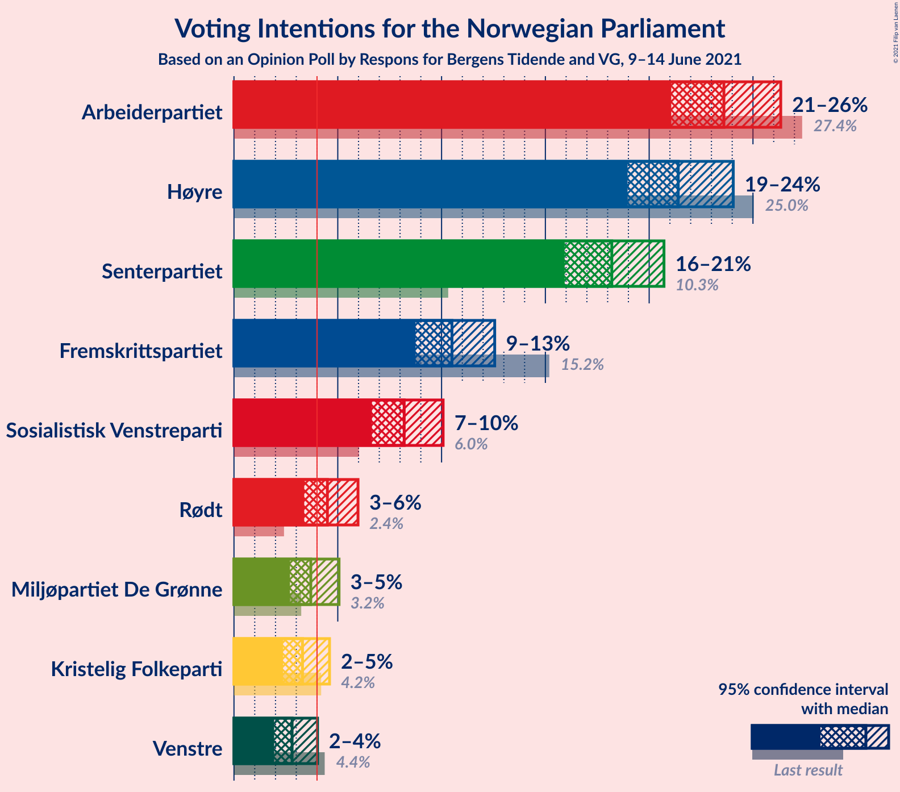

### Confidence Intervals

| Party | Last Result | Poll Result | 80% Confidence Interval | 90% Confidence Interval | 95% Confidence Interval | 99% Confidence Interval |
|:-----:|:-----------:|:-----------:|:-----------------------:|:-----------------------:|:-----------------------:|:-----------------------:|
| Arbeiderpartiet | 27.4% | 23.6% | 21.9–25.4% |21.5–25.9% |21.1–26.3% |20.3–27.2% |
| Høyre | 25.0% | 21.4% | 19.8–23.1% |19.4–23.6% |19.0–24.1% |18.2–24.9% |
| Senterpartiet | 10.3% | 18.2% | 16.7–19.8% |16.3–20.3% |15.9–20.7% |15.2–21.5% |
| Fremskrittspartiet | 15.2% | 10.5% | 9.3–11.8% |9.0–12.2% |8.7–12.6% |8.2–13.2% |
| Sosialistisk Venstreparti | 6.0% | 8.2% | 7.2–9.4% |6.9–9.8% |6.6–10.1% |6.2–10.7% |
| Rødt | 2.4% | 4.5% | 3.8–5.5% |3.6–5.7% |3.4–6.0% |3.0–6.5% |
| Miljøpartiet De Grønne | 3.2% | 3.7% | 3.0–4.6% |2.9–4.8% |2.7–5.1% |2.4–5.5% |
| Kristelig Folkeparti | 4.2% | 3.3% | 2.7–4.1% |2.5–4.4% |2.4–4.6% |2.1–5.0% |
| Venstre | 4.4% | 2.8% | 2.2–3.6% |2.1–3.8% |1.9–4.0% |1.7–4.4% |

*Note:* The poll result column reflects the actual value used in the calculations. Published results may vary slightly, and in addition be rounded to fewer digits.

## Seats

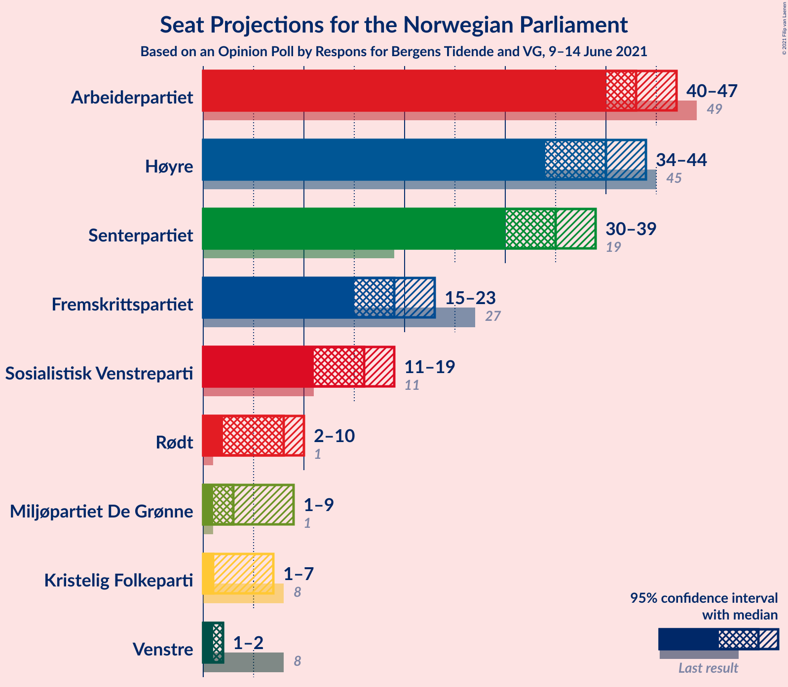

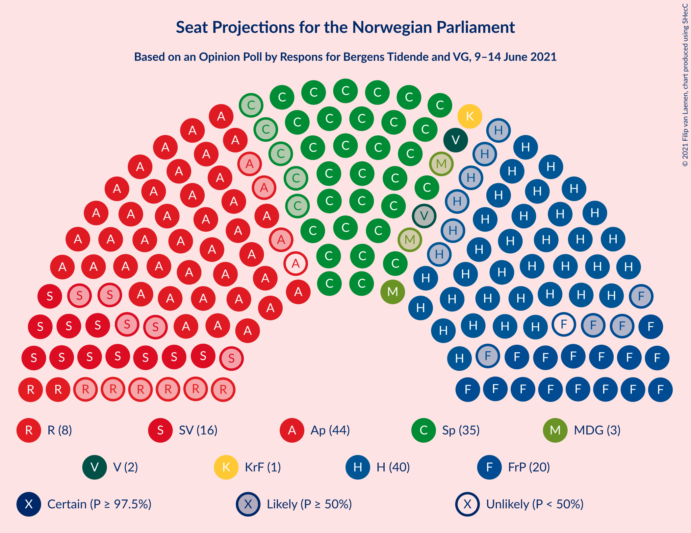

### Confidence Intervals

| Party | Last Result | Median | 80% Confidence Interval | 90% Confidence Interval | 95% Confidence Interval | 99% Confidence Interval |
|:-----:|:-----------:|:------:|:-----------------------:|:-----------------------:|:-----------------------:|:-----------------------:|
| <a href="#arbeiderpartiet">Arbeiderpartiet</a> | 49 | 43 | 40–45 |40–46 |40–47 |38–49 |
| <a href="#høyre">Høyre</a> | 45 | 40 | 35–42 |34–44 |34–44 |33–47 |
| <a href="#senterpartiet">Senterpartiet</a> | 19 | 35 | 33–37 |31–38 |30–39 |27–40 |
| <a href="#fremskrittspartiet">Fremskrittspartiet</a> | 27 | 19 | 16–21 |16–23 |15–23 |14–24 |
| <a href="#sosialistisk-venstreparti">Sosialistisk Venstreparti</a> | 11 | 16 | 12–17 |12–18 |11–19 |10–20 |
| <a href="#rødt">Rødt</a> | 1 | 8 | 2–9 |2–10 |2–10 |2–12 |
| <a href="#miljøpartiet-de-grønne">Miljøpartiet De Grønne</a> | 1 | 3 | 2–9 |1–9 |1–9 |1–9 |
| <a href="#kristelig-folkeparti">Kristelig Folkeparti</a> | 8 | 1 | 1–3 |1–7 |1–7 |1–9 |
| <a href="#venstre">Venstre</a> | 8 | 2 | 2 |2 |1–2 |0–7 |

### Arbeiderpartiet

*For a full overview of the results for this party, see the [Arbeiderpartiet](party-arbeiderpartiet.html) page.*

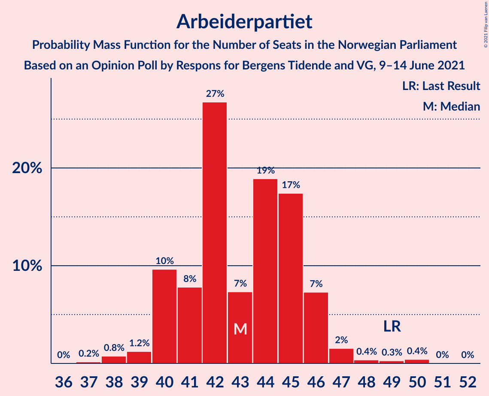

| Number of Seats | Probability | Accumulated | Special Marks |
|:---------------:|:-----------:|:-----------:|:-------------:|
| 37 | 0.2% | 100% |  |
| 38 | 0.8% | 99.8% |  |
| 39 | 1.2% | 99.0% |  |
| 40 | 10% | 98% |  |
| 41 | 8% | 88% |  |
| 42 | 27% | 80% |  |
| 43 | 7% | 54% | Median |
| 44 | 19% | 46% |  |
| 45 | 17% | 27% |  |
| 46 | 7% | 10% |  |
| 47 | 2% | 3% |  |
| 48 | 0.4% | 1.1% |  |
| 49 | 0.3% | 0.8% | Last Result |
| 50 | 0.4% | 0.5% |  |
| 51 | 0% | 0.1% |  |
| 52 | 0% | 0% |  |

### Høyre

*For a full overview of the results for this party, see the [Høyre](party-høyre.html) page.*

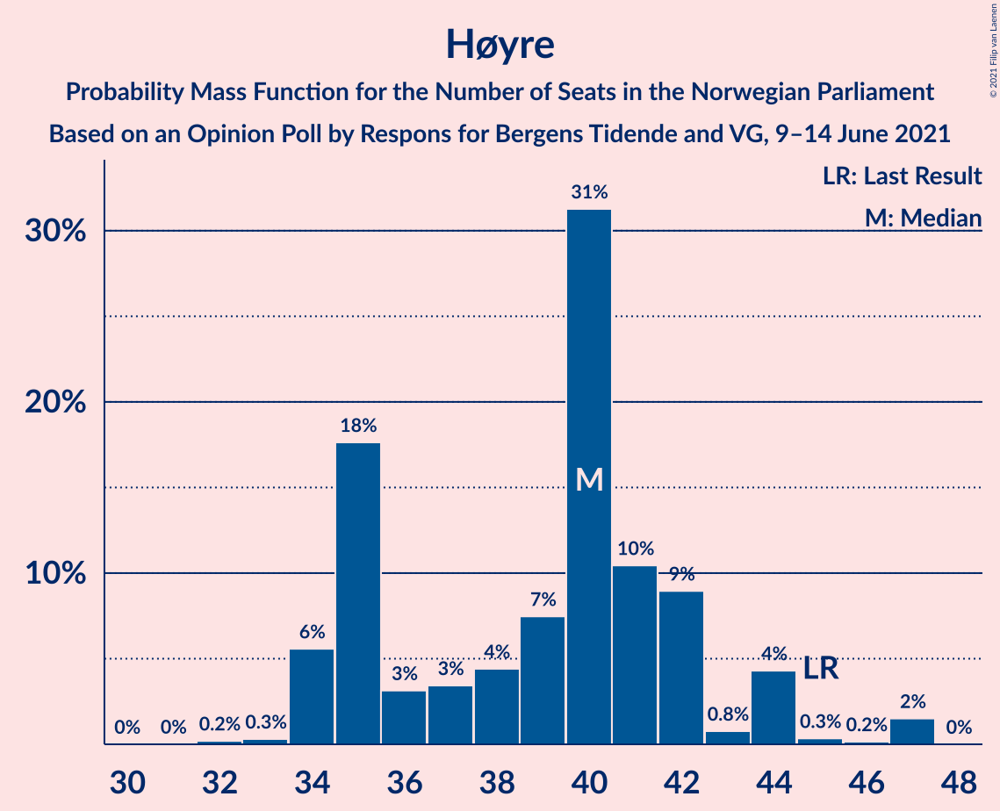

| Number of Seats | Probability | Accumulated | Special Marks |
|:---------------:|:-----------:|:-----------:|:-------------:|
| 32 | 0.2% | 100% |  |
| 33 | 0.3% | 99.8% |  |
| 34 | 6% | 99.5% |  |
| 35 | 18% | 94% |  |
| 36 | 3% | 76% |  |
| 37 | 3% | 73% |  |
| 38 | 4% | 70% |  |
| 39 | 7% | 65% |  |
| 40 | 31% | 58% | Median |
| 41 | 10% | 27% |  |
| 42 | 9% | 16% |  |
| 43 | 0.8% | 7% |  |
| 44 | 4% | 6% |  |
| 45 | 0.3% | 2% | Last Result |
| 46 | 0.2% | 2% |  |
| 47 | 2% | 2% |  |
| 48 | 0% | 0% |  |

### Senterpartiet

*For a full overview of the results for this party, see the [Senterpartiet](party-senterpartiet.html) page.*

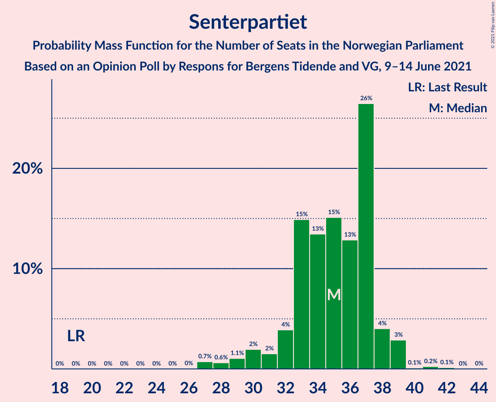

| Number of Seats | Probability | Accumulated | Special Marks |
|:---------------:|:-----------:|:-----------:|:-------------:|
| 19 | 0% | 100% | Last Result |
| 20 | 0% | 100% |  |
| 21 | 0% | 100% |  |
| 22 | 0% | 100% |  |
| 23 | 0% | 100% |  |
| 24 | 0% | 100% |  |
| 25 | 0% | 100% |  |
| 26 | 0% | 100% |  |
| 27 | 0.7% | 100% |  |
| 28 | 0.6% | 99.2% |  |
| 29 | 1.1% | 98.6% |  |
| 30 | 2% | 98% |  |
| 31 | 2% | 96% |  |
| 32 | 4% | 94% |  |
| 33 | 15% | 90% |  |
| 34 | 13% | 75% |  |
| 35 | 15% | 62% | Median |
| 36 | 13% | 47% |  |
| 37 | 26% | 34% |  |
| 38 | 4% | 7% |  |
| 39 | 3% | 3% |  |
| 40 | 0.1% | 0.5% |  |
| 41 | 0.2% | 0.4% |  |
| 42 | 0.1% | 0.2% |  |
| 43 | 0% | 0% |  |

### Fremskrittspartiet

*For a full overview of the results for this party, see the [Fremskrittspartiet](party-fremskrittspartiet.html) page.*

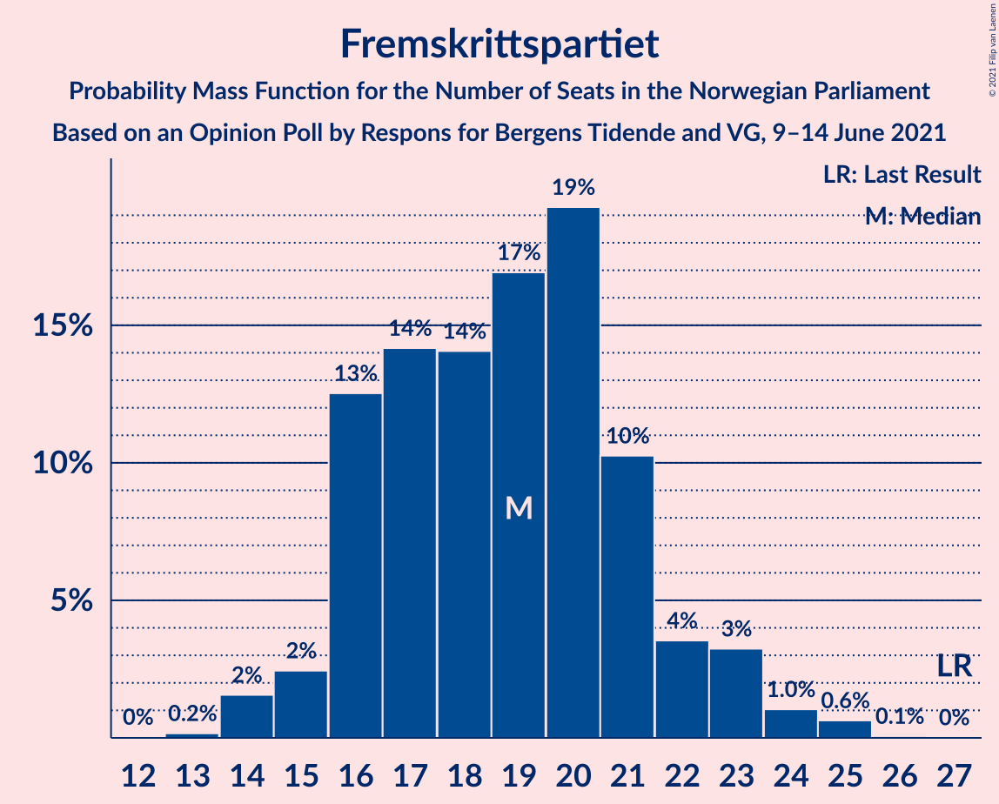

| Number of Seats | Probability | Accumulated | Special Marks |
|:---------------:|:-----------:|:-----------:|:-------------:|
| 12 | 0.1% | 100% |  |
| 13 | 0.1% | 99.9% |  |
| 14 | 1.1% | 99.9% |  |
| 15 | 2% | 98.8% |  |
| 16 | 8% | 96% |  |
| 17 | 17% | 89% |  |
| 18 | 20% | 72% |  |
| 19 | 6% | 52% | Median |
| 20 | 33% | 47% |  |
| 21 | 6% | 14% |  |
| 22 | 0.9% | 8% |  |
| 23 | 6% | 7% |  |
| 24 | 0.4% | 0.8% |  |
| 25 | 0.3% | 0.4% |  |
| 26 | 0.1% | 0.1% |  |
| 27 | 0% | 0% | Last Result |

### Sosialistisk Venstreparti

*For a full overview of the results for this party, see the [Sosialistisk Venstreparti](party-sosialistiskvenstreparti.html) page.*

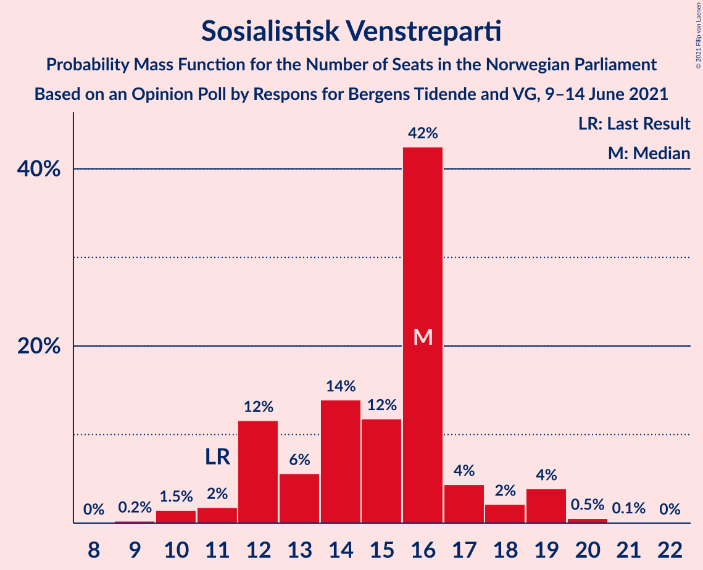

| Number of Seats | Probability | Accumulated | Special Marks |
|:---------------:|:-----------:|:-----------:|:-------------:|
| 9 | 0.2% | 100% |  |
| 10 | 1.5% | 99.8% |  |
| 11 | 2% | 98% | Last Result |
| 12 | 12% | 97% |  |
| 13 | 6% | 85% |  |
| 14 | 14% | 79% |  |
| 15 | 12% | 65% |  |
| 16 | 42% | 54% | Median |
| 17 | 4% | 11% |  |
| 18 | 2% | 7% |  |
| 19 | 4% | 5% |  |
| 20 | 0.5% | 0.7% |  |
| 21 | 0.1% | 0.2% |  |
| 22 | 0% | 0% |  |

### Rødt

*For a full overview of the results for this party, see the [Rødt](party-rødt.html) page.*

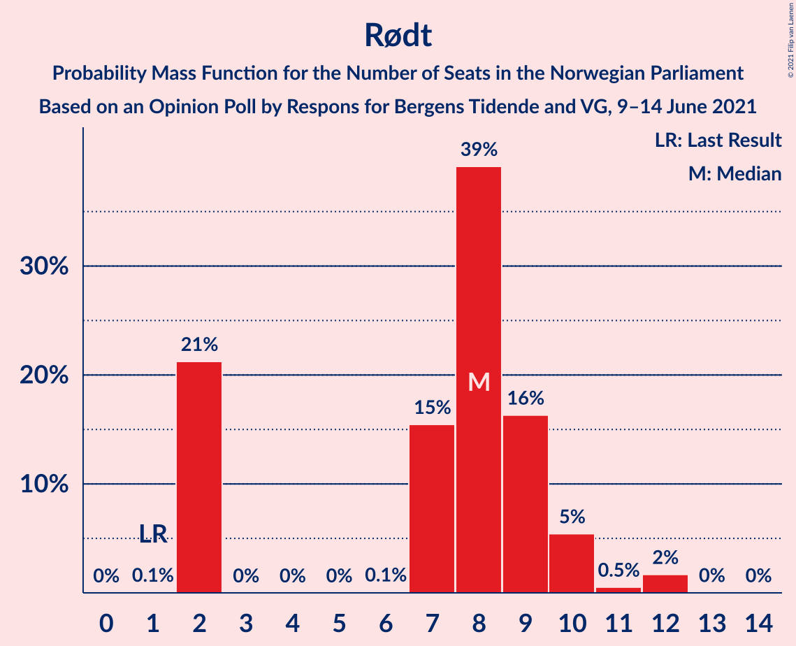

| Number of Seats | Probability | Accumulated | Special Marks |
|:---------------:|:-----------:|:-----------:|:-------------:|
| 1 | 0.1% | 100% | Last Result |
| 2 | 21% | 99.9% |  |
| 3 | 0% | 79% |  |
| 4 | 0% | 79% |  |
| 5 | 0% | 79% |  |
| 6 | 0.1% | 79% |  |
| 7 | 15% | 79% |  |
| 8 | 39% | 63% | Median |
| 9 | 16% | 24% |  |
| 10 | 5% | 8% |  |
| 11 | 0.5% | 2% |  |
| 12 | 2% | 2% |  |
| 13 | 0% | 0.1% |  |
| 14 | 0% | 0% |  |

### Miljøpartiet De Grønne

*For a full overview of the results for this party, see the [Miljøpartiet De Grønne](party-miljøpartietdegrønne.html) page.*

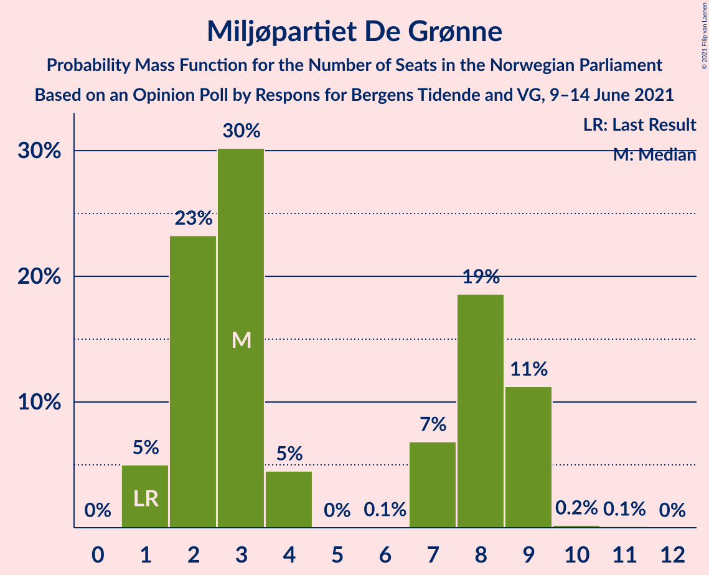

| Number of Seats | Probability | Accumulated | Special Marks |
|:---------------:|:-----------:|:-----------:|:-------------:|
| 1 | 5% | 100% | Last Result |
| 2 | 23% | 95% |  |
| 3 | 30% | 72% | Median |
| 4 | 5% | 42% |  |
| 5 | 0% | 37% |  |
| 6 | 0.1% | 37% |  |
| 7 | 7% | 37% |  |
| 8 | 19% | 30% |  |
| 9 | 11% | 12% |  |
| 10 | 0.2% | 0.3% |  |
| 11 | 0.1% | 0.1% |  |
| 12 | 0% | 0% |  |

### Kristelig Folkeparti

*For a full overview of the results for this party, see the [Kristelig Folkeparti](party-kristeligfolkeparti.html) page.*

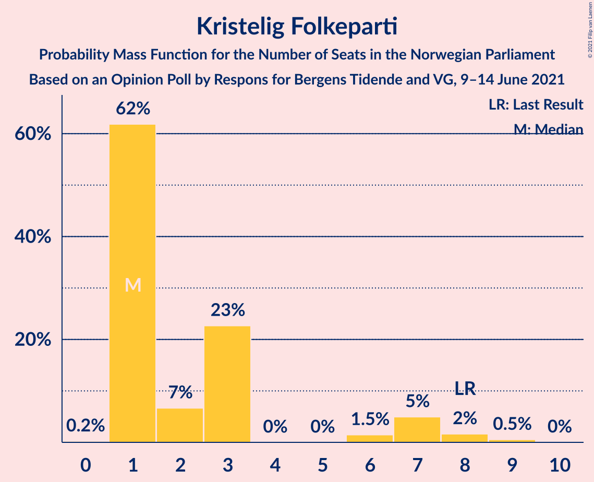

| Number of Seats | Probability | Accumulated | Special Marks |
|:---------------:|:-----------:|:-----------:|:-------------:|
| 0 | 0.2% | 100% |  |
| 1 | 62% | 99.8% | Median |
| 2 | 7% | 38% |  |
| 3 | 23% | 31% |  |
| 4 | 0% | 9% |  |
| 5 | 0% | 9% |  |
| 6 | 1.5% | 9% |  |
| 7 | 5% | 7% |  |
| 8 | 2% | 2% | Last Result |
| 9 | 0.5% | 0.6% |  |
| 10 | 0% | 0% |  |

### Venstre

*For a full overview of the results for this party, see the [Venstre](party-venstre.html) page.*

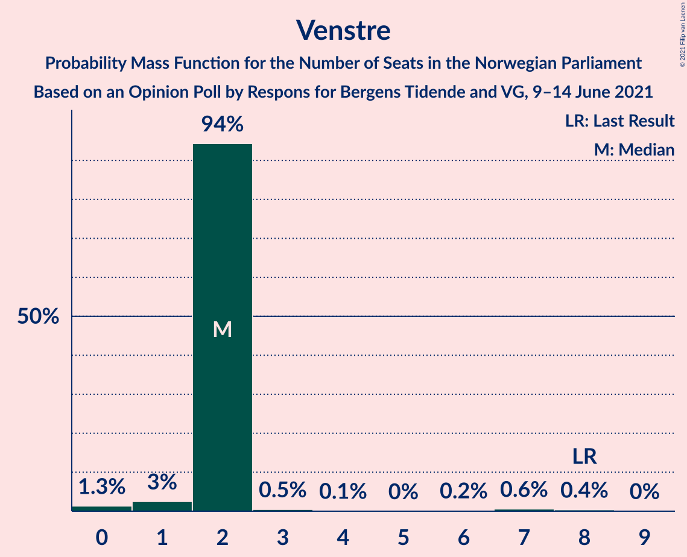

| Number of Seats | Probability | Accumulated | Special Marks |
|:---------------:|:-----------:|:-----------:|:-------------:|
| 0 | 1.3% | 100% |  |
| 1 | 3% | 98.7% |  |
| 2 | 94% | 96% | Median |
| 3 | 0.5% | 2% |  |
| 4 | 0.1% | 1.3% |  |
| 5 | 0% | 1.2% |  |
| 6 | 0.2% | 1.2% |  |
| 7 | 0.6% | 1.0% |  |
| 8 | 0.4% | 0.4% | Last Result |
| 9 | 0% | 0% |  |

## Coalitions

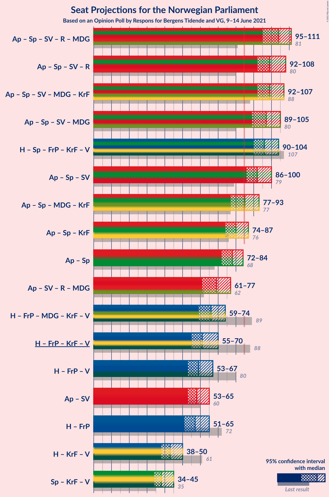

### Confidence Intervals

| Coalition | Last Result | Median | Majority? | 80% Confidence Interval | 90% Confidence Interval | 95% Confidence Interval | 99% Confidence Interval |
|:---------:|:-----------:|:------:|:---------:|:-----------------------:|:-----------------------:|:-----------------------:|:-----------------------:|
| Arbeiderpartiet – Senterpartiet – Sosialistisk Venstreparti – Rødt – Miljøpartiet De Grønne | 81 | 106 | 100% | 100–109 | 98–110 | 95–111 | 93–112 |
| Arbeiderpartiet – Senterpartiet – Sosialistisk Venstreparti – Miljøpartiet De Grønne – Kristelig Folkeparti | 88 | 99 | 100% | 94–106 | 93–106 | 91–107 | 90–107 |
| Arbeiderpartiet – Senterpartiet – Sosialistisk Venstreparti – Rødt | 80 | 101 | 100% | 96–103 | 93–104 | 93–106 | 90–110 |
| Arbeiderpartiet – Senterpartiet – Sosialistisk Venstreparti – Miljøpartiet De Grønne | 80 | 98 | 99.7% | 92–104 | 92–105 | 90–105 | 86–105 |
| Høyre – Senterpartiet – Fremskrittspartiet – Kristelig Folkeparti – Venstre | 107 | 98 | 100% | 90–102 | 90–102 | 90–102 | 88–105 |
| Arbeiderpartiet – Senterpartiet – Sosialistisk Venstreparti | 79 | 94 | 98.7% | 89–96 | 88–98 | 86–102 | 83–102 |
| Arbeiderpartiet – Senterpartiet – Miljøpartiet De Grønne – Kristelig Folkeparti | 77 | 83 | 42% | 78–90 | 77–92 | 76–93 | 74–93 |
| Arbeiderpartiet – Senterpartiet – Kristelig Folkeparti | 76 | 80 | 10% | 75–85 | 74–86 | 73–86 | 71–88 |
| Arbeiderpartiet – Senterpartiet | 68 | 79 | 0.6% | 74–80 | 73–81 | 71–83 | 69–86 |
| Høyre – Fremskrittspartiet – Miljøpartiet De Grønne – Kristelig Folkeparti – Venstre | 89 | 66 | 0% | 62–71 | 59–71 | 58–72 | 58–74 |
| Høyre – Fremskrittspartiet – Kristelig Folkeparti – Venstre | 88 | 62 | 0% | 57–67 | 56–68 | 56–70 | 55–71 |
| Høyre – Fremskrittspartiet – Venstre | 80 | 61 | 0% | 54–64 | 53–67 | 53–68 | 51–69 |
| Høyre – Fremskrittspartiet | 72 | 59 | 0% | 52–61 | 51–65 | 51–66 | 49–67 |
| Arbeiderpartiet – Sosialistisk Venstreparti | 60 | 58 | 0% | 54–61 | 53–63 | 53–63 | 51–66 |
| Høyre – Kristelig Folkeparti – Venstre | 61 | 43 | 0% | 40–46 | 38–47 | 38–50 | 37–51 |
| Senterpartiet – Kristelig Folkeparti – Venstre | 35 | 39 | 0% | 37–43 | 35–44 | 34–44 | 32–46 |

### Arbeiderpartiet – Senterpartiet – Sosialistisk Venstreparti – Rødt – Miljøpartiet De Grønne

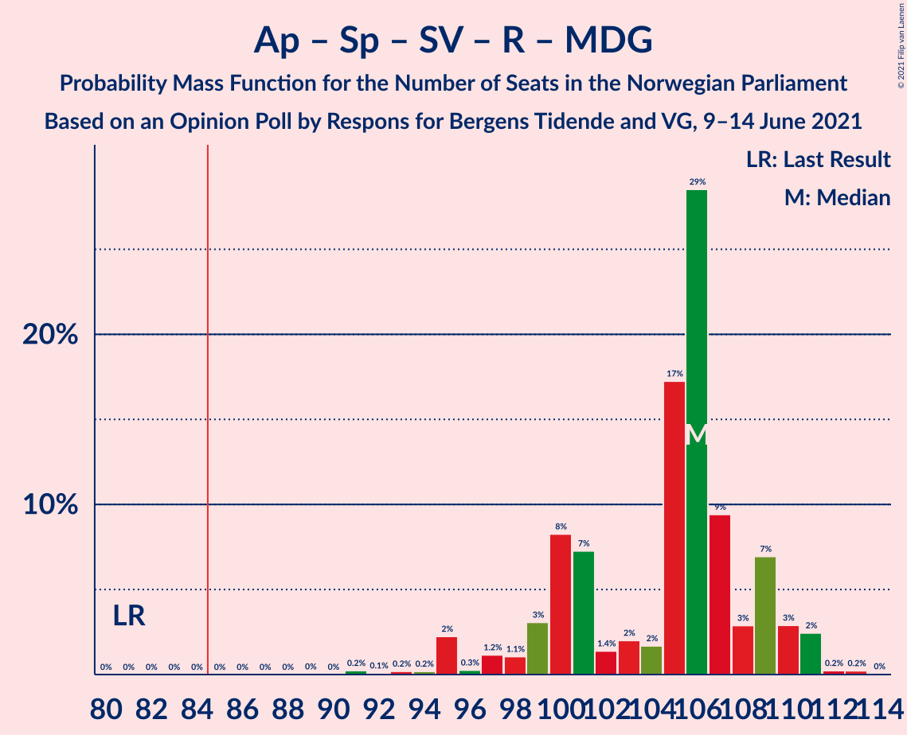

| Number of Seats | Probability | Accumulated | Special Marks |
|:---------------:|:-----------:|:-----------:|:-------------:|
| 81 | 0% | 100% | Last Result |
| 82 | 0% | 100% |  |
| 83 | 0% | 100% |  |
| 84 | 0% | 100% |  |
| 85 | 0% | 100% | Majority |
| 86 | 0% | 100% |  |
| 87 | 0% | 100% |  |
| 88 | 0% | 100% |  |
| 89 | 0% | 100% |  |
| 90 | 0% | 100% |  |
| 91 | 0.2% | 100% |  |
| 92 | 0.1% | 99.7% |  |
| 93 | 0.2% | 99.6% |  |
| 94 | 0.2% | 99.4% |  |
| 95 | 2% | 99.3% |  |
| 96 | 0.3% | 97% |  |
| 97 | 1.2% | 97% |  |
| 98 | 1.1% | 96% |  |
| 99 | 3% | 95% |  |
| 100 | 8% | 91% |  |
| 101 | 7% | 83% |  |
| 102 | 1.4% | 76% |  |
| 103 | 2% | 75% |  |
| 104 | 2% | 73% |  |
| 105 | 17% | 71% | Median |
| 106 | 29% | 54% |  |
| 107 | 9% | 25% |  |
| 108 | 3% | 16% |  |
| 109 | 7% | 13% |  |
| 110 | 3% | 6% |  |
| 111 | 2% | 3% |  |
| 112 | 0.2% | 0.5% |  |
| 113 | 0.2% | 0.3% |  |
| 114 | 0% | 0% |  |

### Arbeiderpartiet – Senterpartiet – Sosialistisk Venstreparti – Miljøpartiet De Grønne – Kristelig Folkeparti

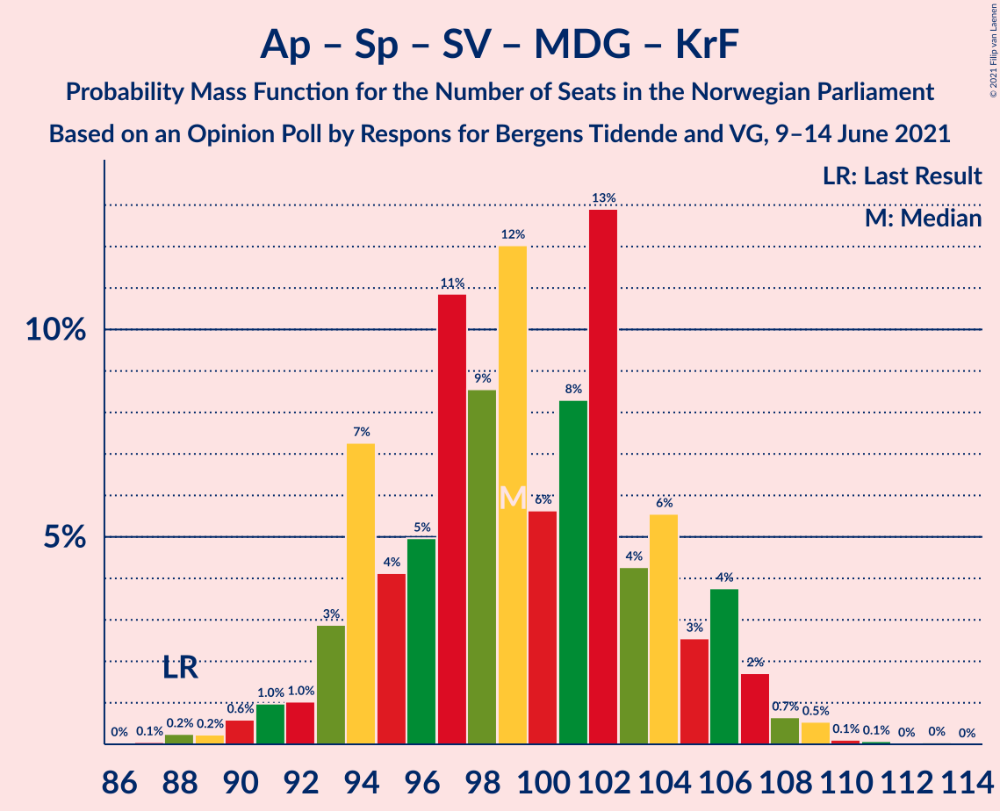

| Number of Seats | Probability | Accumulated | Special Marks |
|:---------------:|:-----------:|:-----------:|:-------------:|
| 87 | 0.1% | 100% |  |
| 88 | 0.1% | 99.9% | Last Result |
| 89 | 0.2% | 99.8% |  |
| 90 | 0.4% | 99.6% |  |
| 91 | 2% | 99.2% |  |
| 92 | 1.0% | 97% |  |
| 93 | 6% | 96% |  |
| 94 | 2% | 90% |  |
| 95 | 3% | 89% |  |
| 96 | 5% | 86% |  |
| 97 | 2% | 80% |  |
| 98 | 9% | 79% | Median |
| 99 | 26% | 70% |  |
| 100 | 2% | 44% |  |
| 101 | 15% | 42% |  |
| 102 | 2% | 26% |  |
| 103 | 3% | 25% |  |
| 104 | 4% | 21% |  |
| 105 | 1.4% | 17% |  |
| 106 | 12% | 15% |  |
| 107 | 3% | 3% |  |
| 108 | 0.1% | 0.5% |  |
| 109 | 0.4% | 0.4% |  |
| 110 | 0% | 0.1% |  |
| 111 | 0% | 0.1% |  |
| 112 | 0% | 0% |  |

### Arbeiderpartiet – Senterpartiet – Sosialistisk Venstreparti – Rødt

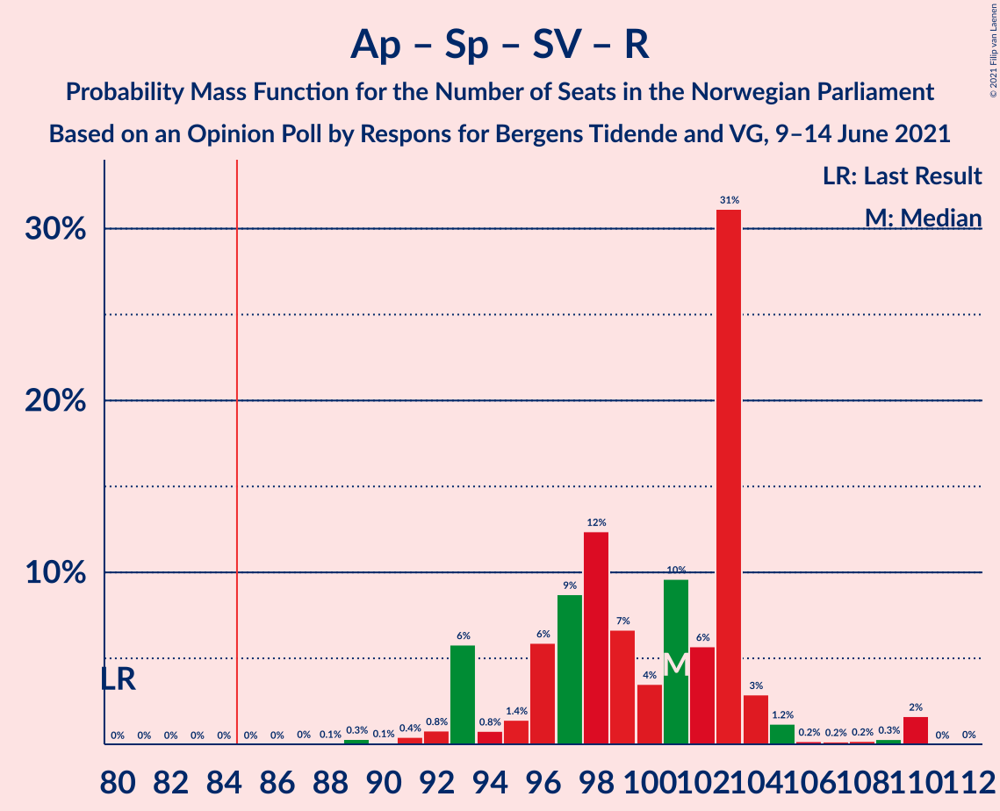

| Number of Seats | Probability | Accumulated | Special Marks |
|:---------------:|:-----------:|:-----------:|:-------------:|
| 80 | 0% | 100% | Last Result |
| 81 | 0% | 100% |  |
| 82 | 0% | 100% |  |
| 83 | 0% | 100% |  |
| 84 | 0% | 100% |  |
| 85 | 0% | 100% | Majority |
| 86 | 0% | 100% |  |
| 87 | 0% | 100% |  |
| 88 | 0.1% | 99.9% |  |
| 89 | 0.3% | 99.9% |  |
| 90 | 0.1% | 99.6% |  |
| 91 | 0.4% | 99.5% |  |
| 92 | 0.8% | 99.1% |  |
| 93 | 6% | 98% |  |
| 94 | 0.8% | 92% |  |
| 95 | 1.4% | 92% |  |
| 96 | 6% | 90% |  |
| 97 | 9% | 84% |  |
| 98 | 12% | 76% |  |
| 99 | 7% | 63% |  |
| 100 | 4% | 57% |  |
| 101 | 10% | 53% |  |
| 102 | 6% | 43% | Median |
| 103 | 31% | 38% |  |
| 104 | 3% | 7% |  |
| 105 | 1.2% | 4% |  |
| 106 | 0.2% | 3% |  |
| 107 | 0.2% | 2% |  |
| 108 | 0.2% | 2% |  |
| 109 | 0.3% | 2% |  |
| 110 | 2% | 2% |  |
| 111 | 0% | 0.1% |  |
| 112 | 0% | 0% |  |

### Arbeiderpartiet – Senterpartiet – Sosialistisk Venstreparti – Miljøpartiet De Grønne

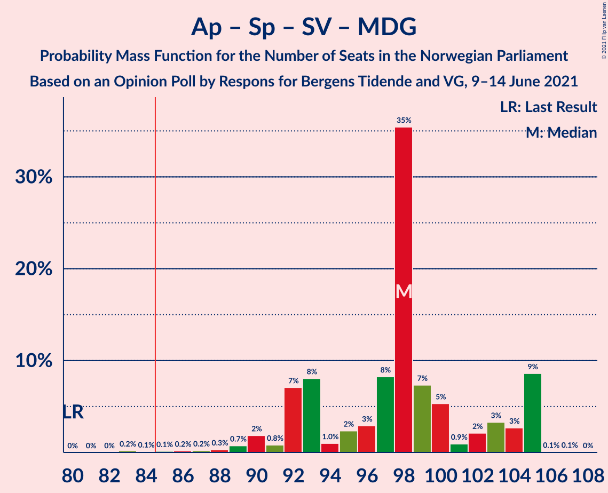

| Number of Seats | Probability | Accumulated | Special Marks |
|:---------------:|:-----------:|:-----------:|:-------------:|
| 80 | 0% | 100% | Last Result |
| 81 | 0% | 100% |  |
| 82 | 0% | 100% |  |
| 83 | 0.2% | 100% |  |
| 84 | 0.1% | 99.8% |  |
| 85 | 0.1% | 99.7% | Majority |
| 86 | 0.2% | 99.6% |  |
| 87 | 0.2% | 99.4% |  |
| 88 | 0.3% | 99.2% |  |
| 89 | 0.7% | 98.9% |  |
| 90 | 2% | 98% |  |
| 91 | 0.8% | 96% |  |
| 92 | 7% | 95% |  |
| 93 | 8% | 88% |  |
| 94 | 1.0% | 80% |  |
| 95 | 2% | 79% |  |
| 96 | 3% | 77% |  |
| 97 | 8% | 74% | Median |
| 98 | 35% | 66% |  |
| 99 | 7% | 30% |  |
| 100 | 5% | 23% |  |
| 101 | 0.9% | 18% |  |
| 102 | 2% | 17% |  |
| 103 | 3% | 15% |  |
| 104 | 3% | 11% |  |
| 105 | 9% | 9% |  |
| 106 | 0.1% | 0.1% |  |
| 107 | 0.1% | 0.1% |  |
| 108 | 0% | 0% |  |

### Høyre – Senterpartiet – Fremskrittspartiet – Kristelig Folkeparti – Venstre

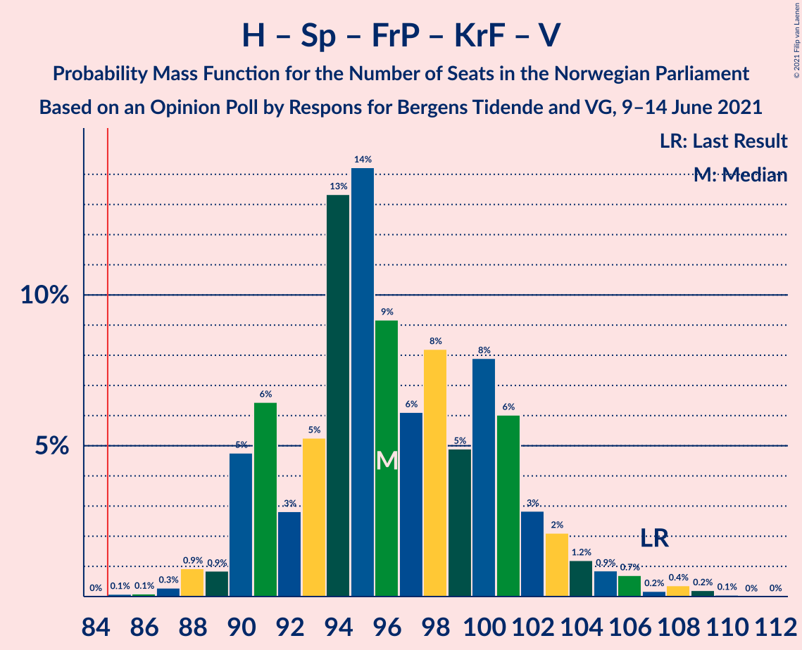

| Number of Seats | Probability | Accumulated | Special Marks |
|:---------------:|:-----------:|:-----------:|:-------------:|
| 85 | 0% | 100% | Majority |
| 86 | 0% | 99.9% |  |
| 87 | 0.1% | 99.9% |  |
| 88 | 0.4% | 99.8% |  |
| 89 | 0.2% | 99.4% |  |
| 90 | 11% | 99.2% |  |
| 91 | 3% | 88% |  |
| 92 | 3% | 85% |  |
| 93 | 5% | 82% |  |
| 94 | 10% | 77% |  |
| 95 | 1.3% | 67% |  |
| 96 | 2% | 66% |  |
| 97 | 14% | 64% | Median |
| 98 | 7% | 51% |  |
| 99 | 2% | 44% |  |
| 100 | 28% | 41% |  |
| 101 | 0.7% | 13% |  |
| 102 | 11% | 12% |  |
| 103 | 0.6% | 2% |  |
| 104 | 0.7% | 1.2% |  |
| 105 | 0.2% | 0.5% |  |
| 106 | 0.1% | 0.3% |  |
| 107 | 0% | 0.2% | Last Result |
| 108 | 0.1% | 0.1% |  |
| 109 | 0% | 0% |  |

### Arbeiderpartiet – Senterpartiet – Sosialistisk Venstreparti

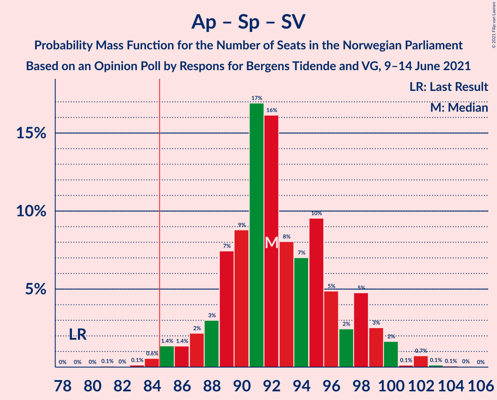

| Number of Seats | Probability | Accumulated | Special Marks |
|:---------------:|:-----------:|:-----------:|:-------------:|
| 79 | 0% | 100% | Last Result |
| 80 | 0% | 100% |  |
| 81 | 0.3% | 100% |  |
| 82 | 0.1% | 99.7% |  |
| 83 | 0.2% | 99.7% |  |
| 84 | 0.7% | 99.4% |  |
| 85 | 0.5% | 98.7% | Majority |
| 86 | 0.9% | 98% |  |
| 87 | 0.6% | 97% |  |
| 88 | 3% | 97% |  |
| 89 | 4% | 94% |  |
| 90 | 15% | 89% |  |
| 91 | 12% | 75% |  |
| 92 | 6% | 63% |  |
| 93 | 1.4% | 57% |  |
| 94 | 10% | 56% | Median |
| 95 | 29% | 46% |  |
| 96 | 10% | 17% |  |
| 97 | 0.4% | 7% |  |
| 98 | 2% | 6% |  |
| 99 | 0.4% | 4% |  |
| 100 | 1.1% | 4% |  |
| 101 | 0% | 3% |  |
| 102 | 3% | 3% |  |
| 103 | 0.2% | 0.3% |  |
| 104 | 0% | 0% |  |

### Arbeiderpartiet – Senterpartiet – Miljøpartiet De Grønne – Kristelig Folkeparti

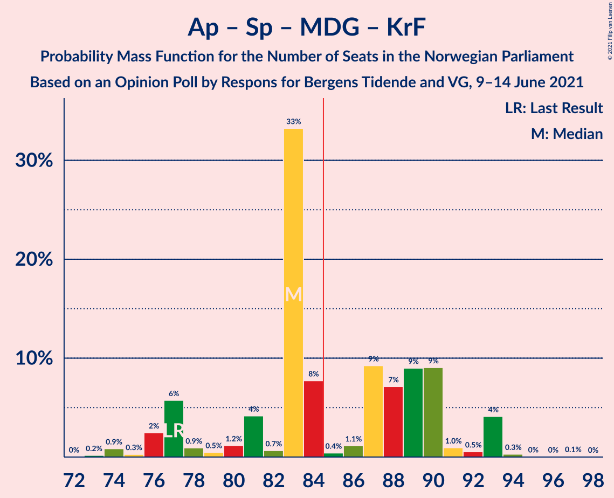

| Number of Seats | Probability | Accumulated | Special Marks |
|:---------------:|:-----------:|:-----------:|:-------------:|
| 73 | 0.2% | 100% |  |
| 74 | 0.9% | 99.8% |  |
| 75 | 0.3% | 98.9% |  |
| 76 | 2% | 98.7% |  |
| 77 | 6% | 96% | Last Result |
| 78 | 0.9% | 90% |  |
| 79 | 0.5% | 90% |  |
| 80 | 1.2% | 89% |  |
| 81 | 4% | 88% |  |
| 82 | 0.7% | 84% | Median |
| 83 | 33% | 83% |  |
| 84 | 8% | 50% |  |
| 85 | 0.4% | 42% | Majority |
| 86 | 1.1% | 42% |  |
| 87 | 9% | 41% |  |
| 88 | 7% | 31% |  |
| 89 | 9% | 24% |  |
| 90 | 9% | 15% |  |
| 91 | 1.0% | 6% |  |
| 92 | 0.5% | 5% |  |
| 93 | 4% | 5% |  |
| 94 | 0.3% | 0.5% |  |
| 95 | 0% | 0.2% |  |
| 96 | 0% | 0.1% |  |
| 97 | 0.1% | 0.1% |  |
| 98 | 0% | 0% |  |

### Arbeiderpartiet – Senterpartiet – Kristelig Folkeparti

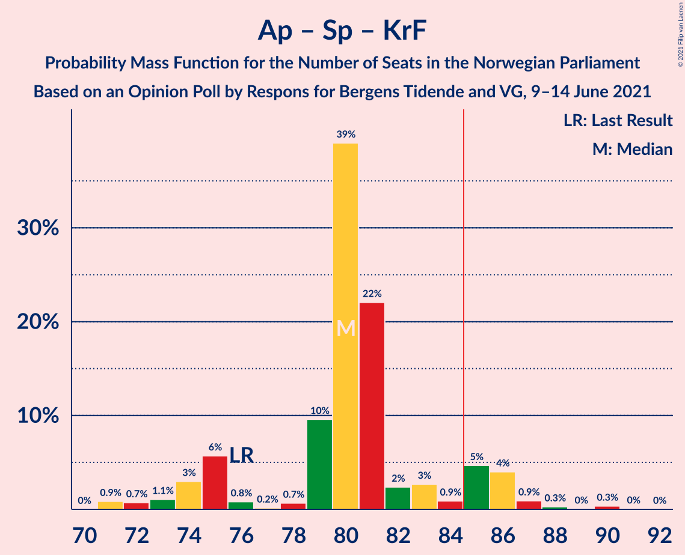

| Number of Seats | Probability | Accumulated | Special Marks |
|:---------------:|:-----------:|:-----------:|:-------------:|
| 71 | 0.9% | 100% |  |
| 72 | 0.7% | 99.1% |  |
| 73 | 1.1% | 98% |  |
| 74 | 3% | 97% |  |
| 75 | 6% | 94% |  |
| 76 | 0.8% | 89% | Last Result |
| 77 | 0.2% | 88% |  |
| 78 | 0.7% | 88% |  |
| 79 | 10% | 87% | Median |
| 80 | 39% | 77% |  |
| 81 | 22% | 38% |  |
| 82 | 2% | 16% |  |
| 83 | 3% | 14% |  |
| 84 | 0.9% | 11% |  |
| 85 | 5% | 10% | Majority |
| 86 | 4% | 6% |  |
| 87 | 0.9% | 2% |  |
| 88 | 0.3% | 0.8% |  |
| 89 | 0% | 0.5% |  |
| 90 | 0.3% | 0.4% |  |
| 91 | 0% | 0.1% |  |
| 92 | 0% | 0% |  |

### Arbeiderpartiet – Senterpartiet

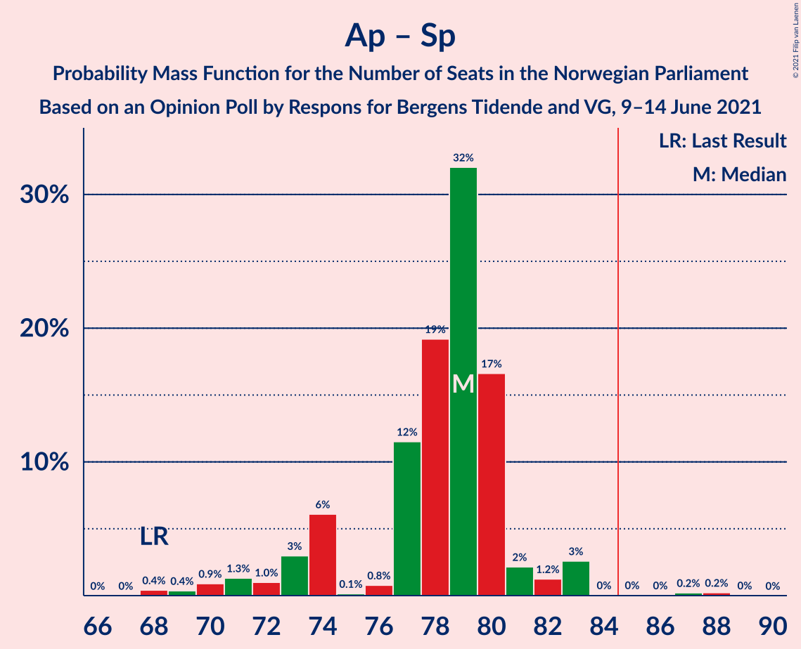

| Number of Seats | Probability | Accumulated | Special Marks |
|:---------------:|:-----------:|:-----------:|:-------------:|
| 68 | 0.4% | 100% | Last Result |
| 69 | 0.4% | 99.6% |  |
| 70 | 0.9% | 99.2% |  |
| 71 | 1.3% | 98% |  |
| 72 | 1.0% | 97% |  |
| 73 | 3% | 96% |  |
| 74 | 6% | 93% |  |
| 75 | 0.1% | 87% |  |
| 76 | 0.8% | 87% |  |
| 77 | 12% | 86% |  |
| 78 | 19% | 74% | Median |
| 79 | 32% | 55% |  |
| 80 | 17% | 23% |  |
| 81 | 2% | 7% |  |
| 82 | 1.2% | 4% |  |
| 83 | 3% | 3% |  |
| 84 | 0% | 0.6% |  |
| 85 | 0% | 0.6% | Majority |
| 86 | 0% | 0.5% |  |
| 87 | 0.2% | 0.5% |  |
| 88 | 0.2% | 0.3% |  |
| 89 | 0% | 0% |  |

### Høyre – Fremskrittspartiet – Miljøpartiet De Grønne – Kristelig Folkeparti – Venstre

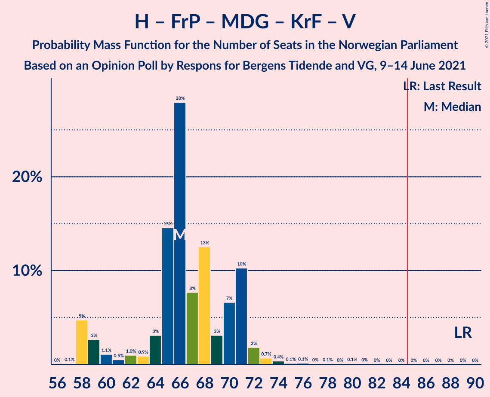

| Number of Seats | Probability | Accumulated | Special Marks |
|:---------------:|:-----------:|:-----------:|:-------------:|
| 57 | 0.1% | 100% |  |
| 58 | 5% | 99.9% |  |
| 59 | 3% | 95% |  |
| 60 | 1.1% | 92% |  |
| 61 | 0.5% | 91% |  |
| 62 | 1.0% | 91% |  |
| 63 | 0.9% | 90% |  |
| 64 | 3% | 89% |  |
| 65 | 15% | 86% | Median |
| 66 | 28% | 71% |  |
| 67 | 8% | 43% |  |
| 68 | 13% | 36% |  |
| 69 | 3% | 23% |  |
| 70 | 7% | 20% |  |
| 71 | 10% | 14% |  |
| 72 | 2% | 3% |  |
| 73 | 0.7% | 2% |  |
| 74 | 0.4% | 0.9% |  |
| 75 | 0.1% | 0.5% |  |
| 76 | 0.1% | 0.4% |  |
| 77 | 0% | 0.3% |  |
| 78 | 0.1% | 0.2% |  |
| 79 | 0% | 0.2% |  |
| 80 | 0.1% | 0.1% |  |
| 81 | 0% | 0.1% |  |
| 82 | 0% | 0% |  |
| 83 | 0% | 0% |  |
| 84 | 0% | 0% |  |
| 85 | 0% | 0% | Majority |
| 86 | 0% | 0% |  |
| 87 | 0% | 0% |  |
| 88 | 0% | 0% |  |
| 89 | 0% | 0% | Last Result |

### Høyre – Fremskrittspartiet – Kristelig Folkeparti – Venstre

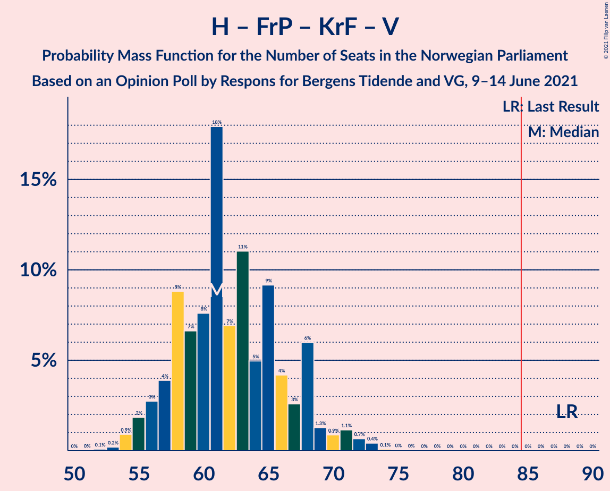

| Number of Seats | Probability | Accumulated | Special Marks |
|:---------------:|:-----------:|:-----------:|:-------------:|
| 53 | 0.1% | 100% |  |
| 54 | 0.2% | 99.8% |  |
| 55 | 0.4% | 99.6% |  |
| 56 | 6% | 99.3% |  |
| 57 | 8% | 94% |  |
| 58 | 4% | 85% |  |
| 59 | 4% | 82% |  |
| 60 | 8% | 78% |  |
| 61 | 11% | 70% |  |
| 62 | 10% | 59% | Median |
| 63 | 29% | 49% |  |
| 64 | 6% | 20% |  |
| 65 | 4% | 14% |  |
| 66 | 0.6% | 11% |  |
| 67 | 0.6% | 10% |  |
| 68 | 6% | 10% |  |
| 69 | 1.0% | 4% |  |
| 70 | 2% | 3% |  |
| 71 | 0.4% | 0.8% |  |
| 72 | 0.2% | 0.4% |  |
| 73 | 0% | 0.1% |  |
| 74 | 0% | 0.1% |  |
| 75 | 0% | 0.1% |  |
| 76 | 0% | 0% |  |
| 77 | 0% | 0% |  |
| 78 | 0% | 0% |  |
| 79 | 0% | 0% |  |
| 80 | 0% | 0% |  |
| 81 | 0% | 0% |  |
| 82 | 0% | 0% |  |
| 83 | 0% | 0% |  |
| 84 | 0% | 0% |  |
| 85 | 0% | 0% | Majority |
| 86 | 0% | 0% |  |
| 87 | 0% | 0% |  |
| 88 | 0% | 0% | Last Result |

### Høyre – Fremskrittspartiet – Venstre

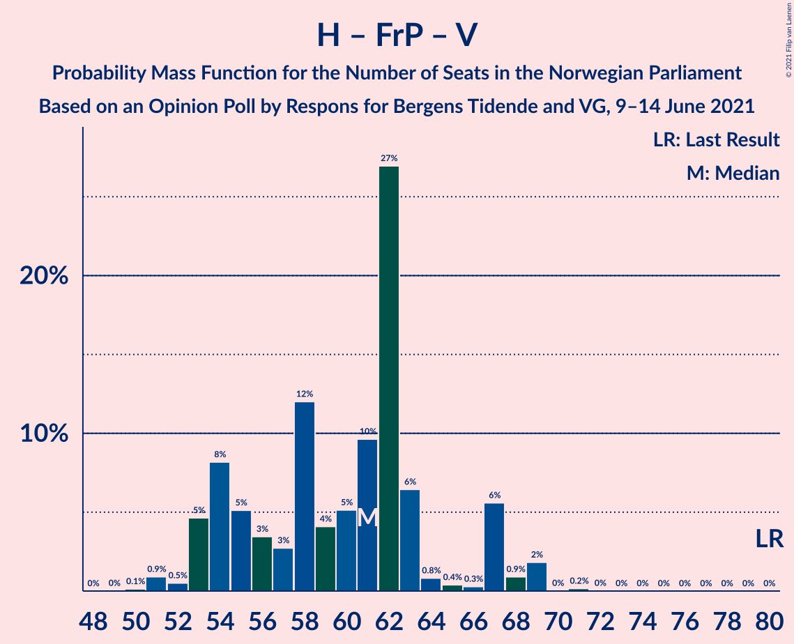

| Number of Seats | Probability | Accumulated | Special Marks |
|:---------------:|:-----------:|:-----------:|:-------------:|
| 50 | 0.1% | 100% |  |
| 51 | 0.9% | 99.8% |  |
| 52 | 0.5% | 98.9% |  |
| 53 | 5% | 98% |  |
| 54 | 8% | 94% |  |
| 55 | 5% | 86% |  |
| 56 | 3% | 80% |  |
| 57 | 3% | 77% |  |
| 58 | 12% | 74% |  |
| 59 | 4% | 62% |  |
| 60 | 5% | 58% |  |
| 61 | 10% | 53% | Median |
| 62 | 27% | 43% |  |
| 63 | 6% | 16% |  |
| 64 | 0.8% | 10% |  |
| 65 | 0.4% | 9% |  |
| 66 | 0.3% | 9% |  |
| 67 | 6% | 9% |  |
| 68 | 0.9% | 3% |  |
| 69 | 2% | 2% |  |
| 70 | 0% | 0.2% |  |
| 71 | 0.2% | 0.2% |  |
| 72 | 0% | 0% |  |
| 73 | 0% | 0% |  |
| 74 | 0% | 0% |  |
| 75 | 0% | 0% |  |
| 76 | 0% | 0% |  |
| 77 | 0% | 0% |  |
| 78 | 0% | 0% |  |
| 79 | 0% | 0% |  |
| 80 | 0% | 0% | Last Result |

### Høyre – Fremskrittspartiet

| Number of Seats | Probability | Accumulated | Special Marks |
|:---------------:|:-----------:|:-----------:|:-------------:|
| 48 | 0.1% | 100% |  |
| 49 | 0.9% | 99.8% |  |
| 50 | 0.4% | 98.9% |  |
| 51 | 4% | 98.6% |  |
| 52 | 8% | 94% |  |
| 53 | 5% | 86% |  |
| 54 | 4% | 81% |  |
| 55 | 3% | 77% |  |
| 56 | 12% | 74% |  |
| 57 | 4% | 62% |  |
| 58 | 5% | 58% |  |
| 59 | 10% | 53% | Median |
| 60 | 27% | 43% |  |
| 61 | 7% | 16% |  |
| 62 | 0.5% | 9% |  |
| 63 | 0.4% | 9% |  |
| 64 | 0.3% | 8% |  |
| 65 | 6% | 8% |  |
| 66 | 0.6% | 3% |  |
| 67 | 2% | 2% |  |
| 68 | 0% | 0.2% |  |
| 69 | 0.1% | 0.1% |  |
| 70 | 0% | 0% |  |
| 71 | 0% | 0% |  |
| 72 | 0% | 0% | Last Result |

### Arbeiderpartiet – Sosialistisk Venstreparti

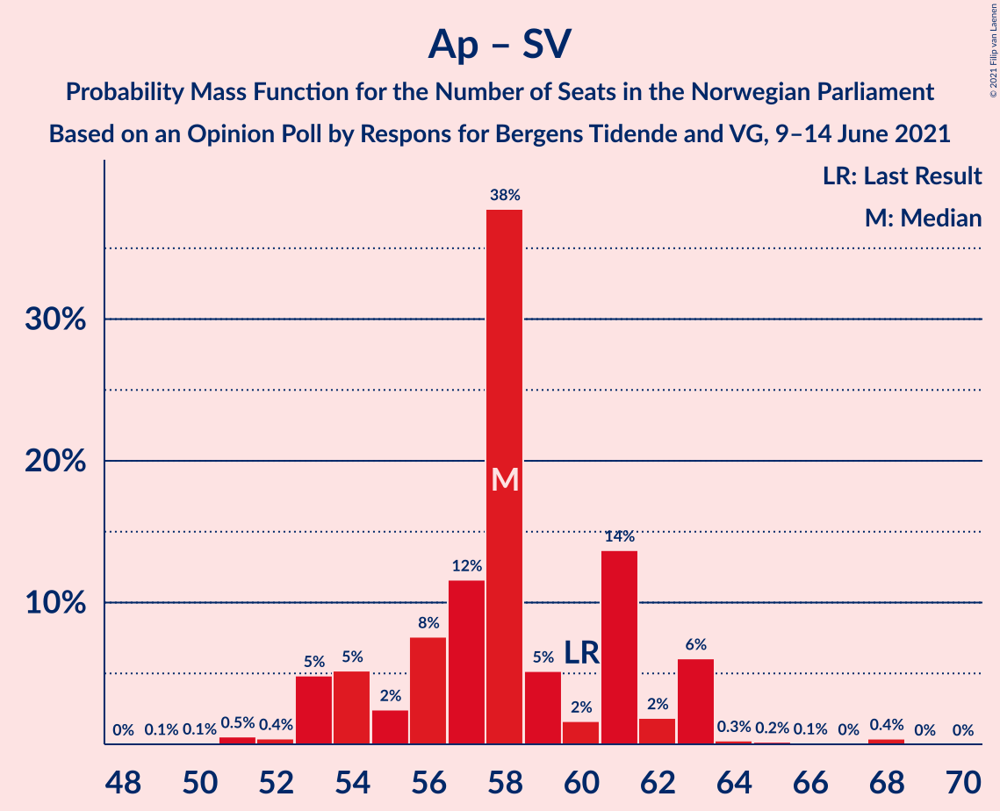

| Number of Seats | Probability | Accumulated | Special Marks |
|:---------------:|:-----------:|:-----------:|:-------------:|
| 49 | 0.1% | 100% |  |
| 50 | 0.1% | 99.9% |  |
| 51 | 0.5% | 99.8% |  |
| 52 | 0.4% | 99.3% |  |
| 53 | 5% | 98.9% |  |
| 54 | 5% | 94% |  |
| 55 | 2% | 89% |  |
| 56 | 8% | 86% |  |
| 57 | 12% | 79% |  |
| 58 | 38% | 67% |  |
| 59 | 5% | 29% | Median |
| 60 | 2% | 24% | Last Result |
| 61 | 14% | 23% |  |
| 62 | 2% | 9% |  |
| 63 | 6% | 7% |  |
| 64 | 0.3% | 1.0% |  |
| 65 | 0.2% | 0.7% |  |
| 66 | 0.1% | 0.6% |  |
| 67 | 0% | 0.5% |  |
| 68 | 0.4% | 0.4% |  |
| 69 | 0% | 0% |  |

### Høyre – Kristelig Folkeparti – Venstre

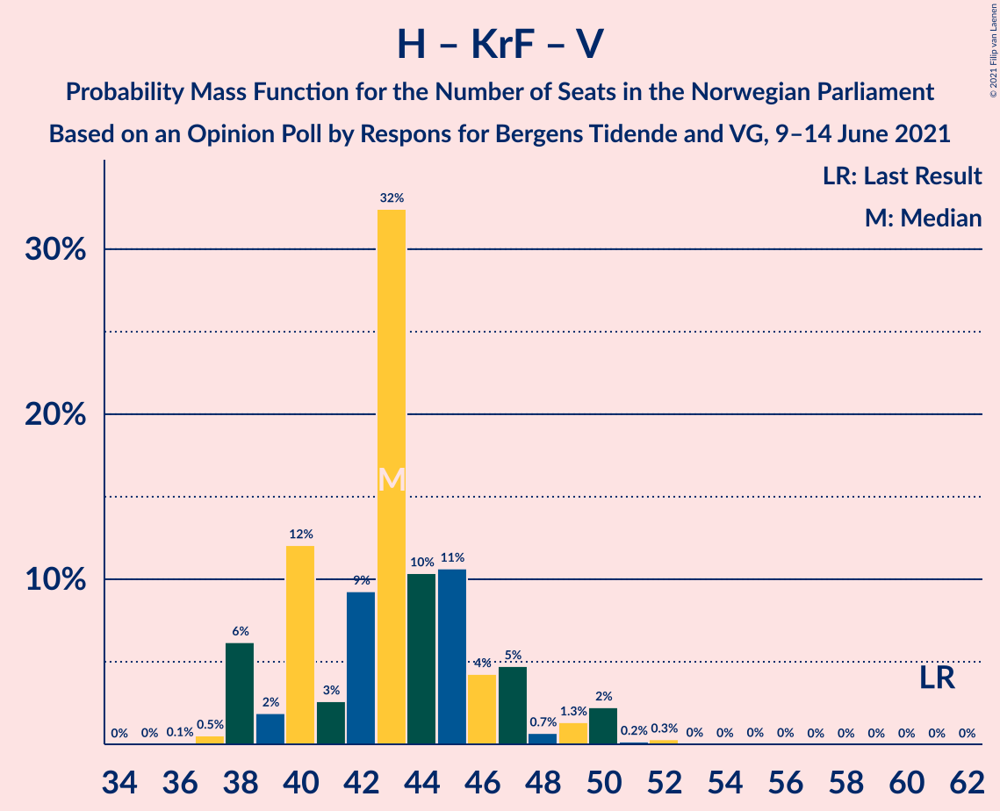

| Number of Seats | Probability | Accumulated | Special Marks |
|:---------------:|:-----------:|:-----------:|:-------------:|
| 36 | 0.1% | 100% |  |
| 37 | 0.5% | 99.9% |  |
| 38 | 6% | 99.4% |  |
| 39 | 2% | 93% |  |
| 40 | 12% | 91% |  |
| 41 | 3% | 79% |  |
| 42 | 9% | 77% |  |
| 43 | 32% | 67% | Median |
| 44 | 10% | 35% |  |
| 45 | 11% | 25% |  |
| 46 | 4% | 14% |  |
| 47 | 5% | 10% |  |
| 48 | 0.7% | 5% |  |
| 49 | 1.3% | 4% |  |
| 50 | 2% | 3% |  |
| 51 | 0.2% | 0.6% |  |
| 52 | 0.3% | 0.5% |  |
| 53 | 0% | 0.1% |  |
| 54 | 0% | 0.1% |  |
| 55 | 0% | 0.1% |  |
| 56 | 0% | 0% |  |
| 57 | 0% | 0% |  |
| 58 | 0% | 0% |  |
| 59 | 0% | 0% |  |
| 60 | 0% | 0% |  |
| 61 | 0% | 0% | Last Result |

### Senterpartiet – Kristelig Folkeparti – Venstre

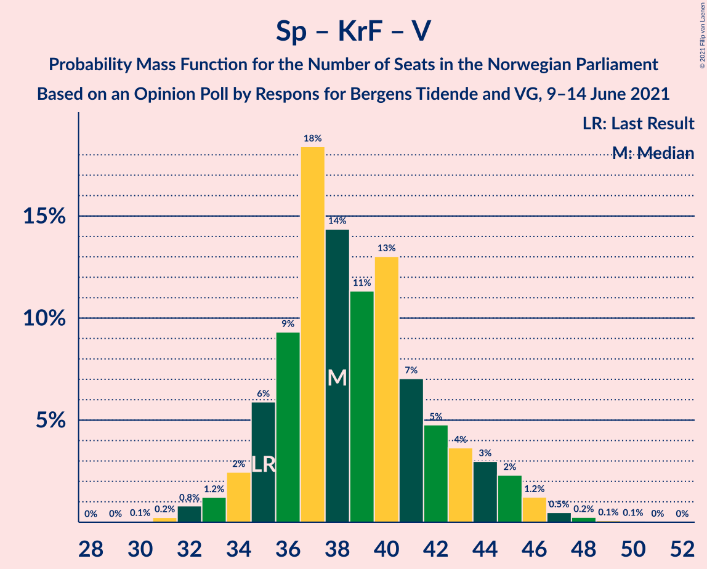

| Number of Seats | Probability | Accumulated | Special Marks |
|:---------------:|:-----------:|:-----------:|:-------------:|
| 31 | 0.1% | 100% |  |
| 32 | 1.2% | 99.8% |  |
| 33 | 1.1% | 98.6% |  |
| 34 | 1.2% | 98% |  |
| 35 | 4% | 96% | Last Result |
| 36 | 2% | 93% |  |
| 37 | 13% | 91% |  |
| 38 | 22% | 78% | Median |
| 39 | 7% | 56% |  |
| 40 | 28% | 49% |  |
| 41 | 9% | 21% |  |
| 42 | 2% | 12% |  |
| 43 | 4% | 10% |  |
| 44 | 4% | 6% |  |
| 45 | 1.0% | 2% |  |
| 46 | 1.0% | 1.3% |  |
| 47 | 0.2% | 0.3% |  |
| 48 | 0% | 0.1% |  |
| 49 | 0% | 0.1% |  |
| 50 | 0% | 0% |  |

## Technical Information

### Opinion Poll

+ **Polling firm:** Respons
+ **Commissioner(s):** Bergens Tidende and VG
+ **Fieldwork period:** 9–14 June 2021

### Calculations

+ **Sample size:** 1000
+ **Simulations done:** 131,072
+ **Error estimate:** 1.40%

