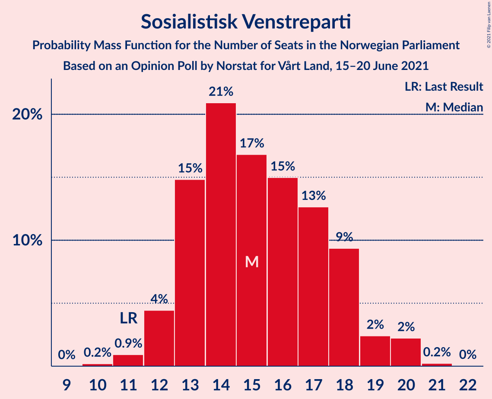
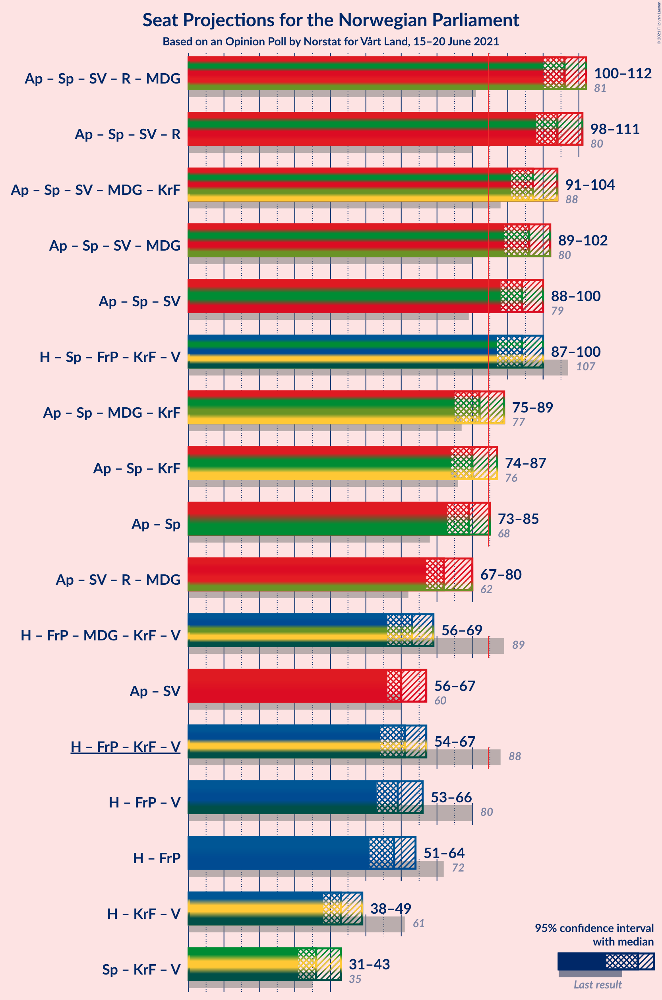
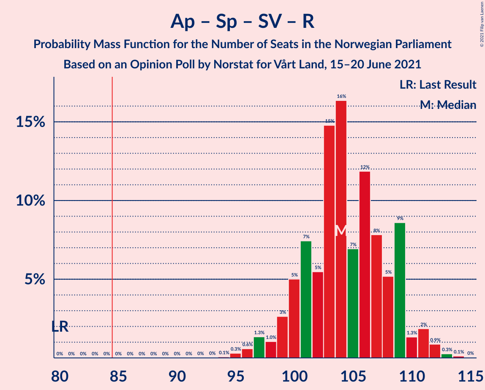
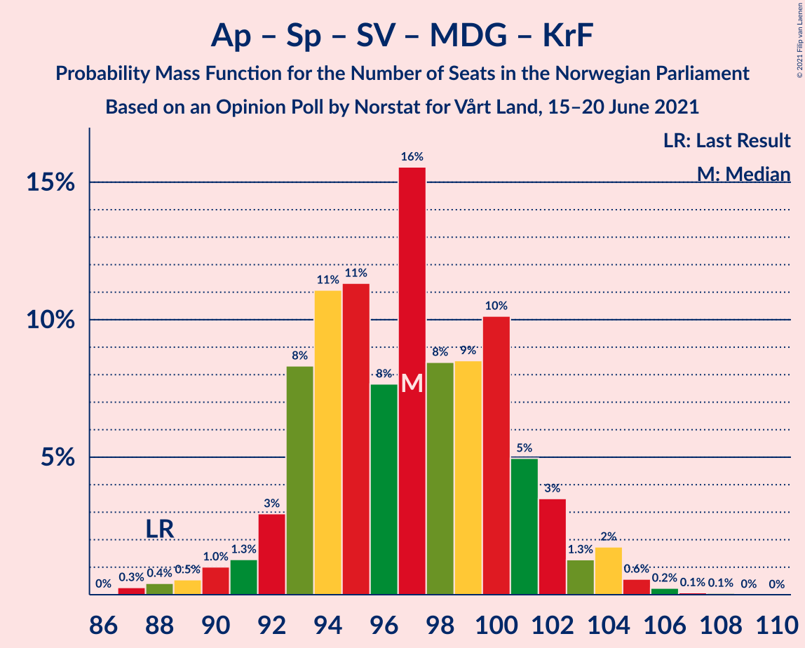
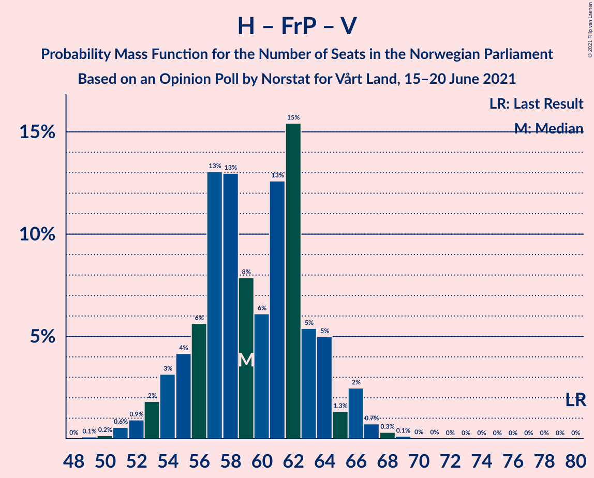

# Opinion Poll by Norstat for Vårt Land, 15–20 June 2021

<a href="#voting-intentions">Voting Intentions</a> | <a href="#seats">Seats</a> | <a href="#coalitions">Coalitions</a> | <a href="#technical-information">Technical Information</a>

## Voting Intentions

### Confidence Intervals

| Party | Last Result | Poll Result | 80% Confidence Interval | 90% Confidence Interval | 95% Confidence Interval | 99% Confidence Interval |
|:-----:|:-----------:|:-----------:|:-----------------------:|:-----------------------:|:-----------------------:|:-----------------------:|
| Arbeiderpartiet | 27.4% | 24.9% | 23.2–26.8% |22.7–27.4% |22.3–27.8% |21.4–28.8% |
| Høyre | 25.0% | 22.2% | 20.5–24.0% |20.0–24.5% |19.6–24.9% |18.8–25.8% |
| Senterpartiet | 10.3% | 17.5% | 16.0–19.2% |15.6–19.7% |15.2–20.1% |14.5–20.9% |
| Fremskrittspartiet | 15.2% | 9.6% | 8.4–10.9% |8.1–11.3% |7.8–11.6% |7.3–12.3% |
| Sosialistisk Venstreparti | 6.0% | 8.4% | 7.3–9.7% |7.0–10.0% |6.8–10.3% |6.3–11.0% |
| Rødt | 2.4% | 5.8% | 4.9–6.9% |4.7–7.2% |4.5–7.5% |4.1–8.1% |
| Miljøpartiet De Grønne | 3.2% | 2.8% | 2.2–3.6% |2.0–3.9% |1.9–4.1% |1.7–4.5% |
| Kristelig Folkeparti | 4.2% | 2.7% | 2.1–3.5% |2.0–3.7% |1.8–3.9% |1.6–4.4% |
| Venstre | 4.4% | 2.6% | 2.0–3.4% |1.9–3.6% |1.7–3.8% |1.5–4.2% |

*Note:* The poll result column reflects the actual value used in the calculations. Published results may vary slightly, and in addition be rounded to fewer digits.

## Seats

### Confidence Intervals

| Party | Last Result | Median | 80% Confidence Interval | 90% Confidence Interval | 95% Confidence Interval | 99% Confidence Interval |
|:-----:|:-----------:|:------:|:-----------------------:|:-----------------------:|:-----------------------:|:-----------------------:|
| <a href="#arbeiderpartiet">Arbeiderpartiet</a> | 49 | 44 | 44–45 |43–45 |38–50 |38–50 |
| <a href="#høyre">Høyre</a> | 45 | 39 | 39–42 |38–42 |36–43 |36–44 |
| <a href="#senterpartiet">Senterpartiet</a> | 19 | 33 | 32–33 |29–33 |29–39 |27–39 |
| <a href="#fremskrittspartiet">Fremskrittspartiet</a> | 27 | 15 | 14–17 |14–21 |14–22 |12–22 |
| <a href="#sosialistisk-venstreparti">Sosialistisk Venstreparti</a> | 11 | 13 | 13–19 |13–19 |13–19 |13–19 |
| <a href="#rødt">Rødt</a> | 1 | 14 | 8–14 |7–14 |7–15 |2–15 |
| <a href="#miljøpartiet-de-grønne">Miljøpartiet De Grønne</a> | 1 | 1 | 1–3 |1–7 |1–8 |1–8 |
| <a href="#kristelig-folkeparti">Kristelig Folkeparti</a> | 8 | 1 | 1–3 |1–3 |1–3 |0–8 |
| <a href="#venstre">Venstre</a> | 8 | 1 | 1–2 |1–2 |1–2 |1–2 |

### Arbeiderpartiet

*For a full overview of the results for this party, see the [Arbeiderpartiet](party-arbeiderpartiet.html) page.*

| Number of Seats | Probability | Accumulated | Special Marks |
|:---------------:|:-----------:|:-----------:|:-------------:|
| 38 | 3% | 100% |  |
| 39 | 0.1% | 97% |  |
| 40 | 0% | 97% |  |
| 41 | 0.4% | 97% |  |
| 42 | 0% | 97% |  |
| 43 | 4% | 97% |  |
| 44 | 71% | 92% | Median |
| 45 | 18% | 22% |  |
| 46 | 0.2% | 3% |  |
| 47 | 0.1% | 3% |  |
| 48 | 0% | 3% |  |
| 49 | 0% | 3% | Last Result |
| 50 | 2% | 3% |  |
| 51 | 0% | 0.5% |  |
| 52 | 0% | 0.5% |  |
| 53 | 0% | 0.5% |  |
| 54 | 0% | 0.4% |  |
| 55 | 0% | 0.4% |  |
| 56 | 0% | 0.4% |  |
| 57 | 0.4% | 0.4% |  |
| 58 | 0% | 0% |  |

### Høyre

*For a full overview of the results for this party, see the [Høyre](party-høyre.html) page.*

| Number of Seats | Probability | Accumulated | Special Marks |
|:---------------:|:-----------:|:-----------:|:-------------:|
| 31 | 0.1% | 100% |  |
| 32 | 0% | 99.9% |  |
| 33 | 0% | 99.9% |  |
| 34 | 0% | 99.9% |  |
| 35 | 0.3% | 99.8% |  |
| 36 | 4% | 99.6% |  |
| 37 | 0% | 96% |  |
| 38 | 3% | 96% |  |
| 39 | 71% | 93% | Median |
| 40 | 0% | 22% |  |
| 41 | 0.2% | 22% |  |
| 42 | 18% | 22% |  |
| 43 | 3% | 4% |  |
| 44 | 0.5% | 1.0% |  |
| 45 | 0% | 0.5% | Last Result |
| 46 | 0.1% | 0.5% |  |
| 47 | 0% | 0.4% |  |
| 48 | 0% | 0.4% |  |
| 49 | 0% | 0.4% |  |
| 50 | 0.4% | 0.4% |  |
| 51 | 0% | 0% |  |

### Senterpartiet

*For a full overview of the results for this party, see the [Senterpartiet](party-senterpartiet.html) page.*

| Number of Seats | Probability | Accumulated | Special Marks |
|:---------------:|:-----------:|:-----------:|:-------------:|
| 19 | 0% | 100% | Last Result |
| 20 | 0% | 100% |  |
| 21 | 0% | 100% |  |
| 22 | 0% | 100% |  |
| 23 | 0% | 100% |  |
| 24 | 0% | 100% |  |
| 25 | 0% | 100% |  |
| 26 | 0.1% | 99.9% |  |
| 27 | 0.4% | 99.9% |  |
| 28 | 0.2% | 99.4% |  |
| 29 | 5% | 99.3% |  |
| 30 | 4% | 95% |  |
| 31 | 0.4% | 91% |  |
| 32 | 18% | 91% |  |
| 33 | 68% | 72% | Median |
| 34 | 0% | 4% |  |
| 35 | 0.4% | 4% |  |
| 36 | 0.1% | 4% |  |
| 37 | 0% | 4% |  |
| 38 | 0% | 4% |  |
| 39 | 4% | 4% |  |
| 40 | 0% | 0% |  |

### Fremskrittspartiet

*For a full overview of the results for this party, see the [Fremskrittspartiet](party-fremskrittspartiet.html) page.*

| Number of Seats | Probability | Accumulated | Special Marks |
|:---------------:|:-----------:|:-----------:|:-------------:|
| 12 | 0.6% | 100% |  |
| 13 | 0% | 99.4% |  |
| 14 | 18% | 99.4% |  |
| 15 | 70% | 81% | Median |
| 16 | 0.1% | 11% |  |
| 17 | 1.3% | 11% |  |
| 18 | 4% | 9% |  |
| 19 | 0.1% | 6% |  |
| 20 | 0% | 6% |  |
| 21 | 3% | 6% |  |
| 22 | 3% | 3% |  |
| 23 | 0% | 0% |  |
| 24 | 0% | 0% |  |
| 25 | 0% | 0% |  |
| 26 | 0% | 0% |  |
| 27 | 0% | 0% | Last Result |

### Sosialistisk Venstreparti

*For a full overview of the results for this party, see the [Sosialistisk Venstreparti](party-sosialistiskvenstreparti.html) page.*

| Number of Seats | Probability | Accumulated | Special Marks |
|:---------------:|:-----------:|:-----------:|:-------------:|
| 11 | 0% | 100% | Last Result |
| 12 | 0.4% | 100% |  |
| 13 | 66% | 99.5% | Median |
| 14 | 7% | 33% |  |
| 15 | 0.1% | 26% |  |
| 16 | 0.5% | 26% |  |
| 17 | 3% | 26% |  |
| 18 | 0% | 23% |  |
| 19 | 23% | 23% |  |
| 20 | 0% | 0.1% |  |
| 21 | 0% | 0.1% |  |
| 22 | 0% | 0.1% |  |
| 23 | 0% | 0% |  |

### Rødt

*For a full overview of the results for this party, see the [Rødt](party-rødt.html) page.*

| Number of Seats | Probability | Accumulated | Special Marks |
|:---------------:|:-----------:|:-----------:|:-------------:|
| 1 | 0% | 100% | Last Result |
| 2 | 2% | 100% |  |
| 3 | 0% | 98% |  |
| 4 | 0% | 98% |  |
| 5 | 0% | 98% |  |
| 6 | 0% | 98% |  |
| 7 | 5% | 98% |  |
| 8 | 4% | 93% |  |
| 9 | 0.5% | 89% |  |
| 10 | 0.7% | 89% |  |
| 11 | 19% | 88% |  |
| 12 | 0.4% | 69% |  |
| 13 | 0% | 69% |  |
| 14 | 65% | 69% | Median |
| 15 | 4% | 4% |  |
| 16 | 0% | 0% |  |

### Miljøpartiet De Grønne

*For a full overview of the results for this party, see the [Miljøpartiet De Grønne](party-miljøpartietdegrønne.html) page.*

| Number of Seats | Probability | Accumulated | Special Marks |
|:---------------:|:-----------:|:-----------:|:-------------:|
| 0 | 0.3% | 100% |  |
| 1 | 87% | 99.7% | Last Result, Median |
| 2 | 1.2% | 12% |  |
| 3 | 5% | 11% |  |
| 4 | 0% | 7% |  |
| 5 | 0% | 7% |  |
| 6 | 0% | 7% |  |
| 7 | 4% | 7% |  |
| 8 | 3% | 3% |  |
| 9 | 0.2% | 0.2% |  |
| 10 | 0% | 0% |  |

### Kristelig Folkeparti

*For a full overview of the results for this party, see the [Kristelig Folkeparti](party-kristeligfolkeparti.html) page.*

| Number of Seats | Probability | Accumulated | Special Marks |
|:---------------:|:-----------:|:-----------:|:-------------:|
| 0 | 0.5% | 100% |  |
| 1 | 71% | 99.5% | Median |
| 2 | 0% | 28% |  |
| 3 | 27% | 28% |  |
| 4 | 0% | 1.3% |  |
| 5 | 0% | 1.3% |  |
| 6 | 0% | 1.3% |  |
| 7 | 0% | 1.3% |  |
| 8 | 1.2% | 1.3% | Last Result |
| 9 | 0.1% | 0.1% |  |
| 10 | 0% | 0% |  |

### Venstre

*For a full overview of the results for this party, see the [Venstre](party-venstre.html) page.*

| Number of Seats | Probability | Accumulated | Special Marks |
|:---------------:|:-----------:|:-----------:|:-------------:|
| 0 | 0.2% | 100% |  |
| 1 | 70% | 99.8% | Median |
| 2 | 29% | 29% |  |
| 3 | 0% | 0.2% |  |
| 4 | 0% | 0.2% |  |
| 5 | 0% | 0.2% |  |
| 6 | 0% | 0.2% |  |
| 7 | 0.2% | 0.2% |  |
| 8 | 0% | 0% | Last Result |

## Coalitions

### Confidence Intervals

| Coalition | Last Result | Median | Majority? | 80% Confidence Interval | 90% Confidence Interval | 95% Confidence Interval | 99% Confidence Interval |
|:---------:|:-----------:|:------:|:---------:|:-----------------------:|:-----------------------:|:-----------------------:|:-----------------------:|
| Arbeiderpartiet – Senterpartiet – Sosialistisk Venstreparti – Rødt – Miljøpartiet De Grønne | 81 | 105 | 100% | 105–108 | 102–108 | 101–111 | 99–111 |
| Arbeiderpartiet – Senterpartiet – Sosialistisk Venstreparti – Rødt | 80 | 104 | 100% | 100–107 | 99–107 | 99–107 | 98–109 |
| Arbeiderpartiet – Senterpartiet – Sosialistisk Venstreparti – Miljøpartiet De Grønne – Kristelig Folkeparti | 88 | 92 | 100% | 92–100 | 92–106 | 87–106 | 87–106 |
| Arbeiderpartiet – Senterpartiet – Sosialistisk Venstreparti – Miljøpartiet De Grønne | 80 | 91 | 100% | 91–97 | 91–103 | 86–103 | 86–105 |
| Høyre – Senterpartiet – Fremskrittspartiet – Kristelig Folkeparti – Venstre | 107 | 89 | 99.9% | 89–93 | 88–97 | 88–101 | 87–101 |
| Arbeiderpartiet – Senterpartiet – Sosialistisk Venstreparti | 79 | 90 | 99.5% | 90–96 | 90–96 | 85–97 | 85–98 |
| Arbeiderpartiet – Senterpartiet – Miljøpartiet De Grønne – Kristelig Folkeparti | 77 | 79 | 7% | 79–81 | 79–89 | 73–92 | 73–92 |
| Arbeiderpartiet – Senterpartiet – Kristelig Folkeparti | 76 | 78 | 4% | 78–80 | 76–82 | 72–85 | 72–85 |
| Arbeiderpartiet – Senterpartiet | 68 | 77 | 0% | 77 | 73–80 | 71–82 | 71–83 |
| Høyre – Fremskrittspartiet – Miljøpartiet De Grønne – Kristelig Folkeparti – Venstre | 89 | 57 | 0% | 57–65 | 57–69 | 57–70 | 57–70 |
| Høyre – Fremskrittspartiet – Kristelig Folkeparti – Venstre | 88 | 56 | 0% | 56–61 | 56–62 | 56–68 | 56–68 |
| Høyre – Fremskrittspartiet – Venstre | 80 | 55 | 0% | 55–58 | 55–61 | 55–67 | 55–67 |
| Arbeiderpartiet – Sosialistisk Venstreparti | 60 | 57 | 0% | 57–64 | 57–64 | 52–67 | 52–67 |
| Høyre – Fremskrittspartiet | 72 | 54 | 0% | 54–56 | 54–59 | 54–65 | 53–65 |
| Høyre – Kristelig Folkeparti – Venstre | 61 | 41 | 0% | 41–47 | 41–47 | 40–47 | 40–48 |
| Senterpartiet – Kristelig Folkeparti – Venstre | 35 | 35 | 0% | 35–37 | 34–39 | 33–43 | 30–43 |

### Arbeiderpartiet – Senterpartiet – Sosialistisk Venstreparti – Rødt – Miljøpartiet De Grønne

| Number of Seats | Probability | Accumulated | Special Marks |
|:---------------:|:-----------:|:-----------:|:-------------:|
| 81 | 0% | 100% | Last Result |
| 82 | 0% | 100% |  |
| 83 | 0% | 100% |  |
| 84 | 0% | 100% |  |
| 85 | 0% | 100% | Majority |
| 86 | 0% | 100% |  |
| 87 | 0% | 100% |  |
| 88 | 0% | 100% |  |
| 89 | 0% | 100% |  |
| 90 | 0% | 100% |  |
| 91 | 0% | 100% |  |
| 92 | 0% | 100% |  |
| 93 | 0% | 100% |  |
| 94 | 0.4% | 99.9% |  |
| 95 | 0% | 99.6% |  |
| 96 | 0% | 99.5% |  |
| 97 | 0% | 99.5% |  |
| 98 | 0% | 99.5% |  |
| 99 | 0% | 99.5% |  |
| 100 | 0% | 99.5% |  |
| 101 | 3% | 99.5% |  |
| 102 | 5% | 97% |  |
| 103 | 0.1% | 92% |  |
| 104 | 1.2% | 92% |  |
| 105 | 65% | 91% | Median |
| 106 | 0% | 25% |  |
| 107 | 2% | 25% |  |
| 108 | 19% | 23% |  |
| 109 | 0% | 4% |  |
| 110 | 0.1% | 4% |  |
| 111 | 4% | 4% |  |
| 112 | 0% | 0.2% |  |
| 113 | 0% | 0.2% |  |
| 114 | 0% | 0.2% |  |
| 115 | 0.2% | 0.2% |  |
| 116 | 0% | 0% |  |

### Arbeiderpartiet – Senterpartiet – Sosialistisk Venstreparti – Rødt

| Number of Seats | Probability | Accumulated | Special Marks |
|:---------------:|:-----------:|:-----------:|:-------------:|
| 80 | 0% | 100% | Last Result |
| 81 | 0% | 100% |  |
| 82 | 0% | 100% |  |
| 83 | 0% | 100% |  |
| 84 | 0% | 100% |  |
| 85 | 0% | 100% | Majority |
| 86 | 0% | 100% |  |
| 87 | 0% | 100% |  |
| 88 | 0% | 100% |  |
| 89 | 0% | 100% |  |
| 90 | 0% | 100% |  |
| 91 | 0% | 100% |  |
| 92 | 0% | 100% |  |
| 93 | 0.4% | 99.9% |  |
| 94 | 0% | 99.5% |  |
| 95 | 0% | 99.5% |  |
| 96 | 0% | 99.5% |  |
| 97 | 0% | 99.5% |  |
| 98 | 0% | 99.5% |  |
| 99 | 7% | 99.5% |  |
| 100 | 3% | 92% |  |
| 101 | 0% | 89% |  |
| 102 | 1.4% | 89% |  |
| 103 | 0.1% | 88% |  |
| 104 | 69% | 88% | Median |
| 105 | 0% | 19% |  |
| 106 | 0.2% | 19% |  |
| 107 | 18% | 19% |  |
| 108 | 0% | 0.6% |  |
| 109 | 0.1% | 0.6% |  |
| 110 | 0.4% | 0.5% |  |
| 111 | 0% | 0% |  |

### Arbeiderpartiet – Senterpartiet – Sosialistisk Venstreparti – Miljøpartiet De Grønne – Kristelig Folkeparti

| Number of Seats | Probability | Accumulated | Special Marks |
|:---------------:|:-----------:|:-----------:|:-------------:|
| 85 | 0.4% | 100% | Majority |
| 86 | 0% | 99.6% |  |
| 87 | 3% | 99.6% |  |
| 88 | 0% | 97% | Last Result |
| 89 | 0% | 97% |  |
| 90 | 0% | 97% |  |
| 91 | 0% | 97% |  |
| 92 | 65% | 97% | Median |
| 93 | 0.3% | 32% |  |
| 94 | 0% | 31% |  |
| 95 | 0% | 31% |  |
| 96 | 0% | 31% |  |
| 97 | 1.3% | 31% |  |
| 98 | 5% | 30% |  |
| 99 | 0.1% | 25% |  |
| 100 | 18% | 25% |  |
| 101 | 0% | 7% |  |
| 102 | 0.4% | 7% |  |
| 103 | 0% | 6% |  |
| 104 | 0.2% | 6% |  |
| 105 | 0% | 6% |  |
| 106 | 6% | 6% |  |
| 107 | 0% | 0.1% |  |
| 108 | 0.1% | 0.1% |  |
| 109 | 0% | 0% |  |

### Arbeiderpartiet – Senterpartiet – Sosialistisk Venstreparti – Miljøpartiet De Grønne

| Number of Seats | Probability | Accumulated | Special Marks |
|:---------------:|:-----------:|:-----------:|:-------------:|
| 80 | 0% | 100% | Last Result |
| 81 | 0% | 100% |  |
| 82 | 0% | 100% |  |
| 83 | 0% | 100% |  |
| 84 | 0% | 100% |  |
| 85 | 0.4% | 100% | Majority |
| 86 | 3% | 99.5% |  |
| 87 | 0% | 97% |  |
| 88 | 0% | 97% |  |
| 89 | 1.2% | 97% |  |
| 90 | 0% | 96% |  |
| 91 | 65% | 95% | Median |
| 92 | 0.3% | 30% |  |
| 93 | 0% | 30% |  |
| 94 | 0% | 30% |  |
| 95 | 5% | 30% |  |
| 96 | 0.2% | 25% |  |
| 97 | 18% | 25% |  |
| 98 | 0% | 7% |  |
| 99 | 0.1% | 7% |  |
| 100 | 0% | 7% |  |
| 101 | 0.4% | 7% |  |
| 102 | 0% | 6% |  |
| 103 | 4% | 6% |  |
| 104 | 0% | 2% |  |
| 105 | 2% | 2% |  |
| 106 | 0% | 0% |  |

### Høyre – Senterpartiet – Fremskrittspartiet – Kristelig Folkeparti – Venstre

| Number of Seats | Probability | Accumulated | Special Marks |
|:---------------:|:-----------:|:-----------:|:-------------:|
| 84 | 0% | 100% |  |
| 85 | 0.4% | 99.9% | Majority |
| 86 | 0% | 99.5% |  |
| 87 | 0% | 99.5% |  |
| 88 | 5% | 99.5% |  |
| 89 | 65% | 95% | Median |
| 90 | 0% | 29% |  |
| 91 | 0% | 29% |  |
| 92 | 2% | 29% |  |
| 93 | 18% | 27% |  |
| 94 | 0.3% | 9% |  |
| 95 | 1.3% | 8% |  |
| 96 | 0% | 7% |  |
| 97 | 4% | 7% |  |
| 98 | 0.5% | 3% |  |
| 99 | 0% | 3% |  |
| 100 | 0% | 3% |  |
| 101 | 3% | 3% |  |
| 102 | 0% | 0.1% |  |
| 103 | 0% | 0.1% |  |
| 104 | 0% | 0% |  |
| 105 | 0% | 0% |  |
| 106 | 0% | 0% |  |
| 107 | 0% | 0% | Last Result |

### Arbeiderpartiet – Senterpartiet – Sosialistisk Venstreparti

| Number of Seats | Probability | Accumulated | Special Marks |
|:---------------:|:-----------:|:-----------:|:-------------:|
| 79 | 0% | 100% | Last Result |
| 80 | 0% | 100% |  |
| 81 | 0% | 100% |  |
| 82 | 0% | 100% |  |
| 83 | 0% | 100% |  |
| 84 | 0.4% | 99.9% |  |
| 85 | 3% | 99.5% | Majority |
| 86 | 0% | 97% |  |
| 87 | 1.2% | 97% |  |
| 88 | 0.2% | 96% |  |
| 89 | 0% | 95% |  |
| 90 | 65% | 95% | Median |
| 91 | 0% | 30% |  |
| 92 | 5% | 30% |  |
| 93 | 0% | 25% |  |
| 94 | 0.2% | 25% |  |
| 95 | 0.1% | 25% |  |
| 96 | 22% | 25% |  |
| 97 | 2% | 3% |  |
| 98 | 0.1% | 0.6% |  |
| 99 | 0% | 0.4% |  |
| 100 | 0.4% | 0.4% |  |
| 101 | 0% | 0% |  |

### Arbeiderpartiet – Senterpartiet – Miljøpartiet De Grønne – Kristelig Folkeparti

| Number of Seats | Probability | Accumulated | Special Marks |
|:---------------:|:-----------:|:-----------:|:-------------:|
| 73 | 3% | 100% |  |
| 74 | 0% | 97% |  |
| 75 | 0% | 97% |  |
| 76 | 0% | 97% |  |
| 77 | 0% | 97% | Last Result |
| 78 | 0% | 97% |  |
| 79 | 70% | 97% | Median |
| 80 | 0.2% | 27% |  |
| 81 | 18% | 26% |  |
| 82 | 0% | 8% |  |
| 83 | 0% | 8% |  |
| 84 | 1.2% | 8% |  |
| 85 | 0% | 7% | Majority |
| 86 | 0.4% | 7% |  |
| 87 | 0% | 6% |  |
| 88 | 0% | 6% |  |
| 89 | 2% | 6% |  |
| 90 | 0% | 4% |  |
| 91 | 0.2% | 4% |  |
| 92 | 4% | 4% |  |
| 93 | 0.1% | 0.1% |  |
| 94 | 0% | 0% |  |

### Arbeiderpartiet – Senterpartiet – Kristelig Folkeparti

| Number of Seats | Probability | Accumulated | Special Marks |
|:---------------:|:-----------:|:-----------:|:-------------:|
| 72 | 3% | 100% |  |
| 73 | 0.1% | 97% |  |
| 74 | 0% | 96% |  |
| 75 | 0% | 96% |  |
| 76 | 5% | 96% | Last Result |
| 77 | 0% | 92% |  |
| 78 | 65% | 92% | Median |
| 79 | 0.3% | 27% |  |
| 80 | 18% | 26% |  |
| 81 | 2% | 8% |  |
| 82 | 1.3% | 6% |  |
| 83 | 0% | 4% |  |
| 84 | 0% | 4% |  |
| 85 | 4% | 4% | Majority |
| 86 | 0% | 0.2% |  |
| 87 | 0% | 0.2% |  |
| 88 | 0% | 0.2% |  |
| 89 | 0% | 0.2% |  |
| 90 | 0% | 0.1% |  |
| 91 | 0% | 0.1% |  |
| 92 | 0.1% | 0.1% |  |
| 93 | 0% | 0% |  |

### Arbeiderpartiet – Senterpartiet

| Number of Seats | Probability | Accumulated | Special Marks |
|:---------------:|:-----------:|:-----------:|:-------------:|
| 68 | 0% | 100% | Last Result |
| 69 | 0% | 100% |  |
| 70 | 0% | 100% |  |
| 71 | 3% | 99.9% |  |
| 72 | 0.4% | 97% |  |
| 73 | 5% | 96% |  |
| 74 | 1.2% | 92% |  |
| 75 | 0% | 91% |  |
| 76 | 0% | 91% |  |
| 77 | 83% | 91% | Median |
| 78 | 0.3% | 7% |  |
| 79 | 0% | 7% |  |
| 80 | 2% | 7% |  |
| 81 | 0.2% | 4% |  |
| 82 | 4% | 4% |  |
| 83 | 0.1% | 0.6% |  |
| 84 | 0.4% | 0.5% |  |
| 85 | 0% | 0% | Majority |

### Høyre – Fremskrittspartiet – Miljøpartiet De Grønne – Kristelig Folkeparti – Venstre

| Number of Seats | Probability | Accumulated | Special Marks |
|:---------------:|:-----------:|:-----------:|:-------------:|
| 57 | 65% | 100% | Median |
| 58 | 0% | 35% |  |
| 59 | 0.7% | 35% |  |
| 60 | 0.2% | 34% |  |
| 61 | 0% | 34% |  |
| 62 | 23% | 34% |  |
| 63 | 0.2% | 11% |  |
| 64 | 0% | 11% |  |
| 65 | 4% | 11% |  |
| 66 | 0.1% | 7% |  |
| 67 | 1.2% | 7% |  |
| 68 | 0.4% | 6% |  |
| 69 | 3% | 6% |  |
| 70 | 2% | 3% |  |
| 71 | 0% | 0.1% |  |
| 72 | 0% | 0.1% |  |
| 73 | 0% | 0% |  |
| 74 | 0% | 0% |  |
| 75 | 0% | 0% |  |
| 76 | 0% | 0% |  |
| 77 | 0% | 0% |  |
| 78 | 0% | 0% |  |
| 79 | 0% | 0% |  |
| 80 | 0% | 0% |  |
| 81 | 0% | 0% |  |
| 82 | 0% | 0% |  |
| 83 | 0% | 0% |  |
| 84 | 0% | 0% |  |
| 85 | 0% | 0% | Majority |
| 86 | 0% | 0% |  |
| 87 | 0% | 0% |  |
| 88 | 0% | 0% |  |
| 89 | 0% | 0% | Last Result |

### Høyre – Fremskrittspartiet – Kristelig Folkeparti – Venstre

| Number of Seats | Probability | Accumulated | Special Marks |
|:---------------:|:-----------:|:-----------:|:-------------:|
| 54 | 0.2% | 100% |  |
| 55 | 0% | 99.8% |  |
| 56 | 65% | 99.7% | Median |
| 57 | 0% | 35% |  |
| 58 | 4% | 35% |  |
| 59 | 5% | 30% |  |
| 60 | 0% | 26% |  |
| 61 | 19% | 26% |  |
| 62 | 2% | 7% |  |
| 63 | 0% | 5% |  |
| 64 | 0% | 5% |  |
| 65 | 1.2% | 5% |  |
| 66 | 0.1% | 3% |  |
| 67 | 0.4% | 3% |  |
| 68 | 3% | 3% |  |
| 69 | 0% | 0.1% |  |
| 70 | 0% | 0.1% |  |
| 71 | 0% | 0.1% |  |
| 72 | 0% | 0% |  |
| 73 | 0% | 0% |  |
| 74 | 0% | 0% |  |
| 75 | 0% | 0% |  |
| 76 | 0% | 0% |  |
| 77 | 0% | 0% |  |
| 78 | 0% | 0% |  |
| 79 | 0% | 0% |  |
| 80 | 0% | 0% |  |
| 81 | 0% | 0% |  |
| 82 | 0% | 0% |  |
| 83 | 0% | 0% |  |
| 84 | 0% | 0% |  |
| 85 | 0% | 0% | Majority |
| 86 | 0% | 0% |  |
| 87 | 0% | 0% |  |
| 88 | 0% | 0% | Last Result |

### Høyre – Fremskrittspartiet – Venstre

| Number of Seats | Probability | Accumulated | Special Marks |
|:---------------:|:-----------:|:-----------:|:-------------:|
| 50 | 0.1% | 100% |  |
| 51 | 0% | 99.9% |  |
| 52 | 0% | 99.9% |  |
| 53 | 0.2% | 99.8% |  |
| 54 | 0% | 99.7% |  |
| 55 | 69% | 99.6% | Median |
| 56 | 5% | 31% |  |
| 57 | 2% | 26% |  |
| 58 | 19% | 25% |  |
| 59 | 0% | 6% |  |
| 60 | 0.2% | 6% |  |
| 61 | 2% | 6% |  |
| 62 | 0.1% | 3% |  |
| 63 | 0% | 3% |  |
| 64 | 0% | 3% |  |
| 65 | 0% | 3% |  |
| 66 | 0.1% | 3% |  |
| 67 | 3% | 3% |  |
| 68 | 0% | 0.1% |  |
| 69 | 0% | 0.1% |  |
| 70 | 0% | 0.1% |  |
| 71 | 0% | 0% |  |
| 72 | 0% | 0% |  |
| 73 | 0% | 0% |  |
| 74 | 0% | 0% |  |
| 75 | 0% | 0% |  |
| 76 | 0% | 0% |  |
| 77 | 0% | 0% |  |
| 78 | 0% | 0% |  |
| 79 | 0% | 0% |  |
| 80 | 0% | 0% | Last Result |

### Arbeiderpartiet – Sosialistisk Venstreparti

| Number of Seats | Probability | Accumulated | Special Marks |
|:---------------:|:-----------:|:-----------:|:-------------:|
| 52 | 3% | 100% |  |
| 53 | 0.4% | 97% |  |
| 54 | 0% | 97% |  |
| 55 | 0% | 97% |  |
| 56 | 0% | 97% |  |
| 57 | 70% | 97% | Median |
| 58 | 0% | 26% |  |
| 59 | 0.2% | 26% |  |
| 60 | 0.2% | 26% | Last Result |
| 61 | 0% | 26% |  |
| 62 | 0.1% | 26% |  |
| 63 | 5% | 26% |  |
| 64 | 18% | 21% |  |
| 65 | 0% | 3% |  |
| 66 | 0% | 3% |  |
| 67 | 2% | 3% |  |
| 68 | 0% | 0.5% |  |
| 69 | 0% | 0.5% |  |
| 70 | 0% | 0.5% |  |
| 71 | 0% | 0.4% |  |
| 72 | 0% | 0.4% |  |
| 73 | 0.4% | 0.4% |  |
| 74 | 0% | 0% |  |

### Høyre – Fremskrittspartiet

| Number of Seats | Probability | Accumulated | Special Marks |
|:---------------:|:-----------:|:-----------:|:-------------:|
| 48 | 0.1% | 100% |  |
| 49 | 0% | 99.9% |  |
| 50 | 0% | 99.9% |  |
| 51 | 0% | 99.8% |  |
| 52 | 0% | 99.8% |  |
| 53 | 0.3% | 99.8% |  |
| 54 | 73% | 99.5% | Median |
| 55 | 0.1% | 26% |  |
| 56 | 20% | 26% |  |
| 57 | 0% | 6% |  |
| 58 | 0% | 6% |  |
| 59 | 2% | 6% |  |
| 60 | 0% | 3% |  |
| 61 | 0% | 3% |  |
| 62 | 0% | 3% |  |
| 63 | 0% | 3% |  |
| 64 | 0.1% | 3% |  |
| 65 | 3% | 3% |  |
| 66 | 0% | 0% |  |
| 67 | 0% | 0% |  |
| 68 | 0% | 0% |  |
| 69 | 0% | 0% |  |
| 70 | 0% | 0% |  |
| 71 | 0% | 0% |  |
| 72 | 0% | 0% | Last Result |

### Høyre – Kristelig Folkeparti – Venstre

| Number of Seats | Probability | Accumulated | Special Marks |
|:---------------:|:-----------:|:-----------:|:-------------:|
| 38 | 0.2% | 100% |  |
| 39 | 0% | 99.7% |  |
| 40 | 4% | 99.7% |  |
| 41 | 68% | 96% | Median |
| 42 | 0.3% | 28% |  |
| 43 | 0% | 28% |  |
| 44 | 5% | 28% |  |
| 45 | 0% | 24% |  |
| 46 | 3% | 24% |  |
| 47 | 18% | 20% |  |
| 48 | 1.3% | 2% |  |
| 49 | 0% | 0.5% |  |
| 50 | 0% | 0.5% |  |
| 51 | 0% | 0.4% |  |
| 52 | 0.4% | 0.4% |  |
| 53 | 0% | 0% |  |
| 54 | 0% | 0% |  |
| 55 | 0% | 0% |  |
| 56 | 0% | 0% |  |
| 57 | 0% | 0% |  |
| 58 | 0% | 0% |  |
| 59 | 0% | 0% |  |
| 60 | 0% | 0% |  |
| 61 | 0% | 0% | Last Result |

### Senterpartiet – Kristelig Folkeparti – Venstre

| Number of Seats | Probability | Accumulated | Special Marks |
|:---------------:|:-----------:|:-----------:|:-------------:|
| 28 | 0% | 100% |  |
| 29 | 0.4% | 99.9% |  |
| 30 | 0.1% | 99.5% |  |
| 31 | 0% | 99.5% |  |
| 32 | 0% | 99.4% |  |
| 33 | 3% | 99.4% |  |
| 34 | 5% | 97% |  |
| 35 | 65% | 92% | Last Result, Median |
| 36 | 3% | 27% |  |
| 37 | 18% | 24% |  |
| 38 | 0.3% | 5% |  |
| 39 | 1.2% | 5% |  |
| 40 | 0% | 4% |  |
| 41 | 0% | 4% |  |
| 42 | 0% | 4% |  |
| 43 | 4% | 4% |  |
| 44 | 0% | 0.2% |  |
| 45 | 0% | 0.2% |  |
| 46 | 0% | 0.1% |  |
| 47 | 0.1% | 0.1% |  |
| 48 | 0% | 0% |  |

## Technical Information

### Opinion Poll

+ **Polling firm:** Norstat
+ **Commissioner(s):** Vårt Land
+ **Fieldwork period:** 15–20 June 2021

### Calculations

+ **Sample size:** 930
+ **Simulations done:** 2,048
+ **Error estimate:** 4.34%

