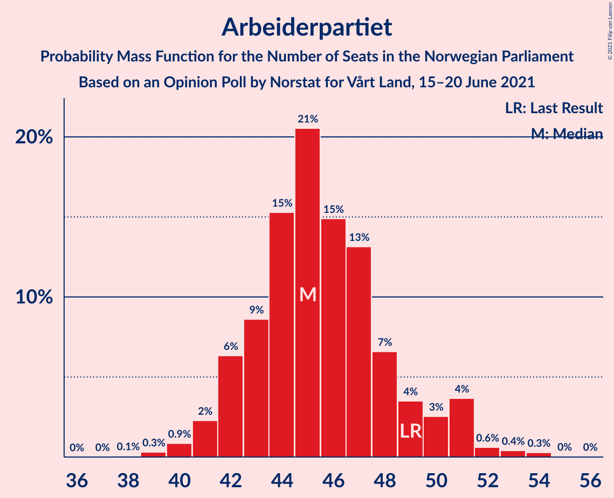
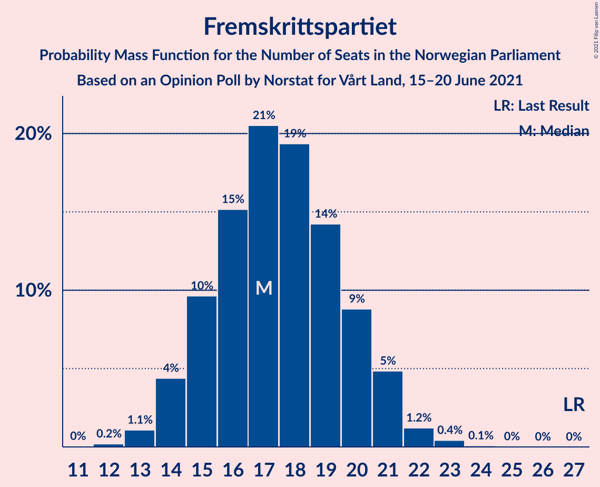
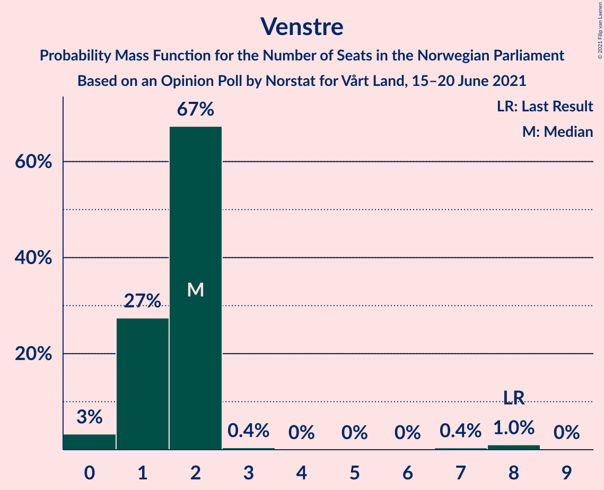
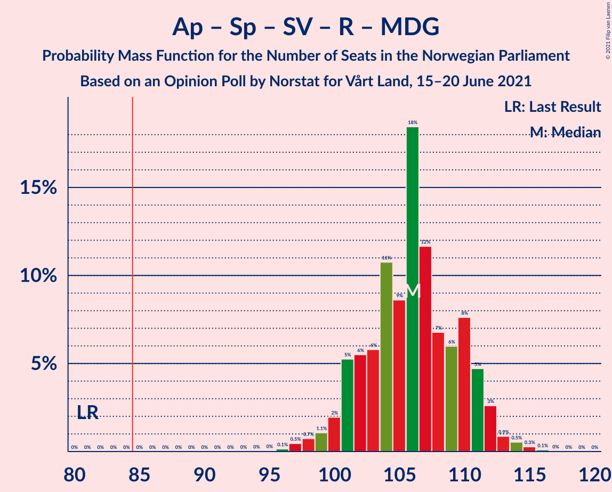
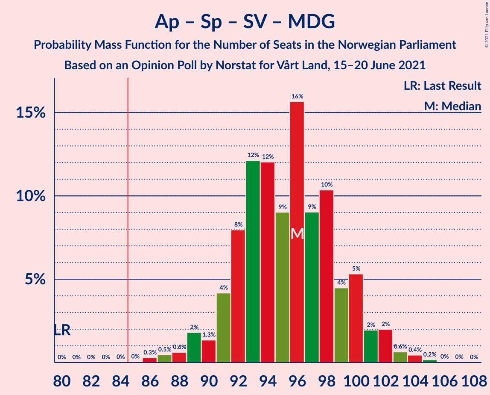
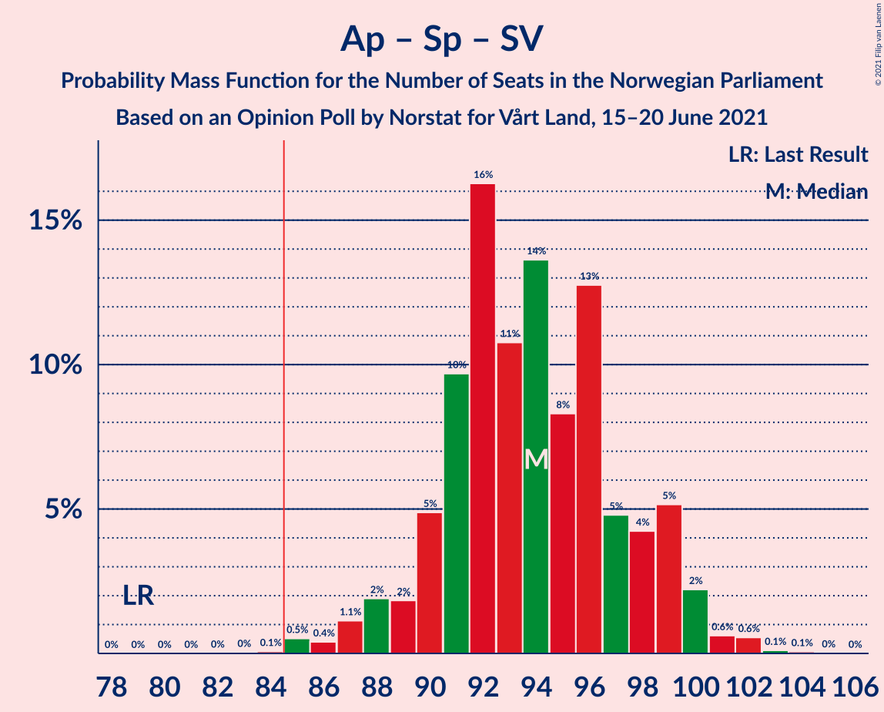
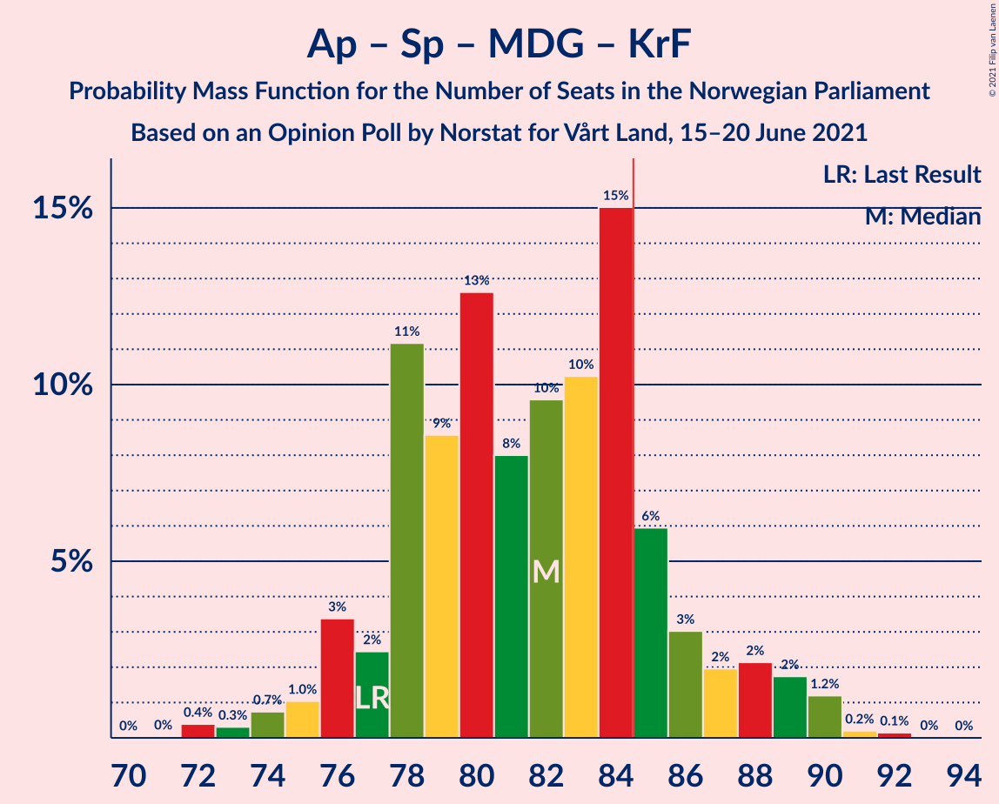

# Opinion Poll by Norstat for Vårt Land, 15–20 June 2021

<a href="#voting-intentions">Voting Intentions</a> | <a href="#seats">Seats</a> | <a href="#coalitions">Coalitions</a> | <a href="#technical-information">Technical Information</a>

## Voting Intentions

### Confidence Intervals

| Party | Last Result | Poll Result | 80% Confidence Interval | 90% Confidence Interval | 95% Confidence Interval | 99% Confidence Interval |
|:-----:|:-----------:|:-----------:|:-----------------------:|:-----------------------:|:-----------------------:|:-----------------------:|
| Arbeiderpartiet | 27.4% | 24.9% | 23.2–26.8% |22.7–27.4% |22.3–27.8% |21.4–28.8% |
| Høyre | 25.0% | 22.2% | 20.5–24.0% |20.0–24.5% |19.6–24.9% |18.8–25.8% |
| Senterpartiet | 10.3% | 17.5% | 16.0–19.2% |15.6–19.7% |15.2–20.1% |14.5–20.9% |
| Fremskrittspartiet | 15.2% | 9.6% | 8.4–10.9% |8.1–11.3% |7.8–11.6% |7.3–12.3% |
| Sosialistisk Venstreparti | 6.0% | 8.4% | 7.3–9.7% |7.0–10.0% |6.8–10.3% |6.3–11.0% |
| Rødt | 2.4% | 5.8% | 4.9–6.9% |4.7–7.2% |4.5–7.5% |4.1–8.1% |
| Miljøpartiet De Grønne | 3.2% | 2.8% | 2.2–3.6% |2.0–3.9% |1.9–4.1% |1.7–4.5% |
| Kristelig Folkeparti | 4.2% | 2.7% | 2.1–3.5% |2.0–3.7% |1.8–3.9% |1.6–4.4% |
| Venstre | 4.4% | 2.6% | 2.0–3.4% |1.9–3.6% |1.7–3.8% |1.5–4.2% |

*Note:* The poll result column reflects the actual value used in the calculations. Published results may vary slightly, and in addition be rounded to fewer digits.

## Seats

### Confidence Intervals

| Party | Last Result | Median | 80% Confidence Interval | 90% Confidence Interval | 95% Confidence Interval | 99% Confidence Interval |
|:-----:|:-----------:|:------:|:-----------------------:|:-----------------------:|:-----------------------:|:-----------------------:|
| <a href="#arbeiderpartiet">Arbeiderpartiet</a> | 49 | 45 | 43–48 |42–50 |42–51 |40–53 |
| <a href="#høyre">Høyre</a> | 45 | 40 | 37–44 |36–44 |35–45 |34–47 |
| <a href="#senterpartiet">Senterpartiet</a> | 19 | 32 | 30–35 |29–36 |29–36 |27–38 |
| <a href="#fremskrittspartiet">Fremskrittspartiet</a> | 27 | 18 | 15–20 |15–20 |15–20 |13–22 |
| <a href="#sosialistisk-venstreparti">Sosialistisk Venstreparti</a> | 11 | 16 | 13–18 |12–18 |12–19 |12–20 |
| <a href="#rødt">Rødt</a> | 1 | 11 | 9–12 |9–13 |8–13 |7–14 |
| <a href="#miljøpartiet-de-grønne">Miljøpartiet De Grønne</a> | 1 | 2 | 1–2 |1–2 |1–2 |0–7 |
| <a href="#kristelig-folkeparti">Kristelig Folkeparti</a> | 8 | 1 | 1–2 |0–3 |0–3 |0–7 |
| <a href="#venstre">Venstre</a> | 8 | 2 | 1–2 |1–2 |0–2 |0–7 |

### Arbeiderpartiet

*For a full overview of the results for this party, see the [Arbeiderpartiet](party-arbeiderpartiet.html) page.*

| Number of Seats | Probability | Accumulated | Special Marks |
|:---------------:|:-----------:|:-----------:|:-------------:|
| 38 | 0.1% | 100% |  |
| 39 | 0.2% | 99.9% |  |
| 40 | 0.7% | 99.7% |  |
| 41 | 0.7% | 99.1% |  |
| 42 | 5% | 98% |  |
| 43 | 22% | 93% |  |
| 44 | 8% | 72% |  |
| 45 | 21% | 63% | Median |
| 46 | 24% | 42% |  |
| 47 | 4% | 18% |  |
| 48 | 8% | 14% |  |
| 49 | 0.7% | 6% | Last Result |
| 50 | 2% | 5% |  |
| 51 | 2% | 4% |  |
| 52 | 0.5% | 1.3% |  |
| 53 | 0.5% | 0.7% |  |
| 54 | 0.2% | 0.3% |  |
| 55 | 0% | 0.1% |  |
| 56 | 0% | 0% |  |

### Høyre

*For a full overview of the results for this party, see the [Høyre](party-høyre.html) page.*

| Number of Seats | Probability | Accumulated | Special Marks |
|:---------------:|:-----------:|:-----------:|:-------------:|
| 33 | 0.1% | 100% |  |
| 34 | 0.8% | 99.9% |  |
| 35 | 3% | 99.1% |  |
| 36 | 3% | 96% |  |
| 37 | 4% | 94% |  |
| 38 | 10% | 89% |  |
| 39 | 6% | 80% |  |
| 40 | 24% | 73% | Median |
| 41 | 14% | 49% |  |
| 42 | 4% | 35% |  |
| 43 | 19% | 31% |  |
| 44 | 9% | 12% |  |
| 45 | 2% | 3% | Last Result |
| 46 | 0.3% | 0.9% |  |
| 47 | 0.5% | 0.6% |  |
| 48 | 0.1% | 0.1% |  |
| 49 | 0% | 0.1% |  |
| 50 | 0% | 0% |  |

### Senterpartiet

*For a full overview of the results for this party, see the [Senterpartiet](party-senterpartiet.html) page.*

| Number of Seats | Probability | Accumulated | Special Marks |
|:---------------:|:-----------:|:-----------:|:-------------:|
| 19 | 0% | 100% | Last Result |
| 20 | 0% | 100% |  |
| 21 | 0% | 100% |  |
| 22 | 0% | 100% |  |
| 23 | 0% | 100% |  |
| 24 | 0% | 100% |  |
| 25 | 0.1% | 100% |  |
| 26 | 0.2% | 99.9% |  |
| 27 | 0.8% | 99.7% |  |
| 28 | 1.1% | 98.9% |  |
| 29 | 3% | 98% |  |
| 30 | 13% | 95% |  |
| 31 | 5% | 82% |  |
| 32 | 33% | 76% | Median |
| 33 | 5% | 43% |  |
| 34 | 22% | 38% |  |
| 35 | 7% | 16% |  |
| 36 | 7% | 9% |  |
| 37 | 1.3% | 2% |  |
| 38 | 0.6% | 1.0% |  |
| 39 | 0.3% | 0.4% |  |
| 40 | 0% | 0.1% |  |
| 41 | 0% | 0.1% |  |
| 42 | 0% | 0.1% |  |
| 43 | 0% | 0% |  |

### Fremskrittspartiet

*For a full overview of the results for this party, see the [Fremskrittspartiet](party-fremskrittspartiet.html) page.*

| Number of Seats | Probability | Accumulated | Special Marks |
|:---------------:|:-----------:|:-----------:|:-------------:|
| 12 | 0.2% | 100% |  |
| 13 | 1.0% | 99.8% |  |
| 14 | 0.9% | 98.8% |  |
| 15 | 9% | 98% |  |
| 16 | 9% | 88% |  |
| 17 | 24% | 79% |  |
| 18 | 23% | 55% | Median |
| 19 | 6% | 32% |  |
| 20 | 24% | 26% |  |
| 21 | 1.2% | 2% |  |
| 22 | 0.5% | 0.9% |  |
| 23 | 0.3% | 0.4% |  |
| 24 | 0.1% | 0.1% |  |
| 25 | 0% | 0% |  |
| 26 | 0% | 0% |  |
| 27 | 0% | 0% | Last Result |

### Sosialistisk Venstreparti

*For a full overview of the results for this party, see the [Sosialistisk Venstreparti](party-sosialistiskvenstreparti.html) page.*

| Number of Seats | Probability | Accumulated | Special Marks |
|:---------------:|:-----------:|:-----------:|:-------------:|
| 10 | 0.1% | 100% |  |
| 11 | 0.4% | 99.9% | Last Result |
| 12 | 5% | 99.5% |  |
| 13 | 17% | 95% |  |
| 14 | 7% | 78% |  |
| 15 | 14% | 71% |  |
| 16 | 21% | 57% | Median |
| 17 | 23% | 36% |  |
| 18 | 10% | 13% |  |
| 19 | 2% | 3% |  |
| 20 | 0.6% | 0.7% |  |
| 21 | 0.1% | 0.1% |  |
| 22 | 0% | 0% |  |

### Rødt

*For a full overview of the results for this party, see the [Rødt](party-rødt.html) page.*

| Number of Seats | Probability | Accumulated | Special Marks |
|:---------------:|:-----------:|:-----------:|:-------------:|
| 1 | 0% | 100% | Last Result |
| 2 | 0.2% | 100% |  |
| 3 | 0% | 99.8% |  |
| 4 | 0% | 99.8% |  |
| 5 | 0% | 99.8% |  |
| 6 | 0% | 99.8% |  |
| 7 | 0.6% | 99.8% |  |
| 8 | 3% | 99.1% |  |
| 9 | 10% | 96% |  |
| 10 | 22% | 86% |  |
| 11 | 17% | 64% | Median |
| 12 | 39% | 47% |  |
| 13 | 6% | 7% |  |
| 14 | 1.1% | 1.5% |  |
| 15 | 0.2% | 0.3% |  |
| 16 | 0.1% | 0.1% |  |
| 17 | 0% | 0% |  |

### Miljøpartiet De Grønne

*For a full overview of the results for this party, see the [Miljøpartiet De Grønne](party-miljøpartietdegrønne.html) page.*

| Number of Seats | Probability | Accumulated | Special Marks |
|:---------------:|:-----------:|:-----------:|:-------------:|
| 0 | 2% | 100% |  |
| 1 | 30% | 98% | Last Result |
| 2 | 66% | 68% | Median |
| 3 | 0.6% | 2% |  |
| 4 | 0.4% | 1.1% |  |
| 5 | 0% | 0.7% |  |
| 6 | 0% | 0.7% |  |
| 7 | 0.3% | 0.6% |  |
| 8 | 0.2% | 0.3% |  |
| 9 | 0.1% | 0.1% |  |
| 10 | 0% | 0% |  |

### Kristelig Folkeparti

*For a full overview of the results for this party, see the [Kristelig Folkeparti](party-kristeligfolkeparti.html) page.*

| Number of Seats | Probability | Accumulated | Special Marks |
|:---------------:|:-----------:|:-----------:|:-------------:|
| 0 | 7% | 100% |  |
| 1 | 68% | 93% | Median |
| 2 | 16% | 25% |  |
| 3 | 8% | 9% |  |
| 4 | 0% | 1.4% |  |
| 5 | 0% | 1.4% |  |
| 6 | 0% | 1.4% |  |
| 7 | 1.0% | 1.3% |  |
| 8 | 0.3% | 0.4% | Last Result |
| 9 | 0% | 0% |  |

### Venstre

*For a full overview of the results for this party, see the [Venstre](party-venstre.html) page.*

| Number of Seats | Probability | Accumulated | Special Marks |
|:---------------:|:-----------:|:-----------:|:-------------:|
| 0 | 5% | 100% |  |
| 1 | 25% | 95% |  |
| 2 | 69% | 70% | Median |
| 3 | 0.6% | 1.2% |  |
| 4 | 0% | 0.6% |  |
| 5 | 0% | 0.6% |  |
| 6 | 0% | 0.6% |  |
| 7 | 0.3% | 0.6% |  |
| 8 | 0.2% | 0.3% | Last Result |
| 9 | 0% | 0% |  |

## Coalitions

### Confidence Intervals

| Coalition | Last Result | Median | Majority? | 80% Confidence Interval | 90% Confidence Interval | 95% Confidence Interval | 99% Confidence Interval |
|:---------:|:-----------:|:------:|:---------:|:-----------------------:|:-----------------------:|:-----------------------:|:-----------------------:|
| Arbeiderpartiet – Senterpartiet – Sosialistisk Venstreparti – Rødt – Miljøpartiet De Grønne | 81 | 106 | 100% | 103–109 | 100–111 | 99–113 | 98–114 |
| Arbeiderpartiet – Senterpartiet – Sosialistisk Venstreparti – Rødt | 80 | 104 | 100% | 101–107 | 99–109 | 97–111 | 97–112 |
| Arbeiderpartiet – Senterpartiet – Sosialistisk Venstreparti – Miljøpartiet De Grønne – Kristelig Folkeparti | 88 | 96 | 100% | 95–99 | 93–102 | 90–103 | 88–104 |
| Arbeiderpartiet – Senterpartiet – Sosialistisk Venstreparti – Miljøpartiet De Grønne | 80 | 95 | 100% | 92–98 | 90–100 | 89–102 | 87–103 |
| Arbeiderpartiet – Senterpartiet – Sosialistisk Venstreparti | 79 | 93 | 99.9% | 91–97 | 89–99 | 87–100 | 86–100 |
| Høyre – Senterpartiet – Fremskrittspartiet – Kristelig Folkeparti – Venstre | 107 | 94 | 99.6% | 91–98 | 90–98 | 88–98 | 85–102 |
| Arbeiderpartiet – Senterpartiet – Miljøpartiet De Grønne – Kristelig Folkeparti | 77 | 80 | 12% | 78–85 | 77–86 | 76–88 | 73–90 |
| Arbeiderpartiet – Senterpartiet – Kristelig Folkeparti | 76 | 79 | 5% | 76–83 | 76–85 | 74–86 | 71–88 |
| Arbeiderpartiet – Senterpartiet | 68 | 77 | 2% | 75–82 | 74–83 | 73–84 | 70–86 |
| Arbeiderpartiet – Sosialistisk Venstreparti – Rødt – Miljøpartiet De Grønne | 62 | 74 | 0.1% | 69–76 | 68–78 | 68–79 | 66–81 |
| Høyre – Fremskrittspartiet – Miljøpartiet De Grønne – Kristelig Folkeparti – Venstre | 89 | 64 | 0% | 59–66 | 57–66 | 57–67 | 54–70 |
| Arbeiderpartiet – Sosialistisk Venstreparti | 60 | 60 | 0% | 57–64 | 57–65 | 56–67 | 54–68 |
| Høyre – Fremskrittspartiet – Kristelig Folkeparti – Venstre | 88 | 62 | 0% | 57–64 | 55–64 | 55–65 | 53–68 |
| Høyre – Fremskrittspartiet – Venstre | 80 | 61 | 0% | 56–62 | 55–63 | 53–63 | 52–67 |
| Høyre – Fremskrittspartiet | 72 | 59 | 0% | 54–61 | 53–62 | 52–63 | 50–65 |
| Høyre – Kristelig Folkeparti – Venstre | 61 | 43 | 0% | 40–47 | 39–47 | 38–48 | 37–50 |
| Senterpartiet – Kristelig Folkeparti – Venstre | 35 | 35 | 0% | 33–39 | 32–39 | 31–41 | 29–43 |

### Arbeiderpartiet – Senterpartiet – Sosialistisk Venstreparti – Rødt – Miljøpartiet De Grønne

| Number of Seats | Probability | Accumulated | Special Marks |
|:---------------:|:-----------:|:-----------:|:-------------:|
| 81 | 0% | 100% | Last Result |
| 82 | 0% | 100% |  |
| 83 | 0% | 100% |  |
| 84 | 0% | 100% |  |
| 85 | 0% | 100% | Majority |
| 86 | 0% | 100% |  |
| 87 | 0% | 100% |  |
| 88 | 0% | 100% |  |
| 89 | 0% | 100% |  |
| 90 | 0% | 100% |  |
| 91 | 0% | 100% |  |
| 92 | 0% | 100% |  |
| 93 | 0% | 100% |  |
| 94 | 0% | 100% |  |
| 95 | 0% | 100% |  |
| 96 | 0.1% | 100% |  |
| 97 | 0.2% | 99.8% |  |
| 98 | 0.9% | 99.7% |  |
| 99 | 3% | 98.8% |  |
| 100 | 2% | 96% |  |
| 101 | 2% | 94% |  |
| 102 | 1.1% | 92% |  |
| 103 | 4% | 91% |  |
| 104 | 5% | 87% |  |
| 105 | 15% | 82% |  |
| 106 | 33% | 67% | Median |
| 107 | 13% | 34% |  |
| 108 | 6% | 21% |  |
| 109 | 7% | 15% |  |
| 110 | 3% | 8% |  |
| 111 | 2% | 6% |  |
| 112 | 0.6% | 3% |  |
| 113 | 0.5% | 3% |  |
| 114 | 2% | 2% |  |
| 115 | 0.1% | 0.1% |  |
| 116 | 0% | 0.1% |  |
| 117 | 0% | 0% |  |

### Arbeiderpartiet – Senterpartiet – Sosialistisk Venstreparti – Rødt

| Number of Seats | Probability | Accumulated | Special Marks |
|:---------------:|:-----------:|:-----------:|:-------------:|
| 80 | 0% | 100% | Last Result |
| 81 | 0% | 100% |  |
| 82 | 0% | 100% |  |
| 83 | 0% | 100% |  |
| 84 | 0% | 100% |  |
| 85 | 0% | 100% | Majority |
| 86 | 0% | 100% |  |
| 87 | 0% | 100% |  |
| 88 | 0% | 100% |  |
| 89 | 0% | 100% |  |
| 90 | 0% | 100% |  |
| 91 | 0% | 100% |  |
| 92 | 0% | 100% |  |
| 93 | 0% | 100% |  |
| 94 | 0.1% | 100% |  |
| 95 | 0.1% | 99.9% |  |
| 96 | 0.2% | 99.8% |  |
| 97 | 3% | 99.6% |  |
| 98 | 0.5% | 97% |  |
| 99 | 4% | 96% |  |
| 100 | 1.0% | 93% |  |
| 101 | 4% | 92% |  |
| 102 | 4% | 88% |  |
| 103 | 13% | 84% |  |
| 104 | 36% | 71% | Median |
| 105 | 3% | 35% |  |
| 106 | 18% | 33% |  |
| 107 | 6% | 15% |  |
| 108 | 3% | 9% |  |
| 109 | 0.9% | 6% |  |
| 110 | 2% | 5% |  |
| 111 | 0.5% | 3% |  |
| 112 | 2% | 2% |  |
| 113 | 0% | 0.1% |  |
| 114 | 0% | 0.1% |  |
| 115 | 0% | 0% |  |

### Arbeiderpartiet – Senterpartiet – Sosialistisk Venstreparti – Miljøpartiet De Grønne – Kristelig Folkeparti

| Number of Seats | Probability | Accumulated | Special Marks |
|:---------------:|:-----------:|:-----------:|:-------------:|
| 87 | 0.1% | 100% |  |
| 88 | 0.7% | 99.8% | Last Result |
| 89 | 0.5% | 99.2% |  |
| 90 | 2% | 98.7% |  |
| 91 | 0.4% | 96% |  |
| 92 | 0.7% | 96% |  |
| 93 | 4% | 95% |  |
| 94 | 0.8% | 91% |  |
| 95 | 36% | 90% |  |
| 96 | 7% | 54% | Median |
| 97 | 27% | 47% |  |
| 98 | 5% | 20% |  |
| 99 | 5% | 15% |  |
| 100 | 2% | 10% |  |
| 101 | 2% | 8% |  |
| 102 | 3% | 6% |  |
| 103 | 2% | 3% |  |
| 104 | 0.6% | 1.0% |  |
| 105 | 0.2% | 0.5% |  |
| 106 | 0.2% | 0.3% |  |
| 107 | 0.1% | 0.1% |  |
| 108 | 0% | 0.1% |  |
| 109 | 0% | 0.1% |  |
| 110 | 0% | 0% |  |

### Arbeiderpartiet – Senterpartiet – Sosialistisk Venstreparti – Miljøpartiet De Grønne

| Number of Seats | Probability | Accumulated | Special Marks |
|:---------------:|:-----------:|:-----------:|:-------------:|
| 80 | 0% | 100% | Last Result |
| 81 | 0% | 100% |  |
| 82 | 0% | 100% |  |
| 83 | 0% | 100% |  |
| 84 | 0% | 100% |  |
| 85 | 0.1% | 100% | Majority |
| 86 | 0.1% | 99.9% |  |
| 87 | 0.8% | 99.8% |  |
| 88 | 0.3% | 99.0% |  |
| 89 | 3% | 98.7% |  |
| 90 | 3% | 96% |  |
| 91 | 2% | 94% |  |
| 92 | 2% | 92% |  |
| 93 | 4% | 90% |  |
| 94 | 35% | 85% |  |
| 95 | 14% | 50% | Median |
| 96 | 20% | 36% |  |
| 97 | 2% | 16% |  |
| 98 | 4% | 14% |  |
| 99 | 3% | 10% |  |
| 100 | 2% | 7% |  |
| 101 | 0.8% | 5% |  |
| 102 | 3% | 4% |  |
| 103 | 0.4% | 0.7% |  |
| 104 | 0.1% | 0.3% |  |
| 105 | 0.1% | 0.2% |  |
| 106 | 0.1% | 0.1% |  |
| 107 | 0% | 0% |  |

### Arbeiderpartiet – Senterpartiet – Sosialistisk Venstreparti

| Number of Seats | Probability | Accumulated | Special Marks |
|:---------------:|:-----------:|:-----------:|:-------------:|
| 79 | 0% | 100% | Last Result |
| 80 | 0% | 100% |  |
| 81 | 0% | 100% |  |
| 82 | 0% | 100% |  |
| 83 | 0.1% | 100% |  |
| 84 | 0.1% | 99.9% |  |
| 85 | 0.1% | 99.9% | Majority |
| 86 | 0.9% | 99.8% |  |
| 87 | 2% | 98.9% |  |
| 88 | 0.4% | 96% |  |
| 89 | 3% | 96% |  |
| 90 | 3% | 93% |  |
| 91 | 4% | 90% |  |
| 92 | 32% | 86% |  |
| 93 | 15% | 54% | Median |
| 94 | 11% | 39% |  |
| 95 | 11% | 28% |  |
| 96 | 5% | 17% |  |
| 97 | 3% | 12% |  |
| 98 | 2% | 8% |  |
| 99 | 2% | 6% |  |
| 100 | 4% | 4% |  |
| 101 | 0.1% | 0.5% |  |
| 102 | 0.2% | 0.4% |  |
| 103 | 0% | 0.2% |  |
| 104 | 0% | 0.1% |  |
| 105 | 0.1% | 0.1% |  |
| 106 | 0% | 0% |  |

### Høyre – Senterpartiet – Fremskrittspartiet – Kristelig Folkeparti – Venstre

| Number of Seats | Probability | Accumulated | Special Marks |
|:---------------:|:-----------:|:-----------:|:-------------:|
| 82 | 0.1% | 100% |  |
| 83 | 0.1% | 99.9% |  |
| 84 | 0.2% | 99.8% |  |
| 85 | 0.4% | 99.6% | Majority |
| 86 | 0.5% | 99.2% |  |
| 87 | 0.5% | 98.7% |  |
| 88 | 1.1% | 98% |  |
| 89 | 1.0% | 97% |  |
| 90 | 5% | 96% |  |
| 91 | 7% | 91% |  |
| 92 | 5% | 84% |  |
| 93 | 19% | 79% | Median |
| 94 | 15% | 60% |  |
| 95 | 23% | 45% |  |
| 96 | 5% | 22% |  |
| 97 | 4% | 17% |  |
| 98 | 10% | 13% |  |
| 99 | 1.0% | 2% |  |
| 100 | 0.5% | 1.4% |  |
| 101 | 0.4% | 0.9% |  |
| 102 | 0.3% | 0.5% |  |
| 103 | 0.2% | 0.2% |  |
| 104 | 0% | 0.1% |  |
| 105 | 0% | 0% |  |
| 106 | 0% | 0% |  |
| 107 | 0% | 0% | Last Result |

### Arbeiderpartiet – Senterpartiet – Miljøpartiet De Grønne – Kristelig Folkeparti

| Number of Seats | Probability | Accumulated | Special Marks |
|:---------------:|:-----------:|:-----------:|:-------------:|
| 71 | 0.1% | 100% |  |
| 72 | 0.3% | 99.9% |  |
| 73 | 0.3% | 99.6% |  |
| 74 | 0.5% | 99.3% |  |
| 75 | 0.7% | 98.8% |  |
| 76 | 3% | 98% |  |
| 77 | 1.1% | 96% | Last Result |
| 78 | 21% | 94% |  |
| 79 | 22% | 74% |  |
| 80 | 5% | 52% | Median |
| 81 | 5% | 46% |  |
| 82 | 13% | 41% |  |
| 83 | 5% | 28% |  |
| 84 | 12% | 24% |  |
| 85 | 6% | 12% | Majority |
| 86 | 2% | 6% |  |
| 87 | 0.8% | 3% |  |
| 88 | 0.4% | 3% |  |
| 89 | 2% | 2% |  |
| 90 | 0.2% | 0.6% |  |
| 91 | 0.1% | 0.5% |  |
| 92 | 0.3% | 0.4% |  |
| 93 | 0% | 0% |  |

### Arbeiderpartiet – Senterpartiet – Kristelig Folkeparti

| Number of Seats | Probability | Accumulated | Special Marks |
|:---------------:|:-----------:|:-----------:|:-------------:|
| 70 | 0.1% | 100% |  |
| 71 | 0.5% | 99.8% |  |
| 72 | 0.1% | 99.4% |  |
| 73 | 0.5% | 99.2% |  |
| 74 | 3% | 98.7% |  |
| 75 | 0.6% | 96% |  |
| 76 | 20% | 95% | Last Result |
| 77 | 13% | 75% |  |
| 78 | 11% | 62% | Median |
| 79 | 9% | 51% |  |
| 80 | 12% | 43% |  |
| 81 | 5% | 30% |  |
| 82 | 11% | 25% |  |
| 83 | 6% | 14% |  |
| 84 | 3% | 8% |  |
| 85 | 2% | 5% | Majority |
| 86 | 0.7% | 3% |  |
| 87 | 2% | 2% |  |
| 88 | 0.1% | 0.5% |  |
| 89 | 0.1% | 0.5% |  |
| 90 | 0.1% | 0.4% |  |
| 91 | 0.3% | 0.3% |  |
| 92 | 0% | 0% |  |

### Arbeiderpartiet – Senterpartiet

| Number of Seats | Probability | Accumulated | Special Marks |
|:---------------:|:-----------:|:-----------:|:-------------:|
| 68 | 0% | 100% | Last Result |
| 69 | 0.1% | 100% |  |
| 70 | 0.6% | 99.9% |  |
| 71 | 0.2% | 99.3% |  |
| 72 | 0.5% | 99.1% |  |
| 73 | 3% | 98.6% |  |
| 74 | 1.2% | 95% |  |
| 75 | 20% | 94% |  |
| 76 | 15% | 74% |  |
| 77 | 14% | 59% | Median |
| 78 | 10% | 45% |  |
| 79 | 7% | 36% |  |
| 80 | 14% | 28% |  |
| 81 | 1.5% | 15% |  |
| 82 | 4% | 13% |  |
| 83 | 5% | 9% |  |
| 84 | 2% | 4% |  |
| 85 | 0.2% | 2% | Majority |
| 86 | 2% | 2% |  |
| 87 | 0% | 0.4% |  |
| 88 | 0.2% | 0.3% |  |
| 89 | 0.1% | 0.1% |  |
| 90 | 0% | 0% |  |

### Arbeiderpartiet – Sosialistisk Venstreparti – Rødt – Miljøpartiet De Grønne

| Number of Seats | Probability | Accumulated | Special Marks |
|:---------------:|:-----------:|:-----------:|:-------------:|
| 62 | 0% | 100% | Last Result |
| 63 | 0.1% | 100% |  |
| 64 | 0.1% | 99.9% |  |
| 65 | 0.1% | 99.8% |  |
| 66 | 0.2% | 99.7% |  |
| 67 | 0.6% | 99.4% |  |
| 68 | 5% | 98.8% |  |
| 69 | 6% | 94% |  |
| 70 | 3% | 89% |  |
| 71 | 15% | 85% |  |
| 72 | 5% | 70% |  |
| 73 | 6% | 65% |  |
| 74 | 23% | 59% | Median |
| 75 | 14% | 36% |  |
| 76 | 13% | 22% |  |
| 77 | 0.6% | 8% |  |
| 78 | 3% | 8% |  |
| 79 | 3% | 4% |  |
| 80 | 0.6% | 2% |  |
| 81 | 0.7% | 1.1% |  |
| 82 | 0.1% | 0.4% |  |
| 83 | 0.2% | 0.3% |  |
| 84 | 0% | 0.1% |  |
| 85 | 0% | 0.1% | Majority |
| 86 | 0% | 0% |  |

### Høyre – Fremskrittspartiet – Miljøpartiet De Grønne – Kristelig Folkeparti – Venstre

| Number of Seats | Probability | Accumulated | Special Marks |
|:---------------:|:-----------:|:-----------:|:-------------:|
| 52 | 0.1% | 100% |  |
| 53 | 0.4% | 99.9% |  |
| 54 | 0.1% | 99.6% |  |
| 55 | 0.7% | 99.4% |  |
| 56 | 0.4% | 98.8% |  |
| 57 | 4% | 98% |  |
| 58 | 1.1% | 94% |  |
| 59 | 8% | 93% |  |
| 60 | 0.9% | 85% |  |
| 61 | 8% | 84% |  |
| 62 | 8% | 76% |  |
| 63 | 17% | 68% | Median |
| 64 | 3% | 51% |  |
| 65 | 36% | 48% |  |
| 66 | 10% | 12% |  |
| 67 | 2% | 3% |  |
| 68 | 0.3% | 1.4% |  |
| 69 | 0.5% | 1.1% |  |
| 70 | 0.1% | 0.5% |  |
| 71 | 0.2% | 0.4% |  |
| 72 | 0.1% | 0.2% |  |
| 73 | 0.1% | 0.1% |  |
| 74 | 0% | 0.1% |  |
| 75 | 0% | 0.1% |  |
| 76 | 0% | 0% |  |
| 77 | 0% | 0% |  |
| 78 | 0% | 0% |  |
| 79 | 0% | 0% |  |
| 80 | 0% | 0% |  |
| 81 | 0% | 0% |  |
| 82 | 0% | 0% |  |
| 83 | 0% | 0% |  |
| 84 | 0% | 0% |  |
| 85 | 0% | 0% | Majority |
| 86 | 0% | 0% |  |
| 87 | 0% | 0% |  |
| 88 | 0% | 0% |  |
| 89 | 0% | 0% | Last Result |

### Arbeiderpartiet – Sosialistisk Venstreparti

| Number of Seats | Probability | Accumulated | Special Marks |
|:---------------:|:-----------:|:-----------:|:-------------:|
| 51 | 0% | 100% |  |
| 52 | 0.1% | 99.9% |  |
| 53 | 0.2% | 99.8% |  |
| 54 | 0.2% | 99.6% |  |
| 55 | 0.4% | 99.4% |  |
| 56 | 3% | 99.1% |  |
| 57 | 6% | 96% |  |
| 58 | 4% | 89% |  |
| 59 | 11% | 86% |  |
| 60 | 34% | 75% | Last Result |
| 61 | 5% | 40% | Median |
| 62 | 13% | 36% |  |
| 63 | 12% | 23% |  |
| 64 | 4% | 11% |  |
| 65 | 3% | 7% |  |
| 66 | 2% | 5% |  |
| 67 | 2% | 3% |  |
| 68 | 0.3% | 0.8% |  |
| 69 | 0.2% | 0.5% |  |
| 70 | 0.3% | 0.3% |  |
| 71 | 0% | 0% |  |

### Høyre – Fremskrittspartiet – Kristelig Folkeparti – Venstre

| Number of Seats | Probability | Accumulated | Special Marks |
|:---------------:|:-----------:|:-----------:|:-------------:|
| 51 | 0.1% | 100% |  |
| 52 | 0.4% | 99.9% |  |
| 53 | 0.3% | 99.5% |  |
| 54 | 0.5% | 99.2% |  |
| 55 | 4% | 98.7% |  |
| 56 | 0.8% | 95% |  |
| 57 | 5% | 94% |  |
| 58 | 5% | 89% |  |
| 59 | 5% | 84% |  |
| 60 | 10% | 79% |  |
| 61 | 6% | 69% | Median |
| 62 | 14% | 63% |  |
| 63 | 32% | 49% |  |
| 64 | 14% | 17% |  |
| 65 | 0.7% | 3% |  |
| 66 | 1.3% | 2% |  |
| 67 | 0.5% | 1.2% |  |
| 68 | 0.3% | 0.7% |  |
| 69 | 0.1% | 0.4% |  |
| 70 | 0.1% | 0.3% |  |
| 71 | 0.1% | 0.2% |  |
| 72 | 0.1% | 0.1% |  |
| 73 | 0% | 0.1% |  |
| 74 | 0% | 0% |  |
| 75 | 0% | 0% |  |
| 76 | 0% | 0% |  |
| 77 | 0% | 0% |  |
| 78 | 0% | 0% |  |
| 79 | 0% | 0% |  |
| 80 | 0% | 0% |  |
| 81 | 0% | 0% |  |
| 82 | 0% | 0% |  |
| 83 | 0% | 0% |  |
| 84 | 0% | 0% |  |
| 85 | 0% | 0% | Majority |
| 86 | 0% | 0% |  |
| 87 | 0% | 0% |  |
| 88 | 0% | 0% | Last Result |

### Høyre – Fremskrittspartiet – Venstre

| Number of Seats | Probability | Accumulated | Special Marks |
|:---------------:|:-----------:|:-----------:|:-------------:|
| 49 | 0% | 100% |  |
| 50 | 0.1% | 99.9% |  |
| 51 | 0.3% | 99.9% |  |
| 52 | 0.8% | 99.5% |  |
| 53 | 2% | 98.7% |  |
| 54 | 0.5% | 97% |  |
| 55 | 5% | 96% |  |
| 56 | 3% | 91% |  |
| 57 | 9% | 88% |  |
| 58 | 3% | 79% |  |
| 59 | 9% | 76% |  |
| 60 | 5% | 67% | Median |
| 61 | 13% | 61% |  |
| 62 | 43% | 49% |  |
| 63 | 3% | 5% |  |
| 64 | 0.6% | 2% |  |
| 65 | 0.4% | 1.5% |  |
| 66 | 0.5% | 1.0% |  |
| 67 | 0.3% | 0.6% |  |
| 68 | 0.1% | 0.3% |  |
| 69 | 0.1% | 0.2% |  |
| 70 | 0.1% | 0.1% |  |
| 71 | 0.1% | 0.1% |  |
| 72 | 0% | 0% |  |
| 73 | 0% | 0% |  |
| 74 | 0% | 0% |  |
| 75 | 0% | 0% |  |
| 76 | 0% | 0% |  |
| 77 | 0% | 0% |  |
| 78 | 0% | 0% |  |
| 79 | 0% | 0% |  |
| 80 | 0% | 0% | Last Result |

### Høyre – Fremskrittspartiet

| Number of Seats | Probability | Accumulated | Special Marks |
|:---------------:|:-----------:|:-----------:|:-------------:|
| 48 | 0.1% | 100% |  |
| 49 | 0.3% | 99.9% |  |
| 50 | 0.6% | 99.5% |  |
| 51 | 0.6% | 99.0% |  |
| 52 | 2% | 98% |  |
| 53 | 3% | 96% |  |
| 54 | 5% | 93% |  |
| 55 | 6% | 88% |  |
| 56 | 5% | 82% |  |
| 57 | 4% | 78% |  |
| 58 | 11% | 73% | Median |
| 59 | 13% | 62% |  |
| 60 | 34% | 49% |  |
| 61 | 10% | 15% |  |
| 62 | 3% | 5% |  |
| 63 | 2% | 3% |  |
| 64 | 0.3% | 1.0% |  |
| 65 | 0.3% | 0.6% |  |
| 66 | 0.2% | 0.4% |  |
| 67 | 0.1% | 0.2% |  |
| 68 | 0.1% | 0.1% |  |
| 69 | 0% | 0% |  |
| 70 | 0% | 0% |  |
| 71 | 0% | 0% |  |
| 72 | 0% | 0% | Last Result |

### Høyre – Kristelig Folkeparti – Venstre

| Number of Seats | Probability | Accumulated | Special Marks |
|:---------------:|:-----------:|:-----------:|:-------------:|
| 36 | 0.2% | 100% |  |
| 37 | 0.6% | 99.8% |  |
| 38 | 3% | 99.3% |  |
| 39 | 4% | 96% |  |
| 40 | 4% | 92% |  |
| 41 | 8% | 88% |  |
| 42 | 5% | 81% |  |
| 43 | 26% | 76% | Median |
| 44 | 16% | 50% |  |
| 45 | 5% | 34% |  |
| 46 | 16% | 29% |  |
| 47 | 9% | 13% |  |
| 48 | 2% | 4% |  |
| 49 | 0.5% | 2% |  |
| 50 | 1.0% | 1.3% |  |
| 51 | 0.2% | 0.3% |  |
| 52 | 0.1% | 0.2% |  |
| 53 | 0% | 0.1% |  |
| 54 | 0% | 0% |  |
| 55 | 0% | 0% |  |
| 56 | 0% | 0% |  |
| 57 | 0% | 0% |  |
| 58 | 0% | 0% |  |
| 59 | 0% | 0% |  |
| 60 | 0% | 0% |  |
| 61 | 0% | 0% | Last Result |

### Senterpartiet – Kristelig Folkeparti – Venstre

| Number of Seats | Probability | Accumulated | Special Marks |
|:---------------:|:-----------:|:-----------:|:-------------:|
| 27 | 0.1% | 100% |  |
| 28 | 0.1% | 99.9% |  |
| 29 | 0.3% | 99.7% |  |
| 30 | 2% | 99.5% |  |
| 31 | 1.3% | 98% |  |
| 32 | 1.5% | 96% |  |
| 33 | 12% | 95% |  |
| 34 | 7% | 82% |  |
| 35 | 30% | 75% | Last Result, Median |
| 36 | 13% | 46% |  |
| 37 | 17% | 33% |  |
| 38 | 5% | 16% |  |
| 39 | 8% | 11% |  |
| 40 | 0.7% | 3% |  |
| 41 | 2% | 3% |  |
| 42 | 0.5% | 1.1% |  |
| 43 | 0.2% | 0.6% |  |
| 44 | 0.1% | 0.4% |  |
| 45 | 0.2% | 0.3% |  |
| 46 | 0.1% | 0.1% |  |
| 47 | 0% | 0% |  |

## Technical Information

### Opinion Poll

+ **Polling firm:** Norstat
+ **Commissioner(s):** Vårt Land
+ **Fieldwork period:** 15–20 June 2021

### Calculations

+ **Sample size:** 930
+ **Simulations done:** 131,072
+ **Error estimate:** 1.22%

