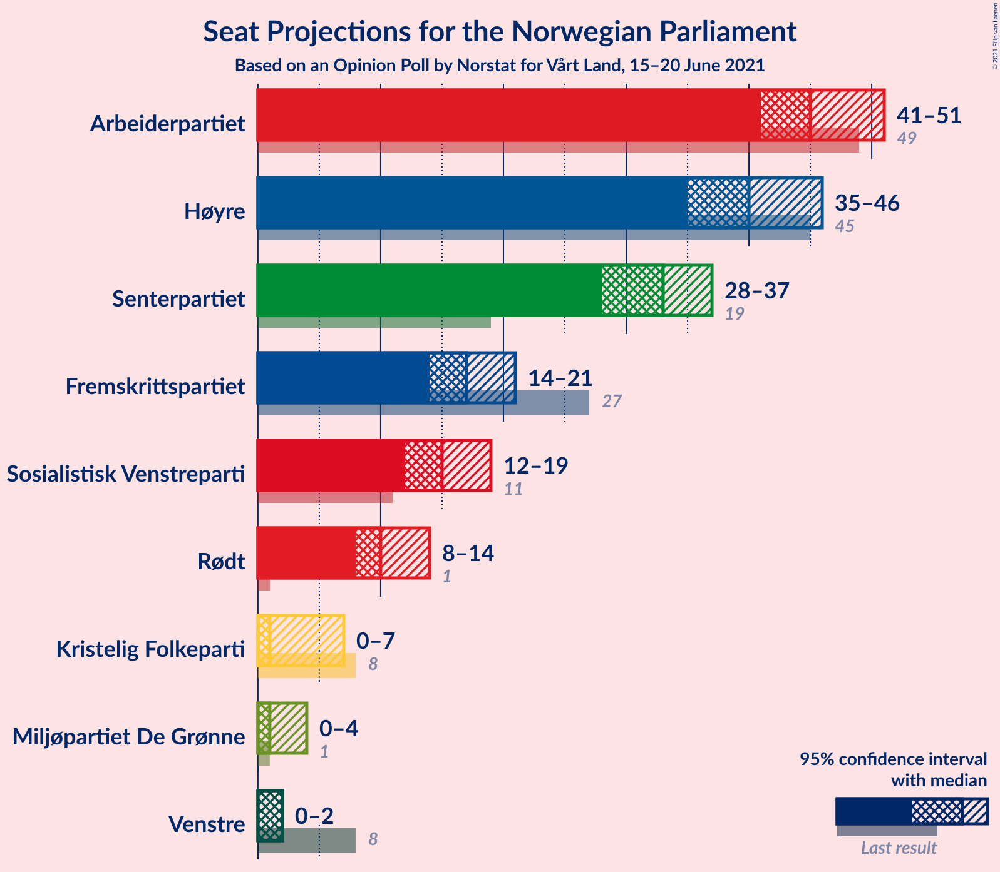
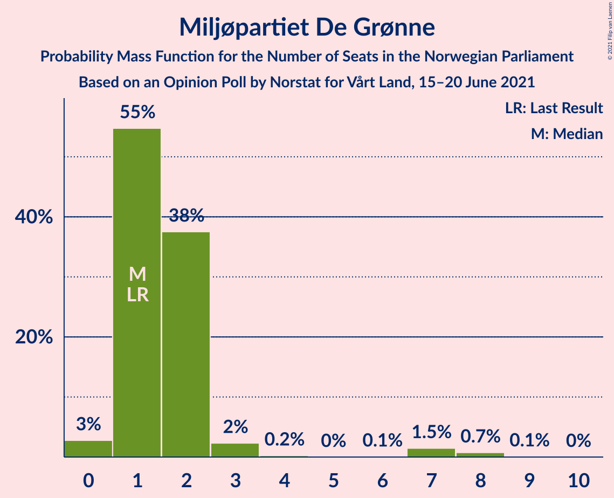
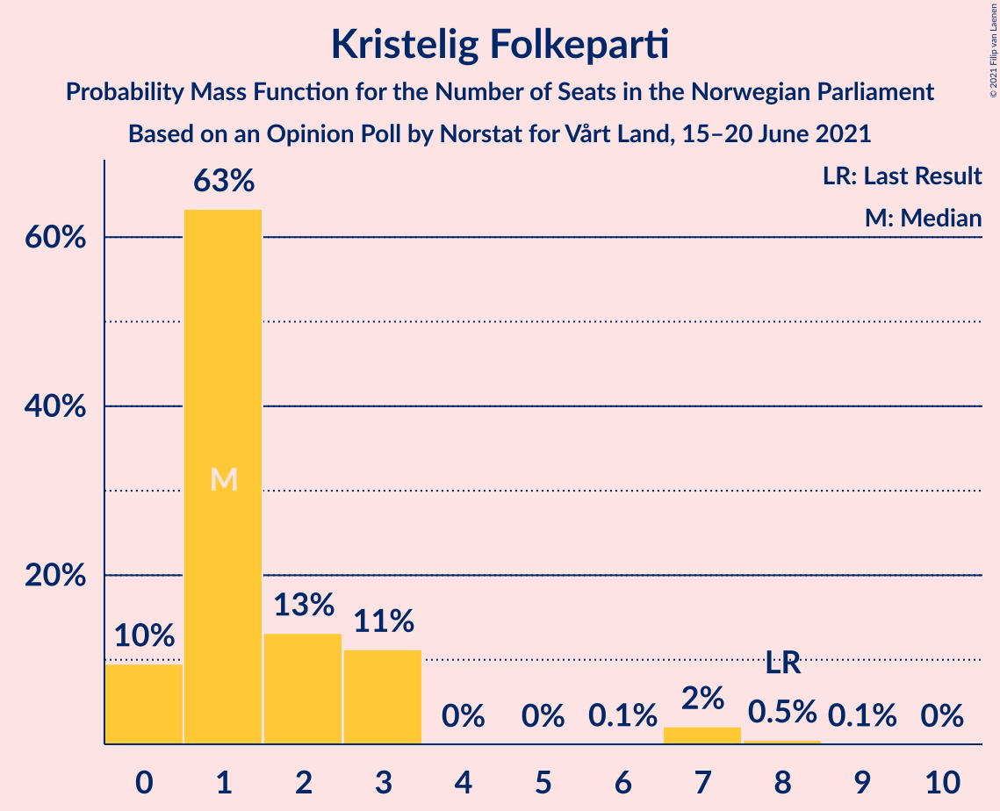
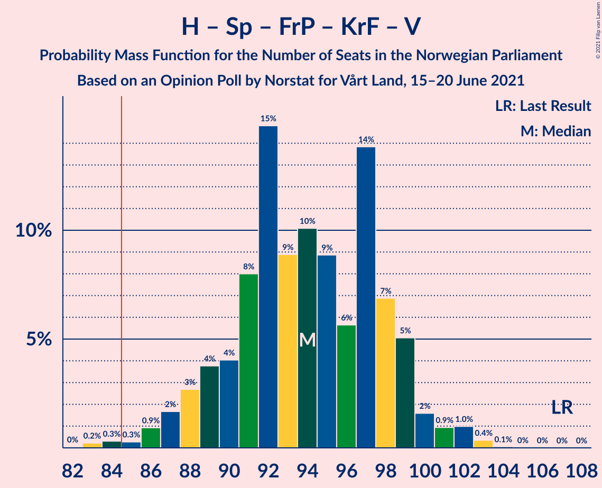
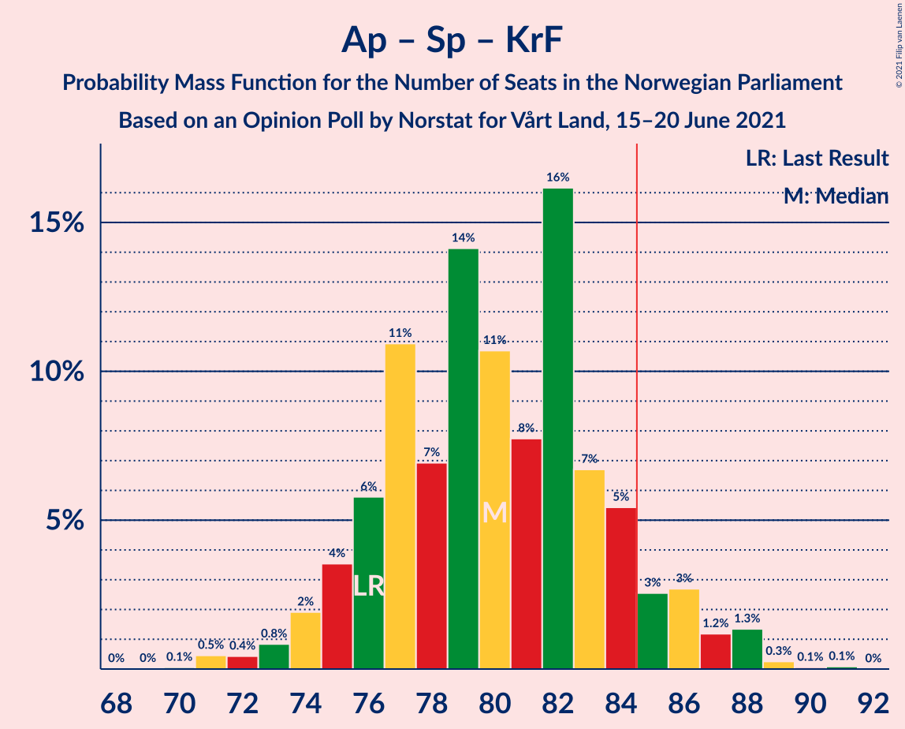
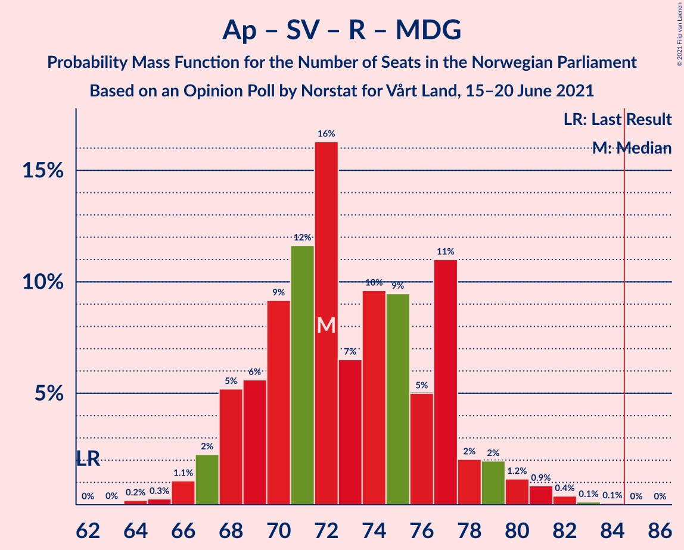
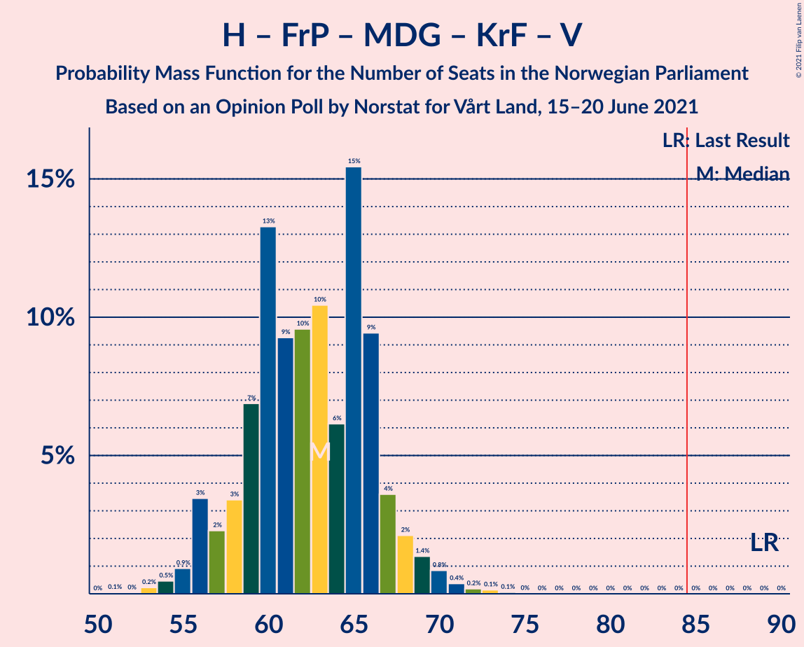
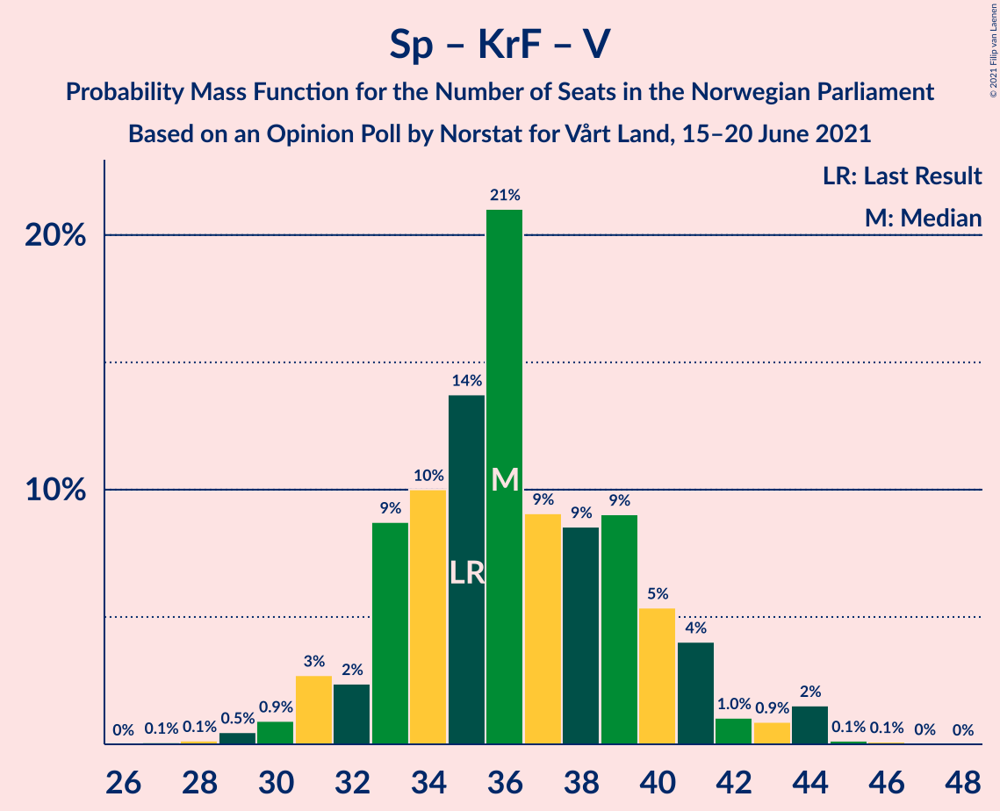

# Opinion Poll by Norstat for Vårt Land, 15–20 June 2021

<a href="#voting-intentions">Voting Intentions</a> | <a href="#seats">Seats</a> | <a href="#coalitions">Coalitions</a> | <a href="#technical-information">Technical Information</a>

## Voting Intentions

### Confidence Intervals

| Party | Last Result | Poll Result | 80% Confidence Interval | 90% Confidence Interval | 95% Confidence Interval | 99% Confidence Interval |
|:-----:|:-----------:|:-----------:|:-----------------------:|:-----------------------:|:-----------------------:|:-----------------------:|
| Arbeiderpartiet | 27.4% | 24.9% | 23.2–26.8% |22.7–27.4% |22.3–27.8% |21.4–28.8% |
| Høyre | 25.0% | 22.2% | 20.5–24.0% |20.0–24.5% |19.6–24.9% |18.8–25.8% |
| Senterpartiet | 10.3% | 17.5% | 16.0–19.2% |15.6–19.7% |15.2–20.1% |14.5–20.9% |
| Fremskrittspartiet | 15.2% | 9.6% | 8.4–10.9% |8.1–11.3% |7.8–11.6% |7.3–12.3% |
| Sosialistisk Venstreparti | 6.0% | 8.4% | 7.3–9.7% |7.0–10.0% |6.8–10.3% |6.3–11.0% |
| Rødt | 2.4% | 5.8% | 4.9–6.9% |4.7–7.2% |4.5–7.5% |4.1–8.1% |
| Miljøpartiet De Grønne | 3.2% | 2.8% | 2.2–3.6% |2.0–3.9% |1.9–4.1% |1.7–4.5% |
| Kristelig Folkeparti | 4.2% | 2.7% | 2.1–3.5% |2.0–3.7% |1.8–3.9% |1.6–4.4% |
| Venstre | 4.4% | 2.6% | 2.0–3.4% |1.9–3.6% |1.7–3.8% |1.5–4.2% |

*Note:* The poll result column reflects the actual value used in the calculations. Published results may vary slightly, and in addition be rounded to fewer digits.

## Seats

### Confidence Intervals

| Party | Last Result | Median | 80% Confidence Interval | 90% Confidence Interval | 95% Confidence Interval | 99% Confidence Interval |
|:-----:|:-----------:|:------:|:-----------------------:|:-----------------------:|:-----------------------:|:-----------------------:|
| <a href="#arbeiderpartiet">Arbeiderpartiet</a> | 49 | 45 | 43–49 |42–51 |41–51 |40–53 |
| <a href="#høyre">Høyre</a> | 45 | 40 | 36–44 |36–45 |35–46 |34–47 |
| <a href="#senterpartiet">Senterpartiet</a> | 19 | 33 | 30–36 |29–36 |28–37 |27–39 |
| <a href="#fremskrittspartiet">Fremskrittspartiet</a> | 27 | 17 | 15–20 |14–21 |14–21 |13–23 |
| <a href="#sosialistisk-venstreparti">Sosialistisk Venstreparti</a> | 11 | 15 | 13–18 |12–18 |12–19 |11–20 |
| <a href="#rødt">Rødt</a> | 1 | 10 | 9–13 |8–13 |8–14 |7–15 |
| <a href="#miljøpartiet-de-grønne">Miljøpartiet De Grønne</a> | 1 | 1 | 1–2 |1–2 |0–4 |0–8 |
| <a href="#kristelig-folkeparti">Kristelig Folkeparti</a> | 8 | 1 | 1–3 |0–3 |0–7 |0–8 |
| <a href="#venstre">Venstre</a> | 8 | 2 | 1–2 |1–2 |0–2 |0–8 |

### Arbeiderpartiet

*For a full overview of the results for this party, see the [Arbeiderpartiet](party-arbeiderpartiet.html) page.*

| Number of Seats | Probability | Accumulated | Special Marks |
|:---------------:|:-----------:|:-----------:|:-------------:|
| 38 | 0.1% | 100% |  |
| 39 | 0.3% | 99.9% |  |
| 40 | 0.9% | 99.6% |  |
| 41 | 2% | 98.7% |  |
| 42 | 6% | 96% |  |
| 43 | 9% | 90% |  |
| 44 | 15% | 82% |  |
| 45 | 21% | 66% | Median |
| 46 | 15% | 46% |  |
| 47 | 13% | 31% |  |
| 48 | 7% | 18% |  |
| 49 | 4% | 11% | Last Result |
| 50 | 3% | 8% |  |
| 51 | 4% | 5% |  |
| 52 | 0.6% | 1.4% |  |
| 53 | 0.4% | 0.8% |  |
| 54 | 0.3% | 0.4% |  |
| 55 | 0% | 0.1% |  |
| 56 | 0% | 0% |  |

### Høyre

*For a full overview of the results for this party, see the [Høyre](party-høyre.html) page.*

| Number of Seats | Probability | Accumulated | Special Marks |
|:---------------:|:-----------:|:-----------:|:-------------:|
| 32 | 0.1% | 100% |  |
| 33 | 0.3% | 99.9% |  |
| 34 | 0.5% | 99.6% |  |
| 35 | 3% | 99.1% |  |
| 36 | 7% | 96% |  |
| 37 | 6% | 89% |  |
| 38 | 10% | 83% |  |
| 39 | 13% | 73% |  |
| 40 | 13% | 59% | Median |
| 41 | 13% | 46% |  |
| 42 | 11% | 34% |  |
| 43 | 11% | 22% |  |
| 44 | 6% | 11% |  |
| 45 | 2% | 5% | Last Result |
| 46 | 2% | 3% |  |
| 47 | 0.9% | 1.3% |  |
| 48 | 0.2% | 0.4% |  |
| 49 | 0.1% | 0.2% |  |
| 50 | 0% | 0% |  |

### Senterpartiet

*For a full overview of the results for this party, see the [Senterpartiet](party-senterpartiet.html) page.*

| Number of Seats | Probability | Accumulated | Special Marks |
|:---------------:|:-----------:|:-----------:|:-------------:|
| 19 | 0% | 100% | Last Result |
| 20 | 0% | 100% |  |
| 21 | 0% | 100% |  |
| 22 | 0% | 100% |  |
| 23 | 0% | 100% |  |
| 24 | 0% | 100% |  |
| 25 | 0.1% | 100% |  |
| 26 | 0.4% | 99.9% |  |
| 27 | 0.8% | 99.5% |  |
| 28 | 3% | 98.7% |  |
| 29 | 2% | 96% |  |
| 30 | 9% | 94% |  |
| 31 | 6% | 85% |  |
| 32 | 18% | 79% |  |
| 33 | 16% | 61% | Median |
| 34 | 15% | 45% |  |
| 35 | 14% | 30% |  |
| 36 | 12% | 16% |  |
| 37 | 3% | 4% |  |
| 38 | 0.7% | 1.5% |  |
| 39 | 0.6% | 0.8% |  |
| 40 | 0.1% | 0.2% |  |
| 41 | 0% | 0% |  |

### Fremskrittspartiet

*For a full overview of the results for this party, see the [Fremskrittspartiet](party-fremskrittspartiet.html) page.*

| Number of Seats | Probability | Accumulated | Special Marks |
|:---------------:|:-----------:|:-----------:|:-------------:|
| 12 | 0.2% | 100% |  |
| 13 | 1.1% | 99.8% |  |
| 14 | 4% | 98.7% |  |
| 15 | 10% | 94% |  |
| 16 | 15% | 85% |  |
| 17 | 21% | 69% | Median |
| 18 | 19% | 49% |  |
| 19 | 14% | 30% |  |
| 20 | 9% | 15% |  |
| 21 | 5% | 7% |  |
| 22 | 1.2% | 2% |  |
| 23 | 0.4% | 0.5% |  |
| 24 | 0.1% | 0.1% |  |
| 25 | 0% | 0% |  |
| 26 | 0% | 0% |  |
| 27 | 0% | 0% | Last Result |

### Sosialistisk Venstreparti

*For a full overview of the results for this party, see the [Sosialistisk Venstreparti](party-sosialistiskvenstreparti.html) page.*

| Number of Seats | Probability | Accumulated | Special Marks |
|:---------------:|:-----------:|:-----------:|:-------------:|
| 10 | 0.2% | 100% |  |
| 11 | 0.9% | 99.8% | Last Result |
| 12 | 4% | 98.9% |  |
| 13 | 15% | 94% |  |
| 14 | 21% | 80% |  |
| 15 | 17% | 59% | Median |
| 16 | 15% | 42% |  |
| 17 | 13% | 27% |  |
| 18 | 9% | 14% |  |
| 19 | 2% | 5% |  |
| 20 | 2% | 2% |  |
| 21 | 0.2% | 0.3% |  |
| 22 | 0% | 0% |  |

### Rødt

*For a full overview of the results for this party, see the [Rødt](party-rødt.html) page.*

| Number of Seats | Probability | Accumulated | Special Marks |
|:---------------:|:-----------:|:-----------:|:-------------:|
| 1 | 0% | 100% | Last Result |
| 2 | 0.3% | 100% |  |
| 3 | 0% | 99.7% |  |
| 4 | 0% | 99.7% |  |
| 5 | 0% | 99.7% |  |
| 6 | 0% | 99.7% |  |
| 7 | 0.7% | 99.7% |  |
| 8 | 6% | 99.0% |  |
| 9 | 14% | 93% |  |
| 10 | 30% | 79% | Median |
| 11 | 22% | 49% |  |
| 12 | 17% | 27% |  |
| 13 | 7% | 10% |  |
| 14 | 2% | 3% |  |
| 15 | 0.8% | 0.9% |  |
| 16 | 0.1% | 0.1% |  |
| 17 | 0% | 0% |  |

### Miljøpartiet De Grønne

*For a full overview of the results for this party, see the [Miljøpartiet De Grønne](party-miljøpartietdegrønne.html) page.*

| Number of Seats | Probability | Accumulated | Special Marks |
|:---------------:|:-----------:|:-----------:|:-------------:|
| 0 | 3% | 100% |  |
| 1 | 55% | 97% | Last Result, Median |
| 2 | 38% | 42% |  |
| 3 | 2% | 5% |  |
| 4 | 0.2% | 3% |  |
| 5 | 0% | 2% |  |
| 6 | 0.1% | 2% |  |
| 7 | 1.5% | 2% |  |
| 8 | 0.7% | 0.8% |  |
| 9 | 0.1% | 0.1% |  |
| 10 | 0% | 0% |  |

### Kristelig Folkeparti

*For a full overview of the results for this party, see the [Kristelig Folkeparti](party-kristeligfolkeparti.html) page.*

| Number of Seats | Probability | Accumulated | Special Marks |
|:---------------:|:-----------:|:-----------:|:-------------:|
| 0 | 10% | 100% |  |
| 1 | 63% | 90% | Median |
| 2 | 13% | 27% |  |
| 3 | 11% | 14% |  |
| 4 | 0% | 3% |  |
| 5 | 0% | 3% |  |
| 6 | 0.1% | 3% |  |
| 7 | 2% | 3% |  |
| 8 | 0.5% | 0.6% | Last Result |
| 9 | 0.1% | 0.1% |  |
| 10 | 0% | 0% |  |

### Venstre

*For a full overview of the results for this party, see the [Venstre](party-venstre.html) page.*

| Number of Seats | Probability | Accumulated | Special Marks |
|:---------------:|:-----------:|:-----------:|:-------------:|
| 0 | 3% | 100% |  |
| 1 | 27% | 97% |  |
| 2 | 67% | 69% | Median |
| 3 | 0.4% | 2% |  |
| 4 | 0% | 2% |  |
| 5 | 0% | 1.5% |  |
| 6 | 0% | 1.5% |  |
| 7 | 0.4% | 1.5% |  |
| 8 | 1.0% | 1.1% | Last Result |
| 9 | 0% | 0% |  |

## Coalitions

### Confidence Intervals

| Coalition | Last Result | Median | Majority? | 80% Confidence Interval | 90% Confidence Interval | 95% Confidence Interval | 99% Confidence Interval |
|:---------:|:-----------:|:------:|:---------:|:-----------------------:|:-----------------------:|:-----------------------:|:-----------------------:|
| Arbeiderpartiet – Senterpartiet – Sosialistisk Venstreparti – Rødt – Miljøpartiet De Grønne | 81 | 106 | 100% | 102–110 | 101–111 | 100–112 | 97–114 |
| Arbeiderpartiet – Senterpartiet – Sosialistisk Venstreparti – Rødt | 80 | 104 | 100% | 100–109 | 99–109 | 98–111 | 96–112 |
| Arbeiderpartiet – Senterpartiet – Sosialistisk Venstreparti – Miljøpartiet De Grønne – Kristelig Folkeparti | 88 | 97 | 100% | 93–101 | 92–102 | 91–104 | 88–105 |
| Arbeiderpartiet – Senterpartiet – Sosialistisk Venstreparti – Miljøpartiet De Grønne | 80 | 96 | 100% | 92–100 | 91–101 | 89–102 | 87–104 |
| Arbeiderpartiet – Senterpartiet – Sosialistisk Venstreparti | 79 | 94 | 99.9% | 90–98 | 89–99 | 88–100 | 85–102 |
| Høyre – Senterpartiet – Fremskrittspartiet – Kristelig Folkeparti – Venstre | 107 | 94 | 99.4% | 90–98 | 88–99 | 87–100 | 84–102 |
| Arbeiderpartiet – Senterpartiet – Miljøpartiet De Grønne – Kristelig Folkeparti | 77 | 82 | 16% | 78–86 | 76–88 | 75–89 | 73–90 |
| Arbeiderpartiet – Senterpartiet – Kristelig Folkeparti | 76 | 80 | 8% | 76–84 | 75–86 | 74–87 | 71–88 |
| Arbeiderpartiet – Senterpartiet | 68 | 79 | 3% | 75–82 | 74–84 | 73–85 | 70–87 |
| Arbeiderpartiet – Sosialistisk Venstreparti – Rødt – Miljøpartiet De Grønne | 62 | 72 | 0% | 69–77 | 68–78 | 67–80 | 65–82 |
| Høyre – Fremskrittspartiet – Miljøpartiet De Grønne – Kristelig Folkeparti – Venstre | 89 | 63 | 0% | 58–66 | 56–68 | 56–69 | 54–71 |
| Arbeiderpartiet – Sosialistisk Venstreparti | 60 | 60 | 0% | 57–65 | 56–66 | 56–67 | 54–69 |
| Høyre – Fremskrittspartiet – Kristelig Folkeparti – Venstre | 88 | 61 | 0% | 57–65 | 55–66 | 54–67 | 52–69 |
| Høyre – Fremskrittspartiet – Venstre | 80 | 59 | 0% | 55–64 | 54–65 | 53–66 | 51–68 |
| Høyre – Fremskrittspartiet | 72 | 58 | 0% | 54–62 | 52–63 | 51–64 | 49–66 |
| Høyre – Kristelig Folkeparti – Venstre | 61 | 43 | 0% | 39–47 | 39–48 | 38–49 | 37–51 |
| Senterpartiet – Kristelig Folkeparti – Venstre | 35 | 36 | 0% | 33–40 | 32–41 | 31–43 | 29–44 |

### Arbeiderpartiet – Senterpartiet – Sosialistisk Venstreparti – Rødt – Miljøpartiet De Grønne

| Number of Seats | Probability | Accumulated | Special Marks |
|:---------------:|:-----------:|:-----------:|:-------------:|
| 81 | 0% | 100% | Last Result |
| 82 | 0% | 100% |  |
| 83 | 0% | 100% |  |
| 84 | 0% | 100% |  |
| 85 | 0% | 100% | Majority |
| 86 | 0% | 100% |  |
| 87 | 0% | 100% |  |
| 88 | 0% | 100% |  |
| 89 | 0% | 100% |  |
| 90 | 0% | 100% |  |
| 91 | 0% | 100% |  |
| 92 | 0% | 100% |  |
| 93 | 0% | 100% |  |
| 94 | 0% | 100% |  |
| 95 | 0% | 100% |  |
| 96 | 0.1% | 99.9% |  |
| 97 | 0.5% | 99.8% |  |
| 98 | 0.7% | 99.3% |  |
| 99 | 1.1% | 98.6% |  |
| 100 | 2% | 98% |  |
| 101 | 5% | 96% |  |
| 102 | 6% | 90% |  |
| 103 | 6% | 85% |  |
| 104 | 11% | 79% | Median |
| 105 | 9% | 68% |  |
| 106 | 18% | 60% |  |
| 107 | 12% | 41% |  |
| 108 | 7% | 30% |  |
| 109 | 6% | 23% |  |
| 110 | 8% | 17% |  |
| 111 | 5% | 9% |  |
| 112 | 3% | 4% |  |
| 113 | 0.9% | 2% |  |
| 114 | 0.5% | 0.9% |  |
| 115 | 0.3% | 0.4% |  |
| 116 | 0.1% | 0.1% |  |
| 117 | 0% | 0% |  |

### Arbeiderpartiet – Senterpartiet – Sosialistisk Venstreparti – Rødt

| Number of Seats | Probability | Accumulated | Special Marks |
|:---------------:|:-----------:|:-----------:|:-------------:|
| 80 | 0% | 100% | Last Result |
| 81 | 0% | 100% |  |
| 82 | 0% | 100% |  |
| 83 | 0% | 100% |  |
| 84 | 0% | 100% |  |
| 85 | 0% | 100% | Majority |
| 86 | 0% | 100% |  |
| 87 | 0% | 100% |  |
| 88 | 0% | 100% |  |
| 89 | 0% | 100% |  |
| 90 | 0% | 100% |  |
| 91 | 0% | 100% |  |
| 92 | 0% | 100% |  |
| 93 | 0% | 100% |  |
| 94 | 0.1% | 99.9% |  |
| 95 | 0.3% | 99.9% |  |
| 96 | 0.6% | 99.6% |  |
| 97 | 1.3% | 99.0% |  |
| 98 | 1.0% | 98% |  |
| 99 | 3% | 97% |  |
| 100 | 5% | 94% |  |
| 101 | 7% | 89% |  |
| 102 | 5% | 82% |  |
| 103 | 15% | 76% | Median |
| 104 | 16% | 61% |  |
| 105 | 7% | 45% |  |
| 106 | 12% | 38% |  |
| 107 | 8% | 26% |  |
| 108 | 5% | 18% |  |
| 109 | 9% | 13% |  |
| 110 | 1.3% | 4% |  |
| 111 | 2% | 3% |  |
| 112 | 0.9% | 1.3% |  |
| 113 | 0.3% | 0.4% |  |
| 114 | 0.1% | 0.2% |  |
| 115 | 0% | 0% |  |

### Arbeiderpartiet – Senterpartiet – Sosialistisk Venstreparti – Miljøpartiet De Grønne – Kristelig Folkeparti

| Number of Seats | Probability | Accumulated | Special Marks |
|:---------------:|:-----------:|:-----------:|:-------------:|
| 87 | 0.3% | 100% |  |
| 88 | 0.4% | 99.7% | Last Result |
| 89 | 0.5% | 99.3% |  |
| 90 | 1.0% | 98.7% |  |
| 91 | 1.3% | 98% |  |
| 92 | 3% | 96% |  |
| 93 | 8% | 93% |  |
| 94 | 11% | 85% |  |
| 95 | 11% | 74% | Median |
| 96 | 8% | 63% |  |
| 97 | 16% | 55% |  |
| 98 | 8% | 40% |  |
| 99 | 9% | 31% |  |
| 100 | 10% | 23% |  |
| 101 | 5% | 12% |  |
| 102 | 3% | 7% |  |
| 103 | 1.3% | 4% |  |
| 104 | 2% | 3% |  |
| 105 | 0.6% | 1.0% |  |
| 106 | 0.2% | 0.4% |  |
| 107 | 0.1% | 0.2% |  |
| 108 | 0.1% | 0.1% |  |
| 109 | 0% | 0% |  |

### Arbeiderpartiet – Senterpartiet – Sosialistisk Venstreparti – Miljøpartiet De Grønne

| Number of Seats | Probability | Accumulated | Special Marks |
|:---------------:|:-----------:|:-----------:|:-------------:|
| 80 | 0% | 100% | Last Result |
| 81 | 0% | 100% |  |
| 82 | 0% | 100% |  |
| 83 | 0% | 100% |  |
| 84 | 0% | 100% |  |
| 85 | 0% | 100% | Majority |
| 86 | 0.3% | 99.9% |  |
| 87 | 0.5% | 99.6% |  |
| 88 | 0.6% | 99.2% |  |
| 89 | 2% | 98.6% |  |
| 90 | 1.3% | 97% |  |
| 91 | 4% | 95% |  |
| 92 | 8% | 91% |  |
| 93 | 12% | 83% |  |
| 94 | 12% | 71% | Median |
| 95 | 9% | 59% |  |
| 96 | 16% | 50% |  |
| 97 | 9% | 34% |  |
| 98 | 10% | 25% |  |
| 99 | 4% | 15% |  |
| 100 | 5% | 11% |  |
| 101 | 2% | 5% |  |
| 102 | 2% | 3% |  |
| 103 | 0.6% | 1.3% |  |
| 104 | 0.4% | 0.7% |  |
| 105 | 0.2% | 0.2% |  |
| 106 | 0% | 0.1% |  |
| 107 | 0% | 0% |  |

### Arbeiderpartiet – Senterpartiet – Sosialistisk Venstreparti

| Number of Seats | Probability | Accumulated | Special Marks |
|:---------------:|:-----------:|:-----------:|:-------------:|
| 79 | 0% | 100% | Last Result |
| 80 | 0% | 100% |  |
| 81 | 0% | 100% |  |
| 82 | 0% | 100% |  |
| 83 | 0% | 100% |  |
| 84 | 0.1% | 99.9% |  |
| 85 | 0.5% | 99.9% | Majority |
| 86 | 0.4% | 99.4% |  |
| 87 | 1.1% | 99.0% |  |
| 88 | 2% | 98% |  |
| 89 | 2% | 96% |  |
| 90 | 5% | 94% |  |
| 91 | 10% | 89% |  |
| 92 | 16% | 80% |  |
| 93 | 11% | 63% | Median |
| 94 | 14% | 52% |  |
| 95 | 8% | 39% |  |
| 96 | 13% | 31% |  |
| 97 | 5% | 18% |  |
| 98 | 4% | 13% |  |
| 99 | 5% | 9% |  |
| 100 | 2% | 4% |  |
| 101 | 0.6% | 1.4% |  |
| 102 | 0.6% | 0.8% |  |
| 103 | 0.1% | 0.2% |  |
| 104 | 0.1% | 0.1% |  |
| 105 | 0% | 0% |  |

### Høyre – Senterpartiet – Fremskrittspartiet – Kristelig Folkeparti – Venstre

| Number of Seats | Probability | Accumulated | Special Marks |
|:---------------:|:-----------:|:-----------:|:-------------:|
| 82 | 0% | 100% |  |
| 83 | 0.2% | 99.9% |  |
| 84 | 0.3% | 99.7% |  |
| 85 | 0.3% | 99.4% | Majority |
| 86 | 0.9% | 99.1% |  |
| 87 | 2% | 98% |  |
| 88 | 3% | 97% |  |
| 89 | 4% | 94% |  |
| 90 | 4% | 90% |  |
| 91 | 8% | 86% |  |
| 92 | 15% | 78% |  |
| 93 | 9% | 63% | Median |
| 94 | 10% | 54% |  |
| 95 | 9% | 44% |  |
| 96 | 6% | 35% |  |
| 97 | 14% | 30% |  |
| 98 | 7% | 16% |  |
| 99 | 5% | 9% |  |
| 100 | 2% | 4% |  |
| 101 | 0.9% | 2% |  |
| 102 | 1.0% | 1.4% |  |
| 103 | 0.4% | 0.4% |  |
| 104 | 0.1% | 0.1% |  |
| 105 | 0% | 0% |  |
| 106 | 0% | 0% |  |
| 107 | 0% | 0% | Last Result |

### Arbeiderpartiet – Senterpartiet – Miljøpartiet De Grønne – Kristelig Folkeparti

| Number of Seats | Probability | Accumulated | Special Marks |
|:---------------:|:-----------:|:-----------:|:-------------:|
| 71 | 0% | 100% |  |
| 72 | 0.4% | 99.9% |  |
| 73 | 0.3% | 99.5% |  |
| 74 | 0.7% | 99.2% |  |
| 75 | 1.0% | 98% |  |
| 76 | 3% | 97% |  |
| 77 | 2% | 94% | Last Result |
| 78 | 11% | 92% |  |
| 79 | 9% | 80% |  |
| 80 | 13% | 72% | Median |
| 81 | 8% | 59% |  |
| 82 | 10% | 51% |  |
| 83 | 10% | 42% |  |
| 84 | 15% | 31% |  |
| 85 | 6% | 16% | Majority |
| 86 | 3% | 10% |  |
| 87 | 2% | 7% |  |
| 88 | 2% | 5% |  |
| 89 | 2% | 3% |  |
| 90 | 1.2% | 2% |  |
| 91 | 0.2% | 0.4% |  |
| 92 | 0.1% | 0.2% |  |
| 93 | 0% | 0% |  |

### Arbeiderpartiet – Senterpartiet – Kristelig Folkeparti

| Number of Seats | Probability | Accumulated | Special Marks |
|:---------------:|:-----------:|:-----------:|:-------------:|
| 70 | 0.1% | 100% |  |
| 71 | 0.5% | 99.9% |  |
| 72 | 0.4% | 99.4% |  |
| 73 | 0.8% | 99.0% |  |
| 74 | 2% | 98% |  |
| 75 | 4% | 96% |  |
| 76 | 6% | 93% | Last Result |
| 77 | 11% | 87% |  |
| 78 | 7% | 76% |  |
| 79 | 14% | 69% | Median |
| 80 | 11% | 55% |  |
| 81 | 8% | 44% |  |
| 82 | 16% | 36% |  |
| 83 | 7% | 20% |  |
| 84 | 5% | 14% |  |
| 85 | 3% | 8% | Majority |
| 86 | 3% | 6% |  |
| 87 | 1.2% | 3% |  |
| 88 | 1.3% | 2% |  |
| 89 | 0.3% | 0.4% |  |
| 90 | 0.1% | 0.2% |  |
| 91 | 0.1% | 0.1% |  |
| 92 | 0% | 0% |  |

### Arbeiderpartiet – Senterpartiet

| Number of Seats | Probability | Accumulated | Special Marks |
|:---------------:|:-----------:|:-----------:|:-------------:|
| 68 | 0% | 100% | Last Result |
| 69 | 0.1% | 100% |  |
| 70 | 0.5% | 99.9% |  |
| 71 | 0.5% | 99.4% |  |
| 72 | 1.0% | 98.9% |  |
| 73 | 3% | 98% |  |
| 74 | 4% | 95% |  |
| 75 | 5% | 91% |  |
| 76 | 12% | 86% |  |
| 77 | 9% | 74% |  |
| 78 | 13% | 65% | Median |
| 79 | 13% | 52% |  |
| 80 | 9% | 39% |  |
| 81 | 15% | 30% |  |
| 82 | 7% | 15% |  |
| 83 | 3% | 8% |  |
| 84 | 2% | 5% |  |
| 85 | 1.0% | 3% | Majority |
| 86 | 2% | 2% |  |
| 87 | 0.3% | 0.6% |  |
| 88 | 0.1% | 0.2% |  |
| 89 | 0.1% | 0.1% |  |
| 90 | 0% | 0% |  |

### Arbeiderpartiet – Sosialistisk Venstreparti – Rødt – Miljøpartiet De Grønne

| Number of Seats | Probability | Accumulated | Special Marks |
|:---------------:|:-----------:|:-----------:|:-------------:|
| 62 | 0% | 100% | Last Result |
| 63 | 0% | 100% |  |
| 64 | 0.2% | 99.9% |  |
| 65 | 0.3% | 99.7% |  |
| 66 | 1.1% | 99.5% |  |
| 67 | 2% | 98% |  |
| 68 | 5% | 96% |  |
| 69 | 6% | 91% |  |
| 70 | 9% | 85% |  |
| 71 | 12% | 76% | Median |
| 72 | 16% | 65% |  |
| 73 | 7% | 48% |  |
| 74 | 10% | 42% |  |
| 75 | 9% | 32% |  |
| 76 | 5% | 23% |  |
| 77 | 11% | 18% |  |
| 78 | 2% | 7% |  |
| 79 | 2% | 5% |  |
| 80 | 1.2% | 3% |  |
| 81 | 0.9% | 1.5% |  |
| 82 | 0.4% | 0.6% |  |
| 83 | 0.1% | 0.2% |  |
| 84 | 0.1% | 0.1% |  |
| 85 | 0% | 0% | Majority |

### Høyre – Fremskrittspartiet – Miljøpartiet De Grønne – Kristelig Folkeparti – Venstre

| Number of Seats | Probability | Accumulated | Special Marks |
|:---------------:|:-----------:|:-----------:|:-------------:|
| 51 | 0.1% | 100% |  |
| 52 | 0% | 99.9% |  |
| 53 | 0.2% | 99.9% |  |
| 54 | 0.5% | 99.7% |  |
| 55 | 0.9% | 99.2% |  |
| 56 | 3% | 98% |  |
| 57 | 2% | 95% |  |
| 58 | 3% | 93% |  |
| 59 | 7% | 89% |  |
| 60 | 13% | 82% |  |
| 61 | 9% | 69% | Median |
| 62 | 10% | 60% |  |
| 63 | 10% | 50% |  |
| 64 | 6% | 40% |  |
| 65 | 15% | 34% |  |
| 66 | 9% | 18% |  |
| 67 | 4% | 9% |  |
| 68 | 2% | 5% |  |
| 69 | 1.4% | 3% |  |
| 70 | 0.8% | 2% |  |
| 71 | 0.4% | 0.8% |  |
| 72 | 0.2% | 0.4% |  |
| 73 | 0.1% | 0.2% |  |
| 74 | 0.1% | 0.1% |  |
| 75 | 0% | 0% |  |
| 76 | 0% | 0% |  |
| 77 | 0% | 0% |  |
| 78 | 0% | 0% |  |
| 79 | 0% | 0% |  |
| 80 | 0% | 0% |  |
| 81 | 0% | 0% |  |
| 82 | 0% | 0% |  |
| 83 | 0% | 0% |  |
| 84 | 0% | 0% |  |
| 85 | 0% | 0% | Majority |
| 86 | 0% | 0% |  |
| 87 | 0% | 0% |  |
| 88 | 0% | 0% |  |
| 89 | 0% | 0% | Last Result |

### Arbeiderpartiet – Sosialistisk Venstreparti

| Number of Seats | Probability | Accumulated | Special Marks |
|:---------------:|:-----------:|:-----------:|:-------------:|
| 52 | 0.1% | 100% |  |
| 53 | 0.3% | 99.9% |  |
| 54 | 0.7% | 99.6% |  |
| 55 | 1.1% | 98.9% |  |
| 56 | 4% | 98% |  |
| 57 | 7% | 94% |  |
| 58 | 8% | 88% |  |
| 59 | 13% | 80% |  |
| 60 | 19% | 66% | Last Result, Median |
| 61 | 10% | 48% |  |
| 62 | 12% | 37% |  |
| 63 | 8% | 26% |  |
| 64 | 7% | 17% |  |
| 65 | 4% | 11% |  |
| 66 | 4% | 7% |  |
| 67 | 1.0% | 3% |  |
| 68 | 0.8% | 2% |  |
| 69 | 0.4% | 0.8% |  |
| 70 | 0.3% | 0.4% |  |
| 71 | 0.1% | 0.1% |  |
| 72 | 0% | 0% |  |

### Høyre – Fremskrittspartiet – Kristelig Folkeparti – Venstre

| Number of Seats | Probability | Accumulated | Special Marks |
|:---------------:|:-----------:|:-----------:|:-------------:|
| 50 | 0.1% | 100% |  |
| 51 | 0.1% | 99.9% |  |
| 52 | 0.3% | 99.8% |  |
| 53 | 0.6% | 99.5% |  |
| 54 | 2% | 98.8% |  |
| 55 | 3% | 97% |  |
| 56 | 3% | 93% |  |
| 57 | 4% | 91% |  |
| 58 | 11% | 86% |  |
| 59 | 10% | 75% |  |
| 60 | 10% | 65% | Median |
| 61 | 8% | 54% |  |
| 62 | 10% | 47% |  |
| 63 | 17% | 37% |  |
| 64 | 8% | 20% |  |
| 65 | 5% | 12% |  |
| 66 | 2% | 7% |  |
| 67 | 2% | 4% |  |
| 68 | 0.9% | 2% |  |
| 69 | 0.8% | 1.2% |  |
| 70 | 0.2% | 0.4% |  |
| 71 | 0.1% | 0.2% |  |
| 72 | 0.1% | 0.1% |  |
| 73 | 0% | 0% |  |
| 74 | 0% | 0% |  |
| 75 | 0% | 0% |  |
| 76 | 0% | 0% |  |
| 77 | 0% | 0% |  |
| 78 | 0% | 0% |  |
| 79 | 0% | 0% |  |
| 80 | 0% | 0% |  |
| 81 | 0% | 0% |  |
| 82 | 0% | 0% |  |
| 83 | 0% | 0% |  |
| 84 | 0% | 0% |  |
| 85 | 0% | 0% | Majority |
| 86 | 0% | 0% |  |
| 87 | 0% | 0% |  |
| 88 | 0% | 0% | Last Result |

### Høyre – Fremskrittspartiet – Venstre

| Number of Seats | Probability | Accumulated | Special Marks |
|:---------------:|:-----------:|:-----------:|:-------------:|
| 49 | 0.1% | 100% |  |
| 50 | 0.2% | 99.9% |  |
| 51 | 0.6% | 99.7% |  |
| 52 | 0.9% | 99.2% |  |
| 53 | 2% | 98% |  |
| 54 | 3% | 96% |  |
| 55 | 4% | 93% |  |
| 56 | 6% | 89% |  |
| 57 | 13% | 83% |  |
| 58 | 13% | 70% |  |
| 59 | 8% | 57% | Median |
| 60 | 6% | 50% |  |
| 61 | 13% | 43% |  |
| 62 | 15% | 31% |  |
| 63 | 5% | 15% |  |
| 64 | 5% | 10% |  |
| 65 | 1.3% | 5% |  |
| 66 | 2% | 4% |  |
| 67 | 0.7% | 1.3% |  |
| 68 | 0.3% | 0.5% |  |
| 69 | 0.1% | 0.2% |  |
| 70 | 0% | 0.1% |  |
| 71 | 0% | 0% |  |
| 72 | 0% | 0% |  |
| 73 | 0% | 0% |  |
| 74 | 0% | 0% |  |
| 75 | 0% | 0% |  |
| 76 | 0% | 0% |  |
| 77 | 0% | 0% |  |
| 78 | 0% | 0% |  |
| 79 | 0% | 0% |  |
| 80 | 0% | 0% | Last Result |

### Høyre – Fremskrittspartiet

| Number of Seats | Probability | Accumulated | Special Marks |
|:---------------:|:-----------:|:-----------:|:-------------:|
| 48 | 0.2% | 100% |  |
| 49 | 0.5% | 99.8% |  |
| 50 | 0.8% | 99.3% |  |
| 51 | 2% | 98.5% |  |
| 52 | 3% | 97% |  |
| 53 | 4% | 94% |  |
| 54 | 6% | 90% |  |
| 55 | 11% | 84% |  |
| 56 | 13% | 73% |  |
| 57 | 7% | 60% | Median |
| 58 | 9% | 53% |  |
| 59 | 11% | 44% |  |
| 60 | 9% | 32% |  |
| 61 | 11% | 23% |  |
| 62 | 4% | 12% |  |
| 63 | 4% | 7% |  |
| 64 | 2% | 4% |  |
| 65 | 0.7% | 1.3% |  |
| 66 | 0.3% | 0.5% |  |
| 67 | 0.1% | 0.2% |  |
| 68 | 0.1% | 0.1% |  |
| 69 | 0% | 0% |  |
| 70 | 0% | 0% |  |
| 71 | 0% | 0% |  |
| 72 | 0% | 0% | Last Result |

### Høyre – Kristelig Folkeparti – Venstre

| Number of Seats | Probability | Accumulated | Special Marks |
|:---------------:|:-----------:|:-----------:|:-------------:|
| 35 | 0% | 100% |  |
| 36 | 0.3% | 99.9% |  |
| 37 | 0.8% | 99.6% |  |
| 38 | 3% | 98.8% |  |
| 39 | 7% | 96% |  |
| 40 | 7% | 89% |  |
| 41 | 7% | 82% |  |
| 42 | 12% | 75% |  |
| 43 | 13% | 63% | Median |
| 44 | 14% | 50% |  |
| 45 | 14% | 36% |  |
| 46 | 8% | 22% |  |
| 47 | 6% | 14% |  |
| 48 | 4% | 8% |  |
| 49 | 2% | 4% |  |
| 50 | 0.8% | 2% |  |
| 51 | 0.6% | 1.1% |  |
| 52 | 0.4% | 0.5% |  |
| 53 | 0.1% | 0.1% |  |
| 54 | 0.1% | 0.1% |  |
| 55 | 0% | 0% |  |
| 56 | 0% | 0% |  |
| 57 | 0% | 0% |  |
| 58 | 0% | 0% |  |
| 59 | 0% | 0% |  |
| 60 | 0% | 0% |  |
| 61 | 0% | 0% | Last Result |

### Senterpartiet – Kristelig Folkeparti – Venstre

| Number of Seats | Probability | Accumulated | Special Marks |
|:---------------:|:-----------:|:-----------:|:-------------:|
| 27 | 0.1% | 100% |  |
| 28 | 0.1% | 99.9% |  |
| 29 | 0.5% | 99.8% |  |
| 30 | 0.9% | 99.3% |  |
| 31 | 3% | 98% |  |
| 32 | 2% | 96% |  |
| 33 | 9% | 93% |  |
| 34 | 10% | 85% |  |
| 35 | 14% | 75% | Last Result |
| 36 | 21% | 61% | Median |
| 37 | 9% | 40% |  |
| 38 | 9% | 31% |  |
| 39 | 9% | 22% |  |
| 40 | 5% | 13% |  |
| 41 | 4% | 8% |  |
| 42 | 1.0% | 4% |  |
| 43 | 0.9% | 3% |  |
| 44 | 2% | 2% |  |
| 45 | 0.1% | 0.3% |  |
| 46 | 0.1% | 0.1% |  |
| 47 | 0% | 0% |  |

## Technical Information

### Opinion Poll

+ **Polling firm:** Norstat
+ **Commissioner(s):** Vårt Land
+ **Fieldwork period:** 15–20 June 2021

### Calculations

+ **Sample size:** 930
+ **Simulations done:** 1,048,576
+ **Error estimate:** 2.03%

