# Opinion Poll by Norfakta for Klassekampen and Nationen, 6–7 July 2021

<a href="#voting-intentions">Voting Intentions</a> | <a href="#seats">Seats</a> | <a href="#coalitions">Coalitions</a> | <a href="#technical-information">Technical Information</a>

## Voting Intentions

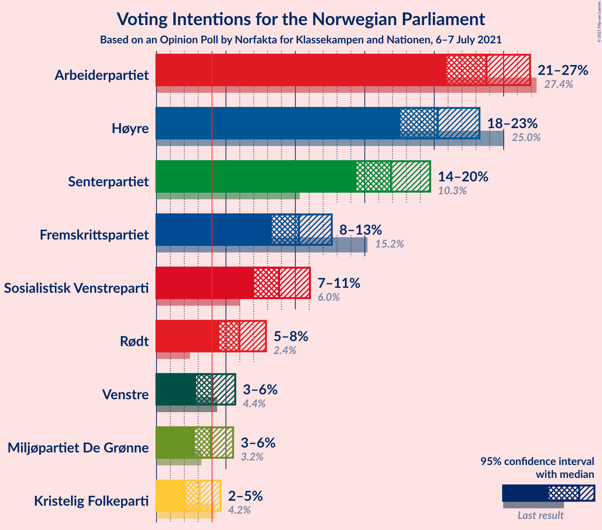

### Confidence Intervals

| Party | Last Result | Poll Result | 80% Confidence Interval | 90% Confidence Interval | 95% Confidence Interval | 99% Confidence Interval |
|:-----:|:-----------:|:-----------:|:-----------------------:|:-----------------------:|:-----------------------:|:-----------------------:|
| Arbeiderpartiet | 27.4% | 23.8% | 21.9–25.8% |21.3–26.4% |20.9–26.9% |20.0–27.9% |
| Høyre | 25.0% | 20.3% | 18.5–22.2% |18.0–22.8% |17.6–23.3% |16.8–24.2% |
| Senterpartiet | 10.3% | 16.9% | 15.3–18.7% |14.8–19.3% |14.4–19.7% |13.7–20.6% |
| Fremskrittspartiet | 15.2% | 10.3% | 9.0–11.8% |8.6–12.2% |8.3–12.6% |7.7–13.4% |
| Sosialistisk Venstreparti | 6.0% | 8.8% | 7.6–10.3% |7.3–10.7% |7.0–11.1% |6.5–11.8% |
| Rødt | 2.4% | 6.0% | 5.0–7.2% |4.7–7.6% |4.5–7.9% |4.1–8.5% |
| Venstre | 4.4% | 4.0% | 3.2–5.1% |3.0–5.4% |2.9–5.7% |2.5–6.2% |
| Miljøpartiet De Grønne | 3.2% | 3.9% | 3.1–5.0% |2.9–5.2% |2.7–5.5% |2.4–6.1% |
| Kristelig Folkeparti | 4.2% | 3.1% | 2.4–4.1% |2.3–4.4% |2.1–4.6% |1.8–5.1% |

*Note:* The poll result column reflects the actual value used in the calculations. Published results may vary slightly, and in addition be rounded to fewer digits.

## Seats

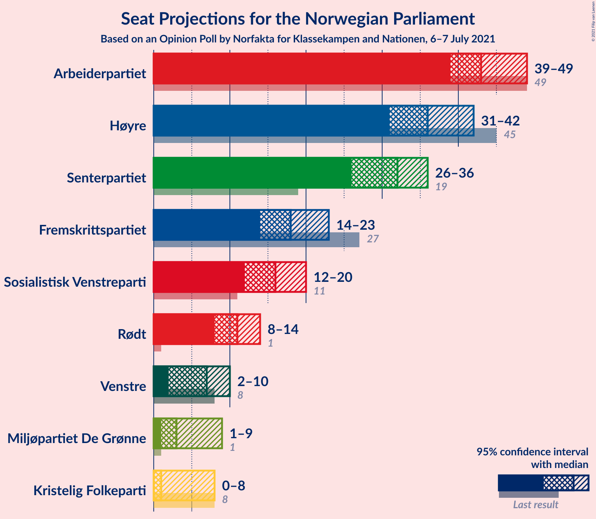

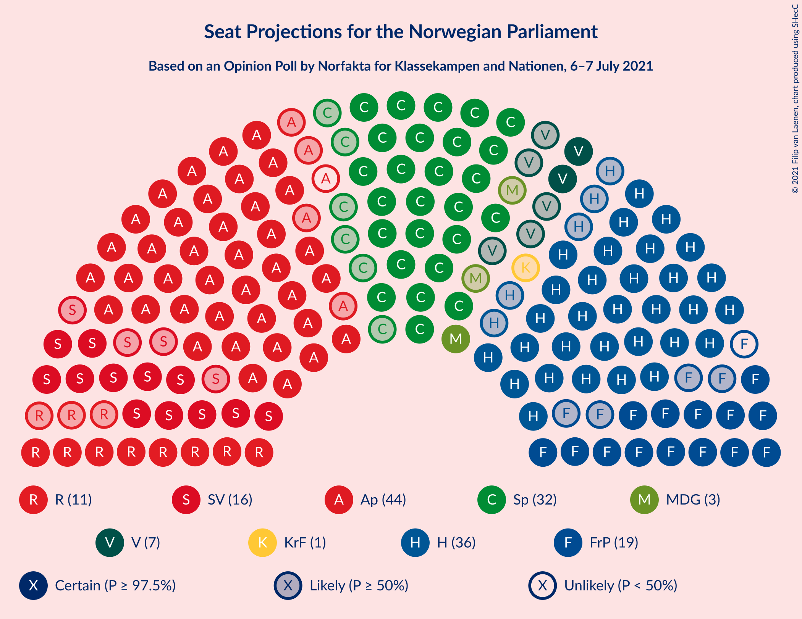

### Confidence Intervals

| Party | Last Result | Median | 80% Confidence Interval | 90% Confidence Interval | 95% Confidence Interval | 99% Confidence Interval |
|:-----:|:-----------:|:------:|:-----------------------:|:-----------------------:|:-----------------------:|:-----------------------:|
| <a href="#arbeiderpartiet">Arbeiderpartiet</a> | 49 | 43 | 40–46 |39–47 |39–49 |37–52 |
| <a href="#høyre">Høyre</a> | 45 | 36 | 34–40 |32–41 |31–42 |29–44 |
| <a href="#senterpartiet">Senterpartiet</a> | 19 | 32 | 28–35 |27–36 |26–36 |24–38 |
| <a href="#fremskrittspartiet">Fremskrittspartiet</a> | 27 | 18 | 16–21 |15–22 |14–23 |13–24 |
| <a href="#sosialistisk-venstreparti">Sosialistisk Venstreparti</a> | 11 | 16 | 13–19 |13–19 |12–20 |11–21 |
| <a href="#rødt">Rødt</a> | 1 | 11 | 9–13 |8–13 |8–14 |7–15 |
| <a href="#venstre">Venstre</a> | 8 | 7 | 2–9 |2–10 |2–10 |2–11 |
| <a href="#miljøpartiet-de-grønne">Miljøpartiet De Grønne</a> | 1 | 3 | 2–9 |1–9 |1–9 |1–11 |
| <a href="#kristelig-folkeparti">Kristelig Folkeparti</a> | 8 | 1 | 1–7 |1–8 |0–8 |0–9 |

### Arbeiderpartiet

*For a full overview of the results for this party, see the [Arbeiderpartiet](party-arbeiderpartiet.html) page.*

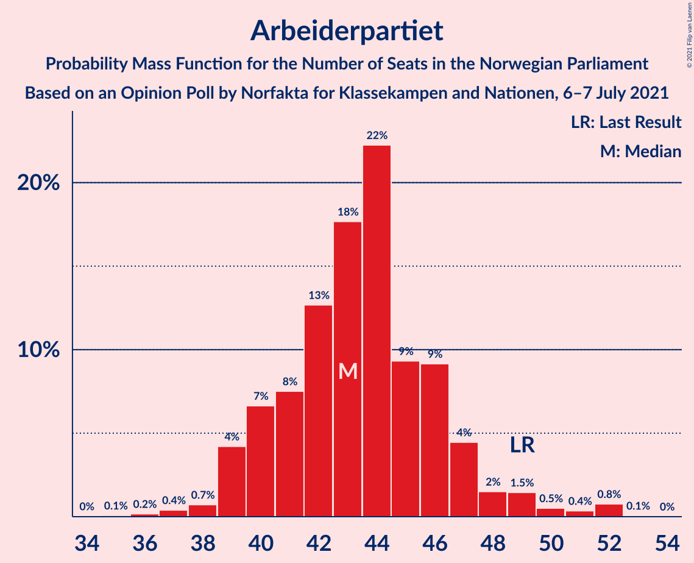

| Number of Seats | Probability | Accumulated | Special Marks |
|:---------------:|:-----------:|:-----------:|:-------------:|
| 35 | 0.1% | 100% |  |
| 36 | 0.2% | 99.9% |  |
| 37 | 0.4% | 99.7% |  |
| 38 | 0.7% | 99.3% |  |
| 39 | 4% | 98.6% |  |
| 40 | 7% | 94% |  |
| 41 | 8% | 88% |  |
| 42 | 13% | 80% |  |
| 43 | 18% | 68% | Median |
| 44 | 22% | 50% |  |
| 45 | 9% | 28% |  |
| 46 | 9% | 18% |  |
| 47 | 4% | 9% |  |
| 48 | 2% | 5% |  |
| 49 | 1.5% | 3% | Last Result |
| 50 | 0.5% | 2% |  |
| 51 | 0.4% | 1.2% |  |
| 52 | 0.8% | 0.9% |  |
| 53 | 0.1% | 0.1% |  |
| 54 | 0% | 0% |  |

### Høyre

*For a full overview of the results for this party, see the [Høyre](party-høyre.html) page.*

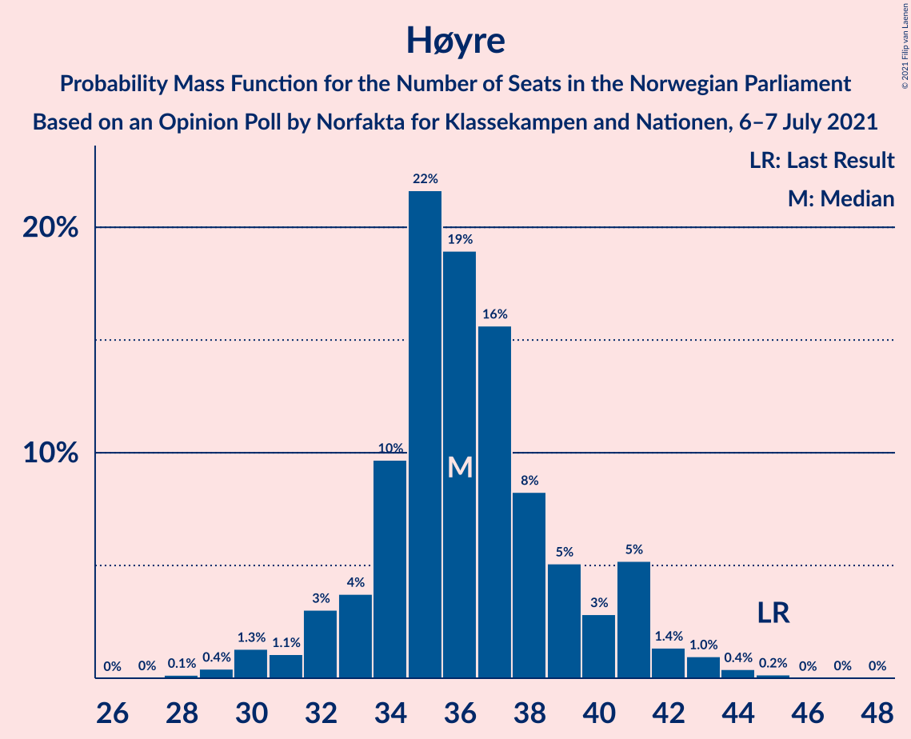

| Number of Seats | Probability | Accumulated | Special Marks |
|:---------------:|:-----------:|:-----------:|:-------------:|
| 28 | 0.1% | 100% |  |
| 29 | 0.4% | 99.8% |  |
| 30 | 1.3% | 99.4% |  |
| 31 | 1.1% | 98% |  |
| 32 | 3% | 97% |  |
| 33 | 4% | 94% |  |
| 34 | 10% | 90% |  |
| 35 | 22% | 81% |  |
| 36 | 19% | 59% | Median |
| 37 | 16% | 40% |  |
| 38 | 8% | 24% |  |
| 39 | 5% | 16% |  |
| 40 | 3% | 11% |  |
| 41 | 5% | 8% |  |
| 42 | 1.4% | 3% |  |
| 43 | 1.0% | 2% |  |
| 44 | 0.4% | 0.6% |  |
| 45 | 0.2% | 0.2% | Last Result |
| 46 | 0% | 0.1% |  |
| 47 | 0% | 0.1% |  |
| 48 | 0% | 0% |  |

### Senterpartiet

*For a full overview of the results for this party, see the [Senterpartiet](party-senterpartiet.html) page.*

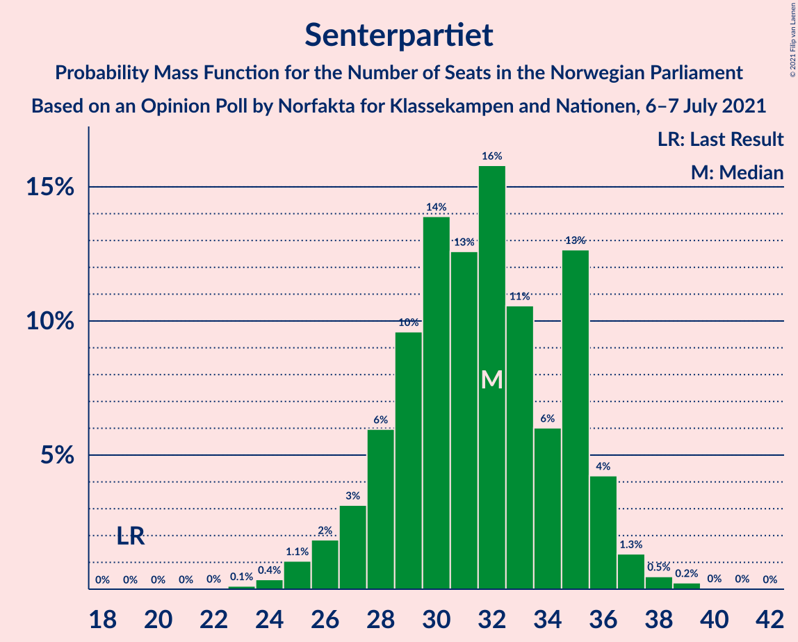

| Number of Seats | Probability | Accumulated | Special Marks |
|:---------------:|:-----------:|:-----------:|:-------------:|
| 19 | 0% | 100% | Last Result |
| 20 | 0% | 100% |  |
| 21 | 0% | 100% |  |
| 22 | 0% | 100% |  |
| 23 | 0.1% | 100% |  |
| 24 | 0.4% | 99.8% |  |
| 25 | 1.1% | 99.5% |  |
| 26 | 2% | 98% |  |
| 27 | 3% | 97% |  |
| 28 | 6% | 93% |  |
| 29 | 10% | 87% |  |
| 30 | 14% | 78% |  |
| 31 | 13% | 64% |  |
| 32 | 16% | 51% | Median |
| 33 | 11% | 36% |  |
| 34 | 6% | 25% |  |
| 35 | 13% | 19% |  |
| 36 | 4% | 6% |  |
| 37 | 1.3% | 2% |  |
| 38 | 0.5% | 0.8% |  |
| 39 | 0.2% | 0.3% |  |
| 40 | 0% | 0.1% |  |
| 41 | 0% | 0% |  |

### Fremskrittspartiet

*For a full overview of the results for this party, see the [Fremskrittspartiet](party-fremskrittspartiet.html) page.*

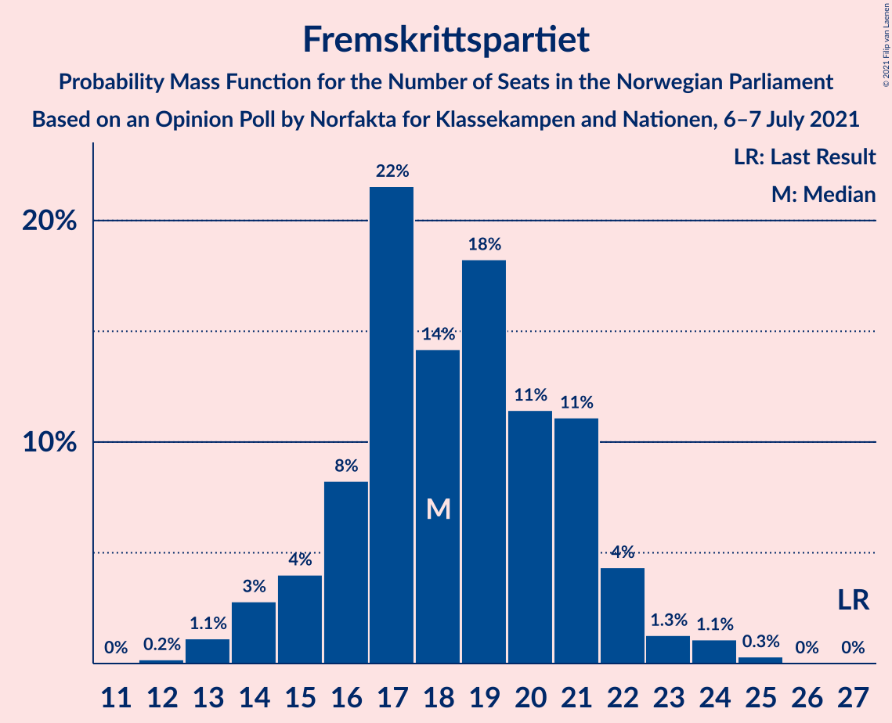

| Number of Seats | Probability | Accumulated | Special Marks |
|:---------------:|:-----------:|:-----------:|:-------------:|
| 12 | 0.2% | 100% |  |
| 13 | 1.1% | 99.8% |  |
| 14 | 3% | 98.7% |  |
| 15 | 4% | 96% |  |
| 16 | 8% | 92% |  |
| 17 | 22% | 84% |  |
| 18 | 14% | 62% | Median |
| 19 | 18% | 48% |  |
| 20 | 11% | 30% |  |
| 21 | 11% | 18% |  |
| 22 | 4% | 7% |  |
| 23 | 1.3% | 3% |  |
| 24 | 1.1% | 1.5% |  |
| 25 | 0.3% | 0.4% |  |
| 26 | 0% | 0.1% |  |
| 27 | 0% | 0% | Last Result |

### Sosialistisk Venstreparti

*For a full overview of the results for this party, see the [Sosialistisk Venstreparti](party-sosialistiskvenstreparti.html) page.*

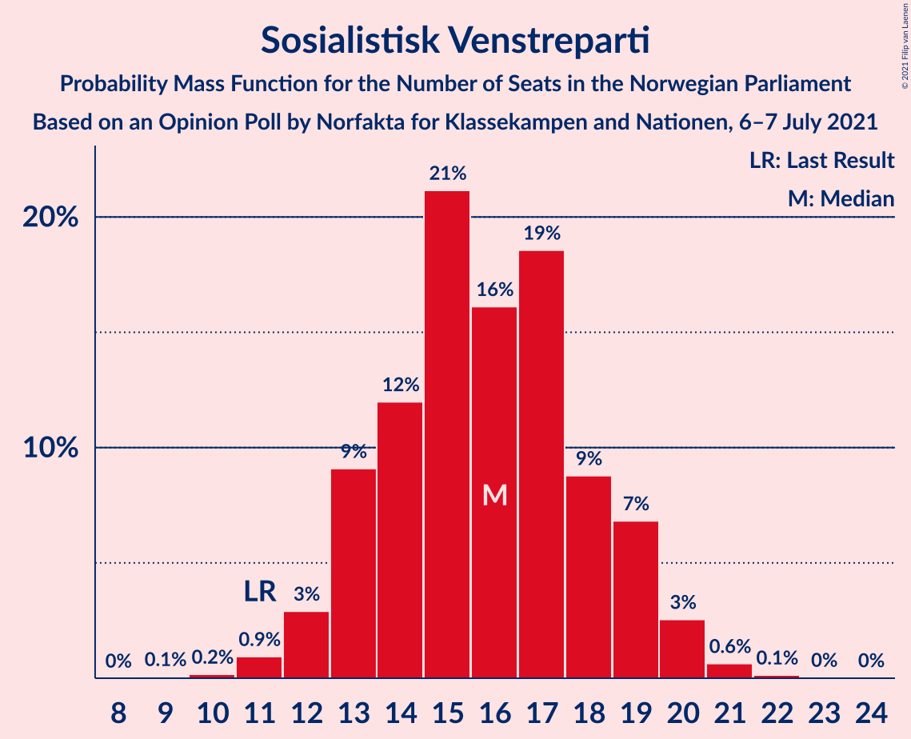

| Number of Seats | Probability | Accumulated | Special Marks |
|:---------------:|:-----------:|:-----------:|:-------------:|
| 9 | 0.1% | 100% |  |
| 10 | 0.2% | 99.9% |  |
| 11 | 0.9% | 99.8% | Last Result |
| 12 | 3% | 98.8% |  |
| 13 | 9% | 96% |  |
| 14 | 12% | 87% |  |
| 15 | 21% | 75% |  |
| 16 | 16% | 54% | Median |
| 17 | 19% | 38% |  |
| 18 | 9% | 19% |  |
| 19 | 7% | 10% |  |
| 20 | 3% | 3% |  |
| 21 | 0.6% | 0.8% |  |
| 22 | 0.1% | 0.2% |  |
| 23 | 0% | 0.1% |  |
| 24 | 0% | 0% |  |

### Rødt

*For a full overview of the results for this party, see the [Rødt](party-rødt.html) page.*

| Number of Seats | Probability | Accumulated | Special Marks |
|:---------------:|:-----------:|:-----------:|:-------------:|
| 1 | 0% | 100% | Last Result |
| 2 | 0.3% | 100% |  |
| 3 | 0% | 99.7% |  |
| 4 | 0% | 99.7% |  |
| 5 | 0% | 99.7% |  |
| 6 | 0% | 99.7% |  |
| 7 | 0.8% | 99.7% |  |
| 8 | 5% | 99.0% |  |
| 9 | 14% | 94% |  |
| 10 | 29% | 79% |  |
| 11 | 23% | 51% | Median |
| 12 | 18% | 28% |  |
| 13 | 7% | 10% |  |
| 14 | 2% | 3% |  |
| 15 | 0.8% | 1.2% |  |
| 16 | 0.3% | 0.4% |  |
| 17 | 0.1% | 0.1% |  |
| 18 | 0% | 0% |  |

### Venstre

*For a full overview of the results for this party, see the [Venstre](party-venstre.html) page.*

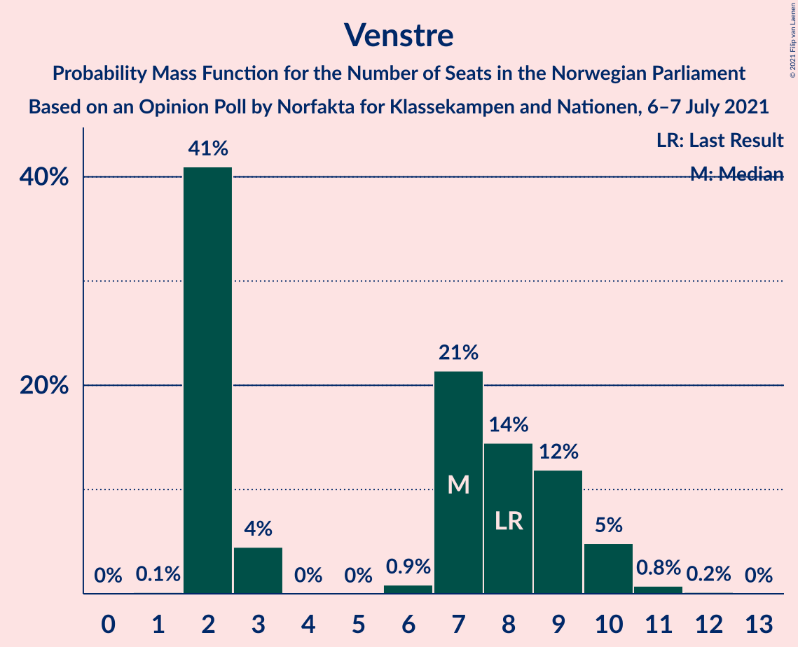

| Number of Seats | Probability | Accumulated | Special Marks |
|:---------------:|:-----------:|:-----------:|:-------------:|
| 1 | 0.1% | 100% |  |
| 2 | 41% | 99.9% |  |
| 3 | 4% | 59% |  |
| 4 | 0% | 54% |  |
| 5 | 0% | 54% |  |
| 6 | 0.9% | 54% |  |
| 7 | 21% | 54% | Median |
| 8 | 14% | 32% | Last Result |
| 9 | 12% | 18% |  |
| 10 | 5% | 6% |  |
| 11 | 0.8% | 0.9% |  |
| 12 | 0.2% | 0.2% |  |
| 13 | 0% | 0% |  |

### Miljøpartiet De Grønne

*For a full overview of the results for this party, see the [Miljøpartiet De Grønne](party-miljøpartietdegrønne.html) page.*

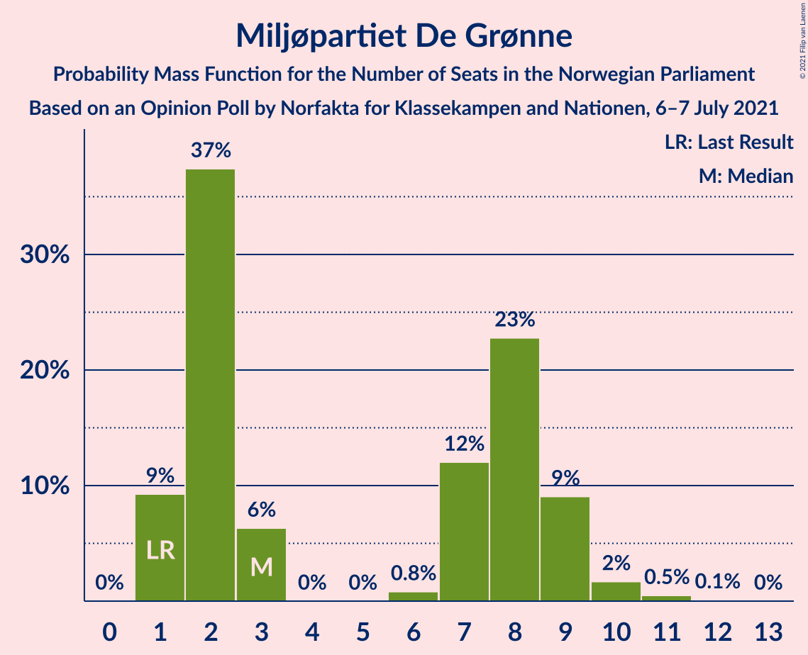

| Number of Seats | Probability | Accumulated | Special Marks |
|:---------------:|:-----------:|:-----------:|:-------------:|
| 1 | 9% | 100% | Last Result |
| 2 | 37% | 91% |  |
| 3 | 6% | 53% | Median |
| 4 | 0% | 47% |  |
| 5 | 0% | 47% |  |
| 6 | 0.8% | 47% |  |
| 7 | 12% | 46% |  |
| 8 | 23% | 34% |  |
| 9 | 9% | 11% |  |
| 10 | 2% | 2% |  |
| 11 | 0.5% | 0.6% |  |
| 12 | 0.1% | 0.1% |  |
| 13 | 0% | 0% |  |

### Kristelig Folkeparti

*For a full overview of the results for this party, see the [Kristelig Folkeparti](party-kristeligfolkeparti.html) page.*

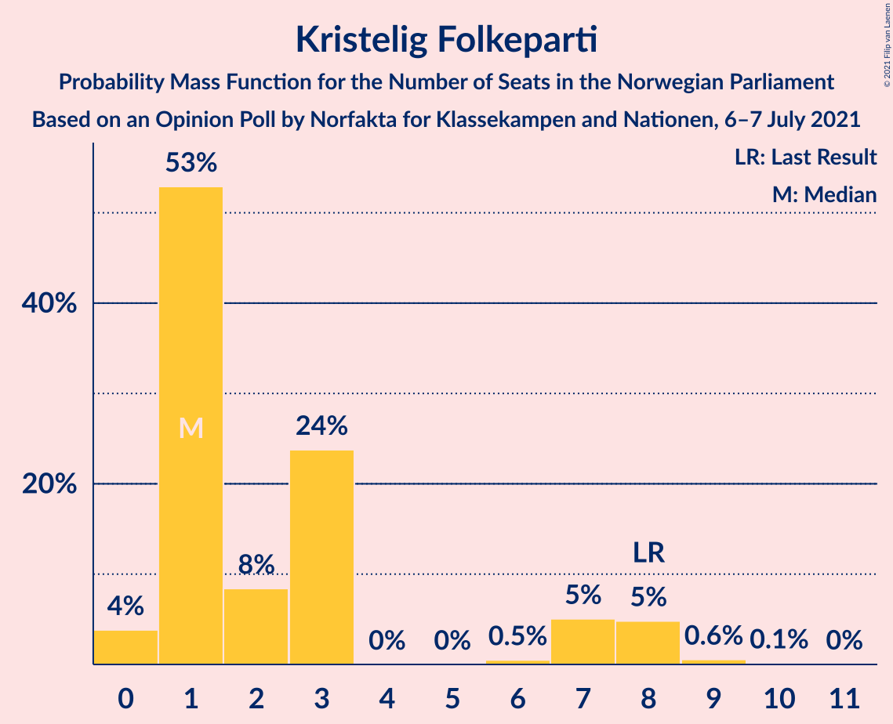

| Number of Seats | Probability | Accumulated | Special Marks |
|:---------------:|:-----------:|:-----------:|:-------------:|
| 0 | 4% | 100% |  |
| 1 | 53% | 96% | Median |
| 2 | 8% | 43% |  |
| 3 | 24% | 35% |  |
| 4 | 0% | 11% |  |
| 5 | 0% | 11% |  |
| 6 | 0.5% | 11% |  |
| 7 | 5% | 11% |  |
| 8 | 5% | 6% | Last Result |
| 9 | 0.6% | 0.7% |  |
| 10 | 0.1% | 0.2% |  |
| 11 | 0% | 0% |  |

## Coalitions

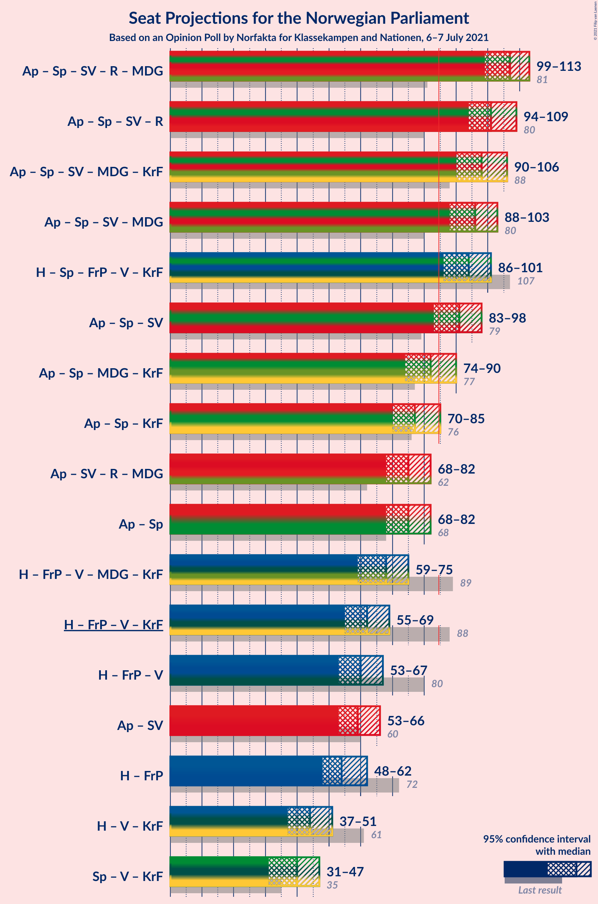

### Confidence Intervals

| Coalition | Last Result | Median | Majority? | 80% Confidence Interval | 90% Confidence Interval | 95% Confidence Interval | 99% Confidence Interval |
|:---------:|:-----------:|:------:|:---------:|:-----------------------:|:-----------------------:|:-----------------------:|:-----------------------:|
| Arbeiderpartiet – Senterpartiet – Sosialistisk Venstreparti – Rødt – Miljøpartiet De Grønne | 81 | 107 | 100% | 101–110 | 100–112 | 99–113 | 96–115 |
| Arbeiderpartiet – Senterpartiet – Sosialistisk Venstreparti – Rødt | 80 | 101 | 100% | 97–106 | 95–107 | 94–109 | 92–111 |
| Arbeiderpartiet – Senterpartiet – Sosialistisk Venstreparti – Miljøpartiet De Grønne – Kristelig Folkeparti | 88 | 98 | 100% | 92–102 | 91–104 | 90–106 | 88–108 |
| Arbeiderpartiet – Senterpartiet – Sosialistisk Venstreparti – Miljøpartiet De Grønne | 80 | 96 | 99.8% | 91–100 | 89–101 | 88–103 | 85–105 |
| Høyre – Senterpartiet – Fremskrittspartiet – Venstre – Kristelig Folkeparti | 107 | 94 | 99.2% | 89–98 | 87–100 | 86–101 | 83–103 |
| Arbeiderpartiet – Senterpartiet – Sosialistisk Venstreparti | 79 | 91 | 96% | 87–95 | 85–96 | 83–98 | 81–100 |
| Arbeiderpartiet – Senterpartiet – Miljøpartiet De Grønne – Kristelig Folkeparti | 77 | 82 | 26% | 76–87 | 75–89 | 74–90 | 72–93 |
| Arbeiderpartiet – Senterpartiet – Kristelig Folkeparti | 76 | 77 | 3% | 73–82 | 71–83 | 70–85 | 68–87 |
| Arbeiderpartiet – Sosialistisk Venstreparti – Rødt – Miljøpartiet De Grønne | 62 | 75 | 0.5% | 70–79 | 69–81 | 68–82 | 65–85 |
| Arbeiderpartiet – Senterpartiet | 68 | 75 | 0.2% | 71–80 | 69–81 | 68–82 | 66–83 |
| Høyre – Fremskrittspartiet – Venstre – Miljøpartiet De Grønne – Kristelig Folkeparti | 89 | 68 | 0% | 62–71 | 61–73 | 59–75 | 57–76 |
| Høyre – Fremskrittspartiet – Venstre – Kristelig Folkeparti | 88 | 62 | 0% | 58–67 | 56–68 | 55–69 | 53–72 |
| Høyre – Fremskrittspartiet – Venstre | 80 | 60 | 0% | 55–65 | 54–67 | 53–67 | 51–69 |
| Arbeiderpartiet – Sosialistisk Venstreparti | 60 | 59 | 0% | 56–63 | 54–65 | 53–66 | 52–69 |
| Høyre – Fremskrittspartiet | 72 | 54 | 0% | 50–59 | 49–61 | 48–62 | 46–64 |
| Høyre – Venstre – Kristelig Folkeparti | 61 | 44 | 0% | 39–49 | 38–50 | 37–51 | 36–54 |
| Senterpartiet – Venstre – Kristelig Folkeparti | 35 | 40 | 0% | 33–44 | 32–45 | 31–47 | 29–50 |

### Arbeiderpartiet – Senterpartiet – Sosialistisk Venstreparti – Rødt – Miljøpartiet De Grønne

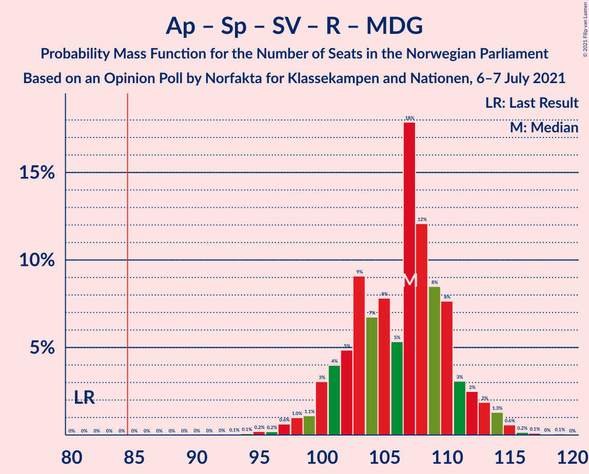

| Number of Seats | Probability | Accumulated | Special Marks |
|:---------------:|:-----------:|:-----------:|:-------------:|
| 81 | 0% | 100% | Last Result |
| 82 | 0% | 100% |  |
| 83 | 0% | 100% |  |
| 84 | 0% | 100% |  |
| 85 | 0% | 100% | Majority |
| 86 | 0% | 100% |  |
| 87 | 0% | 100% |  |
| 88 | 0% | 100% |  |
| 89 | 0% | 100% |  |
| 90 | 0% | 100% |  |
| 91 | 0% | 100% |  |
| 92 | 0% | 100% |  |
| 93 | 0.1% | 100% |  |
| 94 | 0.1% | 99.9% |  |
| 95 | 0.2% | 99.8% |  |
| 96 | 0.2% | 99.6% |  |
| 97 | 0.6% | 99.4% |  |
| 98 | 1.0% | 98.8% |  |
| 99 | 1.1% | 98% |  |
| 100 | 3% | 97% |  |
| 101 | 4% | 94% |  |
| 102 | 5% | 90% |  |
| 103 | 9% | 85% |  |
| 104 | 7% | 76% |  |
| 105 | 8% | 69% | Median |
| 106 | 5% | 61% |  |
| 107 | 18% | 56% |  |
| 108 | 12% | 38% |  |
| 109 | 8% | 26% |  |
| 110 | 8% | 17% |  |
| 111 | 3% | 10% |  |
| 112 | 2% | 7% |  |
| 113 | 2% | 4% |  |
| 114 | 1.3% | 2% |  |
| 115 | 0.6% | 1.0% |  |
| 116 | 0.2% | 0.4% |  |
| 117 | 0.1% | 0.2% |  |
| 118 | 0% | 0.1% |  |
| 119 | 0.1% | 0.1% |  |
| 120 | 0% | 0% |  |

### Arbeiderpartiet – Senterpartiet – Sosialistisk Venstreparti – Rødt

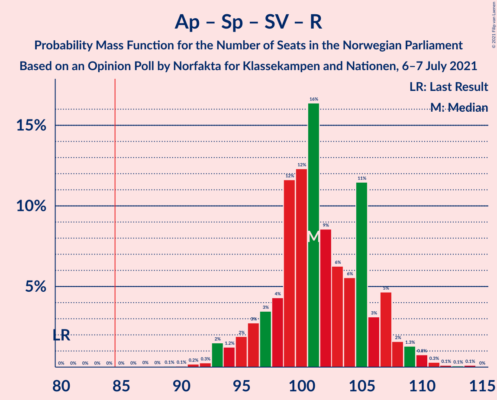

| Number of Seats | Probability | Accumulated | Special Marks |
|:---------------:|:-----------:|:-----------:|:-------------:|
| 80 | 0% | 100% | Last Result |
| 81 | 0% | 100% |  |
| 82 | 0% | 100% |  |
| 83 | 0% | 100% |  |
| 84 | 0% | 100% |  |
| 85 | 0% | 100% | Majority |
| 86 | 0% | 100% |  |
| 87 | 0% | 100% |  |
| 88 | 0% | 99.9% |  |
| 89 | 0.1% | 99.9% |  |
| 90 | 0.1% | 99.9% |  |
| 91 | 0.2% | 99.8% |  |
| 92 | 0.3% | 99.6% |  |
| 93 | 2% | 99.4% |  |
| 94 | 1.2% | 98% |  |
| 95 | 2% | 97% |  |
| 96 | 3% | 95% |  |
| 97 | 3% | 92% |  |
| 98 | 4% | 89% |  |
| 99 | 12% | 84% |  |
| 100 | 12% | 73% |  |
| 101 | 16% | 60% |  |
| 102 | 9% | 44% | Median |
| 103 | 6% | 35% |  |
| 104 | 6% | 29% |  |
| 105 | 11% | 24% |  |
| 106 | 3% | 12% |  |
| 107 | 5% | 9% |  |
| 108 | 2% | 4% |  |
| 109 | 1.3% | 3% |  |
| 110 | 0.8% | 1.4% |  |
| 111 | 0.3% | 0.6% |  |
| 112 | 0.1% | 0.3% |  |
| 113 | 0.1% | 0.2% |  |
| 114 | 0.1% | 0.1% |  |
| 115 | 0% | 0% |  |

### Arbeiderpartiet – Senterpartiet – Sosialistisk Venstreparti – Miljøpartiet De Grønne – Kristelig Folkeparti

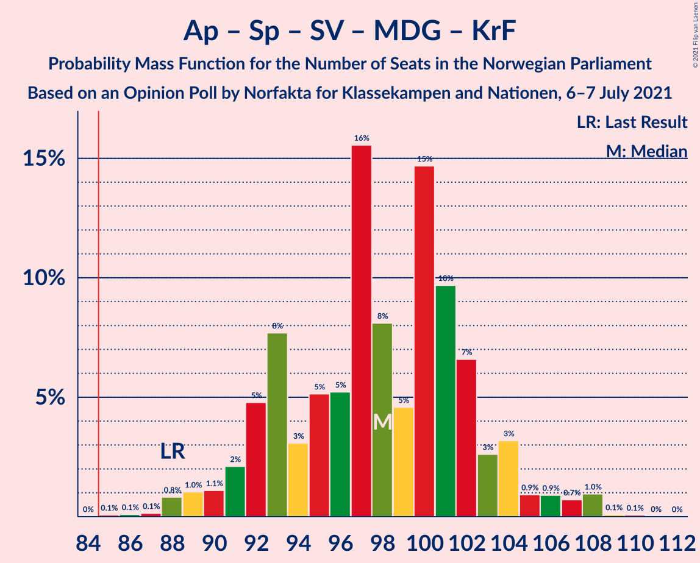

| Number of Seats | Probability | Accumulated | Special Marks |
|:---------------:|:-----------:|:-----------:|:-------------:|
| 85 | 0.1% | 100% | Majority |
| 86 | 0.1% | 99.9% |  |
| 87 | 0.1% | 99.8% |  |
| 88 | 0.8% | 99.7% | Last Result |
| 89 | 1.0% | 98.8% |  |
| 90 | 1.1% | 98% |  |
| 91 | 2% | 97% |  |
| 92 | 5% | 95% |  |
| 93 | 8% | 90% |  |
| 94 | 3% | 82% |  |
| 95 | 5% | 79% | Median |
| 96 | 5% | 74% |  |
| 97 | 16% | 69% |  |
| 98 | 8% | 53% |  |
| 99 | 5% | 45% |  |
| 100 | 15% | 40% |  |
| 101 | 10% | 26% |  |
| 102 | 7% | 16% |  |
| 103 | 3% | 9% |  |
| 104 | 3% | 7% |  |
| 105 | 0.9% | 4% |  |
| 106 | 0.9% | 3% |  |
| 107 | 0.7% | 2% |  |
| 108 | 1.0% | 1.2% |  |
| 109 | 0.1% | 0.2% |  |
| 110 | 0.1% | 0.1% |  |
| 111 | 0% | 0% |  |

### Arbeiderpartiet – Senterpartiet – Sosialistisk Venstreparti – Miljøpartiet De Grønne

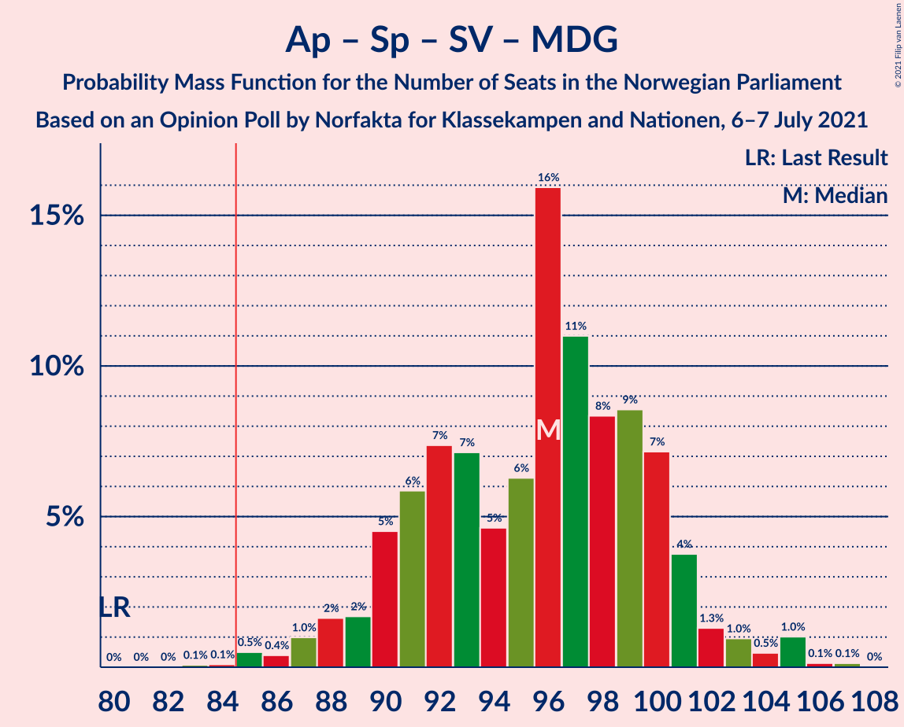

| Number of Seats | Probability | Accumulated | Special Marks |
|:---------------:|:-----------:|:-----------:|:-------------:|
| 80 | 0% | 100% | Last Result |
| 81 | 0% | 100% |  |
| 82 | 0% | 100% |  |
| 83 | 0.1% | 100% |  |
| 84 | 0.1% | 99.9% |  |
| 85 | 0.5% | 99.8% | Majority |
| 86 | 0.4% | 99.3% |  |
| 87 | 1.0% | 98.9% |  |
| 88 | 2% | 98% |  |
| 89 | 2% | 96% |  |
| 90 | 5% | 95% |  |
| 91 | 6% | 90% |  |
| 92 | 7% | 84% |  |
| 93 | 7% | 77% |  |
| 94 | 5% | 70% | Median |
| 95 | 6% | 65% |  |
| 96 | 16% | 59% |  |
| 97 | 11% | 43% |  |
| 98 | 8% | 32% |  |
| 99 | 9% | 24% |  |
| 100 | 7% | 15% |  |
| 101 | 4% | 8% |  |
| 102 | 1.3% | 4% |  |
| 103 | 1.0% | 3% |  |
| 104 | 0.5% | 2% |  |
| 105 | 1.0% | 1.3% |  |
| 106 | 0.1% | 0.3% |  |
| 107 | 0.1% | 0.2% |  |
| 108 | 0% | 0% |  |

### Høyre – Senterpartiet – Fremskrittspartiet – Venstre – Kristelig Folkeparti

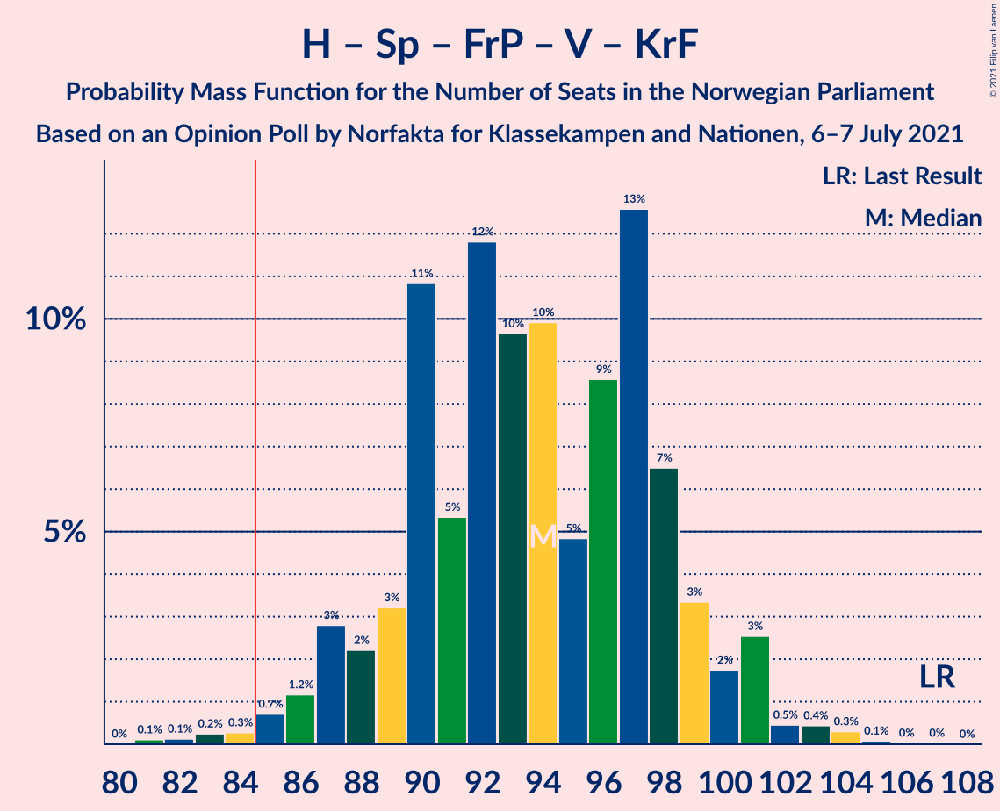

| Number of Seats | Probability | Accumulated | Special Marks |
|:---------------:|:-----------:|:-----------:|:-------------:|
| 81 | 0.1% | 100% |  |
| 82 | 0.1% | 99.9% |  |
| 83 | 0.2% | 99.7% |  |
| 84 | 0.3% | 99.5% |  |
| 85 | 0.7% | 99.2% | Majority |
| 86 | 1.2% | 98% |  |
| 87 | 3% | 97% |  |
| 88 | 2% | 95% |  |
| 89 | 3% | 92% |  |
| 90 | 11% | 89% |  |
| 91 | 5% | 78% |  |
| 92 | 12% | 73% |  |
| 93 | 10% | 61% |  |
| 94 | 10% | 51% | Median |
| 95 | 5% | 42% |  |
| 96 | 9% | 37% |  |
| 97 | 13% | 28% |  |
| 98 | 7% | 15% |  |
| 99 | 3% | 9% |  |
| 100 | 2% | 6% |  |
| 101 | 3% | 4% |  |
| 102 | 0.5% | 1.4% |  |
| 103 | 0.4% | 0.9% |  |
| 104 | 0.3% | 0.5% |  |
| 105 | 0.1% | 0.2% |  |
| 106 | 0% | 0.1% |  |
| 107 | 0% | 0% | Last Result |

### Arbeiderpartiet – Senterpartiet – Sosialistisk Venstreparti

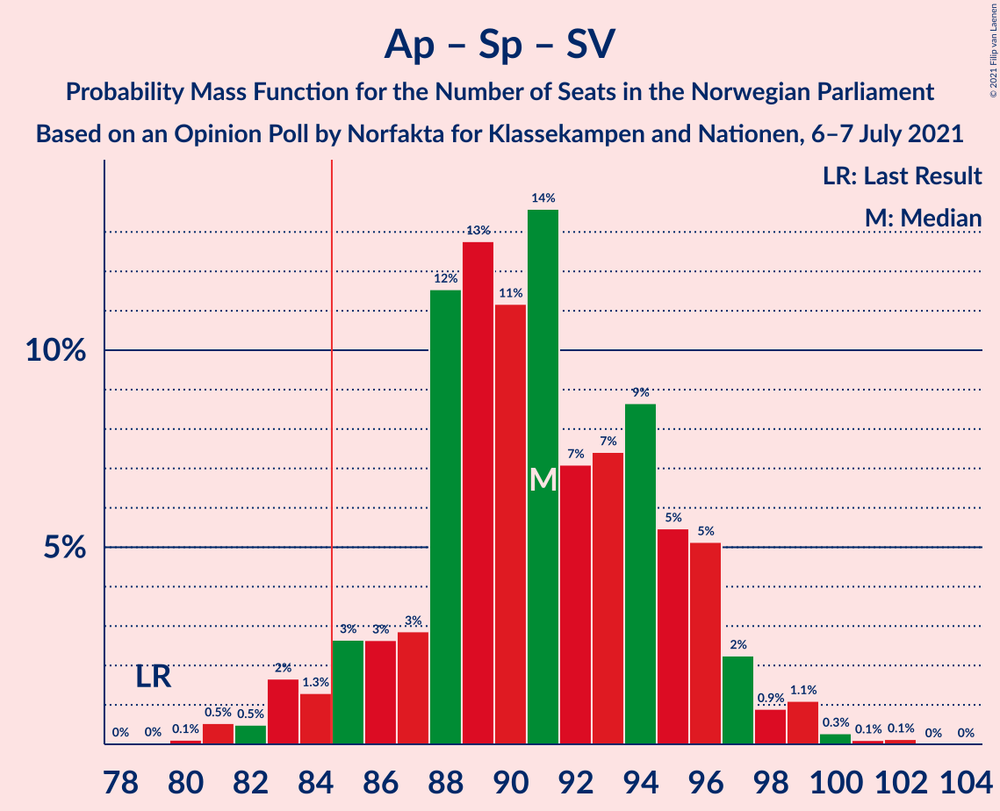

| Number of Seats | Probability | Accumulated | Special Marks |
|:---------------:|:-----------:|:-----------:|:-------------:|
| 79 | 0% | 100% | Last Result |
| 80 | 0.1% | 99.9% |  |
| 81 | 0.5% | 99.8% |  |
| 82 | 0.5% | 99.3% |  |
| 83 | 2% | 98.8% |  |
| 84 | 1.3% | 97% |  |
| 85 | 3% | 96% | Majority |
| 86 | 3% | 93% |  |
| 87 | 3% | 91% |  |
| 88 | 12% | 88% |  |
| 89 | 13% | 76% |  |
| 90 | 11% | 63% |  |
| 91 | 14% | 52% | Median |
| 92 | 7% | 39% |  |
| 93 | 7% | 31% |  |
| 94 | 9% | 24% |  |
| 95 | 5% | 15% |  |
| 96 | 5% | 10% |  |
| 97 | 2% | 5% |  |
| 98 | 0.9% | 3% |  |
| 99 | 1.1% | 2% |  |
| 100 | 0.3% | 0.6% |  |
| 101 | 0.1% | 0.3% |  |
| 102 | 0.1% | 0.2% |  |
| 103 | 0% | 0% |  |

### Arbeiderpartiet – Senterpartiet – Miljøpartiet De Grønne – Kristelig Folkeparti

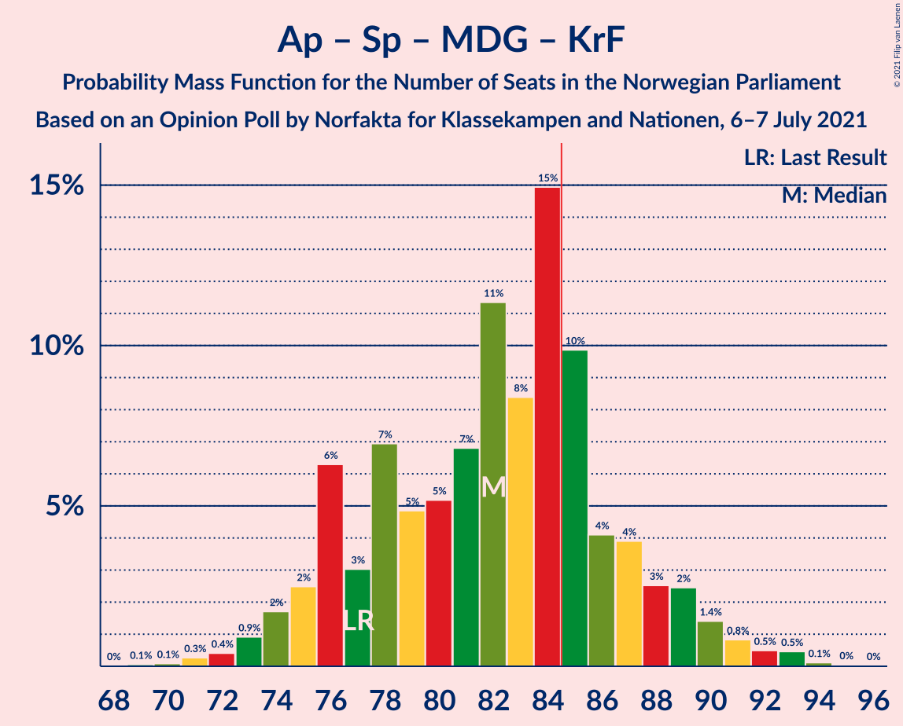

| Number of Seats | Probability | Accumulated | Special Marks |
|:---------------:|:-----------:|:-----------:|:-------------:|
| 69 | 0.1% | 100% |  |
| 70 | 0.1% | 99.9% |  |
| 71 | 0.3% | 99.8% |  |
| 72 | 0.4% | 99.6% |  |
| 73 | 0.9% | 99.1% |  |
| 74 | 2% | 98% |  |
| 75 | 2% | 97% |  |
| 76 | 6% | 94% |  |
| 77 | 3% | 88% | Last Result |
| 78 | 7% | 85% |  |
| 79 | 5% | 78% | Median |
| 80 | 5% | 73% |  |
| 81 | 7% | 68% |  |
| 82 | 11% | 61% |  |
| 83 | 8% | 50% |  |
| 84 | 15% | 41% |  |
| 85 | 10% | 26% | Majority |
| 86 | 4% | 16% |  |
| 87 | 4% | 12% |  |
| 88 | 3% | 8% |  |
| 89 | 2% | 6% |  |
| 90 | 1.4% | 3% |  |
| 91 | 0.8% | 2% |  |
| 92 | 0.5% | 1.2% |  |
| 93 | 0.5% | 0.7% |  |
| 94 | 0.1% | 0.2% |  |
| 95 | 0% | 0.1% |  |
| 96 | 0% | 0% |  |

### Arbeiderpartiet – Senterpartiet – Kristelig Folkeparti

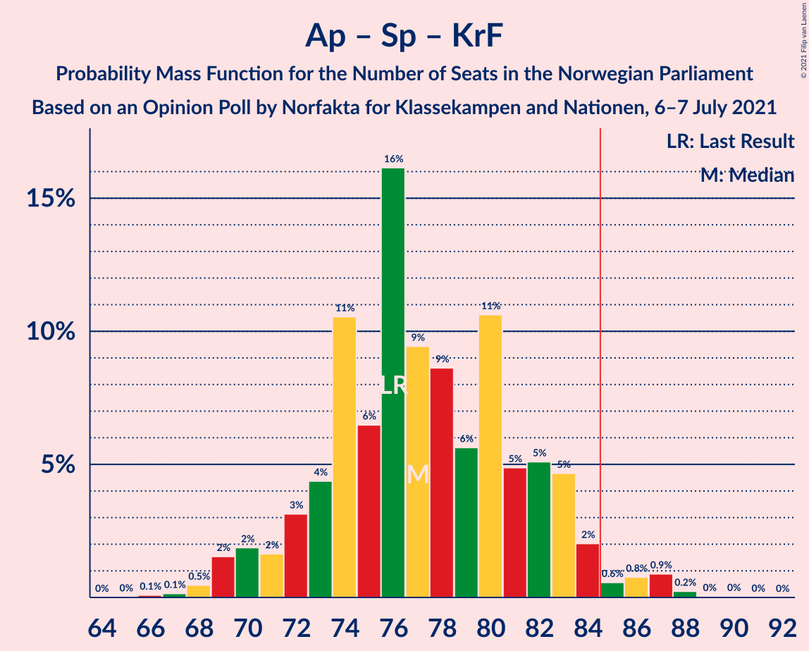

| Number of Seats | Probability | Accumulated | Special Marks |
|:---------------:|:-----------:|:-----------:|:-------------:|
| 66 | 0.1% | 100% |  |
| 67 | 0.1% | 99.9% |  |
| 68 | 0.5% | 99.7% |  |
| 69 | 2% | 99.3% |  |
| 70 | 2% | 98% |  |
| 71 | 2% | 96% |  |
| 72 | 3% | 94% |  |
| 73 | 4% | 91% |  |
| 74 | 11% | 87% |  |
| 75 | 6% | 76% |  |
| 76 | 16% | 70% | Last Result, Median |
| 77 | 9% | 54% |  |
| 78 | 9% | 44% |  |
| 79 | 6% | 35% |  |
| 80 | 11% | 30% |  |
| 81 | 5% | 19% |  |
| 82 | 5% | 14% |  |
| 83 | 5% | 9% |  |
| 84 | 2% | 5% |  |
| 85 | 0.6% | 3% | Majority |
| 86 | 0.8% | 2% |  |
| 87 | 0.9% | 1.2% |  |
| 88 | 0.2% | 0.3% |  |
| 89 | 0% | 0.1% |  |
| 90 | 0% | 0.1% |  |
| 91 | 0% | 0% |  |

### Arbeiderpartiet – Sosialistisk Venstreparti – Rødt – Miljøpartiet De Grønne

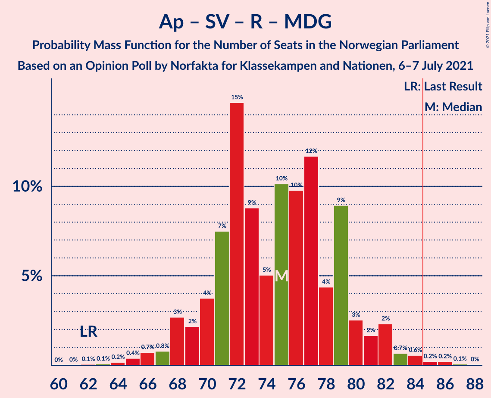

| Number of Seats | Probability | Accumulated | Special Marks |
|:---------------:|:-----------:|:-----------:|:-------------:|
| 62 | 0.1% | 100% | Last Result |
| 63 | 0.1% | 99.9% |  |
| 64 | 0.2% | 99.8% |  |
| 65 | 0.4% | 99.7% |  |
| 66 | 0.7% | 99.3% |  |
| 67 | 0.8% | 98.6% |  |
| 68 | 3% | 98% |  |
| 69 | 2% | 95% |  |
| 70 | 4% | 93% |  |
| 71 | 7% | 89% |  |
| 72 | 15% | 82% |  |
| 73 | 9% | 67% | Median |
| 74 | 5% | 58% |  |
| 75 | 10% | 53% |  |
| 76 | 10% | 43% |  |
| 77 | 12% | 33% |  |
| 78 | 4% | 22% |  |
| 79 | 9% | 17% |  |
| 80 | 3% | 8% |  |
| 81 | 2% | 6% |  |
| 82 | 2% | 4% |  |
| 83 | 0.7% | 2% |  |
| 84 | 0.6% | 1.1% |  |
| 85 | 0.2% | 0.5% | Majority |
| 86 | 0.2% | 0.3% |  |
| 87 | 0.1% | 0.1% |  |
| 88 | 0% | 0% |  |

### Arbeiderpartiet – Senterpartiet

| Number of Seats | Probability | Accumulated | Special Marks |
|:---------------:|:-----------:|:-----------:|:-------------:|
| 64 | 0.1% | 100% |  |
| 65 | 0.2% | 99.9% |  |
| 66 | 0.5% | 99.7% |  |
| 67 | 1.3% | 99.2% |  |
| 68 | 2% | 98% | Last Result |
| 69 | 3% | 96% |  |
| 70 | 2% | 93% |  |
| 71 | 4% | 91% |  |
| 72 | 7% | 87% |  |
| 73 | 15% | 80% |  |
| 74 | 13% | 65% |  |
| 75 | 12% | 52% | Median |
| 76 | 8% | 40% |  |
| 77 | 7% | 32% |  |
| 78 | 4% | 25% |  |
| 79 | 10% | 22% |  |
| 80 | 4% | 11% |  |
| 81 | 4% | 7% |  |
| 82 | 2% | 3% |  |
| 83 | 0.5% | 1.0% |  |
| 84 | 0.3% | 0.5% |  |
| 85 | 0.1% | 0.2% | Majority |
| 86 | 0.1% | 0.1% |  |
| 87 | 0% | 0% |  |

### Høyre – Fremskrittspartiet – Venstre – Miljøpartiet De Grønne – Kristelig Folkeparti

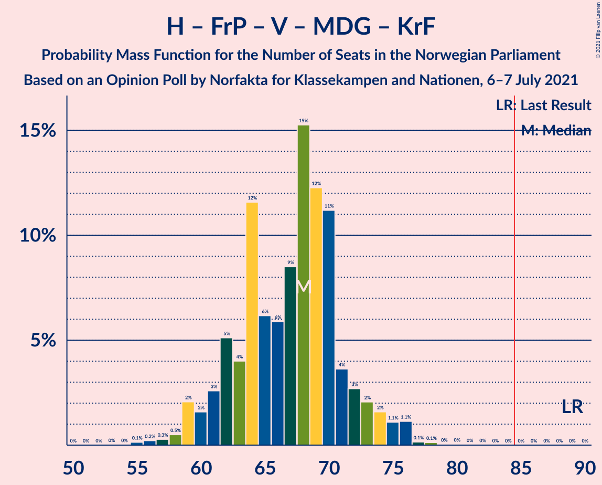

| Number of Seats | Probability | Accumulated | Special Marks |
|:---------------:|:-----------:|:-----------:|:-------------:|
| 55 | 0.1% | 100% |  |
| 56 | 0.2% | 99.8% |  |
| 57 | 0.3% | 99.6% |  |
| 58 | 0.5% | 99.3% |  |
| 59 | 2% | 98.8% |  |
| 60 | 2% | 97% |  |
| 61 | 3% | 95% |  |
| 62 | 5% | 93% |  |
| 63 | 4% | 87% |  |
| 64 | 12% | 83% |  |
| 65 | 6% | 72% | Median |
| 66 | 6% | 66% |  |
| 67 | 9% | 60% |  |
| 68 | 15% | 51% |  |
| 69 | 12% | 36% |  |
| 70 | 11% | 24% |  |
| 71 | 4% | 13% |  |
| 72 | 3% | 9% |  |
| 73 | 2% | 6% |  |
| 74 | 2% | 4% |  |
| 75 | 1.1% | 3% |  |
| 76 | 1.1% | 2% |  |
| 77 | 0.1% | 0.4% |  |
| 78 | 0.1% | 0.2% |  |
| 79 | 0% | 0.1% |  |
| 80 | 0% | 0.1% |  |
| 81 | 0% | 0% |  |
| 82 | 0% | 0% |  |
| 83 | 0% | 0% |  |
| 84 | 0% | 0% |  |
| 85 | 0% | 0% | Majority |
| 86 | 0% | 0% |  |
| 87 | 0% | 0% |  |
| 88 | 0% | 0% |  |
| 89 | 0% | 0% | Last Result |

### Høyre – Fremskrittspartiet – Venstre – Kristelig Folkeparti

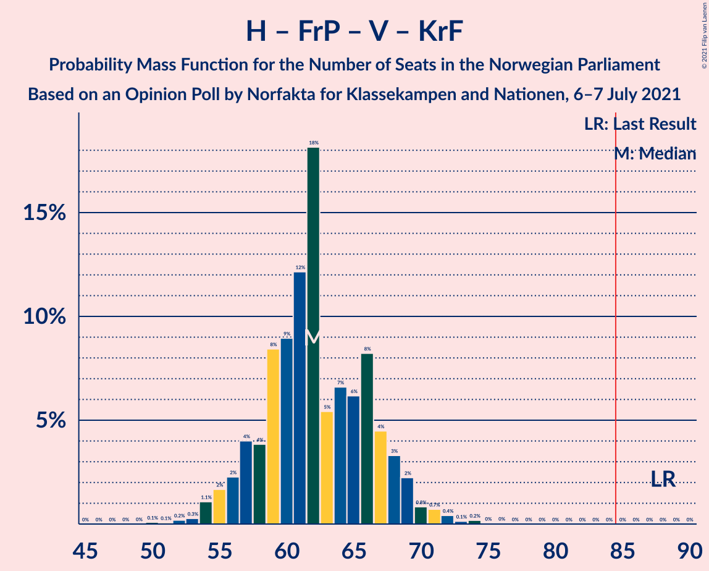

| Number of Seats | Probability | Accumulated | Special Marks |
|:---------------:|:-----------:|:-----------:|:-------------:|
| 50 | 0.1% | 100% |  |
| 51 | 0.1% | 99.9% |  |
| 52 | 0.2% | 99.8% |  |
| 53 | 0.3% | 99.6% |  |
| 54 | 1.1% | 99.4% |  |
| 55 | 2% | 98% |  |
| 56 | 2% | 97% |  |
| 57 | 4% | 94% |  |
| 58 | 4% | 90% |  |
| 59 | 8% | 87% |  |
| 60 | 9% | 78% |  |
| 61 | 12% | 69% |  |
| 62 | 18% | 57% | Median |
| 63 | 5% | 39% |  |
| 64 | 7% | 33% |  |
| 65 | 6% | 27% |  |
| 66 | 8% | 21% |  |
| 67 | 4% | 12% |  |
| 68 | 3% | 8% |  |
| 69 | 2% | 5% |  |
| 70 | 0.8% | 2% |  |
| 71 | 0.7% | 2% |  |
| 72 | 0.4% | 0.8% |  |
| 73 | 0.1% | 0.4% |  |
| 74 | 0.2% | 0.3% |  |
| 75 | 0% | 0.1% |  |
| 76 | 0% | 0% |  |
| 77 | 0% | 0% |  |
| 78 | 0% | 0% |  |
| 79 | 0% | 0% |  |
| 80 | 0% | 0% |  |
| 81 | 0% | 0% |  |
| 82 | 0% | 0% |  |
| 83 | 0% | 0% |  |
| 84 | 0% | 0% |  |
| 85 | 0% | 0% | Majority |
| 86 | 0% | 0% |  |
| 87 | 0% | 0% |  |
| 88 | 0% | 0% | Last Result |

### Høyre – Fremskrittspartiet – Venstre

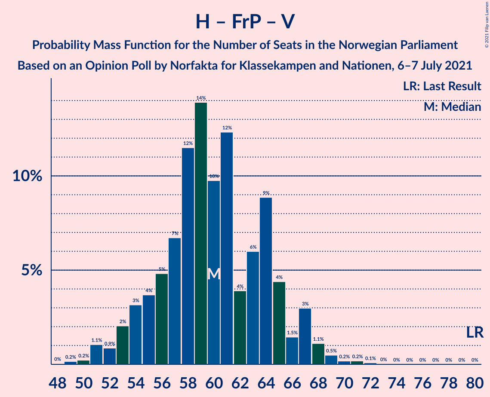

| Number of Seats | Probability | Accumulated | Special Marks |
|:---------------:|:-----------:|:-----------:|:-------------:|
| 48 | 0% | 100% |  |
| 49 | 0.2% | 99.9% |  |
| 50 | 0.2% | 99.8% |  |
| 51 | 1.1% | 99.5% |  |
| 52 | 0.9% | 98% |  |
| 53 | 2% | 98% |  |
| 54 | 3% | 96% |  |
| 55 | 4% | 92% |  |
| 56 | 5% | 89% |  |
| 57 | 7% | 84% |  |
| 58 | 12% | 77% |  |
| 59 | 14% | 66% |  |
| 60 | 10% | 52% |  |
| 61 | 12% | 42% | Median |
| 62 | 4% | 30% |  |
| 63 | 6% | 26% |  |
| 64 | 9% | 20% |  |
| 65 | 4% | 11% |  |
| 66 | 1.5% | 7% |  |
| 67 | 3% | 5% |  |
| 68 | 1.1% | 2% |  |
| 69 | 0.5% | 1.0% |  |
| 70 | 0.2% | 0.5% |  |
| 71 | 0.2% | 0.3% |  |
| 72 | 0.1% | 0.1% |  |
| 73 | 0% | 0% |  |
| 74 | 0% | 0% |  |
| 75 | 0% | 0% |  |
| 76 | 0% | 0% |  |
| 77 | 0% | 0% |  |
| 78 | 0% | 0% |  |
| 79 | 0% | 0% |  |
| 80 | 0% | 0% | Last Result |

### Arbeiderpartiet – Sosialistisk Venstreparti

| Number of Seats | Probability | Accumulated | Special Marks |
|:---------------:|:-----------:|:-----------:|:-------------:|
| 49 | 0.1% | 100% |  |
| 50 | 0.1% | 99.9% |  |
| 51 | 0.3% | 99.8% |  |
| 52 | 0.8% | 99.5% |  |
| 53 | 1.5% | 98.7% |  |
| 54 | 3% | 97% |  |
| 55 | 3% | 95% |  |
| 56 | 6% | 91% |  |
| 57 | 10% | 85% |  |
| 58 | 9% | 75% |  |
| 59 | 27% | 66% | Median |
| 60 | 12% | 39% | Last Result |
| 61 | 10% | 27% |  |
| 62 | 4% | 17% |  |
| 63 | 4% | 13% |  |
| 64 | 3% | 9% |  |
| 65 | 3% | 6% |  |
| 66 | 1.0% | 3% |  |
| 67 | 0.5% | 2% |  |
| 68 | 0.4% | 1.4% |  |
| 69 | 0.9% | 1.0% |  |
| 70 | 0% | 0.1% |  |
| 71 | 0% | 0% |  |

### Høyre – Fremskrittspartiet

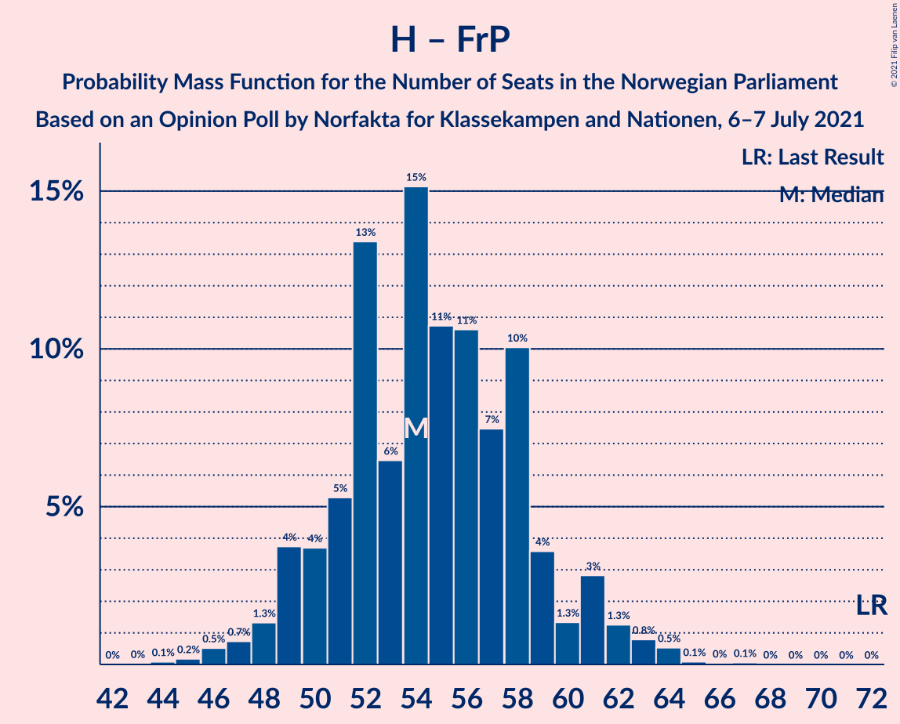

| Number of Seats | Probability | Accumulated | Special Marks |
|:---------------:|:-----------:|:-----------:|:-------------:|
| 44 | 0.1% | 100% |  |
| 45 | 0.2% | 99.9% |  |
| 46 | 0.5% | 99.7% |  |
| 47 | 0.7% | 99.2% |  |
| 48 | 1.3% | 98% |  |
| 49 | 4% | 97% |  |
| 50 | 4% | 93% |  |
| 51 | 5% | 90% |  |
| 52 | 13% | 84% |  |
| 53 | 6% | 71% |  |
| 54 | 15% | 65% | Median |
| 55 | 11% | 49% |  |
| 56 | 11% | 39% |  |
| 57 | 7% | 28% |  |
| 58 | 10% | 21% |  |
| 59 | 4% | 11% |  |
| 60 | 1.3% | 7% |  |
| 61 | 3% | 6% |  |
| 62 | 1.3% | 3% |  |
| 63 | 0.8% | 2% |  |
| 64 | 0.5% | 0.7% |  |
| 65 | 0.1% | 0.2% |  |
| 66 | 0% | 0.1% |  |
| 67 | 0.1% | 0.1% |  |
| 68 | 0% | 0% |  |
| 69 | 0% | 0% |  |
| 70 | 0% | 0% |  |
| 71 | 0% | 0% |  |
| 72 | 0% | 0% | Last Result |

### Høyre – Venstre – Kristelig Folkeparti

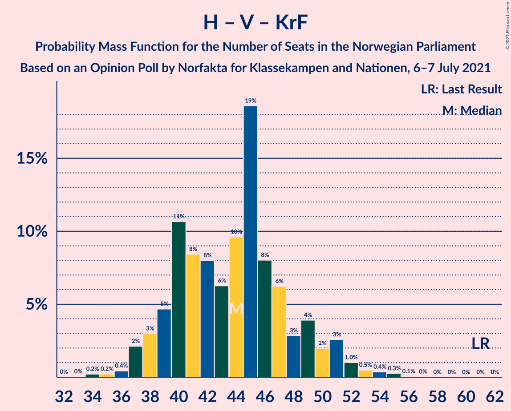

| Number of Seats | Probability | Accumulated | Special Marks |
|:---------------:|:-----------:|:-----------:|:-------------:|
| 33 | 0% | 100% |  |
| 34 | 0.2% | 99.9% |  |
| 35 | 0.2% | 99.7% |  |
| 36 | 0.4% | 99.5% |  |
| 37 | 2% | 99.1% |  |
| 38 | 3% | 97% |  |
| 39 | 5% | 94% |  |
| 40 | 11% | 89% |  |
| 41 | 8% | 79% |  |
| 42 | 8% | 70% |  |
| 43 | 6% | 62% |  |
| 44 | 10% | 56% | Median |
| 45 | 19% | 46% |  |
| 46 | 8% | 28% |  |
| 47 | 6% | 20% |  |
| 48 | 3% | 14% |  |
| 49 | 4% | 11% |  |
| 50 | 2% | 7% |  |
| 51 | 3% | 5% |  |
| 52 | 1.0% | 2% |  |
| 53 | 0.5% | 1.2% |  |
| 54 | 0.4% | 0.7% |  |
| 55 | 0.3% | 0.4% |  |
| 56 | 0.1% | 0.1% |  |
| 57 | 0% | 0% |  |
| 58 | 0% | 0% |  |
| 59 | 0% | 0% |  |
| 60 | 0% | 0% |  |
| 61 | 0% | 0% | Last Result |

### Senterpartiet – Venstre – Kristelig Folkeparti

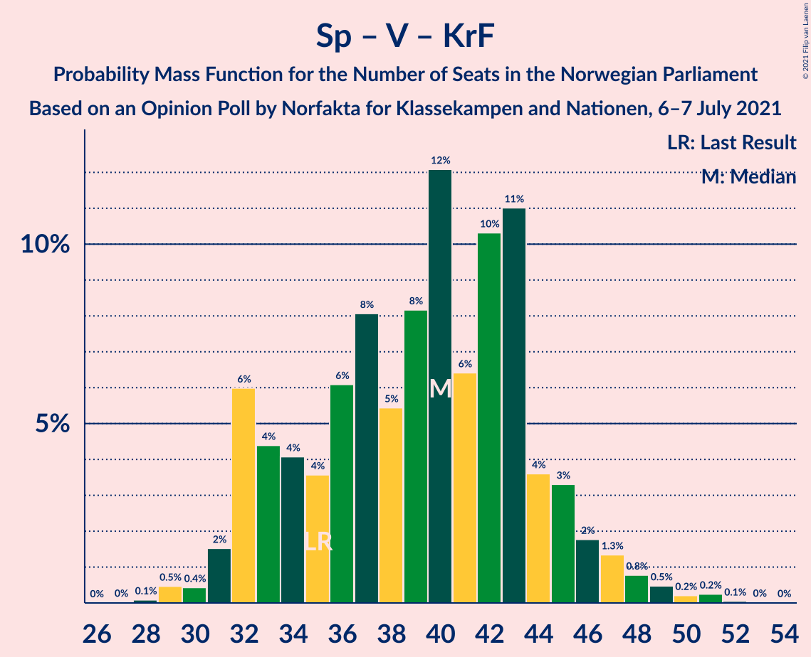

| Number of Seats | Probability | Accumulated | Special Marks |
|:---------------:|:-----------:|:-----------:|:-------------:|
| 28 | 0.1% | 100% |  |
| 29 | 0.5% | 99.9% |  |
| 30 | 0.4% | 99.4% |  |
| 31 | 2% | 99.0% |  |
| 32 | 6% | 97% |  |
| 33 | 4% | 91% |  |
| 34 | 4% | 87% |  |
| 35 | 4% | 83% | Last Result |
| 36 | 6% | 79% |  |
| 37 | 8% | 73% |  |
| 38 | 5% | 65% |  |
| 39 | 8% | 60% |  |
| 40 | 12% | 52% | Median |
| 41 | 6% | 40% |  |
| 42 | 10% | 33% |  |
| 43 | 11% | 23% |  |
| 44 | 4% | 12% |  |
| 45 | 3% | 8% |  |
| 46 | 2% | 5% |  |
| 47 | 1.3% | 3% |  |
| 48 | 0.8% | 2% |  |
| 49 | 0.5% | 1.0% |  |
| 50 | 0.2% | 0.5% |  |
| 51 | 0.2% | 0.3% |  |
| 52 | 0.1% | 0.1% |  |
| 53 | 0% | 0% |  |

## Technical Information

### Opinion Poll

+ **Polling firm:** Norfakta
+ **Commissioner(s):** Klassekampen and Nationen
+ **Fieldwork period:** 6–7 July 2021

### Calculations

+ **Sample size:** 770
+ **Simulations done:** 1,048,576
+ **Error estimate:** 1.37%

