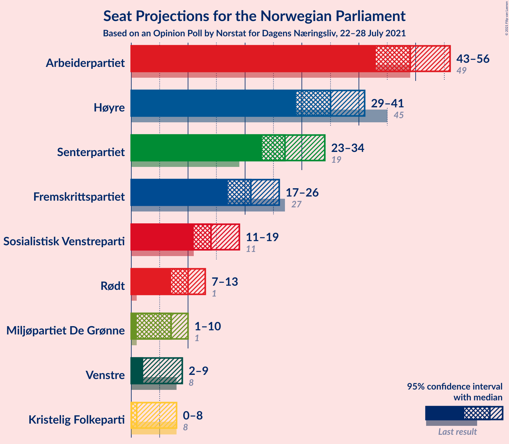
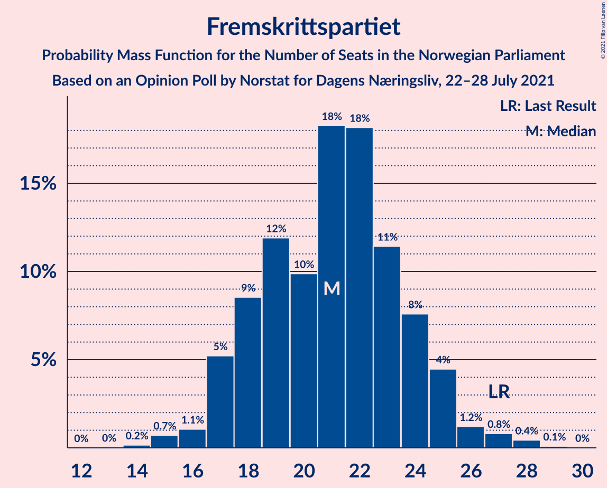
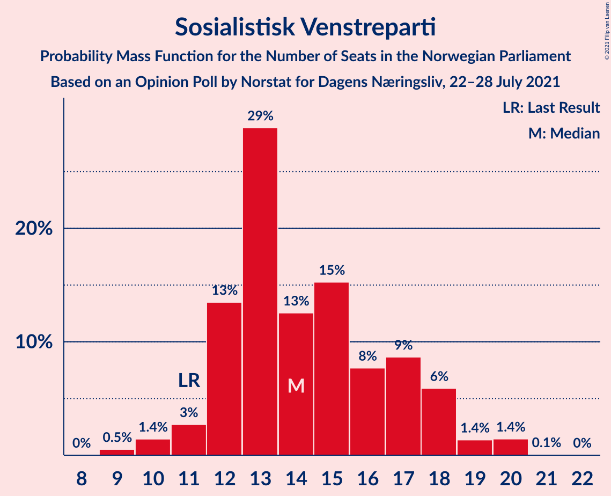
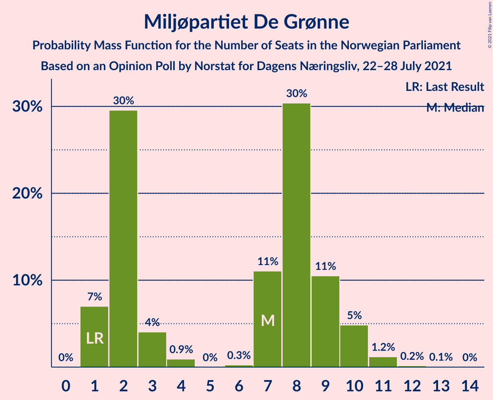
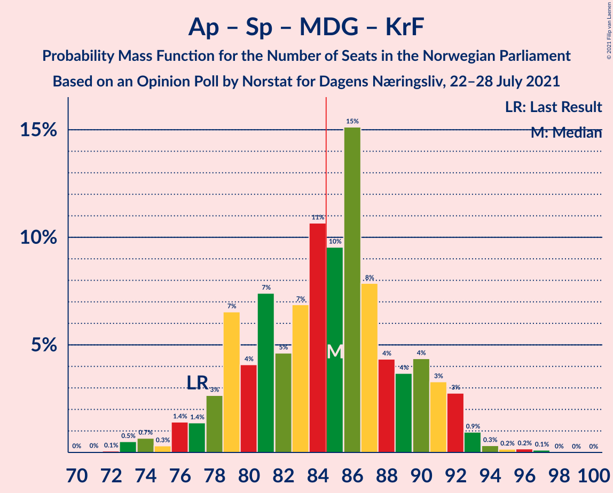
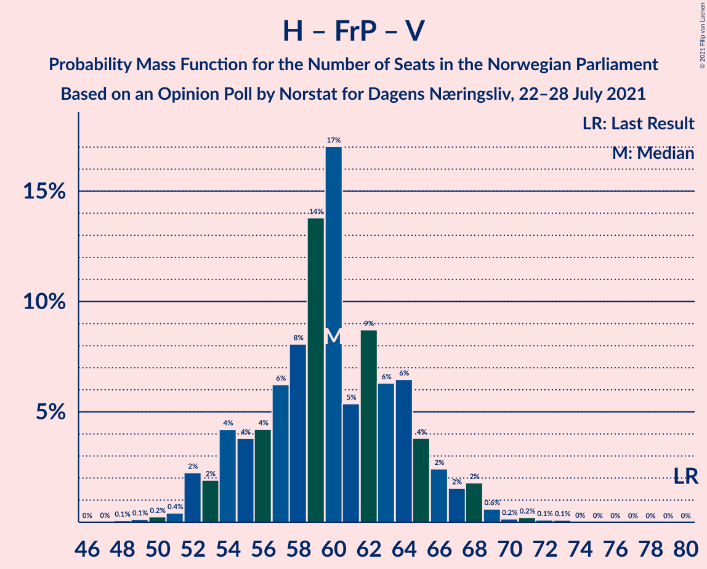

# Opinion Poll by Norstat for Dagens Næringsliv, 22–28 July 2021

<a href="#voting-intentions">Voting Intentions</a> | <a href="#seats">Seats</a> | <a href="#coalitions">Coalitions</a> | <a href="#technical-information">Technical Information</a>

## Voting Intentions

### Confidence Intervals

| Party | Last Result | Poll Result | 80% Confidence Interval | 90% Confidence Interval | 95% Confidence Interval | 99% Confidence Interval |
|:-----:|:-----------:|:-----------:|:-----------------------:|:-----------------------:|:-----------------------:|:-----------------------:|
| Arbeiderpartiet | 27.4% | 26.9% | 24.9–29.1% |24.3–29.7% |23.8–30.2% |22.9–31.3% |
| Høyre | 25.0% | 19.5% | 17.7–21.4% |17.2–22.0% |16.8–22.5% |15.9–23.4% |
| Senterpartiet | 10.3% | 15.0% | 13.4–16.8% |13.0–17.3% |12.6–17.8% |11.9–18.7% |
| Fremskrittspartiet | 15.2% | 11.6% | 10.2–13.3% |9.8–13.7% |9.5–14.1% |8.9–15.0% |
| Sosialistisk Venstreparti | 6.0% | 8.0% | 6.8–9.4% |6.5–9.8% |6.2–10.2% |5.7–10.9% |
| Rødt | 2.4% | 5.5% | 4.6–6.8% |4.3–7.1% |4.1–7.4% |3.7–8.1% |
| Miljøpartiet De Grønne | 3.2% | 4.1% | 3.3–5.2% |3.0–5.5% |2.9–5.7% |2.5–6.3% |
| Venstre | 4.4% | 3.6% | 2.9–4.7% |2.7–5.0% |2.5–5.3% |2.2–5.8% |
| Kristelig Folkeparti | 4.2% | 3.0% | 2.3–3.9% |2.1–4.2% |2.0–4.5% |1.7–5.0% |

*Note:* The poll result column reflects the actual value used in the calculations. Published results may vary slightly, and in addition be rounded to fewer digits.

## Seats

### Confidence Intervals

| Party | Last Result | Median | 80% Confidence Interval | 90% Confidence Interval | 95% Confidence Interval | 99% Confidence Interval |
|:-----:|:-----------:|:------:|:-----------------------:|:-----------------------:|:-----------------------:|:-----------------------:|
| <a href="#arbeiderpartiet">Arbeiderpartiet</a> | 49 | 48 | 45–53 |44–55 |43–56 |42–58 |
| <a href="#høyre">Høyre</a> | 45 | 36 | 30–39 |30–39 |29–40 |29–43 |
| <a href="#senterpartiet">Senterpartiet</a> | 19 | 28 | 25–31 |24–32 |23–33 |21–34 |
| <a href="#fremskrittspartiet">Fremskrittspartiet</a> | 27 | 21 | 18–24 |17–25 |17–25 |16–27 |
| <a href="#sosialistisk-venstreparti">Sosialistisk Venstreparti</a> | 11 | 14 | 12–18 |12–19 |11–20 |10–20 |
| <a href="#rødt">Rødt</a> | 1 | 10 | 8–13 |8–13 |7–14 |2–14 |
| <a href="#miljøpartiet-de-grønne">Miljøpartiet De Grønne</a> | 1 | 7 | 2–9 |1–10 |1–10 |1–11 |
| <a href="#venstre">Venstre</a> | 8 | 2 | 2–8 |2–9 |2–9 |1–10 |
| <a href="#kristelig-folkeparti">Kristelig Folkeparti</a> | 8 | 2 | 1–3 |1–7 |0–8 |0–9 |

### Arbeiderpartiet

*For a full overview of the results for this party, see the [Arbeiderpartiet](party-arbeiderpartiet.html) page.*

| Number of Seats | Probability | Accumulated | Special Marks |
|:---------------:|:-----------:|:-----------:|:-------------:|
| 40 | 0.2% | 100% |  |
| 41 | 0.2% | 99.8% |  |
| 42 | 0.6% | 99.6% |  |
| 43 | 3% | 99.0% |  |
| 44 | 5% | 96% |  |
| 45 | 15% | 91% |  |
| 46 | 3% | 76% |  |
| 47 | 14% | 72% |  |
| 48 | 12% | 58% | Median |
| 49 | 8% | 46% | Last Result |
| 50 | 13% | 38% |  |
| 51 | 7% | 26% |  |
| 52 | 5% | 18% |  |
| 53 | 4% | 13% |  |
| 54 | 2% | 10% |  |
| 55 | 4% | 7% |  |
| 56 | 2% | 3% |  |
| 57 | 1.2% | 2% |  |
| 58 | 0.3% | 0.6% |  |
| 59 | 0.2% | 0.3% |  |
| 60 | 0.1% | 0.1% |  |
| 61 | 0% | 0% |  |

### Høyre

*For a full overview of the results for this party, see the [Høyre](party-høyre.html) page.*

| Number of Seats | Probability | Accumulated | Special Marks |
|:---------------:|:-----------:|:-----------:|:-------------:|
| 26 | 0.1% | 100% |  |
| 27 | 0.1% | 99.9% |  |
| 28 | 0.3% | 99.8% |  |
| 29 | 3% | 99.5% |  |
| 30 | 8% | 96% |  |
| 31 | 3% | 88% |  |
| 32 | 5% | 85% |  |
| 33 | 6% | 79% |  |
| 34 | 12% | 73% |  |
| 35 | 9% | 60% |  |
| 36 | 18% | 52% | Median |
| 37 | 11% | 34% |  |
| 38 | 12% | 23% |  |
| 39 | 7% | 11% |  |
| 40 | 2% | 4% |  |
| 41 | 1.2% | 2% |  |
| 42 | 0.3% | 0.9% |  |
| 43 | 0.4% | 0.5% |  |
| 44 | 0.1% | 0.2% |  |
| 45 | 0% | 0.1% | Last Result |
| 46 | 0% | 0% |  |

### Senterpartiet

*For a full overview of the results for this party, see the [Senterpartiet](party-senterpartiet.html) page.*

| Number of Seats | Probability | Accumulated | Special Marks |
|:---------------:|:-----------:|:-----------:|:-------------:|
| 19 | 0.1% | 100% | Last Result |
| 20 | 0.3% | 99.9% |  |
| 21 | 1.2% | 99.6% |  |
| 22 | 0.6% | 98% |  |
| 23 | 1.3% | 98% |  |
| 24 | 4% | 96% |  |
| 25 | 8% | 93% |  |
| 26 | 12% | 85% |  |
| 27 | 16% | 73% |  |
| 28 | 24% | 57% | Median |
| 29 | 10% | 34% |  |
| 30 | 12% | 24% |  |
| 31 | 4% | 12% |  |
| 32 | 5% | 8% |  |
| 33 | 2% | 3% |  |
| 34 | 1.1% | 2% |  |
| 35 | 0.2% | 0.5% |  |
| 36 | 0.2% | 0.3% |  |
| 37 | 0% | 0.1% |  |
| 38 | 0% | 0% |  |

### Fremskrittspartiet

*For a full overview of the results for this party, see the [Fremskrittspartiet](party-fremskrittspartiet.html) page.*

| Number of Seats | Probability | Accumulated | Special Marks |
|:---------------:|:-----------:|:-----------:|:-------------:|
| 13 | 0.1% | 100% |  |
| 14 | 0.1% | 99.9% |  |
| 15 | 0.2% | 99.8% |  |
| 16 | 2% | 99.6% |  |
| 17 | 5% | 98% |  |
| 18 | 8% | 93% |  |
| 19 | 15% | 85% |  |
| 20 | 5% | 70% |  |
| 21 | 20% | 65% | Median |
| 22 | 10% | 45% |  |
| 23 | 19% | 35% |  |
| 24 | 6% | 16% |  |
| 25 | 7% | 10% |  |
| 26 | 2% | 2% |  |
| 27 | 0.4% | 0.6% | Last Result |
| 28 | 0.1% | 0.3% |  |
| 29 | 0.2% | 0.2% |  |
| 30 | 0% | 0% |  |

### Sosialistisk Venstreparti

*For a full overview of the results for this party, see the [Sosialistisk Venstreparti](party-sosialistiskvenstreparti.html) page.*

| Number of Seats | Probability | Accumulated | Special Marks |
|:---------------:|:-----------:|:-----------:|:-------------:|
| 9 | 0.1% | 100% |  |
| 10 | 0.6% | 99.9% |  |
| 11 | 3% | 99.3% | Last Result |
| 12 | 23% | 96% |  |
| 13 | 23% | 73% |  |
| 14 | 16% | 51% | Median |
| 15 | 12% | 34% |  |
| 16 | 2% | 22% |  |
| 17 | 8% | 20% |  |
| 18 | 7% | 13% |  |
| 19 | 3% | 6% |  |
| 20 | 3% | 3% |  |
| 21 | 0.1% | 0.1% |  |
| 22 | 0% | 0% |  |

### Rødt

*For a full overview of the results for this party, see the [Rødt](party-rødt.html) page.*

| Number of Seats | Probability | Accumulated | Special Marks |
|:---------------:|:-----------:|:-----------:|:-------------:|
| 1 | 0% | 100% | Last Result |
| 2 | 1.3% | 100% |  |
| 3 | 0% | 98.7% |  |
| 4 | 0% | 98.7% |  |
| 5 | 0% | 98.7% |  |
| 6 | 0% | 98.7% |  |
| 7 | 1.3% | 98.6% |  |
| 8 | 11% | 97% |  |
| 9 | 15% | 86% |  |
| 10 | 22% | 72% | Median |
| 11 | 27% | 50% |  |
| 12 | 12% | 23% |  |
| 13 | 7% | 10% |  |
| 14 | 3% | 3% |  |
| 15 | 0.2% | 0.3% |  |
| 16 | 0.1% | 0.1% |  |
| 17 | 0% | 0% |  |

### Miljøpartiet De Grønne

*For a full overview of the results for this party, see the [Miljøpartiet De Grønne](party-miljøpartietdegrønne.html) page.*

| Number of Seats | Probability | Accumulated | Special Marks |
|:---------------:|:-----------:|:-----------:|:-------------:|
| 1 | 8% | 100% | Last Result |
| 2 | 32% | 92% |  |
| 3 | 2% | 59% |  |
| 4 | 3% | 58% |  |
| 5 | 0% | 55% |  |
| 6 | 0.1% | 55% |  |
| 7 | 8% | 55% | Median |
| 8 | 31% | 47% |  |
| 9 | 8% | 17% |  |
| 10 | 6% | 8% |  |
| 11 | 2% | 2% |  |
| 12 | 0.1% | 0.2% |  |
| 13 | 0.1% | 0.1% |  |
| 14 | 0% | 0% |  |

### Venstre

*For a full overview of the results for this party, see the [Venstre](party-venstre.html) page.*

| Number of Seats | Probability | Accumulated | Special Marks |
|:---------------:|:-----------:|:-----------:|:-------------:|
| 0 | 0.1% | 100% |  |
| 1 | 2% | 99.9% |  |
| 2 | 58% | 98% | Median |
| 3 | 15% | 39% |  |
| 4 | 0% | 25% |  |
| 5 | 0% | 25% |  |
| 6 | 0.3% | 25% |  |
| 7 | 6% | 24% |  |
| 8 | 12% | 19% | Last Result |
| 9 | 5% | 6% |  |
| 10 | 0.9% | 1.1% |  |
| 11 | 0.1% | 0.2% |  |
| 12 | 0% | 0% |  |

### Kristelig Folkeparti

*For a full overview of the results for this party, see the [Kristelig Folkeparti](party-kristeligfolkeparti.html) page.*

| Number of Seats | Probability | Accumulated | Special Marks |
|:---------------:|:-----------:|:-----------:|:-------------:|
| 0 | 4% | 100% |  |
| 1 | 37% | 96% |  |
| 2 | 11% | 59% | Median |
| 3 | 41% | 48% |  |
| 4 | 0% | 7% |  |
| 5 | 0% | 7% |  |
| 6 | 0.1% | 7% |  |
| 7 | 4% | 7% |  |
| 8 | 2% | 3% | Last Result |
| 9 | 1.0% | 1.1% |  |
| 10 | 0.1% | 0.1% |  |
| 11 | 0% | 0% |  |

## Coalitions

### Confidence Intervals

| Coalition | Last Result | Median | Majority? | 80% Confidence Interval | 90% Confidence Interval | 95% Confidence Interval | 99% Confidence Interval |
|:---------:|:-----------:|:------:|:---------:|:-----------------------:|:-----------------------:|:-----------------------:|:-----------------------:|
| Arbeiderpartiet – Senterpartiet – Sosialistisk Venstreparti – Rødt – Miljøpartiet De Grønne | 81 | 106 | 100% | 102–112 | 100–113 | 100–114 | 96–117 |
| Arbeiderpartiet – Senterpartiet – Sosialistisk Venstreparti – Rødt | 80 | 101 | 100% | 96–107 | 94–109 | 93–109 | 90–110 |
| Arbeiderpartiet – Senterpartiet – Sosialistisk Venstreparti – Miljøpartiet De Grønne – Kristelig Folkeparti | 88 | 98 | 99.9% | 93–103 | 92–105 | 91–106 | 88–109 |
| Arbeiderpartiet – Senterpartiet – Sosialistisk Venstreparti – Miljøpartiet De Grønne | 80 | 96 | 99.7% | 91–101 | 90–102 | 89–104 | 86–106 |
| Arbeiderpartiet – Senterpartiet – Sosialistisk Venstreparti | 79 | 91 | 93% | 85–97 | 83–98 | 83–98 | 82–101 |
| Høyre – Senterpartiet – Fremskrittspartiet – Venstre – Kristelig Folkeparti | 107 | 91 | 91% | 85–96 | 83–97 | 82–98 | 81–100 |
| Arbeiderpartiet – Senterpartiet – Miljøpartiet De Grønne – Kristelig Folkeparti | 77 | 84 | 49% | 79–90 | 78–91 | 76–92 | 73–96 |
| Arbeiderpartiet – Senterpartiet – Kristelig Folkeparti | 76 | 78 | 10% | 73–84 | 73–87 | 72–88 | 70–89 |
| Arbeiderpartiet – Sosialistisk Venstreparti – Rødt – Miljøpartiet De Grønne | 62 | 78 | 9% | 73–84 | 72–85 | 71–87 | 69–88 |
| Arbeiderpartiet – Senterpartiet | 68 | 76 | 1.3% | 71–81 | 71–84 | 70–84 | 67–86 |
| Høyre – Fremskrittspartiet – Miljøpartiet De Grønne – Venstre – Kristelig Folkeparti | 89 | 68 | 0% | 62–73 | 60–75 | 59–75 | 58–78 |
| Arbeiderpartiet – Sosialistisk Venstreparti | 60 | 62 | 0% | 58–68 | 57–70 | 56–70 | 56–73 |
| Høyre – Fremskrittspartiet – Venstre – Kristelig Folkeparti | 88 | 63 | 0% | 57–67 | 55–68 | 55–69 | 52–73 |
| Høyre – Fremskrittspartiet – Venstre | 80 | 60 | 0% | 54–65 | 52–66 | 52–67 | 50–69 |
| Høyre – Fremskrittspartiet | 72 | 57 | 0% | 51–61 | 49–63 | 49–63 | 47–65 |
| Høyre – Venstre – Kristelig Folkeparti | 61 | 42 | 0% | 36–45 | 36–47 | 34–48 | 33–52 |
| Senterpartiet – Venstre – Kristelig Folkeparti | 35 | 33 | 0% | 29–41 | 28–41 | 27–43 | 26–44 |

### Arbeiderpartiet – Senterpartiet – Sosialistisk Venstreparti – Rødt – Miljøpartiet De Grønne

| Number of Seats | Probability | Accumulated | Special Marks |
|:---------------:|:-----------:|:-----------:|:-------------:|
| 81 | 0% | 100% | Last Result |
| 82 | 0% | 100% |  |
| 83 | 0% | 100% |  |
| 84 | 0% | 100% |  |
| 85 | 0% | 100% | Majority |
| 86 | 0% | 100% |  |
| 87 | 0% | 100% |  |
| 88 | 0% | 100% |  |
| 89 | 0% | 100% |  |
| 90 | 0% | 100% |  |
| 91 | 0% | 100% |  |
| 92 | 0.1% | 100% |  |
| 93 | 0.1% | 99.9% |  |
| 94 | 0.1% | 99.8% |  |
| 95 | 0.1% | 99.6% |  |
| 96 | 0.3% | 99.5% |  |
| 97 | 0.3% | 99.2% |  |
| 98 | 0.5% | 98.9% |  |
| 99 | 0.7% | 98% |  |
| 100 | 3% | 98% |  |
| 101 | 1.2% | 95% |  |
| 102 | 9% | 93% |  |
| 103 | 4% | 84% |  |
| 104 | 11% | 80% |  |
| 105 | 12% | 69% |  |
| 106 | 13% | 57% |  |
| 107 | 6% | 44% | Median |
| 108 | 10% | 39% |  |
| 109 | 7% | 28% |  |
| 110 | 6% | 22% |  |
| 111 | 5% | 15% |  |
| 112 | 5% | 11% |  |
| 113 | 2% | 6% |  |
| 114 | 3% | 4% |  |
| 115 | 0.4% | 1.0% |  |
| 116 | 0.1% | 0.6% |  |
| 117 | 0.4% | 0.5% |  |
| 118 | 0.1% | 0.1% |  |
| 119 | 0% | 0% |  |

### Arbeiderpartiet – Senterpartiet – Sosialistisk Venstreparti – Rødt

| Number of Seats | Probability | Accumulated | Special Marks |
|:---------------:|:-----------:|:-----------:|:-------------:|
| 80 | 0% | 100% | Last Result |
| 81 | 0% | 100% |  |
| 82 | 0% | 100% |  |
| 83 | 0% | 100% |  |
| 84 | 0% | 100% |  |
| 85 | 0% | 100% | Majority |
| 86 | 0% | 100% |  |
| 87 | 0.1% | 100% |  |
| 88 | 0.1% | 99.9% |  |
| 89 | 0.1% | 99.8% |  |
| 90 | 0.2% | 99.7% |  |
| 91 | 0.3% | 99.5% |  |
| 92 | 1.5% | 99.2% |  |
| 93 | 0.6% | 98% |  |
| 94 | 5% | 97% |  |
| 95 | 1.1% | 92% |  |
| 96 | 6% | 91% |  |
| 97 | 7% | 85% |  |
| 98 | 9% | 78% |  |
| 99 | 6% | 69% |  |
| 100 | 13% | 63% | Median |
| 101 | 5% | 50% |  |
| 102 | 12% | 46% |  |
| 103 | 10% | 34% |  |
| 104 | 3% | 24% |  |
| 105 | 4% | 21% |  |
| 106 | 5% | 17% |  |
| 107 | 3% | 12% |  |
| 108 | 1.4% | 9% |  |
| 109 | 6% | 8% |  |
| 110 | 2% | 2% |  |
| 111 | 0.2% | 0.4% |  |
| 112 | 0% | 0.2% |  |
| 113 | 0% | 0.1% |  |
| 114 | 0.1% | 0.1% |  |
| 115 | 0% | 0% |  |

### Arbeiderpartiet – Senterpartiet – Sosialistisk Venstreparti – Miljøpartiet De Grønne – Kristelig Folkeparti

| Number of Seats | Probability | Accumulated | Special Marks |
|:---------------:|:-----------:|:-----------:|:-------------:|
| 84 | 0.1% | 100% |  |
| 85 | 0.1% | 99.9% | Majority |
| 86 | 0.1% | 99.8% |  |
| 87 | 0.1% | 99.8% |  |
| 88 | 0.3% | 99.7% | Last Result |
| 89 | 0.3% | 99.4% |  |
| 90 | 1.3% | 99.1% |  |
| 91 | 1.3% | 98% |  |
| 92 | 2% | 96% |  |
| 93 | 5% | 95% |  |
| 94 | 4% | 90% |  |
| 95 | 4% | 86% |  |
| 96 | 16% | 82% |  |
| 97 | 4% | 66% |  |
| 98 | 14% | 62% |  |
| 99 | 11% | 48% | Median |
| 100 | 6% | 37% |  |
| 101 | 12% | 31% |  |
| 102 | 7% | 19% |  |
| 103 | 3% | 12% |  |
| 104 | 4% | 9% |  |
| 105 | 1.1% | 5% |  |
| 106 | 2% | 4% |  |
| 107 | 1.1% | 2% |  |
| 108 | 0.4% | 1.1% |  |
| 109 | 0.4% | 0.7% |  |
| 110 | 0.2% | 0.3% |  |
| 111 | 0% | 0.1% |  |
| 112 | 0% | 0.1% |  |
| 113 | 0% | 0% |  |

### Arbeiderpartiet – Senterpartiet – Sosialistisk Venstreparti – Miljøpartiet De Grønne

| Number of Seats | Probability | Accumulated | Special Marks |
|:---------------:|:-----------:|:-----------:|:-------------:|
| 80 | 0% | 100% | Last Result |
| 81 | 0% | 100% |  |
| 82 | 0% | 100% |  |
| 83 | 0.1% | 100% |  |
| 84 | 0.1% | 99.9% |  |
| 85 | 0.1% | 99.7% | Majority |
| 86 | 0.4% | 99.6% |  |
| 87 | 0.5% | 99.3% |  |
| 88 | 0.8% | 98.8% |  |
| 89 | 1.2% | 98% |  |
| 90 | 2% | 97% |  |
| 91 | 7% | 95% |  |
| 92 | 1.1% | 87% |  |
| 93 | 15% | 86% |  |
| 94 | 4% | 71% |  |
| 95 | 14% | 67% |  |
| 96 | 11% | 53% |  |
| 97 | 3% | 42% | Median |
| 98 | 13% | 39% |  |
| 99 | 9% | 26% |  |
| 100 | 6% | 17% |  |
| 101 | 3% | 11% |  |
| 102 | 4% | 8% |  |
| 103 | 1.4% | 4% |  |
| 104 | 0.8% | 3% |  |
| 105 | 1.5% | 2% |  |
| 106 | 0.5% | 0.8% |  |
| 107 | 0.2% | 0.4% |  |
| 108 | 0% | 0.1% |  |
| 109 | 0.1% | 0.1% |  |
| 110 | 0% | 0% |  |

### Arbeiderpartiet – Senterpartiet – Sosialistisk Venstreparti

| Number of Seats | Probability | Accumulated | Special Marks |
|:---------------:|:-----------:|:-----------:|:-------------:|
| 79 | 0.1% | 100% | Last Result |
| 80 | 0.1% | 99.9% |  |
| 81 | 0.2% | 99.7% |  |
| 82 | 0.4% | 99.5% |  |
| 83 | 5% | 99.1% |  |
| 84 | 0.6% | 94% |  |
| 85 | 3% | 93% | Majority |
| 86 | 10% | 90% |  |
| 87 | 8% | 80% |  |
| 88 | 6% | 72% |  |
| 89 | 2% | 66% |  |
| 90 | 10% | 64% | Median |
| 91 | 19% | 54% |  |
| 92 | 4% | 35% |  |
| 93 | 7% | 31% |  |
| 94 | 5% | 24% |  |
| 95 | 2% | 19% |  |
| 96 | 4% | 17% |  |
| 97 | 6% | 13% |  |
| 98 | 5% | 6% |  |
| 99 | 0.2% | 2% |  |
| 100 | 0.6% | 1.3% |  |
| 101 | 0.3% | 0.7% |  |
| 102 | 0.2% | 0.4% |  |
| 103 | 0% | 0.2% |  |
| 104 | 0.1% | 0.1% |  |
| 105 | 0% | 0% |  |

### Høyre – Senterpartiet – Fremskrittspartiet – Venstre – Kristelig Folkeparti

| Number of Seats | Probability | Accumulated | Special Marks |
|:---------------:|:-----------:|:-----------:|:-------------:|
| 77 | 0% | 100% |  |
| 78 | 0.2% | 99.9% |  |
| 79 | 0.1% | 99.8% |  |
| 80 | 0.2% | 99.7% |  |
| 81 | 1.1% | 99.5% |  |
| 82 | 2% | 98% |  |
| 83 | 1.2% | 96% |  |
| 84 | 4% | 95% |  |
| 85 | 7% | 91% | Majority |
| 86 | 2% | 84% |  |
| 87 | 14% | 83% |  |
| 88 | 4% | 69% |  |
| 89 | 10% | 65% | Median |
| 90 | 3% | 54% |  |
| 91 | 14% | 51% |  |
| 92 | 5% | 37% |  |
| 93 | 16% | 33% |  |
| 94 | 2% | 17% |  |
| 95 | 4% | 14% |  |
| 96 | 4% | 11% |  |
| 97 | 4% | 7% |  |
| 98 | 1.1% | 3% |  |
| 99 | 0.8% | 1.5% |  |
| 100 | 0.4% | 0.6% |  |
| 101 | 0.1% | 0.2% |  |
| 102 | 0.1% | 0.1% |  |
| 103 | 0.1% | 0.1% |  |
| 104 | 0% | 0% |  |
| 105 | 0% | 0% |  |
| 106 | 0% | 0% |  |
| 107 | 0% | 0% | Last Result |

### Arbeiderpartiet – Senterpartiet – Miljøpartiet De Grønne – Kristelig Folkeparti

| Number of Seats | Probability | Accumulated | Special Marks |
|:---------------:|:-----------:|:-----------:|:-------------:|
| 71 | 0% | 100% |  |
| 72 | 0.1% | 99.9% |  |
| 73 | 0.7% | 99.8% |  |
| 74 | 0.8% | 99.1% |  |
| 75 | 0.4% | 98% |  |
| 76 | 0.6% | 98% |  |
| 77 | 0.6% | 97% | Last Result |
| 78 | 4% | 97% |  |
| 79 | 4% | 93% |  |
| 80 | 3% | 88% |  |
| 81 | 15% | 86% |  |
| 82 | 2% | 70% |  |
| 83 | 14% | 68% |  |
| 84 | 5% | 54% |  |
| 85 | 9% | 49% | Median, Majority |
| 86 | 15% | 40% |  |
| 87 | 3% | 25% |  |
| 88 | 6% | 22% |  |
| 89 | 6% | 16% |  |
| 90 | 6% | 11% |  |
| 91 | 3% | 5% |  |
| 92 | 0.7% | 3% |  |
| 93 | 0.7% | 2% |  |
| 94 | 0.4% | 1.1% |  |
| 95 | 0.2% | 0.7% |  |
| 96 | 0.3% | 0.5% |  |
| 97 | 0.2% | 0.2% |  |
| 98 | 0% | 0% |  |

### Arbeiderpartiet – Senterpartiet – Kristelig Folkeparti

| Number of Seats | Probability | Accumulated | Special Marks |
|:---------------:|:-----------:|:-----------:|:-------------:|
| 66 | 0.1% | 100% |  |
| 67 | 0.1% | 99.9% |  |
| 68 | 0.1% | 99.8% |  |
| 69 | 0.2% | 99.7% |  |
| 70 | 0.5% | 99.5% |  |
| 71 | 0.9% | 99.0% |  |
| 72 | 1.2% | 98% |  |
| 73 | 11% | 97% |  |
| 74 | 3% | 86% |  |
| 75 | 4% | 83% |  |
| 76 | 3% | 78% | Last Result |
| 77 | 12% | 76% |  |
| 78 | 18% | 64% | Median |
| 79 | 5% | 46% |  |
| 80 | 7% | 41% |  |
| 81 | 15% | 34% |  |
| 82 | 6% | 20% |  |
| 83 | 2% | 13% |  |
| 84 | 1.3% | 11% |  |
| 85 | 2% | 10% | Majority |
| 86 | 0.9% | 8% |  |
| 87 | 4% | 7% |  |
| 88 | 2% | 3% |  |
| 89 | 0.7% | 1.0% |  |
| 90 | 0.1% | 0.3% |  |
| 91 | 0.1% | 0.1% |  |
| 92 | 0% | 0% |  |

### Arbeiderpartiet – Sosialistisk Venstreparti – Rødt – Miljøpartiet De Grønne

| Number of Seats | Probability | Accumulated | Special Marks |
|:---------------:|:-----------:|:-----------:|:-------------:|
| 62 | 0% | 100% | Last Result |
| 63 | 0% | 100% |  |
| 64 | 0% | 100% |  |
| 65 | 0% | 100% |  |
| 66 | 0.1% | 100% |  |
| 67 | 0.1% | 99.8% |  |
| 68 | 0.1% | 99.7% |  |
| 69 | 0.4% | 99.6% |  |
| 70 | 1.0% | 99.2% |  |
| 71 | 1.2% | 98% |  |
| 72 | 4% | 97% |  |
| 73 | 5% | 93% |  |
| 74 | 4% | 88% |  |
| 75 | 2% | 84% |  |
| 76 | 16% | 82% |  |
| 77 | 5% | 66% |  |
| 78 | 17% | 61% |  |
| 79 | 3% | 44% | Median |
| 80 | 10% | 42% |  |
| 81 | 4% | 32% |  |
| 82 | 14% | 28% |  |
| 83 | 2% | 14% |  |
| 84 | 4% | 12% |  |
| 85 | 4% | 9% | Majority |
| 86 | 1.2% | 5% |  |
| 87 | 2% | 4% |  |
| 88 | 1.1% | 1.5% |  |
| 89 | 0.2% | 0.4% |  |
| 90 | 0.1% | 0.2% |  |
| 91 | 0.1% | 0.2% |  |
| 92 | 0% | 0.1% |  |
| 93 | 0% | 0% |  |

### Arbeiderpartiet – Senterpartiet

| Number of Seats | Probability | Accumulated | Special Marks |
|:---------------:|:-----------:|:-----------:|:-------------:|
| 64 | 0.1% | 100% |  |
| 65 | 0% | 99.9% |  |
| 66 | 0.2% | 99.9% |  |
| 67 | 0.2% | 99.6% |  |
| 68 | 0.5% | 99.5% | Last Result |
| 69 | 1.3% | 98.9% |  |
| 70 | 2% | 98% |  |
| 71 | 7% | 96% |  |
| 72 | 8% | 89% |  |
| 73 | 2% | 81% |  |
| 74 | 5% | 78% |  |
| 75 | 11% | 74% |  |
| 76 | 14% | 63% | Median |
| 77 | 13% | 49% |  |
| 78 | 12% | 35% |  |
| 79 | 4% | 24% |  |
| 80 | 5% | 19% |  |
| 81 | 6% | 15% |  |
| 82 | 2% | 8% |  |
| 83 | 0.7% | 7% |  |
| 84 | 5% | 6% |  |
| 85 | 0.7% | 1.3% | Majority |
| 86 | 0.2% | 0.5% |  |
| 87 | 0.1% | 0.4% |  |
| 88 | 0.1% | 0.3% |  |
| 89 | 0.1% | 0.1% |  |
| 90 | 0% | 0% |  |

### Høyre – Fremskrittspartiet – Miljøpartiet De Grønne – Venstre – Kristelig Folkeparti

| Number of Seats | Probability | Accumulated | Special Marks |
|:---------------:|:-----------:|:-----------:|:-------------:|
| 54 | 0% | 100% |  |
| 55 | 0.2% | 99.9% |  |
| 56 | 0.1% | 99.8% |  |
| 57 | 0% | 99.7% |  |
| 58 | 0.2% | 99.7% |  |
| 59 | 2% | 99.4% |  |
| 60 | 6% | 97% |  |
| 61 | 1.4% | 92% |  |
| 62 | 3% | 90% |  |
| 63 | 8% | 87% |  |
| 64 | 4% | 80% |  |
| 65 | 3% | 76% |  |
| 66 | 10% | 72% |  |
| 67 | 12% | 62% |  |
| 68 | 5% | 50% | Median |
| 69 | 10% | 46% |  |
| 70 | 6% | 36% |  |
| 71 | 9% | 30% |  |
| 72 | 6% | 21% |  |
| 73 | 6% | 15% |  |
| 74 | 1.0% | 9% |  |
| 75 | 5% | 8% |  |
| 76 | 0.4% | 2% |  |
| 77 | 1.4% | 2% |  |
| 78 | 0.2% | 0.5% |  |
| 79 | 0.1% | 0.3% |  |
| 80 | 0.1% | 0.2% |  |
| 81 | 0% | 0.1% |  |
| 82 | 0.1% | 0.1% |  |
| 83 | 0% | 0% |  |
| 84 | 0% | 0% |  |
| 85 | 0% | 0% | Majority |
| 86 | 0% | 0% |  |
| 87 | 0% | 0% |  |
| 88 | 0% | 0% |  |
| 89 | 0% | 0% | Last Result |

### Arbeiderpartiet – Sosialistisk Venstreparti

| Number of Seats | Probability | Accumulated | Special Marks |
|:---------------:|:-----------:|:-----------:|:-------------:|
| 53 | 0.1% | 100% |  |
| 54 | 0% | 99.9% |  |
| 55 | 0.3% | 99.9% |  |
| 56 | 2% | 99.6% |  |
| 57 | 6% | 97% |  |
| 58 | 2% | 91% |  |
| 59 | 16% | 89% |  |
| 60 | 9% | 74% | Last Result |
| 61 | 10% | 65% |  |
| 62 | 8% | 55% | Median |
| 63 | 11% | 46% |  |
| 64 | 3% | 35% |  |
| 65 | 4% | 33% |  |
| 66 | 5% | 29% |  |
| 67 | 5% | 23% |  |
| 68 | 9% | 19% |  |
| 69 | 4% | 10% |  |
| 70 | 4% | 6% |  |
| 71 | 0.4% | 2% |  |
| 72 | 0.8% | 1.5% |  |
| 73 | 0.4% | 0.7% |  |
| 74 | 0% | 0.2% |  |
| 75 | 0% | 0.2% |  |
| 76 | 0.1% | 0.1% |  |
| 77 | 0% | 0% |  |

### Høyre – Fremskrittspartiet – Venstre – Kristelig Folkeparti

| Number of Seats | Probability | Accumulated | Special Marks |
|:---------------:|:-----------:|:-----------:|:-------------:|
| 50 | 0% | 100% |  |
| 51 | 0.1% | 99.9% |  |
| 52 | 0.4% | 99.8% |  |
| 53 | 0.2% | 99.4% |  |
| 54 | 0.4% | 99.2% |  |
| 55 | 6% | 98.8% |  |
| 56 | 2% | 93% |  |
| 57 | 5% | 91% |  |
| 58 | 6% | 86% |  |
| 59 | 6% | 81% |  |
| 60 | 7% | 75% |  |
| 61 | 7% | 67% | Median |
| 62 | 6% | 60% |  |
| 63 | 13% | 54% |  |
| 64 | 11% | 41% |  |
| 65 | 11% | 30% |  |
| 66 | 4% | 19% |  |
| 67 | 9% | 15% |  |
| 68 | 1.2% | 6% |  |
| 69 | 3% | 5% |  |
| 70 | 0.6% | 2% |  |
| 71 | 0.5% | 1.3% |  |
| 72 | 0.2% | 0.8% |  |
| 73 | 0.3% | 0.5% |  |
| 74 | 0.1% | 0.2% |  |
| 75 | 0.1% | 0.2% |  |
| 76 | 0% | 0.1% |  |
| 77 | 0% | 0% |  |
| 78 | 0% | 0% |  |
| 79 | 0% | 0% |  |
| 80 | 0% | 0% |  |
| 81 | 0% | 0% |  |
| 82 | 0% | 0% |  |
| 83 | 0% | 0% |  |
| 84 | 0% | 0% |  |
| 85 | 0% | 0% | Majority |
| 86 | 0% | 0% |  |
| 87 | 0% | 0% |  |
| 88 | 0% | 0% | Last Result |

### Høyre – Fremskrittspartiet – Venstre

| Number of Seats | Probability | Accumulated | Special Marks |
|:---------------:|:-----------:|:-----------:|:-------------:|
| 48 | 0.1% | 100% |  |
| 49 | 0.2% | 99.9% |  |
| 50 | 0.4% | 99.7% |  |
| 51 | 0.5% | 99.3% |  |
| 52 | 4% | 98.8% |  |
| 53 | 1.4% | 94% |  |
| 54 | 3% | 93% |  |
| 55 | 7% | 90% |  |
| 56 | 3% | 83% |  |
| 57 | 4% | 81% |  |
| 58 | 8% | 76% |  |
| 59 | 11% | 68% | Median |
| 60 | 14% | 58% |  |
| 61 | 6% | 43% |  |
| 62 | 11% | 38% |  |
| 63 | 8% | 26% |  |
| 64 | 7% | 18% |  |
| 65 | 6% | 12% |  |
| 66 | 2% | 5% |  |
| 67 | 1.0% | 3% |  |
| 68 | 1.5% | 2% |  |
| 69 | 0.3% | 0.7% |  |
| 70 | 0.1% | 0.5% |  |
| 71 | 0.2% | 0.4% |  |
| 72 | 0.1% | 0.2% |  |
| 73 | 0.1% | 0.1% |  |
| 74 | 0.1% | 0.1% |  |
| 75 | 0% | 0% |  |
| 76 | 0% | 0% |  |
| 77 | 0% | 0% |  |
| 78 | 0% | 0% |  |
| 79 | 0% | 0% |  |
| 80 | 0% | 0% | Last Result |

### Høyre – Fremskrittspartiet

| Number of Seats | Probability | Accumulated | Special Marks |
|:---------------:|:-----------:|:-----------:|:-------------:|
| 45 | 0.1% | 100% |  |
| 46 | 0.4% | 99.9% |  |
| 47 | 0.3% | 99.5% |  |
| 48 | 1.2% | 99.3% |  |
| 49 | 3% | 98% |  |
| 50 | 2% | 95% |  |
| 51 | 3% | 93% |  |
| 52 | 9% | 90% |  |
| 53 | 8% | 81% |  |
| 54 | 9% | 72% |  |
| 55 | 4% | 64% |  |
| 56 | 9% | 60% |  |
| 57 | 10% | 50% | Median |
| 58 | 9% | 40% |  |
| 59 | 11% | 31% |  |
| 60 | 4% | 20% |  |
| 61 | 8% | 17% |  |
| 62 | 1.5% | 9% |  |
| 63 | 6% | 8% |  |
| 64 | 1.3% | 2% |  |
| 65 | 0.4% | 0.8% |  |
| 66 | 0.3% | 0.4% |  |
| 67 | 0.1% | 0.1% |  |
| 68 | 0% | 0% |  |
| 69 | 0% | 0% |  |
| 70 | 0% | 0% |  |
| 71 | 0% | 0% |  |
| 72 | 0% | 0% | Last Result |

### Høyre – Venstre – Kristelig Folkeparti

| Number of Seats | Probability | Accumulated | Special Marks |
|:---------------:|:-----------:|:-----------:|:-------------:|
| 32 | 0.1% | 100% |  |
| 33 | 0.5% | 99.8% |  |
| 34 | 2% | 99.3% |  |
| 35 | 1.4% | 97% |  |
| 36 | 8% | 95% |  |
| 37 | 2% | 88% |  |
| 38 | 7% | 85% |  |
| 39 | 12% | 78% |  |
| 40 | 8% | 67% | Median |
| 41 | 7% | 58% |  |
| 42 | 22% | 51% |  |
| 43 | 8% | 29% |  |
| 44 | 6% | 21% |  |
| 45 | 7% | 14% |  |
| 46 | 2% | 8% |  |
| 47 | 2% | 6% |  |
| 48 | 2% | 4% |  |
| 49 | 0.7% | 2% |  |
| 50 | 0.5% | 1.3% |  |
| 51 | 0.1% | 0.7% |  |
| 52 | 0.2% | 0.6% |  |
| 53 | 0.2% | 0.4% |  |
| 54 | 0.1% | 0.2% |  |
| 55 | 0% | 0.1% |  |
| 56 | 0% | 0.1% |  |
| 57 | 0% | 0% |  |
| 58 | 0% | 0% |  |
| 59 | 0% | 0% |  |
| 60 | 0% | 0% |  |
| 61 | 0% | 0% | Last Result |

### Senterpartiet – Venstre – Kristelig Folkeparti

| Number of Seats | Probability | Accumulated | Special Marks |
|:---------------:|:-----------:|:-----------:|:-------------:|
| 24 | 0% | 100% |  |
| 25 | 0.3% | 99.9% |  |
| 26 | 0.4% | 99.6% |  |
| 27 | 4% | 99.2% |  |
| 28 | 3% | 95% |  |
| 29 | 3% | 92% |  |
| 30 | 13% | 90% |  |
| 31 | 8% | 77% |  |
| 32 | 12% | 68% | Median |
| 33 | 9% | 57% |  |
| 34 | 12% | 47% |  |
| 35 | 3% | 36% | Last Result |
| 36 | 10% | 33% |  |
| 37 | 6% | 23% |  |
| 38 | 2% | 17% |  |
| 39 | 2% | 15% |  |
| 40 | 1.4% | 13% |  |
| 41 | 7% | 11% |  |
| 42 | 1.2% | 4% |  |
| 43 | 2% | 3% |  |
| 44 | 0.7% | 1.2% |  |
| 45 | 0.4% | 0.5% |  |
| 46 | 0% | 0.1% |  |
| 47 | 0.1% | 0.1% |  |
| 48 | 0% | 0% |  |

## Technical Information

### Opinion Poll

+ **Polling firm:** Norstat
+ **Commissioner(s):** Dagens Næringsliv
+ **Fieldwork period:** 22–28 July 2021

### Calculations

+ **Sample size:** 740
+ **Simulations done:** 262,144
+ **Error estimate:** 1.43%

