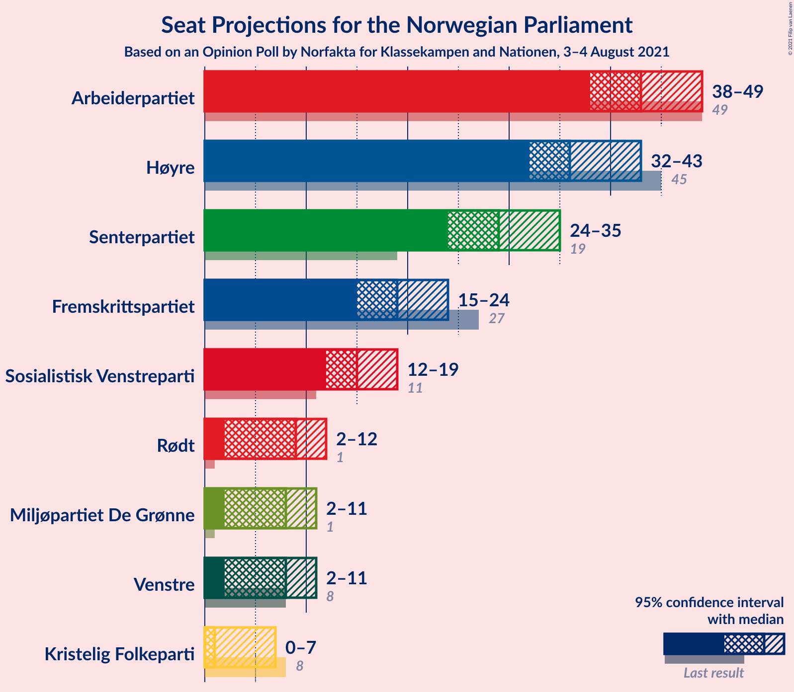
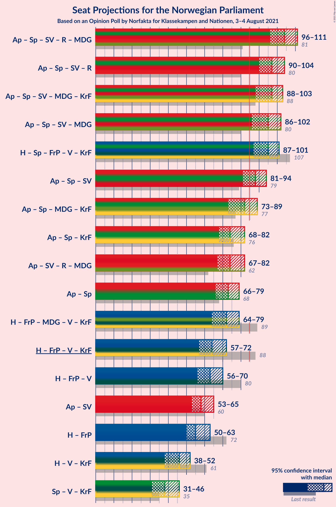
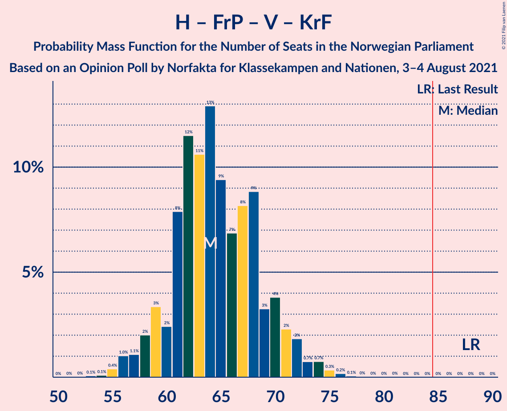
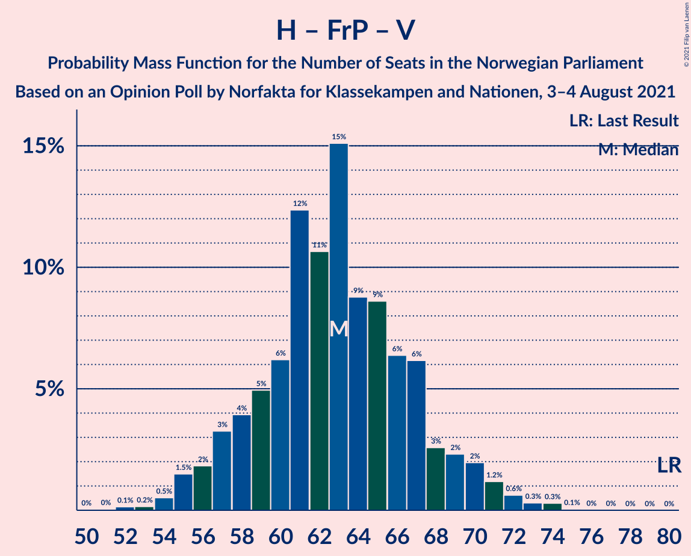

# Opinion Poll by Norfakta for Klassekampen and Nationen, 3–4 August 2021

<a href="#voting-intentions">Voting Intentions</a> | <a href="#seats">Seats</a> | <a href="#coalitions">Coalitions</a> | <a href="#technical-information">Technical Information</a>

## Voting Intentions

### Confidence Intervals

| Party | Last Result | Poll Result | 80% Confidence Interval | 90% Confidence Interval | 95% Confidence Interval | 99% Confidence Interval |
|:-----:|:-----------:|:-----------:|:-----------------------:|:-----------------------:|:-----------------------:|:-----------------------:|
| Arbeiderpartiet | 27.4% | 23.7% | 21.8–25.8% |21.3–26.4% |20.9–26.9% |20.0–27.9% |
| Høyre | 25.0% | 20.9% | 19.1–22.9% |18.6–23.4% |18.2–23.9% |17.3–24.9% |
| Senterpartiet | 10.3% | 15.8% | 14.2–17.6% |13.8–18.1% |13.4–18.6% |12.7–19.5% |
| Fremskrittspartiet | 15.2% | 10.9% | 9.6–12.5% |9.2–12.9% |8.9–13.3% |8.3–14.1% |
| Sosialistisk Venstreparti | 6.0% | 8.6% | 7.4–10.0% |7.1–10.4% |6.8–10.8% |6.3–11.5% |
| Rødt | 2.4% | 5.3% | 4.4–6.5% |4.2–6.8% |3.9–7.1% |3.6–7.8% |
| Miljøpartiet De Grønne | 3.2% | 4.5% | 3.7–5.7% |3.5–6.0% |3.3–6.2% |2.9–6.8% |
| Venstre | 4.4% | 4.5% | 3.7–5.7% |3.5–6.0% |3.3–6.2% |2.9–6.8% |
| Kristelig Folkeparti | 4.2% | 2.9% | 2.2–3.8% |2.0–4.1% |1.9–4.3% |1.6–4.8% |

*Note:* The poll result column reflects the actual value used in the calculations. Published results may vary slightly, and in addition be rounded to fewer digits.

## Seats

### Confidence Intervals

| Party | Last Result | Median | 80% Confidence Interval | 90% Confidence Interval | 95% Confidence Interval | 99% Confidence Interval |
|:-----:|:-----------:|:------:|:-----------------------:|:-----------------------:|:-----------------------:|:-----------------------:|
| <a href="#arbeiderpartiet">Arbeiderpartiet</a> | 49 | 43 | 40–46 |40–49 |39–49 |36–50 |
| <a href="#høyre">Høyre</a> | 45 | 36 | 34–41 |33–41 |32–43 |29–46 |
| <a href="#senterpartiet">Senterpartiet</a> | 19 | 29 | 26–32 |25–34 |24–34 |22–36 |
| <a href="#fremskrittspartiet">Fremskrittspartiet</a> | 27 | 19 | 17–23 |16–23 |15–24 |13–25 |
| <a href="#sosialistisk-venstreparti">Sosialistisk Venstreparti</a> | 11 | 17 | 12–18 |12–18 |11–18 |10–20 |
| <a href="#rødt">Rødt</a> | 1 | 10 | 8–11 |7–12 |7–13 |2–14 |
| <a href="#miljøpartiet-de-grønne">Miljøpartiet De Grønne</a> | 1 | 7 | 2–10 |2–10 |2–10 |1–12 |
| <a href="#venstre">Venstre</a> | 8 | 8 | 2–9 |2–10 |2–11 |2–12 |
| <a href="#kristelig-folkeparti">Kristelig Folkeparti</a> | 8 | 1 | 0–3 |0–7 |0–7 |0–8 |

### Arbeiderpartiet

*For a full overview of the results for this party, see the [Arbeiderpartiet](party-arbeiderpartiet.html) page.*

| Number of Seats | Probability | Accumulated | Special Marks |
|:---------------:|:-----------:|:-----------:|:-------------:|
| 35 | 0.1% | 100% |  |
| 36 | 0.7% | 99.9% |  |
| 37 | 0.3% | 99.2% |  |
| 38 | 1.0% | 98.9% |  |
| 39 | 2% | 98% |  |
| 40 | 11% | 96% |  |
| 41 | 7% | 85% |  |
| 42 | 7% | 78% |  |
| 43 | 40% | 72% | Median |
| 44 | 12% | 31% |  |
| 45 | 8% | 19% |  |
| 46 | 2% | 11% |  |
| 47 | 2% | 9% |  |
| 48 | 0.8% | 7% |  |
| 49 | 5% | 6% | Last Result |
| 50 | 0.3% | 0.8% |  |
| 51 | 0.1% | 0.5% |  |
| 52 | 0% | 0.3% |  |
| 53 | 0.1% | 0.3% |  |
| 54 | 0% | 0.2% |  |
| 55 | 0.2% | 0.2% |  |
| 56 | 0% | 0% |  |

### Høyre

*For a full overview of the results for this party, see the [Høyre](party-høyre.html) page.*

| Number of Seats | Probability | Accumulated | Special Marks |
|:---------------:|:-----------:|:-----------:|:-------------:|
| 28 | 0.1% | 100% |  |
| 29 | 0.5% | 99.9% |  |
| 30 | 0.5% | 99.3% |  |
| 31 | 0.6% | 98.8% |  |
| 32 | 2% | 98% |  |
| 33 | 2% | 96% |  |
| 34 | 6% | 94% |  |
| 35 | 29% | 89% |  |
| 36 | 16% | 60% | Median |
| 37 | 7% | 43% |  |
| 38 | 10% | 36% |  |
| 39 | 12% | 26% |  |
| 40 | 2% | 14% |  |
| 41 | 6% | 11% |  |
| 42 | 0.9% | 5% |  |
| 43 | 3% | 4% |  |
| 44 | 0.3% | 0.9% |  |
| 45 | 0.2% | 0.7% | Last Result |
| 46 | 0.4% | 0.5% |  |
| 47 | 0% | 0.1% |  |
| 48 | 0% | 0% |  |

### Senterpartiet

*For a full overview of the results for this party, see the [Senterpartiet](party-senterpartiet.html) page.*

| Number of Seats | Probability | Accumulated | Special Marks |
|:---------------:|:-----------:|:-----------:|:-------------:|
| 19 | 0% | 100% | Last Result |
| 20 | 0.1% | 100% |  |
| 21 | 0.2% | 99.9% |  |
| 22 | 0.3% | 99.7% |  |
| 23 | 1.1% | 99.5% |  |
| 24 | 2% | 98% |  |
| 25 | 6% | 97% |  |
| 26 | 16% | 91% |  |
| 27 | 7% | 75% |  |
| 28 | 13% | 69% |  |
| 29 | 28% | 55% | Median |
| 30 | 7% | 28% |  |
| 31 | 4% | 20% |  |
| 32 | 10% | 17% |  |
| 33 | 2% | 7% |  |
| 34 | 4% | 5% |  |
| 35 | 0.5% | 1.3% |  |
| 36 | 0.5% | 0.8% |  |
| 37 | 0.2% | 0.3% |  |
| 38 | 0% | 0.1% |  |
| 39 | 0% | 0% |  |

### Fremskrittspartiet

*For a full overview of the results for this party, see the [Fremskrittspartiet](party-fremskrittspartiet.html) page.*

| Number of Seats | Probability | Accumulated | Special Marks |
|:---------------:|:-----------:|:-----------:|:-------------:|
| 12 | 0.1% | 100% |  |
| 13 | 0.5% | 99.9% |  |
| 14 | 1.0% | 99.4% |  |
| 15 | 1.2% | 98% |  |
| 16 | 4% | 97% |  |
| 17 | 13% | 93% |  |
| 18 | 28% | 80% |  |
| 19 | 18% | 52% | Median |
| 20 | 6% | 35% |  |
| 21 | 3% | 29% |  |
| 22 | 15% | 25% |  |
| 23 | 8% | 11% |  |
| 24 | 1.4% | 3% |  |
| 25 | 0.9% | 1.3% |  |
| 26 | 0.3% | 0.4% |  |
| 27 | 0.1% | 0.1% | Last Result |
| 28 | 0% | 0% |  |

### Sosialistisk Venstreparti

*For a full overview of the results for this party, see the [Sosialistisk Venstreparti](party-sosialistiskvenstreparti.html) page.*

| Number of Seats | Probability | Accumulated | Special Marks |
|:---------------:|:-----------:|:-----------:|:-------------:|
| 9 | 0.1% | 100% |  |
| 10 | 0.7% | 99.9% |  |
| 11 | 2% | 99.2% | Last Result |
| 12 | 9% | 97% |  |
| 13 | 11% | 88% |  |
| 14 | 5% | 77% |  |
| 15 | 6% | 72% |  |
| 16 | 9% | 66% |  |
| 17 | 40% | 57% | Median |
| 18 | 17% | 18% |  |
| 19 | 0.4% | 1.0% |  |
| 20 | 0.2% | 0.7% |  |
| 21 | 0.3% | 0.5% |  |
| 22 | 0.1% | 0.1% |  |
| 23 | 0.1% | 0.1% |  |
| 24 | 0% | 0% |  |

### Rødt

*For a full overview of the results for this party, see the [Rødt](party-rødt.html) page.*

| Number of Seats | Probability | Accumulated | Special Marks |
|:---------------:|:-----------:|:-----------:|:-------------:|
| 1 | 0% | 100% | Last Result |
| 2 | 2% | 100% |  |
| 3 | 0% | 98% |  |
| 4 | 0% | 98% |  |
| 5 | 0% | 98% |  |
| 6 | 0.1% | 98% |  |
| 7 | 7% | 98% |  |
| 8 | 20% | 91% |  |
| 9 | 15% | 71% |  |
| 10 | 11% | 56% | Median |
| 11 | 37% | 45% |  |
| 12 | 4% | 8% |  |
| 13 | 3% | 4% |  |
| 14 | 0.9% | 1.0% |  |
| 15 | 0.1% | 0.1% |  |
| 16 | 0% | 0% |  |

### Miljøpartiet De Grønne

*For a full overview of the results for this party, see the [Miljøpartiet De Grønne](party-miljøpartietdegrønne.html) page.*

| Number of Seats | Probability | Accumulated | Special Marks |
|:---------------:|:-----------:|:-----------:|:-------------:|
| 1 | 2% | 100% | Last Result |
| 2 | 21% | 98% |  |
| 3 | 0.5% | 77% |  |
| 4 | 0% | 76% |  |
| 5 | 0% | 76% |  |
| 6 | 0.1% | 76% |  |
| 7 | 43% | 76% | Median |
| 8 | 8% | 33% |  |
| 9 | 7% | 25% |  |
| 10 | 17% | 19% |  |
| 11 | 1.3% | 2% |  |
| 12 | 0.7% | 0.9% |  |
| 13 | 0.1% | 0.1% |  |
| 14 | 0% | 0% |  |

### Venstre

*For a full overview of the results for this party, see the [Venstre](party-venstre.html) page.*

| Number of Seats | Probability | Accumulated | Special Marks |
|:---------------:|:-----------:|:-----------:|:-------------:|
| 2 | 18% | 100% |  |
| 3 | 0.6% | 82% |  |
| 4 | 0% | 81% |  |
| 5 | 0% | 81% |  |
| 6 | 0.4% | 81% |  |
| 7 | 10% | 81% |  |
| 8 | 39% | 70% | Last Result, Median |
| 9 | 24% | 31% |  |
| 10 | 3% | 7% |  |
| 11 | 3% | 4% |  |
| 12 | 0.7% | 0.9% |  |
| 13 | 0.2% | 0.2% |  |
| 14 | 0% | 0% |  |

### Kristelig Folkeparti

*For a full overview of the results for this party, see the [Kristelig Folkeparti](party-kristeligfolkeparti.html) page.*

| Number of Seats | Probability | Accumulated | Special Marks |
|:---------------:|:-----------:|:-----------:|:-------------:|
| 0 | 12% | 100% |  |
| 1 | 60% | 88% | Median |
| 2 | 10% | 28% |  |
| 3 | 12% | 18% |  |
| 4 | 0% | 6% |  |
| 5 | 0% | 6% |  |
| 6 | 0.5% | 6% |  |
| 7 | 3% | 5% |  |
| 8 | 1.3% | 2% | Last Result |
| 9 | 0.2% | 0.2% |  |
| 10 | 0% | 0% |  |

## Coalitions

### Confidence Intervals

| Coalition | Last Result | Median | Majority? | 80% Confidence Interval | 90% Confidence Interval | 95% Confidence Interval | 99% Confidence Interval |
|:---------:|:-----------:|:------:|:---------:|:-----------------------:|:-----------------------:|:-----------------------:|:-----------------------:|
| Arbeiderpartiet – Senterpartiet – Sosialistisk Venstreparti – Rødt – Miljøpartiet De Grønne | 81 | 104 | 100% | 98–107 | 97–110 | 96–110 | 93–113 |
| Arbeiderpartiet – Senterpartiet – Sosialistisk Venstreparti – Rødt | 80 | 97 | 99.8% | 93–101 | 91–101 | 90–104 | 86–105 |
| Arbeiderpartiet – Senterpartiet – Sosialistisk Venstreparti – Miljøpartiet De Grønne – Kristelig Folkeparti | 88 | 97 | 99.9% | 90–100 | 89–103 | 88–104 | 87–107 |
| Arbeiderpartiet – Senterpartiet – Sosialistisk Venstreparti – Miljøpartiet De Grønne | 80 | 95 | 99.7% | 88–98 | 87–101 | 87–103 | 85–105 |
| Høyre – Senterpartiet – Fremskrittspartiet – Venstre – Kristelig Folkeparti | 107 | 93 | 99.0% | 90–100 | 88–100 | 87–101 | 83–105 |
| Arbeiderpartiet – Senterpartiet – Sosialistisk Venstreparti | 79 | 88 | 87% | 84–92 | 82–93 | 81–94 | 78–97 |
| Arbeiderpartiet – Senterpartiet – Miljøpartiet De Grønne – Kristelig Folkeparti | 77 | 80 | 14% | 76–86 | 75–88 | 74–89 | 72–92 |
| Arbeiderpartiet – Senterpartiet – Kristelig Folkeparti | 76 | 73 | 0.1% | 70–78 | 68–79 | 68–82 | 66–84 |
| Arbeiderpartiet – Sosialistisk Venstreparti – Rødt – Miljøpartiet De Grønne | 62 | 75 | 0.5% | 69–79 | 68–79 | 67–81 | 64–84 |
| Høyre – Fremskrittspartiet – Miljøpartiet De Grønne – Venstre – Kristelig Folkeparti | 89 | 70 | 0.1% | 68–75 | 65–77 | 64–79 | 63–82 |
| Arbeiderpartiet – Senterpartiet | 68 | 72 | 0% | 68–76 | 67–77 | 66–78 | 64–81 |
| Høyre – Fremskrittspartiet – Venstre – Kristelig Folkeparti | 88 | 64 | 0% | 61–70 | 59–72 | 58–72 | 56–76 |
| Høyre – Fremskrittspartiet – Venstre | 80 | 62 | 0% | 59–69 | 57–69 | 56–72 | 54–74 |
| Arbeiderpartiet – Sosialistisk Venstreparti | 60 | 60 | 0% | 56–61 | 54–67 | 52–67 | 51–67 |
| Høyre – Fremskrittspartiet | 72 | 56 | 0% | 52–61 | 51–63 | 49–63 | 47–65 |
| Høyre – Venstre – Kristelig Folkeparti | 61 | 45 | 0% | 42–50 | 41–51 | 40–53 | 36–56 |
| Senterpartiet – Venstre – Kristelig Folkeparti | 35 | 38 | 0% | 32–42 | 32–44 | 30–46 | 27–48 |

### Arbeiderpartiet – Senterpartiet – Sosialistisk Venstreparti – Rødt – Miljøpartiet De Grønne

| Number of Seats | Probability | Accumulated | Special Marks |
|:---------------:|:-----------:|:-----------:|:-------------:|
| 81 | 0% | 100% | Last Result |
| 82 | 0% | 100% |  |
| 83 | 0% | 100% |  |
| 84 | 0% | 100% |  |
| 85 | 0% | 100% | Majority |
| 86 | 0% | 100% |  |
| 87 | 0% | 100% |  |
| 88 | 0.1% | 100% |  |
| 89 | 0% | 99.9% |  |
| 90 | 0.1% | 99.9% |  |
| 91 | 0.1% | 99.8% |  |
| 92 | 0.1% | 99.7% |  |
| 93 | 0.3% | 99.6% |  |
| 94 | 0.4% | 99.3% |  |
| 95 | 1.0% | 98.9% |  |
| 96 | 0.9% | 98% |  |
| 97 | 7% | 97% |  |
| 98 | 0.4% | 90% |  |
| 99 | 3% | 90% |  |
| 100 | 3% | 87% |  |
| 101 | 14% | 83% |  |
| 102 | 11% | 69% |  |
| 103 | 8% | 59% |  |
| 104 | 3% | 51% |  |
| 105 | 3% | 47% |  |
| 106 | 3% | 44% | Median |
| 107 | 32% | 41% |  |
| 108 | 2% | 9% |  |
| 109 | 1.5% | 7% |  |
| 110 | 4% | 6% |  |
| 111 | 0.8% | 2% |  |
| 112 | 0.3% | 1.2% |  |
| 113 | 0.6% | 0.9% |  |
| 114 | 0.2% | 0.3% |  |
| 115 | 0.1% | 0.1% |  |
| 116 | 0% | 0% |  |

### Arbeiderpartiet – Senterpartiet – Sosialistisk Venstreparti – Rødt

| Number of Seats | Probability | Accumulated | Special Marks |
|:---------------:|:-----------:|:-----------:|:-------------:|
| 80 | 0% | 100% | Last Result |
| 81 | 0% | 100% |  |
| 82 | 0% | 100% |  |
| 83 | 0.1% | 99.9% |  |
| 84 | 0% | 99.8% |  |
| 85 | 0.1% | 99.8% | Majority |
| 86 | 0.4% | 99.8% |  |
| 87 | 0.2% | 99.4% |  |
| 88 | 0.7% | 99.2% |  |
| 89 | 0.4% | 98.5% |  |
| 90 | 3% | 98% |  |
| 91 | 0.8% | 95% |  |
| 92 | 3% | 95% |  |
| 93 | 3% | 92% |  |
| 94 | 17% | 89% |  |
| 95 | 9% | 71% |  |
| 96 | 4% | 62% |  |
| 97 | 10% | 58% |  |
| 98 | 3% | 48% |  |
| 99 | 4% | 45% | Median |
| 100 | 31% | 42% |  |
| 101 | 6% | 11% |  |
| 102 | 0.4% | 5% |  |
| 103 | 0.7% | 4% |  |
| 104 | 2% | 4% |  |
| 105 | 2% | 2% |  |
| 106 | 0.1% | 0.4% |  |
| 107 | 0.1% | 0.3% |  |
| 108 | 0.1% | 0.1% |  |
| 109 | 0% | 0.1% |  |
| 110 | 0% | 0.1% |  |
| 111 | 0% | 0% |  |

### Arbeiderpartiet – Senterpartiet – Sosialistisk Venstreparti – Miljøpartiet De Grønne – Kristelig Folkeparti

| Number of Seats | Probability | Accumulated | Special Marks |
|:---------------:|:-----------:|:-----------:|:-------------:|
| 84 | 0% | 100% |  |
| 85 | 0.2% | 99.9% | Majority |
| 86 | 0.1% | 99.8% |  |
| 87 | 0.5% | 99.7% |  |
| 88 | 4% | 99.2% | Last Result |
| 89 | 2% | 96% |  |
| 90 | 7% | 93% |  |
| 91 | 3% | 87% |  |
| 92 | 2% | 84% |  |
| 93 | 3% | 82% |  |
| 94 | 16% | 79% |  |
| 95 | 7% | 63% |  |
| 96 | 5% | 56% |  |
| 97 | 26% | 52% | Median |
| 98 | 14% | 26% |  |
| 99 | 2% | 12% |  |
| 100 | 0.8% | 10% |  |
| 101 | 2% | 10% |  |
| 102 | 1.1% | 7% |  |
| 103 | 1.5% | 6% |  |
| 104 | 3% | 5% |  |
| 105 | 0.6% | 1.4% |  |
| 106 | 0.2% | 0.8% |  |
| 107 | 0.2% | 0.6% |  |
| 108 | 0.1% | 0.4% |  |
| 109 | 0.1% | 0.3% |  |
| 110 | 0.2% | 0.2% |  |
| 111 | 0% | 0% |  |

### Arbeiderpartiet – Senterpartiet – Sosialistisk Venstreparti – Miljøpartiet De Grønne

| Number of Seats | Probability | Accumulated | Special Marks |
|:---------------:|:-----------:|:-----------:|:-------------:|
| 80 | 0% | 100% | Last Result |
| 81 | 0% | 100% |  |
| 82 | 0.1% | 99.9% |  |
| 83 | 0% | 99.8% |  |
| 84 | 0.1% | 99.8% |  |
| 85 | 0.2% | 99.7% | Majority |
| 86 | 0.6% | 99.5% |  |
| 87 | 6% | 98.9% |  |
| 88 | 3% | 93% |  |
| 89 | 5% | 90% |  |
| 90 | 3% | 85% |  |
| 91 | 5% | 81% |  |
| 92 | 3% | 77% |  |
| 93 | 14% | 74% |  |
| 94 | 7% | 60% |  |
| 95 | 7% | 53% |  |
| 96 | 32% | 46% | Median |
| 97 | 1.2% | 13% |  |
| 98 | 4% | 12% |  |
| 99 | 1.4% | 9% |  |
| 100 | 2% | 7% |  |
| 101 | 0.4% | 5% |  |
| 102 | 0.6% | 5% |  |
| 103 | 3% | 4% |  |
| 104 | 0.5% | 1.2% |  |
| 105 | 0.2% | 0.6% |  |
| 106 | 0.2% | 0.5% |  |
| 107 | 0.2% | 0.3% |  |
| 108 | 0% | 0.1% |  |
| 109 | 0.1% | 0.1% |  |
| 110 | 0% | 0% |  |

### Høyre – Senterpartiet – Fremskrittspartiet – Venstre – Kristelig Folkeparti

| Number of Seats | Probability | Accumulated | Special Marks |
|:---------------:|:-----------:|:-----------:|:-------------:|
| 82 | 0% | 100% |  |
| 83 | 0.6% | 99.9% |  |
| 84 | 0.4% | 99.3% |  |
| 85 | 0.6% | 99.0% | Majority |
| 86 | 0.4% | 98% |  |
| 87 | 1.0% | 98% |  |
| 88 | 2% | 97% |  |
| 89 | 1.2% | 95% |  |
| 90 | 8% | 94% |  |
| 91 | 31% | 85% |  |
| 92 | 0.9% | 54% |  |
| 93 | 7% | 53% | Median |
| 94 | 15% | 46% |  |
| 95 | 6% | 30% |  |
| 96 | 4% | 24% |  |
| 97 | 4% | 20% |  |
| 98 | 4% | 16% |  |
| 99 | 1.0% | 12% |  |
| 100 | 7% | 11% |  |
| 101 | 2% | 4% |  |
| 102 | 0.9% | 2% |  |
| 103 | 0.9% | 1.4% |  |
| 104 | 0.1% | 0.6% |  |
| 105 | 0.1% | 0.5% |  |
| 106 | 0.2% | 0.4% |  |
| 107 | 0% | 0.2% | Last Result |
| 108 | 0.1% | 0.2% |  |
| 109 | 0% | 0.1% |  |
| 110 | 0% | 0.1% |  |
| 111 | 0.1% | 0.1% |  |
| 112 | 0% | 0% |  |

### Arbeiderpartiet – Senterpartiet – Sosialistisk Venstreparti

| Number of Seats | Probability | Accumulated | Special Marks |
|:---------------:|:-----------:|:-----------:|:-------------:|
| 74 | 0% | 100% |  |
| 75 | 0% | 99.9% |  |
| 76 | 0% | 99.9% |  |
| 77 | 0.1% | 99.9% |  |
| 78 | 0.4% | 99.8% |  |
| 79 | 0.7% | 99.4% | Last Result |
| 80 | 0.6% | 98.8% |  |
| 81 | 3% | 98% |  |
| 82 | 3% | 95% |  |
| 83 | 2% | 93% |  |
| 84 | 3% | 91% |  |
| 85 | 7% | 87% | Majority |
| 86 | 24% | 80% |  |
| 87 | 5% | 57% |  |
| 88 | 8% | 52% |  |
| 89 | 27% | 44% | Median |
| 90 | 3% | 17% |  |
| 91 | 2% | 14% |  |
| 92 | 6% | 12% |  |
| 93 | 4% | 6% |  |
| 94 | 0.5% | 3% |  |
| 95 | 1.3% | 2% |  |
| 96 | 0.2% | 0.9% |  |
| 97 | 0.3% | 0.7% |  |
| 98 | 0.2% | 0.4% |  |
| 99 | 0.2% | 0.3% |  |
| 100 | 0.1% | 0.1% |  |
| 101 | 0% | 0% |  |

### Arbeiderpartiet – Senterpartiet – Miljøpartiet De Grønne – Kristelig Folkeparti

| Number of Seats | Probability | Accumulated | Special Marks |
|:---------------:|:-----------:|:-----------:|:-------------:|
| 67 | 0% | 100% |  |
| 68 | 0% | 99.9% |  |
| 69 | 0% | 99.9% |  |
| 70 | 0% | 99.9% |  |
| 71 | 0.2% | 99.9% |  |
| 72 | 0.3% | 99.7% |  |
| 73 | 0.6% | 99.4% |  |
| 74 | 3% | 98.8% |  |
| 75 | 5% | 95% |  |
| 76 | 1.3% | 90% |  |
| 77 | 20% | 89% | Last Result |
| 78 | 6% | 68% |  |
| 79 | 2% | 62% |  |
| 80 | 36% | 60% | Median |
| 81 | 5% | 24% |  |
| 82 | 0.6% | 19% |  |
| 83 | 1.5% | 19% |  |
| 84 | 3% | 17% |  |
| 85 | 2% | 14% | Majority |
| 86 | 3% | 12% |  |
| 87 | 1.3% | 9% |  |
| 88 | 4% | 7% |  |
| 89 | 1.0% | 3% |  |
| 90 | 0.8% | 2% |  |
| 91 | 0.8% | 2% |  |
| 92 | 0.5% | 0.9% |  |
| 93 | 0.2% | 0.4% |  |
| 94 | 0.2% | 0.2% |  |
| 95 | 0% | 0% |  |

### Arbeiderpartiet – Senterpartiet – Kristelig Folkeparti

| Number of Seats | Probability | Accumulated | Special Marks |
|:---------------:|:-----------:|:-----------:|:-------------:|
| 63 | 0% | 100% |  |
| 64 | 0.2% | 99.9% |  |
| 65 | 0.3% | 99.8% |  |
| 66 | 0.5% | 99.5% |  |
| 67 | 1.3% | 99.0% |  |
| 68 | 3% | 98% |  |
| 69 | 0.8% | 94% |  |
| 70 | 19% | 94% |  |
| 71 | 6% | 75% |  |
| 72 | 6% | 69% |  |
| 73 | 28% | 63% | Median |
| 74 | 1.4% | 36% |  |
| 75 | 10% | 34% |  |
| 76 | 9% | 24% | Last Result |
| 77 | 4% | 15% |  |
| 78 | 5% | 11% |  |
| 79 | 1.4% | 6% |  |
| 80 | 1.3% | 5% |  |
| 81 | 0.9% | 4% |  |
| 82 | 1.1% | 3% |  |
| 83 | 1.1% | 2% |  |
| 84 | 0.5% | 0.6% |  |
| 85 | 0% | 0.1% | Majority |
| 86 | 0% | 0.1% |  |
| 87 | 0% | 0% |  |

### Arbeiderpartiet – Sosialistisk Venstreparti – Rødt – Miljøpartiet De Grønne

| Number of Seats | Probability | Accumulated | Special Marks |
|:---------------:|:-----------:|:-----------:|:-------------:|
| 58 | 0.1% | 100% |  |
| 59 | 0% | 99.9% |  |
| 60 | 0% | 99.9% |  |
| 61 | 0.1% | 99.9% |  |
| 62 | 0.1% | 99.8% | Last Result |
| 63 | 0.2% | 99.7% |  |
| 64 | 0.2% | 99.5% |  |
| 65 | 0.2% | 99.3% |  |
| 66 | 0.9% | 99.2% |  |
| 67 | 1.2% | 98% |  |
| 68 | 2% | 97% |  |
| 69 | 7% | 95% |  |
| 70 | 3% | 88% |  |
| 71 | 5% | 85% |  |
| 72 | 4% | 80% |  |
| 73 | 4% | 76% |  |
| 74 | 6% | 71% |  |
| 75 | 16% | 65% |  |
| 76 | 5% | 49% |  |
| 77 | 0.8% | 44% | Median |
| 78 | 31% | 44% |  |
| 79 | 9% | 13% |  |
| 80 | 0.6% | 4% |  |
| 81 | 2% | 3% |  |
| 82 | 0.3% | 2% |  |
| 83 | 0.3% | 1.4% |  |
| 84 | 0.6% | 1.1% |  |
| 85 | 0.3% | 0.5% | Majority |
| 86 | 0.2% | 0.2% |  |
| 87 | 0% | 0% |  |

### Høyre – Fremskrittspartiet – Miljøpartiet De Grønne – Venstre – Kristelig Folkeparti

| Number of Seats | Probability | Accumulated | Special Marks |
|:---------------:|:-----------:|:-----------:|:-------------:|
| 59 | 0% | 100% |  |
| 60 | 0% | 99.9% |  |
| 61 | 0.2% | 99.9% |  |
| 62 | 0.1% | 99.7% |  |
| 63 | 0.1% | 99.6% |  |
| 64 | 2% | 99.4% |  |
| 65 | 3% | 97% |  |
| 66 | 0.7% | 95% |  |
| 67 | 0.9% | 94% |  |
| 68 | 8% | 93% |  |
| 69 | 32% | 86% |  |
| 70 | 4% | 54% |  |
| 71 | 3% | 49% | Median |
| 72 | 10% | 47% |  |
| 73 | 4% | 37% |  |
| 74 | 7% | 33% |  |
| 75 | 17% | 26% |  |
| 76 | 2% | 9% |  |
| 77 | 2% | 7% |  |
| 78 | 0.7% | 5% |  |
| 79 | 3% | 4% |  |
| 80 | 0.2% | 1.5% |  |
| 81 | 0.7% | 1.2% |  |
| 82 | 0.2% | 0.5% |  |
| 83 | 0.2% | 0.4% |  |
| 84 | 0% | 0.1% |  |
| 85 | 0% | 0.1% | Majority |
| 86 | 0% | 0.1% |  |
| 87 | 0% | 0% |  |
| 88 | 0% | 0% |  |
| 89 | 0% | 0% | Last Result |

### Arbeiderpartiet – Senterpartiet

| Number of Seats | Probability | Accumulated | Special Marks |
|:---------------:|:-----------:|:-----------:|:-------------:|
| 61 | 0.1% | 100% |  |
| 62 | 0.1% | 99.9% |  |
| 63 | 0.2% | 99.8% |  |
| 64 | 0.3% | 99.7% |  |
| 65 | 1.0% | 99.3% |  |
| 66 | 1.4% | 98% |  |
| 67 | 2% | 97% |  |
| 68 | 12% | 95% | Last Result |
| 69 | 14% | 83% |  |
| 70 | 3% | 69% |  |
| 71 | 6% | 66% |  |
| 72 | 31% | 60% | Median |
| 73 | 3% | 29% |  |
| 74 | 6% | 26% |  |
| 75 | 5% | 20% |  |
| 76 | 7% | 15% |  |
| 77 | 4% | 8% |  |
| 78 | 2% | 4% |  |
| 79 | 0.5% | 2% |  |
| 80 | 0.6% | 2% |  |
| 81 | 0.6% | 1.1% |  |
| 82 | 0.2% | 0.5% |  |
| 83 | 0.2% | 0.3% |  |
| 84 | 0.1% | 0.1% |  |
| 85 | 0% | 0% | Majority |

### Høyre – Fremskrittspartiet – Venstre – Kristelig Folkeparti

| Number of Seats | Probability | Accumulated | Special Marks |
|:---------------:|:-----------:|:-----------:|:-------------:|
| 52 | 0% | 100% |  |
| 53 | 0% | 99.9% |  |
| 54 | 0.2% | 99.9% |  |
| 55 | 0.2% | 99.8% |  |
| 56 | 0.8% | 99.6% |  |
| 57 | 0.8% | 98.8% |  |
| 58 | 1.1% | 98% |  |
| 59 | 4% | 97% |  |
| 60 | 2% | 93% |  |
| 61 | 3% | 91% |  |
| 62 | 33% | 87% |  |
| 63 | 4% | 54% |  |
| 64 | 3% | 51% | Median |
| 65 | 3% | 48% |  |
| 66 | 8% | 44% |  |
| 67 | 8% | 37% |  |
| 68 | 14% | 28% |  |
| 69 | 2% | 14% |  |
| 70 | 3% | 12% |  |
| 71 | 0.4% | 9% |  |
| 72 | 7% | 9% |  |
| 73 | 0.7% | 2% |  |
| 74 | 0.7% | 1.4% |  |
| 75 | 0.2% | 0.7% |  |
| 76 | 0.3% | 0.5% |  |
| 77 | 0.1% | 0.3% |  |
| 78 | 0% | 0.2% |  |
| 79 | 0.1% | 0.2% |  |
| 80 | 0% | 0.1% |  |
| 81 | 0.1% | 0.1% |  |
| 82 | 0% | 0% |  |
| 83 | 0% | 0% |  |
| 84 | 0% | 0% |  |
| 85 | 0% | 0% | Majority |
| 86 | 0% | 0% |  |
| 87 | 0% | 0% |  |
| 88 | 0% | 0% | Last Result |

### Høyre – Fremskrittspartiet – Venstre

| Number of Seats | Probability | Accumulated | Special Marks |
|:---------------:|:-----------:|:-----------:|:-------------:|
| 51 | 0.1% | 100% |  |
| 52 | 0.1% | 99.9% |  |
| 53 | 0.2% | 99.8% |  |
| 54 | 0.1% | 99.6% |  |
| 55 | 1.0% | 99.4% |  |
| 56 | 1.2% | 98% |  |
| 57 | 3% | 97% |  |
| 58 | 4% | 95% |  |
| 59 | 2% | 90% |  |
| 60 | 11% | 88% |  |
| 61 | 26% | 77% |  |
| 62 | 2% | 51% |  |
| 63 | 8% | 49% | Median |
| 64 | 4% | 41% |  |
| 65 | 6% | 38% |  |
| 66 | 4% | 31% |  |
| 67 | 15% | 27% |  |
| 68 | 1.2% | 12% |  |
| 69 | 6% | 11% |  |
| 70 | 0.4% | 5% |  |
| 71 | 1.2% | 4% |  |
| 72 | 2% | 3% |  |
| 73 | 0.1% | 0.9% |  |
| 74 | 0.7% | 0.8% |  |
| 75 | 0% | 0.1% |  |
| 76 | 0% | 0.1% |  |
| 77 | 0% | 0.1% |  |
| 78 | 0% | 0% |  |
| 79 | 0% | 0% |  |
| 80 | 0% | 0% | Last Result |

### Arbeiderpartiet – Sosialistisk Venstreparti

| Number of Seats | Probability | Accumulated | Special Marks |
|:---------------:|:-----------:|:-----------:|:-------------:|
| 49 | 0.1% | 100% |  |
| 50 | 0.1% | 99.8% |  |
| 51 | 1.1% | 99.8% |  |
| 52 | 1.3% | 98.7% |  |
| 53 | 2% | 97% |  |
| 54 | 2% | 96% |  |
| 55 | 4% | 94% |  |
| 56 | 13% | 90% |  |
| 57 | 9% | 77% |  |
| 58 | 8% | 68% |  |
| 59 | 6% | 59% |  |
| 60 | 37% | 54% | Last Result, Median |
| 61 | 7% | 17% |  |
| 62 | 2% | 9% |  |
| 63 | 0.9% | 7% |  |
| 64 | 0.4% | 6% |  |
| 65 | 0.6% | 6% |  |
| 66 | 0.2% | 5% |  |
| 67 | 5% | 5% |  |
| 68 | 0.2% | 0.3% |  |
| 69 | 0% | 0.1% |  |
| 70 | 0% | 0% |  |

### Høyre – Fremskrittspartiet

| Number of Seats | Probability | Accumulated | Special Marks |
|:---------------:|:-----------:|:-----------:|:-------------:|
| 45 | 0% | 100% |  |
| 46 | 0.2% | 99.9% |  |
| 47 | 0.2% | 99.7% |  |
| 48 | 1.1% | 99.5% |  |
| 49 | 1.0% | 98% |  |
| 50 | 2% | 97% |  |
| 51 | 3% | 95% |  |
| 52 | 4% | 92% |  |
| 53 | 26% | 88% |  |
| 54 | 4% | 62% |  |
| 55 | 3% | 58% | Median |
| 56 | 5% | 54% |  |
| 57 | 7% | 49% |  |
| 58 | 23% | 42% |  |
| 59 | 2% | 20% |  |
| 60 | 7% | 18% |  |
| 61 | 3% | 11% |  |
| 62 | 3% | 8% |  |
| 63 | 3% | 5% |  |
| 64 | 2% | 2% |  |
| 65 | 0.4% | 0.5% |  |
| 66 | 0.1% | 0.2% |  |
| 67 | 0% | 0.1% |  |
| 68 | 0% | 0.1% |  |
| 69 | 0% | 0% |  |
| 70 | 0% | 0% |  |
| 71 | 0% | 0% |  |
| 72 | 0% | 0% | Last Result |

### Høyre – Venstre – Kristelig Folkeparti

| Number of Seats | Probability | Accumulated | Special Marks |
|:---------------:|:-----------:|:-----------:|:-------------:|
| 35 | 0.4% | 100% |  |
| 36 | 0.1% | 99.6% |  |
| 37 | 0.4% | 99.5% |  |
| 38 | 0.7% | 99.1% |  |
| 39 | 0.8% | 98% |  |
| 40 | 1.2% | 98% |  |
| 41 | 2% | 96% |  |
| 42 | 5% | 95% |  |
| 43 | 12% | 89% |  |
| 44 | 27% | 77% |  |
| 45 | 3% | 51% | Median |
| 46 | 17% | 47% |  |
| 47 | 9% | 31% |  |
| 48 | 3% | 21% |  |
| 49 | 6% | 19% |  |
| 50 | 5% | 13% |  |
| 51 | 3% | 7% |  |
| 52 | 0.6% | 4% |  |
| 53 | 2% | 4% |  |
| 54 | 0.4% | 1.4% |  |
| 55 | 0.3% | 1.0% |  |
| 56 | 0.3% | 0.6% |  |
| 57 | 0% | 0.3% |  |
| 58 | 0.1% | 0.3% |  |
| 59 | 0.2% | 0.2% |  |
| 60 | 0% | 0% |  |
| 61 | 0% | 0% | Last Result |

### Senterpartiet – Venstre – Kristelig Folkeparti

| Number of Seats | Probability | Accumulated | Special Marks |
|:---------------:|:-----------:|:-----------:|:-------------:|
| 26 | 0.4% | 100% |  |
| 27 | 0.4% | 99.5% |  |
| 28 | 0.4% | 99.1% |  |
| 29 | 0.6% | 98.7% |  |
| 30 | 1.0% | 98% |  |
| 31 | 0.2% | 97% |  |
| 32 | 11% | 97% |  |
| 33 | 1.0% | 86% |  |
| 34 | 6% | 85% |  |
| 35 | 4% | 79% | Last Result |
| 36 | 13% | 74% |  |
| 37 | 1.2% | 61% |  |
| 38 | 29% | 60% | Median |
| 39 | 6% | 31% |  |
| 40 | 11% | 25% |  |
| 41 | 4% | 14% |  |
| 42 | 1.3% | 10% |  |
| 43 | 2% | 9% |  |
| 44 | 4% | 7% |  |
| 45 | 0.5% | 3% |  |
| 46 | 0.8% | 3% |  |
| 47 | 1.4% | 2% |  |
| 48 | 0.6% | 0.8% |  |
| 49 | 0.1% | 0.1% |  |
| 50 | 0% | 0% |  |

## Technical Information

### Opinion Poll

+ **Polling firm:** Norfakta
+ **Commissioner(s):** Klassekampen and Nationen
+ **Fieldwork period:** 3–4 August 2021

### Calculations

+ **Sample size:** 771
+ **Simulations done:** 131,072
+ **Error estimate:** 2.62%

