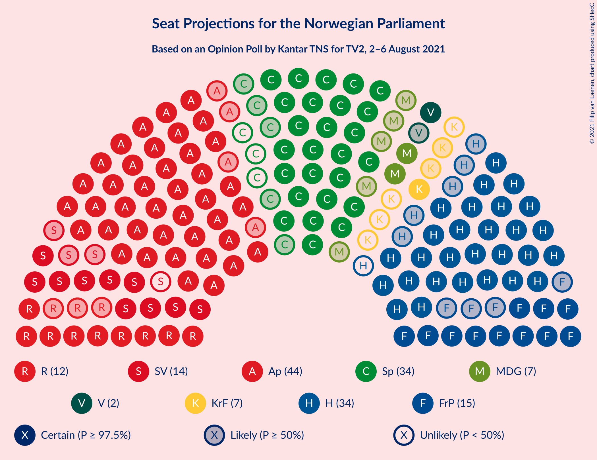
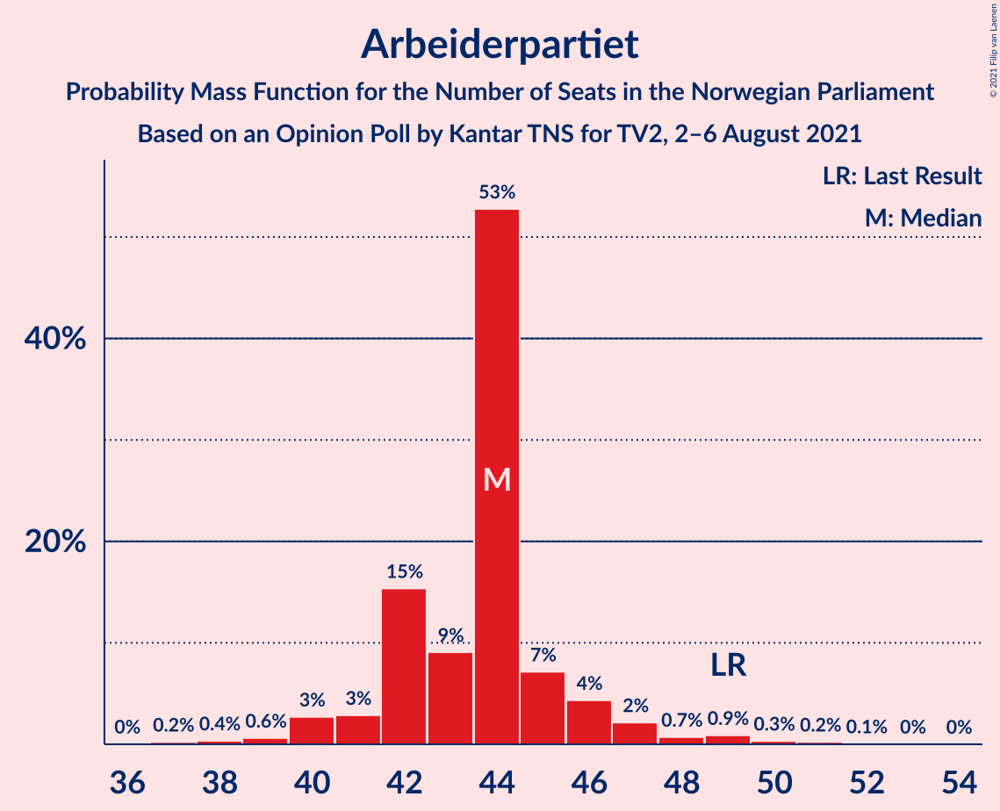
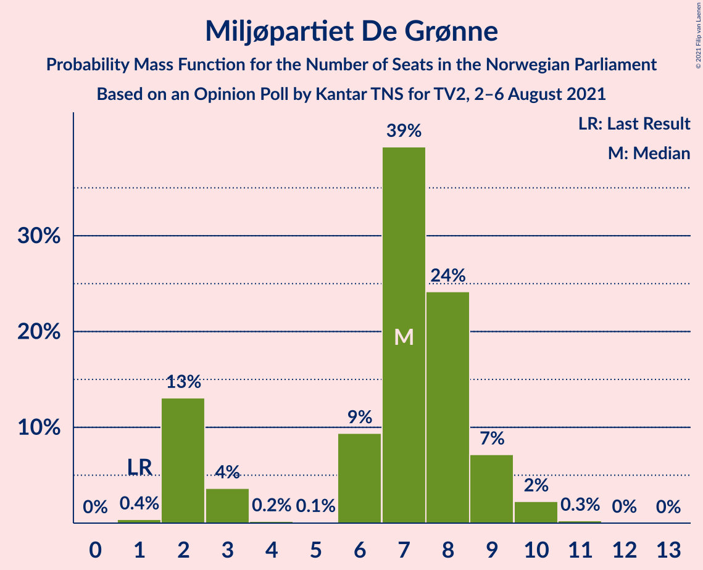
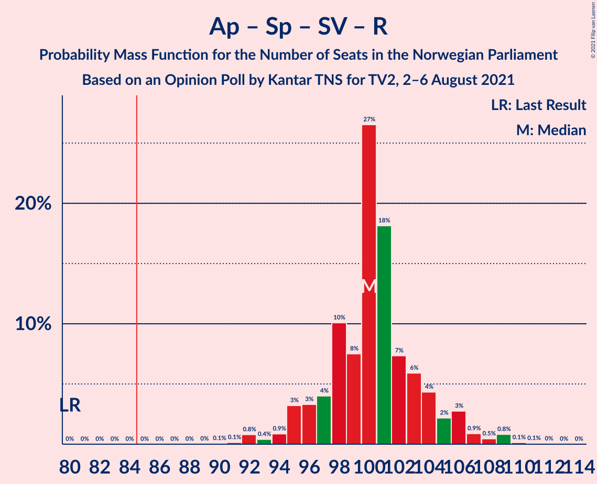
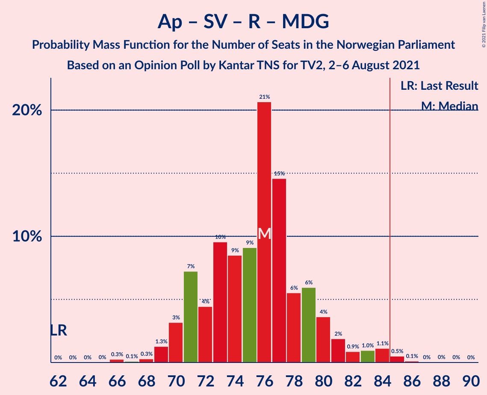
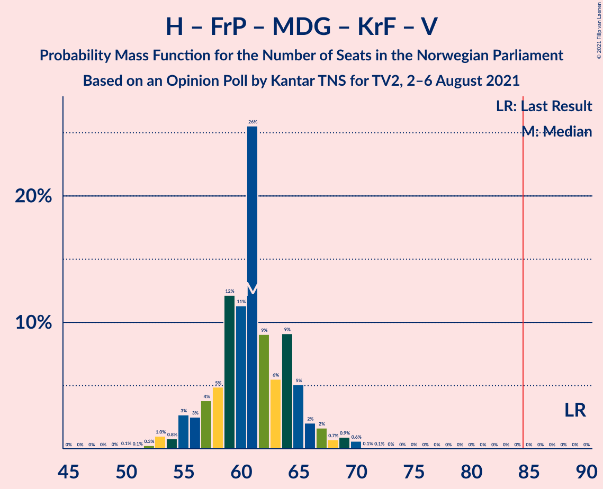
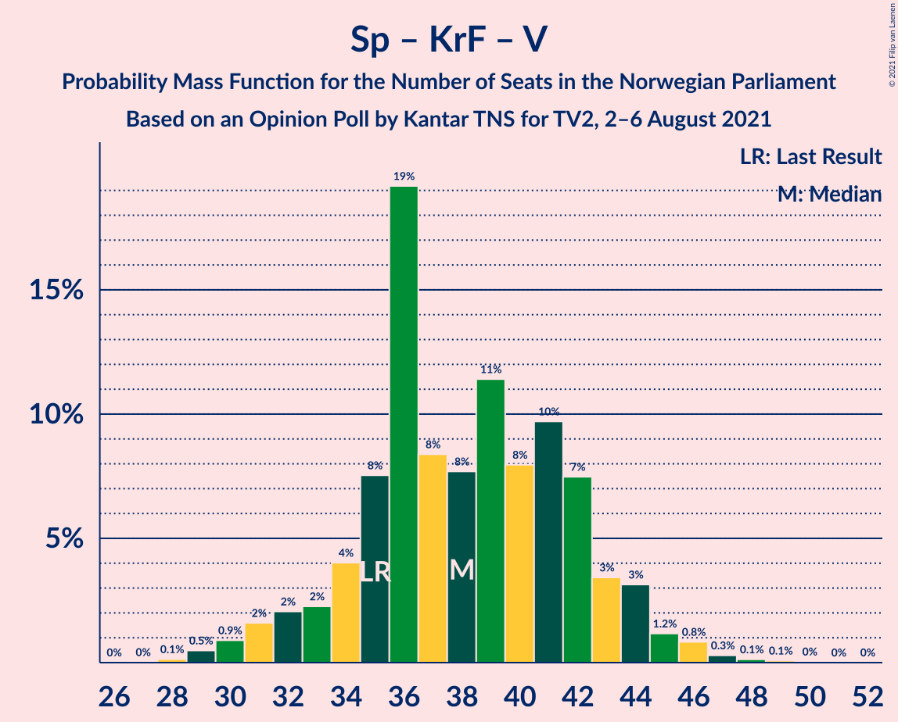

# Opinion Poll by Kantar TNS for TV2, 2–6 August 2021

<a href="#voting-intentions">Voting Intentions</a> | <a href="#seats">Seats</a> | <a href="#coalitions">Coalitions</a> | <a href="#technical-information">Technical Information</a>

## Voting Intentions

### Confidence Intervals

| Party | Last Result | Poll Result | 80% Confidence Interval | 90% Confidence Interval | 95% Confidence Interval | 99% Confidence Interval |
|:-----:|:-----------:|:-----------:|:-----------------------:|:-----------------------:|:-----------------------:|:-----------------------:|
| Arbeiderpartiet | 27.4% | 23.5% | 21.9–25.3% |21.4–25.9% |21.0–26.3% |20.2–27.2% |
| Høyre | 25.0% | 18.2% | 16.7–19.9% |16.3–20.4% |15.9–20.8% |15.2–21.6% |
| Senterpartiet | 10.3% | 16.4% | 14.9–18.0% |14.5–18.4% |14.2–18.8% |13.5–19.6% |
| Fremskrittspartiet | 15.2% | 9.3% | 8.2–10.6% |7.9–11.0% |7.6–11.3% |7.1–12.0% |
| Sosialistisk Venstreparti | 6.0% | 8.6% | 7.5–9.9% |7.2–10.2% |7.0–10.5% |6.5–11.2% |
| Rødt | 2.4% | 7.5% | 6.5–8.7% |6.2–9.0% |6.0–9.3% |5.5–9.9% |
| Miljøpartiet De Grønne | 3.2% | 4.5% | 3.7–5.5% |3.6–5.8% |3.4–6.0% |3.0–6.5% |
| Kristelig Folkeparti | 4.2% | 3.8% | 3.1–4.7% |2.9–5.0% |2.8–5.2% |2.5–5.7% |
| Venstre | 4.4% | 3.2% | 2.6–4.0% |2.4–4.3% |2.2–4.5% |2.0–4.9% |

*Note:* The poll result column reflects the actual value used in the calculations. Published results may vary slightly, and in addition be rounded to fewer digits.

## Seats

### Confidence Intervals

| Party | Last Result | Median | 80% Confidence Interval | 90% Confidence Interval | 95% Confidence Interval | 99% Confidence Interval |
|:-----:|:-----------:|:------:|:-----------------------:|:-----------------------:|:-----------------------:|:-----------------------:|
| <a href="#arbeiderpartiet">Arbeiderpartiet</a> | 49 | 44 | 42–45 |41–47 |40–49 |37–51 |
| <a href="#høyre">Høyre</a> | 45 | 34 | 30–36 |29–36 |28–36 |26–39 |
| <a href="#senterpartiet">Senterpartiet</a> | 19 | 33 | 29–35 |27–36 |26–36 |24–37 |
| <a href="#fremskrittspartiet">Fremskrittspartiet</a> | 27 | 14 | 12–17 |12–18 |12–19 |10–21 |
| <a href="#sosialistisk-venstreparti">Sosialistisk Venstreparti</a> | 11 | 13 | 11–15 |10–16 |10–17 |9–19 |
| <a href="#rødt">Rødt</a> | 1 | 11 | 9–14 |9–14 |9–15 |8–17 |
| <a href="#miljøpartiet-de-grønne">Miljøpartiet De Grønne</a> | 1 | 7 | 2–8 |2–9 |2–9 |2–10 |
| <a href="#kristelig-folkeparti">Kristelig Folkeparti</a> | 8 | 6 | 2–8 |1–8 |1–8 |1–9 |
| <a href="#venstre">Venstre</a> | 8 | 2 | 2 |2–6 |1–6 |1–7 |

### Arbeiderpartiet

*For a full overview of the results for this party, see the [Arbeiderpartiet](party-arbeiderpartiet.html) page.*

| Number of Seats | Probability | Accumulated | Special Marks |
|:---------------:|:-----------:|:-----------:|:-------------:|
| 36 | 0% | 100% |  |
| 37 | 0.6% | 99.9% |  |
| 38 | 0.1% | 99.4% |  |
| 39 | 0.4% | 99.2% |  |
| 40 | 4% | 98.9% |  |
| 41 | 2% | 95% |  |
| 42 | 7% | 93% |  |
| 43 | 5% | 86% |  |
| 44 | 66% | 81% | Median |
| 45 | 7% | 15% |  |
| 46 | 2% | 9% |  |
| 47 | 4% | 7% |  |
| 48 | 0.7% | 3% |  |
| 49 | 0.7% | 3% | Last Result |
| 50 | 0.7% | 2% |  |
| 51 | 1.0% | 1.2% |  |
| 52 | 0% | 0.2% |  |
| 53 | 0.1% | 0.2% |  |
| 54 | 0% | 0.1% |  |
| 55 | 0% | 0% |  |

### Høyre

*For a full overview of the results for this party, see the [Høyre](party-høyre.html) page.*

| Number of Seats | Probability | Accumulated | Special Marks |
|:---------------:|:-----------:|:-----------:|:-------------:|
| 25 | 0.3% | 100% |  |
| 26 | 1.2% | 99.6% |  |
| 27 | 0.2% | 98% |  |
| 28 | 1.4% | 98% |  |
| 29 | 5% | 97% |  |
| 30 | 9% | 92% |  |
| 31 | 4% | 83% |  |
| 32 | 13% | 79% |  |
| 33 | 3% | 65% |  |
| 34 | 32% | 62% | Median |
| 35 | 15% | 30% |  |
| 36 | 13% | 15% |  |
| 37 | 0.7% | 2% |  |
| 38 | 0.2% | 1.3% |  |
| 39 | 1.0% | 1.1% |  |
| 40 | 0.1% | 0.1% |  |
| 41 | 0% | 0% |  |
| 42 | 0% | 0% |  |
| 43 | 0% | 0% |  |
| 44 | 0% | 0% |  |
| 45 | 0% | 0% | Last Result |

### Senterpartiet

*For a full overview of the results for this party, see the [Senterpartiet](party-senterpartiet.html) page.*

| Number of Seats | Probability | Accumulated | Special Marks |
|:---------------:|:-----------:|:-----------:|:-------------:|
| 19 | 0% | 100% | Last Result |
| 20 | 0% | 100% |  |
| 21 | 0% | 100% |  |
| 22 | 0% | 100% |  |
| 23 | 0.1% | 100% |  |
| 24 | 0.9% | 99.9% |  |
| 25 | 0.2% | 99.0% |  |
| 26 | 3% | 98.8% |  |
| 27 | 2% | 96% |  |
| 28 | 2% | 94% |  |
| 29 | 4% | 92% |  |
| 30 | 17% | 88% |  |
| 31 | 4% | 71% |  |
| 32 | 15% | 67% |  |
| 33 | 12% | 52% | Median |
| 34 | 28% | 40% |  |
| 35 | 5% | 13% |  |
| 36 | 7% | 8% |  |
| 37 | 0.5% | 0.8% |  |
| 38 | 0.1% | 0.3% |  |
| 39 | 0.1% | 0.2% |  |
| 40 | 0% | 0.1% |  |
| 41 | 0% | 0% |  |

### Fremskrittspartiet

*For a full overview of the results for this party, see the [Fremskrittspartiet](party-fremskrittspartiet.html) page.*

| Number of Seats | Probability | Accumulated | Special Marks |
|:---------------:|:-----------:|:-----------:|:-------------:|
| 9 | 0.1% | 100% |  |
| 10 | 0.6% | 99.9% |  |
| 11 | 2% | 99.3% |  |
| 12 | 27% | 98% |  |
| 13 | 9% | 71% |  |
| 14 | 20% | 62% | Median |
| 15 | 8% | 42% |  |
| 16 | 7% | 34% |  |
| 17 | 20% | 27% |  |
| 18 | 3% | 6% |  |
| 19 | 1.2% | 3% |  |
| 20 | 1.4% | 2% |  |
| 21 | 0.3% | 0.6% |  |
| 22 | 0.3% | 0.3% |  |
| 23 | 0% | 0% |  |
| 24 | 0% | 0% |  |
| 25 | 0% | 0% |  |
| 26 | 0% | 0% |  |
| 27 | 0% | 0% | Last Result |

### Sosialistisk Venstreparti

*For a full overview of the results for this party, see the [Sosialistisk Venstreparti](party-sosialistiskvenstreparti.html) page.*

| Number of Seats | Probability | Accumulated | Special Marks |
|:---------------:|:-----------:|:-----------:|:-------------:|
| 9 | 2% | 100% |  |
| 10 | 6% | 98% |  |
| 11 | 21% | 92% | Last Result |
| 12 | 10% | 71% |  |
| 13 | 31% | 62% | Median |
| 14 | 17% | 31% |  |
| 15 | 6% | 14% |  |
| 16 | 5% | 8% |  |
| 17 | 2% | 3% |  |
| 18 | 0.7% | 2% |  |
| 19 | 0.6% | 0.8% |  |
| 20 | 0.2% | 0.2% |  |
| 21 | 0% | 0% |  |

### Rødt

*For a full overview of the results for this party, see the [Rødt](party-rødt.html) page.*

| Number of Seats | Probability | Accumulated | Special Marks |
|:---------------:|:-----------:|:-----------:|:-------------:|
| 1 | 0% | 100% | Last Result |
| 2 | 0% | 100% |  |
| 3 | 0% | 100% |  |
| 4 | 0% | 100% |  |
| 5 | 0% | 100% |  |
| 6 | 0% | 100% |  |
| 7 | 0% | 100% |  |
| 8 | 0.8% | 100% |  |
| 9 | 24% | 99.2% |  |
| 10 | 22% | 75% |  |
| 11 | 21% | 53% | Median |
| 12 | 17% | 32% |  |
| 13 | 3% | 16% |  |
| 14 | 9% | 12% |  |
| 15 | 2% | 4% |  |
| 16 | 1.0% | 2% |  |
| 17 | 0.7% | 0.9% |  |
| 18 | 0.2% | 0.2% |  |
| 19 | 0% | 0% |  |

### Miljøpartiet De Grønne

*For a full overview of the results for this party, see the [Miljøpartiet De Grønne](party-miljøpartietdegrønne.html) page.*

| Number of Seats | Probability | Accumulated | Special Marks |
|:---------------:|:-----------:|:-----------:|:-------------:|
| 1 | 0.2% | 100% | Last Result |
| 2 | 16% | 99.8% |  |
| 3 | 11% | 84% |  |
| 4 | 0% | 73% |  |
| 5 | 0% | 73% |  |
| 6 | 9% | 73% |  |
| 7 | 37% | 63% | Median |
| 8 | 21% | 27% |  |
| 9 | 4% | 6% |  |
| 10 | 2% | 2% |  |
| 11 | 0.3% | 0.4% |  |
| 12 | 0.1% | 0.1% |  |
| 13 | 0% | 0% |  |

### Kristelig Folkeparti

*For a full overview of the results for this party, see the [Kristelig Folkeparti](party-kristeligfolkeparti.html) page.*

| Number of Seats | Probability | Accumulated | Special Marks |
|:---------------:|:-----------:|:-----------:|:-------------:|
| 1 | 7% | 100% |  |
| 2 | 3% | 93% |  |
| 3 | 31% | 90% |  |
| 4 | 0% | 59% |  |
| 5 | 0% | 59% |  |
| 6 | 9% | 59% | Median |
| 7 | 36% | 49% |  |
| 8 | 12% | 13% | Last Result |
| 9 | 1.0% | 1.1% |  |
| 10 | 0.1% | 0.1% |  |
| 11 | 0% | 0% |  |

### Venstre

*For a full overview of the results for this party, see the [Venstre](party-venstre.html) page.*

| Number of Seats | Probability | Accumulated | Special Marks |
|:---------------:|:-----------:|:-----------:|:-------------:|
| 0 | 0.1% | 100% |  |
| 1 | 4% | 99.9% |  |
| 2 | 88% | 96% | Median |
| 3 | 2% | 8% |  |
| 4 | 0% | 6% |  |
| 5 | 0% | 6% |  |
| 6 | 4% | 6% |  |
| 7 | 1.4% | 2% |  |
| 8 | 0.2% | 0.3% | Last Result |
| 9 | 0.1% | 0.1% |  |
| 10 | 0% | 0% |  |

## Coalitions

### Confidence Intervals

| Coalition | Last Result | Median | Majority? | 80% Confidence Interval | 90% Confidence Interval | 95% Confidence Interval | 99% Confidence Interval |
|:---------:|:-----------:|:------:|:---------:|:-----------------------:|:-----------------------:|:-----------------------:|:-----------------------:|
| Arbeiderpartiet – Senterpartiet – Sosialistisk Venstreparti – Rødt – Miljøpartiet De Grønne | 81 | 106 | 100% | 103–109 | 102–112 | 100–113 | 99–116 |
| Arbeiderpartiet – Senterpartiet – Sosialistisk Venstreparti – Miljøpartiet De Grønne – Kristelig Folkeparti | 88 | 100 | 100% | 95–105 | 93–105 | 93–106 | 90–108 |
| Arbeiderpartiet – Senterpartiet – Sosialistisk Venstreparti – Rødt | 80 | 100 | 100% | 96–103 | 96–104 | 94–105 | 92–110 |
| Arbeiderpartiet – Senterpartiet – Sosialistisk Venstreparti – Miljøpartiet De Grønne | 80 | 95 | 99.9% | 90–98 | 90–99 | 89–101 | 87–102 |
| Arbeiderpartiet – Senterpartiet – Sosialistisk Venstreparti | 79 | 89 | 95% | 85–91 | 85–92 | 83–94 | 81–96 |
| Arbeiderpartiet – Senterpartiet – Miljøpartiet De Grønne – Kristelig Folkeparti | 77 | 87 | 82% | 81–92 | 79–92 | 79–93 | 76–95 |
| Høyre – Senterpartiet – Fremskrittspartiet – Kristelig Folkeparti – Venstre | 107 | 89 | 82% | 83–91 | 80–91 | 79–91 | 76–94 |
| Arbeiderpartiet – Senterpartiet – Kristelig Folkeparti | 76 | 83 | 28% | 77–85 | 74–86 | 72–87 | 69–88 |
| Arbeiderpartiet – Sosialistisk Venstreparti – Rødt – Miljøpartiet De Grønne | 62 | 73 | 1.0% | 70–79 | 70–81 | 69–83 | 68–86 |
| Arbeiderpartiet – Senterpartiet | 68 | 77 | 0.1% | 73–79 | 71–80 | 69–80 | 66–83 |
| Høyre – Fremskrittspartiet – Miljøpartiet De Grønne – Kristelig Folkeparti – Venstre | 89 | 62 | 0% | 56–64 | 56–65 | 56–67 | 53–69 |
| Arbeiderpartiet – Sosialistisk Venstreparti | 60 | 57 | 0% | 54–59 | 54–61 | 53–62 | 52–64 |
| Høyre – Fremskrittspartiet – Kristelig Folkeparti – Venstre | 88 | 55 | 0% | 52–58 | 50–59 | 49–61 | 47–63 |
| Høyre – Fremskrittspartiet – Venstre | 80 | 49 | 0% | 48–53 | 47–54 | 44–55 | 42–59 |
| Høyre – Fremskrittspartiet | 72 | 47 | 0% | 46–51 | 44–52 | 42–52 | 40–55 |
| Høyre – Kristelig Folkeparti – Venstre | 61 | 41 | 0% | 37–44 | 34–45 | 34–46 | 32–48 |
| Senterpartiet – Kristelig Folkeparti – Venstre | 35 | 41 | 0% | 35–43 | 33–44 | 30–45 | 29–48 |

### Arbeiderpartiet – Senterpartiet – Sosialistisk Venstreparti – Rødt – Miljøpartiet De Grønne

| Number of Seats | Probability | Accumulated | Special Marks |
|:---------------:|:-----------:|:-----------:|:-------------:|
| 81 | 0% | 100% | Last Result |
| 82 | 0% | 100% |  |
| 83 | 0% | 100% |  |
| 84 | 0% | 100% |  |
| 85 | 0% | 100% | Majority |
| 86 | 0% | 100% |  |
| 87 | 0% | 100% |  |
| 88 | 0% | 100% |  |
| 89 | 0% | 100% |  |
| 90 | 0% | 100% |  |
| 91 | 0% | 100% |  |
| 92 | 0% | 100% |  |
| 93 | 0% | 100% |  |
| 94 | 0% | 100% |  |
| 95 | 0% | 100% |  |
| 96 | 0.1% | 99.9% |  |
| 97 | 0.1% | 99.8% |  |
| 98 | 0.1% | 99.7% |  |
| 99 | 0.6% | 99.6% |  |
| 100 | 2% | 98.9% |  |
| 101 | 1.2% | 97% |  |
| 102 | 4% | 95% |  |
| 103 | 8% | 92% |  |
| 104 | 23% | 83% |  |
| 105 | 7% | 60% |  |
| 106 | 5% | 54% |  |
| 107 | 30% | 49% |  |
| 108 | 3% | 19% | Median |
| 109 | 7% | 16% |  |
| 110 | 2% | 9% |  |
| 111 | 2% | 7% |  |
| 112 | 2% | 5% |  |
| 113 | 2% | 3% |  |
| 114 | 0.4% | 1.3% |  |
| 115 | 0.2% | 1.0% |  |
| 116 | 0.4% | 0.8% |  |
| 117 | 0.1% | 0.4% |  |
| 118 | 0.2% | 0.3% |  |
| 119 | 0% | 0% |  |

### Arbeiderpartiet – Senterpartiet – Sosialistisk Venstreparti – Miljøpartiet De Grønne – Kristelig Folkeparti

| Number of Seats | Probability | Accumulated | Special Marks |
|:---------------:|:-----------:|:-----------:|:-------------:|
| 88 | 0.1% | 100% | Last Result |
| 89 | 0% | 99.9% |  |
| 90 | 0.5% | 99.9% |  |
| 91 | 0.6% | 99.4% |  |
| 92 | 0.5% | 98.8% |  |
| 93 | 6% | 98% |  |
| 94 | 2% | 92% |  |
| 95 | 3% | 90% |  |
| 96 | 9% | 88% |  |
| 97 | 2% | 78% |  |
| 98 | 6% | 76% |  |
| 99 | 8% | 70% |  |
| 100 | 22% | 62% |  |
| 101 | 3% | 41% |  |
| 102 | 4% | 37% |  |
| 103 | 8% | 33% | Median |
| 104 | 2% | 25% |  |
| 105 | 20% | 23% |  |
| 106 | 0.9% | 3% |  |
| 107 | 0.4% | 2% |  |
| 108 | 1.0% | 1.3% |  |
| 109 | 0.1% | 0.3% |  |
| 110 | 0.1% | 0.2% |  |
| 111 | 0% | 0.1% |  |
| 112 | 0% | 0.1% |  |
| 113 | 0% | 0% |  |

### Arbeiderpartiet – Senterpartiet – Sosialistisk Venstreparti – Rødt

| Number of Seats | Probability | Accumulated | Special Marks |
|:---------------:|:-----------:|:-----------:|:-------------:|
| 80 | 0% | 100% | Last Result |
| 81 | 0% | 100% |  |
| 82 | 0% | 100% |  |
| 83 | 0% | 100% |  |
| 84 | 0% | 100% |  |
| 85 | 0% | 100% | Majority |
| 86 | 0% | 100% |  |
| 87 | 0% | 100% |  |
| 88 | 0% | 100% |  |
| 89 | 0% | 100% |  |
| 90 | 0.1% | 99.9% |  |
| 91 | 0.1% | 99.8% |  |
| 92 | 1.1% | 99.7% |  |
| 93 | 0.7% | 98.6% |  |
| 94 | 0.5% | 98% |  |
| 95 | 0.9% | 97% |  |
| 96 | 12% | 97% |  |
| 97 | 5% | 84% |  |
| 98 | 4% | 79% |  |
| 99 | 11% | 75% |  |
| 100 | 22% | 64% |  |
| 101 | 17% | 42% | Median |
| 102 | 12% | 25% |  |
| 103 | 5% | 13% |  |
| 104 | 4% | 8% |  |
| 105 | 2% | 4% |  |
| 106 | 0.8% | 2% |  |
| 107 | 0.3% | 1.3% |  |
| 108 | 0.2% | 1.0% |  |
| 109 | 0.3% | 0.8% |  |
| 110 | 0.4% | 0.5% |  |
| 111 | 0.1% | 0.1% |  |
| 112 | 0% | 0% |  |

### Arbeiderpartiet – Senterpartiet – Sosialistisk Venstreparti – Miljøpartiet De Grønne

| Number of Seats | Probability | Accumulated | Special Marks |
|:---------------:|:-----------:|:-----------:|:-------------:|
| 80 | 0% | 100% | Last Result |
| 81 | 0% | 100% |  |
| 82 | 0% | 100% |  |
| 83 | 0% | 100% |  |
| 84 | 0% | 99.9% |  |
| 85 | 0.1% | 99.9% | Majority |
| 86 | 0.1% | 99.8% |  |
| 87 | 0.6% | 99.8% |  |
| 88 | 0.2% | 99.2% |  |
| 89 | 2% | 99.0% |  |
| 90 | 7% | 97% |  |
| 91 | 2% | 90% |  |
| 92 | 16% | 88% |  |
| 93 | 15% | 72% |  |
| 94 | 4% | 57% |  |
| 95 | 3% | 52% |  |
| 96 | 4% | 49% |  |
| 97 | 14% | 45% | Median |
| 98 | 22% | 31% |  |
| 99 | 5% | 9% |  |
| 100 | 1.5% | 4% |  |
| 101 | 1.4% | 3% |  |
| 102 | 1.1% | 2% |  |
| 103 | 0.3% | 0.5% |  |
| 104 | 0.2% | 0.2% |  |
| 105 | 0% | 0% |  |

### Arbeiderpartiet – Senterpartiet – Sosialistisk Venstreparti

| Number of Seats | Probability | Accumulated | Special Marks |
|:---------------:|:-----------:|:-----------:|:-------------:|
| 79 | 0% | 100% | Last Result |
| 80 | 0.1% | 99.9% |  |
| 81 | 0.7% | 99.9% |  |
| 82 | 1.3% | 99.2% |  |
| 83 | 1.4% | 98% |  |
| 84 | 1.2% | 96% |  |
| 85 | 12% | 95% | Majority |
| 86 | 3% | 83% |  |
| 87 | 7% | 81% |  |
| 88 | 9% | 74% |  |
| 89 | 19% | 65% |  |
| 90 | 8% | 46% | Median |
| 91 | 30% | 38% |  |
| 92 | 4% | 8% |  |
| 93 | 0.4% | 4% |  |
| 94 | 3% | 4% |  |
| 95 | 0.3% | 0.9% |  |
| 96 | 0.3% | 0.6% |  |
| 97 | 0.1% | 0.3% |  |
| 98 | 0.1% | 0.2% |  |
| 99 | 0.1% | 0.1% |  |
| 100 | 0% | 0% |  |

### Arbeiderpartiet – Senterpartiet – Miljøpartiet De Grønne – Kristelig Folkeparti

| Number of Seats | Probability | Accumulated | Special Marks |
|:---------------:|:-----------:|:-----------:|:-------------:|
| 72 | 0.1% | 100% |  |
| 73 | 0.1% | 99.9% |  |
| 74 | 0% | 99.8% |  |
| 75 | 0.2% | 99.8% |  |
| 76 | 0.4% | 99.6% |  |
| 77 | 1.2% | 99.2% | Last Result |
| 78 | 0.3% | 98% |  |
| 79 | 6% | 98% |  |
| 80 | 1.2% | 92% |  |
| 81 | 0.9% | 91% |  |
| 82 | 3% | 90% |  |
| 83 | 2% | 87% |  |
| 84 | 3% | 84% |  |
| 85 | 17% | 82% | Majority |
| 86 | 8% | 65% |  |
| 87 | 8% | 56% |  |
| 88 | 6% | 49% |  |
| 89 | 6% | 42% |  |
| 90 | 5% | 37% | Median |
| 91 | 3% | 32% |  |
| 92 | 25% | 29% |  |
| 93 | 2% | 4% |  |
| 94 | 1.1% | 2% |  |
| 95 | 0.1% | 0.6% |  |
| 96 | 0.3% | 0.5% |  |
| 97 | 0.1% | 0.2% |  |
| 98 | 0.1% | 0.1% |  |
| 99 | 0% | 0% |  |

### Høyre – Senterpartiet – Fremskrittspartiet – Kristelig Folkeparti – Venstre

| Number of Seats | Probability | Accumulated | Special Marks |
|:---------------:|:-----------:|:-----------:|:-------------:|
| 75 | 0% | 100% |  |
| 76 | 0.5% | 99.9% |  |
| 77 | 1.1% | 99.4% |  |
| 78 | 0.2% | 98% |  |
| 79 | 2% | 98% |  |
| 80 | 2% | 96% |  |
| 81 | 0.9% | 94% |  |
| 82 | 3% | 94% |  |
| 83 | 2% | 91% |  |
| 84 | 7% | 89% |  |
| 85 | 15% | 82% | Majority |
| 86 | 2% | 67% |  |
| 87 | 4% | 66% |  |
| 88 | 3% | 62% |  |
| 89 | 38% | 59% | Median |
| 90 | 10% | 20% |  |
| 91 | 8% | 11% |  |
| 92 | 1.0% | 2% |  |
| 93 | 0.4% | 1.1% |  |
| 94 | 0.3% | 0.7% |  |
| 95 | 0.1% | 0.4% |  |
| 96 | 0.1% | 0.3% |  |
| 97 | 0% | 0.1% |  |
| 98 | 0% | 0.1% |  |
| 99 | 0.1% | 0.1% |  |
| 100 | 0% | 0% |  |
| 101 | 0% | 0% |  |
| 102 | 0% | 0% |  |
| 103 | 0% | 0% |  |
| 104 | 0% | 0% |  |
| 105 | 0% | 0% |  |
| 106 | 0% | 0% |  |
| 107 | 0% | 0% | Last Result |

### Arbeiderpartiet – Senterpartiet – Kristelig Folkeparti

| Number of Seats | Probability | Accumulated | Special Marks |
|:---------------:|:-----------:|:-----------:|:-------------:|
| 69 | 0.9% | 100% |  |
| 70 | 0.3% | 99.0% |  |
| 71 | 0.3% | 98.8% |  |
| 72 | 1.0% | 98% |  |
| 73 | 0.8% | 97% |  |
| 74 | 2% | 97% |  |
| 75 | 2% | 95% |  |
| 76 | 2% | 93% | Last Result |
| 77 | 16% | 91% |  |
| 78 | 4% | 75% |  |
| 79 | 4% | 71% |  |
| 80 | 7% | 67% |  |
| 81 | 4% | 61% |  |
| 82 | 6% | 57% |  |
| 83 | 9% | 51% | Median |
| 84 | 14% | 42% |  |
| 85 | 20% | 28% | Majority |
| 86 | 5% | 8% |  |
| 87 | 2% | 3% |  |
| 88 | 0.7% | 1.2% |  |
| 89 | 0.3% | 0.4% |  |
| 90 | 0.1% | 0.2% |  |
| 91 | 0.1% | 0.1% |  |
| 92 | 0% | 0% |  |

### Arbeiderpartiet – Sosialistisk Venstreparti – Rødt – Miljøpartiet De Grønne

| Number of Seats | Probability | Accumulated | Special Marks |
|:---------------:|:-----------:|:-----------:|:-------------:|
| 62 | 0% | 100% | Last Result |
| 63 | 0.1% | 100% |  |
| 64 | 0% | 99.9% |  |
| 65 | 0% | 99.9% |  |
| 66 | 0.2% | 99.9% |  |
| 67 | 0% | 99.6% |  |
| 68 | 0.3% | 99.6% |  |
| 69 | 2% | 99.3% |  |
| 70 | 8% | 97% |  |
| 71 | 10% | 88% |  |
| 72 | 10% | 79% |  |
| 73 | 29% | 69% |  |
| 74 | 19% | 40% |  |
| 75 | 4% | 21% | Median |
| 76 | 3% | 17% |  |
| 77 | 2% | 14% |  |
| 78 | 1.4% | 12% |  |
| 79 | 2% | 11% |  |
| 80 | 3% | 9% |  |
| 81 | 2% | 6% |  |
| 82 | 1.0% | 4% |  |
| 83 | 1.5% | 3% |  |
| 84 | 0.5% | 1.4% |  |
| 85 | 0.3% | 1.0% | Majority |
| 86 | 0.4% | 0.7% |  |
| 87 | 0% | 0.3% |  |
| 88 | 0.2% | 0.2% |  |
| 89 | 0% | 0% |  |

### Arbeiderpartiet – Senterpartiet

| Number of Seats | Probability | Accumulated | Special Marks |
|:---------------:|:-----------:|:-----------:|:-------------:|
| 65 | 0.1% | 100% |  |
| 66 | 0.7% | 99.9% |  |
| 67 | 0.2% | 99.1% |  |
| 68 | 0.5% | 99.0% | Last Result |
| 69 | 1.4% | 98% |  |
| 70 | 2% | 97% |  |
| 71 | 1.3% | 95% |  |
| 72 | 2% | 94% |  |
| 73 | 5% | 92% |  |
| 74 | 15% | 86% |  |
| 75 | 8% | 71% |  |
| 76 | 12% | 63% |  |
| 77 | 8% | 50% | Median |
| 78 | 28% | 43% |  |
| 79 | 6% | 15% |  |
| 80 | 6% | 8% |  |
| 81 | 1.0% | 2% |  |
| 82 | 0.3% | 0.9% |  |
| 83 | 0.3% | 0.5% |  |
| 84 | 0.1% | 0.2% |  |
| 85 | 0.1% | 0.1% | Majority |
| 86 | 0% | 0% |  |

### Høyre – Fremskrittspartiet – Miljøpartiet De Grønne – Kristelig Folkeparti – Venstre

| Number of Seats | Probability | Accumulated | Special Marks |
|:---------------:|:-----------:|:-----------:|:-------------:|
| 49 | 0.1% | 100% |  |
| 50 | 0.1% | 99.9% |  |
| 51 | 0.2% | 99.8% |  |
| 52 | 0.1% | 99.7% |  |
| 53 | 0.3% | 99.6% |  |
| 54 | 0.2% | 99.2% |  |
| 55 | 1.0% | 99.0% |  |
| 56 | 9% | 98% |  |
| 57 | 4% | 89% |  |
| 58 | 6% | 86% |  |
| 59 | 8% | 80% |  |
| 60 | 11% | 72% |  |
| 61 | 3% | 61% |  |
| 62 | 24% | 57% |  |
| 63 | 18% | 34% | Median |
| 64 | 6% | 16% |  |
| 65 | 5% | 9% |  |
| 66 | 2% | 5% |  |
| 67 | 0.9% | 3% |  |
| 68 | 0.3% | 2% |  |
| 69 | 1.2% | 2% |  |
| 70 | 0.2% | 0.5% |  |
| 71 | 0% | 0.2% |  |
| 72 | 0.1% | 0.2% |  |
| 73 | 0% | 0.1% |  |
| 74 | 0% | 0% |  |
| 75 | 0% | 0% |  |
| 76 | 0% | 0% |  |
| 77 | 0% | 0% |  |
| 78 | 0% | 0% |  |
| 79 | 0% | 0% |  |
| 80 | 0% | 0% |  |
| 81 | 0% | 0% |  |
| 82 | 0% | 0% |  |
| 83 | 0% | 0% |  |
| 84 | 0% | 0% |  |
| 85 | 0% | 0% | Majority |
| 86 | 0% | 0% |  |
| 87 | 0% | 0% |  |
| 88 | 0% | 0% |  |
| 89 | 0% | 0% | Last Result |

### Arbeiderpartiet – Sosialistisk Venstreparti

| Number of Seats | Probability | Accumulated | Special Marks |
|:---------------:|:-----------:|:-----------:|:-------------:|
| 48 | 0.1% | 100% |  |
| 49 | 0% | 99.9% |  |
| 50 | 0% | 99.9% |  |
| 51 | 0.2% | 99.9% |  |
| 52 | 1.2% | 99.7% |  |
| 53 | 3% | 98% |  |
| 54 | 8% | 96% |  |
| 55 | 21% | 88% |  |
| 56 | 6% | 68% |  |
| 57 | 35% | 62% | Median |
| 58 | 14% | 27% |  |
| 59 | 5% | 13% |  |
| 60 | 2% | 8% | Last Result |
| 61 | 2% | 6% |  |
| 62 | 2% | 4% |  |
| 63 | 0.5% | 2% |  |
| 64 | 1.2% | 2% |  |
| 65 | 0.1% | 0.3% |  |
| 66 | 0.1% | 0.2% |  |
| 67 | 0% | 0.1% |  |
| 68 | 0.1% | 0.1% |  |
| 69 | 0% | 0.1% |  |
| 70 | 0% | 0.1% |  |
| 71 | 0% | 0% |  |

### Høyre – Fremskrittspartiet – Kristelig Folkeparti – Venstre

| Number of Seats | Probability | Accumulated | Special Marks |
|:---------------:|:-----------:|:-----------:|:-------------:|
| 46 | 0.1% | 100% |  |
| 47 | 0.9% | 99.8% |  |
| 48 | 0.9% | 98.9% |  |
| 49 | 2% | 98% |  |
| 50 | 2% | 96% |  |
| 51 | 4% | 94% |  |
| 52 | 5% | 90% |  |
| 53 | 5% | 85% |  |
| 54 | 10% | 80% |  |
| 55 | 33% | 70% |  |
| 56 | 8% | 37% | Median |
| 57 | 14% | 29% |  |
| 58 | 7% | 15% |  |
| 59 | 3% | 8% |  |
| 60 | 1.1% | 5% |  |
| 61 | 2% | 4% |  |
| 62 | 1.1% | 2% |  |
| 63 | 0.2% | 0.6% |  |
| 64 | 0.2% | 0.4% |  |
| 65 | 0% | 0.3% |  |
| 66 | 0.1% | 0.2% |  |
| 67 | 0% | 0.1% |  |
| 68 | 0% | 0% |  |
| 69 | 0% | 0% |  |
| 70 | 0% | 0% |  |
| 71 | 0% | 0% |  |
| 72 | 0% | 0% |  |
| 73 | 0% | 0% |  |
| 74 | 0% | 0% |  |
| 75 | 0% | 0% |  |
| 76 | 0% | 0% |  |
| 77 | 0% | 0% |  |
| 78 | 0% | 0% |  |
| 79 | 0% | 0% |  |
| 80 | 0% | 0% |  |
| 81 | 0% | 0% |  |
| 82 | 0% | 0% |  |
| 83 | 0% | 0% |  |
| 84 | 0% | 0% |  |
| 85 | 0% | 0% | Majority |
| 86 | 0% | 0% |  |
| 87 | 0% | 0% |  |
| 88 | 0% | 0% | Last Result |

### Høyre – Fremskrittspartiet – Venstre

| Number of Seats | Probability | Accumulated | Special Marks |
|:---------------:|:-----------:|:-----------:|:-------------:|
| 40 | 0% | 100% |  |
| 41 | 0% | 99.9% |  |
| 42 | 0.9% | 99.9% |  |
| 43 | 0.4% | 99.0% |  |
| 44 | 1.2% | 98.7% |  |
| 45 | 0.6% | 97% |  |
| 46 | 2% | 97% |  |
| 47 | 3% | 95% |  |
| 48 | 21% | 92% |  |
| 49 | 22% | 70% |  |
| 50 | 11% | 48% | Median |
| 51 | 13% | 38% |  |
| 52 | 12% | 25% |  |
| 53 | 5% | 12% |  |
| 54 | 4% | 7% |  |
| 55 | 1.2% | 3% |  |
| 56 | 0.5% | 2% |  |
| 57 | 0.5% | 2% |  |
| 58 | 0.8% | 1.3% |  |
| 59 | 0.4% | 0.5% |  |
| 60 | 0.1% | 0.1% |  |
| 61 | 0.1% | 0.1% |  |
| 62 | 0% | 0% |  |
| 63 | 0% | 0% |  |
| 64 | 0% | 0% |  |
| 65 | 0% | 0% |  |
| 66 | 0% | 0% |  |
| 67 | 0% | 0% |  |
| 68 | 0% | 0% |  |
| 69 | 0% | 0% |  |
| 70 | 0% | 0% |  |
| 71 | 0% | 0% |  |
| 72 | 0% | 0% |  |
| 73 | 0% | 0% |  |
| 74 | 0% | 0% |  |
| 75 | 0% | 0% |  |
| 76 | 0% | 0% |  |
| 77 | 0% | 0% |  |
| 78 | 0% | 0% |  |
| 79 | 0% | 0% |  |
| 80 | 0% | 0% | Last Result |

### Høyre – Fremskrittspartiet

| Number of Seats | Probability | Accumulated | Special Marks |
|:---------------:|:-----------:|:-----------:|:-------------:|
| 38 | 0% | 100% |  |
| 39 | 0.1% | 99.9% |  |
| 40 | 0.9% | 99.8% |  |
| 41 | 0.4% | 98.9% |  |
| 42 | 2% | 98.6% |  |
| 43 | 1.0% | 97% |  |
| 44 | 3% | 96% |  |
| 45 | 3% | 93% |  |
| 46 | 23% | 90% |  |
| 47 | 18% | 67% |  |
| 48 | 15% | 49% | Median |
| 49 | 12% | 34% |  |
| 50 | 12% | 22% |  |
| 51 | 5% | 10% |  |
| 52 | 3% | 6% |  |
| 53 | 1.1% | 2% |  |
| 54 | 0.3% | 1.1% |  |
| 55 | 0.3% | 0.8% |  |
| 56 | 0.2% | 0.5% |  |
| 57 | 0.2% | 0.3% |  |
| 58 | 0% | 0.1% |  |
| 59 | 0% | 0% |  |
| 60 | 0% | 0% |  |
| 61 | 0% | 0% |  |
| 62 | 0% | 0% |  |
| 63 | 0% | 0% |  |
| 64 | 0% | 0% |  |
| 65 | 0% | 0% |  |
| 66 | 0% | 0% |  |
| 67 | 0% | 0% |  |
| 68 | 0% | 0% |  |
| 69 | 0% | 0% |  |
| 70 | 0% | 0% |  |
| 71 | 0% | 0% |  |
| 72 | 0% | 0% | Last Result |

### Høyre – Kristelig Folkeparti – Venstre

| Number of Seats | Probability | Accumulated | Special Marks |
|:---------------:|:-----------:|:-----------:|:-------------:|
| 30 | 0.1% | 100% |  |
| 31 | 0.3% | 99.9% |  |
| 32 | 0.4% | 99.5% |  |
| 33 | 1.4% | 99.2% |  |
| 34 | 3% | 98% |  |
| 35 | 2% | 95% |  |
| 36 | 2% | 93% |  |
| 37 | 10% | 90% |  |
| 38 | 7% | 80% |  |
| 39 | 3% | 74% |  |
| 40 | 12% | 70% |  |
| 41 | 13% | 59% |  |
| 42 | 5% | 45% | Median |
| 43 | 28% | 40% |  |
| 44 | 5% | 11% |  |
| 45 | 3% | 6% |  |
| 46 | 0.5% | 3% |  |
| 47 | 1.1% | 2% |  |
| 48 | 1.1% | 1.4% |  |
| 49 | 0.2% | 0.3% |  |
| 50 | 0% | 0.1% |  |
| 51 | 0% | 0% |  |
| 52 | 0% | 0% |  |
| 53 | 0% | 0% |  |
| 54 | 0% | 0% |  |
| 55 | 0% | 0% |  |
| 56 | 0% | 0% |  |
| 57 | 0% | 0% |  |
| 58 | 0% | 0% |  |
| 59 | 0% | 0% |  |
| 60 | 0% | 0% |  |
| 61 | 0% | 0% | Last Result |

### Senterpartiet – Kristelig Folkeparti – Venstre

| Number of Seats | Probability | Accumulated | Special Marks |
|:---------------:|:-----------:|:-----------:|:-------------:|
| 28 | 0.1% | 100% |  |
| 29 | 2% | 99.9% |  |
| 30 | 0.8% | 98% |  |
| 31 | 1.2% | 97% |  |
| 32 | 1.2% | 96% |  |
| 33 | 1.1% | 95% |  |
| 34 | 2% | 94% |  |
| 35 | 15% | 92% | Last Result |
| 36 | 3% | 77% |  |
| 37 | 7% | 74% |  |
| 38 | 2% | 68% |  |
| 39 | 6% | 66% |  |
| 40 | 5% | 60% |  |
| 41 | 11% | 55% | Median |
| 42 | 13% | 44% |  |
| 43 | 25% | 31% |  |
| 44 | 1.3% | 6% |  |
| 45 | 3% | 5% |  |
| 46 | 0.4% | 2% |  |
| 47 | 0.4% | 1.2% |  |
| 48 | 0.5% | 0.8% |  |
| 49 | 0.1% | 0.3% |  |
| 50 | 0% | 0.1% |  |
| 51 | 0% | 0.1% |  |
| 52 | 0.1% | 0.1% |  |
| 53 | 0% | 0% |  |

## Technical Information

### Opinion Poll

+ **Polling firm:** Kantar TNS
+ **Commissioner(s):** TV2
+ **Fieldwork period:** 2–6 August 2021

### Calculations

+ **Sample size:** 977
+ **Simulations done:** 131,072
+ **Error estimate:** 1.97%

