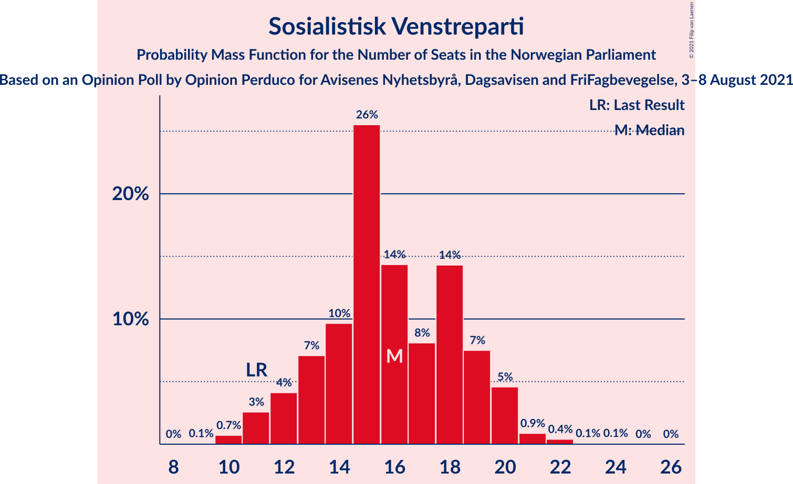
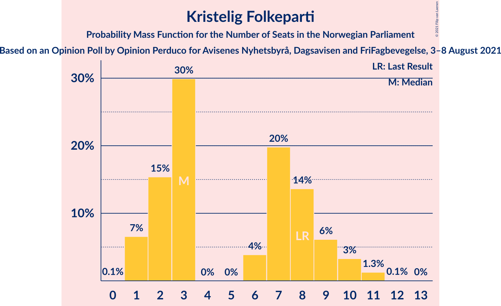
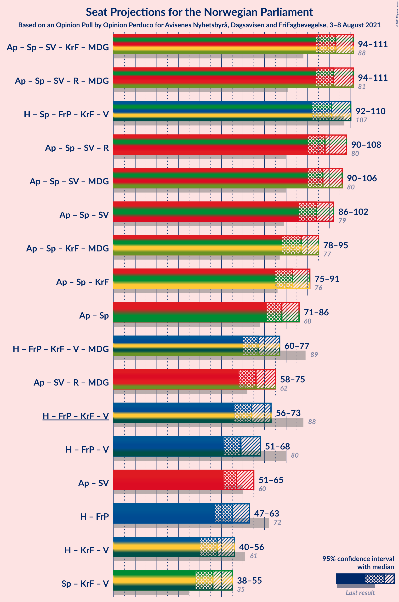
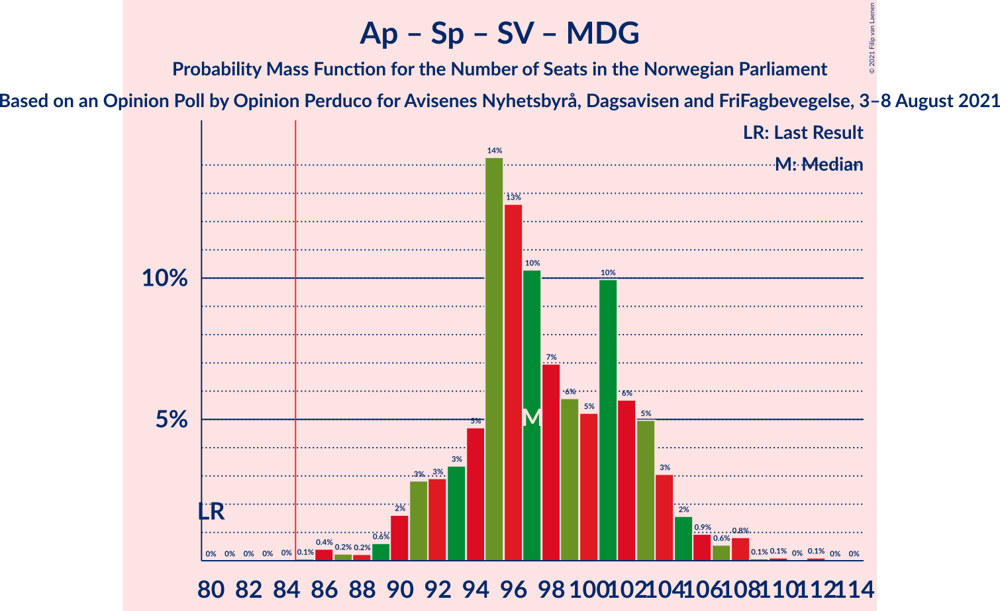
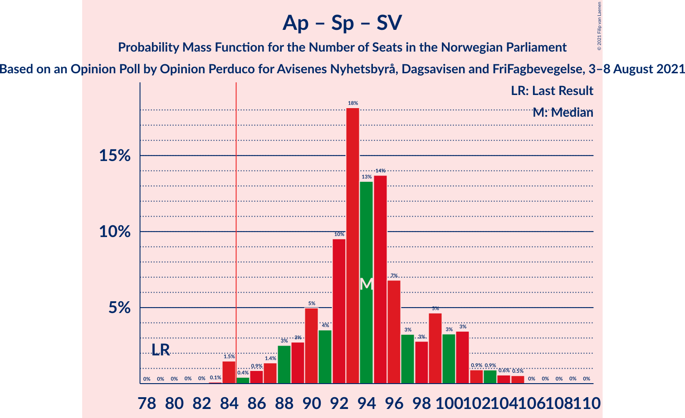
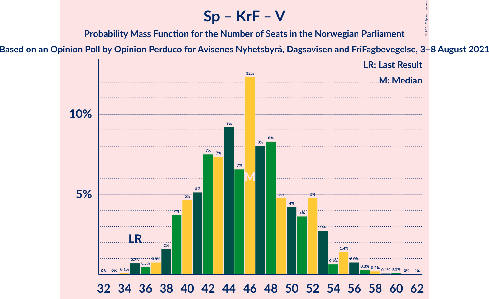

# Opinion Poll by Opinion Perduco for Avisenes Nyhetsbyrå, Dagsavisen and FriFagbevegelse, 3–8 August 2021

<a href="#voting-intentions">Voting Intentions</a> | <a href="#seats">Seats</a> | <a href="#coalitions">Coalitions</a> | <a href="#technical-information">Technical Information</a>

## Voting Intentions

### Confidence Intervals

| Party | Last Result | Poll Result | 80% Confidence Interval | 90% Confidence Interval | 95% Confidence Interval | 99% Confidence Interval |
|:-----:|:-----------:|:-----------:|:-----------------------:|:-----------------------:|:-----------------------:|:-----------------------:|
| Arbeiderpartiet | 27.4% | 22.6% | 20.7–24.7% |20.2–25.3% |19.8–25.8% |18.9–26.8% |
| Høyre | 25.0% | 21.1% | 19.3–23.2% |18.8–23.8% |18.3–24.3% |17.5–25.3% |
| Senterpartiet | 10.3% | 19.2% | 17.5–21.2% |17.0–21.8% |16.5–22.3% |15.7–23.2% |
| Fremskrittspartiet | 15.2% | 9.3% | 8.0–10.8% |7.7–11.2% |7.4–11.6% |6.8–12.4% |
| Sosialistisk Venstreparti | 6.0% | 8.9% | 7.7–10.4% |7.3–10.8% |7.0–11.2% |6.5–11.9% |
| Kristelig Folkeparti | 4.2% | 4.0% | 3.2–5.0% |3.0–5.3% |2.8–5.6% |2.4–6.2% |
| Rødt | 2.4% | 3.8% | 3.0–4.9% |2.8–5.2% |2.7–5.5% |2.3–6.0% |
| Venstre | 4.4% | 3.8% | 3.0–4.9% |2.8–5.2% |2.7–5.5% |2.3–6.0% |
| Miljøpartiet De Grønne | 3.2% | 3.5% | 2.8–4.6% |2.6–4.9% |2.4–5.2% |2.1–5.7% |

*Note:* The poll result column reflects the actual value used in the calculations. Published results may vary slightly, and in addition be rounded to fewer digits.

## Seats

### Confidence Intervals

| Party | Last Result | Median | 80% Confidence Interval | 90% Confidence Interval | 95% Confidence Interval | 99% Confidence Interval |
|:-----:|:-----------:|:------:|:-----------------------:|:-----------------------:|:-----------------------:|:-----------------------:|
| <a href="#arbeiderpartiet">Arbeiderpartiet</a> | 49 | 44 | 39–47 |38–49 |37–50 |34–50 |
| <a href="#høyre">Høyre</a> | 45 | 37 | 35–41 |34–42 |34–43 |30–48 |
| <a href="#senterpartiet">Senterpartiet</a> | 19 | 36 | 32–39 |32–39 |31–40 |28–44 |
| <a href="#fremskrittspartiet">Fremskrittspartiet</a> | 27 | 16 | 13–19 |12–21 |12–21 |11–24 |
| <a href="#sosialistisk-venstreparti">Sosialistisk Venstreparti</a> | 11 | 15 | 13–19 |12–19 |12–20 |11–24 |
| <a href="#kristelig-folkeparti">Kristelig Folkeparti</a> | 8 | 6 | 2–10 |1–10 |1–10 |1–11 |
| <a href="#rødt">Rødt</a> | 1 | 2 | 2–8 |1–8 |1–9 |1–10 |
| <a href="#venstre">Venstre</a> | 8 | 6 | 2–9 |2–9 |2–9 |2–10 |
| <a href="#miljøpartiet-de-grønne">Miljøpartiet De Grønne</a> | 1 | 2 | 1–8 |1–8 |1–8 |1–10 |

### Arbeiderpartiet

*For a full overview of the results for this party, see the [Arbeiderpartiet](party-arbeiderpartiet.html) page.*

| Number of Seats | Probability | Accumulated | Special Marks |
|:---------------:|:-----------:|:-----------:|:-------------:|
| 32 | 0.1% | 100% |  |
| 33 | 0.2% | 99.9% |  |
| 34 | 0.6% | 99.7% |  |
| 35 | 0.1% | 99.1% |  |
| 36 | 1.0% | 99.0% |  |
| 37 | 1.3% | 98% |  |
| 38 | 3% | 97% |  |
| 39 | 5% | 94% |  |
| 40 | 6% | 89% |  |
| 41 | 8% | 83% |  |
| 42 | 10% | 75% |  |
| 43 | 7% | 65% |  |
| 44 | 35% | 57% | Median |
| 45 | 10% | 22% |  |
| 46 | 2% | 12% |  |
| 47 | 2% | 10% |  |
| 48 | 0.2% | 8% |  |
| 49 | 4% | 8% | Last Result |
| 50 | 3% | 4% |  |
| 51 | 0% | 0.2% |  |
| 52 | 0.1% | 0.2% |  |
| 53 | 0% | 0.1% |  |
| 54 | 0.1% | 0.1% |  |
| 55 | 0% | 0% |  |

### Høyre

*For a full overview of the results for this party, see the [Høyre](party-høyre.html) page.*

| Number of Seats | Probability | Accumulated | Special Marks |
|:---------------:|:-----------:|:-----------:|:-------------:|
| 28 | 0.1% | 100% |  |
| 29 | 0.1% | 99.9% |  |
| 30 | 0.3% | 99.8% |  |
| 31 | 0.2% | 99.5% |  |
| 32 | 0.7% | 99.3% |  |
| 33 | 0.8% | 98.6% |  |
| 34 | 5% | 98% |  |
| 35 | 17% | 93% |  |
| 36 | 25% | 77% |  |
| 37 | 22% | 51% | Median |
| 38 | 10% | 30% |  |
| 39 | 7% | 20% |  |
| 40 | 3% | 13% |  |
| 41 | 1.3% | 10% |  |
| 42 | 5% | 9% |  |
| 43 | 2% | 4% |  |
| 44 | 0.9% | 2% |  |
| 45 | 0.2% | 1.4% | Last Result |
| 46 | 0.5% | 1.2% |  |
| 47 | 0% | 0.7% |  |
| 48 | 0.6% | 0.6% |  |
| 49 | 0% | 0% |  |

### Senterpartiet

*For a full overview of the results for this party, see the [Senterpartiet](party-senterpartiet.html) page.*

| Number of Seats | Probability | Accumulated | Special Marks |
|:---------------:|:-----------:|:-----------:|:-------------:|
| 19 | 0% | 100% | Last Result |
| 20 | 0% | 100% |  |
| 21 | 0% | 100% |  |
| 22 | 0% | 100% |  |
| 23 | 0% | 100% |  |
| 24 | 0% | 100% |  |
| 25 | 0% | 100% |  |
| 26 | 0% | 100% |  |
| 27 | 0.4% | 100% |  |
| 28 | 0.1% | 99.6% |  |
| 29 | 0.5% | 99.4% |  |
| 30 | 0.8% | 99.0% |  |
| 31 | 0.9% | 98% |  |
| 32 | 13% | 97% |  |
| 33 | 2% | 84% |  |
| 34 | 4% | 82% |  |
| 35 | 15% | 78% |  |
| 36 | 34% | 63% | Median |
| 37 | 8% | 29% |  |
| 38 | 2% | 20% |  |
| 39 | 14% | 18% |  |
| 40 | 2% | 5% |  |
| 41 | 0.5% | 2% |  |
| 42 | 0.3% | 2% |  |
| 43 | 0.5% | 1.3% |  |
| 44 | 0.6% | 0.8% |  |
| 45 | 0.1% | 0.2% |  |
| 46 | 0% | 0.1% |  |
| 47 | 0% | 0.1% |  |
| 48 | 0.1% | 0.1% |  |
| 49 | 0% | 0% |  |

### Fremskrittspartiet

*For a full overview of the results for this party, see the [Fremskrittspartiet](party-fremskrittspartiet.html) page.*

| Number of Seats | Probability | Accumulated | Special Marks |
|:---------------:|:-----------:|:-----------:|:-------------:|
| 10 | 0.1% | 100% |  |
| 11 | 0.5% | 99.9% |  |
| 12 | 7% | 99.3% |  |
| 13 | 14% | 92% |  |
| 14 | 3% | 79% |  |
| 15 | 4% | 76% |  |
| 16 | 42% | 72% | Median |
| 17 | 8% | 30% |  |
| 18 | 8% | 21% |  |
| 19 | 4% | 14% |  |
| 20 | 2% | 9% |  |
| 21 | 5% | 8% |  |
| 22 | 0.2% | 2% |  |
| 23 | 0.7% | 2% |  |
| 24 | 2% | 2% |  |
| 25 | 0% | 0% |  |
| 26 | 0% | 0% |  |
| 27 | 0% | 0% | Last Result |

### Sosialistisk Venstreparti

*For a full overview of the results for this party, see the [Sosialistisk Venstreparti](party-sosialistiskvenstreparti.html) page.*

| Number of Seats | Probability | Accumulated | Special Marks |
|:---------------:|:-----------:|:-----------:|:-------------:|
| 10 | 0.1% | 100% |  |
| 11 | 2% | 99.9% | Last Result |
| 12 | 7% | 98% |  |
| 13 | 6% | 91% |  |
| 14 | 23% | 86% |  |
| 15 | 14% | 63% | Median |
| 16 | 13% | 49% |  |
| 17 | 6% | 36% |  |
| 18 | 10% | 30% |  |
| 19 | 17% | 20% |  |
| 20 | 2% | 3% |  |
| 21 | 0.4% | 1.3% |  |
| 22 | 0.2% | 0.9% |  |
| 23 | 0.1% | 0.7% |  |
| 24 | 0.5% | 0.6% |  |
| 25 | 0% | 0% |  |

### Kristelig Folkeparti

*For a full overview of the results for this party, see the [Kristelig Folkeparti](party-kristeligfolkeparti.html) page.*

| Number of Seats | Probability | Accumulated | Special Marks |
|:---------------:|:-----------:|:-----------:|:-------------:|
| 0 | 0.1% | 100% |  |
| 1 | 5% | 99.9% |  |
| 2 | 7% | 95% |  |
| 3 | 34% | 88% |  |
| 4 | 0% | 53% |  |
| 5 | 0% | 53% |  |
| 6 | 4% | 53% | Median |
| 7 | 14% | 50% |  |
| 8 | 13% | 35% | Last Result |
| 9 | 10% | 22% |  |
| 10 | 12% | 13% |  |
| 11 | 0.6% | 0.7% |  |
| 12 | 0% | 0% |  |

### Rødt

*For a full overview of the results for this party, see the [Rødt](party-rødt.html) page.*

| Number of Seats | Probability | Accumulated | Special Marks |
|:---------------:|:-----------:|:-----------:|:-------------:|
| 1 | 7% | 100% | Last Result |
| 2 | 53% | 93% | Median |
| 3 | 0% | 41% |  |
| 4 | 0% | 41% |  |
| 5 | 0% | 41% |  |
| 6 | 3% | 41% |  |
| 7 | 8% | 37% |  |
| 8 | 24% | 29% |  |
| 9 | 3% | 5% |  |
| 10 | 1.0% | 1.3% |  |
| 11 | 0.2% | 0.2% |  |
| 12 | 0% | 0% |  |

### Venstre

*For a full overview of the results for this party, see the [Venstre](party-venstre.html) page.*

| Number of Seats | Probability | Accumulated | Special Marks |
|:---------------:|:-----------:|:-----------:|:-------------:|
| 1 | 0.2% | 100% |  |
| 2 | 35% | 99.8% |  |
| 3 | 14% | 65% |  |
| 4 | 0% | 50% |  |
| 5 | 0% | 50% |  |
| 6 | 2% | 50% | Median |
| 7 | 12% | 48% |  |
| 8 | 19% | 36% | Last Result |
| 9 | 15% | 17% |  |
| 10 | 1.5% | 2% |  |
| 11 | 0.3% | 0.3% |  |
| 12 | 0% | 0% |  |

### Miljøpartiet De Grønne

*For a full overview of the results for this party, see the [Miljøpartiet De Grønne](party-miljøpartietdegrønne.html) page.*

| Number of Seats | Probability | Accumulated | Special Marks |
|:---------------:|:-----------:|:-----------:|:-------------:|
| 0 | 0.1% | 100% |  |
| 1 | 19% | 99.9% | Last Result |
| 2 | 34% | 81% | Median |
| 3 | 6% | 47% |  |
| 4 | 8% | 41% |  |
| 5 | 0% | 33% |  |
| 6 | 4% | 33% |  |
| 7 | 6% | 29% |  |
| 8 | 20% | 23% |  |
| 9 | 1.3% | 2% |  |
| 10 | 1.0% | 1.1% |  |
| 11 | 0.1% | 0.1% |  |
| 12 | 0% | 0% |  |

## Coalitions

### Confidence Intervals

| Coalition | Last Result | Median | Majority? | 80% Confidence Interval | 90% Confidence Interval | 95% Confidence Interval | 99% Confidence Interval |
|:---------:|:-----------:|:------:|:---------:|:-----------------------:|:-----------------------:|:-----------------------:|:-----------------------:|
| Arbeiderpartiet – Senterpartiet – Sosialistisk Venstreparti – Kristelig Folkeparti – Miljøpartiet De Grønne | 88 | 105 | 100% | 97–110 | 95–113 | 95–113 | 91–115 |
| Arbeiderpartiet – Senterpartiet – Sosialistisk Venstreparti – Rødt – Miljøpartiet De Grønne | 81 | 104 | 100% | 96–111 | 94–113 | 94–113 | 91–113 |
| Arbeiderpartiet – Senterpartiet – Sosialistisk Venstreparti – Rødt | 80 | 97 | 99.9% | 93–109 | 92–109 | 91–110 | 88–110 |
| Høyre – Senterpartiet – Fremskrittspartiet – Kristelig Folkeparti – Venstre | 107 | 100 | 100% | 95–108 | 93–109 | 91–109 | 89–110 |
| Arbeiderpartiet – Senterpartiet – Sosialistisk Venstreparti – Miljøpartiet De Grønne | 80 | 98 | 99.9% | 93–105 | 92–107 | 91–108 | 87–108 |
| Arbeiderpartiet – Senterpartiet – Sosialistisk Venstreparti | 79 | 94 | 99.7% | 90–101 | 88–103 | 88–105 | 85–105 |
| Arbeiderpartiet – Senterpartiet – Kristelig Folkeparti – Miljøpartiet De Grønne | 77 | 90 | 84% | 82–93 | 80–97 | 79–97 | 75–98 |
| Arbeiderpartiet – Senterpartiet – Kristelig Folkeparti | 76 | 86 | 61% | 79–89 | 78–89 | 74–91 | 73–94 |
| Arbeiderpartiet – Senterpartiet | 68 | 79 | 9% | 75–83 | 73–86 | 72–86 | 69–86 |
| Høyre – Fremskrittspartiet – Kristelig Folkeparti – Venstre – Miljøpartiet De Grønne | 89 | 68 | 0% | 60–75 | 60–75 | 59–75 | 59–79 |
| Arbeiderpartiet – Sosialistisk Venstreparti – Rødt – Miljøpartiet De Grønne | 62 | 68 | 0% | 60–74 | 58–74 | 58–75 | 56–79 |
| Høyre – Fremskrittspartiet – Kristelig Folkeparti – Venstre | 88 | 64 | 0% | 56–73 | 56–73 | 56–73 | 54–73 |
| Arbeiderpartiet – Sosialistisk Venstreparti | 60 | 59 | 0% | 54–64 | 53–66 | 52–68 | 49–68 |
| Høyre – Fremskrittspartiet – Venstre | 80 | 58 | 0% | 53–65 | 52–65 | 52–68 | 49–70 |
| Høyre – Fremskrittspartiet | 72 | 53 | 0% | 49–59 | 47–62 | 47–63 | 46–67 |
| Høyre – Kristelig Folkeparti – Venstre | 61 | 48 | 0% | 40–54 | 40–57 | 40–57 | 38–57 |
| Senterpartiet – Kristelig Folkeparti – Venstre | 35 | 46 | 0% | 40–53 | 40–55 | 38–55 | 35–57 |

### Arbeiderpartiet – Senterpartiet – Sosialistisk Venstreparti – Kristelig Folkeparti – Miljøpartiet De Grønne

| Number of Seats | Probability | Accumulated | Special Marks |
|:---------------:|:-----------:|:-----------:|:-------------:|
| 88 | 0% | 100% | Last Result |
| 89 | 0% | 100% |  |
| 90 | 0.2% | 99.9% |  |
| 91 | 0.5% | 99.8% |  |
| 92 | 0.1% | 99.3% |  |
| 93 | 0.5% | 99.1% |  |
| 94 | 0.3% | 98.6% |  |
| 95 | 5% | 98% |  |
| 96 | 3% | 93% |  |
| 97 | 2% | 91% |  |
| 98 | 1.5% | 88% |  |
| 99 | 3% | 87% |  |
| 100 | 4% | 84% |  |
| 101 | 1.5% | 80% |  |
| 102 | 8% | 79% |  |
| 103 | 3% | 71% | Median |
| 104 | 14% | 68% |  |
| 105 | 13% | 54% |  |
| 106 | 15% | 41% |  |
| 107 | 3% | 26% |  |
| 108 | 9% | 23% |  |
| 109 | 2% | 14% |  |
| 110 | 2% | 12% |  |
| 111 | 4% | 10% |  |
| 112 | 0.4% | 6% |  |
| 113 | 4% | 5% |  |
| 114 | 0.1% | 1.4% |  |
| 115 | 1.3% | 1.3% |  |
| 116 | 0% | 0% |  |

### Arbeiderpartiet – Senterpartiet – Sosialistisk Venstreparti – Rødt – Miljøpartiet De Grønne

| Number of Seats | Probability | Accumulated | Special Marks |
|:---------------:|:-----------:|:-----------:|:-------------:|
| 81 | 0% | 100% | Last Result |
| 82 | 0% | 100% |  |
| 83 | 0% | 100% |  |
| 84 | 0% | 100% |  |
| 85 | 0% | 100% | Majority |
| 86 | 0% | 100% |  |
| 87 | 0% | 100% |  |
| 88 | 0.2% | 99.9% |  |
| 89 | 0% | 99.7% |  |
| 90 | 0% | 99.7% |  |
| 91 | 0.2% | 99.7% |  |
| 92 | 0.3% | 99.5% |  |
| 93 | 0.7% | 99.2% |  |
| 94 | 5% | 98.5% |  |
| 95 | 0.5% | 94% |  |
| 96 | 12% | 93% |  |
| 97 | 7% | 82% |  |
| 98 | 2% | 75% |  |
| 99 | 3% | 72% | Median |
| 100 | 4% | 69% |  |
| 101 | 7% | 65% |  |
| 102 | 3% | 59% |  |
| 103 | 2% | 55% |  |
| 104 | 6% | 53% |  |
| 105 | 20% | 46% |  |
| 106 | 2% | 26% |  |
| 107 | 4% | 24% |  |
| 108 | 2% | 21% |  |
| 109 | 2% | 18% |  |
| 110 | 4% | 16% |  |
| 111 | 4% | 12% |  |
| 112 | 0.3% | 9% |  |
| 113 | 8% | 8% |  |
| 114 | 0.1% | 0.4% |  |
| 115 | 0% | 0.3% |  |
| 116 | 0.2% | 0.2% |  |
| 117 | 0% | 0% |  |

### Arbeiderpartiet – Senterpartiet – Sosialistisk Venstreparti – Rødt

| Number of Seats | Probability | Accumulated | Special Marks |
|:---------------:|:-----------:|:-----------:|:-------------:|
| 80 | 0% | 100% | Last Result |
| 81 | 0% | 100% |  |
| 82 | 0% | 100% |  |
| 83 | 0% | 100% |  |
| 84 | 0% | 100% |  |
| 85 | 0% | 99.9% | Majority |
| 86 | 0.1% | 99.9% |  |
| 87 | 0.2% | 99.8% |  |
| 88 | 0.2% | 99.6% |  |
| 89 | 0.3% | 99.3% |  |
| 90 | 1.0% | 99.1% |  |
| 91 | 0.6% | 98% |  |
| 92 | 5% | 97% |  |
| 93 | 2% | 92% |  |
| 94 | 12% | 90% |  |
| 95 | 4% | 78% |  |
| 96 | 10% | 74% |  |
| 97 | 17% | 65% | Median |
| 98 | 6% | 48% |  |
| 99 | 5% | 42% |  |
| 100 | 3% | 37% |  |
| 101 | 4% | 34% |  |
| 102 | 3% | 30% |  |
| 103 | 8% | 27% |  |
| 104 | 1.3% | 19% |  |
| 105 | 0.5% | 18% |  |
| 106 | 1.0% | 17% |  |
| 107 | 5% | 16% |  |
| 108 | 0.1% | 11% |  |
| 109 | 8% | 11% |  |
| 110 | 3% | 4% |  |
| 111 | 0% | 0.1% |  |
| 112 | 0% | 0.1% |  |
| 113 | 0% | 0% |  |

### Høyre – Senterpartiet – Fremskrittspartiet – Kristelig Folkeparti – Venstre

| Number of Seats | Probability | Accumulated | Special Marks |
|:---------------:|:-----------:|:-----------:|:-------------:|
| 88 | 0.2% | 100% |  |
| 89 | 0.3% | 99.8% |  |
| 90 | 0.4% | 99.4% |  |
| 91 | 2% | 99.0% |  |
| 92 | 0.8% | 97% |  |
| 93 | 1.4% | 96% |  |
| 94 | 5% | 95% |  |
| 95 | 12% | 90% |  |
| 96 | 16% | 78% |  |
| 97 | 3% | 62% |  |
| 98 | 2% | 59% |  |
| 99 | 4% | 57% |  |
| 100 | 20% | 53% |  |
| 101 | 4% | 34% | Median |
| 102 | 4% | 30% |  |
| 103 | 2% | 26% |  |
| 104 | 5% | 24% |  |
| 105 | 1.3% | 18% |  |
| 106 | 1.2% | 17% |  |
| 107 | 2% | 16% | Last Result |
| 108 | 5% | 13% |  |
| 109 | 7% | 8% |  |
| 110 | 1.1% | 1.4% |  |
| 111 | 0.1% | 0.3% |  |
| 112 | 0% | 0.2% |  |
| 113 | 0.1% | 0.1% |  |
| 114 | 0.1% | 0.1% |  |
| 115 | 0% | 0% |  |

### Arbeiderpartiet – Senterpartiet – Sosialistisk Venstreparti – Miljøpartiet De Grønne

| Number of Seats | Probability | Accumulated | Special Marks |
|:---------------:|:-----------:|:-----------:|:-------------:|
| 80 | 0% | 100% | Last Result |
| 81 | 0% | 100% |  |
| 82 | 0% | 100% |  |
| 83 | 0% | 100% |  |
| 84 | 0% | 100% |  |
| 85 | 0% | 99.9% | Majority |
| 86 | 0.3% | 99.9% |  |
| 87 | 0.1% | 99.6% |  |
| 88 | 0.1% | 99.5% |  |
| 89 | 0.8% | 99.3% |  |
| 90 | 0.7% | 98.5% |  |
| 91 | 2% | 98% |  |
| 92 | 5% | 96% |  |
| 93 | 3% | 90% |  |
| 94 | 12% | 87% |  |
| 95 | 11% | 75% |  |
| 96 | 3% | 64% |  |
| 97 | 10% | 61% | Median |
| 98 | 6% | 51% |  |
| 99 | 3% | 45% |  |
| 100 | 3% | 42% |  |
| 101 | 3% | 39% |  |
| 102 | 0.8% | 36% |  |
| 103 | 15% | 35% |  |
| 104 | 4% | 20% |  |
| 105 | 10% | 16% |  |
| 106 | 0.8% | 6% |  |
| 107 | 1.3% | 6% |  |
| 108 | 4% | 4% |  |
| 109 | 0% | 0.2% |  |
| 110 | 0.1% | 0.1% |  |
| 111 | 0% | 0% |  |

### Arbeiderpartiet – Senterpartiet – Sosialistisk Venstreparti

| Number of Seats | Probability | Accumulated | Special Marks |
|:---------------:|:-----------:|:-----------:|:-------------:|
| 79 | 0% | 100% | Last Result |
| 80 | 0% | 100% |  |
| 81 | 0% | 100% |  |
| 82 | 0% | 99.9% |  |
| 83 | 0.1% | 99.9% |  |
| 84 | 0.1% | 99.8% |  |
| 85 | 0.6% | 99.7% | Majority |
| 86 | 0.8% | 99.1% |  |
| 87 | 0.7% | 98% |  |
| 88 | 3% | 98% |  |
| 89 | 2% | 95% |  |
| 90 | 6% | 92% |  |
| 91 | 5% | 86% |  |
| 92 | 16% | 81% |  |
| 93 | 6% | 65% |  |
| 94 | 10% | 59% |  |
| 95 | 18% | 49% | Median |
| 96 | 7% | 31% |  |
| 97 | 1.4% | 23% |  |
| 98 | 1.4% | 22% |  |
| 99 | 2% | 21% |  |
| 100 | 1.3% | 19% |  |
| 101 | 9% | 17% |  |
| 102 | 4% | 9% |  |
| 103 | 0.2% | 5% |  |
| 104 | 0.7% | 5% |  |
| 105 | 4% | 4% |  |
| 106 | 0% | 0% |  |

### Arbeiderpartiet – Senterpartiet – Kristelig Folkeparti – Miljøpartiet De Grønne

| Number of Seats | Probability | Accumulated | Special Marks |
|:---------------:|:-----------:|:-----------:|:-------------:|
| 72 | 0% | 100% |  |
| 73 | 0% | 99.9% |  |
| 74 | 0% | 99.9% |  |
| 75 | 0.6% | 99.9% |  |
| 76 | 0.4% | 99.3% |  |
| 77 | 0.3% | 98.8% | Last Result |
| 78 | 0.1% | 98.5% |  |
| 79 | 1.0% | 98% |  |
| 80 | 2% | 97% |  |
| 81 | 3% | 95% |  |
| 82 | 6% | 92% |  |
| 83 | 2% | 87% |  |
| 84 | 0.9% | 85% |  |
| 85 | 3% | 84% | Majority |
| 86 | 3% | 81% |  |
| 87 | 19% | 78% |  |
| 88 | 2% | 59% | Median |
| 89 | 6% | 57% |  |
| 90 | 21% | 51% |  |
| 91 | 12% | 30% |  |
| 92 | 7% | 19% |  |
| 93 | 4% | 11% |  |
| 94 | 0.3% | 8% |  |
| 95 | 0.8% | 8% |  |
| 96 | 1.5% | 7% |  |
| 97 | 4% | 5% |  |
| 98 | 1.4% | 2% |  |
| 99 | 0% | 0.1% |  |
| 100 | 0.1% | 0.1% |  |
| 101 | 0% | 0% |  |

### Arbeiderpartiet – Senterpartiet – Kristelig Folkeparti

| Number of Seats | Probability | Accumulated | Special Marks |
|:---------------:|:-----------:|:-----------:|:-------------:|
| 70 | 0.1% | 100% |  |
| 71 | 0% | 99.9% |  |
| 72 | 0.2% | 99.9% |  |
| 73 | 1.1% | 99.6% |  |
| 74 | 1.0% | 98% |  |
| 75 | 0.2% | 97% |  |
| 76 | 0.6% | 97% | Last Result |
| 77 | 0.5% | 97% |  |
| 78 | 3% | 96% |  |
| 79 | 12% | 93% |  |
| 80 | 7% | 81% |  |
| 81 | 2% | 75% |  |
| 82 | 2% | 72% |  |
| 83 | 4% | 70% |  |
| 84 | 5% | 66% |  |
| 85 | 5% | 61% | Majority |
| 86 | 19% | 56% | Median |
| 87 | 1.0% | 37% |  |
| 88 | 16% | 36% |  |
| 89 | 16% | 20% |  |
| 90 | 1.4% | 4% |  |
| 91 | 2% | 3% |  |
| 92 | 0.2% | 1.3% |  |
| 93 | 0.3% | 1.1% |  |
| 94 | 0.4% | 0.8% |  |
| 95 | 0.2% | 0.4% |  |
| 96 | 0.2% | 0.3% |  |
| 97 | 0% | 0% |  |

### Arbeiderpartiet – Senterpartiet

| Number of Seats | Probability | Accumulated | Special Marks |
|:---------------:|:-----------:|:-----------:|:-------------:|
| 66 | 0% | 100% |  |
| 67 | 0.1% | 99.9% |  |
| 68 | 0.1% | 99.8% | Last Result |
| 69 | 0.5% | 99.8% |  |
| 70 | 0.6% | 99.3% |  |
| 71 | 0.5% | 98.7% |  |
| 72 | 3% | 98% |  |
| 73 | 0.5% | 95% |  |
| 74 | 1.2% | 95% |  |
| 75 | 6% | 94% |  |
| 76 | 14% | 88% |  |
| 77 | 7% | 74% |  |
| 78 | 15% | 68% |  |
| 79 | 13% | 52% |  |
| 80 | 9% | 40% | Median |
| 81 | 10% | 31% |  |
| 82 | 3% | 21% |  |
| 83 | 8% | 17% |  |
| 84 | 0.2% | 9% |  |
| 85 | 0.5% | 9% | Majority |
| 86 | 8% | 9% |  |
| 87 | 0.2% | 0.5% |  |
| 88 | 0.2% | 0.2% |  |
| 89 | 0% | 0.1% |  |
| 90 | 0% | 0% |  |

### Høyre – Fremskrittspartiet – Kristelig Folkeparti – Venstre – Miljøpartiet De Grønne

| Number of Seats | Probability | Accumulated | Special Marks |
|:---------------:|:-----------:|:-----------:|:-------------:|
| 55 | 0.1% | 100% |  |
| 56 | 0.1% | 99.9% |  |
| 57 | 0% | 99.8% |  |
| 58 | 0.2% | 99.8% |  |
| 59 | 4% | 99.5% |  |
| 60 | 10% | 96% |  |
| 61 | 0.5% | 86% |  |
| 62 | 5% | 85% |  |
| 63 | 4% | 80% |  |
| 64 | 0.9% | 76% |  |
| 65 | 4% | 75% |  |
| 66 | 15% | 72% |  |
| 67 | 4% | 57% | Median |
| 68 | 4% | 52% |  |
| 69 | 5% | 48% |  |
| 70 | 7% | 43% |  |
| 71 | 3% | 35% |  |
| 72 | 17% | 33% |  |
| 73 | 3% | 16% |  |
| 74 | 0.6% | 13% |  |
| 75 | 11% | 13% |  |
| 76 | 0.2% | 2% |  |
| 77 | 0.4% | 2% |  |
| 78 | 0.5% | 1.3% |  |
| 79 | 0.7% | 0.8% |  |
| 80 | 0% | 0.1% |  |
| 81 | 0% | 0.1% |  |
| 82 | 0% | 0% |  |
| 83 | 0% | 0% |  |
| 84 | 0% | 0% |  |
| 85 | 0% | 0% | Majority |
| 86 | 0% | 0% |  |
| 87 | 0% | 0% |  |
| 88 | 0% | 0% |  |
| 89 | 0% | 0% | Last Result |

### Arbeiderpartiet – Sosialistisk Venstreparti – Rødt – Miljøpartiet De Grønne

| Number of Seats | Probability | Accumulated | Special Marks |
|:---------------:|:-----------:|:-----------:|:-------------:|
| 53 | 0% | 100% |  |
| 54 | 0% | 99.9% |  |
| 55 | 0.1% | 99.9% |  |
| 56 | 0.3% | 99.8% |  |
| 57 | 0.1% | 99.5% |  |
| 58 | 5% | 99.4% |  |
| 59 | 2% | 95% |  |
| 60 | 8% | 93% |  |
| 61 | 6% | 85% |  |
| 62 | 12% | 79% | Last Result |
| 63 | 2% | 67% | Median |
| 64 | 2% | 65% |  |
| 65 | 3% | 63% |  |
| 66 | 2% | 61% |  |
| 67 | 4% | 58% |  |
| 68 | 7% | 54% |  |
| 69 | 11% | 47% |  |
| 70 | 3% | 36% |  |
| 71 | 2% | 33% |  |
| 72 | 2% | 31% |  |
| 73 | 15% | 28% |  |
| 74 | 9% | 14% |  |
| 75 | 3% | 5% |  |
| 76 | 0.4% | 1.4% |  |
| 77 | 0.2% | 1.0% |  |
| 78 | 0.2% | 0.8% |  |
| 79 | 0.2% | 0.6% |  |
| 80 | 0.3% | 0.5% |  |
| 81 | 0.2% | 0.2% |  |
| 82 | 0% | 0% |  |

### Høyre – Fremskrittspartiet – Kristelig Folkeparti – Venstre

| Number of Seats | Probability | Accumulated | Special Marks |
|:---------------:|:-----------:|:-----------:|:-------------:|
| 52 | 0% | 100% |  |
| 53 | 0.3% | 99.9% |  |
| 54 | 0.4% | 99.7% |  |
| 55 | 1.5% | 99.3% |  |
| 56 | 8% | 98% |  |
| 57 | 0.5% | 90% |  |
| 58 | 5% | 89% |  |
| 59 | 7% | 84% |  |
| 60 | 3% | 77% |  |
| 61 | 6% | 74% |  |
| 62 | 5% | 68% |  |
| 63 | 2% | 63% |  |
| 64 | 21% | 61% |  |
| 65 | 11% | 41% | Median |
| 66 | 3% | 30% |  |
| 67 | 2% | 27% |  |
| 68 | 7% | 25% |  |
| 69 | 2% | 18% |  |
| 70 | 2% | 16% |  |
| 71 | 2% | 13% |  |
| 72 | 0.5% | 11% |  |
| 73 | 10% | 11% |  |
| 74 | 0.1% | 0.4% |  |
| 75 | 0.1% | 0.3% |  |
| 76 | 0.1% | 0.2% |  |
| 77 | 0.1% | 0.1% |  |
| 78 | 0% | 0.1% |  |
| 79 | 0% | 0% |  |
| 80 | 0% | 0% |  |
| 81 | 0% | 0% |  |
| 82 | 0% | 0% |  |
| 83 | 0% | 0% |  |
| 84 | 0% | 0% |  |
| 85 | 0% | 0% | Majority |
| 86 | 0% | 0% |  |
| 87 | 0% | 0% |  |
| 88 | 0% | 0% | Last Result |

### Arbeiderpartiet – Sosialistisk Venstreparti

| Number of Seats | Probability | Accumulated | Special Marks |
|:---------------:|:-----------:|:-----------:|:-------------:|
| 47 | 0.3% | 100% |  |
| 48 | 0.1% | 99.7% |  |
| 49 | 0.1% | 99.6% |  |
| 50 | 0.4% | 99.5% |  |
| 51 | 0.6% | 99.1% |  |
| 52 | 2% | 98.5% |  |
| 53 | 1.1% | 96% |  |
| 54 | 9% | 95% |  |
| 55 | 4% | 86% |  |
| 56 | 15% | 82% |  |
| 57 | 9% | 67% |  |
| 58 | 5% | 59% |  |
| 59 | 14% | 54% | Median |
| 60 | 8% | 40% | Last Result |
| 61 | 2% | 32% |  |
| 62 | 8% | 30% |  |
| 63 | 11% | 22% |  |
| 64 | 1.4% | 11% |  |
| 65 | 0.9% | 9% |  |
| 66 | 4% | 9% |  |
| 67 | 0.1% | 5% |  |
| 68 | 4% | 5% |  |
| 69 | 0.2% | 0.3% |  |
| 70 | 0.1% | 0.1% |  |
| 71 | 0% | 0% |  |

### Høyre – Fremskrittspartiet – Venstre

| Number of Seats | Probability | Accumulated | Special Marks |
|:---------------:|:-----------:|:-----------:|:-------------:|
| 48 | 0.4% | 100% |  |
| 49 | 0.2% | 99.6% |  |
| 50 | 0.7% | 99.4% |  |
| 51 | 1.2% | 98.7% |  |
| 52 | 5% | 98% |  |
| 53 | 10% | 92% |  |
| 54 | 4% | 82% |  |
| 55 | 7% | 78% |  |
| 56 | 15% | 71% |  |
| 57 | 4% | 56% |  |
| 58 | 9% | 52% |  |
| 59 | 2% | 43% | Median |
| 60 | 2% | 41% |  |
| 61 | 14% | 39% |  |
| 62 | 1.5% | 25% |  |
| 63 | 11% | 23% |  |
| 64 | 2% | 12% |  |
| 65 | 7% | 10% |  |
| 66 | 0.4% | 3% |  |
| 67 | 0.2% | 3% |  |
| 68 | 1.1% | 3% |  |
| 69 | 0.8% | 2% |  |
| 70 | 0.6% | 0.7% |  |
| 71 | 0% | 0.1% |  |
| 72 | 0.1% | 0.1% |  |
| 73 | 0% | 0% |  |
| 74 | 0% | 0% |  |
| 75 | 0% | 0% |  |
| 76 | 0% | 0% |  |
| 77 | 0% | 0% |  |
| 78 | 0% | 0% |  |
| 79 | 0% | 0% |  |
| 80 | 0% | 0% | Last Result |

### Høyre – Fremskrittspartiet

| Number of Seats | Probability | Accumulated | Special Marks |
|:---------------:|:-----------:|:-----------:|:-------------:|
| 43 | 0% | 100% |  |
| 44 | 0.1% | 99.9% |  |
| 45 | 0.2% | 99.9% |  |
| 46 | 0.6% | 99.7% |  |
| 47 | 6% | 99.1% |  |
| 48 | 3% | 94% |  |
| 49 | 13% | 91% |  |
| 50 | 5% | 78% |  |
| 51 | 10% | 73% |  |
| 52 | 5% | 63% |  |
| 53 | 17% | 59% | Median |
| 54 | 19% | 42% |  |
| 55 | 2% | 23% |  |
| 56 | 2% | 21% |  |
| 57 | 1.4% | 18% |  |
| 58 | 7% | 17% |  |
| 59 | 0.6% | 10% |  |
| 60 | 4% | 10% |  |
| 61 | 0.4% | 5% |  |
| 62 | 2% | 5% |  |
| 63 | 2% | 3% |  |
| 64 | 0.1% | 0.8% |  |
| 65 | 0% | 0.7% |  |
| 66 | 0.1% | 0.6% |  |
| 67 | 0.5% | 0.6% |  |
| 68 | 0% | 0% |  |
| 69 | 0% | 0% |  |
| 70 | 0% | 0% |  |
| 71 | 0% | 0% |  |
| 72 | 0% | 0% | Last Result |

### Høyre – Kristelig Folkeparti – Venstre

| Number of Seats | Probability | Accumulated | Special Marks |
|:---------------:|:-----------:|:-----------:|:-------------:|
| 35 | 0% | 100% |  |
| 36 | 0% | 99.9% |  |
| 37 | 0.1% | 99.9% |  |
| 38 | 0.5% | 99.9% |  |
| 39 | 2% | 99.3% |  |
| 40 | 8% | 98% |  |
| 41 | 5% | 90% |  |
| 42 | 0.9% | 84% |  |
| 43 | 5% | 83% |  |
| 44 | 2% | 79% |  |
| 45 | 4% | 77% |  |
| 46 | 9% | 73% |  |
| 47 | 5% | 64% |  |
| 48 | 16% | 58% |  |
| 49 | 7% | 42% | Median |
| 50 | 2% | 35% |  |
| 51 | 3% | 33% |  |
| 52 | 19% | 30% |  |
| 53 | 1.1% | 12% |  |
| 54 | 3% | 11% |  |
| 55 | 0.6% | 8% |  |
| 56 | 0.5% | 7% |  |
| 57 | 6% | 7% |  |
| 58 | 0.2% | 0.3% |  |
| 59 | 0% | 0.1% |  |
| 60 | 0% | 0.1% |  |
| 61 | 0% | 0.1% | Last Result |
| 62 | 0% | 0% |  |

### Senterpartiet – Kristelig Folkeparti – Venstre

| Number of Seats | Probability | Accumulated | Special Marks |
|:---------------:|:-----------:|:-----------:|:-------------:|
| 34 | 0.1% | 100% |  |
| 35 | 1.2% | 99.9% | Last Result |
| 36 | 0.2% | 98.7% |  |
| 37 | 0.6% | 98% |  |
| 38 | 0.8% | 98% |  |
| 39 | 0.9% | 97% |  |
| 40 | 7% | 96% |  |
| 41 | 3% | 89% |  |
| 42 | 1.2% | 87% |  |
| 43 | 17% | 86% |  |
| 44 | 9% | 69% |  |
| 45 | 2% | 60% |  |
| 46 | 12% | 58% |  |
| 47 | 3% | 46% |  |
| 48 | 12% | 43% | Median |
| 49 | 3% | 31% |  |
| 50 | 2% | 29% |  |
| 51 | 8% | 27% |  |
| 52 | 5% | 18% |  |
| 53 | 6% | 14% |  |
| 54 | 0.3% | 7% |  |
| 55 | 6% | 7% |  |
| 56 | 0.3% | 0.9% |  |
| 57 | 0.4% | 0.6% |  |
| 58 | 0.2% | 0.2% |  |
| 59 | 0% | 0.1% |  |
| 60 | 0% | 0% |  |

## Technical Information

### Opinion Poll

+ **Polling firm:** Opinion Perduco
+ **Commissioner(s):** Avisenes Nyhetsbyrå, Dagsavisen and FriFagbevegelse
+ **Fieldwork period:** 3–8 August 2021

### Calculations

+ **Sample size:** 733
+ **Simulations done:** 131,072
+ **Error estimate:** 3.75%

