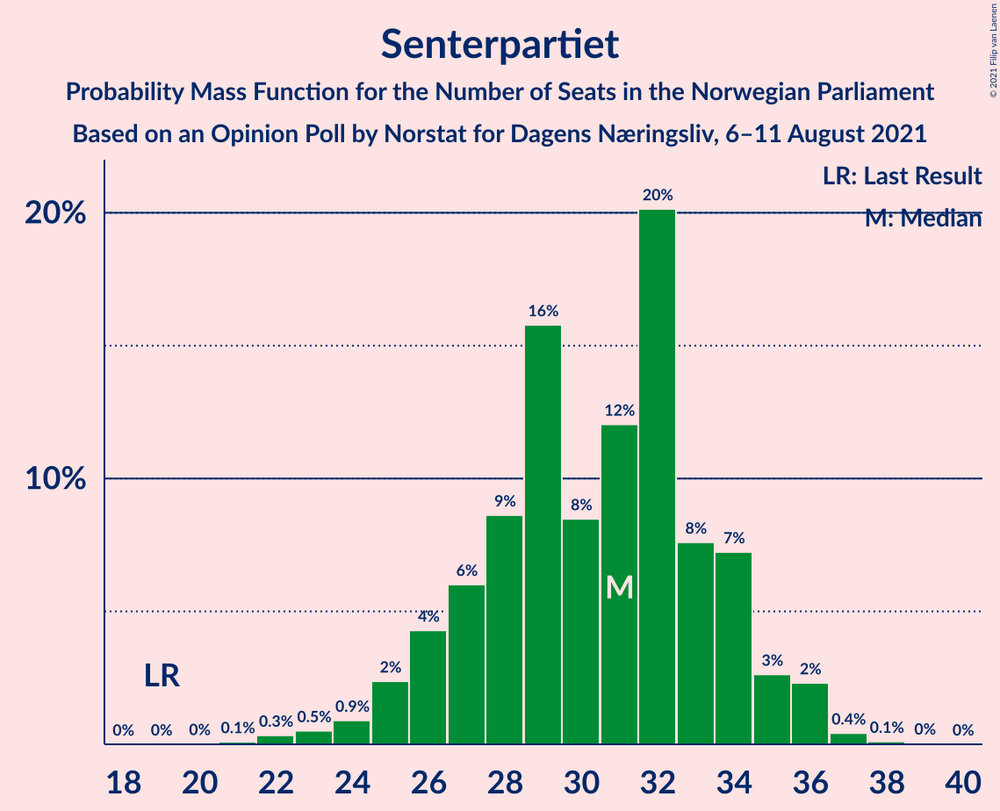
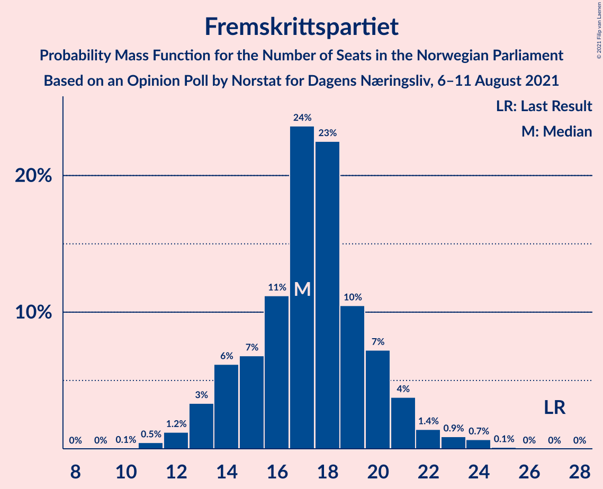
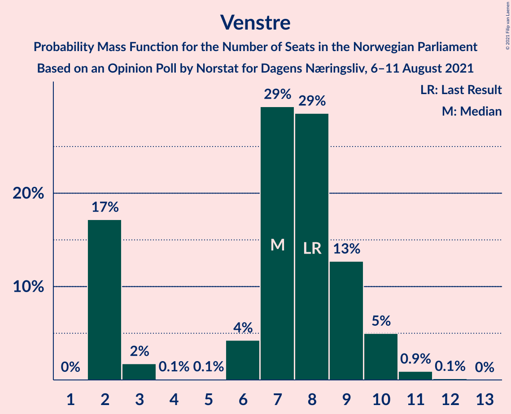
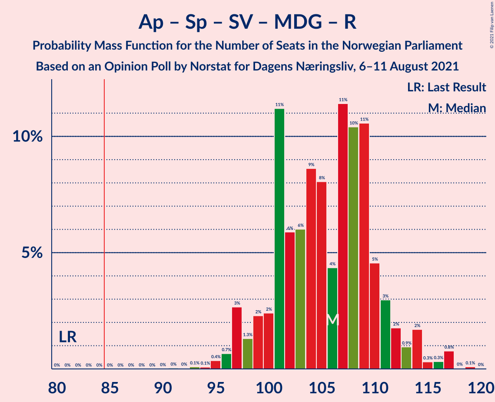
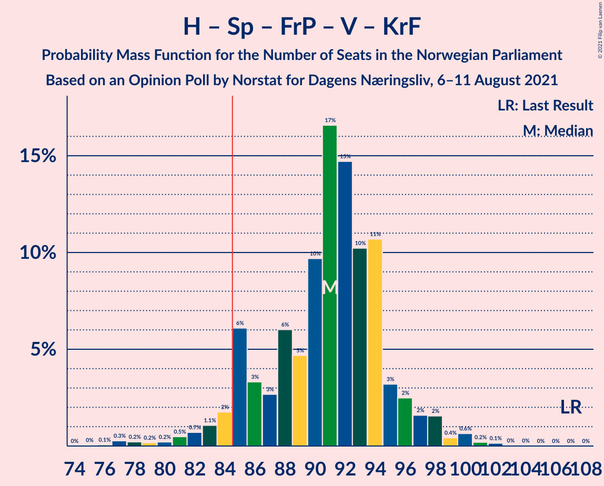
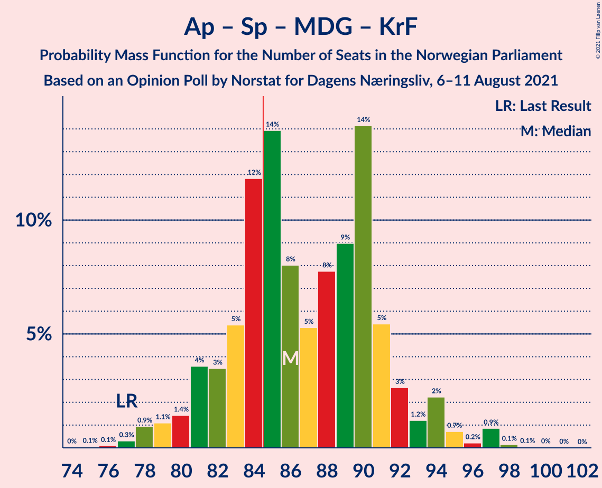
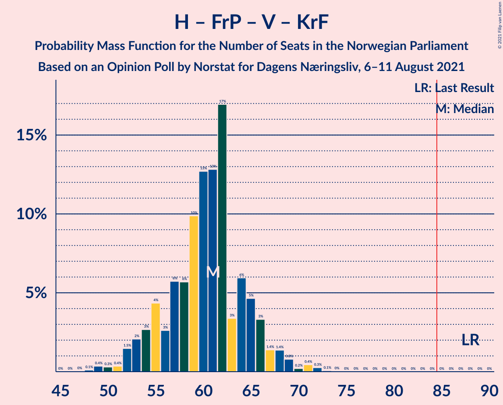
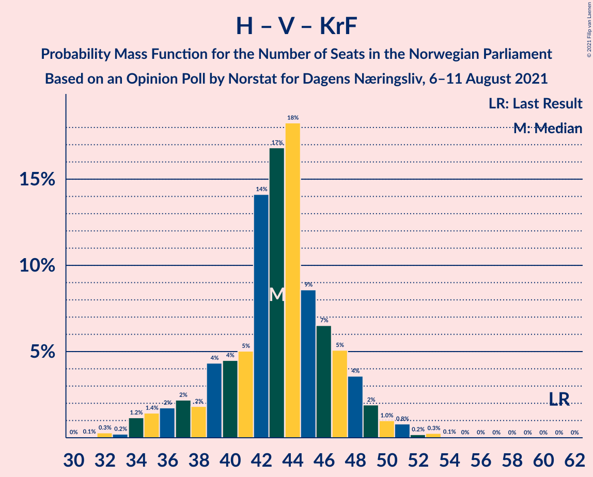

# Opinion Poll by Norstat for Dagens Næringsliv, 6–11 August 2021

<a href="#voting-intentions">Voting Intentions</a> | <a href="#seats">Seats</a> | <a href="#coalitions">Coalitions</a> | <a href="#technical-information">Technical Information</a>

## Voting Intentions

### Confidence Intervals

| Party | Last Result | Poll Result | 80% Confidence Interval | 90% Confidence Interval | 95% Confidence Interval | 99% Confidence Interval |
|:-----:|:-----------:|:-----------:|:-----------------------:|:-----------------------:|:-----------------------:|:-----------------------:|
| Arbeiderpartiet | 27.4% | 24.1% | 22.2–26.1% |21.6–26.7% |21.2–27.2% |20.3–28.2% |
| Høyre | 25.0% | 19.1% | 17.4–21.0% |16.9–21.5% |16.5–22.0% |15.7–22.9% |
| Senterpartiet | 10.3% | 16.1% | 14.5–17.9% |14.1–18.4% |13.7–18.8% |13.0–19.7% |
| Fremskrittspartiet | 15.2% | 10.1% | 8.9–11.6% |8.5–12.1% |8.2–12.4% |7.6–13.2% |
| Sosialistisk Venstreparti | 6.0% | 8.6% | 7.4–10.0% |7.1–10.4% |6.8–10.8% |6.3–11.5% |
| Miljøpartiet De Grønne | 3.2% | 5.9% | 5.0–7.2% |4.7–7.5% |4.5–7.8% |4.1–8.5% |
| Rødt | 2.4% | 4.6% | 3.7–5.7% |3.5–6.0% |3.3–6.2% |3.0–6.8% |
| Venstre | 4.4% | 4.3% | 3.5–5.4% |3.3–5.7% |3.1–6.0% |2.7–6.5% |
| Kristelig Folkeparti | 4.2% | 3.2% | 2.5–4.1% |2.3–4.4% |2.1–4.6% |1.9–5.1% |

*Note:* The poll result column reflects the actual value used in the calculations. Published results may vary slightly, and in addition be rounded to fewer digits.

## Seats

### Confidence Intervals

| Party | Last Result | Median | 80% Confidence Interval | 90% Confidence Interval | 95% Confidence Interval | 99% Confidence Interval |
|:-----:|:-----------:|:------:|:-----------------------:|:-----------------------:|:-----------------------:|:-----------------------:|
| <a href="#arbeiderpartiet">Arbeiderpartiet</a> | 49 | 45 | 42–50 |40–50 |40–53 |37–54 |
| <a href="#høyre">Høyre</a> | 45 | 34 | 29–37 |28–37 |28–39 |26–40 |
| <a href="#senterpartiet">Senterpartiet</a> | 19 | 29 | 25–33 |25–35 |25–36 |24–36 |
| <a href="#fremskrittspartiet">Fremskrittspartiet</a> | 27 | 18 | 15–20 |14–21 |13–21 |12–24 |
| <a href="#sosialistisk-venstreparti">Sosialistisk Venstreparti</a> | 11 | 14 | 12–17 |11–17 |10–18 |10–21 |
| <a href="#miljøpartiet-de-grønne">Miljøpartiet De Grønne</a> | 1 | 11 | 8–13 |8–13 |7–13 |7–15 |
| <a href="#rødt">Rødt</a> | 1 | 8 | 2–9 |2–10 |2–10 |2–11 |
| <a href="#venstre">Venstre</a> | 8 | 3 | 2–10 |2–10 |2–10 |2–12 |
| <a href="#kristelig-folkeparti">Kristelig Folkeparti</a> | 8 | 2 | 1–6 |0–7 |0–7 |0–8 |

### Arbeiderpartiet

*For a full overview of the results for this party, see the [Arbeiderpartiet](party-arbeiderpartiet.html) page.*

| Number of Seats | Probability | Accumulated | Special Marks |
|:---------------:|:-----------:|:-----------:|:-------------:|
| 35 | 0% | 100% |  |
| 36 | 0.1% | 99.9% |  |
| 37 | 0.8% | 99.8% |  |
| 38 | 0.2% | 99.0% |  |
| 39 | 0.9% | 98.8% |  |
| 40 | 5% | 98% |  |
| 41 | 3% | 93% |  |
| 42 | 12% | 90% |  |
| 43 | 9% | 78% |  |
| 44 | 18% | 69% |  |
| 45 | 7% | 52% | Median |
| 46 | 2% | 44% |  |
| 47 | 13% | 42% |  |
| 48 | 2% | 30% |  |
| 49 | 1.4% | 28% | Last Result |
| 50 | 22% | 27% |  |
| 51 | 1.1% | 5% |  |
| 52 | 0.2% | 3% |  |
| 53 | 1.1% | 3% |  |
| 54 | 2% | 2% |  |
| 55 | 0.1% | 0.2% |  |
| 56 | 0.1% | 0.1% |  |
| 57 | 0% | 0% |  |

### Høyre

*For a full overview of the results for this party, see the [Høyre](party-høyre.html) page.*

| Number of Seats | Probability | Accumulated | Special Marks |
|:---------------:|:-----------:|:-----------:|:-------------:|
| 24 | 0.1% | 100% |  |
| 25 | 0.2% | 99.9% |  |
| 26 | 0.2% | 99.7% |  |
| 27 | 0.4% | 99.5% |  |
| 28 | 9% | 99.1% |  |
| 29 | 10% | 90% |  |
| 30 | 3% | 80% |  |
| 31 | 11% | 78% |  |
| 32 | 6% | 67% |  |
| 33 | 5% | 62% |  |
| 34 | 11% | 56% | Median |
| 35 | 11% | 45% |  |
| 36 | 23% | 34% |  |
| 37 | 7% | 11% |  |
| 38 | 1.2% | 4% |  |
| 39 | 1.4% | 3% |  |
| 40 | 0.8% | 1.2% |  |
| 41 | 0.2% | 0.4% |  |
| 42 | 0.1% | 0.2% |  |
| 43 | 0% | 0% |  |
| 44 | 0% | 0% |  |
| 45 | 0% | 0% | Last Result |

### Senterpartiet

*For a full overview of the results for this party, see the [Senterpartiet](party-senterpartiet.html) page.*

| Number of Seats | Probability | Accumulated | Special Marks |
|:---------------:|:-----------:|:-----------:|:-------------:|
| 19 | 0% | 100% | Last Result |
| 20 | 0% | 100% |  |
| 21 | 0% | 100% |  |
| 22 | 0% | 99.9% |  |
| 23 | 0.3% | 99.9% |  |
| 24 | 0.9% | 99.6% |  |
| 25 | 10% | 98.6% |  |
| 26 | 2% | 88% |  |
| 27 | 21% | 86% |  |
| 28 | 6% | 65% |  |
| 29 | 14% | 58% | Median |
| 30 | 15% | 44% |  |
| 31 | 11% | 29% |  |
| 32 | 5% | 18% |  |
| 33 | 5% | 13% |  |
| 34 | 2% | 8% |  |
| 35 | 1.4% | 6% |  |
| 36 | 4% | 5% |  |
| 37 | 0.2% | 0.4% |  |
| 38 | 0.1% | 0.2% |  |
| 39 | 0.1% | 0.1% |  |
| 40 | 0% | 0% |  |

### Fremskrittspartiet

*For a full overview of the results for this party, see the [Fremskrittspartiet](party-fremskrittspartiet.html) page.*

| Number of Seats | Probability | Accumulated | Special Marks |
|:---------------:|:-----------:|:-----------:|:-------------:|
| 10 | 0.1% | 100% |  |
| 11 | 0.2% | 99.9% |  |
| 12 | 0.7% | 99.7% |  |
| 13 | 3% | 99.0% |  |
| 14 | 4% | 96% |  |
| 15 | 5% | 92% |  |
| 16 | 8% | 87% |  |
| 17 | 15% | 79% |  |
| 18 | 17% | 64% | Median |
| 19 | 32% | 48% |  |
| 20 | 9% | 15% |  |
| 21 | 4% | 6% |  |
| 22 | 1.1% | 2% |  |
| 23 | 0.3% | 0.8% |  |
| 24 | 0.3% | 0.5% |  |
| 25 | 0.1% | 0.2% |  |
| 26 | 0.1% | 0.1% |  |
| 27 | 0% | 0% | Last Result |

### Sosialistisk Venstreparti

*For a full overview of the results for this party, see the [Sosialistisk Venstreparti](party-sosialistiskvenstreparti.html) page.*

| Number of Seats | Probability | Accumulated | Special Marks |
|:---------------:|:-----------:|:-----------:|:-------------:|
| 8 | 0.1% | 100% |  |
| 9 | 0.2% | 99.9% |  |
| 10 | 2% | 99.7% |  |
| 11 | 7% | 97% | Last Result |
| 12 | 8% | 90% |  |
| 13 | 8% | 82% |  |
| 14 | 31% | 75% | Median |
| 15 | 22% | 43% |  |
| 16 | 9% | 21% |  |
| 17 | 9% | 12% |  |
| 18 | 1.3% | 4% |  |
| 19 | 1.0% | 2% |  |
| 20 | 0.7% | 1.4% |  |
| 21 | 0.3% | 0.7% |  |
| 22 | 0% | 0.4% |  |
| 23 | 0.3% | 0.4% |  |
| 24 | 0% | 0% |  |

### Miljøpartiet De Grønne

*For a full overview of the results for this party, see the [Miljøpartiet De Grønne](party-miljøpartietdegrønne.html) page.*

| Number of Seats | Probability | Accumulated | Special Marks |
|:---------------:|:-----------:|:-----------:|:-------------:|
| 1 | 0% | 100% | Last Result |
| 2 | 0.3% | 100% |  |
| 3 | 0% | 99.7% |  |
| 4 | 0% | 99.7% |  |
| 5 | 0% | 99.7% |  |
| 6 | 0.2% | 99.7% |  |
| 7 | 4% | 99.5% |  |
| 8 | 11% | 96% |  |
| 9 | 13% | 85% |  |
| 10 | 19% | 72% |  |
| 11 | 13% | 53% | Median |
| 12 | 27% | 40% |  |
| 13 | 11% | 13% |  |
| 14 | 1.4% | 2% |  |
| 15 | 0.5% | 0.8% |  |
| 16 | 0.2% | 0.3% |  |
| 17 | 0% | 0% |  |

### Rødt

*For a full overview of the results for this party, see the [Rødt](party-rødt.html) page.*

| Number of Seats | Probability | Accumulated | Special Marks |
|:---------------:|:-----------:|:-----------:|:-------------:|
| 1 | 0.2% | 100% | Last Result |
| 2 | 19% | 99.8% |  |
| 3 | 0% | 81% |  |
| 4 | 0% | 81% |  |
| 5 | 0% | 81% |  |
| 6 | 5% | 81% |  |
| 7 | 17% | 76% |  |
| 8 | 43% | 59% | Median |
| 9 | 10% | 16% |  |
| 10 | 4% | 6% |  |
| 11 | 2% | 2% |  |
| 12 | 0.3% | 0.4% |  |
| 13 | 0.1% | 0.1% |  |
| 14 | 0% | 0% |  |

### Venstre

*For a full overview of the results for this party, see the [Venstre](party-venstre.html) page.*

| Number of Seats | Probability | Accumulated | Special Marks |
|:---------------:|:-----------:|:-----------:|:-------------:|
| 1 | 0.1% | 100% |  |
| 2 | 49% | 99.9% |  |
| 3 | 6% | 51% | Median |
| 4 | 0.1% | 45% |  |
| 5 | 0% | 45% |  |
| 6 | 3% | 45% |  |
| 7 | 15% | 42% |  |
| 8 | 9% | 27% | Last Result |
| 9 | 7% | 18% |  |
| 10 | 9% | 11% |  |
| 11 | 0.9% | 2% |  |
| 12 | 1.2% | 1.2% |  |
| 13 | 0% | 0% |  |

### Kristelig Folkeparti

*For a full overview of the results for this party, see the [Kristelig Folkeparti](party-kristeligfolkeparti.html) page.*

| Number of Seats | Probability | Accumulated | Special Marks |
|:---------------:|:-----------:|:-----------:|:-------------:|
| 0 | 6% | 100% |  |
| 1 | 41% | 94% |  |
| 2 | 4% | 52% | Median |
| 3 | 34% | 49% |  |
| 4 | 0% | 14% |  |
| 5 | 0.1% | 14% |  |
| 6 | 6% | 14% |  |
| 7 | 7% | 9% |  |
| 8 | 1.0% | 1.4% | Last Result |
| 9 | 0.3% | 0.3% |  |
| 10 | 0% | 0% |  |

## Coalitions

### Confidence Intervals

| Coalition | Last Result | Median | Majority? | 80% Confidence Interval | 90% Confidence Interval | 95% Confidence Interval | 99% Confidence Interval |
|:---------:|:-----------:|:------:|:---------:|:-----------------------:|:-----------------------:|:-----------------------:|:-----------------------:|
| Arbeiderpartiet – Senterpartiet – Sosialistisk Venstreparti – Miljøpartiet De Grønne – Rødt | 81 | 107 | 100% | 101–111 | 99–112 | 97–114 | 95–115 |
| Arbeiderpartiet – Senterpartiet – Sosialistisk Venstreparti – Miljøpartiet De Grønne – Kristelig Folkeparti | 88 | 103 | 100% | 96–106 | 93–108 | 93–110 | 91–113 |
| Arbeiderpartiet – Senterpartiet – Sosialistisk Venstreparti – Miljøpartiet De Grønne | 80 | 101 | 100% | 94–104 | 92–105 | 91–107 | 89–111 |
| Arbeiderpartiet – Senterpartiet – Sosialistisk Venstreparti – Rødt | 80 | 96 | 99.6% | 91–101 | 90–102 | 88–103 | 85–105 |
| Høyre – Senterpartiet – Fremskrittspartiet – Venstre – Kristelig Folkeparti | 107 | 88 | 78% | 83–95 | 82–96 | 77–98 | 77–99 |
| Arbeiderpartiet – Senterpartiet – Sosialistisk Venstreparti | 79 | 89 | 90% | 85–93 | 84–95 | 82–96 | 81–99 |
| Arbeiderpartiet – Senterpartiet – Miljøpartiet De Grønne – Kristelig Folkeparti | 77 | 89 | 78% | 82–92 | 80–94 | 78–95 | 77–98 |
| Arbeiderpartiet – Senterpartiet – Kristelig Folkeparti | 76 | 78 | 4% | 73–80 | 71–84 | 70–86 | 68–89 |
| Arbeiderpartiet – Sosialistisk Venstreparti – Miljøpartiet De Grønne – Rødt | 62 | 78 | 5% | 71–84 | 70–85 | 68–85 | 65–87 |
| Arbeiderpartiet – Senterpartiet | 68 | 75 | 0.4% | 70–79 | 69–80 | 69–83 | 66–84 |
| Høyre – Fremskrittspartiet – Miljøpartiet De Grønne – Venstre – Kristelig Folkeparti | 89 | 70 | 0% | 63–75 | 61–76 | 60–78 | 60–81 |
| Høyre – Fremskrittspartiet – Venstre – Kristelig Folkeparti | 88 | 58 | 0% | 53–65 | 52–66 | 52–68 | 50–70 |
| Arbeiderpartiet – Sosialistisk Venstreparti | 60 | 59 | 0% | 55–64 | 54–66 | 53–67 | 50–69 |
| Høyre – Fremskrittspartiet – Venstre | 80 | 56 | 0% | 50–63 | 50–63 | 49–65 | 48–68 |
| Høyre – Fremskrittspartiet | 72 | 51 | 0% | 47–55 | 45–56 | 45–58 | 43–60 |
| Høyre – Venstre – Kristelig Folkeparti | 61 | 39 | 0% | 35–47 | 34–49 | 34–49 | 33–53 |
| Senterpartiet – Venstre – Kristelig Folkeparti | 35 | 36 | 0% | 30–43 | 30–44 | 28–46 | 28–49 |

### Arbeiderpartiet – Senterpartiet – Sosialistisk Venstreparti – Miljøpartiet De Grønne – Rødt

| Number of Seats | Probability | Accumulated | Special Marks |
|:---------------:|:-----------:|:-----------:|:-------------:|
| 81 | 0% | 100% | Last Result |
| 82 | 0% | 100% |  |
| 83 | 0% | 100% |  |
| 84 | 0% | 100% |  |
| 85 | 0% | 100% | Majority |
| 86 | 0% | 100% |  |
| 87 | 0% | 100% |  |
| 88 | 0% | 100% |  |
| 89 | 0% | 100% |  |
| 90 | 0% | 100% |  |
| 91 | 0% | 100% |  |
| 92 | 0.1% | 99.9% |  |
| 93 | 0.3% | 99.8% |  |
| 94 | 0% | 99.6% |  |
| 95 | 0.2% | 99.5% |  |
| 96 | 0.8% | 99.3% |  |
| 97 | 1.4% | 98.5% |  |
| 98 | 0.8% | 97% |  |
| 99 | 4% | 96% |  |
| 100 | 1.2% | 93% |  |
| 101 | 6% | 91% |  |
| 102 | 2% | 86% |  |
| 103 | 8% | 84% |  |
| 104 | 6% | 76% |  |
| 105 | 10% | 70% |  |
| 106 | 8% | 60% |  |
| 107 | 5% | 51% | Median |
| 108 | 12% | 47% |  |
| 109 | 2% | 35% |  |
| 110 | 8% | 32% |  |
| 111 | 17% | 25% |  |
| 112 | 3% | 8% |  |
| 113 | 2% | 5% |  |
| 114 | 3% | 3% |  |
| 115 | 0.4% | 0.7% |  |
| 116 | 0.2% | 0.3% |  |
| 117 | 0% | 0.1% |  |
| 118 | 0% | 0% |  |

### Arbeiderpartiet – Senterpartiet – Sosialistisk Venstreparti – Miljøpartiet De Grønne – Kristelig Folkeparti

| Number of Seats | Probability | Accumulated | Special Marks |
|:---------------:|:-----------:|:-----------:|:-------------:|
| 88 | 0% | 100% | Last Result |
| 89 | 0.2% | 100% |  |
| 90 | 0.1% | 99.8% |  |
| 91 | 0.2% | 99.7% |  |
| 92 | 1.2% | 99.5% |  |
| 93 | 4% | 98% |  |
| 94 | 0.8% | 95% |  |
| 95 | 3% | 94% |  |
| 96 | 2% | 91% |  |
| 97 | 1.5% | 90% |  |
| 98 | 11% | 88% |  |
| 99 | 3% | 78% |  |
| 100 | 2% | 74% |  |
| 101 | 7% | 73% | Median |
| 102 | 10% | 66% |  |
| 103 | 9% | 56% |  |
| 104 | 21% | 47% |  |
| 105 | 6% | 25% |  |
| 106 | 11% | 20% |  |
| 107 | 2% | 9% |  |
| 108 | 2% | 6% |  |
| 109 | 1.0% | 4% |  |
| 110 | 1.2% | 3% |  |
| 111 | 0.5% | 2% |  |
| 112 | 0.9% | 2% |  |
| 113 | 0.4% | 0.8% |  |
| 114 | 0.2% | 0.4% |  |
| 115 | 0.1% | 0.2% |  |
| 116 | 0.1% | 0.1% |  |
| 117 | 0% | 0% |  |

### Arbeiderpartiet – Senterpartiet – Sosialistisk Venstreparti – Miljøpartiet De Grønne

| Number of Seats | Probability | Accumulated | Special Marks |
|:---------------:|:-----------:|:-----------:|:-------------:|
| 80 | 0% | 100% | Last Result |
| 81 | 0% | 100% |  |
| 82 | 0% | 100% |  |
| 83 | 0% | 100% |  |
| 84 | 0% | 100% |  |
| 85 | 0% | 100% | Majority |
| 86 | 0.1% | 100% |  |
| 87 | 0% | 99.8% |  |
| 88 | 0.2% | 99.8% |  |
| 89 | 0.8% | 99.6% |  |
| 90 | 0.9% | 98.8% |  |
| 91 | 1.3% | 98% |  |
| 92 | 4% | 97% |  |
| 93 | 1.2% | 92% |  |
| 94 | 2% | 91% |  |
| 95 | 11% | 89% |  |
| 96 | 2% | 78% |  |
| 97 | 5% | 76% |  |
| 98 | 9% | 71% |  |
| 99 | 1.2% | 62% | Median |
| 100 | 10% | 60% |  |
| 101 | 10% | 51% |  |
| 102 | 1.1% | 41% |  |
| 103 | 28% | 40% |  |
| 104 | 5% | 12% |  |
| 105 | 4% | 7% |  |
| 106 | 0.9% | 3% |  |
| 107 | 0.8% | 3% |  |
| 108 | 0.5% | 2% |  |
| 109 | 0.5% | 1.2% |  |
| 110 | 0.2% | 0.7% |  |
| 111 | 0.3% | 0.5% |  |
| 112 | 0% | 0.2% |  |
| 113 | 0.1% | 0.2% |  |
| 114 | 0% | 0% |  |

### Arbeiderpartiet – Senterpartiet – Sosialistisk Venstreparti – Rødt

| Number of Seats | Probability | Accumulated | Special Marks |
|:---------------:|:-----------:|:-----------:|:-------------:|
| 80 | 0% | 100% | Last Result |
| 81 | 0.1% | 100% |  |
| 82 | 0.1% | 99.9% |  |
| 83 | 0% | 99.9% |  |
| 84 | 0.3% | 99.8% |  |
| 85 | 0.1% | 99.6% | Majority |
| 86 | 0.4% | 99.5% |  |
| 87 | 0.4% | 99.1% |  |
| 88 | 1.4% | 98.7% |  |
| 89 | 1.0% | 97% |  |
| 90 | 2% | 96% |  |
| 91 | 6% | 94% |  |
| 92 | 13% | 88% |  |
| 93 | 5% | 75% |  |
| 94 | 8% | 70% |  |
| 95 | 5% | 62% |  |
| 96 | 12% | 57% | Median |
| 97 | 8% | 45% |  |
| 98 | 3% | 37% |  |
| 99 | 18% | 34% |  |
| 100 | 6% | 17% |  |
| 101 | 4% | 11% |  |
| 102 | 2% | 7% |  |
| 103 | 3% | 4% |  |
| 104 | 1.0% | 2% |  |
| 105 | 0.4% | 0.6% |  |
| 106 | 0.1% | 0.3% |  |
| 107 | 0% | 0.2% |  |
| 108 | 0.1% | 0.2% |  |
| 109 | 0% | 0% |  |

### Høyre – Senterpartiet – Fremskrittspartiet – Venstre – Kristelig Folkeparti

| Number of Seats | Probability | Accumulated | Special Marks |
|:---------------:|:-----------:|:-----------:|:-------------:|
| 76 | 0.1% | 100% |  |
| 77 | 3% | 99.9% |  |
| 78 | 0.4% | 97% |  |
| 79 | 0.2% | 97% |  |
| 80 | 0.7% | 97% |  |
| 81 | 0.9% | 96% |  |
| 82 | 4% | 95% |  |
| 83 | 6% | 91% |  |
| 84 | 7% | 85% |  |
| 85 | 17% | 78% | Majority |
| 86 | 5% | 60% | Median |
| 87 | 3% | 55% |  |
| 88 | 19% | 52% |  |
| 89 | 3% | 34% |  |
| 90 | 6% | 31% |  |
| 91 | 6% | 25% |  |
| 92 | 2% | 19% |  |
| 93 | 4% | 17% |  |
| 94 | 2% | 13% |  |
| 95 | 5% | 11% |  |
| 96 | 3% | 7% |  |
| 97 | 1.2% | 4% |  |
| 98 | 1.3% | 3% |  |
| 99 | 0.9% | 1.4% |  |
| 100 | 0.1% | 0.5% |  |
| 101 | 0.1% | 0.4% |  |
| 102 | 0.1% | 0.2% |  |
| 103 | 0% | 0.1% |  |
| 104 | 0% | 0% |  |
| 105 | 0% | 0% |  |
| 106 | 0% | 0% |  |
| 107 | 0% | 0% | Last Result |

### Arbeiderpartiet – Senterpartiet – Sosialistisk Venstreparti

| Number of Seats | Probability | Accumulated | Special Marks |
|:---------------:|:-----------:|:-----------:|:-------------:|
| 77 | 0% | 100% |  |
| 78 | 0% | 99.9% |  |
| 79 | 0.2% | 99.9% | Last Result |
| 80 | 0.2% | 99.7% |  |
| 81 | 1.3% | 99.5% |  |
| 82 | 2% | 98% |  |
| 83 | 0.8% | 96% |  |
| 84 | 5% | 95% |  |
| 85 | 6% | 90% | Majority |
| 86 | 8% | 85% |  |
| 87 | 5% | 77% |  |
| 88 | 12% | 72% | Median |
| 89 | 12% | 60% |  |
| 90 | 10% | 48% |  |
| 91 | 20% | 38% |  |
| 92 | 6% | 18% |  |
| 93 | 4% | 12% |  |
| 94 | 0.6% | 7% |  |
| 95 | 4% | 7% |  |
| 96 | 1.1% | 3% |  |
| 97 | 0.6% | 2% |  |
| 98 | 0.6% | 1.2% |  |
| 99 | 0.1% | 0.6% |  |
| 100 | 0.1% | 0.5% |  |
| 101 | 0% | 0.4% |  |
| 102 | 0% | 0.3% |  |
| 103 | 0.3% | 0.3% |  |
| 104 | 0% | 0% |  |

### Arbeiderpartiet – Senterpartiet – Miljøpartiet De Grønne – Kristelig Folkeparti

| Number of Seats | Probability | Accumulated | Special Marks |
|:---------------:|:-----------:|:-----------:|:-------------:|
| 74 | 0.1% | 100% |  |
| 75 | 0.1% | 99.9% |  |
| 76 | 0.1% | 99.9% |  |
| 77 | 0.4% | 99.7% | Last Result |
| 78 | 3% | 99.3% |  |
| 79 | 0.9% | 96% |  |
| 80 | 1.5% | 96% |  |
| 81 | 2% | 94% |  |
| 82 | 3% | 92% |  |
| 83 | 2% | 89% |  |
| 84 | 9% | 87% |  |
| 85 | 2% | 78% | Majority |
| 86 | 9% | 77% |  |
| 87 | 8% | 67% | Median |
| 88 | 4% | 59% |  |
| 89 | 9% | 55% |  |
| 90 | 26% | 46% |  |
| 91 | 10% | 20% |  |
| 92 | 1.4% | 10% |  |
| 93 | 1.3% | 9% |  |
| 94 | 5% | 7% |  |
| 95 | 1.1% | 3% |  |
| 96 | 0.3% | 2% |  |
| 97 | 0.3% | 1.3% |  |
| 98 | 0.7% | 1.0% |  |
| 99 | 0.2% | 0.2% |  |
| 100 | 0% | 0.1% |  |
| 101 | 0% | 0% |  |

### Arbeiderpartiet – Senterpartiet – Kristelig Folkeparti

| Number of Seats | Probability | Accumulated | Special Marks |
|:---------------:|:-----------:|:-----------:|:-------------:|
| 65 | 0% | 100% |  |
| 66 | 0.1% | 99.9% |  |
| 67 | 0.2% | 99.9% |  |
| 68 | 0.3% | 99.7% |  |
| 69 | 0.3% | 99.4% |  |
| 70 | 3% | 99.0% |  |
| 71 | 2% | 96% |  |
| 72 | 2% | 94% |  |
| 73 | 3% | 92% |  |
| 74 | 4% | 89% |  |
| 75 | 17% | 85% |  |
| 76 | 5% | 68% | Last Result, Median |
| 77 | 5% | 63% |  |
| 78 | 30% | 58% |  |
| 79 | 9% | 28% |  |
| 80 | 9% | 19% |  |
| 81 | 2% | 9% |  |
| 82 | 0.6% | 7% |  |
| 83 | 2% | 7% |  |
| 84 | 1.2% | 5% |  |
| 85 | 0.3% | 4% | Majority |
| 86 | 2% | 4% |  |
| 87 | 0.2% | 1.3% |  |
| 88 | 0.6% | 1.1% |  |
| 89 | 0.2% | 0.5% |  |
| 90 | 0.3% | 0.3% |  |
| 91 | 0.1% | 0.1% |  |
| 92 | 0% | 0% |  |

### Arbeiderpartiet – Sosialistisk Venstreparti – Miljøpartiet De Grønne – Rødt

| Number of Seats | Probability | Accumulated | Special Marks |
|:---------------:|:-----------:|:-----------:|:-------------:|
| 62 | 0% | 100% | Last Result |
| 63 | 0.3% | 99.9% |  |
| 64 | 0.1% | 99.6% |  |
| 65 | 0.4% | 99.5% |  |
| 66 | 0.1% | 99.2% |  |
| 67 | 0.6% | 99.0% |  |
| 68 | 2% | 98% |  |
| 69 | 0.9% | 97% |  |
| 70 | 4% | 96% |  |
| 71 | 6% | 91% |  |
| 72 | 4% | 86% |  |
| 73 | 5% | 82% |  |
| 74 | 15% | 77% |  |
| 75 | 3% | 62% |  |
| 76 | 6% | 60% |  |
| 77 | 2% | 53% |  |
| 78 | 12% | 51% | Median |
| 79 | 4% | 40% |  |
| 80 | 1.4% | 35% |  |
| 81 | 10% | 34% |  |
| 82 | 0.8% | 24% |  |
| 83 | 0.3% | 24% |  |
| 84 | 18% | 23% |  |
| 85 | 4% | 5% | Majority |
| 86 | 0.2% | 1.3% |  |
| 87 | 0.9% | 1.1% |  |
| 88 | 0% | 0.2% |  |
| 89 | 0.1% | 0.2% |  |
| 90 | 0% | 0% |  |

### Arbeiderpartiet – Senterpartiet

| Number of Seats | Probability | Accumulated | Special Marks |
|:---------------:|:-----------:|:-----------:|:-------------:|
| 63 | 0% | 100% |  |
| 64 | 0.1% | 99.9% |  |
| 65 | 0.1% | 99.8% |  |
| 66 | 0.4% | 99.8% |  |
| 67 | 0.4% | 99.3% |  |
| 68 | 0.4% | 99.0% | Last Result |
| 69 | 5% | 98.5% |  |
| 70 | 4% | 94% |  |
| 71 | 3% | 90% |  |
| 72 | 19% | 87% |  |
| 73 | 4% | 68% |  |
| 74 | 11% | 64% | Median |
| 75 | 12% | 53% |  |
| 76 | 5% | 41% |  |
| 77 | 18% | 36% |  |
| 78 | 5% | 18% |  |
| 79 | 7% | 14% |  |
| 80 | 2% | 6% |  |
| 81 | 0.7% | 4% |  |
| 82 | 0.3% | 4% |  |
| 83 | 3% | 3% |  |
| 84 | 0.2% | 0.6% |  |
| 85 | 0.2% | 0.4% | Majority |
| 86 | 0.1% | 0.2% |  |
| 87 | 0% | 0% |  |

### Høyre – Fremskrittspartiet – Miljøpartiet De Grønne – Venstre – Kristelig Folkeparti

| Number of Seats | Probability | Accumulated | Special Marks |
|:---------------:|:-----------:|:-----------:|:-------------:|
| 57 | 0.1% | 100% |  |
| 58 | 0.1% | 99.9% |  |
| 59 | 0.1% | 99.8% |  |
| 60 | 4% | 99.7% |  |
| 61 | 2% | 96% |  |
| 62 | 1.1% | 94% |  |
| 63 | 4% | 93% |  |
| 64 | 6% | 89% |  |
| 65 | 3% | 83% |  |
| 66 | 8% | 80% |  |
| 67 | 3% | 72% |  |
| 68 | 3% | 69% | Median |
| 69 | 6% | 66% |  |
| 70 | 31% | 60% |  |
| 71 | 3% | 29% |  |
| 72 | 6% | 26% |  |
| 73 | 6% | 20% |  |
| 74 | 2% | 14% |  |
| 75 | 6% | 11% |  |
| 76 | 2% | 6% |  |
| 77 | 0.6% | 3% |  |
| 78 | 1.3% | 3% |  |
| 79 | 0.6% | 1.4% |  |
| 80 | 0.2% | 0.7% |  |
| 81 | 0.3% | 0.5% |  |
| 82 | 0.1% | 0.2% |  |
| 83 | 0% | 0.1% |  |
| 84 | 0% | 0.1% |  |
| 85 | 0% | 0% | Majority |
| 86 | 0% | 0% |  |
| 87 | 0% | 0% |  |
| 88 | 0% | 0% |  |
| 89 | 0% | 0% | Last Result |

### Høyre – Fremskrittspartiet – Venstre – Kristelig Folkeparti

| Number of Seats | Probability | Accumulated | Special Marks |
|:---------------:|:-----------:|:-----------:|:-------------:|
| 48 | 0.1% | 100% |  |
| 49 | 0.2% | 99.9% |  |
| 50 | 0.3% | 99.7% |  |
| 51 | 0.4% | 99.3% |  |
| 52 | 6% | 98.9% |  |
| 53 | 10% | 93% |  |
| 54 | 5% | 83% |  |
| 55 | 5% | 79% |  |
| 56 | 2% | 74% |  |
| 57 | 11% | 71% | Median |
| 58 | 21% | 60% |  |
| 59 | 5% | 39% |  |
| 60 | 1.5% | 34% |  |
| 61 | 7% | 33% |  |
| 62 | 4% | 26% |  |
| 63 | 7% | 22% |  |
| 64 | 5% | 15% |  |
| 65 | 3% | 10% |  |
| 66 | 4% | 8% |  |
| 67 | 0.7% | 3% |  |
| 68 | 1.2% | 3% |  |
| 69 | 0.7% | 1.3% |  |
| 70 | 0.2% | 0.6% |  |
| 71 | 0.1% | 0.4% |  |
| 72 | 0.1% | 0.2% |  |
| 73 | 0.1% | 0.2% |  |
| 74 | 0% | 0.1% |  |
| 75 | 0% | 0.1% |  |
| 76 | 0% | 0.1% |  |
| 77 | 0% | 0% |  |
| 78 | 0% | 0% |  |
| 79 | 0% | 0% |  |
| 80 | 0% | 0% |  |
| 81 | 0% | 0% |  |
| 82 | 0% | 0% |  |
| 83 | 0% | 0% |  |
| 84 | 0% | 0% |  |
| 85 | 0% | 0% | Majority |
| 86 | 0% | 0% |  |
| 87 | 0% | 0% |  |
| 88 | 0% | 0% | Last Result |

### Arbeiderpartiet – Sosialistisk Venstreparti

| Number of Seats | Probability | Accumulated | Special Marks |
|:---------------:|:-----------:|:-----------:|:-------------:|
| 48 | 0% | 100% |  |
| 49 | 0.1% | 99.9% |  |
| 50 | 0.3% | 99.8% |  |
| 51 | 0.3% | 99.5% |  |
| 52 | 1.0% | 99.2% |  |
| 53 | 2% | 98% |  |
| 54 | 3% | 97% |  |
| 55 | 6% | 93% |  |
| 56 | 9% | 87% |  |
| 57 | 6% | 79% |  |
| 58 | 7% | 73% |  |
| 59 | 23% | 66% | Median |
| 60 | 4% | 43% | Last Result |
| 61 | 3% | 40% |  |
| 62 | 3% | 37% |  |
| 63 | 5% | 33% |  |
| 64 | 21% | 28% |  |
| 65 | 2% | 8% |  |
| 66 | 1.4% | 5% |  |
| 67 | 2% | 4% |  |
| 68 | 0.6% | 2% |  |
| 69 | 0.8% | 1.0% |  |
| 70 | 0% | 0.2% |  |
| 71 | 0.1% | 0.2% |  |
| 72 | 0% | 0.1% |  |
| 73 | 0% | 0% |  |

### Høyre – Fremskrittspartiet – Venstre

| Number of Seats | Probability | Accumulated | Special Marks |
|:---------------:|:-----------:|:-----------:|:-------------:|
| 46 | 0.3% | 100% |  |
| 47 | 0.1% | 99.7% |  |
| 48 | 0.4% | 99.6% |  |
| 49 | 2% | 99.2% |  |
| 50 | 7% | 97% |  |
| 51 | 4% | 90% |  |
| 52 | 7% | 86% |  |
| 53 | 8% | 79% |  |
| 54 | 10% | 71% |  |
| 55 | 6% | 61% | Median |
| 56 | 7% | 55% |  |
| 57 | 21% | 48% |  |
| 58 | 6% | 27% |  |
| 59 | 4% | 21% |  |
| 60 | 2% | 18% |  |
| 61 | 1.2% | 16% |  |
| 62 | 3% | 14% |  |
| 63 | 6% | 11% |  |
| 64 | 1.4% | 5% |  |
| 65 | 2% | 3% |  |
| 66 | 0.4% | 2% |  |
| 67 | 0.4% | 1.2% |  |
| 68 | 0.6% | 0.8% |  |
| 69 | 0.1% | 0.2% |  |
| 70 | 0.1% | 0.1% |  |
| 71 | 0% | 0% |  |
| 72 | 0% | 0% |  |
| 73 | 0% | 0% |  |
| 74 | 0% | 0% |  |
| 75 | 0% | 0% |  |
| 76 | 0% | 0% |  |
| 77 | 0% | 0% |  |
| 78 | 0% | 0% |  |
| 79 | 0% | 0% |  |
| 80 | 0% | 0% | Last Result |

### Høyre – Fremskrittspartiet

| Number of Seats | Probability | Accumulated | Special Marks |
|:---------------:|:-----------:|:-----------:|:-------------:|
| 41 | 0.3% | 100% |  |
| 42 | 0.2% | 99.7% |  |
| 43 | 0.3% | 99.5% |  |
| 44 | 0.8% | 99.2% |  |
| 45 | 5% | 98% |  |
| 46 | 3% | 94% |  |
| 47 | 16% | 91% |  |
| 48 | 9% | 75% |  |
| 49 | 4% | 67% |  |
| 50 | 4% | 62% |  |
| 51 | 10% | 58% |  |
| 52 | 4% | 48% | Median |
| 53 | 6% | 45% |  |
| 54 | 10% | 38% |  |
| 55 | 22% | 28% |  |
| 56 | 2% | 6% |  |
| 57 | 2% | 4% |  |
| 58 | 1.2% | 3% |  |
| 59 | 0.8% | 1.4% |  |
| 60 | 0.3% | 0.6% |  |
| 61 | 0.1% | 0.3% |  |
| 62 | 0.2% | 0.2% |  |
| 63 | 0% | 0% |  |
| 64 | 0% | 0% |  |
| 65 | 0% | 0% |  |
| 66 | 0% | 0% |  |
| 67 | 0% | 0% |  |
| 68 | 0% | 0% |  |
| 69 | 0% | 0% |  |
| 70 | 0% | 0% |  |
| 71 | 0% | 0% |  |
| 72 | 0% | 0% | Last Result |

### Høyre – Venstre – Kristelig Folkeparti

| Number of Seats | Probability | Accumulated | Special Marks |
|:---------------:|:-----------:|:-----------:|:-------------:|
| 30 | 0.1% | 100% |  |
| 31 | 0% | 99.9% |  |
| 32 | 0% | 99.9% |  |
| 33 | 0.4% | 99.8% |  |
| 34 | 9% | 99.5% |  |
| 35 | 2% | 90% |  |
| 36 | 4% | 88% |  |
| 37 | 6% | 85% |  |
| 38 | 5% | 79% |  |
| 39 | 26% | 73% | Median |
| 40 | 7% | 48% |  |
| 41 | 4% | 41% |  |
| 42 | 5% | 37% |  |
| 43 | 2% | 32% |  |
| 44 | 13% | 30% |  |
| 45 | 1.5% | 17% |  |
| 46 | 4% | 15% |  |
| 47 | 4% | 12% |  |
| 48 | 2% | 8% |  |
| 49 | 5% | 6% |  |
| 50 | 0.5% | 2% |  |
| 51 | 0.7% | 1.3% |  |
| 52 | 0.1% | 0.6% |  |
| 53 | 0.4% | 0.5% |  |
| 54 | 0% | 0.1% |  |
| 55 | 0% | 0.1% |  |
| 56 | 0% | 0.1% |  |
| 57 | 0% | 0.1% |  |
| 58 | 0% | 0% |  |
| 59 | 0% | 0% |  |
| 60 | 0% | 0% |  |
| 61 | 0% | 0% | Last Result |

### Senterpartiet – Venstre – Kristelig Folkeparti

| Number of Seats | Probability | Accumulated | Special Marks |
|:---------------:|:-----------:|:-----------:|:-------------:|
| 27 | 0.1% | 100% |  |
| 28 | 4% | 99.9% |  |
| 29 | 0.7% | 96% |  |
| 30 | 18% | 95% |  |
| 31 | 3% | 78% |  |
| 32 | 0.6% | 75% |  |
| 33 | 5% | 74% |  |
| 34 | 6% | 69% | Median |
| 35 | 7% | 63% | Last Result |
| 36 | 7% | 56% |  |
| 37 | 4% | 49% |  |
| 38 | 4% | 45% |  |
| 39 | 7% | 42% |  |
| 40 | 5% | 35% |  |
| 41 | 14% | 30% |  |
| 42 | 3% | 16% |  |
| 43 | 7% | 13% |  |
| 44 | 3% | 6% |  |
| 45 | 0.7% | 3% |  |
| 46 | 0.9% | 3% |  |
| 47 | 1.1% | 2% |  |
| 48 | 0.1% | 0.6% |  |
| 49 | 0.3% | 0.6% |  |
| 50 | 0.2% | 0.3% |  |
| 51 | 0% | 0.1% |  |
| 52 | 0% | 0.1% |  |
| 53 | 0% | 0% |  |

## Technical Information

### Opinion Poll

+ **Polling firm:** Norstat
+ **Commissioner(s):** Dagens Næringsliv
+ **Fieldwork period:** 6–11 August 2021

### Calculations

+ **Sample size:** 790
+ **Simulations done:** 131,072
+ **Error estimate:** 3.05%

