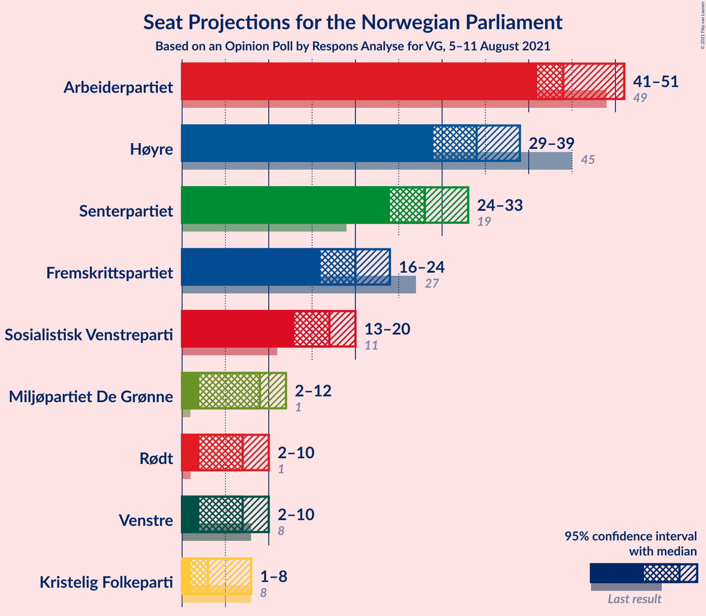
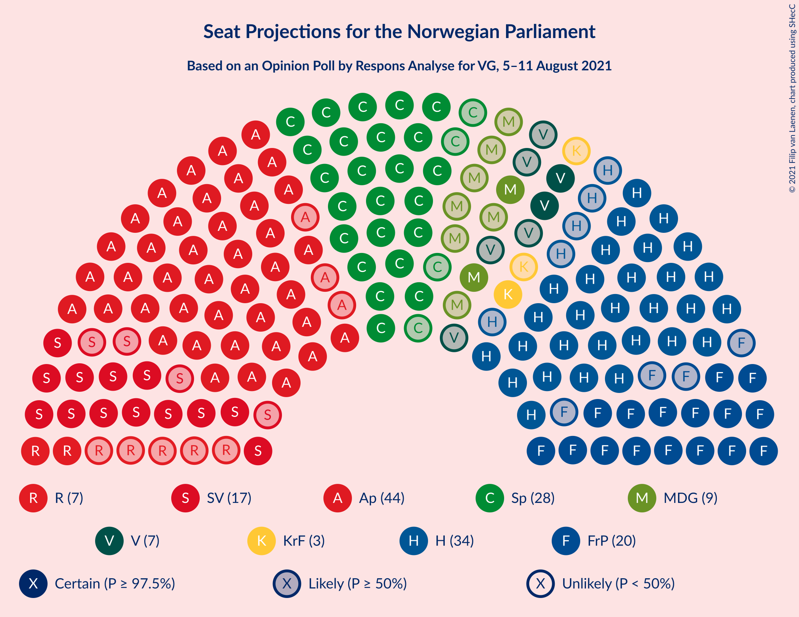
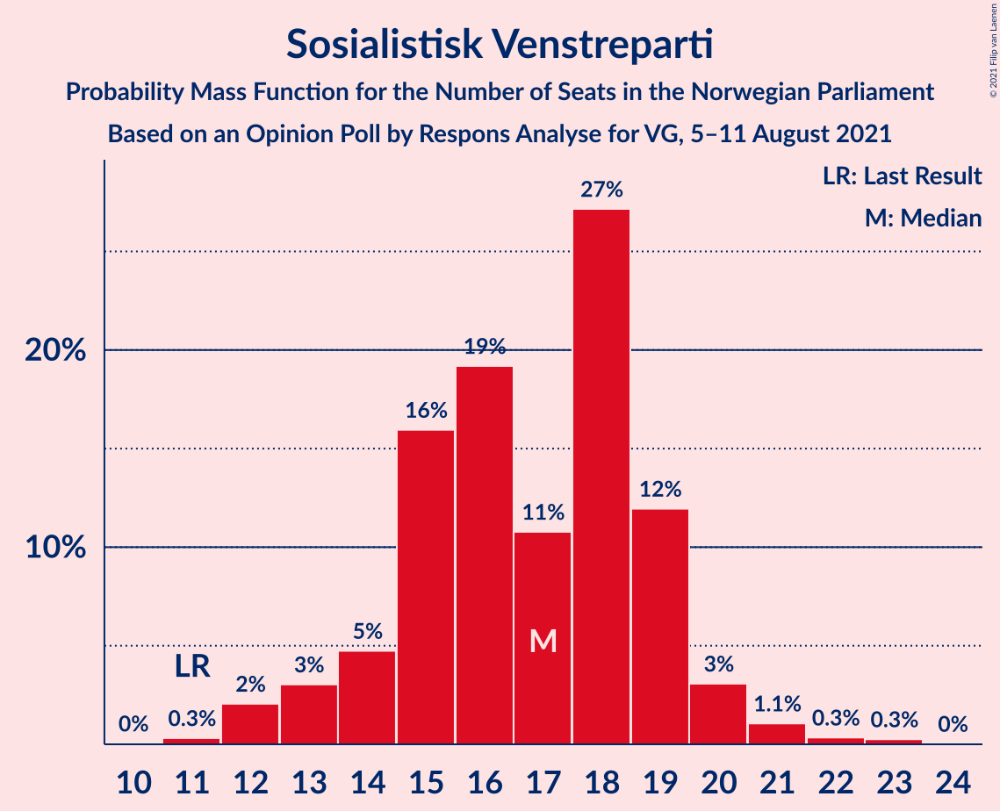
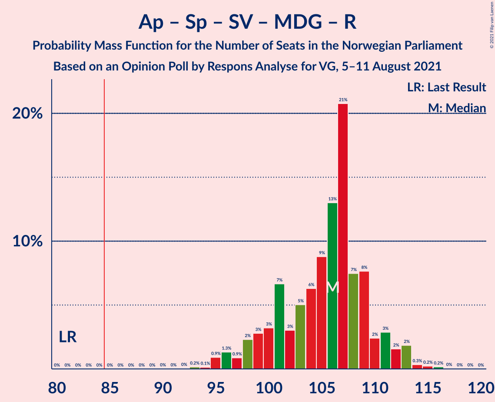
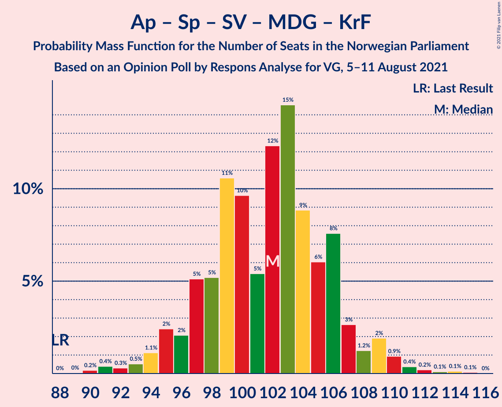
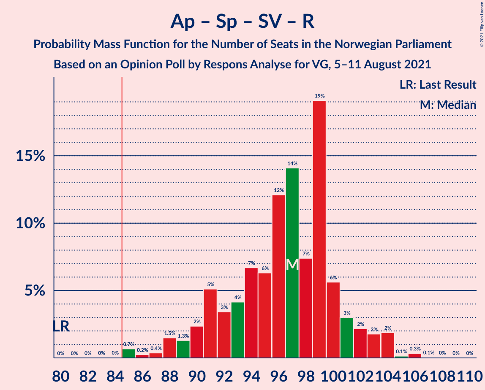
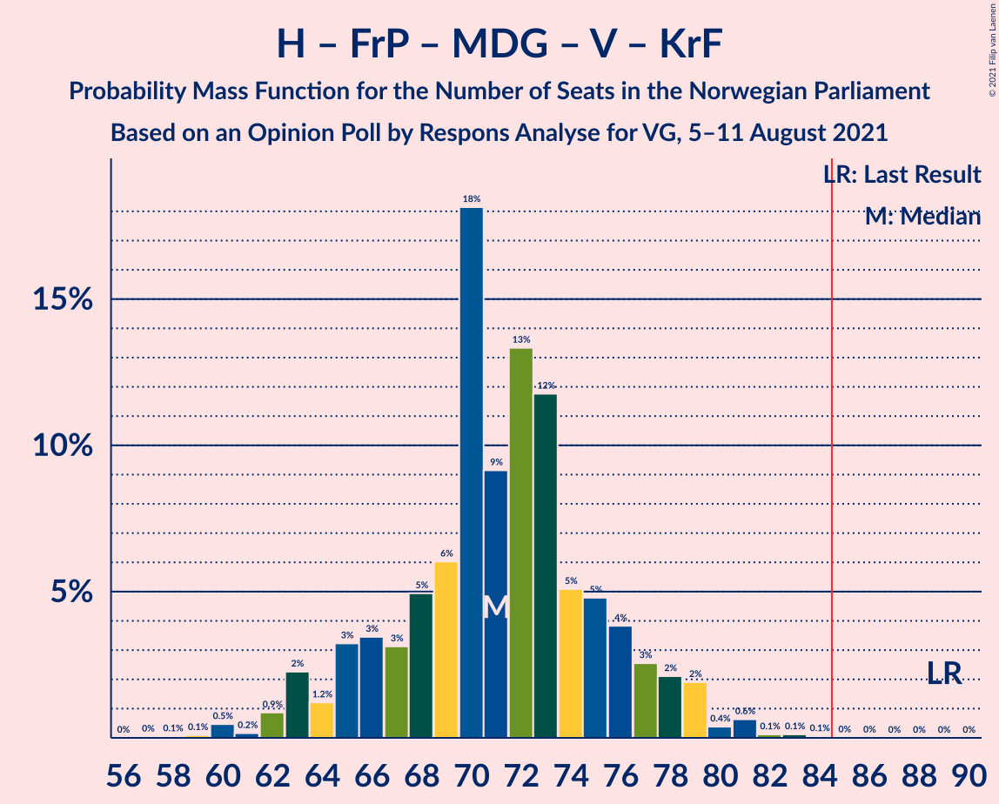
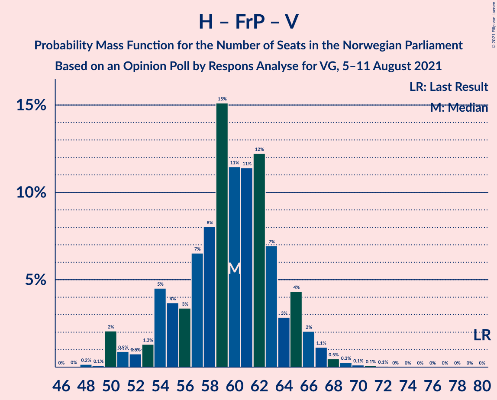

# Opinion Poll by Respons Analyse for VG, 5–11 August 2021

<a href="#voting-intentions">Voting Intentions</a> | <a href="#seats">Seats</a> | <a href="#coalitions">Coalitions</a> | <a href="#technical-information">Technical Information</a>

## Voting Intentions

### Confidence Intervals

| Party | Last Result | Poll Result | 80% Confidence Interval | 90% Confidence Interval | 95% Confidence Interval | 99% Confidence Interval |
|:-----:|:-----------:|:-----------:|:-----------------------:|:-----------------------:|:-----------------------:|:-----------------------:|
| Arbeiderpartiet | 27.4% | 24.8% | 23.1–26.6% |22.6–27.1% |22.2–27.6% |21.4–28.5% |
| Høyre | 25.0% | 18.9% | 17.4–20.6% |16.9–21.0% |16.6–21.5% |15.9–22.3% |
| Senterpartiet | 10.3% | 15.3% | 13.9–16.9% |13.5–17.3% |13.2–17.7% |12.6–18.4% |
| Fremskrittspartiet | 15.2% | 11.4% | 10.2–12.8% |9.9–13.2% |9.6–13.5% |9.0–14.2% |
| Sosialistisk Venstreparti | 6.0% | 9.4% | 8.3–10.7% |8.0–11.1% |7.7–11.4% |7.2–12.0% |
| Miljøpartiet De Grønne | 3.2% | 5.1% | 4.3–6.1% |4.1–6.4% |3.9–6.6% |3.6–7.2% |
| Rødt | 2.4% | 4.3% | 3.6–5.2% |3.4–5.5% |3.2–5.7% |2.9–6.2% |
| Venstre | 4.4% | 4.0% | 3.3–4.9% |3.1–5.2% |2.9–5.4% |2.7–5.9% |
| Kristelig Folkeparti | 4.2% | 3.3% | 2.7–4.1% |2.5–4.4% |2.4–4.6% |2.1–5.0% |

*Note:* The poll result column reflects the actual value used in the calculations. Published results may vary slightly, and in addition be rounded to fewer digits.

## Seats

### Confidence Intervals

| Party | Last Result | Median | 80% Confidence Interval | 90% Confidence Interval | 95% Confidence Interval | 99% Confidence Interval |
|:-----:|:-----------:|:------:|:-----------------------:|:-----------------------:|:-----------------------:|:-----------------------:|
| <a href="#arbeiderpartiet">Arbeiderpartiet</a> | 49 | 43 | 42–47 |41–48 |41–50 |40–53 |
| <a href="#høyre">Høyre</a> | 45 | 34 | 31–38 |30–38 |30–39 |28–41 |
| <a href="#senterpartiet">Senterpartiet</a> | 19 | 28 | 26–32 |25–32 |24–33 |22–34 |
| <a href="#fremskrittspartiet">Fremskrittspartiet</a> | 27 | 21 | 17–24 |17–24 |16–24 |15–26 |
| <a href="#sosialistisk-venstreparti">Sosialistisk Venstreparti</a> | 11 | 18 | 15–18 |14–19 |14–20 |12–21 |
| <a href="#miljøpartiet-de-grønne">Miljøpartiet De Grønne</a> | 1 | 10 | 7–11 |2–11 |2–11 |2–13 |
| <a href="#rødt">Rødt</a> | 1 | 7 | 2–10 |2–10 |2–10 |1–11 |
| <a href="#venstre">Venstre</a> | 8 | 7 | 2–8 |2–9 |2–9 |2–10 |
| <a href="#kristelig-folkeparti">Kristelig Folkeparti</a> | 8 | 3 | 1–7 |1–8 |1–8 |0–9 |

### Arbeiderpartiet

*For a full overview of the results for this party, see the [Arbeiderpartiet](party-arbeiderpartiet.html) page.*

| Number of Seats | Probability | Accumulated | Special Marks |
|:---------------:|:-----------:|:-----------:|:-------------:|
| 38 | 0.1% | 100% |  |
| 39 | 0.1% | 99.9% |  |
| 40 | 2% | 99.8% |  |
| 41 | 7% | 98% |  |
| 42 | 3% | 91% |  |
| 43 | 41% | 88% | Median |
| 44 | 15% | 47% |  |
| 45 | 11% | 32% |  |
| 46 | 9% | 21% |  |
| 47 | 5% | 13% |  |
| 48 | 3% | 8% |  |
| 49 | 2% | 4% | Last Result |
| 50 | 1.3% | 3% |  |
| 51 | 0.2% | 1.3% |  |
| 52 | 0.5% | 1.2% |  |
| 53 | 0.3% | 0.6% |  |
| 54 | 0.2% | 0.3% |  |
| 55 | 0.1% | 0.1% |  |
| 56 | 0% | 0% |  |

### Høyre

*For a full overview of the results for this party, see the [Høyre](party-høyre.html) page.*

| Number of Seats | Probability | Accumulated | Special Marks |
|:---------------:|:-----------:|:-----------:|:-------------:|
| 26 | 0% | 100% |  |
| 27 | 0.3% | 99.9% |  |
| 28 | 0.9% | 99.7% |  |
| 29 | 0.7% | 98.8% |  |
| 30 | 5% | 98% |  |
| 31 | 10% | 93% |  |
| 32 | 4% | 83% |  |
| 33 | 8% | 78% |  |
| 34 | 33% | 70% | Median |
| 35 | 11% | 37% |  |
| 36 | 10% | 26% |  |
| 37 | 1.3% | 16% |  |
| 38 | 12% | 15% |  |
| 39 | 0.6% | 3% |  |
| 40 | 0.9% | 2% |  |
| 41 | 1.0% | 1.2% |  |
| 42 | 0.2% | 0.3% |  |
| 43 | 0% | 0.1% |  |
| 44 | 0% | 0% |  |
| 45 | 0% | 0% | Last Result |

### Senterpartiet

*For a full overview of the results for this party, see the [Senterpartiet](party-senterpartiet.html) page.*

| Number of Seats | Probability | Accumulated | Special Marks |
|:---------------:|:-----------:|:-----------:|:-------------:|
| 19 | 0% | 100% | Last Result |
| 20 | 0.1% | 100% |  |
| 21 | 0% | 99.9% |  |
| 22 | 0.4% | 99.8% |  |
| 23 | 0.6% | 99.5% |  |
| 24 | 3% | 98.8% |  |
| 25 | 4% | 95% |  |
| 26 | 6% | 91% |  |
| 27 | 11% | 85% |  |
| 28 | 50% | 74% | Median |
| 29 | 6% | 23% |  |
| 30 | 3% | 17% |  |
| 31 | 2% | 14% |  |
| 32 | 9% | 12% |  |
| 33 | 3% | 4% |  |
| 34 | 0.6% | 0.8% |  |
| 35 | 0.1% | 0.2% |  |
| 36 | 0.1% | 0.2% |  |
| 37 | 0% | 0.1% |  |
| 38 | 0% | 0% |  |

### Fremskrittspartiet

*For a full overview of the results for this party, see the [Fremskrittspartiet](party-fremskrittspartiet.html) page.*

| Number of Seats | Probability | Accumulated | Special Marks |
|:---------------:|:-----------:|:-----------:|:-------------:|
| 13 | 0.1% | 100% |  |
| 14 | 0.3% | 99.9% |  |
| 15 | 0.5% | 99.6% |  |
| 16 | 2% | 99.1% |  |
| 17 | 7% | 97% |  |
| 18 | 8% | 90% |  |
| 19 | 14% | 82% |  |
| 20 | 15% | 68% |  |
| 21 | 7% | 52% | Median |
| 22 | 7% | 45% |  |
| 23 | 28% | 39% |  |
| 24 | 10% | 11% |  |
| 25 | 0.6% | 1.2% |  |
| 26 | 0.3% | 0.6% |  |
| 27 | 0.2% | 0.3% | Last Result |
| 28 | 0.1% | 0.1% |  |
| 29 | 0% | 0% |  |

### Sosialistisk Venstreparti

*For a full overview of the results for this party, see the [Sosialistisk Venstreparti](party-sosialistiskvenstreparti.html) page.*

| Number of Seats | Probability | Accumulated | Special Marks |
|:---------------:|:-----------:|:-----------:|:-------------:|
| 11 | 0.4% | 100% | Last Result |
| 12 | 0.6% | 99.6% |  |
| 13 | 1.3% | 99.0% |  |
| 14 | 3% | 98% |  |
| 15 | 13% | 94% |  |
| 16 | 21% | 82% |  |
| 17 | 6% | 61% |  |
| 18 | 46% | 55% | Median |
| 19 | 5% | 10% |  |
| 20 | 3% | 4% |  |
| 21 | 0.5% | 0.7% |  |
| 22 | 0.1% | 0.3% |  |
| 23 | 0.1% | 0.2% |  |
| 24 | 0.1% | 0.1% |  |
| 25 | 0% | 0% |  |

### Miljøpartiet De Grønne

*For a full overview of the results for this party, see the [Miljøpartiet De Grønne](party-miljøpartietdegrønne.html) page.*

| Number of Seats | Probability | Accumulated | Special Marks |
|:---------------:|:-----------:|:-----------:|:-------------:|
| 1 | 0% | 100% | Last Result |
| 2 | 8% | 100% |  |
| 3 | 0.3% | 92% |  |
| 4 | 0.1% | 92% |  |
| 5 | 0% | 92% |  |
| 6 | 0.5% | 92% |  |
| 7 | 4% | 91% |  |
| 8 | 7% | 87% |  |
| 9 | 15% | 80% |  |
| 10 | 30% | 65% | Median |
| 11 | 32% | 34% |  |
| 12 | 2% | 2% |  |
| 13 | 0.5% | 0.7% |  |
| 14 | 0.1% | 0.1% |  |
| 15 | 0.1% | 0.1% |  |
| 16 | 0% | 0% |  |

### Rødt

*For a full overview of the results for this party, see the [Rødt](party-rødt.html) page.*

| Number of Seats | Probability | Accumulated | Special Marks |
|:---------------:|:-----------:|:-----------:|:-------------:|
| 1 | 0.8% | 100% | Last Result |
| 2 | 27% | 99.2% |  |
| 3 | 0% | 72% |  |
| 4 | 0% | 72% |  |
| 5 | 0% | 72% |  |
| 6 | 0.8% | 72% |  |
| 7 | 31% | 72% | Median |
| 8 | 24% | 41% |  |
| 9 | 7% | 18% |  |
| 10 | 8% | 11% |  |
| 11 | 2% | 2% |  |
| 12 | 0.1% | 0.1% |  |
| 13 | 0% | 0% |  |

### Venstre

*For a full overview of the results for this party, see the [Venstre](party-venstre.html) page.*

| Number of Seats | Probability | Accumulated | Special Marks |
|:---------------:|:-----------:|:-----------:|:-------------:|
| 1 | 0.1% | 100% |  |
| 2 | 48% | 99.9% |  |
| 3 | 0.5% | 52% |  |
| 4 | 0.1% | 52% |  |
| 5 | 0% | 52% |  |
| 6 | 0.5% | 52% |  |
| 7 | 19% | 51% | Median |
| 8 | 24% | 33% | Last Result |
| 9 | 7% | 9% |  |
| 10 | 1.4% | 2% |  |
| 11 | 0.3% | 0.3% |  |
| 12 | 0% | 0% |  |

### Kristelig Folkeparti

*For a full overview of the results for this party, see the [Kristelig Folkeparti](party-kristeligfolkeparti.html) page.*

| Number of Seats | Probability | Accumulated | Special Marks |
|:---------------:|:-----------:|:-----------:|:-------------:|
| 0 | 1.4% | 100% |  |
| 1 | 14% | 98.6% |  |
| 2 | 10% | 84% |  |
| 3 | 58% | 74% | Median |
| 4 | 0% | 16% |  |
| 5 | 0% | 16% |  |
| 6 | 0.5% | 16% |  |
| 7 | 8% | 16% |  |
| 8 | 7% | 8% | Last Result |
| 9 | 0.5% | 0.6% |  |
| 10 | 0.1% | 0.1% |  |
| 11 | 0% | 0% |  |

## Coalitions

### Confidence Intervals

| Coalition | Last Result | Median | Majority? | 80% Confidence Interval | 90% Confidence Interval | 95% Confidence Interval | 99% Confidence Interval |
|:---------:|:-----------:|:------:|:---------:|:-----------------------:|:-----------------------:|:-----------------------:|:-----------------------:|
| Arbeiderpartiet – Senterpartiet – Sosialistisk Venstreparti – Miljøpartiet De Grønne – Rødt | 81 | 106 | 100% | 101–110 | 97–110 | 96–111 | 95–113 |
| Arbeiderpartiet – Senterpartiet – Sosialistisk Venstreparti – Miljøpartiet De Grønne – Kristelig Folkeparti | 88 | 103 | 100% | 97–105 | 95–108 | 95–109 | 92–111 |
| Arbeiderpartiet – Senterpartiet – Sosialistisk Venstreparti – Miljøpartiet De Grønne | 80 | 99 | 100% | 94–102 | 93–103 | 91–106 | 88–108 |
| Arbeiderpartiet – Senterpartiet – Sosialistisk Venstreparti – Rødt | 80 | 96 | 99.9% | 91–100 | 91–100 | 90–102 | 86–103 |
| Høyre – Senterpartiet – Fremskrittspartiet – Venstre – Kristelig Folkeparti | 107 | 91 | 95% | 87–96 | 85–98 | 83–100 | 80–100 |
| Arbeiderpartiet – Senterpartiet – Sosialistisk Venstreparti | 79 | 89 | 97% | 85–92 | 85–94 | 84–95 | 81–99 |
| Arbeiderpartiet – Senterpartiet – Miljøpartiet De Grønne – Kristelig Folkeparti | 77 | 85 | 59% | 80–89 | 79–91 | 77–93 | 75–95 |
| Arbeiderpartiet – Sosialistisk Venstreparti – Miljøpartiet De Grønne – Rødt | 62 | 78 | 3% | 72–80 | 69–82 | 69–85 | 66–86 |
| Arbeiderpartiet – Senterpartiet – Kristelig Folkeparti | 76 | 74 | 2% | 72–81 | 71–82 | 70–83 | 67–86 |
| Arbeiderpartiet – Senterpartiet | 68 | 71 | 0% | 69–77 | 69–77 | 67–78 | 66–81 |
| Høyre – Fremskrittspartiet – Miljøpartiet De Grønne – Venstre – Kristelig Folkeparti | 89 | 73 | 0.1% | 68–78 | 66–78 | 63–78 | 60–81 |
| Høyre – Fremskrittspartiet – Venstre – Kristelig Folkeparti | 88 | 62 | 0% | 59–68 | 57–69 | 55–73 | 51–73 |
| Arbeiderpartiet – Sosialistisk Venstreparti | 60 | 61 | 0% | 57–65 | 57–66 | 57–66 | 55–70 |
| Høyre – Fremskrittspartiet – Venstre | 80 | 59 | 0% | 55–65 | 54–66 | 51–66 | 50–68 |
| Høyre – Fremskrittspartiet | 72 | 57 | 0% | 49–58 | 48–58 | 48–61 | 46–63 |
| Høyre – Venstre – Kristelig Folkeparti | 61 | 42 | 0% | 39–48 | 37–48 | 36–52 | 33–52 |
| Senterpartiet – Venstre – Kristelig Folkeparti | 35 | 37 | 0% | 33–43 | 31–43 | 29–43 | 27–45 |

### Arbeiderpartiet – Senterpartiet – Sosialistisk Venstreparti – Miljøpartiet De Grønne – Rødt

| Number of Seats | Probability | Accumulated | Special Marks |
|:---------------:|:-----------:|:-----------:|:-------------:|
| 81 | 0% | 100% | Last Result |
| 82 | 0% | 100% |  |
| 83 | 0% | 100% |  |
| 84 | 0% | 100% |  |
| 85 | 0% | 100% | Majority |
| 86 | 0% | 100% |  |
| 87 | 0% | 100% |  |
| 88 | 0% | 100% |  |
| 89 | 0% | 100% |  |
| 90 | 0% | 100% |  |
| 91 | 0% | 100% |  |
| 92 | 0% | 100% |  |
| 93 | 0.1% | 100% |  |
| 94 | 0.1% | 99.8% |  |
| 95 | 0.4% | 99.8% |  |
| 96 | 3% | 99.4% |  |
| 97 | 2% | 96% |  |
| 98 | 0.8% | 94% |  |
| 99 | 0.9% | 93% |  |
| 100 | 2% | 92% |  |
| 101 | 18% | 91% |  |
| 102 | 2% | 72% |  |
| 103 | 3% | 71% |  |
| 104 | 10% | 67% |  |
| 105 | 5% | 58% |  |
| 106 | 7% | 53% | Median |
| 107 | 27% | 45% |  |
| 108 | 3% | 18% |  |
| 109 | 1.4% | 15% |  |
| 110 | 9% | 13% |  |
| 111 | 2% | 4% |  |
| 112 | 0.8% | 2% |  |
| 113 | 0.8% | 1.3% |  |
| 114 | 0.3% | 0.4% |  |
| 115 | 0% | 0.1% |  |
| 116 | 0% | 0.1% |  |
| 117 | 0% | 0% |  |

### Arbeiderpartiet – Senterpartiet – Sosialistisk Venstreparti – Miljøpartiet De Grønne – Kristelig Folkeparti

| Number of Seats | Probability | Accumulated | Special Marks |
|:---------------:|:-----------:|:-----------:|:-------------:|
| 88 | 0% | 100% | Last Result |
| 89 | 0% | 99.9% |  |
| 90 | 0.3% | 99.9% |  |
| 91 | 0% | 99.6% |  |
| 92 | 0.3% | 99.6% |  |
| 93 | 0.6% | 99.2% |  |
| 94 | 0.7% | 98.6% |  |
| 95 | 5% | 98% |  |
| 96 | 3% | 93% |  |
| 97 | 9% | 90% |  |
| 98 | 2% | 82% |  |
| 99 | 2% | 80% |  |
| 100 | 2% | 78% |  |
| 101 | 5% | 76% |  |
| 102 | 19% | 70% | Median |
| 103 | 29% | 51% |  |
| 104 | 9% | 23% |  |
| 105 | 4% | 14% |  |
| 106 | 2% | 9% |  |
| 107 | 2% | 7% |  |
| 108 | 0.6% | 6% |  |
| 109 | 3% | 5% |  |
| 110 | 1.4% | 2% |  |
| 111 | 0.6% | 0.7% |  |
| 112 | 0.1% | 0.1% |  |
| 113 | 0% | 0.1% |  |
| 114 | 0% | 0.1% |  |
| 115 | 0% | 0% |  |

### Arbeiderpartiet – Senterpartiet – Sosialistisk Venstreparti – Miljøpartiet De Grønne

| Number of Seats | Probability | Accumulated | Special Marks |
|:---------------:|:-----------:|:-----------:|:-------------:|
| 80 | 0% | 100% | Last Result |
| 81 | 0% | 100% |  |
| 82 | 0% | 100% |  |
| 83 | 0% | 100% |  |
| 84 | 0% | 100% |  |
| 85 | 0% | 100% | Majority |
| 86 | 0% | 99.9% |  |
| 87 | 0% | 99.9% |  |
| 88 | 0.9% | 99.9% |  |
| 89 | 0.3% | 98.9% |  |
| 90 | 1.0% | 98.6% |  |
| 91 | 0.4% | 98% |  |
| 92 | 0.2% | 97% |  |
| 93 | 6% | 97% |  |
| 94 | 11% | 91% |  |
| 95 | 2% | 80% |  |
| 96 | 2% | 78% |  |
| 97 | 4% | 76% |  |
| 98 | 9% | 72% |  |
| 99 | 15% | 63% | Median |
| 100 | 29% | 48% |  |
| 101 | 4% | 19% |  |
| 102 | 8% | 15% |  |
| 103 | 3% | 7% |  |
| 104 | 0.2% | 4% |  |
| 105 | 1.1% | 4% |  |
| 106 | 2% | 3% |  |
| 107 | 0.1% | 0.8% |  |
| 108 | 0.4% | 0.7% |  |
| 109 | 0% | 0.3% |  |
| 110 | 0.1% | 0.2% |  |
| 111 | 0.1% | 0.2% |  |
| 112 | 0% | 0% |  |

### Arbeiderpartiet – Senterpartiet – Sosialistisk Venstreparti – Rødt

| Number of Seats | Probability | Accumulated | Special Marks |
|:---------------:|:-----------:|:-----------:|:-------------:|
| 80 | 0% | 100% | Last Result |
| 81 | 0% | 100% |  |
| 82 | 0% | 100% |  |
| 83 | 0% | 100% |  |
| 84 | 0.1% | 100% |  |
| 85 | 0.2% | 99.9% | Majority |
| 86 | 0.3% | 99.7% |  |
| 87 | 0.1% | 99.4% |  |
| 88 | 0.8% | 99.3% |  |
| 89 | 0.6% | 98.5% |  |
| 90 | 0.7% | 98% |  |
| 91 | 14% | 97% |  |
| 92 | 2% | 83% |  |
| 93 | 2% | 81% |  |
| 94 | 11% | 79% |  |
| 95 | 9% | 68% |  |
| 96 | 32% | 60% | Median |
| 97 | 5% | 28% |  |
| 98 | 5% | 23% |  |
| 99 | 3% | 19% |  |
| 100 | 11% | 16% |  |
| 101 | 1.4% | 4% |  |
| 102 | 1.4% | 3% |  |
| 103 | 1.0% | 1.4% |  |
| 104 | 0.1% | 0.4% |  |
| 105 | 0.1% | 0.3% |  |
| 106 | 0.2% | 0.2% |  |
| 107 | 0% | 0.1% |  |
| 108 | 0% | 0% |  |

### Høyre – Senterpartiet – Fremskrittspartiet – Venstre – Kristelig Folkeparti

| Number of Seats | Probability | Accumulated | Special Marks |
|:---------------:|:-----------:|:-----------:|:-------------:|
| 76 | 0.2% | 100% |  |
| 77 | 0% | 99.8% |  |
| 78 | 0.1% | 99.8% |  |
| 79 | 0% | 99.7% |  |
| 80 | 0.7% | 99.7% |  |
| 81 | 0.3% | 99.0% |  |
| 82 | 0.2% | 98.8% |  |
| 83 | 2% | 98.6% |  |
| 84 | 2% | 97% |  |
| 85 | 0.8% | 95% | Majority |
| 86 | 2% | 95% |  |
| 87 | 4% | 93% |  |
| 88 | 2% | 88% |  |
| 89 | 8% | 86% |  |
| 90 | 27% | 78% |  |
| 91 | 11% | 52% |  |
| 92 | 3% | 40% |  |
| 93 | 9% | 37% | Median |
| 94 | 2% | 28% |  |
| 95 | 5% | 26% |  |
| 96 | 13% | 20% |  |
| 97 | 0.9% | 7% |  |
| 98 | 2% | 7% |  |
| 99 | 1.0% | 5% |  |
| 100 | 4% | 4% |  |
| 101 | 0.1% | 0.2% |  |
| 102 | 0.1% | 0.2% |  |
| 103 | 0.1% | 0.1% |  |
| 104 | 0% | 0% |  |
| 105 | 0% | 0% |  |
| 106 | 0% | 0% |  |
| 107 | 0% | 0% | Last Result |

### Arbeiderpartiet – Senterpartiet – Sosialistisk Venstreparti

| Number of Seats | Probability | Accumulated | Special Marks |
|:---------------:|:-----------:|:-----------:|:-------------:|
| 77 | 0% | 100% |  |
| 78 | 0% | 99.9% |  |
| 79 | 0% | 99.9% | Last Result |
| 80 | 0.2% | 99.9% |  |
| 81 | 0.7% | 99.7% |  |
| 82 | 0.3% | 99.0% |  |
| 83 | 1.0% | 98.7% |  |
| 84 | 0.4% | 98% |  |
| 85 | 8% | 97% | Majority |
| 86 | 6% | 90% |  |
| 87 | 2% | 84% |  |
| 88 | 7% | 82% |  |
| 89 | 41% | 74% | Median |
| 90 | 8% | 33% |  |
| 91 | 5% | 25% |  |
| 92 | 12% | 21% |  |
| 93 | 2% | 9% |  |
| 94 | 3% | 7% |  |
| 95 | 2% | 4% |  |
| 96 | 0.7% | 2% |  |
| 97 | 0.3% | 1.2% |  |
| 98 | 0.3% | 0.9% |  |
| 99 | 0.1% | 0.6% |  |
| 100 | 0.4% | 0.5% |  |
| 101 | 0.1% | 0.1% |  |
| 102 | 0% | 0% |  |

### Arbeiderpartiet – Senterpartiet – Miljøpartiet De Grønne – Kristelig Folkeparti

| Number of Seats | Probability | Accumulated | Special Marks |
|:---------------:|:-----------:|:-----------:|:-------------:|
| 73 | 0.1% | 100% |  |
| 74 | 0.3% | 99.8% |  |
| 75 | 0.1% | 99.6% |  |
| 76 | 1.4% | 99.5% |  |
| 77 | 1.4% | 98% | Last Result |
| 78 | 0.6% | 97% |  |
| 79 | 2% | 96% |  |
| 80 | 4% | 94% |  |
| 81 | 8% | 90% |  |
| 82 | 4% | 82% |  |
| 83 | 2% | 77% |  |
| 84 | 17% | 76% | Median |
| 85 | 32% | 59% | Majority |
| 86 | 2% | 26% |  |
| 87 | 4% | 25% |  |
| 88 | 4% | 21% |  |
| 89 | 10% | 17% |  |
| 90 | 1.3% | 7% |  |
| 91 | 2% | 6% |  |
| 92 | 2% | 4% |  |
| 93 | 0.5% | 3% |  |
| 94 | 0.2% | 2% |  |
| 95 | 2% | 2% |  |
| 96 | 0.1% | 0.2% |  |
| 97 | 0.1% | 0.1% |  |
| 98 | 0% | 0% |  |

### Arbeiderpartiet – Sosialistisk Venstreparti – Miljøpartiet De Grønne – Rødt

| Number of Seats | Probability | Accumulated | Special Marks |
|:---------------:|:-----------:|:-----------:|:-------------:|
| 62 | 0% | 100% | Last Result |
| 63 | 0% | 100% |  |
| 64 | 0% | 100% |  |
| 65 | 0.1% | 100% |  |
| 66 | 0.6% | 99.9% |  |
| 67 | 0.1% | 99.3% |  |
| 68 | 0.1% | 99.2% |  |
| 69 | 5% | 99.0% |  |
| 70 | 1.2% | 94% |  |
| 71 | 2% | 93% |  |
| 72 | 2% | 91% |  |
| 73 | 14% | 89% |  |
| 74 | 6% | 75% |  |
| 75 | 3% | 69% |  |
| 76 | 9% | 66% |  |
| 77 | 3% | 57% |  |
| 78 | 12% | 54% | Median |
| 79 | 26% | 42% |  |
| 80 | 8% | 16% |  |
| 81 | 1.2% | 8% |  |
| 82 | 4% | 7% |  |
| 83 | 0.6% | 4% |  |
| 84 | 0.4% | 3% |  |
| 85 | 0.7% | 3% | Majority |
| 86 | 2% | 2% |  |
| 87 | 0.1% | 0.3% |  |
| 88 | 0.2% | 0.2% |  |
| 89 | 0% | 0.1% |  |
| 90 | 0% | 0.1% |  |
| 91 | 0.1% | 0.1% |  |
| 92 | 0% | 0% |  |

### Arbeiderpartiet – Senterpartiet – Kristelig Folkeparti

| Number of Seats | Probability | Accumulated | Special Marks |
|:---------------:|:-----------:|:-----------:|:-------------:|
| 65 | 0% | 100% |  |
| 66 | 0.2% | 99.9% |  |
| 67 | 1.2% | 99.7% |  |
| 68 | 0.4% | 98.5% |  |
| 69 | 0.3% | 98% |  |
| 70 | 1.5% | 98% |  |
| 71 | 2% | 96% |  |
| 72 | 7% | 94% |  |
| 73 | 6% | 87% |  |
| 74 | 40% | 81% | Median |
| 75 | 5% | 41% |  |
| 76 | 6% | 36% | Last Result |
| 77 | 5% | 30% |  |
| 78 | 2% | 25% |  |
| 79 | 8% | 23% |  |
| 80 | 2% | 15% |  |
| 81 | 4% | 13% |  |
| 82 | 6% | 8% |  |
| 83 | 0.1% | 3% |  |
| 84 | 0.6% | 2% |  |
| 85 | 1.3% | 2% | Majority |
| 86 | 0.3% | 0.5% |  |
| 87 | 0.1% | 0.2% |  |
| 88 | 0% | 0.1% |  |
| 89 | 0.1% | 0.1% |  |
| 90 | 0% | 0% |  |

### Arbeiderpartiet – Senterpartiet

| Number of Seats | Probability | Accumulated | Special Marks |
|:---------------:|:-----------:|:-----------:|:-------------:|
| 63 | 0% | 100% |  |
| 64 | 0.1% | 99.9% |  |
| 65 | 0.3% | 99.9% |  |
| 66 | 2% | 99.5% |  |
| 67 | 2% | 98% |  |
| 68 | 0.5% | 96% | Last Result |
| 69 | 9% | 96% |  |
| 70 | 3% | 87% |  |
| 71 | 43% | 83% | Median |
| 72 | 6% | 40% |  |
| 73 | 4% | 34% |  |
| 74 | 9% | 29% |  |
| 75 | 3% | 20% |  |
| 76 | 5% | 17% |  |
| 77 | 8% | 13% |  |
| 78 | 2% | 5% |  |
| 79 | 0.9% | 2% |  |
| 80 | 0.9% | 2% |  |
| 81 | 0.1% | 0.6% |  |
| 82 | 0.2% | 0.5% |  |
| 83 | 0.2% | 0.3% |  |
| 84 | 0.1% | 0.1% |  |
| 85 | 0% | 0% | Majority |

### Høyre – Fremskrittspartiet – Miljøpartiet De Grønne – Venstre – Kristelig Folkeparti

| Number of Seats | Probability | Accumulated | Special Marks |
|:---------------:|:-----------:|:-----------:|:-------------:|
| 58 | 0.1% | 100% |  |
| 59 | 0.2% | 99.9% |  |
| 60 | 0.5% | 99.6% |  |
| 61 | 0.4% | 99.2% |  |
| 62 | 0.8% | 98.7% |  |
| 63 | 0.5% | 98% |  |
| 64 | 0.8% | 97% |  |
| 65 | 1.3% | 97% |  |
| 66 | 1.5% | 95% |  |
| 67 | 2% | 94% |  |
| 68 | 2% | 92% |  |
| 69 | 11% | 90% |  |
| 70 | 3% | 79% |  |
| 71 | 5% | 76% |  |
| 72 | 4% | 70% |  |
| 73 | 32% | 67% |  |
| 74 | 8% | 35% |  |
| 75 | 10% | 27% | Median |
| 76 | 1.4% | 17% |  |
| 77 | 2% | 16% |  |
| 78 | 12% | 14% |  |
| 79 | 0.4% | 2% |  |
| 80 | 0.3% | 1.2% |  |
| 81 | 0.7% | 1.0% |  |
| 82 | 0.1% | 0.3% |  |
| 83 | 0% | 0.2% |  |
| 84 | 0.1% | 0.2% |  |
| 85 | 0% | 0.1% | Majority |
| 86 | 0% | 0% |  |
| 87 | 0% | 0% |  |
| 88 | 0% | 0% |  |
| 89 | 0% | 0% | Last Result |

### Høyre – Fremskrittspartiet – Venstre – Kristelig Folkeparti

| Number of Seats | Probability | Accumulated | Special Marks |
|:---------------:|:-----------:|:-----------:|:-------------:|
| 49 | 0.2% | 100% |  |
| 50 | 0% | 99.8% |  |
| 51 | 0.5% | 99.8% |  |
| 52 | 0.1% | 99.3% |  |
| 53 | 0.6% | 99.1% |  |
| 54 | 0.1% | 98.5% |  |
| 55 | 1.1% | 98% |  |
| 56 | 0.9% | 97% |  |
| 57 | 2% | 96% |  |
| 58 | 2% | 94% |  |
| 59 | 9% | 92% |  |
| 60 | 2% | 82% |  |
| 61 | 4% | 81% |  |
| 62 | 29% | 77% |  |
| 63 | 8% | 48% |  |
| 64 | 4% | 41% |  |
| 65 | 10% | 37% | Median |
| 66 | 3% | 27% |  |
| 67 | 1.3% | 24% |  |
| 68 | 17% | 23% |  |
| 69 | 0.5% | 5% |  |
| 70 | 0.4% | 5% |  |
| 71 | 0.1% | 5% |  |
| 72 | 1.0% | 4% |  |
| 73 | 3% | 3% |  |
| 74 | 0.1% | 0.1% |  |
| 75 | 0% | 0.1% |  |
| 76 | 0% | 0% |  |
| 77 | 0% | 0% |  |
| 78 | 0% | 0% |  |
| 79 | 0% | 0% |  |
| 80 | 0% | 0% |  |
| 81 | 0% | 0% |  |
| 82 | 0% | 0% |  |
| 83 | 0% | 0% |  |
| 84 | 0% | 0% |  |
| 85 | 0% | 0% | Majority |
| 86 | 0% | 0% |  |
| 87 | 0% | 0% |  |
| 88 | 0% | 0% | Last Result |

### Arbeiderpartiet – Sosialistisk Venstreparti

| Number of Seats | Probability | Accumulated | Special Marks |
|:---------------:|:-----------:|:-----------:|:-------------:|
| 52 | 0% | 100% |  |
| 53 | 0% | 99.9% |  |
| 54 | 0.1% | 99.9% |  |
| 55 | 0.5% | 99.8% |  |
| 56 | 1.1% | 99.3% |  |
| 57 | 8% | 98% |  |
| 58 | 3% | 90% |  |
| 59 | 8% | 87% |  |
| 60 | 10% | 80% | Last Result |
| 61 | 41% | 69% | Median |
| 62 | 9% | 28% |  |
| 63 | 5% | 20% |  |
| 64 | 2% | 15% |  |
| 65 | 7% | 12% |  |
| 66 | 3% | 5% |  |
| 67 | 0.5% | 2% |  |
| 68 | 0.7% | 2% |  |
| 69 | 0.6% | 1.2% |  |
| 70 | 0.3% | 0.6% |  |
| 71 | 0.1% | 0.2% |  |
| 72 | 0.1% | 0.2% |  |
| 73 | 0% | 0% |  |

### Høyre – Fremskrittspartiet – Venstre

| Number of Seats | Probability | Accumulated | Special Marks |
|:---------------:|:-----------:|:-----------:|:-------------:|
| 48 | 0.2% | 100% |  |
| 49 | 0.1% | 99.8% |  |
| 50 | 1.0% | 99.7% |  |
| 51 | 2% | 98.7% |  |
| 52 | 0.5% | 97% |  |
| 53 | 1.0% | 97% |  |
| 54 | 3% | 96% |  |
| 55 | 2% | 92% |  |
| 56 | 6% | 90% |  |
| 57 | 9% | 84% |  |
| 58 | 4% | 75% |  |
| 59 | 26% | 71% |  |
| 60 | 6% | 45% |  |
| 61 | 3% | 39% |  |
| 62 | 7% | 36% | Median |
| 63 | 3% | 29% |  |
| 64 | 2% | 26% |  |
| 65 | 19% | 24% |  |
| 66 | 4% | 6% |  |
| 67 | 0.1% | 2% |  |
| 68 | 1.0% | 1.4% |  |
| 69 | 0.3% | 0.4% |  |
| 70 | 0% | 0.2% |  |
| 71 | 0.1% | 0.1% |  |
| 72 | 0.1% | 0.1% |  |
| 73 | 0% | 0% |  |
| 74 | 0% | 0% |  |
| 75 | 0% | 0% |  |
| 76 | 0% | 0% |  |
| 77 | 0% | 0% |  |
| 78 | 0% | 0% |  |
| 79 | 0% | 0% |  |
| 80 | 0% | 0% | Last Result |

### Høyre – Fremskrittspartiet

| Number of Seats | Probability | Accumulated | Special Marks |
|:---------------:|:-----------:|:-----------:|:-------------:|
| 43 | 0.1% | 100% |  |
| 44 | 0% | 99.9% |  |
| 45 | 0% | 99.9% |  |
| 46 | 1.0% | 99.9% |  |
| 47 | 0.4% | 98.8% |  |
| 48 | 7% | 98% |  |
| 49 | 3% | 92% |  |
| 50 | 3% | 89% |  |
| 51 | 2% | 86% |  |
| 52 | 8% | 84% |  |
| 53 | 4% | 77% |  |
| 54 | 12% | 73% |  |
| 55 | 3% | 60% | Median |
| 56 | 4% | 57% |  |
| 57 | 31% | 53% |  |
| 58 | 17% | 22% |  |
| 59 | 0.5% | 5% |  |
| 60 | 0.6% | 4% |  |
| 61 | 3% | 4% |  |
| 62 | 0.4% | 0.9% |  |
| 63 | 0.3% | 0.6% |  |
| 64 | 0.2% | 0.2% |  |
| 65 | 0% | 0.1% |  |
| 66 | 0% | 0.1% |  |
| 67 | 0% | 0.1% |  |
| 68 | 0.1% | 0.1% |  |
| 69 | 0% | 0% |  |
| 70 | 0% | 0% |  |
| 71 | 0% | 0% |  |
| 72 | 0% | 0% | Last Result |

### Høyre – Venstre – Kristelig Folkeparti

| Number of Seats | Probability | Accumulated | Special Marks |
|:---------------:|:-----------:|:-----------:|:-------------:|
| 33 | 0.7% | 100% |  |
| 34 | 0.3% | 99.3% |  |
| 35 | 1.4% | 99.0% |  |
| 36 | 3% | 98% |  |
| 37 | 1.3% | 95% |  |
| 38 | 3% | 94% |  |
| 39 | 30% | 91% |  |
| 40 | 3% | 61% |  |
| 41 | 4% | 58% |  |
| 42 | 7% | 54% |  |
| 43 | 4% | 47% |  |
| 44 | 13% | 43% | Median |
| 45 | 2% | 31% |  |
| 46 | 10% | 29% |  |
| 47 | 0.7% | 18% |  |
| 48 | 13% | 18% |  |
| 49 | 0.4% | 5% |  |
| 50 | 0.2% | 5% |  |
| 51 | 1.0% | 4% |  |
| 52 | 3% | 3% |  |
| 53 | 0% | 0% |  |
| 54 | 0% | 0% |  |
| 55 | 0% | 0% |  |
| 56 | 0% | 0% |  |
| 57 | 0% | 0% |  |
| 58 | 0% | 0% |  |
| 59 | 0% | 0% |  |
| 60 | 0% | 0% |  |
| 61 | 0% | 0% | Last Result |

### Senterpartiet – Venstre – Kristelig Folkeparti

| Number of Seats | Probability | Accumulated | Special Marks |
|:---------------:|:-----------:|:-----------:|:-------------:|
| 26 | 0.3% | 100% |  |
| 27 | 0.3% | 99.7% |  |
| 28 | 0.3% | 99.4% |  |
| 29 | 2% | 99.1% |  |
| 30 | 1.4% | 97% |  |
| 31 | 2% | 96% |  |
| 32 | 3% | 94% |  |
| 33 | 27% | 91% |  |
| 34 | 6% | 65% |  |
| 35 | 1.5% | 59% | Last Result |
| 36 | 2% | 57% |  |
| 37 | 12% | 55% |  |
| 38 | 14% | 43% | Median |
| 39 | 10% | 29% |  |
| 40 | 4% | 19% |  |
| 41 | 2% | 16% |  |
| 42 | 2% | 14% |  |
| 43 | 11% | 12% |  |
| 44 | 0.5% | 1.1% |  |
| 45 | 0.2% | 0.6% |  |
| 46 | 0.2% | 0.3% |  |
| 47 | 0.1% | 0.2% |  |
| 48 | 0% | 0.1% |  |
| 49 | 0% | 0.1% |  |
| 50 | 0% | 0% |  |

## Technical Information

### Opinion Poll

+ **Polling firm:** Respons Analyse
+ **Commissioner(s):** VG
+ **Fieldwork period:** 5–11 August 2021

### Calculations

+ **Sample size:** 1000
+ **Simulations done:** 131,072
+ **Error estimate:** 1.84%

