# Opinion Poll by Sentio for Nettavisen, 17–18 August 2021

<a href="#voting-intentions">Voting Intentions</a> | <a href="#seats">Seats</a> | <a href="#coalitions">Coalitions</a> | <a href="#technical-information">Technical Information</a>

## Voting Intentions

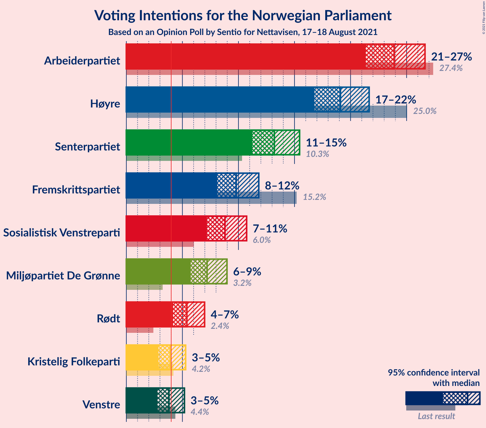

### Confidence Intervals

| Party | Last Result | Poll Result | 80% Confidence Interval | 90% Confidence Interval | 95% Confidence Interval | 99% Confidence Interval |
|:-----:|:-----------:|:-----------:|:-----------------------:|:-----------------------:|:-----------------------:|:-----------------------:|
| Arbeiderpartiet | 27.4% | 23.9% | 22.2–25.7% |21.8–26.2% |21.4–26.6% |20.6–27.5% |
| Høyre | 25.0% | 19.1% | 17.6–20.8% |17.1–21.2% |16.8–21.7% |16.1–22.5% |
| Senterpartiet | 10.3% | 13.2% | 11.9–14.7% |11.6–15.1% |11.2–15.5% |10.7–16.2% |
| Fremskrittspartiet | 15.2% | 9.8% | 8.7–11.1% |8.4–11.5% |8.1–11.8% |7.6–12.5% |
| Sosialistisk Venstreparti | 6.0% | 8.8% | 7.7–10.1% |7.4–10.4% |7.2–10.7% |6.7–11.4% |
| Miljøpartiet De Grønne | 3.2% | 7.2% | 6.2–8.4% |6.0–8.7% |5.7–9.0% |5.3–9.6% |
| Rødt | 2.4% | 5.4% | 4.6–6.4% |4.3–6.7% |4.2–7.0% |3.8–7.5% |
| Kristelig Folkeparti | 4.2% | 3.9% | 3.2–4.8% |3.0–5.1% |2.9–5.3% |2.6–5.8% |
| Venstre | 4.4% | 3.8% | 3.1–4.7% |2.9–5.0% |2.8–5.2% |2.5–5.6% |

*Note:* The poll result column reflects the actual value used in the calculations. Published results may vary slightly, and in addition be rounded to fewer digits.

## Seats

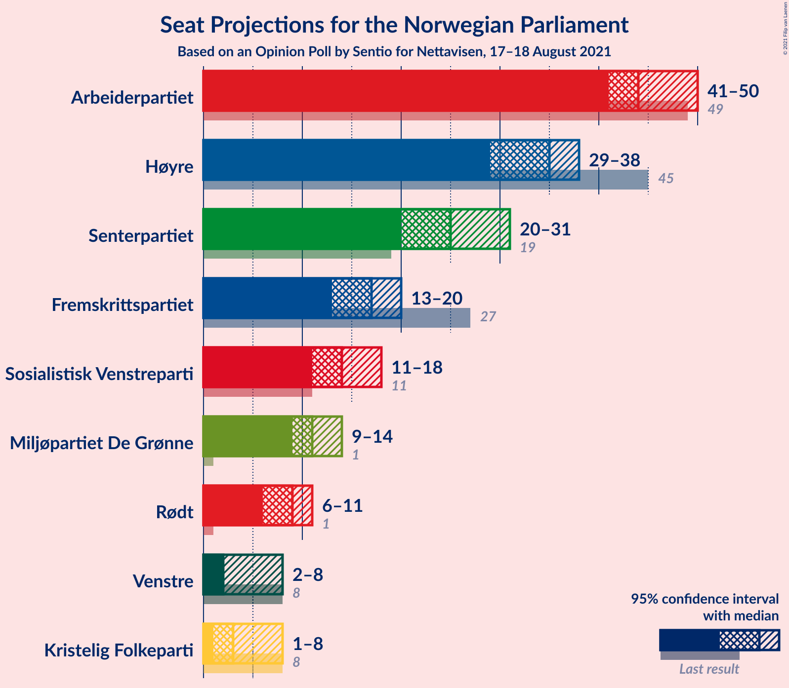

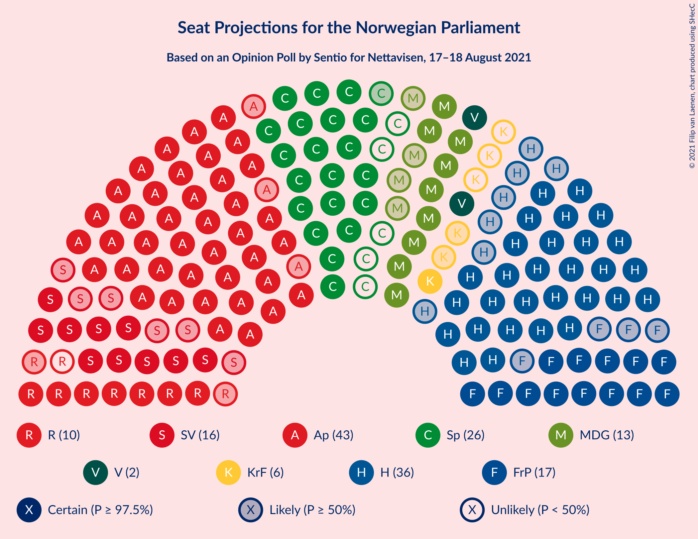

### Confidence Intervals

| Party | Last Result | Median | 80% Confidence Interval | 90% Confidence Interval | 95% Confidence Interval | 99% Confidence Interval |
|:-----:|:-----------:|:------:|:-----------------------:|:-----------------------:|:-----------------------:|:-----------------------:|
| <a href="#arbeiderpartiet">Arbeiderpartiet</a> | 49 | 43 | 41–46 |41–50 |40–51 |39–55 |
| <a href="#høyre">Høyre</a> | 45 | 36 | 31–36 |30–36 |29–38 |28–41 |
| <a href="#senterpartiet">Senterpartiet</a> | 19 | 21 | 21–28 |20–29 |20–29 |18–33 |
| <a href="#fremskrittspartiet">Fremskrittspartiet</a> | 27 | 17 | 14–20 |14–21 |13–21 |11–24 |
| <a href="#sosialistisk-venstreparti">Sosialistisk Venstreparti</a> | 11 | 16 | 12–17 |11–17 |10–17 |10–19 |
| <a href="#miljøpartiet-de-grønne">Miljøpartiet De Grønne</a> | 1 | 13 | 10–14 |9–14 |9–15 |8–16 |
| <a href="#rødt">Rødt</a> | 1 | 9 | 7–10 |7–10 |7–11 |2–12 |
| <a href="#kristelig-folkeparti">Kristelig Folkeparti</a> | 8 | 3 | 2–7 |1–8 |1–8 |1–9 |
| <a href="#venstre">Venstre</a> | 8 | 2 | 2–7 |2–8 |2–8 |2–8 |

### Arbeiderpartiet

*For a full overview of the results for this party, see the [Arbeiderpartiet](party-arbeiderpartiet.html) page.*

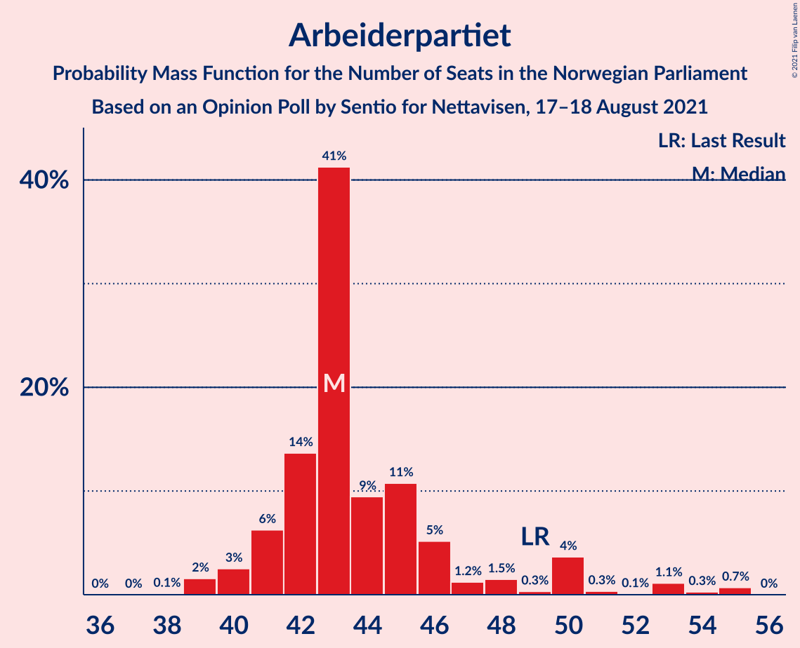

| Number of Seats | Probability | Accumulated | Special Marks |
|:---------------:|:-----------:|:-----------:|:-------------:|
| 38 | 0.1% | 100% |  |
| 39 | 2% | 99.9% |  |
| 40 | 3% | 98% |  |
| 41 | 6% | 96% |  |
| 42 | 14% | 90% |  |
| 43 | 41% | 76% | Median |
| 44 | 9% | 35% |  |
| 45 | 11% | 25% |  |
| 46 | 5% | 14% |  |
| 47 | 1.2% | 9% |  |
| 48 | 1.5% | 8% |  |
| 49 | 0.3% | 7% | Last Result |
| 50 | 4% | 6% |  |
| 51 | 0.3% | 3% |  |
| 52 | 0.1% | 2% |  |
| 53 | 1.1% | 2% |  |
| 54 | 0.3% | 1.0% |  |
| 55 | 0.7% | 0.7% |  |
| 56 | 0% | 0% |  |

### Høyre

*For a full overview of the results for this party, see the [Høyre](party-høyre.html) page.*

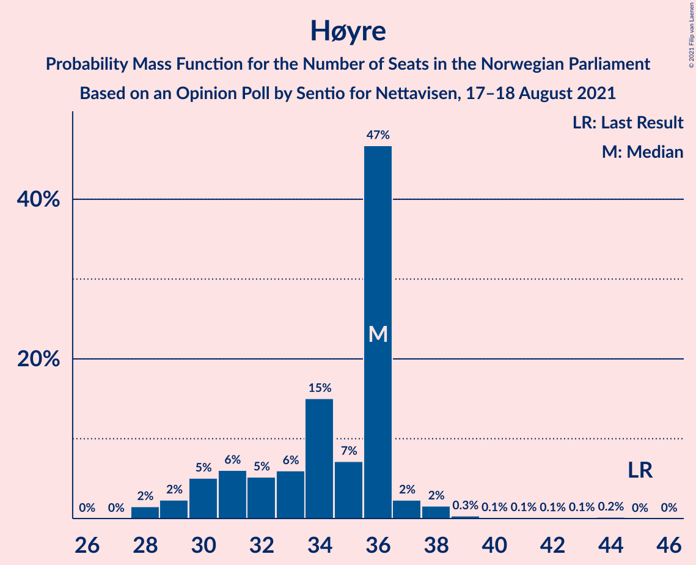

| Number of Seats | Probability | Accumulated | Special Marks |
|:---------------:|:-----------:|:-----------:|:-------------:|
| 28 | 2% | 100% |  |
| 29 | 2% | 98% |  |
| 30 | 5% | 96% |  |
| 31 | 6% | 91% |  |
| 32 | 5% | 85% |  |
| 33 | 6% | 80% |  |
| 34 | 15% | 74% |  |
| 35 | 7% | 59% |  |
| 36 | 47% | 52% | Median |
| 37 | 2% | 5% |  |
| 38 | 2% | 3% |  |
| 39 | 0.3% | 1.0% |  |
| 40 | 0.1% | 0.6% |  |
| 41 | 0.1% | 0.5% |  |
| 42 | 0.1% | 0.4% |  |
| 43 | 0.1% | 0.3% |  |
| 44 | 0.2% | 0.2% |  |
| 45 | 0% | 0% | Last Result |

### Senterpartiet

*For a full overview of the results for this party, see the [Senterpartiet](party-senterpartiet.html) page.*

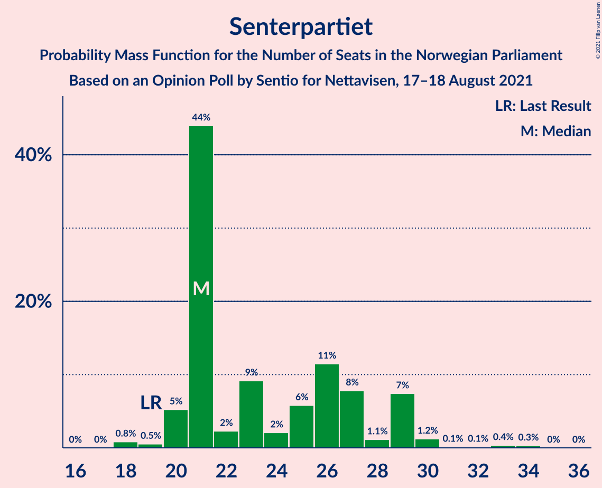

| Number of Seats | Probability | Accumulated | Special Marks |
|:---------------:|:-----------:|:-----------:|:-------------:|
| 18 | 0.8% | 100% |  |
| 19 | 0.5% | 99.2% | Last Result |
| 20 | 5% | 98.6% |  |
| 21 | 44% | 93% | Median |
| 22 | 2% | 49% |  |
| 23 | 9% | 47% |  |
| 24 | 2% | 38% |  |
| 25 | 6% | 36% |  |
| 26 | 11% | 30% |  |
| 27 | 8% | 19% |  |
| 28 | 1.1% | 11% |  |
| 29 | 7% | 10% |  |
| 30 | 1.2% | 2% |  |
| 31 | 0.1% | 0.9% |  |
| 32 | 0.1% | 0.8% |  |
| 33 | 0.4% | 0.7% |  |
| 34 | 0.3% | 0.3% |  |
| 35 | 0% | 0% |  |

### Fremskrittspartiet

*For a full overview of the results for this party, see the [Fremskrittspartiet](party-fremskrittspartiet.html) page.*

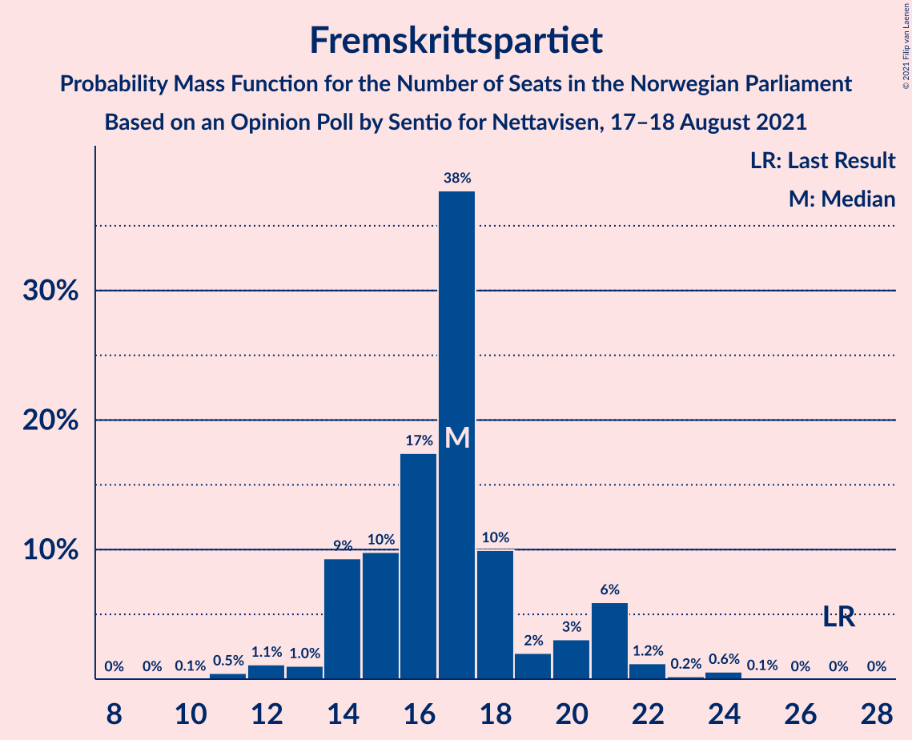

| Number of Seats | Probability | Accumulated | Special Marks |
|:---------------:|:-----------:|:-----------:|:-------------:|
| 10 | 0.1% | 100% |  |
| 11 | 0.5% | 99.9% |  |
| 12 | 1.1% | 99.5% |  |
| 13 | 1.0% | 98% |  |
| 14 | 9% | 97% |  |
| 15 | 10% | 88% |  |
| 16 | 17% | 78% |  |
| 17 | 38% | 61% | Median |
| 18 | 10% | 23% |  |
| 19 | 2% | 13% |  |
| 20 | 3% | 11% |  |
| 21 | 6% | 8% |  |
| 22 | 1.2% | 2% |  |
| 23 | 0.2% | 0.9% |  |
| 24 | 0.6% | 0.7% |  |
| 25 | 0.1% | 0.1% |  |
| 26 | 0% | 0% |  |
| 27 | 0% | 0% | Last Result |

### Sosialistisk Venstreparti

*For a full overview of the results for this party, see the [Sosialistisk Venstreparti](party-sosialistiskvenstreparti.html) page.*

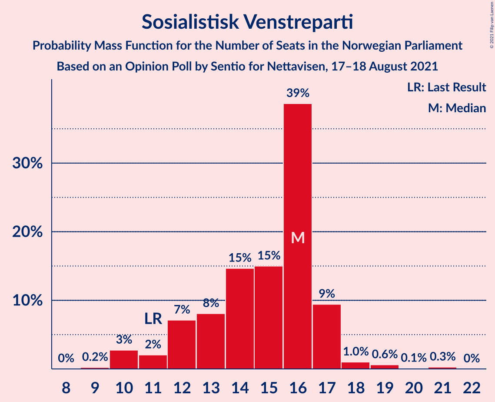

| Number of Seats | Probability | Accumulated | Special Marks |
|:---------------:|:-----------:|:-----------:|:-------------:|
| 9 | 0.2% | 100% |  |
| 10 | 3% | 99.7% |  |
| 11 | 2% | 97% | Last Result |
| 12 | 7% | 95% |  |
| 13 | 8% | 88% |  |
| 14 | 15% | 80% |  |
| 15 | 15% | 65% |  |
| 16 | 39% | 50% | Median |
| 17 | 9% | 11% |  |
| 18 | 1.0% | 2% |  |
| 19 | 0.6% | 1.0% |  |
| 20 | 0.1% | 0.4% |  |
| 21 | 0.3% | 0.3% |  |
| 22 | 0% | 0% |  |

### Miljøpartiet De Grønne

*For a full overview of the results for this party, see the [Miljøpartiet De Grønne](party-miljøpartietdegrønne.html) page.*

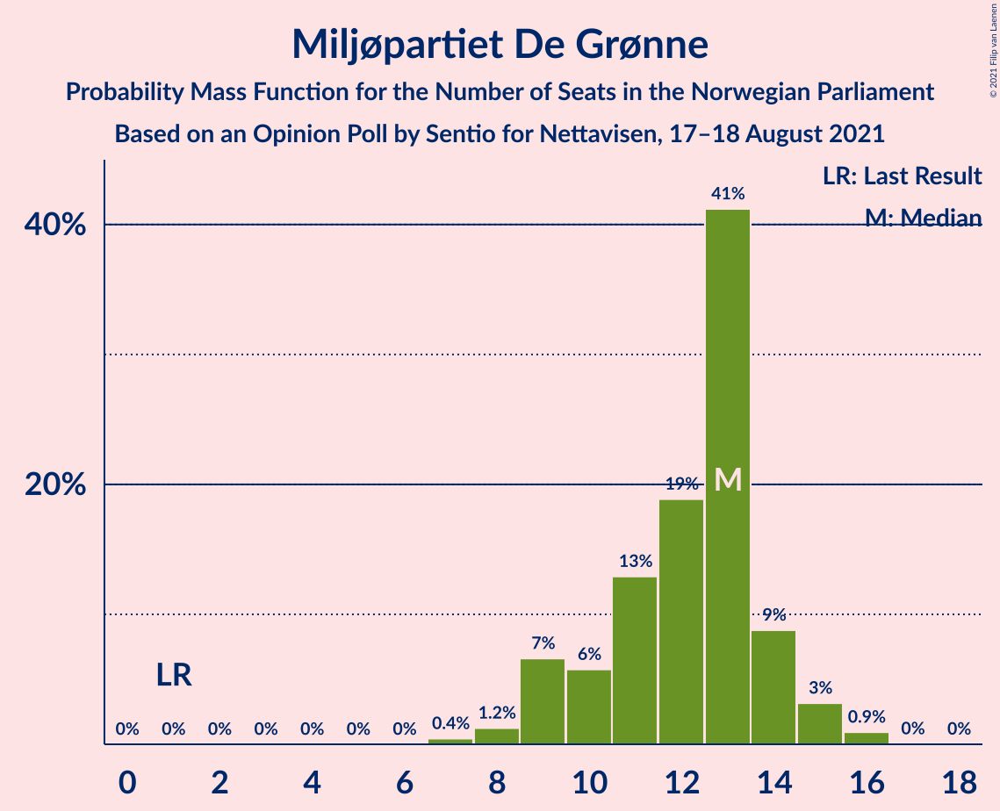

| Number of Seats | Probability | Accumulated | Special Marks |
|:---------------:|:-----------:|:-----------:|:-------------:|
| 1 | 0% | 100% | Last Result |
| 2 | 0% | 100% |  |
| 3 | 0% | 100% |  |
| 4 | 0% | 100% |  |
| 5 | 0% | 100% |  |
| 6 | 0% | 100% |  |
| 7 | 0.4% | 100% |  |
| 8 | 1.2% | 99.6% |  |
| 9 | 7% | 98% |  |
| 10 | 6% | 92% |  |
| 11 | 13% | 86% |  |
| 12 | 19% | 73% |  |
| 13 | 41% | 54% | Median |
| 14 | 9% | 13% |  |
| 15 | 3% | 4% |  |
| 16 | 0.9% | 1.0% |  |
| 17 | 0% | 0.1% |  |
| 18 | 0% | 0% |  |

### Rødt

*For a full overview of the results for this party, see the [Rødt](party-rødt.html) page.*

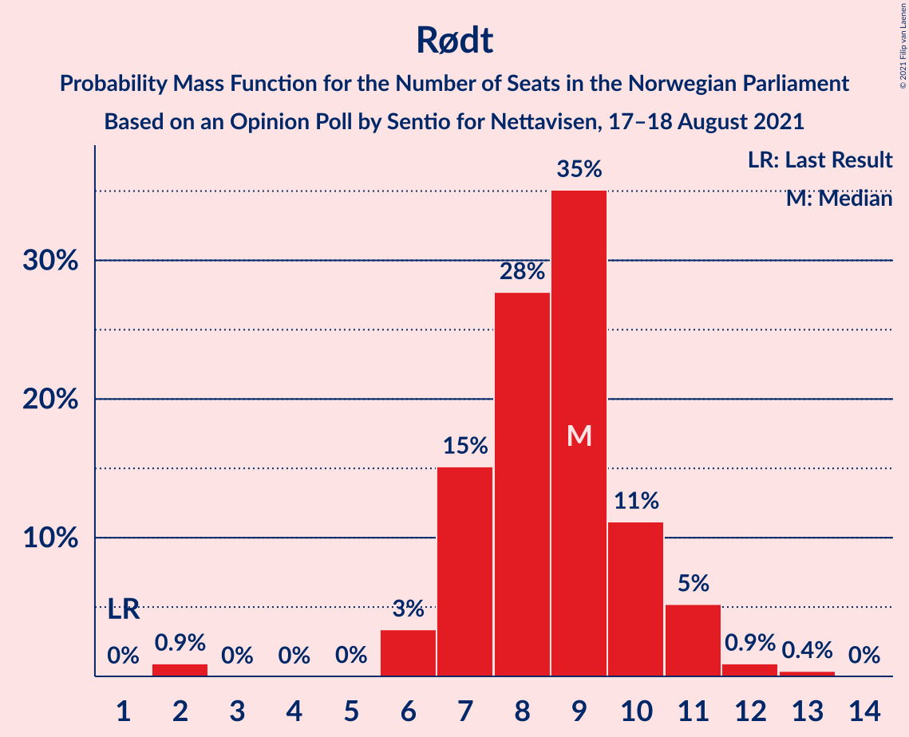

| Number of Seats | Probability | Accumulated | Special Marks |
|:---------------:|:-----------:|:-----------:|:-------------:|
| 1 | 0% | 100% | Last Result |
| 2 | 0.5% | 100% |  |
| 3 | 0% | 99.5% |  |
| 4 | 0% | 99.5% |  |
| 5 | 0% | 99.5% |  |
| 6 | 1.4% | 99.5% |  |
| 7 | 19% | 98% |  |
| 8 | 22% | 79% |  |
| 9 | 36% | 57% | Median |
| 10 | 16% | 21% |  |
| 11 | 4% | 5% |  |
| 12 | 0.9% | 1.0% |  |
| 13 | 0.1% | 0.2% |  |
| 14 | 0% | 0% |  |

### Kristelig Folkeparti

*For a full overview of the results for this party, see the [Kristelig Folkeparti](party-kristeligfolkeparti.html) page.*

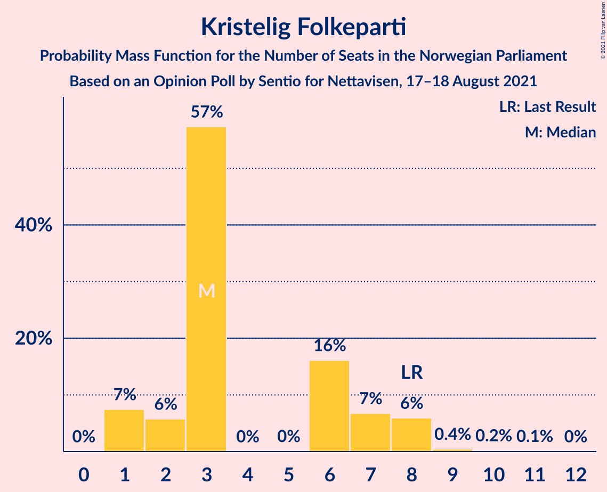

| Number of Seats | Probability | Accumulated | Special Marks |
|:---------------:|:-----------:|:-----------:|:-------------:|
| 1 | 7% | 100% |  |
| 2 | 6% | 93% |  |
| 3 | 57% | 87% | Median |
| 4 | 0% | 29% |  |
| 5 | 0% | 29% |  |
| 6 | 16% | 29% |  |
| 7 | 7% | 13% |  |
| 8 | 6% | 7% | Last Result |
| 9 | 0.4% | 0.7% |  |
| 10 | 0.2% | 0.2% |  |
| 11 | 0.1% | 0.1% |  |
| 12 | 0% | 0% |  |

### Venstre

*For a full overview of the results for this party, see the [Venstre](party-venstre.html) page.*

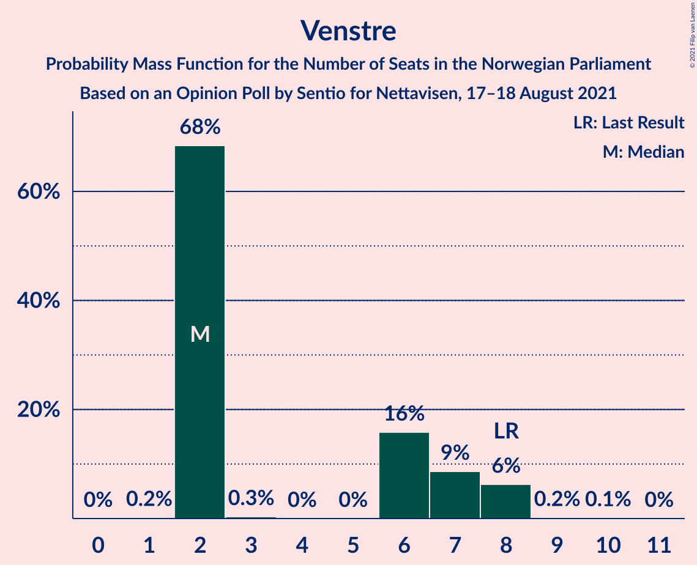

| Number of Seats | Probability | Accumulated | Special Marks |
|:---------------:|:-----------:|:-----------:|:-------------:|
| 1 | 0.2% | 100% |  |
| 2 | 68% | 99.8% | Median |
| 3 | 0.3% | 31% |  |
| 4 | 0% | 31% |  |
| 5 | 0% | 31% |  |
| 6 | 16% | 31% |  |
| 7 | 9% | 15% |  |
| 8 | 6% | 7% | Last Result |
| 9 | 0.2% | 0.3% |  |
| 10 | 0.1% | 0.1% |  |
| 11 | 0% | 0% |  |

## Coalitions

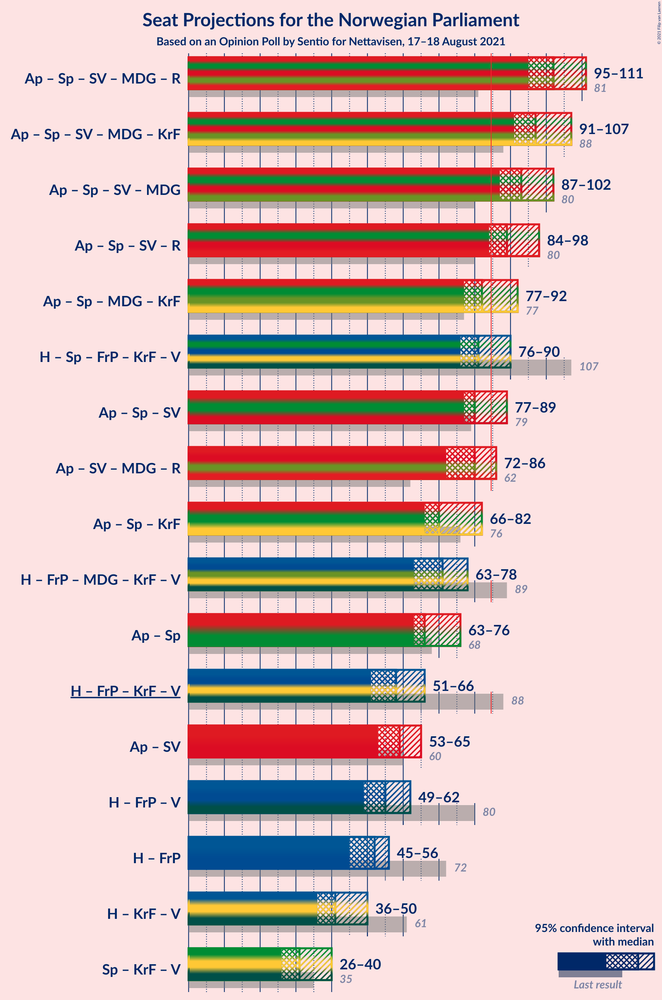

### Confidence Intervals

| Coalition | Last Result | Median | Majority? | 80% Confidence Interval | 90% Confidence Interval | 95% Confidence Interval | 99% Confidence Interval |
|:---------:|:-----------:|:------:|:---------:|:-----------------------:|:-----------------------:|:-----------------------:|:-----------------------:|
| Arbeiderpartiet – Senterpartiet – Sosialistisk Venstreparti – Miljøpartiet De Grønne – Rødt | 81 | 102 | 100% | 98–108 | 97–109 | 95–111 | 93–113 |
| Arbeiderpartiet – Senterpartiet – Sosialistisk Venstreparti – Miljøpartiet De Grønne – Kristelig Folkeparti | 88 | 97 | 100% | 95–103 | 93–105 | 91–107 | 88–108 |
| Arbeiderpartiet – Senterpartiet – Sosialistisk Venstreparti – Miljøpartiet De Grønne | 80 | 93 | 99.8% | 91–100 | 88–100 | 87–102 | 85–104 |
| Arbeiderpartiet – Senterpartiet – Sosialistisk Venstreparti – Rødt | 80 | 89 | 91% | 85–95 | 84–97 | 84–98 | 83–100 |
| Arbeiderpartiet – Senterpartiet – Miljøpartiet De Grønne – Kristelig Folkeparti | 77 | 82 | 33% | 79–88 | 79–91 | 77–92 | 76–93 |
| Høyre – Senterpartiet – Fremskrittspartiet – Kristelig Folkeparti – Venstre | 107 | 81 | 28% | 78–86 | 77–88 | 76–90 | 74–93 |
| Arbeiderpartiet – Senterpartiet – Sosialistisk Venstreparti | 79 | 80 | 24% | 77–87 | 77–88 | 77–89 | 74–91 |
| Arbeiderpartiet – Sosialistisk Venstreparti – Miljøpartiet De Grønne – Rødt | 62 | 80 | 5% | 75–84 | 74–84 | 72–86 | 70–90 |
| Arbeiderpartiet – Senterpartiet – Kristelig Folkeparti | 76 | 70 | 0% | 67–77 | 66–79 | 66–82 | 64–83 |
| Høyre – Fremskrittspartiet – Miljøpartiet De Grønne – Kristelig Folkeparti – Venstre | 89 | 71 | 0% | 66–77 | 64–78 | 63–78 | 63–79 |
| Arbeiderpartiet – Senterpartiet | 68 | 66 | 0% | 63–72 | 63–75 | 63–76 | 61–78 |
| Høyre – Fremskrittspartiet – Kristelig Folkeparti – Venstre | 88 | 58 | 0% | 54–64 | 53–65 | 51–66 | 51–68 |
| Arbeiderpartiet – Sosialistisk Venstreparti | 60 | 59 | 0% | 56–61 | 55–63 | 53–65 | 51–68 |
| Høyre – Fremskrittspartiet – Venstre | 80 | 55 | 0% | 51–59 | 50–61 | 49–62 | 45–63 |
| Høyre – Fremskrittspartiet | 72 | 52 | 0% | 48–53 | 45–55 | 45–56 | 43–60 |
| Høyre – Kristelig Folkeparti – Venstre | 61 | 41 | 0% | 38–48 | 36–48 | 36–50 | 36–52 |
| Senterpartiet – Kristelig Folkeparti – Venstre | 35 | 31 | 0% | 26–37 | 26–38 | 26–40 | 25–44 |

### Arbeiderpartiet – Senterpartiet – Sosialistisk Venstreparti – Miljøpartiet De Grønne – Rødt

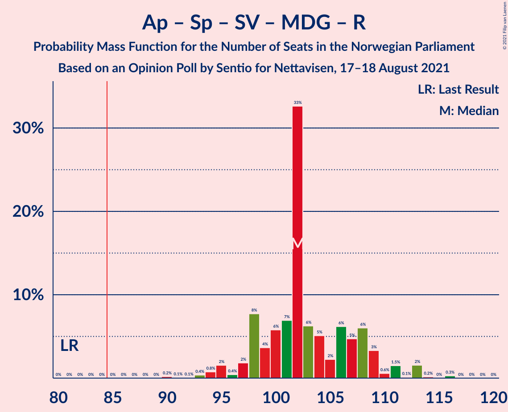

| Number of Seats | Probability | Accumulated | Special Marks |
|:---------------:|:-----------:|:-----------:|:-------------:|
| 81 | 0% | 100% | Last Result |
| 82 | 0% | 100% |  |
| 83 | 0% | 100% |  |
| 84 | 0% | 100% |  |
| 85 | 0% | 100% | Majority |
| 86 | 0% | 100% |  |
| 87 | 0% | 100% |  |
| 88 | 0% | 100% |  |
| 89 | 0% | 100% |  |
| 90 | 0.2% | 100% |  |
| 91 | 0.1% | 99.8% |  |
| 92 | 0.1% | 99.7% |  |
| 93 | 0.4% | 99.7% |  |
| 94 | 0.8% | 99.3% |  |
| 95 | 2% | 98.6% |  |
| 96 | 0.4% | 97% |  |
| 97 | 2% | 97% |  |
| 98 | 8% | 95% |  |
| 99 | 4% | 87% |  |
| 100 | 6% | 83% |  |
| 101 | 7% | 78% |  |
| 102 | 33% | 71% | Median |
| 103 | 6% | 38% |  |
| 104 | 5% | 32% |  |
| 105 | 2% | 27% |  |
| 106 | 6% | 24% |  |
| 107 | 5% | 18% |  |
| 108 | 6% | 14% |  |
| 109 | 3% | 7% |  |
| 110 | 0.6% | 4% |  |
| 111 | 1.5% | 4% |  |
| 112 | 0.1% | 2% |  |
| 113 | 2% | 2% |  |
| 114 | 0.2% | 0.4% |  |
| 115 | 0% | 0.3% |  |
| 116 | 0.3% | 0.3% |  |
| 117 | 0% | 0% |  |

### Arbeiderpartiet – Senterpartiet – Sosialistisk Venstreparti – Miljøpartiet De Grønne – Kristelig Folkeparti

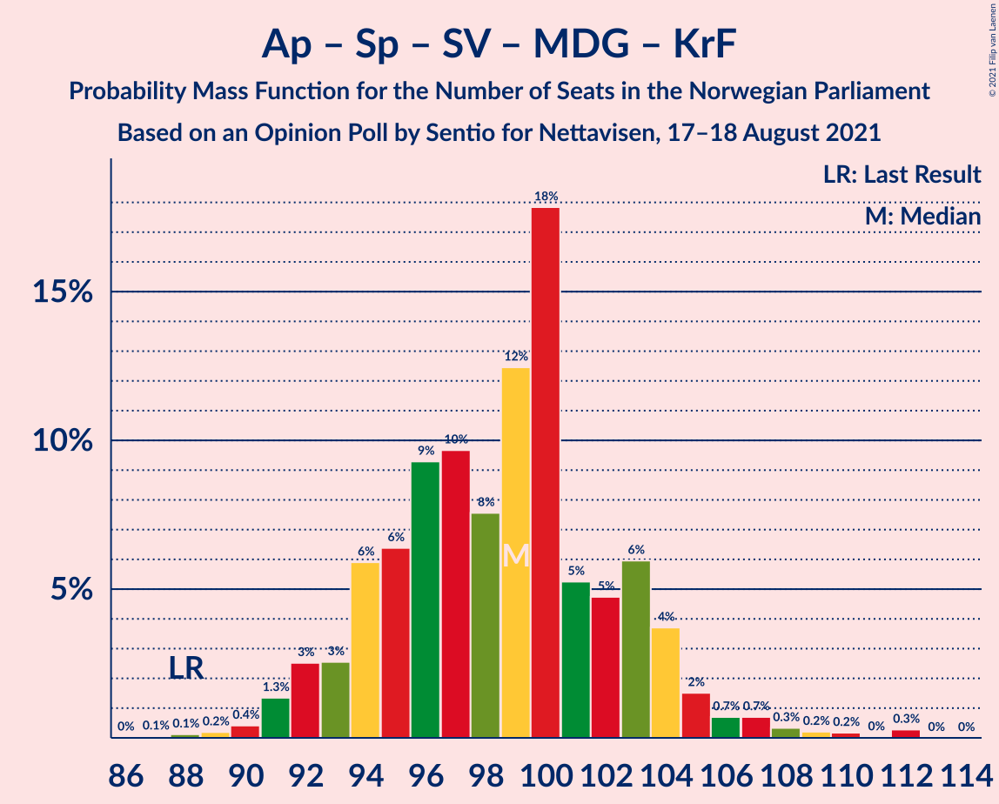

| Number of Seats | Probability | Accumulated | Special Marks |
|:---------------:|:-----------:|:-----------:|:-------------:|
| 87 | 0.1% | 100% |  |
| 88 | 0.5% | 99.9% | Last Result |
| 89 | 0.1% | 99.4% |  |
| 90 | 0.5% | 99.3% |  |
| 91 | 2% | 98.8% |  |
| 92 | 0.3% | 97% |  |
| 93 | 4% | 97% |  |
| 94 | 2% | 93% |  |
| 95 | 11% | 91% |  |
| 96 | 28% | 80% | Median |
| 97 | 9% | 52% |  |
| 98 | 3% | 43% |  |
| 99 | 6% | 40% |  |
| 100 | 9% | 35% |  |
| 101 | 8% | 26% |  |
| 102 | 3% | 18% |  |
| 103 | 8% | 15% |  |
| 104 | 2% | 7% |  |
| 105 | 0.3% | 5% |  |
| 106 | 1.1% | 5% |  |
| 107 | 3% | 4% |  |
| 108 | 0.8% | 1.2% |  |
| 109 | 0.3% | 0.4% |  |
| 110 | 0% | 0.1% |  |
| 111 | 0.1% | 0.1% |  |
| 112 | 0% | 0% |  |

### Arbeiderpartiet – Senterpartiet – Sosialistisk Venstreparti – Miljøpartiet De Grønne

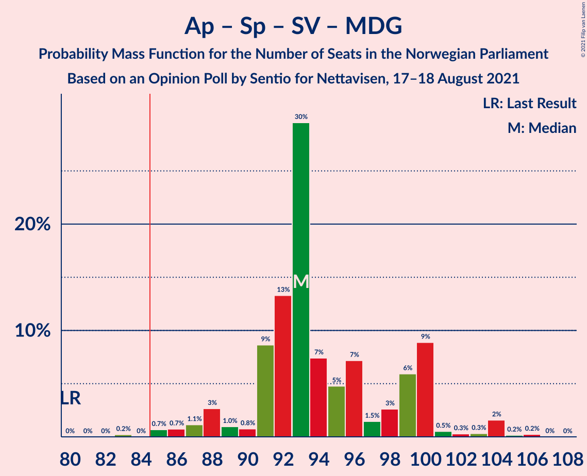

| Number of Seats | Probability | Accumulated | Special Marks |
|:---------------:|:-----------:|:-----------:|:-------------:|
| 80 | 0% | 100% | Last Result |
| 81 | 0% | 100% |  |
| 82 | 0% | 100% |  |
| 83 | 0.2% | 100% |  |
| 84 | 0% | 99.8% |  |
| 85 | 0.7% | 99.8% | Majority |
| 86 | 0.7% | 99.1% |  |
| 87 | 1.1% | 98% |  |
| 88 | 3% | 97% |  |
| 89 | 1.0% | 95% |  |
| 90 | 0.8% | 94% |  |
| 91 | 9% | 93% |  |
| 92 | 13% | 84% |  |
| 93 | 30% | 71% | Median |
| 94 | 7% | 41% |  |
| 95 | 5% | 34% |  |
| 96 | 7% | 29% |  |
| 97 | 1.5% | 22% |  |
| 98 | 3% | 21% |  |
| 99 | 6% | 18% |  |
| 100 | 9% | 12% |  |
| 101 | 0.5% | 3% |  |
| 102 | 0.3% | 3% |  |
| 103 | 0.3% | 2% |  |
| 104 | 2% | 2% |  |
| 105 | 0.2% | 0.4% |  |
| 106 | 0.2% | 0.3% |  |
| 107 | 0% | 0% |  |

### Arbeiderpartiet – Senterpartiet – Sosialistisk Venstreparti – Rødt

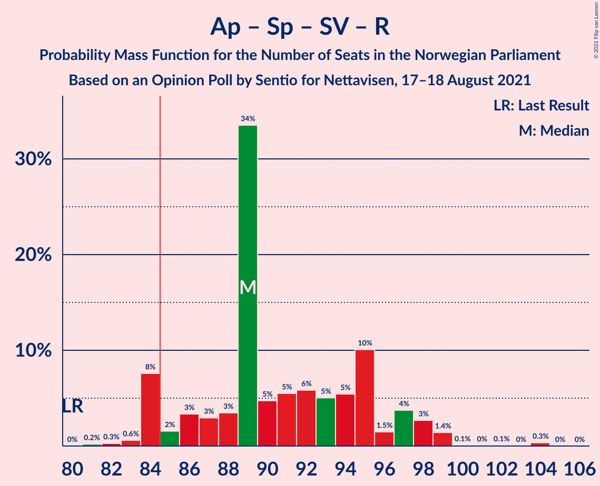

| Number of Seats | Probability | Accumulated | Special Marks |
|:---------------:|:-----------:|:-----------:|:-------------:|
| 80 | 0% | 100% | Last Result |
| 81 | 0.2% | 100% |  |
| 82 | 0.3% | 99.8% |  |
| 83 | 0.6% | 99.5% |  |
| 84 | 8% | 98.9% |  |
| 85 | 2% | 91% | Majority |
| 86 | 3% | 90% |  |
| 87 | 3% | 86% |  |
| 88 | 3% | 83% |  |
| 89 | 34% | 80% | Median |
| 90 | 5% | 46% |  |
| 91 | 5% | 42% |  |
| 92 | 6% | 36% |  |
| 93 | 5% | 30% |  |
| 94 | 5% | 25% |  |
| 95 | 10% | 20% |  |
| 96 | 1.5% | 10% |  |
| 97 | 4% | 8% |  |
| 98 | 3% | 5% |  |
| 99 | 1.4% | 2% |  |
| 100 | 0.1% | 0.5% |  |
| 101 | 0% | 0.5% |  |
| 102 | 0.1% | 0.4% |  |
| 103 | 0% | 0.4% |  |
| 104 | 0.3% | 0.3% |  |
| 105 | 0% | 0% |  |

### Arbeiderpartiet – Senterpartiet – Miljøpartiet De Grønne – Kristelig Folkeparti

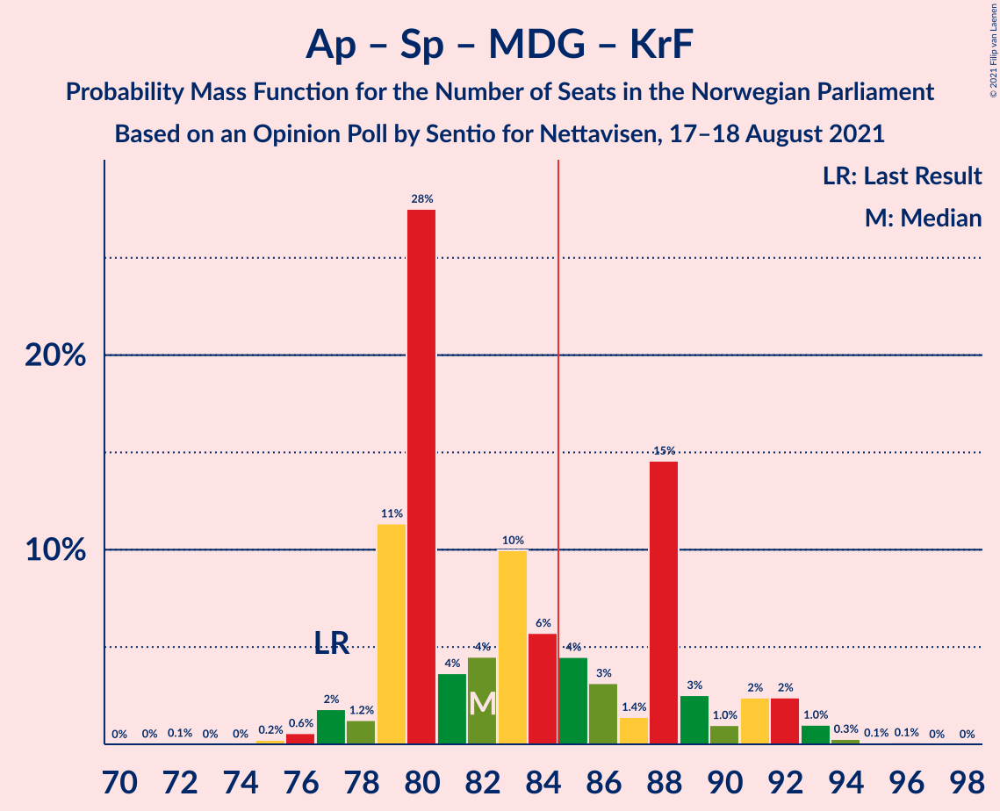

| Number of Seats | Probability | Accumulated | Special Marks |
|:---------------:|:-----------:|:-----------:|:-------------:|
| 72 | 0.1% | 100% |  |
| 73 | 0% | 99.9% |  |
| 74 | 0% | 99.9% |  |
| 75 | 0.2% | 99.9% |  |
| 76 | 0.6% | 99.6% |  |
| 77 | 2% | 99.1% | Last Result |
| 78 | 1.2% | 97% |  |
| 79 | 11% | 96% |  |
| 80 | 28% | 85% | Median |
| 81 | 4% | 57% |  |
| 82 | 4% | 54% |  |
| 83 | 10% | 49% |  |
| 84 | 6% | 39% |  |
| 85 | 4% | 33% | Majority |
| 86 | 3% | 29% |  |
| 87 | 1.4% | 26% |  |
| 88 | 15% | 24% |  |
| 89 | 3% | 10% |  |
| 90 | 1.0% | 7% |  |
| 91 | 2% | 6% |  |
| 92 | 2% | 4% |  |
| 93 | 1.0% | 1.4% |  |
| 94 | 0.3% | 0.5% |  |
| 95 | 0.1% | 0.2% |  |
| 96 | 0.1% | 0.1% |  |
| 97 | 0% | 0% |  |

### Høyre – Senterpartiet – Fremskrittspartiet – Kristelig Folkeparti – Venstre

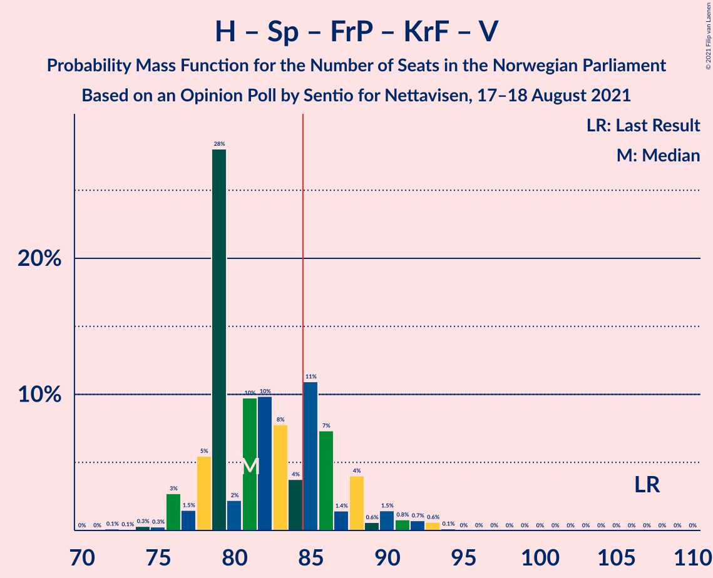

| Number of Seats | Probability | Accumulated | Special Marks |
|:---------------:|:-----------:|:-----------:|:-------------:|
| 72 | 0.1% | 100% |  |
| 73 | 0.1% | 99.8% |  |
| 74 | 0.3% | 99.8% |  |
| 75 | 0.3% | 99.4% |  |
| 76 | 3% | 99.2% |  |
| 77 | 1.5% | 96% |  |
| 78 | 5% | 95% |  |
| 79 | 28% | 89% | Median |
| 80 | 2% | 61% |  |
| 81 | 10% | 59% |  |
| 82 | 10% | 49% |  |
| 83 | 8% | 40% |  |
| 84 | 4% | 32% |  |
| 85 | 11% | 28% | Majority |
| 86 | 7% | 17% |  |
| 87 | 1.4% | 10% |  |
| 88 | 4% | 8% |  |
| 89 | 0.6% | 4% |  |
| 90 | 1.5% | 4% |  |
| 91 | 0.8% | 2% |  |
| 92 | 0.7% | 1.5% |  |
| 93 | 0.6% | 0.8% |  |
| 94 | 0.1% | 0.2% |  |
| 95 | 0% | 0% |  |
| 96 | 0% | 0% |  |
| 97 | 0% | 0% |  |
| 98 | 0% | 0% |  |
| 99 | 0% | 0% |  |
| 100 | 0% | 0% |  |
| 101 | 0% | 0% |  |
| 102 | 0% | 0% |  |
| 103 | 0% | 0% |  |
| 104 | 0% | 0% |  |
| 105 | 0% | 0% |  |
| 106 | 0% | 0% |  |
| 107 | 0% | 0% | Last Result |

### Arbeiderpartiet – Senterpartiet – Sosialistisk Venstreparti

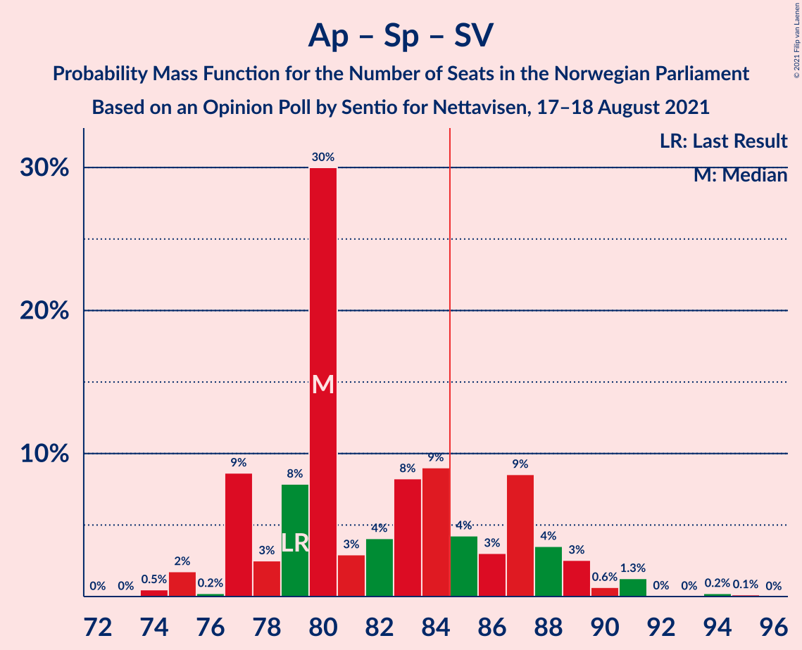

| Number of Seats | Probability | Accumulated | Special Marks |
|:---------------:|:-----------:|:-----------:|:-------------:|
| 74 | 0.5% | 100% |  |
| 75 | 2% | 99.5% |  |
| 76 | 0.2% | 98% |  |
| 77 | 9% | 98% |  |
| 78 | 3% | 89% |  |
| 79 | 8% | 86% | Last Result |
| 80 | 30% | 78% | Median |
| 81 | 3% | 48% |  |
| 82 | 4% | 46% |  |
| 83 | 8% | 41% |  |
| 84 | 9% | 33% |  |
| 85 | 4% | 24% | Majority |
| 86 | 3% | 20% |  |
| 87 | 9% | 17% |  |
| 88 | 4% | 8% |  |
| 89 | 3% | 5% |  |
| 90 | 0.6% | 2% |  |
| 91 | 1.3% | 2% |  |
| 92 | 0% | 0.4% |  |
| 93 | 0% | 0.4% |  |
| 94 | 0.2% | 0.4% |  |
| 95 | 0.1% | 0.1% |  |
| 96 | 0% | 0% |  |

### Arbeiderpartiet – Sosialistisk Venstreparti – Miljøpartiet De Grønne – Rødt

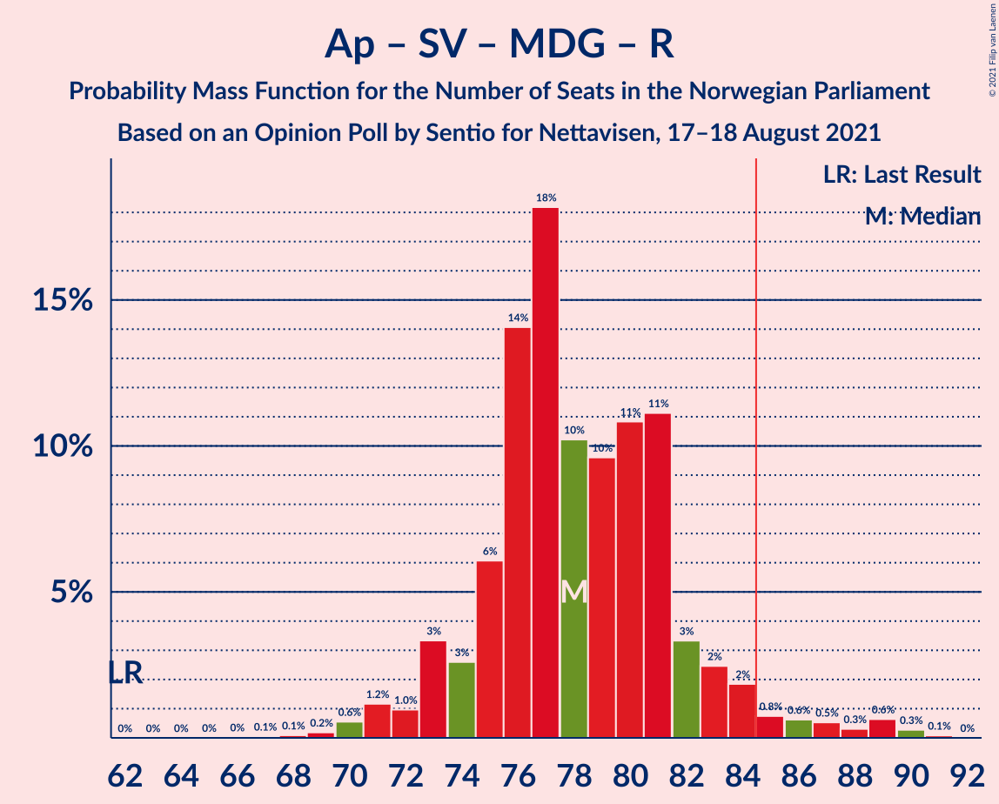

| Number of Seats | Probability | Accumulated | Special Marks |
|:---------------:|:-----------:|:-----------:|:-------------:|
| 62 | 0% | 100% | Last Result |
| 63 | 0% | 100% |  |
| 64 | 0% | 100% |  |
| 65 | 0% | 100% |  |
| 66 | 0% | 100% |  |
| 67 | 0% | 100% |  |
| 68 | 0% | 100% |  |
| 69 | 0.3% | 99.9% |  |
| 70 | 0.5% | 99.7% |  |
| 71 | 1.1% | 99.2% |  |
| 72 | 1.5% | 98% |  |
| 73 | 0.8% | 97% |  |
| 74 | 4% | 96% |  |
| 75 | 6% | 92% |  |
| 76 | 5% | 86% |  |
| 77 | 9% | 81% |  |
| 78 | 2% | 71% |  |
| 79 | 10% | 70% |  |
| 80 | 13% | 60% |  |
| 81 | 34% | 47% | Median |
| 82 | 1.0% | 13% |  |
| 83 | 1.5% | 12% |  |
| 84 | 6% | 10% |  |
| 85 | 2% | 5% | Majority |
| 86 | 0.6% | 3% |  |
| 87 | 0.5% | 2% |  |
| 88 | 0.5% | 1.4% |  |
| 89 | 0.3% | 0.9% |  |
| 90 | 0.3% | 0.5% |  |
| 91 | 0.2% | 0.3% |  |
| 92 | 0% | 0% |  |

### Arbeiderpartiet – Senterpartiet – Kristelig Folkeparti

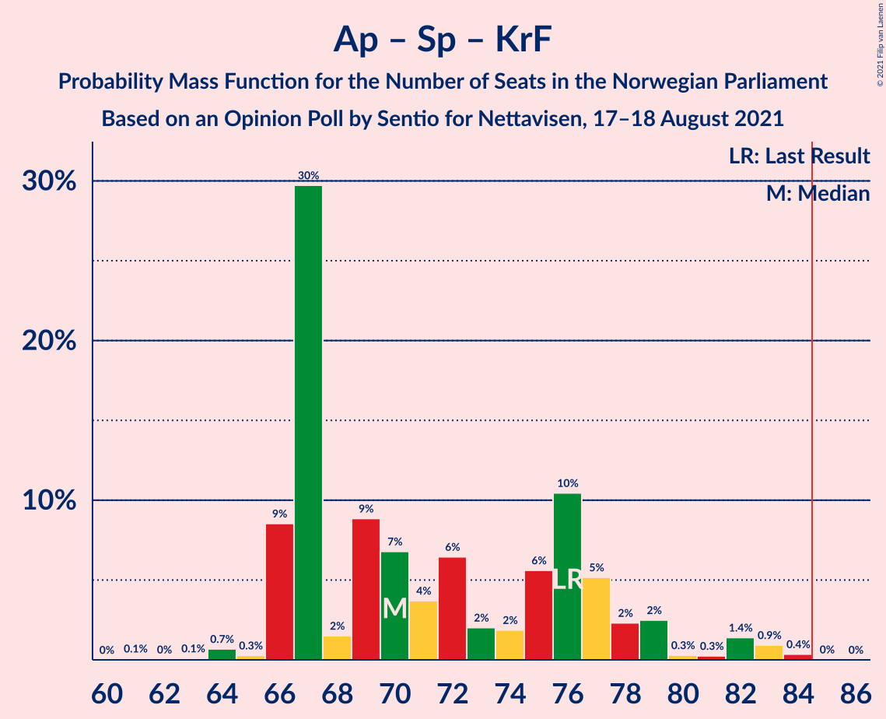

| Number of Seats | Probability | Accumulated | Special Marks |
|:---------------:|:-----------:|:-----------:|:-------------:|
| 61 | 0.1% | 100% |  |
| 62 | 0% | 99.9% |  |
| 63 | 0.1% | 99.9% |  |
| 64 | 0.7% | 99.8% |  |
| 65 | 0.3% | 99.1% |  |
| 66 | 9% | 98.8% |  |
| 67 | 30% | 90% | Median |
| 68 | 2% | 61% |  |
| 69 | 9% | 59% |  |
| 70 | 7% | 50% |  |
| 71 | 4% | 43% |  |
| 72 | 6% | 40% |  |
| 73 | 2% | 33% |  |
| 74 | 2% | 31% |  |
| 75 | 6% | 29% |  |
| 76 | 10% | 24% | Last Result |
| 77 | 5% | 13% |  |
| 78 | 2% | 8% |  |
| 79 | 2% | 6% |  |
| 80 | 0.3% | 3% |  |
| 81 | 0.3% | 3% |  |
| 82 | 1.4% | 3% |  |
| 83 | 0.9% | 1.3% |  |
| 84 | 0.4% | 0.4% |  |
| 85 | 0% | 0% | Majority |

### Høyre – Fremskrittspartiet – Miljøpartiet De Grønne – Kristelig Folkeparti – Venstre

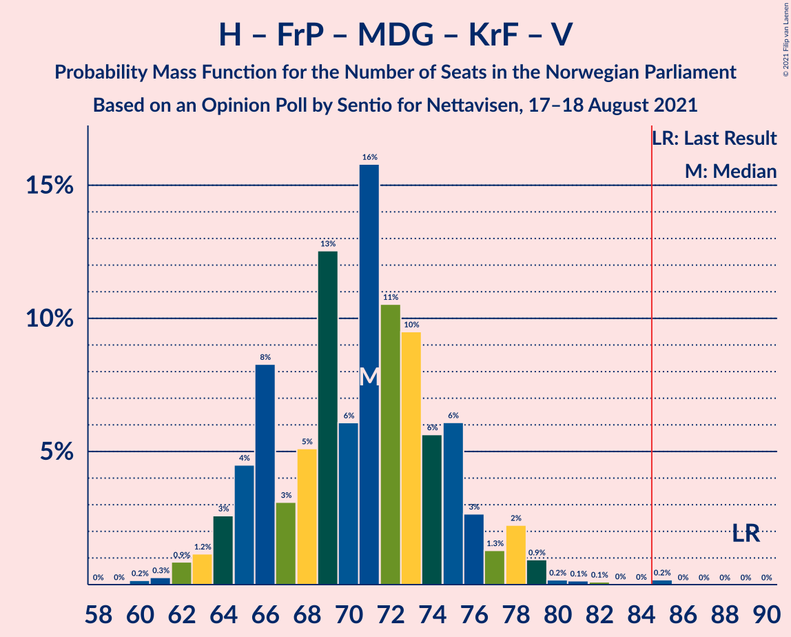

| Number of Seats | Probability | Accumulated | Special Marks |
|:---------------:|:-----------:|:-----------:|:-------------:|
| 60 | 0.1% | 100% |  |
| 61 | 0.1% | 99.9% |  |
| 62 | 0.2% | 99.8% |  |
| 63 | 4% | 99.6% |  |
| 64 | 0.8% | 95% |  |
| 65 | 2% | 95% |  |
| 66 | 5% | 93% |  |
| 67 | 6% | 88% |  |
| 68 | 7% | 82% |  |
| 69 | 4% | 74% |  |
| 70 | 11% | 71% |  |
| 71 | 34% | 60% | Median |
| 72 | 1.5% | 26% |  |
| 73 | 2% | 24% |  |
| 74 | 4% | 22% |  |
| 75 | 5% | 18% |  |
| 76 | 2% | 13% |  |
| 77 | 1.1% | 11% |  |
| 78 | 9% | 10% |  |
| 79 | 0.3% | 0.7% |  |
| 80 | 0.2% | 0.5% |  |
| 81 | 0.2% | 0.3% |  |
| 82 | 0% | 0.1% |  |
| 83 | 0% | 0% |  |
| 84 | 0% | 0% |  |
| 85 | 0% | 0% | Majority |
| 86 | 0% | 0% |  |
| 87 | 0% | 0% |  |
| 88 | 0% | 0% |  |
| 89 | 0% | 0% | Last Result |

### Arbeiderpartiet – Senterpartiet

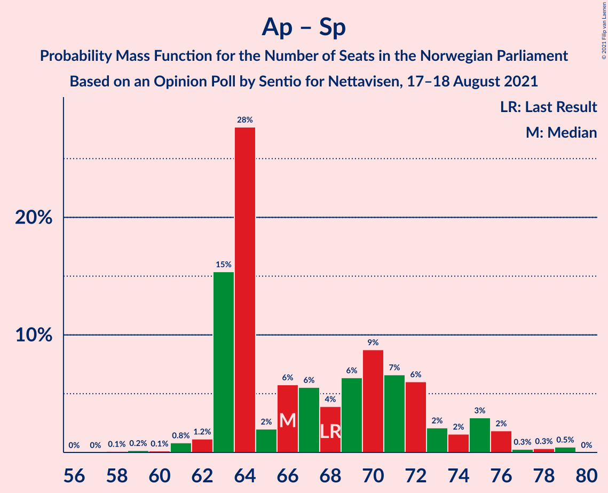

| Number of Seats | Probability | Accumulated | Special Marks |
|:---------------:|:-----------:|:-----------:|:-------------:|
| 58 | 0.1% | 100% |  |
| 59 | 0.2% | 99.9% |  |
| 60 | 0.1% | 99.7% |  |
| 61 | 0.8% | 99.6% |  |
| 62 | 1.2% | 98.8% |  |
| 63 | 15% | 98% |  |
| 64 | 28% | 82% | Median |
| 65 | 2% | 55% |  |
| 66 | 6% | 53% |  |
| 67 | 6% | 47% |  |
| 68 | 4% | 41% | Last Result |
| 69 | 6% | 37% |  |
| 70 | 9% | 31% |  |
| 71 | 7% | 22% |  |
| 72 | 6% | 16% |  |
| 73 | 2% | 10% |  |
| 74 | 2% | 7% |  |
| 75 | 3% | 6% |  |
| 76 | 2% | 3% |  |
| 77 | 0.3% | 1.1% |  |
| 78 | 0.3% | 0.8% |  |
| 79 | 0.5% | 0.5% |  |
| 80 | 0% | 0% |  |

### Høyre – Fremskrittspartiet – Kristelig Folkeparti – Venstre

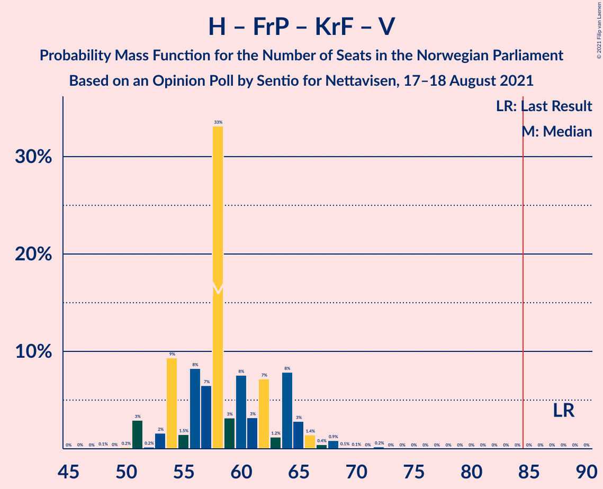

| Number of Seats | Probability | Accumulated | Special Marks |
|:---------------:|:-----------:|:-----------:|:-------------:|
| 48 | 0.1% | 100% |  |
| 49 | 0% | 99.9% |  |
| 50 | 0.2% | 99.8% |  |
| 51 | 3% | 99.7% |  |
| 52 | 0.2% | 97% |  |
| 53 | 2% | 97% |  |
| 54 | 9% | 95% |  |
| 55 | 1.5% | 86% |  |
| 56 | 8% | 84% |  |
| 57 | 7% | 76% |  |
| 58 | 33% | 69% | Median |
| 59 | 3% | 36% |  |
| 60 | 8% | 33% |  |
| 61 | 3% | 25% |  |
| 62 | 7% | 22% |  |
| 63 | 1.2% | 15% |  |
| 64 | 8% | 14% |  |
| 65 | 3% | 6% |  |
| 66 | 1.4% | 3% |  |
| 67 | 0.4% | 2% |  |
| 68 | 0.9% | 1.3% |  |
| 69 | 0.1% | 0.4% |  |
| 70 | 0.1% | 0.3% |  |
| 71 | 0% | 0.2% |  |
| 72 | 0.2% | 0.2% |  |
| 73 | 0% | 0% |  |
| 74 | 0% | 0% |  |
| 75 | 0% | 0% |  |
| 76 | 0% | 0% |  |
| 77 | 0% | 0% |  |
| 78 | 0% | 0% |  |
| 79 | 0% | 0% |  |
| 80 | 0% | 0% |  |
| 81 | 0% | 0% |  |
| 82 | 0% | 0% |  |
| 83 | 0% | 0% |  |
| 84 | 0% | 0% |  |
| 85 | 0% | 0% | Majority |
| 86 | 0% | 0% |  |
| 87 | 0% | 0% |  |
| 88 | 0% | 0% | Last Result |

### Arbeiderpartiet – Sosialistisk Venstreparti

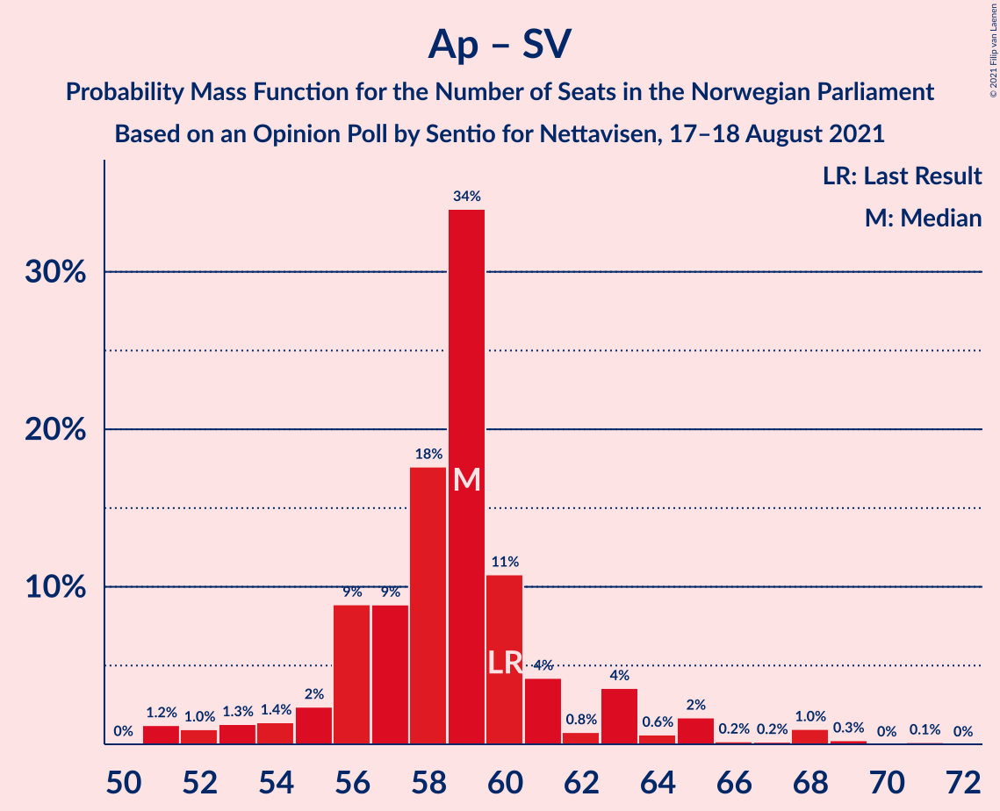

| Number of Seats | Probability | Accumulated | Special Marks |
|:---------------:|:-----------:|:-----------:|:-------------:|
| 51 | 1.2% | 100% |  |
| 52 | 1.0% | 98.7% |  |
| 53 | 1.3% | 98% |  |
| 54 | 1.4% | 97% |  |
| 55 | 2% | 95% |  |
| 56 | 9% | 93% |  |
| 57 | 9% | 84% |  |
| 58 | 18% | 75% |  |
| 59 | 34% | 57% | Median |
| 60 | 11% | 23% | Last Result |
| 61 | 4% | 13% |  |
| 62 | 0.8% | 8% |  |
| 63 | 4% | 8% |  |
| 64 | 0.6% | 4% |  |
| 65 | 2% | 3% |  |
| 66 | 0.2% | 2% |  |
| 67 | 0.2% | 2% |  |
| 68 | 1.0% | 1.4% |  |
| 69 | 0.3% | 0.4% |  |
| 70 | 0% | 0.1% |  |
| 71 | 0.1% | 0.1% |  |
| 72 | 0% | 0% |  |

### Høyre – Fremskrittspartiet – Venstre

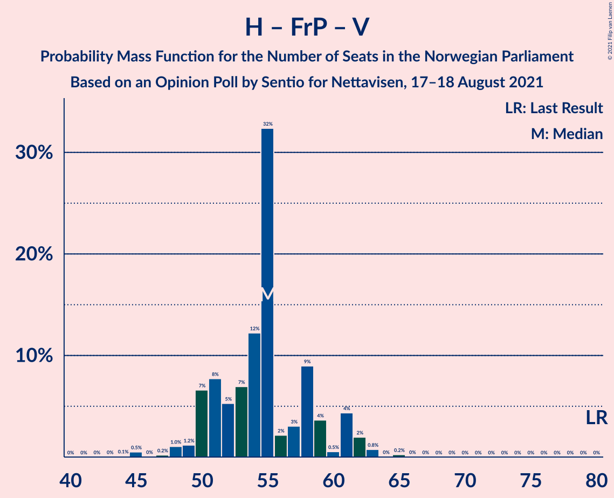

| Number of Seats | Probability | Accumulated | Special Marks |
|:---------------:|:-----------:|:-----------:|:-------------:|
| 44 | 0.1% | 100% |  |
| 45 | 0.5% | 99.9% |  |
| 46 | 0% | 99.4% |  |
| 47 | 0.2% | 99.3% |  |
| 48 | 1.0% | 99.1% |  |
| 49 | 1.2% | 98% |  |
| 50 | 7% | 97% |  |
| 51 | 8% | 90% |  |
| 52 | 5% | 83% |  |
| 53 | 7% | 77% |  |
| 54 | 12% | 70% |  |
| 55 | 32% | 58% | Median |
| 56 | 2% | 26% |  |
| 57 | 3% | 24% |  |
| 58 | 9% | 21% |  |
| 59 | 4% | 12% |  |
| 60 | 0.5% | 8% |  |
| 61 | 4% | 7% |  |
| 62 | 2% | 3% |  |
| 63 | 0.8% | 1.1% |  |
| 64 | 0% | 0.3% |  |
| 65 | 0.2% | 0.3% |  |
| 66 | 0% | 0.1% |  |
| 67 | 0% | 0% |  |
| 68 | 0% | 0% |  |
| 69 | 0% | 0% |  |
| 70 | 0% | 0% |  |
| 71 | 0% | 0% |  |
| 72 | 0% | 0% |  |
| 73 | 0% | 0% |  |
| 74 | 0% | 0% |  |
| 75 | 0% | 0% |  |
| 76 | 0% | 0% |  |
| 77 | 0% | 0% |  |
| 78 | 0% | 0% |  |
| 79 | 0% | 0% |  |
| 80 | 0% | 0% | Last Result |

### Høyre – Fremskrittspartiet

| Number of Seats | Probability | Accumulated | Special Marks |
|:---------------:|:-----------:|:-----------:|:-------------:|
| 41 | 0% | 100% |  |
| 42 | 0.1% | 99.9% |  |
| 43 | 0.8% | 99.8% |  |
| 44 | 0.2% | 99.1% |  |
| 45 | 5% | 98.9% |  |
| 46 | 2% | 94% |  |
| 47 | 1.5% | 92% |  |
| 48 | 9% | 90% |  |
| 49 | 5% | 81% |  |
| 50 | 7% | 77% |  |
| 51 | 8% | 69% |  |
| 52 | 20% | 62% |  |
| 53 | 33% | 41% | Median |
| 54 | 3% | 9% |  |
| 55 | 2% | 6% |  |
| 56 | 2% | 4% |  |
| 57 | 0.7% | 2% |  |
| 58 | 0.1% | 1.0% |  |
| 59 | 0.2% | 0.9% |  |
| 60 | 0.6% | 0.7% |  |
| 61 | 0% | 0.1% |  |
| 62 | 0% | 0% |  |
| 63 | 0% | 0% |  |
| 64 | 0% | 0% |  |
| 65 | 0% | 0% |  |
| 66 | 0% | 0% |  |
| 67 | 0% | 0% |  |
| 68 | 0% | 0% |  |
| 69 | 0% | 0% |  |
| 70 | 0% | 0% |  |
| 71 | 0% | 0% |  |
| 72 | 0% | 0% | Last Result |

### Høyre – Kristelig Folkeparti – Venstre

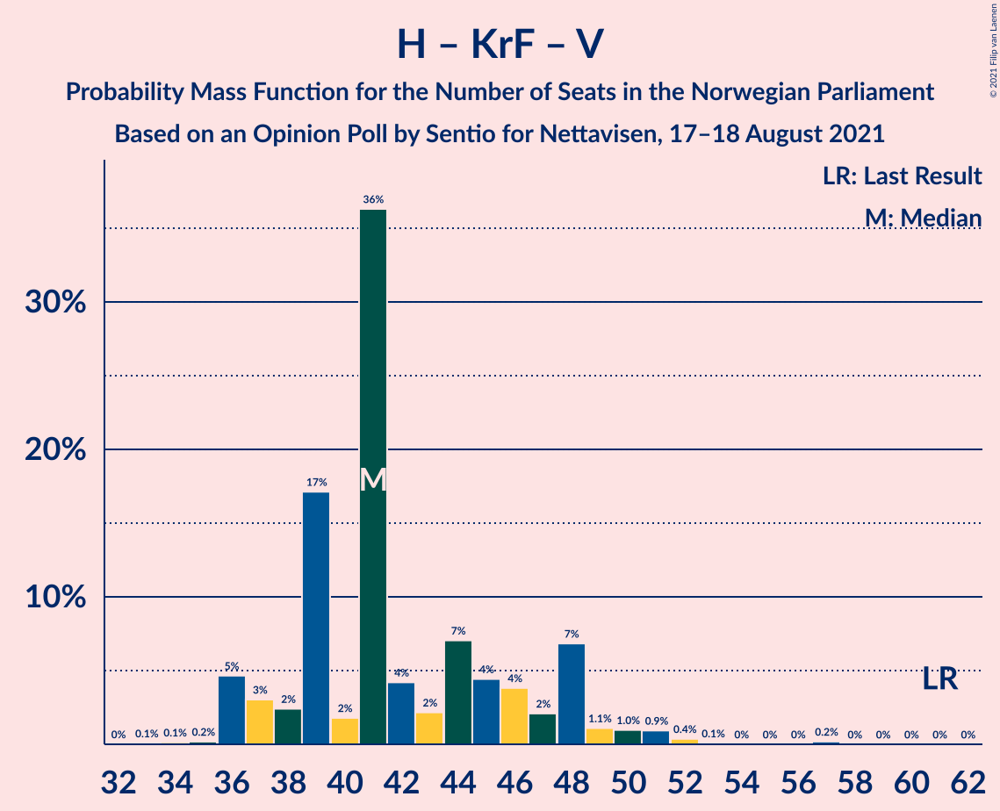

| Number of Seats | Probability | Accumulated | Special Marks |
|:---------------:|:-----------:|:-----------:|:-------------:|
| 33 | 0.1% | 100% |  |
| 34 | 0.1% | 99.9% |  |
| 35 | 0.2% | 99.8% |  |
| 36 | 5% | 99.6% |  |
| 37 | 3% | 95% |  |
| 38 | 2% | 92% |  |
| 39 | 17% | 89% |  |
| 40 | 2% | 72% |  |
| 41 | 36% | 71% | Median |
| 42 | 4% | 34% |  |
| 43 | 2% | 30% |  |
| 44 | 7% | 28% |  |
| 45 | 4% | 21% |  |
| 46 | 4% | 16% |  |
| 47 | 2% | 13% |  |
| 48 | 7% | 10% |  |
| 49 | 1.1% | 4% |  |
| 50 | 1.0% | 3% |  |
| 51 | 0.9% | 2% |  |
| 52 | 0.4% | 0.6% |  |
| 53 | 0.1% | 0.3% |  |
| 54 | 0% | 0.2% |  |
| 55 | 0% | 0.2% |  |
| 56 | 0% | 0.2% |  |
| 57 | 0.2% | 0.2% |  |
| 58 | 0% | 0% |  |
| 59 | 0% | 0% |  |
| 60 | 0% | 0% |  |
| 61 | 0% | 0% | Last Result |

### Senterpartiet – Kristelig Folkeparti – Venstre

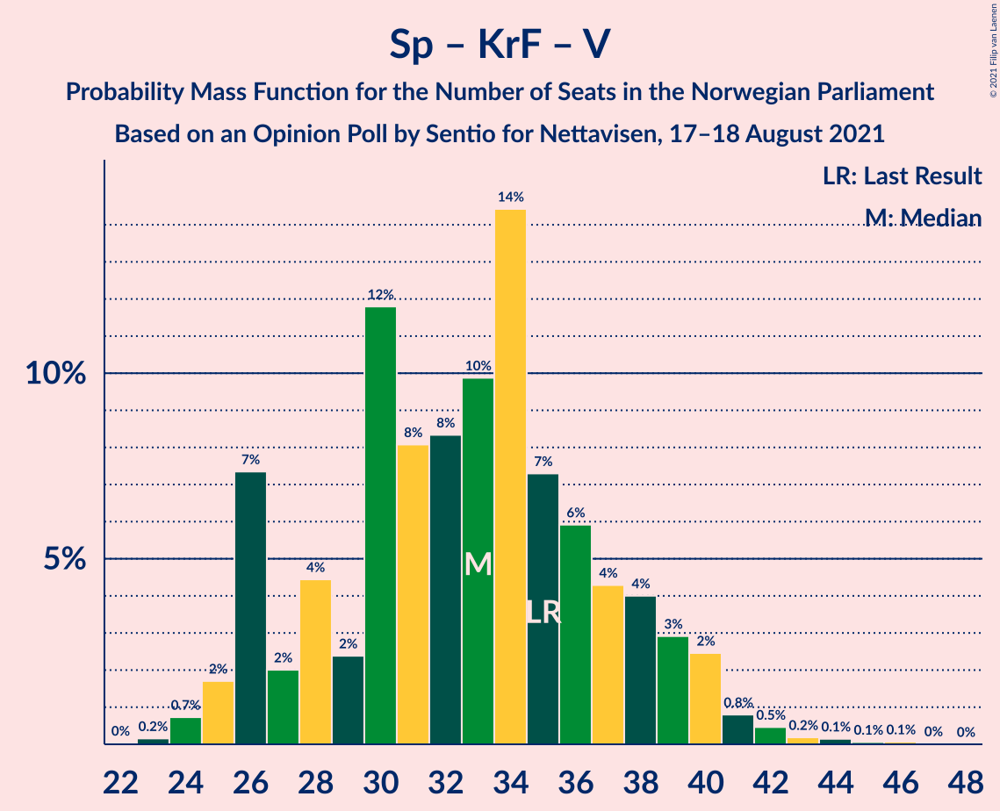

| Number of Seats | Probability | Accumulated | Special Marks |
|:---------------:|:-----------:|:-----------:|:-------------:|
| 21 | 0.2% | 100% |  |
| 22 | 0% | 99.8% |  |
| 23 | 0% | 99.8% |  |
| 24 | 0.1% | 99.8% |  |
| 25 | 2% | 99.7% |  |
| 26 | 32% | 98% | Median |
| 27 | 0.4% | 67% |  |
| 28 | 6% | 66% |  |
| 29 | 1.5% | 60% |  |
| 30 | 8% | 59% |  |
| 31 | 10% | 51% |  |
| 32 | 5% | 41% |  |
| 33 | 10% | 37% |  |
| 34 | 9% | 26% |  |
| 35 | 4% | 18% | Last Result |
| 36 | 2% | 13% |  |
| 37 | 2% | 12% |  |
| 38 | 5% | 9% |  |
| 39 | 1.0% | 4% |  |
| 40 | 2% | 3% |  |
| 41 | 0.3% | 2% |  |
| 42 | 0.4% | 2% |  |
| 43 | 0.6% | 1.2% |  |
| 44 | 0.3% | 0.6% |  |
| 45 | 0.2% | 0.3% |  |
| 46 | 0% | 0.1% |  |
| 47 | 0.1% | 0.1% |  |
| 48 | 0% | 0% |  |

## Technical Information

### Opinion Poll

+ **Polling firm:** Sentio
+ **Commissioner(s):** Nettavisen
+ **Fieldwork period:** 17–18 August 2021

### Calculations

+ **Sample size:** 1000
+ **Simulations done:** 131,072
+ **Error estimate:** 1.46%

