# Opinion Poll by Sentio for Nettavisen, 17–21 August 2021

<a href="#voting-intentions">Voting Intentions</a> | <a href="#seats">Seats</a> | <a href="#coalitions">Coalitions</a> | <a href="#technical-information">Technical Information</a>

## Voting Intentions

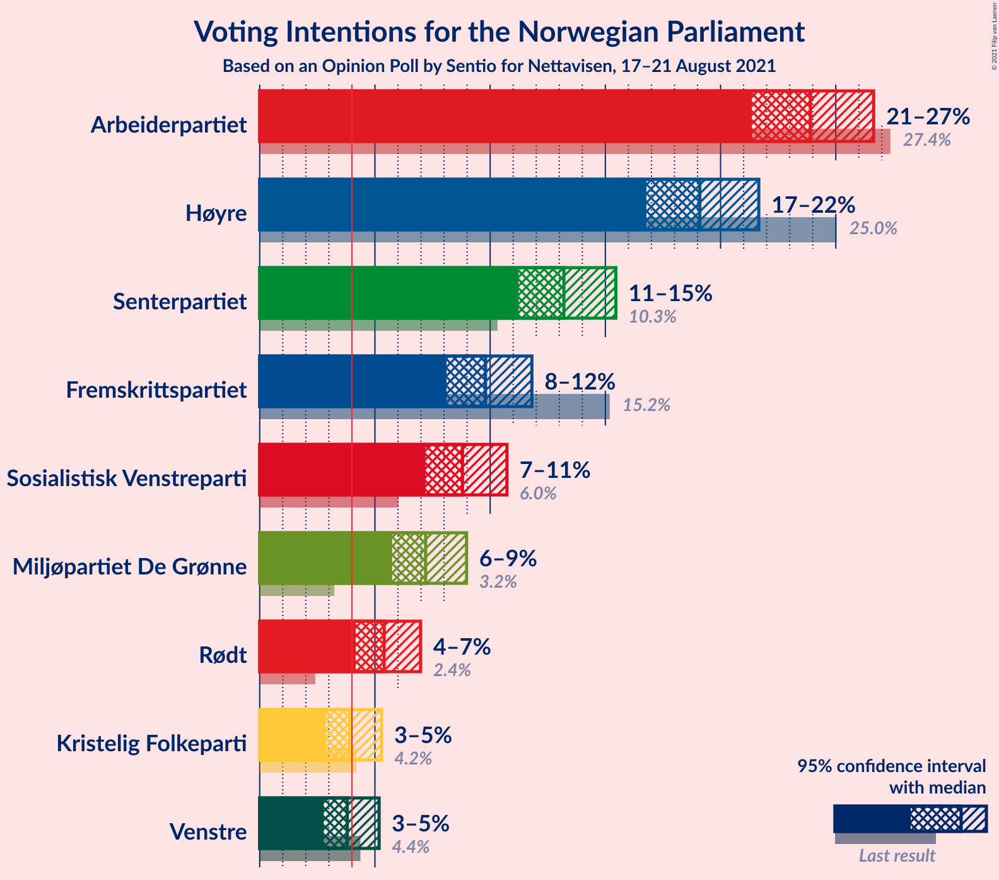

### Confidence Intervals

| Party | Last Result | Poll Result | 80% Confidence Interval | 90% Confidence Interval | 95% Confidence Interval | 99% Confidence Interval |
|:-----:|:-----------:|:-----------:|:-----------------------:|:-----------------------:|:-----------------------:|:-----------------------:|
| Arbeiderpartiet | 27.4% | 23.9% | 22.2–25.7% |21.8–26.2% |21.4–26.6% |20.6–27.5% |
| Høyre | 25.0% | 19.1% | 17.6–20.8% |17.1–21.2% |16.8–21.7% |16.1–22.5% |
| Senterpartiet | 10.3% | 13.2% | 11.9–14.7% |11.6–15.1% |11.2–15.5% |10.7–16.2% |
| Fremskrittspartiet | 15.2% | 9.8% | 8.7–11.1% |8.4–11.5% |8.1–11.8% |7.6–12.5% |
| Sosialistisk Venstreparti | 6.0% | 8.8% | 7.7–10.1% |7.4–10.4% |7.2–10.7% |6.7–11.4% |
| Miljøpartiet De Grønne | 3.2% | 7.2% | 6.2–8.4% |6.0–8.7% |5.7–9.0% |5.3–9.6% |
| Rødt | 2.4% | 5.4% | 4.6–6.4% |4.3–6.7% |4.2–7.0% |3.8–7.5% |
| Kristelig Folkeparti | 4.2% | 3.9% | 3.2–4.8% |3.0–5.1% |2.9–5.3% |2.6–5.8% |
| Venstre | 4.4% | 3.8% | 3.1–4.7% |2.9–5.0% |2.8–5.2% |2.5–5.6% |

*Note:* The poll result column reflects the actual value used in the calculations. Published results may vary slightly, and in addition be rounded to fewer digits.

## Seats

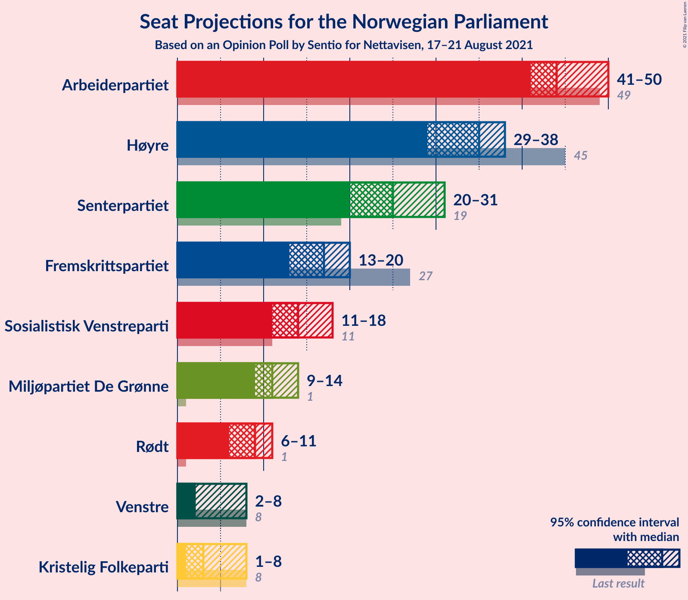

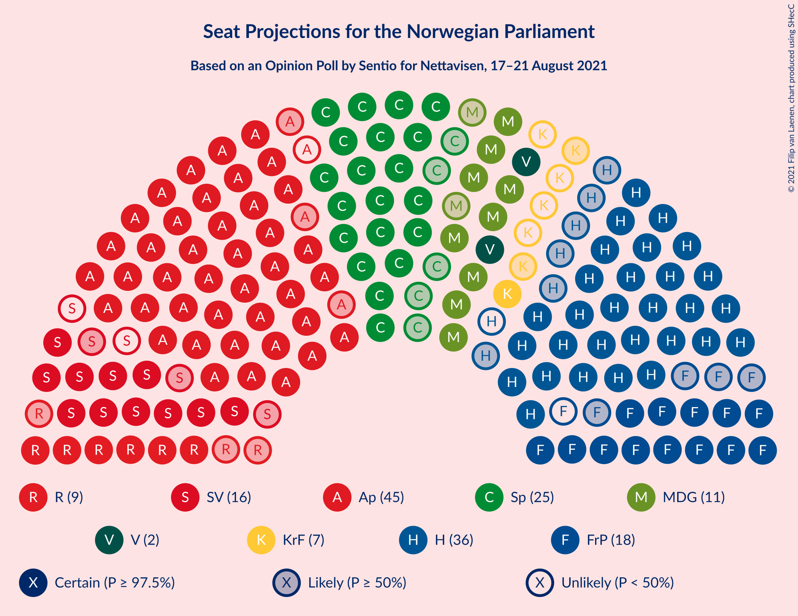

### Confidence Intervals

| Party | Last Result | Median | 80% Confidence Interval | 90% Confidence Interval | 95% Confidence Interval | 99% Confidence Interval |
|:-----:|:-----------:|:------:|:-----------------------:|:-----------------------:|:-----------------------:|:-----------------------:|
| <a href="#arbeiderpartiet">Arbeiderpartiet</a> | 49 | 44 | 42–47 |41–49 |41–50 |39–53 |
| <a href="#høyre">Høyre</a> | 45 | 35 | 31–36 |30–37 |29–38 |28–40 |
| <a href="#senterpartiet">Senterpartiet</a> | 19 | 25 | 21–28 |20–29 |20–31 |18–32 |
| <a href="#fremskrittspartiet">Fremskrittspartiet</a> | 27 | 17 | 14–19 |14–19 |13–20 |12–22 |
| <a href="#sosialistisk-venstreparti">Sosialistisk Venstreparti</a> | 11 | 14 | 12–16 |11–17 |11–18 |9–19 |
| <a href="#miljøpartiet-de-grønne">Miljøpartiet De Grønne</a> | 1 | 11 | 10–13 |9–14 |9–14 |8–16 |
| <a href="#rødt">Rødt</a> | 1 | 9 | 7–10 |7–11 |6–11 |2–12 |
| <a href="#kristelig-folkeparti">Kristelig Folkeparti</a> | 8 | 3 | 2–7 |2–8 |1–8 |1–9 |
| <a href="#venstre">Venstre</a> | 8 | 2 | 2–7 |2–8 |2–8 |2–8 |

### Arbeiderpartiet

*For a full overview of the results for this party, see the [Arbeiderpartiet](party-arbeiderpartiet.html) page.*

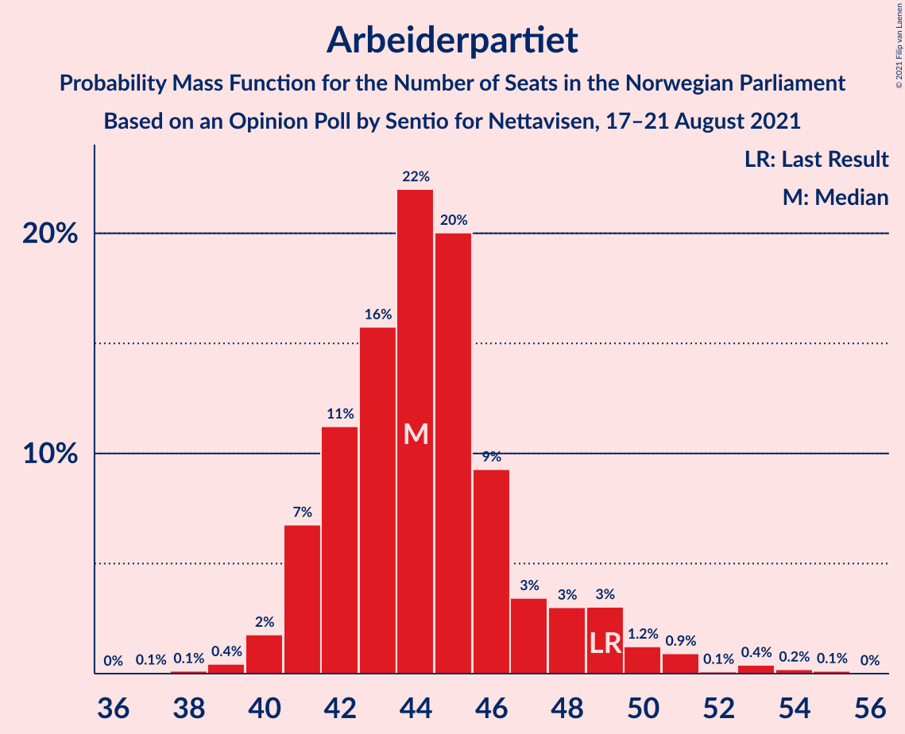

| Number of Seats | Probability | Accumulated | Special Marks |
|:---------------:|:-----------:|:-----------:|:-------------:|
| 37 | 0.1% | 100% |  |
| 38 | 0.1% | 99.9% |  |
| 39 | 0.4% | 99.8% |  |
| 40 | 2% | 99.4% |  |
| 41 | 7% | 98% |  |
| 42 | 11% | 91% |  |
| 43 | 16% | 80% |  |
| 44 | 22% | 64% | Median |
| 45 | 20% | 42% |  |
| 46 | 9% | 22% |  |
| 47 | 3% | 13% |  |
| 48 | 3% | 9% |  |
| 49 | 3% | 6% | Last Result |
| 50 | 1.2% | 3% |  |
| 51 | 0.9% | 2% |  |
| 52 | 0.1% | 0.9% |  |
| 53 | 0.4% | 0.8% |  |
| 54 | 0.2% | 0.4% |  |
| 55 | 0.1% | 0.2% |  |
| 56 | 0% | 0% |  |

### Høyre

*For a full overview of the results for this party, see the [Høyre](party-høyre.html) page.*

| Number of Seats | Probability | Accumulated | Special Marks |
|:---------------:|:-----------:|:-----------:|:-------------:|
| 28 | 0.7% | 100% |  |
| 29 | 3% | 99.3% |  |
| 30 | 4% | 96% |  |
| 31 | 5% | 92% |  |
| 32 | 7% | 87% |  |
| 33 | 14% | 80% |  |
| 34 | 14% | 65% |  |
| 35 | 18% | 52% | Median |
| 36 | 25% | 33% |  |
| 37 | 6% | 9% |  |
| 38 | 2% | 3% |  |
| 39 | 0.7% | 1.4% |  |
| 40 | 0.2% | 0.7% |  |
| 41 | 0.2% | 0.5% |  |
| 42 | 0.1% | 0.2% |  |
| 43 | 0.1% | 0.2% |  |
| 44 | 0.1% | 0.1% |  |
| 45 | 0% | 0% | Last Result |

### Senterpartiet

*For a full overview of the results for this party, see the [Senterpartiet](party-senterpartiet.html) page.*

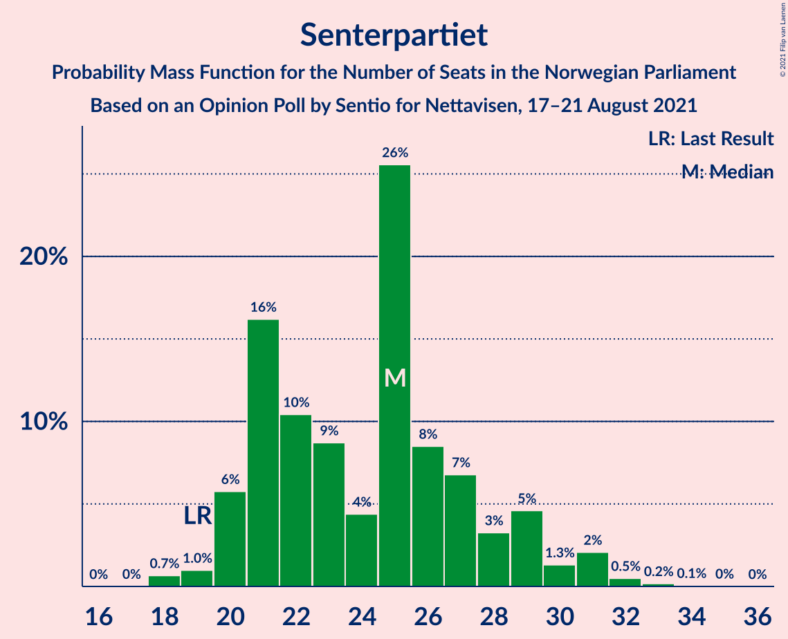

| Number of Seats | Probability | Accumulated | Special Marks |
|:---------------:|:-----------:|:-----------:|:-------------:|
| 18 | 0.7% | 100% |  |
| 19 | 1.0% | 99.3% | Last Result |
| 20 | 6% | 98% |  |
| 21 | 16% | 93% |  |
| 22 | 10% | 76% |  |
| 23 | 9% | 66% |  |
| 24 | 4% | 57% |  |
| 25 | 26% | 53% | Median |
| 26 | 8% | 27% |  |
| 27 | 7% | 19% |  |
| 28 | 3% | 12% |  |
| 29 | 5% | 9% |  |
| 30 | 1.3% | 4% |  |
| 31 | 2% | 3% |  |
| 32 | 0.5% | 0.8% |  |
| 33 | 0.2% | 0.3% |  |
| 34 | 0.1% | 0.1% |  |
| 35 | 0% | 0% |  |

### Fremskrittspartiet

*For a full overview of the results for this party, see the [Fremskrittspartiet](party-fremskrittspartiet.html) page.*

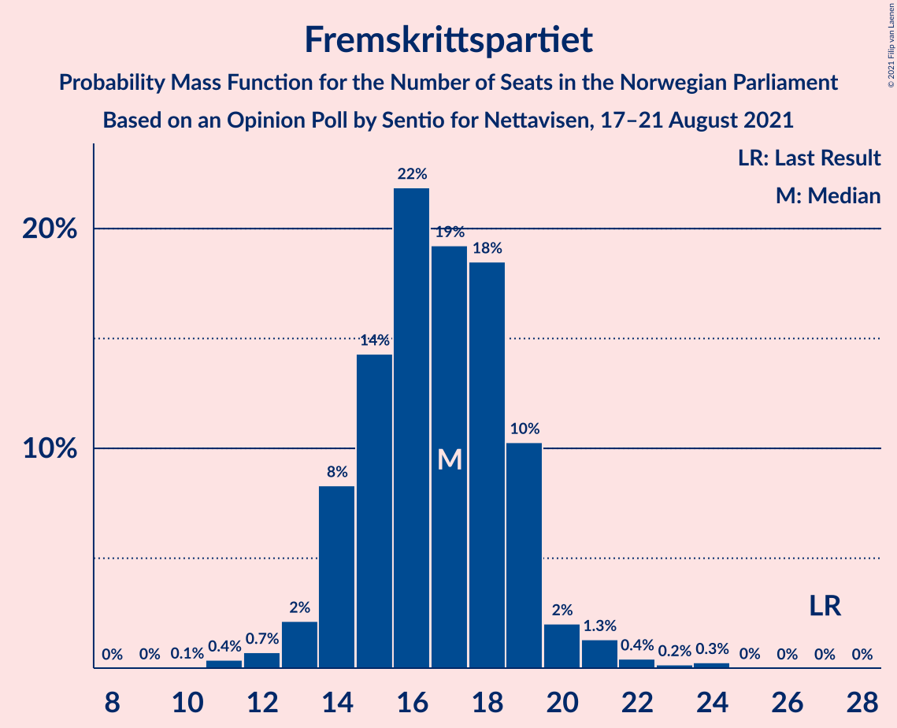

| Number of Seats | Probability | Accumulated | Special Marks |
|:---------------:|:-----------:|:-----------:|:-------------:|
| 10 | 0.1% | 100% |  |
| 11 | 0.4% | 99.9% |  |
| 12 | 0.7% | 99.6% |  |
| 13 | 2% | 98.8% |  |
| 14 | 8% | 97% |  |
| 15 | 14% | 88% |  |
| 16 | 22% | 74% |  |
| 17 | 19% | 52% | Median |
| 18 | 18% | 33% |  |
| 19 | 10% | 14% |  |
| 20 | 2% | 4% |  |
| 21 | 1.3% | 2% |  |
| 22 | 0.4% | 0.9% |  |
| 23 | 0.2% | 0.5% |  |
| 24 | 0.3% | 0.3% |  |
| 25 | 0% | 0% |  |
| 26 | 0% | 0% |  |
| 27 | 0% | 0% | Last Result |

### Sosialistisk Venstreparti

*For a full overview of the results for this party, see the [Sosialistisk Venstreparti](party-sosialistiskvenstreparti.html) page.*

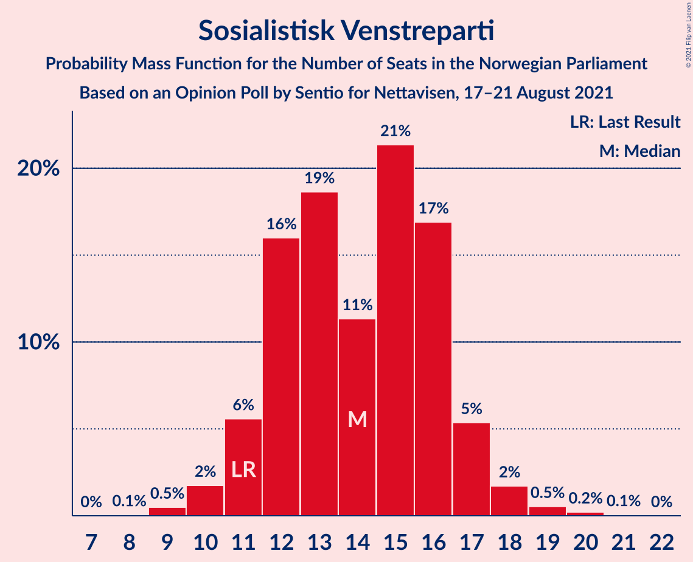

| Number of Seats | Probability | Accumulated | Special Marks |
|:---------------:|:-----------:|:-----------:|:-------------:|
| 8 | 0.1% | 100% |  |
| 9 | 0.5% | 99.9% |  |
| 10 | 2% | 99.5% |  |
| 11 | 6% | 98% | Last Result |
| 12 | 16% | 92% |  |
| 13 | 19% | 76% |  |
| 14 | 11% | 57% | Median |
| 15 | 21% | 46% |  |
| 16 | 17% | 25% |  |
| 17 | 5% | 8% |  |
| 18 | 2% | 3% |  |
| 19 | 0.5% | 0.8% |  |
| 20 | 0.2% | 0.3% |  |
| 21 | 0.1% | 0.1% |  |
| 22 | 0% | 0% |  |

### Miljøpartiet De Grønne

*For a full overview of the results for this party, see the [Miljøpartiet De Grønne](party-miljøpartietdegrønne.html) page.*

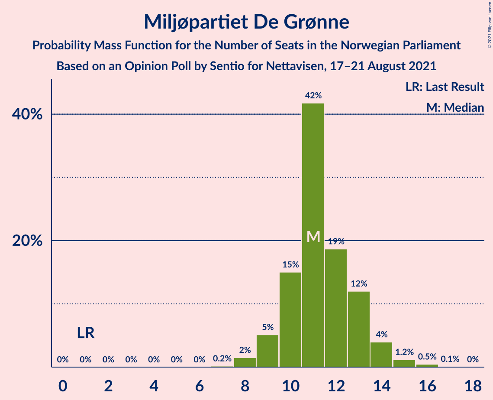

| Number of Seats | Probability | Accumulated | Special Marks |
|:---------------:|:-----------:|:-----------:|:-------------:|
| 1 | 0% | 100% | Last Result |
| 2 | 0% | 100% |  |
| 3 | 0% | 100% |  |
| 4 | 0% | 100% |  |
| 5 | 0% | 100% |  |
| 6 | 0% | 100% |  |
| 7 | 0.2% | 100% |  |
| 8 | 2% | 99.8% |  |
| 9 | 5% | 98% |  |
| 10 | 15% | 93% |  |
| 11 | 42% | 78% | Median |
| 12 | 19% | 36% |  |
| 13 | 12% | 18% |  |
| 14 | 4% | 6% |  |
| 15 | 1.2% | 2% |  |
| 16 | 0.5% | 0.6% |  |
| 17 | 0.1% | 0.1% |  |
| 18 | 0% | 0% |  |

### Rødt

*For a full overview of the results for this party, see the [Rødt](party-rødt.html) page.*

| Number of Seats | Probability | Accumulated | Special Marks |
|:---------------:|:-----------:|:-----------:|:-------------:|
| 1 | 0% | 100% | Last Result |
| 2 | 0.9% | 100% |  |
| 3 | 0% | 99.1% |  |
| 4 | 0% | 99.1% |  |
| 5 | 0% | 99.1% |  |
| 6 | 3% | 99.0% |  |
| 7 | 15% | 96% |  |
| 8 | 28% | 81% |  |
| 9 | 35% | 53% | Median |
| 10 | 11% | 18% |  |
| 11 | 5% | 7% |  |
| 12 | 0.9% | 1.3% |  |
| 13 | 0.4% | 0.4% |  |
| 14 | 0% | 0% |  |

### Kristelig Folkeparti

*For a full overview of the results for this party, see the [Kristelig Folkeparti](party-kristeligfolkeparti.html) page.*

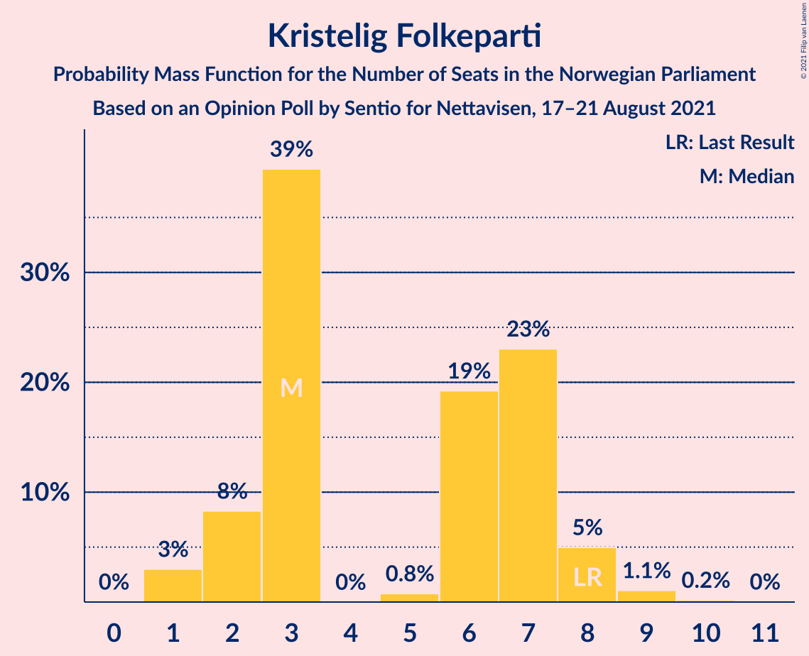

| Number of Seats | Probability | Accumulated | Special Marks |
|:---------------:|:-----------:|:-----------:|:-------------:|
| 1 | 3% | 100% |  |
| 2 | 8% | 97% |  |
| 3 | 39% | 89% | Median |
| 4 | 0% | 49% |  |
| 5 | 0.8% | 49% |  |
| 6 | 19% | 49% |  |
| 7 | 23% | 29% |  |
| 8 | 5% | 6% | Last Result |
| 9 | 1.1% | 1.3% |  |
| 10 | 0.2% | 0.2% |  |
| 11 | 0% | 0% |  |

### Venstre

*For a full overview of the results for this party, see the [Venstre](party-venstre.html) page.*

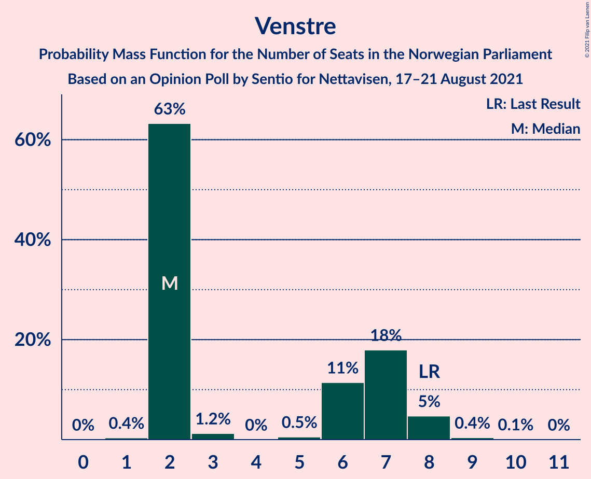

| Number of Seats | Probability | Accumulated | Special Marks |
|:---------------:|:-----------:|:-----------:|:-------------:|
| 1 | 0.4% | 100% |  |
| 2 | 63% | 99.6% | Median |
| 3 | 1.2% | 36% |  |
| 4 | 0% | 35% |  |
| 5 | 0.5% | 35% |  |
| 6 | 11% | 35% |  |
| 7 | 18% | 23% |  |
| 8 | 5% | 5% | Last Result |
| 9 | 0.4% | 0.5% |  |
| 10 | 0.1% | 0.1% |  |
| 11 | 0% | 0% |  |

## Coalitions

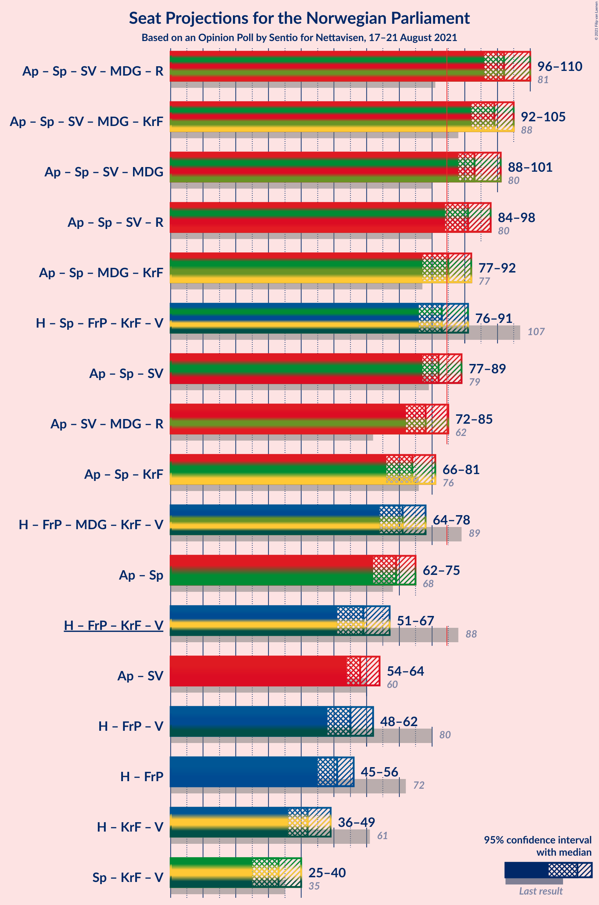

### Confidence Intervals

| Coalition | Last Result | Median | Majority? | 80% Confidence Interval | 90% Confidence Interval | 95% Confidence Interval | 99% Confidence Interval |
|:---------:|:-----------:|:------:|:---------:|:-----------------------:|:-----------------------:|:-----------------------:|:-----------------------:|
| Arbeiderpartiet – Senterpartiet – Sosialistisk Venstreparti – Miljøpartiet De Grønne – Rødt | 81 | 102 | 100% | 98–107 | 97–109 | 96–110 | 93–113 |
| Arbeiderpartiet – Senterpartiet – Sosialistisk Venstreparti – Miljøpartiet De Grønne – Kristelig Folkeparti | 88 | 99 | 100% | 94–103 | 93–104 | 92–105 | 90–109 |
| Arbeiderpartiet – Senterpartiet – Sosialistisk Venstreparti – Miljøpartiet De Grønne | 80 | 93 | 99.7% | 89–98 | 89–100 | 88–101 | 85–104 |
| Arbeiderpartiet – Senterpartiet – Sosialistisk Venstreparti – Rødt | 80 | 91 | 97% | 87–96 | 86–96 | 84–98 | 83–100 |
| Arbeiderpartiet – Senterpartiet – Miljøpartiet De Grønne – Kristelig Folkeparti | 77 | 85 | 55% | 79–89 | 78–91 | 77–92 | 75–95 |
| Høyre – Senterpartiet – Fremskrittspartiet – Kristelig Folkeparti – Venstre | 107 | 83 | 37% | 79–88 | 78–89 | 76–91 | 73–93 |
| Arbeiderpartiet – Senterpartiet – Sosialistisk Venstreparti | 79 | 82 | 28% | 79–87 | 78–88 | 77–89 | 75–91 |
| Arbeiderpartiet – Sosialistisk Venstreparti – Miljøpartiet De Grønne – Rødt | 62 | 78 | 3% | 75–82 | 73–84 | 72–85 | 70–89 |
| Arbeiderpartiet – Senterpartiet – Kristelig Folkeparti | 76 | 74 | 0.1% | 68–78 | 67–79 | 66–81 | 64–83 |
| Høyre – Fremskrittspartiet – Miljøpartiet De Grønne – Kristelig Folkeparti – Venstre | 89 | 71 | 0.2% | 66–75 | 64–77 | 64–78 | 62–80 |
| Arbeiderpartiet – Senterpartiet | 68 | 69 | 0% | 64–73 | 63–75 | 62–75 | 61–77 |
| Høyre – Fremskrittspartiet – Kristelig Folkeparti – Venstre | 88 | 59 | 0% | 54–64 | 53–65 | 51–67 | 50–70 |
| Arbeiderpartiet – Sosialistisk Venstreparti | 60 | 58 | 0% | 55–61 | 55–63 | 54–64 | 52–67 |
| Høyre – Fremskrittspartiet – Venstre | 80 | 55 | 0% | 50–60 | 49–61 | 48–62 | 47–64 |
| Høyre – Fremskrittspartiet | 72 | 51 | 0% | 47–54 | 46–55 | 45–56 | 43–59 |
| Høyre – Kristelig Folkeparti – Venstre | 61 | 42 | 0% | 39–47 | 37–48 | 36–49 | 34–52 |
| Senterpartiet – Kristelig Folkeparti – Venstre | 35 | 33 | 0% | 27–38 | 26–39 | 25–40 | 24–42 |

### Arbeiderpartiet – Senterpartiet – Sosialistisk Venstreparti – Miljøpartiet De Grønne – Rødt

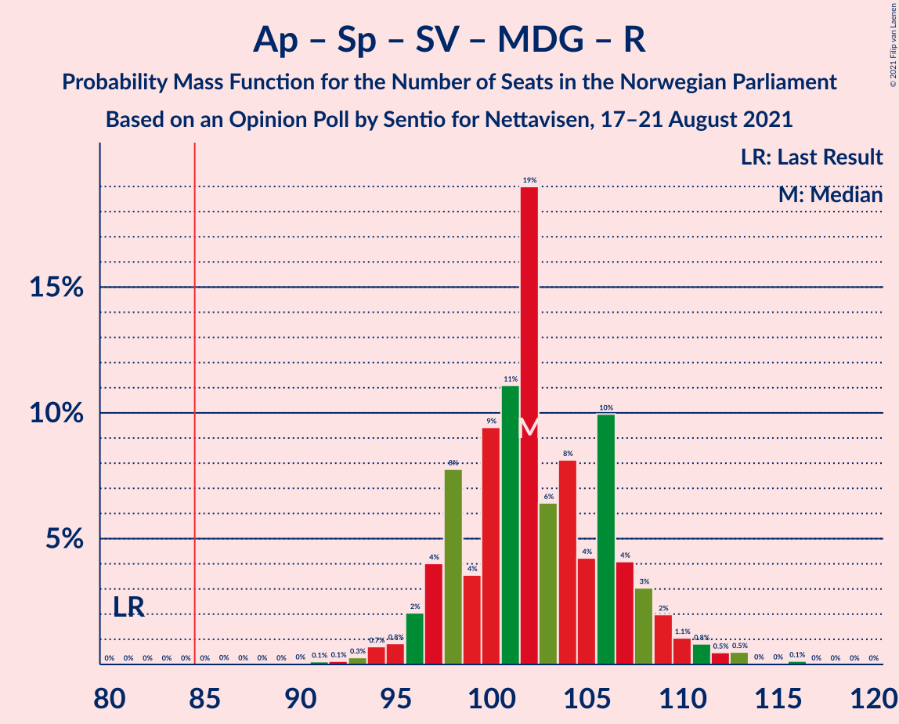

| Number of Seats | Probability | Accumulated | Special Marks |
|:---------------:|:-----------:|:-----------:|:-------------:|
| 81 | 0% | 100% | Last Result |
| 82 | 0% | 100% |  |
| 83 | 0% | 100% |  |
| 84 | 0% | 100% |  |
| 85 | 0% | 100% | Majority |
| 86 | 0% | 100% |  |
| 87 | 0% | 100% |  |
| 88 | 0% | 100% |  |
| 89 | 0% | 100% |  |
| 90 | 0% | 100% |  |
| 91 | 0.1% | 99.9% |  |
| 92 | 0.1% | 99.8% |  |
| 93 | 0.3% | 99.7% |  |
| 94 | 0.7% | 99.4% |  |
| 95 | 0.8% | 98.7% |  |
| 96 | 2% | 98% |  |
| 97 | 4% | 96% |  |
| 98 | 8% | 92% |  |
| 99 | 4% | 84% |  |
| 100 | 9% | 80% |  |
| 101 | 11% | 71% |  |
| 102 | 19% | 60% |  |
| 103 | 6% | 41% | Median |
| 104 | 8% | 35% |  |
| 105 | 4% | 26% |  |
| 106 | 10% | 22% |  |
| 107 | 4% | 12% |  |
| 108 | 3% | 8% |  |
| 109 | 2% | 5% |  |
| 110 | 1.1% | 3% |  |
| 111 | 0.8% | 2% |  |
| 112 | 0.5% | 1.2% |  |
| 113 | 0.5% | 0.7% |  |
| 114 | 0% | 0.2% |  |
| 115 | 0% | 0.2% |  |
| 116 | 0.1% | 0.1% |  |
| 117 | 0% | 0% |  |

### Arbeiderpartiet – Senterpartiet – Sosialistisk Venstreparti – Miljøpartiet De Grønne – Kristelig Folkeparti

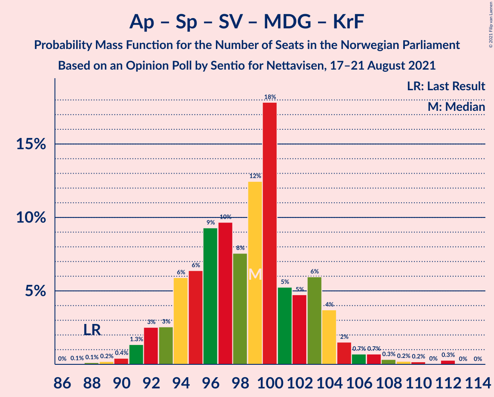

| Number of Seats | Probability | Accumulated | Special Marks |
|:---------------:|:-----------:|:-----------:|:-------------:|
| 87 | 0.1% | 100% |  |
| 88 | 0.1% | 99.9% | Last Result |
| 89 | 0.2% | 99.8% |  |
| 90 | 0.4% | 99.6% |  |
| 91 | 1.3% | 99.2% |  |
| 92 | 3% | 98% |  |
| 93 | 3% | 95% |  |
| 94 | 6% | 93% |  |
| 95 | 6% | 87% |  |
| 96 | 9% | 80% |  |
| 97 | 10% | 71% | Median |
| 98 | 8% | 61% |  |
| 99 | 12% | 54% |  |
| 100 | 18% | 41% |  |
| 101 | 5% | 24% |  |
| 102 | 5% | 18% |  |
| 103 | 6% | 14% |  |
| 104 | 4% | 8% |  |
| 105 | 2% | 4% |  |
| 106 | 0.7% | 2% |  |
| 107 | 0.7% | 2% |  |
| 108 | 0.3% | 1.0% |  |
| 109 | 0.2% | 0.7% |  |
| 110 | 0.2% | 0.5% |  |
| 111 | 0% | 0.3% |  |
| 112 | 0.3% | 0.3% |  |
| 113 | 0% | 0% |  |

### Arbeiderpartiet – Senterpartiet – Sosialistisk Venstreparti – Miljøpartiet De Grønne

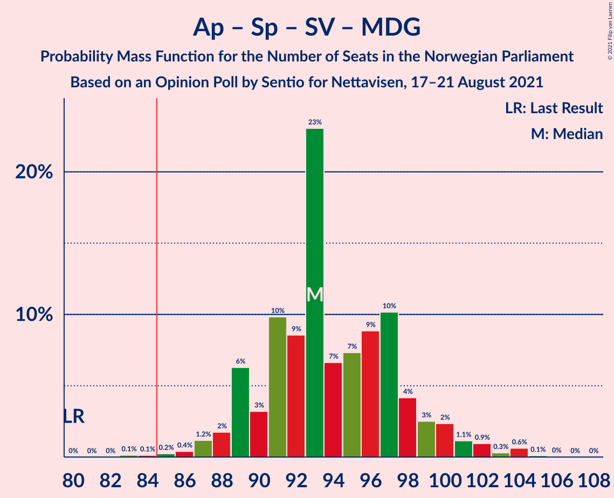

| Number of Seats | Probability | Accumulated | Special Marks |
|:---------------:|:-----------:|:-----------:|:-------------:|
| 80 | 0% | 100% | Last Result |
| 81 | 0% | 100% |  |
| 82 | 0% | 100% |  |
| 83 | 0.1% | 100% |  |
| 84 | 0.1% | 99.8% |  |
| 85 | 0.2% | 99.7% | Majority |
| 86 | 0.4% | 99.5% |  |
| 87 | 1.2% | 99.1% |  |
| 88 | 2% | 98% |  |
| 89 | 6% | 96% |  |
| 90 | 3% | 90% |  |
| 91 | 10% | 87% |  |
| 92 | 9% | 77% |  |
| 93 | 23% | 68% |  |
| 94 | 7% | 45% | Median |
| 95 | 7% | 39% |  |
| 96 | 9% | 31% |  |
| 97 | 10% | 22% |  |
| 98 | 4% | 12% |  |
| 99 | 3% | 8% |  |
| 100 | 2% | 6% |  |
| 101 | 1.1% | 3% |  |
| 102 | 0.9% | 2% |  |
| 103 | 0.3% | 1.1% |  |
| 104 | 0.6% | 0.8% |  |
| 105 | 0.1% | 0.2% |  |
| 106 | 0% | 0.1% |  |
| 107 | 0% | 0% |  |

### Arbeiderpartiet – Senterpartiet – Sosialistisk Venstreparti – Rødt

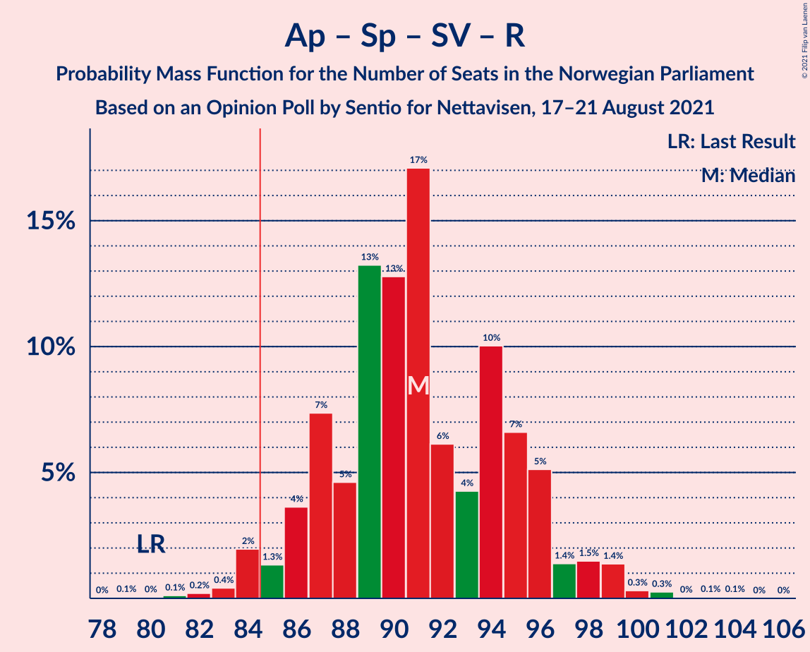

| Number of Seats | Probability | Accumulated | Special Marks |
|:---------------:|:-----------:|:-----------:|:-------------:|
| 79 | 0.1% | 100% |  |
| 80 | 0% | 99.9% | Last Result |
| 81 | 0.1% | 99.9% |  |
| 82 | 0.2% | 99.8% |  |
| 83 | 0.4% | 99.6% |  |
| 84 | 2% | 99.1% |  |
| 85 | 1.3% | 97% | Majority |
| 86 | 4% | 96% |  |
| 87 | 7% | 92% |  |
| 88 | 5% | 85% |  |
| 89 | 13% | 80% |  |
| 90 | 13% | 67% |  |
| 91 | 17% | 54% |  |
| 92 | 6% | 37% | Median |
| 93 | 4% | 31% |  |
| 94 | 10% | 27% |  |
| 95 | 7% | 17% |  |
| 96 | 5% | 10% |  |
| 97 | 1.4% | 5% |  |
| 98 | 1.5% | 4% |  |
| 99 | 1.4% | 2% |  |
| 100 | 0.3% | 0.7% |  |
| 101 | 0.3% | 0.4% |  |
| 102 | 0% | 0.1% |  |
| 103 | 0.1% | 0.1% |  |
| 104 | 0.1% | 0.1% |  |
| 105 | 0% | 0% |  |

### Arbeiderpartiet – Senterpartiet – Miljøpartiet De Grønne – Kristelig Folkeparti

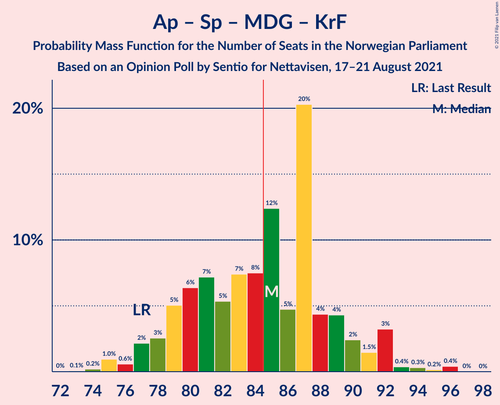

| Number of Seats | Probability | Accumulated | Special Marks |
|:---------------:|:-----------:|:-----------:|:-------------:|
| 72 | 0% | 100% |  |
| 73 | 0.1% | 99.9% |  |
| 74 | 0.2% | 99.9% |  |
| 75 | 1.0% | 99.7% |  |
| 76 | 0.6% | 98.7% |  |
| 77 | 2% | 98% | Last Result |
| 78 | 3% | 96% |  |
| 79 | 5% | 93% |  |
| 80 | 6% | 88% |  |
| 81 | 7% | 82% |  |
| 82 | 5% | 75% |  |
| 83 | 7% | 69% | Median |
| 84 | 8% | 62% |  |
| 85 | 12% | 55% | Majority |
| 86 | 5% | 42% |  |
| 87 | 20% | 37% |  |
| 88 | 4% | 17% |  |
| 89 | 4% | 13% |  |
| 90 | 2% | 8% |  |
| 91 | 1.5% | 6% |  |
| 92 | 3% | 5% |  |
| 93 | 0.4% | 1.3% |  |
| 94 | 0.3% | 0.9% |  |
| 95 | 0.2% | 0.6% |  |
| 96 | 0.4% | 0.4% |  |
| 97 | 0% | 0% |  |

### Høyre – Senterpartiet – Fremskrittspartiet – Kristelig Folkeparti – Venstre

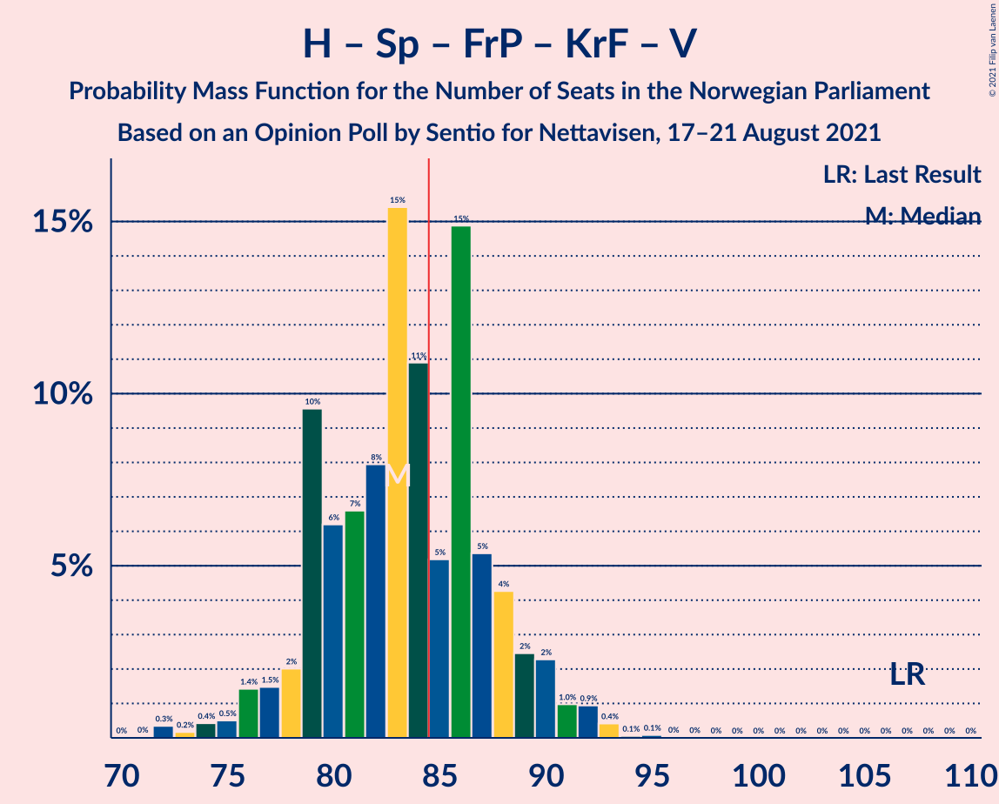

| Number of Seats | Probability | Accumulated | Special Marks |
|:---------------:|:-----------:|:-----------:|:-------------:|
| 72 | 0.3% | 100% |  |
| 73 | 0.2% | 99.6% |  |
| 74 | 0.4% | 99.4% |  |
| 75 | 0.5% | 99.0% |  |
| 76 | 1.4% | 98.5% |  |
| 77 | 1.5% | 97% |  |
| 78 | 2% | 96% |  |
| 79 | 10% | 94% |  |
| 80 | 6% | 84% |  |
| 81 | 7% | 78% |  |
| 82 | 8% | 71% | Median |
| 83 | 15% | 63% |  |
| 84 | 11% | 48% |  |
| 85 | 5% | 37% | Majority |
| 86 | 15% | 32% |  |
| 87 | 5% | 17% |  |
| 88 | 4% | 12% |  |
| 89 | 2% | 7% |  |
| 90 | 2% | 5% |  |
| 91 | 1.0% | 3% |  |
| 92 | 0.9% | 2% |  |
| 93 | 0.4% | 0.6% |  |
| 94 | 0.1% | 0.2% |  |
| 95 | 0.1% | 0.1% |  |
| 96 | 0% | 0% |  |
| 97 | 0% | 0% |  |
| 98 | 0% | 0% |  |
| 99 | 0% | 0% |  |
| 100 | 0% | 0% |  |
| 101 | 0% | 0% |  |
| 102 | 0% | 0% |  |
| 103 | 0% | 0% |  |
| 104 | 0% | 0% |  |
| 105 | 0% | 0% |  |
| 106 | 0% | 0% |  |
| 107 | 0% | 0% | Last Result |

### Arbeiderpartiet – Senterpartiet – Sosialistisk Venstreparti

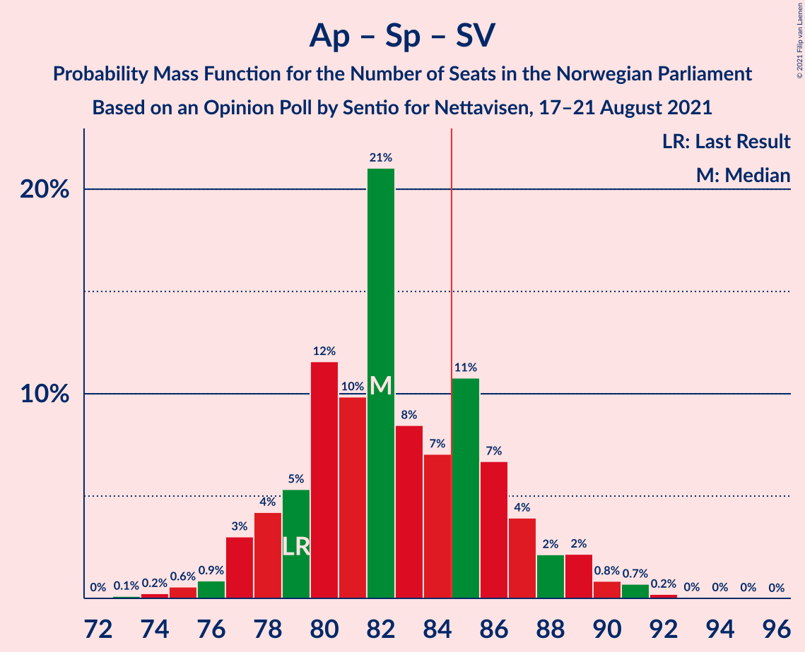

| Number of Seats | Probability | Accumulated | Special Marks |
|:---------------:|:-----------:|:-----------:|:-------------:|
| 72 | 0% | 100% |  |
| 73 | 0.1% | 99.9% |  |
| 74 | 0.2% | 99.8% |  |
| 75 | 0.6% | 99.6% |  |
| 76 | 0.9% | 99.0% |  |
| 77 | 3% | 98% |  |
| 78 | 4% | 95% |  |
| 79 | 5% | 91% | Last Result |
| 80 | 12% | 86% |  |
| 81 | 10% | 74% |  |
| 82 | 21% | 64% |  |
| 83 | 8% | 43% | Median |
| 84 | 7% | 35% |  |
| 85 | 11% | 28% | Majority |
| 86 | 7% | 17% |  |
| 87 | 4% | 10% |  |
| 88 | 2% | 6% |  |
| 89 | 2% | 4% |  |
| 90 | 0.8% | 2% |  |
| 91 | 0.7% | 1.0% |  |
| 92 | 0.2% | 0.3% |  |
| 93 | 0% | 0.1% |  |
| 94 | 0% | 0.1% |  |
| 95 | 0% | 0% |  |

### Arbeiderpartiet – Sosialistisk Venstreparti – Miljøpartiet De Grønne – Rødt

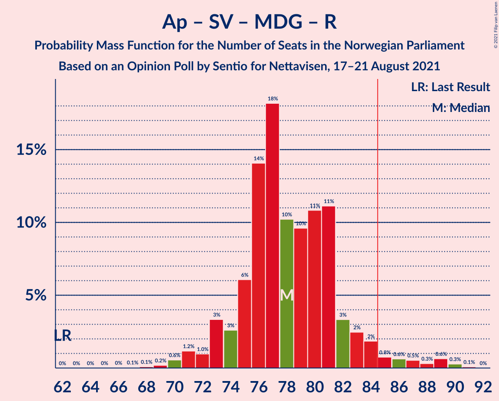

| Number of Seats | Probability | Accumulated | Special Marks |
|:---------------:|:-----------:|:-----------:|:-------------:|
| 62 | 0% | 100% | Last Result |
| 63 | 0% | 100% |  |
| 64 | 0% | 100% |  |
| 65 | 0% | 100% |  |
| 66 | 0% | 100% |  |
| 67 | 0.1% | 100% |  |
| 68 | 0.1% | 99.9% |  |
| 69 | 0.2% | 99.8% |  |
| 70 | 0.6% | 99.6% |  |
| 71 | 1.2% | 99.1% |  |
| 72 | 1.0% | 98% |  |
| 73 | 3% | 97% |  |
| 74 | 3% | 94% |  |
| 75 | 6% | 91% |  |
| 76 | 14% | 85% |  |
| 77 | 18% | 71% |  |
| 78 | 10% | 53% | Median |
| 79 | 10% | 42% |  |
| 80 | 11% | 33% |  |
| 81 | 11% | 22% |  |
| 82 | 3% | 11% |  |
| 83 | 2% | 8% |  |
| 84 | 2% | 5% |  |
| 85 | 0.8% | 3% | Majority |
| 86 | 0.6% | 2% |  |
| 87 | 0.5% | 2% |  |
| 88 | 0.3% | 1.3% |  |
| 89 | 0.6% | 1.0% |  |
| 90 | 0.3% | 0.4% |  |
| 91 | 0.1% | 0.1% |  |
| 92 | 0% | 0% |  |

### Arbeiderpartiet – Senterpartiet – Kristelig Folkeparti

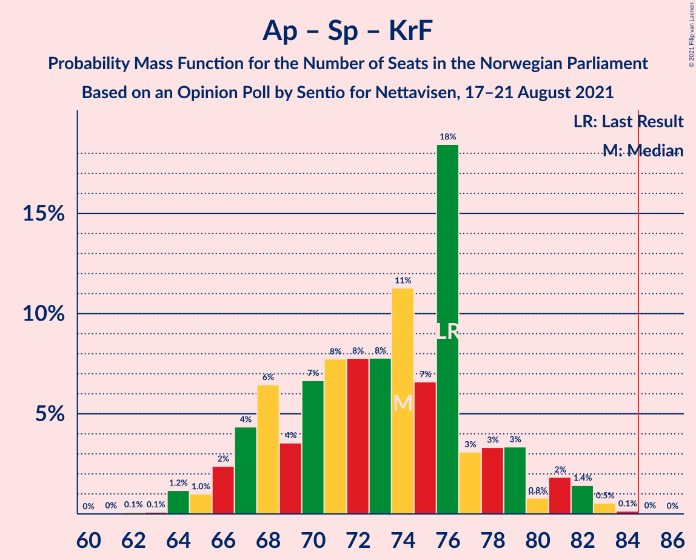

| Number of Seats | Probability | Accumulated | Special Marks |
|:---------------:|:-----------:|:-----------:|:-------------:|
| 61 | 0% | 100% |  |
| 62 | 0.1% | 99.9% |  |
| 63 | 0.1% | 99.9% |  |
| 64 | 1.2% | 99.8% |  |
| 65 | 1.0% | 98.6% |  |
| 66 | 2% | 98% |  |
| 67 | 4% | 95% |  |
| 68 | 6% | 91% |  |
| 69 | 4% | 84% |  |
| 70 | 7% | 81% |  |
| 71 | 8% | 74% |  |
| 72 | 8% | 66% | Median |
| 73 | 8% | 59% |  |
| 74 | 11% | 51% |  |
| 75 | 7% | 40% |  |
| 76 | 18% | 33% | Last Result |
| 77 | 3% | 15% |  |
| 78 | 3% | 12% |  |
| 79 | 3% | 8% |  |
| 80 | 0.8% | 5% |  |
| 81 | 2% | 4% |  |
| 82 | 1.4% | 2% |  |
| 83 | 0.5% | 0.8% |  |
| 84 | 0.1% | 0.2% |  |
| 85 | 0% | 0.1% | Majority |
| 86 | 0% | 0% |  |

### Høyre – Fremskrittspartiet – Miljøpartiet De Grønne – Kristelig Folkeparti – Venstre

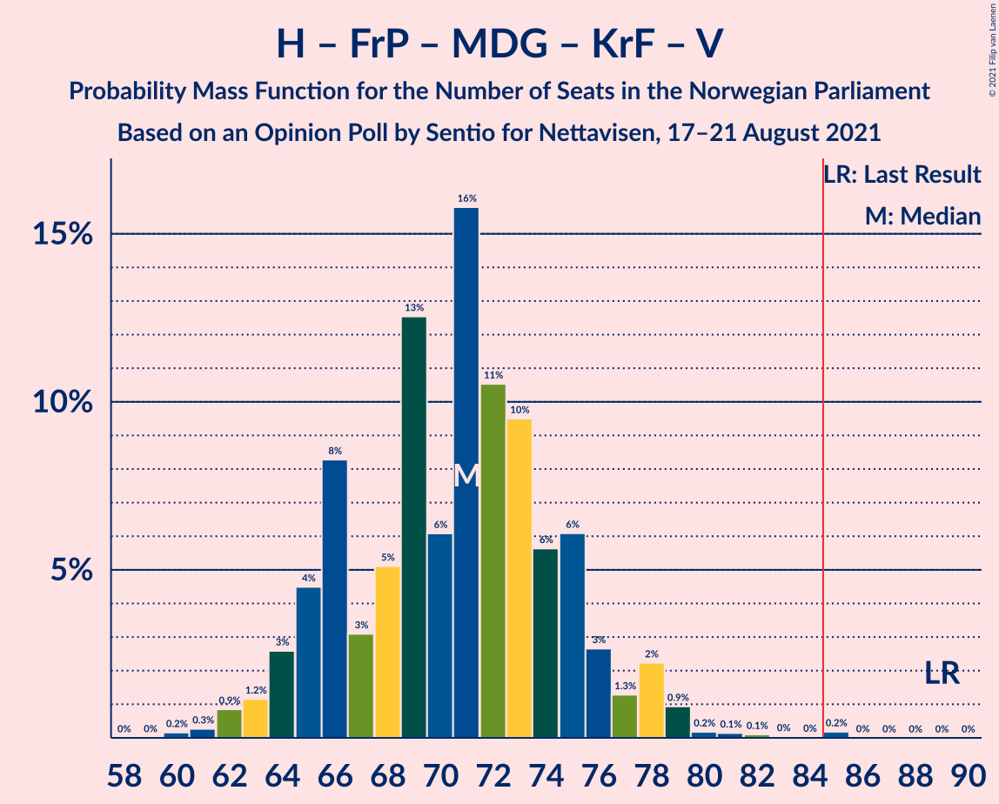

| Number of Seats | Probability | Accumulated | Special Marks |
|:---------------:|:-----------:|:-----------:|:-------------:|
| 60 | 0.2% | 100% |  |
| 61 | 0.3% | 99.8% |  |
| 62 | 0.9% | 99.6% |  |
| 63 | 1.2% | 98.7% |  |
| 64 | 3% | 98% |  |
| 65 | 4% | 95% |  |
| 66 | 8% | 90% |  |
| 67 | 3% | 82% |  |
| 68 | 5% | 79% | Median |
| 69 | 13% | 74% |  |
| 70 | 6% | 61% |  |
| 71 | 16% | 55% |  |
| 72 | 11% | 40% |  |
| 73 | 10% | 29% |  |
| 74 | 6% | 20% |  |
| 75 | 6% | 14% |  |
| 76 | 3% | 8% |  |
| 77 | 1.3% | 5% |  |
| 78 | 2% | 4% |  |
| 79 | 0.9% | 2% |  |
| 80 | 0.2% | 0.7% |  |
| 81 | 0.1% | 0.5% |  |
| 82 | 0.1% | 0.4% |  |
| 83 | 0% | 0.3% |  |
| 84 | 0% | 0.2% |  |
| 85 | 0.2% | 0.2% | Majority |
| 86 | 0% | 0% |  |
| 87 | 0% | 0% |  |
| 88 | 0% | 0% |  |
| 89 | 0% | 0% | Last Result |

### Arbeiderpartiet – Senterpartiet

| Number of Seats | Probability | Accumulated | Special Marks |
|:---------------:|:-----------:|:-----------:|:-------------:|
| 58 | 0.1% | 100% |  |
| 59 | 0.2% | 99.9% |  |
| 60 | 0.2% | 99.8% |  |
| 61 | 2% | 99.6% |  |
| 62 | 2% | 98% |  |
| 63 | 4% | 96% |  |
| 64 | 5% | 92% |  |
| 65 | 10% | 87% |  |
| 66 | 3% | 76% |  |
| 67 | 8% | 73% |  |
| 68 | 11% | 65% | Last Result |
| 69 | 15% | 53% | Median |
| 70 | 15% | 39% |  |
| 71 | 6% | 23% |  |
| 72 | 5% | 17% |  |
| 73 | 4% | 12% |  |
| 74 | 3% | 8% |  |
| 75 | 3% | 5% |  |
| 76 | 1.4% | 2% |  |
| 77 | 0.4% | 0.7% |  |
| 78 | 0.2% | 0.3% |  |
| 79 | 0.1% | 0.2% |  |
| 80 | 0% | 0% |  |

### Høyre – Fremskrittspartiet – Kristelig Folkeparti – Venstre

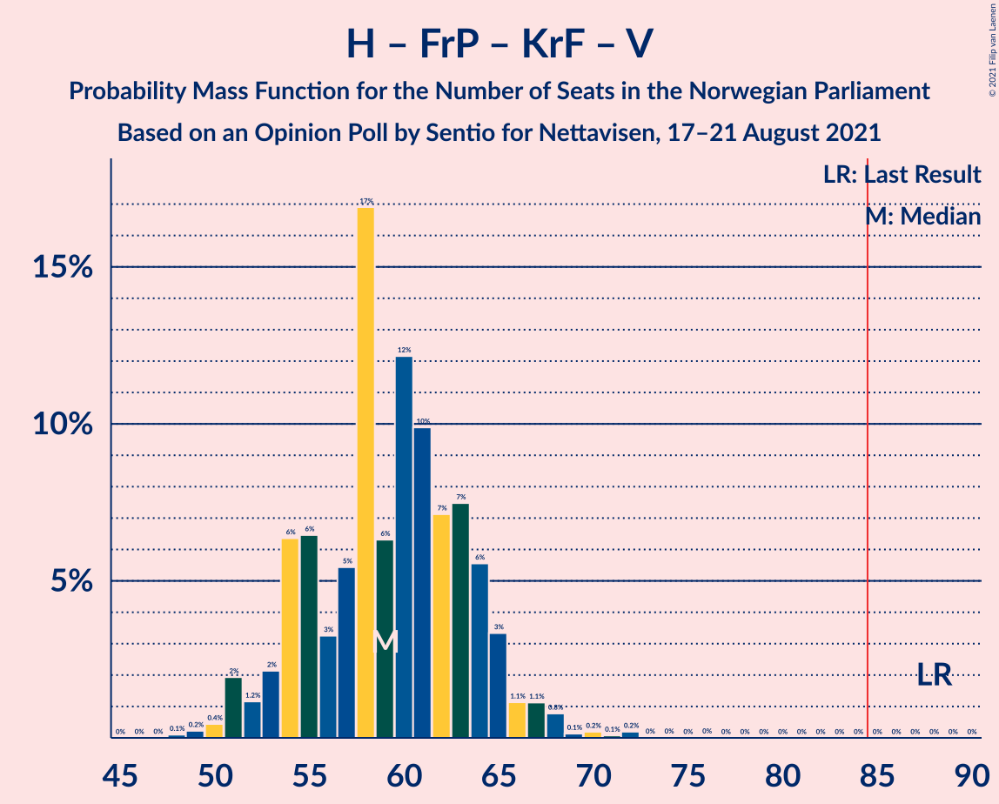

| Number of Seats | Probability | Accumulated | Special Marks |
|:---------------:|:-----------:|:-----------:|:-------------:|
| 48 | 0.1% | 100% |  |
| 49 | 0.2% | 99.9% |  |
| 50 | 0.4% | 99.7% |  |
| 51 | 2% | 99.2% |  |
| 52 | 1.2% | 97% |  |
| 53 | 2% | 96% |  |
| 54 | 6% | 94% |  |
| 55 | 6% | 88% |  |
| 56 | 3% | 81% |  |
| 57 | 5% | 78% | Median |
| 58 | 17% | 72% |  |
| 59 | 6% | 56% |  |
| 60 | 12% | 49% |  |
| 61 | 10% | 37% |  |
| 62 | 7% | 27% |  |
| 63 | 7% | 20% |  |
| 64 | 6% | 13% |  |
| 65 | 3% | 7% |  |
| 66 | 1.1% | 4% |  |
| 67 | 1.1% | 3% |  |
| 68 | 0.8% | 1.4% |  |
| 69 | 0.1% | 0.7% |  |
| 70 | 0.2% | 0.5% |  |
| 71 | 0.1% | 0.3% |  |
| 72 | 0.2% | 0.3% |  |
| 73 | 0% | 0.1% |  |
| 74 | 0% | 0% |  |
| 75 | 0% | 0% |  |
| 76 | 0% | 0% |  |
| 77 | 0% | 0% |  |
| 78 | 0% | 0% |  |
| 79 | 0% | 0% |  |
| 80 | 0% | 0% |  |
| 81 | 0% | 0% |  |
| 82 | 0% | 0% |  |
| 83 | 0% | 0% |  |
| 84 | 0% | 0% |  |
| 85 | 0% | 0% | Majority |
| 86 | 0% | 0% |  |
| 87 | 0% | 0% |  |
| 88 | 0% | 0% | Last Result |

### Arbeiderpartiet – Sosialistisk Venstreparti

| Number of Seats | Probability | Accumulated | Special Marks |
|:---------------:|:-----------:|:-----------:|:-------------:|
| 50 | 0% | 100% |  |
| 51 | 0.3% | 99.9% |  |
| 52 | 0.4% | 99.6% |  |
| 53 | 1.3% | 99.3% |  |
| 54 | 2% | 98% |  |
| 55 | 7% | 96% |  |
| 56 | 6% | 89% |  |
| 57 | 24% | 83% |  |
| 58 | 13% | 59% | Median |
| 59 | 17% | 46% |  |
| 60 | 15% | 29% | Last Result |
| 61 | 4% | 14% |  |
| 62 | 4% | 9% |  |
| 63 | 3% | 6% |  |
| 64 | 1.0% | 3% |  |
| 65 | 0.7% | 2% |  |
| 66 | 0.6% | 1.2% |  |
| 67 | 0.2% | 0.6% |  |
| 68 | 0.3% | 0.4% |  |
| 69 | 0.1% | 0.1% |  |
| 70 | 0% | 0% |  |

### Høyre – Fremskrittspartiet – Venstre

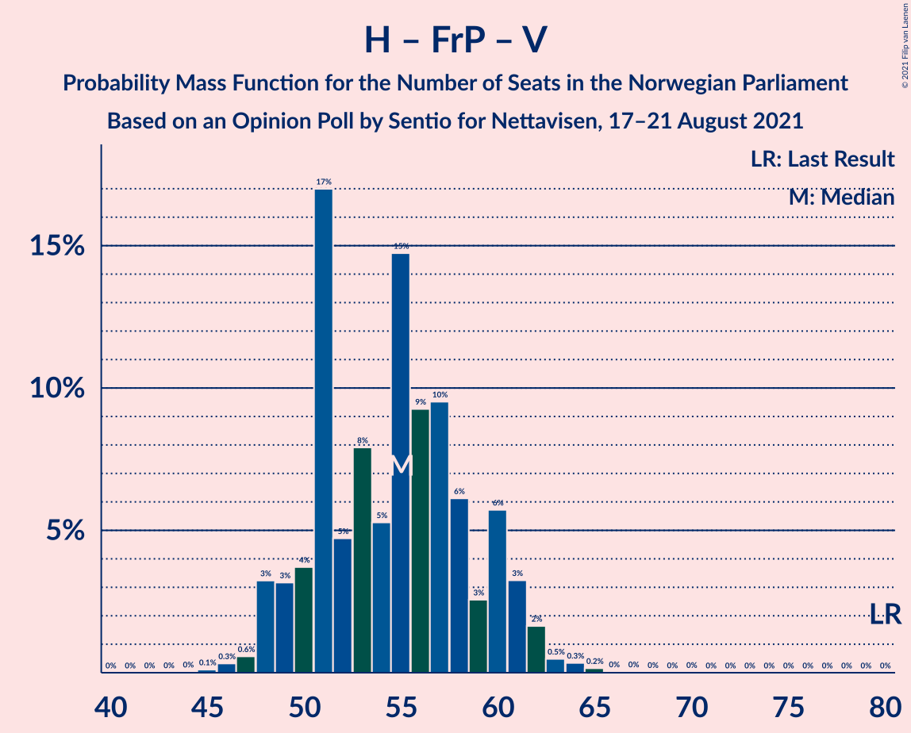

| Number of Seats | Probability | Accumulated | Special Marks |
|:---------------:|:-----------:|:-----------:|:-------------:|
| 45 | 0.1% | 100% |  |
| 46 | 0.3% | 99.8% |  |
| 47 | 0.6% | 99.5% |  |
| 48 | 3% | 98.9% |  |
| 49 | 3% | 96% |  |
| 50 | 4% | 93% |  |
| 51 | 17% | 89% |  |
| 52 | 5% | 72% |  |
| 53 | 8% | 67% |  |
| 54 | 5% | 59% | Median |
| 55 | 15% | 54% |  |
| 56 | 9% | 39% |  |
| 57 | 10% | 30% |  |
| 58 | 6% | 20% |  |
| 59 | 3% | 14% |  |
| 60 | 6% | 12% |  |
| 61 | 3% | 6% |  |
| 62 | 2% | 3% |  |
| 63 | 0.5% | 1.1% |  |
| 64 | 0.3% | 0.6% |  |
| 65 | 0.2% | 0.3% |  |
| 66 | 0% | 0.1% |  |
| 67 | 0% | 0.1% |  |
| 68 | 0% | 0% |  |
| 69 | 0% | 0% |  |
| 70 | 0% | 0% |  |
| 71 | 0% | 0% |  |
| 72 | 0% | 0% |  |
| 73 | 0% | 0% |  |
| 74 | 0% | 0% |  |
| 75 | 0% | 0% |  |
| 76 | 0% | 0% |  |
| 77 | 0% | 0% |  |
| 78 | 0% | 0% |  |
| 79 | 0% | 0% |  |
| 80 | 0% | 0% | Last Result |

### Høyre – Fremskrittspartiet

| Number of Seats | Probability | Accumulated | Special Marks |
|:---------------:|:-----------:|:-----------:|:-------------:|
| 41 | 0.1% | 100% |  |
| 42 | 0.1% | 99.9% |  |
| 43 | 0.6% | 99.9% |  |
| 44 | 0.8% | 99.3% |  |
| 45 | 2% | 98.5% |  |
| 46 | 4% | 97% |  |
| 47 | 5% | 93% |  |
| 48 | 5% | 88% |  |
| 49 | 22% | 83% |  |
| 50 | 7% | 61% |  |
| 51 | 11% | 54% |  |
| 52 | 9% | 44% | Median |
| 53 | 17% | 35% |  |
| 54 | 8% | 18% |  |
| 55 | 7% | 10% |  |
| 56 | 1.5% | 3% |  |
| 57 | 0.7% | 2% |  |
| 58 | 0.4% | 0.9% |  |
| 59 | 0.2% | 0.5% |  |
| 60 | 0.2% | 0.3% |  |
| 61 | 0.1% | 0.1% |  |
| 62 | 0% | 0.1% |  |
| 63 | 0% | 0% |  |
| 64 | 0% | 0% |  |
| 65 | 0% | 0% |  |
| 66 | 0% | 0% |  |
| 67 | 0% | 0% |  |
| 68 | 0% | 0% |  |
| 69 | 0% | 0% |  |
| 70 | 0% | 0% |  |
| 71 | 0% | 0% |  |
| 72 | 0% | 0% | Last Result |

### Høyre – Kristelig Folkeparti – Venstre

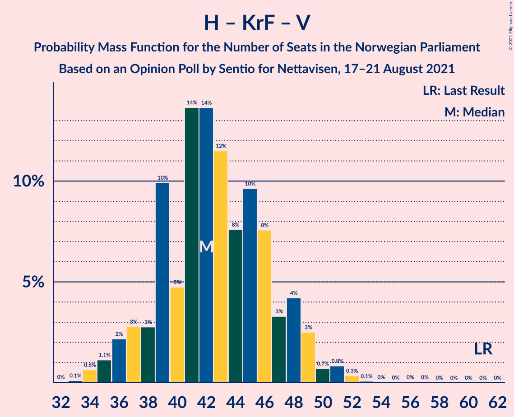

| Number of Seats | Probability | Accumulated | Special Marks |
|:---------------:|:-----------:|:-----------:|:-------------:|
| 32 | 0% | 100% |  |
| 33 | 0.1% | 99.9% |  |
| 34 | 0.6% | 99.8% |  |
| 35 | 1.1% | 99.2% |  |
| 36 | 2% | 98% |  |
| 37 | 3% | 96% |  |
| 38 | 3% | 93% |  |
| 39 | 10% | 90% |  |
| 40 | 5% | 80% | Median |
| 41 | 14% | 76% |  |
| 42 | 14% | 62% |  |
| 43 | 12% | 48% |  |
| 44 | 8% | 37% |  |
| 45 | 10% | 29% |  |
| 46 | 8% | 20% |  |
| 47 | 3% | 12% |  |
| 48 | 4% | 9% |  |
| 49 | 3% | 5% |  |
| 50 | 0.7% | 2% |  |
| 51 | 0.8% | 1.4% |  |
| 52 | 0.3% | 0.5% |  |
| 53 | 0.1% | 0.2% |  |
| 54 | 0% | 0.1% |  |
| 55 | 0% | 0.1% |  |
| 56 | 0% | 0.1% |  |
| 57 | 0% | 0% |  |
| 58 | 0% | 0% |  |
| 59 | 0% | 0% |  |
| 60 | 0% | 0% |  |
| 61 | 0% | 0% | Last Result |

### Senterpartiet – Kristelig Folkeparti – Venstre

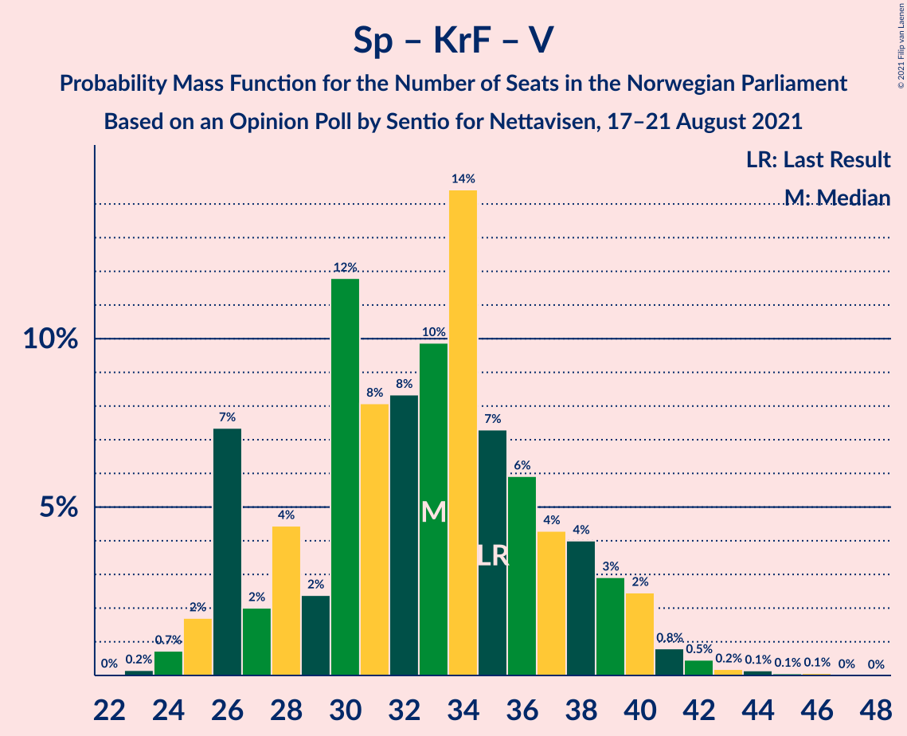

| Number of Seats | Probability | Accumulated | Special Marks |
|:---------------:|:-----------:|:-----------:|:-------------:|
| 22 | 0% | 100% |  |
| 23 | 0.2% | 99.9% |  |
| 24 | 0.7% | 99.8% |  |
| 25 | 2% | 99.1% |  |
| 26 | 7% | 97% |  |
| 27 | 2% | 90% |  |
| 28 | 4% | 88% |  |
| 29 | 2% | 84% |  |
| 30 | 12% | 81% | Median |
| 31 | 8% | 69% |  |
| 32 | 8% | 61% |  |
| 33 | 10% | 53% |  |
| 34 | 14% | 43% |  |
| 35 | 7% | 29% | Last Result |
| 36 | 6% | 21% |  |
| 37 | 4% | 15% |  |
| 38 | 4% | 11% |  |
| 39 | 3% | 7% |  |
| 40 | 2% | 4% |  |
| 41 | 0.8% | 2% |  |
| 42 | 0.5% | 1.0% |  |
| 43 | 0.2% | 0.5% |  |
| 44 | 0.1% | 0.3% |  |
| 45 | 0.1% | 0.2% |  |
| 46 | 0.1% | 0.1% |  |
| 47 | 0% | 0% |  |

## Technical Information

### Opinion Poll

+ **Polling firm:** Sentio
+ **Commissioner(s):** Nettavisen
+ **Fieldwork period:** 17–21 August 2021

### Calculations

+ **Sample size:** 1000
+ **Simulations done:** 1,048,576
+ **Error estimate:** 1.45%

