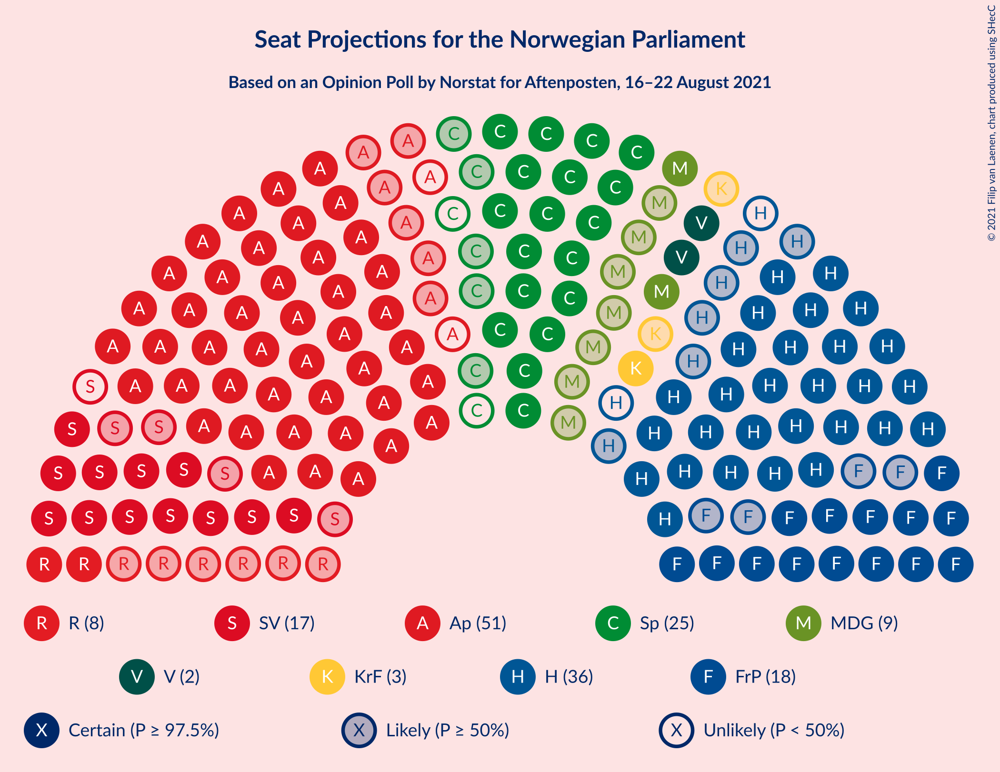
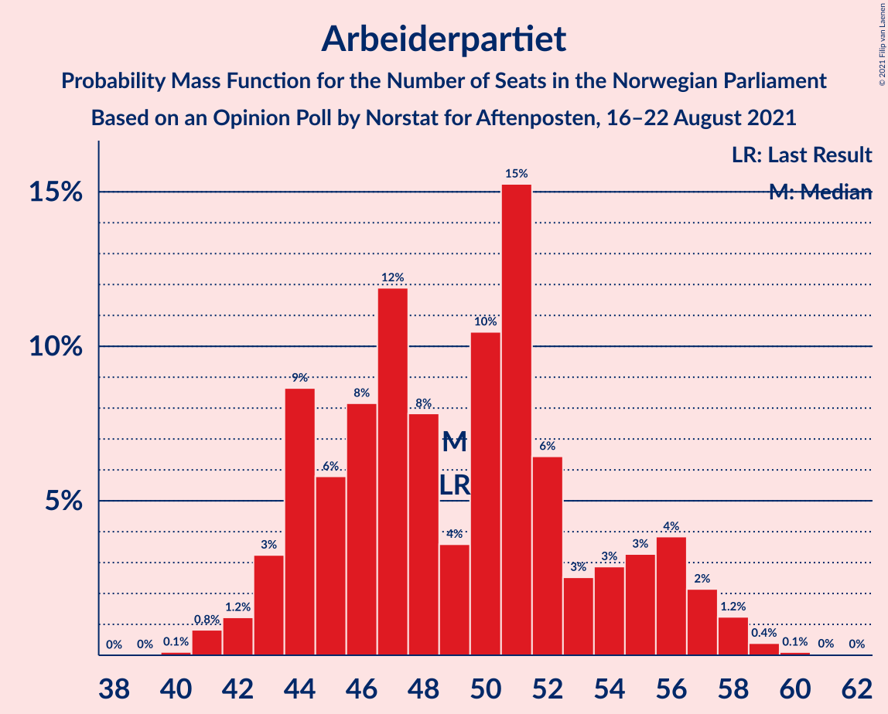
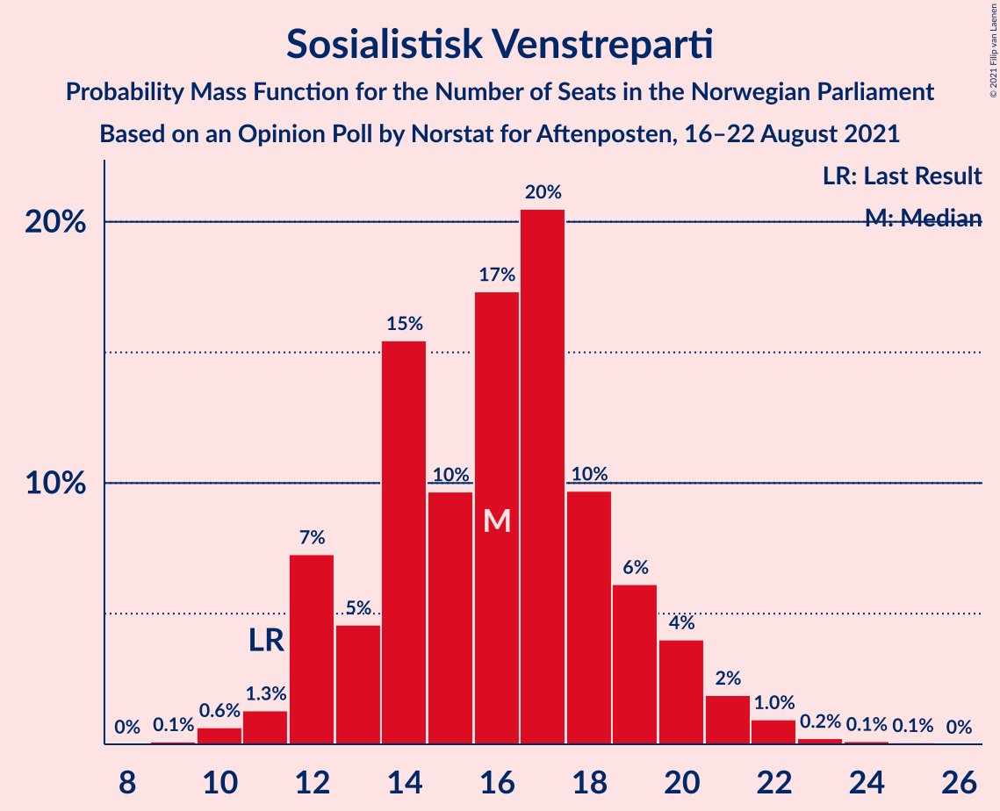
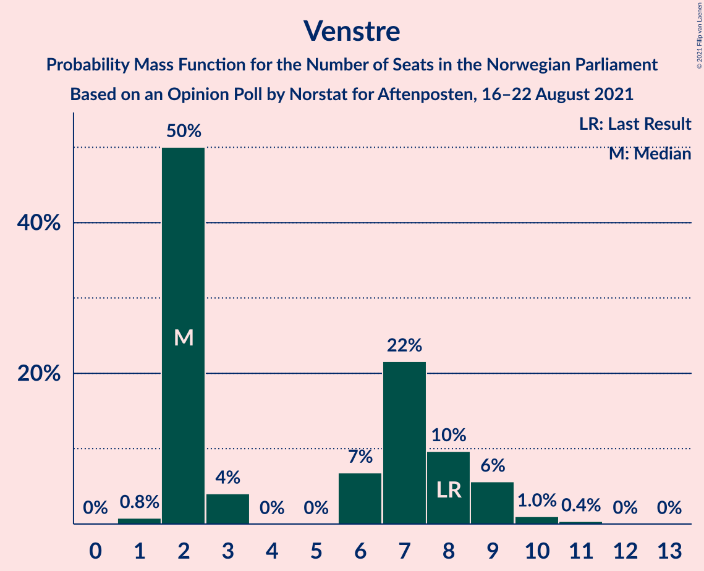
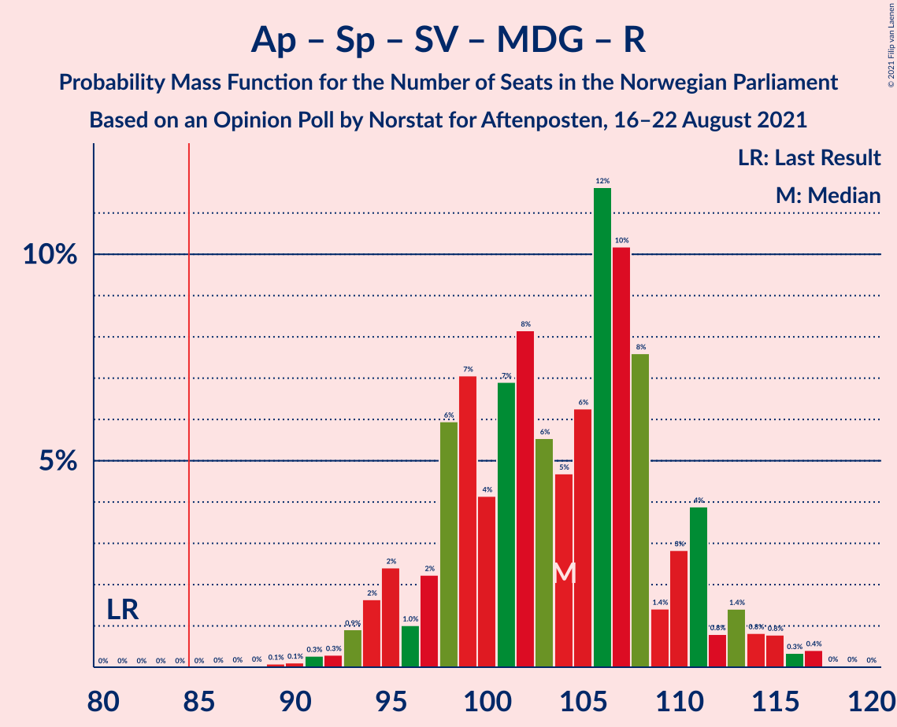
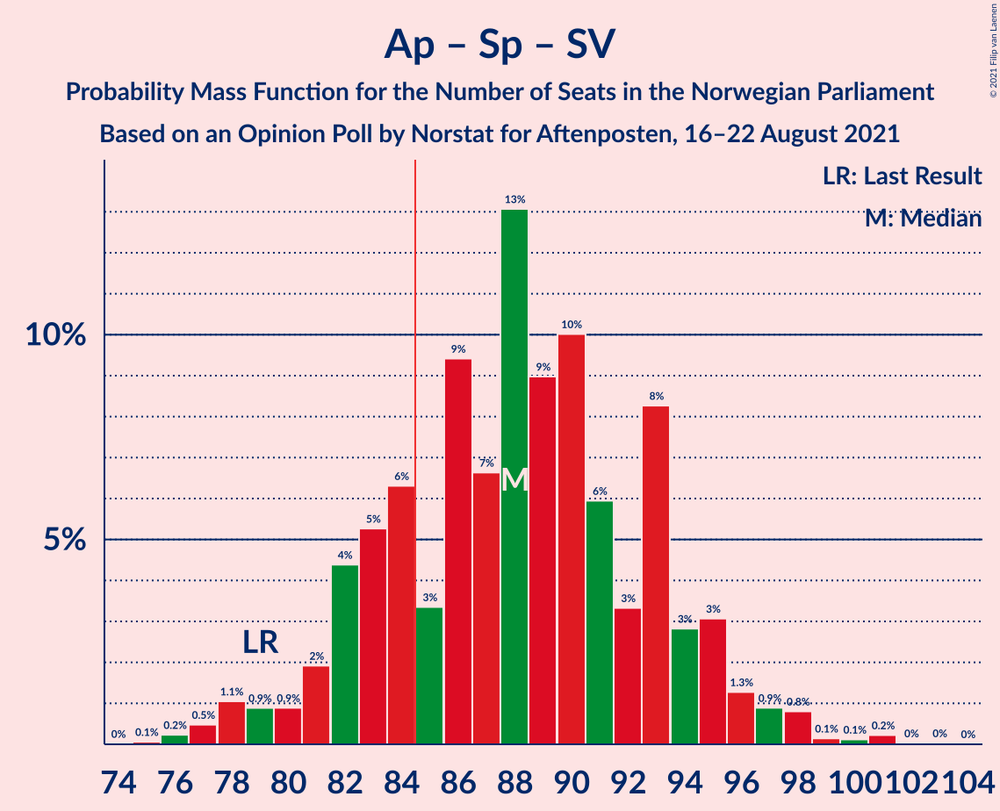
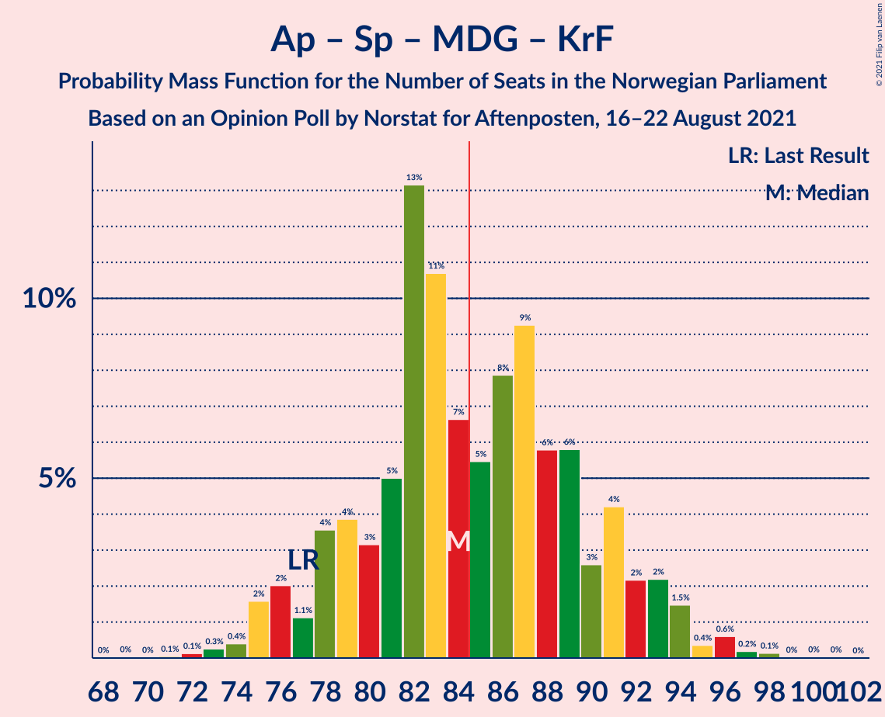
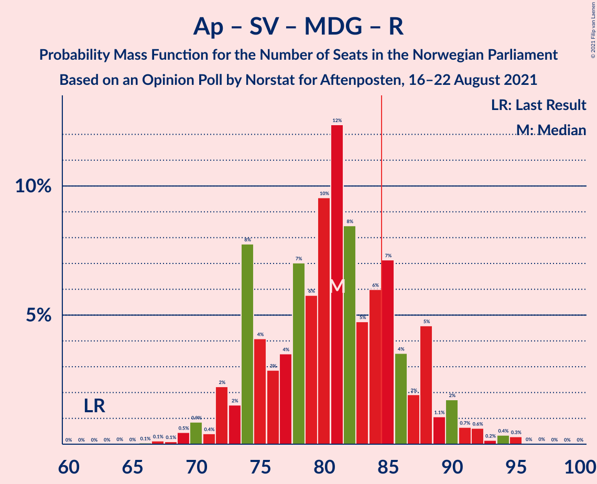
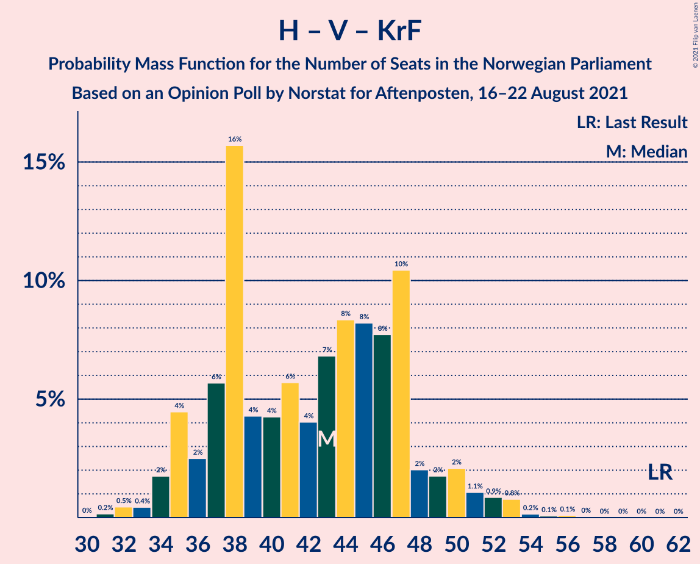

# Opinion Poll by Norstat for Aftenposten, 16–22 August 2021

<a href="#voting-intentions">Voting Intentions</a> | <a href="#seats">Seats</a> | <a href="#coalitions">Coalitions</a> | <a href="#technical-information">Technical Information</a>

## Voting Intentions

### Confidence Intervals

| Party | Last Result | Poll Result | 80% Confidence Interval | 90% Confidence Interval | 95% Confidence Interval | 99% Confidence Interval |
|:-----:|:-----------:|:-----------:|:-----------------------:|:-----------------------:|:-----------------------:|:-----------------------:|
| Arbeiderpartiet | 27.4% | 26.8% | 24.6–29.1% |24.0–29.8% |23.4–30.4% |22.4–31.5% |
| Høyre | 25.0% | 18.9% | 17.1–21.1% |16.5–21.7% |16.1–22.2% |15.2–23.3% |
| Senterpartiet | 10.3% | 12.7% | 11.2–14.6% |10.7–15.1% |10.3–15.6% |9.6–16.5% |
| Fremskrittspartiet | 15.2% | 10.5% | 9.1–12.2% |8.7–12.7% |8.3–13.2% |7.7–14.0% |
| Sosialistisk Venstreparti | 6.0% | 9.6% | 8.2–11.2% |7.8–11.7% |7.5–12.1% |6.9–13.0% |
| Miljøpartiet De Grønne | 3.2% | 5.3% | 4.3–6.6% |4.0–7.0% |3.8–7.3% |3.3–8.0% |
| Rødt | 2.4% | 4.6% | 3.7–5.9% |3.4–6.2% |3.2–6.6% |2.9–7.2% |
| Venstre | 4.4% | 3.8% | 3.0–5.0% |2.8–5.3% |2.6–5.6% |2.2–6.2% |
| Kristelig Folkeparti | 4.2% | 3.7% | 2.9–4.8% |2.6–5.2% |2.5–5.4% |2.1–6.1% |

*Note:* The poll result column reflects the actual value used in the calculations. Published results may vary slightly, and in addition be rounded to fewer digits.

## Seats

### Confidence Intervals

| Party | Last Result | Median | 80% Confidence Interval | 90% Confidence Interval | 95% Confidence Interval | 99% Confidence Interval |
|:-----:|:-----------:|:------:|:-----------------------:|:-----------------------:|:-----------------------:|:-----------------------:|
| <a href="#arbeiderpartiet">Arbeiderpartiet</a> | 49 | 48 | 44–55 |44–58 |43–58 |41–59 |
| <a href="#høyre">Høyre</a> | 45 | 32 | 31–38 |29–39 |28–40 |25–42 |
| <a href="#senterpartiet">Senterpartiet</a> | 19 | 22 | 19–26 |18–28 |18–29 |16–31 |
| <a href="#fremskrittspartiet">Fremskrittspartiet</a> | 27 | 18 | 15–21 |14–23 |14–24 |12–26 |
| <a href="#sosialistisk-venstreparti">Sosialistisk Venstreparti</a> | 11 | 16 | 12–19 |12–20 |12–21 |11–22 |
| <a href="#miljøpartiet-de-grønne">Miljøpartiet De Grønne</a> | 1 | 9 | 7–11 |4–11 |2–13 |2–14 |
| <a href="#rødt">Rødt</a> | 1 | 8 | 2–10 |2–11 |2–11 |2–12 |
| <a href="#venstre">Venstre</a> | 8 | 7 | 2–9 |2–9 |2–9 |1–10 |
| <a href="#kristelig-folkeparti">Kristelig Folkeparti</a> | 8 | 3 | 1–8 |1–8 |1–9 |1–10 |

### Arbeiderpartiet

*For a full overview of the results for this party, see the [Arbeiderpartiet](party-arbeiderpartiet.html) page.*

| Number of Seats | Probability | Accumulated | Special Marks |
|:---------------:|:-----------:|:-----------:|:-------------:|
| 40 | 0.1% | 100% |  |
| 41 | 1.0% | 99.8% |  |
| 42 | 0.8% | 98.8% |  |
| 43 | 2% | 98% |  |
| 44 | 9% | 96% |  |
| 45 | 4% | 87% |  |
| 46 | 3% | 83% |  |
| 47 | 24% | 80% |  |
| 48 | 10% | 56% | Median |
| 49 | 1.4% | 46% | Last Result |
| 50 | 5% | 45% |  |
| 51 | 5% | 39% |  |
| 52 | 21% | 34% |  |
| 53 | 1.0% | 13% |  |
| 54 | 2% | 12% |  |
| 55 | 1.1% | 10% |  |
| 56 | 0.4% | 9% |  |
| 57 | 1.5% | 9% |  |
| 58 | 6% | 7% |  |
| 59 | 1.2% | 1.4% |  |
| 60 | 0.1% | 0.2% |  |
| 61 | 0.1% | 0.1% |  |
| 62 | 0% | 0% |  |

### Høyre

*For a full overview of the results for this party, see the [Høyre](party-høyre.html) page.*

| Number of Seats | Probability | Accumulated | Special Marks |
|:---------------:|:-----------:|:-----------:|:-------------:|
| 23 | 0.1% | 100% |  |
| 24 | 0.3% | 99.9% |  |
| 25 | 0.4% | 99.6% |  |
| 26 | 0.3% | 99.3% |  |
| 27 | 0.1% | 98.9% |  |
| 28 | 2% | 98.9% |  |
| 29 | 2% | 97% |  |
| 30 | 3% | 95% |  |
| 31 | 7% | 92% |  |
| 32 | 39% | 85% | Median |
| 33 | 7% | 46% |  |
| 34 | 6% | 39% |  |
| 35 | 12% | 33% |  |
| 36 | 6% | 21% |  |
| 37 | 5% | 15% |  |
| 38 | 4% | 10% |  |
| 39 | 2% | 7% |  |
| 40 | 2% | 5% |  |
| 41 | 1.3% | 2% |  |
| 42 | 0.9% | 1.0% |  |
| 43 | 0.1% | 0.2% |  |
| 44 | 0% | 0% |  |
| 45 | 0% | 0% | Last Result |

### Senterpartiet

*For a full overview of the results for this party, see the [Senterpartiet](party-senterpartiet.html) page.*

| Number of Seats | Probability | Accumulated | Special Marks |
|:---------------:|:-----------:|:-----------:|:-------------:|
| 15 | 0.1% | 100% |  |
| 16 | 0.4% | 99.9% |  |
| 17 | 0.4% | 99.5% |  |
| 18 | 4% | 99.1% |  |
| 19 | 7% | 95% | Last Result |
| 20 | 20% | 88% |  |
| 21 | 7% | 68% |  |
| 22 | 12% | 61% | Median |
| 23 | 26% | 49% |  |
| 24 | 2% | 23% |  |
| 25 | 7% | 21% |  |
| 26 | 4% | 14% |  |
| 27 | 3% | 10% |  |
| 28 | 2% | 7% |  |
| 29 | 3% | 5% |  |
| 30 | 0.5% | 1.2% |  |
| 31 | 0.2% | 0.7% |  |
| 32 | 0.4% | 0.5% |  |
| 33 | 0.1% | 0.1% |  |
| 34 | 0% | 0% |  |

### Fremskrittspartiet

*For a full overview of the results for this party, see the [Fremskrittspartiet](party-fremskrittspartiet.html) page.*

| Number of Seats | Probability | Accumulated | Special Marks |
|:---------------:|:-----------:|:-----------:|:-------------:|
| 10 | 0.2% | 100% |  |
| 11 | 0.3% | 99.8% |  |
| 12 | 0.5% | 99.5% |  |
| 13 | 0.4% | 99.1% |  |
| 14 | 7% | 98.6% |  |
| 15 | 6% | 92% |  |
| 16 | 7% | 86% |  |
| 17 | 7% | 79% |  |
| 18 | 32% | 72% | Median |
| 19 | 6% | 39% |  |
| 20 | 22% | 34% |  |
| 21 | 4% | 12% |  |
| 22 | 3% | 8% |  |
| 23 | 2% | 5% |  |
| 24 | 0.9% | 3% |  |
| 25 | 0.8% | 2% |  |
| 26 | 1.4% | 2% |  |
| 27 | 0.1% | 0.1% | Last Result |
| 28 | 0% | 0.1% |  |
| 29 | 0% | 0% |  |

### Sosialistisk Venstreparti

*For a full overview of the results for this party, see the [Sosialistisk Venstreparti](party-sosialistiskvenstreparti.html) page.*

| Number of Seats | Probability | Accumulated | Special Marks |
|:---------------:|:-----------:|:-----------:|:-------------:|
| 9 | 0.1% | 100% |  |
| 10 | 0.4% | 99.9% |  |
| 11 | 1.0% | 99.5% | Last Result |
| 12 | 17% | 98.5% |  |
| 13 | 4% | 81% |  |
| 14 | 13% | 77% |  |
| 15 | 9% | 64% |  |
| 16 | 6% | 55% | Median |
| 17 | 6% | 48% |  |
| 18 | 30% | 42% |  |
| 19 | 3% | 12% |  |
| 20 | 5% | 9% |  |
| 21 | 2% | 4% |  |
| 22 | 2% | 2% |  |
| 23 | 0% | 0.3% |  |
| 24 | 0% | 0.2% |  |
| 25 | 0.2% | 0.2% |  |
| 26 | 0% | 0% |  |

### Miljøpartiet De Grønne

*For a full overview of the results for this party, see the [Miljøpartiet De Grønne](party-miljøpartietdegrønne.html) page.*

| Number of Seats | Probability | Accumulated | Special Marks |
|:---------------:|:-----------:|:-----------:|:-------------:|
| 1 | 0.1% | 100% | Last Result |
| 2 | 4% | 99.9% |  |
| 3 | 0.6% | 96% |  |
| 4 | 0.2% | 95% |  |
| 5 | 0% | 95% |  |
| 6 | 0.5% | 95% |  |
| 7 | 19% | 94% |  |
| 8 | 17% | 75% |  |
| 9 | 13% | 58% | Median |
| 10 | 35% | 46% |  |
| 11 | 7% | 10% |  |
| 12 | 0.9% | 4% |  |
| 13 | 2% | 3% |  |
| 14 | 0.3% | 0.5% |  |
| 15 | 0.2% | 0.2% |  |
| 16 | 0% | 0% |  |

### Rødt

*For a full overview of the results for this party, see the [Rødt](party-rødt.html) page.*

| Number of Seats | Probability | Accumulated | Special Marks |
|:---------------:|:-----------:|:-----------:|:-------------:|
| 1 | 0.5% | 100% | Last Result |
| 2 | 20% | 99.5% |  |
| 3 | 0% | 80% |  |
| 4 | 0% | 80% |  |
| 5 | 0% | 80% |  |
| 6 | 6% | 79% |  |
| 7 | 22% | 73% |  |
| 8 | 9% | 51% | Median |
| 9 | 32% | 42% |  |
| 10 | 5% | 10% |  |
| 11 | 4% | 5% |  |
| 12 | 1.0% | 1.1% |  |
| 13 | 0.1% | 0.2% |  |
| 14 | 0% | 0.1% |  |
| 15 | 0% | 0.1% |  |
| 16 | 0% | 0% |  |

### Venstre

*For a full overview of the results for this party, see the [Venstre](party-venstre.html) page.*

| Number of Seats | Probability | Accumulated | Special Marks |
|:---------------:|:-----------:|:-----------:|:-------------:|
| 1 | 0.7% | 100% |  |
| 2 | 27% | 99.3% |  |
| 3 | 4% | 72% |  |
| 4 | 0% | 68% |  |
| 5 | 0% | 68% |  |
| 6 | 3% | 68% |  |
| 7 | 32% | 65% | Median |
| 8 | 5% | 33% | Last Result |
| 9 | 26% | 28% |  |
| 10 | 1.5% | 2% |  |
| 11 | 0.4% | 0.4% |  |
| 12 | 0.1% | 0.1% |  |
| 13 | 0% | 0% |  |

### Kristelig Folkeparti

*For a full overview of the results for this party, see the [Kristelig Folkeparti](party-kristeligfolkeparti.html) page.*

| Number of Seats | Probability | Accumulated | Special Marks |
|:---------------:|:-----------:|:-----------:|:-------------:|
| 0 | 0.4% | 100% |  |
| 1 | 13% | 99.6% |  |
| 2 | 7% | 87% |  |
| 3 | 40% | 80% | Median |
| 4 | 0% | 39% |  |
| 5 | 0.1% | 39% |  |
| 6 | 15% | 39% |  |
| 7 | 10% | 24% |  |
| 8 | 11% | 14% | Last Result |
| 9 | 1.4% | 3% |  |
| 10 | 1.1% | 1.3% |  |
| 11 | 0.1% | 0.2% |  |
| 12 | 0.1% | 0.1% |  |
| 13 | 0% | 0% |  |

## Coalitions

### Confidence Intervals

| Coalition | Last Result | Median | Majority? | 80% Confidence Interval | 90% Confidence Interval | 95% Confidence Interval | 99% Confidence Interval |
|:---------:|:-----------:|:------:|:---------:|:-----------------------:|:-----------------------:|:-----------------------:|:-----------------------:|
| Arbeiderpartiet – Senterpartiet – Sosialistisk Venstreparti – Miljøpartiet De Grønne – Rødt | 81 | 103 | 100% | 97–110 | 94–110 | 94–114 | 92–115 |
| Arbeiderpartiet – Senterpartiet – Sosialistisk Venstreparti – Miljøpartiet De Grønne – Kristelig Folkeparti | 88 | 101 | 99.9% | 96–105 | 94–108 | 90–109 | 89–112 |
| Arbeiderpartiet – Senterpartiet – Sosialistisk Venstreparti – Miljøpartiet De Grønne | 80 | 98 | 99.8% | 90–102 | 88–103 | 87–106 | 86–107 |
| Arbeiderpartiet – Senterpartiet – Sosialistisk Venstreparti – Rødt | 80 | 95 | 96% | 89–102 | 85–103 | 84–105 | 84–106 |
| Arbeiderpartiet – Senterpartiet – Sosialistisk Venstreparti | 79 | 88 | 72% | 83–94 | 78–95 | 78–96 | 76–99 |
| Høyre – Senterpartiet – Fremskrittspartiet – Venstre – Kristelig Folkeparti | 107 | 85 | 67% | 79–89 | 76–92 | 74–94 | 72–94 |
| Arbeiderpartiet – Senterpartiet – Miljøpartiet De Grønne – Kristelig Folkeparti | 77 | 84 | 47% | 81–91 | 77–92 | 76–93 | 72–96 |
| Arbeiderpartiet – Sosialistisk Venstreparti – Miljøpartiet De Grønne – Rødt | 62 | 81 | 18% | 75–87 | 74–88 | 70–90 | 69–95 |
| Arbeiderpartiet – Senterpartiet – Kristelig Folkeparti | 76 | 75 | 2% | 71–83 | 69–83 | 67–84 | 65–87 |
| Arbeiderpartiet – Senterpartiet | 68 | 71 | 0.3% | 67–78 | 63–80 | 63–80 | 62–82 |
| Høyre – Fremskrittspartiet – Miljøpartiet De Grønne – Venstre – Kristelig Folkeparti | 89 | 72 | 0.1% | 65–77 | 63–78 | 62–80 | 57–82 |
| Arbeiderpartiet – Sosialistisk Venstreparti | 60 | 65 | 0% | 59–72 | 59–72 | 58–73 | 56–75 |
| Høyre – Fremskrittspartiet – Venstre – Kristelig Folkeparti | 88 | 62 | 0% | 56–68 | 54–69 | 53–71 | 50–72 |
| Høyre – Fremskrittspartiet – Venstre | 80 | 59 | 0% | 53–61 | 52–63 | 50–65 | 44–69 |
| Høyre – Fremskrittspartiet | 72 | 51 | 0% | 49–57 | 48–59 | 46–61 | 41–62 |
| Høyre – Venstre – Kristelig Folkeparti | 61 | 44 | 0% | 38–48 | 36–50 | 34–52 | 32–53 |
| Senterpartiet – Venstre – Kristelig Folkeparti | 35 | 33 | 0% | 26–37 | 25–39 | 23–42 | 22–44 |

### Arbeiderpartiet – Senterpartiet – Sosialistisk Venstreparti – Miljøpartiet De Grønne – Rødt

| Number of Seats | Probability | Accumulated | Special Marks |
|:---------------:|:-----------:|:-----------:|:-------------:|
| 81 | 0% | 100% | Last Result |
| 82 | 0% | 100% |  |
| 83 | 0% | 100% |  |
| 84 | 0% | 100% |  |
| 85 | 0% | 100% | Majority |
| 86 | 0% | 100% |  |
| 87 | 0.1% | 100% |  |
| 88 | 0% | 99.9% |  |
| 89 | 0.1% | 99.8% |  |
| 90 | 0.1% | 99.8% |  |
| 91 | 0% | 99.6% |  |
| 92 | 0.2% | 99.6% |  |
| 93 | 0.2% | 99.4% |  |
| 94 | 5% | 99.2% |  |
| 95 | 2% | 94% |  |
| 96 | 1.4% | 93% |  |
| 97 | 1.4% | 91% |  |
| 98 | 17% | 90% |  |
| 99 | 5% | 73% |  |
| 100 | 4% | 68% |  |
| 101 | 4% | 64% |  |
| 102 | 4% | 60% |  |
| 103 | 6% | 56% | Median |
| 104 | 3% | 50% |  |
| 105 | 3% | 47% |  |
| 106 | 3% | 44% |  |
| 107 | 23% | 40% |  |
| 108 | 4% | 18% |  |
| 109 | 2% | 14% |  |
| 110 | 7% | 12% |  |
| 111 | 0.5% | 5% |  |
| 112 | 0.2% | 4% |  |
| 113 | 1.3% | 4% |  |
| 114 | 0.5% | 3% |  |
| 115 | 2% | 2% |  |
| 116 | 0.1% | 0.4% |  |
| 117 | 0.1% | 0.3% |  |
| 118 | 0.1% | 0.2% |  |
| 119 | 0.1% | 0.1% |  |
| 120 | 0% | 0% |  |

### Arbeiderpartiet – Senterpartiet – Sosialistisk Venstreparti – Miljøpartiet De Grønne – Kristelig Folkeparti

| Number of Seats | Probability | Accumulated | Special Marks |
|:---------------:|:-----------:|:-----------:|:-------------:|
| 84 | 0.1% | 100% |  |
| 85 | 0% | 99.9% | Majority |
| 86 | 0% | 99.9% |  |
| 87 | 0% | 99.9% |  |
| 88 | 0.3% | 99.9% | Last Result |
| 89 | 1.3% | 99.6% |  |
| 90 | 1.0% | 98% |  |
| 91 | 0.6% | 97% |  |
| 92 | 0.9% | 97% |  |
| 93 | 0.1% | 96% |  |
| 94 | 1.0% | 96% |  |
| 95 | 0.9% | 95% |  |
| 96 | 5% | 94% |  |
| 97 | 17% | 89% |  |
| 98 | 5% | 72% | Median |
| 99 | 4% | 67% |  |
| 100 | 5% | 63% |  |
| 101 | 26% | 59% |  |
| 102 | 5% | 33% |  |
| 103 | 4% | 27% |  |
| 104 | 6% | 24% |  |
| 105 | 9% | 18% |  |
| 106 | 0.5% | 9% |  |
| 107 | 0.3% | 8% |  |
| 108 | 3% | 8% |  |
| 109 | 3% | 5% |  |
| 110 | 0.7% | 2% |  |
| 111 | 0.6% | 1.2% |  |
| 112 | 0.3% | 0.6% |  |
| 113 | 0.2% | 0.3% |  |
| 114 | 0% | 0.1% |  |
| 115 | 0% | 0.1% |  |
| 116 | 0.1% | 0.1% |  |
| 117 | 0% | 0% |  |

### Arbeiderpartiet – Senterpartiet – Sosialistisk Venstreparti – Miljøpartiet De Grønne

| Number of Seats | Probability | Accumulated | Special Marks |
|:---------------:|:-----------:|:-----------:|:-------------:|
| 80 | 0% | 100% | Last Result |
| 81 | 0% | 100% |  |
| 82 | 0.1% | 100% |  |
| 83 | 0.1% | 99.9% |  |
| 84 | 0% | 99.8% |  |
| 85 | 0.2% | 99.8% | Majority |
| 86 | 2% | 99.6% |  |
| 87 | 0.5% | 98% |  |
| 88 | 5% | 97% |  |
| 89 | 0.8% | 92% |  |
| 90 | 2% | 91% |  |
| 91 | 17% | 90% |  |
| 92 | 2% | 73% |  |
| 93 | 2% | 71% |  |
| 94 | 2% | 70% |  |
| 95 | 3% | 67% | Median |
| 96 | 3% | 65% |  |
| 97 | 8% | 62% |  |
| 98 | 28% | 54% |  |
| 99 | 5% | 26% |  |
| 100 | 1.4% | 21% |  |
| 101 | 6% | 20% |  |
| 102 | 8% | 14% |  |
| 103 | 2% | 6% |  |
| 104 | 0.4% | 4% |  |
| 105 | 0.2% | 3% |  |
| 106 | 2% | 3% |  |
| 107 | 0.8% | 1.3% |  |
| 108 | 0.1% | 0.5% |  |
| 109 | 0.1% | 0.4% |  |
| 110 | 0.1% | 0.3% |  |
| 111 | 0.1% | 0.2% |  |
| 112 | 0% | 0.1% |  |
| 113 | 0% | 0.1% |  |
| 114 | 0% | 0% |  |

### Arbeiderpartiet – Senterpartiet – Sosialistisk Venstreparti – Rødt

| Number of Seats | Probability | Accumulated | Special Marks |
|:---------------:|:-----------:|:-----------:|:-------------:|
| 80 | 0.1% | 100% | Last Result |
| 81 | 0.1% | 99.9% |  |
| 82 | 0.1% | 99.8% |  |
| 83 | 0.1% | 99.7% |  |
| 84 | 4% | 99.6% |  |
| 85 | 1.5% | 96% | Majority |
| 86 | 1.2% | 94% |  |
| 87 | 1.1% | 93% |  |
| 88 | 2% | 92% |  |
| 89 | 3% | 90% |  |
| 90 | 1.4% | 87% |  |
| 91 | 20% | 86% |  |
| 92 | 5% | 66% |  |
| 93 | 5% | 61% |  |
| 94 | 5% | 56% | Median |
| 95 | 3% | 51% |  |
| 96 | 3% | 49% |  |
| 97 | 24% | 46% |  |
| 98 | 4% | 22% |  |
| 99 | 3% | 18% |  |
| 100 | 3% | 15% |  |
| 101 | 0.4% | 11% |  |
| 102 | 6% | 11% |  |
| 103 | 0.5% | 5% |  |
| 104 | 2% | 5% |  |
| 105 | 2% | 3% |  |
| 106 | 0.6% | 1.0% |  |
| 107 | 0.3% | 0.4% |  |
| 108 | 0% | 0.1% |  |
| 109 | 0% | 0.1% |  |
| 110 | 0% | 0% |  |

### Arbeiderpartiet – Senterpartiet – Sosialistisk Venstreparti

| Number of Seats | Probability | Accumulated | Special Marks |
|:---------------:|:-----------:|:-----------:|:-------------:|
| 75 | 0.1% | 100% |  |
| 76 | 1.0% | 99.8% |  |
| 77 | 0.3% | 98.8% |  |
| 78 | 4% | 98.5% |  |
| 79 | 0.5% | 94% | Last Result |
| 80 | 1.2% | 94% |  |
| 81 | 2% | 93% |  |
| 82 | 1.1% | 91% |  |
| 83 | 2% | 90% |  |
| 84 | 17% | 89% |  |
| 85 | 2% | 72% | Majority |
| 86 | 3% | 70% | Median |
| 87 | 6% | 66% |  |
| 88 | 23% | 60% |  |
| 89 | 9% | 37% |  |
| 90 | 8% | 29% |  |
| 91 | 3% | 20% |  |
| 92 | 4% | 18% |  |
| 93 | 2% | 14% |  |
| 94 | 7% | 12% |  |
| 95 | 2% | 5% |  |
| 96 | 3% | 4% |  |
| 97 | 0.2% | 0.9% |  |
| 98 | 0.2% | 0.7% |  |
| 99 | 0.3% | 0.5% |  |
| 100 | 0.1% | 0.2% |  |
| 101 | 0.1% | 0.1% |  |
| 102 | 0% | 0.1% |  |
| 103 | 0% | 0.1% |  |
| 104 | 0% | 0.1% |  |
| 105 | 0% | 0% |  |

### Høyre – Senterpartiet – Fremskrittspartiet – Venstre – Kristelig Folkeparti

| Number of Seats | Probability | Accumulated | Special Marks |
|:---------------:|:-----------:|:-----------:|:-------------:|
| 67 | 0.1% | 100% |  |
| 68 | 0% | 99.9% |  |
| 69 | 0% | 99.9% |  |
| 70 | 0% | 99.9% |  |
| 71 | 0.1% | 99.9% |  |
| 72 | 1.2% | 99.7% |  |
| 73 | 0.2% | 98.5% |  |
| 74 | 1.4% | 98% |  |
| 75 | 2% | 97% |  |
| 76 | 0.7% | 95% |  |
| 77 | 2% | 94% |  |
| 78 | 0.5% | 93% |  |
| 79 | 4% | 92% |  |
| 80 | 2% | 88% |  |
| 81 | 6% | 86% |  |
| 82 | 4% | 80% | Median |
| 83 | 2% | 76% |  |
| 84 | 7% | 74% |  |
| 85 | 39% | 67% | Majority |
| 86 | 2% | 28% |  |
| 87 | 9% | 25% |  |
| 88 | 5% | 17% |  |
| 89 | 4% | 11% |  |
| 90 | 0.9% | 8% |  |
| 91 | 2% | 7% |  |
| 92 | 0.9% | 5% |  |
| 93 | 1.3% | 4% |  |
| 94 | 3% | 3% |  |
| 95 | 0.1% | 0.4% |  |
| 96 | 0.1% | 0.4% |  |
| 97 | 0% | 0.3% |  |
| 98 | 0% | 0.2% |  |
| 99 | 0% | 0.2% |  |
| 100 | 0% | 0.2% |  |
| 101 | 0.2% | 0.2% |  |
| 102 | 0% | 0% |  |
| 103 | 0% | 0% |  |
| 104 | 0% | 0% |  |
| 105 | 0% | 0% |  |
| 106 | 0% | 0% |  |
| 107 | 0% | 0% | Last Result |

### Arbeiderpartiet – Senterpartiet – Miljøpartiet De Grønne – Kristelig Folkeparti

| Number of Seats | Probability | Accumulated | Special Marks |
|:---------------:|:-----------:|:-----------:|:-------------:|
| 69 | 0% | 100% |  |
| 70 | 0% | 99.9% |  |
| 71 | 0% | 99.9% |  |
| 72 | 0.5% | 99.9% |  |
| 73 | 0.2% | 99.4% |  |
| 74 | 0.1% | 99.3% |  |
| 75 | 0.6% | 99.2% |  |
| 76 | 2% | 98.6% |  |
| 77 | 2% | 97% | Last Result |
| 78 | 1.3% | 95% |  |
| 79 | 2% | 93% |  |
| 80 | 0.7% | 91% |  |
| 81 | 5% | 91% |  |
| 82 | 4% | 86% | Median |
| 83 | 24% | 81% |  |
| 84 | 10% | 57% |  |
| 85 | 19% | 47% | Majority |
| 86 | 2% | 28% |  |
| 87 | 8% | 26% |  |
| 88 | 3% | 18% |  |
| 89 | 3% | 16% |  |
| 90 | 0.7% | 13% |  |
| 91 | 6% | 12% |  |
| 92 | 4% | 7% |  |
| 93 | 1.1% | 3% |  |
| 94 | 0.9% | 2% |  |
| 95 | 0.2% | 0.9% |  |
| 96 | 0.3% | 0.7% |  |
| 97 | 0.2% | 0.4% |  |
| 98 | 0.1% | 0.2% |  |
| 99 | 0% | 0.1% |  |
| 100 | 0.1% | 0.1% |  |
| 101 | 0% | 0% |  |

### Arbeiderpartiet – Sosialistisk Venstreparti – Miljøpartiet De Grønne – Rødt

| Number of Seats | Probability | Accumulated | Special Marks |
|:---------------:|:-----------:|:-----------:|:-------------:|
| 62 | 0% | 100% | Last Result |
| 63 | 0% | 100% |  |
| 64 | 0% | 100% |  |
| 65 | 0% | 100% |  |
| 66 | 0% | 99.9% |  |
| 67 | 0% | 99.9% |  |
| 68 | 0.2% | 99.9% |  |
| 69 | 0.9% | 99.7% |  |
| 70 | 1.3% | 98.8% |  |
| 71 | 0.6% | 97% |  |
| 72 | 0.4% | 97% |  |
| 73 | 0.6% | 97% |  |
| 74 | 4% | 96% |  |
| 75 | 8% | 92% |  |
| 76 | 4% | 84% |  |
| 77 | 2% | 80% |  |
| 78 | 20% | 78% |  |
| 79 | 0.9% | 58% |  |
| 80 | 5% | 58% |  |
| 81 | 8% | 52% | Median |
| 82 | 1.4% | 44% |  |
| 83 | 2% | 43% |  |
| 84 | 24% | 42% |  |
| 85 | 0.7% | 18% | Majority |
| 86 | 4% | 17% |  |
| 87 | 4% | 13% |  |
| 88 | 6% | 9% |  |
| 89 | 0.3% | 4% |  |
| 90 | 2% | 3% |  |
| 91 | 0.1% | 2% |  |
| 92 | 0.3% | 2% |  |
| 93 | 0.2% | 1.4% |  |
| 94 | 0% | 1.2% |  |
| 95 | 1.0% | 1.2% |  |
| 96 | 0% | 0.1% |  |
| 97 | 0.1% | 0.1% |  |
| 98 | 0% | 0% |  |

### Arbeiderpartiet – Senterpartiet – Kristelig Folkeparti

| Number of Seats | Probability | Accumulated | Special Marks |
|:---------------:|:-----------:|:-----------:|:-------------:|
| 62 | 0% | 100% |  |
| 63 | 0% | 99.9% |  |
| 64 | 0.1% | 99.9% |  |
| 65 | 0.4% | 99.8% |  |
| 66 | 0.2% | 99.4% |  |
| 67 | 2% | 99.1% |  |
| 68 | 0.8% | 97% |  |
| 69 | 2% | 96% |  |
| 70 | 0.3% | 94% |  |
| 71 | 7% | 94% |  |
| 72 | 0.7% | 87% |  |
| 73 | 24% | 86% | Median |
| 74 | 5% | 62% |  |
| 75 | 7% | 57% |  |
| 76 | 6% | 50% | Last Result |
| 77 | 3% | 44% |  |
| 78 | 20% | 41% |  |
| 79 | 4% | 21% |  |
| 80 | 2% | 17% |  |
| 81 | 2% | 15% |  |
| 82 | 2% | 13% |  |
| 83 | 8% | 11% |  |
| 84 | 1.0% | 3% |  |
| 85 | 0.5% | 2% | Majority |
| 86 | 0.7% | 1.4% |  |
| 87 | 0.2% | 0.7% |  |
| 88 | 0.1% | 0.4% |  |
| 89 | 0.1% | 0.3% |  |
| 90 | 0% | 0.2% |  |
| 91 | 0.1% | 0.2% |  |
| 92 | 0% | 0.1% |  |
| 93 | 0% | 0% |  |

### Arbeiderpartiet – Senterpartiet

| Number of Seats | Probability | Accumulated | Special Marks |
|:---------------:|:-----------:|:-----------:|:-------------:|
| 59 | 0.1% | 100% |  |
| 60 | 0% | 99.9% |  |
| 61 | 0.3% | 99.9% |  |
| 62 | 0.3% | 99.6% |  |
| 63 | 5% | 99.3% |  |
| 64 | 2% | 95% |  |
| 65 | 1.0% | 93% |  |
| 66 | 2% | 92% |  |
| 67 | 3% | 90% |  |
| 68 | 3% | 87% | Last Result |
| 69 | 5% | 84% |  |
| 70 | 26% | 79% | Median |
| 71 | 4% | 53% |  |
| 72 | 18% | 49% |  |
| 73 | 4% | 31% |  |
| 74 | 5% | 27% |  |
| 75 | 5% | 22% |  |
| 76 | 2% | 18% |  |
| 77 | 5% | 15% |  |
| 78 | 2% | 11% |  |
| 79 | 0.6% | 8% |  |
| 80 | 7% | 8% |  |
| 81 | 0.3% | 0.9% |  |
| 82 | 0.2% | 0.6% |  |
| 83 | 0.1% | 0.4% |  |
| 84 | 0% | 0.3% |  |
| 85 | 0.2% | 0.3% | Majority |
| 86 | 0% | 0% |  |

### Høyre – Fremskrittspartiet – Miljøpartiet De Grønne – Venstre – Kristelig Folkeparti

| Number of Seats | Probability | Accumulated | Special Marks |
|:---------------:|:-----------:|:-----------:|:-------------:|
| 55 | 0.2% | 100% |  |
| 56 | 0.2% | 99.7% |  |
| 57 | 0.1% | 99.5% |  |
| 58 | 0.2% | 99.4% |  |
| 59 | 0.3% | 99.2% |  |
| 60 | 0.5% | 98.9% |  |
| 61 | 0.4% | 98% |  |
| 62 | 2% | 98% |  |
| 63 | 3% | 96% |  |
| 64 | 3% | 93% |  |
| 65 | 3% | 90% |  |
| 66 | 0.7% | 88% |  |
| 67 | 10% | 87% |  |
| 68 | 5% | 77% |  |
| 69 | 6% | 72% | Median |
| 70 | 1.5% | 66% |  |
| 71 | 7% | 65% |  |
| 72 | 37% | 58% |  |
| 73 | 4% | 21% |  |
| 74 | 2% | 17% |  |
| 75 | 1.5% | 15% |  |
| 76 | 3% | 13% |  |
| 77 | 3% | 10% |  |
| 78 | 4% | 8% |  |
| 79 | 0.5% | 4% |  |
| 80 | 2% | 3% |  |
| 81 | 0.4% | 2% |  |
| 82 | 0.9% | 1.1% |  |
| 83 | 0.1% | 0.3% |  |
| 84 | 0% | 0.1% |  |
| 85 | 0% | 0.1% | Majority |
| 86 | 0% | 0.1% |  |
| 87 | 0% | 0% |  |
| 88 | 0% | 0% |  |
| 89 | 0% | 0% | Last Result |

### Arbeiderpartiet – Sosialistisk Venstreparti

| Number of Seats | Probability | Accumulated | Special Marks |
|:---------------:|:-----------:|:-----------:|:-------------:|
| 54 | 0% | 100% |  |
| 55 | 0.3% | 99.9% |  |
| 56 | 1.0% | 99.6% |  |
| 57 | 1.0% | 98.6% |  |
| 58 | 2% | 98% |  |
| 59 | 6% | 95% |  |
| 60 | 0.6% | 89% | Last Result |
| 61 | 5% | 89% |  |
| 62 | 2% | 84% |  |
| 63 | 7% | 82% |  |
| 64 | 18% | 75% | Median |
| 65 | 26% | 57% |  |
| 66 | 4% | 32% |  |
| 67 | 0.8% | 28% |  |
| 68 | 9% | 27% |  |
| 69 | 4% | 18% |  |
| 70 | 4% | 14% |  |
| 71 | 0.7% | 11% |  |
| 72 | 6% | 10% |  |
| 73 | 2% | 4% |  |
| 74 | 0.9% | 2% |  |
| 75 | 1.2% | 2% |  |
| 76 | 0.1% | 0.4% |  |
| 77 | 0.1% | 0.3% |  |
| 78 | 0.2% | 0.2% |  |
| 79 | 0% | 0% |  |

### Høyre – Fremskrittspartiet – Venstre – Kristelig Folkeparti

| Number of Seats | Probability | Accumulated | Special Marks |
|:---------------:|:-----------:|:-----------:|:-------------:|
| 45 | 0.1% | 100% |  |
| 46 | 0.1% | 99.9% |  |
| 47 | 0% | 99.8% |  |
| 48 | 0.2% | 99.8% |  |
| 49 | 0.1% | 99.6% |  |
| 50 | 0.2% | 99.5% |  |
| 51 | 0.5% | 99.3% |  |
| 52 | 0.1% | 98.8% |  |
| 53 | 2% | 98.7% |  |
| 54 | 2% | 96% |  |
| 55 | 3% | 94% |  |
| 56 | 2% | 92% |  |
| 57 | 1.2% | 89% |  |
| 58 | 5% | 88% |  |
| 59 | 13% | 83% |  |
| 60 | 1.3% | 70% | Median |
| 61 | 5% | 69% |  |
| 62 | 24% | 64% |  |
| 63 | 5% | 41% |  |
| 64 | 3% | 36% |  |
| 65 | 16% | 33% |  |
| 66 | 4% | 17% |  |
| 67 | 2% | 13% |  |
| 68 | 5% | 11% |  |
| 69 | 2% | 6% |  |
| 70 | 0.5% | 3% |  |
| 71 | 2% | 3% |  |
| 72 | 0.6% | 1.0% |  |
| 73 | 0.1% | 0.5% |  |
| 74 | 0.2% | 0.4% |  |
| 75 | 0.1% | 0.2% |  |
| 76 | 0% | 0% |  |
| 77 | 0% | 0% |  |
| 78 | 0% | 0% |  |
| 79 | 0% | 0% |  |
| 80 | 0% | 0% |  |
| 81 | 0% | 0% |  |
| 82 | 0% | 0% |  |
| 83 | 0% | 0% |  |
| 84 | 0% | 0% |  |
| 85 | 0% | 0% | Majority |
| 86 | 0% | 0% |  |
| 87 | 0% | 0% |  |
| 88 | 0% | 0% | Last Result |

### Høyre – Fremskrittspartiet – Venstre

| Number of Seats | Probability | Accumulated | Special Marks |
|:---------------:|:-----------:|:-----------:|:-------------:|
| 42 | 0.2% | 100% |  |
| 43 | 0% | 99.8% |  |
| 44 | 0.3% | 99.8% |  |
| 45 | 0.1% | 99.4% |  |
| 46 | 0.2% | 99.3% |  |
| 47 | 0.2% | 99.1% |  |
| 48 | 0.5% | 98.9% |  |
| 49 | 0.3% | 98% |  |
| 50 | 1.5% | 98% |  |
| 51 | 2% | 97% |  |
| 52 | 5% | 95% |  |
| 53 | 3% | 91% |  |
| 54 | 2% | 88% |  |
| 55 | 3% | 86% |  |
| 56 | 13% | 83% |  |
| 57 | 5% | 70% | Median |
| 58 | 8% | 65% |  |
| 59 | 40% | 57% |  |
| 60 | 6% | 17% |  |
| 61 | 3% | 11% |  |
| 62 | 1.4% | 9% |  |
| 63 | 3% | 7% |  |
| 64 | 1.1% | 4% |  |
| 65 | 0.5% | 3% |  |
| 66 | 0.4% | 2% |  |
| 67 | 0.6% | 2% |  |
| 68 | 0.3% | 1.2% |  |
| 69 | 0.6% | 0.8% |  |
| 70 | 0% | 0.2% |  |
| 71 | 0% | 0.2% |  |
| 72 | 0.1% | 0.1% |  |
| 73 | 0% | 0% |  |
| 74 | 0% | 0% |  |
| 75 | 0% | 0% |  |
| 76 | 0% | 0% |  |
| 77 | 0% | 0% |  |
| 78 | 0% | 0% |  |
| 79 | 0% | 0% |  |
| 80 | 0% | 0% | Last Result |

### Høyre – Fremskrittspartiet

| Number of Seats | Probability | Accumulated | Special Marks |
|:---------------:|:-----------:|:-----------:|:-------------:|
| 38 | 0.2% | 100% |  |
| 39 | 0% | 99.8% |  |
| 40 | 0.2% | 99.7% |  |
| 41 | 0.1% | 99.5% |  |
| 42 | 0.4% | 99.5% |  |
| 43 | 0.4% | 99.0% |  |
| 44 | 0.7% | 98.6% |  |
| 45 | 0.3% | 98% |  |
| 46 | 0.7% | 98% |  |
| 47 | 1.0% | 97% |  |
| 48 | 4% | 96% |  |
| 49 | 11% | 92% |  |
| 50 | 30% | 81% | Median |
| 51 | 5% | 51% |  |
| 52 | 19% | 46% |  |
| 53 | 2% | 26% |  |
| 54 | 5% | 24% |  |
| 55 | 2% | 19% |  |
| 56 | 3% | 17% |  |
| 57 | 8% | 14% |  |
| 58 | 0.9% | 6% |  |
| 59 | 1.4% | 5% |  |
| 60 | 0.9% | 4% |  |
| 61 | 2% | 3% |  |
| 62 | 0.5% | 0.9% |  |
| 63 | 0.2% | 0.4% |  |
| 64 | 0.1% | 0.2% |  |
| 65 | 0.1% | 0.1% |  |
| 66 | 0% | 0% |  |
| 67 | 0% | 0% |  |
| 68 | 0% | 0% |  |
| 69 | 0% | 0% |  |
| 70 | 0% | 0% |  |
| 71 | 0% | 0% |  |
| 72 | 0% | 0% | Last Result |

### Høyre – Venstre – Kristelig Folkeparti

| Number of Seats | Probability | Accumulated | Special Marks |
|:---------------:|:-----------:|:-----------:|:-------------:|
| 28 | 0.1% | 100% |  |
| 29 | 0% | 99.9% |  |
| 30 | 0% | 99.9% |  |
| 31 | 0.1% | 99.9% |  |
| 32 | 2% | 99.8% |  |
| 33 | 0.2% | 98% |  |
| 34 | 1.1% | 98% |  |
| 35 | 1.3% | 97% |  |
| 36 | 1.4% | 95% |  |
| 37 | 0.9% | 94% |  |
| 38 | 6% | 93% |  |
| 39 | 3% | 87% |  |
| 40 | 0.7% | 84% |  |
| 41 | 5% | 83% |  |
| 42 | 4% | 78% | Median |
| 43 | 6% | 75% |  |
| 44 | 24% | 69% |  |
| 45 | 24% | 45% |  |
| 46 | 4% | 20% |  |
| 47 | 0.6% | 16% |  |
| 48 | 6% | 15% |  |
| 49 | 2% | 10% |  |
| 50 | 3% | 8% |  |
| 51 | 1.5% | 5% |  |
| 52 | 1.2% | 3% |  |
| 53 | 2% | 2% |  |
| 54 | 0.2% | 0.4% |  |
| 55 | 0.1% | 0.2% |  |
| 56 | 0.1% | 0.2% |  |
| 57 | 0.1% | 0.1% |  |
| 58 | 0% | 0% |  |
| 59 | 0% | 0% |  |
| 60 | 0% | 0% |  |
| 61 | 0% | 0% | Last Result |

### Senterpartiet – Venstre – Kristelig Folkeparti

| Number of Seats | Probability | Accumulated | Special Marks |
|:---------------:|:-----------:|:-----------:|:-------------:|
| 19 | 0.1% | 100% |  |
| 20 | 0% | 99.8% |  |
| 21 | 0% | 99.8% |  |
| 22 | 1.2% | 99.8% |  |
| 23 | 2% | 98.6% |  |
| 24 | 0.3% | 96% |  |
| 25 | 3% | 96% |  |
| 26 | 3% | 92% |  |
| 27 | 3% | 90% |  |
| 28 | 3% | 87% |  |
| 29 | 3% | 84% |  |
| 30 | 6% | 81% |  |
| 31 | 3% | 75% |  |
| 32 | 12% | 72% | Median |
| 33 | 17% | 61% |  |
| 34 | 2% | 44% |  |
| 35 | 27% | 42% | Last Result |
| 36 | 2% | 15% |  |
| 37 | 5% | 13% |  |
| 38 | 2% | 7% |  |
| 39 | 0.9% | 6% |  |
| 40 | 1.0% | 5% |  |
| 41 | 0.7% | 4% |  |
| 42 | 2% | 3% |  |
| 43 | 0.1% | 0.8% |  |
| 44 | 0.6% | 0.7% |  |
| 45 | 0.1% | 0.1% |  |
| 46 | 0.1% | 0.1% |  |
| 47 | 0% | 0% |  |

## Technical Information

### Opinion Poll

+ **Polling firm:** Norstat
+ **Commissioner(s):** Aftenposten
+ **Fieldwork period:** 16–22 August 2021

### Calculations

+ **Sample size:** 628
+ **Simulations done:** 131,072
+ **Error estimate:** 2.33%

