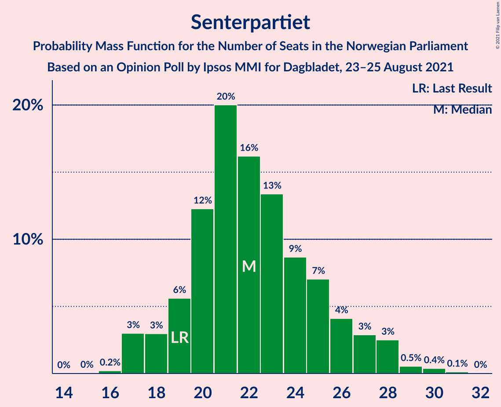
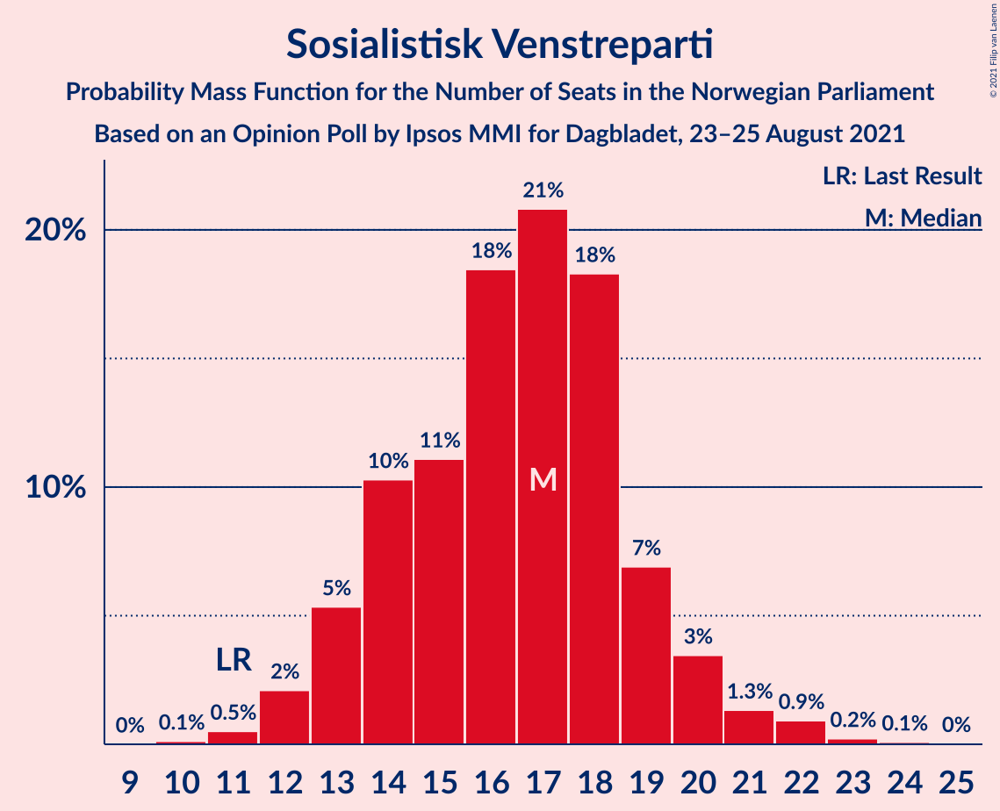
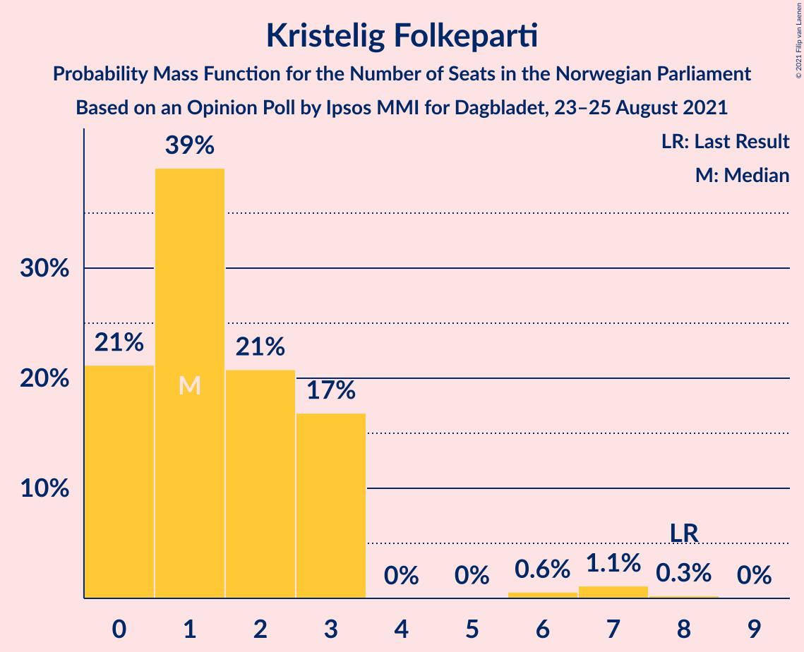

# Opinion Poll by Ipsos MMI for Dagbladet, 23–25 August 2021

<a href="#voting-intentions">Voting Intentions</a> | <a href="#seats">Seats</a> | <a href="#coalitions">Coalitions</a> | <a href="#technical-information">Technical Information</a>

## Voting Intentions

### Confidence Intervals

| Party | Last Result | Poll Result | 80% Confidence Interval | 90% Confidence Interval | 95% Confidence Interval | 99% Confidence Interval |
|:-----:|:-----------:|:-----------:|:-----------------------:|:-----------------------:|:-----------------------:|:-----------------------:|
| Arbeiderpartiet | 27.4% | 23.6% | 21.7–25.6% |21.2–26.2% |20.7–26.7% |19.9–27.7% |
| Høyre | 25.0% | 20.0% | 18.2–21.9% |17.8–22.5% |17.3–23.0% |16.5–23.9% |
| Senterpartiet | 10.3% | 12.6% | 11.2–14.2% |10.8–14.7% |10.4–15.1% |9.8–15.9% |
| Fremskrittspartiet | 15.2% | 12.6% | 11.2–14.2% |10.8–14.7% |10.4–15.1% |9.8–15.9% |
| Sosialistisk Venstreparti | 6.0% | 9.7% | 8.5–11.2% |8.2–11.7% |7.8–12.0% |7.3–12.8% |
| Miljøpartiet De Grønne | 3.2% | 6.3% | 5.3–7.5% |5.0–7.9% |4.8–8.2% |4.3–8.9% |
| Rødt | 2.4% | 4.6% | 3.8–5.7% |3.6–6.1% |3.4–6.3% |3.0–6.9% |
| Venstre | 4.4% | 3.5% | 2.8–4.5% |2.5–4.7% |2.4–5.0% |2.1–5.5% |
| Kristelig Folkeparti | 4.2% | 2.6% | 2.0–3.5% |1.8–3.7% |1.7–3.9% |1.4–4.4% |

*Note:* The poll result column reflects the actual value used in the calculations. Published results may vary slightly, and in addition be rounded to fewer digits.

## Seats

### Confidence Intervals

| Party | Last Result | Median | 80% Confidence Interval | 90% Confidence Interval | 95% Confidence Interval | 99% Confidence Interval |
|:-----:|:-----------:|:------:|:-----------------------:|:-----------------------:|:-----------------------:|:-----------------------:|
| <a href="#arbeiderpartiet">Arbeiderpartiet</a> | 49 | 43 | 41–47 |40–48 |39–49 |37–52 |
| <a href="#høyre">Høyre</a> | 45 | 36 | 33–38 |31–40 |30–42 |29–43 |
| <a href="#senterpartiet">Senterpartiet</a> | 19 | 22 | 19–26 |18–27 |17–28 |17–30 |
| <a href="#fremskrittspartiet">Fremskrittspartiet</a> | 27 | 22 | 19–25 |18–26 |17–27 |17–29 |
| <a href="#sosialistisk-venstreparti">Sosialistisk Venstreparti</a> | 11 | 17 | 14–19 |13–20 |12–21 |11–22 |
| <a href="#miljøpartiet-de-grønne">Miljøpartiet De Grønne</a> | 1 | 11 | 8–13 |8–14 |8–14 |7–15 |
| <a href="#rødt">Rødt</a> | 1 | 8 | 2–10 |2–10 |2–11 |1–12 |
| <a href="#venstre">Venstre</a> | 8 | 2 | 2–7 |2–8 |2–8 |1–9 |
| <a href="#kristelig-folkeparti">Kristelig Folkeparti</a> | 8 | 1 | 0–3 |0–3 |0–3 |0–7 |

### Arbeiderpartiet

*For a full overview of the results for this party, see the [Arbeiderpartiet](party-arbeiderpartiet.html) page.*

| Number of Seats | Probability | Accumulated | Special Marks |
|:---------------:|:-----------:|:-----------:|:-------------:|
| 35 | 0% | 100% |  |
| 36 | 0.2% | 99.9% |  |
| 37 | 0.9% | 99.7% |  |
| 38 | 0.8% | 98.8% |  |
| 39 | 3% | 98% |  |
| 40 | 5% | 95% |  |
| 41 | 16% | 90% |  |
| 42 | 20% | 74% |  |
| 43 | 13% | 54% | Median |
| 44 | 14% | 41% |  |
| 45 | 11% | 27% |  |
| 46 | 5% | 16% |  |
| 47 | 5% | 11% |  |
| 48 | 2% | 6% |  |
| 49 | 2% | 4% | Last Result |
| 50 | 0.9% | 2% |  |
| 51 | 0.7% | 1.3% |  |
| 52 | 0.3% | 0.6% |  |
| 53 | 0.2% | 0.3% |  |
| 54 | 0% | 0.1% |  |
| 55 | 0% | 0% |  |

### Høyre

*For a full overview of the results for this party, see the [Høyre](party-høyre.html) page.*

| Number of Seats | Probability | Accumulated | Special Marks |
|:---------------:|:-----------:|:-----------:|:-------------:|
| 26 | 0% | 100% |  |
| 27 | 0.1% | 99.9% |  |
| 28 | 0.3% | 99.8% |  |
| 29 | 0.5% | 99.5% |  |
| 30 | 2% | 99.0% |  |
| 31 | 2% | 97% |  |
| 32 | 4% | 95% |  |
| 33 | 3% | 90% |  |
| 34 | 9% | 87% |  |
| 35 | 16% | 78% |  |
| 36 | 34% | 62% | Median |
| 37 | 11% | 29% |  |
| 38 | 8% | 18% |  |
| 39 | 3% | 10% |  |
| 40 | 2% | 7% |  |
| 41 | 2% | 5% |  |
| 42 | 2% | 3% |  |
| 43 | 1.2% | 2% |  |
| 44 | 0.2% | 0.4% |  |
| 45 | 0.1% | 0.1% | Last Result |
| 46 | 0% | 0% |  |

### Senterpartiet

*For a full overview of the results for this party, see the [Senterpartiet](party-senterpartiet.html) page.*

| Number of Seats | Probability | Accumulated | Special Marks |
|:---------------:|:-----------:|:-----------:|:-------------:|
| 15 | 0% | 100% |  |
| 16 | 0.2% | 99.9% |  |
| 17 | 3% | 99.7% |  |
| 18 | 3% | 97% |  |
| 19 | 6% | 94% | Last Result |
| 20 | 12% | 88% |  |
| 21 | 20% | 76% |  |
| 22 | 16% | 56% | Median |
| 23 | 13% | 40% |  |
| 24 | 9% | 26% |  |
| 25 | 7% | 18% |  |
| 26 | 4% | 11% |  |
| 27 | 3% | 6% |  |
| 28 | 3% | 4% |  |
| 29 | 0.5% | 1.1% |  |
| 30 | 0.4% | 0.6% |  |
| 31 | 0.1% | 0.2% |  |
| 32 | 0% | 0% |  |

### Fremskrittspartiet

*For a full overview of the results for this party, see the [Fremskrittspartiet](party-fremskrittspartiet.html) page.*

| Number of Seats | Probability | Accumulated | Special Marks |
|:---------------:|:-----------:|:-----------:|:-------------:|
| 15 | 0.1% | 100% |  |
| 16 | 0.3% | 99.9% |  |
| 17 | 3% | 99.6% |  |
| 18 | 6% | 97% |  |
| 19 | 6% | 90% |  |
| 20 | 15% | 85% |  |
| 21 | 11% | 69% |  |
| 22 | 14% | 58% | Median |
| 23 | 12% | 45% |  |
| 24 | 17% | 33% |  |
| 25 | 9% | 16% |  |
| 26 | 3% | 8% |  |
| 27 | 3% | 4% | Last Result |
| 28 | 1.0% | 2% |  |
| 29 | 0.4% | 0.7% |  |
| 30 | 0.3% | 0.4% |  |
| 31 | 0.1% | 0.1% |  |
| 32 | 0% | 0% |  |

### Sosialistisk Venstreparti

*For a full overview of the results for this party, see the [Sosialistisk Venstreparti](party-sosialistiskvenstreparti.html) page.*

| Number of Seats | Probability | Accumulated | Special Marks |
|:---------------:|:-----------:|:-----------:|:-------------:|
| 10 | 0.1% | 100% |  |
| 11 | 0.5% | 99.9% | Last Result |
| 12 | 2% | 99.4% |  |
| 13 | 5% | 97% |  |
| 14 | 10% | 92% |  |
| 15 | 11% | 82% |  |
| 16 | 18% | 71% |  |
| 17 | 21% | 52% | Median |
| 18 | 18% | 31% |  |
| 19 | 7% | 13% |  |
| 20 | 3% | 6% |  |
| 21 | 1.3% | 3% |  |
| 22 | 0.9% | 1.3% |  |
| 23 | 0.2% | 0.3% |  |
| 24 | 0.1% | 0.1% |  |
| 25 | 0% | 0% |  |

### Miljøpartiet De Grønne

*For a full overview of the results for this party, see the [Miljøpartiet De Grønne](party-miljøpartietdegrønne.html) page.*

| Number of Seats | Probability | Accumulated | Special Marks |
|:---------------:|:-----------:|:-----------:|:-------------:|
| 1 | 0% | 100% | Last Result |
| 2 | 0% | 100% |  |
| 3 | 0.1% | 100% |  |
| 4 | 0% | 99.9% |  |
| 5 | 0% | 99.8% |  |
| 6 | 0% | 99.8% |  |
| 7 | 1.0% | 99.8% |  |
| 8 | 10% | 98.8% |  |
| 9 | 13% | 88% |  |
| 10 | 22% | 76% |  |
| 11 | 22% | 53% | Median |
| 12 | 15% | 31% |  |
| 13 | 11% | 16% |  |
| 14 | 4% | 6% |  |
| 15 | 1.4% | 2% |  |
| 16 | 0.3% | 0.4% |  |
| 17 | 0.1% | 0.1% |  |
| 18 | 0% | 0% |  |

### Rødt

*For a full overview of the results for this party, see the [Rødt](party-rødt.html) page.*

| Number of Seats | Probability | Accumulated | Special Marks |
|:---------------:|:-----------:|:-----------:|:-------------:|
| 1 | 0.7% | 100% | Last Result |
| 2 | 18% | 99.3% |  |
| 3 | 0% | 81% |  |
| 4 | 0% | 81% |  |
| 5 | 0% | 81% |  |
| 6 | 3% | 81% |  |
| 7 | 14% | 78% |  |
| 8 | 23% | 64% | Median |
| 9 | 24% | 41% |  |
| 10 | 14% | 17% |  |
| 11 | 3% | 3% |  |
| 12 | 0.3% | 0.6% |  |
| 13 | 0.3% | 0.3% |  |
| 14 | 0% | 0% |  |

### Venstre

*For a full overview of the results for this party, see the [Venstre](party-venstre.html) page.*

| Number of Seats | Probability | Accumulated | Special Marks |
|:---------------:|:-----------:|:-----------:|:-------------:|
| 0 | 0.2% | 100% |  |
| 1 | 2% | 99.8% |  |
| 2 | 72% | 98% | Median |
| 3 | 1.0% | 27% |  |
| 4 | 0.1% | 26% |  |
| 5 | 0% | 26% |  |
| 6 | 3% | 26% |  |
| 7 | 15% | 23% |  |
| 8 | 6% | 8% | Last Result |
| 9 | 1.3% | 1.5% |  |
| 10 | 0.2% | 0.2% |  |
| 11 | 0% | 0% |  |

### Kristelig Folkeparti

*For a full overview of the results for this party, see the [Kristelig Folkeparti](party-kristeligfolkeparti.html) page.*

| Number of Seats | Probability | Accumulated | Special Marks |
|:---------------:|:-----------:|:-----------:|:-------------:|
| 0 | 21% | 100% |  |
| 1 | 39% | 79% | Median |
| 2 | 21% | 40% |  |
| 3 | 17% | 19% |  |
| 4 | 0% | 2% |  |
| 5 | 0% | 2% |  |
| 6 | 0.6% | 2% |  |
| 7 | 1.1% | 1.4% |  |
| 8 | 0.3% | 0.3% | Last Result |
| 9 | 0% | 0% |  |

## Coalitions

### Confidence Intervals

| Coalition | Last Result | Median | Majority? | 80% Confidence Interval | 90% Confidence Interval | 95% Confidence Interval | 99% Confidence Interval |
|:---------:|:-----------:|:------:|:---------:|:-----------------------:|:-----------------------:|:-----------------------:|:-----------------------:|
| Arbeiderpartiet – Senterpartiet – Sosialistisk Venstreparti – Miljøpartiet De Grønne – Rødt | 81 | 100 | 100% | 94–106 | 92–107 | 91–108 | 88–112 |
| Arbeiderpartiet – Senterpartiet – Sosialistisk Venstreparti – Miljøpartiet De Grønne – Kristelig Folkeparti | 88 | 94 | 98% | 89–99 | 87–101 | 85–102 | 84–105 |
| Arbeiderpartiet – Senterpartiet – Sosialistisk Venstreparti – Miljøpartiet De Grønne | 80 | 92 | 97% | 87–98 | 86–99 | 84–101 | 82–104 |
| Arbeiderpartiet – Senterpartiet – Sosialistisk Venstreparti – Rødt | 80 | 89 | 82% | 82–95 | 81–96 | 80–97 | 78–99 |
| Høyre – Fremskrittspartiet – Senterpartiet – Venstre – Kristelig Folkeparti | 107 | 85 | 54% | 80–90 | 79–91 | 77–92 | 75–95 |
| Arbeiderpartiet – Senterpartiet – Sosialistisk Venstreparti | 79 | 81 | 24% | 77–86 | 76–88 | 74–90 | 73–93 |
| Arbeiderpartiet – Senterpartiet – Miljøpartiet De Grønne – Kristelig Folkeparti | 77 | 77 | 4% | 73–82 | 71–84 | 70–85 | 69–87 |
| Arbeiderpartiet – Sosialistisk Venstreparti – Miljøpartiet De Grønne – Rødt | 62 | 78 | 5% | 72–83 | 71–84 | 70–85 | 67–88 |
| Høyre – Fremskrittspartiet – Miljøpartiet De Grønne – Venstre – Kristelig Folkeparti | 89 | 73 | 0.4% | 68–79 | 66–81 | 66–82 | 64–84 |
| Arbeiderpartiet – Senterpartiet – Kristelig Folkeparti | 76 | 67 | 0% | 62–71 | 61–73 | 60–74 | 59–76 |
| Arbeiderpartiet – Senterpartiet | 68 | 65 | 0% | 61–70 | 60–71 | 59–73 | 58–75 |
| Høyre – Fremskrittspartiet – Venstre – Kristelig Folkeparti | 88 | 62 | 0% | 57–68 | 56–69 | 55–71 | 53–74 |
| Høyre – Fremskrittspartiet – Venstre | 80 | 61 | 0% | 56–67 | 55–68 | 54–69 | 52–72 |
| Arbeiderpartiet – Sosialistisk Venstreparti | 60 | 60 | 0% | 56–63 | 55–65 | 54–66 | 52–68 |
| Høyre – Fremskrittspartiet | 72 | 58 | 0% | 54–62 | 53–64 | 51–65 | 50–67 |
| Høyre – Venstre – Kristelig Folkeparti | 61 | 40 | 0% | 37–45 | 35–46 | 34–48 | 33–50 |
| Senterpartiet – Venstre – Kristelig Folkeparti | 35 | 27 | 0% | 24–31 | 23–32 | 22–34 | 20–37 |

### Arbeiderpartiet – Senterpartiet – Sosialistisk Venstreparti – Miljøpartiet De Grønne – Rødt

| Number of Seats | Probability | Accumulated | Special Marks |
|:---------------:|:-----------:|:-----------:|:-------------:|
| 81 | 0% | 100% | Last Result |
| 82 | 0% | 100% |  |
| 83 | 0% | 100% |  |
| 84 | 0% | 100% |  |
| 85 | 0.2% | 100% | Majority |
| 86 | 0.2% | 99.8% |  |
| 87 | 0.1% | 99.7% |  |
| 88 | 0.2% | 99.6% |  |
| 89 | 0.7% | 99.4% |  |
| 90 | 1.0% | 98.7% |  |
| 91 | 2% | 98% |  |
| 92 | 3% | 96% |  |
| 93 | 3% | 94% |  |
| 94 | 6% | 91% |  |
| 95 | 5% | 85% |  |
| 96 | 5% | 80% |  |
| 97 | 5% | 76% |  |
| 98 | 5% | 70% |  |
| 99 | 8% | 65% |  |
| 100 | 13% | 56% |  |
| 101 | 10% | 44% | Median |
| 102 | 6% | 34% |  |
| 103 | 4% | 28% |  |
| 104 | 8% | 24% |  |
| 105 | 4% | 16% |  |
| 106 | 5% | 12% |  |
| 107 | 3% | 7% |  |
| 108 | 1.4% | 4% |  |
| 109 | 0.7% | 2% |  |
| 110 | 0.5% | 2% |  |
| 111 | 0.2% | 1.2% |  |
| 112 | 0.8% | 1.0% |  |
| 113 | 0.1% | 0.2% |  |
| 114 | 0.1% | 0.1% |  |
| 115 | 0% | 0% |  |

### Arbeiderpartiet – Senterpartiet – Sosialistisk Venstreparti – Miljøpartiet De Grønne – Kristelig Folkeparti

| Number of Seats | Probability | Accumulated | Special Marks |
|:---------------:|:-----------:|:-----------:|:-------------:|
| 82 | 0.2% | 100% |  |
| 83 | 0.2% | 99.8% |  |
| 84 | 2% | 99.6% |  |
| 85 | 0.5% | 98% | Majority |
| 86 | 2% | 97% |  |
| 87 | 1.5% | 96% |  |
| 88 | 4% | 94% | Last Result |
| 89 | 2% | 91% |  |
| 90 | 7% | 89% |  |
| 91 | 6% | 82% |  |
| 92 | 16% | 76% |  |
| 93 | 9% | 60% |  |
| 94 | 7% | 51% | Median |
| 95 | 7% | 44% |  |
| 96 | 11% | 37% |  |
| 97 | 7% | 26% |  |
| 98 | 4% | 19% |  |
| 99 | 6% | 14% |  |
| 100 | 2% | 8% |  |
| 101 | 2% | 6% |  |
| 102 | 2% | 4% |  |
| 103 | 0.6% | 2% |  |
| 104 | 0.5% | 2% |  |
| 105 | 0.9% | 1.3% |  |
| 106 | 0.2% | 0.4% |  |
| 107 | 0.1% | 0.2% |  |
| 108 | 0% | 0.1% |  |
| 109 | 0% | 0% |  |

### Arbeiderpartiet – Senterpartiet – Sosialistisk Venstreparti – Miljøpartiet De Grønne

| Number of Seats | Probability | Accumulated | Special Marks |
|:---------------:|:-----------:|:-----------:|:-------------:|
| 80 | 0.2% | 100% | Last Result |
| 81 | 0.1% | 99.8% |  |
| 82 | 0.5% | 99.7% |  |
| 83 | 0.5% | 99.2% |  |
| 84 | 2% | 98.7% |  |
| 85 | 0.9% | 97% | Majority |
| 86 | 2% | 96% |  |
| 87 | 4% | 93% |  |
| 88 | 5% | 90% |  |
| 89 | 5% | 84% |  |
| 90 | 10% | 80% |  |
| 91 | 12% | 70% |  |
| 92 | 12% | 58% |  |
| 93 | 9% | 47% | Median |
| 94 | 7% | 38% |  |
| 95 | 7% | 31% |  |
| 96 | 7% | 24% |  |
| 97 | 6% | 17% |  |
| 98 | 5% | 11% |  |
| 99 | 1.5% | 6% |  |
| 100 | 1.3% | 5% |  |
| 101 | 2% | 4% |  |
| 102 | 0.3% | 2% |  |
| 103 | 0.5% | 2% |  |
| 104 | 0.8% | 1.2% |  |
| 105 | 0.2% | 0.4% |  |
| 106 | 0% | 0.1% |  |
| 107 | 0.1% | 0.1% |  |
| 108 | 0% | 0% |  |

### Arbeiderpartiet – Senterpartiet – Sosialistisk Venstreparti – Rødt

| Number of Seats | Probability | Accumulated | Special Marks |
|:---------------:|:-----------:|:-----------:|:-------------:|
| 76 | 0.2% | 100% |  |
| 77 | 0.3% | 99.8% |  |
| 78 | 0.4% | 99.5% |  |
| 79 | 0.9% | 99.1% |  |
| 80 | 2% | 98% | Last Result |
| 81 | 2% | 97% |  |
| 82 | 5% | 95% |  |
| 83 | 5% | 90% |  |
| 84 | 3% | 85% |  |
| 85 | 3% | 82% | Majority |
| 86 | 8% | 79% |  |
| 87 | 7% | 71% |  |
| 88 | 6% | 65% |  |
| 89 | 9% | 59% |  |
| 90 | 8% | 49% | Median |
| 91 | 7% | 42% |  |
| 92 | 8% | 35% |  |
| 93 | 11% | 27% |  |
| 94 | 6% | 16% |  |
| 95 | 5% | 11% |  |
| 96 | 3% | 6% |  |
| 97 | 1.4% | 3% |  |
| 98 | 0.5% | 2% |  |
| 99 | 0.7% | 1.1% |  |
| 100 | 0.2% | 0.3% |  |
| 101 | 0.1% | 0.2% |  |
| 102 | 0.1% | 0.1% |  |
| 103 | 0% | 0% |  |

### Høyre – Fremskrittspartiet – Senterpartiet – Venstre – Kristelig Folkeparti

| Number of Seats | Probability | Accumulated | Special Marks |
|:---------------:|:-----------:|:-----------:|:-------------:|
| 73 | 0% | 100% |  |
| 74 | 0.3% | 99.9% |  |
| 75 | 0.3% | 99.7% |  |
| 76 | 0.7% | 99.4% |  |
| 77 | 1.2% | 98.6% |  |
| 78 | 2% | 97% |  |
| 79 | 4% | 95% |  |
| 80 | 4% | 92% |  |
| 81 | 8% | 88% |  |
| 82 | 10% | 80% |  |
| 83 | 9% | 70% | Median |
| 84 | 8% | 61% |  |
| 85 | 9% | 54% | Majority |
| 86 | 8% | 44% |  |
| 87 | 12% | 36% |  |
| 88 | 9% | 25% |  |
| 89 | 5% | 16% |  |
| 90 | 4% | 11% |  |
| 91 | 3% | 7% |  |
| 92 | 2% | 4% |  |
| 93 | 1.1% | 2% |  |
| 94 | 0.6% | 1.3% |  |
| 95 | 0.3% | 0.7% |  |
| 96 | 0.2% | 0.4% |  |
| 97 | 0.1% | 0.2% |  |
| 98 | 0.1% | 0.1% |  |
| 99 | 0% | 0.1% |  |
| 100 | 0% | 0% |  |
| 101 | 0% | 0% |  |
| 102 | 0% | 0% |  |
| 103 | 0% | 0% |  |
| 104 | 0% | 0% |  |
| 105 | 0% | 0% |  |
| 106 | 0% | 0% |  |
| 107 | 0% | 0% | Last Result |

### Arbeiderpartiet – Senterpartiet – Sosialistisk Venstreparti

| Number of Seats | Probability | Accumulated | Special Marks |
|:---------------:|:-----------:|:-----------:|:-------------:|
| 70 | 0.1% | 100% |  |
| 71 | 0.2% | 99.9% |  |
| 72 | 0.2% | 99.7% |  |
| 73 | 1.0% | 99.5% |  |
| 74 | 2% | 98.5% |  |
| 75 | 1.3% | 97% |  |
| 76 | 2% | 95% |  |
| 77 | 3% | 93% |  |
| 78 | 7% | 90% |  |
| 79 | 8% | 83% | Last Result |
| 80 | 15% | 75% |  |
| 81 | 10% | 60% |  |
| 82 | 7% | 50% | Median |
| 83 | 10% | 43% |  |
| 84 | 9% | 33% |  |
| 85 | 11% | 24% | Majority |
| 86 | 4% | 14% |  |
| 87 | 3% | 10% |  |
| 88 | 2% | 6% |  |
| 89 | 2% | 4% |  |
| 90 | 0.9% | 3% |  |
| 91 | 0.9% | 2% |  |
| 92 | 0.3% | 0.9% |  |
| 93 | 0.4% | 0.6% |  |
| 94 | 0.1% | 0.3% |  |
| 95 | 0.1% | 0.1% |  |
| 96 | 0% | 0% |  |

### Arbeiderpartiet – Senterpartiet – Miljøpartiet De Grønne – Kristelig Folkeparti

| Number of Seats | Probability | Accumulated | Special Marks |
|:---------------:|:-----------:|:-----------:|:-------------:|
| 66 | 0% | 100% |  |
| 67 | 0.1% | 99.9% |  |
| 68 | 0.2% | 99.9% |  |
| 69 | 2% | 99.7% |  |
| 70 | 1.1% | 98% |  |
| 71 | 2% | 97% |  |
| 72 | 2% | 95% |  |
| 73 | 6% | 93% |  |
| 74 | 8% | 87% |  |
| 75 | 9% | 79% |  |
| 76 | 10% | 70% |  |
| 77 | 11% | 60% | Last Result, Median |
| 78 | 11% | 49% |  |
| 79 | 12% | 39% |  |
| 80 | 6% | 26% |  |
| 81 | 4% | 20% |  |
| 82 | 5% | 15% |  |
| 83 | 3% | 10% |  |
| 84 | 3% | 7% |  |
| 85 | 2% | 4% | Majority |
| 86 | 0.9% | 2% |  |
| 87 | 0.9% | 1.4% |  |
| 88 | 0.2% | 0.5% |  |
| 89 | 0.1% | 0.2% |  |
| 90 | 0.1% | 0.1% |  |
| 91 | 0% | 0.1% |  |
| 92 | 0% | 0% |  |

### Arbeiderpartiet – Sosialistisk Venstreparti – Miljøpartiet De Grønne – Rødt

| Number of Seats | Probability | Accumulated | Special Marks |
|:---------------:|:-----------:|:-----------:|:-------------:|
| 62 | 0% | 100% | Last Result |
| 63 | 0% | 100% |  |
| 64 | 0% | 100% |  |
| 65 | 0.1% | 99.9% |  |
| 66 | 0.1% | 99.9% |  |
| 67 | 0.4% | 99.8% |  |
| 68 | 0.5% | 99.4% |  |
| 69 | 0.7% | 98.9% |  |
| 70 | 2% | 98% |  |
| 71 | 4% | 96% |  |
| 72 | 4% | 92% |  |
| 73 | 5% | 88% |  |
| 74 | 6% | 83% |  |
| 75 | 6% | 77% |  |
| 76 | 9% | 70% |  |
| 77 | 9% | 62% |  |
| 78 | 9% | 53% |  |
| 79 | 11% | 43% | Median |
| 80 | 7% | 33% |  |
| 81 | 8% | 26% |  |
| 82 | 7% | 17% |  |
| 83 | 3% | 11% |  |
| 84 | 3% | 8% |  |
| 85 | 2% | 5% | Majority |
| 86 | 1.4% | 2% |  |
| 87 | 0.2% | 1.1% |  |
| 88 | 0.6% | 0.9% |  |
| 89 | 0.1% | 0.2% |  |
| 90 | 0.1% | 0.1% |  |
| 91 | 0% | 0% |  |

### Høyre – Fremskrittspartiet – Miljøpartiet De Grønne – Venstre – Kristelig Folkeparti

| Number of Seats | Probability | Accumulated | Special Marks |
|:---------------:|:-----------:|:-----------:|:-------------:|
| 62 | 0% | 100% |  |
| 63 | 0.2% | 99.9% |  |
| 64 | 0.4% | 99.7% |  |
| 65 | 1.1% | 99.3% |  |
| 66 | 4% | 98% |  |
| 67 | 3% | 95% |  |
| 68 | 7% | 92% |  |
| 69 | 4% | 85% |  |
| 70 | 10% | 81% |  |
| 71 | 5% | 70% |  |
| 72 | 8% | 65% | Median |
| 73 | 10% | 57% |  |
| 74 | 9% | 48% |  |
| 75 | 6% | 39% |  |
| 76 | 11% | 33% |  |
| 77 | 4% | 23% |  |
| 78 | 4% | 19% |  |
| 79 | 7% | 15% |  |
| 80 | 3% | 8% |  |
| 81 | 2% | 5% |  |
| 82 | 1.4% | 3% |  |
| 83 | 0.5% | 2% |  |
| 84 | 0.7% | 1.1% |  |
| 85 | 0.2% | 0.4% | Majority |
| 86 | 0.1% | 0.2% |  |
| 87 | 0.1% | 0.2% |  |
| 88 | 0% | 0.1% |  |
| 89 | 0% | 0% | Last Result |

### Arbeiderpartiet – Senterpartiet – Kristelig Folkeparti

| Number of Seats | Probability | Accumulated | Special Marks |
|:---------------:|:-----------:|:-----------:|:-------------:|
| 57 | 0.1% | 100% |  |
| 58 | 0.3% | 99.9% |  |
| 59 | 2% | 99.6% |  |
| 60 | 1.4% | 98% |  |
| 61 | 2% | 97% |  |
| 62 | 6% | 95% |  |
| 63 | 5% | 89% |  |
| 64 | 11% | 85% |  |
| 65 | 8% | 74% |  |
| 66 | 13% | 66% | Median |
| 67 | 10% | 53% |  |
| 68 | 15% | 42% |  |
| 69 | 9% | 27% |  |
| 70 | 3% | 18% |  |
| 71 | 5% | 14% |  |
| 72 | 4% | 10% |  |
| 73 | 2% | 6% |  |
| 74 | 2% | 4% |  |
| 75 | 0.8% | 2% |  |
| 76 | 0.4% | 0.8% | Last Result |
| 77 | 0.2% | 0.5% |  |
| 78 | 0.1% | 0.2% |  |
| 79 | 0.1% | 0.1% |  |
| 80 | 0% | 0% |  |

### Arbeiderpartiet – Senterpartiet

| Number of Seats | Probability | Accumulated | Special Marks |
|:---------------:|:-----------:|:-----------:|:-------------:|
| 55 | 0% | 100% |  |
| 56 | 0.2% | 99.9% |  |
| 57 | 0.2% | 99.8% |  |
| 58 | 1.1% | 99.6% |  |
| 59 | 3% | 98% |  |
| 60 | 3% | 96% |  |
| 61 | 4% | 93% |  |
| 62 | 9% | 89% |  |
| 63 | 11% | 80% |  |
| 64 | 10% | 69% |  |
| 65 | 12% | 59% | Median |
| 66 | 10% | 46% |  |
| 67 | 11% | 36% |  |
| 68 | 9% | 25% | Last Result |
| 69 | 4% | 15% |  |
| 70 | 3% | 11% |  |
| 71 | 4% | 8% |  |
| 72 | 2% | 4% |  |
| 73 | 1.4% | 3% |  |
| 74 | 0.7% | 1.4% |  |
| 75 | 0.4% | 0.8% |  |
| 76 | 0.3% | 0.4% |  |
| 77 | 0.1% | 0.1% |  |
| 78 | 0% | 0% |  |

### Høyre – Fremskrittspartiet – Venstre – Kristelig Folkeparti

| Number of Seats | Probability | Accumulated | Special Marks |
|:---------------:|:-----------:|:-----------:|:-------------:|
| 51 | 0% | 100% |  |
| 52 | 0.1% | 99.9% |  |
| 53 | 0.4% | 99.9% |  |
| 54 | 1.3% | 99.4% |  |
| 55 | 2% | 98% |  |
| 56 | 3% | 96% |  |
| 57 | 5% | 94% |  |
| 58 | 4% | 88% |  |
| 59 | 5% | 84% |  |
| 60 | 12% | 80% |  |
| 61 | 11% | 68% | Median |
| 62 | 8% | 57% |  |
| 63 | 8% | 49% |  |
| 64 | 8% | 41% |  |
| 65 | 8% | 34% |  |
| 66 | 6% | 26% |  |
| 67 | 5% | 20% |  |
| 68 | 6% | 15% |  |
| 69 | 4% | 8% |  |
| 70 | 2% | 5% |  |
| 71 | 2% | 3% |  |
| 72 | 0.4% | 1.3% |  |
| 73 | 0.4% | 1.0% |  |
| 74 | 0.2% | 0.6% |  |
| 75 | 0.3% | 0.4% |  |
| 76 | 0.1% | 0.1% |  |
| 77 | 0% | 0% |  |
| 78 | 0% | 0% |  |
| 79 | 0% | 0% |  |
| 80 | 0% | 0% |  |
| 81 | 0% | 0% |  |
| 82 | 0% | 0% |  |
| 83 | 0% | 0% |  |
| 84 | 0% | 0% |  |
| 85 | 0% | 0% | Majority |
| 86 | 0% | 0% |  |
| 87 | 0% | 0% |  |
| 88 | 0% | 0% | Last Result |

### Høyre – Fremskrittspartiet – Venstre

| Number of Seats | Probability | Accumulated | Special Marks |
|:---------------:|:-----------:|:-----------:|:-------------:|
| 50 | 0.1% | 100% |  |
| 51 | 0.1% | 99.9% |  |
| 52 | 0.5% | 99.8% |  |
| 53 | 1.3% | 99.3% |  |
| 54 | 2% | 98% |  |
| 55 | 4% | 96% |  |
| 56 | 6% | 93% |  |
| 57 | 6% | 87% |  |
| 58 | 10% | 81% |  |
| 59 | 9% | 71% |  |
| 60 | 10% | 62% | Median |
| 61 | 10% | 53% |  |
| 62 | 7% | 43% |  |
| 63 | 5% | 36% |  |
| 64 | 5% | 31% |  |
| 65 | 7% | 25% |  |
| 66 | 5% | 19% |  |
| 67 | 7% | 14% |  |
| 68 | 3% | 7% |  |
| 69 | 2% | 4% |  |
| 70 | 0.6% | 2% |  |
| 71 | 0.5% | 1.0% |  |
| 72 | 0.3% | 0.5% |  |
| 73 | 0.2% | 0.3% |  |
| 74 | 0% | 0.1% |  |
| 75 | 0% | 0% |  |
| 76 | 0% | 0% |  |
| 77 | 0% | 0% |  |
| 78 | 0% | 0% |  |
| 79 | 0% | 0% |  |
| 80 | 0% | 0% | Last Result |

### Arbeiderpartiet – Sosialistisk Venstreparti

| Number of Seats | Probability | Accumulated | Special Marks |
|:---------------:|:-----------:|:-----------:|:-------------:|
| 49 | 0% | 100% |  |
| 50 | 0.1% | 99.9% |  |
| 51 | 0.2% | 99.9% |  |
| 52 | 0.4% | 99.7% |  |
| 53 | 0.8% | 99.3% |  |
| 54 | 2% | 98% |  |
| 55 | 3% | 96% |  |
| 56 | 4% | 93% |  |
| 57 | 13% | 89% |  |
| 58 | 10% | 76% |  |
| 59 | 14% | 67% |  |
| 60 | 15% | 52% | Last Result, Median |
| 61 | 14% | 37% |  |
| 62 | 6% | 22% |  |
| 63 | 7% | 17% |  |
| 64 | 4% | 9% |  |
| 65 | 3% | 5% |  |
| 66 | 1.1% | 3% |  |
| 67 | 0.7% | 1.4% |  |
| 68 | 0.4% | 0.7% |  |
| 69 | 0.1% | 0.4% |  |
| 70 | 0.1% | 0.3% |  |
| 71 | 0.1% | 0.2% |  |
| 72 | 0.1% | 0.1% |  |
| 73 | 0% | 0% |  |

### Høyre – Fremskrittspartiet

| Number of Seats | Probability | Accumulated | Special Marks |
|:---------------:|:-----------:|:-----------:|:-------------:|
| 47 | 0.1% | 100% |  |
| 48 | 0.1% | 99.9% |  |
| 49 | 0.2% | 99.8% |  |
| 50 | 0.7% | 99.5% |  |
| 51 | 2% | 98.8% |  |
| 52 | 2% | 97% |  |
| 53 | 4% | 95% |  |
| 54 | 6% | 91% |  |
| 55 | 7% | 85% |  |
| 56 | 11% | 78% |  |
| 57 | 12% | 67% |  |
| 58 | 13% | 55% | Median |
| 59 | 12% | 42% |  |
| 60 | 11% | 30% |  |
| 61 | 5% | 18% |  |
| 62 | 6% | 13% |  |
| 63 | 2% | 8% |  |
| 64 | 2% | 5% |  |
| 65 | 1.4% | 3% |  |
| 66 | 0.6% | 2% |  |
| 67 | 0.5% | 1.0% |  |
| 68 | 0.2% | 0.5% |  |
| 69 | 0.2% | 0.3% |  |
| 70 | 0.1% | 0.1% |  |
| 71 | 0% | 0% |  |
| 72 | 0% | 0% | Last Result |

### Høyre – Venstre – Kristelig Folkeparti

| Number of Seats | Probability | Accumulated | Special Marks |
|:---------------:|:-----------:|:-----------:|:-------------:|
| 30 | 0.2% | 100% |  |
| 31 | 0.1% | 99.8% |  |
| 32 | 0.1% | 99.7% |  |
| 33 | 2% | 99.6% |  |
| 34 | 3% | 98% |  |
| 35 | 2% | 95% |  |
| 36 | 1.3% | 93% |  |
| 37 | 7% | 92% |  |
| 38 | 12% | 85% |  |
| 39 | 15% | 72% | Median |
| 40 | 15% | 58% |  |
| 41 | 6% | 43% |  |
| 42 | 6% | 37% |  |
| 43 | 9% | 31% |  |
| 44 | 5% | 22% |  |
| 45 | 7% | 16% |  |
| 46 | 5% | 9% |  |
| 47 | 2% | 5% |  |
| 48 | 1.2% | 3% |  |
| 49 | 1.0% | 2% |  |
| 50 | 0.5% | 0.8% |  |
| 51 | 0.2% | 0.4% |  |
| 52 | 0.1% | 0.2% |  |
| 53 | 0.1% | 0.1% |  |
| 54 | 0% | 0% |  |
| 55 | 0% | 0% |  |
| 56 | 0% | 0% |  |
| 57 | 0% | 0% |  |
| 58 | 0% | 0% |  |
| 59 | 0% | 0% |  |
| 60 | 0% | 0% |  |
| 61 | 0% | 0% | Last Result |

### Senterpartiet – Venstre – Kristelig Folkeparti

| Number of Seats | Probability | Accumulated | Special Marks |
|:---------------:|:-----------:|:-----------:|:-------------:|
| 18 | 0.1% | 100% |  |
| 19 | 0.3% | 99.9% |  |
| 20 | 0.6% | 99.6% |  |
| 21 | 1.2% | 99.0% |  |
| 22 | 2% | 98% |  |
| 23 | 5% | 96% |  |
| 24 | 12% | 91% |  |
| 25 | 16% | 78% | Median |
| 26 | 11% | 62% |  |
| 27 | 10% | 52% |  |
| 28 | 15% | 42% |  |
| 29 | 9% | 27% |  |
| 30 | 6% | 19% |  |
| 31 | 5% | 12% |  |
| 32 | 2% | 7% |  |
| 33 | 2% | 5% |  |
| 34 | 1.4% | 3% |  |
| 35 | 0.6% | 2% | Last Result |
| 36 | 0.7% | 1.3% |  |
| 37 | 0.3% | 0.6% |  |
| 38 | 0.2% | 0.4% |  |
| 39 | 0.1% | 0.1% |  |
| 40 | 0% | 0.1% |  |
| 41 | 0% | 0% |  |

## Technical Information

### Opinion Poll

+ **Polling firm:** Ipsos MMI
+ **Commissioner(s):** Dagbladet
+ **Fieldwork period:** 23–25 August 2021

### Calculations

+ **Sample size:** 780
+ **Simulations done:** 1,048,576
+ **Error estimate:** 1.20%

