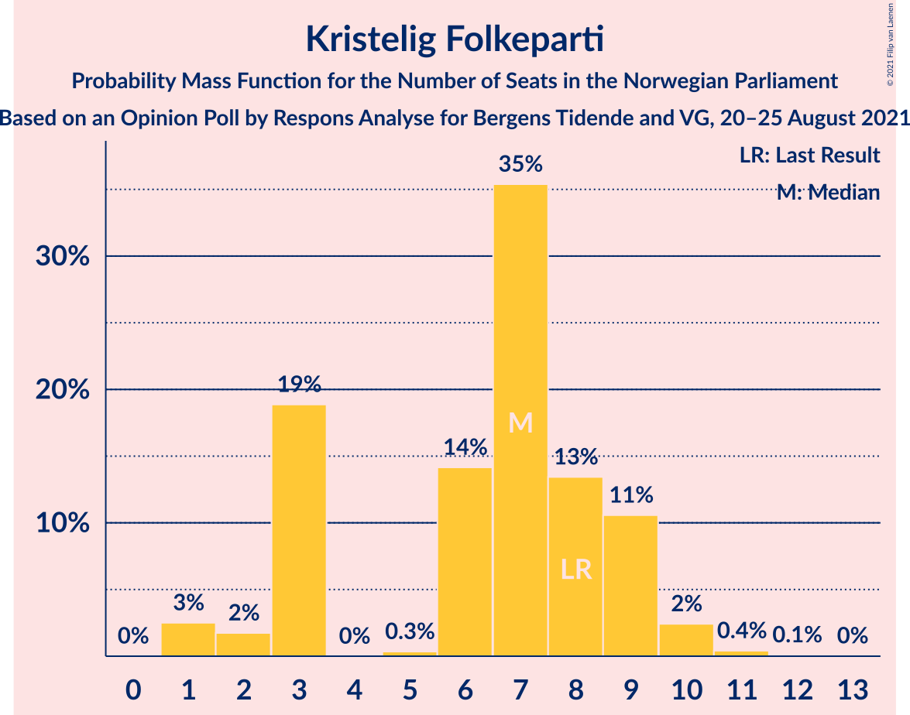
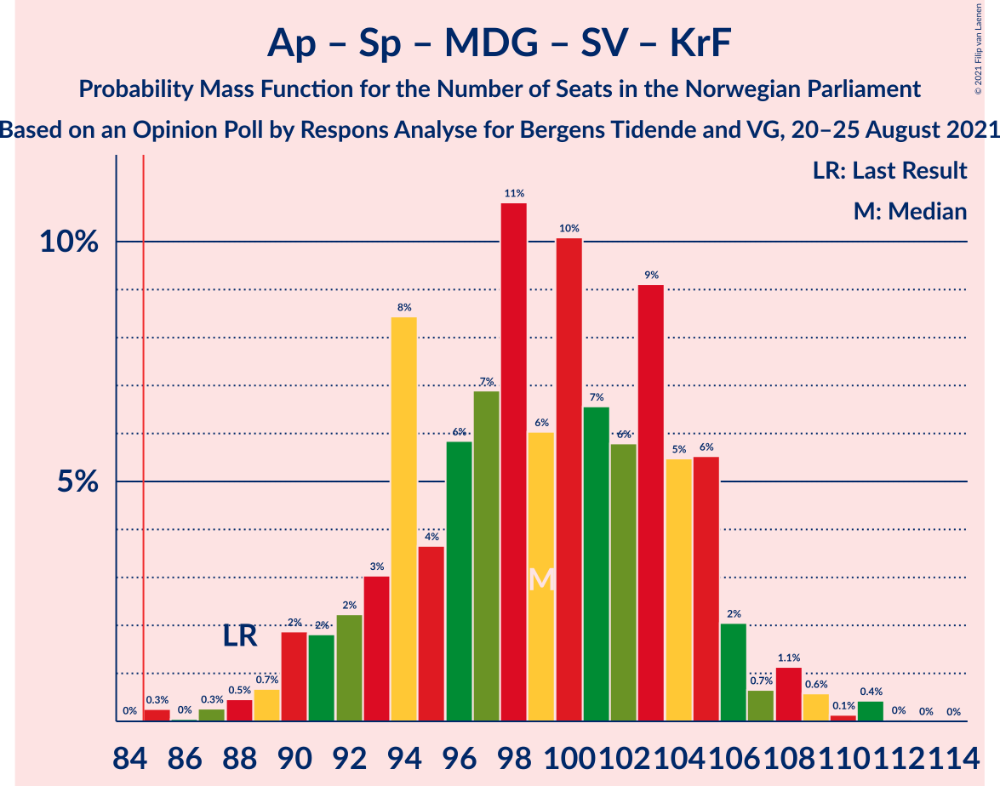
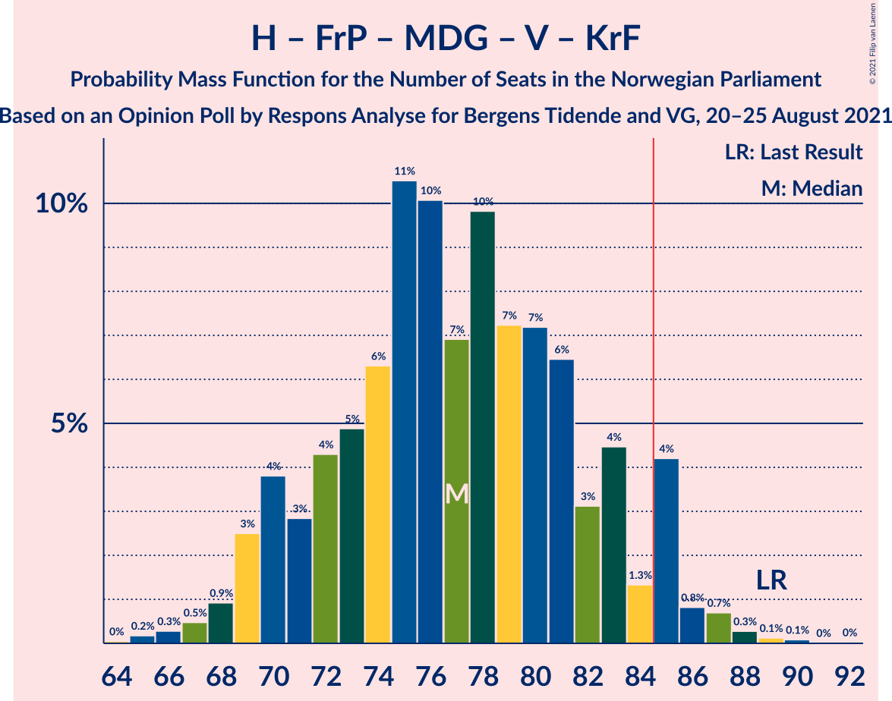
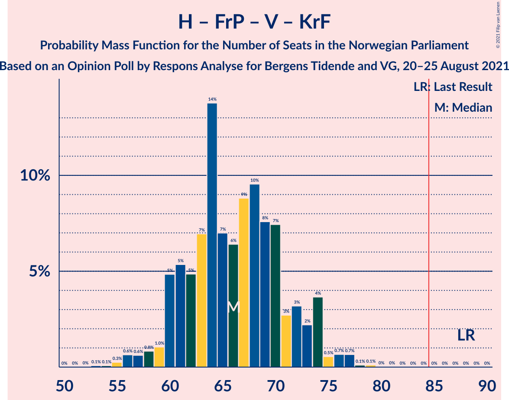
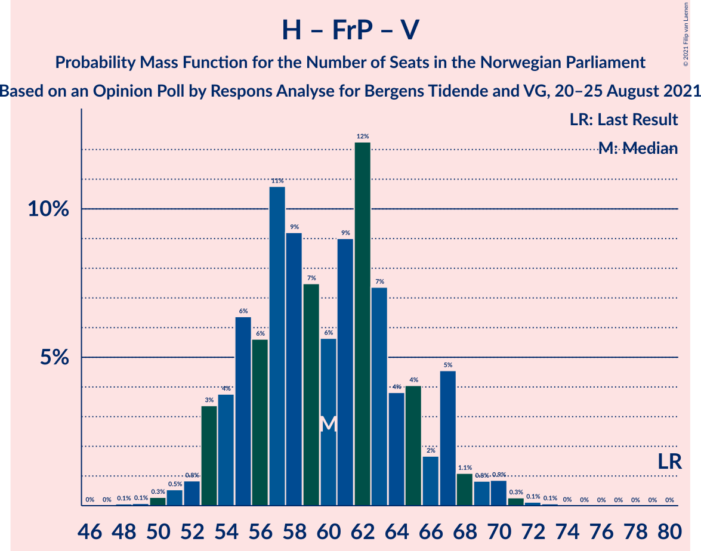
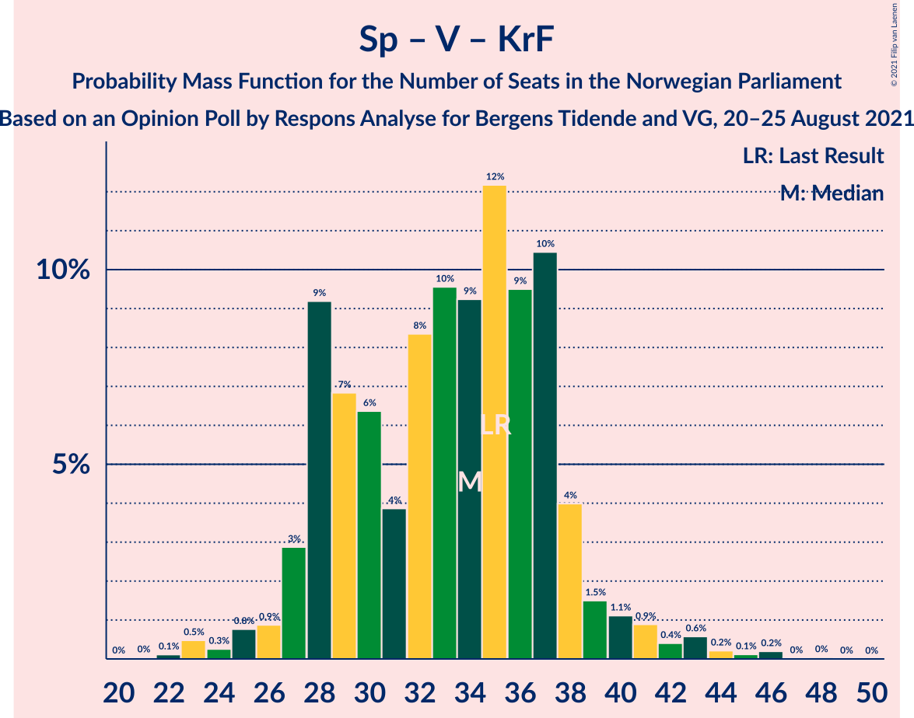

# Opinion Poll by Respons Analyse for Bergens Tidende and VG, 20–25 August 2021

<a href="#voting-intentions">Voting Intentions</a> | <a href="#seats">Seats</a> | <a href="#coalitions">Coalitions</a> | <a href="#technical-information">Technical Information</a>

## Voting Intentions

### Confidence Intervals

| Party | Last Result | Poll Result | 80% Confidence Interval | 90% Confidence Interval | 95% Confidence Interval | 99% Confidence Interval |
|:-----:|:-----------:|:-----------:|:-----------------------:|:-----------------------:|:-----------------------:|:-----------------------:|
| Arbeiderpartiet | 27.4% | 26.6% | 24.7–28.7% |24.1–29.2% |23.6–29.8% |22.7–30.8% |
| Høyre | 25.0% | 21.1% | 19.3–23.0% |18.8–23.6% |18.4–24.1% |17.6–25.0% |
| Senterpartiet | 10.3% | 11.9% | 10.5–13.4% |10.1–13.9% |9.8–14.3% |9.2–15.1% |
| Fremskrittspartiet | 15.2% | 9.4% | 8.2–10.8% |7.8–11.2% |7.5–11.6% |7.0–12.3% |
| Sosialistisk Venstreparti | 6.0% | 6.7% | 5.7–8.0% |5.4–8.4% |5.2–8.7% |4.8–9.3% |
| Miljøpartiet De Grønne | 3.2% | 6.7% | 5.7–8.0% |5.4–8.4% |5.2–8.7% |4.8–9.3% |
| Rødt | 2.4% | 5.2% | 4.4–6.4% |4.1–6.7% |3.9–7.0% |3.5–7.6% |
| Venstre | 4.4% | 4.5% | 3.7–5.6% |3.4–5.9% |3.3–6.2% |2.9–6.7% |
| Kristelig Folkeparti | 4.2% | 4.4% | 3.6–5.4% |3.3–5.7% |3.2–6.0% |2.8–6.6% |

*Note:* The poll result column reflects the actual value used in the calculations. Published results may vary slightly, and in addition be rounded to fewer digits.

## Seats

### Confidence Intervals

| Party | Last Result | Median | 80% Confidence Interval | 90% Confidence Interval | 95% Confidence Interval | 99% Confidence Interval |
|:-----:|:-----------:|:------:|:-----------------------:|:-----------------------:|:-----------------------:|:-----------------------:|
| <a href="#arbeiderpartiet">Arbeiderpartiet</a> | 49 | 50 | 45–55 |45–56 |44–57 |42–58 |
| <a href="#høyre">Høyre</a> | 45 | 38 | 35–42 |34–45 |33–45 |30–47 |
| <a href="#senterpartiet">Senterpartiet</a> | 19 | 20 | 18–24 |17–25 |17–26 |17–30 |
| <a href="#fremskrittspartiet">Fremskrittspartiet</a> | 27 | 15 | 13–19 |12–20 |11–21 |10–21 |
| <a href="#sosialistisk-venstreparti">Sosialistisk Venstreparti</a> | 11 | 11 | 9–13 |8–14 |8–15 |7–16 |
| <a href="#miljøpartiet-de-grønne">Miljøpartiet De Grønne</a> | 1 | 11 | 9–13 |8–14 |8–14 |7–16 |
| <a href="#rødt">Rødt</a> | 1 | 8 | 7–11 |6–11 |2–11 |2–13 |
| <a href="#venstre">Venstre</a> | 8 | 7 | 2–9 |2–10 |2–10 |2–11 |
| <a href="#kristelig-folkeparti">Kristelig Folkeparti</a> | 8 | 7 | 3–9 |3–9 |1–10 |1–11 |

### Arbeiderpartiet

*For a full overview of the results for this party, see the [Arbeiderpartiet](party-arbeiderpartiet.html) page.*

| Number of Seats | Probability | Accumulated | Special Marks |
|:---------------:|:-----------:|:-----------:|:-------------:|
| 40 | 0.1% | 100% |  |
| 41 | 0.2% | 99.9% |  |
| 42 | 0.6% | 99.7% |  |
| 43 | 0.9% | 99.2% |  |
| 44 | 3% | 98% |  |
| 45 | 6% | 95% |  |
| 46 | 7% | 89% |  |
| 47 | 13% | 82% |  |
| 48 | 5% | 69% |  |
| 49 | 7% | 65% | Last Result |
| 50 | 12% | 57% | Median |
| 51 | 7% | 46% |  |
| 52 | 11% | 38% |  |
| 53 | 7% | 27% |  |
| 54 | 5% | 20% |  |
| 55 | 6% | 16% |  |
| 56 | 5% | 10% |  |
| 57 | 4% | 5% |  |
| 58 | 1.0% | 1.1% |  |
| 59 | 0.1% | 0.2% |  |
| 60 | 0.1% | 0.1% |  |
| 61 | 0% | 0% |  |

### Høyre

*For a full overview of the results for this party, see the [Høyre](party-høyre.html) page.*

| Number of Seats | Probability | Accumulated | Special Marks |
|:---------------:|:-----------:|:-----------:|:-------------:|
| 28 | 0.1% | 100% |  |
| 29 | 0.2% | 99.9% |  |
| 30 | 0.5% | 99.7% |  |
| 31 | 0.6% | 99.2% |  |
| 32 | 1.0% | 98.6% |  |
| 33 | 2% | 98% |  |
| 34 | 2% | 96% |  |
| 35 | 6% | 94% |  |
| 36 | 22% | 88% |  |
| 37 | 14% | 65% |  |
| 38 | 17% | 51% | Median |
| 39 | 11% | 35% |  |
| 40 | 8% | 23% |  |
| 41 | 2% | 15% |  |
| 42 | 4% | 13% |  |
| 43 | 2% | 9% |  |
| 44 | 0.5% | 7% |  |
| 45 | 4% | 6% | Last Result |
| 46 | 1.4% | 2% |  |
| 47 | 0.8% | 1.0% |  |
| 48 | 0.1% | 0.2% |  |
| 49 | 0.1% | 0.1% |  |
| 50 | 0% | 0% |  |

### Senterpartiet

*For a full overview of the results for this party, see the [Senterpartiet](party-senterpartiet.html) page.*

| Number of Seats | Probability | Accumulated | Special Marks |
|:---------------:|:-----------:|:-----------:|:-------------:|
| 16 | 0.2% | 100% |  |
| 17 | 6% | 99.7% |  |
| 18 | 13% | 94% |  |
| 19 | 18% | 81% | Last Result |
| 20 | 15% | 63% | Median |
| 21 | 16% | 48% |  |
| 22 | 17% | 33% |  |
| 23 | 3% | 15% |  |
| 24 | 5% | 13% |  |
| 25 | 4% | 8% |  |
| 26 | 2% | 4% |  |
| 27 | 0.6% | 2% |  |
| 28 | 0.3% | 1.3% |  |
| 29 | 0.1% | 1.0% |  |
| 30 | 0.4% | 0.8% |  |
| 31 | 0.3% | 0.5% |  |
| 32 | 0.1% | 0.2% |  |
| 33 | 0.1% | 0.1% |  |
| 34 | 0% | 0% |  |

### Fremskrittspartiet

*For a full overview of the results for this party, see the [Fremskrittspartiet](party-fremskrittspartiet.html) page.*

| Number of Seats | Probability | Accumulated | Special Marks |
|:---------------:|:-----------:|:-----------:|:-------------:|
| 9 | 0% | 100% |  |
| 10 | 0.7% | 99.9% |  |
| 11 | 3% | 99.3% |  |
| 12 | 6% | 97% |  |
| 13 | 15% | 91% |  |
| 14 | 12% | 76% |  |
| 15 | 16% | 64% | Median |
| 16 | 12% | 48% |  |
| 17 | 10% | 36% |  |
| 18 | 7% | 26% |  |
| 19 | 14% | 19% |  |
| 20 | 2% | 5% |  |
| 21 | 3% | 3% |  |
| 22 | 0.3% | 0.4% |  |
| 23 | 0% | 0.1% |  |
| 24 | 0% | 0.1% |  |
| 25 | 0% | 0% |  |
| 26 | 0% | 0% |  |
| 27 | 0% | 0% | Last Result |

### Sosialistisk Venstreparti

*For a full overview of the results for this party, see the [Sosialistisk Venstreparti](party-sosialistiskvenstreparti.html) page.*

| Number of Seats | Probability | Accumulated | Special Marks |
|:---------------:|:-----------:|:-----------:|:-------------:|
| 6 | 0.1% | 100% |  |
| 7 | 1.4% | 99.9% |  |
| 8 | 5% | 98.5% |  |
| 9 | 17% | 94% |  |
| 10 | 19% | 77% |  |
| 11 | 18% | 58% | Last Result, Median |
| 12 | 22% | 40% |  |
| 13 | 11% | 18% |  |
| 14 | 2% | 7% |  |
| 15 | 4% | 5% |  |
| 16 | 0.9% | 1.2% |  |
| 17 | 0.2% | 0.3% |  |
| 18 | 0% | 0% |  |

### Miljøpartiet De Grønne

*For a full overview of the results for this party, see the [Miljøpartiet De Grønne](party-miljøpartietdegrønne.html) page.*

| Number of Seats | Probability | Accumulated | Special Marks |
|:---------------:|:-----------:|:-----------:|:-------------:|
| 1 | 0% | 100% | Last Result |
| 2 | 0% | 100% |  |
| 3 | 0% | 100% |  |
| 4 | 0% | 100% |  |
| 5 | 0% | 100% |  |
| 6 | 0.1% | 100% |  |
| 7 | 1.2% | 99.9% |  |
| 8 | 4% | 98.7% |  |
| 9 | 13% | 95% |  |
| 10 | 28% | 82% |  |
| 11 | 23% | 54% | Median |
| 12 | 17% | 32% |  |
| 13 | 9% | 15% |  |
| 14 | 3% | 6% |  |
| 15 | 2% | 2% |  |
| 16 | 0.4% | 0.6% |  |
| 17 | 0.1% | 0.1% |  |
| 18 | 0% | 0% |  |

### Rødt

*For a full overview of the results for this party, see the [Rødt](party-rødt.html) page.*

| Number of Seats | Probability | Accumulated | Special Marks |
|:---------------:|:-----------:|:-----------:|:-------------:|
| 1 | 0% | 100% | Last Result |
| 2 | 3% | 100% |  |
| 3 | 0% | 97% |  |
| 4 | 0% | 97% |  |
| 5 | 0.1% | 97% |  |
| 6 | 3% | 97% |  |
| 7 | 19% | 93% |  |
| 8 | 27% | 75% | Median |
| 9 | 23% | 48% |  |
| 10 | 14% | 25% |  |
| 11 | 9% | 11% |  |
| 12 | 1.4% | 2% |  |
| 13 | 0.7% | 0.9% |  |
| 14 | 0.1% | 0.1% |  |
| 15 | 0% | 0% |  |

### Venstre

*For a full overview of the results for this party, see the [Venstre](party-venstre.html) page.*

| Number of Seats | Probability | Accumulated | Special Marks |
|:---------------:|:-----------:|:-----------:|:-------------:|
| 2 | 26% | 100% |  |
| 3 | 0.4% | 74% |  |
| 4 | 0% | 74% |  |
| 5 | 0.8% | 74% |  |
| 6 | 5% | 73% |  |
| 7 | 30% | 68% | Median |
| 8 | 24% | 38% | Last Result |
| 9 | 8% | 14% |  |
| 10 | 5% | 6% |  |
| 11 | 0.7% | 0.8% |  |
| 12 | 0.1% | 0.1% |  |
| 13 | 0% | 0% |  |

### Kristelig Folkeparti

*For a full overview of the results for this party, see the [Kristelig Folkeparti](party-kristeligfolkeparti.html) page.*

| Number of Seats | Probability | Accumulated | Special Marks |
|:---------------:|:-----------:|:-----------:|:-------------:|
| 1 | 3% | 100% |  |
| 2 | 2% | 97% |  |
| 3 | 19% | 96% |  |
| 4 | 0% | 77% |  |
| 5 | 0.3% | 77% |  |
| 6 | 14% | 77% |  |
| 7 | 35% | 62% | Median |
| 8 | 13% | 27% | Last Result |
| 9 | 11% | 14% |  |
| 10 | 2% | 3% |  |
| 11 | 0.4% | 0.5% |  |
| 12 | 0.1% | 0.1% |  |
| 13 | 0% | 0% |  |

## Coalitions

### Confidence Intervals

| Coalition | Last Result | Median | Majority? | 80% Confidence Interval | 90% Confidence Interval | 95% Confidence Interval | 99% Confidence Interval |
|:---------:|:-----------:|:------:|:---------:|:-----------------------:|:-----------------------:|:-----------------------:|:-----------------------:|
| Arbeiderpartiet – Senterpartiet – Miljøpartiet De Grønne – Sosialistisk Venstreparti – Rødt | 81 | 101 | 100% | 95–106 | 94–108 | 92–109 | 90–113 |
| Arbeiderpartiet – Senterpartiet – Miljøpartiet De Grønne – Sosialistisk Venstreparti – Kristelig Folkeparti | 88 | 99 | 99.9% | 93–105 | 91–106 | 90–107 | 87–110 |
| Arbeiderpartiet – Senterpartiet – Miljøpartiet De Grønne – Sosialistisk Venstreparti | 80 | 93 | 97% | 87–98 | 86–99 | 84–100 | 82–104 |
| Arbeiderpartiet – Senterpartiet – Sosialistisk Venstreparti – Rødt | 80 | 90 | 89% | 84–95 | 84–97 | 82–99 | 79–101 |
| Arbeiderpartiet – Senterpartiet – Miljøpartiet De Grønne – Kristelig Folkeparti | 77 | 88 | 81% | 82–93 | 80–95 | 79–96 | 76–99 |
| Høyre – Senterpartiet – Fremskrittspartiet – Venstre – Kristelig Folkeparti | 107 | 86 | 71% | 82–92 | 80–93 | 79–95 | 77–97 |
| Arbeiderpartiet – Senterpartiet – Sosialistisk Venstreparti | 79 | 82 | 28% | 76–86 | 76–88 | 74–89 | 72–92 |
| Arbeiderpartiet – Miljøpartiet De Grønne – Sosialistisk Venstreparti – Rødt | 62 | 81 | 18% | 74–86 | 73–87 | 72–88 | 69–91 |
| Høyre – Fremskrittspartiet – Miljøpartiet De Grønne – Venstre – Kristelig Folkeparti | 89 | 77 | 6% | 71–83 | 70–85 | 69–85 | 66–88 |
| Arbeiderpartiet – Senterpartiet – Kristelig Folkeparti | 76 | 77 | 5% | 71–83 | 70–85 | 68–85 | 66–87 |
| Arbeiderpartiet – Senterpartiet | 68 | 71 | 0% | 65–76 | 64–78 | 63–78 | 62–80 |
| Høyre – Fremskrittspartiet – Venstre – Kristelig Folkeparti | 88 | 66 | 0% | 61–72 | 60–74 | 58–74 | 56–77 |
| Arbeiderpartiet – Sosialistisk Venstreparti | 60 | 61 | 0% | 56–67 | 55–67 | 55–68 | 52–70 |
| Høyre – Fremskrittspartiet – Venstre | 80 | 60 | 0% | 55–65 | 53–67 | 53–68 | 51–70 |
| Høyre – Fremskrittspartiet | 72 | 54 | 0% | 49–58 | 48–60 | 47–61 | 45–63 |
| Høyre – Venstre – Kristelig Folkeparti | 61 | 50 | 0% | 46–56 | 44–59 | 43–59 | 41–62 |
| Senterpartiet – Venstre – Kristelig Folkeparti | 35 | 34 | 0% | 28–37 | 27–39 | 26–40 | 23–44 |

### Arbeiderpartiet – Senterpartiet – Miljøpartiet De Grønne – Sosialistisk Venstreparti – Rødt

| Number of Seats | Probability | Accumulated | Special Marks |
|:---------------:|:-----------:|:-----------:|:-------------:|
| 81 | 0% | 100% | Last Result |
| 82 | 0% | 100% |  |
| 83 | 0% | 100% |  |
| 84 | 0% | 100% |  |
| 85 | 0% | 100% | Majority |
| 86 | 0.1% | 100% |  |
| 87 | 0% | 99.9% |  |
| 88 | 0.1% | 99.9% |  |
| 89 | 0.2% | 99.7% |  |
| 90 | 0.5% | 99.5% |  |
| 91 | 0.5% | 99.0% |  |
| 92 | 2% | 98.6% |  |
| 93 | 1.2% | 97% |  |
| 94 | 2% | 96% |  |
| 95 | 8% | 94% |  |
| 96 | 5% | 86% |  |
| 97 | 4% | 81% |  |
| 98 | 4% | 77% |  |
| 99 | 9% | 73% |  |
| 100 | 8% | 64% | Median |
| 101 | 8% | 56% |  |
| 102 | 8% | 49% |  |
| 103 | 7% | 41% |  |
| 104 | 6% | 34% |  |
| 105 | 12% | 28% |  |
| 106 | 6% | 15% |  |
| 107 | 4% | 10% |  |
| 108 | 3% | 6% |  |
| 109 | 1.2% | 3% |  |
| 110 | 0.4% | 2% |  |
| 111 | 0.4% | 1.3% |  |
| 112 | 0.2% | 0.9% |  |
| 113 | 0.6% | 0.7% |  |
| 114 | 0.1% | 0.2% |  |
| 115 | 0% | 0% |  |

### Arbeiderpartiet – Senterpartiet – Miljøpartiet De Grønne – Sosialistisk Venstreparti – Kristelig Folkeparti

| Number of Seats | Probability | Accumulated | Special Marks |
|:---------------:|:-----------:|:-----------:|:-------------:|
| 84 | 0% | 100% |  |
| 85 | 0.3% | 99.9% | Majority |
| 86 | 0% | 99.7% |  |
| 87 | 0.3% | 99.6% |  |
| 88 | 0.5% | 99.4% | Last Result |
| 89 | 0.7% | 98.9% |  |
| 90 | 2% | 98% |  |
| 91 | 2% | 96% |  |
| 92 | 2% | 95% |  |
| 93 | 3% | 92% |  |
| 94 | 8% | 89% |  |
| 95 | 4% | 81% |  |
| 96 | 6% | 77% |  |
| 97 | 7% | 71% |  |
| 98 | 11% | 64% |  |
| 99 | 6% | 54% | Median |
| 100 | 10% | 48% |  |
| 101 | 7% | 38% |  |
| 102 | 6% | 31% |  |
| 103 | 9% | 25% |  |
| 104 | 5% | 16% |  |
| 105 | 6% | 11% |  |
| 106 | 2% | 5% |  |
| 107 | 0.7% | 3% |  |
| 108 | 1.1% | 2% |  |
| 109 | 0.6% | 1.2% |  |
| 110 | 0.1% | 0.6% |  |
| 111 | 0.4% | 0.5% |  |
| 112 | 0% | 0.1% |  |
| 113 | 0% | 0% |  |

### Arbeiderpartiet – Senterpartiet – Miljøpartiet De Grønne – Sosialistisk Venstreparti

| Number of Seats | Probability | Accumulated | Special Marks |
|:---------------:|:-----------:|:-----------:|:-------------:|
| 79 | 0% | 100% |  |
| 80 | 0.1% | 99.9% | Last Result |
| 81 | 0.3% | 99.9% |  |
| 82 | 0.3% | 99.6% |  |
| 83 | 1.0% | 99.3% |  |
| 84 | 1.1% | 98% |  |
| 85 | 1.2% | 97% | Majority |
| 86 | 2% | 96% |  |
| 87 | 7% | 94% |  |
| 88 | 6% | 87% |  |
| 89 | 5% | 81% |  |
| 90 | 6% | 76% |  |
| 91 | 14% | 70% |  |
| 92 | 3% | 56% | Median |
| 93 | 6% | 53% |  |
| 94 | 10% | 46% |  |
| 95 | 7% | 36% |  |
| 96 | 11% | 29% |  |
| 97 | 7% | 19% |  |
| 98 | 6% | 12% |  |
| 99 | 2% | 6% |  |
| 100 | 2% | 4% |  |
| 101 | 0.7% | 2% |  |
| 102 | 0.2% | 2% |  |
| 103 | 0.6% | 1.3% |  |
| 104 | 0.6% | 0.8% |  |
| 105 | 0.1% | 0.2% |  |
| 106 | 0% | 0.1% |  |
| 107 | 0% | 0.1% |  |
| 108 | 0% | 0% |  |

### Arbeiderpartiet – Senterpartiet – Sosialistisk Venstreparti – Rødt

| Number of Seats | Probability | Accumulated | Special Marks |
|:---------------:|:-----------:|:-----------:|:-------------:|
| 77 | 0.1% | 100% |  |
| 78 | 0.2% | 99.9% |  |
| 79 | 0.2% | 99.7% |  |
| 80 | 0.3% | 99.5% | Last Result |
| 81 | 0.9% | 99.2% |  |
| 82 | 1.2% | 98% |  |
| 83 | 2% | 97% |  |
| 84 | 6% | 96% |  |
| 85 | 6% | 89% | Majority |
| 86 | 6% | 83% |  |
| 87 | 5% | 77% |  |
| 88 | 8% | 72% |  |
| 89 | 7% | 64% | Median |
| 90 | 7% | 57% |  |
| 91 | 7% | 50% |  |
| 92 | 7% | 43% |  |
| 93 | 11% | 35% |  |
| 94 | 9% | 25% |  |
| 95 | 6% | 16% |  |
| 96 | 4% | 10% |  |
| 97 | 3% | 6% |  |
| 98 | 0.8% | 3% |  |
| 99 | 2% | 3% |  |
| 100 | 0.5% | 1.1% |  |
| 101 | 0.4% | 0.6% |  |
| 102 | 0.1% | 0.2% |  |
| 103 | 0% | 0% |  |

### Arbeiderpartiet – Senterpartiet – Miljøpartiet De Grønne – Kristelig Folkeparti

| Number of Seats | Probability | Accumulated | Special Marks |
|:---------------:|:-----------:|:-----------:|:-------------:|
| 75 | 0.1% | 100% |  |
| 76 | 0.5% | 99.9% |  |
| 77 | 0.3% | 99.4% | Last Result |
| 78 | 1.0% | 99.1% |  |
| 79 | 2% | 98% |  |
| 80 | 2% | 96% |  |
| 81 | 2% | 95% |  |
| 82 | 5% | 93% |  |
| 83 | 4% | 88% |  |
| 84 | 3% | 84% |  |
| 85 | 8% | 81% | Majority |
| 86 | 8% | 73% |  |
| 87 | 8% | 64% |  |
| 88 | 10% | 56% | Median |
| 89 | 8% | 47% |  |
| 90 | 8% | 38% |  |
| 91 | 10% | 30% |  |
| 92 | 7% | 20% |  |
| 93 | 4% | 13% |  |
| 94 | 4% | 9% |  |
| 95 | 1.2% | 5% |  |
| 96 | 2% | 4% |  |
| 97 | 0.6% | 2% |  |
| 98 | 0.6% | 1.2% |  |
| 99 | 0.4% | 0.5% |  |
| 100 | 0.1% | 0.1% |  |
| 101 | 0% | 0% |  |

### Høyre – Senterpartiet – Fremskrittspartiet – Venstre – Kristelig Folkeparti

| Number of Seats | Probability | Accumulated | Special Marks |
|:---------------:|:-----------:|:-----------:|:-------------:|
| 75 | 0.1% | 100% |  |
| 76 | 0.1% | 99.9% |  |
| 77 | 0.4% | 99.8% |  |
| 78 | 1.4% | 99.4% |  |
| 79 | 2% | 98% |  |
| 80 | 3% | 96% |  |
| 81 | 3% | 94% |  |
| 82 | 5% | 91% |  |
| 83 | 9% | 86% |  |
| 84 | 5% | 77% |  |
| 85 | 10% | 71% | Majority |
| 86 | 13% | 61% |  |
| 87 | 7% | 49% | Median |
| 88 | 5% | 41% |  |
| 89 | 7% | 36% |  |
| 90 | 7% | 29% |  |
| 91 | 5% | 22% |  |
| 92 | 7% | 16% |  |
| 93 | 4% | 9% |  |
| 94 | 2% | 4% |  |
| 95 | 2% | 3% |  |
| 96 | 0.5% | 1.1% |  |
| 97 | 0.2% | 0.6% |  |
| 98 | 0.1% | 0.3% |  |
| 99 | 0.1% | 0.2% |  |
| 100 | 0.1% | 0.1% |  |
| 101 | 0% | 0% |  |
| 102 | 0% | 0% |  |
| 103 | 0% | 0% |  |
| 104 | 0% | 0% |  |
| 105 | 0% | 0% |  |
| 106 | 0% | 0% |  |
| 107 | 0% | 0% | Last Result |

### Arbeiderpartiet – Senterpartiet – Sosialistisk Venstreparti

| Number of Seats | Probability | Accumulated | Special Marks |
|:---------------:|:-----------:|:-----------:|:-------------:|
| 69 | 0% | 100% |  |
| 70 | 0.2% | 99.9% |  |
| 71 | 0.1% | 99.8% |  |
| 72 | 0.5% | 99.7% |  |
| 73 | 0.9% | 99.2% |  |
| 74 | 2% | 98% |  |
| 75 | 1.4% | 97% |  |
| 76 | 7% | 95% |  |
| 77 | 4% | 88% |  |
| 78 | 9% | 85% |  |
| 79 | 7% | 76% | Last Result |
| 80 | 4% | 68% |  |
| 81 | 10% | 64% | Median |
| 82 | 11% | 54% |  |
| 83 | 6% | 43% |  |
| 84 | 9% | 37% |  |
| 85 | 5% | 28% | Majority |
| 86 | 13% | 23% |  |
| 87 | 3% | 10% |  |
| 88 | 2% | 7% |  |
| 89 | 3% | 5% |  |
| 90 | 0.8% | 2% |  |
| 91 | 0.8% | 1.5% |  |
| 92 | 0.3% | 0.6% |  |
| 93 | 0.3% | 0.4% |  |
| 94 | 0% | 0.1% |  |
| 95 | 0% | 0% |  |

### Arbeiderpartiet – Miljøpartiet De Grønne – Sosialistisk Venstreparti – Rødt

| Number of Seats | Probability | Accumulated | Special Marks |
|:---------------:|:-----------:|:-----------:|:-------------:|
| 62 | 0% | 100% | Last Result |
| 63 | 0% | 100% |  |
| 64 | 0% | 100% |  |
| 65 | 0% | 100% |  |
| 66 | 0.1% | 100% |  |
| 67 | 0.1% | 99.9% |  |
| 68 | 0.1% | 99.8% |  |
| 69 | 0.2% | 99.7% |  |
| 70 | 0.4% | 99.5% |  |
| 71 | 0.8% | 99.0% |  |
| 72 | 0.8% | 98% |  |
| 73 | 5% | 97% |  |
| 74 | 4% | 93% |  |
| 75 | 3% | 89% |  |
| 76 | 5% | 86% |  |
| 77 | 11% | 81% |  |
| 78 | 8% | 70% |  |
| 79 | 3% | 63% |  |
| 80 | 8% | 59% | Median |
| 81 | 6% | 52% |  |
| 82 | 7% | 45% |  |
| 83 | 11% | 39% |  |
| 84 | 9% | 27% |  |
| 85 | 4% | 18% | Majority |
| 86 | 8% | 14% |  |
| 87 | 2% | 6% |  |
| 88 | 2% | 4% |  |
| 89 | 0.6% | 2% |  |
| 90 | 0.2% | 1.0% |  |
| 91 | 0.6% | 0.9% |  |
| 92 | 0.2% | 0.2% |  |
| 93 | 0% | 0.1% |  |
| 94 | 0% | 0% |  |

### Høyre – Fremskrittspartiet – Miljøpartiet De Grønne – Venstre – Kristelig Folkeparti

| Number of Seats | Probability | Accumulated | Special Marks |
|:---------------:|:-----------:|:-----------:|:-------------:|
| 64 | 0% | 100% |  |
| 65 | 0.2% | 99.9% |  |
| 66 | 0.3% | 99.7% |  |
| 67 | 0.5% | 99.4% |  |
| 68 | 0.9% | 99.0% |  |
| 69 | 3% | 98% |  |
| 70 | 4% | 96% |  |
| 71 | 3% | 92% |  |
| 72 | 4% | 89% |  |
| 73 | 5% | 85% |  |
| 74 | 6% | 80% |  |
| 75 | 11% | 73% |  |
| 76 | 10% | 63% |  |
| 77 | 7% | 53% |  |
| 78 | 10% | 46% | Median |
| 79 | 7% | 36% |  |
| 80 | 7% | 29% |  |
| 81 | 6% | 22% |  |
| 82 | 3% | 15% |  |
| 83 | 4% | 12% |  |
| 84 | 1.3% | 8% |  |
| 85 | 4% | 6% | Majority |
| 86 | 0.8% | 2% |  |
| 87 | 0.7% | 1.2% |  |
| 88 | 0.3% | 0.5% |  |
| 89 | 0.1% | 0.3% | Last Result |
| 90 | 0.1% | 0.1% |  |
| 91 | 0% | 0.1% |  |
| 92 | 0% | 0% |  |

### Arbeiderpartiet – Senterpartiet – Kristelig Folkeparti

| Number of Seats | Probability | Accumulated | Special Marks |
|:---------------:|:-----------:|:-----------:|:-------------:|
| 64 | 0% | 100% |  |
| 65 | 0.1% | 99.9% |  |
| 66 | 1.3% | 99.9% |  |
| 67 | 0.3% | 98.6% |  |
| 68 | 2% | 98% |  |
| 69 | 1.0% | 96% |  |
| 70 | 2% | 95% |  |
| 71 | 5% | 94% |  |
| 72 | 5% | 88% |  |
| 73 | 4% | 83% |  |
| 74 | 5% | 79% |  |
| 75 | 9% | 74% |  |
| 76 | 7% | 65% | Last Result |
| 77 | 10% | 58% | Median |
| 78 | 7% | 48% |  |
| 79 | 11% | 40% |  |
| 80 | 6% | 30% |  |
| 81 | 10% | 24% |  |
| 82 | 3% | 14% |  |
| 83 | 4% | 11% |  |
| 84 | 2% | 7% |  |
| 85 | 3% | 5% | Majority |
| 86 | 1.0% | 2% |  |
| 87 | 0.6% | 1.0% |  |
| 88 | 0.3% | 0.4% |  |
| 89 | 0.1% | 0.1% |  |
| 90 | 0% | 0.1% |  |
| 91 | 0% | 0% |  |

### Arbeiderpartiet – Senterpartiet

| Number of Seats | Probability | Accumulated | Special Marks |
|:---------------:|:-----------:|:-----------:|:-------------:|
| 60 | 0.2% | 100% |  |
| 61 | 0.2% | 99.8% |  |
| 62 | 0.7% | 99.5% |  |
| 63 | 2% | 98.9% |  |
| 64 | 4% | 97% |  |
| 65 | 5% | 93% |  |
| 66 | 3% | 88% |  |
| 67 | 3% | 85% |  |
| 68 | 6% | 82% | Last Result |
| 69 | 17% | 75% |  |
| 70 | 8% | 59% | Median |
| 71 | 7% | 51% |  |
| 72 | 7% | 44% |  |
| 73 | 7% | 36% |  |
| 74 | 13% | 29% |  |
| 75 | 6% | 17% |  |
| 76 | 2% | 10% |  |
| 77 | 2% | 8% |  |
| 78 | 4% | 6% |  |
| 79 | 1.0% | 2% |  |
| 80 | 0.5% | 0.9% |  |
| 81 | 0.3% | 0.4% |  |
| 82 | 0.1% | 0.1% |  |
| 83 | 0% | 0% |  |

### Høyre – Fremskrittspartiet – Venstre – Kristelig Folkeparti

| Number of Seats | Probability | Accumulated | Special Marks |
|:---------------:|:-----------:|:-----------:|:-------------:|
| 53 | 0.1% | 100% |  |
| 54 | 0.1% | 99.9% |  |
| 55 | 0.3% | 99.8% |  |
| 56 | 0.6% | 99.6% |  |
| 57 | 0.6% | 98.9% |  |
| 58 | 0.8% | 98% |  |
| 59 | 1.0% | 97% |  |
| 60 | 5% | 96% |  |
| 61 | 5% | 92% |  |
| 62 | 5% | 86% |  |
| 63 | 7% | 81% |  |
| 64 | 14% | 74% |  |
| 65 | 7% | 61% |  |
| 66 | 6% | 54% |  |
| 67 | 9% | 47% | Median |
| 68 | 10% | 38% |  |
| 69 | 8% | 29% |  |
| 70 | 7% | 21% |  |
| 71 | 3% | 14% |  |
| 72 | 3% | 11% |  |
| 73 | 2% | 8% |  |
| 74 | 4% | 6% |  |
| 75 | 0.5% | 2% |  |
| 76 | 0.7% | 2% |  |
| 77 | 0.7% | 0.9% |  |
| 78 | 0.1% | 0.3% |  |
| 79 | 0.1% | 0.2% |  |
| 80 | 0% | 0% |  |
| 81 | 0% | 0% |  |
| 82 | 0% | 0% |  |
| 83 | 0% | 0% |  |
| 84 | 0% | 0% |  |
| 85 | 0% | 0% | Majority |
| 86 | 0% | 0% |  |
| 87 | 0% | 0% |  |
| 88 | 0% | 0% | Last Result |

### Arbeiderpartiet – Sosialistisk Venstreparti

| Number of Seats | Probability | Accumulated | Special Marks |
|:---------------:|:-----------:|:-----------:|:-------------:|
| 50 | 0% | 100% |  |
| 51 | 0.1% | 99.9% |  |
| 52 | 0.3% | 99.8% |  |
| 53 | 0.7% | 99.5% |  |
| 54 | 0.9% | 98.8% |  |
| 55 | 4% | 98% |  |
| 56 | 6% | 94% |  |
| 57 | 12% | 88% |  |
| 58 | 5% | 76% |  |
| 59 | 9% | 71% |  |
| 60 | 5% | 61% | Last Result |
| 61 | 7% | 56% | Median |
| 62 | 10% | 49% |  |
| 63 | 8% | 40% |  |
| 64 | 9% | 32% |  |
| 65 | 8% | 22% |  |
| 66 | 4% | 15% |  |
| 67 | 6% | 10% |  |
| 68 | 2% | 4% |  |
| 69 | 1.3% | 2% |  |
| 70 | 0.3% | 0.6% |  |
| 71 | 0.2% | 0.3% |  |
| 72 | 0.1% | 0.2% |  |
| 73 | 0% | 0% |  |

### Høyre – Fremskrittspartiet – Venstre

| Number of Seats | Probability | Accumulated | Special Marks |
|:---------------:|:-----------:|:-----------:|:-------------:|
| 48 | 0.1% | 100% |  |
| 49 | 0.1% | 99.9% |  |
| 50 | 0.3% | 99.8% |  |
| 51 | 0.5% | 99.5% |  |
| 52 | 0.8% | 99.0% |  |
| 53 | 3% | 98% |  |
| 54 | 4% | 95% |  |
| 55 | 6% | 91% |  |
| 56 | 6% | 85% |  |
| 57 | 11% | 79% |  |
| 58 | 9% | 68% |  |
| 59 | 7% | 59% |  |
| 60 | 6% | 52% | Median |
| 61 | 9% | 46% |  |
| 62 | 12% | 37% |  |
| 63 | 7% | 25% |  |
| 64 | 4% | 17% |  |
| 65 | 4% | 14% |  |
| 66 | 2% | 9% |  |
| 67 | 5% | 8% |  |
| 68 | 1.1% | 3% |  |
| 69 | 0.8% | 2% |  |
| 70 | 0.9% | 1.3% |  |
| 71 | 0.3% | 0.5% |  |
| 72 | 0.1% | 0.2% |  |
| 73 | 0.1% | 0.1% |  |
| 74 | 0% | 0% |  |
| 75 | 0% | 0% |  |
| 76 | 0% | 0% |  |
| 77 | 0% | 0% |  |
| 78 | 0% | 0% |  |
| 79 | 0% | 0% |  |
| 80 | 0% | 0% | Last Result |

### Høyre – Fremskrittspartiet

| Number of Seats | Probability | Accumulated | Special Marks |
|:---------------:|:-----------:|:-----------:|:-------------:|
| 42 | 0.1% | 100% |  |
| 43 | 0% | 99.9% |  |
| 44 | 0.1% | 99.9% |  |
| 45 | 0.3% | 99.8% |  |
| 46 | 0.4% | 99.4% |  |
| 47 | 2% | 99.0% |  |
| 48 | 4% | 97% |  |
| 49 | 6% | 94% |  |
| 50 | 8% | 88% |  |
| 51 | 11% | 80% |  |
| 52 | 8% | 69% |  |
| 53 | 7% | 61% | Median |
| 54 | 9% | 54% |  |
| 55 | 20% | 45% |  |
| 56 | 6% | 25% |  |
| 57 | 7% | 19% |  |
| 58 | 3% | 12% |  |
| 59 | 2% | 9% |  |
| 60 | 5% | 7% |  |
| 61 | 0.8% | 3% |  |
| 62 | 1.2% | 2% |  |
| 63 | 0.4% | 0.9% |  |
| 64 | 0.1% | 0.4% |  |
| 65 | 0.2% | 0.3% |  |
| 66 | 0.1% | 0.1% |  |
| 67 | 0% | 0% |  |
| 68 | 0% | 0% |  |
| 69 | 0% | 0% |  |
| 70 | 0% | 0% |  |
| 71 | 0% | 0% |  |
| 72 | 0% | 0% | Last Result |

### Høyre – Venstre – Kristelig Folkeparti

| Number of Seats | Probability | Accumulated | Special Marks |
|:---------------:|:-----------:|:-----------:|:-------------:|
| 37 | 0.1% | 100% |  |
| 38 | 0% | 99.9% |  |
| 39 | 0.1% | 99.9% |  |
| 40 | 0.3% | 99.8% |  |
| 41 | 0.8% | 99.5% |  |
| 42 | 0.8% | 98.7% |  |
| 43 | 1.4% | 98% |  |
| 44 | 2% | 97% |  |
| 45 | 3% | 95% |  |
| 46 | 3% | 92% |  |
| 47 | 11% | 88% |  |
| 48 | 8% | 78% |  |
| 49 | 10% | 70% |  |
| 50 | 13% | 60% |  |
| 51 | 9% | 47% |  |
| 52 | 8% | 38% | Median |
| 53 | 11% | 30% |  |
| 54 | 7% | 19% |  |
| 55 | 2% | 12% |  |
| 56 | 3% | 10% |  |
| 57 | 2% | 8% |  |
| 58 | 0.8% | 6% |  |
| 59 | 3% | 5% |  |
| 60 | 0.4% | 2% |  |
| 61 | 0.5% | 1.3% | Last Result |
| 62 | 0.6% | 0.7% |  |
| 63 | 0.1% | 0.2% |  |
| 64 | 0.1% | 0.1% |  |
| 65 | 0% | 0% |  |

### Senterpartiet – Venstre – Kristelig Folkeparti

| Number of Seats | Probability | Accumulated | Special Marks |
|:---------------:|:-----------:|:-----------:|:-------------:|
| 22 | 0.1% | 100% |  |
| 23 | 0.5% | 99.8% |  |
| 24 | 0.3% | 99.4% |  |
| 25 | 0.8% | 99.1% |  |
| 26 | 0.9% | 98% |  |
| 27 | 3% | 97% |  |
| 28 | 9% | 95% |  |
| 29 | 7% | 85% |  |
| 30 | 6% | 79% |  |
| 31 | 4% | 72% |  |
| 32 | 8% | 68% |  |
| 33 | 10% | 60% |  |
| 34 | 9% | 50% | Median |
| 35 | 12% | 41% | Last Result |
| 36 | 9% | 29% |  |
| 37 | 10% | 20% |  |
| 38 | 4% | 9% |  |
| 39 | 1.5% | 5% |  |
| 40 | 1.1% | 4% |  |
| 41 | 0.9% | 2% |  |
| 42 | 0.4% | 2% |  |
| 43 | 0.6% | 1.2% |  |
| 44 | 0.2% | 0.6% |  |
| 45 | 0.1% | 0.4% |  |
| 46 | 0.2% | 0.3% |  |
| 47 | 0% | 0.1% |  |
| 48 | 0% | 0.1% |  |
| 49 | 0% | 0% |  |

## Technical Information

### Opinion Poll

+ **Polling firm:** Respons Analyse
+ **Commissioner(s):** Bergens Tidende and VG
+ **Fieldwork period:** 20–25 August 2021

### Calculations

+ **Sample size:** 801
+ **Simulations done:** 1,048,576
+ **Error estimate:** 3.69%

