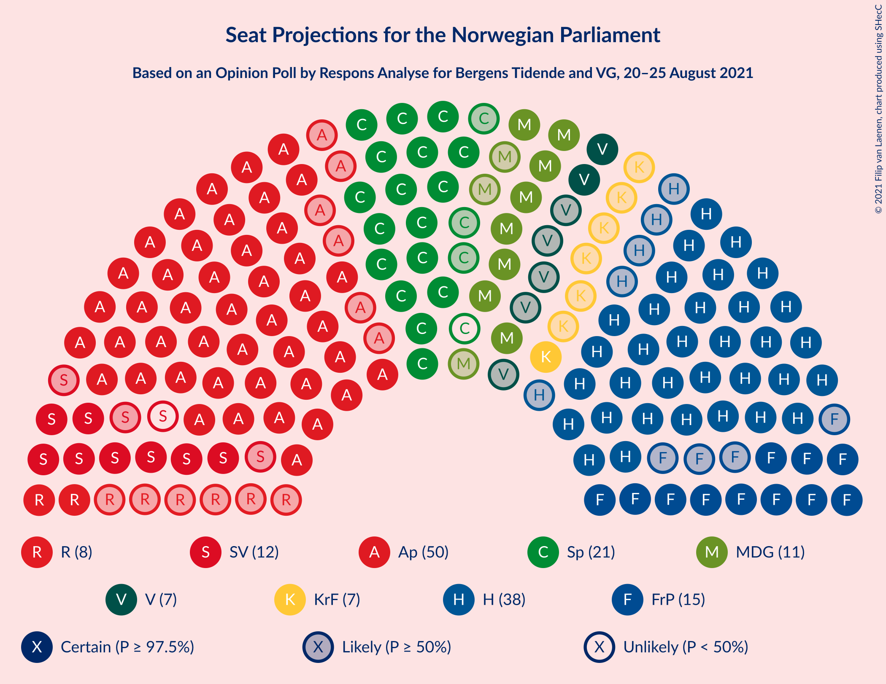
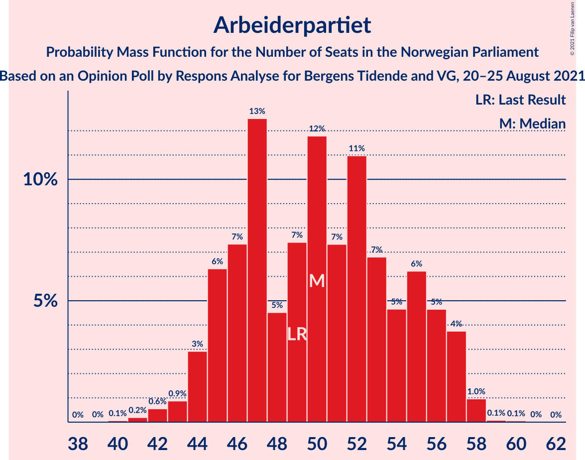
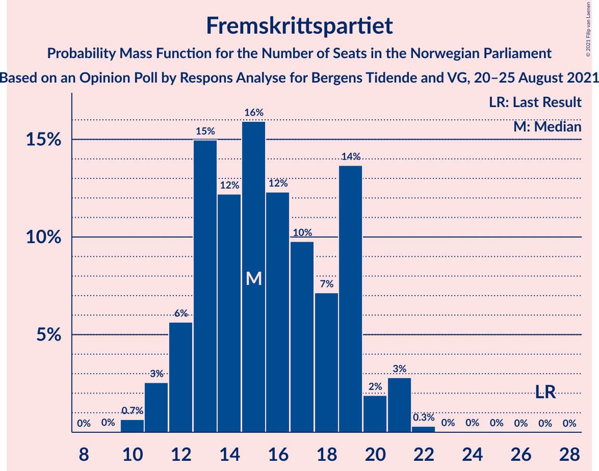
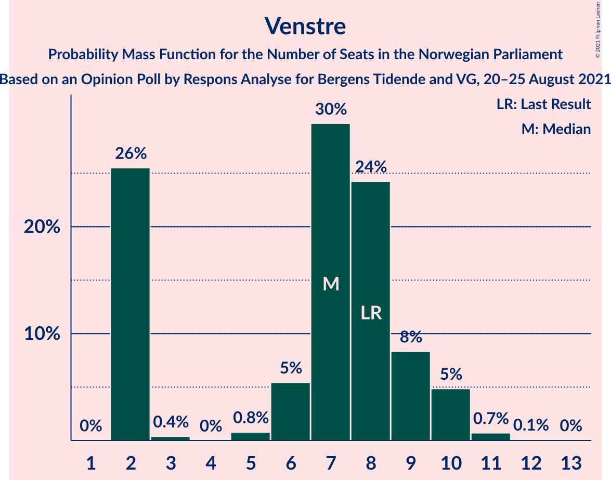
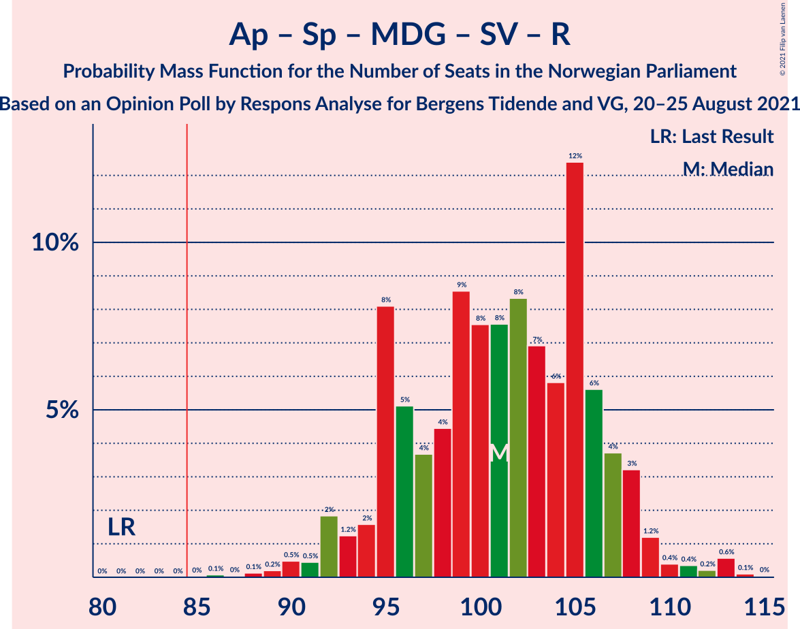
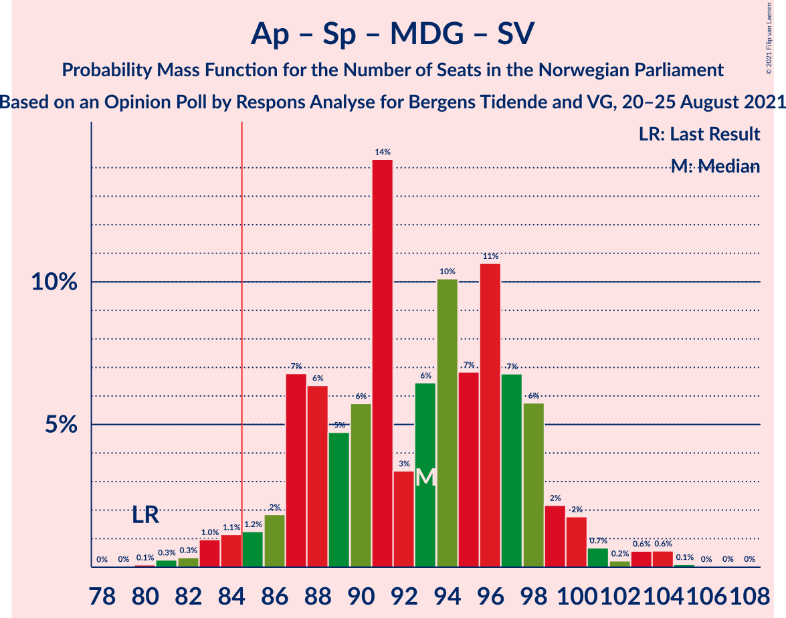
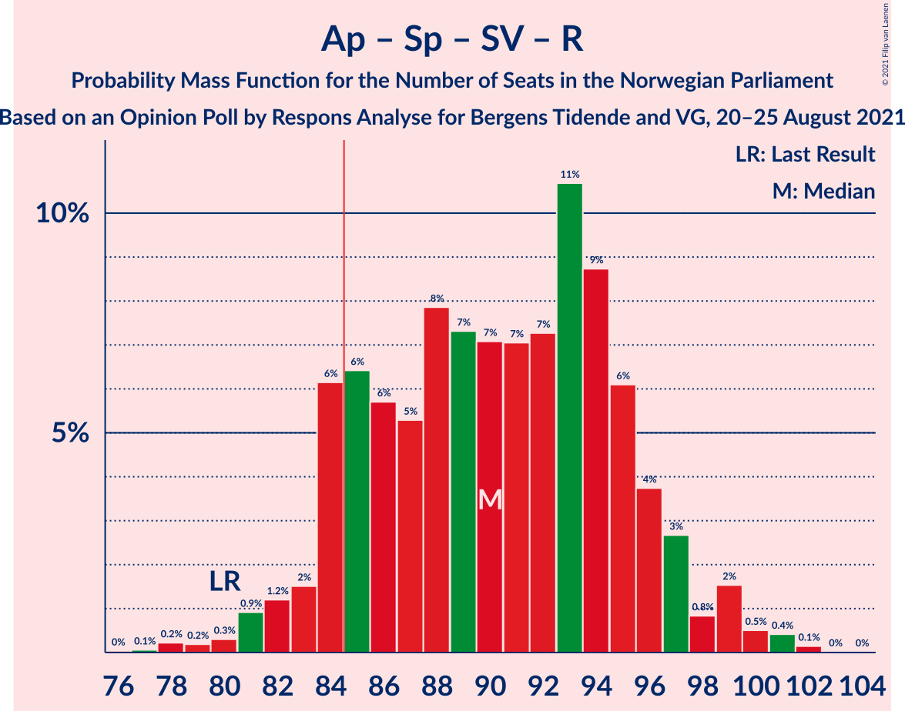
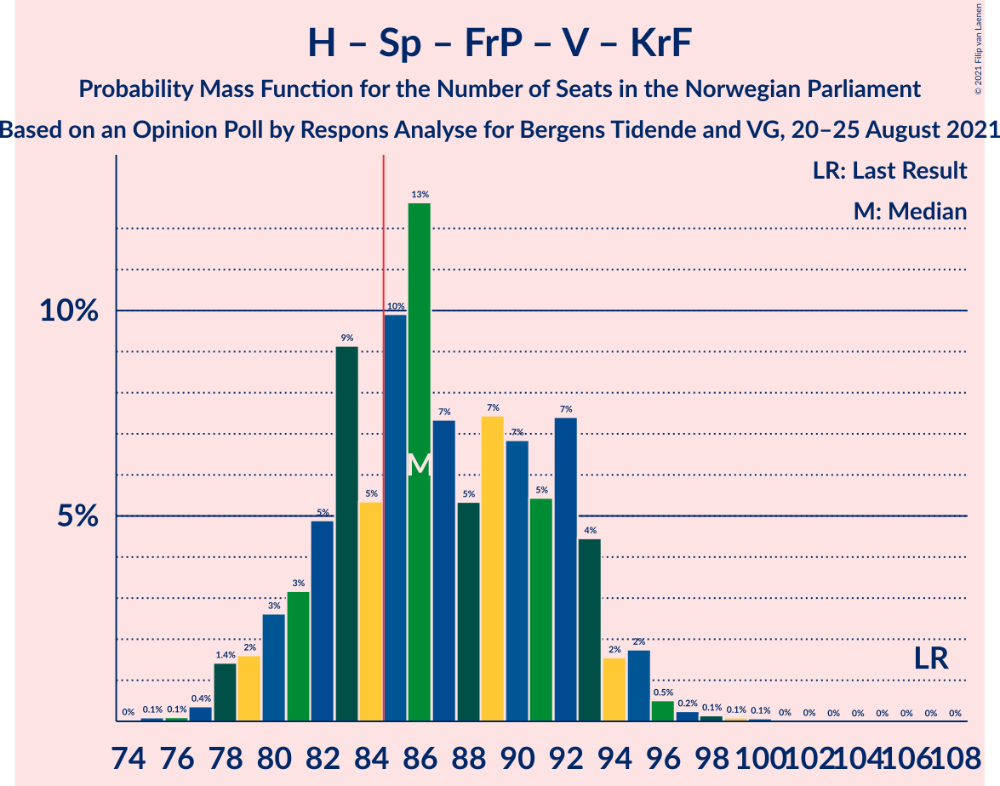
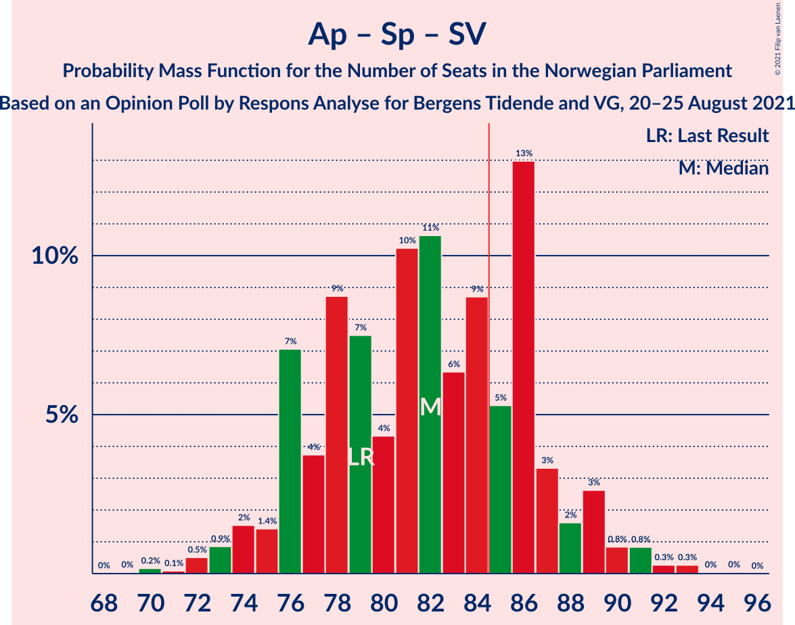
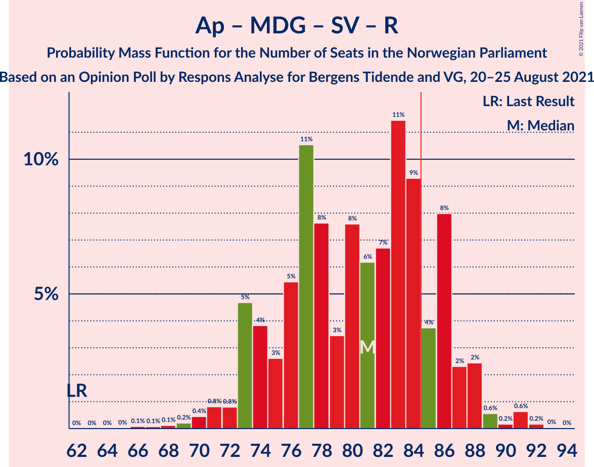

# Opinion Poll by Respons Analyse for Bergens Tidende and VG, 20–25 August 2021

<a href="#voting-intentions">Voting Intentions</a> | <a href="#seats">Seats</a> | <a href="#coalitions">Coalitions</a> | <a href="#technical-information">Technical Information</a>

## Voting Intentions

### Confidence Intervals

| Party | Last Result | Poll Result | 80% Confidence Interval | 90% Confidence Interval | 95% Confidence Interval | 99% Confidence Interval |
|:-----:|:-----------:|:-----------:|:-----------------------:|:-----------------------:|:-----------------------:|:-----------------------:|
| Arbeiderpartiet | 27.4% | 26.6% | 24.7–28.7% |24.1–29.2% |23.6–29.8% |22.7–30.8% |
| Høyre | 25.0% | 21.1% | 19.3–23.0% |18.8–23.6% |18.4–24.1% |17.6–25.0% |
| Senterpartiet | 10.3% | 11.9% | 10.5–13.4% |10.1–13.9% |9.8–14.3% |9.2–15.1% |
| Fremskrittspartiet | 15.2% | 9.4% | 8.2–10.8% |7.8–11.2% |7.5–11.6% |7.0–12.3% |
| Sosialistisk Venstreparti | 6.0% | 6.7% | 5.7–8.0% |5.4–8.4% |5.2–8.7% |4.8–9.3% |
| Miljøpartiet De Grønne | 3.2% | 6.7% | 5.7–8.0% |5.4–8.4% |5.2–8.7% |4.8–9.3% |
| Rødt | 2.4% | 5.2% | 4.4–6.4% |4.1–6.7% |3.9–7.0% |3.5–7.6% |
| Venstre | 4.4% | 4.5% | 3.7–5.6% |3.4–5.9% |3.3–6.2% |2.9–6.7% |
| Kristelig Folkeparti | 4.2% | 4.4% | 3.6–5.4% |3.3–5.7% |3.2–6.0% |2.8–6.6% |

*Note:* The poll result column reflects the actual value used in the calculations. Published results may vary slightly, and in addition be rounded to fewer digits.

## Seats

### Confidence Intervals

| Party | Last Result | Median | 80% Confidence Interval | 90% Confidence Interval | 95% Confidence Interval | 99% Confidence Interval |
|:-----:|:-----------:|:------:|:-----------------------:|:-----------------------:|:-----------------------:|:-----------------------:|
| <a href="#arbeiderpartiet">Arbeiderpartiet</a> | 49 | 50 | 45–55 |45–57 |44–57 |42–58 |
| <a href="#høyre">Høyre</a> | 45 | 38 | 35–42 |33–45 |33–45 |30–47 |
| <a href="#senterpartiet">Senterpartiet</a> | 19 | 21 | 18–24 |17–25 |17–26 |17–31 |
| <a href="#fremskrittspartiet">Fremskrittspartiet</a> | 27 | 16 | 12–19 |12–19 |11–20 |10–22 |
| <a href="#sosialistisk-venstreparti">Sosialistisk Venstreparti</a> | 11 | 11 | 9–13 |8–15 |8–15 |7–16 |
| <a href="#miljøpartiet-de-grønne">Miljøpartiet De Grønne</a> | 1 | 10 | 9–13 |9–14 |8–14 |7–16 |
| <a href="#rødt">Rødt</a> | 1 | 8 | 7–10 |6–11 |2–11 |2–13 |
| <a href="#venstre">Venstre</a> | 8 | 7 | 2–9 |2–9 |2–10 |2–11 |
| <a href="#kristelig-folkeparti">Kristelig Folkeparti</a> | 8 | 7 | 3–9 |2–9 |1–10 |1–11 |

### Arbeiderpartiet

*For a full overview of the results for this party, see the [Arbeiderpartiet](party-arbeiderpartiet.html) page.*

| Number of Seats | Probability | Accumulated | Special Marks |
|:---------------:|:-----------:|:-----------:|:-------------:|
| 40 | 0% | 100% |  |
| 41 | 0.3% | 99.9% |  |
| 42 | 0.8% | 99.7% |  |
| 43 | 0.5% | 98.9% |  |
| 44 | 2% | 98% |  |
| 45 | 7% | 97% |  |
| 46 | 8% | 89% |  |
| 47 | 23% | 81% |  |
| 48 | 3% | 58% |  |
| 49 | 4% | 55% | Last Result |
| 50 | 10% | 51% | Median |
| 51 | 6% | 41% |  |
| 52 | 14% | 36% |  |
| 53 | 6% | 22% |  |
| 54 | 4% | 16% |  |
| 55 | 3% | 11% |  |
| 56 | 3% | 8% |  |
| 57 | 4% | 6% |  |
| 58 | 1.3% | 1.4% |  |
| 59 | 0.1% | 0.2% |  |
| 60 | 0.1% | 0.1% |  |
| 61 | 0% | 0% |  |

### Høyre

*For a full overview of the results for this party, see the [Høyre](party-høyre.html) page.*

| Number of Seats | Probability | Accumulated | Special Marks |
|:---------------:|:-----------:|:-----------:|:-------------:|
| 28 | 0.1% | 100% |  |
| 29 | 0.2% | 99.8% |  |
| 30 | 0.2% | 99.6% |  |
| 31 | 0.8% | 99.4% |  |
| 32 | 1.1% | 98.6% |  |
| 33 | 3% | 98% |  |
| 34 | 2% | 95% |  |
| 35 | 6% | 93% |  |
| 36 | 28% | 88% |  |
| 37 | 8% | 59% |  |
| 38 | 20% | 51% | Median |
| 39 | 5% | 32% |  |
| 40 | 10% | 27% |  |
| 41 | 2% | 17% |  |
| 42 | 5% | 15% |  |
| 43 | 0.9% | 10% |  |
| 44 | 0.6% | 9% |  |
| 45 | 7% | 8% | Last Result |
| 46 | 0.9% | 2% |  |
| 47 | 0.5% | 0.6% |  |
| 48 | 0.1% | 0.2% |  |
| 49 | 0.1% | 0.1% |  |
| 50 | 0% | 0% |  |

### Senterpartiet

*For a full overview of the results for this party, see the [Senterpartiet](party-senterpartiet.html) page.*

| Number of Seats | Probability | Accumulated | Special Marks |
|:---------------:|:-----------:|:-----------:|:-------------:|
| 16 | 0.2% | 100% |  |
| 17 | 6% | 99.8% |  |
| 18 | 15% | 94% |  |
| 19 | 15% | 78% | Last Result |
| 20 | 11% | 63% |  |
| 21 | 11% | 52% | Median |
| 22 | 26% | 42% |  |
| 23 | 3% | 15% |  |
| 24 | 6% | 12% |  |
| 25 | 3% | 6% |  |
| 26 | 1.4% | 3% |  |
| 27 | 0.4% | 2% |  |
| 28 | 0.4% | 1.4% |  |
| 29 | 0.1% | 1.0% |  |
| 30 | 0.2% | 0.8% |  |
| 31 | 0.5% | 0.6% |  |
| 32 | 0.1% | 0.1% |  |
| 33 | 0% | 0% |  |

### Fremskrittspartiet

*For a full overview of the results for this party, see the [Fremskrittspartiet](party-fremskrittspartiet.html) page.*

| Number of Seats | Probability | Accumulated | Special Marks |
|:---------------:|:-----------:|:-----------:|:-------------:|
| 9 | 0.1% | 100% |  |
| 10 | 1.0% | 99.9% |  |
| 11 | 3% | 98.9% |  |
| 12 | 5% | 95% |  |
| 13 | 11% | 90% |  |
| 14 | 10% | 79% |  |
| 15 | 15% | 69% |  |
| 16 | 5% | 54% | Median |
| 17 | 12% | 49% |  |
| 18 | 9% | 37% |  |
| 19 | 23% | 27% |  |
| 20 | 2% | 4% |  |
| 21 | 2% | 2% |  |
| 22 | 0.4% | 0.6% |  |
| 23 | 0% | 0.1% |  |
| 24 | 0% | 0.1% |  |
| 25 | 0% | 0.1% |  |
| 26 | 0% | 0% |  |
| 27 | 0% | 0% | Last Result |

### Sosialistisk Venstreparti

*For a full overview of the results for this party, see the [Sosialistisk Venstreparti](party-sosialistiskvenstreparti.html) page.*

| Number of Seats | Probability | Accumulated | Special Marks |
|:---------------:|:-----------:|:-----------:|:-------------:|
| 6 | 0.1% | 100% |  |
| 7 | 0.7% | 99.9% |  |
| 8 | 6% | 99.2% |  |
| 9 | 21% | 93% |  |
| 10 | 19% | 72% |  |
| 11 | 17% | 53% | Last Result, Median |
| 12 | 21% | 36% |  |
| 13 | 7% | 15% |  |
| 14 | 2% | 8% |  |
| 15 | 4% | 6% |  |
| 16 | 1.2% | 1.4% |  |
| 17 | 0.1% | 0.2% |  |
| 18 | 0.1% | 0.1% |  |
| 19 | 0% | 0% |  |

### Miljøpartiet De Grønne

*For a full overview of the results for this party, see the [Miljøpartiet De Grønne](party-miljøpartietdegrønne.html) page.*

| Number of Seats | Probability | Accumulated | Special Marks |
|:---------------:|:-----------:|:-----------:|:-------------:|
| 1 | 0% | 100% | Last Result |
| 2 | 0% | 100% |  |
| 3 | 0% | 100% |  |
| 4 | 0% | 100% |  |
| 5 | 0% | 100% |  |
| 6 | 0.1% | 100% |  |
| 7 | 2% | 99.9% |  |
| 8 | 3% | 98% |  |
| 9 | 13% | 95% |  |
| 10 | 33% | 82% | Median |
| 11 | 21% | 50% |  |
| 12 | 16% | 29% |  |
| 13 | 7% | 13% |  |
| 14 | 4% | 6% |  |
| 15 | 1.0% | 2% |  |
| 16 | 0.5% | 0.7% |  |
| 17 | 0.1% | 0.2% |  |
| 18 | 0% | 0% |  |

### Rødt

*For a full overview of the results for this party, see the [Rødt](party-rødt.html) page.*

| Number of Seats | Probability | Accumulated | Special Marks |
|:---------------:|:-----------:|:-----------:|:-------------:|
| 1 | 0% | 100% | Last Result |
| 2 | 4% | 100% |  |
| 3 | 0% | 96% |  |
| 4 | 0% | 96% |  |
| 5 | 0.1% | 96% |  |
| 6 | 3% | 96% |  |
| 7 | 22% | 94% |  |
| 8 | 27% | 71% | Median |
| 9 | 18% | 44% |  |
| 10 | 18% | 26% |  |
| 11 | 6% | 8% |  |
| 12 | 1.3% | 2% |  |
| 13 | 0.9% | 1.0% |  |
| 14 | 0% | 0.1% |  |
| 15 | 0% | 0% |  |

### Venstre

*For a full overview of the results for this party, see the [Venstre](party-venstre.html) page.*

| Number of Seats | Probability | Accumulated | Special Marks |
|:---------------:|:-----------:|:-----------:|:-------------:|
| 2 | 21% | 100% |  |
| 3 | 0.4% | 79% |  |
| 4 | 0% | 79% |  |
| 5 | 0.1% | 79% |  |
| 6 | 5% | 79% |  |
| 7 | 43% | 74% | Median |
| 8 | 21% | 31% | Last Result |
| 9 | 6% | 10% |  |
| 10 | 3% | 4% |  |
| 11 | 0.7% | 0.9% |  |
| 12 | 0.1% | 0.1% |  |
| 13 | 0% | 0% |  |

### Kristelig Folkeparti

*For a full overview of the results for this party, see the [Kristelig Folkeparti](party-kristeligfolkeparti.html) page.*

| Number of Seats | Probability | Accumulated | Special Marks |
|:---------------:|:-----------:|:-----------:|:-------------:|
| 1 | 3% | 100% |  |
| 2 | 3% | 97% |  |
| 3 | 10% | 94% |  |
| 4 | 0% | 85% |  |
| 5 | 0.5% | 85% |  |
| 6 | 17% | 84% |  |
| 7 | 43% | 67% | Median |
| 8 | 13% | 25% | Last Result |
| 9 | 7% | 11% |  |
| 10 | 3% | 4% |  |
| 11 | 0.5% | 0.6% |  |
| 12 | 0.1% | 0.1% |  |
| 13 | 0% | 0% |  |

## Coalitions

### Confidence Intervals

| Coalition | Last Result | Median | Majority? | 80% Confidence Interval | 90% Confidence Interval | 95% Confidence Interval | 99% Confidence Interval |
|:---------:|:-----------:|:------:|:---------:|:-----------------------:|:-----------------------:|:-----------------------:|:-----------------------:|
| Arbeiderpartiet – Senterpartiet – Miljøpartiet De Grønne – Sosialistisk Venstreparti – Rødt | 81 | 100 | 100% | 95–106 | 94–108 | 92–109 | 89–112 |
| Arbeiderpartiet – Senterpartiet – Miljøpartiet De Grønne – Sosialistisk Venstreparti – Kristelig Folkeparti | 88 | 98 | 99.9% | 93–104 | 92–106 | 91–108 | 87–109 |
| Arbeiderpartiet – Senterpartiet – Miljøpartiet De Grønne – Sosialistisk Venstreparti | 80 | 91 | 97% | 87–97 | 86–99 | 84–100 | 81–103 |
| Arbeiderpartiet – Senterpartiet – Sosialistisk Venstreparti – Rødt | 80 | 89 | 88% | 84–96 | 84–97 | 82–98 | 78–101 |
| Arbeiderpartiet – Senterpartiet – Miljøpartiet De Grønne – Kristelig Folkeparti | 77 | 88 | 81% | 82–93 | 82–94 | 80–96 | 76–98 |
| Høyre – Senterpartiet – Fremskrittspartiet – Venstre – Kristelig Folkeparti | 107 | 88 | 76% | 82–93 | 81–93 | 79–94 | 77–97 |
| Arbeiderpartiet – Senterpartiet – Sosialistisk Venstreparti | 79 | 81 | 23% | 76–86 | 76–88 | 74–89 | 72–92 |
| Arbeiderpartiet – Miljøpartiet De Grønne – Sosialistisk Venstreparti – Rødt | 62 | 79 | 16% | 73–86 | 73–88 | 72–88 | 69–91 |
| Arbeiderpartiet – Senterpartiet – Kristelig Folkeparti | 76 | 77 | 3% | 71–83 | 71–83 | 69–85 | 66–87 |
| Høyre – Fremskrittspartiet – Miljøpartiet De Grønne – Venstre – Kristelig Folkeparti | 89 | 78 | 8% | 72–83 | 70–85 | 69–85 | 66–88 |
| Arbeiderpartiet – Senterpartiet | 68 | 70 | 0% | 65–75 | 64–77 | 64–78 | 61–81 |
| Høyre – Fremskrittspartiet – Venstre – Kristelig Folkeparti | 88 | 68 | 0% | 61–72 | 60–74 | 59–74 | 55–77 |
| Arbeiderpartiet – Sosialistisk Venstreparti | 60 | 60 | 0% | 56–66 | 55–68 | 55–68 | 52–70 |
| Høyre – Fremskrittspartiet – Venstre | 80 | 61 | 0% | 55–66 | 53–67 | 53–68 | 51–70 |
| Høyre – Fremskrittspartiet | 72 | 55 | 0% | 49–59 | 48–60 | 47–61 | 45–64 |
| Høyre – Venstre – Kristelig Folkeparti | 61 | 50 | 0% | 46–56 | 45–59 | 43–59 | 40–61 |
| Senterpartiet – Venstre – Kristelig Folkeparti | 35 | 34 | 0% | 28–37 | 27–38 | 26–40 | 23–45 |

### Arbeiderpartiet – Senterpartiet – Miljøpartiet De Grønne – Sosialistisk Venstreparti – Rødt

| Number of Seats | Probability | Accumulated | Special Marks |
|:---------------:|:-----------:|:-----------:|:-------------:|
| 81 | 0% | 100% | Last Result |
| 82 | 0% | 100% |  |
| 83 | 0% | 100% |  |
| 84 | 0% | 100% |  |
| 85 | 0% | 100% | Majority |
| 86 | 0.1% | 100% |  |
| 87 | 0.1% | 99.8% |  |
| 88 | 0.1% | 99.7% |  |
| 89 | 0.4% | 99.7% |  |
| 90 | 0.8% | 99.3% |  |
| 91 | 0.5% | 98.5% |  |
| 92 | 1.2% | 98% |  |
| 93 | 0.9% | 97% |  |
| 94 | 2% | 96% |  |
| 95 | 14% | 94% |  |
| 96 | 2% | 79% |  |
| 97 | 5% | 77% |  |
| 98 | 4% | 73% |  |
| 99 | 13% | 69% |  |
| 100 | 11% | 57% | Median |
| 101 | 9% | 46% |  |
| 102 | 6% | 37% |  |
| 103 | 6% | 31% |  |
| 104 | 5% | 24% |  |
| 105 | 3% | 19% |  |
| 106 | 8% | 16% |  |
| 107 | 3% | 9% |  |
| 108 | 2% | 5% |  |
| 109 | 1.3% | 3% |  |
| 110 | 0.5% | 2% |  |
| 111 | 0.4% | 1.0% |  |
| 112 | 0.3% | 0.6% |  |
| 113 | 0.1% | 0.3% |  |
| 114 | 0.2% | 0.3% |  |
| 115 | 0.1% | 0.1% |  |
| 116 | 0% | 0% |  |

### Arbeiderpartiet – Senterpartiet – Miljøpartiet De Grønne – Sosialistisk Venstreparti – Kristelig Folkeparti

| Number of Seats | Probability | Accumulated | Special Marks |
|:---------------:|:-----------:|:-----------:|:-------------:|
| 84 | 0% | 100% |  |
| 85 | 0.3% | 99.9% | Majority |
| 86 | 0.1% | 99.6% |  |
| 87 | 0.1% | 99.6% |  |
| 88 | 0.5% | 99.4% | Last Result |
| 89 | 0.6% | 98.9% |  |
| 90 | 0.5% | 98% |  |
| 91 | 1.5% | 98% |  |
| 92 | 2% | 96% |  |
| 93 | 4% | 94% |  |
| 94 | 14% | 90% |  |
| 95 | 2% | 75% |  |
| 96 | 5% | 73% |  |
| 97 | 8% | 68% |  |
| 98 | 18% | 61% |  |
| 99 | 4% | 43% | Median |
| 100 | 9% | 39% |  |
| 101 | 4% | 31% |  |
| 102 | 5% | 26% |  |
| 103 | 3% | 22% |  |
| 104 | 9% | 18% |  |
| 105 | 3% | 10% |  |
| 106 | 3% | 6% |  |
| 107 | 0.7% | 3% |  |
| 108 | 2% | 3% |  |
| 109 | 0.6% | 0.9% |  |
| 110 | 0.2% | 0.4% |  |
| 111 | 0.1% | 0.2% |  |
| 112 | 0% | 0.1% |  |
| 113 | 0% | 0% |  |

### Arbeiderpartiet – Senterpartiet – Miljøpartiet De Grønne – Sosialistisk Venstreparti

| Number of Seats | Probability | Accumulated | Special Marks |
|:---------------:|:-----------:|:-----------:|:-------------:|
| 79 | 0% | 100% |  |
| 80 | 0.1% | 99.9% | Last Result |
| 81 | 0.3% | 99.8% |  |
| 82 | 0.4% | 99.5% |  |
| 83 | 0.6% | 99.1% |  |
| 84 | 1.1% | 98.5% |  |
| 85 | 1.4% | 97% | Majority |
| 86 | 2% | 96% |  |
| 87 | 8% | 94% |  |
| 88 | 9% | 86% |  |
| 89 | 5% | 77% |  |
| 90 | 6% | 72% |  |
| 91 | 21% | 66% |  |
| 92 | 3% | 44% | Median |
| 93 | 6% | 42% |  |
| 94 | 6% | 36% |  |
| 95 | 8% | 30% |  |
| 96 | 6% | 22% |  |
| 97 | 6% | 16% |  |
| 98 | 2% | 10% |  |
| 99 | 4% | 8% |  |
| 100 | 2% | 4% |  |
| 101 | 0.7% | 2% |  |
| 102 | 0.4% | 1.1% |  |
| 103 | 0.3% | 0.7% |  |
| 104 | 0.1% | 0.4% |  |
| 105 | 0.2% | 0.3% |  |
| 106 | 0% | 0.1% |  |
| 107 | 0% | 0.1% |  |
| 108 | 0.1% | 0.1% |  |
| 109 | 0% | 0% |  |

### Arbeiderpartiet – Senterpartiet – Sosialistisk Venstreparti – Rødt

| Number of Seats | Probability | Accumulated | Special Marks |
|:---------------:|:-----------:|:-----------:|:-------------:|
| 76 | 0% | 100% |  |
| 77 | 0% | 99.9% |  |
| 78 | 0.4% | 99.9% |  |
| 79 | 0.2% | 99.5% |  |
| 80 | 0.3% | 99.2% | Last Result |
| 81 | 1.2% | 98.9% |  |
| 82 | 0.8% | 98% |  |
| 83 | 1.1% | 97% |  |
| 84 | 8% | 96% |  |
| 85 | 10% | 88% | Majority |
| 86 | 5% | 78% |  |
| 87 | 5% | 72% |  |
| 88 | 11% | 68% |  |
| 89 | 10% | 56% |  |
| 90 | 4% | 46% | Median |
| 91 | 7% | 42% |  |
| 92 | 9% | 35% |  |
| 93 | 6% | 26% |  |
| 94 | 5% | 20% |  |
| 95 | 3% | 15% |  |
| 96 | 6% | 12% |  |
| 97 | 3% | 5% |  |
| 98 | 1.1% | 3% |  |
| 99 | 0.6% | 2% |  |
| 100 | 0.2% | 1.0% |  |
| 101 | 0.8% | 0.9% |  |
| 102 | 0.1% | 0.1% |  |
| 103 | 0% | 0% |  |

### Arbeiderpartiet – Senterpartiet – Miljøpartiet De Grønne – Kristelig Folkeparti

| Number of Seats | Probability | Accumulated | Special Marks |
|:---------------:|:-----------:|:-----------:|:-------------:|
| 74 | 0% | 100% |  |
| 75 | 0.1% | 99.9% |  |
| 76 | 0.4% | 99.8% |  |
| 77 | 0.2% | 99.5% | Last Result |
| 78 | 0.5% | 99.3% |  |
| 79 | 1.3% | 98.8% |  |
| 80 | 1.1% | 98% |  |
| 81 | 0.6% | 96% |  |
| 82 | 8% | 96% |  |
| 83 | 3% | 88% |  |
| 84 | 4% | 85% |  |
| 85 | 13% | 81% | Majority |
| 86 | 9% | 68% |  |
| 87 | 8% | 59% |  |
| 88 | 10% | 51% | Median |
| 89 | 11% | 41% |  |
| 90 | 6% | 30% |  |
| 91 | 3% | 24% |  |
| 92 | 6% | 21% |  |
| 93 | 6% | 15% |  |
| 94 | 5% | 9% |  |
| 95 | 1.2% | 4% |  |
| 96 | 1.3% | 3% |  |
| 97 | 0.9% | 2% |  |
| 98 | 0.7% | 0.9% |  |
| 99 | 0.1% | 0.2% |  |
| 100 | 0.1% | 0.1% |  |
| 101 | 0% | 0% |  |

### Høyre – Senterpartiet – Fremskrittspartiet – Venstre – Kristelig Folkeparti

| Number of Seats | Probability | Accumulated | Special Marks |
|:---------------:|:-----------:|:-----------:|:-------------:|
| 75 | 0.1% | 100% |  |
| 76 | 0.1% | 99.8% |  |
| 77 | 0.3% | 99.7% |  |
| 78 | 1.2% | 99.4% |  |
| 79 | 1.0% | 98% |  |
| 80 | 1.2% | 97% |  |
| 81 | 5% | 96% |  |
| 82 | 6% | 91% |  |
| 83 | 4% | 86% |  |
| 84 | 7% | 82% |  |
| 85 | 6% | 76% | Majority |
| 86 | 12% | 70% |  |
| 87 | 5% | 58% |  |
| 88 | 4% | 53% |  |
| 89 | 8% | 49% | Median |
| 90 | 10% | 41% |  |
| 91 | 10% | 31% |  |
| 92 | 11% | 21% |  |
| 93 | 7% | 10% |  |
| 94 | 1.0% | 3% |  |
| 95 | 0.9% | 2% |  |
| 96 | 0.5% | 1.2% |  |
| 97 | 0.3% | 0.7% |  |
| 98 | 0.2% | 0.5% |  |
| 99 | 0.1% | 0.2% |  |
| 100 | 0.1% | 0.2% |  |
| 101 | 0% | 0% |  |
| 102 | 0% | 0% |  |
| 103 | 0% | 0% |  |
| 104 | 0% | 0% |  |
| 105 | 0% | 0% |  |
| 106 | 0% | 0% |  |
| 107 | 0% | 0% | Last Result |

### Arbeiderpartiet – Senterpartiet – Sosialistisk Venstreparti

| Number of Seats | Probability | Accumulated | Special Marks |
|:---------------:|:-----------:|:-----------:|:-------------:|
| 69 | 0.1% | 100% |  |
| 70 | 0.3% | 99.9% |  |
| 71 | 0% | 99.6% |  |
| 72 | 0.6% | 99.6% |  |
| 73 | 0.3% | 99.0% |  |
| 74 | 1.4% | 98.6% |  |
| 75 | 2% | 97% |  |
| 76 | 9% | 96% |  |
| 77 | 4% | 86% |  |
| 78 | 10% | 82% |  |
| 79 | 10% | 72% | Last Result |
| 80 | 4% | 62% |  |
| 81 | 14% | 58% |  |
| 82 | 8% | 44% | Median |
| 83 | 5% | 36% |  |
| 84 | 8% | 31% |  |
| 85 | 6% | 23% | Majority |
| 86 | 8% | 17% |  |
| 87 | 4% | 10% |  |
| 88 | 2% | 6% |  |
| 89 | 2% | 4% |  |
| 90 | 0.6% | 2% |  |
| 91 | 0.7% | 1.4% |  |
| 92 | 0.2% | 0.7% |  |
| 93 | 0.3% | 0.4% |  |
| 94 | 0.1% | 0.1% |  |
| 95 | 0.1% | 0.1% |  |
| 96 | 0% | 0% |  |

### Arbeiderpartiet – Miljøpartiet De Grønne – Sosialistisk Venstreparti – Rødt

| Number of Seats | Probability | Accumulated | Special Marks |
|:---------------:|:-----------:|:-----------:|:-------------:|
| 62 | 0% | 100% | Last Result |
| 63 | 0% | 100% |  |
| 64 | 0% | 100% |  |
| 65 | 0% | 100% |  |
| 66 | 0.2% | 100% |  |
| 67 | 0.1% | 99.8% |  |
| 68 | 0.1% | 99.7% |  |
| 69 | 0.3% | 99.6% |  |
| 70 | 0.3% | 99.3% |  |
| 71 | 1.3% | 99.0% |  |
| 72 | 1.0% | 98% |  |
| 73 | 8% | 97% |  |
| 74 | 2% | 89% |  |
| 75 | 2% | 87% |  |
| 76 | 8% | 84% |  |
| 77 | 12% | 76% |  |
| 78 | 12% | 64% |  |
| 79 | 4% | 52% | Median |
| 80 | 9% | 48% |  |
| 81 | 5% | 39% |  |
| 82 | 4% | 34% |  |
| 83 | 10% | 31% |  |
| 84 | 5% | 21% |  |
| 85 | 5% | 16% | Majority |
| 86 | 2% | 11% |  |
| 87 | 3% | 8% |  |
| 88 | 4% | 6% |  |
| 89 | 0.7% | 1.3% |  |
| 90 | 0.1% | 0.7% |  |
| 91 | 0.3% | 0.5% |  |
| 92 | 0.2% | 0.2% |  |
| 93 | 0.1% | 0.1% |  |
| 94 | 0% | 0% |  |

### Arbeiderpartiet – Senterpartiet – Kristelig Folkeparti

| Number of Seats | Probability | Accumulated | Special Marks |
|:---------------:|:-----------:|:-----------:|:-------------:|
| 63 | 0% | 100% |  |
| 64 | 0.1% | 99.9% |  |
| 65 | 0% | 99.9% |  |
| 66 | 0.5% | 99.8% |  |
| 67 | 0.5% | 99.4% |  |
| 68 | 0.9% | 98.9% |  |
| 69 | 0.7% | 98% |  |
| 70 | 1.3% | 97% |  |
| 71 | 8% | 96% |  |
| 72 | 6% | 88% |  |
| 73 | 3% | 83% |  |
| 74 | 5% | 80% |  |
| 75 | 12% | 75% |  |
| 76 | 11% | 63% | Last Result |
| 77 | 8% | 52% |  |
| 78 | 7% | 44% | Median |
| 79 | 12% | 37% |  |
| 80 | 5% | 25% |  |
| 81 | 5% | 20% |  |
| 82 | 4% | 15% |  |
| 83 | 7% | 12% |  |
| 84 | 2% | 5% |  |
| 85 | 2% | 3% | Majority |
| 86 | 0.7% | 2% |  |
| 87 | 0.5% | 1.0% |  |
| 88 | 0.4% | 0.5% |  |
| 89 | 0.1% | 0.1% |  |
| 90 | 0% | 0.1% |  |
| 91 | 0% | 0% |  |

### Høyre – Fremskrittspartiet – Miljøpartiet De Grønne – Venstre – Kristelig Folkeparti

| Number of Seats | Probability | Accumulated | Special Marks |
|:---------------:|:-----------:|:-----------:|:-------------:|
| 63 | 0% | 100% |  |
| 64 | 0% | 99.9% |  |
| 65 | 0.2% | 99.9% |  |
| 66 | 0.4% | 99.7% |  |
| 67 | 0.5% | 99.4% |  |
| 68 | 1.3% | 98.8% |  |
| 69 | 2% | 98% |  |
| 70 | 1.4% | 96% |  |
| 71 | 3% | 94% |  |
| 72 | 4% | 92% |  |
| 73 | 8% | 87% |  |
| 74 | 3% | 79% |  |
| 75 | 7% | 76% |  |
| 76 | 5% | 69% |  |
| 77 | 9% | 64% |  |
| 78 | 13% | 55% | Median |
| 79 | 4% | 42% |  |
| 80 | 10% | 38% |  |
| 81 | 10% | 28% |  |
| 82 | 4% | 18% |  |
| 83 | 5% | 14% |  |
| 84 | 2% | 9% |  |
| 85 | 6% | 8% | Majority |
| 86 | 0.7% | 2% |  |
| 87 | 0.4% | 1.0% |  |
| 88 | 0.2% | 0.6% |  |
| 89 | 0.2% | 0.4% | Last Result |
| 90 | 0.1% | 0.2% |  |
| 91 | 0% | 0% |  |

### Arbeiderpartiet – Senterpartiet

| Number of Seats | Probability | Accumulated | Special Marks |
|:---------------:|:-----------:|:-----------:|:-------------:|
| 59 | 0% | 100% |  |
| 60 | 0.4% | 99.9% |  |
| 61 | 0.3% | 99.6% |  |
| 62 | 0.2% | 99.3% |  |
| 63 | 0.9% | 99.2% |  |
| 64 | 7% | 98% |  |
| 65 | 6% | 92% |  |
| 66 | 3% | 86% |  |
| 67 | 3% | 83% |  |
| 68 | 4% | 80% | Last Result |
| 69 | 20% | 76% |  |
| 70 | 10% | 56% |  |
| 71 | 8% | 46% | Median |
| 72 | 12% | 39% |  |
| 73 | 5% | 27% |  |
| 74 | 3% | 21% |  |
| 75 | 8% | 18% |  |
| 76 | 3% | 10% |  |
| 77 | 3% | 6% |  |
| 78 | 1.5% | 4% |  |
| 79 | 1.1% | 2% |  |
| 80 | 0.5% | 1.0% |  |
| 81 | 0.4% | 0.5% |  |
| 82 | 0.1% | 0.1% |  |
| 83 | 0% | 0.1% |  |
| 84 | 0% | 0% |  |

### Høyre – Fremskrittspartiet – Venstre – Kristelig Folkeparti

| Number of Seats | Probability | Accumulated | Special Marks |
|:---------------:|:-----------:|:-----------:|:-------------:|
| 53 | 0.1% | 100% |  |
| 54 | 0.1% | 99.8% |  |
| 55 | 0.3% | 99.8% |  |
| 56 | 0.1% | 99.5% |  |
| 57 | 0.9% | 99.3% |  |
| 58 | 0.8% | 98% |  |
| 59 | 1.1% | 98% |  |
| 60 | 3% | 96% |  |
| 61 | 5% | 93% |  |
| 62 | 5% | 89% |  |
| 63 | 10% | 84% |  |
| 64 | 3% | 74% |  |
| 65 | 5% | 71% |  |
| 66 | 7% | 65% |  |
| 67 | 4% | 58% |  |
| 68 | 15% | 54% | Median |
| 69 | 11% | 38% |  |
| 70 | 11% | 27% |  |
| 71 | 3% | 16% |  |
| 72 | 4% | 14% |  |
| 73 | 2% | 10% |  |
| 74 | 6% | 8% |  |
| 75 | 0.6% | 2% |  |
| 76 | 0.5% | 1.1% |  |
| 77 | 0.3% | 0.6% |  |
| 78 | 0.1% | 0.4% |  |
| 79 | 0.2% | 0.2% |  |
| 80 | 0% | 0.1% |  |
| 81 | 0% | 0% |  |
| 82 | 0% | 0% |  |
| 83 | 0% | 0% |  |
| 84 | 0% | 0% |  |
| 85 | 0% | 0% | Majority |
| 86 | 0% | 0% |  |
| 87 | 0% | 0% |  |
| 88 | 0% | 0% | Last Result |

### Arbeiderpartiet – Sosialistisk Venstreparti

| Number of Seats | Probability | Accumulated | Special Marks |
|:---------------:|:-----------:|:-----------:|:-------------:|
| 50 | 0% | 100% |  |
| 51 | 0.2% | 99.9% |  |
| 52 | 0.4% | 99.7% |  |
| 53 | 0.7% | 99.3% |  |
| 54 | 0.8% | 98.5% |  |
| 55 | 3% | 98% |  |
| 56 | 10% | 95% |  |
| 57 | 17% | 85% |  |
| 58 | 4% | 68% |  |
| 59 | 13% | 64% |  |
| 60 | 6% | 52% | Last Result |
| 61 | 6% | 46% | Median |
| 62 | 5% | 40% |  |
| 63 | 8% | 35% |  |
| 64 | 9% | 27% |  |
| 65 | 5% | 17% |  |
| 66 | 4% | 12% |  |
| 67 | 3% | 8% |  |
| 68 | 4% | 6% |  |
| 69 | 2% | 2% |  |
| 70 | 0.4% | 0.6% |  |
| 71 | 0.2% | 0.3% |  |
| 72 | 0.1% | 0.1% |  |
| 73 | 0% | 0% |  |

### Høyre – Fremskrittspartiet – Venstre

| Number of Seats | Probability | Accumulated | Special Marks |
|:---------------:|:-----------:|:-----------:|:-------------:|
| 49 | 0.1% | 100% |  |
| 50 | 0.3% | 99.9% |  |
| 51 | 0.8% | 99.6% |  |
| 52 | 1.0% | 98.8% |  |
| 53 | 3% | 98% |  |
| 54 | 3% | 95% |  |
| 55 | 8% | 92% |  |
| 56 | 6% | 84% |  |
| 57 | 5% | 77% |  |
| 58 | 3% | 72% |  |
| 59 | 6% | 69% |  |
| 60 | 4% | 63% |  |
| 61 | 10% | 59% | Median |
| 62 | 19% | 49% |  |
| 63 | 13% | 30% |  |
| 64 | 2% | 17% |  |
| 65 | 5% | 15% |  |
| 66 | 1.2% | 10% |  |
| 67 | 7% | 9% |  |
| 68 | 0.7% | 3% |  |
| 69 | 1.1% | 2% |  |
| 70 | 0.5% | 0.9% |  |
| 71 | 0.2% | 0.4% |  |
| 72 | 0.2% | 0.2% |  |
| 73 | 0% | 0.1% |  |
| 74 | 0% | 0% |  |
| 75 | 0% | 0% |  |
| 76 | 0% | 0% |  |
| 77 | 0% | 0% |  |
| 78 | 0% | 0% |  |
| 79 | 0% | 0% |  |
| 80 | 0% | 0% | Last Result |

### Høyre – Fremskrittspartiet

| Number of Seats | Probability | Accumulated | Special Marks |
|:---------------:|:-----------:|:-----------:|:-------------:|
| 42 | 0.1% | 100% |  |
| 43 | 0% | 99.9% |  |
| 44 | 0.2% | 99.9% |  |
| 45 | 0.4% | 99.6% |  |
| 46 | 0.3% | 99.3% |  |
| 47 | 3% | 99.0% |  |
| 48 | 4% | 96% |  |
| 49 | 4% | 92% |  |
| 50 | 5% | 88% |  |
| 51 | 4% | 83% |  |
| 52 | 6% | 79% |  |
| 53 | 9% | 72% |  |
| 54 | 13% | 63% | Median |
| 55 | 25% | 50% |  |
| 56 | 6% | 25% |  |
| 57 | 6% | 19% |  |
| 58 | 0.8% | 13% |  |
| 59 | 2% | 12% |  |
| 60 | 7% | 10% |  |
| 61 | 0.9% | 3% |  |
| 62 | 0.6% | 2% |  |
| 63 | 0.5% | 1.1% |  |
| 64 | 0.2% | 0.6% |  |
| 65 | 0.4% | 0.5% |  |
| 66 | 0.1% | 0.1% |  |
| 67 | 0% | 0% |  |
| 68 | 0% | 0% |  |
| 69 | 0% | 0% |  |
| 70 | 0% | 0% |  |
| 71 | 0% | 0% |  |
| 72 | 0% | 0% | Last Result |

### Høyre – Venstre – Kristelig Folkeparti

| Number of Seats | Probability | Accumulated | Special Marks |
|:---------------:|:-----------:|:-----------:|:-------------:|
| 37 | 0.1% | 100% |  |
| 38 | 0.1% | 99.9% |  |
| 39 | 0.1% | 99.8% |  |
| 40 | 0.3% | 99.7% |  |
| 41 | 0.4% | 99.4% |  |
| 42 | 0.8% | 99.0% |  |
| 43 | 1.3% | 98% |  |
| 44 | 1.1% | 97% |  |
| 45 | 5% | 96% |  |
| 46 | 4% | 91% |  |
| 47 | 7% | 87% |  |
| 48 | 5% | 81% |  |
| 49 | 12% | 76% |  |
| 50 | 16% | 64% |  |
| 51 | 7% | 48% |  |
| 52 | 6% | 41% | Median |
| 53 | 14% | 35% |  |
| 54 | 6% | 21% |  |
| 55 | 2% | 15% |  |
| 56 | 3% | 13% |  |
| 57 | 0.6% | 9% |  |
| 58 | 1.0% | 9% |  |
| 59 | 6% | 8% |  |
| 60 | 0.6% | 1.3% |  |
| 61 | 0.2% | 0.6% | Last Result |
| 62 | 0.3% | 0.5% |  |
| 63 | 0% | 0.1% |  |
| 64 | 0.1% | 0.1% |  |
| 65 | 0% | 0% |  |

### Senterpartiet – Venstre – Kristelig Folkeparti

| Number of Seats | Probability | Accumulated | Special Marks |
|:---------------:|:-----------:|:-----------:|:-------------:|
| 21 | 0% | 100% |  |
| 22 | 0.2% | 99.9% |  |
| 23 | 0.3% | 99.8% |  |
| 24 | 0.4% | 99.4% |  |
| 25 | 0.6% | 99.1% |  |
| 26 | 1.3% | 98.5% |  |
| 27 | 3% | 97% |  |
| 28 | 5% | 94% |  |
| 29 | 4% | 89% |  |
| 30 | 4% | 85% |  |
| 31 | 4% | 81% |  |
| 32 | 10% | 77% |  |
| 33 | 15% | 67% |  |
| 34 | 7% | 53% |  |
| 35 | 13% | 46% | Last Result, Median |
| 36 | 13% | 33% |  |
| 37 | 11% | 19% |  |
| 38 | 4% | 8% |  |
| 39 | 1.0% | 4% |  |
| 40 | 0.9% | 3% |  |
| 41 | 0.8% | 2% |  |
| 42 | 0.5% | 2% |  |
| 43 | 0.3% | 1.1% |  |
| 44 | 0.3% | 0.8% |  |
| 45 | 0.2% | 0.5% |  |
| 46 | 0.2% | 0.3% |  |
| 47 | 0% | 0.1% |  |
| 48 | 0% | 0% |  |

## Technical Information

### Opinion Poll

+ **Polling firm:** Respons Analyse
+ **Commissioner(s):** Bergens Tidende and VG
+ **Fieldwork period:** 20–25 August 2021

### Calculations

+ **Sample size:** 801
+ **Simulations done:** 524,288
+ **Error estimate:** 0.90%

