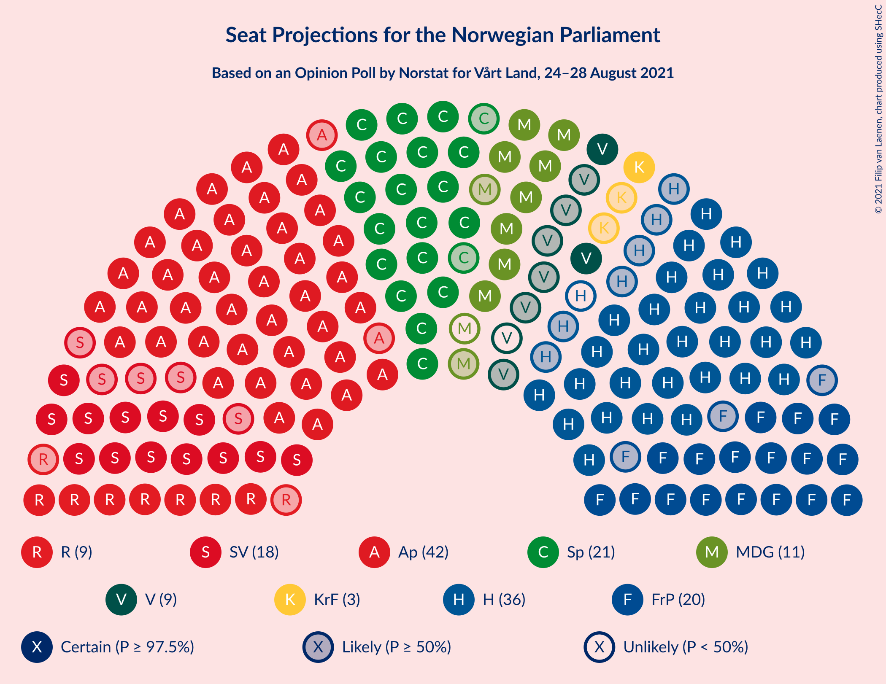
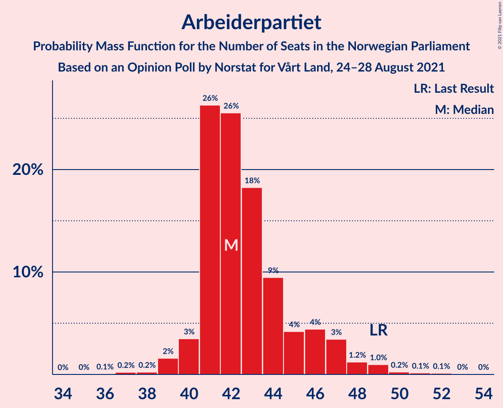
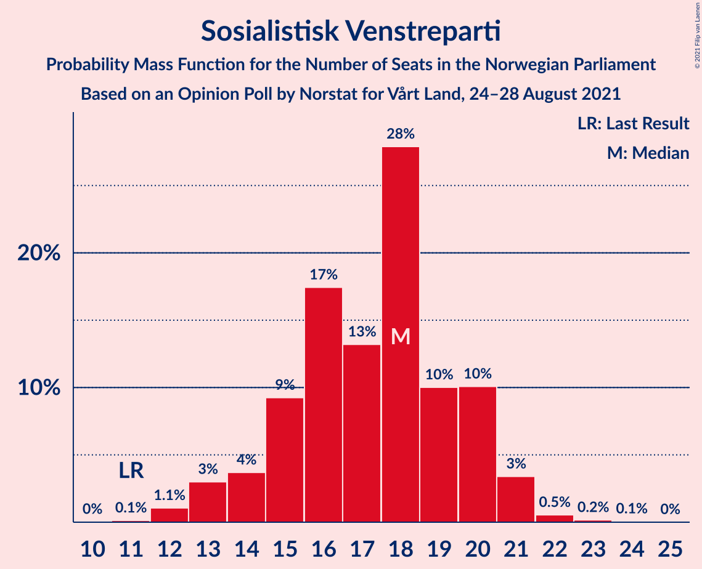
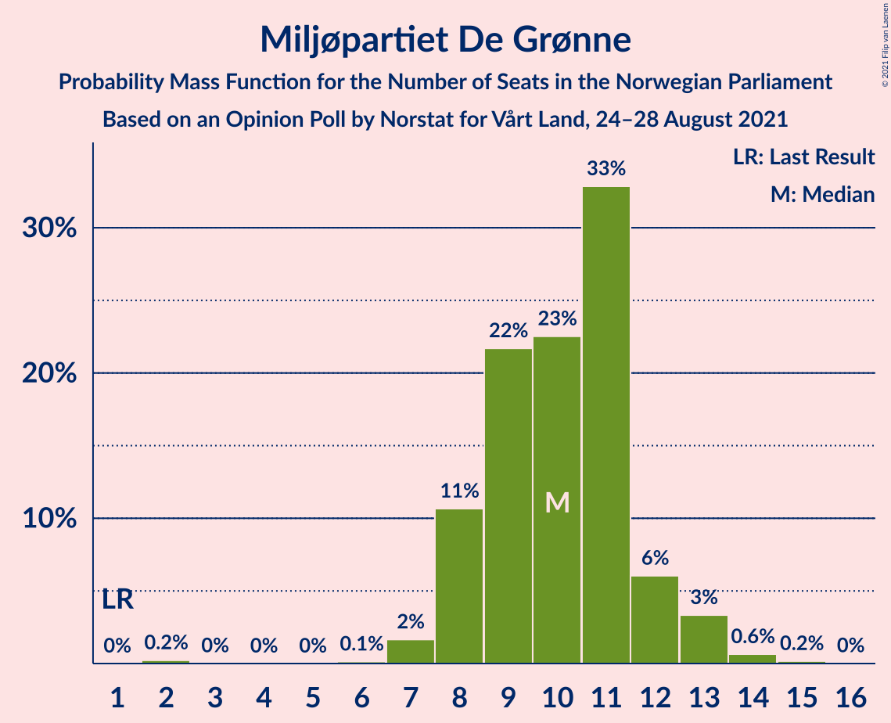
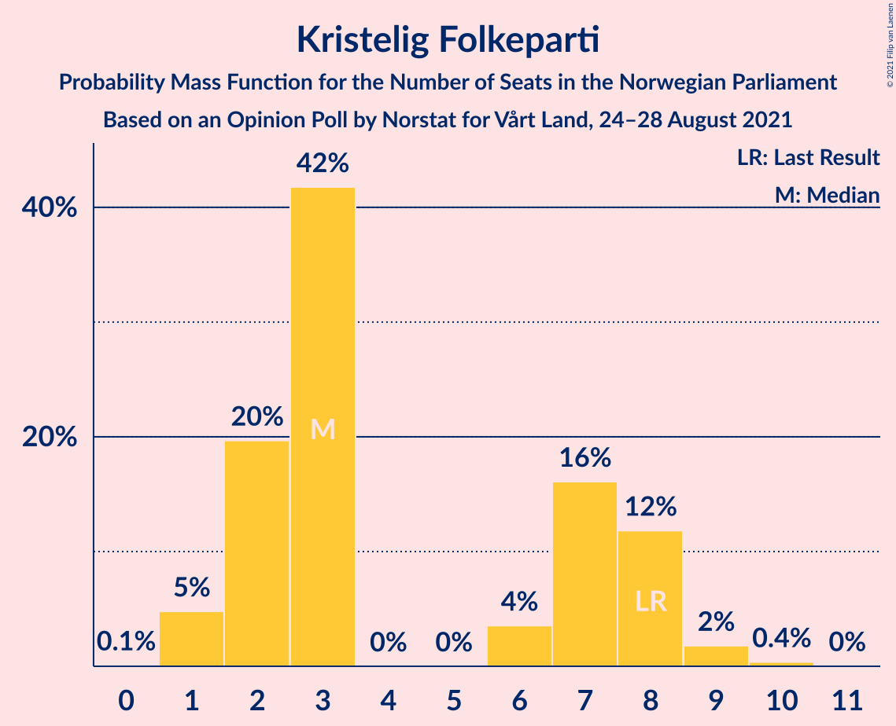
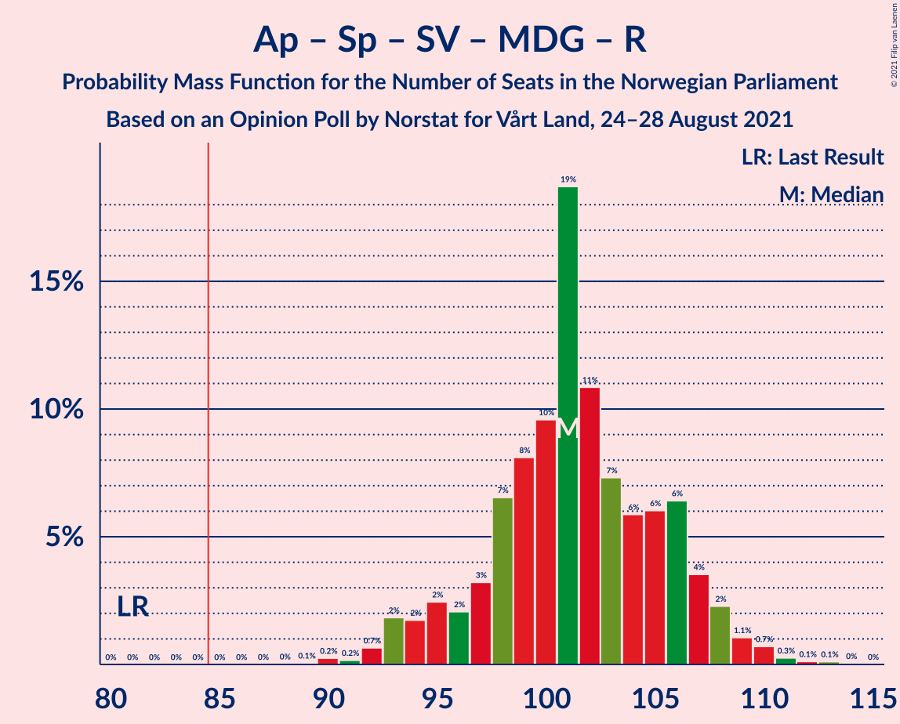
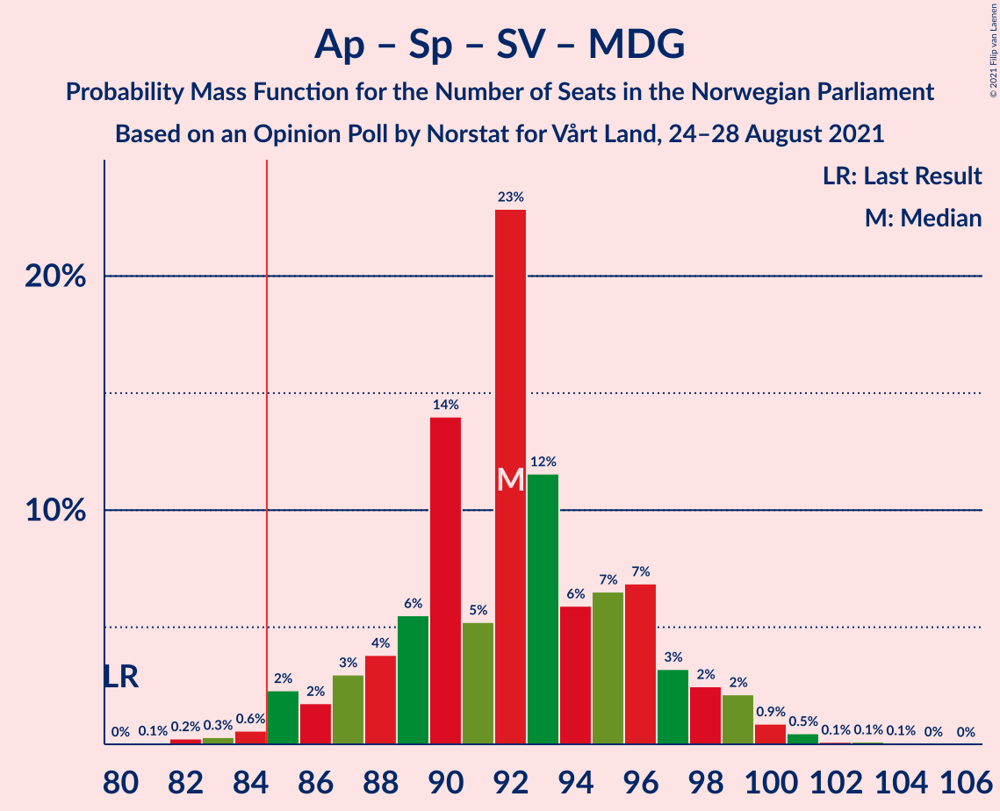
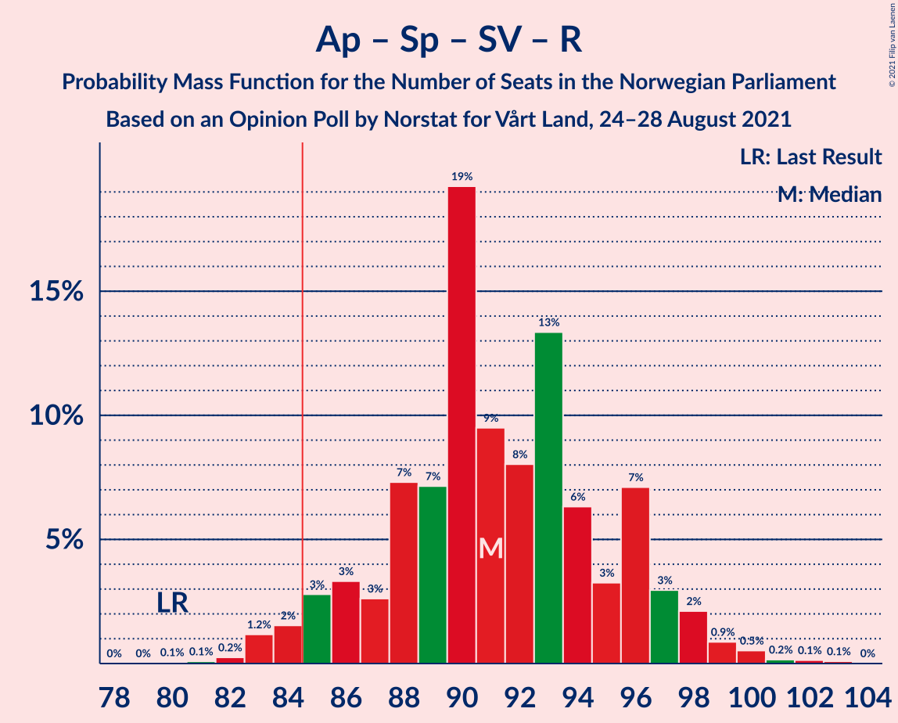
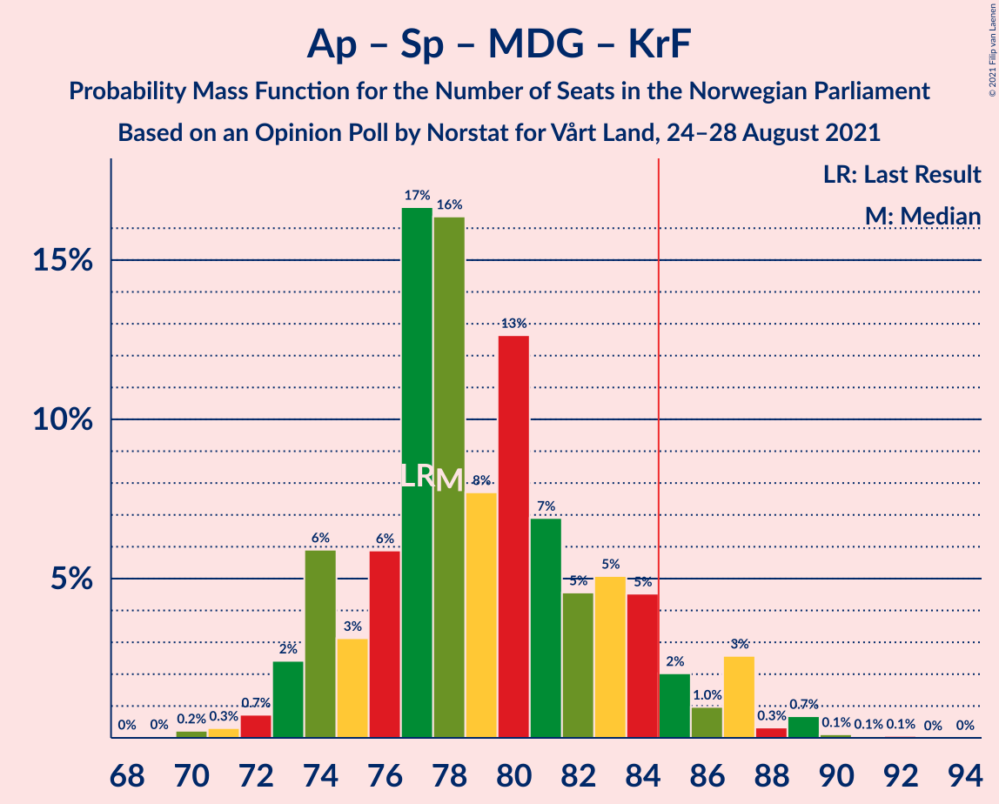
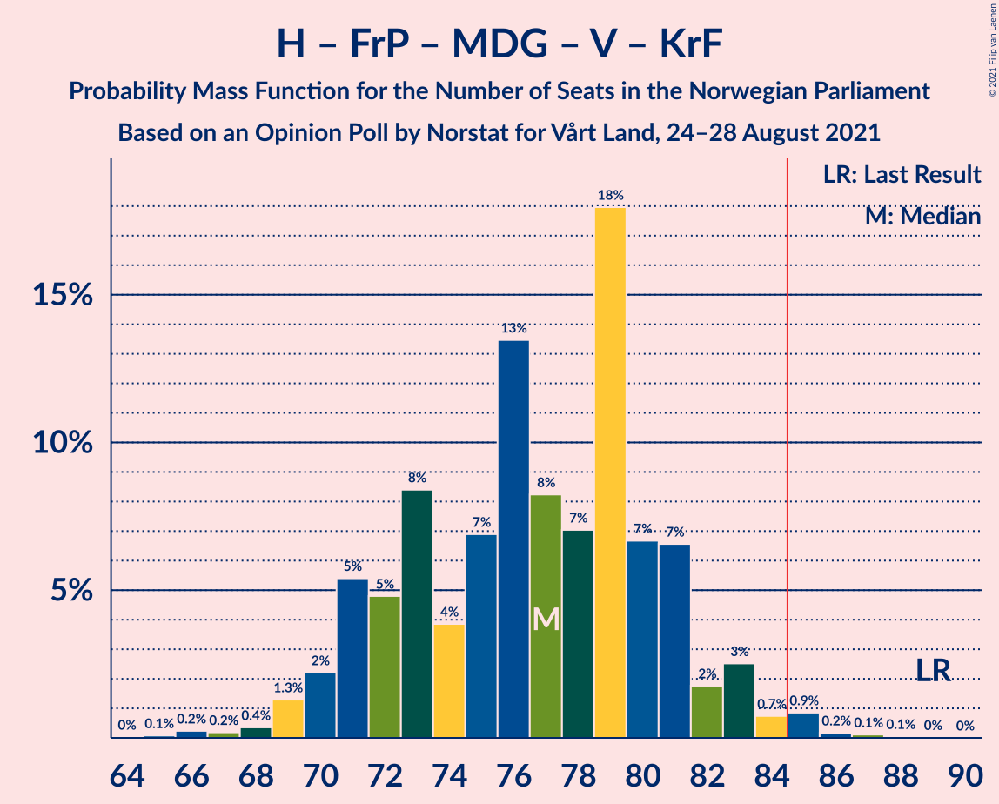

# Opinion Poll by Norstat for Vårt Land, 24–28 August 2021

<a href="#voting-intentions">Voting Intentions</a> | <a href="#seats">Seats</a> | <a href="#coalitions">Coalitions</a> | <a href="#technical-information">Technical Information</a>

## Voting Intentions

### Confidence Intervals

| Party | Last Result | Poll Result | 80% Confidence Interval | 90% Confidence Interval | 95% Confidence Interval | 99% Confidence Interval |
|:-----:|:-----------:|:-----------:|:-----------------------:|:-----------------------:|:-----------------------:|:-----------------------:|
| Arbeiderpartiet | 27.4% | 23.7% | 22.0–25.5% |21.5–26.0% |21.1–26.5% |20.3–27.4% |
| Høyre | 25.0% | 19.0% | 17.5–20.7% |17.0–21.2% |16.7–21.6% |15.9–22.5% |
| Senterpartiet | 10.3% | 12.6% | 11.3–14.1% |10.9–14.5% |10.6–14.8% |10.0–15.6% |
| Fremskrittspartiet | 15.2% | 11.5% | 10.3–13.0% |10.0–13.4% |9.7–13.7% |9.1–14.4% |
| Sosialistisk Venstreparti | 6.0% | 10.0% | 8.8–11.3% |8.5–11.7% |8.2–12.0% |7.7–12.7% |
| Miljøpartiet De Grønne | 3.2% | 5.8% | 5.0–6.9% |4.7–7.2% |4.5–7.5% |4.1–8.0% |
| Rødt | 2.4% | 5.4% | 4.6–6.5% |4.3–6.8% |4.1–7.0% |3.8–7.6% |
| Venstre | 4.4% | 4.9% | 4.1–5.9% |3.9–6.2% |3.7–6.4% |3.3–7.0% |
| Kristelig Folkeparti | 4.2% | 3.7% | 3.1–4.6% |2.9–4.9% |2.7–5.2% |2.4–5.6% |

*Note:* The poll result column reflects the actual value used in the calculations. Published results may vary slightly, and in addition be rounded to fewer digits.

## Seats

### Confidence Intervals

| Party | Last Result | Median | 80% Confidence Interval | 90% Confidence Interval | 95% Confidence Interval | 99% Confidence Interval |
|:-----:|:-----------:|:------:|:-----------------------:|:-----------------------:|:-----------------------:|:-----------------------:|
| <a href="#arbeiderpartiet">Arbeiderpartiet</a> | 49 | 42 | 41–46 |40–47 |40–48 |38–50 |
| <a href="#høyre">Høyre</a> | 45 | 35 | 31–36 |30–37 |29–38 |28–39 |
| <a href="#senterpartiet">Senterpartiet</a> | 19 | 21 | 20–25 |20–27 |19–27 |18–29 |
| <a href="#fremskrittspartiet">Fremskrittspartiet</a> | 27 | 20 | 18–22 |17–24 |17–25 |15–26 |
| <a href="#sosialistisk-venstreparti">Sosialistisk Venstreparti</a> | 11 | 18 | 15–20 |14–20 |13–21 |12–22 |
| <a href="#miljøpartiet-de-grønne">Miljøpartiet De Grønne</a> | 1 | 10 | 8–12 |8–12 |8–13 |7–14 |
| <a href="#rødt">Rødt</a> | 1 | 9 | 7–11 |7–12 |7–12 |2–13 |
| <a href="#venstre">Venstre</a> | 8 | 8 | 7–10 |2–10 |2–11 |2–12 |
| <a href="#kristelig-folkeparti">Kristelig Folkeparti</a> | 8 | 3 | 2–8 |2–8 |1–8 |1–9 |

### Arbeiderpartiet

*For a full overview of the results for this party, see the [Arbeiderpartiet](party-arbeiderpartiet.html) page.*

| Number of Seats | Probability | Accumulated | Special Marks |
|:---------------:|:-----------:|:-----------:|:-------------:|
| 36 | 0.1% | 100% |  |
| 37 | 0.2% | 99.9% |  |
| 38 | 0.2% | 99.7% |  |
| 39 | 2% | 99.4% |  |
| 40 | 3% | 98% |  |
| 41 | 26% | 94% |  |
| 42 | 26% | 68% | Median |
| 43 | 18% | 43% |  |
| 44 | 9% | 24% |  |
| 45 | 4% | 15% |  |
| 46 | 4% | 11% |  |
| 47 | 3% | 6% |  |
| 48 | 1.2% | 3% |  |
| 49 | 1.0% | 2% | Last Result |
| 50 | 0.2% | 0.6% |  |
| 51 | 0.1% | 0.4% |  |
| 52 | 0.1% | 0.2% |  |
| 53 | 0% | 0.1% |  |
| 54 | 0% | 0% |  |

### Høyre

*For a full overview of the results for this party, see the [Høyre](party-høyre.html) page.*

| Number of Seats | Probability | Accumulated | Special Marks |
|:---------------:|:-----------:|:-----------:|:-------------:|
| 26 | 0% | 100% |  |
| 27 | 0.1% | 99.9% |  |
| 28 | 1.3% | 99.8% |  |
| 29 | 3% | 98% |  |
| 30 | 4% | 95% |  |
| 31 | 5% | 91% |  |
| 32 | 9% | 87% |  |
| 33 | 11% | 77% |  |
| 34 | 10% | 66% |  |
| 35 | 15% | 56% | Median |
| 36 | 33% | 41% |  |
| 37 | 4% | 8% |  |
| 38 | 3% | 4% |  |
| 39 | 1.3% | 2% |  |
| 40 | 0.2% | 0.4% |  |
| 41 | 0.1% | 0.2% |  |
| 42 | 0.1% | 0.1% |  |
| 43 | 0% | 0% |  |
| 44 | 0% | 0% |  |
| 45 | 0% | 0% | Last Result |

### Senterpartiet

*For a full overview of the results for this party, see the [Senterpartiet](party-senterpartiet.html) page.*

| Number of Seats | Probability | Accumulated | Special Marks |
|:---------------:|:-----------:|:-----------:|:-------------:|
| 16 | 0.1% | 100% |  |
| 17 | 0.4% | 99.9% |  |
| 18 | 1.4% | 99.5% |  |
| 19 | 3% | 98% | Last Result |
| 20 | 19% | 95% |  |
| 21 | 27% | 76% | Median |
| 22 | 9% | 49% |  |
| 23 | 18% | 40% |  |
| 24 | 9% | 22% |  |
| 25 | 3% | 13% |  |
| 26 | 4% | 10% |  |
| 27 | 4% | 5% |  |
| 28 | 1.0% | 2% |  |
| 29 | 0.5% | 0.9% |  |
| 30 | 0.3% | 0.4% |  |
| 31 | 0.1% | 0.1% |  |
| 32 | 0% | 0% |  |

### Fremskrittspartiet

*For a full overview of the results for this party, see the [Fremskrittspartiet](party-fremskrittspartiet.html) page.*

| Number of Seats | Probability | Accumulated | Special Marks |
|:---------------:|:-----------:|:-----------:|:-------------:|
| 14 | 0.1% | 100% |  |
| 15 | 0.6% | 99.9% |  |
| 16 | 2% | 99.3% |  |
| 17 | 6% | 98% |  |
| 18 | 17% | 92% |  |
| 19 | 15% | 74% |  |
| 20 | 26% | 60% | Median |
| 21 | 17% | 34% |  |
| 22 | 7% | 17% |  |
| 23 | 5% | 10% |  |
| 24 | 2% | 5% |  |
| 25 | 2% | 3% |  |
| 26 | 0.3% | 0.6% |  |
| 27 | 0.2% | 0.3% | Last Result |
| 28 | 0.1% | 0.1% |  |
| 29 | 0% | 0% |  |

### Sosialistisk Venstreparti

*For a full overview of the results for this party, see the [Sosialistisk Venstreparti](party-sosialistiskvenstreparti.html) page.*

| Number of Seats | Probability | Accumulated | Special Marks |
|:---------------:|:-----------:|:-----------:|:-------------:|
| 11 | 0.1% | 100% | Last Result |
| 12 | 1.1% | 99.8% |  |
| 13 | 3% | 98.8% |  |
| 14 | 4% | 96% |  |
| 15 | 9% | 92% |  |
| 16 | 17% | 83% |  |
| 17 | 13% | 65% |  |
| 18 | 28% | 52% | Median |
| 19 | 10% | 24% |  |
| 20 | 10% | 14% |  |
| 21 | 3% | 4% |  |
| 22 | 0.5% | 0.8% |  |
| 23 | 0.2% | 0.3% |  |
| 24 | 0.1% | 0.1% |  |
| 25 | 0% | 0% |  |

### Miljøpartiet De Grønne

*For a full overview of the results for this party, see the [Miljøpartiet De Grønne](party-miljøpartietdegrønne.html) page.*

| Number of Seats | Probability | Accumulated | Special Marks |
|:---------------:|:-----------:|:-----------:|:-------------:|
| 1 | 0% | 100% | Last Result |
| 2 | 0.2% | 100% |  |
| 3 | 0% | 99.8% |  |
| 4 | 0% | 99.8% |  |
| 5 | 0% | 99.8% |  |
| 6 | 0.1% | 99.8% |  |
| 7 | 2% | 99.6% |  |
| 8 | 11% | 98% |  |
| 9 | 22% | 87% |  |
| 10 | 23% | 66% | Median |
| 11 | 33% | 43% |  |
| 12 | 6% | 10% |  |
| 13 | 3% | 4% |  |
| 14 | 0.6% | 0.8% |  |
| 15 | 0.2% | 0.2% |  |
| 16 | 0% | 0% |  |

### Rødt

*For a full overview of the results for this party, see the [Rødt](party-rødt.html) page.*

| Number of Seats | Probability | Accumulated | Special Marks |
|:---------------:|:-----------:|:-----------:|:-------------:|
| 1 | 0% | 100% | Last Result |
| 2 | 1.4% | 100% |  |
| 3 | 0% | 98.6% |  |
| 4 | 0% | 98.6% |  |
| 5 | 0% | 98.6% |  |
| 6 | 0.3% | 98.6% |  |
| 7 | 9% | 98% |  |
| 8 | 13% | 90% |  |
| 9 | 37% | 77% | Median |
| 10 | 26% | 40% |  |
| 11 | 8% | 14% |  |
| 12 | 6% | 6% |  |
| 13 | 0.7% | 0.9% |  |
| 14 | 0.2% | 0.2% |  |
| 15 | 0% | 0% |  |

### Venstre

*For a full overview of the results for this party, see the [Venstre](party-venstre.html) page.*

| Number of Seats | Probability | Accumulated | Special Marks |
|:---------------:|:-----------:|:-----------:|:-------------:|
| 2 | 6% | 100% |  |
| 3 | 0.4% | 94% |  |
| 4 | 0% | 94% |  |
| 5 | 0% | 94% |  |
| 6 | 1.3% | 94% |  |
| 7 | 13% | 92% |  |
| 8 | 32% | 80% | Last Result, Median |
| 9 | 29% | 48% |  |
| 10 | 14% | 19% |  |
| 11 | 4% | 5% |  |
| 12 | 0.8% | 1.0% |  |
| 13 | 0.1% | 0.1% |  |
| 14 | 0% | 0% |  |

### Kristelig Folkeparti

*For a full overview of the results for this party, see the [Kristelig Folkeparti](party-kristeligfolkeparti.html) page.*

| Number of Seats | Probability | Accumulated | Special Marks |
|:---------------:|:-----------:|:-----------:|:-------------:|
| 0 | 0.1% | 100% |  |
| 1 | 5% | 99.9% |  |
| 2 | 20% | 95% |  |
| 3 | 42% | 75% | Median |
| 4 | 0% | 34% |  |
| 5 | 0% | 34% |  |
| 6 | 4% | 34% |  |
| 7 | 16% | 30% |  |
| 8 | 12% | 14% | Last Result |
| 9 | 2% | 2% |  |
| 10 | 0.4% | 0.4% |  |
| 11 | 0% | 0% |  |

## Coalitions

### Confidence Intervals

| Coalition | Last Result | Median | Majority? | 80% Confidence Interval | 90% Confidence Interval | 95% Confidence Interval | 99% Confidence Interval |
|:---------:|:-----------:|:------:|:---------:|:-----------------------:|:-----------------------:|:-----------------------:|:-----------------------:|
| Arbeiderpartiet – Senterpartiet – Sosialistisk Venstreparti – Miljøpartiet De Grønne – Rødt | 81 | 101 | 100% | 97–106 | 95–107 | 93–108 | 91–111 |
| Arbeiderpartiet – Senterpartiet – Sosialistisk Venstreparti – Miljøpartiet De Grønne – Kristelig Folkeparti | 88 | 96 | 99.9% | 92–101 | 91–102 | 90–103 | 88–106 |
| Arbeiderpartiet – Senterpartiet – Sosialistisk Venstreparti – Miljøpartiet De Grønne | 80 | 92 | 98.8% | 88–96 | 86–98 | 85–99 | 83–101 |
| Arbeiderpartiet – Senterpartiet – Sosialistisk Venstreparti – Rødt | 80 | 91 | 97% | 87–96 | 85–97 | 84–98 | 83–100 |
| Høyre – Senterpartiet – Fremskrittspartiet – Venstre – Kristelig Folkeparti | 107 | 89 | 91% | 85–92 | 84–94 | 82–95 | 80–97 |
| Arbeiderpartiet – Senterpartiet – Sosialistisk Venstreparti | 79 | 82 | 21% | 78–86 | 77–87 | 76–89 | 74–91 |
| Arbeiderpartiet – Senterpartiet – Miljøpartiet De Grønne – Kristelig Folkeparti | 77 | 78 | 7% | 75–84 | 74–85 | 73–87 | 71–89 |
| Arbeiderpartiet – Sosialistisk Venstreparti – Miljøpartiet De Grønne – Rødt | 62 | 80 | 5% | 74–84 | 73–84 | 73–85 | 69–88 |
| Høyre – Fremskrittspartiet – Miljøpartiet De Grønne – Venstre – Kristelig Folkeparti | 89 | 77 | 1.2% | 72–81 | 71–82 | 70–83 | 67–85 |
| Arbeiderpartiet – Senterpartiet – Kristelig Folkeparti | 76 | 68 | 0% | 65–74 | 64–76 | 63–77 | 62–79 |
| Høyre – Fremskrittspartiet – Venstre – Kristelig Folkeparti | 88 | 67 | 0% | 62–71 | 61–72 | 60–74 | 57–76 |
| Arbeiderpartiet – Senterpartiet | 68 | 64 | 0% | 61–69 | 61–70 | 60–72 | 59–74 |
| Høyre – Fremskrittspartiet – Venstre | 80 | 62 | 0% | 58–66 | 57–68 | 55–68 | 53–70 |
| Arbeiderpartiet – Sosialistisk Venstreparti | 60 | 60 | 0% | 57–63 | 56–64 | 55–65 | 54–67 |
| Høyre – Fremskrittspartiet | 72 | 54 | 0% | 51–58 | 49–59 | 48–60 | 46–61 |
| Høyre – Venstre – Kristelig Folkeparti | 61 | 47 | 0% | 42–51 | 41–52 | 39–53 | 36–54 |
| Senterpartiet – Venstre – Kristelig Folkeparti | 35 | 34 | 0% | 31–39 | 30–40 | 28–41 | 25–44 |

### Arbeiderpartiet – Senterpartiet – Sosialistisk Venstreparti – Miljøpartiet De Grønne – Rødt

| Number of Seats | Probability | Accumulated | Special Marks |
|:---------------:|:-----------:|:-----------:|:-------------:|
| 81 | 0% | 100% | Last Result |
| 82 | 0% | 100% |  |
| 83 | 0% | 100% |  |
| 84 | 0% | 100% |  |
| 85 | 0% | 100% | Majority |
| 86 | 0% | 100% |  |
| 87 | 0% | 100% |  |
| 88 | 0% | 100% |  |
| 89 | 0.1% | 100% |  |
| 90 | 0.2% | 99.9% |  |
| 91 | 0.2% | 99.7% |  |
| 92 | 0.7% | 99.5% |  |
| 93 | 2% | 98.8% |  |
| 94 | 2% | 97% |  |
| 95 | 2% | 95% |  |
| 96 | 2% | 93% |  |
| 97 | 3% | 91% |  |
| 98 | 7% | 88% |  |
| 99 | 8% | 81% |  |
| 100 | 10% | 73% | Median |
| 101 | 19% | 63% |  |
| 102 | 11% | 45% |  |
| 103 | 7% | 34% |  |
| 104 | 6% | 26% |  |
| 105 | 6% | 21% |  |
| 106 | 6% | 15% |  |
| 107 | 4% | 8% |  |
| 108 | 2% | 5% |  |
| 109 | 1.1% | 2% |  |
| 110 | 0.7% | 1.2% |  |
| 111 | 0.3% | 0.5% |  |
| 112 | 0.1% | 0.3% |  |
| 113 | 0.1% | 0.2% |  |
| 114 | 0% | 0.1% |  |
| 115 | 0% | 0% |  |

### Arbeiderpartiet – Senterpartiet – Sosialistisk Venstreparti – Miljøpartiet De Grønne – Kristelig Folkeparti

| Number of Seats | Probability | Accumulated | Special Marks |
|:---------------:|:-----------:|:-----------:|:-------------:|
| 84 | 0.1% | 100% |  |
| 85 | 0.1% | 99.9% | Majority |
| 86 | 0.1% | 99.8% |  |
| 87 | 0.2% | 99.8% |  |
| 88 | 0.5% | 99.6% | Last Result |
| 89 | 0.7% | 99.1% |  |
| 90 | 1.4% | 98% |  |
| 91 | 3% | 97% |  |
| 92 | 6% | 94% |  |
| 93 | 9% | 88% |  |
| 94 | 5% | 79% | Median |
| 95 | 18% | 74% |  |
| 96 | 11% | 56% |  |
| 97 | 6% | 45% |  |
| 98 | 15% | 38% |  |
| 99 | 8% | 23% |  |
| 100 | 6% | 16% |  |
| 101 | 3% | 10% |  |
| 102 | 3% | 7% |  |
| 103 | 1.3% | 4% |  |
| 104 | 0.6% | 2% |  |
| 105 | 1.1% | 2% |  |
| 106 | 0.3% | 0.6% |  |
| 107 | 0.2% | 0.3% |  |
| 108 | 0.1% | 0.2% |  |
| 109 | 0% | 0.1% |  |
| 110 | 0% | 0% |  |

### Arbeiderpartiet – Senterpartiet – Sosialistisk Venstreparti – Miljøpartiet De Grønne

| Number of Seats | Probability | Accumulated | Special Marks |
|:---------------:|:-----------:|:-----------:|:-------------:|
| 80 | 0% | 100% | Last Result |
| 81 | 0.1% | 100% |  |
| 82 | 0.2% | 99.9% |  |
| 83 | 0.3% | 99.7% |  |
| 84 | 0.6% | 99.4% |  |
| 85 | 2% | 98.8% | Majority |
| 86 | 2% | 96% |  |
| 87 | 3% | 95% |  |
| 88 | 4% | 92% |  |
| 89 | 6% | 88% |  |
| 90 | 14% | 82% |  |
| 91 | 5% | 68% | Median |
| 92 | 23% | 63% |  |
| 93 | 12% | 40% |  |
| 94 | 6% | 29% |  |
| 95 | 7% | 23% |  |
| 96 | 7% | 16% |  |
| 97 | 3% | 9% |  |
| 98 | 2% | 6% |  |
| 99 | 2% | 4% |  |
| 100 | 0.9% | 2% |  |
| 101 | 0.5% | 0.8% |  |
| 102 | 0.1% | 0.3% |  |
| 103 | 0.1% | 0.2% |  |
| 104 | 0.1% | 0.1% |  |
| 105 | 0% | 0% |  |

### Arbeiderpartiet – Senterpartiet – Sosialistisk Venstreparti – Rødt

| Number of Seats | Probability | Accumulated | Special Marks |
|:---------------:|:-----------:|:-----------:|:-------------:|
| 80 | 0.1% | 100% | Last Result |
| 81 | 0.1% | 99.9% |  |
| 82 | 0.2% | 99.8% |  |
| 83 | 1.2% | 99.6% |  |
| 84 | 2% | 98% |  |
| 85 | 3% | 97% | Majority |
| 86 | 3% | 94% |  |
| 87 | 3% | 91% |  |
| 88 | 7% | 88% |  |
| 89 | 7% | 81% |  |
| 90 | 19% | 74% | Median |
| 91 | 9% | 54% |  |
| 92 | 8% | 45% |  |
| 93 | 13% | 37% |  |
| 94 | 6% | 24% |  |
| 95 | 3% | 17% |  |
| 96 | 7% | 14% |  |
| 97 | 3% | 7% |  |
| 98 | 2% | 4% |  |
| 99 | 0.9% | 2% |  |
| 100 | 0.5% | 0.9% |  |
| 101 | 0.2% | 0.4% |  |
| 102 | 0.1% | 0.3% |  |
| 103 | 0.1% | 0.1% |  |
| 104 | 0% | 0% |  |

### Høyre – Senterpartiet – Fremskrittspartiet – Venstre – Kristelig Folkeparti

| Number of Seats | Probability | Accumulated | Special Marks |
|:---------------:|:-----------:|:-----------:|:-------------:|
| 76 | 0.1% | 100% |  |
| 77 | 0% | 99.9% |  |
| 78 | 0.1% | 99.9% |  |
| 79 | 0.2% | 99.8% |  |
| 80 | 0.4% | 99.6% |  |
| 81 | 0.9% | 99.1% |  |
| 82 | 0.8% | 98% |  |
| 83 | 2% | 97% |  |
| 84 | 4% | 95% |  |
| 85 | 8% | 91% | Majority |
| 86 | 8% | 83% |  |
| 87 | 6% | 75% | Median |
| 88 | 11% | 69% |  |
| 89 | 20% | 57% |  |
| 90 | 13% | 37% |  |
| 91 | 7% | 25% |  |
| 92 | 8% | 18% |  |
| 93 | 3% | 10% |  |
| 94 | 3% | 6% |  |
| 95 | 1.4% | 3% |  |
| 96 | 1.2% | 2% |  |
| 97 | 0.6% | 0.9% |  |
| 98 | 0.1% | 0.3% |  |
| 99 | 0.1% | 0.1% |  |
| 100 | 0% | 0.1% |  |
| 101 | 0% | 0% |  |
| 102 | 0% | 0% |  |
| 103 | 0% | 0% |  |
| 104 | 0% | 0% |  |
| 105 | 0% | 0% |  |
| 106 | 0% | 0% |  |
| 107 | 0% | 0% | Last Result |

### Arbeiderpartiet – Senterpartiet – Sosialistisk Venstreparti

| Number of Seats | Probability | Accumulated | Special Marks |
|:---------------:|:-----------:|:-----------:|:-------------:|
| 72 | 0% | 100% |  |
| 73 | 0.1% | 99.9% |  |
| 74 | 0.3% | 99.8% |  |
| 75 | 0.8% | 99.5% |  |
| 76 | 2% | 98.7% |  |
| 77 | 4% | 97% |  |
| 78 | 4% | 93% |  |
| 79 | 8% | 89% | Last Result |
| 80 | 8% | 80% |  |
| 81 | 20% | 72% | Median |
| 82 | 13% | 52% |  |
| 83 | 10% | 39% |  |
| 84 | 8% | 29% |  |
| 85 | 5% | 21% | Majority |
| 86 | 7% | 16% |  |
| 87 | 4% | 9% |  |
| 88 | 2% | 5% |  |
| 89 | 2% | 3% |  |
| 90 | 0.8% | 1.4% |  |
| 91 | 0.3% | 0.5% |  |
| 92 | 0.1% | 0.3% |  |
| 93 | 0.1% | 0.1% |  |
| 94 | 0% | 0% |  |

### Arbeiderpartiet – Senterpartiet – Miljøpartiet De Grønne – Kristelig Folkeparti

| Number of Seats | Probability | Accumulated | Special Marks |
|:---------------:|:-----------:|:-----------:|:-------------:|
| 68 | 0% | 100% |  |
| 69 | 0% | 99.9% |  |
| 70 | 0.2% | 99.9% |  |
| 71 | 0.3% | 99.7% |  |
| 72 | 0.7% | 99.4% |  |
| 73 | 2% | 98.6% |  |
| 74 | 6% | 96% |  |
| 75 | 3% | 90% |  |
| 76 | 6% | 87% | Median |
| 77 | 17% | 81% | Last Result |
| 78 | 16% | 65% |  |
| 79 | 8% | 48% |  |
| 80 | 13% | 41% |  |
| 81 | 7% | 28% |  |
| 82 | 5% | 21% |  |
| 83 | 5% | 16% |  |
| 84 | 5% | 11% |  |
| 85 | 2% | 7% | Majority |
| 86 | 1.0% | 5% |  |
| 87 | 3% | 4% |  |
| 88 | 0.3% | 1.3% |  |
| 89 | 0.7% | 0.9% |  |
| 90 | 0.1% | 0.3% |  |
| 91 | 0.1% | 0.2% |  |
| 92 | 0.1% | 0.1% |  |
| 93 | 0% | 0% |  |

### Arbeiderpartiet – Sosialistisk Venstreparti – Miljøpartiet De Grønne – Rødt

| Number of Seats | Probability | Accumulated | Special Marks |
|:---------------:|:-----------:|:-----------:|:-------------:|
| 62 | 0% | 100% | Last Result |
| 63 | 0% | 100% |  |
| 64 | 0% | 100% |  |
| 65 | 0% | 100% |  |
| 66 | 0% | 100% |  |
| 67 | 0% | 100% |  |
| 68 | 0.1% | 100% |  |
| 69 | 0.5% | 99.9% |  |
| 70 | 0.3% | 99.4% |  |
| 71 | 0.3% | 99.2% |  |
| 72 | 1.3% | 98.8% |  |
| 73 | 5% | 98% |  |
| 74 | 3% | 93% |  |
| 75 | 3% | 90% |  |
| 76 | 6% | 86% |  |
| 77 | 9% | 80% |  |
| 78 | 8% | 71% |  |
| 79 | 13% | 64% | Median |
| 80 | 17% | 51% |  |
| 81 | 11% | 34% |  |
| 82 | 5% | 23% |  |
| 83 | 7% | 18% |  |
| 84 | 6% | 11% |  |
| 85 | 2% | 5% | Majority |
| 86 | 1.1% | 2% |  |
| 87 | 0.4% | 1.2% |  |
| 88 | 0.6% | 0.9% |  |
| 89 | 0.1% | 0.2% |  |
| 90 | 0.1% | 0.1% |  |
| 91 | 0.1% | 0.1% |  |
| 92 | 0% | 0% |  |

### Høyre – Fremskrittspartiet – Miljøpartiet De Grønne – Venstre – Kristelig Folkeparti

| Number of Seats | Probability | Accumulated | Special Marks |
|:---------------:|:-----------:|:-----------:|:-------------:|
| 64 | 0% | 100% |  |
| 65 | 0.1% | 99.9% |  |
| 66 | 0.2% | 99.9% |  |
| 67 | 0.2% | 99.6% |  |
| 68 | 0.4% | 99.4% |  |
| 69 | 1.3% | 99.1% |  |
| 70 | 2% | 98% |  |
| 71 | 5% | 96% |  |
| 72 | 5% | 90% |  |
| 73 | 8% | 85% |  |
| 74 | 4% | 77% |  |
| 75 | 7% | 73% |  |
| 76 | 13% | 66% | Median |
| 77 | 8% | 53% |  |
| 78 | 7% | 45% |  |
| 79 | 18% | 37% |  |
| 80 | 7% | 19% |  |
| 81 | 7% | 13% |  |
| 82 | 2% | 6% |  |
| 83 | 3% | 4% |  |
| 84 | 0.7% | 2% |  |
| 85 | 0.9% | 1.2% | Majority |
| 86 | 0.2% | 0.4% |  |
| 87 | 0.1% | 0.2% |  |
| 88 | 0.1% | 0.1% |  |
| 89 | 0% | 0% | Last Result |

### Arbeiderpartiet – Senterpartiet – Kristelig Folkeparti

| Number of Seats | Probability | Accumulated | Special Marks |
|:---------------:|:-----------:|:-----------:|:-------------:|
| 60 | 0.1% | 100% |  |
| 61 | 0.3% | 99.9% |  |
| 62 | 0.5% | 99.6% |  |
| 63 | 2% | 99.1% |  |
| 64 | 5% | 97% |  |
| 65 | 5% | 92% |  |
| 66 | 16% | 87% | Median |
| 67 | 12% | 71% |  |
| 68 | 10% | 59% |  |
| 69 | 9% | 49% |  |
| 70 | 11% | 40% |  |
| 71 | 6% | 28% |  |
| 72 | 5% | 22% |  |
| 73 | 4% | 17% |  |
| 74 | 4% | 13% |  |
| 75 | 3% | 9% |  |
| 76 | 2% | 5% | Last Result |
| 77 | 2% | 3% |  |
| 78 | 0.6% | 2% |  |
| 79 | 0.6% | 1.0% |  |
| 80 | 0.2% | 0.4% |  |
| 81 | 0.1% | 0.2% |  |
| 82 | 0.1% | 0.1% |  |
| 83 | 0% | 0% |  |

### Høyre – Fremskrittspartiet – Venstre – Kristelig Folkeparti

| Number of Seats | Probability | Accumulated | Special Marks |
|:---------------:|:-----------:|:-----------:|:-------------:|
| 55 | 0.1% | 100% |  |
| 56 | 0.2% | 99.9% |  |
| 57 | 0.3% | 99.7% |  |
| 58 | 0.4% | 99.4% |  |
| 59 | 1.0% | 99.0% |  |
| 60 | 2% | 98% |  |
| 61 | 4% | 95% |  |
| 62 | 5% | 92% |  |
| 63 | 9% | 87% |  |
| 64 | 7% | 78% |  |
| 65 | 7% | 71% |  |
| 66 | 8% | 64% | Median |
| 67 | 10% | 56% |  |
| 68 | 18% | 46% |  |
| 69 | 9% | 27% |  |
| 70 | 6% | 18% |  |
| 71 | 6% | 12% |  |
| 72 | 2% | 6% |  |
| 73 | 0.9% | 4% |  |
| 74 | 2% | 3% |  |
| 75 | 0.6% | 1.2% |  |
| 76 | 0.4% | 0.6% |  |
| 77 | 0.1% | 0.2% |  |
| 78 | 0% | 0.1% |  |
| 79 | 0% | 0.1% |  |
| 80 | 0% | 0% |  |
| 81 | 0% | 0% |  |
| 82 | 0% | 0% |  |
| 83 | 0% | 0% |  |
| 84 | 0% | 0% |  |
| 85 | 0% | 0% | Majority |
| 86 | 0% | 0% |  |
| 87 | 0% | 0% |  |
| 88 | 0% | 0% | Last Result |

### Arbeiderpartiet – Senterpartiet

| Number of Seats | Probability | Accumulated | Special Marks |
|:---------------:|:-----------:|:-----------:|:-------------:|
| 57 | 0.1% | 100% |  |
| 58 | 0.3% | 99.8% |  |
| 59 | 0.7% | 99.5% |  |
| 60 | 2% | 98.8% |  |
| 61 | 9% | 97% |  |
| 62 | 9% | 88% |  |
| 63 | 21% | 79% | Median |
| 64 | 14% | 58% |  |
| 65 | 7% | 44% |  |
| 66 | 11% | 37% |  |
| 67 | 9% | 26% |  |
| 68 | 5% | 17% | Last Result |
| 69 | 4% | 12% |  |
| 70 | 3% | 8% |  |
| 71 | 2% | 5% |  |
| 72 | 0.8% | 3% |  |
| 73 | 0.5% | 2% |  |
| 74 | 1.2% | 1.4% |  |
| 75 | 0.1% | 0.2% |  |
| 76 | 0.1% | 0.1% |  |
| 77 | 0% | 0% |  |

### Høyre – Fremskrittspartiet – Venstre

| Number of Seats | Probability | Accumulated | Special Marks |
|:---------------:|:-----------:|:-----------:|:-------------:|
| 51 | 0.1% | 100% |  |
| 52 | 0.1% | 99.9% |  |
| 53 | 0.4% | 99.8% |  |
| 54 | 0.7% | 99.3% |  |
| 55 | 1.5% | 98.7% |  |
| 56 | 1.2% | 97% |  |
| 57 | 3% | 96% |  |
| 58 | 4% | 93% |  |
| 59 | 7% | 89% |  |
| 60 | 8% | 82% |  |
| 61 | 15% | 74% |  |
| 62 | 11% | 59% |  |
| 63 | 8% | 48% | Median |
| 64 | 10% | 40% |  |
| 65 | 17% | 31% |  |
| 66 | 4% | 13% |  |
| 67 | 4% | 9% |  |
| 68 | 3% | 5% |  |
| 69 | 1.3% | 2% |  |
| 70 | 0.5% | 0.9% |  |
| 71 | 0.1% | 0.3% |  |
| 72 | 0.1% | 0.2% |  |
| 73 | 0% | 0.1% |  |
| 74 | 0% | 0% |  |
| 75 | 0% | 0% |  |
| 76 | 0% | 0% |  |
| 77 | 0% | 0% |  |
| 78 | 0% | 0% |  |
| 79 | 0% | 0% |  |
| 80 | 0% | 0% | Last Result |

### Arbeiderpartiet – Sosialistisk Venstreparti

| Number of Seats | Probability | Accumulated | Special Marks |
|:---------------:|:-----------:|:-----------:|:-------------:|
| 51 | 0% | 100% |  |
| 52 | 0.1% | 99.9% |  |
| 53 | 0.2% | 99.8% |  |
| 54 | 0.7% | 99.6% |  |
| 55 | 2% | 98.9% |  |
| 56 | 6% | 96% |  |
| 57 | 8% | 91% |  |
| 58 | 9% | 83% |  |
| 59 | 14% | 73% |  |
| 60 | 22% | 59% | Last Result, Median |
| 61 | 14% | 37% |  |
| 62 | 7% | 23% |  |
| 63 | 8% | 17% |  |
| 64 | 4% | 8% |  |
| 65 | 2% | 4% |  |
| 66 | 1.5% | 2% |  |
| 67 | 0.4% | 0.8% |  |
| 68 | 0.2% | 0.4% |  |
| 69 | 0.1% | 0.2% |  |
| 70 | 0.1% | 0.1% |  |
| 71 | 0% | 0% |  |

### Høyre – Fremskrittspartiet

| Number of Seats | Probability | Accumulated | Special Marks |
|:---------------:|:-----------:|:-----------:|:-------------:|
| 44 | 0.1% | 100% |  |
| 45 | 0.2% | 99.9% |  |
| 46 | 0.4% | 99.8% |  |
| 47 | 1.3% | 99.3% |  |
| 48 | 1.3% | 98% |  |
| 49 | 2% | 97% |  |
| 50 | 4% | 95% |  |
| 51 | 8% | 91% |  |
| 52 | 7% | 83% |  |
| 53 | 15% | 76% |  |
| 54 | 14% | 61% |  |
| 55 | 11% | 46% | Median |
| 56 | 20% | 36% |  |
| 57 | 5% | 16% |  |
| 58 | 4% | 10% |  |
| 59 | 3% | 7% |  |
| 60 | 2% | 4% |  |
| 61 | 0.8% | 1.2% |  |
| 62 | 0.2% | 0.4% |  |
| 63 | 0.1% | 0.2% |  |
| 64 | 0.1% | 0.1% |  |
| 65 | 0% | 0% |  |
| 66 | 0% | 0% |  |
| 67 | 0% | 0% |  |
| 68 | 0% | 0% |  |
| 69 | 0% | 0% |  |
| 70 | 0% | 0% |  |
| 71 | 0% | 0% |  |
| 72 | 0% | 0% | Last Result |

### Høyre – Venstre – Kristelig Folkeparti

| Number of Seats | Probability | Accumulated | Special Marks |
|:---------------:|:-----------:|:-----------:|:-------------:|
| 34 | 0.1% | 100% |  |
| 35 | 0.1% | 99.9% |  |
| 36 | 0.3% | 99.8% |  |
| 37 | 0.2% | 99.5% |  |
| 38 | 1.2% | 99.3% |  |
| 39 | 1.2% | 98% |  |
| 40 | 1.0% | 97% |  |
| 41 | 3% | 96% |  |
| 42 | 7% | 93% |  |
| 43 | 3% | 85% |  |
| 44 | 5% | 82% |  |
| 45 | 8% | 78% |  |
| 46 | 15% | 70% | Median |
| 47 | 10% | 55% |  |
| 48 | 19% | 45% |  |
| 49 | 5% | 26% |  |
| 50 | 9% | 20% |  |
| 51 | 5% | 11% |  |
| 52 | 3% | 6% |  |
| 53 | 2% | 3% |  |
| 54 | 0.5% | 1.0% |  |
| 55 | 0.3% | 0.5% |  |
| 56 | 0.1% | 0.2% |  |
| 57 | 0% | 0.1% |  |
| 58 | 0% | 0% |  |
| 59 | 0% | 0% |  |
| 60 | 0% | 0% |  |
| 61 | 0% | 0% | Last Result |

### Senterpartiet – Venstre – Kristelig Folkeparti

| Number of Seats | Probability | Accumulated | Special Marks |
|:---------------:|:-----------:|:-----------:|:-------------:|
| 23 | 0% | 100% |  |
| 24 | 0.4% | 99.9% |  |
| 25 | 0.5% | 99.6% |  |
| 26 | 0.5% | 99.0% |  |
| 27 | 0.7% | 98.6% |  |
| 28 | 1.2% | 98% |  |
| 29 | 1.5% | 97% |  |
| 30 | 3% | 95% |  |
| 31 | 4% | 92% |  |
| 32 | 10% | 88% | Median |
| 33 | 27% | 78% |  |
| 34 | 5% | 51% |  |
| 35 | 9% | 46% | Last Result |
| 36 | 11% | 37% |  |
| 37 | 10% | 26% |  |
| 38 | 6% | 17% |  |
| 39 | 3% | 11% |  |
| 40 | 3% | 8% |  |
| 41 | 3% | 5% |  |
| 42 | 0.8% | 2% |  |
| 43 | 0.5% | 1.2% |  |
| 44 | 0.5% | 0.7% |  |
| 45 | 0.1% | 0.2% |  |
| 46 | 0% | 0.1% |  |
| 47 | 0% | 0% |  |

## Technical Information

### Opinion Poll

+ **Polling firm:** Norstat
+ **Commissioner(s):** Vårt Land
+ **Fieldwork period:** 24–28 August 2021

### Calculations

+ **Sample size:** 962
+ **Simulations done:** 1,048,576
+ **Error estimate:** 1.46%

