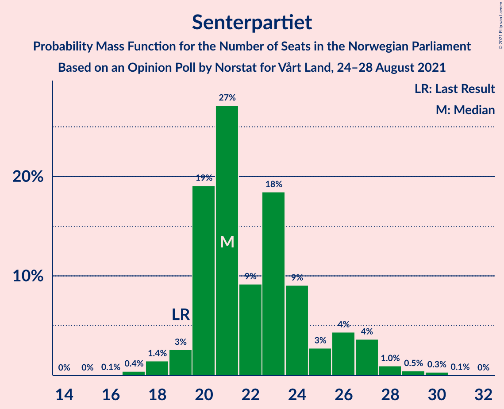
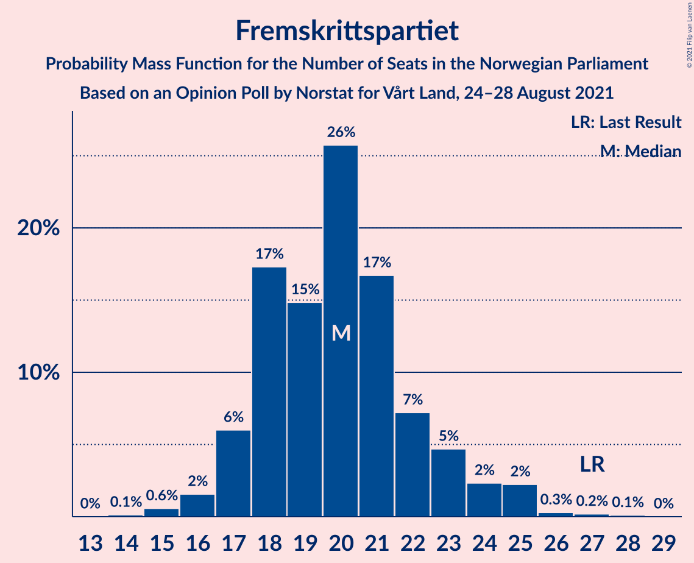
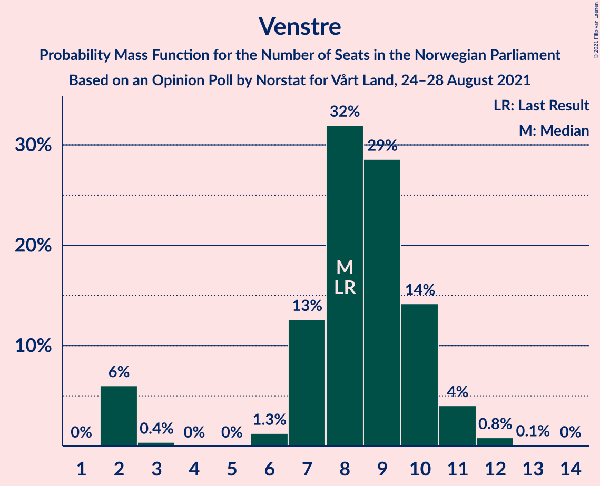
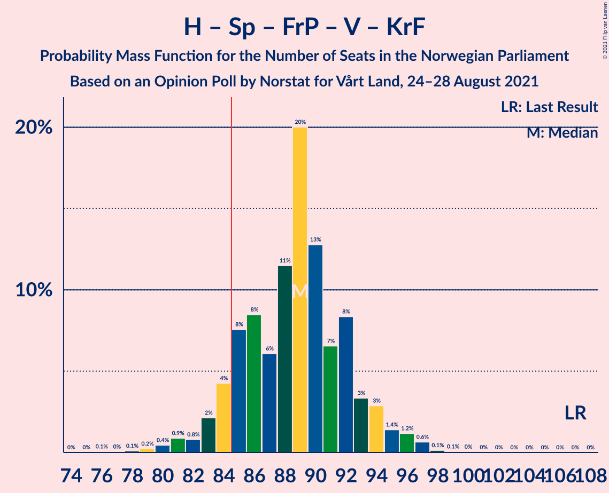
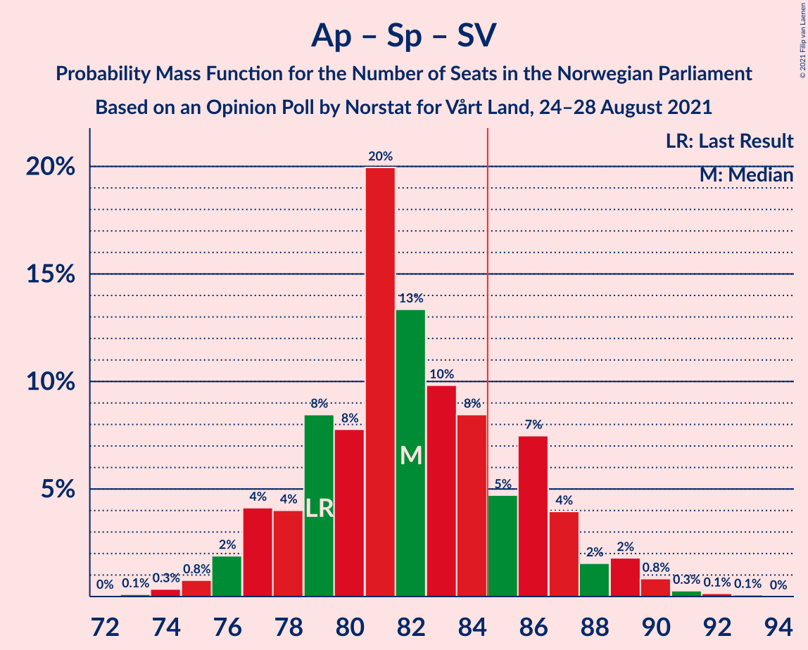
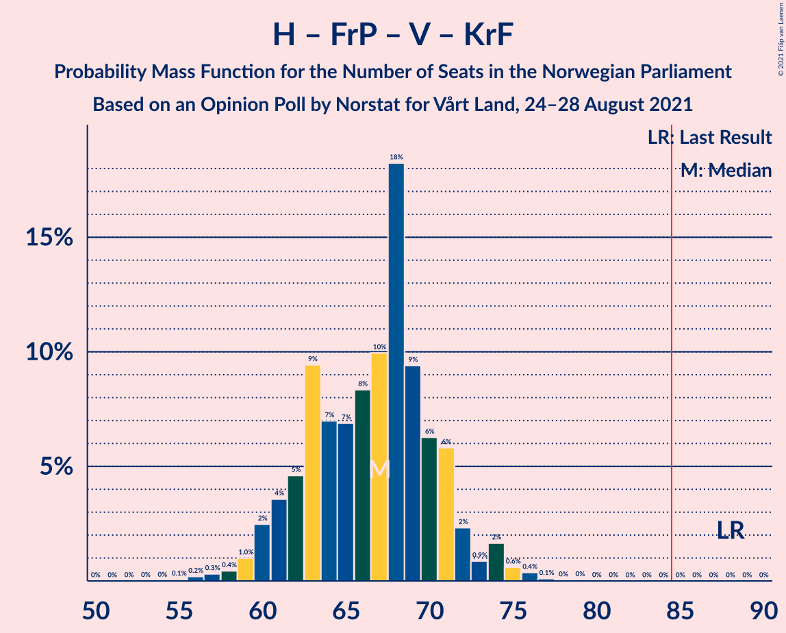
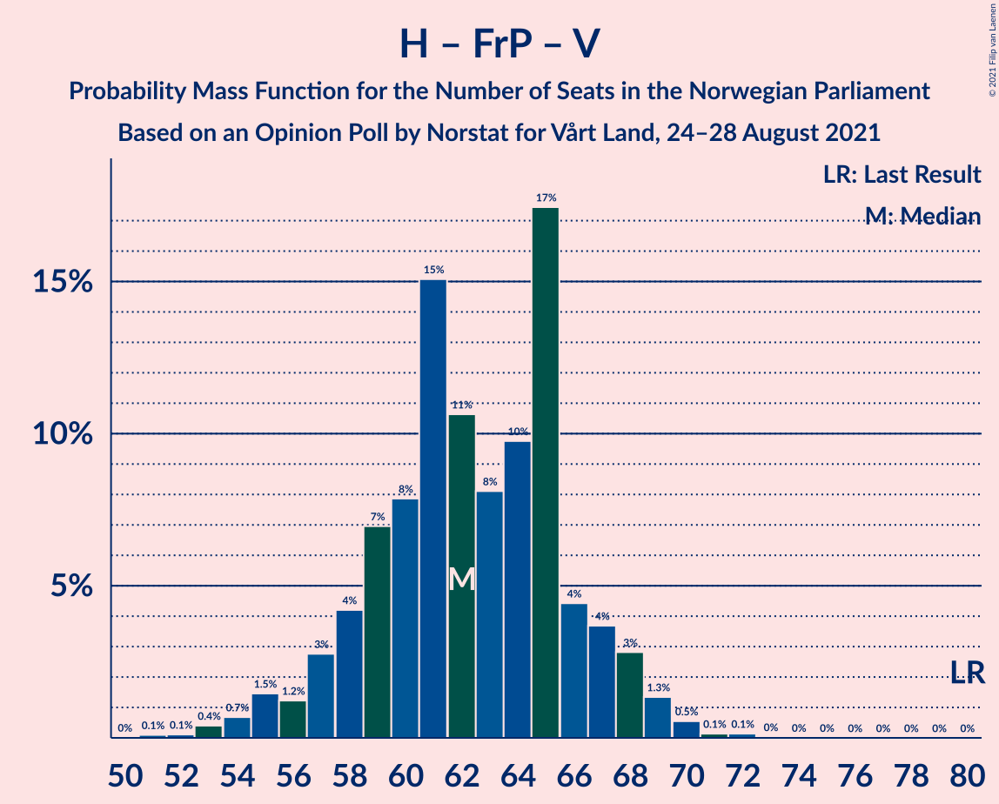
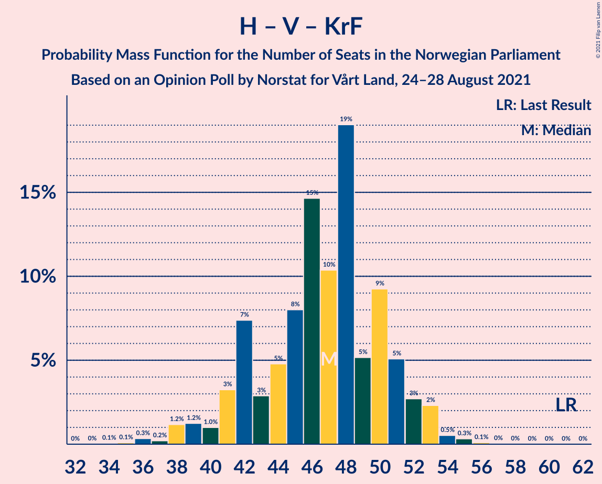

# Opinion Poll by Norstat for Vårt Land, 24–28 August 2021

<a href="#voting-intentions">Voting Intentions</a> | <a href="#seats">Seats</a> | <a href="#coalitions">Coalitions</a> | <a href="#technical-information">Technical Information</a>

## Voting Intentions

### Confidence Intervals

| Party | Last Result | Poll Result | 80% Confidence Interval | 90% Confidence Interval | 95% Confidence Interval | 99% Confidence Interval |
|:-----:|:-----------:|:-----------:|:-----------------------:|:-----------------------:|:-----------------------:|:-----------------------:|
| Arbeiderpartiet | 27.4% | 23.7% | 21.9–25.5% |21.4–26.0% |21.0–26.5% |20.2–27.4% |
| Høyre | 25.0% | 19.0% | 17.5–20.8% |17.0–21.3% |16.6–21.7% |15.9–22.5% |
| Senterpartiet | 10.3% | 12.6% | 11.3–14.1% |10.9–14.5% |10.6–14.9% |10.0–15.6% |
| Fremskrittspartiet | 15.2% | 11.5% | 10.3–13.0% |9.9–13.4% |9.6–13.7% |9.0–14.4% |
| Sosialistisk Venstreparti | 6.0% | 10.0% | 8.8–11.4% |8.5–11.8% |8.2–12.1% |7.7–12.8% |
| Miljøpartiet De Grønne | 3.2% | 5.8% | 4.9–6.9% |4.7–7.2% |4.5–7.5% |4.1–8.1% |
| Rødt | 2.4% | 5.4% | 4.5–6.4% |4.3–6.8% |4.1–7.0% |3.7–7.6% |
| Venstre | 4.4% | 4.9% | 4.1–6.0% |3.9–6.3% |3.7–6.5% |3.4–7.1% |
| Kristelig Folkeparti | 4.2% | 3.7% | 3.0–4.6% |2.8–4.8% |2.6–5.1% |2.3–5.5% |

*Note:* The poll result column reflects the actual value used in the calculations. Published results may vary slightly, and in addition be rounded to fewer digits.

## Seats

### Confidence Intervals

| Party | Last Result | Median | 80% Confidence Interval | 90% Confidence Interval | 95% Confidence Interval | 99% Confidence Interval |
|:-----:|:-----------:|:------:|:-----------------------:|:-----------------------:|:-----------------------:|:-----------------------:|
| <a href="#arbeiderpartiet">Arbeiderpartiet</a> | 49 | 42 | 41–45 |40–46 |39–47 |38–49 |
| <a href="#høyre">Høyre</a> | 45 | 35 | 31–36 |30–37 |29–38 |28–40 |
| <a href="#senterpartiet">Senterpartiet</a> | 19 | 22 | 20–25 |20–26 |19–28 |18–30 |
| <a href="#fremskrittspartiet">Fremskrittspartiet</a> | 27 | 20 | 18–23 |17–24 |16–25 |15–26 |
| <a href="#sosialistisk-venstreparti">Sosialistisk Venstreparti</a> | 11 | 17 | 15–19 |14–20 |13–21 |12–22 |
| <a href="#miljøpartiet-de-grønne">Miljøpartiet De Grønne</a> | 1 | 10 | 8–12 |8–12 |7–13 |7–14 |
| <a href="#rødt">Rødt</a> | 1 | 9 | 7–11 |7–12 |7–12 |2–13 |
| <a href="#venstre">Venstre</a> | 8 | 8 | 6–10 |2–10 |2–11 |2–12 |
| <a href="#kristelig-folkeparti">Kristelig Folkeparti</a> | 8 | 3 | 2–7 |1–8 |1–8 |1–9 |

### Arbeiderpartiet

*For a full overview of the results for this party, see the [Arbeiderpartiet](party-arbeiderpartiet.html) page.*

| Number of Seats | Probability | Accumulated | Special Marks |
|:---------------:|:-----------:|:-----------:|:-------------:|
| 36 | 0.2% | 100% |  |
| 37 | 0.2% | 99.8% |  |
| 38 | 0.4% | 99.6% |  |
| 39 | 2% | 99.3% |  |
| 40 | 6% | 97% |  |
| 41 | 28% | 91% |  |
| 42 | 22% | 63% | Median |
| 43 | 13% | 41% |  |
| 44 | 14% | 28% |  |
| 45 | 5% | 14% |  |
| 46 | 5% | 10% |  |
| 47 | 2% | 4% |  |
| 48 | 1.2% | 2% |  |
| 49 | 0.5% | 1.0% | Last Result |
| 50 | 0.3% | 0.5% |  |
| 51 | 0.1% | 0.2% |  |
| 52 | 0% | 0.1% |  |
| 53 | 0% | 0.1% |  |
| 54 | 0% | 0% |  |

### Høyre

*For a full overview of the results for this party, see the [Høyre](party-høyre.html) page.*

| Number of Seats | Probability | Accumulated | Special Marks |
|:---------------:|:-----------:|:-----------:|:-------------:|
| 26 | 0.1% | 100% |  |
| 27 | 0.1% | 99.9% |  |
| 28 | 1.5% | 99.8% |  |
| 29 | 3% | 98% |  |
| 30 | 2% | 95% |  |
| 31 | 4% | 93% |  |
| 32 | 5% | 90% |  |
| 33 | 13% | 84% |  |
| 34 | 7% | 72% |  |
| 35 | 28% | 64% | Median |
| 36 | 28% | 37% |  |
| 37 | 4% | 9% |  |
| 38 | 3% | 5% |  |
| 39 | 0.6% | 1.5% |  |
| 40 | 0.6% | 0.8% |  |
| 41 | 0.1% | 0.2% |  |
| 42 | 0% | 0.1% |  |
| 43 | 0% | 0% |  |
| 44 | 0% | 0% |  |
| 45 | 0% | 0% | Last Result |

### Senterpartiet

*For a full overview of the results for this party, see the [Senterpartiet](party-senterpartiet.html) page.*

| Number of Seats | Probability | Accumulated | Special Marks |
|:---------------:|:-----------:|:-----------:|:-------------:|
| 17 | 0.4% | 100% |  |
| 18 | 1.5% | 99.5% |  |
| 19 | 3% | 98% | Last Result |
| 20 | 21% | 96% |  |
| 21 | 17% | 75% |  |
| 22 | 16% | 58% | Median |
| 23 | 8% | 42% |  |
| 24 | 13% | 33% |  |
| 25 | 12% | 21% |  |
| 26 | 4% | 9% |  |
| 27 | 2% | 5% |  |
| 28 | 2% | 3% |  |
| 29 | 0.5% | 1.1% |  |
| 30 | 0.5% | 0.6% |  |
| 31 | 0.1% | 0.1% |  |
| 32 | 0% | 0% |  |

### Fremskrittspartiet

*For a full overview of the results for this party, see the [Fremskrittspartiet](party-fremskrittspartiet.html) page.*

| Number of Seats | Probability | Accumulated | Special Marks |
|:---------------:|:-----------:|:-----------:|:-------------:|
| 14 | 0.3% | 100% |  |
| 15 | 0.7% | 99.7% |  |
| 16 | 2% | 99.0% |  |
| 17 | 5% | 97% |  |
| 18 | 12% | 92% |  |
| 19 | 23% | 80% |  |
| 20 | 15% | 57% | Median |
| 21 | 16% | 42% |  |
| 22 | 11% | 25% |  |
| 23 | 8% | 15% |  |
| 24 | 4% | 6% |  |
| 25 | 2% | 3% |  |
| 26 | 0.5% | 0.7% |  |
| 27 | 0.1% | 0.3% | Last Result |
| 28 | 0.1% | 0.1% |  |
| 29 | 0% | 0% |  |

### Sosialistisk Venstreparti

*For a full overview of the results for this party, see the [Sosialistisk Venstreparti](party-sosialistiskvenstreparti.html) page.*

| Number of Seats | Probability | Accumulated | Special Marks |
|:---------------:|:-----------:|:-----------:|:-------------:|
| 11 | 0.2% | 100% | Last Result |
| 12 | 1.4% | 99.8% |  |
| 13 | 2% | 98% |  |
| 14 | 4% | 96% |  |
| 15 | 10% | 91% |  |
| 16 | 21% | 82% |  |
| 17 | 25% | 61% | Median |
| 18 | 15% | 36% |  |
| 19 | 13% | 21% |  |
| 20 | 4% | 8% |  |
| 21 | 2% | 3% |  |
| 22 | 0.7% | 1.0% |  |
| 23 | 0.2% | 0.2% |  |
| 24 | 0.1% | 0.1% |  |
| 25 | 0% | 0% |  |

### Miljøpartiet De Grønne

*For a full overview of the results for this party, see the [Miljøpartiet De Grønne](party-miljøpartietdegrønne.html) page.*

| Number of Seats | Probability | Accumulated | Special Marks |
|:---------------:|:-----------:|:-----------:|:-------------:|
| 1 | 0% | 100% | Last Result |
| 2 | 0.3% | 100% |  |
| 3 | 0% | 99.7% |  |
| 4 | 0% | 99.7% |  |
| 5 | 0% | 99.7% |  |
| 6 | 0.1% | 99.7% |  |
| 7 | 2% | 99.6% |  |
| 8 | 11% | 97% |  |
| 9 | 23% | 86% |  |
| 10 | 24% | 63% | Median |
| 11 | 26% | 40% |  |
| 12 | 10% | 14% |  |
| 13 | 4% | 4% |  |
| 14 | 0.5% | 0.6% |  |
| 15 | 0.1% | 0.1% |  |
| 16 | 0% | 0% |  |

### Rødt

*For a full overview of the results for this party, see the [Rødt](party-rødt.html) page.*

| Number of Seats | Probability | Accumulated | Special Marks |
|:---------------:|:-----------:|:-----------:|:-------------:|
| 1 | 0% | 100% | Last Result |
| 2 | 1.5% | 100% |  |
| 3 | 0% | 98.5% |  |
| 4 | 0% | 98.5% |  |
| 5 | 0% | 98.5% |  |
| 6 | 0.5% | 98.5% |  |
| 7 | 9% | 98% |  |
| 8 | 22% | 89% |  |
| 9 | 27% | 67% | Median |
| 10 | 23% | 39% |  |
| 11 | 11% | 17% |  |
| 12 | 4% | 5% |  |
| 13 | 0.7% | 0.9% |  |
| 14 | 0.2% | 0.2% |  |
| 15 | 0% | 0% |  |

### Venstre

*For a full overview of the results for this party, see the [Venstre](party-venstre.html) page.*

| Number of Seats | Probability | Accumulated | Special Marks |
|:---------------:|:-----------:|:-----------:|:-------------:|
| 2 | 9% | 100% |  |
| 3 | 0.3% | 91% |  |
| 4 | 0% | 91% |  |
| 5 | 0% | 91% |  |
| 6 | 2% | 91% |  |
| 7 | 10% | 89% |  |
| 8 | 36% | 80% | Last Result, Median |
| 9 | 23% | 44% |  |
| 10 | 16% | 21% |  |
| 11 | 4% | 5% |  |
| 12 | 0.7% | 0.9% |  |
| 13 | 0.2% | 0.2% |  |
| 14 | 0% | 0% |  |

### Kristelig Folkeparti

*For a full overview of the results for this party, see the [Kristelig Folkeparti](party-kristeligfolkeparti.html) page.*

| Number of Seats | Probability | Accumulated | Special Marks |
|:---------------:|:-----------:|:-----------:|:-------------:|
| 0 | 0.2% | 100% |  |
| 1 | 7% | 99.8% |  |
| 2 | 30% | 93% |  |
| 3 | 34% | 63% | Median |
| 4 | 0% | 29% |  |
| 5 | 0% | 29% |  |
| 6 | 3% | 29% |  |
| 7 | 16% | 26% |  |
| 8 | 8% | 10% | Last Result |
| 9 | 2% | 2% |  |
| 10 | 0.2% | 0.2% |  |
| 11 | 0% | 0% |  |

## Coalitions

### Confidence Intervals

| Coalition | Last Result | Median | Majority? | 80% Confidence Interval | 90% Confidence Interval | 95% Confidence Interval | 99% Confidence Interval |
|:---------:|:-----------:|:------:|:---------:|:-----------------------:|:-----------------------:|:-----------------------:|:-----------------------:|
| Arbeiderpartiet – Senterpartiet – Sosialistisk Venstreparti – Miljøpartiet De Grønne – Rødt | 81 | 101 | 100% | 97–106 | 95–108 | 94–109 | 91–111 |
| Arbeiderpartiet – Senterpartiet – Sosialistisk Venstreparti – Miljøpartiet De Grønne – Kristelig Folkeparti | 88 | 96 | 99.9% | 91–100 | 90–102 | 90–103 | 87–105 |
| Arbeiderpartiet – Senterpartiet – Sosialistisk Venstreparti – Miljøpartiet De Grønne | 80 | 92 | 98.5% | 88–96 | 87–98 | 85–100 | 83–102 |
| Arbeiderpartiet – Senterpartiet – Sosialistisk Venstreparti – Rødt | 80 | 91 | 97% | 87–96 | 86–97 | 84–99 | 83–101 |
| Høyre – Senterpartiet – Fremskrittspartiet – Venstre – Kristelig Folkeparti | 107 | 89 | 90% | 84–93 | 83–94 | 81–95 | 80–96 |
| Arbeiderpartiet – Senterpartiet – Sosialistisk Venstreparti | 79 | 82 | 24% | 78–86 | 77–87 | 76–90 | 74–91 |
| Arbeiderpartiet – Senterpartiet – Miljøpartiet De Grønne – Kristelig Folkeparti | 77 | 79 | 6% | 74–83 | 73–85 | 73–86 | 71–88 |
| Arbeiderpartiet – Sosialistisk Venstreparti – Miljøpartiet De Grønne – Rødt | 62 | 78 | 5% | 74–83 | 73–84 | 73–86 | 70–89 |
| Høyre – Fremskrittspartiet – Miljøpartiet De Grønne – Venstre – Kristelig Folkeparti | 89 | 77 | 0.6% | 72–81 | 70–82 | 69–83 | 66–85 |
| Arbeiderpartiet – Senterpartiet – Kristelig Folkeparti | 76 | 68 | 0% | 64–73 | 64–75 | 63–77 | 62–79 |
| Høyre – Fremskrittspartiet – Venstre – Kristelig Folkeparti | 88 | 67 | 0% | 62–71 | 60–72 | 59–74 | 57–75 |
| Arbeiderpartiet – Senterpartiet | 68 | 64 | 0% | 62–69 | 61–70 | 60–71 | 58–74 |
| Høyre – Fremskrittspartiet – Venstre | 80 | 63 | 0% | 58–67 | 56–68 | 56–69 | 53–70 |
| Arbeiderpartiet – Sosialistisk Venstreparti | 60 | 59 | 0% | 57–63 | 56–64 | 55–65 | 54–68 |
| Høyre – Fremskrittspartiet | 72 | 55 | 0% | 51–58 | 49–59 | 48–60 | 46–62 |
| Høyre – Venstre – Kristelig Folkeparti | 61 | 46 | 0% | 41–51 | 40–52 | 39–53 | 37–54 |
| Senterpartiet – Venstre – Kristelig Folkeparti | 35 | 35 | 0% | 30–38 | 28–40 | 27–42 | 25–44 |

### Arbeiderpartiet – Senterpartiet – Sosialistisk Venstreparti – Miljøpartiet De Grønne – Rødt

| Number of Seats | Probability | Accumulated | Special Marks |
|:---------------:|:-----------:|:-----------:|:-------------:|
| 81 | 0% | 100% | Last Result |
| 82 | 0% | 100% |  |
| 83 | 0% | 100% |  |
| 84 | 0% | 100% |  |
| 85 | 0% | 100% | Majority |
| 86 | 0% | 100% |  |
| 87 | 0% | 100% |  |
| 88 | 0% | 100% |  |
| 89 | 0.1% | 99.9% |  |
| 90 | 0.1% | 99.9% |  |
| 91 | 0.3% | 99.7% |  |
| 92 | 0.7% | 99.4% |  |
| 93 | 0.6% | 98.6% |  |
| 94 | 2% | 98% |  |
| 95 | 4% | 96% |  |
| 96 | 2% | 93% |  |
| 97 | 11% | 90% |  |
| 98 | 7% | 80% |  |
| 99 | 9% | 73% |  |
| 100 | 14% | 64% | Median |
| 101 | 6% | 51% |  |
| 102 | 12% | 45% |  |
| 103 | 6% | 33% |  |
| 104 | 6% | 27% |  |
| 105 | 8% | 21% |  |
| 106 | 5% | 13% |  |
| 107 | 3% | 8% |  |
| 108 | 2% | 5% |  |
| 109 | 0.7% | 3% |  |
| 110 | 2% | 2% |  |
| 111 | 0.4% | 0.7% |  |
| 112 | 0.2% | 0.3% |  |
| 113 | 0% | 0.1% |  |
| 114 | 0% | 0% |  |

### Arbeiderpartiet – Senterpartiet – Sosialistisk Venstreparti – Miljøpartiet De Grønne – Kristelig Folkeparti

| Number of Seats | Probability | Accumulated | Special Marks |
|:---------------:|:-----------:|:-----------:|:-------------:|
| 84 | 0% | 100% |  |
| 85 | 0.2% | 99.9% | Majority |
| 86 | 0.2% | 99.8% |  |
| 87 | 0.3% | 99.6% |  |
| 88 | 0.5% | 99.3% | Last Result |
| 89 | 0.9% | 98.8% |  |
| 90 | 7% | 98% |  |
| 91 | 6% | 91% |  |
| 92 | 4% | 85% |  |
| 93 | 11% | 82% |  |
| 94 | 8% | 70% | Median |
| 95 | 6% | 62% |  |
| 96 | 13% | 56% |  |
| 97 | 15% | 43% |  |
| 98 | 8% | 28% |  |
| 99 | 6% | 20% |  |
| 100 | 5% | 14% |  |
| 101 | 2% | 9% |  |
| 102 | 3% | 7% |  |
| 103 | 3% | 4% |  |
| 104 | 0.7% | 2% |  |
| 105 | 0.7% | 1.1% |  |
| 106 | 0.2% | 0.4% |  |
| 107 | 0.1% | 0.2% |  |
| 108 | 0.1% | 0.1% |  |
| 109 | 0% | 0.1% |  |
| 110 | 0% | 0% |  |

### Arbeiderpartiet – Senterpartiet – Sosialistisk Venstreparti – Miljøpartiet De Grønne

| Number of Seats | Probability | Accumulated | Special Marks |
|:---------------:|:-----------:|:-----------:|:-------------:|
| 80 | 0% | 100% | Last Result |
| 81 | 0.1% | 100% |  |
| 82 | 0.3% | 99.9% |  |
| 83 | 0.7% | 99.6% |  |
| 84 | 0.4% | 99.0% |  |
| 85 | 1.1% | 98.5% | Majority |
| 86 | 2% | 97% |  |
| 87 | 4% | 96% |  |
| 88 | 7% | 91% |  |
| 89 | 9% | 84% |  |
| 90 | 18% | 75% |  |
| 91 | 6% | 57% | Median |
| 92 | 9% | 50% |  |
| 93 | 5% | 41% |  |
| 94 | 11% | 36% |  |
| 95 | 7% | 25% |  |
| 96 | 9% | 18% |  |
| 97 | 4% | 10% |  |
| 98 | 2% | 5% |  |
| 99 | 1.3% | 4% |  |
| 100 | 2% | 3% |  |
| 101 | 0.4% | 0.9% |  |
| 102 | 0.3% | 0.5% |  |
| 103 | 0.1% | 0.2% |  |
| 104 | 0.1% | 0.1% |  |
| 105 | 0% | 0% |  |

### Arbeiderpartiet – Senterpartiet – Sosialistisk Venstreparti – Rødt

| Number of Seats | Probability | Accumulated | Special Marks |
|:---------------:|:-----------:|:-----------:|:-------------:|
| 79 | 0% | 100% |  |
| 80 | 0.1% | 99.9% | Last Result |
| 81 | 0.1% | 99.8% |  |
| 82 | 0.1% | 99.7% |  |
| 83 | 0.7% | 99.6% |  |
| 84 | 2% | 98.9% |  |
| 85 | 1.2% | 97% | Majority |
| 86 | 3% | 96% |  |
| 87 | 7% | 93% |  |
| 88 | 11% | 85% |  |
| 89 | 16% | 74% |  |
| 90 | 6% | 59% | Median |
| 91 | 12% | 52% |  |
| 92 | 8% | 41% |  |
| 93 | 9% | 33% |  |
| 94 | 7% | 24% |  |
| 95 | 4% | 17% |  |
| 96 | 5% | 12% |  |
| 97 | 3% | 7% |  |
| 98 | 1.0% | 4% |  |
| 99 | 0.8% | 3% |  |
| 100 | 2% | 2% |  |
| 101 | 0.3% | 0.5% |  |
| 102 | 0.1% | 0.2% |  |
| 103 | 0% | 0.1% |  |
| 104 | 0% | 0% |  |

### Høyre – Senterpartiet – Fremskrittspartiet – Venstre – Kristelig Folkeparti

| Number of Seats | Probability | Accumulated | Special Marks |
|:---------------:|:-----------:|:-----------:|:-------------:|
| 77 | 0.1% | 100% |  |
| 78 | 0.1% | 99.9% |  |
| 79 | 0.1% | 99.8% |  |
| 80 | 1.3% | 99.6% |  |
| 81 | 1.3% | 98% |  |
| 82 | 1.1% | 97% |  |
| 83 | 3% | 96% |  |
| 84 | 3% | 93% |  |
| 85 | 8% | 90% | Majority |
| 86 | 7% | 82% |  |
| 87 | 5% | 75% |  |
| 88 | 11% | 70% | Median |
| 89 | 11% | 59% |  |
| 90 | 8% | 48% |  |
| 91 | 20% | 40% |  |
| 92 | 7% | 19% |  |
| 93 | 6% | 12% |  |
| 94 | 2% | 6% |  |
| 95 | 3% | 4% |  |
| 96 | 1.4% | 2% |  |
| 97 | 0.2% | 0.4% |  |
| 98 | 0.1% | 0.2% |  |
| 99 | 0.1% | 0.1% |  |
| 100 | 0% | 0% |  |
| 101 | 0% | 0% |  |
| 102 | 0% | 0% |  |
| 103 | 0% | 0% |  |
| 104 | 0% | 0% |  |
| 105 | 0% | 0% |  |
| 106 | 0% | 0% |  |
| 107 | 0% | 0% | Last Result |

### Arbeiderpartiet – Senterpartiet – Sosialistisk Venstreparti

| Number of Seats | Probability | Accumulated | Special Marks |
|:---------------:|:-----------:|:-----------:|:-------------:|
| 72 | 0.1% | 100% |  |
| 73 | 0.2% | 99.9% |  |
| 74 | 0.3% | 99.7% |  |
| 75 | 0.9% | 99.4% |  |
| 76 | 1.3% | 98.5% |  |
| 77 | 4% | 97% |  |
| 78 | 4% | 94% |  |
| 79 | 21% | 90% | Last Result |
| 80 | 9% | 69% |  |
| 81 | 9% | 60% | Median |
| 82 | 9% | 51% |  |
| 83 | 11% | 42% |  |
| 84 | 7% | 31% |  |
| 85 | 11% | 24% | Majority |
| 86 | 5% | 13% |  |
| 87 | 3% | 8% |  |
| 88 | 2% | 5% |  |
| 89 | 0.9% | 3% |  |
| 90 | 2% | 3% |  |
| 91 | 0.3% | 0.6% |  |
| 92 | 0.1% | 0.3% |  |
| 93 | 0.1% | 0.2% |  |
| 94 | 0% | 0.1% |  |
| 95 | 0% | 0% |  |

### Arbeiderpartiet – Senterpartiet – Miljøpartiet De Grønne – Kristelig Folkeparti

| Number of Seats | Probability | Accumulated | Special Marks |
|:---------------:|:-----------:|:-----------:|:-------------:|
| 68 | 0% | 100% |  |
| 69 | 0.1% | 99.9% |  |
| 70 | 0.3% | 99.9% |  |
| 71 | 0.6% | 99.5% |  |
| 72 | 0.7% | 98.9% |  |
| 73 | 6% | 98% |  |
| 74 | 5% | 92% |  |
| 75 | 10% | 87% |  |
| 76 | 5% | 77% |  |
| 77 | 10% | 72% | Last Result, Median |
| 78 | 9% | 62% |  |
| 79 | 13% | 53% |  |
| 80 | 5% | 40% |  |
| 81 | 12% | 35% |  |
| 82 | 8% | 23% |  |
| 83 | 5% | 14% |  |
| 84 | 4% | 10% |  |
| 85 | 2% | 6% | Majority |
| 86 | 2% | 4% |  |
| 87 | 1.5% | 2% |  |
| 88 | 0.5% | 1.0% |  |
| 89 | 0.3% | 0.5% |  |
| 90 | 0.1% | 0.2% |  |
| 91 | 0% | 0.1% |  |
| 92 | 0% | 0.1% |  |
| 93 | 0% | 0% |  |

### Arbeiderpartiet – Sosialistisk Venstreparti – Miljøpartiet De Grønne – Rødt

| Number of Seats | Probability | Accumulated | Special Marks |
|:---------------:|:-----------:|:-----------:|:-------------:|
| 62 | 0% | 100% | Last Result |
| 63 | 0% | 100% |  |
| 64 | 0% | 100% |  |
| 65 | 0% | 100% |  |
| 66 | 0% | 100% |  |
| 67 | 0.1% | 100% |  |
| 68 | 0.1% | 99.9% |  |
| 69 | 0.1% | 99.7% |  |
| 70 | 0.3% | 99.6% |  |
| 71 | 0.2% | 99.3% |  |
| 72 | 0.8% | 99.1% |  |
| 73 | 4% | 98% |  |
| 74 | 5% | 95% |  |
| 75 | 4% | 90% |  |
| 76 | 8% | 86% |  |
| 77 | 13% | 78% |  |
| 78 | 22% | 65% | Median |
| 79 | 8% | 43% |  |
| 80 | 10% | 35% |  |
| 81 | 9% | 25% |  |
| 82 | 3% | 16% |  |
| 83 | 6% | 13% |  |
| 84 | 2% | 7% |  |
| 85 | 1.2% | 5% | Majority |
| 86 | 2% | 4% |  |
| 87 | 0.4% | 2% |  |
| 88 | 0.9% | 2% |  |
| 89 | 0.5% | 0.6% |  |
| 90 | 0.1% | 0.1% |  |
| 91 | 0.1% | 0.1% |  |
| 92 | 0% | 0% |  |

### Høyre – Fremskrittspartiet – Miljøpartiet De Grønne – Venstre – Kristelig Folkeparti

| Number of Seats | Probability | Accumulated | Special Marks |
|:---------------:|:-----------:|:-----------:|:-------------:|
| 63 | 0.1% | 100% |  |
| 64 | 0.1% | 99.9% |  |
| 65 | 0.1% | 99.8% |  |
| 66 | 0.2% | 99.7% |  |
| 67 | 0.4% | 99.5% |  |
| 68 | 0.9% | 99.1% |  |
| 69 | 3% | 98% |  |
| 70 | 2% | 96% |  |
| 71 | 3% | 94% |  |
| 72 | 5% | 91% |  |
| 73 | 7% | 86% |  |
| 74 | 10% | 79% |  |
| 75 | 8% | 69% |  |
| 76 | 10% | 61% | Median |
| 77 | 8% | 51% |  |
| 78 | 10% | 43% |  |
| 79 | 6% | 33% |  |
| 80 | 14% | 28% |  |
| 81 | 6% | 14% |  |
| 82 | 5% | 8% |  |
| 83 | 2% | 3% |  |
| 84 | 0.7% | 1.3% |  |
| 85 | 0.2% | 0.6% | Majority |
| 86 | 0.2% | 0.4% |  |
| 87 | 0.1% | 0.1% |  |
| 88 | 0% | 0.1% |  |
| 89 | 0% | 0% | Last Result |

### Arbeiderpartiet – Senterpartiet – Kristelig Folkeparti

| Number of Seats | Probability | Accumulated | Special Marks |
|:---------------:|:-----------:|:-----------:|:-------------:|
| 60 | 0.1% | 100% |  |
| 61 | 0.3% | 99.8% |  |
| 62 | 1.0% | 99.6% |  |
| 63 | 3% | 98.6% |  |
| 64 | 8% | 95% |  |
| 65 | 9% | 88% |  |
| 66 | 8% | 78% |  |
| 67 | 7% | 71% | Median |
| 68 | 15% | 64% |  |
| 69 | 10% | 49% |  |
| 70 | 11% | 39% |  |
| 71 | 5% | 28% |  |
| 72 | 9% | 23% |  |
| 73 | 4% | 14% |  |
| 74 | 3% | 9% |  |
| 75 | 2% | 6% |  |
| 76 | 2% | 4% | Last Result |
| 77 | 1.0% | 3% |  |
| 78 | 1.0% | 2% |  |
| 79 | 0.3% | 0.6% |  |
| 80 | 0.2% | 0.3% |  |
| 81 | 0.1% | 0.1% |  |
| 82 | 0% | 0.1% |  |
| 83 | 0% | 0% |  |

### Høyre – Fremskrittspartiet – Venstre – Kristelig Folkeparti

| Number of Seats | Probability | Accumulated | Special Marks |
|:---------------:|:-----------:|:-----------:|:-------------:|
| 54 | 0.1% | 100% |  |
| 55 | 0.1% | 99.9% |  |
| 56 | 0.2% | 99.8% |  |
| 57 | 0.3% | 99.6% |  |
| 58 | 0.7% | 99.2% |  |
| 59 | 3% | 98% |  |
| 60 | 2% | 96% |  |
| 61 | 2% | 94% |  |
| 62 | 5% | 92% |  |
| 63 | 7% | 87% |  |
| 64 | 11% | 80% |  |
| 65 | 11% | 69% |  |
| 66 | 6% | 58% | Median |
| 67 | 12% | 52% |  |
| 68 | 7% | 40% |  |
| 69 | 12% | 33% |  |
| 70 | 8% | 21% |  |
| 71 | 5% | 14% |  |
| 72 | 5% | 9% |  |
| 73 | 0.8% | 4% |  |
| 74 | 2% | 3% |  |
| 75 | 0.3% | 0.7% |  |
| 76 | 0.2% | 0.5% |  |
| 77 | 0.2% | 0.3% |  |
| 78 | 0.1% | 0.1% |  |
| 79 | 0% | 0% |  |
| 80 | 0% | 0% |  |
| 81 | 0% | 0% |  |
| 82 | 0% | 0% |  |
| 83 | 0% | 0% |  |
| 84 | 0% | 0% |  |
| 85 | 0% | 0% | Majority |
| 86 | 0% | 0% |  |
| 87 | 0% | 0% |  |
| 88 | 0% | 0% | Last Result |

### Arbeiderpartiet – Senterpartiet

| Number of Seats | Probability | Accumulated | Special Marks |
|:---------------:|:-----------:|:-----------:|:-------------:|
| 57 | 0.2% | 100% |  |
| 58 | 0.3% | 99.8% |  |
| 59 | 1.1% | 99.5% |  |
| 60 | 1.1% | 98% |  |
| 61 | 6% | 97% |  |
| 62 | 16% | 91% |  |
| 63 | 14% | 75% |  |
| 64 | 12% | 61% | Median |
| 65 | 6% | 49% |  |
| 66 | 16% | 43% |  |
| 67 | 9% | 27% |  |
| 68 | 4% | 18% | Last Result |
| 69 | 6% | 14% |  |
| 70 | 3% | 8% |  |
| 71 | 3% | 5% |  |
| 72 | 1.0% | 2% |  |
| 73 | 0.5% | 1.1% |  |
| 74 | 0.3% | 0.6% |  |
| 75 | 0.2% | 0.3% |  |
| 76 | 0% | 0.1% |  |
| 77 | 0% | 0.1% |  |
| 78 | 0% | 0% |  |

### Høyre – Fremskrittspartiet – Venstre

| Number of Seats | Probability | Accumulated | Special Marks |
|:---------------:|:-----------:|:-----------:|:-------------:|
| 50 | 0% | 100% |  |
| 51 | 0.1% | 99.9% |  |
| 52 | 0.1% | 99.9% |  |
| 53 | 0.3% | 99.7% |  |
| 54 | 0.6% | 99.4% |  |
| 55 | 1.0% | 98.9% |  |
| 56 | 3% | 98% |  |
| 57 | 3% | 94% |  |
| 58 | 3% | 91% |  |
| 59 | 5% | 88% |  |
| 60 | 7% | 83% |  |
| 61 | 7% | 75% |  |
| 62 | 14% | 68% |  |
| 63 | 13% | 54% | Median |
| 64 | 10% | 41% |  |
| 65 | 10% | 32% |  |
| 66 | 5% | 21% |  |
| 67 | 11% | 16% |  |
| 68 | 2% | 5% |  |
| 69 | 3% | 3% |  |
| 70 | 0.4% | 0.8% |  |
| 71 | 0.2% | 0.4% |  |
| 72 | 0.1% | 0.2% |  |
| 73 | 0% | 0.1% |  |
| 74 | 0.1% | 0.1% |  |
| 75 | 0% | 0% |  |
| 76 | 0% | 0% |  |
| 77 | 0% | 0% |  |
| 78 | 0% | 0% |  |
| 79 | 0% | 0% |  |
| 80 | 0% | 0% | Last Result |

### Arbeiderpartiet – Sosialistisk Venstreparti

| Number of Seats | Probability | Accumulated | Special Marks |
|:---------------:|:-----------:|:-----------:|:-------------:|
| 51 | 0.1% | 100% |  |
| 52 | 0.1% | 99.9% |  |
| 53 | 0.2% | 99.8% |  |
| 54 | 0.8% | 99.6% |  |
| 55 | 3% | 98.9% |  |
| 56 | 4% | 96% |  |
| 57 | 15% | 93% |  |
| 58 | 10% | 78% |  |
| 59 | 24% | 68% | Median |
| 60 | 17% | 44% | Last Result |
| 61 | 12% | 27% |  |
| 62 | 4% | 15% |  |
| 63 | 3% | 11% |  |
| 64 | 3% | 8% |  |
| 65 | 2% | 5% |  |
| 66 | 1.4% | 2% |  |
| 67 | 0.3% | 1.0% |  |
| 68 | 0.3% | 0.8% |  |
| 69 | 0.4% | 0.5% |  |
| 70 | 0.1% | 0.1% |  |
| 71 | 0% | 0% |  |

### Høyre – Fremskrittspartiet

| Number of Seats | Probability | Accumulated | Special Marks |
|:---------------:|:-----------:|:-----------:|:-------------:|
| 44 | 0% | 100% |  |
| 45 | 0.2% | 99.9% |  |
| 46 | 0.4% | 99.8% |  |
| 47 | 1.0% | 99.3% |  |
| 48 | 1.2% | 98% |  |
| 49 | 2% | 97% |  |
| 50 | 4% | 95% |  |
| 51 | 4% | 90% |  |
| 52 | 8% | 87% |  |
| 53 | 8% | 78% |  |
| 54 | 17% | 71% |  |
| 55 | 13% | 53% | Median |
| 56 | 13% | 40% |  |
| 57 | 12% | 27% |  |
| 58 | 6% | 15% |  |
| 59 | 6% | 9% |  |
| 60 | 2% | 3% |  |
| 61 | 0.9% | 2% |  |
| 62 | 0.4% | 0.7% |  |
| 63 | 0.1% | 0.3% |  |
| 64 | 0.1% | 0.2% |  |
| 65 | 0.1% | 0.1% |  |
| 66 | 0% | 0% |  |
| 67 | 0% | 0% |  |
| 68 | 0% | 0% |  |
| 69 | 0% | 0% |  |
| 70 | 0% | 0% |  |
| 71 | 0% | 0% |  |
| 72 | 0% | 0% | Last Result |

### Høyre – Venstre – Kristelig Folkeparti

| Number of Seats | Probability | Accumulated | Special Marks |
|:---------------:|:-----------:|:-----------:|:-------------:|
| 34 | 0.1% | 100% |  |
| 35 | 0.2% | 99.9% |  |
| 36 | 0.1% | 99.7% |  |
| 37 | 0.3% | 99.6% |  |
| 38 | 1.0% | 99.3% |  |
| 39 | 2% | 98% |  |
| 40 | 3% | 96% |  |
| 41 | 3% | 93% |  |
| 42 | 3% | 90% |  |
| 43 | 3% | 86% |  |
| 44 | 13% | 83% |  |
| 45 | 5% | 70% |  |
| 46 | 21% | 65% | Median |
| 47 | 8% | 45% |  |
| 48 | 11% | 36% |  |
| 49 | 6% | 26% |  |
| 50 | 8% | 20% |  |
| 51 | 4% | 12% |  |
| 52 | 5% | 8% |  |
| 53 | 2% | 3% |  |
| 54 | 1.1% | 1.5% |  |
| 55 | 0.2% | 0.4% |  |
| 56 | 0.1% | 0.2% |  |
| 57 | 0.1% | 0.1% |  |
| 58 | 0% | 0% |  |
| 59 | 0% | 0% |  |
| 60 | 0% | 0% |  |
| 61 | 0% | 0% | Last Result |

### Senterpartiet – Venstre – Kristelig Folkeparti

| Number of Seats | Probability | Accumulated | Special Marks |
|:---------------:|:-----------:|:-----------:|:-------------:|
| 24 | 0.3% | 100% |  |
| 25 | 0.3% | 99.6% |  |
| 26 | 1.4% | 99.3% |  |
| 27 | 1.3% | 98% |  |
| 28 | 2% | 97% |  |
| 29 | 2% | 94% |  |
| 30 | 9% | 92% |  |
| 31 | 3% | 82% |  |
| 32 | 9% | 79% |  |
| 33 | 7% | 70% | Median |
| 34 | 13% | 63% |  |
| 35 | 11% | 51% | Last Result |
| 36 | 16% | 39% |  |
| 37 | 10% | 23% |  |
| 38 | 4% | 13% |  |
| 39 | 3% | 9% |  |
| 40 | 2% | 6% |  |
| 41 | 0.9% | 4% |  |
| 42 | 1.1% | 3% |  |
| 43 | 1.0% | 2% |  |
| 44 | 0.4% | 0.6% |  |
| 45 | 0.1% | 0.3% |  |
| 46 | 0.1% | 0.1% |  |
| 47 | 0% | 0% |  |

## Technical Information

### Opinion Poll

+ **Polling firm:** Norstat
+ **Commissioner(s):** Vårt Land
+ **Fieldwork period:** 24–28 August 2021

### Calculations

+ **Sample size:** 930
+ **Simulations done:** 1,048,576
+ **Error estimate:** 1.23%

