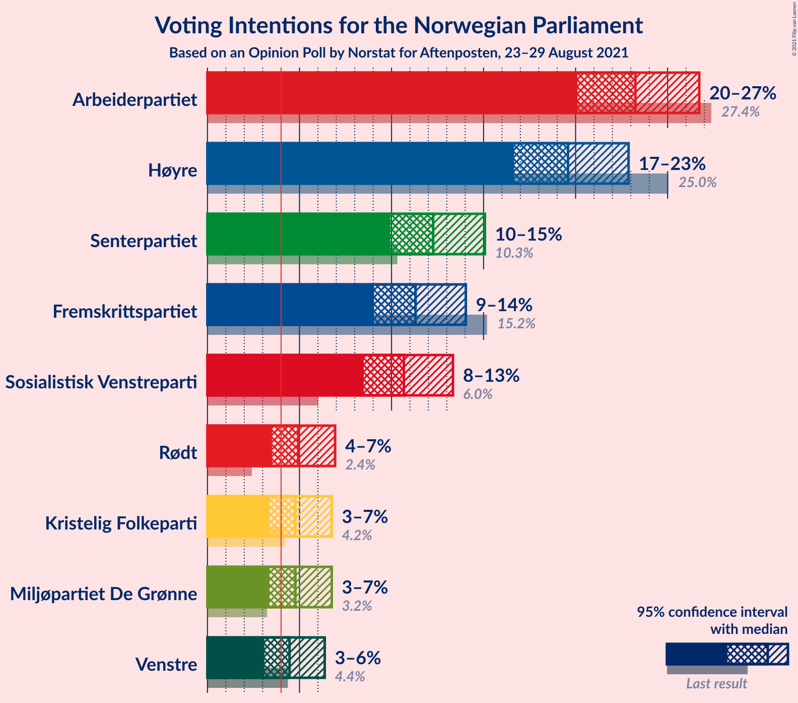
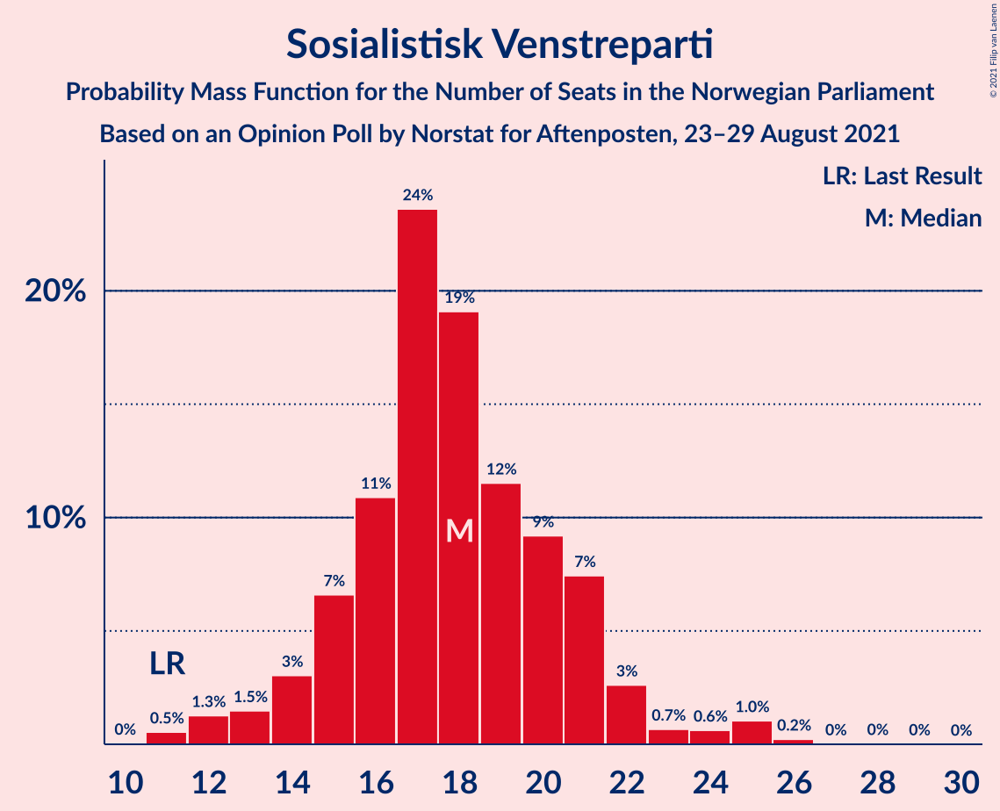
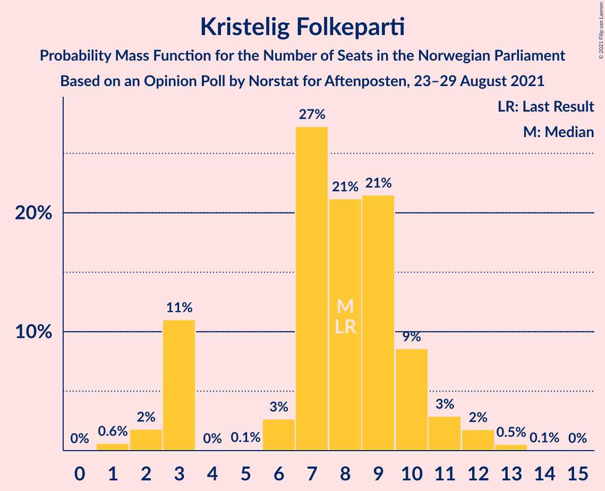
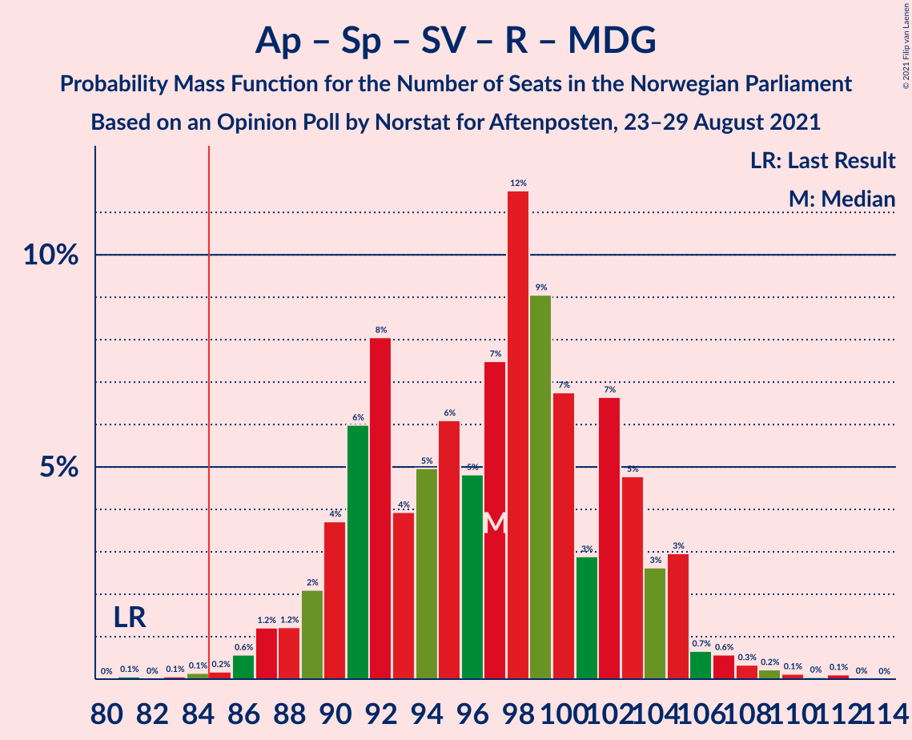
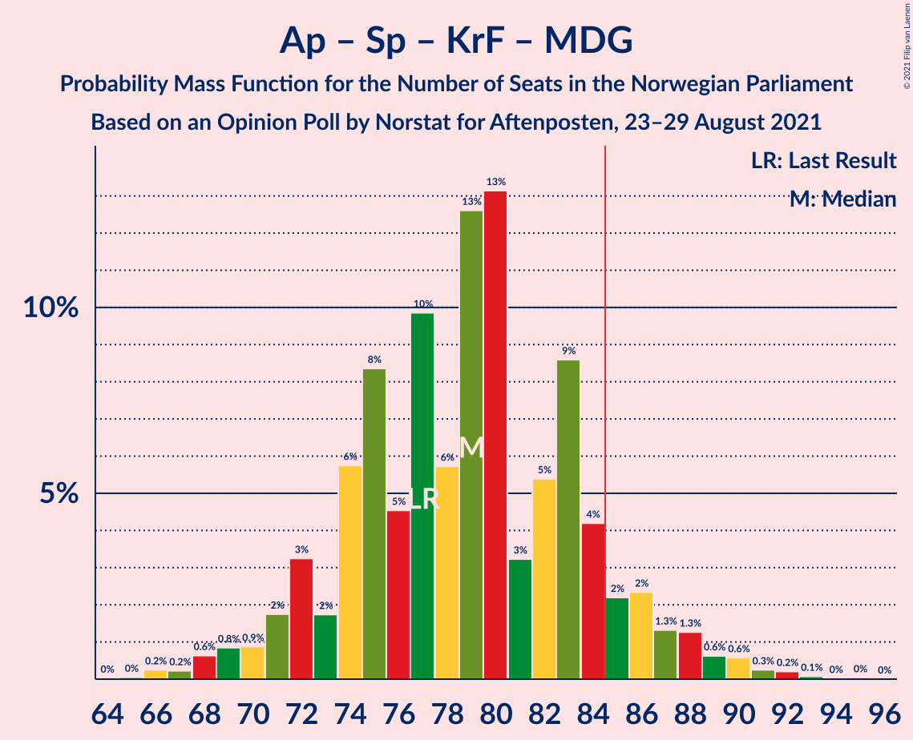
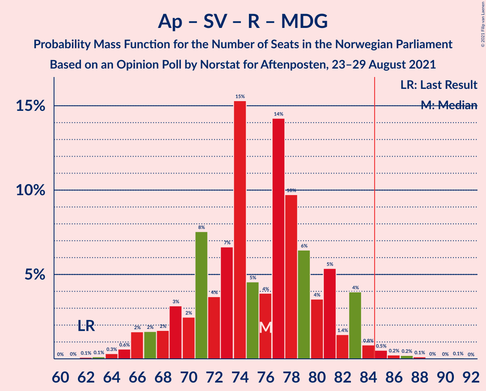
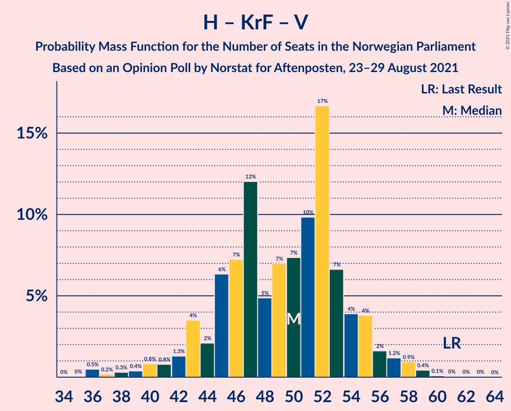
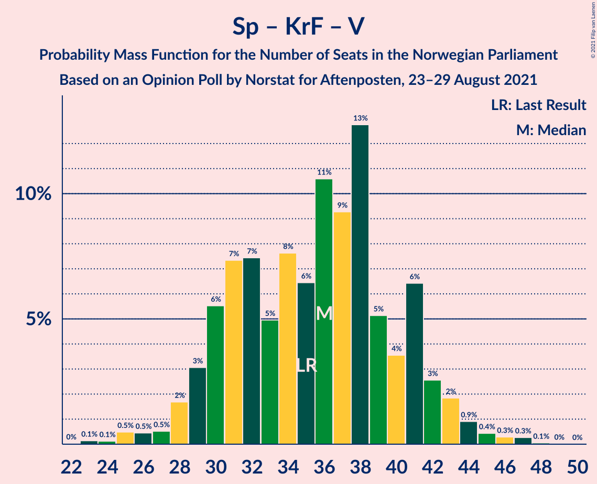

# Opinion Poll by Norstat for Aftenposten, 23–29 August 2021

<a href="#voting-intentions">Voting Intentions</a> | <a href="#seats">Seats</a> | <a href="#coalitions">Coalitions</a> | <a href="#technical-information">Technical Information</a>

## Voting Intentions

### Confidence Intervals

| Party | Last Result | Poll Result | 80% Confidence Interval | 90% Confidence Interval | 95% Confidence Interval | 99% Confidence Interval |
|:-----:|:-----------:|:-----------:|:-----------------------:|:-----------------------:|:-----------------------:|:-----------------------:|
| Arbeiderpartiet | 27.4% | 23.2% | 21.2–25.5% |20.6–26.2% |20.1–26.7% |19.2–27.8% |
| Høyre | 25.0% | 19.1% | 17.2–21.2% |16.7–21.8% |16.2–22.4% |15.3–23.4% |
| Senterpartiet | 10.3% | 12.3% | 10.7–14.1% |10.3–14.6% |9.9–15.1% |9.2–16.0% |
| Fremskrittspartiet | 15.2% | 11.5% | 10.0–13.2% |9.6–13.8% |9.2–14.2% |8.5–15.1% |
| Sosialistisk Venstreparti | 6.0% | 10.7% | 9.2–12.4% |8.8–12.9% |8.5–13.3% |7.8–14.2% |
| Rødt | 2.4% | 5.1% | 4.1–6.4% |3.9–6.8% |3.6–7.1% |3.2–7.8% |
| Miljøpartiet De Grønne | 3.2% | 4.8% | 3.8–6.1% |3.6–6.4% |3.4–6.8% |3.0–7.4% |
| Kristelig Folkeparti | 4.2% | 4.8% | 3.8–6.1% |3.6–6.4% |3.4–6.8% |3.0–7.4% |
| Venstre | 4.4% | 4.6% | 3.7–5.9% |3.4–6.2% |3.2–6.6% |2.9–7.2% |

*Note:* The poll result column reflects the actual value used in the calculations. Published results may vary slightly, and in addition be rounded to fewer digits.

## Seats

### Confidence Intervals

| Party | Last Result | Median | 80% Confidence Interval | 90% Confidence Interval | 95% Confidence Interval | 99% Confidence Interval |
|:-----:|:-----------:|:------:|:-----------------------:|:-----------------------:|:-----------------------:|:-----------------------:|
| <a href="#arbeiderpartiet">Arbeiderpartiet</a> | 49 | 43 | 40–45 |39–46 |38–49 |35–53 |
| <a href="#høyre">Høyre</a> | 45 | 36 | 31–37 |30–38 |28–39 |27–41 |
| <a href="#senterpartiet">Senterpartiet</a> | 19 | 20 | 19–27 |17–27 |17–27 |16–28 |
| <a href="#fremskrittspartiet">Fremskrittspartiet</a> | 27 | 20 | 17–23 |16–24 |16–25 |14–27 |
| <a href="#sosialistisk-venstreparti">Sosialistisk Venstreparti</a> | 11 | 19 | 16–21 |14–22 |14–22 |12–24 |
| <a href="#rødt">Rødt</a> | 1 | 7 | 7–10 |6–11 |2–11 |2–13 |
| <a href="#miljøpartiet-de-grønne">Miljøpartiet De Grønne</a> | 1 | 8 | 3–9 |2–10 |2–10 |2–12 |
| <a href="#kristelig-folkeparti">Kristelig Folkeparti</a> | 8 | 7 | 6–9 |3–10 |3–11 |2–12 |
| <a href="#venstre">Venstre</a> | 8 | 8 | 2–9 |2–10 |2–10 |2–12 |

### Arbeiderpartiet

*For a full overview of the results for this party, see the [Arbeiderpartiet](party-arbeiderpartiet.html) page.*

| Number of Seats | Probability | Accumulated | Special Marks |
|:---------------:|:-----------:|:-----------:|:-------------:|
| 33 | 0.2% | 100% |  |
| 34 | 0.1% | 99.8% |  |
| 35 | 0.5% | 99.7% |  |
| 36 | 0.1% | 99.2% |  |
| 37 | 0.3% | 99.2% |  |
| 38 | 2% | 98.8% |  |
| 39 | 5% | 97% |  |
| 40 | 6% | 92% |  |
| 41 | 8% | 86% |  |
| 42 | 17% | 78% |  |
| 43 | 43% | 60% | Median |
| 44 | 6% | 17% |  |
| 45 | 6% | 11% |  |
| 46 | 2% | 6% |  |
| 47 | 0.9% | 4% |  |
| 48 | 0.7% | 3% |  |
| 49 | 0.4% | 3% | Last Result |
| 50 | 1.2% | 2% |  |
| 51 | 0% | 0.9% |  |
| 52 | 0.1% | 0.9% |  |
| 53 | 0.7% | 0.8% |  |
| 54 | 0% | 0.1% |  |
| 55 | 0% | 0% |  |

### Høyre

*For a full overview of the results for this party, see the [Høyre](party-høyre.html) page.*

| Number of Seats | Probability | Accumulated | Special Marks |
|:---------------:|:-----------:|:-----------:|:-------------:|
| 24 | 0.1% | 100% |  |
| 25 | 0.1% | 99.9% |  |
| 26 | 0.3% | 99.8% |  |
| 27 | 0.6% | 99.6% |  |
| 28 | 3% | 99.0% |  |
| 29 | 1.5% | 97% |  |
| 30 | 3% | 95% |  |
| 31 | 3% | 92% |  |
| 32 | 3% | 89% |  |
| 33 | 14% | 86% |  |
| 34 | 3% | 73% |  |
| 35 | 6% | 70% |  |
| 36 | 47% | 63% | Median |
| 37 | 8% | 16% |  |
| 38 | 5% | 8% |  |
| 39 | 0.6% | 3% |  |
| 40 | 0.4% | 2% |  |
| 41 | 1.3% | 2% |  |
| 42 | 0.2% | 0.4% |  |
| 43 | 0.1% | 0.2% |  |
| 44 | 0.1% | 0.1% |  |
| 45 | 0% | 0% | Last Result |

### Senterpartiet

*For a full overview of the results for this party, see the [Senterpartiet](party-senterpartiet.html) page.*

| Number of Seats | Probability | Accumulated | Special Marks |
|:---------------:|:-----------:|:-----------:|:-------------:|
| 15 | 0.1% | 100% |  |
| 16 | 1.2% | 99.9% |  |
| 17 | 4% | 98.7% |  |
| 18 | 1.4% | 95% |  |
| 19 | 3% | 93% | Last Result |
| 20 | 48% | 90% | Median |
| 21 | 12% | 42% |  |
| 22 | 3% | 29% |  |
| 23 | 6% | 26% |  |
| 24 | 2% | 20% |  |
| 25 | 2% | 17% |  |
| 26 | 2% | 15% |  |
| 27 | 12% | 13% |  |
| 28 | 0.3% | 0.8% |  |
| 29 | 0.3% | 0.5% |  |
| 30 | 0.1% | 0.2% |  |
| 31 | 0% | 0.1% |  |
| 32 | 0.1% | 0.1% |  |
| 33 | 0% | 0% |  |

### Fremskrittspartiet

*For a full overview of the results for this party, see the [Fremskrittspartiet](party-fremskrittspartiet.html) page.*

| Number of Seats | Probability | Accumulated | Special Marks |
|:---------------:|:-----------:|:-----------:|:-------------:|
| 11 | 0.1% | 100% |  |
| 12 | 0.1% | 99.9% |  |
| 13 | 0.2% | 99.8% |  |
| 14 | 0.3% | 99.7% |  |
| 15 | 2% | 99.4% |  |
| 16 | 3% | 98% |  |
| 17 | 7% | 95% |  |
| 18 | 16% | 88% |  |
| 19 | 6% | 72% |  |
| 20 | 44% | 66% | Median |
| 21 | 6% | 22% |  |
| 22 | 5% | 16% |  |
| 23 | 4% | 11% |  |
| 24 | 4% | 7% |  |
| 25 | 2% | 3% |  |
| 26 | 1.0% | 2% |  |
| 27 | 0.2% | 0.7% | Last Result |
| 28 | 0.2% | 0.5% |  |
| 29 | 0.2% | 0.3% |  |
| 30 | 0% | 0% |  |

### Sosialistisk Venstreparti

*For a full overview of the results for this party, see the [Sosialistisk Venstreparti](party-sosialistiskvenstreparti.html) page.*

| Number of Seats | Probability | Accumulated | Special Marks |
|:---------------:|:-----------:|:-----------:|:-------------:|
| 11 | 0.2% | 100% | Last Result |
| 12 | 0.3% | 99.8% |  |
| 13 | 2% | 99.4% |  |
| 14 | 6% | 98% |  |
| 15 | 2% | 92% |  |
| 16 | 11% | 90% |  |
| 17 | 16% | 79% |  |
| 18 | 3% | 63% |  |
| 19 | 41% | 60% | Median |
| 20 | 3% | 19% |  |
| 21 | 8% | 16% |  |
| 22 | 8% | 9% |  |
| 23 | 0.6% | 1.3% |  |
| 24 | 0.5% | 0.7% |  |
| 25 | 0.1% | 0.2% |  |
| 26 | 0.1% | 0.1% |  |
| 27 | 0% | 0.1% |  |
| 28 | 0% | 0% |  |

### Rødt

*For a full overview of the results for this party, see the [Rødt](party-rødt.html) page.*

| Number of Seats | Probability | Accumulated | Special Marks |
|:---------------:|:-----------:|:-----------:|:-------------:|
| 1 | 0.3% | 100% | Last Result |
| 2 | 3% | 99.7% |  |
| 3 | 0% | 96% |  |
| 4 | 0% | 96% |  |
| 5 | 0% | 96% |  |
| 6 | 2% | 96% |  |
| 7 | 54% | 94% | Median |
| 8 | 17% | 40% |  |
| 9 | 10% | 23% |  |
| 10 | 7% | 13% |  |
| 11 | 4% | 7% |  |
| 12 | 1.3% | 2% |  |
| 13 | 0.5% | 0.8% |  |
| 14 | 0.3% | 0.3% |  |
| 15 | 0% | 0% |  |

### Miljøpartiet De Grønne

*For a full overview of the results for this party, see the [Miljøpartiet De Grønne](party-miljøpartietdegrønne.html) page.*

| Number of Seats | Probability | Accumulated | Special Marks |
|:---------------:|:-----------:|:-----------:|:-------------:|
| 1 | 0.4% | 100% | Last Result |
| 2 | 9% | 99.6% |  |
| 3 | 2% | 91% |  |
| 4 | 0% | 90% |  |
| 5 | 0.6% | 90% |  |
| 6 | 4% | 89% |  |
| 7 | 12% | 85% |  |
| 8 | 24% | 74% | Median |
| 9 | 44% | 49% |  |
| 10 | 3% | 6% |  |
| 11 | 1.0% | 2% |  |
| 12 | 1.1% | 1.3% |  |
| 13 | 0.1% | 0.2% |  |
| 14 | 0.1% | 0.1% |  |
| 15 | 0% | 0% |  |

### Kristelig Folkeparti

*For a full overview of the results for this party, see the [Kristelig Folkeparti](party-kristeligfolkeparti.html) page.*

| Number of Seats | Probability | Accumulated | Special Marks |
|:---------------:|:-----------:|:-----------:|:-------------:|
| 1 | 0.3% | 100% |  |
| 2 | 1.0% | 99.7% |  |
| 3 | 7% | 98.7% |  |
| 4 | 0% | 92% |  |
| 5 | 0% | 92% |  |
| 6 | 3% | 92% |  |
| 7 | 42% | 89% | Median |
| 8 | 16% | 47% | Last Result |
| 9 | 24% | 31% |  |
| 10 | 3% | 7% |  |
| 11 | 2% | 4% |  |
| 12 | 0.7% | 1.2% |  |
| 13 | 0.3% | 0.5% |  |
| 14 | 0% | 0.1% |  |
| 15 | 0.1% | 0.1% |  |
| 16 | 0% | 0% |  |

### Venstre

*For a full overview of the results for this party, see the [Venstre](party-venstre.html) page.*

| Number of Seats | Probability | Accumulated | Special Marks |
|:---------------:|:-----------:|:-----------:|:-------------:|
| 2 | 18% | 100% |  |
| 3 | 0.4% | 82% |  |
| 4 | 0% | 81% |  |
| 5 | 0% | 81% |  |
| 6 | 6% | 81% |  |
| 7 | 7% | 76% |  |
| 8 | 53% | 69% | Last Result, Median |
| 9 | 10% | 16% |  |
| 10 | 4% | 6% |  |
| 11 | 1.5% | 2% |  |
| 12 | 0.4% | 0.6% |  |
| 13 | 0.2% | 0.2% |  |
| 14 | 0% | 0% |  |

## Coalitions

### Confidence Intervals

| Coalition | Last Result | Median | Majority? | 80% Confidence Interval | 90% Confidence Interval | 95% Confidence Interval | 99% Confidence Interval |
|:---------:|:-----------:|:------:|:---------:|:-----------------------:|:-----------------------:|:-----------------------:|:-----------------------:|
| Arbeiderpartiet – Senterpartiet – Sosialistisk Venstreparti – Kristelig Folkeparti – Miljøpartiet De Grønne | 88 | 98 | 99.9% | 93–103 | 89–106 | 87–106 | 86–109 |
| Arbeiderpartiet – Senterpartiet – Sosialistisk Venstreparti – Rødt – Miljøpartiet De Grønne | 81 | 98 | 99.8% | 93–103 | 90–106 | 87–106 | 86–110 |
| Høyre – Senterpartiet – Fremskrittspartiet – Kristelig Folkeparti – Venstre | 107 | 91 | 95% | 86–95 | 83–95 | 81–98 | 80–100 |
| Arbeiderpartiet – Senterpartiet – Sosialistisk Venstreparti – Rødt | 80 | 89 | 92% | 85–95 | 83–98 | 80–98 | 78–102 |
| Arbeiderpartiet – Senterpartiet – Sosialistisk Venstreparti – Miljøpartiet De Grønne | 80 | 91 | 91% | 85–94 | 83–98 | 79–98 | 79–102 |
| Arbeiderpartiet – Senterpartiet – Sosialistisk Venstreparti | 79 | 82 | 24% | 77–86 | 75–90 | 73–90 | 72–94 |
| Arbeiderpartiet – Senterpartiet – Kristelig Folkeparti – Miljøpartiet De Grønne | 77 | 79 | 17% | 73–86 | 73–86 | 72–87 | 68–90 |
| Høyre – Fremskrittspartiet – Kristelig Folkeparti – Miljøpartiet De Grønne – Venstre | 89 | 78 | 3% | 71–80 | 69–83 | 67–85 | 65–87 |
| Arbeiderpartiet – Sosialistisk Venstreparti – Rødt – Miljøpartiet De Grønne | 62 | 78 | 1.3% | 72–81 | 70–83 | 69–84 | 65–87 |
| Arbeiderpartiet – Senterpartiet – Kristelig Folkeparti | 76 | 70 | 0.1% | 67–78 | 66–78 | 64–79 | 61–81 |
| Høyre – Fremskrittspartiet – Kristelig Folkeparti – Venstre | 88 | 71 | 0% | 63–75 | 61–75 | 59–77 | 57–79 |
| Arbeiderpartiet – Senterpartiet | 68 | 63 | 0% | 60–69 | 58–69 | 58–72 | 56–74 |
| Høyre – Fremskrittspartiet – Venstre | 80 | 64 | 0% | 56–66 | 55–67 | 54–68 | 51–71 |
| Arbeiderpartiet – Sosialistisk Venstreparti | 60 | 62 | 0% | 56–64 | 55–67 | 55–67 | 52–70 |
| Høyre – Fremskrittspartiet | 72 | 56 | 0% | 51–58 | 48–61 | 47–62 | 46–65 |
| Høyre – Kristelig Folkeparti – Venstre | 61 | 51 | 0% | 44–54 | 41–54 | 39–56 | 39–58 |
| Senterpartiet – Kristelig Folkeparti – Venstre | 35 | 35 | 0% | 31–44 | 30–44 | 29–44 | 26–45 |

### Arbeiderpartiet – Senterpartiet – Sosialistisk Venstreparti – Kristelig Folkeparti – Miljøpartiet De Grønne

| Number of Seats | Probability | Accumulated | Special Marks |
|:---------------:|:-----------:|:-----------:|:-------------:|
| 83 | 0% | 100% |  |
| 84 | 0% | 99.9% |  |
| 85 | 0.1% | 99.9% | Majority |
| 86 | 0.4% | 99.8% |  |
| 87 | 3% | 99.4% |  |
| 88 | 0.9% | 97% | Last Result |
| 89 | 1.3% | 96% |  |
| 90 | 0.7% | 95% |  |
| 91 | 2% | 94% |  |
| 92 | 2% | 92% |  |
| 93 | 5% | 90% |  |
| 94 | 7% | 86% |  |
| 95 | 7% | 79% |  |
| 96 | 7% | 71% |  |
| 97 | 2% | 65% | Median |
| 98 | 36% | 63% |  |
| 99 | 2% | 26% |  |
| 100 | 3% | 24% |  |
| 101 | 2% | 21% |  |
| 102 | 0.9% | 20% |  |
| 103 | 11% | 19% |  |
| 104 | 0.9% | 8% |  |
| 105 | 0.8% | 7% |  |
| 106 | 4% | 6% |  |
| 107 | 0.8% | 2% |  |
| 108 | 0.1% | 0.9% |  |
| 109 | 0.8% | 0.8% |  |
| 110 | 0% | 0.1% |  |
| 111 | 0% | 0.1% |  |
| 112 | 0% | 0.1% |  |
| 113 | 0% | 0% |  |

### Arbeiderpartiet – Senterpartiet – Sosialistisk Venstreparti – Rødt – Miljøpartiet De Grønne

| Number of Seats | Probability | Accumulated | Special Marks |
|:---------------:|:-----------:|:-----------:|:-------------:|
| 81 | 0.1% | 100% | Last Result |
| 82 | 0% | 99.9% |  |
| 83 | 0% | 99.9% |  |
| 84 | 0.1% | 99.9% |  |
| 85 | 0.1% | 99.8% | Majority |
| 86 | 0.4% | 99.7% |  |
| 87 | 3% | 99.3% |  |
| 88 | 0.8% | 96% |  |
| 89 | 0.3% | 96% |  |
| 90 | 2% | 95% |  |
| 91 | 1.0% | 94% |  |
| 92 | 2% | 93% |  |
| 93 | 4% | 91% |  |
| 94 | 8% | 87% |  |
| 95 | 2% | 79% |  |
| 96 | 6% | 76% |  |
| 97 | 5% | 71% | Median |
| 98 | 35% | 65% |  |
| 99 | 4% | 31% |  |
| 100 | 0.8% | 26% |  |
| 101 | 15% | 25% |  |
| 102 | 0.8% | 11% |  |
| 103 | 3% | 10% |  |
| 104 | 1.4% | 8% |  |
| 105 | 0.7% | 6% |  |
| 106 | 4% | 5% |  |
| 107 | 0.3% | 2% |  |
| 108 | 0.7% | 2% |  |
| 109 | 0% | 0.9% |  |
| 110 | 0.7% | 0.8% |  |
| 111 | 0.1% | 0.1% |  |
| 112 | 0% | 0% |  |

### Høyre – Senterpartiet – Fremskrittspartiet – Kristelig Folkeparti – Venstre

| Number of Seats | Probability | Accumulated | Special Marks |
|:---------------:|:-----------:|:-----------:|:-------------:|
| 76 | 0% | 100% |  |
| 77 | 0.2% | 99.9% |  |
| 78 | 0.1% | 99.7% |  |
| 79 | 0.1% | 99.7% |  |
| 80 | 2% | 99.6% |  |
| 81 | 1.3% | 98% |  |
| 82 | 0.9% | 96% |  |
| 83 | 0.6% | 96% |  |
| 84 | 0.5% | 95% |  |
| 85 | 2% | 95% | Majority |
| 86 | 5% | 92% |  |
| 87 | 6% | 87% |  |
| 88 | 7% | 81% |  |
| 89 | 4% | 74% |  |
| 90 | 3% | 70% |  |
| 91 | 37% | 68% | Median |
| 92 | 6% | 31% |  |
| 93 | 1.5% | 25% |  |
| 94 | 2% | 23% |  |
| 95 | 17% | 21% |  |
| 96 | 0.5% | 5% |  |
| 97 | 0.4% | 4% |  |
| 98 | 1.2% | 4% |  |
| 99 | 1.3% | 2% |  |
| 100 | 0.9% | 1.1% |  |
| 101 | 0% | 0.3% |  |
| 102 | 0.1% | 0.2% |  |
| 103 | 0.1% | 0.1% |  |
| 104 | 0% | 0% |  |
| 105 | 0% | 0% |  |
| 106 | 0% | 0% |  |
| 107 | 0% | 0% | Last Result |

### Arbeiderpartiet – Senterpartiet – Sosialistisk Venstreparti – Rødt

| Number of Seats | Probability | Accumulated | Special Marks |
|:---------------:|:-----------:|:-----------:|:-------------:|
| 76 | 0.1% | 100% |  |
| 77 | 0.4% | 99.9% |  |
| 78 | 0.1% | 99.5% |  |
| 79 | 0.5% | 99.4% |  |
| 80 | 2% | 99.0% | Last Result |
| 81 | 0.3% | 97% |  |
| 82 | 1.1% | 96% |  |
| 83 | 1.1% | 95% |  |
| 84 | 2% | 94% |  |
| 85 | 5% | 92% | Majority |
| 86 | 1.0% | 86% |  |
| 87 | 4% | 86% |  |
| 88 | 2% | 81% |  |
| 89 | 39% | 79% | Median |
| 90 | 5% | 40% |  |
| 91 | 3% | 35% |  |
| 92 | 6% | 33% |  |
| 93 | 13% | 26% |  |
| 94 | 2% | 13% |  |
| 95 | 2% | 11% |  |
| 96 | 2% | 9% |  |
| 97 | 1.4% | 7% |  |
| 98 | 3% | 5% |  |
| 99 | 0.9% | 2% |  |
| 100 | 0.1% | 1.1% |  |
| 101 | 0.1% | 0.9% |  |
| 102 | 0.8% | 0.9% |  |
| 103 | 0.1% | 0.1% |  |
| 104 | 0% | 0% |  |

### Arbeiderpartiet – Senterpartiet – Sosialistisk Venstreparti – Miljøpartiet De Grønne

| Number of Seats | Probability | Accumulated | Special Marks |
|:---------------:|:-----------:|:-----------:|:-------------:|
| 76 | 0% | 100% |  |
| 77 | 0.1% | 99.9% |  |
| 78 | 0.1% | 99.8% |  |
| 79 | 3% | 99.7% |  |
| 80 | 0.3% | 97% | Last Result |
| 81 | 0.5% | 97% |  |
| 82 | 1.3% | 96% |  |
| 83 | 2% | 95% |  |
| 84 | 1.4% | 93% |  |
| 85 | 7% | 91% | Majority |
| 86 | 7% | 84% |  |
| 87 | 3% | 77% |  |
| 88 | 0.9% | 74% |  |
| 89 | 6% | 73% |  |
| 90 | 4% | 67% | Median |
| 91 | 40% | 63% |  |
| 92 | 2% | 23% |  |
| 93 | 0.6% | 21% |  |
| 94 | 12% | 20% |  |
| 95 | 1.0% | 8% |  |
| 96 | 1.0% | 7% |  |
| 97 | 0.4% | 6% |  |
| 98 | 3% | 6% |  |
| 99 | 0.2% | 2% |  |
| 100 | 0.7% | 2% |  |
| 101 | 0.7% | 1.2% |  |
| 102 | 0.3% | 0.5% |  |
| 103 | 0.1% | 0.2% |  |
| 104 | 0.1% | 0.1% |  |
| 105 | 0% | 0% |  |

### Arbeiderpartiet – Senterpartiet – Sosialistisk Venstreparti

| Number of Seats | Probability | Accumulated | Special Marks |
|:---------------:|:-----------:|:-----------:|:-------------:|
| 70 | 0% | 100% |  |
| 71 | 0.1% | 99.9% |  |
| 72 | 2% | 99.9% |  |
| 73 | 0.3% | 98% |  |
| 74 | 0.2% | 97% |  |
| 75 | 3% | 97% |  |
| 76 | 4% | 94% |  |
| 77 | 2% | 90% |  |
| 78 | 3% | 88% |  |
| 79 | 5% | 85% | Last Result |
| 80 | 0.9% | 80% |  |
| 81 | 4% | 80% |  |
| 82 | 41% | 76% | Median |
| 83 | 5% | 34% |  |
| 84 | 6% | 30% |  |
| 85 | 3% | 24% | Majority |
| 86 | 12% | 21% |  |
| 87 | 1.1% | 8% |  |
| 88 | 1.5% | 7% |  |
| 89 | 0.3% | 6% |  |
| 90 | 3% | 6% |  |
| 91 | 0.7% | 2% |  |
| 92 | 0.3% | 2% |  |
| 93 | 0.7% | 1.3% |  |
| 94 | 0.4% | 0.6% |  |
| 95 | 0% | 0.1% |  |
| 96 | 0% | 0.1% |  |
| 97 | 0.1% | 0.1% |  |
| 98 | 0% | 0% |  |

### Arbeiderpartiet – Senterpartiet – Kristelig Folkeparti – Miljøpartiet De Grønne

| Number of Seats | Probability | Accumulated | Special Marks |
|:---------------:|:-----------:|:-----------:|:-------------:|
| 64 | 0.1% | 100% |  |
| 65 | 0% | 99.9% |  |
| 66 | 0.1% | 99.9% |  |
| 67 | 0.2% | 99.8% |  |
| 68 | 0.3% | 99.7% |  |
| 69 | 0.2% | 99.4% |  |
| 70 | 0.5% | 99.1% |  |
| 71 | 0.9% | 98.7% |  |
| 72 | 2% | 98% |  |
| 73 | 8% | 96% |  |
| 74 | 4% | 89% |  |
| 75 | 4% | 85% |  |
| 76 | 3% | 81% |  |
| 77 | 4% | 78% | Last Result |
| 78 | 7% | 74% | Median |
| 79 | 38% | 67% |  |
| 80 | 2% | 29% |  |
| 81 | 0.6% | 27% |  |
| 82 | 3% | 26% |  |
| 83 | 1.3% | 23% |  |
| 84 | 5% | 22% |  |
| 85 | 1.3% | 17% | Majority |
| 86 | 11% | 16% |  |
| 87 | 2% | 4% |  |
| 88 | 1.1% | 2% |  |
| 89 | 0.1% | 0.9% |  |
| 90 | 0.6% | 0.8% |  |
| 91 | 0% | 0.2% |  |
| 92 | 0.1% | 0.2% |  |
| 93 | 0% | 0.1% |  |
| 94 | 0.1% | 0.1% |  |
| 95 | 0% | 0% |  |

### Høyre – Fremskrittspartiet – Kristelig Folkeparti – Miljøpartiet De Grønne – Venstre

| Number of Seats | Probability | Accumulated | Special Marks |
|:---------------:|:-----------:|:-----------:|:-------------:|
| 59 | 0% | 100% |  |
| 60 | 0% | 99.9% |  |
| 61 | 0% | 99.9% |  |
| 62 | 0.1% | 99.9% |  |
| 63 | 0.1% | 99.8% |  |
| 64 | 0.2% | 99.8% |  |
| 65 | 0.2% | 99.6% |  |
| 66 | 2% | 99.5% |  |
| 67 | 1.0% | 98% |  |
| 68 | 1.4% | 97% |  |
| 69 | 0.4% | 95% |  |
| 70 | 4% | 95% |  |
| 71 | 4% | 91% |  |
| 72 | 2% | 87% |  |
| 73 | 5% | 84% |  |
| 74 | 6% | 80% |  |
| 75 | 2% | 74% |  |
| 76 | 13% | 72% |  |
| 77 | 9% | 59% |  |
| 78 | 3% | 50% |  |
| 79 | 3% | 47% | Median |
| 80 | 35% | 44% |  |
| 81 | 0.7% | 9% |  |
| 82 | 4% | 9% |  |
| 83 | 0.5% | 5% |  |
| 84 | 1.4% | 5% |  |
| 85 | 2% | 3% | Majority |
| 86 | 0.1% | 1.1% |  |
| 87 | 0.9% | 1.0% |  |
| 88 | 0% | 0.1% |  |
| 89 | 0% | 0.1% | Last Result |
| 90 | 0% | 0.1% |  |
| 91 | 0% | 0% |  |

### Arbeiderpartiet – Sosialistisk Venstreparti – Rødt – Miljøpartiet De Grønne

| Number of Seats | Probability | Accumulated | Special Marks |
|:---------------:|:-----------:|:-----------:|:-------------:|
| 62 | 0.3% | 100% | Last Result |
| 63 | 0% | 99.6% |  |
| 64 | 0.1% | 99.6% |  |
| 65 | 0% | 99.5% |  |
| 66 | 0.3% | 99.5% |  |
| 67 | 1.1% | 99.2% |  |
| 68 | 0.2% | 98% |  |
| 69 | 2% | 98% |  |
| 70 | 4% | 96% |  |
| 71 | 2% | 92% |  |
| 72 | 3% | 90% |  |
| 73 | 6% | 88% |  |
| 74 | 18% | 82% |  |
| 75 | 6% | 63% |  |
| 76 | 3% | 57% |  |
| 77 | 3% | 54% | Median |
| 78 | 37% | 51% |  |
| 79 | 1.5% | 14% |  |
| 80 | 1.1% | 13% |  |
| 81 | 3% | 12% |  |
| 82 | 2% | 9% |  |
| 83 | 4% | 7% |  |
| 84 | 2% | 3% |  |
| 85 | 0.2% | 1.3% | Majority |
| 86 | 0.2% | 1.1% |  |
| 87 | 0.7% | 0.9% |  |
| 88 | 0.1% | 0.2% |  |
| 89 | 0% | 0% |  |

### Arbeiderpartiet – Senterpartiet – Kristelig Folkeparti

| Number of Seats | Probability | Accumulated | Special Marks |
|:---------------:|:-----------:|:-----------:|:-------------:|
| 57 | 0% | 100% |  |
| 58 | 0% | 99.9% |  |
| 59 | 0.1% | 99.9% |  |
| 60 | 0.2% | 99.8% |  |
| 61 | 0.1% | 99.5% |  |
| 62 | 0.1% | 99.4% |  |
| 63 | 0.7% | 99.3% |  |
| 64 | 1.4% | 98.6% |  |
| 65 | 1.3% | 97% |  |
| 66 | 3% | 96% |  |
| 67 | 3% | 93% |  |
| 68 | 4% | 90% |  |
| 69 | 6% | 85% |  |
| 70 | 39% | 80% | Median |
| 71 | 8% | 40% |  |
| 72 | 3% | 32% |  |
| 73 | 2% | 29% |  |
| 74 | 2% | 27% |  |
| 75 | 3% | 25% |  |
| 76 | 6% | 23% | Last Result |
| 77 | 1.4% | 17% |  |
| 78 | 12% | 15% |  |
| 79 | 2% | 4% |  |
| 80 | 1.2% | 2% |  |
| 81 | 0.9% | 1.1% |  |
| 82 | 0.1% | 0.3% |  |
| 83 | 0.1% | 0.2% |  |
| 84 | 0% | 0.1% |  |
| 85 | 0% | 0.1% | Majority |
| 86 | 0% | 0.1% |  |
| 87 | 0% | 0% |  |

### Høyre – Fremskrittspartiet – Kristelig Folkeparti – Venstre

| Number of Seats | Probability | Accumulated | Special Marks |
|:---------------:|:-----------:|:-----------:|:-------------:|
| 53 | 0% | 100% |  |
| 54 | 0% | 99.9% |  |
| 55 | 0% | 99.9% |  |
| 56 | 0.2% | 99.9% |  |
| 57 | 0.2% | 99.7% |  |
| 58 | 0.4% | 99.5% |  |
| 59 | 2% | 99.0% |  |
| 60 | 0.6% | 97% |  |
| 61 | 2% | 96% |  |
| 62 | 0.8% | 94% |  |
| 63 | 5% | 94% |  |
| 64 | 1.1% | 88% |  |
| 65 | 3% | 87% |  |
| 66 | 6% | 84% |  |
| 67 | 0.8% | 78% |  |
| 68 | 19% | 77% |  |
| 69 | 2% | 58% |  |
| 70 | 5% | 56% |  |
| 71 | 35% | 52% | Median |
| 72 | 0.9% | 17% |  |
| 73 | 3% | 16% |  |
| 74 | 2% | 13% |  |
| 75 | 7% | 11% |  |
| 76 | 0.8% | 4% |  |
| 77 | 2% | 3% |  |
| 78 | 0.2% | 1.5% |  |
| 79 | 1.1% | 1.3% |  |
| 80 | 0.1% | 0.2% |  |
| 81 | 0% | 0.1% |  |
| 82 | 0% | 0.1% |  |
| 83 | 0% | 0% |  |
| 84 | 0% | 0% |  |
| 85 | 0% | 0% | Majority |
| 86 | 0% | 0% |  |
| 87 | 0% | 0% |  |
| 88 | 0% | 0% | Last Result |

### Arbeiderpartiet – Senterpartiet

| Number of Seats | Probability | Accumulated | Special Marks |
|:---------------:|:-----------:|:-----------:|:-------------:|
| 53 | 0.1% | 100% |  |
| 54 | 0.1% | 99.8% |  |
| 55 | 0.2% | 99.8% |  |
| 56 | 1.0% | 99.6% |  |
| 57 | 0.9% | 98.5% |  |
| 58 | 3% | 98% |  |
| 59 | 2% | 95% |  |
| 60 | 4% | 93% |  |
| 61 | 5% | 89% |  |
| 62 | 8% | 83% |  |
| 63 | 41% | 75% | Median |
| 64 | 4% | 34% |  |
| 65 | 4% | 30% |  |
| 66 | 2% | 27% |  |
| 67 | 2% | 24% |  |
| 68 | 4% | 23% | Last Result |
| 69 | 14% | 19% |  |
| 70 | 1.4% | 5% |  |
| 71 | 0.2% | 3% |  |
| 72 | 1.3% | 3% |  |
| 73 | 0.7% | 2% |  |
| 74 | 0.6% | 0.9% |  |
| 75 | 0.1% | 0.2% |  |
| 76 | 0.1% | 0.2% |  |
| 77 | 0% | 0.1% |  |
| 78 | 0% | 0% |  |

### Høyre – Fremskrittspartiet – Venstre

| Number of Seats | Probability | Accumulated | Special Marks |
|:---------------:|:-----------:|:-----------:|:-------------:|
| 47 | 0.1% | 100% |  |
| 48 | 0.1% | 99.9% |  |
| 49 | 0.1% | 99.8% |  |
| 50 | 0.1% | 99.7% |  |
| 51 | 1.1% | 99.6% |  |
| 52 | 0.3% | 98% |  |
| 53 | 0.5% | 98% |  |
| 54 | 1.2% | 98% |  |
| 55 | 6% | 96% |  |
| 56 | 3% | 90% |  |
| 57 | 2% | 88% |  |
| 58 | 3% | 86% |  |
| 59 | 19% | 83% |  |
| 60 | 4% | 63% |  |
| 61 | 2% | 59% |  |
| 62 | 3% | 57% |  |
| 63 | 1.3% | 54% |  |
| 64 | 35% | 52% | Median |
| 65 | 2% | 17% |  |
| 66 | 6% | 15% |  |
| 67 | 5% | 8% |  |
| 68 | 1.4% | 3% |  |
| 69 | 0.2% | 2% |  |
| 70 | 0.5% | 2% |  |
| 71 | 1.2% | 1.4% |  |
| 72 | 0% | 0.2% |  |
| 73 | 0% | 0.2% |  |
| 74 | 0.1% | 0.2% |  |
| 75 | 0% | 0% |  |
| 76 | 0% | 0% |  |
| 77 | 0% | 0% |  |
| 78 | 0% | 0% |  |
| 79 | 0% | 0% |  |
| 80 | 0% | 0% | Last Result |

### Arbeiderpartiet – Sosialistisk Venstreparti

| Number of Seats | Probability | Accumulated | Special Marks |
|:---------------:|:-----------:|:-----------:|:-------------:|
| 50 | 0.1% | 100% |  |
| 51 | 0.1% | 99.9% |  |
| 52 | 0.4% | 99.8% |  |
| 53 | 0.2% | 99.4% |  |
| 54 | 1.1% | 99.2% |  |
| 55 | 8% | 98% |  |
| 56 | 1.5% | 90% |  |
| 57 | 2% | 89% |  |
| 58 | 5% | 87% |  |
| 59 | 16% | 82% |  |
| 60 | 4% | 66% | Last Result |
| 61 | 6% | 61% |  |
| 62 | 37% | 55% | Median |
| 63 | 2% | 18% |  |
| 64 | 8% | 16% |  |
| 65 | 1.1% | 8% |  |
| 66 | 0.4% | 7% |  |
| 67 | 5% | 7% |  |
| 68 | 0.3% | 2% |  |
| 69 | 0.2% | 1.4% |  |
| 70 | 1.0% | 1.2% |  |
| 71 | 0.1% | 0.2% |  |
| 72 | 0.1% | 0.1% |  |
| 73 | 0% | 0% |  |

### Høyre – Fremskrittspartiet

| Number of Seats | Probability | Accumulated | Special Marks |
|:---------------:|:-----------:|:-----------:|:-------------:|
| 41 | 0.1% | 100% |  |
| 42 | 0% | 99.9% |  |
| 43 | 0.1% | 99.9% |  |
| 44 | 0.1% | 99.8% |  |
| 45 | 0.2% | 99.7% |  |
| 46 | 1.4% | 99.5% |  |
| 47 | 1.0% | 98% |  |
| 48 | 3% | 97% |  |
| 49 | 3% | 95% |  |
| 50 | 2% | 92% |  |
| 51 | 14% | 90% |  |
| 52 | 3% | 76% |  |
| 53 | 6% | 73% |  |
| 54 | 4% | 67% |  |
| 55 | 2% | 63% |  |
| 56 | 37% | 61% | Median |
| 57 | 11% | 24% |  |
| 58 | 4% | 13% |  |
| 59 | 2% | 9% |  |
| 60 | 2% | 7% |  |
| 61 | 3% | 6% |  |
| 62 | 1.4% | 3% |  |
| 63 | 0.2% | 1.1% |  |
| 64 | 0% | 1.0% |  |
| 65 | 0.8% | 0.9% |  |
| 66 | 0.1% | 0.2% |  |
| 67 | 0% | 0% |  |
| 68 | 0% | 0% |  |
| 69 | 0% | 0% |  |
| 70 | 0% | 0% |  |
| 71 | 0% | 0% |  |
| 72 | 0% | 0% | Last Result |

### Høyre – Kristelig Folkeparti – Venstre

| Number of Seats | Probability | Accumulated | Special Marks |
|:---------------:|:-----------:|:-----------:|:-------------:|
| 34 | 0.1% | 100% |  |
| 35 | 0% | 99.9% |  |
| 36 | 0.1% | 99.9% |  |
| 37 | 0.2% | 99.8% |  |
| 38 | 0.1% | 99.6% |  |
| 39 | 2% | 99.5% |  |
| 40 | 0.7% | 97% |  |
| 41 | 2% | 96% |  |
| 42 | 2% | 95% |  |
| 43 | 0.3% | 92% |  |
| 44 | 4% | 92% |  |
| 45 | 2% | 88% |  |
| 46 | 6% | 86% |  |
| 47 | 3% | 80% |  |
| 48 | 5% | 77% |  |
| 49 | 3% | 72% |  |
| 50 | 16% | 68% |  |
| 51 | 35% | 52% | Median |
| 52 | 4% | 17% |  |
| 53 | 3% | 13% |  |
| 54 | 6% | 11% |  |
| 55 | 1.2% | 4% |  |
| 56 | 1.4% | 3% |  |
| 57 | 0.5% | 2% |  |
| 58 | 1.1% | 1.2% |  |
| 59 | 0.1% | 0.2% |  |
| 60 | 0.1% | 0.1% |  |
| 61 | 0% | 0% | Last Result |

### Senterpartiet – Kristelig Folkeparti – Venstre

| Number of Seats | Probability | Accumulated | Special Marks |
|:---------------:|:-----------:|:-----------:|:-------------:|
| 24 | 0.1% | 100% |  |
| 25 | 0.1% | 99.9% |  |
| 26 | 0.9% | 99.8% |  |
| 27 | 0.3% | 98.9% |  |
| 28 | 0.8% | 98.7% |  |
| 29 | 0.6% | 98% |  |
| 30 | 4% | 97% |  |
| 31 | 3% | 93% |  |
| 32 | 7% | 90% |  |
| 33 | 8% | 83% |  |
| 34 | 5% | 76% |  |
| 35 | 36% | 70% | Last Result, Median |
| 36 | 5% | 35% |  |
| 37 | 4% | 30% |  |
| 38 | 5% | 26% |  |
| 39 | 3% | 21% |  |
| 40 | 2% | 18% |  |
| 41 | 1.3% | 16% |  |
| 42 | 3% | 15% |  |
| 43 | 0.5% | 12% |  |
| 44 | 11% | 12% |  |
| 45 | 0.2% | 0.5% |  |
| 46 | 0.2% | 0.3% |  |
| 47 | 0% | 0.2% |  |
| 48 | 0.1% | 0.1% |  |
| 49 | 0% | 0% |  |

## Technical Information

### Opinion Poll

+ **Polling firm:** Norstat
+ **Commissioner(s):** Aftenposten
+ **Fieldwork period:** 23–29 August 2021

### Calculations

+ **Sample size:** 628
+ **Simulations done:** 131,072
+ **Error estimate:** 1.84%

