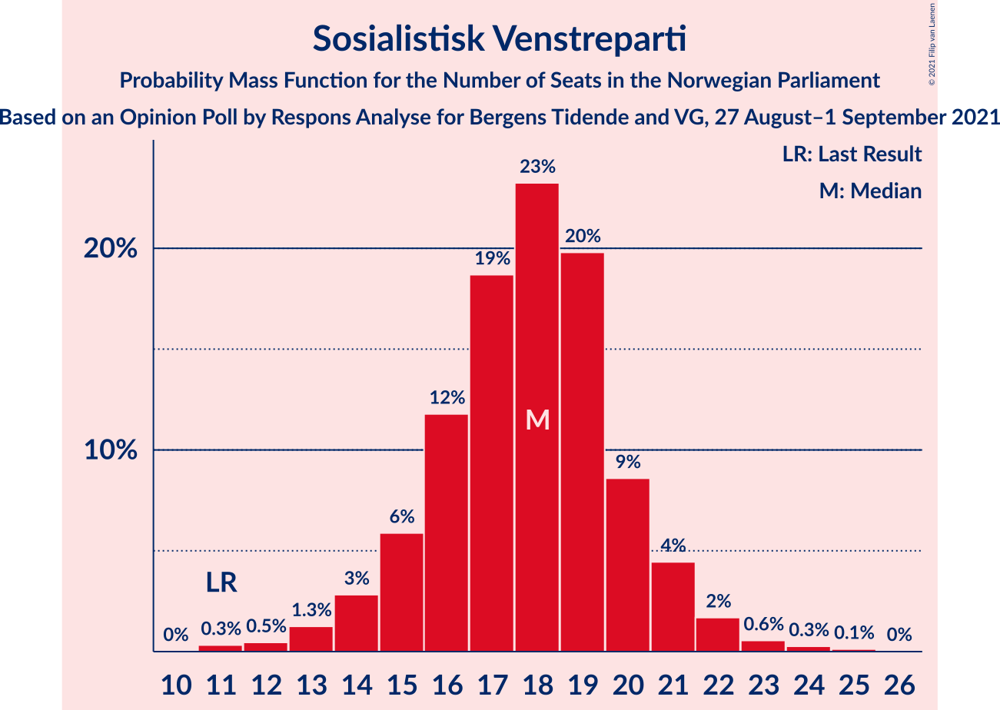
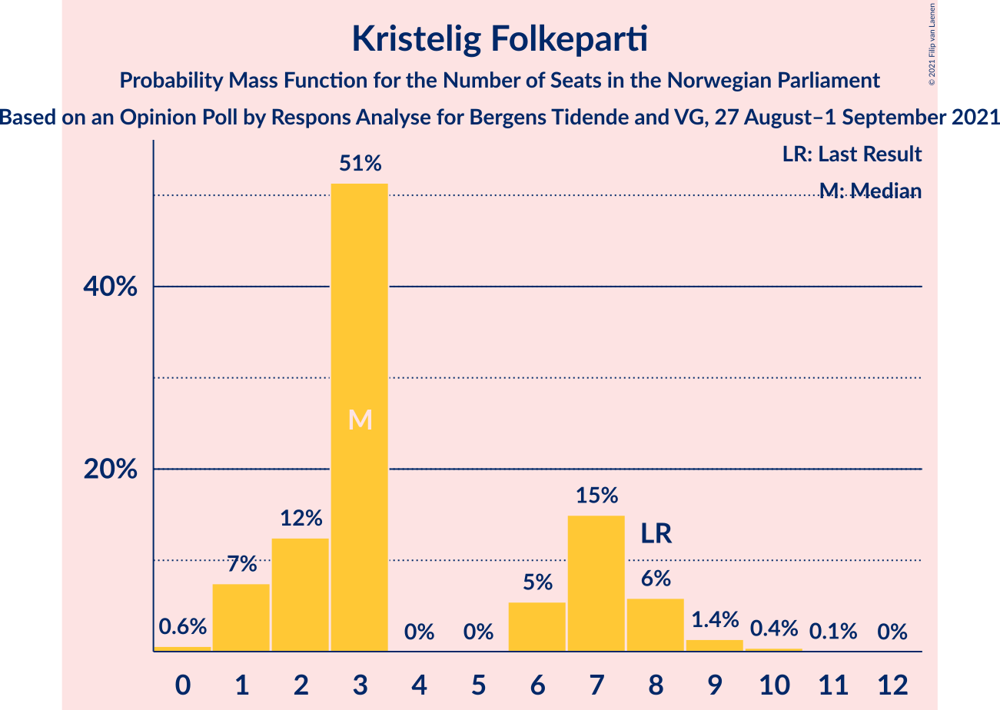
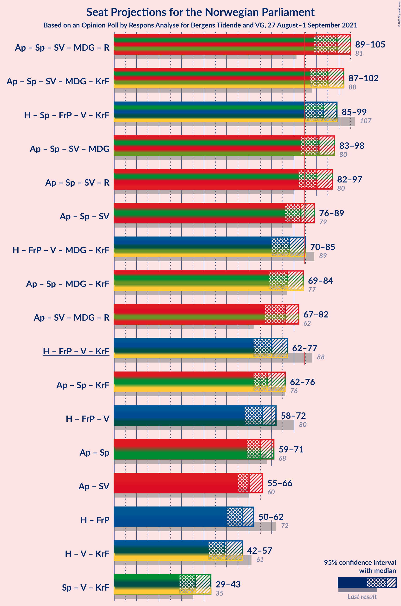
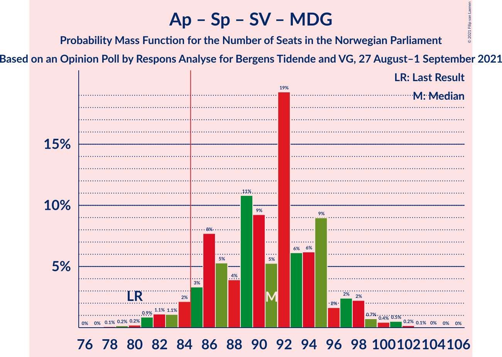
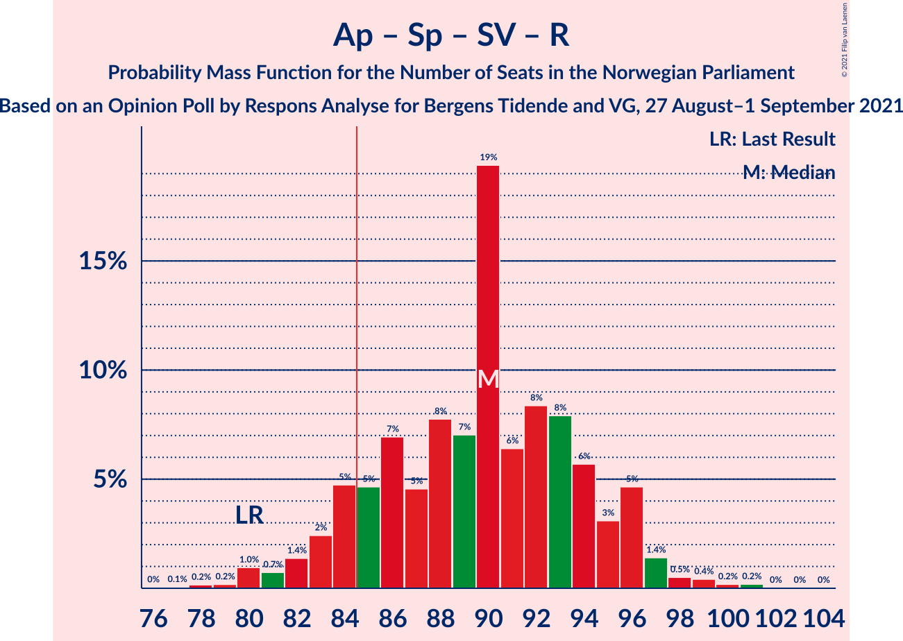
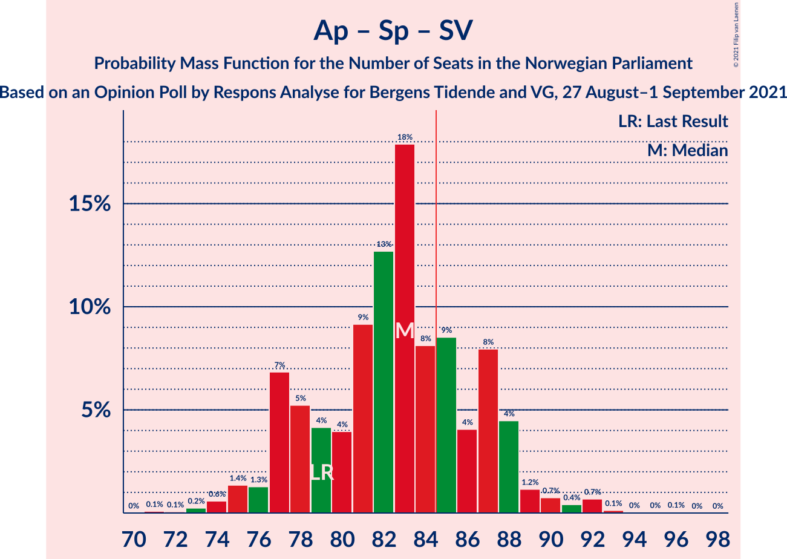
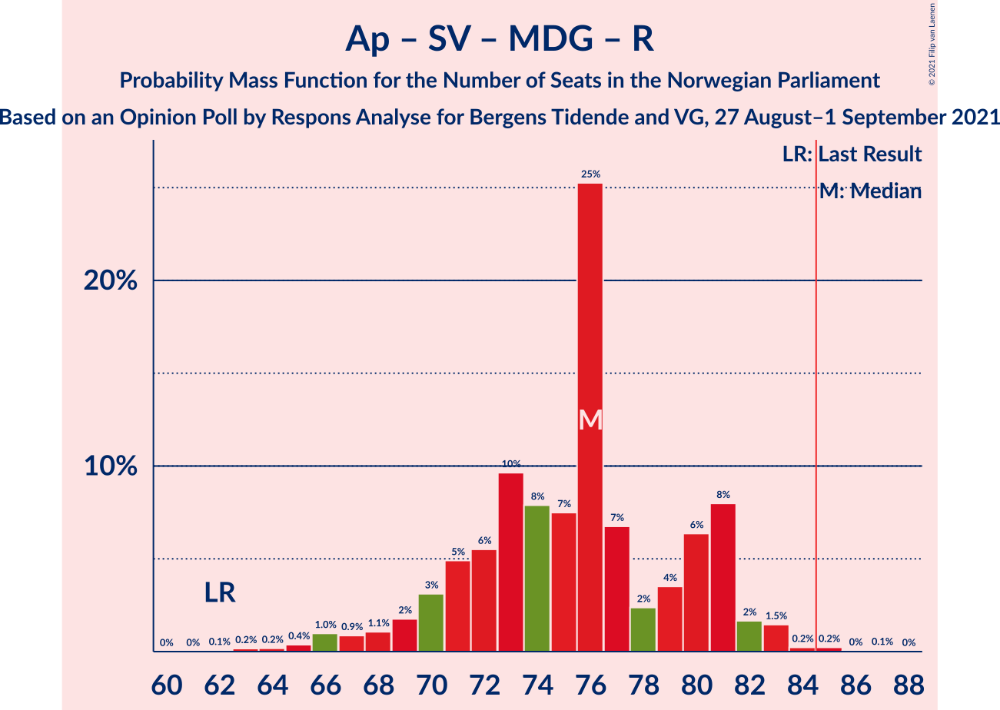

# Opinion Poll by Respons Analyse for Bergens Tidende and VG, 27 August–1 September 2021

<a href="#voting-intentions">Voting Intentions</a> | <a href="#seats">Seats</a> | <a href="#coalitions">Coalitions</a> | <a href="#technical-information">Technical Information</a>

## Voting Intentions

### Confidence Intervals

| Party | Last Result | Poll Result | 80% Confidence Interval | 90% Confidence Interval | 95% Confidence Interval | 99% Confidence Interval |
|:-----:|:-----------:|:-----------:|:-----------------------:|:-----------------------:|:-----------------------:|:-----------------------:|
| Arbeiderpartiet | 27.4% | 23.2% | 21.4–25.2% |20.9–25.8% |20.4–26.2% |19.6–27.2% |
| Høyre | 25.0% | 20.1% | 18.4–22.0% |17.9–22.6% |17.5–23.0% |16.7–24.0% |
| Senterpartiet | 10.3% | 12.6% | 11.2–14.2% |10.8–14.7% |10.5–15.1% |9.8–15.9% |
| Fremskrittspartiet | 15.2% | 11.5% | 10.2–13.0% |9.8–13.5% |9.5–13.9% |8.9–14.6% |
| Sosialistisk Venstreparti | 6.0% | 10.4% | 9.1–11.9% |8.7–12.3% |8.4–12.7% |7.9–13.4% |
| Venstre | 4.4% | 5.6% | 4.6–6.7% |4.4–7.1% |4.2–7.4% |3.8–8.0% |
| Miljøpartiet De Grønne | 3.2% | 4.9% | 4.1–6.1% |3.8–6.4% |3.6–6.7% |3.3–7.2% |
| Rødt | 2.4% | 4.6% | 3.7–5.7% |3.5–6.0% |3.3–6.2% |3.0–6.8% |
| Kristelig Folkeparti | 4.2% | 3.6% | 2.9–4.6% |2.7–4.8% |2.5–5.1% |2.2–5.6% |

*Note:* The poll result column reflects the actual value used in the calculations. Published results may vary slightly, and in addition be rounded to fewer digits.

## Seats

### Confidence Intervals

| Party | Last Result | Median | 80% Confidence Interval | 90% Confidence Interval | 95% Confidence Interval | 99% Confidence Interval |
|:-----:|:-----------:|:------:|:-----------------------:|:-----------------------:|:-----------------------:|:-----------------------:|
| <a href="#arbeiderpartiet">Arbeiderpartiet</a> | 49 | 42 | 40–44 |40–46 |39–47 |36–51 |
| <a href="#høyre">Høyre</a> | 45 | 36 | 33–39 |32–40 |31–41 |29–43 |
| <a href="#senterpartiet">Senterpartiet</a> | 19 | 22 | 20–26 |19–27 |18–27 |17–29 |
| <a href="#fremskrittspartiet">Fremskrittspartiet</a> | 27 | 20 | 18–23 |17–24 |16–25 |15–26 |
| <a href="#sosialistisk-venstreparti">Sosialistisk Venstreparti</a> | 11 | 18 | 15–20 |15–21 |14–22 |12–23 |
| <a href="#venstre">Venstre</a> | 8 | 10 | 8–11 |7–12 |7–12 |2–13 |
| <a href="#miljøpartiet-de-grønne">Miljøpartiet De Grønne</a> | 1 | 9 | 6–10 |2–11 |2–11 |2–13 |
| <a href="#rødt">Rødt</a> | 1 | 8 | 2–10 |2–10 |2–11 |2–12 |
| <a href="#kristelig-folkeparti">Kristelig Folkeparti</a> | 8 | 3 | 2–7 |1–8 |1–8 |0–9 |

### Arbeiderpartiet

*For a full overview of the results for this party, see the [Arbeiderpartiet](party-arbeiderpartiet.html) page.*

| Number of Seats | Probability | Accumulated | Special Marks |
|:---------------:|:-----------:|:-----------:|:-------------:|
| 34 | 0% | 100% |  |
| 35 | 0.2% | 99.9% |  |
| 36 | 0.4% | 99.8% |  |
| 37 | 0.7% | 99.4% |  |
| 38 | 0.8% | 98.7% |  |
| 39 | 3% | 98% |  |
| 40 | 8% | 95% |  |
| 41 | 12% | 87% |  |
| 42 | 35% | 75% | Median |
| 43 | 14% | 40% |  |
| 44 | 18% | 27% |  |
| 45 | 3% | 9% |  |
| 46 | 2% | 6% |  |
| 47 | 2% | 4% |  |
| 48 | 0.5% | 2% |  |
| 49 | 0.4% | 1.4% | Last Result |
| 50 | 0.2% | 1.0% |  |
| 51 | 0.7% | 0.8% |  |
| 52 | 0.1% | 0.2% |  |
| 53 | 0% | 0.1% |  |
| 54 | 0% | 0% |  |

### Høyre

*For a full overview of the results for this party, see the [Høyre](party-høyre.html) page.*

| Number of Seats | Probability | Accumulated | Special Marks |
|:---------------:|:-----------:|:-----------:|:-------------:|
| 28 | 0.3% | 100% |  |
| 29 | 0.5% | 99.6% |  |
| 30 | 1.2% | 99.1% |  |
| 31 | 1.5% | 98% |  |
| 32 | 4% | 96% |  |
| 33 | 4% | 93% |  |
| 34 | 4% | 89% |  |
| 35 | 16% | 85% |  |
| 36 | 37% | 69% | Median |
| 37 | 8% | 33% |  |
| 38 | 11% | 24% |  |
| 39 | 5% | 13% |  |
| 40 | 5% | 8% |  |
| 41 | 2% | 3% |  |
| 42 | 1.0% | 2% |  |
| 43 | 0.3% | 0.7% |  |
| 44 | 0.3% | 0.4% |  |
| 45 | 0.1% | 0.1% | Last Result |
| 46 | 0% | 0% |  |

### Senterpartiet

*For a full overview of the results for this party, see the [Senterpartiet](party-senterpartiet.html) page.*

| Number of Seats | Probability | Accumulated | Special Marks |
|:---------------:|:-----------:|:-----------:|:-------------:|
| 16 | 0.1% | 100% |  |
| 17 | 0.7% | 99.9% |  |
| 18 | 4% | 99.2% |  |
| 19 | 4% | 95% | Last Result |
| 20 | 17% | 91% |  |
| 21 | 14% | 74% |  |
| 22 | 12% | 60% | Median |
| 23 | 22% | 49% |  |
| 24 | 7% | 27% |  |
| 25 | 9% | 20% |  |
| 26 | 5% | 11% |  |
| 27 | 3% | 6% |  |
| 28 | 2% | 2% |  |
| 29 | 0.4% | 0.8% |  |
| 30 | 0.2% | 0.4% |  |
| 31 | 0.2% | 0.2% |  |
| 32 | 0% | 0% |  |

### Fremskrittspartiet

*For a full overview of the results for this party, see the [Fremskrittspartiet](party-fremskrittspartiet.html) page.*

| Number of Seats | Probability | Accumulated | Special Marks |
|:---------------:|:-----------:|:-----------:|:-------------:|
| 13 | 0.1% | 100% |  |
| 14 | 0.2% | 99.9% |  |
| 15 | 0.9% | 99.8% |  |
| 16 | 2% | 98.9% |  |
| 17 | 6% | 96% |  |
| 18 | 16% | 90% |  |
| 19 | 16% | 74% |  |
| 20 | 11% | 58% | Median |
| 21 | 29% | 47% |  |
| 22 | 6% | 19% |  |
| 23 | 5% | 13% |  |
| 24 | 4% | 7% |  |
| 25 | 1.4% | 3% |  |
| 26 | 0.7% | 1.1% |  |
| 27 | 0.3% | 0.5% | Last Result |
| 28 | 0.1% | 0.2% |  |
| 29 | 0% | 0% |  |

### Sosialistisk Venstreparti

*For a full overview of the results for this party, see the [Sosialistisk Venstreparti](party-sosialistiskvenstreparti.html) page.*

| Number of Seats | Probability | Accumulated | Special Marks |
|:---------------:|:-----------:|:-----------:|:-------------:|
| 11 | 0.3% | 100% | Last Result |
| 12 | 0.5% | 99.7% |  |
| 13 | 1.3% | 99.2% |  |
| 14 | 3% | 98% |  |
| 15 | 6% | 95% |  |
| 16 | 12% | 89% |  |
| 17 | 19% | 77% |  |
| 18 | 23% | 59% | Median |
| 19 | 20% | 36% |  |
| 20 | 9% | 16% |  |
| 21 | 4% | 7% |  |
| 22 | 2% | 3% |  |
| 23 | 0.6% | 1.0% |  |
| 24 | 0.3% | 0.4% |  |
| 25 | 0.1% | 0.2% |  |
| 26 | 0% | 0% |  |

### Venstre

*For a full overview of the results for this party, see the [Venstre](party-venstre.html) page.*

| Number of Seats | Probability | Accumulated | Special Marks |
|:---------------:|:-----------:|:-----------:|:-------------:|
| 2 | 1.4% | 100% |  |
| 3 | 0.1% | 98.6% |  |
| 4 | 0% | 98.5% |  |
| 5 | 0% | 98.5% |  |
| 6 | 0.5% | 98.5% |  |
| 7 | 5% | 98% |  |
| 8 | 15% | 93% | Last Result |
| 9 | 25% | 78% |  |
| 10 | 34% | 53% | Median |
| 11 | 10% | 19% |  |
| 12 | 7% | 9% |  |
| 13 | 2% | 2% |  |
| 14 | 0.4% | 0.5% |  |
| 15 | 0.1% | 0.1% |  |
| 16 | 0% | 0% |  |

### Miljøpartiet De Grønne

*For a full overview of the results for this party, see the [Miljøpartiet De Grønne](party-miljøpartietdegrønne.html) page.*

| Number of Seats | Probability | Accumulated | Special Marks |
|:---------------:|:-----------:|:-----------:|:-------------:|
| 1 | 0.2% | 100% | Last Result |
| 2 | 8% | 99.8% |  |
| 3 | 0.5% | 92% |  |
| 4 | 0% | 91% |  |
| 5 | 0% | 91% |  |
| 6 | 2% | 91% |  |
| 7 | 17% | 90% |  |
| 8 | 21% | 73% |  |
| 9 | 30% | 52% | Median |
| 10 | 13% | 22% |  |
| 11 | 6% | 8% |  |
| 12 | 2% | 2% |  |
| 13 | 0.4% | 0.5% |  |
| 14 | 0.1% | 0.1% |  |
| 15 | 0% | 0% |  |

### Rødt

*For a full overview of the results for this party, see the [Rødt](party-rødt.html) page.*

| Number of Seats | Probability | Accumulated | Special Marks |
|:---------------:|:-----------:|:-----------:|:-------------:|
| 1 | 0.4% | 100% | Last Result |
| 2 | 16% | 99.6% |  |
| 3 | 0% | 84% |  |
| 4 | 0% | 84% |  |
| 5 | 0.1% | 84% |  |
| 6 | 3% | 84% |  |
| 7 | 29% | 81% |  |
| 8 | 25% | 52% | Median |
| 9 | 15% | 27% |  |
| 10 | 9% | 12% |  |
| 11 | 3% | 3% |  |
| 12 | 0.5% | 0.6% |  |
| 13 | 0.1% | 0.1% |  |
| 14 | 0% | 0% |  |

### Kristelig Folkeparti

*For a full overview of the results for this party, see the [Kristelig Folkeparti](party-kristeligfolkeparti.html) page.*

| Number of Seats | Probability | Accumulated | Special Marks |
|:---------------:|:-----------:|:-----------:|:-------------:|
| 0 | 0.6% | 100% |  |
| 1 | 7% | 99.4% |  |
| 2 | 12% | 92% |  |
| 3 | 51% | 79% | Median |
| 4 | 0% | 28% |  |
| 5 | 0% | 28% |  |
| 6 | 5% | 28% |  |
| 7 | 15% | 23% |  |
| 8 | 6% | 8% | Last Result |
| 9 | 1.4% | 2% |  |
| 10 | 0.4% | 0.5% |  |
| 11 | 0.1% | 0.1% |  |
| 12 | 0% | 0% |  |

## Coalitions

### Confidence Intervals

| Coalition | Last Result | Median | Majority? | 80% Confidence Interval | 90% Confidence Interval | 95% Confidence Interval | 99% Confidence Interval |
|:---------:|:-----------:|:------:|:---------:|:-----------------------:|:-----------------------:|:-----------------------:|:-----------------------:|
| Arbeiderpartiet – Senterpartiet – Sosialistisk Venstreparti – Miljøpartiet De Grønne – Rødt | 81 | 99 | 99.9% | 93–103 | 91–104 | 89–105 | 87–108 |
| Arbeiderpartiet – Senterpartiet – Sosialistisk Venstreparti – Miljøpartiet De Grønne – Kristelig Folkeparti | 88 | 95 | 99.3% | 90–99 | 88–101 | 87–102 | 83–104 |
| Høyre – Senterpartiet – Fremskrittspartiet – Venstre – Kristelig Folkeparti | 107 | 93 | 98% | 87–96 | 86–98 | 85–99 | 82–102 |
| Arbeiderpartiet – Senterpartiet – Sosialistisk Venstreparti – Miljøpartiet De Grønne | 80 | 91 | 94% | 86–95 | 84–97 | 83–98 | 81–101 |
| Arbeiderpartiet – Senterpartiet – Sosialistisk Venstreparti – Rødt | 80 | 90 | 89% | 84–95 | 83–96 | 82–97 | 80–99 |
| Arbeiderpartiet – Senterpartiet – Sosialistisk Venstreparti | 79 | 83 | 28% | 77–87 | 77–88 | 76–89 | 74–92 |
| Høyre – Fremskrittspartiet – Venstre – Miljøpartiet De Grønne – Kristelig Folkeparti | 89 | 78 | 6% | 73–83 | 71–85 | 70–85 | 67–88 |
| Arbeiderpartiet – Senterpartiet – Miljøpartiet De Grønne – Kristelig Folkeparti | 77 | 77 | 2% | 73–81 | 71–83 | 69–84 | 67–87 |
| Arbeiderpartiet – Sosialistisk Venstreparti – Miljøpartiet De Grønne – Rødt | 62 | 76 | 0.4% | 71–81 | 69–81 | 67–82 | 65–84 |
| Høyre – Fremskrittspartiet – Venstre – Kristelig Folkeparti | 88 | 70 | 0% | 65–74 | 63–76 | 62–77 | 60–80 |
| Arbeiderpartiet – Senterpartiet – Kristelig Folkeparti | 76 | 68 | 0% | 65–73 | 63–74 | 62–76 | 60–78 |
| Høyre – Fremskrittspartiet – Venstre | 80 | 66 | 0% | 61–69 | 60–71 | 58–72 | 56–75 |
| Arbeiderpartiet – Senterpartiet | 68 | 65 | 0% | 61–69 | 60–70 | 59–71 | 58–74 |
| Arbeiderpartiet – Sosialistisk Venstreparti | 60 | 60 | 0% | 57–63 | 56–64 | 55–66 | 52–69 |
| Høyre – Fremskrittspartiet | 72 | 57 | 0% | 52–59 | 51–61 | 50–62 | 47–65 |
| Høyre – Venstre – Kristelig Folkeparti | 61 | 49 | 0% | 46–55 | 44–56 | 42–57 | 40–59 |
| Senterpartiet – Venstre – Kristelig Folkeparti | 35 | 36 | 0% | 32–40 | 30–41 | 29–43 | 28–45 |

### Arbeiderpartiet – Senterpartiet – Sosialistisk Venstreparti – Miljøpartiet De Grønne – Rødt

| Number of Seats | Probability | Accumulated | Special Marks |
|:---------------:|:-----------:|:-----------:|:-------------:|
| 81 | 0% | 100% | Last Result |
| 82 | 0% | 100% |  |
| 83 | 0% | 100% |  |
| 84 | 0% | 100% |  |
| 85 | 0.2% | 99.9% | Majority |
| 86 | 0.2% | 99.8% |  |
| 87 | 0.5% | 99.6% |  |
| 88 | 1.1% | 99.0% |  |
| 89 | 1.1% | 98% |  |
| 90 | 1.3% | 97% |  |
| 91 | 2% | 96% |  |
| 92 | 3% | 93% |  |
| 93 | 5% | 90% |  |
| 94 | 6% | 85% |  |
| 95 | 8% | 79% |  |
| 96 | 6% | 72% |  |
| 97 | 8% | 66% |  |
| 98 | 7% | 57% |  |
| 99 | 16% | 50% | Median |
| 100 | 11% | 35% |  |
| 101 | 7% | 23% |  |
| 102 | 3% | 16% |  |
| 103 | 8% | 13% |  |
| 104 | 2% | 5% |  |
| 105 | 1.1% | 3% |  |
| 106 | 0.6% | 2% |  |
| 107 | 1.0% | 2% |  |
| 108 | 0.3% | 0.6% |  |
| 109 | 0.2% | 0.3% |  |
| 110 | 0.1% | 0.1% |  |
| 111 | 0% | 0% |  |

### Arbeiderpartiet – Senterpartiet – Sosialistisk Venstreparti – Miljøpartiet De Grønne – Kristelig Folkeparti

| Number of Seats | Probability | Accumulated | Special Marks |
|:---------------:|:-----------:|:-----------:|:-------------:|
| 81 | 0% | 100% |  |
| 82 | 0.1% | 99.9% |  |
| 83 | 0.3% | 99.8% |  |
| 84 | 0.2% | 99.5% |  |
| 85 | 0.2% | 99.3% | Majority |
| 86 | 0.6% | 99.0% |  |
| 87 | 1.2% | 98% |  |
| 88 | 3% | 97% | Last Result |
| 89 | 3% | 94% |  |
| 90 | 4% | 92% |  |
| 91 | 4% | 87% |  |
| 92 | 10% | 84% |  |
| 93 | 14% | 74% |  |
| 94 | 6% | 60% | Median |
| 95 | 19% | 54% |  |
| 96 | 6% | 35% |  |
| 97 | 7% | 29% |  |
| 98 | 8% | 22% |  |
| 99 | 4% | 14% |  |
| 100 | 4% | 10% |  |
| 101 | 3% | 6% |  |
| 102 | 2% | 3% |  |
| 103 | 0.7% | 2% |  |
| 104 | 0.6% | 1.0% |  |
| 105 | 0.2% | 0.4% |  |
| 106 | 0.1% | 0.2% |  |
| 107 | 0.1% | 0.2% |  |
| 108 | 0% | 0.1% |  |
| 109 | 0% | 0% |  |

### Høyre – Senterpartiet – Fremskrittspartiet – Venstre – Kristelig Folkeparti

| Number of Seats | Probability | Accumulated | Special Marks |
|:---------------:|:-----------:|:-----------:|:-------------:|
| 79 | 0% | 100% |  |
| 80 | 0.1% | 99.9% |  |
| 81 | 0.2% | 99.9% |  |
| 82 | 0.3% | 99.7% |  |
| 83 | 0.3% | 99.4% |  |
| 84 | 0.9% | 99.1% |  |
| 85 | 1.0% | 98% | Majority |
| 86 | 2% | 97% |  |
| 87 | 5% | 95% |  |
| 88 | 11% | 90% |  |
| 89 | 9% | 79% |  |
| 90 | 6% | 69% |  |
| 91 | 3% | 63% | Median |
| 92 | 7% | 60% |  |
| 93 | 25% | 52% |  |
| 94 | 4% | 27% |  |
| 95 | 5% | 22% |  |
| 96 | 8% | 18% |  |
| 97 | 4% | 10% |  |
| 98 | 3% | 6% |  |
| 99 | 2% | 3% |  |
| 100 | 0.5% | 1.4% |  |
| 101 | 0.4% | 1.0% |  |
| 102 | 0.2% | 0.6% |  |
| 103 | 0.1% | 0.3% |  |
| 104 | 0.1% | 0.2% |  |
| 105 | 0% | 0.1% |  |
| 106 | 0% | 0.1% |  |
| 107 | 0% | 0% | Last Result |

### Arbeiderpartiet – Senterpartiet – Sosialistisk Venstreparti – Miljøpartiet De Grønne

| Number of Seats | Probability | Accumulated | Special Marks |
|:---------------:|:-----------:|:-----------:|:-------------:|
| 78 | 0.1% | 100% |  |
| 79 | 0.2% | 99.9% |  |
| 80 | 0.2% | 99.7% | Last Result |
| 81 | 0.9% | 99.5% |  |
| 82 | 1.1% | 98.7% |  |
| 83 | 1.1% | 98% |  |
| 84 | 2% | 96% |  |
| 85 | 3% | 94% | Majority |
| 86 | 8% | 91% |  |
| 87 | 5% | 83% |  |
| 88 | 4% | 78% |  |
| 89 | 11% | 74% |  |
| 90 | 9% | 63% |  |
| 91 | 5% | 54% | Median |
| 92 | 19% | 49% |  |
| 93 | 6% | 30% |  |
| 94 | 6% | 23% |  |
| 95 | 9% | 17% |  |
| 96 | 2% | 8% |  |
| 97 | 2% | 7% |  |
| 98 | 2% | 4% |  |
| 99 | 0.7% | 2% |  |
| 100 | 0.4% | 1.2% |  |
| 101 | 0.5% | 0.8% |  |
| 102 | 0.2% | 0.3% |  |
| 103 | 0.1% | 0.1% |  |
| 104 | 0% | 0.1% |  |
| 105 | 0% | 0% |  |

### Arbeiderpartiet – Senterpartiet – Sosialistisk Venstreparti – Rødt

| Number of Seats | Probability | Accumulated | Special Marks |
|:---------------:|:-----------:|:-----------:|:-------------:|
| 76 | 0% | 100% |  |
| 77 | 0.1% | 99.9% |  |
| 78 | 0.2% | 99.9% |  |
| 79 | 0.2% | 99.7% |  |
| 80 | 1.0% | 99.5% | Last Result |
| 81 | 0.7% | 98.6% |  |
| 82 | 1.4% | 98% |  |
| 83 | 2% | 96% |  |
| 84 | 5% | 94% |  |
| 85 | 5% | 89% | Majority |
| 86 | 7% | 85% |  |
| 87 | 5% | 78% |  |
| 88 | 8% | 73% |  |
| 89 | 7% | 65% |  |
| 90 | 19% | 58% | Median |
| 91 | 6% | 39% |  |
| 92 | 8% | 33% |  |
| 93 | 8% | 24% |  |
| 94 | 6% | 16% |  |
| 95 | 3% | 11% |  |
| 96 | 5% | 7% |  |
| 97 | 1.4% | 3% |  |
| 98 | 0.5% | 1.4% |  |
| 99 | 0.4% | 0.9% |  |
| 100 | 0.2% | 0.5% |  |
| 101 | 0.2% | 0.3% |  |
| 102 | 0% | 0.1% |  |
| 103 | 0% | 0.1% |  |
| 104 | 0% | 0% |  |

### Arbeiderpartiet – Senterpartiet – Sosialistisk Venstreparti

| Number of Seats | Probability | Accumulated | Special Marks |
|:---------------:|:-----------:|:-----------:|:-------------:|
| 71 | 0.1% | 100% |  |
| 72 | 0.1% | 99.9% |  |
| 73 | 0.2% | 99.8% |  |
| 74 | 0.6% | 99.6% |  |
| 75 | 1.4% | 99.0% |  |
| 76 | 1.3% | 98% |  |
| 77 | 7% | 96% |  |
| 78 | 5% | 90% |  |
| 79 | 4% | 84% | Last Result |
| 80 | 4% | 80% |  |
| 81 | 9% | 76% |  |
| 82 | 13% | 67% | Median |
| 83 | 18% | 54% |  |
| 84 | 8% | 36% |  |
| 85 | 9% | 28% | Majority |
| 86 | 4% | 20% |  |
| 87 | 8% | 16% |  |
| 88 | 4% | 8% |  |
| 89 | 1.2% | 3% |  |
| 90 | 0.7% | 2% |  |
| 91 | 0.4% | 1.4% |  |
| 92 | 0.7% | 1.0% |  |
| 93 | 0.1% | 0.3% |  |
| 94 | 0% | 0.1% |  |
| 95 | 0% | 0.1% |  |
| 96 | 0.1% | 0.1% |  |
| 97 | 0% | 0% |  |

### Høyre – Fremskrittspartiet – Venstre – Miljøpartiet De Grønne – Kristelig Folkeparti

| Number of Seats | Probability | Accumulated | Special Marks |
|:---------------:|:-----------:|:-----------:|:-------------:|
| 64 | 0.1% | 100% |  |
| 65 | 0.2% | 99.9% |  |
| 66 | 0.1% | 99.7% |  |
| 67 | 0.2% | 99.6% |  |
| 68 | 0.5% | 99.4% |  |
| 69 | 1.0% | 98.9% |  |
| 70 | 0.8% | 98% |  |
| 71 | 3% | 97% |  |
| 72 | 3% | 95% |  |
| 73 | 6% | 91% |  |
| 74 | 5% | 85% |  |
| 75 | 8% | 80% |  |
| 76 | 10% | 72% |  |
| 77 | 10% | 62% |  |
| 78 | 7% | 53% | Median |
| 79 | 19% | 46% |  |
| 80 | 6% | 26% |  |
| 81 | 5% | 20% |  |
| 82 | 3% | 15% |  |
| 83 | 5% | 12% |  |
| 84 | 2% | 7% |  |
| 85 | 3% | 6% | Majority |
| 86 | 1.1% | 2% |  |
| 87 | 0.8% | 1.4% |  |
| 88 | 0.3% | 0.6% |  |
| 89 | 0.2% | 0.3% | Last Result |
| 90 | 0.1% | 0.1% |  |
| 91 | 0% | 0.1% |  |
| 92 | 0% | 0% |  |

### Arbeiderpartiet – Senterpartiet – Miljøpartiet De Grønne – Kristelig Folkeparti

| Number of Seats | Probability | Accumulated | Special Marks |
|:---------------:|:-----------:|:-----------:|:-------------:|
| 64 | 0% | 100% |  |
| 65 | 0.2% | 99.9% |  |
| 66 | 0.2% | 99.8% |  |
| 67 | 0.3% | 99.6% |  |
| 68 | 0.7% | 99.3% |  |
| 69 | 2% | 98.6% |  |
| 70 | 1.4% | 97% |  |
| 71 | 2% | 96% |  |
| 72 | 3% | 94% |  |
| 73 | 8% | 91% |  |
| 74 | 8% | 83% |  |
| 75 | 4% | 74% |  |
| 76 | 14% | 70% | Median |
| 77 | 18% | 57% | Last Result |
| 78 | 8% | 39% |  |
| 79 | 14% | 31% |  |
| 80 | 4% | 17% |  |
| 81 | 4% | 13% |  |
| 82 | 2% | 8% |  |
| 83 | 2% | 6% |  |
| 84 | 2% | 4% |  |
| 85 | 1.0% | 2% | Majority |
| 86 | 0.6% | 1.2% |  |
| 87 | 0.3% | 0.6% |  |
| 88 | 0.2% | 0.3% |  |
| 89 | 0.1% | 0.1% |  |
| 90 | 0% | 0% |  |

### Arbeiderpartiet – Sosialistisk Venstreparti – Miljøpartiet De Grønne – Rødt

| Number of Seats | Probability | Accumulated | Special Marks |
|:---------------:|:-----------:|:-----------:|:-------------:|
| 62 | 0.1% | 100% | Last Result |
| 63 | 0.2% | 99.9% |  |
| 64 | 0.2% | 99.7% |  |
| 65 | 0.4% | 99.6% |  |
| 66 | 1.0% | 99.2% |  |
| 67 | 0.9% | 98% |  |
| 68 | 1.1% | 97% |  |
| 69 | 2% | 96% |  |
| 70 | 3% | 95% |  |
| 71 | 5% | 91% |  |
| 72 | 6% | 86% |  |
| 73 | 10% | 81% |  |
| 74 | 8% | 71% |  |
| 75 | 7% | 63% |  |
| 76 | 25% | 56% |  |
| 77 | 7% | 31% | Median |
| 78 | 2% | 24% |  |
| 79 | 4% | 22% |  |
| 80 | 6% | 18% |  |
| 81 | 8% | 12% |  |
| 82 | 2% | 4% |  |
| 83 | 1.5% | 2% |  |
| 84 | 0.2% | 0.6% |  |
| 85 | 0.2% | 0.4% | Majority |
| 86 | 0% | 0.2% |  |
| 87 | 0.1% | 0.1% |  |
| 88 | 0% | 0% |  |

### Høyre – Fremskrittspartiet – Venstre – Kristelig Folkeparti

| Number of Seats | Probability | Accumulated | Special Marks |
|:---------------:|:-----------:|:-----------:|:-------------:|
| 56 | 0.1% | 100% |  |
| 57 | 0.2% | 99.9% |  |
| 58 | 0.1% | 99.7% |  |
| 59 | 0.2% | 99.7% |  |
| 60 | 0.4% | 99.5% |  |
| 61 | 0.8% | 99.1% |  |
| 62 | 2% | 98% |  |
| 63 | 2% | 97% |  |
| 64 | 2% | 94% |  |
| 65 | 3% | 92% |  |
| 66 | 10% | 89% |  |
| 67 | 5% | 79% |  |
| 68 | 9% | 74% |  |
| 69 | 14% | 65% | Median |
| 70 | 16% | 51% |  |
| 71 | 7% | 35% |  |
| 72 | 8% | 28% |  |
| 73 | 4% | 19% |  |
| 74 | 6% | 15% |  |
| 75 | 3% | 9% |  |
| 76 | 3% | 6% |  |
| 77 | 2% | 4% |  |
| 78 | 1.1% | 2% |  |
| 79 | 0.4% | 0.9% |  |
| 80 | 0.3% | 0.5% |  |
| 81 | 0.1% | 0.3% |  |
| 82 | 0.1% | 0.2% |  |
| 83 | 0.1% | 0.1% |  |
| 84 | 0% | 0% |  |
| 85 | 0% | 0% | Majority |
| 86 | 0% | 0% |  |
| 87 | 0% | 0% |  |
| 88 | 0% | 0% | Last Result |

### Arbeiderpartiet – Senterpartiet – Kristelig Folkeparti

| Number of Seats | Probability | Accumulated | Special Marks |
|:---------------:|:-----------:|:-----------:|:-------------:|
| 58 | 0% | 100% |  |
| 59 | 0.1% | 99.9% |  |
| 60 | 0.4% | 99.8% |  |
| 61 | 0.8% | 99.5% |  |
| 62 | 3% | 98.6% |  |
| 63 | 1.2% | 96% |  |
| 64 | 3% | 95% |  |
| 65 | 6% | 92% |  |
| 66 | 10% | 86% |  |
| 67 | 8% | 76% | Median |
| 68 | 22% | 68% |  |
| 69 | 10% | 45% |  |
| 70 | 7% | 35% |  |
| 71 | 9% | 28% |  |
| 72 | 7% | 19% |  |
| 73 | 3% | 11% |  |
| 74 | 3% | 8% |  |
| 75 | 2% | 4% |  |
| 76 | 0.9% | 3% | Last Result |
| 77 | 0.8% | 2% |  |
| 78 | 0.5% | 0.9% |  |
| 79 | 0.2% | 0.4% |  |
| 80 | 0.1% | 0.2% |  |
| 81 | 0.1% | 0.1% |  |
| 82 | 0% | 0% |  |

### Høyre – Fremskrittspartiet – Venstre

| Number of Seats | Probability | Accumulated | Special Marks |
|:---------------:|:-----------:|:-----------:|:-------------:|
| 53 | 0.1% | 100% |  |
| 54 | 0.2% | 99.9% |  |
| 55 | 0.1% | 99.7% |  |
| 56 | 0.3% | 99.7% |  |
| 57 | 1.0% | 99.4% |  |
| 58 | 1.2% | 98% |  |
| 59 | 1.0% | 97% |  |
| 60 | 3% | 96% |  |
| 61 | 3% | 93% |  |
| 62 | 5% | 90% |  |
| 63 | 11% | 85% |  |
| 64 | 7% | 74% |  |
| 65 | 7% | 66% |  |
| 66 | 13% | 59% | Median |
| 67 | 20% | 46% |  |
| 68 | 7% | 26% |  |
| 69 | 9% | 19% |  |
| 70 | 4% | 9% |  |
| 71 | 3% | 6% |  |
| 72 | 1.2% | 3% |  |
| 73 | 0.6% | 2% |  |
| 74 | 0.5% | 1.0% |  |
| 75 | 0.1% | 0.5% |  |
| 76 | 0.3% | 0.4% |  |
| 77 | 0.1% | 0.1% |  |
| 78 | 0% | 0% |  |
| 79 | 0% | 0% |  |
| 80 | 0% | 0% | Last Result |

### Arbeiderpartiet – Senterpartiet

| Number of Seats | Probability | Accumulated | Special Marks |
|:---------------:|:-----------:|:-----------:|:-------------:|
| 55 | 0% | 100% |  |
| 56 | 0.1% | 99.9% |  |
| 57 | 0.3% | 99.8% |  |
| 58 | 0.7% | 99.5% |  |
| 59 | 2% | 98.8% |  |
| 60 | 7% | 97% |  |
| 61 | 4% | 90% |  |
| 62 | 9% | 86% |  |
| 63 | 11% | 76% |  |
| 64 | 8% | 65% | Median |
| 65 | 21% | 58% |  |
| 66 | 9% | 36% |  |
| 67 | 7% | 27% |  |
| 68 | 7% | 20% | Last Result |
| 69 | 6% | 13% |  |
| 70 | 3% | 6% |  |
| 71 | 0.9% | 3% |  |
| 72 | 1.2% | 2% |  |
| 73 | 0.6% | 1.3% |  |
| 74 | 0.3% | 0.7% |  |
| 75 | 0.3% | 0.4% |  |
| 76 | 0.1% | 0.1% |  |
| 77 | 0% | 0% |  |

### Arbeiderpartiet – Sosialistisk Venstreparti

| Number of Seats | Probability | Accumulated | Special Marks |
|:---------------:|:-----------:|:-----------:|:-------------:|
| 50 | 0% | 100% |  |
| 51 | 0.1% | 99.9% |  |
| 52 | 0.4% | 99.8% |  |
| 53 | 0.4% | 99.4% |  |
| 54 | 0.7% | 99.0% |  |
| 55 | 2% | 98% |  |
| 56 | 3% | 97% |  |
| 57 | 9% | 93% |  |
| 58 | 8% | 85% |  |
| 59 | 12% | 76% |  |
| 60 | 20% | 64% | Last Result, Median |
| 61 | 14% | 44% |  |
| 62 | 10% | 30% |  |
| 63 | 11% | 20% |  |
| 64 | 4% | 9% |  |
| 65 | 1.5% | 4% |  |
| 66 | 1.3% | 3% |  |
| 67 | 0.5% | 2% |  |
| 68 | 0.4% | 1.0% |  |
| 69 | 0.3% | 0.6% |  |
| 70 | 0.2% | 0.3% |  |
| 71 | 0.1% | 0.1% |  |
| 72 | 0% | 0% |  |

### Høyre – Fremskrittspartiet

| Number of Seats | Probability | Accumulated | Special Marks |
|:---------------:|:-----------:|:-----------:|:-------------:|
| 46 | 0.2% | 100% |  |
| 47 | 0.3% | 99.8% |  |
| 48 | 0.5% | 99.5% |  |
| 49 | 1.2% | 99.0% |  |
| 50 | 2% | 98% |  |
| 51 | 2% | 96% |  |
| 52 | 4% | 94% |  |
| 53 | 5% | 89% |  |
| 54 | 12% | 84% |  |
| 55 | 8% | 72% |  |
| 56 | 13% | 63% | Median |
| 57 | 21% | 51% |  |
| 58 | 8% | 30% |  |
| 59 | 12% | 21% |  |
| 60 | 3% | 10% |  |
| 61 | 2% | 7% |  |
| 62 | 2% | 5% |  |
| 63 | 1.1% | 2% |  |
| 64 | 0.5% | 1.1% |  |
| 65 | 0.3% | 0.5% |  |
| 66 | 0.1% | 0.2% |  |
| 67 | 0% | 0.1% |  |
| 68 | 0% | 0% |  |
| 69 | 0% | 0% |  |
| 70 | 0% | 0% |  |
| 71 | 0% | 0% |  |
| 72 | 0% | 0% | Last Result |

### Høyre – Venstre – Kristelig Folkeparti

| Number of Seats | Probability | Accumulated | Special Marks |
|:---------------:|:-----------:|:-----------:|:-------------:|
| 37 | 0% | 100% |  |
| 38 | 0.1% | 99.9% |  |
| 39 | 0.2% | 99.8% |  |
| 40 | 0.8% | 99.6% |  |
| 41 | 0.9% | 98.9% |  |
| 42 | 1.0% | 98% |  |
| 43 | 0.4% | 97% |  |
| 44 | 3% | 97% |  |
| 45 | 4% | 94% |  |
| 46 | 7% | 90% |  |
| 47 | 6% | 84% |  |
| 48 | 16% | 78% |  |
| 49 | 18% | 61% | Median |
| 50 | 11% | 43% |  |
| 51 | 11% | 32% |  |
| 52 | 5% | 22% |  |
| 53 | 4% | 17% |  |
| 54 | 2% | 12% |  |
| 55 | 3% | 10% |  |
| 56 | 3% | 7% |  |
| 57 | 3% | 4% |  |
| 58 | 0.9% | 2% |  |
| 59 | 0.3% | 0.6% |  |
| 60 | 0.2% | 0.3% |  |
| 61 | 0% | 0.1% | Last Result |
| 62 | 0.1% | 0.1% |  |
| 63 | 0% | 0% |  |

### Senterpartiet – Venstre – Kristelig Folkeparti

| Number of Seats | Probability | Accumulated | Special Marks |
|:---------------:|:-----------:|:-----------:|:-------------:|
| 25 | 0% | 100% |  |
| 26 | 0.1% | 99.9% |  |
| 27 | 0.2% | 99.8% |  |
| 28 | 1.4% | 99.5% |  |
| 29 | 2% | 98% |  |
| 30 | 2% | 97% |  |
| 31 | 4% | 95% |  |
| 32 | 4% | 91% |  |
| 33 | 7% | 86% |  |
| 34 | 15% | 79% |  |
| 35 | 9% | 64% | Last Result, Median |
| 36 | 18% | 55% |  |
| 37 | 13% | 36% |  |
| 38 | 6% | 23% |  |
| 39 | 6% | 17% |  |
| 40 | 4% | 11% |  |
| 41 | 3% | 7% |  |
| 42 | 1.2% | 4% |  |
| 43 | 2% | 3% |  |
| 44 | 0.5% | 1.3% |  |
| 45 | 0.3% | 0.7% |  |
| 46 | 0.4% | 0.5% |  |
| 47 | 0.1% | 0.1% |  |
| 48 | 0% | 0% |  |

## Technical Information

### Opinion Poll

+ **Polling firm:** Respons Analyse
+ **Commissioner(s):** Bergens Tidende and VG
+ **Fieldwork period:** 27 August–1 September 2021

### Calculations

+ **Sample size:** 810
+ **Simulations done:** 1,048,576
+ **Error estimate:** 1.23%

