# Opinion Poll by Kantar TNS for TV2, 27 August–2 September 2021

<a href="#voting-intentions">Voting Intentions</a> | <a href="#seats">Seats</a> | <a href="#coalitions">Coalitions</a> | <a href="#technical-information">Technical Information</a>

## Voting Intentions

### Confidence Intervals

| Party | Last Result | Poll Result | 80% Confidence Interval | 90% Confidence Interval | 95% Confidence Interval | 99% Confidence Interval |
|:-----:|:-----------:|:-----------:|:-----------------------:|:-----------------------:|:-----------------------:|:-----------------------:|
| Arbeiderpartiet | 27.4% | 23.2% | 21.9–24.7% |21.5–25.1% |21.2–25.5% |20.5–26.2% |
| Høyre | 25.0% | 21.2% | 19.9–22.6% |19.5–23.0% |19.2–23.4% |18.6–24.1% |
| Senterpartiet | 10.3% | 12.4% | 11.4–13.6% |11.1–13.9% |10.8–14.2% |10.4–14.8% |
| Sosialistisk Venstreparti | 6.0% | 9.5% | 8.6–10.6% |8.4–10.9% |8.1–11.1% |7.7–11.7% |
| Fremskrittspartiet | 15.2% | 9.0% | 8.1–10.0% |7.8–10.3% |7.6–10.6% |7.2–11.1% |
| Rødt | 2.4% | 5.1% | 4.5–6.0% |4.3–6.2% |4.1–6.4% |3.8–6.8% |
| Miljøpartiet De Grønne | 3.2% | 5.0% | 4.3–5.8% |4.1–6.0% |4.0–6.2% |3.7–6.6% |
| Venstre | 4.4% | 4.8% | 4.1–5.6% |4.0–5.8% |3.8–6.0% |3.5–6.4% |
| Kristelig Folkeparti | 4.2% | 4.3% | 3.7–5.1% |3.5–5.3% |3.4–5.5% |3.1–5.9% |

*Note:* The poll result column reflects the actual value used in the calculations. Published results may vary slightly, and in addition be rounded to fewer digits.

## Seats

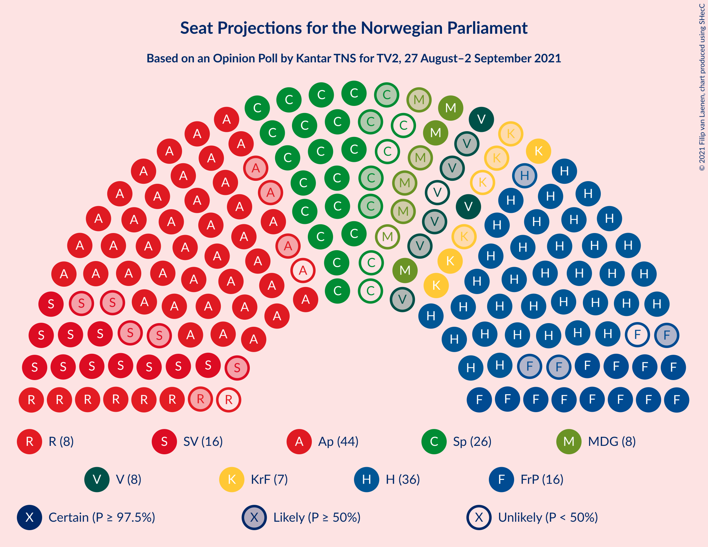

### Confidence Intervals

| Party | Last Result | Median | 80% Confidence Interval | 90% Confidence Interval | 95% Confidence Interval | 99% Confidence Interval |
|:-----:|:-----------:|:------:|:-----------------------:|:-----------------------:|:-----------------------:|:-----------------------:|
| <a href="#arbeiderpartiet">Arbeiderpartiet</a> | 49 | 43 | 40–46 |40–46 |40–47 |40–50 |
| <a href="#høyre">Høyre</a> | 45 | 37 | 36–41 |35–42 |35–44 |34–44 |
| <a href="#senterpartiet">Senterpartiet</a> | 19 | 23 | 19–26 |18–26 |18–26 |18–29 |
| <a href="#sosialistisk-venstreparti">Sosialistisk Venstreparti</a> | 11 | 16 | 13–17 |12–17 |12–18 |11–19 |
| <a href="#fremskrittspartiet">Fremskrittspartiet</a> | 27 | 15 | 14–17 |12–18 |11–18 |11–19 |
| <a href="#rødt">Rødt</a> | 1 | 7 | 6–9 |6–9 |6–9 |2–10 |
| <a href="#miljøpartiet-de-grønne">Miljøpartiet De Grønne</a> | 1 | 7 | 6–9 |5–10 |2–10 |2–10 |
| <a href="#venstre">Venstre</a> | 8 | 7 | 6–8 |6–9 |2–9 |2–9 |
| <a href="#kristelig-folkeparti">Kristelig Folkeparti</a> | 8 | 6 | 3–8 |3–8 |3–8 |2–9 |

### Arbeiderpartiet

*For a full overview of the results for this party, see the [Arbeiderpartiet](party-arbeiderpartiet.html) page.*

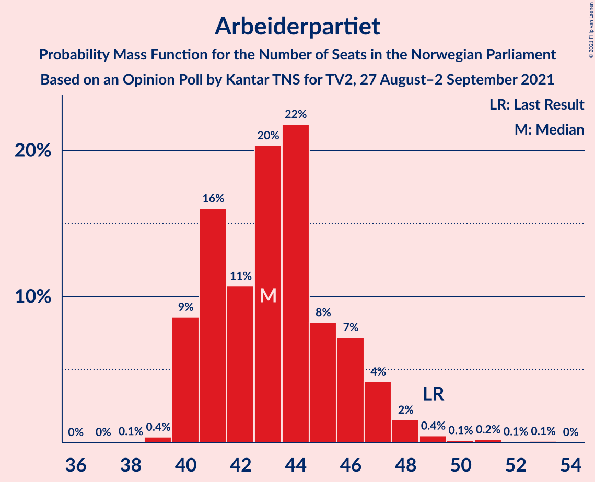

| Number of Seats | Probability | Accumulated | Special Marks |
|:---------------:|:-----------:|:-----------:|:-------------:|
| 39 | 0.2% | 100% |  |
| 40 | 23% | 99.8% |  |
| 41 | 10% | 76% |  |
| 42 | 6% | 66% |  |
| 43 | 22% | 60% | Median |
| 44 | 9% | 38% |  |
| 45 | 17% | 29% |  |
| 46 | 7% | 12% |  |
| 47 | 3% | 5% |  |
| 48 | 0.4% | 2% |  |
| 49 | 0.5% | 1.5% | Last Result |
| 50 | 0.5% | 1.0% |  |
| 51 | 0% | 0.5% |  |
| 52 | 0% | 0.5% |  |
| 53 | 0.4% | 0.5% |  |
| 54 | 0% | 0% |  |

### Høyre

*For a full overview of the results for this party, see the [Høyre](party-høyre.html) page.*

| Number of Seats | Probability | Accumulated | Special Marks |
|:---------------:|:-----------:|:-----------:|:-------------:|
| 32 | 0.1% | 100% |  |
| 33 | 0.1% | 99.8% |  |
| 34 | 0.6% | 99.8% |  |
| 35 | 8% | 99.2% |  |
| 36 | 38% | 91% |  |
| 37 | 14% | 53% | Median |
| 38 | 3% | 39% |  |
| 39 | 22% | 36% |  |
| 40 | 3% | 13% |  |
| 41 | 2% | 11% |  |
| 42 | 4% | 8% |  |
| 43 | 0.7% | 4% |  |
| 44 | 3% | 3% |  |
| 45 | 0.1% | 0.4% | Last Result |
| 46 | 0.1% | 0.3% |  |
| 47 | 0.2% | 0.2% |  |
| 48 | 0.1% | 0.1% |  |
| 49 | 0% | 0% |  |

### Senterpartiet

*For a full overview of the results for this party, see the [Senterpartiet](party-senterpartiet.html) page.*

| Number of Seats | Probability | Accumulated | Special Marks |
|:---------------:|:-----------:|:-----------:|:-------------:|
| 18 | 6% | 100% |  |
| 19 | 6% | 94% | Last Result |
| 20 | 10% | 88% |  |
| 21 | 9% | 78% |  |
| 22 | 13% | 69% |  |
| 23 | 10% | 57% | Median |
| 24 | 13% | 47% |  |
| 25 | 21% | 34% |  |
| 26 | 11% | 13% |  |
| 27 | 1.3% | 2% |  |
| 28 | 0.4% | 1.2% |  |
| 29 | 0.4% | 0.8% |  |
| 30 | 0.1% | 0.4% |  |
| 31 | 0.3% | 0.3% |  |
| 32 | 0% | 0% |  |

### Sosialistisk Venstreparti

*For a full overview of the results for this party, see the [Sosialistisk Venstreparti](party-sosialistiskvenstreparti.html) page.*

| Number of Seats | Probability | Accumulated | Special Marks |
|:---------------:|:-----------:|:-----------:|:-------------:|
| 10 | 0.1% | 100% |  |
| 11 | 2% | 99.9% | Last Result |
| 12 | 5% | 98% |  |
| 13 | 4% | 93% |  |
| 14 | 13% | 90% |  |
| 15 | 18% | 76% |  |
| 16 | 29% | 58% | Median |
| 17 | 24% | 29% |  |
| 18 | 3% | 5% |  |
| 19 | 2% | 2% |  |
| 20 | 0.3% | 0.3% |  |
| 21 | 0% | 0% |  |

### Fremskrittspartiet

*For a full overview of the results for this party, see the [Fremskrittspartiet](party-fremskrittspartiet.html) page.*

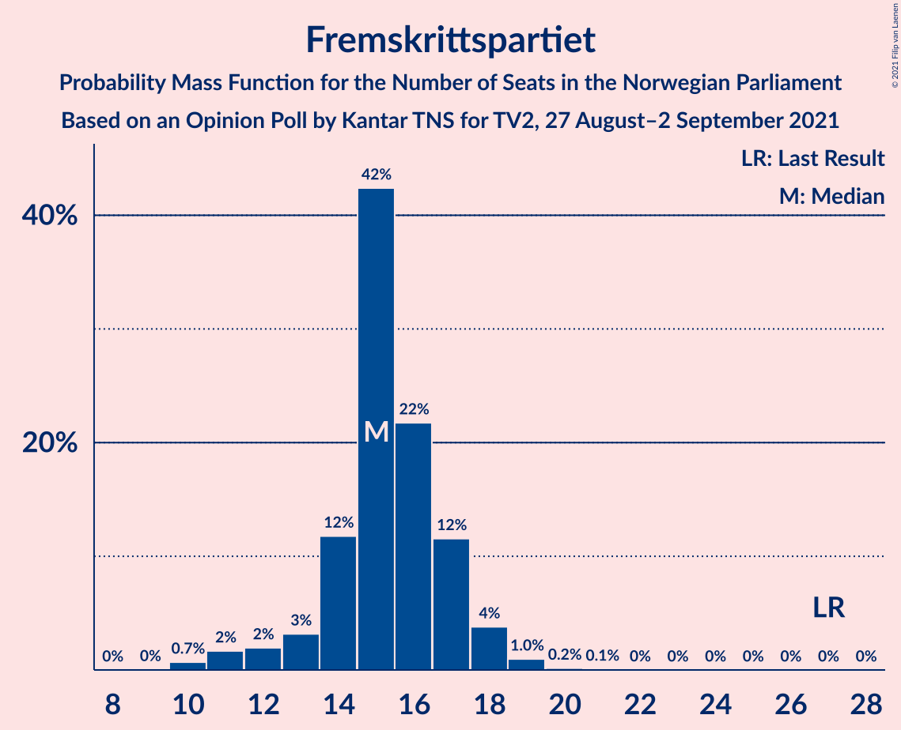

| Number of Seats | Probability | Accumulated | Special Marks |
|:---------------:|:-----------:|:-----------:|:-------------:|
| 10 | 0.4% | 100% |  |
| 11 | 4% | 99.6% |  |
| 12 | 3% | 95% |  |
| 13 | 1.0% | 92% |  |
| 14 | 7% | 91% |  |
| 15 | 50% | 85% | Median |
| 16 | 15% | 34% |  |
| 17 | 12% | 19% |  |
| 18 | 5% | 7% |  |
| 19 | 2% | 2% |  |
| 20 | 0.1% | 0.3% |  |
| 21 | 0.2% | 0.2% |  |
| 22 | 0% | 0% |  |
| 23 | 0% | 0% |  |
| 24 | 0% | 0% |  |
| 25 | 0% | 0% |  |
| 26 | 0% | 0% |  |
| 27 | 0% | 0% | Last Result |

### Rødt

*For a full overview of the results for this party, see the [Rødt](party-rødt.html) page.*

| Number of Seats | Probability | Accumulated | Special Marks |
|:---------------:|:-----------:|:-----------:|:-------------:|
| 1 | 0% | 100% | Last Result |
| 2 | 2% | 100% |  |
| 3 | 0% | 98% |  |
| 4 | 0% | 98% |  |
| 5 | 0.3% | 98% |  |
| 6 | 39% | 98% |  |
| 7 | 30% | 58% | Median |
| 8 | 17% | 29% |  |
| 9 | 10% | 12% |  |
| 10 | 2% | 2% |  |
| 11 | 0.4% | 0.4% |  |
| 12 | 0.1% | 0.1% |  |
| 13 | 0% | 0% |  |

### Miljøpartiet De Grønne

*For a full overview of the results for this party, see the [Miljøpartiet De Grønne](party-miljøpartietdegrønne.html) page.*

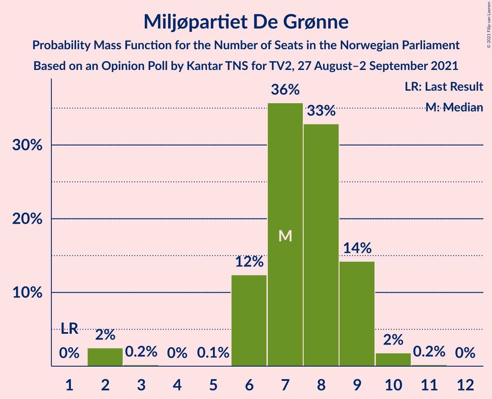

| Number of Seats | Probability | Accumulated | Special Marks |
|:---------------:|:-----------:|:-----------:|:-------------:|
| 1 | 0% | 100% | Last Result |
| 2 | 5% | 100% |  |
| 3 | 0.3% | 95% |  |
| 4 | 0% | 95% |  |
| 5 | 0% | 95% |  |
| 6 | 22% | 95% |  |
| 7 | 26% | 73% | Median |
| 8 | 31% | 47% |  |
| 9 | 11% | 16% |  |
| 10 | 5% | 5% |  |
| 11 | 0.1% | 0.1% |  |
| 12 | 0% | 0% |  |

### Venstre

*For a full overview of the results for this party, see the [Venstre](party-venstre.html) page.*

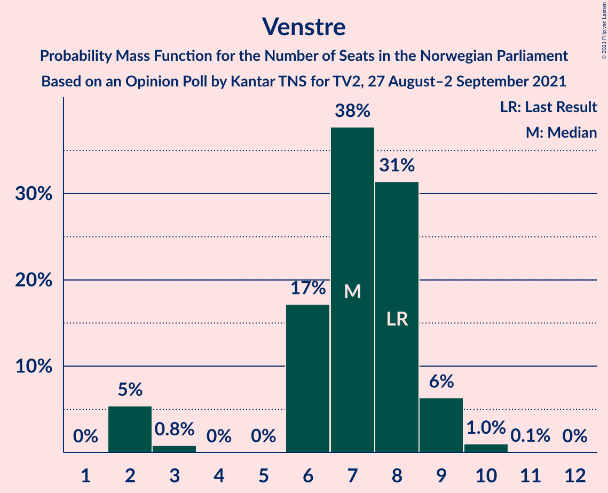

| Number of Seats | Probability | Accumulated | Special Marks |
|:---------------:|:-----------:|:-----------:|:-------------:|
| 2 | 3% | 100% |  |
| 3 | 0.7% | 97% |  |
| 4 | 0% | 96% |  |
| 5 | 0.1% | 96% |  |
| 6 | 14% | 96% |  |
| 7 | 54% | 82% | Median |
| 8 | 20% | 28% | Last Result |
| 9 | 7% | 8% |  |
| 10 | 0.4% | 0.5% |  |
| 11 | 0% | 0% |  |

### Kristelig Folkeparti

*For a full overview of the results for this party, see the [Kristelig Folkeparti](party-kristeligfolkeparti.html) page.*

| Number of Seats | Probability | Accumulated | Special Marks |
|:---------------:|:-----------:|:-----------:|:-------------:|
| 1 | 0.1% | 100% |  |
| 2 | 1.1% | 99.9% |  |
| 3 | 28% | 98.8% |  |
| 4 | 0% | 71% |  |
| 5 | 0.1% | 71% |  |
| 6 | 40% | 71% | Median |
| 7 | 20% | 31% |  |
| 8 | 10% | 11% | Last Result |
| 9 | 0.7% | 0.8% |  |
| 10 | 0.1% | 0.1% |  |
| 11 | 0% | 0% |  |

## Coalitions

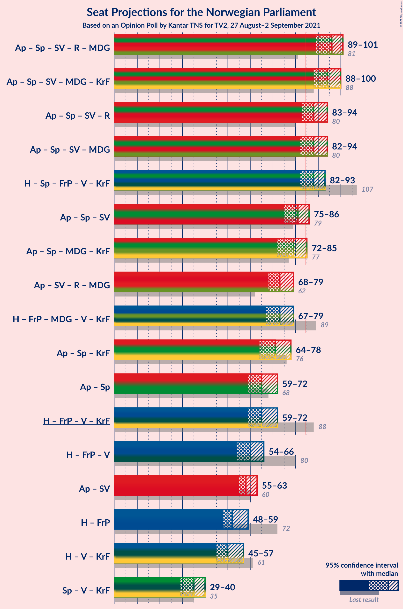

### Confidence Intervals

| Coalition | Last Result | Median | Majority? | 80% Confidence Interval | 90% Confidence Interval | 95% Confidence Interval | 99% Confidence Interval |
|:---------:|:-----------:|:------:|:---------:|:-----------------------:|:-----------------------:|:-----------------------:|:-----------------------:|
| Arbeiderpartiet – Senterpartiet – Sosialistisk Venstreparti – Rødt – Miljøpartiet De Grønne | 81 | 95 | 99.9% | 91–99 | 89–101 | 89–101 | 88–104 |
| Arbeiderpartiet – Senterpartiet – Sosialistisk Venstreparti – Miljøpartiet De Grønne – Kristelig Folkeparti | 88 | 94 | 100% | 90–97 | 89–100 | 88–101 | 87–101 |
| Høyre – Senterpartiet – Fremskrittspartiet – Venstre – Kristelig Folkeparti | 107 | 88 | 88% | 84–92 | 83–93 | 81–95 | 80–98 |
| Arbeiderpartiet – Senterpartiet – Sosialistisk Venstreparti – Miljøpartiet De Grønne | 80 | 88 | 88% | 84–93 | 82–94 | 82–94 | 82–97 |
| Arbeiderpartiet – Senterpartiet – Sosialistisk Venstreparti – Rødt | 80 | 88 | 88% | 84–92 | 82–93 | 82–93 | 81–96 |
| Arbeiderpartiet – Senterpartiet – Sosialistisk Venstreparti | 79 | 82 | 16% | 77–85 | 76–86 | 75–86 | 75–88 |
| Arbeiderpartiet – Senterpartiet – Miljøpartiet De Grønne – Kristelig Folkeparti | 77 | 77 | 6% | 74–83 | 73–85 | 73–86 | 71–86 |
| Høyre – Fremskrittspartiet – Miljøpartiet De Grønne – Venstre – Kristelig Folkeparti | 89 | 73 | 0% | 69–77 | 68–79 | 66–79 | 65–81 |
| Arbeiderpartiet – Sosialistisk Venstreparti – Rødt – Miljøpartiet De Grønne | 62 | 73 | 0% | 69–76 | 69–78 | 65–79 | 63–81 |
| Arbeiderpartiet – Senterpartiet – Kristelig Folkeparti | 76 | 71 | 0% | 67–75 | 66–78 | 66–78 | 64–80 |
| Arbeiderpartiet – Senterpartiet | 68 | 66 | 0% | 61–71 | 60–71 | 59–72 | 59–74 |
| Høyre – Fremskrittspartiet – Venstre – Kristelig Folkeparti | 88 | 66 | 0% | 61–71 | 61–72 | 59–72 | 57–73 |
| Høyre – Fremskrittspartiet – Venstre | 80 | 60 | 0% | 56–64 | 54–65 | 54–65 | 52–67 |
| Arbeiderpartiet – Sosialistisk Venstreparti | 60 | 58 | 0% | 56–61 | 55–62 | 55–63 | 51–65 |
| Høyre – Fremskrittspartiet | 72 | 53 | 0% | 49–56 | 49–58 | 47–59 | 47–60 |
| Høyre – Venstre – Kristelig Folkeparti | 61 | 50 | 0% | 46–54 | 46–57 | 45–57 | 41–58 |
| Senterpartiet – Venstre – Kristelig Folkeparti | 35 | 36 | 0% | 32–39 | 31–39 | 30–39 | 28–42 |

### Arbeiderpartiet – Senterpartiet – Sosialistisk Venstreparti – Rødt – Miljøpartiet De Grønne

| Number of Seats | Probability | Accumulated | Special Marks |
|:---------------:|:-----------:|:-----------:|:-------------:|
| 81 | 0% | 100% | Last Result |
| 82 | 0% | 100% |  |
| 83 | 0% | 100% |  |
| 84 | 0.1% | 100% |  |
| 85 | 0.1% | 99.9% | Majority |
| 86 | 0% | 99.8% |  |
| 87 | 0.1% | 99.8% |  |
| 88 | 0.2% | 99.6% |  |
| 89 | 5% | 99.4% |  |
| 90 | 4% | 94% |  |
| 91 | 1.3% | 90% |  |
| 92 | 2% | 89% |  |
| 93 | 4% | 86% |  |
| 94 | 21% | 82% |  |
| 95 | 15% | 61% |  |
| 96 | 11% | 46% | Median |
| 97 | 12% | 35% |  |
| 98 | 4% | 24% |  |
| 99 | 10% | 19% |  |
| 100 | 2% | 9% |  |
| 101 | 5% | 7% |  |
| 102 | 0.8% | 2% |  |
| 103 | 0.2% | 1.1% |  |
| 104 | 0.6% | 0.9% |  |
| 105 | 0.3% | 0.3% |  |
| 106 | 0% | 0% |  |

### Arbeiderpartiet – Senterpartiet – Sosialistisk Venstreparti – Miljøpartiet De Grønne – Kristelig Folkeparti

| Number of Seats | Probability | Accumulated | Special Marks |
|:---------------:|:-----------:|:-----------:|:-------------:|
| 85 | 0.1% | 100% | Majority |
| 86 | 0.4% | 99.9% |  |
| 87 | 0.3% | 99.5% |  |
| 88 | 3% | 99.3% | Last Result |
| 89 | 3% | 96% |  |
| 90 | 8% | 94% |  |
| 91 | 3% | 85% |  |
| 92 | 7% | 83% |  |
| 93 | 17% | 76% |  |
| 94 | 22% | 59% |  |
| 95 | 7% | 38% | Median |
| 96 | 11% | 30% |  |
| 97 | 9% | 19% |  |
| 98 | 3% | 10% |  |
| 99 | 2% | 7% |  |
| 100 | 0.9% | 5% |  |
| 101 | 4% | 4% |  |
| 102 | 0.1% | 0.3% |  |
| 103 | 0.1% | 0.2% |  |
| 104 | 0.2% | 0.2% |  |
| 105 | 0% | 0% |  |

### Høyre – Senterpartiet – Fremskrittspartiet – Venstre – Kristelig Folkeparti

| Number of Seats | Probability | Accumulated | Special Marks |
|:---------------:|:-----------:|:-----------:|:-------------:|
| 78 | 0.1% | 100% |  |
| 79 | 0.1% | 99.8% |  |
| 80 | 1.1% | 99.7% |  |
| 81 | 2% | 98.6% |  |
| 82 | 2% | 97% |  |
| 83 | 2% | 95% |  |
| 84 | 4% | 93% |  |
| 85 | 3% | 88% | Majority |
| 86 | 20% | 85% |  |
| 87 | 8% | 65% |  |
| 88 | 14% | 58% | Median |
| 89 | 7% | 44% |  |
| 90 | 9% | 37% |  |
| 91 | 6% | 29% |  |
| 92 | 18% | 23% |  |
| 93 | 2% | 5% |  |
| 94 | 0.9% | 4% |  |
| 95 | 2% | 3% |  |
| 96 | 0.1% | 0.9% |  |
| 97 | 0.1% | 0.8% |  |
| 98 | 0.8% | 0.8% |  |
| 99 | 0% | 0% |  |
| 100 | 0% | 0% |  |
| 101 | 0% | 0% |  |
| 102 | 0% | 0% |  |
| 103 | 0% | 0% |  |
| 104 | 0% | 0% |  |
| 105 | 0% | 0% |  |
| 106 | 0% | 0% |  |
| 107 | 0% | 0% | Last Result |

### Arbeiderpartiet – Senterpartiet – Sosialistisk Venstreparti – Miljøpartiet De Grønne

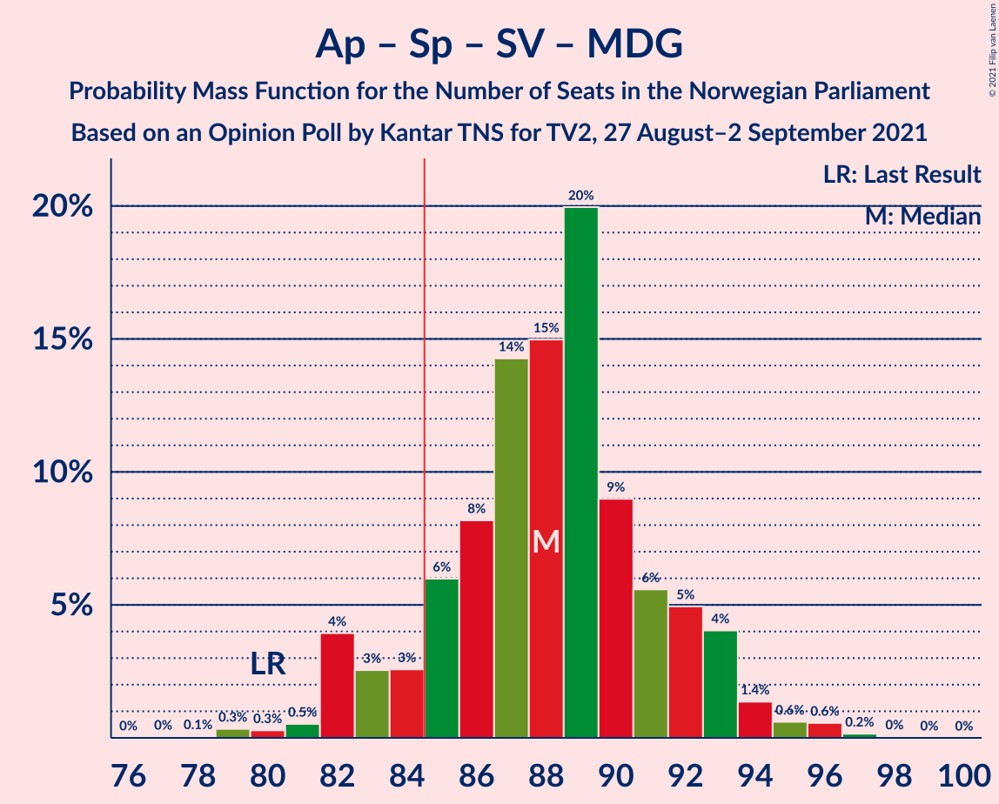

| Number of Seats | Probability | Accumulated | Special Marks |
|:---------------:|:-----------:|:-----------:|:-------------:|
| 77 | 0% | 100% |  |
| 78 | 0% | 99.9% |  |
| 79 | 0.1% | 99.9% |  |
| 80 | 0.2% | 99.9% | Last Result |
| 81 | 0.1% | 99.6% |  |
| 82 | 5% | 99.6% |  |
| 83 | 4% | 95% |  |
| 84 | 2% | 91% |  |
| 85 | 3% | 88% | Majority |
| 86 | 7% | 86% |  |
| 87 | 9% | 79% |  |
| 88 | 20% | 69% |  |
| 89 | 15% | 49% | Median |
| 90 | 14% | 35% |  |
| 91 | 5% | 21% |  |
| 92 | 2% | 16% |  |
| 93 | 8% | 14% |  |
| 94 | 5% | 6% |  |
| 95 | 0.3% | 1.2% |  |
| 96 | 0.1% | 0.9% |  |
| 97 | 0.6% | 0.8% |  |
| 98 | 0.1% | 0.2% |  |
| 99 | 0% | 0% |  |

### Arbeiderpartiet – Senterpartiet – Sosialistisk Venstreparti – Rødt

| Number of Seats | Probability | Accumulated | Special Marks |
|:---------------:|:-----------:|:-----------:|:-------------:|
| 77 | 0.1% | 100% |  |
| 78 | 0% | 99.9% |  |
| 79 | 0.1% | 99.9% |  |
| 80 | 0.1% | 99.8% | Last Result |
| 81 | 0.8% | 99.7% |  |
| 82 | 4% | 98.9% |  |
| 83 | 4% | 95% |  |
| 84 | 3% | 91% |  |
| 85 | 2% | 88% | Majority |
| 86 | 4% | 86% |  |
| 87 | 10% | 81% |  |
| 88 | 31% | 71% |  |
| 89 | 15% | 40% | Median |
| 90 | 3% | 26% |  |
| 91 | 10% | 22% |  |
| 92 | 3% | 12% |  |
| 93 | 7% | 9% |  |
| 94 | 1.4% | 2% |  |
| 95 | 0.3% | 0.8% |  |
| 96 | 0.3% | 0.6% |  |
| 97 | 0.2% | 0.3% |  |
| 98 | 0.1% | 0.1% |  |
| 99 | 0% | 0% |  |

### Arbeiderpartiet – Senterpartiet – Sosialistisk Venstreparti

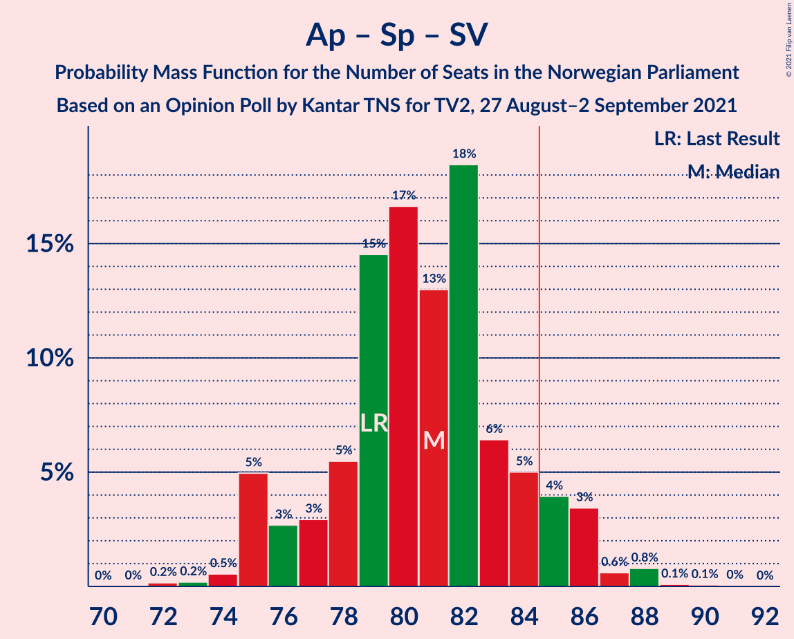

| Number of Seats | Probability | Accumulated | Special Marks |
|:---------------:|:-----------:|:-----------:|:-------------:|
| 73 | 0.2% | 100% |  |
| 74 | 0.2% | 99.8% |  |
| 75 | 3% | 99.6% |  |
| 76 | 5% | 96% |  |
| 77 | 3% | 92% |  |
| 78 | 3% | 89% |  |
| 79 | 9% | 86% | Last Result |
| 80 | 12% | 77% |  |
| 81 | 9% | 65% |  |
| 82 | 31% | 55% | Median |
| 83 | 3% | 24% |  |
| 84 | 5% | 21% |  |
| 85 | 11% | 16% | Majority |
| 86 | 4% | 6% |  |
| 87 | 0.7% | 1.4% |  |
| 88 | 0.4% | 0.7% |  |
| 89 | 0.1% | 0.3% |  |
| 90 | 0.1% | 0.2% |  |
| 91 | 0% | 0% |  |

### Arbeiderpartiet – Senterpartiet – Miljøpartiet De Grønne – Kristelig Folkeparti

| Number of Seats | Probability | Accumulated | Special Marks |
|:---------------:|:-----------:|:-----------:|:-------------:|
| 70 | 0.3% | 100% |  |
| 71 | 0.1% | 99.6% |  |
| 72 | 1.1% | 99.5% |  |
| 73 | 5% | 98% |  |
| 74 | 6% | 94% |  |
| 75 | 3% | 88% |  |
| 76 | 9% | 84% |  |
| 77 | 31% | 76% | Last Result |
| 78 | 2% | 45% |  |
| 79 | 5% | 42% | Median |
| 80 | 6% | 37% |  |
| 81 | 7% | 32% |  |
| 82 | 12% | 24% |  |
| 83 | 3% | 12% |  |
| 84 | 3% | 9% |  |
| 85 | 1.2% | 6% | Majority |
| 86 | 4% | 5% |  |
| 87 | 0% | 0.5% |  |
| 88 | 0.3% | 0.5% |  |
| 89 | 0.2% | 0.2% |  |
| 90 | 0% | 0% |  |

### Høyre – Fremskrittspartiet – Miljøpartiet De Grønne – Venstre – Kristelig Folkeparti

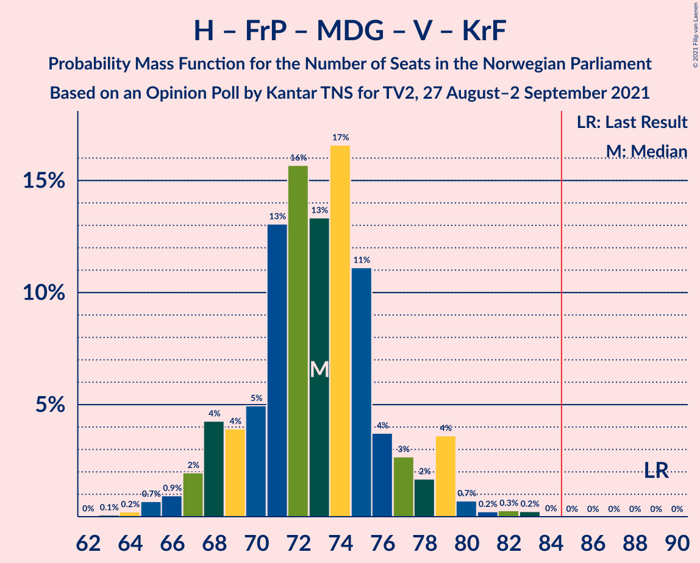

| Number of Seats | Probability | Accumulated | Special Marks |
|:---------------:|:-----------:|:-----------:|:-------------:|
| 63 | 0.1% | 100% |  |
| 64 | 0.4% | 99.9% |  |
| 65 | 0.5% | 99.5% |  |
| 66 | 2% | 99.0% |  |
| 67 | 2% | 97% |  |
| 68 | 3% | 95% |  |
| 69 | 5% | 92% |  |
| 70 | 12% | 87% |  |
| 71 | 13% | 75% |  |
| 72 | 2% | 62% | Median |
| 73 | 32% | 60% |  |
| 74 | 6% | 28% |  |
| 75 | 6% | 22% |  |
| 76 | 4% | 16% |  |
| 77 | 2% | 12% |  |
| 78 | 0.7% | 9% |  |
| 79 | 7% | 8% |  |
| 80 | 0.7% | 1.2% |  |
| 81 | 0.3% | 0.5% |  |
| 82 | 0.2% | 0.3% |  |
| 83 | 0% | 0% |  |
| 84 | 0% | 0% |  |
| 85 | 0% | 0% | Majority |
| 86 | 0% | 0% |  |
| 87 | 0% | 0% |  |
| 88 | 0% | 0% |  |
| 89 | 0% | 0% | Last Result |

### Arbeiderpartiet – Sosialistisk Venstreparti – Rødt – Miljøpartiet De Grønne

| Number of Seats | Probability | Accumulated | Special Marks |
|:---------------:|:-----------:|:-----------:|:-------------:|
| 62 | 0% | 100% | Last Result |
| 63 | 0.8% | 100% |  |
| 64 | 0% | 99.2% |  |
| 65 | 2% | 99.2% |  |
| 66 | 0.3% | 97% |  |
| 67 | 0.7% | 97% |  |
| 68 | 1.3% | 96% |  |
| 69 | 18% | 95% |  |
| 70 | 3% | 77% |  |
| 71 | 12% | 74% |  |
| 72 | 7% | 63% |  |
| 73 | 15% | 56% | Median |
| 74 | 16% | 41% |  |
| 75 | 8% | 25% |  |
| 76 | 8% | 17% |  |
| 77 | 1.1% | 9% |  |
| 78 | 5% | 8% |  |
| 79 | 3% | 4% |  |
| 80 | 0.2% | 1.0% |  |
| 81 | 0.6% | 0.8% |  |
| 82 | 0.1% | 0.2% |  |
| 83 | 0% | 0% |  |

### Arbeiderpartiet – Senterpartiet – Kristelig Folkeparti

| Number of Seats | Probability | Accumulated | Special Marks |
|:---------------:|:-----------:|:-----------:|:-------------:|
| 62 | 0.3% | 100% |  |
| 63 | 0.1% | 99.7% |  |
| 64 | 0.2% | 99.7% |  |
| 65 | 0.2% | 99.4% |  |
| 66 | 9% | 99.3% |  |
| 67 | 6% | 90% |  |
| 68 | 3% | 85% |  |
| 69 | 14% | 81% |  |
| 70 | 5% | 67% |  |
| 71 | 21% | 62% |  |
| 72 | 8% | 42% | Median |
| 73 | 3% | 34% |  |
| 74 | 14% | 30% |  |
| 75 | 6% | 16% |  |
| 76 | 3% | 10% | Last Result |
| 77 | 1.0% | 7% |  |
| 78 | 5% | 6% |  |
| 79 | 0.2% | 1.0% |  |
| 80 | 0.5% | 0.8% |  |
| 81 | 0.2% | 0.2% |  |
| 82 | 0% | 0% |  |

### Arbeiderpartiet – Senterpartiet

| Number of Seats | Probability | Accumulated | Special Marks |
|:---------------:|:-----------:|:-----------:|:-------------:|
| 59 | 4% | 100% |  |
| 60 | 4% | 96% |  |
| 61 | 3% | 92% |  |
| 62 | 2% | 89% |  |
| 63 | 10% | 87% |  |
| 64 | 4% | 77% |  |
| 65 | 23% | 73% |  |
| 66 | 15% | 50% | Median |
| 67 | 12% | 35% |  |
| 68 | 5% | 23% | Last Result |
| 69 | 2% | 18% |  |
| 70 | 1.2% | 15% |  |
| 71 | 12% | 14% |  |
| 72 | 0.7% | 3% |  |
| 73 | 1.0% | 2% |  |
| 74 | 0.7% | 0.9% |  |
| 75 | 0.2% | 0.2% |  |
| 76 | 0% | 0% |  |

### Høyre – Fremskrittspartiet – Venstre – Kristelig Folkeparti

| Number of Seats | Probability | Accumulated | Special Marks |
|:---------------:|:-----------:|:-----------:|:-------------:|
| 55 | 0.2% | 100% |  |
| 56 | 0.3% | 99.8% |  |
| 57 | 0.5% | 99.6% |  |
| 58 | 0.2% | 99.0% |  |
| 59 | 2% | 98.9% |  |
| 60 | 0.8% | 96% |  |
| 61 | 7% | 96% |  |
| 62 | 10% | 89% |  |
| 63 | 11% | 80% |  |
| 64 | 9% | 69% |  |
| 65 | 5% | 60% | Median |
| 66 | 17% | 55% |  |
| 67 | 22% | 39% |  |
| 68 | 2% | 16% |  |
| 69 | 3% | 14% |  |
| 70 | 1.2% | 11% |  |
| 71 | 4% | 10% |  |
| 72 | 6% | 6% |  |
| 73 | 0.1% | 0.6% |  |
| 74 | 0.1% | 0.5% |  |
| 75 | 0.3% | 0.4% |  |
| 76 | 0.1% | 0.1% |  |
| 77 | 0% | 0% |  |
| 78 | 0% | 0% |  |
| 79 | 0% | 0% |  |
| 80 | 0% | 0% |  |
| 81 | 0% | 0% |  |
| 82 | 0% | 0% |  |
| 83 | 0% | 0% |  |
| 84 | 0% | 0% |  |
| 85 | 0% | 0% | Majority |
| 86 | 0% | 0% |  |
| 87 | 0% | 0% |  |
| 88 | 0% | 0% | Last Result |

### Høyre – Fremskrittspartiet – Venstre

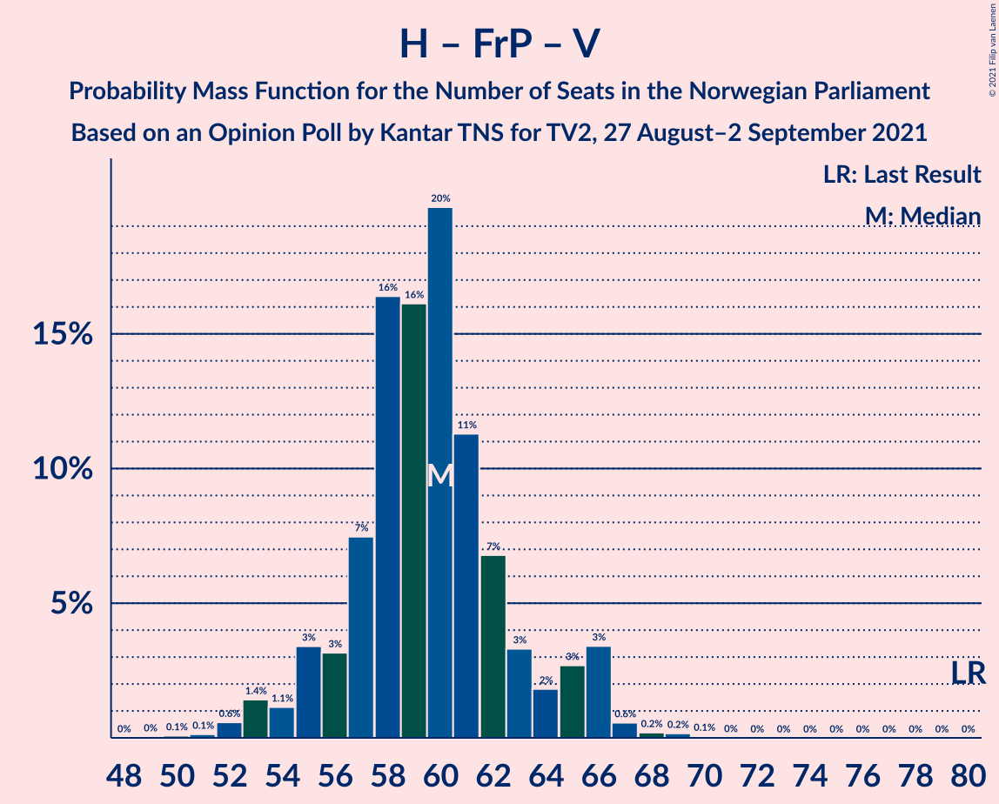

| Number of Seats | Probability | Accumulated | Special Marks |
|:---------------:|:-----------:|:-----------:|:-------------:|
| 49 | 0.1% | 100% |  |
| 50 | 0.2% | 99.9% |  |
| 51 | 0% | 99.7% |  |
| 52 | 0.7% | 99.7% |  |
| 53 | 0.5% | 99.0% |  |
| 54 | 4% | 98% |  |
| 55 | 3% | 95% |  |
| 56 | 3% | 92% |  |
| 57 | 3% | 89% |  |
| 58 | 16% | 86% |  |
| 59 | 9% | 70% | Median |
| 60 | 21% | 61% |  |
| 61 | 22% | 41% |  |
| 62 | 4% | 19% |  |
| 63 | 3% | 14% |  |
| 64 | 2% | 11% |  |
| 65 | 8% | 10% |  |
| 66 | 0.4% | 1.2% |  |
| 67 | 0.3% | 0.8% |  |
| 68 | 0.2% | 0.5% |  |
| 69 | 0.2% | 0.3% |  |
| 70 | 0% | 0.1% |  |
| 71 | 0.1% | 0.1% |  |
| 72 | 0% | 0% |  |
| 73 | 0% | 0% |  |
| 74 | 0% | 0% |  |
| 75 | 0% | 0% |  |
| 76 | 0% | 0% |  |
| 77 | 0% | 0% |  |
| 78 | 0% | 0% |  |
| 79 | 0% | 0% |  |
| 80 | 0% | 0% | Last Result |

### Arbeiderpartiet – Sosialistisk Venstreparti

| Number of Seats | Probability | Accumulated | Special Marks |
|:---------------:|:-----------:|:-----------:|:-------------:|
| 51 | 0.8% | 100% |  |
| 52 | 0.1% | 99.2% |  |
| 53 | 0.4% | 99.1% |  |
| 54 | 0.4% | 98.7% |  |
| 55 | 4% | 98% |  |
| 56 | 7% | 95% |  |
| 57 | 22% | 87% |  |
| 58 | 18% | 66% |  |
| 59 | 24% | 47% | Median |
| 60 | 8% | 23% | Last Result |
| 61 | 8% | 15% |  |
| 62 | 3% | 7% |  |
| 63 | 2% | 4% |  |
| 64 | 1.1% | 2% |  |
| 65 | 0.9% | 1.2% |  |
| 66 | 0.2% | 0.3% |  |
| 67 | 0.1% | 0.1% |  |
| 68 | 0% | 0% |  |

### Høyre – Fremskrittspartiet

| Number of Seats | Probability | Accumulated | Special Marks |
|:---------------:|:-----------:|:-----------:|:-------------:|
| 44 | 0.1% | 100% |  |
| 45 | 0.1% | 99.9% |  |
| 46 | 0.1% | 99.8% |  |
| 47 | 4% | 99.7% |  |
| 48 | 0.7% | 96% |  |
| 49 | 6% | 95% |  |
| 50 | 4% | 90% |  |
| 51 | 12% | 86% |  |
| 52 | 22% | 74% | Median |
| 53 | 13% | 52% |  |
| 54 | 22% | 40% |  |
| 55 | 4% | 18% |  |
| 56 | 4% | 13% |  |
| 57 | 5% | 10% |  |
| 58 | 2% | 5% |  |
| 59 | 3% | 4% |  |
| 60 | 0.4% | 0.7% |  |
| 61 | 0.1% | 0.3% |  |
| 62 | 0.2% | 0.2% |  |
| 63 | 0% | 0.1% |  |
| 64 | 0% | 0% |  |
| 65 | 0% | 0% |  |
| 66 | 0% | 0% |  |
| 67 | 0% | 0% |  |
| 68 | 0% | 0% |  |
| 69 | 0% | 0% |  |
| 70 | 0% | 0% |  |
| 71 | 0% | 0% |  |
| 72 | 0% | 0% | Last Result |

### Høyre – Venstre – Kristelig Folkeparti

| Number of Seats | Probability | Accumulated | Special Marks |
|:---------------:|:-----------:|:-----------:|:-------------:|
| 41 | 0.6% | 100% |  |
| 42 | 0.1% | 99.4% |  |
| 43 | 0.1% | 99.3% |  |
| 44 | 0.6% | 99.2% |  |
| 45 | 2% | 98.7% |  |
| 46 | 10% | 97% |  |
| 47 | 5% | 87% |  |
| 48 | 14% | 81% |  |
| 49 | 12% | 67% |  |
| 50 | 9% | 55% | Median |
| 51 | 10% | 46% |  |
| 52 | 22% | 36% |  |
| 53 | 2% | 15% |  |
| 54 | 5% | 13% |  |
| 55 | 0.8% | 8% |  |
| 56 | 0.8% | 7% |  |
| 57 | 6% | 6% |  |
| 58 | 0.5% | 0.9% |  |
| 59 | 0.1% | 0.4% |  |
| 60 | 0.2% | 0.3% |  |
| 61 | 0.1% | 0.1% | Last Result |
| 62 | 0% | 0% |  |

### Senterpartiet – Venstre – Kristelig Folkeparti

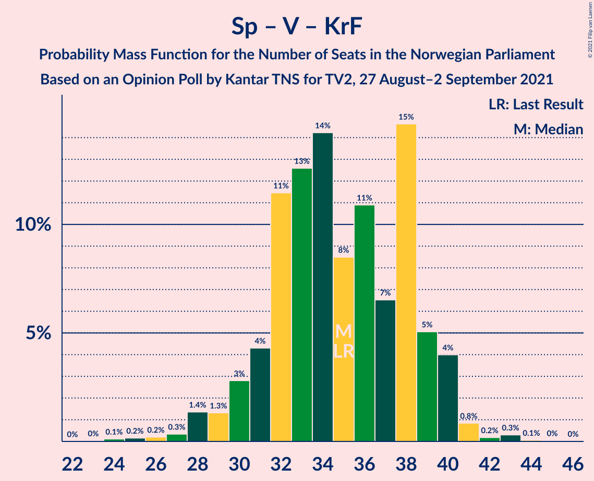

| Number of Seats | Probability | Accumulated | Special Marks |
|:---------------:|:-----------:|:-----------:|:-------------:|
| 25 | 0% | 100% |  |
| 26 | 0% | 99.9% |  |
| 27 | 0.4% | 99.9% |  |
| 28 | 0.7% | 99.5% |  |
| 29 | 0.4% | 98.8% |  |
| 30 | 3% | 98% |  |
| 31 | 5% | 95% |  |
| 32 | 7% | 90% |  |
| 33 | 10% | 83% |  |
| 34 | 14% | 73% |  |
| 35 | 6% | 59% | Last Result |
| 36 | 13% | 52% | Median |
| 37 | 4% | 39% |  |
| 38 | 23% | 36% |  |
| 39 | 11% | 13% |  |
| 40 | 0.2% | 2% |  |
| 41 | 0.9% | 2% |  |
| 42 | 0.5% | 0.9% |  |
| 43 | 0.2% | 0.4% |  |
| 44 | 0% | 0.2% |  |
| 45 | 0.2% | 0.2% |  |
| 46 | 0% | 0% |  |

## Technical Information

### Opinion Poll

+ **Polling firm:** Kantar TNS
+ **Commissioner(s):** TV2
+ **Fieldwork period:** 27 August–2 September 2021

### Calculations

+ **Sample size:** 1480
+ **Simulations done:** 131,072
+ **Error estimate:** 2.10%

