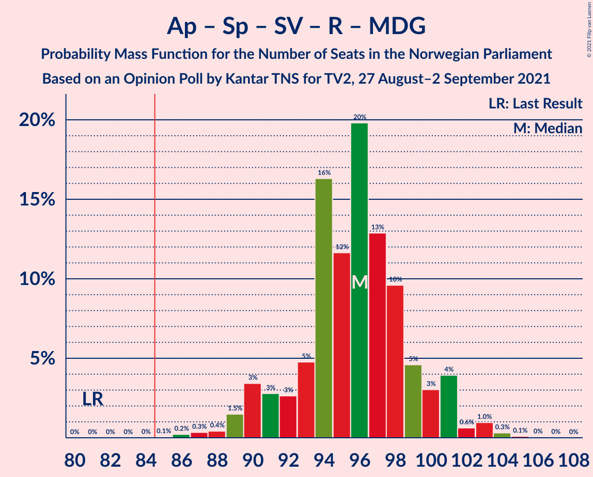
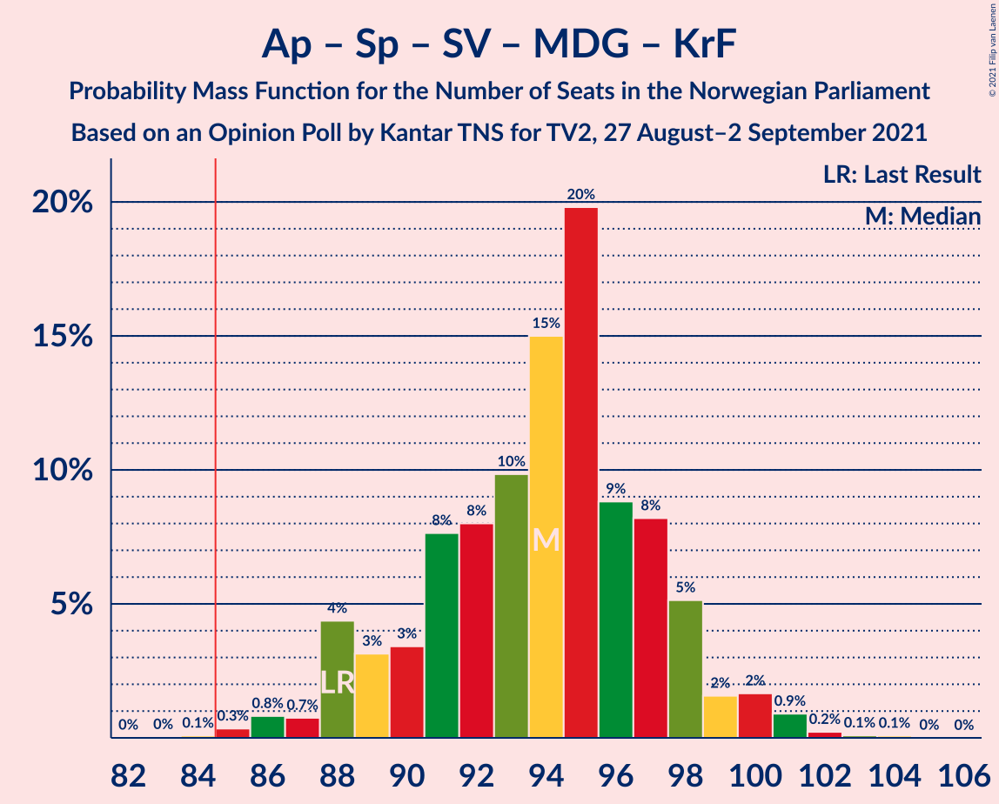
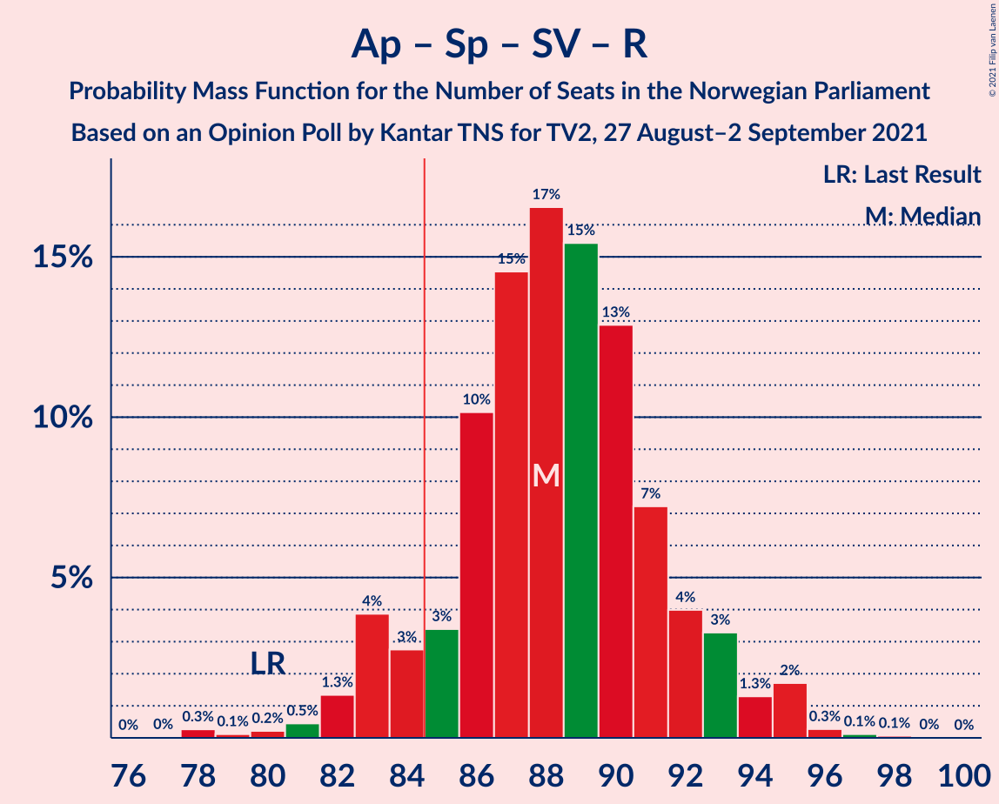
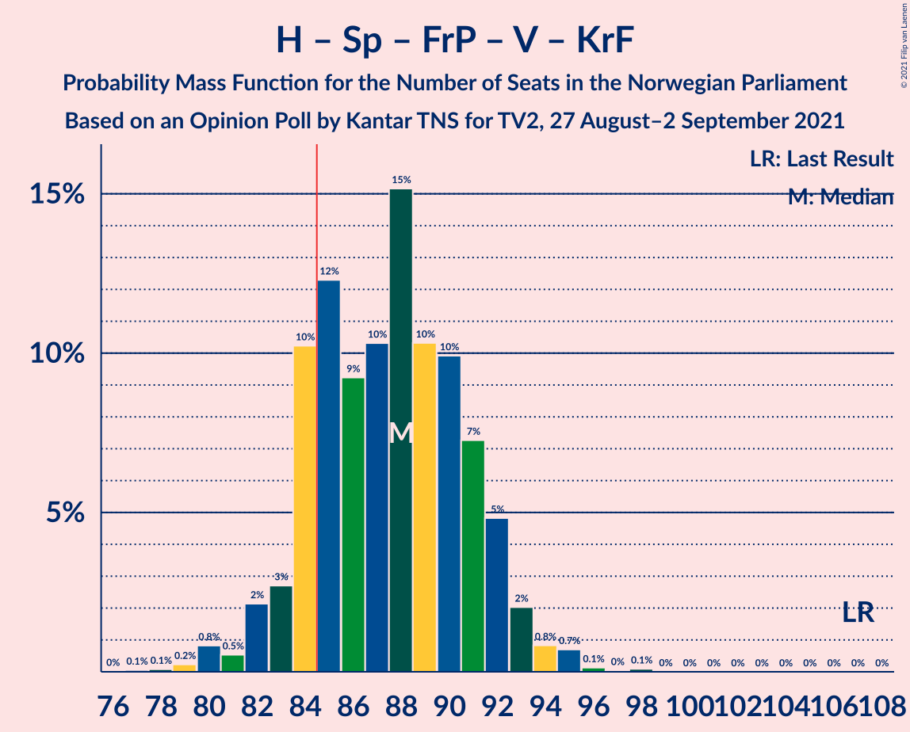
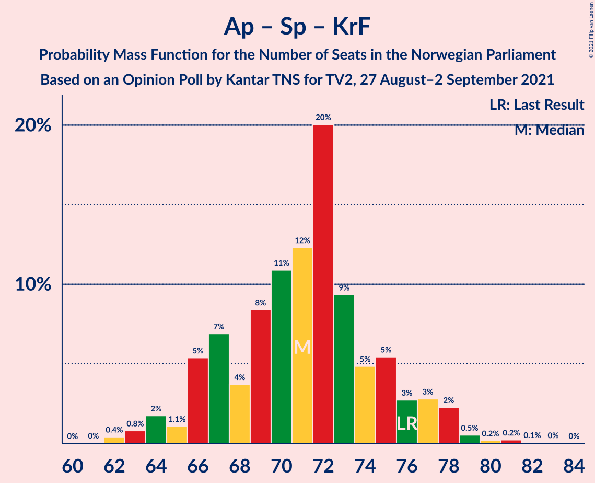
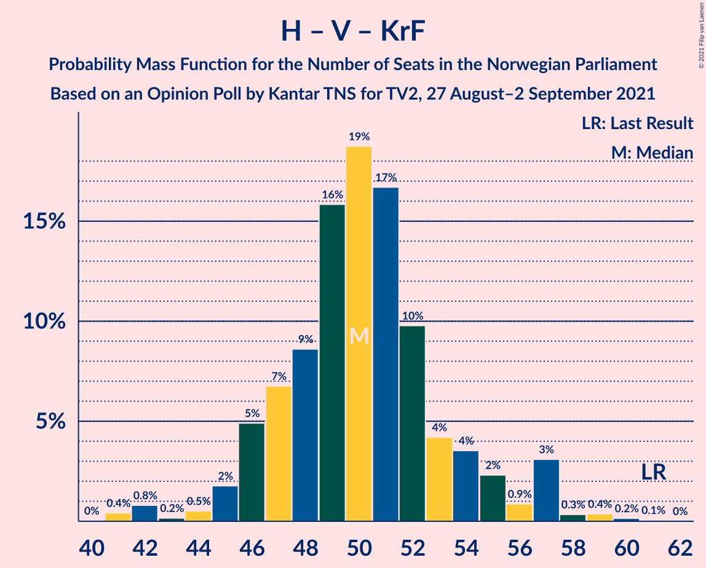

# Opinion Poll by Kantar TNS for TV2, 27 August–2 September 2021

<a href="#voting-intentions">Voting Intentions</a> | <a href="#seats">Seats</a> | <a href="#coalitions">Coalitions</a> | <a href="#technical-information">Technical Information</a>

## Voting Intentions

### Confidence Intervals

| Party | Last Result | Poll Result | 80% Confidence Interval | 90% Confidence Interval | 95% Confidence Interval | 99% Confidence Interval |
|:-----:|:-----------:|:-----------:|:-----------------------:|:-----------------------:|:-----------------------:|:-----------------------:|
| Arbeiderpartiet | 27.4% | 23.2% | 21.9–24.7% |21.5–25.1% |21.2–25.5% |20.5–26.2% |
| Høyre | 25.0% | 21.2% | 19.9–22.6% |19.5–23.0% |19.2–23.4% |18.6–24.1% |
| Senterpartiet | 10.3% | 12.4% | 11.4–13.6% |11.1–13.9% |10.8–14.2% |10.4–14.8% |
| Sosialistisk Venstreparti | 6.0% | 9.5% | 8.6–10.6% |8.4–10.9% |8.1–11.1% |7.7–11.7% |
| Fremskrittspartiet | 15.2% | 9.0% | 8.1–10.0% |7.8–10.3% |7.6–10.6% |7.2–11.1% |
| Rødt | 2.4% | 5.1% | 4.5–6.0% |4.3–6.2% |4.1–6.4% |3.8–6.8% |
| Miljøpartiet De Grønne | 3.2% | 5.0% | 4.3–5.8% |4.1–6.0% |4.0–6.2% |3.7–6.6% |
| Venstre | 4.4% | 4.8% | 4.1–5.6% |4.0–5.8% |3.8–6.0% |3.5–6.4% |
| Kristelig Folkeparti | 4.2% | 4.3% | 3.7–5.1% |3.5–5.3% |3.4–5.5% |3.1–5.9% |

*Note:* The poll result column reflects the actual value used in the calculations. Published results may vary slightly, and in addition be rounded to fewer digits.

## Seats

### Confidence Intervals

| Party | Last Result | Median | 80% Confidence Interval | 90% Confidence Interval | 95% Confidence Interval | 99% Confidence Interval |
|:-----:|:-----------:|:------:|:-----------------------:|:-----------------------:|:-----------------------:|:-----------------------:|
| <a href="#arbeiderpartiet">Arbeiderpartiet</a> | 49 | 43 | 41–46 |40–47 |40–47 |40–49 |
| <a href="#høyre">Høyre</a> | 45 | 36 | 36–40 |36–42 |35–44 |34–45 |
| <a href="#senterpartiet">Senterpartiet</a> | 19 | 22 | 19–26 |18–27 |18–27 |18–29 |
| <a href="#sosialistisk-venstreparti">Sosialistisk Venstreparti</a> | 11 | 16 | 13–17 |12–18 |11–18 |11–19 |
| <a href="#fremskrittspartiet">Fremskrittspartiet</a> | 27 | 15 | 14–17 |13–18 |12–18 |10–19 |
| <a href="#rødt">Rødt</a> | 1 | 7 | 6–9 |6–10 |6–10 |2–10 |
| <a href="#miljøpartiet-de-grønne">Miljøpartiet De Grønne</a> | 1 | 7 | 6–9 |6–9 |3–9 |2–10 |
| <a href="#venstre">Venstre</a> | 8 | 7 | 6–8 |2–9 |2–9 |2–10 |
| <a href="#kristelig-folkeparti">Kristelig Folkeparti</a> | 8 | 6 | 3–8 |3–8 |3–8 |2–9 |

### Arbeiderpartiet

*For a full overview of the results for this party, see the [Arbeiderpartiet](party-arbeiderpartiet.html) page.*

| Number of Seats | Probability | Accumulated | Special Marks |
|:---------------:|:-----------:|:-----------:|:-------------:|
| 38 | 0.1% | 100% |  |
| 39 | 0.4% | 99.9% |  |
| 40 | 9% | 99.5% |  |
| 41 | 16% | 91% |  |
| 42 | 11% | 75% |  |
| 43 | 20% | 64% | Median |
| 44 | 22% | 44% |  |
| 45 | 8% | 22% |  |
| 46 | 7% | 14% |  |
| 47 | 4% | 7% |  |
| 48 | 2% | 2% |  |
| 49 | 0.4% | 0.9% | Last Result |
| 50 | 0.1% | 0.5% |  |
| 51 | 0.2% | 0.4% |  |
| 52 | 0.1% | 0.2% |  |
| 53 | 0.1% | 0.1% |  |
| 54 | 0% | 0% |  |

### Høyre

*For a full overview of the results for this party, see the [Høyre](party-høyre.html) page.*

| Number of Seats | Probability | Accumulated | Special Marks |
|:---------------:|:-----------:|:-----------:|:-------------:|
| 31 | 0% | 100% |  |
| 32 | 0.1% | 99.9% |  |
| 33 | 0.3% | 99.9% |  |
| 34 | 0.5% | 99.6% |  |
| 35 | 3% | 99.1% |  |
| 36 | 47% | 96% | Median |
| 37 | 20% | 48% |  |
| 38 | 7% | 28% |  |
| 39 | 8% | 21% |  |
| 40 | 4% | 13% |  |
| 41 | 2% | 9% |  |
| 42 | 3% | 7% |  |
| 43 | 0.9% | 5% |  |
| 44 | 3% | 4% |  |
| 45 | 0.4% | 0.7% | Last Result |
| 46 | 0.2% | 0.3% |  |
| 47 | 0.1% | 0.1% |  |
| 48 | 0% | 0% |  |

### Senterpartiet

*For a full overview of the results for this party, see the [Senterpartiet](party-senterpartiet.html) page.*

| Number of Seats | Probability | Accumulated | Special Marks |
|:---------------:|:-----------:|:-----------:|:-------------:|
| 18 | 5% | 100% |  |
| 19 | 8% | 95% | Last Result |
| 20 | 22% | 86% |  |
| 21 | 14% | 64% |  |
| 22 | 9% | 50% | Median |
| 23 | 8% | 41% |  |
| 24 | 16% | 32% |  |
| 25 | 4% | 16% |  |
| 26 | 6% | 12% |  |
| 27 | 4% | 6% |  |
| 28 | 2% | 2% |  |
| 29 | 0.3% | 0.6% |  |
| 30 | 0.2% | 0.4% |  |
| 31 | 0.1% | 0.2% |  |
| 32 | 0% | 0.1% |  |
| 33 | 0% | 0% |  |

### Sosialistisk Venstreparti

*For a full overview of the results for this party, see the [Sosialistisk Venstreparti](party-sosialistiskvenstreparti.html) page.*

| Number of Seats | Probability | Accumulated | Special Marks |
|:---------------:|:-----------:|:-----------:|:-------------:|
| 10 | 0.3% | 100% |  |
| 11 | 2% | 99.7% | Last Result |
| 12 | 3% | 97% |  |
| 13 | 4% | 94% |  |
| 14 | 13% | 90% |  |
| 15 | 21% | 77% |  |
| 16 | 40% | 56% | Median |
| 17 | 8% | 16% |  |
| 18 | 6% | 8% |  |
| 19 | 1.2% | 1.4% |  |
| 20 | 0.2% | 0.2% |  |
| 21 | 0% | 0% |  |

### Fremskrittspartiet

*For a full overview of the results for this party, see the [Fremskrittspartiet](party-fremskrittspartiet.html) page.*

| Number of Seats | Probability | Accumulated | Special Marks |
|:---------------:|:-----------:|:-----------:|:-------------:|
| 10 | 0.7% | 100% |  |
| 11 | 2% | 99.3% |  |
| 12 | 2% | 98% |  |
| 13 | 3% | 96% |  |
| 14 | 12% | 92% |  |
| 15 | 42% | 81% | Median |
| 16 | 22% | 38% |  |
| 17 | 12% | 17% |  |
| 18 | 4% | 5% |  |
| 19 | 1.0% | 1.2% |  |
| 20 | 0.2% | 0.2% |  |
| 21 | 0.1% | 0.1% |  |
| 22 | 0% | 0% |  |
| 23 | 0% | 0% |  |
| 24 | 0% | 0% |  |
| 25 | 0% | 0% |  |
| 26 | 0% | 0% |  |
| 27 | 0% | 0% | Last Result |

### Rødt

*For a full overview of the results for this party, see the [Rødt](party-rødt.html) page.*

| Number of Seats | Probability | Accumulated | Special Marks |
|:---------------:|:-----------:|:-----------:|:-------------:|
| 1 | 0% | 100% | Last Result |
| 2 | 1.4% | 100% |  |
| 3 | 0% | 98.6% |  |
| 4 | 0% | 98.6% |  |
| 5 | 0.2% | 98.6% |  |
| 6 | 11% | 98% |  |
| 7 | 38% | 88% | Median |
| 8 | 28% | 50% |  |
| 9 | 15% | 22% |  |
| 10 | 6% | 6% |  |
| 11 | 0.4% | 0.4% |  |
| 12 | 0% | 0% |  |

### Miljøpartiet De Grønne

*For a full overview of the results for this party, see the [Miljøpartiet De Grønne](party-miljøpartietdegrønne.html) page.*

| Number of Seats | Probability | Accumulated | Special Marks |
|:---------------:|:-----------:|:-----------:|:-------------:|
| 1 | 0% | 100% | Last Result |
| 2 | 2% | 100% |  |
| 3 | 0.2% | 98% |  |
| 4 | 0% | 97% |  |
| 5 | 0.1% | 97% |  |
| 6 | 12% | 97% |  |
| 7 | 36% | 85% | Median |
| 8 | 33% | 49% |  |
| 9 | 14% | 16% |  |
| 10 | 2% | 2% |  |
| 11 | 0.2% | 0.2% |  |
| 12 | 0% | 0% |  |

### Venstre

*For a full overview of the results for this party, see the [Venstre](party-venstre.html) page.*

| Number of Seats | Probability | Accumulated | Special Marks |
|:---------------:|:-----------:|:-----------:|:-------------:|
| 2 | 5% | 100% |  |
| 3 | 0.8% | 95% |  |
| 4 | 0% | 94% |  |
| 5 | 0% | 94% |  |
| 6 | 17% | 94% |  |
| 7 | 38% | 77% | Median |
| 8 | 31% | 39% | Last Result |
| 9 | 6% | 7% |  |
| 10 | 1.0% | 1.1% |  |
| 11 | 0.1% | 0.1% |  |
| 12 | 0% | 0% |  |

### Kristelig Folkeparti

*For a full overview of the results for this party, see the [Kristelig Folkeparti](party-kristeligfolkeparti.html) page.*

| Number of Seats | Probability | Accumulated | Special Marks |
|:---------------:|:-----------:|:-----------:|:-------------:|
| 1 | 0.1% | 100% |  |
| 2 | 1.5% | 99.9% |  |
| 3 | 21% | 98% |  |
| 4 | 0% | 78% |  |
| 5 | 0.2% | 78% |  |
| 6 | 42% | 77% | Median |
| 7 | 22% | 36% |  |
| 8 | 12% | 13% | Last Result |
| 9 | 1.3% | 1.4% |  |
| 10 | 0.1% | 0.1% |  |
| 11 | 0% | 0% |  |

## Coalitions

### Confidence Intervals

| Coalition | Last Result | Median | Majority? | 80% Confidence Interval | 90% Confidence Interval | 95% Confidence Interval | 99% Confidence Interval |
|:---------:|:-----------:|:------:|:---------:|:-----------------------:|:-----------------------:|:-----------------------:|:-----------------------:|
| Arbeiderpartiet – Senterpartiet – Sosialistisk Venstreparti – Rødt – Miljøpartiet De Grønne | 81 | 96 | 100% | 92–99 | 90–101 | 89–101 | 87–103 |
| Arbeiderpartiet – Senterpartiet – Sosialistisk Venstreparti – Miljøpartiet De Grønne – Kristelig Folkeparti | 88 | 94 | 99.9% | 90–97 | 88–98 | 88–100 | 86–101 |
| Arbeiderpartiet – Senterpartiet – Sosialistisk Venstreparti – Rødt | 80 | 88 | 91% | 85–92 | 83–93 | 83–94 | 80–95 |
| Arbeiderpartiet – Senterpartiet – Sosialistisk Venstreparti – Miljøpartiet De Grønne | 80 | 88 | 90% | 84–92 | 82–93 | 82–94 | 80–96 |
| Høyre – Senterpartiet – Fremskrittspartiet – Venstre – Kristelig Folkeparti | 107 | 88 | 83% | 84–91 | 83–92 | 82–93 | 80–95 |
| Arbeiderpartiet – Senterpartiet – Sosialistisk Venstreparti | 79 | 81 | 9% | 77–84 | 75–86 | 75–86 | 74–88 |
| Arbeiderpartiet – Senterpartiet – Miljøpartiet De Grønne – Kristelig Folkeparti | 77 | 79 | 3% | 74–83 | 73–84 | 72–85 | 70–87 |
| Arbeiderpartiet – Sosialistisk Venstreparti – Rødt – Miljøpartiet De Grønne | 62 | 73 | 0% | 70–77 | 69–78 | 68–79 | 66–81 |
| Høyre – Fremskrittspartiet – Miljøpartiet De Grønne – Venstre – Kristelig Folkeparti | 89 | 73 | 0% | 69–76 | 68–79 | 67–79 | 65–82 |
| Arbeiderpartiet – Senterpartiet – Kristelig Folkeparti | 76 | 71 | 0% | 67–75 | 66–77 | 64–78 | 63–79 |
| Arbeiderpartiet – Senterpartiet | 68 | 65 | 0% | 61–70 | 60–71 | 59–72 | 59–74 |
| Høyre – Fremskrittspartiet – Venstre – Kristelig Folkeparti | 88 | 65 | 0% | 62–69 | 60–71 | 59–72 | 57–74 |
| Høyre – Fremskrittspartiet – Venstre | 80 | 60 | 0% | 57–63 | 55–65 | 54–66 | 52–67 |
| Arbeiderpartiet – Sosialistisk Venstreparti | 60 | 58 | 0% | 56–62 | 55–62 | 55–63 | 53–65 |
| Høyre – Fremskrittspartiet | 72 | 52 | 0% | 50–56 | 49–58 | 48–59 | 47–61 |
| Høyre – Venstre – Kristelig Folkeparti | 61 | 50 | 0% | 47–54 | 46–55 | 45–57 | 42–59 |
| Senterpartiet – Venstre – Kristelig Folkeparti | 35 | 35 | 0% | 31–39 | 30–40 | 29–40 | 26–42 |

### Arbeiderpartiet – Senterpartiet – Sosialistisk Venstreparti – Rødt – Miljøpartiet De Grønne

| Number of Seats | Probability | Accumulated | Special Marks |
|:---------------:|:-----------:|:-----------:|:-------------:|
| 81 | 0% | 100% | Last Result |
| 82 | 0% | 100% |  |
| 83 | 0% | 100% |  |
| 84 | 0% | 100% |  |
| 85 | 0.1% | 100% | Majority |
| 86 | 0.2% | 99.9% |  |
| 87 | 0.3% | 99.7% |  |
| 88 | 0.4% | 99.4% |  |
| 89 | 1.5% | 98.9% |  |
| 90 | 3% | 97% |  |
| 91 | 3% | 94% |  |
| 92 | 3% | 91% |  |
| 93 | 5% | 89% |  |
| 94 | 16% | 84% |  |
| 95 | 12% | 68% | Median |
| 96 | 20% | 56% |  |
| 97 | 13% | 36% |  |
| 98 | 10% | 23% |  |
| 99 | 5% | 14% |  |
| 100 | 3% | 9% |  |
| 101 | 4% | 6% |  |
| 102 | 0.6% | 2% |  |
| 103 | 1.0% | 1.4% |  |
| 104 | 0.3% | 0.5% |  |
| 105 | 0.1% | 0.2% |  |
| 106 | 0% | 0.1% |  |
| 107 | 0% | 0% |  |

### Arbeiderpartiet – Senterpartiet – Sosialistisk Venstreparti – Miljøpartiet De Grønne – Kristelig Folkeparti

| Number of Seats | Probability | Accumulated | Special Marks |
|:---------------:|:-----------:|:-----------:|:-------------:|
| 83 | 0% | 100% |  |
| 84 | 0.1% | 99.9% |  |
| 85 | 0.3% | 99.9% | Majority |
| 86 | 0.8% | 99.5% |  |
| 87 | 0.7% | 98.7% |  |
| 88 | 4% | 98% | Last Result |
| 89 | 3% | 94% |  |
| 90 | 3% | 90% |  |
| 91 | 8% | 87% |  |
| 92 | 8% | 79% |  |
| 93 | 10% | 71% |  |
| 94 | 15% | 62% | Median |
| 95 | 20% | 47% |  |
| 96 | 9% | 27% |  |
| 97 | 8% | 18% |  |
| 98 | 5% | 10% |  |
| 99 | 2% | 5% |  |
| 100 | 2% | 3% |  |
| 101 | 0.9% | 1.3% |  |
| 102 | 0.2% | 0.4% |  |
| 103 | 0.1% | 0.2% |  |
| 104 | 0.1% | 0.1% |  |
| 105 | 0% | 0% |  |

### Arbeiderpartiet – Senterpartiet – Sosialistisk Venstreparti – Rødt

| Number of Seats | Probability | Accumulated | Special Marks |
|:---------------:|:-----------:|:-----------:|:-------------:|
| 78 | 0.3% | 100% |  |
| 79 | 0.1% | 99.7% |  |
| 80 | 0.2% | 99.6% | Last Result |
| 81 | 0.5% | 99.4% |  |
| 82 | 1.3% | 98.9% |  |
| 83 | 4% | 98% |  |
| 84 | 3% | 94% |  |
| 85 | 3% | 91% | Majority |
| 86 | 10% | 88% |  |
| 87 | 15% | 77% |  |
| 88 | 17% | 63% | Median |
| 89 | 15% | 46% |  |
| 90 | 13% | 31% |  |
| 91 | 7% | 18% |  |
| 92 | 4% | 11% |  |
| 93 | 3% | 7% |  |
| 94 | 1.3% | 3% |  |
| 95 | 2% | 2% |  |
| 96 | 0.3% | 0.5% |  |
| 97 | 0.1% | 0.2% |  |
| 98 | 0.1% | 0.1% |  |
| 99 | 0% | 0% |  |

### Arbeiderpartiet – Senterpartiet – Sosialistisk Venstreparti – Miljøpartiet De Grønne

| Number of Seats | Probability | Accumulated | Special Marks |
|:---------------:|:-----------:|:-----------:|:-------------:|
| 77 | 0% | 100% |  |
| 78 | 0.1% | 99.9% |  |
| 79 | 0.3% | 99.9% |  |
| 80 | 0.3% | 99.6% | Last Result |
| 81 | 0.5% | 99.3% |  |
| 82 | 4% | 98.7% |  |
| 83 | 3% | 95% |  |
| 84 | 3% | 92% |  |
| 85 | 6% | 90% | Majority |
| 86 | 8% | 84% |  |
| 87 | 14% | 76% |  |
| 88 | 15% | 61% | Median |
| 89 | 20% | 46% |  |
| 90 | 9% | 26% |  |
| 91 | 6% | 17% |  |
| 92 | 5% | 12% |  |
| 93 | 4% | 7% |  |
| 94 | 1.4% | 3% |  |
| 95 | 0.6% | 1.4% |  |
| 96 | 0.6% | 0.8% |  |
| 97 | 0.2% | 0.2% |  |
| 98 | 0% | 0.1% |  |
| 99 | 0% | 0% |  |

### Høyre – Senterpartiet – Fremskrittspartiet – Venstre – Kristelig Folkeparti

| Number of Seats | Probability | Accumulated | Special Marks |
|:---------------:|:-----------:|:-----------:|:-------------:|
| 77 | 0.1% | 100% |  |
| 78 | 0.1% | 99.9% |  |
| 79 | 0.2% | 99.8% |  |
| 80 | 0.8% | 99.6% |  |
| 81 | 0.5% | 98.8% |  |
| 82 | 2% | 98% |  |
| 83 | 3% | 96% |  |
| 84 | 10% | 93% |  |
| 85 | 12% | 83% | Majority |
| 86 | 9% | 71% | Median |
| 87 | 10% | 62% |  |
| 88 | 15% | 51% |  |
| 89 | 10% | 36% |  |
| 90 | 10% | 26% |  |
| 91 | 7% | 16% |  |
| 92 | 5% | 9% |  |
| 93 | 2% | 4% |  |
| 94 | 0.8% | 2% |  |
| 95 | 0.7% | 1.0% |  |
| 96 | 0.1% | 0.3% |  |
| 97 | 0% | 0.1% |  |
| 98 | 0.1% | 0.1% |  |
| 99 | 0% | 0% |  |
| 100 | 0% | 0% |  |
| 101 | 0% | 0% |  |
| 102 | 0% | 0% |  |
| 103 | 0% | 0% |  |
| 104 | 0% | 0% |  |
| 105 | 0% | 0% |  |
| 106 | 0% | 0% |  |
| 107 | 0% | 0% | Last Result |

### Arbeiderpartiet – Senterpartiet – Sosialistisk Venstreparti

| Number of Seats | Probability | Accumulated | Special Marks |
|:---------------:|:-----------:|:-----------:|:-------------:|
| 72 | 0.2% | 100% |  |
| 73 | 0.2% | 99.8% |  |
| 74 | 0.5% | 99.6% |  |
| 75 | 5% | 99.1% |  |
| 76 | 3% | 94% |  |
| 77 | 3% | 91% |  |
| 78 | 5% | 89% |  |
| 79 | 15% | 83% | Last Result |
| 80 | 17% | 69% |  |
| 81 | 13% | 52% | Median |
| 82 | 18% | 39% |  |
| 83 | 6% | 20% |  |
| 84 | 5% | 14% |  |
| 85 | 4% | 9% | Majority |
| 86 | 3% | 5% |  |
| 87 | 0.6% | 2% |  |
| 88 | 0.8% | 1.0% |  |
| 89 | 0.1% | 0.2% |  |
| 90 | 0.1% | 0.1% |  |
| 91 | 0% | 0% |  |

### Arbeiderpartiet – Senterpartiet – Miljøpartiet De Grønne – Kristelig Folkeparti

| Number of Seats | Probability | Accumulated | Special Marks |
|:---------------:|:-----------:|:-----------:|:-------------:|
| 67 | 0% | 100% |  |
| 68 | 0.1% | 99.9% |  |
| 69 | 0.2% | 99.9% |  |
| 70 | 0.7% | 99.7% |  |
| 71 | 0.4% | 99.0% |  |
| 72 | 1.4% | 98.6% |  |
| 73 | 6% | 97% |  |
| 74 | 3% | 92% |  |
| 75 | 8% | 89% |  |
| 76 | 6% | 81% |  |
| 77 | 13% | 74% | Last Result |
| 78 | 8% | 62% | Median |
| 79 | 16% | 54% |  |
| 80 | 14% | 38% |  |
| 81 | 6% | 25% |  |
| 82 | 7% | 18% |  |
| 83 | 4% | 11% |  |
| 84 | 4% | 7% |  |
| 85 | 2% | 3% | Majority |
| 86 | 1.0% | 2% |  |
| 87 | 0.1% | 0.5% |  |
| 88 | 0.2% | 0.4% |  |
| 89 | 0.1% | 0.2% |  |
| 90 | 0% | 0% |  |

### Arbeiderpartiet – Sosialistisk Venstreparti – Rødt – Miljøpartiet De Grønne

| Number of Seats | Probability | Accumulated | Special Marks |
|:---------------:|:-----------:|:-----------:|:-------------:|
| 62 | 0% | 100% | Last Result |
| 63 | 0.1% | 100% |  |
| 64 | 0% | 99.9% |  |
| 65 | 0.3% | 99.9% |  |
| 66 | 0.4% | 99.6% |  |
| 67 | 1.0% | 99.2% |  |
| 68 | 2% | 98% |  |
| 69 | 5% | 97% |  |
| 70 | 3% | 92% |  |
| 71 | 7% | 89% |  |
| 72 | 16% | 81% |  |
| 73 | 17% | 65% | Median |
| 74 | 10% | 49% |  |
| 75 | 12% | 38% |  |
| 76 | 12% | 27% |  |
| 77 | 7% | 15% |  |
| 78 | 5% | 8% |  |
| 79 | 2% | 3% |  |
| 80 | 0.4% | 1.2% |  |
| 81 | 0.6% | 0.8% |  |
| 82 | 0.2% | 0.3% |  |
| 83 | 0% | 0.1% |  |
| 84 | 0% | 0% |  |

### Høyre – Fremskrittspartiet – Miljøpartiet De Grønne – Venstre – Kristelig Folkeparti

| Number of Seats | Probability | Accumulated | Special Marks |
|:---------------:|:-----------:|:-----------:|:-------------:|
| 63 | 0.1% | 100% |  |
| 64 | 0.2% | 99.9% |  |
| 65 | 0.7% | 99.7% |  |
| 66 | 0.9% | 99.0% |  |
| 67 | 2% | 98% |  |
| 68 | 4% | 96% |  |
| 69 | 4% | 92% |  |
| 70 | 5% | 88% |  |
| 71 | 13% | 83% | Median |
| 72 | 16% | 70% |  |
| 73 | 13% | 54% |  |
| 74 | 17% | 41% |  |
| 75 | 11% | 24% |  |
| 76 | 4% | 13% |  |
| 77 | 3% | 9% |  |
| 78 | 2% | 7% |  |
| 79 | 4% | 5% |  |
| 80 | 0.7% | 1.5% |  |
| 81 | 0.2% | 0.8% |  |
| 82 | 0.3% | 0.5% |  |
| 83 | 0.2% | 0.3% |  |
| 84 | 0% | 0% |  |
| 85 | 0% | 0% | Majority |
| 86 | 0% | 0% |  |
| 87 | 0% | 0% |  |
| 88 | 0% | 0% |  |
| 89 | 0% | 0% | Last Result |

### Arbeiderpartiet – Senterpartiet – Kristelig Folkeparti

| Number of Seats | Probability | Accumulated | Special Marks |
|:---------------:|:-----------:|:-----------:|:-------------:|
| 62 | 0.4% | 100% |  |
| 63 | 0.8% | 99.6% |  |
| 64 | 2% | 98.8% |  |
| 65 | 1.1% | 97% |  |
| 66 | 5% | 96% |  |
| 67 | 7% | 91% |  |
| 68 | 4% | 84% |  |
| 69 | 8% | 80% |  |
| 70 | 11% | 72% |  |
| 71 | 12% | 61% | Median |
| 72 | 20% | 48% |  |
| 73 | 9% | 28% |  |
| 74 | 5% | 19% |  |
| 75 | 5% | 14% |  |
| 76 | 3% | 9% | Last Result |
| 77 | 3% | 6% |  |
| 78 | 2% | 3% |  |
| 79 | 0.5% | 1.0% |  |
| 80 | 0.2% | 0.5% |  |
| 81 | 0.2% | 0.3% |  |
| 82 | 0.1% | 0.1% |  |
| 83 | 0% | 0.1% |  |
| 84 | 0% | 0% |  |

### Arbeiderpartiet – Senterpartiet

| Number of Seats | Probability | Accumulated | Special Marks |
|:---------------:|:-----------:|:-----------:|:-------------:|
| 59 | 3% | 100% |  |
| 60 | 5% | 97% |  |
| 61 | 3% | 92% |  |
| 62 | 3% | 89% |  |
| 63 | 9% | 85% |  |
| 64 | 16% | 76% |  |
| 65 | 20% | 60% | Median |
| 66 | 10% | 40% |  |
| 67 | 11% | 30% |  |
| 68 | 4% | 19% | Last Result |
| 69 | 5% | 16% |  |
| 70 | 4% | 10% |  |
| 71 | 2% | 6% |  |
| 72 | 2% | 3% |  |
| 73 | 0.8% | 2% |  |
| 74 | 0.4% | 0.7% |  |
| 75 | 0.2% | 0.3% |  |
| 76 | 0% | 0.1% |  |
| 77 | 0% | 0% |  |

### Høyre – Fremskrittspartiet – Venstre – Kristelig Folkeparti

| Number of Seats | Probability | Accumulated | Special Marks |
|:---------------:|:-----------:|:-----------:|:-------------:|
| 55 | 0.1% | 100% |  |
| 56 | 0.2% | 99.9% |  |
| 57 | 0.3% | 99.7% |  |
| 58 | 0.6% | 99.4% |  |
| 59 | 2% | 98.7% |  |
| 60 | 3% | 97% |  |
| 61 | 4% | 94% |  |
| 62 | 4% | 90% |  |
| 63 | 8% | 86% |  |
| 64 | 11% | 78% | Median |
| 65 | 21% | 67% |  |
| 66 | 15% | 46% |  |
| 67 | 13% | 31% |  |
| 68 | 5% | 18% |  |
| 69 | 4% | 12% |  |
| 70 | 1.5% | 8% |  |
| 71 | 2% | 6% |  |
| 72 | 3% | 5% |  |
| 73 | 0.5% | 1.2% |  |
| 74 | 0.4% | 0.7% |  |
| 75 | 0.2% | 0.3% |  |
| 76 | 0.1% | 0.1% |  |
| 77 | 0% | 0% |  |
| 78 | 0% | 0% |  |
| 79 | 0% | 0% |  |
| 80 | 0% | 0% |  |
| 81 | 0% | 0% |  |
| 82 | 0% | 0% |  |
| 83 | 0% | 0% |  |
| 84 | 0% | 0% |  |
| 85 | 0% | 0% | Majority |
| 86 | 0% | 0% |  |
| 87 | 0% | 0% |  |
| 88 | 0% | 0% | Last Result |

### Høyre – Fremskrittspartiet – Venstre

| Number of Seats | Probability | Accumulated | Special Marks |
|:---------------:|:-----------:|:-----------:|:-------------:|
| 50 | 0.1% | 100% |  |
| 51 | 0.1% | 99.9% |  |
| 52 | 0.6% | 99.7% |  |
| 53 | 1.4% | 99.2% |  |
| 54 | 1.1% | 98% |  |
| 55 | 3% | 97% |  |
| 56 | 3% | 93% |  |
| 57 | 7% | 90% |  |
| 58 | 16% | 83% | Median |
| 59 | 16% | 66% |  |
| 60 | 20% | 50% |  |
| 61 | 11% | 30% |  |
| 62 | 7% | 19% |  |
| 63 | 3% | 12% |  |
| 64 | 2% | 9% |  |
| 65 | 3% | 7% |  |
| 66 | 3% | 4% |  |
| 67 | 0.6% | 1.0% |  |
| 68 | 0.2% | 0.4% |  |
| 69 | 0.2% | 0.2% |  |
| 70 | 0.1% | 0.1% |  |
| 71 | 0% | 0% |  |
| 72 | 0% | 0% |  |
| 73 | 0% | 0% |  |
| 74 | 0% | 0% |  |
| 75 | 0% | 0% |  |
| 76 | 0% | 0% |  |
| 77 | 0% | 0% |  |
| 78 | 0% | 0% |  |
| 79 | 0% | 0% |  |
| 80 | 0% | 0% | Last Result |

### Arbeiderpartiet – Sosialistisk Venstreparti

| Number of Seats | Probability | Accumulated | Special Marks |
|:---------------:|:-----------:|:-----------:|:-------------:|
| 51 | 0.1% | 100% |  |
| 52 | 0.2% | 99.9% |  |
| 53 | 0.9% | 99.7% |  |
| 54 | 0.7% | 98.8% |  |
| 55 | 5% | 98% |  |
| 56 | 7% | 93% |  |
| 57 | 15% | 86% |  |
| 58 | 22% | 71% |  |
| 59 | 19% | 48% | Median |
| 60 | 10% | 30% | Last Result |
| 61 | 8% | 20% |  |
| 62 | 8% | 11% |  |
| 63 | 2% | 3% |  |
| 64 | 0.7% | 1.4% |  |
| 65 | 0.4% | 0.7% |  |
| 66 | 0.1% | 0.3% |  |
| 67 | 0.2% | 0.2% |  |
| 68 | 0% | 0% |  |

### Høyre – Fremskrittspartiet

| Number of Seats | Probability | Accumulated | Special Marks |
|:---------------:|:-----------:|:-----------:|:-------------:|
| 45 | 0.1% | 100% |  |
| 46 | 0.3% | 99.9% |  |
| 47 | 0.9% | 99.6% |  |
| 48 | 2% | 98.6% |  |
| 49 | 3% | 97% |  |
| 50 | 4% | 93% |  |
| 51 | 25% | 90% | Median |
| 52 | 27% | 65% |  |
| 53 | 9% | 38% |  |
| 54 | 11% | 28% |  |
| 55 | 5% | 17% |  |
| 56 | 3% | 12% |  |
| 57 | 3% | 9% |  |
| 58 | 2% | 6% |  |
| 59 | 3% | 4% |  |
| 60 | 0.5% | 1.0% |  |
| 61 | 0.3% | 0.5% |  |
| 62 | 0.1% | 0.2% |  |
| 63 | 0% | 0.1% |  |
| 64 | 0% | 0% |  |
| 65 | 0% | 0% |  |
| 66 | 0% | 0% |  |
| 67 | 0% | 0% |  |
| 68 | 0% | 0% |  |
| 69 | 0% | 0% |  |
| 70 | 0% | 0% |  |
| 71 | 0% | 0% |  |
| 72 | 0% | 0% | Last Result |

### Høyre – Venstre – Kristelig Folkeparti

| Number of Seats | Probability | Accumulated | Special Marks |
|:---------------:|:-----------:|:-----------:|:-------------:|
| 41 | 0.4% | 100% |  |
| 42 | 0.8% | 99.5% |  |
| 43 | 0.2% | 98.7% |  |
| 44 | 0.5% | 98.6% |  |
| 45 | 2% | 98% |  |
| 46 | 5% | 96% |  |
| 47 | 7% | 91% |  |
| 48 | 9% | 85% |  |
| 49 | 16% | 76% | Median |
| 50 | 19% | 60% |  |
| 51 | 17% | 41% |  |
| 52 | 10% | 25% |  |
| 53 | 4% | 15% |  |
| 54 | 4% | 11% |  |
| 55 | 2% | 7% |  |
| 56 | 0.9% | 5% |  |
| 57 | 3% | 4% |  |
| 58 | 0.3% | 0.9% |  |
| 59 | 0.4% | 0.6% |  |
| 60 | 0.2% | 0.2% |  |
| 61 | 0.1% | 0.1% | Last Result |
| 62 | 0% | 0% |  |

### Senterpartiet – Venstre – Kristelig Folkeparti

| Number of Seats | Probability | Accumulated | Special Marks |
|:---------------:|:-----------:|:-----------:|:-------------:|
| 24 | 0.1% | 100% |  |
| 25 | 0.2% | 99.8% |  |
| 26 | 0.2% | 99.7% |  |
| 27 | 0.3% | 99.5% |  |
| 28 | 1.4% | 99.1% |  |
| 29 | 1.3% | 98% |  |
| 30 | 3% | 96% |  |
| 31 | 4% | 94% |  |
| 32 | 11% | 89% |  |
| 33 | 13% | 78% |  |
| 34 | 14% | 65% |  |
| 35 | 8% | 51% | Last Result, Median |
| 36 | 11% | 43% |  |
| 37 | 7% | 32% |  |
| 38 | 15% | 25% |  |
| 39 | 5% | 11% |  |
| 40 | 4% | 5% |  |
| 41 | 0.8% | 1.5% |  |
| 42 | 0.2% | 0.6% |  |
| 43 | 0.3% | 0.4% |  |
| 44 | 0.1% | 0.1% |  |
| 45 | 0% | 0.1% |  |
| 46 | 0% | 0% |  |

## Technical Information

### Opinion Poll

+ **Polling firm:** Kantar TNS
+ **Commissioner(s):** TV2
+ **Fieldwork period:** 27 August–2 September 2021

### Calculations

+ **Sample size:** 1480
+ **Simulations done:** 1,048,576
+ **Error estimate:** 1.23%

