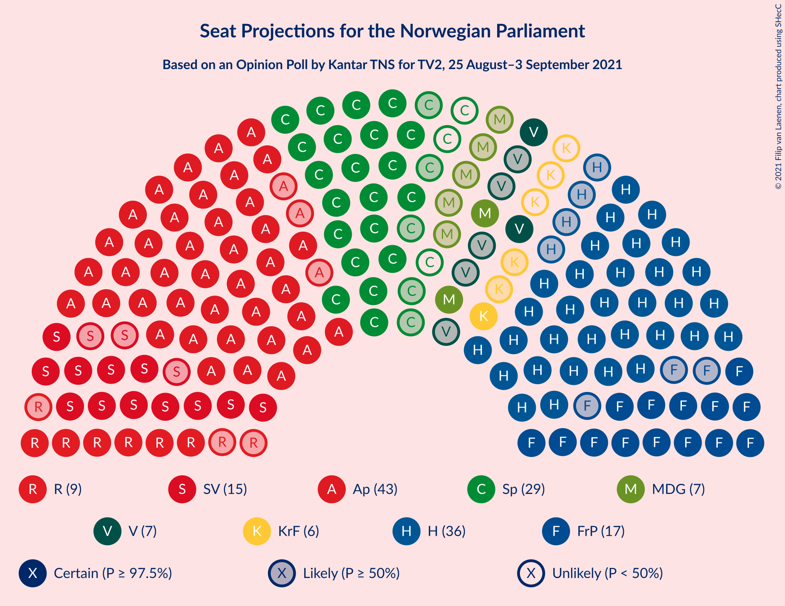
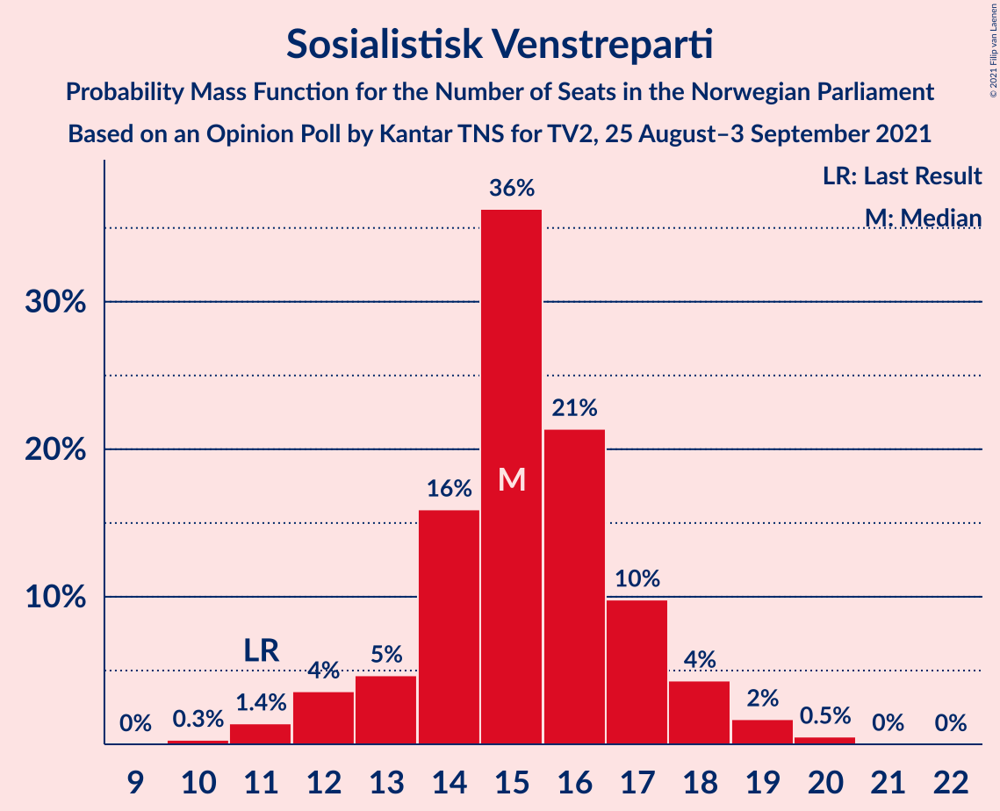
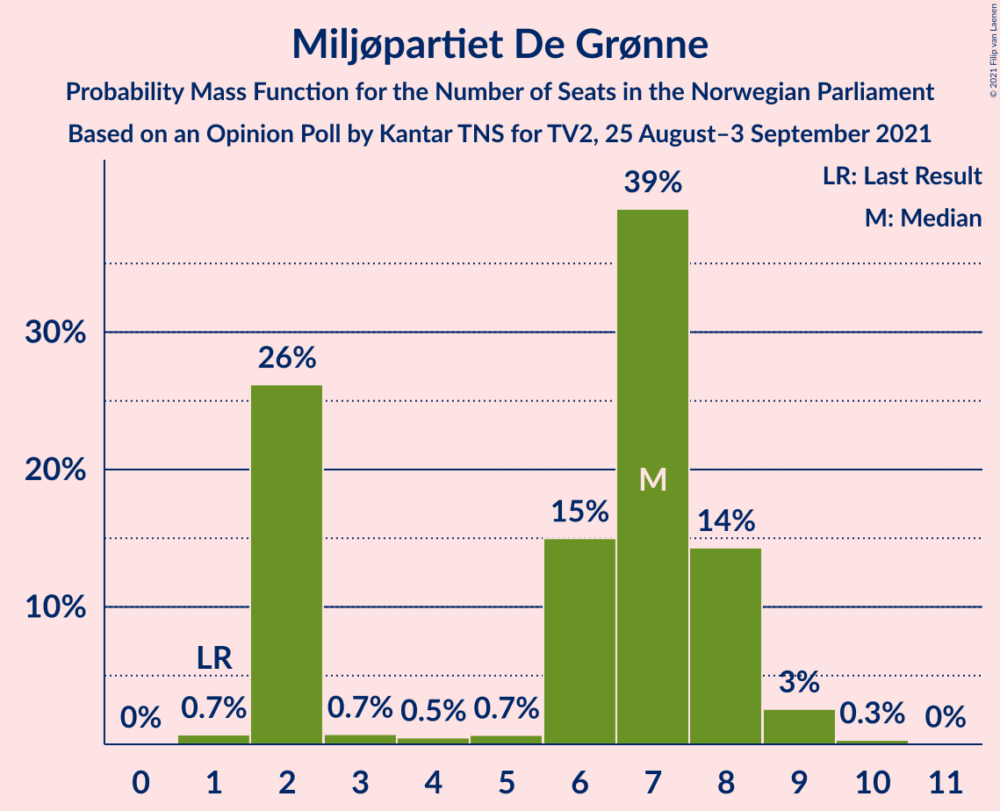
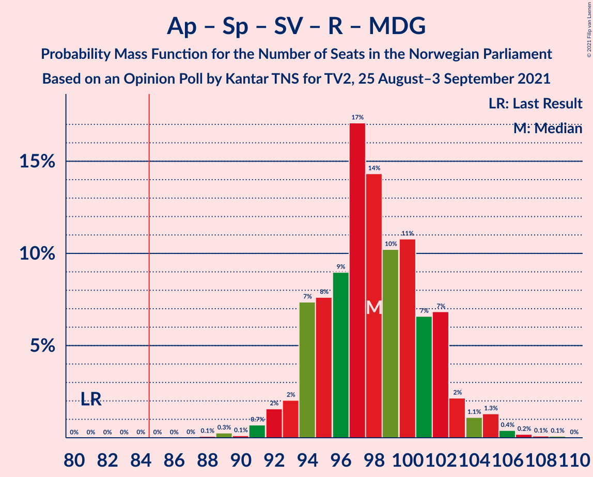
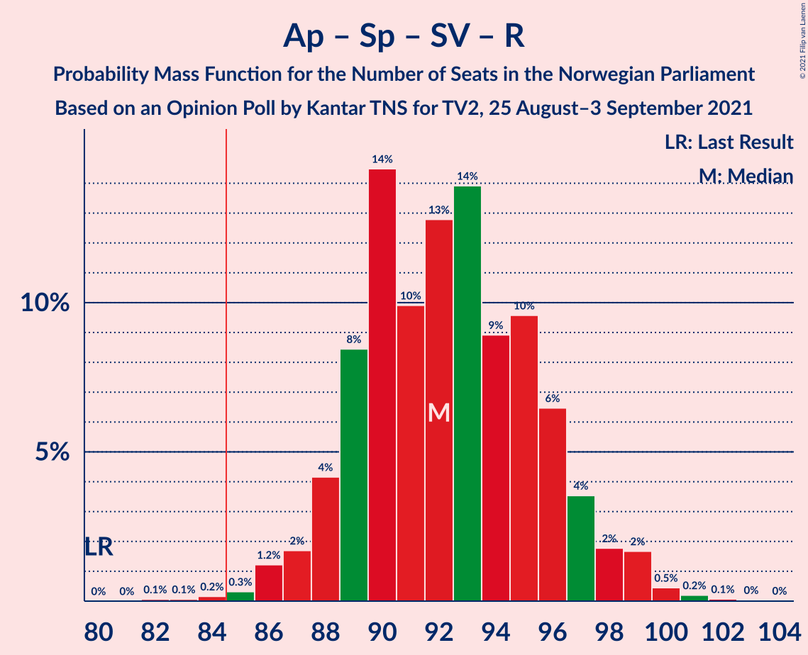
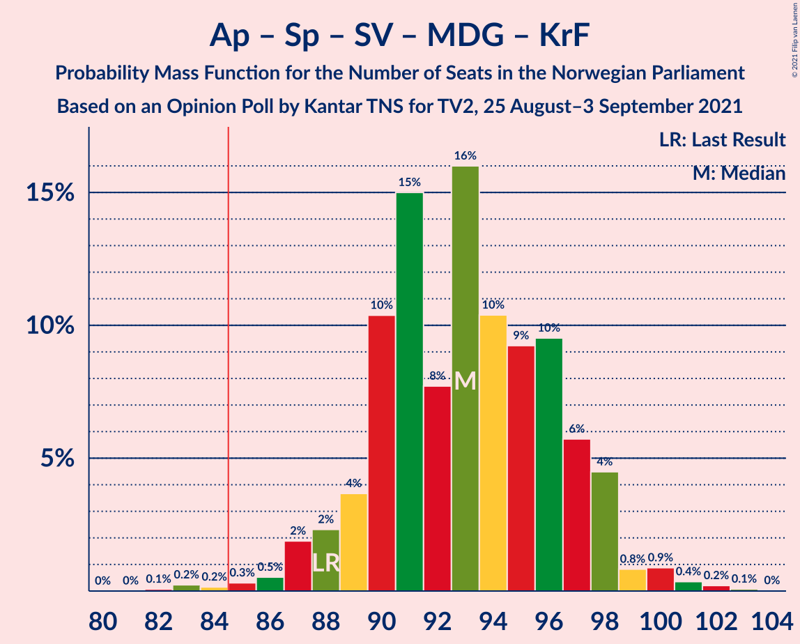
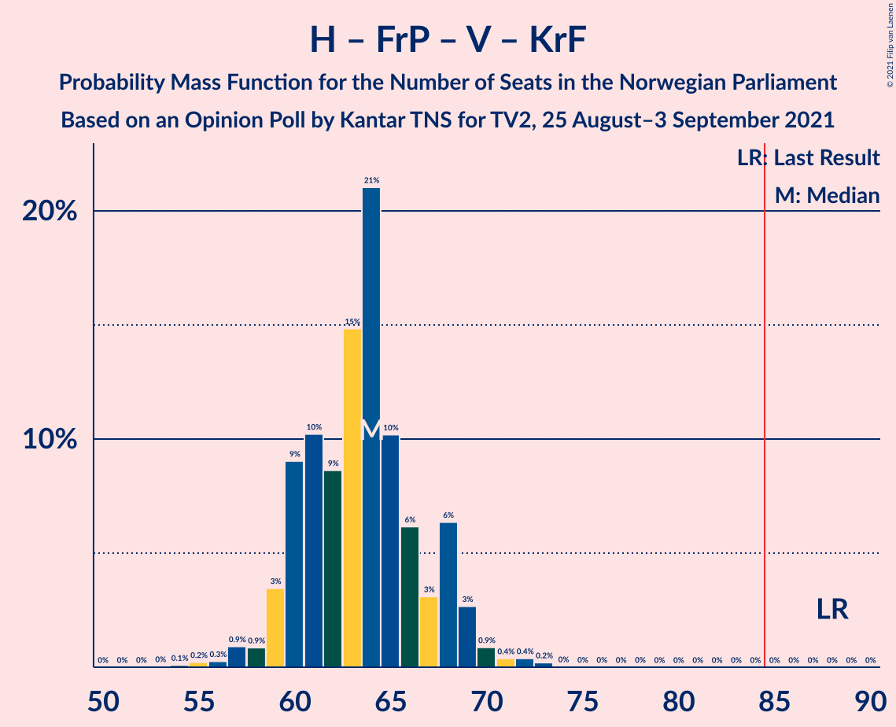

# Opinion Poll by Kantar TNS for TV2, 25 August–3 September 2021

<a href="#voting-intentions">Voting Intentions</a> | <a href="#seats">Seats</a> | <a href="#coalitions">Coalitions</a> | <a href="#technical-information">Technical Information</a>

## Voting Intentions

### Confidence Intervals

| Party | Last Result | Poll Result | 80% Confidence Interval | 90% Confidence Interval | 95% Confidence Interval | 99% Confidence Interval |
|:-----:|:-----------:|:-----------:|:-----------------------:|:-----------------------:|:-----------------------:|:-----------------------:|
| Arbeiderpartiet | 27.4% | 23.3% | 21.9–24.8% |21.5–25.3% |21.2–25.7% |20.5–26.4% |
| Høyre | 25.0% | 20.5% | 19.1–21.9% |18.7–22.3% |18.4–22.7% |17.8–23.4% |
| Senterpartiet | 10.3% | 14.0% | 12.8–15.2% |12.5–15.6% |12.2–15.9% |11.7–16.5% |
| Fremskrittspartiet | 15.2% | 10.0% | 9.0–11.1% |8.8–11.4% |8.5–11.7% |8.1–12.3% |
| Sosialistisk Venstreparti | 6.0% | 9.4% | 8.4–10.4% |8.2–10.7% |7.9–11.0% |7.5–11.6% |
| Rødt | 2.4% | 5.4% | 4.7–6.3% |4.5–6.5% |4.3–6.7% |4.0–7.2% |
| Venstre | 4.4% | 4.6% | 4.0–5.4% |3.8–5.7% |3.6–5.9% |3.3–6.3% |
| Miljøpartiet De Grønne | 3.2% | 4.3% | 3.7–5.1% |3.5–5.3% |3.4–5.5% |3.1–5.9% |
| Kristelig Folkeparti | 4.2% | 3.6% | 3.0–4.3% |2.9–4.5% |2.7–4.7% |2.5–5.1% |

*Note:* The poll result column reflects the actual value used in the calculations. Published results may vary slightly, and in addition be rounded to fewer digits.

## Seats

### Confidence Intervals

| Party | Last Result | Median | 80% Confidence Interval | 90% Confidence Interval | 95% Confidence Interval | 99% Confidence Interval |
|:-----:|:-----------:|:------:|:-----------------------:|:-----------------------:|:-----------------------:|:-----------------------:|
| <a href="#arbeiderpartiet">Arbeiderpartiet</a> | 49 | 42 | 41–45 |40–45 |40–46 |39–48 |
| <a href="#høyre">Høyre</a> | 45 | 36 | 34–37 |33–38 |32–39 |32–41 |
| <a href="#senterpartiet">Senterpartiet</a> | 19 | 26 | 23–29 |22–30 |21–31 |20–32 |
| <a href="#fremskrittspartiet">Fremskrittspartiet</a> | 27 | 17 | 15–18 |15–19 |14–20 |14–22 |
| <a href="#sosialistisk-venstreparti">Sosialistisk Venstreparti</a> | 11 | 15 | 14–17 |12–18 |12–19 |11–19 |
| <a href="#rødt">Rødt</a> | 1 | 9 | 7–10 |7–10 |6–11 |6–11 |
| <a href="#venstre">Venstre</a> | 8 | 7 | 6–9 |6–9 |2–9 |2–10 |
| <a href="#miljøpartiet-de-grønne">Miljøpartiet De Grønne</a> | 1 | 7 | 2–8 |2–8 |2–9 |1–9 |
| <a href="#kristelig-folkeparti">Kristelig Folkeparti</a> | 8 | 3 | 2–6 |1–7 |1–7 |1–8 |

### Arbeiderpartiet

*For a full overview of the results for this party, see the [Arbeiderpartiet](party-arbeiderpartiet.html) page.*

| Number of Seats | Probability | Accumulated | Special Marks |
|:---------------:|:-----------:|:-----------:|:-------------:|
| 38 | 0.1% | 100% |  |
| 39 | 0.4% | 99.9% |  |
| 40 | 5% | 99.5% |  |
| 41 | 22% | 95% |  |
| 42 | 27% | 72% | Median |
| 43 | 17% | 46% |  |
| 44 | 16% | 28% |  |
| 45 | 9% | 13% |  |
| 46 | 2% | 3% |  |
| 47 | 0.6% | 1.4% |  |
| 48 | 0.3% | 0.8% |  |
| 49 | 0.3% | 0.5% | Last Result |
| 50 | 0.1% | 0.1% |  |
| 51 | 0% | 0.1% |  |
| 52 | 0% | 0% |  |

### Høyre

*For a full overview of the results for this party, see the [Høyre](party-høyre.html) page.*

| Number of Seats | Probability | Accumulated | Special Marks |
|:---------------:|:-----------:|:-----------:|:-------------:|
| 29 | 0.1% | 100% |  |
| 30 | 0.1% | 99.9% |  |
| 31 | 0.2% | 99.8% |  |
| 32 | 2% | 99.6% |  |
| 33 | 2% | 97% |  |
| 34 | 9% | 95% |  |
| 35 | 19% | 86% |  |
| 36 | 51% | 67% | Median |
| 37 | 7% | 16% |  |
| 38 | 5% | 10% |  |
| 39 | 3% | 5% |  |
| 40 | 2% | 2% |  |
| 41 | 0.3% | 0.6% |  |
| 42 | 0.1% | 0.3% |  |
| 43 | 0.1% | 0.2% |  |
| 44 | 0% | 0.1% |  |
| 45 | 0% | 0% | Last Result |

### Senterpartiet

*For a full overview of the results for this party, see the [Senterpartiet](party-senterpartiet.html) page.*

| Number of Seats | Probability | Accumulated | Special Marks |
|:---------------:|:-----------:|:-----------:|:-------------:|
| 19 | 0.1% | 100% | Last Result |
| 20 | 1.1% | 99.9% |  |
| 21 | 2% | 98.7% |  |
| 22 | 2% | 96% |  |
| 23 | 11% | 94% |  |
| 24 | 4% | 83% |  |
| 25 | 30% | 80% |  |
| 26 | 17% | 50% | Median |
| 27 | 10% | 33% |  |
| 28 | 5% | 23% |  |
| 29 | 12% | 18% |  |
| 30 | 2% | 7% |  |
| 31 | 2% | 4% |  |
| 32 | 2% | 2% |  |
| 33 | 0.2% | 0.2% |  |
| 34 | 0% | 0% |  |

### Fremskrittspartiet

*For a full overview of the results for this party, see the [Fremskrittspartiet](party-fremskrittspartiet.html) page.*

| Number of Seats | Probability | Accumulated | Special Marks |
|:---------------:|:-----------:|:-----------:|:-------------:|
| 12 | 0.2% | 100% |  |
| 13 | 0.3% | 99.8% |  |
| 14 | 3% | 99.5% |  |
| 15 | 17% | 97% |  |
| 16 | 22% | 80% |  |
| 17 | 19% | 58% | Median |
| 18 | 31% | 39% |  |
| 19 | 4% | 8% |  |
| 20 | 2% | 4% |  |
| 21 | 1.2% | 2% |  |
| 22 | 0.4% | 0.6% |  |
| 23 | 0.1% | 0.2% |  |
| 24 | 0% | 0% |  |
| 25 | 0% | 0% |  |
| 26 | 0% | 0% |  |
| 27 | 0% | 0% | Last Result |

### Sosialistisk Venstreparti

*For a full overview of the results for this party, see the [Sosialistisk Venstreparti](party-sosialistiskvenstreparti.html) page.*

| Number of Seats | Probability | Accumulated | Special Marks |
|:---------------:|:-----------:|:-----------:|:-------------:|
| 10 | 0.3% | 100% |  |
| 11 | 1.2% | 99.7% | Last Result |
| 12 | 4% | 98% |  |
| 13 | 4% | 94% |  |
| 14 | 21% | 90% |  |
| 15 | 34% | 70% | Median |
| 16 | 20% | 35% |  |
| 17 | 7% | 15% |  |
| 18 | 5% | 8% |  |
| 19 | 2% | 3% |  |
| 20 | 0.4% | 0.5% |  |
| 21 | 0% | 0% |  |

### Rødt

*For a full overview of the results for this party, see the [Rødt](party-rødt.html) page.*

| Number of Seats | Probability | Accumulated | Special Marks |
|:---------------:|:-----------:|:-----------:|:-------------:|
| 1 | 0% | 100% | Last Result |
| 2 | 0.4% | 100% |  |
| 3 | 0% | 99.6% |  |
| 4 | 0% | 99.6% |  |
| 5 | 0% | 99.6% |  |
| 6 | 3% | 99.6% |  |
| 7 | 10% | 96% |  |
| 8 | 30% | 87% |  |
| 9 | 40% | 56% | Median |
| 10 | 12% | 16% |  |
| 11 | 4% | 4% |  |
| 12 | 0.4% | 0.5% |  |
| 13 | 0.1% | 0.1% |  |
| 14 | 0% | 0% |  |

### Venstre

*For a full overview of the results for this party, see the [Venstre](party-venstre.html) page.*

| Number of Seats | Probability | Accumulated | Special Marks |
|:---------------:|:-----------:|:-----------:|:-------------:|
| 2 | 3% | 100% |  |
| 3 | 1.4% | 97% |  |
| 4 | 0% | 96% |  |
| 5 | 0% | 96% |  |
| 6 | 8% | 96% |  |
| 7 | 55% | 88% | Median |
| 8 | 21% | 33% | Last Result |
| 9 | 11% | 12% |  |
| 10 | 1.5% | 2% |  |
| 11 | 0.1% | 0.1% |  |
| 12 | 0% | 0% |  |

### Miljøpartiet De Grønne

*For a full overview of the results for this party, see the [Miljøpartiet De Grønne](party-miljøpartietdegrønne.html) page.*

| Number of Seats | Probability | Accumulated | Special Marks |
|:---------------:|:-----------:|:-----------:|:-------------:|
| 1 | 1.0% | 100% | Last Result |
| 2 | 20% | 99.0% |  |
| 3 | 0.7% | 79% |  |
| 4 | 0.7% | 78% |  |
| 5 | 0.8% | 78% |  |
| 6 | 18% | 77% |  |
| 7 | 43% | 59% | Median |
| 8 | 12% | 16% |  |
| 9 | 3% | 4% |  |
| 10 | 0.3% | 0.4% |  |
| 11 | 0% | 0% |  |

### Kristelig Folkeparti

*For a full overview of the results for this party, see the [Kristelig Folkeparti](party-kristeligfolkeparti.html) page.*

| Number of Seats | Probability | Accumulated | Special Marks |
|:---------------:|:-----------:|:-----------:|:-------------:|
| 1 | 8% | 100% |  |
| 2 | 19% | 92% |  |
| 3 | 46% | 74% | Median |
| 4 | 0% | 28% |  |
| 5 | 0% | 28% |  |
| 6 | 22% | 28% |  |
| 7 | 5% | 6% |  |
| 8 | 0.8% | 1.0% | Last Result |
| 9 | 0.2% | 0.2% |  |
| 10 | 0% | 0% |  |

## Coalitions

### Confidence Intervals

| Coalition | Last Result | Median | Majority? | 80% Confidence Interval | 90% Confidence Interval | 95% Confidence Interval | 99% Confidence Interval |
|:---------:|:-----------:|:------:|:---------:|:-----------------------:|:-----------------------:|:-----------------------:|:-----------------------:|
| Arbeiderpartiet – Senterpartiet – Sosialistisk Venstreparti – Rødt – Miljøpartiet De Grønne | 81 | 98 | 100% | 95–102 | 94–103 | 92–105 | 91–106 |
| Arbeiderpartiet – Senterpartiet – Sosialistisk Venstreparti – Rødt | 80 | 92 | 99.7% | 89–96 | 88–97 | 88–98 | 86–100 |
| Arbeiderpartiet – Senterpartiet – Sosialistisk Venstreparti – Miljøpartiet De Grønne – Kristelig Folkeparti | 88 | 93 | 99.8% | 90–97 | 88–98 | 87–98 | 86–101 |
| Arbeiderpartiet – Senterpartiet – Sosialistisk Venstreparti – Miljøpartiet De Grønne | 80 | 89 | 98% | 86–93 | 85–94 | 85–95 | 82–97 |
| Høyre – Senterpartiet – Fremskrittspartiet – Venstre – Kristelig Folkeparti | 107 | 89 | 97% | 86–93 | 86–94 | 84–95 | 82–97 |
| Arbeiderpartiet – Senterpartiet – Sosialistisk Venstreparti | 79 | 84 | 42% | 81–87 | 80–88 | 79–89 | 77–91 |
| Arbeiderpartiet – Senterpartiet – Miljøpartiet De Grønne – Kristelig Folkeparti | 77 | 77 | 3% | 73–83 | 72–84 | 71–85 | 70–86 |
| Arbeiderpartiet – Sosialistisk Venstreparti – Rødt – Miljøpartiet De Grønne | 62 | 72 | 0% | 69–75 | 68–77 | 67–79 | 65–80 |
| Arbeiderpartiet – Senterpartiet – Kristelig Folkeparti | 76 | 71 | 0% | 69–77 | 68–78 | 67–78 | 64–80 |
| Arbeiderpartiet – Senterpartiet | 68 | 68 | 0% | 65–72 | 65–74 | 64–75 | 62–76 |
| Høyre – Fremskrittspartiet – Venstre – Miljøpartiet De Grønne – Kristelig Folkeparti | 89 | 70 | 0% | 65–73 | 65–73 | 63–75 | 61–78 |
| Høyre – Fremskrittspartiet – Venstre – Kristelig Folkeparti | 88 | 64 | 0% | 60–66 | 59–68 | 59–69 | 56–71 |
| Høyre – Fremskrittspartiet – Venstre | 80 | 60 | 0% | 57–62 | 57–64 | 56–65 | 53–67 |
| Arbeiderpartiet – Sosialistisk Venstreparti | 60 | 58 | 0% | 56–61 | 55–61 | 54–62 | 53–64 |
| Høyre – Fremskrittspartiet | 72 | 53 | 0% | 50–55 | 50–56 | 50–57 | 48–60 |
| Høyre – Venstre – Kristelig Folkeparti | 61 | 46 | 0% | 44–50 | 42–51 | 42–52 | 40–53 |
| Senterpartiet – Venstre – Kristelig Folkeparti | 35 | 36 | 0% | 33–41 | 32–42 | 31–42 | 29–44 |

### Arbeiderpartiet – Senterpartiet – Sosialistisk Venstreparti – Rødt – Miljøpartiet De Grønne

| Number of Seats | Probability | Accumulated | Special Marks |
|:---------------:|:-----------:|:-----------:|:-------------:|
| 81 | 0% | 100% | Last Result |
| 82 | 0% | 100% |  |
| 83 | 0% | 100% |  |
| 84 | 0% | 100% |  |
| 85 | 0% | 100% | Majority |
| 86 | 0% | 100% |  |
| 87 | 0% | 100% |  |
| 88 | 0% | 100% |  |
| 89 | 0.1% | 99.9% |  |
| 90 | 0.1% | 99.8% |  |
| 91 | 0.3% | 99.7% |  |
| 92 | 2% | 99.5% |  |
| 93 | 1.4% | 97% |  |
| 94 | 3% | 96% |  |
| 95 | 5% | 93% |  |
| 96 | 11% | 88% |  |
| 97 | 26% | 78% |  |
| 98 | 16% | 52% |  |
| 99 | 10% | 35% | Median |
| 100 | 4% | 25% |  |
| 101 | 6% | 21% |  |
| 102 | 9% | 14% |  |
| 103 | 2% | 5% |  |
| 104 | 1.0% | 4% |  |
| 105 | 2% | 3% |  |
| 106 | 0.3% | 0.7% |  |
| 107 | 0.2% | 0.4% |  |
| 108 | 0% | 0.2% |  |
| 109 | 0.2% | 0.2% |  |
| 110 | 0% | 0% |  |

### Arbeiderpartiet – Senterpartiet – Sosialistisk Venstreparti – Rødt

| Number of Seats | Probability | Accumulated | Special Marks |
|:---------------:|:-----------:|:-----------:|:-------------:|
| 80 | 0% | 100% | Last Result |
| 81 | 0% | 100% |  |
| 82 | 0.1% | 100% |  |
| 83 | 0.1% | 99.9% |  |
| 84 | 0.1% | 99.8% |  |
| 85 | 0.1% | 99.7% | Majority |
| 86 | 0.6% | 99.6% |  |
| 87 | 0.6% | 99.0% |  |
| 88 | 4% | 98% |  |
| 89 | 10% | 94% |  |
| 90 | 22% | 84% |  |
| 91 | 8% | 61% |  |
| 92 | 9% | 53% | Median |
| 93 | 10% | 44% |  |
| 94 | 7% | 34% |  |
| 95 | 12% | 27% |  |
| 96 | 7% | 15% |  |
| 97 | 4% | 8% |  |
| 98 | 2% | 3% |  |
| 99 | 0.8% | 2% |  |
| 100 | 0.5% | 0.8% |  |
| 101 | 0.2% | 0.3% |  |
| 102 | 0% | 0.1% |  |
| 103 | 0.1% | 0.1% |  |
| 104 | 0% | 0% |  |

### Arbeiderpartiet – Senterpartiet – Sosialistisk Venstreparti – Miljøpartiet De Grønne – Kristelig Folkeparti

| Number of Seats | Probability | Accumulated | Special Marks |
|:---------------:|:-----------:|:-----------:|:-------------:|
| 83 | 0% | 100% |  |
| 84 | 0.1% | 99.9% |  |
| 85 | 0.2% | 99.8% | Majority |
| 86 | 0.5% | 99.6% |  |
| 87 | 2% | 99.1% |  |
| 88 | 3% | 97% | Last Result |
| 89 | 2% | 94% |  |
| 90 | 10% | 92% |  |
| 91 | 20% | 81% |  |
| 92 | 10% | 62% |  |
| 93 | 9% | 52% | Median |
| 94 | 8% | 43% |  |
| 95 | 8% | 35% |  |
| 96 | 13% | 27% |  |
| 97 | 8% | 15% |  |
| 98 | 4% | 6% |  |
| 99 | 0.8% | 2% |  |
| 100 | 0.9% | 1.5% |  |
| 101 | 0.3% | 0.6% |  |
| 102 | 0.2% | 0.3% |  |
| 103 | 0.1% | 0.1% |  |
| 104 | 0% | 0% |  |

### Arbeiderpartiet – Senterpartiet – Sosialistisk Venstreparti – Miljøpartiet De Grønne

| Number of Seats | Probability | Accumulated | Special Marks |
|:---------------:|:-----------:|:-----------:|:-------------:|
| 80 | 0% | 100% | Last Result |
| 81 | 0.2% | 99.9% |  |
| 82 | 0.4% | 99.8% |  |
| 83 | 0.7% | 99.4% |  |
| 84 | 0.8% | 98.7% |  |
| 85 | 4% | 98% | Majority |
| 86 | 5% | 94% |  |
| 87 | 7% | 89% |  |
| 88 | 29% | 82% |  |
| 89 | 8% | 53% |  |
| 90 | 10% | 45% | Median |
| 91 | 9% | 35% |  |
| 92 | 9% | 26% |  |
| 93 | 10% | 18% |  |
| 94 | 4% | 8% |  |
| 95 | 3% | 4% |  |
| 96 | 0.6% | 1.3% |  |
| 97 | 0.4% | 0.7% |  |
| 98 | 0.1% | 0.3% |  |
| 99 | 0.1% | 0.2% |  |
| 100 | 0.1% | 0.1% |  |
| 101 | 0% | 0% |  |

### Høyre – Senterpartiet – Fremskrittspartiet – Venstre – Kristelig Folkeparti

| Number of Seats | Probability | Accumulated | Special Marks |
|:---------------:|:-----------:|:-----------:|:-------------:|
| 79 | 0% | 100% |  |
| 80 | 0.1% | 99.9% |  |
| 81 | 0.2% | 99.9% |  |
| 82 | 0.3% | 99.7% |  |
| 83 | 2% | 99.4% |  |
| 84 | 0.8% | 98% |  |
| 85 | 1.4% | 97% | Majority |
| 86 | 6% | 95% |  |
| 87 | 8% | 90% |  |
| 88 | 14% | 82% |  |
| 89 | 30% | 68% | Median |
| 90 | 12% | 38% |  |
| 91 | 7% | 25% |  |
| 92 | 8% | 18% |  |
| 93 | 5% | 10% |  |
| 94 | 3% | 6% |  |
| 95 | 0.9% | 3% |  |
| 96 | 1.1% | 2% |  |
| 97 | 0.3% | 0.6% |  |
| 98 | 0.1% | 0.2% |  |
| 99 | 0.1% | 0.2% |  |
| 100 | 0% | 0% |  |
| 101 | 0% | 0% |  |
| 102 | 0% | 0% |  |
| 103 | 0% | 0% |  |
| 104 | 0% | 0% |  |
| 105 | 0% | 0% |  |
| 106 | 0% | 0% |  |
| 107 | 0% | 0% | Last Result |

### Arbeiderpartiet – Senterpartiet – Sosialistisk Venstreparti

| Number of Seats | Probability | Accumulated | Special Marks |
|:---------------:|:-----------:|:-----------:|:-------------:|
| 75 | 0.2% | 100% |  |
| 76 | 0.1% | 99.8% |  |
| 77 | 0.3% | 99.7% |  |
| 78 | 1.5% | 99.3% |  |
| 79 | 2% | 98% | Last Result |
| 80 | 3% | 96% |  |
| 81 | 27% | 93% |  |
| 82 | 4% | 66% |  |
| 83 | 9% | 61% | Median |
| 84 | 10% | 53% |  |
| 85 | 14% | 42% | Majority |
| 86 | 15% | 28% |  |
| 87 | 7% | 14% |  |
| 88 | 2% | 6% |  |
| 89 | 2% | 4% |  |
| 90 | 2% | 2% |  |
| 91 | 0.5% | 0.6% |  |
| 92 | 0.1% | 0.2% |  |
| 93 | 0.1% | 0.1% |  |
| 94 | 0% | 0% |  |

### Arbeiderpartiet – Senterpartiet – Miljøpartiet De Grønne – Kristelig Folkeparti

| Number of Seats | Probability | Accumulated | Special Marks |
|:---------------:|:-----------:|:-----------:|:-------------:|
| 68 | 0.1% | 100% |  |
| 69 | 0.2% | 99.9% |  |
| 70 | 0.8% | 99.7% |  |
| 71 | 2% | 98.9% |  |
| 72 | 3% | 97% |  |
| 73 | 3% | 93% |  |
| 74 | 5% | 90% |  |
| 75 | 2% | 85% |  |
| 76 | 24% | 83% |  |
| 77 | 10% | 59% | Last Result |
| 78 | 10% | 49% | Median |
| 79 | 7% | 39% |  |
| 80 | 5% | 32% |  |
| 81 | 8% | 27% |  |
| 82 | 8% | 19% |  |
| 83 | 7% | 12% |  |
| 84 | 2% | 5% |  |
| 85 | 2% | 3% | Majority |
| 86 | 0.3% | 0.6% |  |
| 87 | 0.1% | 0.3% |  |
| 88 | 0.1% | 0.2% |  |
| 89 | 0.1% | 0.1% |  |
| 90 | 0% | 0% |  |

### Arbeiderpartiet – Sosialistisk Venstreparti – Rødt – Miljøpartiet De Grønne

| Number of Seats | Probability | Accumulated | Special Marks |
|:---------------:|:-----------:|:-----------:|:-------------:|
| 62 | 0.1% | 100% | Last Result |
| 63 | 0% | 99.9% |  |
| 64 | 0.1% | 99.9% |  |
| 65 | 0.6% | 99.8% |  |
| 66 | 0.6% | 99.2% |  |
| 67 | 3% | 98.6% |  |
| 68 | 3% | 96% |  |
| 69 | 3% | 93% |  |
| 70 | 8% | 90% |  |
| 71 | 11% | 81% |  |
| 72 | 32% | 70% |  |
| 73 | 20% | 38% | Median |
| 74 | 4% | 18% |  |
| 75 | 6% | 14% |  |
| 76 | 2% | 9% |  |
| 77 | 2% | 6% |  |
| 78 | 1.1% | 4% |  |
| 79 | 2% | 3% |  |
| 80 | 0.4% | 0.8% |  |
| 81 | 0.2% | 0.4% |  |
| 82 | 0.1% | 0.2% |  |
| 83 | 0.1% | 0.1% |  |
| 84 | 0% | 0% |  |

### Arbeiderpartiet – Senterpartiet – Kristelig Folkeparti

| Number of Seats | Probability | Accumulated | Special Marks |
|:---------------:|:-----------:|:-----------:|:-------------:|
| 63 | 0.1% | 100% |  |
| 64 | 0.6% | 99.8% |  |
| 65 | 0.4% | 99.2% |  |
| 66 | 1.1% | 98.8% |  |
| 67 | 2% | 98% |  |
| 68 | 2% | 95% |  |
| 69 | 26% | 94% |  |
| 70 | 6% | 68% |  |
| 71 | 12% | 62% | Median |
| 72 | 9% | 50% |  |
| 73 | 5% | 41% |  |
| 74 | 6% | 36% |  |
| 75 | 16% | 30% |  |
| 76 | 2% | 14% | Last Result |
| 77 | 7% | 12% |  |
| 78 | 4% | 5% |  |
| 79 | 0.2% | 1.1% |  |
| 80 | 0.4% | 0.9% |  |
| 81 | 0.2% | 0.4% |  |
| 82 | 0.2% | 0.3% |  |
| 83 | 0% | 0% |  |

### Arbeiderpartiet – Senterpartiet

| Number of Seats | Probability | Accumulated | Special Marks |
|:---------------:|:-----------:|:-----------:|:-------------:|
| 60 | 0.1% | 100% |  |
| 61 | 0.2% | 99.8% |  |
| 62 | 0.8% | 99.6% |  |
| 63 | 0.7% | 98.9% |  |
| 64 | 2% | 98% |  |
| 65 | 8% | 96% |  |
| 66 | 22% | 88% |  |
| 67 | 11% | 66% |  |
| 68 | 8% | 55% | Last Result, Median |
| 69 | 11% | 47% |  |
| 70 | 9% | 36% |  |
| 71 | 8% | 27% |  |
| 72 | 12% | 19% |  |
| 73 | 2% | 7% |  |
| 74 | 0.8% | 5% |  |
| 75 | 2% | 4% |  |
| 76 | 2% | 2% |  |
| 77 | 0.1% | 0.1% |  |
| 78 | 0% | 0% |  |

### Høyre – Fremskrittspartiet – Venstre – Miljøpartiet De Grønne – Kristelig Folkeparti

| Number of Seats | Probability | Accumulated | Special Marks |
|:---------------:|:-----------:|:-----------:|:-------------:|
| 60 | 0.3% | 100% |  |
| 61 | 0.2% | 99.7% |  |
| 62 | 0.7% | 99.4% |  |
| 63 | 2% | 98.7% |  |
| 64 | 1.3% | 97% |  |
| 65 | 11% | 95% |  |
| 66 | 4% | 84% |  |
| 67 | 13% | 81% |  |
| 68 | 3% | 68% |  |
| 69 | 10% | 65% |  |
| 70 | 9% | 55% | Median |
| 71 | 25% | 46% |  |
| 72 | 9% | 21% |  |
| 73 | 8% | 11% |  |
| 74 | 1.2% | 4% |  |
| 75 | 0.9% | 3% |  |
| 76 | 0.8% | 2% |  |
| 77 | 0.2% | 0.8% |  |
| 78 | 0.2% | 0.6% |  |
| 79 | 0.2% | 0.4% |  |
| 80 | 0.1% | 0.2% |  |
| 81 | 0.1% | 0.1% |  |
| 82 | 0% | 0% |  |
| 83 | 0% | 0% |  |
| 84 | 0% | 0% |  |
| 85 | 0% | 0% | Majority |
| 86 | 0% | 0% |  |
| 87 | 0% | 0% |  |
| 88 | 0% | 0% |  |
| 89 | 0% | 0% | Last Result |

### Høyre – Fremskrittspartiet – Venstre – Kristelig Folkeparti

| Number of Seats | Probability | Accumulated | Special Marks |
|:---------------:|:-----------:|:-----------:|:-------------:|
| 54 | 0.1% | 100% |  |
| 55 | 0.2% | 99.9% |  |
| 56 | 0.2% | 99.7% |  |
| 57 | 0.5% | 99.5% |  |
| 58 | 0.6% | 99.0% |  |
| 59 | 3% | 98% |  |
| 60 | 11% | 95% |  |
| 61 | 6% | 84% |  |
| 62 | 4% | 78% |  |
| 63 | 19% | 73% | Median |
| 64 | 30% | 55% |  |
| 65 | 11% | 25% |  |
| 66 | 5% | 14% |  |
| 67 | 4% | 9% |  |
| 68 | 1.4% | 6% |  |
| 69 | 3% | 4% |  |
| 70 | 0.5% | 1.3% |  |
| 71 | 0.4% | 0.8% |  |
| 72 | 0.2% | 0.4% |  |
| 73 | 0.1% | 0.2% |  |
| 74 | 0% | 0.1% |  |
| 75 | 0% | 0% |  |
| 76 | 0% | 0% |  |
| 77 | 0% | 0% |  |
| 78 | 0% | 0% |  |
| 79 | 0% | 0% |  |
| 80 | 0% | 0% |  |
| 81 | 0% | 0% |  |
| 82 | 0% | 0% |  |
| 83 | 0% | 0% |  |
| 84 | 0% | 0% |  |
| 85 | 0% | 0% | Majority |
| 86 | 0% | 0% |  |
| 87 | 0% | 0% |  |
| 88 | 0% | 0% | Last Result |

### Høyre – Fremskrittspartiet – Venstre

| Number of Seats | Probability | Accumulated | Special Marks |
|:---------------:|:-----------:|:-----------:|:-------------:|
| 51 | 0.1% | 100% |  |
| 52 | 0.2% | 99.9% |  |
| 53 | 0.3% | 99.7% |  |
| 54 | 0.7% | 99.4% |  |
| 55 | 0.8% | 98.7% |  |
| 56 | 2% | 98% |  |
| 57 | 15% | 96% |  |
| 58 | 12% | 80% |  |
| 59 | 9% | 69% |  |
| 60 | 13% | 59% | Median |
| 61 | 28% | 47% |  |
| 62 | 10% | 19% |  |
| 63 | 3% | 8% |  |
| 64 | 3% | 6% |  |
| 65 | 1.3% | 3% |  |
| 66 | 0.5% | 1.2% |  |
| 67 | 0.2% | 0.7% |  |
| 68 | 0.3% | 0.5% |  |
| 69 | 0.1% | 0.2% |  |
| 70 | 0.1% | 0.1% |  |
| 71 | 0% | 0% |  |
| 72 | 0% | 0% |  |
| 73 | 0% | 0% |  |
| 74 | 0% | 0% |  |
| 75 | 0% | 0% |  |
| 76 | 0% | 0% |  |
| 77 | 0% | 0% |  |
| 78 | 0% | 0% |  |
| 79 | 0% | 0% |  |
| 80 | 0% | 0% | Last Result |

### Arbeiderpartiet – Sosialistisk Venstreparti

| Number of Seats | Probability | Accumulated | Special Marks |
|:---------------:|:-----------:|:-----------:|:-------------:|
| 51 | 0.2% | 100% |  |
| 52 | 0.1% | 99.8% |  |
| 53 | 0.7% | 99.7% |  |
| 54 | 2% | 99.0% |  |
| 55 | 5% | 97% |  |
| 56 | 29% | 92% |  |
| 57 | 13% | 63% | Median |
| 58 | 18% | 50% |  |
| 59 | 8% | 32% |  |
| 60 | 12% | 24% | Last Result |
| 61 | 9% | 12% |  |
| 62 | 1.4% | 3% |  |
| 63 | 1.0% | 2% |  |
| 64 | 0.4% | 0.7% |  |
| 65 | 0.1% | 0.2% |  |
| 66 | 0.1% | 0.1% |  |
| 67 | 0% | 0% |  |

### Høyre – Fremskrittspartiet

| Number of Seats | Probability | Accumulated | Special Marks |
|:---------------:|:-----------:|:-----------:|:-------------:|
| 45 | 0% | 100% |  |
| 46 | 0.2% | 99.9% |  |
| 47 | 0.2% | 99.8% |  |
| 48 | 1.2% | 99.6% |  |
| 49 | 0.8% | 98% |  |
| 50 | 21% | 98% |  |
| 51 | 7% | 77% |  |
| 52 | 16% | 70% |  |
| 53 | 14% | 54% | Median |
| 54 | 27% | 40% |  |
| 55 | 6% | 13% |  |
| 56 | 4% | 8% |  |
| 57 | 2% | 4% |  |
| 58 | 0.9% | 2% |  |
| 59 | 0.5% | 1.1% |  |
| 60 | 0.4% | 0.6% |  |
| 61 | 0.1% | 0.2% |  |
| 62 | 0.1% | 0.2% |  |
| 63 | 0.1% | 0.1% |  |
| 64 | 0% | 0% |  |
| 65 | 0% | 0% |  |
| 66 | 0% | 0% |  |
| 67 | 0% | 0% |  |
| 68 | 0% | 0% |  |
| 69 | 0% | 0% |  |
| 70 | 0% | 0% |  |
| 71 | 0% | 0% |  |
| 72 | 0% | 0% | Last Result |

### Høyre – Venstre – Kristelig Folkeparti

| Number of Seats | Probability | Accumulated | Special Marks |
|:---------------:|:-----------:|:-----------:|:-------------:|
| 37 | 0.1% | 100% |  |
| 38 | 0.1% | 99.9% |  |
| 39 | 0.2% | 99.8% |  |
| 40 | 0.3% | 99.7% |  |
| 41 | 2% | 99.3% |  |
| 42 | 3% | 98% |  |
| 43 | 1.3% | 95% |  |
| 44 | 14% | 93% |  |
| 45 | 9% | 80% |  |
| 46 | 27% | 71% | Median |
| 47 | 10% | 44% |  |
| 48 | 13% | 34% |  |
| 49 | 11% | 21% |  |
| 50 | 4% | 10% |  |
| 51 | 3% | 7% |  |
| 52 | 3% | 3% |  |
| 53 | 0.3% | 0.6% |  |
| 54 | 0.1% | 0.3% |  |
| 55 | 0.1% | 0.2% |  |
| 56 | 0% | 0.1% |  |
| 57 | 0% | 0% |  |
| 58 | 0% | 0% |  |
| 59 | 0% | 0% |  |
| 60 | 0% | 0% |  |
| 61 | 0% | 0% | Last Result |

### Senterpartiet – Venstre – Kristelig Folkeparti

| Number of Seats | Probability | Accumulated | Special Marks |
|:---------------:|:-----------:|:-----------:|:-------------:|
| 26 | 0% | 100% |  |
| 27 | 0.1% | 99.9% |  |
| 28 | 0.2% | 99.8% |  |
| 29 | 0.5% | 99.6% |  |
| 30 | 0.8% | 99.1% |  |
| 31 | 2% | 98% |  |
| 32 | 2% | 96% |  |
| 33 | 7% | 95% |  |
| 34 | 4% | 88% |  |
| 35 | 29% | 84% | Last Result |
| 36 | 11% | 55% | Median |
| 37 | 7% | 44% |  |
| 38 | 6% | 37% |  |
| 39 | 14% | 31% |  |
| 40 | 5% | 17% |  |
| 41 | 5% | 12% |  |
| 42 | 5% | 7% |  |
| 43 | 0.8% | 1.5% |  |
| 44 | 0.4% | 0.6% |  |
| 45 | 0.1% | 0.3% |  |
| 46 | 0.2% | 0.2% |  |
| 47 | 0% | 0.1% |  |
| 48 | 0% | 0% |  |

## Technical Information

### Opinion Poll

+ **Polling firm:** Kantar TNS
+ **Commissioner(s):** TV2
+ **Fieldwork period:** 25 August–3 September 2021

### Calculations

+ **Sample size:** 1388
+ **Simulations done:** 524,288
+ **Error estimate:** 1.13%

