# Opinion Poll by Kantar TNS for TV2, 1–6 September 2021

<a href="#voting-intentions">Voting Intentions</a> | <a href="#seats">Seats</a> | <a href="#coalitions">Coalitions</a> | <a href="#technical-information">Technical Information</a>

## Voting Intentions

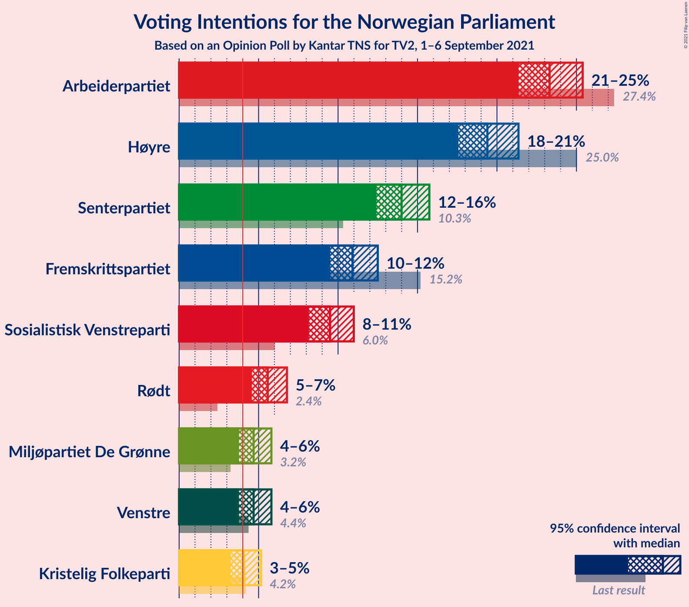

### Confidence Intervals

| Party | Last Result | Poll Result | 80% Confidence Interval | 90% Confidence Interval | 95% Confidence Interval | 99% Confidence Interval |
|:-----:|:-----------:|:-----------:|:-----------------------:|:-----------------------:|:-----------------------:|:-----------------------:|
| Arbeiderpartiet | 27.4% | 23.3% | 22.0–24.7% |21.7–25.1% |21.4–25.4% |20.7–26.1% |
| Høyre | 25.0% | 19.4% | 18.2–20.7% |17.9–21.0% |17.6–21.4% |17.0–22.0% |
| Senterpartiet | 10.3% | 14.0% | 13.0–15.1% |12.7–15.5% |12.4–15.7% |11.9–16.3% |
| Fremskrittspartiet | 15.2% | 10.9% | 10.0–11.9% |9.7–12.2% |9.5–12.5% |9.1–13.0% |
| Sosialistisk Venstreparti | 6.0% | 9.5% | 8.6–10.5% |8.4–10.7% |8.2–11.0% |7.8–11.5% |
| Rødt | 2.4% | 5.6% | 4.9–6.4% |4.7–6.6% |4.6–6.8% |4.3–7.2% |
| Miljøpartiet De Grønne | 3.2% | 4.7% | 4.1–5.4% |3.9–5.6% |3.8–5.8% |3.5–6.2% |
| Venstre | 4.4% | 4.7% | 4.1–5.4% |3.9–5.6% |3.8–5.8% |3.5–6.2% |
| Kristelig Folkeparti | 4.2% | 4.1% | 3.5–4.8% |3.4–5.0% |3.2–5.2% |3.0–5.5% |

*Note:* The poll result column reflects the actual value used in the calculations. Published results may vary slightly, and in addition be rounded to fewer digits.

## Seats

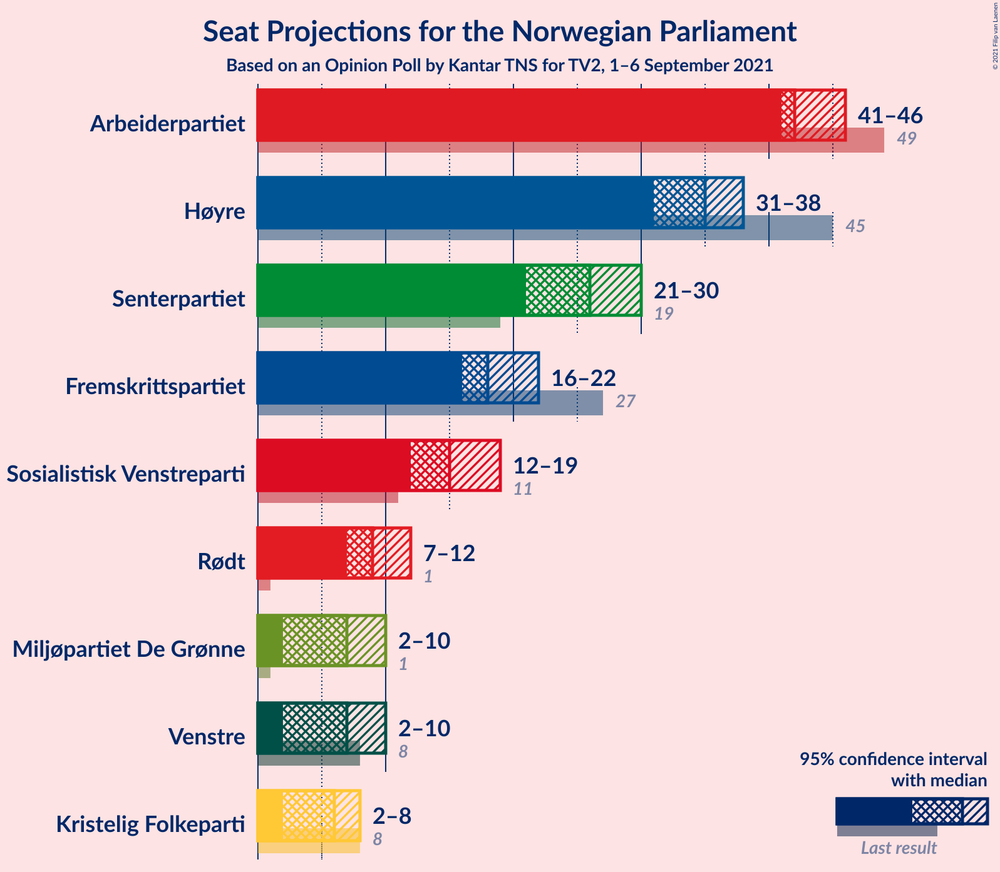

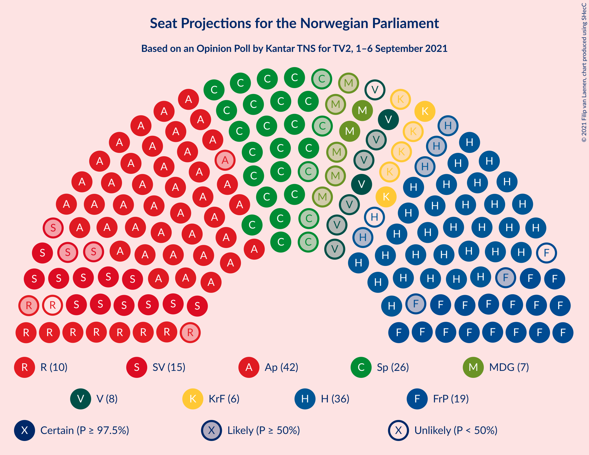

### Confidence Intervals

| Party | Last Result | Median | 80% Confidence Interval | 90% Confidence Interval | 95% Confidence Interval | 99% Confidence Interval |
|:-----:|:-----------:|:------:|:-----------------------:|:-----------------------:|:-----------------------:|:-----------------------:|
| <a href="#arbeiderpartiet">Arbeiderpartiet</a> | 49 | 42 | 41–45 |41–45 |41–46 |39–47 |
| <a href="#høyre">Høyre</a> | 45 | 35 | 32–36 |32–37 |31–38 |29–39 |
| <a href="#senterpartiet">Senterpartiet</a> | 19 | 26 | 23–28 |22–29 |21–30 |20–31 |
| <a href="#fremskrittspartiet">Fremskrittspartiet</a> | 27 | 18 | 17–21 |16–21 |16–22 |15–23 |
| <a href="#sosialistisk-venstreparti">Sosialistisk Venstreparti</a> | 11 | 15 | 14–17 |13–18 |12–19 |11–20 |
| <a href="#rødt">Rødt</a> | 1 | 9 | 8–11 |7–11 |7–12 |6–12 |
| <a href="#miljøpartiet-de-grønne">Miljøpartiet De Grønne</a> | 1 | 7 | 6–9 |2–9 |2–10 |2–10 |
| <a href="#venstre">Venstre</a> | 8 | 7 | 6–9 |2–10 |2–10 |2–10 |
| <a href="#kristelig-folkeparti">Kristelig Folkeparti</a> | 8 | 6 | 3–8 |2–8 |2–8 |1–9 |

### Arbeiderpartiet

*For a full overview of the results for this party, see the [Arbeiderpartiet](party-arbeiderpartiet.html) page.*

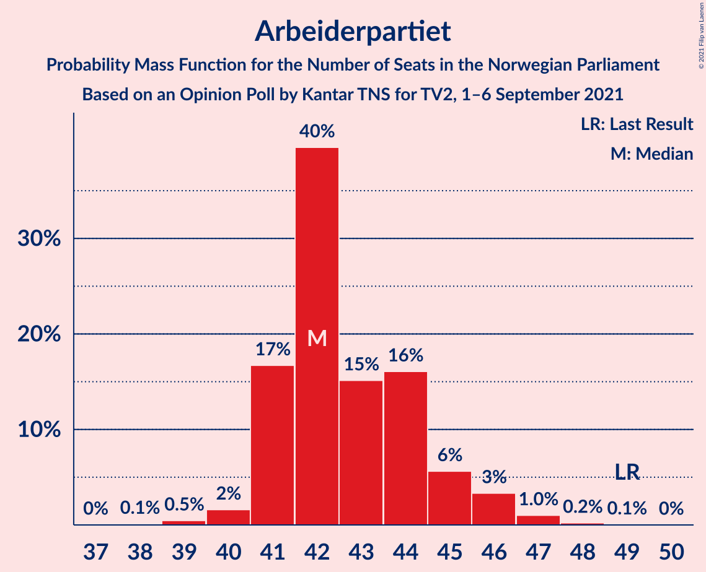

| Number of Seats | Probability | Accumulated | Special Marks |
|:---------------:|:-----------:|:-----------:|:-------------:|
| 37 | 0% | 100% |  |
| 38 | 0.1% | 99.9% |  |
| 39 | 0.5% | 99.8% |  |
| 40 | 2% | 99.4% |  |
| 41 | 17% | 98% |  |
| 42 | 40% | 81% | Median |
| 43 | 15% | 42% |  |
| 44 | 16% | 26% |  |
| 45 | 6% | 10% |  |
| 46 | 3% | 5% |  |
| 47 | 1.0% | 1.3% |  |
| 48 | 0.2% | 0.3% |  |
| 49 | 0.1% | 0.1% | Last Result |
| 50 | 0% | 0% |  |

### Høyre

*For a full overview of the results for this party, see the [Høyre](party-høyre.html) page.*

| Number of Seats | Probability | Accumulated | Special Marks |
|:---------------:|:-----------:|:-----------:|:-------------:|
| 28 | 0.1% | 100% |  |
| 29 | 0.5% | 99.9% |  |
| 30 | 0.9% | 99.4% |  |
| 31 | 3% | 98.5% |  |
| 32 | 7% | 96% |  |
| 33 | 8% | 88% |  |
| 34 | 11% | 81% |  |
| 35 | 34% | 70% | Median |
| 36 | 31% | 37% |  |
| 37 | 3% | 6% |  |
| 38 | 3% | 3% |  |
| 39 | 0.4% | 0.5% |  |
| 40 | 0.1% | 0.2% |  |
| 41 | 0% | 0% |  |
| 42 | 0% | 0% |  |
| 43 | 0% | 0% |  |
| 44 | 0% | 0% |  |
| 45 | 0% | 0% | Last Result |

### Senterpartiet

*For a full overview of the results for this party, see the [Senterpartiet](party-senterpartiet.html) page.*

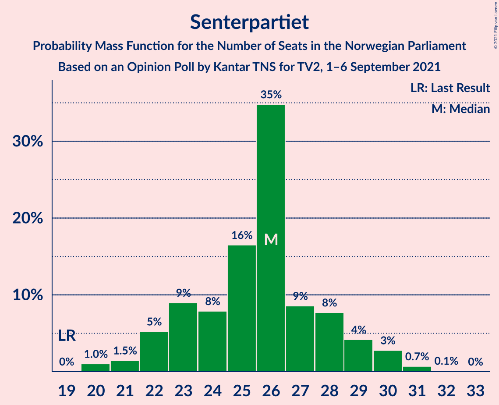

| Number of Seats | Probability | Accumulated | Special Marks |
|:---------------:|:-----------:|:-----------:|:-------------:|
| 19 | 0% | 100% | Last Result |
| 20 | 1.0% | 100% |  |
| 21 | 1.5% | 98.9% |  |
| 22 | 5% | 97% |  |
| 23 | 9% | 92% |  |
| 24 | 8% | 83% |  |
| 25 | 16% | 75% |  |
| 26 | 35% | 59% | Median |
| 27 | 9% | 24% |  |
| 28 | 8% | 16% |  |
| 29 | 4% | 8% |  |
| 30 | 3% | 4% |  |
| 31 | 0.7% | 0.8% |  |
| 32 | 0.1% | 0.1% |  |
| 33 | 0% | 0% |  |

### Fremskrittspartiet

*For a full overview of the results for this party, see the [Fremskrittspartiet](party-fremskrittspartiet.html) page.*

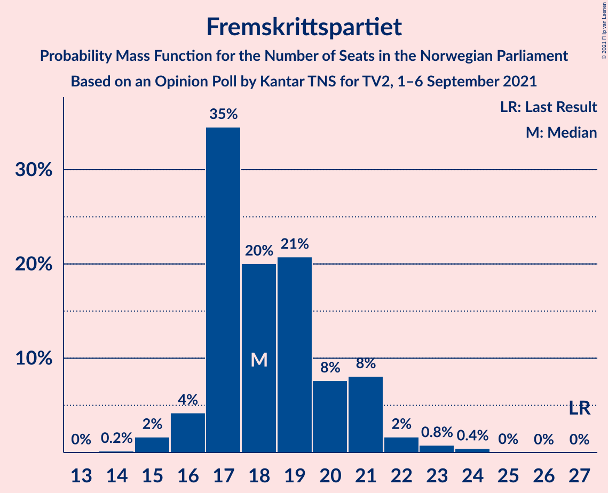

| Number of Seats | Probability | Accumulated | Special Marks |
|:---------------:|:-----------:|:-----------:|:-------------:|
| 14 | 0.2% | 100% |  |
| 15 | 2% | 99.8% |  |
| 16 | 4% | 98% |  |
| 17 | 35% | 94% |  |
| 18 | 20% | 59% | Median |
| 19 | 21% | 39% |  |
| 20 | 8% | 19% |  |
| 21 | 8% | 11% |  |
| 22 | 2% | 3% |  |
| 23 | 0.8% | 1.3% |  |
| 24 | 0.4% | 0.5% |  |
| 25 | 0% | 0.1% |  |
| 26 | 0% | 0% |  |
| 27 | 0% | 0% | Last Result |

### Sosialistisk Venstreparti

*For a full overview of the results for this party, see the [Sosialistisk Venstreparti](party-sosialistiskvenstreparti.html) page.*

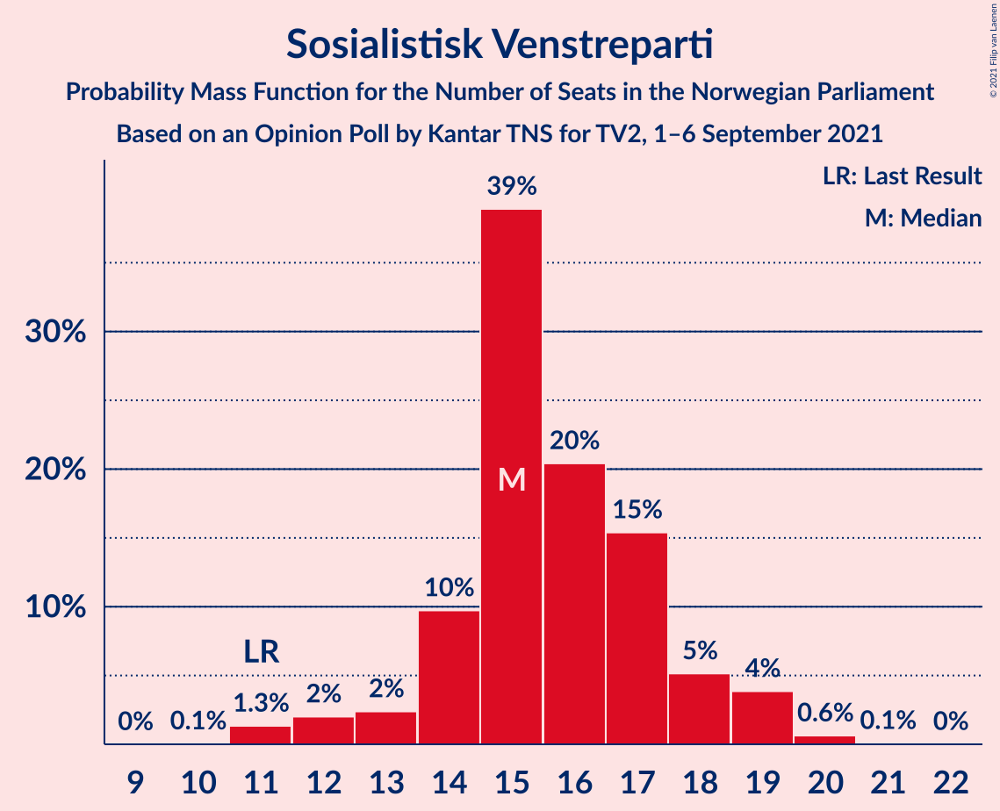

| Number of Seats | Probability | Accumulated | Special Marks |
|:---------------:|:-----------:|:-----------:|:-------------:|
| 10 | 0.1% | 100% |  |
| 11 | 1.3% | 99.9% | Last Result |
| 12 | 2% | 98.6% |  |
| 13 | 2% | 97% |  |
| 14 | 10% | 94% |  |
| 15 | 39% | 84% | Median |
| 16 | 20% | 46% |  |
| 17 | 15% | 25% |  |
| 18 | 5% | 10% |  |
| 19 | 4% | 5% |  |
| 20 | 0.6% | 0.7% |  |
| 21 | 0.1% | 0.1% |  |
| 22 | 0% | 0% |  |

### Rødt

*For a full overview of the results for this party, see the [Rødt](party-rødt.html) page.*

| Number of Seats | Probability | Accumulated | Special Marks |
|:---------------:|:-----------:|:-----------:|:-------------:|
| 1 | 0% | 100% | Last Result |
| 2 | 0% | 100% |  |
| 3 | 0% | 100% |  |
| 4 | 0% | 100% |  |
| 5 | 0% | 100% |  |
| 6 | 0.9% | 100% |  |
| 7 | 5% | 99.1% |  |
| 8 | 34% | 94% |  |
| 9 | 31% | 60% | Median |
| 10 | 17% | 29% |  |
| 11 | 10% | 12% |  |
| 12 | 3% | 3% |  |
| 13 | 0.2% | 0.3% |  |
| 14 | 0.1% | 0.1% |  |
| 15 | 0% | 0% |  |

### Miljøpartiet De Grønne

*For a full overview of the results for this party, see the [Miljøpartiet De Grønne](party-miljøpartietdegrønne.html) page.*

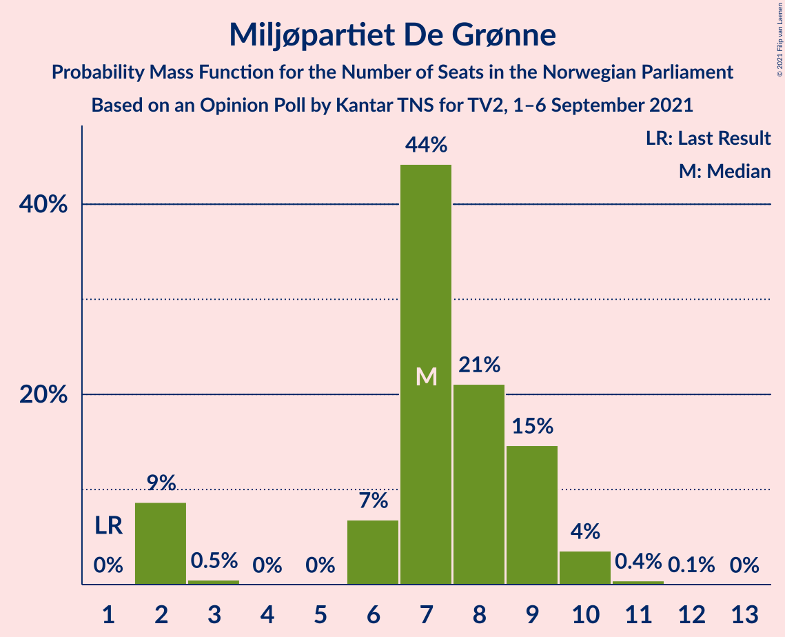

| Number of Seats | Probability | Accumulated | Special Marks |
|:---------------:|:-----------:|:-----------:|:-------------:|
| 1 | 0% | 100% | Last Result |
| 2 | 9% | 100% |  |
| 3 | 0.5% | 91% |  |
| 4 | 0% | 91% |  |
| 5 | 0% | 91% |  |
| 6 | 7% | 91% |  |
| 7 | 44% | 84% | Median |
| 8 | 21% | 40% |  |
| 9 | 15% | 19% |  |
| 10 | 4% | 4% |  |
| 11 | 0.4% | 0.5% |  |
| 12 | 0.1% | 0.1% |  |
| 13 | 0% | 0% |  |

### Venstre

*For a full overview of the results for this party, see the [Venstre](party-venstre.html) page.*

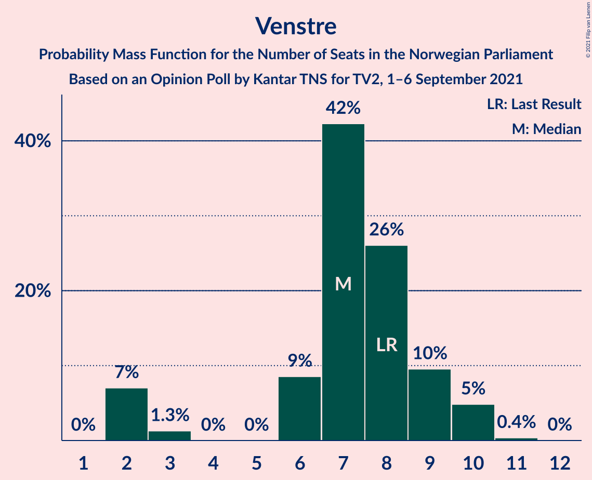

| Number of Seats | Probability | Accumulated | Special Marks |
|:---------------:|:-----------:|:-----------:|:-------------:|
| 2 | 7% | 100% |  |
| 3 | 1.3% | 93% |  |
| 4 | 0% | 92% |  |
| 5 | 0% | 92% |  |
| 6 | 9% | 92% |  |
| 7 | 42% | 83% | Median |
| 8 | 26% | 41% | Last Result |
| 9 | 10% | 15% |  |
| 10 | 5% | 5% |  |
| 11 | 0.4% | 0.4% |  |
| 12 | 0% | 0% |  |

### Kristelig Folkeparti

*For a full overview of the results for this party, see the [Kristelig Folkeparti](party-kristeligfolkeparti.html) page.*

| Number of Seats | Probability | Accumulated | Special Marks |
|:---------------:|:-----------:|:-----------:|:-------------:|
| 1 | 1.0% | 100% |  |
| 2 | 6% | 99.0% |  |
| 3 | 29% | 94% |  |
| 4 | 0% | 64% |  |
| 5 | 0% | 64% |  |
| 6 | 32% | 64% | Median |
| 7 | 16% | 33% |  |
| 8 | 15% | 17% | Last Result |
| 9 | 1.3% | 1.5% |  |
| 10 | 0.1% | 0.1% |  |
| 11 | 0% | 0% |  |

## Coalitions

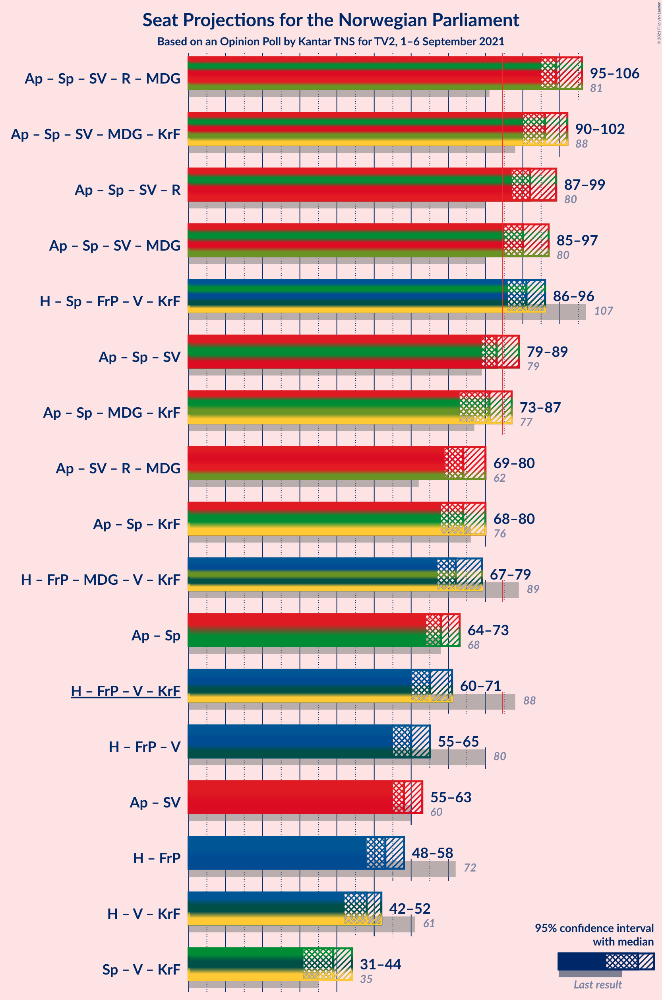

### Confidence Intervals

| Coalition | Last Result | Median | Majority? | 80% Confidence Interval | 90% Confidence Interval | 95% Confidence Interval | 99% Confidence Interval |
|:---------:|:-----------:|:------:|:---------:|:-----------------------:|:-----------------------:|:-----------------------:|:-----------------------:|
| Arbeiderpartiet – Senterpartiet – Sosialistisk Venstreparti – Rødt – Miljøpartiet De Grønne | 81 | 99 | 100% | 96–105 | 96–106 | 95–106 | 92–108 |
| Arbeiderpartiet – Senterpartiet – Sosialistisk Venstreparti – Miljøpartiet De Grønne – Kristelig Folkeparti | 88 | 96 | 100% | 92–101 | 90–102 | 90–102 | 88–105 |
| Arbeiderpartiet – Senterpartiet – Sosialistisk Venstreparti – Rødt | 80 | 92 | 99.7% | 90–97 | 89–99 | 87–99 | 86–101 |
| Arbeiderpartiet – Senterpartiet – Sosialistisk Venstreparti – Miljøpartiet De Grønne | 80 | 90 | 99.0% | 87–95 | 87–96 | 85–97 | 83–98 |
| Høyre – Senterpartiet – Fremskrittspartiet – Venstre – Kristelig Folkeparti | 107 | 91 | 98.5% | 88–94 | 87–95 | 86–96 | 84–98 |
| Arbeiderpartiet – Senterpartiet – Sosialistisk Venstreparti | 79 | 83 | 34% | 81–88 | 80–89 | 79–89 | 77–91 |
| Arbeiderpartiet – Senterpartiet – Miljøpartiet De Grønne – Kristelig Folkeparti | 77 | 81 | 12% | 76–85 | 75–86 | 73–87 | 71–89 |
| Arbeiderpartiet – Sosialistisk Venstreparti – Rødt – Miljøpartiet De Grønne | 62 | 74 | 0.1% | 71–79 | 70–80 | 69–80 | 67–82 |
| Arbeiderpartiet – Senterpartiet – Kristelig Folkeparti | 76 | 74 | 0% | 70–77 | 68–78 | 68–80 | 65–81 |
| Høyre – Fremskrittspartiet – Miljøpartiet De Grønne – Venstre – Kristelig Folkeparti | 89 | 72 | 0% | 69–77 | 68–77 | 67–79 | 64–82 |
| Arbeiderpartiet – Senterpartiet | 68 | 68 | 0% | 65–72 | 64–73 | 64–73 | 61–75 |
| Høyre – Fremskrittspartiet – Venstre – Kristelig Folkeparti | 88 | 65 | 0% | 63–69 | 61–70 | 60–71 | 57–73 |
| Høyre – Fremskrittspartiet – Venstre | 80 | 60 | 0% | 57–63 | 56–65 | 55–65 | 53–67 |
| Arbeiderpartiet – Sosialistisk Venstreparti | 60 | 58 | 0% | 56–61 | 56–62 | 55–63 | 54–64 |
| Høyre – Fremskrittspartiet | 72 | 53 | 0% | 50–56 | 49–57 | 48–58 | 47–59 |
| Høyre – Venstre – Kristelig Folkeparti | 61 | 48 | 0% | 44–51 | 43–52 | 42–52 | 39–54 |
| Senterpartiet – Venstre – Kristelig Folkeparti | 35 | 39 | 0% | 34–42 | 33–43 | 31–44 | 30–45 |

### Arbeiderpartiet – Senterpartiet – Sosialistisk Venstreparti – Rødt – Miljøpartiet De Grønne

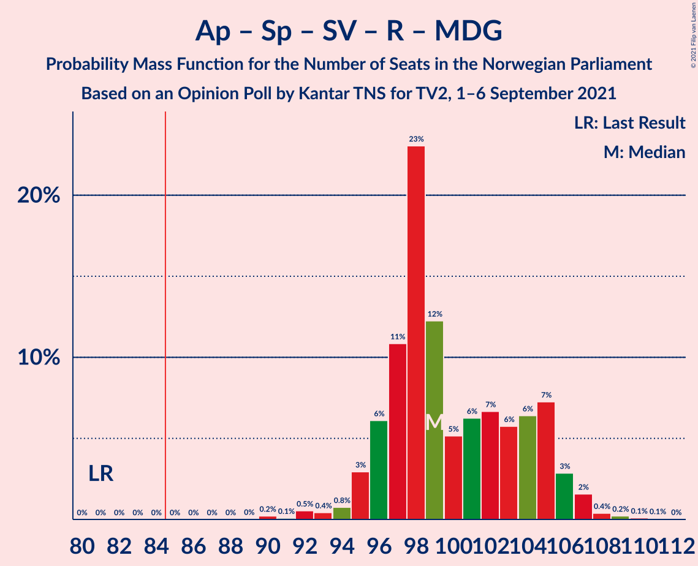

| Number of Seats | Probability | Accumulated | Special Marks |
|:---------------:|:-----------:|:-----------:|:-------------:|
| 81 | 0% | 100% | Last Result |
| 82 | 0% | 100% |  |
| 83 | 0% | 100% |  |
| 84 | 0% | 100% |  |
| 85 | 0% | 100% | Majority |
| 86 | 0% | 100% |  |
| 87 | 0% | 100% |  |
| 88 | 0% | 100% |  |
| 89 | 0% | 100% |  |
| 90 | 0.2% | 100% |  |
| 91 | 0.1% | 99.8% |  |
| 92 | 0.5% | 99.7% |  |
| 93 | 0.4% | 99.1% |  |
| 94 | 0.8% | 98.7% |  |
| 95 | 3% | 98% |  |
| 96 | 6% | 95% |  |
| 97 | 11% | 89% |  |
| 98 | 23% | 78% |  |
| 99 | 12% | 55% | Median |
| 100 | 5% | 43% |  |
| 101 | 6% | 38% |  |
| 102 | 7% | 31% |  |
| 103 | 6% | 25% |  |
| 104 | 6% | 19% |  |
| 105 | 7% | 13% |  |
| 106 | 3% | 5% |  |
| 107 | 2% | 2% |  |
| 108 | 0.4% | 0.8% |  |
| 109 | 0.2% | 0.4% |  |
| 110 | 0.1% | 0.2% |  |
| 111 | 0.1% | 0.1% |  |
| 112 | 0% | 0% |  |

### Arbeiderpartiet – Senterpartiet – Sosialistisk Venstreparti – Miljøpartiet De Grønne – Kristelig Folkeparti

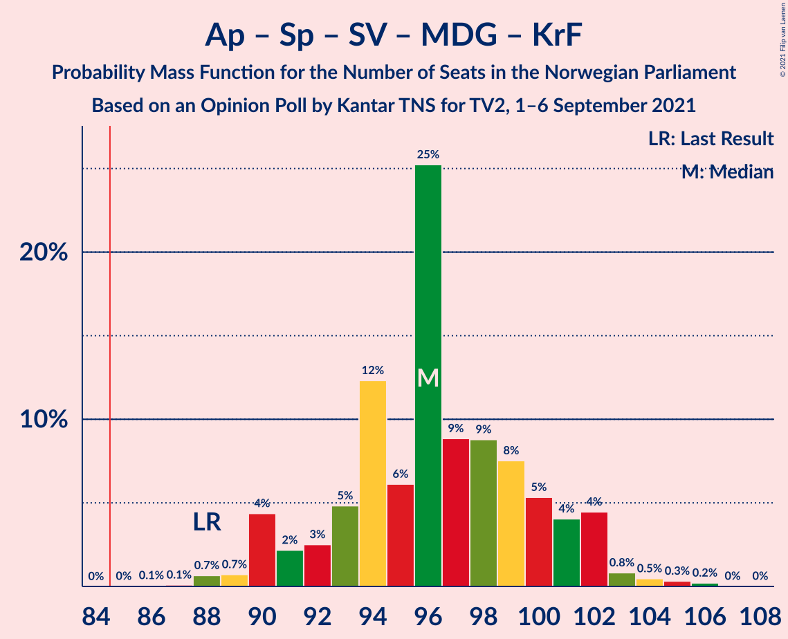

| Number of Seats | Probability | Accumulated | Special Marks |
|:---------------:|:-----------:|:-----------:|:-------------:|
| 86 | 0.1% | 100% |  |
| 87 | 0.1% | 99.9% |  |
| 88 | 0.7% | 99.8% | Last Result |
| 89 | 0.7% | 99.2% |  |
| 90 | 4% | 98% |  |
| 91 | 2% | 94% |  |
| 92 | 3% | 92% |  |
| 93 | 5% | 89% |  |
| 94 | 12% | 85% |  |
| 95 | 6% | 72% |  |
| 96 | 25% | 66% | Median |
| 97 | 9% | 41% |  |
| 98 | 9% | 32% |  |
| 99 | 8% | 23% |  |
| 100 | 5% | 16% |  |
| 101 | 4% | 10% |  |
| 102 | 4% | 6% |  |
| 103 | 0.8% | 2% |  |
| 104 | 0.5% | 1.1% |  |
| 105 | 0.3% | 0.6% |  |
| 106 | 0.2% | 0.3% |  |
| 107 | 0% | 0% |  |

### Arbeiderpartiet – Senterpartiet – Sosialistisk Venstreparti – Rødt

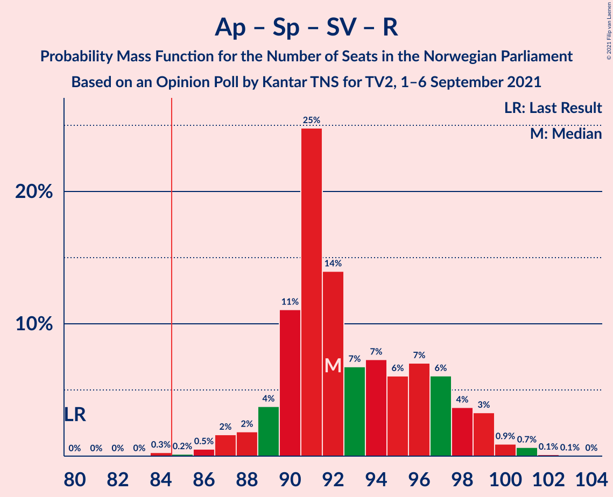

| Number of Seats | Probability | Accumulated | Special Marks |
|:---------------:|:-----------:|:-----------:|:-------------:|
| 80 | 0% | 100% | Last Result |
| 81 | 0% | 100% |  |
| 82 | 0% | 100% |  |
| 83 | 0% | 100% |  |
| 84 | 0.3% | 100% |  |
| 85 | 0.2% | 99.7% | Majority |
| 86 | 0.5% | 99.6% |  |
| 87 | 2% | 99.0% |  |
| 88 | 2% | 97% |  |
| 89 | 4% | 96% |  |
| 90 | 11% | 92% |  |
| 91 | 25% | 81% |  |
| 92 | 14% | 56% | Median |
| 93 | 7% | 42% |  |
| 94 | 7% | 35% |  |
| 95 | 6% | 28% |  |
| 96 | 7% | 22% |  |
| 97 | 6% | 15% |  |
| 98 | 4% | 9% |  |
| 99 | 3% | 5% |  |
| 100 | 0.9% | 2% |  |
| 101 | 0.7% | 0.9% |  |
| 102 | 0.1% | 0.2% |  |
| 103 | 0.1% | 0.1% |  |
| 104 | 0% | 0% |  |

### Arbeiderpartiet – Senterpartiet – Sosialistisk Venstreparti – Miljøpartiet De Grønne

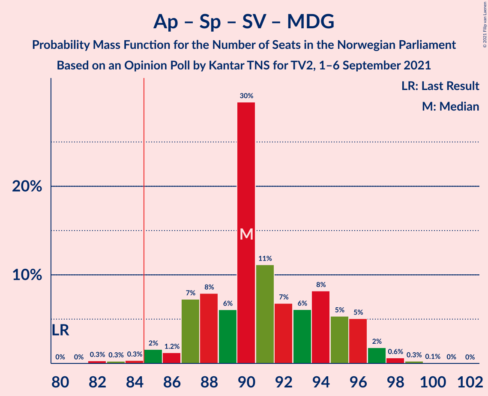

| Number of Seats | Probability | Accumulated | Special Marks |
|:---------------:|:-----------:|:-----------:|:-------------:|
| 80 | 0% | 100% | Last Result |
| 81 | 0% | 100% |  |
| 82 | 0.3% | 99.9% |  |
| 83 | 0.3% | 99.6% |  |
| 84 | 0.3% | 99.4% |  |
| 85 | 2% | 99.0% | Majority |
| 86 | 1.2% | 97% |  |
| 87 | 7% | 96% |  |
| 88 | 8% | 89% |  |
| 89 | 6% | 81% |  |
| 90 | 30% | 75% | Median |
| 91 | 11% | 45% |  |
| 92 | 7% | 34% |  |
| 93 | 6% | 28% |  |
| 94 | 8% | 21% |  |
| 95 | 5% | 13% |  |
| 96 | 5% | 8% |  |
| 97 | 2% | 3% |  |
| 98 | 0.6% | 1.0% |  |
| 99 | 0.3% | 0.4% |  |
| 100 | 0.1% | 0.1% |  |
| 101 | 0% | 0.1% |  |
| 102 | 0% | 0% |  |

### Høyre – Senterpartiet – Fremskrittspartiet – Venstre – Kristelig Folkeparti

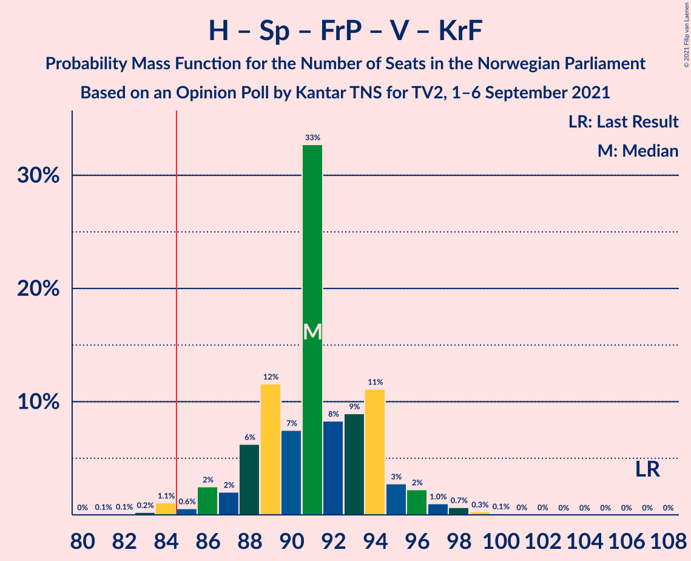

| Number of Seats | Probability | Accumulated | Special Marks |
|:---------------:|:-----------:|:-----------:|:-------------:|
| 81 | 0.1% | 100% |  |
| 82 | 0.1% | 99.9% |  |
| 83 | 0.2% | 99.8% |  |
| 84 | 1.1% | 99.6% |  |
| 85 | 0.6% | 98.5% | Majority |
| 86 | 2% | 98% |  |
| 87 | 2% | 95% |  |
| 88 | 6% | 93% |  |
| 89 | 12% | 87% |  |
| 90 | 7% | 76% |  |
| 91 | 33% | 68% |  |
| 92 | 8% | 35% | Median |
| 93 | 9% | 27% |  |
| 94 | 11% | 18% |  |
| 95 | 3% | 7% |  |
| 96 | 2% | 4% |  |
| 97 | 1.0% | 2% |  |
| 98 | 0.7% | 1.1% |  |
| 99 | 0.3% | 0.5% |  |
| 100 | 0.1% | 0.2% |  |
| 101 | 0% | 0.1% |  |
| 102 | 0% | 0% |  |
| 103 | 0% | 0% |  |
| 104 | 0% | 0% |  |
| 105 | 0% | 0% |  |
| 106 | 0% | 0% |  |
| 107 | 0% | 0% | Last Result |

### Arbeiderpartiet – Senterpartiet – Sosialistisk Venstreparti

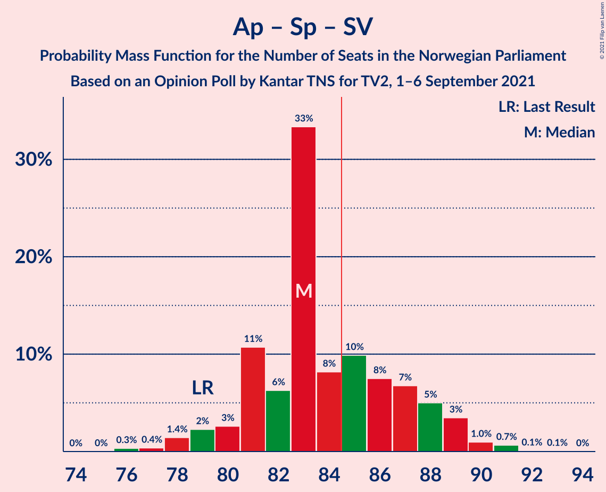

| Number of Seats | Probability | Accumulated | Special Marks |
|:---------------:|:-----------:|:-----------:|:-------------:|
| 76 | 0.3% | 100% |  |
| 77 | 0.4% | 99.6% |  |
| 78 | 1.4% | 99.3% |  |
| 79 | 2% | 98% | Last Result |
| 80 | 3% | 96% |  |
| 81 | 11% | 93% |  |
| 82 | 6% | 82% |  |
| 83 | 33% | 76% | Median |
| 84 | 8% | 43% |  |
| 85 | 10% | 34% | Majority |
| 86 | 8% | 25% |  |
| 87 | 7% | 17% |  |
| 88 | 5% | 10% |  |
| 89 | 3% | 5% |  |
| 90 | 1.0% | 2% |  |
| 91 | 0.7% | 0.8% |  |
| 92 | 0.1% | 0.2% |  |
| 93 | 0.1% | 0.1% |  |
| 94 | 0% | 0% |  |

### Arbeiderpartiet – Senterpartiet – Miljøpartiet De Grønne – Kristelig Folkeparti

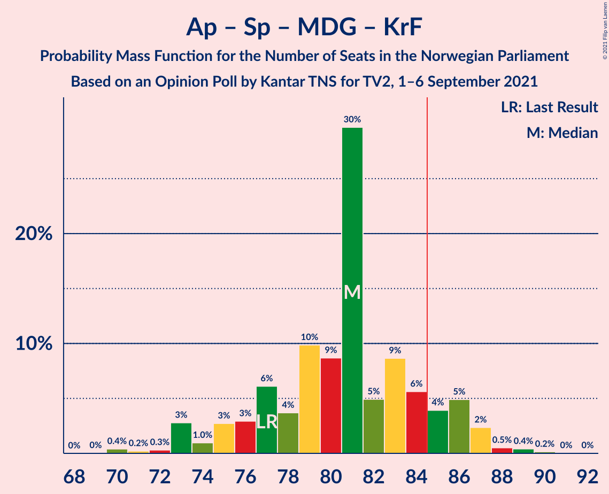

| Number of Seats | Probability | Accumulated | Special Marks |
|:---------------:|:-----------:|:-----------:|:-------------:|
| 70 | 0.4% | 100% |  |
| 71 | 0.2% | 99.6% |  |
| 72 | 0.3% | 99.3% |  |
| 73 | 3% | 99.0% |  |
| 74 | 1.0% | 96% |  |
| 75 | 3% | 95% |  |
| 76 | 3% | 93% |  |
| 77 | 6% | 90% | Last Result |
| 78 | 4% | 83% |  |
| 79 | 10% | 80% |  |
| 80 | 9% | 70% |  |
| 81 | 30% | 61% | Median |
| 82 | 5% | 32% |  |
| 83 | 9% | 27% |  |
| 84 | 6% | 18% |  |
| 85 | 4% | 12% | Majority |
| 86 | 5% | 8% |  |
| 87 | 2% | 4% |  |
| 88 | 0.5% | 1.1% |  |
| 89 | 0.4% | 0.6% |  |
| 90 | 0.2% | 0.2% |  |
| 91 | 0% | 0.1% |  |
| 92 | 0% | 0% |  |

### Arbeiderpartiet – Sosialistisk Venstreparti – Rødt – Miljøpartiet De Grønne

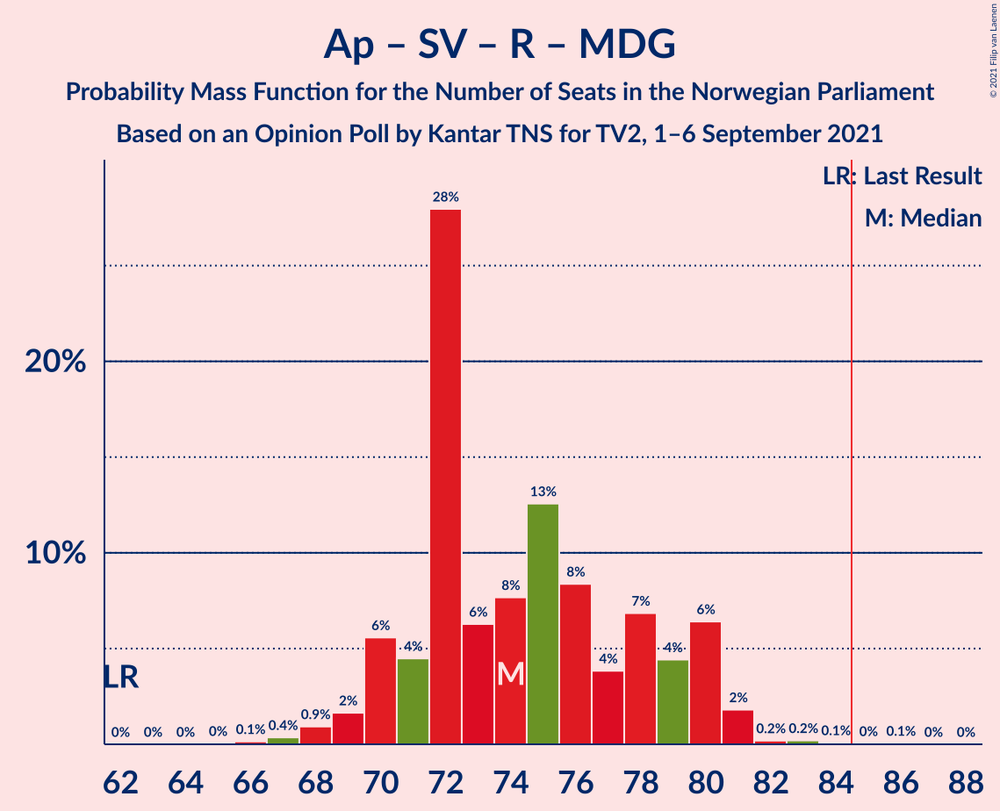

| Number of Seats | Probability | Accumulated | Special Marks |
|:---------------:|:-----------:|:-----------:|:-------------:|
| 62 | 0% | 100% | Last Result |
| 63 | 0% | 100% |  |
| 64 | 0% | 100% |  |
| 65 | 0% | 100% |  |
| 66 | 0.1% | 99.9% |  |
| 67 | 0.4% | 99.8% |  |
| 68 | 0.9% | 99.4% |  |
| 69 | 2% | 98% |  |
| 70 | 6% | 97% |  |
| 71 | 4% | 91% |  |
| 72 | 28% | 87% |  |
| 73 | 6% | 59% | Median |
| 74 | 8% | 53% |  |
| 75 | 13% | 45% |  |
| 76 | 8% | 32% |  |
| 77 | 4% | 24% |  |
| 78 | 7% | 20% |  |
| 79 | 4% | 13% |  |
| 80 | 6% | 9% |  |
| 81 | 2% | 2% |  |
| 82 | 0.2% | 0.6% |  |
| 83 | 0.2% | 0.4% |  |
| 84 | 0.1% | 0.2% |  |
| 85 | 0% | 0.1% | Majority |
| 86 | 0.1% | 0.1% |  |
| 87 | 0% | 0% |  |

### Arbeiderpartiet – Senterpartiet – Kristelig Folkeparti

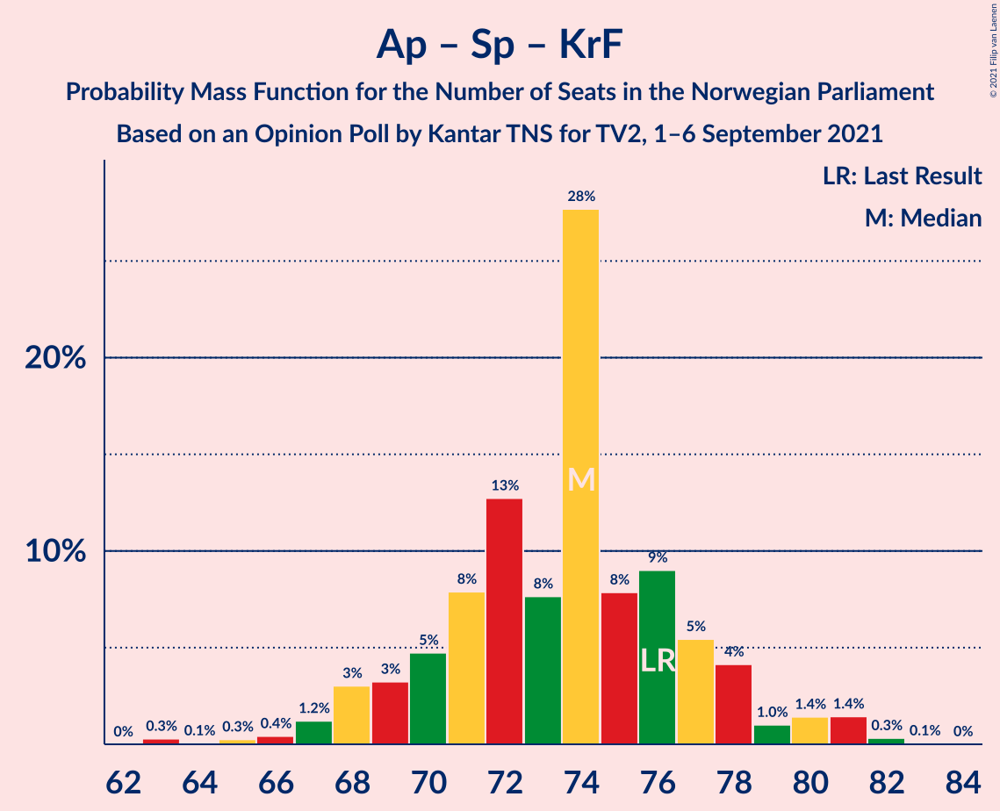

| Number of Seats | Probability | Accumulated | Special Marks |
|:---------------:|:-----------:|:-----------:|:-------------:|
| 63 | 0.3% | 100% |  |
| 64 | 0.1% | 99.7% |  |
| 65 | 0.3% | 99.6% |  |
| 66 | 0.4% | 99.4% |  |
| 67 | 1.2% | 99.0% |  |
| 68 | 3% | 98% |  |
| 69 | 3% | 95% |  |
| 70 | 5% | 91% |  |
| 71 | 8% | 87% |  |
| 72 | 13% | 79% |  |
| 73 | 8% | 66% |  |
| 74 | 28% | 58% | Median |
| 75 | 8% | 31% |  |
| 76 | 9% | 23% | Last Result |
| 77 | 5% | 14% |  |
| 78 | 4% | 8% |  |
| 79 | 1.0% | 4% |  |
| 80 | 1.4% | 3% |  |
| 81 | 1.4% | 2% |  |
| 82 | 0.3% | 0.4% |  |
| 83 | 0.1% | 0.1% |  |
| 84 | 0% | 0% |  |

### Høyre – Fremskrittspartiet – Miljøpartiet De Grønne – Venstre – Kristelig Folkeparti

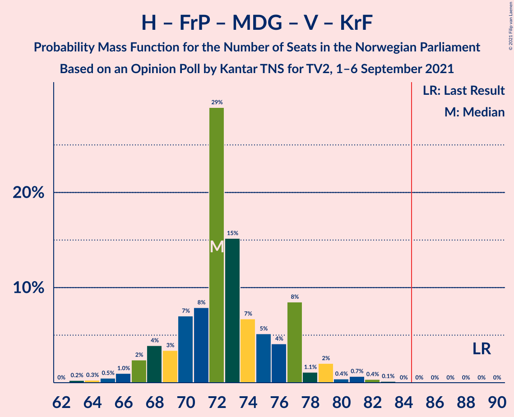

| Number of Seats | Probability | Accumulated | Special Marks |
|:---------------:|:-----------:|:-----------:|:-------------:|
| 62 | 0% | 100% |  |
| 63 | 0.2% | 99.9% |  |
| 64 | 0.3% | 99.7% |  |
| 65 | 0.5% | 99.4% |  |
| 66 | 1.0% | 98.9% |  |
| 67 | 2% | 98% |  |
| 68 | 4% | 96% |  |
| 69 | 3% | 92% |  |
| 70 | 7% | 88% |  |
| 71 | 8% | 81% |  |
| 72 | 29% | 73% |  |
| 73 | 15% | 44% | Median |
| 74 | 7% | 29% |  |
| 75 | 5% | 22% |  |
| 76 | 4% | 17% |  |
| 77 | 8% | 13% |  |
| 78 | 1.1% | 5% |  |
| 79 | 2% | 4% |  |
| 80 | 0.4% | 2% |  |
| 81 | 0.7% | 1.2% |  |
| 82 | 0.4% | 0.5% |  |
| 83 | 0.1% | 0.2% |  |
| 84 | 0% | 0% |  |
| 85 | 0% | 0% | Majority |
| 86 | 0% | 0% |  |
| 87 | 0% | 0% |  |
| 88 | 0% | 0% |  |
| 89 | 0% | 0% | Last Result |

### Arbeiderpartiet – Senterpartiet

| Number of Seats | Probability | Accumulated | Special Marks |
|:---------------:|:-----------:|:-----------:|:-------------:|
| 61 | 0.5% | 100% |  |
| 62 | 0.5% | 99.4% |  |
| 63 | 1.2% | 98.9% |  |
| 64 | 4% | 98% |  |
| 65 | 6% | 94% |  |
| 66 | 10% | 88% |  |
| 67 | 9% | 77% |  |
| 68 | 31% | 68% | Last Result, Median |
| 69 | 12% | 37% |  |
| 70 | 7% | 25% |  |
| 71 | 7% | 17% |  |
| 72 | 6% | 11% |  |
| 73 | 3% | 5% |  |
| 74 | 2% | 2% |  |
| 75 | 0.6% | 0.7% |  |
| 76 | 0.1% | 0.1% |  |
| 77 | 0% | 0% |  |

### Høyre – Fremskrittspartiet – Venstre – Kristelig Folkeparti

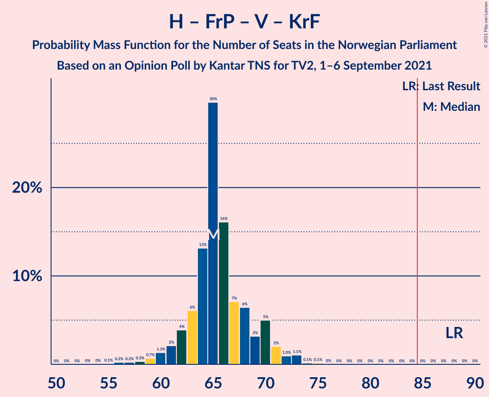

| Number of Seats | Probability | Accumulated | Special Marks |
|:---------------:|:-----------:|:-----------:|:-------------:|
| 54 | 0% | 100% |  |
| 55 | 0.1% | 99.9% |  |
| 56 | 0.2% | 99.9% |  |
| 57 | 0.2% | 99.6% |  |
| 58 | 0.3% | 99.4% |  |
| 59 | 0.7% | 99.1% |  |
| 60 | 1.3% | 98% |  |
| 61 | 2% | 97% |  |
| 62 | 4% | 95% |  |
| 63 | 6% | 91% |  |
| 64 | 13% | 85% |  |
| 65 | 30% | 72% |  |
| 66 | 16% | 42% | Median |
| 67 | 7% | 26% |  |
| 68 | 6% | 19% |  |
| 69 | 3% | 13% |  |
| 70 | 5% | 9% |  |
| 71 | 2% | 4% |  |
| 72 | 1.0% | 2% |  |
| 73 | 1.1% | 1.4% |  |
| 74 | 0.1% | 0.3% |  |
| 75 | 0.1% | 0.2% |  |
| 76 | 0% | 0% |  |
| 77 | 0% | 0% |  |
| 78 | 0% | 0% |  |
| 79 | 0% | 0% |  |
| 80 | 0% | 0% |  |
| 81 | 0% | 0% |  |
| 82 | 0% | 0% |  |
| 83 | 0% | 0% |  |
| 84 | 0% | 0% |  |
| 85 | 0% | 0% | Majority |
| 86 | 0% | 0% |  |
| 87 | 0% | 0% |  |
| 88 | 0% | 0% | Last Result |

### Høyre – Fremskrittspartiet – Venstre

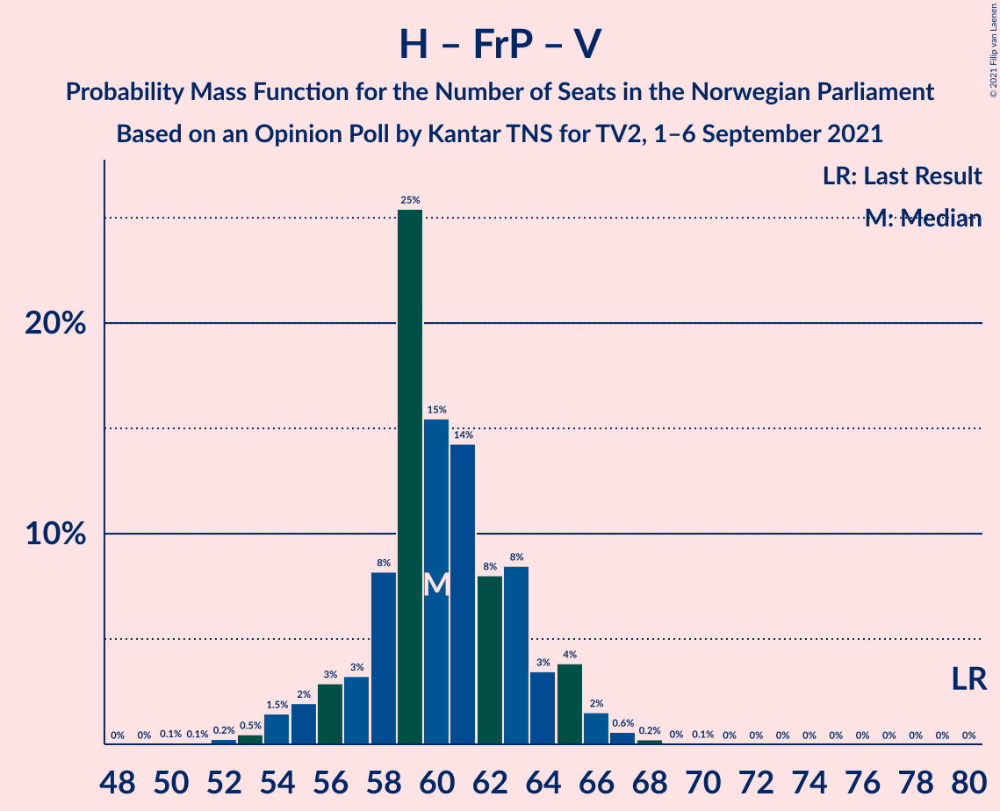

| Number of Seats | Probability | Accumulated | Special Marks |
|:---------------:|:-----------:|:-----------:|:-------------:|
| 50 | 0.1% | 100% |  |
| 51 | 0.1% | 99.9% |  |
| 52 | 0.2% | 99.8% |  |
| 53 | 0.5% | 99.6% |  |
| 54 | 1.5% | 99.1% |  |
| 55 | 2% | 98% |  |
| 56 | 3% | 96% |  |
| 57 | 3% | 93% |  |
| 58 | 8% | 90% |  |
| 59 | 25% | 81% |  |
| 60 | 15% | 56% | Median |
| 61 | 14% | 41% |  |
| 62 | 8% | 26% |  |
| 63 | 8% | 18% |  |
| 64 | 3% | 10% |  |
| 65 | 4% | 6% |  |
| 66 | 2% | 2% |  |
| 67 | 0.6% | 0.9% |  |
| 68 | 0.2% | 0.3% |  |
| 69 | 0% | 0.1% |  |
| 70 | 0.1% | 0.1% |  |
| 71 | 0% | 0% |  |
| 72 | 0% | 0% |  |
| 73 | 0% | 0% |  |
| 74 | 0% | 0% |  |
| 75 | 0% | 0% |  |
| 76 | 0% | 0% |  |
| 77 | 0% | 0% |  |
| 78 | 0% | 0% |  |
| 79 | 0% | 0% |  |
| 80 | 0% | 0% | Last Result |

### Arbeiderpartiet – Sosialistisk Venstreparti

| Number of Seats | Probability | Accumulated | Special Marks |
|:---------------:|:-----------:|:-----------:|:-------------:|
| 51 | 0.1% | 100% |  |
| 52 | 0.1% | 99.9% |  |
| 53 | 0.2% | 99.8% |  |
| 54 | 0.9% | 99.6% |  |
| 55 | 3% | 98.7% |  |
| 56 | 12% | 96% |  |
| 57 | 32% | 84% | Median |
| 58 | 14% | 52% |  |
| 59 | 14% | 38% |  |
| 60 | 8% | 24% | Last Result |
| 61 | 7% | 16% |  |
| 62 | 5% | 9% |  |
| 63 | 3% | 4% |  |
| 64 | 0.5% | 0.8% |  |
| 65 | 0.2% | 0.3% |  |
| 66 | 0.1% | 0.1% |  |
| 67 | 0% | 0% |  |

### Høyre – Fremskrittspartiet

| Number of Seats | Probability | Accumulated | Special Marks |
|:---------------:|:-----------:|:-----------:|:-------------:|
| 45 | 0% | 100% |  |
| 46 | 0.4% | 99.9% |  |
| 47 | 1.4% | 99.6% |  |
| 48 | 0.8% | 98% |  |
| 49 | 3% | 97% |  |
| 50 | 4% | 94% |  |
| 51 | 8% | 90% |  |
| 52 | 29% | 82% |  |
| 53 | 12% | 53% | Median |
| 54 | 18% | 41% |  |
| 55 | 9% | 23% |  |
| 56 | 5% | 13% |  |
| 57 | 4% | 8% |  |
| 58 | 3% | 4% |  |
| 59 | 0.5% | 0.9% |  |
| 60 | 0.2% | 0.4% |  |
| 61 | 0.1% | 0.2% |  |
| 62 | 0% | 0% |  |
| 63 | 0% | 0% |  |
| 64 | 0% | 0% |  |
| 65 | 0% | 0% |  |
| 66 | 0% | 0% |  |
| 67 | 0% | 0% |  |
| 68 | 0% | 0% |  |
| 69 | 0% | 0% |  |
| 70 | 0% | 0% |  |
| 71 | 0% | 0% |  |
| 72 | 0% | 0% | Last Result |

### Høyre – Venstre – Kristelig Folkeparti

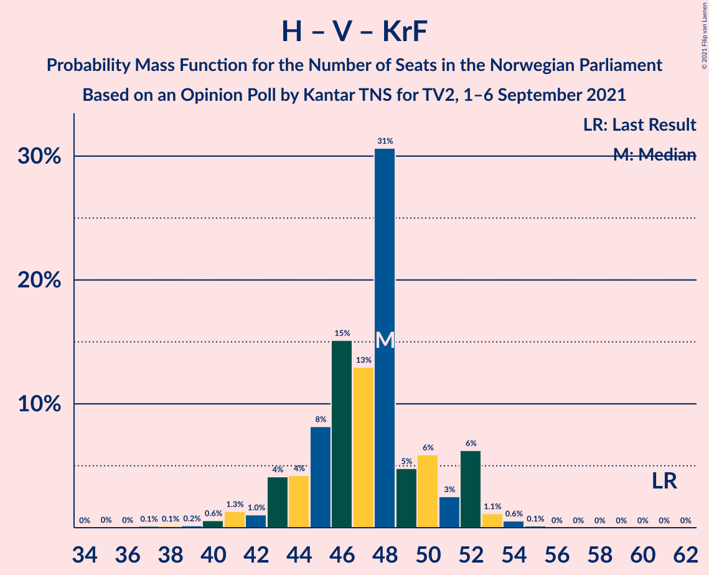

| Number of Seats | Probability | Accumulated | Special Marks |
|:---------------:|:-----------:|:-----------:|:-------------:|
| 35 | 0% | 100% |  |
| 36 | 0% | 99.9% |  |
| 37 | 0.1% | 99.9% |  |
| 38 | 0.1% | 99.8% |  |
| 39 | 0.2% | 99.6% |  |
| 40 | 0.6% | 99.5% |  |
| 41 | 1.3% | 98.9% |  |
| 42 | 1.0% | 98% |  |
| 43 | 4% | 97% |  |
| 44 | 4% | 92% |  |
| 45 | 8% | 88% |  |
| 46 | 15% | 80% |  |
| 47 | 13% | 65% |  |
| 48 | 31% | 52% | Median |
| 49 | 5% | 21% |  |
| 50 | 6% | 17% |  |
| 51 | 3% | 11% |  |
| 52 | 6% | 8% |  |
| 53 | 1.1% | 2% |  |
| 54 | 0.6% | 0.7% |  |
| 55 | 0.1% | 0.2% |  |
| 56 | 0% | 0% |  |
| 57 | 0% | 0% |  |
| 58 | 0% | 0% |  |
| 59 | 0% | 0% |  |
| 60 | 0% | 0% |  |
| 61 | 0% | 0% | Last Result |

### Senterpartiet – Venstre – Kristelig Folkeparti

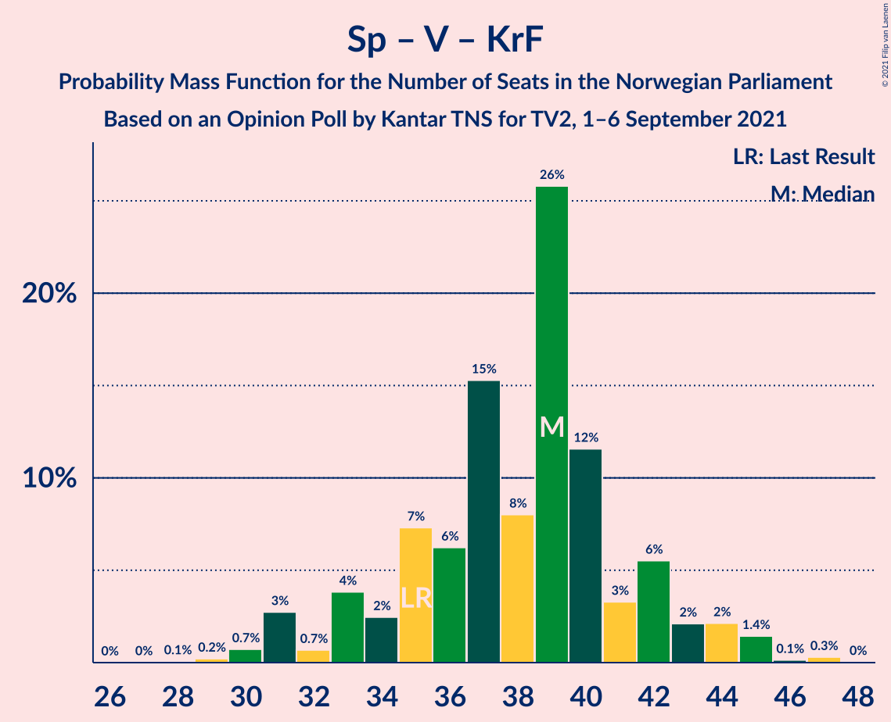

| Number of Seats | Probability | Accumulated | Special Marks |
|:---------------:|:-----------:|:-----------:|:-------------:|
| 28 | 0.1% | 100% |  |
| 29 | 0.2% | 99.9% |  |
| 30 | 0.7% | 99.7% |  |
| 31 | 3% | 98.9% |  |
| 32 | 0.7% | 96% |  |
| 33 | 4% | 96% |  |
| 34 | 2% | 92% |  |
| 35 | 7% | 89% | Last Result |
| 36 | 6% | 82% |  |
| 37 | 15% | 76% |  |
| 38 | 8% | 60% |  |
| 39 | 26% | 52% | Median |
| 40 | 12% | 27% |  |
| 41 | 3% | 15% |  |
| 42 | 6% | 12% |  |
| 43 | 2% | 6% |  |
| 44 | 2% | 4% |  |
| 45 | 1.4% | 2% |  |
| 46 | 0.1% | 0.5% |  |
| 47 | 0.3% | 0.3% |  |
| 48 | 0% | 0% |  |

## Technical Information

### Opinion Poll

+ **Polling firm:** Kantar TNS
+ **Commissioner(s):** TV2
+ **Fieldwork period:** 1–6 September 2021

### Calculations

+ **Sample size:** 1686
+ **Simulations done:** 1,048,576
+ **Error estimate:** 0.99%

