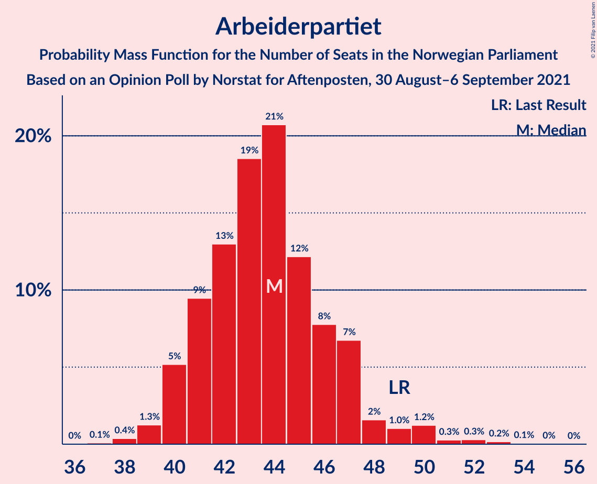
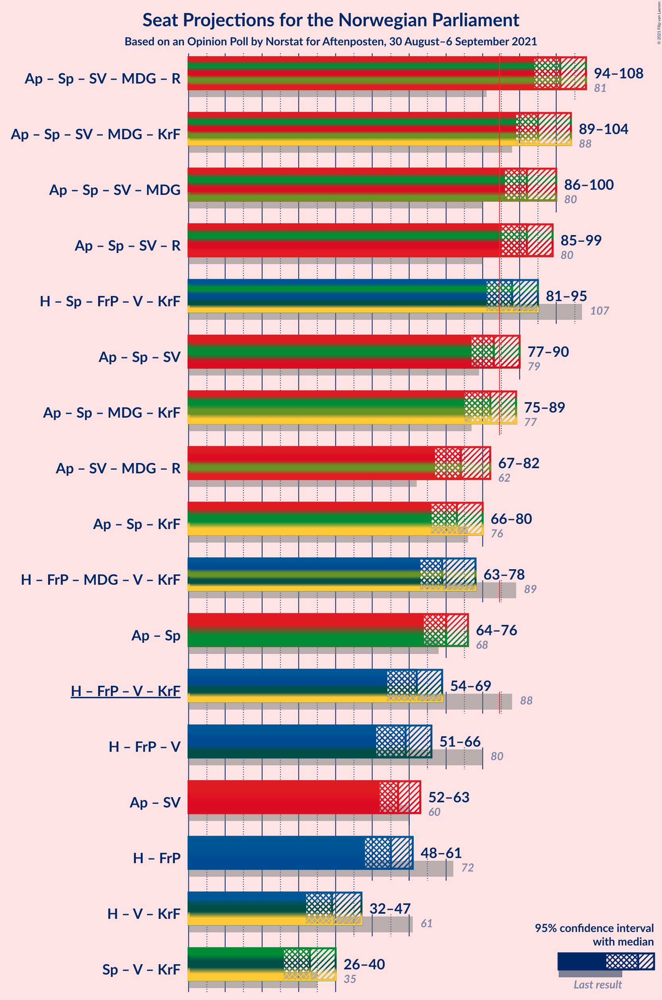
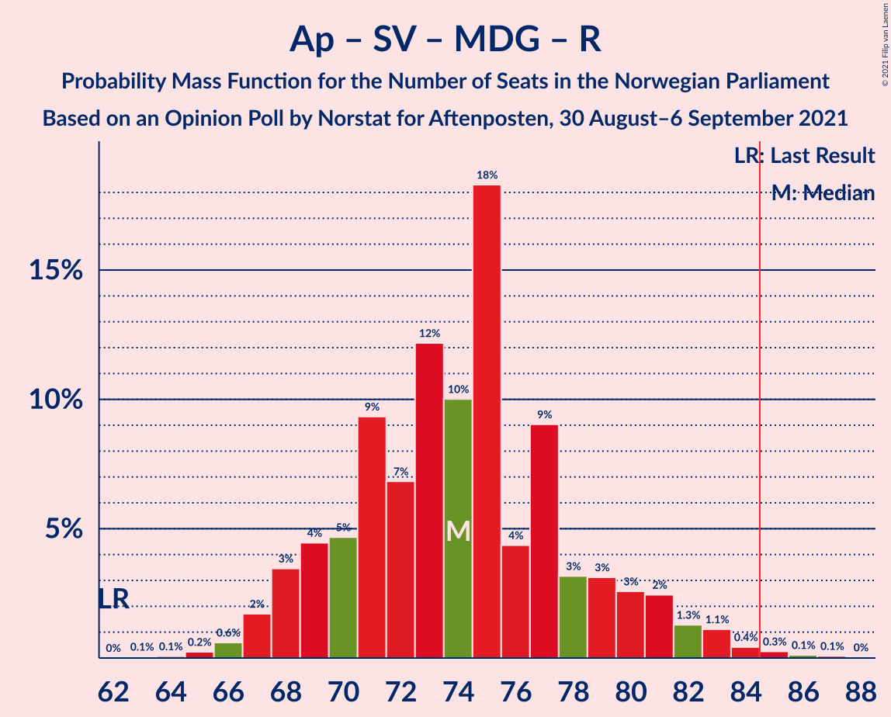
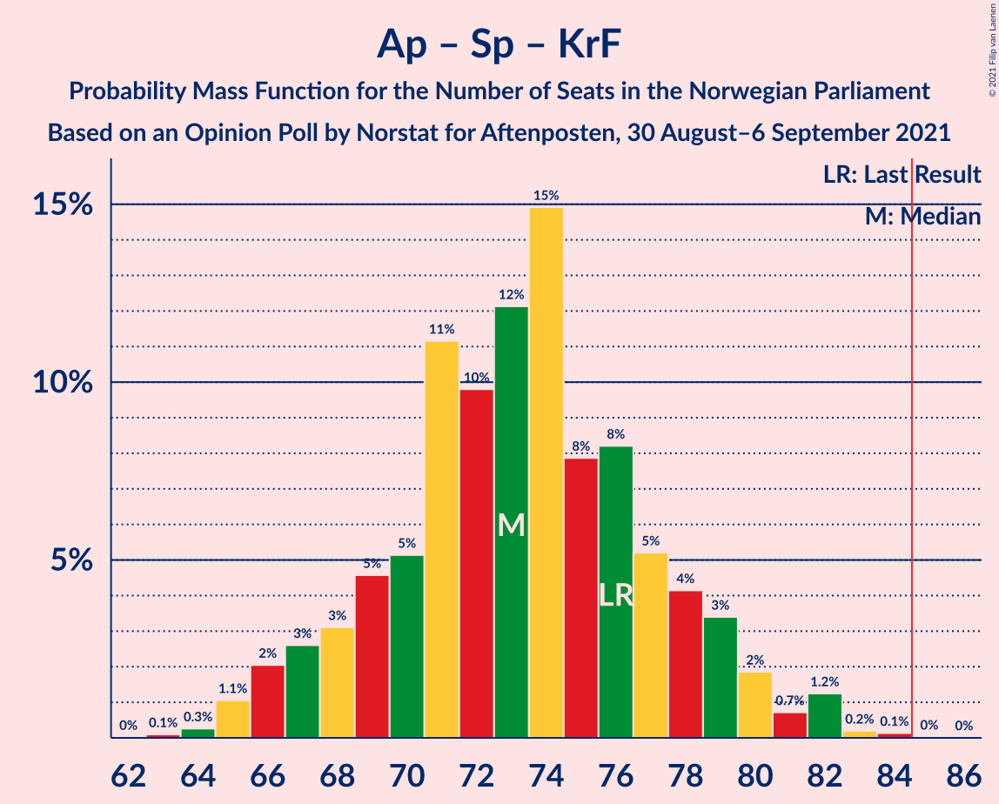
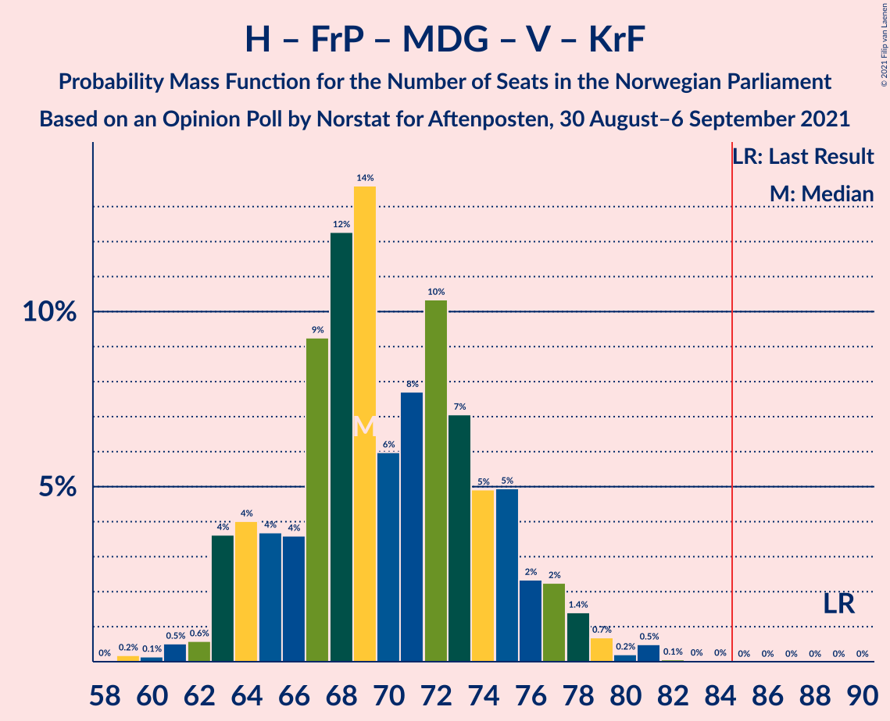
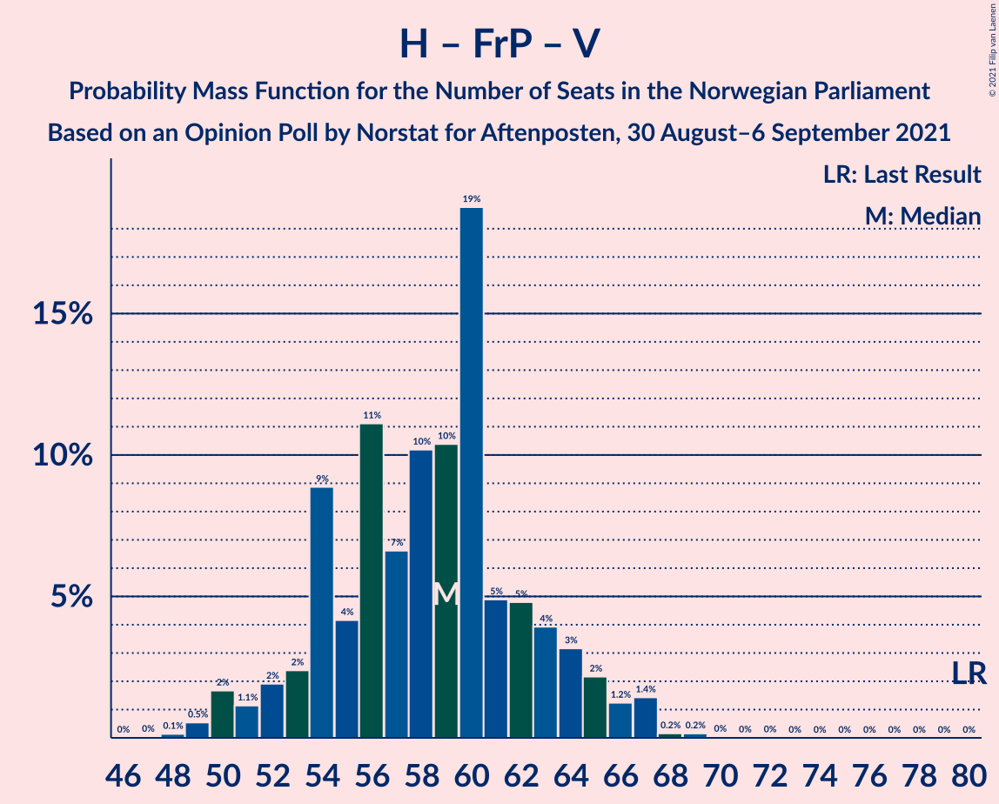

# Opinion Poll by Norstat for Aftenposten, 30 August–6 September 2021

<a href="#voting-intentions">Voting Intentions</a> | <a href="#seats">Seats</a> | <a href="#coalitions">Coalitions</a> | <a href="#technical-information">Technical Information</a>

## Voting Intentions

### Confidence Intervals

| Party | Last Result | Poll Result | 80% Confidence Interval | 90% Confidence Interval | 95% Confidence Interval | 99% Confidence Interval |
|:-----:|:-----------:|:-----------:|:-----------------------:|:-----------------------:|:-----------------------:|:-----------------------:|
| Arbeiderpartiet | 27.4% | 23.9% | 22.2–25.8% |21.8–26.3% |21.4–26.7% |20.6–27.6% |
| Høyre | 25.0% | 18.5% | 16.9–20.1% |16.5–20.6% |16.2–21.0% |15.4–21.9% |
| Senterpartiet | 10.3% | 14.3% | 13.0–15.9% |12.6–16.3% |12.3–16.7% |11.6–17.5% |
| Fremskrittspartiet | 15.2% | 12.4% | 11.1–13.8% |10.8–14.3% |10.5–14.6% |9.9–15.3% |
| Sosialistisk Venstreparti | 6.0% | 8.6% | 7.5–9.8% |7.2–10.2% |7.0–10.5% |6.5–11.1% |
| Miljøpartiet De Grønne | 3.2% | 5.4% | 4.5–6.4% |4.3–6.7% |4.1–7.0% |3.7–7.5% |
| Rødt | 2.4% | 5.2% | 4.3–6.2% |4.1–6.5% |3.9–6.8% |3.6–7.3% |
| Venstre | 4.4% | 3.6% | 2.9–4.5% |2.8–4.8% |2.6–5.0% |2.3–5.5% |
| Kristelig Folkeparti | 4.2% | 3.4% | 2.8–4.3% |2.6–4.5% |2.4–4.8% |2.1–5.2% |

*Note:* The poll result column reflects the actual value used in the calculations. Published results may vary slightly, and in addition be rounded to fewer digits.

## Seats

### Confidence Intervals

| Party | Last Result | Median | 80% Confidence Interval | 90% Confidence Interval | 95% Confidence Interval | 99% Confidence Interval |
|:-----:|:-----------:|:------:|:-----------------------:|:-----------------------:|:-----------------------:|:-----------------------:|
| <a href="#arbeiderpartiet">Arbeiderpartiet</a> | 49 | 44 | 41–47 |40–47 |40–49 |38–52 |
| <a href="#høyre">Høyre</a> | 45 | 33 | 29–36 |28–36 |28–37 |26–39 |
| <a href="#senterpartiet">Senterpartiet</a> | 19 | 27 | 23–29 |21–30 |21–31 |20–32 |
| <a href="#fremskrittspartiet">Fremskrittspartiet</a> | 27 | 23 | 18–25 |17–25 |17–26 |16–27 |
| <a href="#sosialistisk-venstreparti">Sosialistisk Venstreparti</a> | 11 | 14 | 11–16 |11–17 |11–17 |10–19 |
| <a href="#miljøpartiet-de-grønne">Miljøpartiet De Grønne</a> | 1 | 8 | 7–10 |7–11 |7–11 |2–12 |
| <a href="#rødt">Rødt</a> | 1 | 8 | 7–10 |6–11 |2–11 |2–13 |
| <a href="#venstre">Venstre</a> | 8 | 2 | 2–7 |2–7 |2–8 |1–9 |
| <a href="#kristelig-folkeparti">Kristelig Folkeparti</a> | 8 | 3 | 1–6 |1–7 |1–7 |1–8 |

### Arbeiderpartiet

*For a full overview of the results for this party, see the [Arbeiderpartiet](party-arbeiderpartiet.html) page.*

| Number of Seats | Probability | Accumulated | Special Marks |
|:---------------:|:-----------:|:-----------:|:-------------:|
| 37 | 0.1% | 100% |  |
| 38 | 0.4% | 99.9% |  |
| 39 | 1.4% | 99.5% |  |
| 40 | 4% | 98% |  |
| 41 | 10% | 94% |  |
| 42 | 12% | 85% |  |
| 43 | 16% | 72% |  |
| 44 | 24% | 57% | Median |
| 45 | 13% | 33% |  |
| 46 | 9% | 19% |  |
| 47 | 6% | 11% |  |
| 48 | 2% | 4% |  |
| 49 | 0.9% | 3% | Last Result |
| 50 | 0.7% | 2% |  |
| 51 | 0.3% | 0.9% |  |
| 52 | 0.3% | 0.6% |  |
| 53 | 0.2% | 0.3% |  |
| 54 | 0% | 0.1% |  |
| 55 | 0% | 0% |  |

### Høyre

*For a full overview of the results for this party, see the [Høyre](party-høyre.html) page.*

| Number of Seats | Probability | Accumulated | Special Marks |
|:---------------:|:-----------:|:-----------:|:-------------:|
| 25 | 0.1% | 100% |  |
| 26 | 0.4% | 99.9% |  |
| 27 | 2% | 99.5% |  |
| 28 | 3% | 98% |  |
| 29 | 9% | 95% |  |
| 30 | 13% | 86% |  |
| 31 | 7% | 73% |  |
| 32 | 7% | 65% |  |
| 33 | 10% | 59% | Median |
| 34 | 14% | 48% |  |
| 35 | 22% | 34% |  |
| 36 | 10% | 12% |  |
| 37 | 1.5% | 3% |  |
| 38 | 0.4% | 1.1% |  |
| 39 | 0.3% | 0.6% |  |
| 40 | 0.2% | 0.4% |  |
| 41 | 0.1% | 0.1% |  |
| 42 | 0% | 0% |  |
| 43 | 0% | 0% |  |
| 44 | 0% | 0% |  |
| 45 | 0% | 0% | Last Result |

### Senterpartiet

*For a full overview of the results for this party, see the [Senterpartiet](party-senterpartiet.html) page.*

| Number of Seats | Probability | Accumulated | Special Marks |
|:---------------:|:-----------:|:-----------:|:-------------:|
| 19 | 0.2% | 100% | Last Result |
| 20 | 0.9% | 99.8% |  |
| 21 | 4% | 98.8% |  |
| 22 | 1.5% | 95% |  |
| 23 | 5% | 93% |  |
| 24 | 12% | 89% |  |
| 25 | 7% | 76% |  |
| 26 | 17% | 69% |  |
| 27 | 9% | 52% | Median |
| 28 | 17% | 43% |  |
| 29 | 17% | 26% |  |
| 30 | 6% | 9% |  |
| 31 | 2% | 3% |  |
| 32 | 1.0% | 1.5% |  |
| 33 | 0.4% | 0.4% |  |
| 34 | 0% | 0.1% |  |
| 35 | 0% | 0% |  |

### Fremskrittspartiet

*For a full overview of the results for this party, see the [Fremskrittspartiet](party-fremskrittspartiet.html) page.*

| Number of Seats | Probability | Accumulated | Special Marks |
|:---------------:|:-----------:|:-----------:|:-------------:|
| 16 | 2% | 100% |  |
| 17 | 4% | 98% |  |
| 18 | 8% | 94% |  |
| 19 | 4% | 86% |  |
| 20 | 6% | 81% |  |
| 21 | 3% | 75% |  |
| 22 | 5% | 72% |  |
| 23 | 22% | 67% | Median |
| 24 | 31% | 44% |  |
| 25 | 10% | 13% |  |
| 26 | 2% | 3% |  |
| 27 | 0.9% | 1.2% | Last Result |
| 28 | 0.2% | 0.3% |  |
| 29 | 0.1% | 0.1% |  |
| 30 | 0% | 0% |  |

### Sosialistisk Venstreparti

*For a full overview of the results for this party, see the [Sosialistisk Venstreparti](party-sosialistiskvenstreparti.html) page.*

| Number of Seats | Probability | Accumulated | Special Marks |
|:---------------:|:-----------:|:-----------:|:-------------:|
| 9 | 0.1% | 100% |  |
| 10 | 2% | 99.9% |  |
| 11 | 9% | 98% | Last Result |
| 12 | 16% | 89% |  |
| 13 | 21% | 73% |  |
| 14 | 23% | 52% | Median |
| 15 | 15% | 29% |  |
| 16 | 7% | 14% |  |
| 17 | 5% | 7% |  |
| 18 | 0.9% | 2% |  |
| 19 | 0.5% | 0.6% |  |
| 20 | 0.1% | 0.2% |  |
| 21 | 0% | 0% |  |

### Miljøpartiet De Grønne

*For a full overview of the results for this party, see the [Miljøpartiet De Grønne](party-miljøpartietdegrønne.html) page.*

| Number of Seats | Probability | Accumulated | Special Marks |
|:---------------:|:-----------:|:-----------:|:-------------:|
| 1 | 0% | 100% | Last Result |
| 2 | 0.6% | 100% |  |
| 3 | 0.3% | 99.4% |  |
| 4 | 0.1% | 99.1% |  |
| 5 | 0% | 99.0% |  |
| 6 | 1.4% | 99.0% |  |
| 7 | 22% | 98% |  |
| 8 | 29% | 76% | Median |
| 9 | 27% | 47% |  |
| 10 | 12% | 20% |  |
| 11 | 7% | 8% |  |
| 12 | 1.1% | 1.3% |  |
| 13 | 0.2% | 0.2% |  |
| 14 | 0% | 0% |  |

### Rødt

*For a full overview of the results for this party, see the [Rødt](party-rødt.html) page.*

| Number of Seats | Probability | Accumulated | Special Marks |
|:---------------:|:-----------:|:-----------:|:-------------:|
| 1 | 0% | 100% | Last Result |
| 2 | 4% | 100% |  |
| 3 | 0% | 96% |  |
| 4 | 0% | 96% |  |
| 5 | 0% | 96% |  |
| 6 | 2% | 96% |  |
| 7 | 15% | 94% |  |
| 8 | 36% | 79% | Median |
| 9 | 22% | 43% |  |
| 10 | 15% | 22% |  |
| 11 | 5% | 6% |  |
| 12 | 0.9% | 1.5% |  |
| 13 | 0.6% | 0.6% |  |
| 14 | 0% | 0% |  |

### Venstre

*For a full overview of the results for this party, see the [Venstre](party-venstre.html) page.*

| Number of Seats | Probability | Accumulated | Special Marks |
|:---------------:|:-----------:|:-----------:|:-------------:|
| 1 | 0.6% | 100% |  |
| 2 | 70% | 99.4% | Median |
| 3 | 3% | 30% |  |
| 4 | 0% | 27% |  |
| 5 | 0% | 27% |  |
| 6 | 16% | 27% |  |
| 7 | 7% | 10% |  |
| 8 | 2% | 3% | Last Result |
| 9 | 0.5% | 0.6% |  |
| 10 | 0.1% | 0.1% |  |
| 11 | 0% | 0% |  |

### Kristelig Folkeparti

*For a full overview of the results for this party, see the [Kristelig Folkeparti](party-kristeligfolkeparti.html) page.*

| Number of Seats | Probability | Accumulated | Special Marks |
|:---------------:|:-----------:|:-----------:|:-------------:|
| 0 | 0.1% | 100% |  |
| 1 | 22% | 99.9% |  |
| 2 | 21% | 77% |  |
| 3 | 43% | 57% | Median |
| 4 | 0% | 14% |  |
| 5 | 0.1% | 14% |  |
| 6 | 7% | 14% |  |
| 7 | 5% | 7% |  |
| 8 | 1.3% | 1.5% | Last Result |
| 9 | 0.1% | 0.1% |  |
| 10 | 0% | 0% |  |

## Coalitions

### Confidence Intervals

| Coalition | Last Result | Median | Majority? | 80% Confidence Interval | 90% Confidence Interval | 95% Confidence Interval | 99% Confidence Interval |
|:---------:|:-----------:|:------:|:---------:|:-----------------------:|:-----------------------:|:-----------------------:|:-----------------------:|
| Arbeiderpartiet – Senterpartiet – Sosialistisk Venstreparti – Miljøpartiet De Grønne – Rødt | 81 | 101 | 100% | 97–106 | 94–107 | 94–108 | 92–111 |
| Arbeiderpartiet – Senterpartiet – Sosialistisk Venstreparti – Miljøpartiet De Grønne – Kristelig Folkeparti | 88 | 95 | 99.9% | 91–100 | 90–102 | 88–104 | 87–107 |
| Arbeiderpartiet – Senterpartiet – Sosialistisk Venstreparti – Miljøpartiet De Grønne | 80 | 92 | 99.4% | 88–97 | 87–98 | 86–99 | 84–103 |
| Arbeiderpartiet – Senterpartiet – Sosialistisk Venstreparti – Rødt | 80 | 92 | 98% | 88–97 | 86–98 | 85–99 | 83–102 |
| Høyre – Senterpartiet – Fremskrittspartiet – Venstre – Kristelig Folkeparti | 107 | 87 | 88% | 84–92 | 82–94 | 81–94 | 79–96 |
| Arbeiderpartiet – Senterpartiet – Sosialistisk Venstreparti | 79 | 83 | 44% | 80–88 | 79–89 | 77–90 | 76–94 |
| Arbeiderpartiet – Senterpartiet – Miljøpartiet De Grønne – Kristelig Folkeparti | 77 | 82 | 18% | 78–86 | 76–88 | 75–89 | 74–91 |
| Arbeiderpartiet – Sosialistisk Venstreparti – Miljøpartiet De Grønne – Rødt | 62 | 74 | 0.4% | 70–79 | 68–81 | 68–82 | 67–84 |
| Arbeiderpartiet – Senterpartiet – Kristelig Folkeparti | 76 | 73 | 0% | 69–77 | 67–79 | 66–80 | 65–82 |
| Høyre – Fremskrittspartiet – Miljøpartiet De Grønne – Venstre – Kristelig Folkeparti | 89 | 69 | 0% | 64–74 | 63–76 | 63–78 | 61–81 |
| Arbeiderpartiet – Senterpartiet | 68 | 70 | 0% | 66–74 | 65–75 | 64–76 | 62–78 |
| Høyre – Fremskrittspartiet – Venstre – Kristelig Folkeparti | 88 | 61 | 0% | 57–66 | 55–67 | 54–69 | 52–70 |
| Høyre – Fremskrittspartiet – Venstre | 80 | 59 | 0% | 54–63 | 53–64 | 50–66 | 49–67 |
| Arbeiderpartiet – Sosialistisk Venstreparti | 60 | 57 | 0% | 54–61 | 53–62 | 52–63 | 51–66 |
| Høyre – Fremskrittspartiet | 72 | 55 | 0% | 50–59 | 48–60 | 48–60 | 47–62 |
| Høyre – Venstre – Kristelig Folkeparti | 61 | 39 | 0% | 34–45 | 33–46 | 32–47 | 31–48 |
| Senterpartiet – Venstre – Kristelig Folkeparti | 35 | 33 | 0% | 28–38 | 27–39 | 26–40 | 25–42 |

### Arbeiderpartiet – Senterpartiet – Sosialistisk Venstreparti – Miljøpartiet De Grønne – Rødt

| Number of Seats | Probability | Accumulated | Special Marks |
|:---------------:|:-----------:|:-----------:|:-------------:|
| 81 | 0% | 100% | Last Result |
| 82 | 0% | 100% |  |
| 83 | 0% | 100% |  |
| 84 | 0% | 100% |  |
| 85 | 0% | 100% | Majority |
| 86 | 0% | 100% |  |
| 87 | 0% | 100% |  |
| 88 | 0.1% | 100% |  |
| 89 | 0% | 99.9% |  |
| 90 | 0.1% | 99.9% |  |
| 91 | 0.2% | 99.8% |  |
| 92 | 0.8% | 99.6% |  |
| 93 | 0.5% | 98.8% |  |
| 94 | 4% | 98% |  |
| 95 | 1.2% | 94% |  |
| 96 | 3% | 93% |  |
| 97 | 8% | 90% |  |
| 98 | 6% | 82% |  |
| 99 | 20% | 76% |  |
| 100 | 4% | 56% |  |
| 101 | 12% | 52% | Median |
| 102 | 8% | 41% |  |
| 103 | 10% | 33% |  |
| 104 | 6% | 23% |  |
| 105 | 6% | 16% |  |
| 106 | 4% | 10% |  |
| 107 | 3% | 6% |  |
| 108 | 0.7% | 3% |  |
| 109 | 1.2% | 2% |  |
| 110 | 0.4% | 1.2% |  |
| 111 | 0.4% | 0.8% |  |
| 112 | 0.3% | 0.5% |  |
| 113 | 0.1% | 0.2% |  |
| 114 | 0% | 0% |  |

### Arbeiderpartiet – Senterpartiet – Sosialistisk Venstreparti – Miljøpartiet De Grønne – Kristelig Folkeparti

| Number of Seats | Probability | Accumulated | Special Marks |
|:---------------:|:-----------:|:-----------:|:-------------:|
| 84 | 0.1% | 100% |  |
| 85 | 0% | 99.9% | Majority |
| 86 | 0.2% | 99.9% |  |
| 87 | 0.7% | 99.7% |  |
| 88 | 2% | 99.1% | Last Result |
| 89 | 2% | 97% |  |
| 90 | 5% | 96% |  |
| 91 | 10% | 90% |  |
| 92 | 3% | 80% |  |
| 93 | 4% | 76% |  |
| 94 | 11% | 72% |  |
| 95 | 16% | 61% |  |
| 96 | 12% | 46% | Median |
| 97 | 10% | 34% |  |
| 98 | 6% | 24% |  |
| 99 | 7% | 18% |  |
| 100 | 3% | 11% |  |
| 101 | 1.2% | 8% |  |
| 102 | 2% | 6% |  |
| 103 | 1.2% | 4% |  |
| 104 | 2% | 3% |  |
| 105 | 0.2% | 1.2% |  |
| 106 | 0.4% | 1.0% |  |
| 107 | 0.5% | 0.6% |  |
| 108 | 0% | 0.1% |  |
| 109 | 0% | 0% |  |

### Arbeiderpartiet – Senterpartiet – Sosialistisk Venstreparti – Miljøpartiet De Grønne

| Number of Seats | Probability | Accumulated | Special Marks |
|:---------------:|:-----------:|:-----------:|:-------------:|
| 80 | 0% | 100% | Last Result |
| 81 | 0% | 100% |  |
| 82 | 0.1% | 99.9% |  |
| 83 | 0.1% | 99.9% |  |
| 84 | 0.3% | 99.8% |  |
| 85 | 1.1% | 99.4% | Majority |
| 86 | 2% | 98% |  |
| 87 | 2% | 96% |  |
| 88 | 4% | 94% |  |
| 89 | 12% | 90% |  |
| 90 | 9% | 78% |  |
| 91 | 10% | 69% |  |
| 92 | 11% | 58% |  |
| 93 | 9% | 47% | Median |
| 94 | 6% | 38% |  |
| 95 | 11% | 32% |  |
| 96 | 10% | 21% |  |
| 97 | 6% | 11% |  |
| 98 | 1.3% | 5% |  |
| 99 | 2% | 4% |  |
| 100 | 0.8% | 2% |  |
| 101 | 0.5% | 1.3% |  |
| 102 | 0.1% | 0.8% |  |
| 103 | 0.4% | 0.7% |  |
| 104 | 0.2% | 0.2% |  |
| 105 | 0% | 0% |  |

### Arbeiderpartiet – Senterpartiet – Sosialistisk Venstreparti – Rødt

| Number of Seats | Probability | Accumulated | Special Marks |
|:---------------:|:-----------:|:-----------:|:-------------:|
| 80 | 0.1% | 100% | Last Result |
| 81 | 0.1% | 99.9% |  |
| 82 | 0.1% | 99.8% |  |
| 83 | 0.7% | 99.7% |  |
| 84 | 0.9% | 99.0% |  |
| 85 | 3% | 98% | Majority |
| 86 | 1.0% | 96% |  |
| 87 | 3% | 95% |  |
| 88 | 4% | 91% |  |
| 89 | 7% | 87% |  |
| 90 | 12% | 80% |  |
| 91 | 6% | 68% |  |
| 92 | 19% | 62% |  |
| 93 | 6% | 43% | Median |
| 94 | 6% | 37% |  |
| 95 | 12% | 30% |  |
| 96 | 4% | 18% |  |
| 97 | 8% | 14% |  |
| 98 | 4% | 7% |  |
| 99 | 0.8% | 3% |  |
| 100 | 0.6% | 2% |  |
| 101 | 0.4% | 1.1% |  |
| 102 | 0.4% | 0.7% |  |
| 103 | 0.1% | 0.2% |  |
| 104 | 0.1% | 0.1% |  |
| 105 | 0% | 0% |  |

### Høyre – Senterpartiet – Fremskrittspartiet – Venstre – Kristelig Folkeparti

| Number of Seats | Probability | Accumulated | Special Marks |
|:---------------:|:-----------:|:-----------:|:-------------:|
| 76 | 0.1% | 100% |  |
| 77 | 0.1% | 99.9% |  |
| 78 | 0.2% | 99.9% |  |
| 79 | 0.7% | 99.7% |  |
| 80 | 0.7% | 98.9% |  |
| 81 | 2% | 98% |  |
| 82 | 2% | 97% |  |
| 83 | 4% | 94% |  |
| 84 | 2% | 90% |  |
| 85 | 13% | 88% | Majority |
| 86 | 17% | 75% |  |
| 87 | 9% | 59% |  |
| 88 | 13% | 50% | Median |
| 89 | 9% | 37% |  |
| 90 | 4% | 28% |  |
| 91 | 9% | 24% |  |
| 92 | 7% | 15% |  |
| 93 | 2% | 8% |  |
| 94 | 4% | 6% |  |
| 95 | 0.6% | 1.5% |  |
| 96 | 0.6% | 0.9% |  |
| 97 | 0.2% | 0.3% |  |
| 98 | 0.1% | 0.1% |  |
| 99 | 0% | 0.1% |  |
| 100 | 0% | 0% |  |
| 101 | 0% | 0% |  |
| 102 | 0% | 0% |  |
| 103 | 0% | 0% |  |
| 104 | 0% | 0% |  |
| 105 | 0% | 0% |  |
| 106 | 0% | 0% |  |
| 107 | 0% | 0% | Last Result |

### Arbeiderpartiet – Senterpartiet – Sosialistisk Venstreparti

| Number of Seats | Probability | Accumulated | Special Marks |
|:---------------:|:-----------:|:-----------:|:-------------:|
| 74 | 0.1% | 100% |  |
| 75 | 0.1% | 99.8% |  |
| 76 | 0.6% | 99.8% |  |
| 77 | 3% | 99.2% |  |
| 78 | 1.2% | 97% |  |
| 79 | 3% | 95% | Last Result |
| 80 | 4% | 92% |  |
| 81 | 6% | 88% |  |
| 82 | 19% | 82% |  |
| 83 | 14% | 63% |  |
| 84 | 5% | 49% |  |
| 85 | 7% | 44% | Median, Majority |
| 86 | 12% | 37% |  |
| 87 | 12% | 25% |  |
| 88 | 6% | 13% |  |
| 89 | 5% | 8% |  |
| 90 | 0.8% | 3% |  |
| 91 | 0.6% | 2% |  |
| 92 | 0.4% | 1.2% |  |
| 93 | 0.2% | 0.8% |  |
| 94 | 0.5% | 0.6% |  |
| 95 | 0.1% | 0.1% |  |
| 96 | 0% | 0% |  |

### Arbeiderpartiet – Senterpartiet – Miljøpartiet De Grønne – Kristelig Folkeparti

| Number of Seats | Probability | Accumulated | Special Marks |
|:---------------:|:-----------:|:-----------:|:-------------:|
| 71 | 0.1% | 100% |  |
| 72 | 0.1% | 99.9% |  |
| 73 | 0.1% | 99.7% |  |
| 74 | 0.5% | 99.6% |  |
| 75 | 2% | 99.1% |  |
| 76 | 5% | 97% |  |
| 77 | 2% | 93% | Last Result |
| 78 | 13% | 91% |  |
| 79 | 6% | 78% |  |
| 80 | 5% | 72% |  |
| 81 | 13% | 67% |  |
| 82 | 19% | 54% | Median |
| 83 | 9% | 34% |  |
| 84 | 8% | 26% |  |
| 85 | 4% | 18% | Majority |
| 86 | 5% | 13% |  |
| 87 | 2% | 8% |  |
| 88 | 1.5% | 6% |  |
| 89 | 2% | 4% |  |
| 90 | 2% | 2% |  |
| 91 | 0.3% | 0.6% |  |
| 92 | 0.1% | 0.3% |  |
| 93 | 0.1% | 0.2% |  |
| 94 | 0% | 0% |  |

### Arbeiderpartiet – Sosialistisk Venstreparti – Miljøpartiet De Grønne – Rødt

| Number of Seats | Probability | Accumulated | Special Marks |
|:---------------:|:-----------:|:-----------:|:-------------:|
| 62 | 0% | 100% | Last Result |
| 63 | 0.1% | 100% |  |
| 64 | 0.1% | 99.9% |  |
| 65 | 0.2% | 99.9% |  |
| 66 | 0.2% | 99.7% |  |
| 67 | 0.8% | 99.5% |  |
| 68 | 4% | 98.7% |  |
| 69 | 2% | 94% |  |
| 70 | 6% | 93% |  |
| 71 | 11% | 87% |  |
| 72 | 5% | 76% |  |
| 73 | 10% | 71% |  |
| 74 | 13% | 61% | Median |
| 75 | 23% | 48% |  |
| 76 | 4% | 25% |  |
| 77 | 9% | 22% |  |
| 78 | 1.4% | 13% |  |
| 79 | 3% | 11% |  |
| 80 | 3% | 8% |  |
| 81 | 3% | 6% |  |
| 82 | 1.0% | 3% |  |
| 83 | 2% | 2% |  |
| 84 | 0.3% | 0.7% |  |
| 85 | 0.2% | 0.4% | Majority |
| 86 | 0.1% | 0.2% |  |
| 87 | 0.1% | 0.1% |  |
| 88 | 0% | 0% |  |

### Arbeiderpartiet – Senterpartiet – Kristelig Folkeparti

| Number of Seats | Probability | Accumulated | Special Marks |
|:---------------:|:-----------:|:-----------:|:-------------:|
| 63 | 0.1% | 100% |  |
| 64 | 0.1% | 99.9% |  |
| 65 | 0.8% | 99.7% |  |
| 66 | 2% | 99.0% |  |
| 67 | 2% | 97% |  |
| 68 | 3% | 95% |  |
| 69 | 3% | 92% |  |
| 70 | 4% | 88% |  |
| 71 | 14% | 84% |  |
| 72 | 11% | 71% |  |
| 73 | 15% | 59% |  |
| 74 | 16% | 45% | Median |
| 75 | 5% | 29% |  |
| 76 | 10% | 24% | Last Result |
| 77 | 6% | 14% |  |
| 78 | 2% | 8% |  |
| 79 | 2% | 5% |  |
| 80 | 1.4% | 4% |  |
| 81 | 0.7% | 2% |  |
| 82 | 1.5% | 2% |  |
| 83 | 0.1% | 0.2% |  |
| 84 | 0.1% | 0.1% |  |
| 85 | 0% | 0% | Majority |

### Høyre – Fremskrittspartiet – Miljøpartiet De Grønne – Venstre – Kristelig Folkeparti

| Number of Seats | Probability | Accumulated | Special Marks |
|:---------------:|:-----------:|:-----------:|:-------------:|
| 58 | 0% | 100% |  |
| 59 | 0.2% | 99.9% |  |
| 60 | 0.1% | 99.7% |  |
| 61 | 0.3% | 99.6% |  |
| 62 | 0.7% | 99.3% |  |
| 63 | 4% | 98.6% |  |
| 64 | 5% | 95% |  |
| 65 | 3% | 90% |  |
| 66 | 4% | 87% |  |
| 67 | 12% | 83% |  |
| 68 | 11% | 71% |  |
| 69 | 16% | 60% | Median |
| 70 | 5% | 45% |  |
| 71 | 7% | 40% |  |
| 72 | 13% | 33% |  |
| 73 | 6% | 20% |  |
| 74 | 5% | 14% |  |
| 75 | 3% | 9% |  |
| 76 | 1.3% | 6% |  |
| 77 | 2% | 5% |  |
| 78 | 2% | 3% |  |
| 79 | 0.4% | 1.3% |  |
| 80 | 0.2% | 0.9% |  |
| 81 | 0.6% | 0.7% |  |
| 82 | 0.1% | 0.1% |  |
| 83 | 0% | 0.1% |  |
| 84 | 0% | 0% |  |
| 85 | 0% | 0% | Majority |
| 86 | 0% | 0% |  |
| 87 | 0% | 0% |  |
| 88 | 0% | 0% |  |
| 89 | 0% | 0% | Last Result |

### Arbeiderpartiet – Senterpartiet

| Number of Seats | Probability | Accumulated | Special Marks |
|:---------------:|:-----------:|:-----------:|:-------------:|
| 60 | 0.1% | 100% |  |
| 61 | 0.1% | 99.9% |  |
| 62 | 0.5% | 99.8% |  |
| 63 | 0.6% | 99.3% |  |
| 64 | 3% | 98.7% |  |
| 65 | 3% | 95% |  |
| 66 | 3% | 92% |  |
| 67 | 4% | 89% |  |
| 68 | 7% | 85% | Last Result |
| 69 | 19% | 78% |  |
| 70 | 18% | 60% |  |
| 71 | 6% | 42% | Median |
| 72 | 3% | 36% |  |
| 73 | 16% | 32% |  |
| 74 | 10% | 16% |  |
| 75 | 4% | 6% |  |
| 76 | 1.1% | 3% |  |
| 77 | 0.8% | 1.5% |  |
| 78 | 0.4% | 0.7% |  |
| 79 | 0.2% | 0.3% |  |
| 80 | 0.1% | 0.1% |  |
| 81 | 0% | 0% |  |

### Høyre – Fremskrittspartiet – Venstre – Kristelig Folkeparti

| Number of Seats | Probability | Accumulated | Special Marks |
|:---------------:|:-----------:|:-----------:|:-------------:|
| 51 | 0.2% | 100% |  |
| 52 | 0.8% | 99.8% |  |
| 53 | 0.2% | 99.1% |  |
| 54 | 2% | 98.9% |  |
| 55 | 3% | 97% |  |
| 56 | 3% | 95% |  |
| 57 | 8% | 91% |  |
| 58 | 3% | 84% |  |
| 59 | 20% | 81% |  |
| 60 | 5% | 61% |  |
| 61 | 7% | 56% | Median |
| 62 | 14% | 49% |  |
| 63 | 14% | 35% |  |
| 64 | 3% | 22% |  |
| 65 | 6% | 18% |  |
| 66 | 5% | 12% |  |
| 67 | 2% | 7% |  |
| 68 | 1.5% | 5% |  |
| 69 | 2% | 3% |  |
| 70 | 0.6% | 1.0% |  |
| 71 | 0.3% | 0.5% |  |
| 72 | 0% | 0.2% |  |
| 73 | 0.1% | 0.1% |  |
| 74 | 0% | 0.1% |  |
| 75 | 0% | 0% |  |
| 76 | 0% | 0% |  |
| 77 | 0% | 0% |  |
| 78 | 0% | 0% |  |
| 79 | 0% | 0% |  |
| 80 | 0% | 0% |  |
| 81 | 0% | 0% |  |
| 82 | 0% | 0% |  |
| 83 | 0% | 0% |  |
| 84 | 0% | 0% |  |
| 85 | 0% | 0% | Majority |
| 86 | 0% | 0% |  |
| 87 | 0% | 0% |  |
| 88 | 0% | 0% | Last Result |

### Høyre – Fremskrittspartiet – Venstre

| Number of Seats | Probability | Accumulated | Special Marks |
|:---------------:|:-----------:|:-----------:|:-------------:|
| 48 | 0.2% | 100% |  |
| 49 | 0.7% | 99.8% |  |
| 50 | 2% | 99.1% |  |
| 51 | 1.3% | 97% |  |
| 52 | 0.7% | 96% |  |
| 53 | 2% | 95% |  |
| 54 | 10% | 93% |  |
| 55 | 3% | 83% |  |
| 56 | 13% | 80% |  |
| 57 | 6% | 67% |  |
| 58 | 9% | 61% | Median |
| 59 | 11% | 53% |  |
| 60 | 23% | 42% |  |
| 61 | 4% | 19% |  |
| 62 | 4% | 15% |  |
| 63 | 3% | 11% |  |
| 64 | 3% | 8% |  |
| 65 | 2% | 5% |  |
| 66 | 0.9% | 3% |  |
| 67 | 2% | 2% |  |
| 68 | 0.2% | 0.4% |  |
| 69 | 0.1% | 0.2% |  |
| 70 | 0% | 0.1% |  |
| 71 | 0% | 0.1% |  |
| 72 | 0% | 0% |  |
| 73 | 0% | 0% |  |
| 74 | 0% | 0% |  |
| 75 | 0% | 0% |  |
| 76 | 0% | 0% |  |
| 77 | 0% | 0% |  |
| 78 | 0% | 0% |  |
| 79 | 0% | 0% |  |
| 80 | 0% | 0% | Last Result |

### Arbeiderpartiet – Sosialistisk Venstreparti

| Number of Seats | Probability | Accumulated | Special Marks |
|:---------------:|:-----------:|:-----------:|:-------------:|
| 49 | 0.1% | 100% |  |
| 50 | 0.1% | 99.9% |  |
| 51 | 0.6% | 99.8% |  |
| 52 | 3% | 99.2% |  |
| 53 | 1.1% | 96% |  |
| 54 | 12% | 95% |  |
| 55 | 3% | 82% |  |
| 56 | 13% | 79% |  |
| 57 | 18% | 67% |  |
| 58 | 20% | 49% | Median |
| 59 | 10% | 29% |  |
| 60 | 7% | 19% | Last Result |
| 61 | 5% | 12% |  |
| 62 | 2% | 7% |  |
| 63 | 3% | 5% |  |
| 64 | 0.8% | 2% |  |
| 65 | 0.3% | 1.0% |  |
| 66 | 0.3% | 0.7% |  |
| 67 | 0.3% | 0.4% |  |
| 68 | 0.1% | 0.1% |  |
| 69 | 0.1% | 0.1% |  |
| 70 | 0% | 0% |  |

### Høyre – Fremskrittspartiet

| Number of Seats | Probability | Accumulated | Special Marks |
|:---------------:|:-----------:|:-----------:|:-------------:|
| 45 | 0.1% | 100% |  |
| 46 | 0.3% | 99.9% |  |
| 47 | 1.0% | 99.6% |  |
| 48 | 4% | 98.6% |  |
| 49 | 3% | 94% |  |
| 50 | 1.2% | 91% |  |
| 51 | 2% | 90% |  |
| 52 | 9% | 88% |  |
| 53 | 11% | 79% |  |
| 54 | 13% | 68% |  |
| 55 | 6% | 55% |  |
| 56 | 10% | 49% | Median |
| 57 | 5% | 39% |  |
| 58 | 23% | 34% |  |
| 59 | 4% | 11% |  |
| 60 | 5% | 7% |  |
| 61 | 1.2% | 2% |  |
| 62 | 0.6% | 1.0% |  |
| 63 | 0.2% | 0.4% |  |
| 64 | 0% | 0.2% |  |
| 65 | 0.1% | 0.1% |  |
| 66 | 0% | 0% |  |
| 67 | 0% | 0% |  |
| 68 | 0% | 0% |  |
| 69 | 0% | 0% |  |
| 70 | 0% | 0% |  |
| 71 | 0% | 0% |  |
| 72 | 0% | 0% | Last Result |

### Høyre – Venstre – Kristelig Folkeparti

| Number of Seats | Probability | Accumulated | Special Marks |
|:---------------:|:-----------:|:-----------:|:-------------:|
| 29 | 0.2% | 100% |  |
| 30 | 0.1% | 99.8% |  |
| 31 | 0.4% | 99.7% |  |
| 32 | 4% | 99.3% |  |
| 33 | 2% | 96% |  |
| 34 | 5% | 93% |  |
| 35 | 9% | 88% |  |
| 36 | 11% | 79% |  |
| 37 | 7% | 68% |  |
| 38 | 4% | 61% | Median |
| 39 | 22% | 57% |  |
| 40 | 6% | 36% |  |
| 41 | 10% | 30% |  |
| 42 | 3% | 19% |  |
| 43 | 3% | 17% |  |
| 44 | 4% | 14% |  |
| 45 | 3% | 10% |  |
| 46 | 2% | 7% |  |
| 47 | 4% | 5% |  |
| 48 | 0.4% | 0.9% |  |
| 49 | 0.1% | 0.5% |  |
| 50 | 0.3% | 0.4% |  |
| 51 | 0% | 0% |  |
| 52 | 0% | 0% |  |
| 53 | 0% | 0% |  |
| 54 | 0% | 0% |  |
| 55 | 0% | 0% |  |
| 56 | 0% | 0% |  |
| 57 | 0% | 0% |  |
| 58 | 0% | 0% |  |
| 59 | 0% | 0% |  |
| 60 | 0% | 0% |  |
| 61 | 0% | 0% | Last Result |

### Senterpartiet – Venstre – Kristelig Folkeparti

| Number of Seats | Probability | Accumulated | Special Marks |
|:---------------:|:-----------:|:-----------:|:-------------:|
| 23 | 0.1% | 100% |  |
| 24 | 0.3% | 99.8% |  |
| 25 | 0.4% | 99.5% |  |
| 26 | 3% | 99.1% |  |
| 27 | 2% | 96% |  |
| 28 | 8% | 94% |  |
| 29 | 6% | 86% |  |
| 30 | 5% | 80% |  |
| 31 | 14% | 75% |  |
| 32 | 11% | 62% | Median |
| 33 | 15% | 51% |  |
| 34 | 8% | 35% |  |
| 35 | 7% | 27% | Last Result |
| 36 | 8% | 21% |  |
| 37 | 3% | 13% |  |
| 38 | 2% | 10% |  |
| 39 | 5% | 8% |  |
| 40 | 2% | 3% |  |
| 41 | 0.6% | 1.5% |  |
| 42 | 0.4% | 0.9% |  |
| 43 | 0.3% | 0.5% |  |
| 44 | 0.1% | 0.2% |  |
| 45 | 0.1% | 0.1% |  |
| 46 | 0% | 0% |  |

## Technical Information

### Opinion Poll

+ **Polling firm:** Norstat
+ **Commissioner(s):** Aftenposten
+ **Fieldwork period:** 30 August–6 September 2021

### Calculations

+ **Sample size:** 969
+ **Simulations done:** 524,288
+ **Error estimate:** 1.60%

