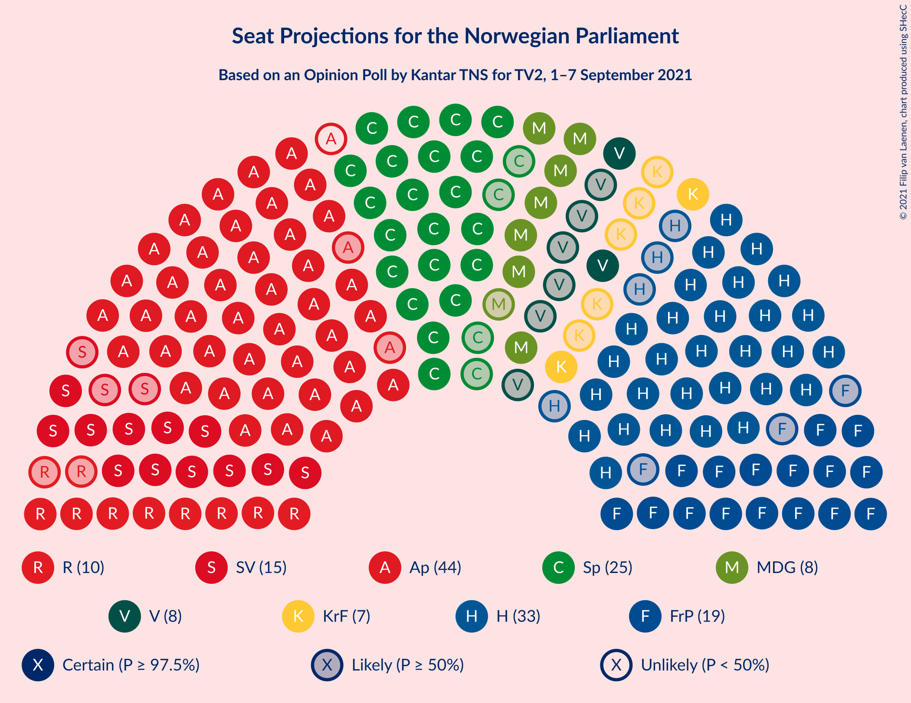
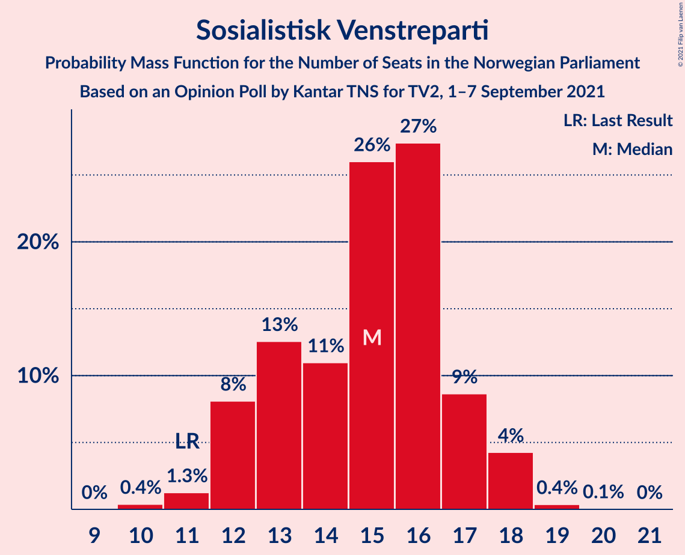

# Opinion Poll by Kantar TNS for TV2, 1–7 September 2021

<a href="#voting-intentions">Voting Intentions</a> | <a href="#seats">Seats</a> | <a href="#coalitions">Coalitions</a> | <a href="#technical-information">Technical Information</a>

## Voting Intentions

### Confidence Intervals

| Party | Last Result | Poll Result | 80% Confidence Interval | 90% Confidence Interval | 95% Confidence Interval | 99% Confidence Interval |
|:-----:|:-----------:|:-----------:|:-----------------------:|:-----------------------:|:-----------------------:|:-----------------------:|
| Arbeiderpartiet | 27.4% | 23.8% | 22.7–25.0% |22.3–25.3% |22.1–25.7% |21.5–26.2% |
| Høyre | 25.0% | 18.6% | 17.6–19.7% |17.3–20.0% |17.0–20.3% |16.5–20.8% |
| Senterpartiet | 10.3% | 13.8% | 12.9–14.8% |12.6–15.1% |12.4–15.3% |12.0–15.8% |
| Fremskrittspartiet | 15.2% | 11.1% | 10.3–12.0% |10.0–12.3% |9.8–12.5% |9.4–12.9% |
| Sosialistisk Venstreparti | 6.0% | 8.9% | 8.1–9.7% |7.9–10.0% |7.8–10.2% |7.4–10.6% |
| Rødt | 2.4% | 6.2% | 5.6–6.9% |5.4–7.1% |5.2–7.3% |5.0–7.6% |
| Miljøpartiet De Grønne | 3.2% | 5.0% | 4.4–5.6% |4.3–5.8% |4.1–6.0% |3.9–6.3% |
| Venstre | 4.4% | 4.8% | 4.3–5.5% |4.1–5.6% |4.0–5.8% |3.7–6.1% |
| Kristelig Folkeparti | 4.2% | 4.3% | 3.8–4.9% |3.6–5.1% |3.5–5.2% |3.3–5.5% |

*Note:* The poll result column reflects the actual value used in the calculations. Published results may vary slightly, and in addition be rounded to fewer digits.

## Seats

### Confidence Intervals

| Party | Last Result | Median | 80% Confidence Interval | 90% Confidence Interval | 95% Confidence Interval | 99% Confidence Interval |
|:-----:|:-----------:|:------:|:-----------------------:|:-----------------------:|:-----------------------:|:-----------------------:|
| <a href="#arbeiderpartiet">Arbeiderpartiet</a> | 49 | 43 | 41–46 |41–46 |41–47 |40–49 |
| <a href="#høyre">Høyre</a> | 45 | 33 | 30–36 |30–36 |29–36 |28–36 |
| <a href="#senterpartiet">Senterpartiet</a> | 19 | 25 | 22–28 |21–29 |21–30 |20–31 |
| <a href="#fremskrittspartiet">Fremskrittspartiet</a> | 27 | 19 | 17–21 |17–22 |16–23 |15–24 |
| <a href="#sosialistisk-venstreparti">Sosialistisk Venstreparti</a> | 11 | 15 | 13–17 |12–17 |12–18 |11–18 |
| <a href="#rødt">Rødt</a> | 1 | 10 | 9–12 |8–12 |8–12 |8–13 |
| <a href="#miljøpartiet-de-grønne">Miljøpartiet De Grønne</a> | 1 | 8 | 7–10 |7–10 |7–10 |2–11 |
| <a href="#venstre">Venstre</a> | 8 | 8 | 7–9 |6–9 |2–10 |2–10 |
| <a href="#kristelig-folkeparti">Kristelig Folkeparti</a> | 8 | 7 | 3–8 |3–9 |2–9 |2–10 |

### Arbeiderpartiet

*For a full overview of the results for this party, see the [Arbeiderpartiet](party-arbeiderpartiet.html) page.*

| Number of Seats | Probability | Accumulated | Special Marks |
|:---------------:|:-----------:|:-----------:|:-------------:|
| 39 | 0.1% | 100% |  |
| 40 | 0.8% | 99.9% |  |
| 41 | 13% | 99.1% |  |
| 42 | 19% | 86% |  |
| 43 | 17% | 67% | Median |
| 44 | 25% | 50% |  |
| 45 | 14% | 25% |  |
| 46 | 7% | 12% |  |
| 47 | 2% | 4% |  |
| 48 | 1.1% | 2% |  |
| 49 | 0.3% | 0.7% | Last Result |
| 50 | 0.4% | 0.4% |  |
| 51 | 0% | 0.1% |  |
| 52 | 0% | 0% |  |

### Høyre

*For a full overview of the results for this party, see the [Høyre](party-høyre.html) page.*

| Number of Seats | Probability | Accumulated | Special Marks |
|:---------------:|:-----------:|:-----------:|:-------------:|
| 28 | 2% | 100% |  |
| 29 | 2% | 98% |  |
| 30 | 7% | 96% |  |
| 31 | 11% | 89% |  |
| 32 | 12% | 79% |  |
| 33 | 26% | 67% | Median |
| 34 | 17% | 41% |  |
| 35 | 13% | 23% |  |
| 36 | 10% | 11% |  |
| 37 | 0.3% | 0.4% |  |
| 38 | 0.1% | 0.1% |  |
| 39 | 0% | 0% |  |
| 40 | 0% | 0% |  |
| 41 | 0% | 0% |  |
| 42 | 0% | 0% |  |
| 43 | 0% | 0% |  |
| 44 | 0% | 0% |  |
| 45 | 0% | 0% | Last Result |

### Senterpartiet

*For a full overview of the results for this party, see the [Senterpartiet](party-senterpartiet.html) page.*

| Number of Seats | Probability | Accumulated | Special Marks |
|:---------------:|:-----------:|:-----------:|:-------------:|
| 19 | 0% | 100% | Last Result |
| 20 | 0.6% | 100% |  |
| 21 | 5% | 99.4% |  |
| 22 | 5% | 95% |  |
| 23 | 15% | 90% |  |
| 24 | 15% | 75% |  |
| 25 | 30% | 60% | Median |
| 26 | 10% | 31% |  |
| 27 | 9% | 21% |  |
| 28 | 6% | 11% |  |
| 29 | 2% | 5% |  |
| 30 | 2% | 3% |  |
| 31 | 0.8% | 1.2% |  |
| 32 | 0.3% | 0.3% |  |
| 33 | 0% | 0% |  |

### Fremskrittspartiet

*For a full overview of the results for this party, see the [Fremskrittspartiet](party-fremskrittspartiet.html) page.*

| Number of Seats | Probability | Accumulated | Special Marks |
|:---------------:|:-----------:|:-----------:|:-------------:|
| 15 | 0.7% | 100% |  |
| 16 | 3% | 99.3% |  |
| 17 | 18% | 96% |  |
| 18 | 19% | 79% |  |
| 19 | 22% | 60% | Median |
| 20 | 20% | 38% |  |
| 21 | 9% | 18% |  |
| 22 | 5% | 9% |  |
| 23 | 3% | 4% |  |
| 24 | 0.7% | 0.8% |  |
| 25 | 0.1% | 0.1% |  |
| 26 | 0% | 0% |  |
| 27 | 0% | 0% | Last Result |

### Sosialistisk Venstreparti

*For a full overview of the results for this party, see the [Sosialistisk Venstreparti](party-sosialistiskvenstreparti.html) page.*

| Number of Seats | Probability | Accumulated | Special Marks |
|:---------------:|:-----------:|:-----------:|:-------------:|
| 10 | 0.4% | 100% |  |
| 11 | 1.3% | 99.6% | Last Result |
| 12 | 8% | 98% |  |
| 13 | 13% | 90% |  |
| 14 | 11% | 78% |  |
| 15 | 26% | 67% | Median |
| 16 | 27% | 41% |  |
| 17 | 9% | 13% |  |
| 18 | 4% | 5% |  |
| 19 | 0.4% | 0.4% |  |
| 20 | 0.1% | 0.1% |  |
| 21 | 0% | 0% |  |

### Rødt

*For a full overview of the results for this party, see the [Rødt](party-rødt.html) page.*

| Number of Seats | Probability | Accumulated | Special Marks |
|:---------------:|:-----------:|:-----------:|:-------------:|
| 1 | 0% | 100% | Last Result |
| 2 | 0% | 100% |  |
| 3 | 0% | 100% |  |
| 4 | 0% | 100% |  |
| 5 | 0% | 100% |  |
| 6 | 0% | 100% |  |
| 7 | 0.4% | 100% |  |
| 8 | 5% | 99.6% |  |
| 9 | 17% | 94% |  |
| 10 | 32% | 77% | Median |
| 11 | 34% | 45% |  |
| 12 | 9% | 11% |  |
| 13 | 2% | 2% |  |
| 14 | 0.1% | 0.1% |  |
| 15 | 0% | 0% |  |

### Miljøpartiet De Grønne

*For a full overview of the results for this party, see the [Miljøpartiet De Grønne](party-miljøpartietdegrønne.html) page.*

| Number of Seats | Probability | Accumulated | Special Marks |
|:---------------:|:-----------:|:-----------:|:-------------:|
| 1 | 0% | 100% | Last Result |
| 2 | 1.4% | 100% |  |
| 3 | 0% | 98.6% |  |
| 4 | 0% | 98.6% |  |
| 5 | 0% | 98.6% |  |
| 6 | 0.9% | 98.6% |  |
| 7 | 24% | 98% |  |
| 8 | 34% | 74% | Median |
| 9 | 30% | 40% |  |
| 10 | 10% | 11% |  |
| 11 | 1.1% | 1.2% |  |
| 12 | 0.1% | 0.1% |  |
| 13 | 0% | 0% |  |

### Venstre

*For a full overview of the results for this party, see the [Venstre](party-venstre.html) page.*

| Number of Seats | Probability | Accumulated | Special Marks |
|:---------------:|:-----------:|:-----------:|:-------------:|
| 2 | 3% | 100% |  |
| 3 | 0.1% | 97% |  |
| 4 | 0% | 97% |  |
| 5 | 0% | 97% |  |
| 6 | 2% | 97% |  |
| 7 | 24% | 95% |  |
| 8 | 43% | 71% | Last Result, Median |
| 9 | 23% | 28% |  |
| 10 | 5% | 5% |  |
| 11 | 0.3% | 0.3% |  |
| 12 | 0% | 0% |  |

### Kristelig Folkeparti

*For a full overview of the results for this party, see the [Kristelig Folkeparti](party-kristeligfolkeparti.html) page.*

| Number of Seats | Probability | Accumulated | Special Marks |
|:---------------:|:-----------:|:-----------:|:-------------:|
| 1 | 0.1% | 100% |  |
| 2 | 3% | 99.9% |  |
| 3 | 23% | 97% |  |
| 4 | 0% | 74% |  |
| 5 | 0% | 74% |  |
| 6 | 8% | 74% |  |
| 7 | 31% | 65% | Median |
| 8 | 28% | 34% | Last Result |
| 9 | 6% | 7% |  |
| 10 | 0.7% | 0.7% |  |
| 11 | 0% | 0% |  |

## Coalitions

### Confidence Intervals

| Coalition | Last Result | Median | Majority? | 80% Confidence Interval | 90% Confidence Interval | 95% Confidence Interval | 99% Confidence Interval |
|:---------:|:-----------:|:------:|:---------:|:-----------------------:|:-----------------------:|:-----------------------:|:-----------------------:|
| Arbeiderpartiet – Senterpartiet – Sosialistisk Venstreparti – Rødt – Miljøpartiet De Grønne | 81 | 102 | 100% | 98–106 | 96–107 | 96–108 | 94–109 |
| Arbeiderpartiet – Senterpartiet – Sosialistisk Venstreparti – Miljøpartiet De Grønne – Kristelig Folkeparti | 88 | 97 | 100% | 94–102 | 93–103 | 92–103 | 90–105 |
| Arbeiderpartiet – Senterpartiet – Sosialistisk Venstreparti – Rødt | 80 | 93 | 100% | 90–97 | 89–98 | 88–99 | 87–101 |
| Arbeiderpartiet – Senterpartiet – Sosialistisk Venstreparti – Miljøpartiet De Grønne | 80 | 91 | 99.6% | 88–95 | 87–96 | 86–97 | 85–98 |
| Høyre – Senterpartiet – Fremskrittspartiet – Venstre – Kristelig Folkeparti | 107 | 91 | 98% | 87–95 | 86–96 | 85–97 | 83–97 |
| Arbeiderpartiet – Senterpartiet – Sosialistisk Venstreparti | 79 | 83 | 30% | 80–86 | 79–88 | 79–89 | 78–90 |
| Arbeiderpartiet – Senterpartiet – Miljøpartiet De Grønne – Kristelig Folkeparti | 77 | 82 | 26% | 79–87 | 78–89 | 77–89 | 75–91 |
| Arbeiderpartiet – Sosialistisk Venstreparti – Rødt – Miljøpartiet De Grønne | 62 | 77 | 0.2% | 73–81 | 72–82 | 71–82 | 70–84 |
| Arbeiderpartiet – Senterpartiet – Kristelig Folkeparti | 76 | 74 | 0% | 71–79 | 70–80 | 68–81 | 66–82 |
| Høyre – Fremskrittspartiet – Miljøpartiet De Grønne – Venstre – Kristelig Folkeparti | 89 | 75 | 0% | 71–78 | 69–79 | 68–79 | 66–81 |
| Arbeiderpartiet – Senterpartiet | 68 | 68 | 0% | 65–72 | 65–73 | 64–74 | 62–75 |
| Høyre – Fremskrittspartiet – Venstre – Kristelig Folkeparti | 88 | 66 | 0% | 63–70 | 61–71 | 60–72 | 57–73 |
| Høyre – Fremskrittspartiet – Venstre | 80 | 60 | 0% | 57–63 | 56–64 | 55–64 | 53–66 |
| Arbeiderpartiet – Sosialistisk Venstreparti | 60 | 58 | 0% | 56–61 | 55–62 | 55–63 | 54–63 |
| Høyre – Fremskrittspartiet | 72 | 52 | 0% | 49–55 | 48–56 | 47–57 | 46–58 |
| Høyre – Venstre – Kristelig Folkeparti | 61 | 48 | 0% | 43–50 | 42–51 | 41–52 | 38–53 |
| Senterpartiet – Venstre – Kristelig Folkeparti | 35 | 39 | 0% | 35–43 | 34–44 | 33–45 | 30–46 |

### Arbeiderpartiet – Senterpartiet – Sosialistisk Venstreparti – Rødt – Miljøpartiet De Grønne

| Number of Seats | Probability | Accumulated | Special Marks |
|:---------------:|:-----------:|:-----------:|:-------------:|
| 81 | 0% | 100% | Last Result |
| 82 | 0% | 100% |  |
| 83 | 0% | 100% |  |
| 84 | 0% | 100% |  |
| 85 | 0% | 100% | Majority |
| 86 | 0% | 100% |  |
| 87 | 0% | 100% |  |
| 88 | 0% | 100% |  |
| 89 | 0% | 100% |  |
| 90 | 0% | 100% |  |
| 91 | 0% | 100% |  |
| 92 | 0.1% | 100% |  |
| 93 | 0.3% | 99.9% |  |
| 94 | 0.7% | 99.6% |  |
| 95 | 1.0% | 99.0% |  |
| 96 | 3% | 98% |  |
| 97 | 4% | 95% |  |
| 98 | 6% | 91% |  |
| 99 | 5% | 85% |  |
| 100 | 18% | 79% |  |
| 101 | 8% | 62% | Median |
| 102 | 13% | 54% |  |
| 103 | 10% | 41% |  |
| 104 | 9% | 31% |  |
| 105 | 11% | 22% |  |
| 106 | 6% | 11% |  |
| 107 | 3% | 6% |  |
| 108 | 2% | 3% |  |
| 109 | 0.5% | 1.0% |  |
| 110 | 0.3% | 0.4% |  |
| 111 | 0.1% | 0.1% |  |
| 112 | 0% | 0% |  |

### Arbeiderpartiet – Senterpartiet – Sosialistisk Venstreparti – Miljøpartiet De Grønne – Kristelig Folkeparti

| Number of Seats | Probability | Accumulated | Special Marks |
|:---------------:|:-----------:|:-----------:|:-------------:|
| 88 | 0.1% | 100% | Last Result |
| 89 | 0.3% | 99.9% |  |
| 90 | 0.2% | 99.6% |  |
| 91 | 0.7% | 99.4% |  |
| 92 | 1.3% | 98.7% |  |
| 93 | 3% | 97% |  |
| 94 | 8% | 95% |  |
| 95 | 8% | 87% |  |
| 96 | 11% | 78% |  |
| 97 | 19% | 68% |  |
| 98 | 11% | 49% | Median |
| 99 | 12% | 38% |  |
| 100 | 9% | 27% |  |
| 101 | 7% | 17% |  |
| 102 | 5% | 10% |  |
| 103 | 4% | 6% |  |
| 104 | 1.1% | 2% |  |
| 105 | 0.7% | 0.9% |  |
| 106 | 0.2% | 0.2% |  |
| 107 | 0% | 0% |  |

### Arbeiderpartiet – Senterpartiet – Sosialistisk Venstreparti – Rødt

| Number of Seats | Probability | Accumulated | Special Marks |
|:---------------:|:-----------:|:-----------:|:-------------:|
| 80 | 0% | 100% | Last Result |
| 81 | 0% | 100% |  |
| 82 | 0% | 100% |  |
| 83 | 0% | 100% |  |
| 84 | 0% | 100% |  |
| 85 | 0.1% | 100% | Majority |
| 86 | 0.3% | 99.9% |  |
| 87 | 0.6% | 99.6% |  |
| 88 | 2% | 99.0% |  |
| 89 | 5% | 97% |  |
| 90 | 6% | 92% |  |
| 91 | 4% | 86% |  |
| 92 | 12% | 82% |  |
| 93 | 23% | 70% | Median |
| 94 | 13% | 47% |  |
| 95 | 10% | 34% |  |
| 96 | 11% | 24% |  |
| 97 | 5% | 13% |  |
| 98 | 4% | 8% |  |
| 99 | 2% | 4% |  |
| 100 | 1.2% | 2% |  |
| 101 | 0.5% | 0.6% |  |
| 102 | 0.1% | 0.1% |  |
| 103 | 0.1% | 0.1% |  |
| 104 | 0% | 0% |  |

### Arbeiderpartiet – Senterpartiet – Sosialistisk Venstreparti – Miljøpartiet De Grønne

| Number of Seats | Probability | Accumulated | Special Marks |
|:---------------:|:-----------:|:-----------:|:-------------:|
| 80 | 0% | 100% | Last Result |
| 81 | 0% | 100% |  |
| 82 | 0% | 100% |  |
| 83 | 0.1% | 99.9% |  |
| 84 | 0.2% | 99.9% |  |
| 85 | 1.4% | 99.6% | Majority |
| 86 | 1.3% | 98% |  |
| 87 | 4% | 97% |  |
| 88 | 8% | 93% |  |
| 89 | 13% | 84% |  |
| 90 | 8% | 72% |  |
| 91 | 15% | 64% | Median |
| 92 | 11% | 49% |  |
| 93 | 10% | 38% |  |
| 94 | 14% | 28% |  |
| 95 | 6% | 13% |  |
| 96 | 3% | 7% |  |
| 97 | 3% | 4% |  |
| 98 | 0.5% | 1.0% |  |
| 99 | 0.3% | 0.5% |  |
| 100 | 0.1% | 0.2% |  |
| 101 | 0% | 0% |  |

### Høyre – Senterpartiet – Fremskrittspartiet – Venstre – Kristelig Folkeparti

| Number of Seats | Probability | Accumulated | Special Marks |
|:---------------:|:-----------:|:-----------:|:-------------:|
| 81 | 0.1% | 100% |  |
| 82 | 0.3% | 99.9% |  |
| 83 | 0.3% | 99.6% |  |
| 84 | 0.9% | 99.3% |  |
| 85 | 2% | 98% | Majority |
| 86 | 4% | 96% |  |
| 87 | 5% | 92% |  |
| 88 | 6% | 87% |  |
| 89 | 15% | 81% |  |
| 90 | 11% | 66% |  |
| 91 | 8% | 55% |  |
| 92 | 9% | 47% | Median |
| 93 | 6% | 37% |  |
| 94 | 18% | 31% |  |
| 95 | 7% | 13% |  |
| 96 | 3% | 6% |  |
| 97 | 3% | 3% |  |
| 98 | 0.2% | 0.3% |  |
| 99 | 0.1% | 0.1% |  |
| 100 | 0% | 0% |  |
| 101 | 0% | 0% |  |
| 102 | 0% | 0% |  |
| 103 | 0% | 0% |  |
| 104 | 0% | 0% |  |
| 105 | 0% | 0% |  |
| 106 | 0% | 0% |  |
| 107 | 0% | 0% | Last Result |

### Arbeiderpartiet – Senterpartiet – Sosialistisk Venstreparti

| Number of Seats | Probability | Accumulated | Special Marks |
|:---------------:|:-----------:|:-----------:|:-------------:|
| 76 | 0.1% | 100% |  |
| 77 | 0.3% | 99.8% |  |
| 78 | 1.3% | 99.6% |  |
| 79 | 4% | 98% | Last Result |
| 80 | 7% | 94% |  |
| 81 | 6% | 87% |  |
| 82 | 21% | 81% |  |
| 83 | 18% | 60% | Median |
| 84 | 12% | 42% |  |
| 85 | 13% | 30% | Majority |
| 86 | 7% | 17% |  |
| 87 | 4% | 10% |  |
| 88 | 3% | 6% |  |
| 89 | 3% | 3% |  |
| 90 | 0.5% | 0.7% |  |
| 91 | 0.1% | 0.1% |  |
| 92 | 0% | 0% |  |

### Arbeiderpartiet – Senterpartiet – Miljøpartiet De Grønne – Kristelig Folkeparti

| Number of Seats | Probability | Accumulated | Special Marks |
|:---------------:|:-----------:|:-----------:|:-------------:|
| 73 | 0.2% | 100% |  |
| 74 | 0.2% | 99.8% |  |
| 75 | 0.3% | 99.5% |  |
| 76 | 0.8% | 99.2% |  |
| 77 | 2% | 98% | Last Result |
| 78 | 2% | 96% |  |
| 79 | 6% | 94% |  |
| 80 | 7% | 88% |  |
| 81 | 12% | 81% |  |
| 82 | 20% | 69% |  |
| 83 | 15% | 48% | Median |
| 84 | 7% | 33% |  |
| 85 | 7% | 26% | Majority |
| 86 | 7% | 19% |  |
| 87 | 2% | 12% |  |
| 88 | 5% | 10% |  |
| 89 | 3% | 5% |  |
| 90 | 1.1% | 2% |  |
| 91 | 0.4% | 0.5% |  |
| 92 | 0.1% | 0.1% |  |
| 93 | 0% | 0% |  |

### Arbeiderpartiet – Sosialistisk Venstreparti – Rødt – Miljøpartiet De Grønne

| Number of Seats | Probability | Accumulated | Special Marks |
|:---------------:|:-----------:|:-----------:|:-------------:|
| 62 | 0% | 100% | Last Result |
| 63 | 0% | 100% |  |
| 64 | 0% | 100% |  |
| 65 | 0% | 100% |  |
| 66 | 0% | 100% |  |
| 67 | 0.1% | 100% |  |
| 68 | 0.2% | 99.9% |  |
| 69 | 0.2% | 99.8% |  |
| 70 | 1.2% | 99.6% |  |
| 71 | 2% | 98% |  |
| 72 | 6% | 97% |  |
| 73 | 4% | 91% |  |
| 74 | 9% | 87% |  |
| 75 | 18% | 79% |  |
| 76 | 7% | 60% | Median |
| 77 | 12% | 53% |  |
| 78 | 6% | 41% |  |
| 79 | 11% | 35% |  |
| 80 | 14% | 24% |  |
| 81 | 5% | 11% |  |
| 82 | 4% | 5% |  |
| 83 | 1.1% | 2% |  |
| 84 | 0.4% | 0.5% |  |
| 85 | 0.1% | 0.2% | Majority |
| 86 | 0% | 0% |  |

### Arbeiderpartiet – Senterpartiet – Kristelig Folkeparti

| Number of Seats | Probability | Accumulated | Special Marks |
|:---------------:|:-----------:|:-----------:|:-------------:|
| 65 | 0.2% | 100% |  |
| 66 | 0.3% | 99.8% |  |
| 67 | 0.4% | 99.5% |  |
| 68 | 3% | 99.1% |  |
| 69 | 0.8% | 96% |  |
| 70 | 4% | 96% |  |
| 71 | 6% | 91% |  |
| 72 | 11% | 85% |  |
| 73 | 8% | 75% |  |
| 74 | 17% | 67% |  |
| 75 | 16% | 50% | Median |
| 76 | 8% | 34% | Last Result |
| 77 | 7% | 26% |  |
| 78 | 5% | 18% |  |
| 79 | 6% | 13% |  |
| 80 | 2% | 7% |  |
| 81 | 2% | 4% |  |
| 82 | 2% | 2% |  |
| 83 | 0.3% | 0.5% |  |
| 84 | 0.1% | 0.1% |  |
| 85 | 0% | 0% | Majority |

### Høyre – Fremskrittspartiet – Miljøpartiet De Grønne – Venstre – Kristelig Folkeparti

| Number of Seats | Probability | Accumulated | Special Marks |
|:---------------:|:-----------:|:-----------:|:-------------:|
| 63 | 0.1% | 100% |  |
| 64 | 0% | 99.9% |  |
| 65 | 0.2% | 99.9% |  |
| 66 | 0.6% | 99.7% |  |
| 67 | 0.7% | 99.1% |  |
| 68 | 2% | 98% |  |
| 69 | 2% | 97% |  |
| 70 | 4% | 95% |  |
| 71 | 7% | 91% |  |
| 72 | 6% | 84% |  |
| 73 | 12% | 78% |  |
| 74 | 13% | 66% |  |
| 75 | 13% | 53% | Median |
| 76 | 21% | 40% |  |
| 77 | 9% | 19% |  |
| 78 | 3% | 10% |  |
| 79 | 5% | 7% |  |
| 80 | 2% | 2% |  |
| 81 | 0.4% | 0.7% |  |
| 82 | 0.2% | 0.3% |  |
| 83 | 0% | 0.1% |  |
| 84 | 0% | 0% |  |
| 85 | 0% | 0% | Majority |
| 86 | 0% | 0% |  |
| 87 | 0% | 0% |  |
| 88 | 0% | 0% |  |
| 89 | 0% | 0% | Last Result |

### Arbeiderpartiet – Senterpartiet

| Number of Seats | Probability | Accumulated | Special Marks |
|:---------------:|:-----------:|:-----------:|:-------------:|
| 62 | 0.5% | 100% |  |
| 63 | 0.9% | 99.5% |  |
| 64 | 3% | 98.6% |  |
| 65 | 7% | 95% |  |
| 66 | 8% | 88% |  |
| 67 | 21% | 79% |  |
| 68 | 12% | 58% | Last Result, Median |
| 69 | 18% | 46% |  |
| 70 | 8% | 28% |  |
| 71 | 8% | 20% |  |
| 72 | 5% | 11% |  |
| 73 | 2% | 6% |  |
| 74 | 3% | 5% |  |
| 75 | 1.0% | 1.4% |  |
| 76 | 0.3% | 0.4% |  |
| 77 | 0% | 0.1% |  |
| 78 | 0% | 0% |  |

### Høyre – Fremskrittspartiet – Venstre – Kristelig Folkeparti

| Number of Seats | Probability | Accumulated | Special Marks |
|:---------------:|:-----------:|:-----------:|:-------------:|
| 56 | 0.2% | 100% |  |
| 57 | 0.5% | 99.8% |  |
| 58 | 0.1% | 99.3% |  |
| 59 | 0.6% | 99.2% |  |
| 60 | 2% | 98.5% |  |
| 61 | 2% | 97% |  |
| 62 | 4% | 94% |  |
| 63 | 8% | 90% |  |
| 64 | 12% | 82% |  |
| 65 | 11% | 70% |  |
| 66 | 11% | 59% |  |
| 67 | 14% | 48% | Median |
| 68 | 7% | 34% |  |
| 69 | 14% | 26% |  |
| 70 | 4% | 12% |  |
| 71 | 4% | 7% |  |
| 72 | 2% | 3% |  |
| 73 | 1.2% | 1.3% |  |
| 74 | 0.1% | 0.1% |  |
| 75 | 0.1% | 0.1% |  |
| 76 | 0% | 0% |  |
| 77 | 0% | 0% |  |
| 78 | 0% | 0% |  |
| 79 | 0% | 0% |  |
| 80 | 0% | 0% |  |
| 81 | 0% | 0% |  |
| 82 | 0% | 0% |  |
| 83 | 0% | 0% |  |
| 84 | 0% | 0% |  |
| 85 | 0% | 0% | Majority |
| 86 | 0% | 0% |  |
| 87 | 0% | 0% |  |
| 88 | 0% | 0% | Last Result |

### Høyre – Fremskrittspartiet – Venstre

| Number of Seats | Probability | Accumulated | Special Marks |
|:---------------:|:-----------:|:-----------:|:-------------:|
| 51 | 0% | 100% |  |
| 52 | 0.2% | 99.9% |  |
| 53 | 0.7% | 99.8% |  |
| 54 | 1.1% | 99.0% |  |
| 55 | 2% | 98% |  |
| 56 | 5% | 96% |  |
| 57 | 10% | 91% |  |
| 58 | 7% | 81% |  |
| 59 | 15% | 74% |  |
| 60 | 12% | 59% | Median |
| 61 | 23% | 47% |  |
| 62 | 7% | 24% |  |
| 63 | 11% | 17% |  |
| 64 | 5% | 7% |  |
| 65 | 1.2% | 2% |  |
| 66 | 0.7% | 0.8% |  |
| 67 | 0.1% | 0.1% |  |
| 68 | 0.1% | 0.1% |  |
| 69 | 0% | 0% |  |
| 70 | 0% | 0% |  |
| 71 | 0% | 0% |  |
| 72 | 0% | 0% |  |
| 73 | 0% | 0% |  |
| 74 | 0% | 0% |  |
| 75 | 0% | 0% |  |
| 76 | 0% | 0% |  |
| 77 | 0% | 0% |  |
| 78 | 0% | 0% |  |
| 79 | 0% | 0% |  |
| 80 | 0% | 0% | Last Result |

### Arbeiderpartiet – Sosialistisk Venstreparti

| Number of Seats | Probability | Accumulated | Special Marks |
|:---------------:|:-----------:|:-----------:|:-------------:|
| 52 | 0% | 100% |  |
| 53 | 0.3% | 99.9% |  |
| 54 | 2% | 99.7% |  |
| 55 | 4% | 98% |  |
| 56 | 11% | 93% |  |
| 57 | 23% | 83% |  |
| 58 | 12% | 60% | Median |
| 59 | 14% | 47% |  |
| 60 | 22% | 34% | Last Result |
| 61 | 5% | 12% |  |
| 62 | 4% | 7% |  |
| 63 | 2% | 3% |  |
| 64 | 0.3% | 0.5% |  |
| 65 | 0.1% | 0.2% |  |
| 66 | 0% | 0% |  |

### Høyre – Fremskrittspartiet

| Number of Seats | Probability | Accumulated | Special Marks |
|:---------------:|:-----------:|:-----------:|:-------------:|
| 45 | 0.2% | 100% |  |
| 46 | 0.8% | 99.8% |  |
| 47 | 2% | 99.0% |  |
| 48 | 5% | 97% |  |
| 49 | 10% | 92% |  |
| 50 | 8% | 83% |  |
| 51 | 10% | 75% |  |
| 52 | 22% | 65% | Median |
| 53 | 16% | 43% |  |
| 54 | 13% | 28% |  |
| 55 | 8% | 15% |  |
| 56 | 3% | 7% |  |
| 57 | 3% | 4% |  |
| 58 | 0.8% | 0.9% |  |
| 59 | 0.1% | 0.1% |  |
| 60 | 0% | 0% |  |
| 61 | 0% | 0% |  |
| 62 | 0% | 0% |  |
| 63 | 0% | 0% |  |
| 64 | 0% | 0% |  |
| 65 | 0% | 0% |  |
| 66 | 0% | 0% |  |
| 67 | 0% | 0% |  |
| 68 | 0% | 0% |  |
| 69 | 0% | 0% |  |
| 70 | 0% | 0% |  |
| 71 | 0% | 0% |  |
| 72 | 0% | 0% | Last Result |

### Høyre – Venstre – Kristelig Folkeparti

| Number of Seats | Probability | Accumulated | Special Marks |
|:---------------:|:-----------:|:-----------:|:-------------:|
| 36 | 0% | 100% |  |
| 37 | 0.1% | 99.9% |  |
| 38 | 0.5% | 99.9% |  |
| 39 | 0.3% | 99.4% |  |
| 40 | 0.3% | 99.1% |  |
| 41 | 1.4% | 98.7% |  |
| 42 | 3% | 97% |  |
| 43 | 7% | 95% |  |
| 44 | 6% | 88% |  |
| 45 | 10% | 82% |  |
| 46 | 10% | 72% |  |
| 47 | 9% | 62% |  |
| 48 | 13% | 53% | Median |
| 49 | 20% | 40% |  |
| 50 | 12% | 20% |  |
| 51 | 5% | 8% |  |
| 52 | 2% | 3% |  |
| 53 | 0.6% | 0.7% |  |
| 54 | 0.1% | 0.1% |  |
| 55 | 0% | 0% |  |
| 56 | 0% | 0% |  |
| 57 | 0% | 0% |  |
| 58 | 0% | 0% |  |
| 59 | 0% | 0% |  |
| 60 | 0% | 0% |  |
| 61 | 0% | 0% | Last Result |

### Senterpartiet – Venstre – Kristelig Folkeparti

| Number of Seats | Probability | Accumulated | Special Marks |
|:---------------:|:-----------:|:-----------:|:-------------:|
| 29 | 0.1% | 100% |  |
| 30 | 0.4% | 99.9% |  |
| 31 | 0.1% | 99.4% |  |
| 32 | 0.4% | 99.3% |  |
| 33 | 2% | 98.9% |  |
| 34 | 5% | 97% |  |
| 35 | 5% | 92% | Last Result |
| 36 | 5% | 87% |  |
| 37 | 15% | 82% |  |
| 38 | 12% | 67% |  |
| 39 | 7% | 55% |  |
| 40 | 11% | 47% | Median |
| 41 | 15% | 36% |  |
| 42 | 9% | 21% |  |
| 43 | 6% | 12% |  |
| 44 | 2% | 6% |  |
| 45 | 2% | 4% |  |
| 46 | 2% | 2% |  |
| 47 | 0.3% | 0.4% |  |
| 48 | 0.1% | 0.1% |  |
| 49 | 0% | 0% |  |

## Technical Information

### Opinion Poll

+ **Polling firm:** Kantar TNS
+ **Commissioner(s):** TV2
+ **Fieldwork period:** 1–7 September 2021

### Calculations

+ **Sample size:** 2184
+ **Simulations done:** 1,048,576
+ **Error estimate:** 1.01%

